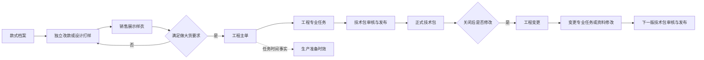
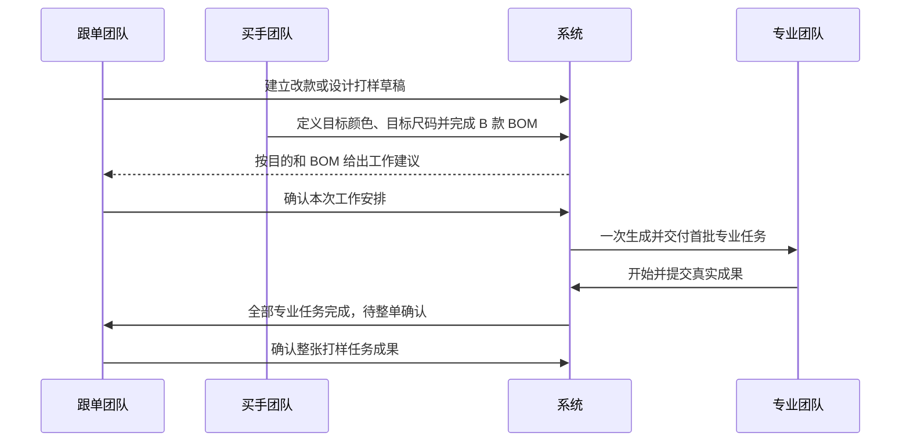
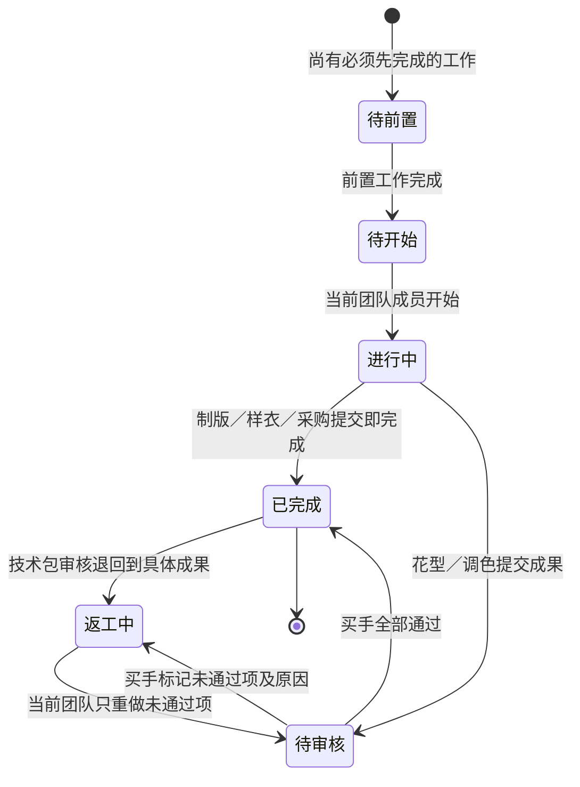
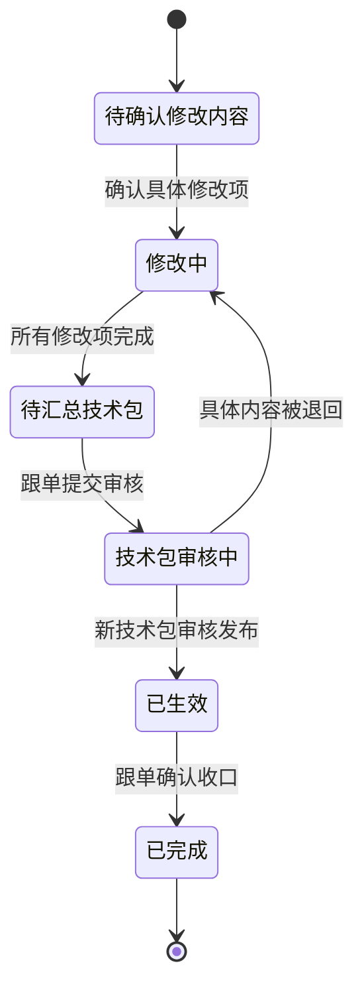
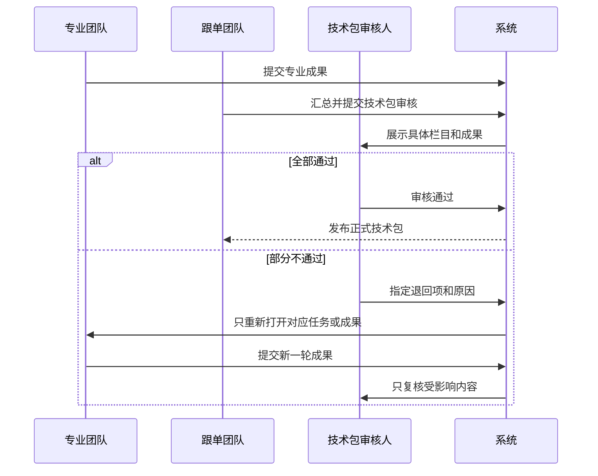

# PCS 生产工程管理总体设计文档

| 文档信息 | 内容 |
| --- | --- |
| 版本 | V4.2 |
| 日期 | 2026-08-12 |
| 状态 | V4.2 当前分支已实现并验证；待提交、推送和产品确认 |
| 权威调整基线 | 《PCS 生产工程管理完整调整方案》V4.0、《PCS 改款打样目标颜色、BOM 与团队分步调整方案》V4.1、2026-08-12 删除“技术包模板库”的产品确认 |
| 适用范围 | 独立改款打样、独立设计打样、工程主单、BOM 与价格、专业任务、工程变更、技术包、生产准备时效 |

## 1. 目标与非目标

### 1.1 目标

建立一套业务人员能看懂、专业团队能顺畅接力、成果能进入正式技术包的生产工程管理体系：

1. 区分做大货前的独立打样、满足做大货条件后的工程主单、主单关闭后的工程变更。
2. 区分用于直播销售的销售展示样衣与用于大货确认的产前版样衣。
3. 改款必须完整表达“基于 A 款做成 B 款”，并把新 BOM、成果和任务归到 B 款。
4. 一项工作先交给团队，团队实际操作后才记录具体操作人。
5. 制版、花型、调色、样衣、采购等都以真实业务内容和真实文件推进。
6. 工程变更直接修改具体 BOM、专业成果或技术资料，不再用抽象资料模块和一句成果说明代替真实工作。
7. 生产准备时效只读取工程主单任务的真实时间，不创建第二套任务。

### 1.2 非目标

1. 不恢复“我的工程任务”模块。
2. 不建立“待本团队处理、团队处理中”等团队专属状态体系，只提供“当前需处理的团队”筛选。
3. 不允许业务人员调整已经确认的任务依赖关系。
4. 不把销售展示样衣当作产前版样衣。
5. 不允许绕过工程主单或工程变更直接新增新业务技术包。
6. 不做历史任务迁移、历史技术包导入及其提示文案。
7. 不新增审批流，不允许取消工程主单任务；需要重做时在原任务中形成新一轮成果。
8. 不设置“技术包模板库”，也不保留对应菜单、路由、页面、Mock 或兼容入口。

## 2. V4.2 原子调整总表

| 编号 | 已确认业务规则 |
| --- | --- |
| ADJ-001 | 独立改款／设计打样、工程主单、工程变更是三条来源、目的和结果不同的路径。 |
| ADJ-002 | 独立打样产出“销售展示样衣”，工程主单产出“产前版样衣”，两者不得互相替代。 |
| ADJ-003 | 新建独立打样只建立业务单；进入详情后再确认本次需要完成的工作。 |
| ADJ-004 | 系统按打样目的、款式事实和 B 款 BOM 建议任务，跟单确认后一次生成。 |
| ADJ-005 | 改款先确认 A 款颜色如何对应 B 款颜色，再逐物料决定沿用、替换、重新染色、重新印花、不使用或新增。 |
| ADJ-006 | A 款最近一份已完成且已确认的 BOM 只作参考，不能直接成为 B 款 BOM。 |
| ADJ-007 | B 款每条物料都必须有处理结论；全部新成果归属于 B 款。 |
| ADJ-008 | 工作节点先确定当前处理团队，不在开始前指定个人。 |
| ADJ-009 | 只有真实动作发生后才记录实际操作人，不使用虚拟负责人。 |
| ADJ-010 | 所有列表保留统一业务状态，只增加一个“当前需处理的团队”筛选。 |
| ADJ-011 | 每个任务说明当前团队、当前动作、完成条件和完成后去向，满足条件后自动交给下一团队。 |
| ADJ-012 | 工程主单以表格展示任务、当前团队、当前动作、需要先完成、完成后去向、计划／实际和状态。 |
| ADJ-013 | 每类专业任务使用本专业字段、成果、审核和返工规则。 |
| ADJ-014 | 页面显示“需要先完成：产前版样衣”等业务名称，不展示内部依赖编号。 |
| ADJ-015 | 工程变更选择具体 BOM 行、颜色、纸样、花型、调色、样衣或技术资料内容。 |
| ADJ-016 | 只有需要专业制作的内容生成专业任务；普通技术资料直接在下一版技术包草稿维护。 |
| ADJ-017 | 工程变更生成的专业任务进入对应统一任务列表，并标明来源为工程变更。 |
| ADJ-018 | 工程变更任务由对应专业团队处理；BOM 由买手维护；跟单不能用一句说明代替专业成果。 |
| ADJ-019 | 工程变更采用六个业务状态：待确认修改内容、修改中、待汇总技术包、技术包审核中、已生效、已完成。 |
| ADJ-020 | 原主单与原正式技术包保持只读；变更任务形成新一轮工作和下一版技术包。 |
| ADJ-021 | 技术包退回指向具体 BOM 行、资料栏目、专业任务或成果项，只重做被退回内容。 |
| ADJ-022 | 生产准备时效只读取工程主单真实任务，展示团队及已发生的实际操作事实。 |
| ADJ-023 | 页面统一使用业务语言，不暴露“受影响资料模块、前置依赖、临时任务”等系统术语。 |
| ADJ-024 | Mock 覆盖 A→B 用料转换、多团队接力、并行、审核、返工和多版本变更。 |
| ADJ-025 | 总体设计、实施计划、追踪矩阵与验收记录共同使用 ADJ-001～042。 |
| ADJ-026 | 图片、纸样及附件必须通过真实文件选择产生；可查看、下载、追溯，失败或缺失时不得推进。 |
| ADJ-027 | 改款打样、设计打样的列表和详情骨架与制版等专业任务保持一致，保留各自业务差异。 |
| ADJ-028 | “列设置”只放在数据列表表头最右侧，页面标题区不重复出现。 |
| ADJ-029 | 新建改款／设计打样草稿时只建立业务单，目标颜色确认前 BOM 数量必须为 0。 |
| ADJ-030 | 买手定义本次目标颜色，颜色数量可少于、等于或多于来源款／目标款档案已有颜色。 |
| ADJ-031 | 每个目标颜色可明确参考一个 A 款颜色或选择无参考；同一 A 款颜色可供多个 B 款颜色参考。 |
| ADJ-032 | 目标颜色至少一个、去空格后名称不重复、必须选择目标尺码；颜色、SKU 与 BOM 按整组成功或整组回退。 |
| ADJ-033 | 买手确认 N 个目标颜色后，系统为 B 款建立 N 份一一对应的 BOM 与价格草稿。 |
| ADJ-034 | 有参考色只读取 A 款最近一份已完成确认或正式技术包 BOM；无参考色建立空白 BOM，不读取 B 款历史 BOM。 |
| ADJ-035 | 买手可在 B 款 BOM 中改、删、增物料；A 款 BOM 保持只读，带入行保留来源；重新按参考色生成必须明确确认。 |
| ADJ-036 | 改款／设计打样详情采用四步：新款资料准备、工作安排、专业工作、整单确认。 |
| ADJ-037 | 当前步骤和当前需处理团队由完成事实统一推导，完成当前步骤后自动交给下一团队。 |
| ADJ-038 | 当前步骤可操作，已完成步骤只读可回看，未来步骤锁定；跟单可在工作安排前写明原因退回买手。 |
| ADJ-039 | Mock 覆盖目标颜色少、目标颜色多、一对多、无参考、并行工作和已完成只读。 |
| ADJ-040 | 改款／设计列表与详情沿用制版等专业任务的标准列表、头部、当前动作、内容卡片和操作记录骨架。 |
| ADJ-041 | 新步骤中的图片、纸样和附件必须真实选择、读取、保存、失败阻断、预览和下载。 |
| ADJ-042 | 技术资料仅保留技术包、BOM 与价格、花型库和部位模板库；不设置技术包模板库，技术包结构直接来自工程主单或工程变更成果。 |

## 3. 业务对象与关系

| 对象 | 何时建立 | 归属对象 | 最终结果 |
| --- | --- | --- | --- |
| 独立改款打样 | 改款需要先制作销售展示样衣 | A 款作为参考，全部新事实归 B 款 | B 款 BOM 草稿、专业成果、销售展示样衣 |
| 独立设计打样 | 设计款需要先制作销售展示样衣 | 目标 SPU | 目标款 BOM 草稿、专业成果、销售展示样衣 |
| 工程主单 | 款式满足做大货要求；首单进入生产工程准备 | 目标 SPU；同一 SPU 仅一张未关闭主单 | 固定专业任务、正式技术包 |
| 工程变更 | 工程主单关闭后，正式技术资料需要修改 | 已关闭主单和当前正式技术包 | 变更任务、下一版正式技术包 |
| BOM 与价格 | 独立打样、工程主单或工程变更产生 | 对应目标 SPU 和业务单 | 草稿随业务推进，技术包生效时形成正式快照 |
| 专业任务 | 工作安排确认或工程变更确认后产生 | 来源业务单 + 目标 SPU | 可追溯的专业成果和实际操作事实 |
| 技术包 | 工程主单或工程变更汇总成果 | 目标 SPU | 经当前审核流程发布的正式版本 |
| 生产准备时效 | 工程主单发布后只读投影 | 工程主单 | 任务开始、提交、完成和耗时统计 |

## 4. 角色、团队与权限

| 角色／团队 | 主要责任 | 可操作内容 | 不可替代内容 |
| --- | --- | --- | --- |
| 跟单团队 | 建立业务单、确认工作安排、推动交接、汇总技术包、在系统校验后关闭主单 | 主单、独立打样、工程变更、颜色要求、团队衔接 | 不能维护 BOM，不能用一句说明完成专业任务 |
| 买手团队 | 维护 BOM 与价格、判断是否需要染色／印花、审核花型和调色成果 | 颜色对应、物料转换、BOM、成本、花型／调色审核 | 不能修改物料档案标准单价 |
| 版师团队 | 基码纸样、齐码纸样制作 | 真实纸样文件和专业参数 | 不能代替买手维护 BOM |
| 制作团队 | 销售展示样衣、产前版样衣制作 | 样衣信息、数量和真实照片 | 两种样衣不得混用 |
| 花型团队 | 花型制作和返工 | 花型图片、源文件、版本与说明 | 最终通过由买手确认 |
| 染厂团队 | 按已确认颜色要求完成调色 | 实际调色成果和色样 | 潘通色号和颜色名称由跟单确认；最终通过由买手确认 |
| 采购团队 | 在采购系统下单并回填采购单号 | 绑定采购单号并读取必要采购信息 | 不在 PCS 重复创建采购单 |

任务建立时只记录当前团队。团队成员点击开始、提交、审核或返工等真实动作时，系统记录实际操作人、所在团队、时间和轮次。

## 5. 独立改款与设计打样

### 5.1 创建

- 改款：A 款 SPU 和 B 款 SPU 均须已建档且不能相同；填写本次改款原因。
- 设计：目标 SPU 须已建档；不填写来源 SPU；填写本次设计原因。
- 创建只形成草稿业务单，不生成专业任务，也不提前建立 BOM。

### 5.2 新款资料准备

买手依次完成：

1. 定义本次真正要制作的新款颜色，不受 A 款或 B 款档案已有颜色数量限制；至少保留一个颜色。
2. 为每个目标颜色选择目标尺码，并明确选择一个 A 款参考颜色或“无参考颜色”；允许一个 A 款颜色对应多个 B 款颜色。
3. 系统整体校验颜色名称、尺码和 SKU；任一行失败时不留下部分 SKU 或部分 BOM。
4. 确认 N 个目标颜色后，为 B 款建立 N 份一一对应的 BOM 与价格草稿。
5. 有参考色时，只从该 A 款颜色最近一份已完成确认或正式技术包 BOM 填充；无参考色时建立空白 BOM。
6. 对带入的每条参考物料选择沿用、替换、重新染色、重新印花或不使用；B 款新增物料直接在 B 款 BOM 中维护。
7. 每条 B 款物料维护单位用量、打样数量、损耗率和工艺要求，系统计算 `单位用量 × 打样数量 ×（1 + 损耗率）`。
8. 买手完成资料准备后锁定颜色和 BOM，自动交给跟单；跟单在工作安排前可写明原因退回买手，退回后重新开放维护。

目标颜色只决定本次打样和对应 B 款 SKU 范围。买手在本任务中移除颜色，只移除当前任务对应的 BOM 草稿，不删除款式档案中已经建立的 SKU。若买手改了参考来源，系统不能静默覆盖已维护的 B 款 BOM；只有买手明确执行“重新按参考色生成”并确认后才重置。

标准单价始终从物料档案读取；缺少或失效时不得加入 BOM 或提交技术包审核。自定义费用作用于整个 SPU，可使用印尼盾；综合成本同时展示人民币、印尼盾和系统最新汇率。正式技术包生效时才冻结价格快照。

### 5.3 四步团队接力

| 步骤 | 当前团队 | 完成事实 | 下一步 |
| --- | --- | --- | --- |
| 新款资料准备 | 买手 | 目标颜色、目标尺码、B 款 BOM 与价格均完成 | 工作安排 |
| 工作安排 | 跟单 | 确认本次工作并一次生成专业任务 | 专业工作 |
| 专业工作 | 各专业团队 | 所有专业任务按固定依赖完成并通过适用审核 | 整单确认 |
| 整单确认 | 跟单 | 确认成果版本和整单说明 | 已完成 |

页面默认打开当前步骤；已完成步骤允许回看但不可修改，未来步骤不可进入。步骤推进与“当前需处理的团队”读取同一组完成事实，不允许分别手工维护。

### 5.4 工作安排

系统根据打样目的和 B 款 BOM 建议：

- 销售展示样衣：必做。
- 基码纸样：销售展示样衣需要纸样时自动补齐。
- 花型任务：BOM 存在印花需求时建议。
- 调色任务：BOM 存在线材或面料染色需求时建议，并按物料类别拆分。

跟单可以在适用范围内确认工作，但不能删除固定前置工作，也不能产生缺少前置的任务。确认后一次性生成任务骨架。

## 6. 工程主单

### 6.1 建立与唯一性

1. 系统在款式满足做大货要求时可以建立草稿；跟单也可以人工建立。
2. 两种方式建立后都必须由跟单确认工作安排。
3. 同一 SPU 只允许一张未关闭主单。
4. 系统建议与款式事实、生产准备类型和正式 BOM 一致；前置任务自动补齐。
5. 跟单确认后一次性生成任务并发布主单。

### 6.2 固定任务及依赖

| 任务 | 当前团队 | 启用条件 | 需要先完成 | 完成条件 | 完成后去向 |
| --- | --- | --- | --- | --- | --- |
| 梭织／毛织基码纸样 | 版师／毛织团队 | 按生产准备类型 | 无 | 提交真实纸样成果 | 产前版样衣 |
| 产前版样衣 | 制作团队 | 首单固定任务 | 适用的基码纸样 | 提交样衣信息和真实照片 | 齐码纸样、技术包 |
| 梭织／毛织齐码纸样 | 版师／毛织团队 | 按生产准备类型 | 产前版样衣 | 提交真实纸样成果 | 技术包 |
| 花型任务 | 花型团队 | BOM 有印花需求 | 固定关系确定 | 买手审核全部成果通过 | 技术包 |
| 调色任务（纱线／面料） | 染厂团队 | BOM 有对应染色需求 | 跟单先确认颜色要求 | 买手审核全部成果通过 | 技术包 |
| 辅料下单任务 | 采购团队 | BOM 有需采购辅料 | 固定关系确定 | 绑定有效采购单号 | 技术包 |
| 技术包确认任务 | 跟单团队 | 首单固定任务 | 所有适用前置任务 | 技术包通过当前审核流程并发布 | 主单待关闭 |

依赖关系由系统固定，业务人员不能编辑；选择后缺少前置时系统自动补齐。

### 6.3 主单任务表格

工程主单详情使用表格，列为：任务、当前团队、当前动作、需要先完成、完成后去向、计划／实际、状态、操作。并行任务在不同表格行中同时处于可开始状态，不用复杂泳道图表达。

## 7. 专业任务执行

### 7.1 通用衔接

每个任务详情首屏必须回答：当前由哪个团队处理、当前要做什么、需要先完成什么、完成后交给哪个团队。团队成员开始动作后，才显示该轮实际操作人。

### 7.2 任务专属成果

- 制版：纸样类型、适用部位／尺码、版本、真实 `.prj` 或允许的纸样文件、必要预览图。
- 销售展示样衣：目标款颜色、尺码、制作数量、引用纸样版本、真实样衣照片。
- 产前版样衣：生产前确认用的颜色、尺码、数量、引用纸样版本、真实样衣照片。
- 花型：可一张任务提交多项成果；每项包含名称、版本、位置、预览图及源文件。买手整张审核；未全部通过时逐项标记结果和原因。
- 调色：第一阶段读取 BOM 染色需求；第二阶段由跟单确认潘通色号、颜色名称等要求；第三阶段染厂提交真实色样，买手整张审核并逐项退回。
- 辅料下单：采购人员在采购系统下单，在 PCS 绑定采购单号；PCS 读取并展示必要信息。
- 技术包确认：汇总适用专业成果，进入现有技术包审核流程；不得手工直接完成。

### 7.3 真实上传

1. 上传入口必须由本地文件选择器打开。
2. 纸样源文件支持 `.prj`，并校验扩展名、大小和非空内容。
3. 图片保存后可查看高清大图；所有文件可下载。
4. 保存操作人、团队、时间、轮次和文件信息。
5. 选择失败、格式不符、文件为空、文件过大、读取失败或未保存时，立即提示并阻断提交；用户可重新选择。
6. 已提交轮次只读；返工建立新一轮，不覆盖旧文件。
7. 制版任务提交的 PRJ、DXF、RUL、PDF 及预览图必须以真实文件内容和文件信息进入任务成果，再原样进入技术包草稿；不得在任一环节退化为只有文件名。
8. 技术包成为正式版本时，冻结当时的真实文件内容、文件名、大小、上传团队、上传人和时间；之后物料或任务草稿变化不得改写正式版本。
9. 非图片文件明确显示“无图片预览”；历史记录缺少原文件或原图时显示“原文件缺失，请重新上传”，不得生成假预览、假下载文件或演示缩略图。

## 8. 工程变更

### 8.1 建立内容

工程变更以已关闭主单和当前正式技术包为基线。跟单选择具体修改项：

- BOM 与价格：具体颜色或物料行，由买手在下一版草稿直接维护。
- 纸样、花型、调色、产前版样衣：生成真实专业任务，由对应团队处理。
- 工艺、尺码、设计、附件、质量要求：在下一版技术包草稿对应栏目维护，不伪装成临时任务。

原主单任务和当前正式技术包永久只读；工程变更产生新一轮任务和唯一的下一版技术包草稿。

### 8.2 状态

工程变更产生的制版、花型、调色、样衣任务与主单产生的同类任务进入同一专业任务列表，通过“来源”和业务单号区分。

## 9. 技术包与返工

1. 技术包由工程主单或工程变更产生，继续使用当前买手、版师、跟单审核流程。
2. 正式版本包含 BOM 与价格；BOM 不是独立于技术包的另一套正式版本。
3. 提交审核前校验 BOM 标准单价、必需纸样、样衣、花型、调色、采购等适用成果。
4. 退回必须选择具体 BOM 行、技术资料栏目、专业任务或成果项并填写原因。
5. 被退回任务进入返工轮次，已通过的成果保持有效；重新提交后只复核受影响内容。
6. 全部审核通过并发布后形成正式快照；工程主单通过系统校验后由跟单人工关闭。
7. 技术资料菜单仅保留技术包、BOM 与价格、花型库和部位模板库；不设置独立技术包模板库。技术包结构直接汇总工程主单或工程变更的真实成果。

## 10. 生产准备时效

生产准备时效是工程主单的记录与统计线，不是第二套执行线：

1. 仅投影工程主单任务，不读取独立打样或工程变更任务。
2. 显示责任团队、实际开始、提交、审核和有效完成时间；未发生的时间保持为空。
3. 任务返工时保留首次完成和有效完成，耗时按已确认口径计算。
4. 页面只读，不允许新建、开始、完成、调整依赖或编辑任务。

## 11. 页面与交互

### 11.1 统一列表

工程主单、工程变更、改款打样、设计打样和各专业任务使用标准管理列表：摘要、筛选、列设置、分页、表格内部滚动和操作列。“新建”保留在页面标题区右侧；“列设置”只放在数据列表表头最右侧。改款／设计与制版页面统一标题、筛选、表格密度、详情头部、当前动作区、成果区、操作记录和反馈方式。

列表状态为正常业务状态；筛选区只提供一个“当前需处理的团队”，不新增团队专属状态或独立团队待办页。

### 11.2 图片

款式和物料必须展示与对象匹配的真实缩略图；缩略图可点击打开保持宽高比的高清大图，支持关闭按钮、遮罩和 `Esc`，并提供加载失败提示。

### 11.3 业务文案

| 不再使用 | 改为 |
| --- | --- |
| 系统建议专业任务 | 本次需要完成的工作 |
| 受影响资料模块 | 本次要修改的内容 |
| 前置依赖 | 需要先完成 |
| 负责人（未开始时） | 当前需处理的团队 |
| 版衣／销售展示样衣 | 销售展示样衣 |
| 版衣制作（用户可见） | 产前版样衣 |

## 12. Mock 场景要求

演示数据至少覆盖：

1. 改款与设计各 12 条，能够验证两页分页。
2. 草稿、待前置、待开始、进行中、待审核、返工中、已完成。
3. A 款颜色数大于、等于和小于本次 B 款目标颜色数。
4. A 款一个颜色对应 B 款多个颜色，以及 B 款新增颜色没有 A 款来源。
5. 物料沿用、替换、重新染色、重新印花、不使用、新增。
6. 梭织、毛织、混合和热转印准备类型。
7. 花型与调色多项成果、部分通过、部分退回。
8. 主单和工程变更产生同类专业任务，并在统一列表区分来源。
9. 技术包具体退回到 BOM 行、资料栏目、任务和成果项。
10. 真实图片、纸样、附件、实际操作人、轮次和操作日志。

## 13. 验收门禁

1. ADJ-001～042 均须在追踪矩阵中绑定实现位置和当前证据。
2. 正向追踪：设计规则能走到计划、代码、测试和页面证据。
3. 反向追踪：当前菜单、路由、页面、Mock 和测试都能回到已确认规则，不得出现越界入口。
4. 文件级专项契约、构建、标准列表治理和原型治理通过。
5. 当前分支命名页面实测列表、分页、筛选、状态推进、真实上传、缩略图大图、技术包退回与时效只读。
6. 最后一次修改后重新生成验证证据；历史截图或其他分支不能代替当前验收。

## 14. 最终业务结论

本期交付以三条业务路径、B 款事实归属、团队接力、真实专业成果、具体工程变更、技术包版本闭环和生产准备时效只读为核心。页面不再通过抽象模块、虚拟负责人、通用说明弹窗或花哨关系图制造“看似完整”；所有能推进状态的动作必须对应真实团队、真实成果、真实文件和可追溯操作事实。
