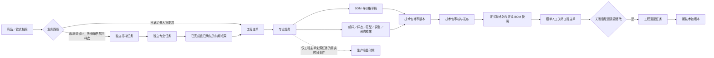
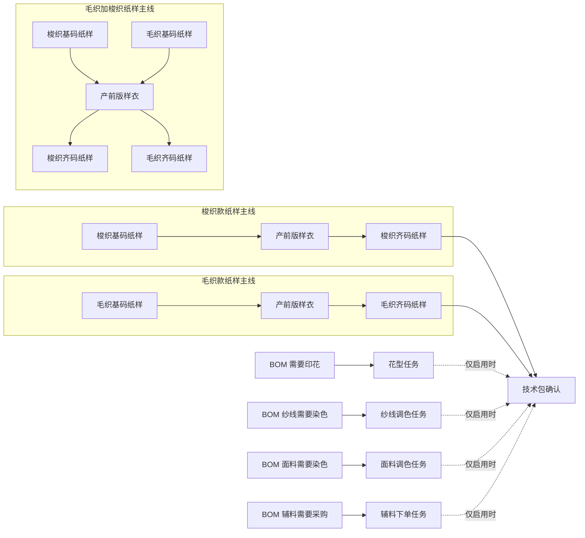
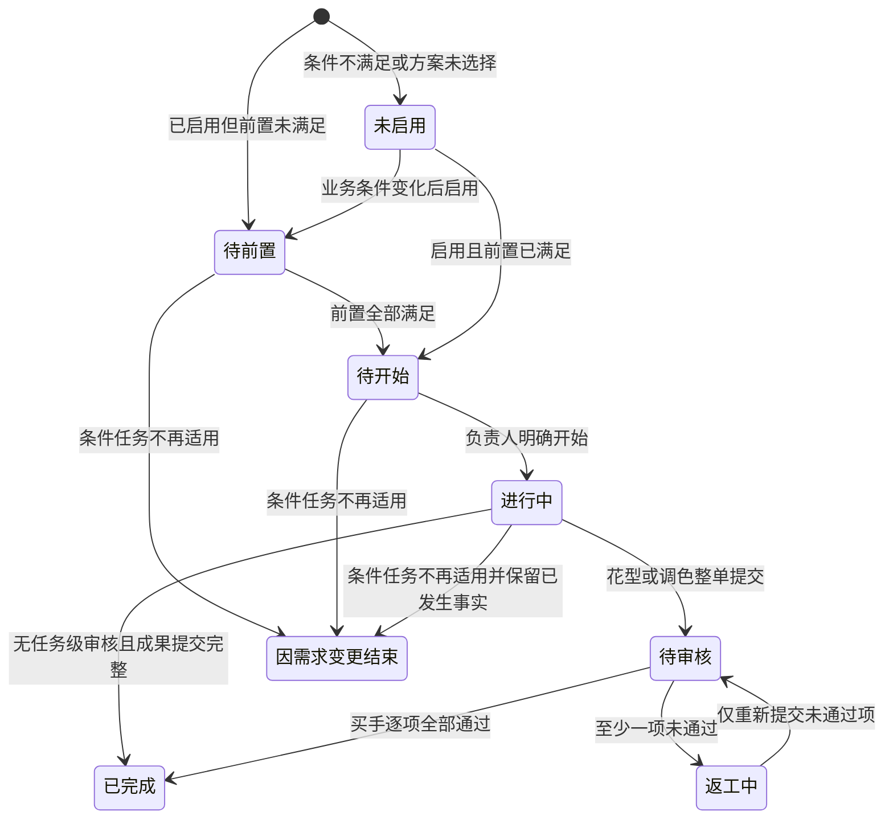
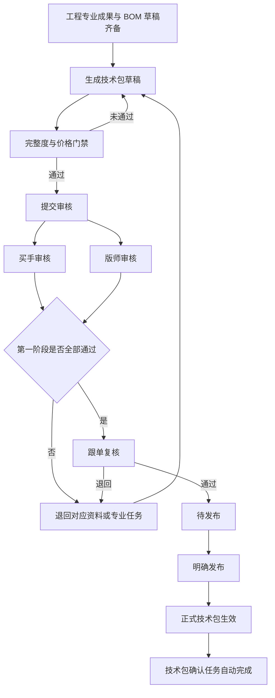
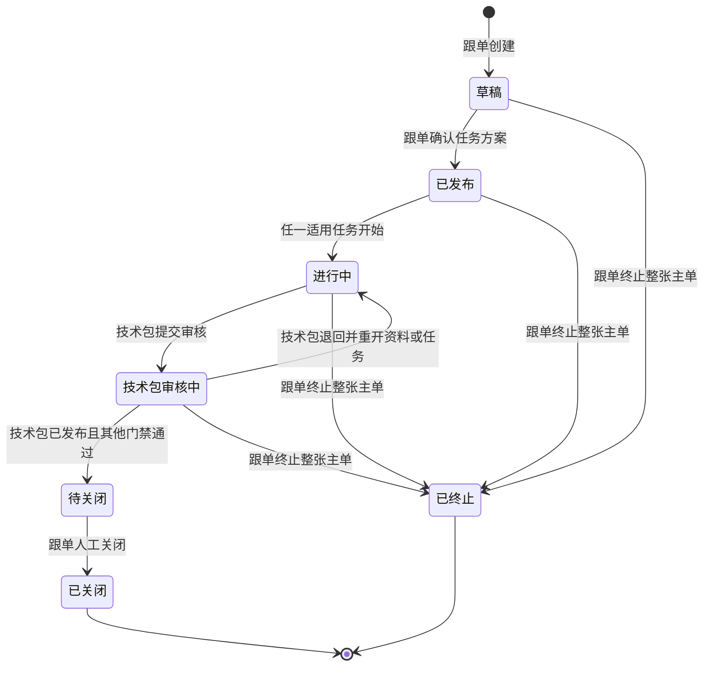
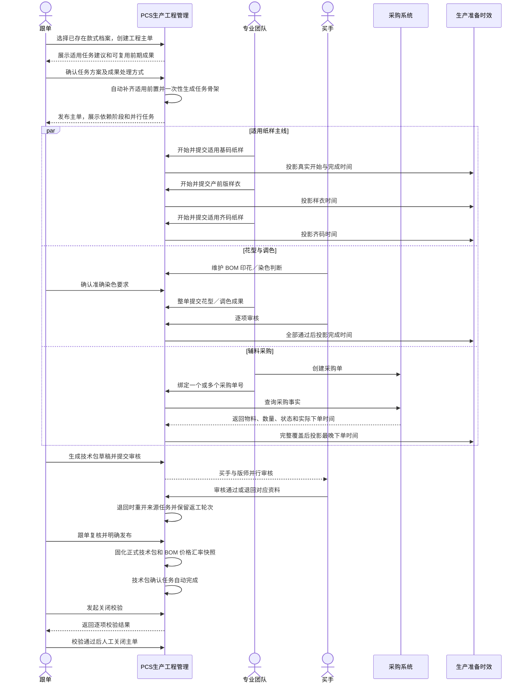

# PCS 生产工程管理总体设计文档

| 文档信息 | 内容 |
| --- | --- |
| 文档版本 | V2.0 |
| 文档状态 | 新版总体设计基线，供产品、研发、测试共同评审 |
| 适用系统 | 商品中心系统（PCS） |
| 适用模块 | 生产工程管理、技术资料、BOM 与价格、生产准备时效投影 |
| 主要角色 | 跟单、买手、版师、毛织团队、样衣制作团队、花型团队、染厂、采购人员、技术包审核人员 |
| 更新日期 | 2026-08-04 |

---

## 1. 文档定位

本文档是 PCS 生产工程管理的新版总体设计基线，用于统一业务边界、对象关系、任务适用规则、固定依赖、状态、页面、权限、时效和验收口径。

本文档同时吸收并纠正以下三类问题：

1. 旧设计或旧计划中已经不符合最新业务确认的内容。
2. 当前原型虽然已经有页面或数据结构，但业务动作、状态和门禁尚未真正闭环的内容。
3. 当前需求说明不够具体，导致研发无法判断任务产出、审核、返工、时效和页面动作的内容。

本文件生效后，旧设计、旧计划、旧测试或当前原型与本文档冲突的，以本文档为准。测试通过只代表当前测试契约通过；如果测试契约与本文档冲突，必须修改测试和实现，不能反过来用旧测试证明旧行为正确。

本文档描述产品与业务要求，不包含原型代码、接口或数据库设计。

配套文件：

- 《PCS 生产工程管理实施计划》：`docs/product-design/PCS生产工程管理实施计划.md`
- 《PCS 生产工程管理需求追踪与交付矩阵》：`docs/product-design/PCS生产工程管理需求追踪与交付矩阵.md`

研发、测试和产品验收必须以总体设计确定业务事实、以实施计划安排工作包、以追踪矩阵逐条登记实现与证据。三份文件必须同步更新，任一文件不能单独作为“已经全部实现”的证明。

---

## 2. 已确认的总体结论

1. 商品中心系统分为商品测款、生产工程管理、物料／商品档案、样衣管理四个大模块。
2. 当前实施顺序为：生产工程管理 → 物料／商品档案 → 商品测款；样衣管理暂不进入本阶段。
3. 工程主单只服务于“已经满足做大货条件、首次进入正式生产”的款式。
4. 改款和设计款在达到做大货条件前，可以创建独立打样任务；独立打样任务不属于工程主单。
5. 工程主单是大货生产前工程任务的唯一安排与执行事实源。
6. 新工程主单创建后，第一步必须由系统建议任务，再由跟单确认任务方案。
7. 任务依赖结构固定，不允许业务人员调整；选择后置任务时由系统自动补齐前置任务。
8. 生产准备时效只读取工程主单任务的真实时间，不再创建、安排、编辑或审核任务。
9. 技术包只能从工程主单或关闭后的工程变更任务形成，不允许绕过工程主单直接新增。
10. 本方案仅覆盖新业务，不提供历史迁移或兼容功能；不提供导入历史技术包。
11. “我的工程任务”模块整体删除，不保留菜单、页面、路由别名或需求文案。
12. 系统校验关闭条件通过后，由跟单人工关闭工程主单，不自动关闭。

---

## 3. 当前原型与文档问题总表

下表中的问题全部纳入本次总体设计，后续实施与验收不得遗漏。

| 编号 | 当前问题 | 问题性质 | 新设计要求 |
| --- | --- | --- | --- |
| P01 | “我的工程任务”与“制版任务”进入同一页面，形成重复入口 | 设计、实现、文档问题 | 整体删除“我的工程任务”；专业人员从对应专业任务列表处理任务 |
| P02 | 现有工程策略没有覆盖纯梭织、烫画／直喷、毛织、毛织＋梭织四类生产准备类型，且把两类纸样同时视为必做 | 设计、实现、测试问题 | 按四类既定准备类型生成适用任务；纯梭织和毛织走各自主线，混合款同时走两条主线，烫画／直喷按既定花型准备规则处理 |
| P03 | 产前版样衣无差别地同时依赖梭织和毛织基码纸样 | 设计、实现、测试问题 | 依赖当前准备类型适用的全部基码成果；纯梭织／毛织依赖一项，混合款依赖两项 |
| P04 | 技术包确认固定等待全部九类前置任务，包括未启用任务 | 设计、实现、测试问题 | 只等待本主单已启用且适用的任务；未启用和不适用任务不得阻塞 |
| P05 | 工程主单抽屉存在通用“提交成果”，可以绕过专业任务必填和审核 | 实现与测试问题 | 取消通用完成入口；不同任务必须进入各自专业页面并按专属完成规则处理 |
| P06 | 制版任务可以不提交纸样成果就完成 | 实现与需求细化问题 | 基码／齐码纸样必须提交规定资料后完成；质量审核统一在技术包环节进行 |
| P07 | 花型、调色可绕过逐项成果和买手审核 | 实现问题 | 必须整单提交、逐项审核；任一项未通过则整单返工，仅重做未通过项 |
| P08 | 技术包确认任务可被人工直接标记完成 | 实现与测试问题 | 状态完全由技术包版本的生成、审核、发布结果驱动，禁止手工完成 |
| P09 | 主单“进行中、技术包审核中、待关闭”等状态没有从真实业务自动推导 | 实现问题 | 主单状态必须依据任务和技术包事件自动计算，仅关闭和终止由有权限人员明确操作 |
| P10 | 前期改款／设计打样成果只能展示，不能完整检索、选择、复用或重做 | 实现问题 | 系统推荐最近已完成且已确认成果；跟单逐项选择复用、重做或不采用并保留来源 |
| P11 | 技术包确认任务页只有只读信息，缺少进入技术包、创建草稿、查看审核与处理退回 | 页面与实现问题 | 补齐技术包版本、完整度、审核节点、退回原因、进入技术包等动作 |
| P12 | 技术包审核退回只能重开花型或调色，纸样、样衣等无法回到来源任务 | 设计与实现问题 | 按被退回资料模块重开对应专业任务并增加返工轮次；完成后重新进入技术包审核 |
| P13 | 任务没有真实“开始”动作，提交时把开始时间和提交时间写成同一时间 | 实现与统计问题 | 分别记录生成、解锁、开始、提交、审核、完成；无开始时间不能伪造执行时长 |
| P14 | 计划时间使用页面固定偏移，不读取生产准备时效既定规则 | 实现问题 | 计划时间从统一准备时效规则读取，禁止页面自行硬编码日期 |
| P15 | 纱线和面料染色物料未按物料类型进入对应调色任务 | 实现问题 | 纱线进入纱线调色，面料进入面料调色；不得全部进入同一任务 |
| P16 | 辅料下单任务被无条件启用，可能产生空任务并阻塞主单 | 设计与实现问题 | 仅在 BOM 存在需要采购的辅料时启用；无采购需求时不参与依赖和关闭门禁 |
| P17 | 制版、产前版样衣、技术包等专业任务页只有通用详情，缺少真实产出与业务动作 | 页面与实现问题 | 每种专业任务都有自己的字段、操作、成果、状态和查看入口 |
| P18 | 工程变更只有业务对象，没有可用的创建、列表、详情和生成新技术包流程 | 实现问题 | 补齐关闭后变更的完整用户流程；不得修改已关闭主单和已生效技术包 |
| P19 | 任务只有负责团队，缺少明确责任人；部分权限只靠页面文案 | 设计与实现问题 | 每张任务必须有负责团队和负责人；关键动作按角色明确限制 |
| P20 | Mock 数据过少，大量任务列表为空，无法验证并行、审核、返工和关闭 | 数据与验收问题 | 建立覆盖全部任务类型、主单状态和关键业务场景的成组 Mock 数据 |
| P21 | 商品／物料图片覆盖不完整，部分成果图片只显示文本，缺少大图与失败态 | 页面与验收问题 | 每个款式和物料都用真实对应图片；缩略图可看大图，并有加载与失败提示 |
| P22 | 主单最后更新时间未随子任务和技术包动作更新 | 实现问题 | 取主单、任务、审核、采购绑定、技术包事件中的最新时间 |
| P23 | 并行任务场景下“当前阶段”只取第一张未完成任务，表达失真 | 设计与实现问题 | 展示当前依赖阶段；同阶段多任务并行时显示“并行准备（N 项）”及主要待办 |
| P24 | 文档同时使用“毛织”和“针织”，任务名称不统一 | 文档与页面问题 | 本文与现有生产准备业务统一使用“毛织”；后续页面、Mock、测试与文案同步统一 |
| P26 | 首单校验目前只判断是否生产，未校验是否正式售卖 | 实现与数据问题 | “未正式售卖”和“未正式生产”必须同时满足，并分别读取权威业务事实 |
| P27 | 生产准备时效除时间外，还硬编码主图、买手、来源、门槛数量和准备类型 | 实现与数据问题 | 完整映射工程主单和上游资格事实，禁止用固定值伪造业务字段 |
| P28 | 生产准备时效仍混合其他体系记录 | 范围与实现问题 | 新体系记录只来自新工程主单，不读取、不合并、不转换其他体系任务记录 |
| P29 | 首次任务建议依赖尚未完善的 BOM，当前又退化为名称关键词猜测 | 设计与实现问题 | 拆分“首次任务确认”和“后续 BOM 联动”两个时点，属性读取明确事实源 |
| P30 | 负责团队、负责人、提交人、审核人被混用 | 设计与实现问题 | 四类责任事实独立记录，并补充指派人和指派时间 |
| P31 | 操作人和角色可由页面手填字符串冒充 | 实现与权限问题 | 操作身份只取当前登录用户及其权限，不允许手填身份 |
| P32 | 商品档案仍可手动新增技术包版本 | 实现问题 | 商品档案只能查看版本及来源，不能新建、复制或导入新业务技术包 |
| P33 | 关闭页面只隐藏按钮，没有逐项显示不通过原因和业务入口 | 页面与实现问题 | 固定展示关闭校验清单、阻断项、对应业务入口及二次确认 |
| P34 | “因需求变更结束”可能被用于绕过必做任务 | 设计与实现问题 | 仅条件任务因 BOM 条件消失时可使用；必做任务不得使用该状态 |
| P35 | 采购单解除绑定缺少权限、状态回退、二次确认和记录规则 | 设计与实现问题 | 生效前由有权限采购人员修正，重新计算覆盖和任务状态并留痕；生效后禁止解除 |
| P25 | 旧实施计划仍包含错误依赖、错误入口和不完整验收项 | 文档问题 | 旧计划必须依据本文重新拆解，不能继续直接作为实施依据 |
| P36 | 删除商品项目工作项／模板后，容易误把固定测款步骤合并成“一锅烩”，或只删菜单不删代码 | 设计、实现、文档问题 | 删除通用工作项模型及全部代码入口，但保留固定五步逐步操作、门禁和退货收尾 |
| P37 | 大型页面冷启动曾达到约 34 秒，启动时构造全量搜索索引、重复生成派生数据并加载无关路由／图标 | 实现与验收问题 | 跨模块搜索和终端页面按需加载，派生数据一次构造复用，图标局部初始化，列表分页，并建立命名页面性能验收 |

---

## 4. 范围与非范围

### 4.1 本期范围

1. 改款打样与设计打样任务。
2. 工程主单创建、任务方案确认、发布、执行、技术包审核和关闭。
3. 制版、产前版样衣、花型、调色、辅料下单、技术包确认等专业任务。
4. BOM 与价格草稿、正式版本和双币综合成本。
5. 技术包版本、现行审核、发布和正式快照。
6. 花型库、部位模板库及技术包模板库。
7. 生产准备时效从工程任务读取、展示和统计。
8. 工程主单关闭后的工程变更任务。

### 4.2 本期非范围

1. 商品测款完整流程。
2. 样衣唯一条码、样衣库存、借用、流转和退回。
3. 实际大货染色、印花和生产执行。
4. 在 PCS 内创建采购单。
5. 自定义任务依赖、拖动依赖或自由编排工作流。
6. 专业任务取消、暂停或额外行政审批流；花型、调色的成果审核和技术包既有审核流程仍属于必需业务动作。
7. 异常中心、问题提报和异常处理流程。
8. 导入历史技术包，以及任何历史迁移或兼容功能。
9. 绕过工程主单直接新建技术包。

### 4.3 与商品测款及通用工作项的边界

1. 商品测款仍按固定五步推进：项目与档案建立 → 样衣准备 → 测款前准备 → 市场测款 → 测款判断与收尾。
2. 删除的是可配置的“商品项目工作项”“工作项模板”“工作项库”及其重复执行入口，不是把固定业务步骤合并成一张表。
3. 创建商品项目时同步创建完整结构的商品档案，初始标记为“商品测款”，信息在测款过程中逐步完善。
4. 测款通过或不通过都必须完成应退样衣的退货闭环后，商品项目才结束；“暂保留”只是等待后续判断，不表示自动发起下一轮测款。
5. 商品开发不属于商品测款流程。改款／设计打样属于生产工程管理的独立打样路径，也不复用商品项目通用工作项。
6. 生产工程管理只接收已经存在的款式档案、做大货资格事实和可复用成果，不负责重建商品测款流程。
7. 实施删除必须覆盖菜单、路由、页面、事件处理、Mock／事实数据、检查脚本及相关文案，不保留隐藏入口、别名或仅从菜单移除的残余功能。
8. 测款通过并完成退货等收尾后，原“商品测款”档案在同一档案标识下转为正式商品／款式档案，不再新建第二份档案；工程主单绑定的必须是这份同一档案及其唯一标识。
9. 测款不通过并完成收尾后，原档案保留为不通过的测款档案和历史事实，默认只读且不得作为首单工程主单的目标款式；“暂保留”期间档案继续保持测款状态，等待人工后续判断。

---

## 5. 菜单与信息架构

### 5.1 生产工程管理

- 工程主单
- 改款打样任务
- 设计打样任务
- 制版任务
- 花型任务
- 调色任务
- 辅料下单任务
- 技术包确认任务
- 产前版样衣任务

“我的工程任务”整体删除。系统不再提供一个把不同专业任务混合在一起的重复菜单。专业人员进入所属任务类型列表，通过负责人筛选查看自己负责的任务。

### 5.2 技术资料

- 技术包
- BOM 与价格
- 花型库
- 部位模板库
- 技术包模板库

技术包列表参考当前线上技术包列表的信息密度和筛选习惯，但新业务不能在列表直接新增技术包。技术包的业务来源只能是工程主单或工程变更任务；工程主单内由技术包确认任务承载“生成草稿、进入技术包、跟踪审核”的操作入口，技术包确认任务本身不是第三种业务来源。

### 5.3 生产准备时效

生产准备时效保留为查询与统计入口，只显示工程主单及专业任务投影结果，不提供准备项确认、任务创建、成果上传、审核或依赖调整。

---

## 6. 核心对象与关系

| 对象 | 业务含义 | 关键关系 |
| --- | --- | --- |
| 商品／款式档案 | 所有打样和工程活动的款式事实源 | 创建任何打样或主单前必须存在 |
| 改款打样任务 | 基于已有来源 SPU，形成不同目标 SPU 的销售展示样衣 | 来源和目标 SPU 均存在且不能相同 |
| 设计打样任务 | 围绕目标 SPU 进行原创设计打样 | 目标 SPU 必须存在，无来源 SPU |
| 前期成果 | 独立打样形成的纸样、样衣、花型、调色等成果 | 可由工程主单逐项复用、重做或不采用 |
| 工程主单 | 首单正式生产前全部工程准备的唯一主线 | 一个 SPU 同时只允许一张未关闭主单 |
| 专业任务 | 各专业团队真实执行的任务 | 来源可以是独立改款打样、独立设计打样、工程主单或工程变更任务 |
| BOM 与价格 | 物料、用量、损耗、工艺、价格和自定义费用 | 草稿随业务完善，技术包发布时形成正式快照 |
| 技术包版本 | 正式生产资料的版本对象 | 必须来自工程主单或工程变更任务 |
| 生产准备时效 | 工程任务时间的只读记录与统计 | 不产生第二套任务事实 |
| 工程变更任务 | 主单关闭后修改正式工程资料的业务对象 | 基于当前生效技术包形成新版本 |

---

## 7. 角色、责任与权限

| 角色 | 主要职责 | 允许操作 |
| --- | --- | --- |
| 跟单 | 发起并确认独立改款／设计打样；创建和统筹工程主单；确认任务方案；判断前期成果；维护准确颜色要求；推动技术包；关闭主单 | 创建独立改款／设计打样任务、确认整张独立打样成果、创建主单、确认方案、选择成果、指派负责人、维护调色要求、查看全链路、关闭／终止主单 |
| 买手 | 维护 BOM 与价格；判断物料是否印花／染色；审核花型和调色；参与技术包审核 | 编辑 BOM 与自定义费用、逐项审核花型／调色、审核技术包 |
| 版师 | 完成梭织基码和齐码纸样；维护部位模板 | 开始和提交本人制版任务、查看前置、维护被授权模板 |
| 毛织团队 | 完成毛织基码和齐码纸样 | 开始和提交本人毛织制版任务、查看前置 |
| 样衣制作团队 | 制作产前版样衣并提交成果 | 开始和提交本人样衣任务 |
| 花型团队 | 按物料完成花型成果 | 开始、整单提交、返工未通过项 |
| 染厂 | 按跟单确认的颜色要求完成调色 | 开始、整单提交、返工未通过项 |
| 采购人员 | 在采购系统下单并回填采购单号 | 查询、绑定和解除有效采购单 |
| 技术包审核人员 | 按当前线上审核职责审核技术包 | 查看差异、通过、退回并填写意见 |

权限规则：

1. 每张专业任务必须同时记录负责团队和明确负责人。
2. 专业人员只能操作自己负责或被授权的任务；管理角色可以查看全链路。
3. BOM 与价格只有买手可以维护；其他角色只读。
4. 物料标准单价只能来自物料档案，任何角色都不能在 BOM 中直接改写。
5. 花型和调色最终审核人为买手。
6. 只有跟单可以确认任务方案、关闭或终止工程主单。
7. 权限必须限制真实动作，不能只显示“仅某角色操作”的提示文案。
8. 操作人、角色和权限只能来自当前登录用户，不允许页面手填姓名或角色后冒充他人执行。
9. 独立改款／设计打样任务由跟单发起，并由跟单确认整张任务成果。BOM 仍仅由买手维护，花型与调色成果仍由买手审核；跟单对独立打样整张任务的确认不能替代这些专业审核。

---

## 8. 独立打样路径

### 8.1 改款打样

1. 来源 SPU 与目标 SPU 必须提前存在。
2. 来源 SPU 与目标 SPU 不能相同。
3. 所有新成果归属于目标 SPU，来源 SPU 只作为设计依据，不被覆盖。
4. 可以按实际需要关联制版、样衣、花型和调色任务。
5. 使用与工程阶段一致的 BOM 与价格草稿。

### 8.2 设计打样

1. 目标 SPU 必须提前存在。
2. 不要求来源 SPU；如果实际基于旧款修改，必须使用改款打样。
3. 可以按实际需要关联制版、样衣、花型和调色任务。
4. 所有成果归属于目标 SPU。

### 8.3 打样物料与成果

1. 买手维护物料、单位用量、损耗、打样数量、印花需求和染色需求。
2. 系统计算本次总需求量。
3. 任务完成后形成带版本的成果，不覆盖以前版本。
4. 只有“已完成且已确认”的成果可以被工程主单推荐复用。
5. 独立打样关联的制版、样衣、花型和调色均使用同一套专业任务状态与成果规则，但来源标记为独立打样，不参与工程主单进度、关闭门禁和生产准备时效统计。

---

## 9. 工程主单创建与唯一性

### 9.1 创建条件

同时满足以下条件才允许创建：

1. 商品／款式档案存在，并具有 SPU、名称和真实主图。
2. 该款式以前未正式生产，属于首单。
3. 该 SPU 当前不存在未关闭工程主单。
4. 创建人为跟单，并选择跟单负责人。

“首单”必须同时满足“未正式售卖”和“未正式生产”，不能只判断其中一项：

| 首单事实 | 权威来源与判断 |
| --- | --- |
| 未正式售卖 | 读取正式销售订单事实；测款数据、已取消订单和测试订单不算正式售卖。目标 SPU 一旦存在有效正式销售记录，即不属于首单 |
| 未正式生产 | 读取正式生产单事实；目标 SPU 一旦存在已进入执行或已完成的正式生产单，即不属于首单 |

任一权威来源表明已经正式售卖或正式生产时，禁止创建首单工程主单。权威来源暂时不可用或相互冲突时，禁止直接放行并明确提示跟单核实，不允许依靠手填“首单”绕过。

### 9.2 创建方式

本阶段同时支持两种创建方式：满足做大货条件的权威业务事实可触发系统自动创建；跟单也可以人工创建。人工创建时选择款式、跟单负责人、满足做大货条件的业务依据和人工创建原因，不在创建弹窗中混入任务选择。

无论系统自动创建还是跟单人工创建，创建成功后都进入“草稿”，第一屏直接展示系统任务建议和前期成果，并必须经过同一任务方案确认。

主单保留创建方式、触发业务对象、做大货条件、门槛数量、达到数量、达到时间和创建原因。系统自动创建使用唯一触发标识防止同一资格事实重复生成主单；人工创建同样写入经跟单确认的资格事实。

### 9.3 唯一性

1. 同一款式只允许存在一张未关闭的工程主单；款式以 SPU 为唯一识别。
2. 未关闭期间的补任务和返工都在原主单内完成。
3. 已关闭主单不可重新打开或继续编辑。
4. 关闭后的修改通过工程变更任务完成。

---

## 10. 任务方案确认

### 10.1 系统建议依据

- 已确认的生产准备类型：纯梭织、烫画／直喷、毛织、毛织＋梭织。
- BOM 中的印花、染色和辅料采购要求。
- 是否存在可复用前期成果。
- 已确认的固定准备项和依赖规则。

### 10.2 生产准备类型与任务适用矩阵

| 任务 | 纯梭织 | 烫画／直喷 | 毛织 | 毛织＋梭织 | 其他启用条件 |
| --- | --- | --- | --- | --- | --- |
| 梭织基码纸样 | 必做 | 不适用 | 不适用 | 必做 | 无 |
| 毛织基码纸样 | 不适用 | 不适用 | 必做 | 必做 | 无 |
| 产前版样衣 | 必做 | 不适用 | 必做 | 必做 | 依赖该类型适用的全部基码成果 |
| 梭织齐码纸样 | 必做 | 不适用 | 不适用 | 必做 | 依赖产前版样衣 |
| 毛织齐码纸样 | 不适用 | 不适用 | 必做 | 必做 | 依赖产前版样衣 |
| 花型任务 | 条件任务 | 必做 | 条件任务 | 条件任务 | BOM 存在需要印花的有效物料行；烫画／直喷按既定规则必做 |
| 纱线调色任务 | 条件任务 | 条件任务 | 条件任务 | 条件任务 | BOM 存在需要染色的纱线物料行 |
| 面料调色任务 | 条件任务 | 条件任务 | 条件任务 | 条件任务 | BOM 存在需要染色的面料物料行 |
| 辅料下单任务 | 条件任务 | 条件任务 | 条件任务 | 条件任务 | BOM 存在需要采购的辅料行 |
| 技术包确认任务 | 必做 | 必做 | 必做 | 必做 | 等待全部已启用且适用任务完成 |

四类生产准备类型沿用当前生产准备业务口径。烫画／直喷类型按既定规则只把花型作为默认必做准备项，不自动推断纸样任务；若其业务范围未来需要同时承载服装结构纸样，必须先新增或调整准备类型规则，不能依靠商品名称关键词临时判断。

### 10.3 建议产生的两个时点

1. **首次任务确认**：依据商品档案中的准备类型、品类、已确认前期成果和当前已知物料要求，生成首轮建议。准备类型及品类必须来自结构化档案字段，不允许通过商品名称、标签或描述关键词猜测。
2. **后续 BOM 联动**：BOM 后续新增印花、纱线染色、面料染色或辅料采购要求时，启用确认时已经一次性生成的对应任务骨架，并自动补齐固定前置，不再次创建第二张同类任务。

### 10.4 确认规则

1. 系统自动选中适用的必做任务，跟单不可取消。
2. 条件任务按当前 BOM 和业务事实建议启用。
3. 依赖关系只读，不提供新增、删除、拖动或调整。
4. 选择后置任务时自动补齐适用的前置任务，不允许产生缺少前置的任务。
5. 跟单确认后一次性生成完整任务骨架。
6. 不适用和未选择的条件任务显示“未启用”，且不参与进度、依赖和关闭门禁。
7. 系统记录确认人、确认时间和确认时的任务方案。

### 10.5 前期成果处理

系统自动检索目标 SPU 最近一份“已完成且已确认”的前期成果，并允许跟单改选其他有效历史版本。每项成果必须选择：

| 选择 | 业务含义 | 任务影响 |
| --- | --- | --- |
| 复用 | 直接作为工程输入 | 满足对应依赖，不形成虚假执行记录 |
| 重做 | 本次大货需要重新制作 | 启用对应专业任务 |
| 不采用 | 不使用该成果 | 不满足依赖，按当前任务方案继续 |

复用必须记录来源任务、成果版本、确认人和确认时间。复用成果不计入本次完成数量、执行时长或准时率，但进入技术包后仍参加技术包审核。

---

## 11. 固定依赖与并行表达

规则：

1. 纯梭织和毛织执行各自纸样主线；毛织＋梭织同时执行两条基码和齐码链路，产前版样衣等待两项适用基码成果。
2. 烫画／直喷类型按既定规则以花型任务为默认必做准备项。
3. 花型、调色和采购与纸样主线可并行。
4. 技术包确认只依赖本主单中已启用且适用的任务。
5. 被复用成果满足对应依赖，但不生成一张假的“已完成任务”。
6. 页面按“依赖阶段 + 专业任务类型”组织，每张真实任务独立一张卡片。
7. 并行阶段不得用任意一张未完成任务冒充当前阶段；应展示并行任务数量和各自状态。

---

## 12. 专业任务通用规则

### 12.1 通用字段

- 任务编号、任务类型、来源类型和来源编号。
- 所属来源对象：独立改款打样、独立设计打样、工程主单或工程变更任务；必须记录来源类型和来源编号。
- 目标 SPU、商品名称和真实商品图片。
- 负责团队、任务负责人、指派人和指派时间。
- 固定前置任务及满足方式。
- 当前状态、当前轮次、计划完成时间。
- 生成时间、解锁时间、开始时间、提交时间、审核时间、首次完成时间、当前有效完成时间。
- 成果摘要、操作记录和返工记录。

责任事实必须分开：负责团队表示组织归属；任务负责人表示当前执行责任；成果提交人表示谁实际提交本轮成果；审核人表示谁作出审核结论。四者不得互相替代，也不得在未指派或未提交时用团队名称伪造个人姓名。

### 12.2 统一状态

任务不提供取消和暂停。已经开始或已经提交成果的任务，如果后续需求变化，不删除历史事实；保留当前轮次、成果与时间，并建立新的变更或返工轮次。

“因需求变更结束”只允许用于 BOM 条件消失后不再适用的花型、调色、辅料采购等条件任务或其中的物料项。适用纸样、产前版样衣、技术包确认等必做任务不能使用该状态绕过。条件重新出现时进入新的执行或返工轮次，保留以前的结束原因、成果和时间。

“因需求变更结束”不等于已完成，不计完成数量、执行耗时或准时率。只要条件确已消失，该条件任务不再阻断技术包或主单关闭；条件重新出现时必须进入新轮次，不能恢复并覆盖原轮次。

### 12.3 时间规则

1. 生成时间：任务骨架生成时间。
2. 解锁时间：所有适用前置首次满足的时间。
3. 开始时间：负责人点击“开始任务”的时间。
4. 提交时间：当前轮成果提交时间。
5. 审核时间：当前轮审核完成时间。
6. 首次完成时间：任务第一次达到完成条件的时间，永久保留。
7. 当前有效完成时间：最近一次有效完成或审核通过时间。
8. 计划完成时间从统一生产准备时效规则读取，页面不得自行推算固定天数。
9. 缺少开始时间时不计算执行时长，不得用提交时间倒填开始时间。
10. 计划开始时间取“任务满足开始条件”的最晚时间：没有前置时取跟单确认并发布任务方案的时间；存在前置时取任务方案确认时间与全部适用前置当前有效完成时间中的最晚值。
11. 计划完成时间 = 计划开始时间 + 该准备项在统一时效配置中的计划天数；本期按自然日计算，跨日保持计划开始时刻，存在统一固定截止时刻配置时以配置为准。
12. 当前时间超过计划完成时间且没有有效完成成果时为“已超时”；当前有效完成时间晚于计划完成时间时为“超时完成”。每个并行任务独立计算，不得使用主单结束时间代替。

### 12.4 入口规则

工程主单详情只展示本主单来源任务的摘要、依赖、状态、负责人和最近成果。独立打样详情以相同方式展示其关联专业任务。所有实质操作进入对应专业任务页面。

禁止使用一个通用“提交成果”按钮完成不同任务。每类任务的开始、提交、审核、返工、采购绑定和技术包操作必须执行本任务专属规则。

---

## 13. 制版任务

### 13.1 类型

- 梭织基码纸样。
- 毛织基码纸样。
- 梭织齐码纸样。
- 毛织齐码纸样。

系统按生产准备类型启用纸样任务：纯梭织启用两张梭织纸样任务，毛织启用两张毛织纸样任务，毛织＋梭织同时启用四张纸样任务；烫画／直喷不自动启用纸样任务。

### 13.2 成果要求

| 成果 | 基码纸样 | 齐码纸样 |
| --- | --- | --- |
| 纸样文件 | 必填 | 必填 |
| 纸样版本 | 必填 | 必填 |
| 基准尺码／覆盖尺码 | 基准尺码必填 | 覆盖尺码必填 |
| 纸样说明 | 可填写 | 可填写 |
| 关联部位模板 | 可引用 | 可引用 |
| 提交人和提交时间 | 系统记录 | 系统记录 |

纸样成果至少支持可识别图片、PDF、DXF 和 RUL 文件，并记录文件名称、类型、大小、版本、适用尺码、提交人和提交时间。查看时可预览图片／PDF并下载原文件；替换文件必须形成新成果版本，原文件和原版本保持可追溯，不允许覆盖删除。

对应版师或毛织团队提交完整成果后任务即完成，不在制版任务内增加审批。齐码纸样会进入技术包，并在技术包审核中统一判断是否可用于生产。

如果技术包因纸样问题被退回，应重开对应纸样任务并形成返工轮次，重新提交后再回到技术包审核。

---

## 14. 产前版样衣任务

1. 前置为当前款式适用的基码纸样，或已确认复用的基码纸样成果。
2. 负责人点击开始后进入制作。
3. 必须提交产前版样衣真实图片、制作数量、完成说明、提交人和提交时间。
4. 制作团队提交完整成果后任务即完成，不设置任务级审核。
5. 样衣图片和说明进入技术包，在技术包审核中统一判断。
6. 如果技术包明确要求重新制作样衣，应重开该任务并增加返工轮次。
7. 样衣唯一条码和实物流转属于后续样衣管理模块，不在本任务实现。
8. 未来样衣管理按“一件真实样衣一个唯一条码”维护样衣采购、领取、使用、跨团队流转和退回；工程样衣任务只记录制作成果并关联样衣对象，不另建库存或流转事实。
9. 商品测款的样衣退货闭环读取样衣管理中的真实退回结果。样衣管理本期暂不实施，但工程模块不得预建第二套条码、库存、借用或退回状态。

---

## 15. 花型任务

### 15.1 产生条件

买手在 BOM 中把一个或多个有效物料行标记为需要印花时，系统启用花型任务。任务中的成果项与需要印花的物料行一一对应。

### 15.2 提交与审核

1. 花型团队必须按整张任务提交。
2. 每个成果项至少包含对应物料、花型文件、效果图和说明。
3. 买手对整张任务发起一次审核；全部通过时可以整单通过。
4. 只要存在未通过项，买手必须逐项标记通过或未通过，未通过项必须填写原因。
5. 整张任务进入返工中，已通过项锁定。
6. 花型团队只重新提交未通过项。
7. 所有成果项通过后，花型任务完成；通过成果进入花型库。

---

## 16. 调色任务

### 16.1 任务拆分

- 纱线调色任务：只接收需要染色的纱线物料行。
- 面料调色任务：只接收需要染色的面料物料行。

物料类型来自物料档案和 BOM 行，不能把所有染色物料默认归入面料调色。

### 16.2 三阶段

1. **BOM 判断**：买手在 BOM 中判断该物料是否需要染色。这只是“是否需要”，不是准确色号。
2. **颜色要求确认**：跟单逐项维护潘通色卡色号、颜色名称、颜色图片和补充说明。
3. **染厂调色与买手审核**：染厂逐项提交成果，买手最终审核。

### 16.3 提交与审核

1. 跟单未完成准确颜色要求前，染厂不能开始该物料项。
2. 染厂必须按整张任务提交本轮所有待提交项。
3. 买手可以整单通过；存在未通过时必须逐项判断并填写未通过原因。
4. 整张任务进入返工中，已通过项锁定，只重做未通过项。
5. 全部物料项通过后任务完成。
6. 实际大货染色不属于 PCS 调色任务。

---

## 17. 辅料下单任务

### 17.1 启用条件

只有 BOM 存在需要外部采购的辅料行时才启用。没有采购需求时保持未启用，不参与技术包依赖和关闭门禁。

### 17.2 操作方式

1. 采购人员在采购系统下单。
2. 在 PCS 辅料下单任务中直接填写并绑定采购单号。
3. 系统按采购单号读取供应商、采购物料、数量、状态、采购人员和实际下单时间。
4. 可以绑定多张采购单，共同覆盖本任务全部辅料需求。
5. PCS 不提供创建采购单、复制采购单或复杂采购表单。

### 17.3 完成规则

1. 所有需要采购的辅料行均被有效采购单覆盖。
2. 每张采购单均存在实际下单时间。
3. 任务完成时间取全部有效采购单中最晚的实际下单时间。
4. 采购单无效、作废或物料不匹配时不得用于覆盖。

### 17.4 解除绑定

1. 正式技术包发布或工程主单关闭后禁止解除采购单。
2. 发布前仅允许有权限的采购人员修正绑定，并进行二次确认。
3. 解除后立即重新计算物料覆盖情况和任务状态；覆盖不完整时任务退回进行中或待开始。
4. 记录操作人、时间、原采购单号和解除原因。

---

## 18. BOM 与价格

### 18.0 创建入口与唯一事实源

1. BOM 与价格不提供独立“新建”入口，也不要求业务人员填写 BOM 编号或导入历史技术包。
2. 创建工程主单、改款打样任务或设计打样任务时，系统按照目标款式档案中的有效颜色和 SKU，一次性为每个商品颜色创建一份 BOM 与价格草稿；业务对象与全部 BOM 草稿必须原子创建，任一环节失败均不得留下孤立主单、打样任务或 BOM 版本。
3. 同一业务对象的每个颜色只允许存在一份当前草稿；无有效 SKU 时仍创建“待确认颜色”草稿，待款式档案补齐后由买手维护适用范围。
4. 新草稿优先复制同一目标 SPU、同一商品颜色最近一份已完成且已确认的 BOM；不存在可复用版本时创建空白草稿。
5. “技术资料－BOM 与价格”是唯一编辑入口；工程主单和独立打样详情只展示颜色、版本状态、物料数量、成本摘要和“前往维护”链接，不嵌入第二套编辑表格。
6. 技术资料中的 BOM 列表只展示由工程主单、改款打样、设计打样或技术包生成的版本，不提供手工新增、手工编号和历史导入。

### 18.1 权限与范围

1. BOM 与价格只由买手维护。
2. 以 SPU 和商品颜色为维护范围。
3. 打样和工程阶段为草稿；技术包发布后形成正式版本。
4. 其他角色只读，发现问题线下联系买手，由买手直接修改；系统不设置问题提报流程。

### 18.2 物料行

BOM 按“SPU + 商品颜色”分组维护，默认适用于该颜色下全部尺码 SKU；需要限定适用范围时明确记录适用 SKU，不允许用自由备注替代。

每一行至少包含：序号、物料类型、物料编码、物料名称、真实物料图、规格、单位用量、用量单位、损耗率、打样数量、总需求量、是否需要印花、印花要求、是否需要染色、染色要求、缩率要求、水洗要求、水溶要求、印花正反面、正面花型、里布花型、适用 SKU、关联花型成果、工艺编码、标准单价和物料小计。

总需求量 = 单位用量 × 打样数量 ×（1 + 损耗率）。

印花、染色判断由买手维护，并分别作为花型任务和调色任务的启用条件。缩率、水洗、水溶和其他工艺要求进入技术包，但本期不因此额外生成专业任务或生产准备项。

同一物料同时存在水溶和染色要求时，技术包中的固定工艺顺序为“先水溶、后染色”；该顺序属于技术资料要求，不允许页面自行颠倒，也不在本期拆成新的工程任务。

### 18.3 标准单价

1. 标准单价使用人民币。
2. 草稿阶段直接读取物料档案最新有效标准单价，不形成价格快照。
3. 买手不能在 BOM 内修改标准单价。
4. 物料无标准单价时禁止加入，并提示：“该物料暂无标准单价，无法加入。请先维护该物料的标准单价。”
5. 已加入物料的标准单价失效时，立即标记该行并禁止提交技术包审核，直到价格恢复或物料被替换。
6. 缺少必要单位换算时禁止加入 BOM。
7. 物料档案必须提供标准单价对应单位及有效换算关系；BOM 用量单位与计价单位不一致时先按档案换算，再计算小计。
8. 草稿页面每次读取当前最新有效标准单价，不提供人工“同步价格”按钮；正式发布前价格变化应即时反映。
9. 人民币标准单价保留 4 位小数，物料小计及人民币汇总保留 2 位小数；中间计算不得提前截断。

### 18.4 自定义费用与综合成本

1. 买手可以新增作用于整个 SPU 的自定义费用，例如车位费。
2. 自定义费用使用印尼盾。
3. 汇率由系统配置统一维护，页面只展示并使用最新汇率。
4. 当前阶段不考虑汇率历史变化。
5. 综合成本同时展示人民币金额、印尼盾金额和当前汇率。
6. 汇率统一展示为“1 CNY = X IDR”。
7. 人民币物料成本 = 各物料按标准单价、单位用量和损耗计算的小计之和。
8. 人民币综合成本 = 人民币物料成本 + 印尼盾自定义费用合计 ÷ 当前汇率。
9. 印尼盾综合成本 = 人民币物料成本 × 当前汇率 + 印尼盾自定义费用合计。
10. 人民币金额保留 2 位小数，印尼盾金额按整数展示；数量精度、换算和四舍五入规则在所有页面一致。
11. 自定义费用仅包含不属于物料标准单价的整款费用，例如车位费、印花加工费；物料标准单价不包含运费，运费如需计入应以独立自定义费用体现。
12. 每条自定义费用记录费用名称、金额（IDR）、备注、显示顺序、维护人和维护时间。

### 18.5 正式快照

只有技术包审核通过并明确发布时，才固化：

- BOM 物料与用量。
- 标准单价。
- 自定义费用。
- 发布时使用的汇率。
- 人民币和印尼盾综合成本。

正式版本不被后续物料价格或系统汇率变化自动改写。后续修改必须形成新技术包版本。

技术包审核期间如果物料档案标准单价发生变化，草稿立即显示价格差异，并使买手对“BOM 与价格”模块的原审核结论失效；其他未受价格变化影响的专业审核结论保持有效。买手重新确认后方可继续。只有发布时才固定最终价格与汇率快照。

### 18.6 草稿版本承接

1. 改款打样、设计打样、后续样衣、工程主单分别形成可追溯的 BOM 与价格草稿版本。
2. 进入下一阶段时，系统推荐目标 SPU 最近一份“已完成且已确认”的物料方案，买手可以改选其他有效历史版本。
3. 选定后复制为当前阶段的新草稿版本，不在原版本上继续覆盖。
4. 新版本保留来源版本、复制时间、操作人和逐行差异。
5. 只有买手可以修改当前草稿；来源版本始终只读。

### 18.7 BOM 需求变化与条件任务联动

工程主单草稿阶段，固定必做任务的确认不以 BOM 是否已填写为前置条件。跟单先确认固定任务方案；买手保存 BOM 后，系统再根据物料行中的印花、染色和采购要求启用既有的花型、纱线调色、面料调色和辅料下单任务骨架。系统只投影 BOM 需求，不允许任务页另行维护一套物料事实。

| 变化时点 | 新增印花／染色／采购要求 | 删除原有要求 |
| --- | --- | --- |
| 对应任务尚未开始 | 启用既有任务骨架并自动补齐固定前置 | 对应条件物料项结束；无其他有效项时条件任务标记因需求变更结束 |
| 对应任务已经开始 | 将新增物料项加入新的需求轮次，不改写已开始记录 | 保留已发生的开始与处理事实，将不再适用项标记结束并记录原因 |
| 成果已经提交或待审核 | 新增物料项进入新的提交轮次 | 不删除已提交成果和审核记录；建立需求变更轮次并保留原因 |
| 成果已经审核通过 | 新增物料项进入新轮次，原通过项保持锁定 | 原通过成果保持可追溯；当前技术包草稿按新需求重新计算完整度 |
| 正式技术包已经发布 | 不在原主单和原版本修改 | 通过工程变更任务形成新技术包版本 |

需求变化不能物理删除已经开始、提交或审核的任务与成果，也不能借“因需求变更结束”绕过必做任务。

---

## 19. 技术包与技术资料

### 19.1 创建边界

1. 新业务技术包的业务来源只能是工程主单或工程变更任务。
2. 工程主单内由技术包确认任务承载生成草稿、进入技术包和跟踪审核的操作；该任务不构成独立来源，也不能脱离所属主单生成技术包。
3. 技术包列表不提供独立“新增技术包”。
4. 不提供导入历史技术包。
5. 一个技术包版本必须明确来源主单／变更任务、目标 SPU 和基础版本。
6. 商品／款式档案只能查看技术包版本及来源，不提供手动新增、复制生成或导入入口。

### 19.2 技术包内容

技术包至少包含：BOM 与价格、纸样、产前版样衣、花型、颜色与物料对应、工艺说明、尺码资料、设计资料、附件、质量要求。

技术资料模块同时包含花型库、部位模板库和技术包模板库。模板库用于生成和组织技术资料，不成为绕过工程主单创建正式技术包的入口。

| 技术包模块 | 主要维护角色 | 主要审核角色 | 退回位置 |
| --- | --- | --- | --- |
| BOM 与价格 | 买手 | 买手、跟单 | BOM 与价格草稿 |
| 基码／齐码纸样 | 版师或毛织团队 | 版师、跟单 | 对应纸样任务 |
| 产前版样衣 | 样衣制作团队 | 跟单 | 产前版样衣任务 |
| 花型 | 花型团队 | 买手、跟单 | 花型任务及具体成果项 |
| 颜色与物料对应 | 跟单、染厂 | 买手、跟单 | 对应调色任务及具体成果项 |
| 工艺说明 | 跟单及对应专业人员 | 跟单 | 技术包草稿或对应来源任务 |
| 尺码资料 | 版师或毛织团队 | 版师、跟单 | 对应齐码纸样任务 |
| 设计资料 | 买手／设计责任人 | 买手、跟单 | 技术包草稿或对应来源任务 |
| 附件 | 跟单 | 跟单 | 技术包附件区 |
| 质量要求 | 跟单及质量责任人 | 跟单 | 技术包质量要求区 |

每个模块都必须明确维护人、审核人、退回位置和重新提交条件，不允许用“跟单审核其他内容”代替可执行定义。

### 19.3 技术包确认任务页面

必须展示：

- 当前技术包版本和版本状态。
- 技术包完整度及缺失模块。
- 各资料模块来源任务和最近成果。
- 买手、版师、跟单审核进度和意见。
- 退回模块、退回原因和待返工任务。
- “生成技术包草稿”“进入技术包”“查看审核记录”等与当前状态匹配的动作。

禁止显示一个可以直接把技术包确认任务标记完成的通用按钮。

### 19.4 审核与发布

审核通过和发布生效严格分开。正式 BOM 与价格快照只在发布时形成。

### 19.5 退回与专业任务返工映射

| 被退回资料 | 返回位置 |
| --- | --- |
| BOM、价格、物料工艺判断 | BOM 与价格草稿，由买手修改 |
| 基码纸样 | 对应梭织或毛织基码纸样任务 |
| 齐码纸样 | 对应梭织或毛织齐码纸样任务 |
| 产前版样衣资料 | 产前版样衣任务 |
| 花型 | 对应花型任务及具体成果项 |
| 颜色与物料对应 | 对应纱线或面料调色任务及具体成果项 |
| 其他技术资料 | 返回其来源专业任务；没有独立来源任务时返回技术包草稿维护 |

专业任务被重开时新增返工轮次，保留原成果、原提交时间和退回原因。返工完成后重新生成或刷新技术包草稿，并重新走受影响节点的审核。

---

## 20. 工程主单状态

状态推导规则：

1. 草稿、已发布、进行中、技术包审核中、待关闭必须由真实任务和技术包事实自动推导。
2. 页面不得提供任意设置主单状态的操作。
3. 技术包审核退回并产生返工后，主单返回进行中。
4. 只有跟单可以执行关闭或整单终止。
5. 终止只针对整张主单，不等于取消某张专业任务；需填写原因并二次确认，不设置审批流。
6. 已关闭或已终止均不可恢复。

### 20.1 当前阶段与最后更新时间

状态与当前阶段按以下优先级从上到下唯一推导，命中后不再采用低优先级结果：

1. 已关闭或已终止：显示最终状态和操作时间。
2. 正式技术包已发布且其他关闭门禁全部满足：显示“待关闭”。
3. 技术包已提交审核但未发布：显示“技术包审核中”，并展示当前审核节点；审核退回且来源任务已重开时转回任务阶段。
4. 技术包草稿已生成但未送审：显示“技术包整理”，不能显示审核中。
5. 任一已启用任务处于进行中、待审核或返工中：显示所在依赖阶段；同阶段多任务并行时显示“并行准备（N 项）”及主要待办。
6. 全部前期成果均选择复用、没有任务发生真实开始，但仍有待整理资料：显示“成果复用确认／技术包整理”，不得伪造进行中。
7. 主单已发布但任务尚未开始：显示首个未满足的依赖阶段或“待开始”。
8. 主单草稿：显示“待确认任务方案”。
6. 最后更新时间取主单、任务开始／提交／审核、采购单绑定、技术包审核／发布和关闭操作中的最新时间。

---

## 21. 工程主单关闭与关闭后变更

### 21.1 关闭门禁

同时满足以下条件才进入待关闭：

1. 所有已启用且适用的专业任务完成。
2. 固定依赖均已满足。
3. 技术包审核通过并已明确发布。
4. 正式技术包中的 BOM 与价格快照有效。
5. 不存在标准单价失效或单位换算缺失。

系统展示逐项校验结果。校验通过后，由跟单二次确认并人工关闭；系统不得自动关闭。

关闭校验区必须始终可查看，并逐项展示校验名称、通过／未通过、原因和对应业务入口。未通过时不能只隐藏关闭按钮；通过后才显示“关闭工程主单”，并在二次确认中展示主单编号、SPU、正式技术包版本和关闭后不可恢复的结果。

生产需求、生产单、大货印花单或大货染色单是否创建，不作为工程主单关闭门禁。

### 21.2 工程变更任务

1. 已关闭主单和已生效技术包保持只读。
2. 需要修改时，由跟单创建工程变更任务，选择目标 SPU、当前生效技术包和变更范围。
3. 系统只启用本次实际涉及的专业任务，并按固定依赖自动补齐前置。
4. 变更任务可以复用原主单成果作为输入。
5. 专业任务完成后形成新的技术包版本，继续执行现行审核和发布。
6. 原版本永久保留，不被覆盖。

工程变更至少记录：变更任务编号、目标 SPU、来源工程主单、当前生效技术包版本、变更原因、变更范围、已启用专业任务、负责人、创建人、创建时间、完成时间和新技术包版本。缺少当前生效技术包时不得创建。

工程变更必须具备列表、创建、详情、专业任务、技术包版本和操作记录页面，不能只存在一个后台对象。

---

## 22. 生产准备时效

### 22.1 业务定位

生产准备时效是工程主单的记录和统计线，工程主单及专业任务是执行线。两条线共享同一事实，不允许分别维护。

### 22.2 固定准备项映射

| 准备项 | 来源 | 完成时间 |
| --- | --- | --- |
| 梭织基码纸样 | 适用的梭织基码任务 | 成果提交时间 |
| 毛织基码纸样 | 适用的毛织基码任务 | 成果提交时间 |
| 产前版样衣 | 产前版样衣任务 | 成果提交时间 |
| 梭织齐码纸样 | 适用的梭织齐码任务 | 成果提交时间 |
| 毛织齐码纸样 | 适用的毛织齐码任务 | 成果提交时间 |
| 花型准备 | 花型任务 | 买手全部审核通过时间 |
| 纱线染色要求确认 | 纱线调色任务 | 跟单确认准确颜色要求时间 |
| 纱线调色 | 纱线调色任务 | 买手全部审核通过时间 |
| 面料染色要求确认 | 面料调色任务 | 跟单确认准确颜色要求时间 |
| 面料调色 | 面料调色任务 | 买手全部审核通过时间 |
| 辅料下单 | 辅料下单任务 | 全部有效采购单中最晚实际下单时间 |

不适用准备项显示“无需”，不参与时效和完成率。

### 22.3 固定依赖与计划天数

| 生产准备类型 | 任务链与计划天数 |
| --- | --- |
| 纯梭织 | 梭织基码纸样 2 天 → 产前版样衣 1 天 → 梭织齐码纸样 1 天 |
| 烫画／直喷 | 数码印／DTF／DTG 花型 2 天；不生成纸样、样衣、染色或辅料准备项 |
| 毛织 | 毛织基码纸样 2 天 → 产前版样衣 1 天 → 毛织齐码纸样 2 天 |
| 毛织＋梭织 | 两类基码纸样各 2 天并行 → 产前版样衣 2 天 → 两类齐码纸样各 2 天并行 |
| 条件花型 | 2 天；与纸样主线并行 |
| 条件辅料下单 | 2 天；与纸样主线并行 |
| 染色要求与调色 | 分成“跟单确认要求”和“染厂调色”两个准备项；调色只等待对应要求确认，计划天数读取统一时效配置 |

计划开始、计划完成、自然日、超时和并行计算严格执行第 12.3 节。上述固定计划天数是现行业务基线，页面和 Mock 不得自行改成日期偏移；后续业务调整只能修改统一时效配置并对所有读取页面同时生效。

### 22.4 主单事实到时效记录的字段映射

| 时效字段 | 事实来源 |
| --- | --- |
| SPU、款式名称、真实主图 | 商品／款式档案 |
| 买手 | 商品／款式档案的当前买手 |
| 跟单 | 工程主单跟单负责人 |
| 创建方式 | 工程主单创建方式；本期为人工创建 |
| 触发原因 | 工程主单记录的做大货条件和人工创建原因 |
| 门槛数量、达到数量、达到时间 | 触发工程主单的做大货资格事实 |
| 生产准备类型 | 商品档案结构化类型，经跟单在任务方案确认时确认 |
| 准备项和适用性 | 四类准备类型矩阵与 BOM 条件 |
| 负责团队、任务负责人 | 对应专业任务的指派事实 |
| 计划开始、计划完成 | 统一生产准备时效规则 |
| 解锁、开始、提交、审核、首次完成、当前有效完成 | 对应专业任务真实事件 |
| 当前阻断 | 尚未满足的适用前置、待确认要求或审核结果 |
| 是否超时 | 计划时间与当前真实状态比较结果 |
| 采购成果 | 辅料任务绑定的有效采购单 |
| 正式成果 | 已发布技术包版本及发布时间 |
| 关闭结果 | 工程主单关闭时间和关闭人 |

上述字段不得用空值、固定买手、固定“人工加入”、固定数量或固定“纯梭织”替代真实事实。缺少上游事实时明确显示“待补充”，且不参与依赖或时效计算。

### 22.5 只读与统计规则

1. 只允许查看状态、责任人、时间、来源主单、来源任务、采购单和正式技术包。
2. 不允许创建任务、确认准备项、编辑依赖、上传成果、维护 BOM 或审核成果。
3. 同一任务同一轮次只记录一次。
4. 同时保留首次完成时间和当前有效完成时间。
5. 返工后更新当前有效完成时间，不覆盖首次完成事实。
6. 前期成果复用显示来源，但不计本次执行时长、完成数量或准时率。
7. 缺少开始时间时显示“时效数据不完整”，不计算虚假执行时长。
8. 主单关闭后投影结果保持稳定。
9. 新体系记录只由新工程主单产生，不读取、不合并、不转换其他体系任务记录。
10. 已确认业务成果版本可以作为前期成果复用，但复用成果不等于迁移任务状态。
11. 补单、返单和二次生产不重新进入首单生产准备时效；原工程主单内返工仍属于同一条时效记录并保留首次与当前有效完成时间。
12. 主单关闭后的工程变更任务不重开、不新增也不重新投影首单生产准备时效记录；变更事实只在工程变更和新技术包版本中追溯。

### 22.6 统计、筛选与导出

1. 统计单位为“生产准备记录 + 准备项 = 1”；同一准备项多次提交或修改只计 1 条有效完成项。
2. 统计月份取准备项当前有效完成时间所在月份。未启用、无需、未完成、无有效成果、“因需求变更结束”和已终止主单均不计完成数量、耗时或准时率。
3. 确认染色要求与调色是两个独立准备项；毛织／梭织基码及齐码分别计数。
4. 按时完成：当前有效完成时间小于等于计划完成时间；超时完成：当前有效完成时间晚于计划完成时间。
5. 平均耗时 = 目标范围内有效完成项从计划开始时间到当前有效完成时间的耗时总和 ÷ 有效完成数量。
6. 月度统计支持月份、跟单、记录状态、准备项、责任团队和关键词筛选，展示完成数量、按时数量、超时数量、平均耗时、责任团队和最近完成时间。
7. 点击月份进入同条件明细；明细展示记录编号、商品、跟单、准备项、责任团队／责任人、计划时间、实际完成、耗时、超时结果和成果摘要。
8. 台账和明细使用标准分页、每页条数、排序、列显示、列顺序和冻结；筛选变化后返回第一页。
9. 月度统计和明细分别导出当前全部筛选结果，不只导出当前页；导出总数必须与页面统计一致，并正确处理中文、换行、引号和表格公式注入风险。

---

## 23. 页面设计

### 23.1 工程主单列表

应包含：新建工程主单；按主单编号、SPU、名称、跟单、状态、当前阶段和时间筛选；状态摘要；商品真实图片、名称和 SPU 同列；当前阶段、进度、最后更新时间；标准分页、排序、列显示、列顺序和冻结。

列表至少能清晰区分草稿、已发布、进行中、技术包审核中、待关闭、已关闭和已终止。

### 23.2 工程主单详情

页面顺序：

1. 商品／款式和主单摘要。
2. 草稿状态下的任务方案确认。
3. 前期成果及复用／重做／不采用。
4. 工程任务表格。
5. BOM 与价格摘要。
6. 技术包版本与审核状态。
7. 生产准备时效摘要。
8. 操作记录和关闭校验。

任务区域采用逐行表格，不使用泳道卡片图。每张真实任务独立一行，固定展示任务、阶段、专业类型、负责人、固定前置、当前节点、计划／实际时间和状态；点击任务名称打开详情抽屉，查看成果、物料、返工及操作记录。并行关系通过“相同阶段存在多张任务行”表达，串行关系通过固定前置列直接表达。

### 23.3 专业任务列表与详情

每个专业任务类型都有独立列表和详情。列表至少展示任务编号、来源、商品图、名称、目标 SPU、负责人、前置、状态、轮次、计划完成和最后更新时间。

详情必须展示该任务自己的业务字段和动作，不能全部复用一个只读通用页面。负责人可以在本专业列表筛选“我负责的任务”，但系统不再建立“我的工程任务”模块。

### 23.4 技术资料页面

技术包列表参考当前线上技术包列表：

- 筛选：技术包 ID、SPU／生产单号关键词、状态、待我审核、商品品牌、完整度、做货难度、跟单、版师和创建时间。
- 选项：每个 SPU 只显示最新一条技术包的“SPU 去重”。
- 列：技术包编号、商品真实图片／名称／SPU、状态、版本、完整度、做货难度、跟单、版师、关联生产单、创建时间和操作。
- 分页：每页条数、总数、当前页／总页数、上一页和下一页；筛选改变后返回第一页。只有具备真实跳页处理能力时才显示跳页输入，禁止保留无效控件。

新业务不提供列表直接新增，也不提供历史导入。技术包生成入口按第 19.1 节执行。

BOM 与价格、花型库、部位模板库和技术包模板库统一放在技术资料下。

### 23.5 图片与反馈

1. 每个款式和每种物料必须使用真实对应图片。
2. 缩略图与对象名称、编号同列或同块展示。
3. 点击缩略图弹窗展示保持比例的高清大图。
4. 支持关闭按钮、遮罩和 Esc 关闭。
5. 加载中、失败和无权限状态必须可见，不用无关占位图冒充。
6. 花型、调色、纸样和样衣成果中的图片也必须可查看，不得只显示文件名文字。

### 23.6 端与页面模式

1. 工程主单、BOM 与价格、技术包、生产准备时效为管理端 Web，面向跟单、买手和管理人员，允许较高信息密度但必须清晰可追溯。
2. 制版、样衣、花型、调色和辅料下单详情为专业执行 Web，首屏突出当前任务、当前对象、当前动作和当前结果，避免把管理列表直接照搬为执行页。
3. 本期不建设 PCS 工程任务 PDA 页面；采购下单继续在采购系统完成。
4. 后续如增加 PDA，只能读取同一任务事实和责任关系，不得建立第二套状态或成果。

### 23.7 性能与响应

1. 工程主单、专业任务、技术包和生产准备时效页面只在进入对应路由时加载本页所需数据与页面模块，不得在系统启动时构造全部业务页面。
2. “查生产”等跨模块搜索只在用户主动打开或搜索时加载，禁止首屏启动时构造全量搜索索引。
3. 工程任务、仓库执行单及其他派生 Mock 结果在一次页面会话中只构造一次并复用，不得按每张任务重复全量生成。
4. PDA 或其他终端页面如后续建设，必须按对应路由动态加载；不允许因为管理端入口同时加载未访问终端页面。
5. 图标只初始化当前可见页面实际使用的图标；局部弹窗、抽屉或新增区域只处理新增内容。
6. 管理列表必须分页或分批渲染。按钮、筛选、展开、弹窗等本地动作应在 200 ms 内给出可见反馈，不得因输入或轻交互整页重绘。
7. 性能验收必须记录页面路由、数据量、冷启动与再次进入耗时；曾出现的约 34 秒冷启动不得作为可接受基线。

---

## 24. 关键业务时序

---

## 25. 门禁与业务提示

本期不建设异常处理模块，但必须具备防止错误操作的业务门禁和直接提示。

| 场景 | 系统处理 | 提示重点 |
| --- | --- | --- |
| 款式档案不存在 | 禁止创建打样或主单 | 先创建商品／款式档案 |
| SPU 已存在未关闭主单 | 禁止重复创建 | 展示现有主单并可进入查看 |
| SPU 已正式生产 | 禁止创建首单主单 | 说明不属于首单 |
| 准备类型与纸样链路不匹配 | 禁止启用 | 说明与已确认生产准备类型不匹配 |
| 选择后置任务缺少前置 | 自动补齐 | 展示补齐的适用前置任务 |
| 通用入口尝试完成专业任务 | 不提供该入口 | 引导进入对应专业任务 |
| 物料无标准单价 | 禁止加入 BOM | 使用已确认的标准提示文案 |
| 标准单价失效 | 标记物料行并阻止技术包送审 | 恢复价格或替换物料 |
| 花型／调色存在未通过项 | 整单返工 | 标明具体项和原因 |
| 采购单无效或覆盖不完整 | 不完成采购任务 | 列出未覆盖物料 |
| 技术包仅审核通过未发布 | 禁止关闭 | 需要明确发布 |
| 关闭条件未满足 | 禁止关闭 | 逐项列出未满足条件和查看入口 |

---

## 26. Mock 数据与原型验收基线

当前两张主单、多个空任务列表不能支撑业务评审。新版原型 Mock 至少覆盖以下成组场景：

| 场景 | 必须展示的关键事实 |
| --- | --- |
| 草稿主单 | 系统建议、四类准备类型适用性、任务确认、前期成果选择 |
| 梭织主单进行中 | 只启用梭织纸样链路，并有并行花型／采购 |
| 毛织主单进行中 | 只启用毛织纸样链路，并有纱线调色 |
| 毛织＋梭织主单进行中 | 两类基码共同前置、一张产前版样衣、两类齐码并行 |
| 烫画／直喷主单进行中 | 花型任务为默认必做准备项 |
| 前期成果复用 | 来源任务、版本、复用判断及不计本次时效 |
| 花型待审核／返工 | 多物料项、部分通过、部分退回、原因和已通过锁定 |
| 面料调色 | 跟单颜色要求、染厂成果、买手审核与返工 |
| 纱线调色 | 纱线物料正确进入纱线调色任务 |
| 辅料采购 | 多张采购单共同覆盖，多供应商、实际下单时间 |
| 技术包审核中 | 买手／版师并行、跟单复核、退回资料与来源任务 |
| 待关闭主单 | 正式技术包已发布、关闭门禁逐项通过 |
| 已关闭主单 | 全链路只读、正式快照和时效结果 |
| 工程变更 | 关联生效技术包、选择变更范围、生成新版本 |
| 独立改款打样 | 来源 SPU 与目标 SPU 不同、关联专业任务、物料方案和可复用成果 |
| 独立设计打样 | 仅有目标 SPU、关联专业任务、物料方案和可复用成果 |
| BOM 门禁失败 | 无标准单价、价格失效、缺单位换算、审核期间价格变化 |
| BOM 中途变化 | 任务未开始、已开始、已提交、已审核和已发布五种时点的新增／删除要求 |
| 采购门禁失败 | 采购单无效、作废、物料不匹配或覆盖不完整 |
| 图片失败 | 款式、物料和成果图分别展示加载中、失败说明和恢复动作 |

最低数据要求：

1. 每个专业任务列表至少有可读记录，不允许空白页作为完成结果。
2. 同一列表至少覆盖待前置、待开始、进行中、待审核／返工中和已完成中的适用状态。
3. 每张主单包含足够任务行，通过阶段和固定前置真实表现串行和并行。
4. 每个款式和物料均有真实对应图片，并可查看大图。
5. 每个关键动作都有可见结果，最近更新时间随动作变化。
6. Mock 只表达新业务，不出现历史迁移或兼容文案。

---

## 27. 验收场景

### 27.1 梭织首单

创建纯梭织主单后，只生成梭织基码 → 产前版样衣 → 梭织齐码主线；毛织任务不参与进度和依赖。全部已启用任务完成、技术包发布后，由跟单关闭。

### 27.2 毛织与混合款首单

毛织款只生成毛织基码 → 产前版样衣 → 毛织齐码主线。毛织＋梭织款同时等待两类基码纸样，再制作一张产前版样衣，随后两类齐码纸样可并行。纱线染色物料进入纱线调色任务。

### 27.3 改款成果复用

来源和目标 SPU 均存在且不同。工程主单推荐已确认成果，跟单选择复用基码和花型、重做样衣。复用满足依赖但不产生本次虚假开始和完成时间。

### 27.4 花型部分未通过

花型团队整单提交三个物料项；买手逐项标记两个通过、一个未通过并填写原因；只返工未通过项，全部通过后任务完成并进入花型库。

### 27.5 调色三阶段

买手在 BOM 判断是否染色，跟单填写潘通色号和颜色名称，染厂提交成果，买手最终审核。三种职责和时间必须分别展示。

### 27.6 辅料采购

采购人员在采购系统下单，在 PCS 绑定多张采购单号。只有全部 BOM 采购辅料被有效采购单覆盖后任务完成，完成时间取最晚实际下单时间。

### 27.7 技术包退回纸样或花型

审核人员退回纸样或花型模块后，对应来源任务进入新返工轮次；修改完成后技术包重新送审。不能只在技术包草稿里绕开来源任务替换成果。

### 27.8 技术包确认禁止手工完成

技术包确认任务没有“标记完成”。只有正式技术包明确发布后，任务才自动完成。

### 27.9 真实时效

开始、提交和完成发生在不同时间；生产准备时效使用这些真实时间。没有开始时间时不计算执行时长，复用成果不计本次时效。

### 27.10 并行阶段

纸样、花型、调色和采购并行时，主单当前阶段显示“并行准备（N 项）”，不是任意一张未完成任务名称；任务表格中各行分别展示负责人和状态。

### 27.11 关闭与变更

技术包审核通过但未发布时禁止关闭；发布后跟单人工关闭。关闭后需要修改时创建工程变更任务，形成新技术包版本，旧主单和旧版本保持只读。

### 27.12 图片与任务页面

所有款式、物料和图片成果都有真实缩略图和高清大图；制版、样衣、花型、调色、采购和技术包任务均可在自己的页面完成完整业务动作。

---

## 28. 实施收口顺序

1. 删除“我的工程任务”全部代码入口；删除商品项目通用工作项／模板／工作项库的全部代码入口，同时保留商品测款固定五步。
2. 建立四类生产准备适用矩阵，修正产前版样衣与技术包确认依赖。
3. 取消通用提交绕过，补齐独立打样与各专业任务的专属成果和动作。
4. 补齐 BOM 全字段、版本承接、条件任务联动、价格门禁、双币计算和正式快照。
5. 补齐技术包确认任务页面、线上列表能力及按资料模块退回来源任务。
6. 从真实任务和技术包事件推导主单状态、当前阶段、最后更新时间。
7. 打通前期成果检索、选择、复用、重做和来源追溯。
8. 按物料类型拆分纱线／面料调色，并让辅料采购按 BOM 条件启用。
9. 从统一规则读取计划时间，记录真实开始、提交、审核和完成时间，并完成只读时效统计。
10. 补齐工程变更的用户流程、责任人和动作权限。
11. 扩充 Mock、真实图片、大图、失败态和全部专业任务页面。
12. 完成跨模块搜索、派生数据、终端路由和图标的按需加载性能收口。
13. 重写与新口径冲突的测试和实施计划，再进行完整原型验收。

---

## 29. 研发与测试验收清单

### 29.1 主单与依赖

- [x] “我的工程任务”无菜单、无路由、无页面、无事件处理、无专属 Mock／事实数据、无检查脚本引用、无别名和无文案。
- [x] “商品项目工作项”“工作项模板”“工作项库”及对应代码入口全部删除，但商品测款固定五步仍可逐步操作。
- [x] 四类生产准备类型按矩阵启用任务，毛织＋梭织正确启用两条纸样链路。
- [x] 产前版样衣只依赖适用基码纸样。
- [x] 技术包确认只等待已启用且适用任务。
- [x] 选择后置任务自动补齐适用前置，依赖不可编辑。
- [x] 主单状态、当前阶段、进度和最后更新时间由真实事实推导。

### 29.2 专业任务

- [x] 每张任务有负责团队和负责人。
- [x] 每类任务都有专属详情和操作，不存在通用完成绕过。
- [x] 制版必须提交纸样资料，产前版样衣必须提交真实图片和数量。
- [x] 花型和调色整单提交、逐项审核、未通过项返工。
- [x] 纱线与面料进入正确调色任务。
- [x] 辅料下单只在存在采购需求时启用。
- [x] 技术包退回可重开纸样、样衣、花型和调色来源任务。

### 29.3 BOM 与技术包

- [x] 工程主单、改款打样和设计打样按款式有效颜色原子创建 BOM 草稿，不存在手工 BOM 编号或孤立版本。
- [x] 技术资料中的“BOM 与价格”是唯一编辑入口；主单和独立打样只展示摘要与跳转。
- [x] BOM 与价格只有买手可编辑。
- [x] 标准单价只读物料档案，无价或失效时正确阻断。
- [x] 自定义费用使用印尼盾，综合成本展示双币和最新汇率。
- [x] BOM 完整展示印花、染色、缩率、水洗、水溶、花型关联、适用 SKU、单位换算和工艺要求；总需求量及双币公式按统一精度计算。
- [x] 技术包审核期间标准单价变化仅使买手的 BOM 与价格审核失效，并保留价格差异。
- [x] 固定任务方案不被空 BOM 阻断；买手保存 BOM 后按印花、染色和采购要求启用条件任务。
- [x] 每个颜色 BOM 全部由买手确认后，独立打样才能确认整单成果，工程主单才能生成技术包草稿。
- [x] 技术包草稿复制工程 BOM 并记录来源；技术包发布时固化全部颜色的正式 BOM 与价格快照。
- [x] 只有技术包发布时形成正式 BOM、价格和汇率快照。
- [x] 技术包只能由工程主单或工程变更任务生成。
- [x] 技术包确认任务不能人工完成，由正式发布自动完成。
- [x] 技术包审核与发布严格区分。

### 29.4 时效、页面与数据

- [x] 任务有独立生成、解锁、开始、提交、审核和完成时间。
- [x] 计划时间来自统一准备时效规则。
- [x] 生产准备时效只读且不形成第二套执行入口。
- [x] 固定计划天数、自然日、超时、平均耗时、月度／明细统计和导出口径一致。
- [x] 每个专业任务列表均有覆盖多状态的 Mock 数据。
- [x] 每个款式和物料均有真实图片、缩略图、大图和失败提示。
- [x] 并行阶段表达准确，列表分页和最后更新时间正确。
- [x] 工程变更具备完整可操作页面和新版本闭环。
- [x] 跨模块搜索、派生 Mock、PDA 页面和图标均按需加载或一次构造复用；命名页面在目标数据量下无全量启动阻塞。
- [x] 技术包列表的线上筛选、SPU 去重、分页、总数和有效跳页能力完整可用。
- [x] 测款通过后在同一档案标识下正式化；不通过档案只读保留；工程主单不创建第二份商品档案。
- [x] 工程样衣只关联样衣对象，不维护第二套唯一条码、库存、使用、流转或退回事实。

---

## 30. 最终业务口径

1. 先有款式档案，再有独立打样或工程主单。
2. 只有满足做大货要求的首单才创建工程主单。
3. 新主单先确认任务方案，再生成并执行专业任务。
4. 纸样链路按四类生产准备类型适用；只有毛织＋梭织需要同时满足两类纸样前置。
5. 依赖固定、自动补齐，不允许人工调整。
6. 工程主单是执行线，生产准备时效是只读记录和统计线。
7. 每种专业任务必须在自己的页面按自己的成果和审核规则完成。
8. BOM 与价格只由买手维护，标准单价来自物料档案。
9. 花型和调色成果最终由买手逐项审核。
10. 采购人员在采购系统下单，PCS 只绑定采购单号和读取必要事实。
11. 技术包必须来自工程主单或工程变更任务，并沿用当前审核流程。
12. 技术包发布后才形成正式 BOM 与价格快照，技术包确认任务才自动完成。
13. 系统校验通过后由跟单人工关闭工程主单。
14. “我的工程任务”、历史导入、历史兼容和重复执行入口全部不属于新方案。

---

## 31. 补充确认口径

独立改款打样和独立设计打样均由跟单发起，并由跟单确认整张任务成果。该确认表示独立打样整体成果可以结束并成为后续可复用成果，不改变专业任务内部责任：BOM 与价格仍仅由买手维护，花型与调色成果仍由买手逐项审核，纸样和样衣仍按各自已确认的提交完成规则执行。至此，本文已无待实施前补充确认的业务角色项。
