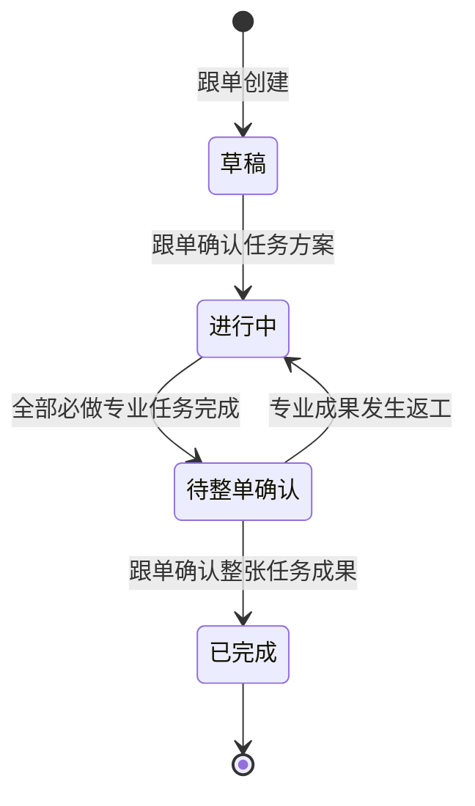
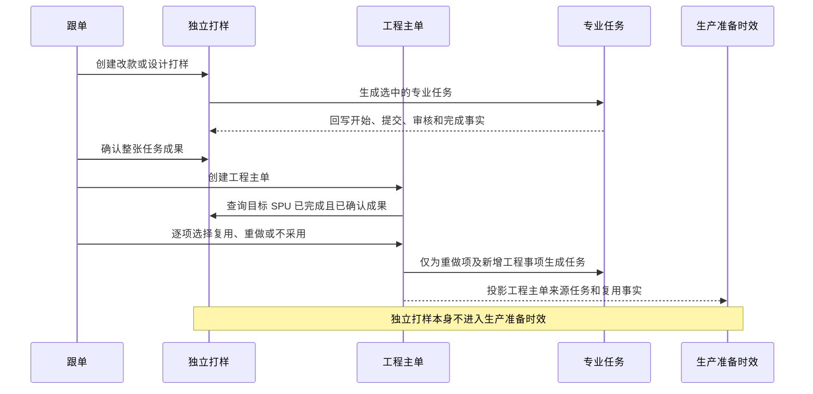

# PCS 生产工程管理遗漏调整方案

## 1. 方案结论

本方案处理当前实现与《PCS 生产工程管理总体设计文档》《PCS 生产工程管理实施计划》《PCS 生产工程管理需求追踪与交付矩阵》之间已经确认的差异。

本轮核查结论如下：

1. 工程主单来源的专业任务已经可以在专业详情页推进，并已只读投影到生产准备时效。
2. 独立改款打样和独立设计打样目前只有列表、创建、编辑和静态详情，尚未形成可执行的任务闭环。
3. 当前“改款打样任务”和“设计打样任务”两个菜单仍指向同一个混合页面，查询参数没有形成真正独立的列表和事实源。
4. 独立打样领域记录、现有改款任务记录和页面数据之间存在双事实源；独立打样领域创建、确认函数没有页面调用方。
5. 需求追踪矩阵把尚未形成证据闭环的 WP04、PCS-SMP-*、部分角色和 Mock 需求标成“已验证”，结论失真。
6. 工程主单详情已经不再打开旧任务抽屉，但旧抽屉渲染、事件和通用提交逻辑仍留在代码中，应删除，避免以后重新形成绕过专业页面的入口。

因此，后续不得再把“独立打样任务体系”或“总体设计全部实现”表述为已经完成。完成标准必须以本方案第 12 节为准。

---

## 2. 调整范围和非范围

### 2.1 本次必须调整

1. 独立改款打样的独立事实源、列表、创建、详情和状态推进。
2. 独立设计打样的独立事实源、列表、创建、详情和状态推进。
3. 独立打样与制版、样衣、花型、调色专业任务的真实关联和执行。
4. 独立打样的 BOM 与价格草稿、物料需求量和成果版本。
5. 跟单创建、任务方案确认和整张任务成果确认权限。
6. 买手维护 BOM、审核花型和调色成果的权限边界。
7. 已完成且已确认成果向工程主单的检索、推荐、复用、重做和不采用。
8. 独立打样与工程主单进度、关闭门禁和生产准备时效的隔离。
9. 菜单、路由、Mock、图片、操作记录、分页和局部交互。
10. 需求矩阵、实施登记、检查脚本和验收证据纠偏。
11. 工程主单旧任务抽屉及不可达通用提交代码清理。
12. BOM 与价格的适用范围、字段、单位换算、双币种成本、版本继承和正式快照边界。
13. 当前登录人身份、角色权限、操作留痕和不可伪造门禁。
14. 页面即时反馈、局部更新、分页与路由级显示偏好。

### 2.2 本次不调整

1. 已确认的工程主单十类专业任务业务规则。
2. 已确认的生产准备时效固定准备项和依赖关系。
3. 生产准备时效只读、不反向修改 PCS 任务的边界。
4. 技术包当前审核流程。
5. 样衣真实流转模块的后续建设范围。
6. 真实后端、数据库、接口、鉴权和消息推送基础设施。
7. 模板库继续归入技术资料。
8. 新业务不允许绕过工程主单直接新增技术包，也不提供导入历史技术包功能。
9. 辅料采购继续由采购人员在采购系统下单，PCS 只绑定采购单号并读取必要信息。

---

## 3. 业务对象和唯一事实源

### 3.1 独立改款打样

独立改款打样表示基于一个已经存在的来源 SPU，形成另一个已经存在的目标 SPU 的销售展示样衣和前期工程成果。

必须满足：

1. 来源 SPU 存在。
2. 目标 SPU 存在。
3. 来源 SPU 与目标 SPU 不是同一个 SPU。
4. 新成果全部归属于目标 SPU，不能覆盖来源 SPU。
5. 创建人为当前任务跟单。
6. 创建时至少选择一个需要执行的专业任务。

### 3.2 独立设计打样

独立设计打样表示围绕一个已经存在的目标 SPU 进行原创设计出样。

必须满足：

1. 目标 SPU 存在。
2. 不填写来源 SPU。
3. 如果实际基于旧款修改，必须改用独立改款打样。
4. 新成果全部归属于目标 SPU。
5. 创建人为当前任务跟单。
6. 创建时至少选择一个需要执行的专业任务。

### 3.3 事实源收口

当前不得继续同时维护两套独立打样记录。

调整后：

1. `RevisionTaskRecord` 只表示独立改款打样。
2. 新建独立的设计打样记录和仓储，不再通过改款任务的 `sourceType` 推断设计打样。
3. `pcs-engineering-master-sampling.ts` 只承担独立打样公共规则、成果检索和工程主单复用桥接，不再保存第二份模块内存数组。
4. 专业任务继续使用 `EngineeringTaskRecord`，通过 `sourceType` 和 `sourceId` 标记来源：
   - `INDEPENDENT_REVISION_SAMPLING`
   - `INDEPENDENT_DESIGN_SAMPLING`
5. 每张独立打样任务只保存其真实选中的专业任务，不生成一批“未启用”空任务。
6. 页面刷新后任务、专业任务、BOM 草稿、成果版本和操作记录必须仍然存在。

### 3.4 操作身份与权限事实

1. 创建人、跟单、负责人、提交人和审核人均读取当前登录用户及其权限，页面不得提供可编辑的操作人、审核人或确认人文本框。
2. 跟单只能推进自己负责的独立打样主任务；专业任务只能由任务负责人或具有对应专业权限的人员推进。
3. 买手是 BOM 与价格、花型成果审核、调色成果审核的唯一维护或审核角色；跟单和制作团队只能读取这些结果。
4. 每次创建、确认、开始、提交、审核、返工和复用均记录实际操作人和时间，不允许通过前端字段冒充其他角色。

---

## 4. 独立打样主任务状态

独立打样主任务不设置取消、异常、暂停和审批流，只保留业务执行所需状态。

| 状态 | 进入条件 | 页面主动作 | 离开条件 |
|---|---|---|---|
| 草稿 | 跟单创建任务 | 编辑基本信息、选择专业任务、关联 BOM 草稿 | 跟单确认任务方案 |
| 进行中 | 任务方案确认并生成专业任务 | 查看专业任务进度、进入待办专业任务 | 全部必做专业任务完成 |
| 待整单确认 | 全部必做专业任务完成 | 跟单查看成果汇总并确认整张任务 | 跟单确认成果完整可复用 |
| 已完成 | 跟单完成整单确认 | 查看成果版本、来源和后续复用记录 | 终态 |

状态必须由业务事实推导，页面不提供状态下拉框：

1. 草稿任务没有生成专业任务时不能进入进行中。
2. 任一专业任务未完成时不能进入待整单确认。
3. 花型或调色仍处于待审核、返工中时不能整单确认。
4. 跟单整单确认不能代替买手对 BOM、花型和调色的维护或审核。
5. 已完成后只读，不允许直接编辑历史成果。

---

## 5. 专业任务选择、生成和推进

### 5.1 可选专业任务

独立打样可以按实际需要选择：

1. 基码纸样任务。
2. 版衣／销售展示样衣任务。
3. 花型任务。
4. 调色任务，按纱线或面料分别创建。

独立打样不创建以下只属于首次大货工程准备的任务：

1. 齐码纸样。
2. 辅料下单。
3. 技术包确认。

达到做大货条件并创建工程主单以后，再根据工程主单任务方案补齐齐码纸样、辅料下单和技术包确认等任务。

### 5.2 必要依赖

独立打样只建立实际选中任务之间的必要执行关系，不把生产准备时效的完整 11 项结构复制到独立任务：

1. 版衣任务依赖对应基码纸样任务完成。
2. 花型、调色可以与基码纸样并行；如果业务选择的版衣必须等待某项花型或调色成果，页面应明确显示该依赖。
3. 选择存在明确前置的后置任务时，系统自动补齐缺失的前置任务。
4. 跟单不能手工拖拽或修改依赖关系。

### 5.3 专业任务状态和完成规则

专业任务使用已经确认的同一套状态：待前置、待开始、进行中、待审核、返工中、已完成。

| 专业任务 | 推进动作 | 完成条件 |
|---|---|---|
| 基码纸样 | 负责人开始，提交纸样成果 | 制作团队提交完整成果即完成 |
| 版衣／销售展示样衣 | 前置完成后开始，提交样衣成果 | 制作团队提交完整成果即完成 |
| 花型 | 花型团队开始并逐项提交成果 | 买手审核全部通过 |
| 调色 | 跟单维护潘通色号、颜色名称和染色色号；染厂提交成果 | 买手审核全部通过 |

花型和调色整张提交、逐项审核：

1. 全部通过则专业任务完成。
2. 未全部通过时，买手逐项标记通过或不通过，并填写未通过原因。
3. 任务进入返工中，只重新处理未通过成果。
4. 重新提交后再次由买手审核。

---

## 6. BOM 与价格草稿

### 6.1 操作责任

1. 只有买手可以新增、删除和修改独立打样 BOM 行。
2. 物料必须来自物料档案。
3. 物料没有有效标准单价时不能加入 BOM，并提示：`该物料暂无标准单价，无法加入。请先维护该物料的标准单价。`
4. 跟单和专业团队只能查看 BOM，不能修改。

### 6.2 适用范围

1. BOM 与价格按“目标 SPU + 商品颜色”维护。
2. 默认适用于该颜色下全部尺码 SKU；需要只适用部分尺码时，必须从目标 SPU 的真实 SKU 中明确选择，不能自由填写适用范围。
3. 独立改款打样的 BOM 归属于目标 SPU，不得写回来源 SPU。
4. 同一任务存在多个商品颜色时，每个颜色分别维护物料明细、用量和价格汇总。

### 6.3 字段、单位和数量公式

每行至少维护：

1. 物料真实图片、物料编码、物料名称和规格。
2. 单位用量和单位。
3. 打样数量。
4. 损耗率。
5. 印花需求。
6. 染色需求。
7. 水溶需求、印花面别。
8. 前幅／里布花型、关联花型成果和工艺编码。
9. 工艺要求和备注。
10. 物料档案最新人民币标准单价。
11. 本次总需求量。
12. 物料单位与用量单位不一致时使用的单位换算关系。

计算公式：

`本次总需求量 = 单位用量 × 打样数量 ×（1 + 损耗率）`

单位不一致时：

`本次总需求量 = 单位用量 × 单位换算系数 × 打样数量 ×（1 + 损耗率）`

缺少必要单位换算关系时禁止保存该物料行。水溶和染色同时存在时，技术资料中的工艺顺序固定为先水溶、后染色。

### 6.4 价格、自定义费用与双币种综合成本

1. 物料标准单价只从物料档案读取，币种为人民币；买手不能在 BOM 中改写物料标准单价。
2. 独立打样草稿始终读取物料档案当前最新有效标准单价；标准单价失效时，该行立即标记“标准单价失效”，并阻断后续技术包审核。
3. 买手可以为整个目标 SPU 维护自定义费用，例如车位费、运费；字段至少包括费用名称、印尼盾金额、备注、排序、维护人和维护时间。
4. 自定义费用统一使用印尼盾，不拆分到单个物料行。
5. 汇率由系统配置统一维护，页面只读取并展示当前最新汇率，不维护历史汇率，不允许用户修改。
6. 综合成本同时展示人民币总额、印尼盾总额和汇率，汇率文案统一为 `1 CNY = X IDR`。

计算公式：

`人民币物料成本 = Σ（本次总需求量 × 人民币标准单价）`

`印尼盾自定义费用 = Σ 自定义费用金额`

`人民币综合成本 = 人民币物料成本 + 印尼盾自定义费用 ÷ 当前汇率`

`印尼盾综合成本 = 人民币物料成本 × 当前汇率 + 印尼盾自定义费用`

精度要求：人民币标准单价保留 4 位小数；物料小计和人民币综合成本保留 2 位小数；印尼盾金额按整数展示；中间计算不得提前截断。

### 6.5 草稿、版本继承和正式快照

1. 每次独立打样保留自己的 BOM 与价格草稿版本。
2. 重新调整产生新版本，不覆盖上一版本；新版本复制上一版本形成起点，并记录来源版本、差异项、创建人和时间，来源版本保持只读。
3. 成果版本记录使用的 BOM 草稿版本、当前标准单价和当前汇率，但独立打样阶段不形成不可变价格快照。
4. 工程主单复用前期成果时同时承接其 BOM 来源版本和逐行差异；已有审核通过的成果保持锁定，新增需求形成新的执行轮次。
5. 只有技术包完成当前审核流程并正式发布时，才冻结 BOM、人民币标准单价、印尼盾自定义费用、汇率和双币种综合成本快照；之后物料档案价格或系统汇率变化不得改写该正式版本。
6. 技术包审核期间发生物料标准单价变化时，页面展示差异并仅使买手的 BOM 审核失效；已经通过且不受影响的专业成果审核不重复失效。
7. 正式技术包生效后的 BOM 变更必须通过工程变更形成新技术包版本，不能直接修改正式版本。

---

## 7. 独立打样详情页

详情页按工作台组织，不继续使用静态信息卡堆叠。

### 7.1 顶部任务头

1. 目标款式真实缩略图、款式名称和 SPU。
2. 改款同时展示来源款式真实缩略图、款式名称和 SPU。
3. 任务编号、任务类型、跟单、负责人、状态、计划完成时间。
4. 当前动作和阻断原因。
5. 缩略图点击查看高清大图，支持关闭按钮、遮罩和 Esc。

### 7.2 主体区域

1. 任务要求。
2. 专业任务表格：任务名称、负责人、状态、当前动作、前置任务、计划时间、开始时间、完成时间和详情入口。
3. BOM 与价格草稿摘要和版本入口。
4. 成果版本：纸样、样衣、花型和调色成果。
5. 整单确认区域，只在待整单确认时显示。
6. 后续工程主单复用记录。
7. 操作记录：创建、方案确认、任务开始、提交、审核、返工、整单确认和复用。

所有实质专业操作必须进入对应专业任务详情，不在独立打样详情中复制简化提交表单。

### 7.3 列表和交互约束

1. 改款和设计打样列表均使用标准管理列表：有分页、每页条数、总数、排序、列设置和操作列。
2. 每页条数和列显示偏好按各自路由分别保存，不允许两个菜单互相覆盖配置。
3. 本地按钮点击后 200ms 内必须出现状态变化、处理中或错误提示。
4. 弹窗、下拉、输入、审核和局部状态推进使用局部 DOM 更新，不得通过整页重新渲染造成闪烁、滚动位置丢失或输入卡顿。
5. 页面只保留完成任务所需的业务文案，不展示实现说明、状态机解释或大段引导文字。

---

## 8. 工程主单前期成果复用

### 8.1 推荐范围

创建工程主单并确认任务方案时，只检索：

1. 目标 SPU 相同。
2. 独立打样状态为已完成。
3. 已由任务跟单完成整单确认。
4. 对应专业成果自身已经满足专业完成条件。

系统默认推荐最近一份已完成且已确认的成果，跟单可以改选其他有效历史版本。

### 8.2 跟单逐项决定

每项前期成果必须选择：

1. 复用：工程主单读取该成果，不创建重复执行轮次；保留来源任务、来源版本、选择人和时间。
2. 重做：在工程主单下生成新的专业任务，前期成果只作为参考，不被覆盖。
3. 不采用：本次工程主单不使用该项成果，并记录选择人和时间。

复用成果可以让对应准备项显示完成，但不得计入本次生产准备实际执行时长；重做任务的开始和完成时间正常进入生产准备时效。

---

## 9. 生产准备时效边界

当前工程主单任务到生产准备时效的只读投影继续保留，并补充明确门禁：

1. 只接收 `sourceType = ENGINEERING_MASTER` 的工程主单任务事实。
2. 独立改款、独立设计、工程变更、补单和返单不产生生产准备时效记录。
3. 独立打样专业任务即使使用相同任务类型，也不得因为任务类型相同被投影。
4. 工程主单选择复用时，只投影“前期成果复用”的证据，不写独立任务的实际开始和完成时间。
5. 生产准备时效页面继续只读，不提供任务开始、提交、审核、修改负责人或修改依赖的入口。

---

## 10. 当前遗漏清单与调整映射

| 缺口 ID | 当前问题 | 调整目标 | 工作包 |
|---|---|---|---|
| GAP-001 | 改款和设计共用一套记录并通过来源类型推断 | 拆成改款、设计两类独立事实源 | A1 |
| GAP-002 | 两个菜单进入同一个混合列表，`kind` 没有形成稳定筛选 | 两个菜单进入各自列表和创建入口 | A2 |
| GAP-003 | 页面创建动作使用“当前用户”，未校验跟单身份 | 只有当前任务跟单可创建和确认 | A1、A2 |
| GAP-004 | 独立打样领域使用模块内存数组，刷新丢失 | 使用可持久化仓储并消除双事实源 | A1 |
| GAP-005 | 独立打样状态只在类型中声明，中间状态未实际使用 | 落实草稿、进行中、待整单确认、已完成 | A3 |
| GAP-006 | 详情页只有编辑，没有进度动作 | 补任务方案确认、专业任务入口和整单确认 | A3、A4 |
| GAP-007 | “关联任务”只是文案，没有真实任务关系 | 生成并关联真实专业任务记录 | A3 |
| GAP-008 | 专业任务没有独立打样来源编号和返回入口 | 写入来源类型、来源 ID，并显示所属独立打样 | A4 |
| GAP-009 | 独立打样物料只能展示，不能按权限维护 | 接入买手专属 BOM 与价格草稿 | A5 |
| GAP-010 | 物料缺打样数量、损耗和总需求量闭环 | 补字段、公式、标准单价和版本 | A5 |
| GAP-011 | 没有整张任务成果版本和操作事实 | 建立成果版本、确认人、时间和操作记录 | A4、A6 |
| GAP-012 | 工程主单不能检索真实独立打样成果 | 建立检索、推荐、改选和来源展示 | A6 |
| GAP-013 | 复用、重做和不采用没有完整动作 | 逐项决策并生成正确工程任务 | A6 |
| GAP-014 | 独立打样不进入时效仅靠当前调用方式间接保证 | 增加来源类型硬门禁和专项测试 | A7 |
| GAP-015 | 独立任务 Mock 为空或同质，无法演示完整状态 | 补多状态、多类型、专业成果和返工 Mock | A8 |
| GAP-016 | 详情页缺来源/目标真实图、物料图和成果大图 | 补缩略图、大图和失败态 | A2、A4、A5 |
| GAP-017 | 需求矩阵把未闭环需求标成已验证 | 纠正 WP04、PCS-SMP-*、角色、Mock 和交付登记 | A0、A9 |
| GAP-018 | 工程主单旧任务抽屉和通用提交代码仍保留 | 删除失效抽屉、处理器和旧测试锚点 | A7 |
| GAP-019 | 既有改款完成函数仍包含取消、旧确认和改版技术包门禁 | 新独立打样状态机替代旧页面动作，不暴露旧语义 | A1、A3 |
| GAP-020 | 当前检查只证明列表存在，没有证明能推进任务 | 增加状态、权限、专业任务和浏览器端到端证据 | A9 |
| GAP-021 | 独立打样方案未完整覆盖自定义费用、人民币／印尼盾和汇率 | 补 SPU 级印尼盾费用、双币种公式、精度和汇率展示 | A5、A8、A9 |
| GAP-022 | 页面可见操作未明确禁止手填操作人或审核人 | 所有身份读取当前登录用户并校验角色和任务归属 | A1、A3、A4、A5、A9 |
| GAP-023 | BOM 缺商品颜色／SKU 范围、单位换算、完整工艺字段和版本差异 | 完整复用总体设计的 BOM 与价格业务契约 | A5 |
| GAP-024 | 列表和详情未形成 200ms 反馈、局部更新和路由级偏好证据 | 增加交互性能、分页和显示设置验收 | A2、A9 |
| GAP-025 | 矩阵纠偏范围只列 WP04 和部分需求，仍可能保留错误绿灯 | 按受影响原子需求逐条降级并重新绑定证据 | A0、A9 |

---

## 11. 实施工作包

### A0：先纠正交付事实

**业务目标：** 停止把未实现能力标成已验证。

**文件／符号：**

- `docs/product-design/PCS生产工程管理需求追踪与交付矩阵.md`
- `docs/product-design/PCS生产工程管理实施计划.md`

**修改：**

1. WP04 交付批次从“已验证”改为“实施中”。
2. 逐条复核并纠正 PCS-SCP-002～003、PCS-IA-002～003、PCS-OBJ-004～005、PCS-ROLE-004～007、PCS-ROLE-016～017、PCS-SMP-001～012、PCS-PLN-005、PCS-PLN-017、PCS-MOCK-007、PCS-MOCK-011。
3. 已有静态列表但缺真实动作的条目标成“部分实现”；没有事实源、状态推进或运行证据的条目标成“待实施”。
4. 新增页面涉及的 PCS-PAGE、PCS-IMG 和 PCS-PERF 条目只能在分页、真实图片、大图和局部交互实际验收后标为“已验证”。
5. 删除以“主单领域和页面检查”代替独立打样状态、结果复用或角色权限证据的错误证据索引。
6. 已经有代码和运行证据的工程主单到生产准备时效只读投影保持原状态，不因独立打样缺口整体降级。

**验证证据：** 矩阵检查必须验证状态与证据文件真实存在，不能只检查需求 ID 数量。

**完成条件：** 矩阵不再全绿，所有缺口都有明确负责人、实现锚点和证据要求。

### A1：收口独立事实源和权限

**业务目标：** 改款和设计打样成为两个边界清晰、可持久化的业务对象。

**文件／符号：**

- `src/data/pcs-revision-task-types.ts`
- `src/data/pcs-revision-task-repository.ts`
- 新建 `src/data/pcs-design-sampling-task-types.ts`
- 新建 `src/data/pcs-design-sampling-task-repository.ts`
- `src/data/pcs-engineering-master-sampling.ts`
- `src/data/pcs-engineering-current-user.ts`

**修改：** 删除模块内存双写；落实当前登录跟单创建、跟单本人整单确认；禁止手填创建人、提交人、审核人和确认人；补状态事件、版本和操作记录；设计打样不再写入改款记录。

**验证证据：** 刷新持久化、来源/目标 SPU 门禁、角色门禁、两个仓储互不串数据。

**完成条件：** 任一任务只有一个权威记录，页面和后续复用读取同一事实源。

### A2：拆分列表、路由和创建表单

**业务目标：** 业务人员进入哪个菜单，就只看到对应类型任务。

**文件／符号：**

- `src/pages/pcs-engineering-tasks/revision-task.ts`
- 新建 `src/pages/pcs-engineering-tasks/design-sampling-task.ts`
- `src/router/routes-pcs.ts`
- `src/router/route-renderers.ts`
- `src/data/app-shell-config.ts`

**修改：** 改款页面只处理改款；设计页面只处理设计；分别提供列表、详情、新建；标准列表分页、筛选、列设置按路由分别持久化；弹窗、筛选和输入局部更新，按钮 200ms 内反馈。

**验证证据：** 两个命名路由分别创建一条任务，互不出现在对方列表；来源/目标款式真实图片和大图可用。

**完成条件：** 不再出现“改款与设计打样任务”混合标题和依靠 URL 查询参数临时区分的实现。

### A3：任务方案和状态推进

**业务目标：** 独立打样从草稿成为真实可执行任务。

**文件／符号：**

- `src/data/pcs-engineering-master-sampling.ts`
- `src/data/pcs-engineering-dependency-policy.ts`
- `src/data/pcs-engineering-master-repository.ts` 中可复用的任务动作边界
- 改款、设计打样详情页事件处理

**修改：** 跟单选择专业任务并确认；生成来源正确的专业任务；落实主任务四状态；专业任务开始、完成后自动汇总主任务状态。

**验证证据：** 最小状态契约和浏览器动作重放。

**完成条件：** 页面无法手填状态，但可以通过真实动作从草稿推进到待整单确认。

### A4：专业任务页面复用

**业务目标：** 独立打样来源任务与工程主单来源任务使用同一专业工作台和完成规则。

**文件／符号：**

- `src/pages/pcs-engineering-tasks/master-task-common.ts`
- `plate-making-task.ts`
- `first-sample-task.ts`
- `pattern-task.ts`
- `color-task.ts`
- `src/pages/pcs-engineering-tasks.ts`

**修改：** 支持独立改款、独立设计来源；显示来源对象和返回入口；不依赖工程主单才能渲染；结果回写对应独立任务汇总。

**验证证据：** 四类专业任务分别从独立任务进入、执行和返回；花型/调色审核与返工通过。

**完成条件：** 独立任务详情不复制简化表单，所有专业操作只有一个入口。

### A5：BOM 与价格草稿

**业务目标：** 独立打样具备买手可维护、其他角色只读的物料方案。

**文件／符号：**

- `src/data/pcs-engineering-bom-types.ts`
- `src/data/pcs-engineering-bom-version.ts`
- `src/data/pcs-engineering-bom-material-resolver.ts`
- `src/data/pcs-engineering-bom-pricing.ts`
- BOM 与价格页面或抽屉的独立打样来源支持

**修改：**

1. BOM 按目标 SPU 和商品颜色维护，默认覆盖全部尺码 SKU，支持从真实 SKU 中明确选择部分范围。
2. 补齐物料图片、编码、规格、单位用量、打样数量、损耗、总需求量、单位换算、印花、染色、水溶、印花面别、前幅／里布花型、花型成果、工艺编码和备注。
3. 人民币标准单价只读、实时取物料档案最新有效值；缺价、失效价和缺单位换算均阻断。
4. 买手维护 SPU 级印尼盾自定义费用；读取系统最新汇率并同时计算人民币、印尼盾综合成本。
5. 草稿新版本复制来源版本并展示逐行差异；独立打样不冻结价格，技术包正式发布才形成不可变快照。
6. 技术包审核期间价格变化只使买手 BOM 审核失效；正式发布后的 BOM 修改必须走工程变更。
7. 任务方案根据印花／染色需求建议花型／调色任务。

**验证证据：** 当前登录买手门禁、颜色／SKU 范围、数量和单位换算公式、缺价／失效价、自定义费用、汇率、双币种精度、版本继承和差异、正式快照边界、印花／染色联动。

**完成条件：** 详情页显示的物料、需求量和专业任务建议来自同一 BOM 草稿。

### A6：成果版本和工程主单复用

**业务目标：** 前期成果能够成为工程主单可追溯输入。

**文件／符号：**

- `src/data/pcs-engineering-master-sampling.ts`
- `src/data/pcs-engineering-master-repository.ts`
- `src/data/pcs-engineering-master-view-model.ts`
- 工程主单任务方案确认页面

**修改：** 建立成果版本；按目标 SPU 查询；推荐最近有效版本；逐项复用、重做、不采用；写入来源、版本、选择人和时间。

**验证证据：** 正常复用、改选历史版本、重做、不采用、未确认成果不可选。

**完成条件：** 工程主单可以解释每项成果从哪里来、为什么复用或重做。

### A7：时效硬隔离和旧入口清理

**业务目标：** 独立打样不污染首单生产准备时效，也不存在绕过专业页的旧入口。

**文件／符号：**

- `src/data/pcs-engineering-preparation-projection.ts`
- `src/pages/pcs-engineering-master-detail.ts`
- `src/main-handlers/pcs-handlers.ts`

**修改：** 投影增加工程主单来源断言；删除旧任务抽屉、旧事件和旧通用提交；保留专业详情导航。

**验证证据：** 独立任务执行前后时效记录数不变；工程主单点击任务只进入专业详情；全仓搜索没有旧抽屉动作。

**完成条件：** 执行线只有专业任务页面，统计线只有工程主单只读投影。

### A8：Mock 和页面验收数据

**业务目标：** 页面能够完整演示正常路径，而不是只有空任务。

**修改：** 至少准备：

1. 改款草稿一条。
2. 改款进行中一条，包含纸样、样衣、花型。
3. 改款待整单确认一条。
4. 设计打样进行中一条，包含花型和调色返工。
5. 已完成且可复用的改款、设计打样各一条。
6. 来源/目标款式、物料和成果均有真实图片。
7. 有多种负责人、计划时间、操作记录和成果版本。
8. 有多个商品颜色、全部 SKU 和部分 SKU 两种 BOM 适用范围。
9. 有标准单价缺失、标准单价失效和单位换算缺失的阻断示例。
10. 有人民币物料价格、印尼盾自定义费用、当前汇率和双币种综合成本示例。
11. 有标准单价在技术包审核期间变化并触发 BOM 重新审核的示例。

**验证证据：** 1366×768 列表/详情、1024×768 主要动作、缩略图大图、加载失败态、分页和局部交互。

**完成条件：** 不依赖人工修改本地存储即可演示完整状态和复用场景。

### A9：需求追踪、专项检查和最终门禁

**业务目标：** 每条需求都有真实实现和证据，不再以文件存在替代业务闭环。

**文件／符号：**

- `docs/product-design/PCS生产工程管理需求追踪与交付矩阵.md`
- `scripts/check-pcs-engineering-delivery-matrix.ts`
- 独立打样专项测试和浏览器场景
- 原型审查记录

**修改：** 每个 PCS-SMP、相关 PCS-SCP、PCS-IA、PCS-OBJ、PCS-ROLE、PCS-PLN、PCS-BOM、PCS-MOCK、PCS-PAGE、PCS-IMG 和 PCS-PERF 需求绑定具体领域契约和页面场景；矩阵脚本核查证据文件和状态；验证当前登录身份不可伪造、按钮即时反馈、局部更新和路由级列表偏好；最终修改后重新构建、同步 CodeGraph、生成任务收据。

**完成条件：** 第 12 节所有场景通过后，才能把 WP04 和相关原子需求改回“已验证”。

---

## 12. 必须通过的验收场景

1. 跟单创建改款打样：来源和目标 SPU 均存在且不同，创建成功。
2. 改款缺来源、缺目标、来源与目标相同分别被阻断。
3. 跟单创建设计打样：目标 SPU 存在，无来源 SPU，创建成功。
4. 设计打样填写来源 SPU 被阻断，并提示应改用改款打样。
5. 非跟单不能创建、确认任务方案或确认整张成果。
6. 改款和设计列表、创建表单、详情路由和数据完全分开。
7. 跟单确认任务方案后生成选中的专业任务，缺失必要前置时自动补齐。
8. 纸样提交完整成果后直接完成，并解锁依赖它的样衣任务。
9. 样衣提交完整成果后直接完成。
10. 花型全部通过后完成；部分未通过进入返工，只重做未通过项。
11. 调色经过跟单颜色要求、染厂成果、买手审核三阶段；未通过可返工。
12. 买手维护 BOM；其他角色不能修改；没有标准单价的物料不能加入。
13. 单位用量、打样数量和损耗变化后，本次总需求量计算正确。
14. 全部必做专业任务完成后，独立主任务自动进入待整单确认。
15. 任一专业任务未完成或待审核时，跟单不能整单确认。
16. 跟单整单确认后生成不可覆盖的成果版本。
17. 工程主单只推荐目标 SPU 相同、已完成且已确认的成果。
18. 跟单可以改选历史有效版本，并逐项复用、重做或不采用。
19. 复用保留来源证据且不计本次时效；重做生成工程主单来源新任务并正常计时。
20. 独立打样和其专业任务执行前后，生产准备时效记录不新增、不修改。
21. 页面刷新后任务状态、专业任务、BOM、成果版本和日志不丢失。
22. 所有款式、物料和成果缩略图均与对象一致，并能打开高清大图。
23. 工程主单任务点击只进入专业详情，旧任务抽屉和通用提交入口不存在。
24. 需求矩阵每个相关原子需求都有领域、页面或浏览器证据，不能只靠文字检索通过。
25. BOM 按目标 SPU 和商品颜色维护，默认覆盖全部尺码 SKU，明确选择部分 SKU 时范围正确且不能自由填写不存在的 SKU。
26. 物料单位与用量单位不一致时按换算系数计算；缺少换算关系时保存被阻断。
27. 水溶和染色同时存在时，技术资料明确按先水溶、后染色展示；完整工艺字段和花型成果关系可追溯。
28. 买手新增 SPU 级印尼盾费用后，人民币物料成本、印尼盾费用、当前汇率和双币种综合成本按约定精度计算正确。
29. 独立打样草稿读取物料档案最新标准单价且不冻结价格；只有正式技术包发布时冻结 BOM、价格、费用、汇率和综合成本。
30. 技术包审核期间标准单价变化时只使买手 BOM 审核失效；不受影响的专业成果审核保持有效。
31. BOM 新版本保留来源版本和逐行差异，来源只读；正式技术包后的变化必须进入工程变更。
32. 页面没有可编辑的操作人、提交人、审核人和确认人字段；越权用户无法推进对应动作，日志记录实际登录人。
33. 本地按钮 200ms 内出现反馈；弹窗、筛选、输入和局部状态变化不触发整页闪烁、滚动复位或输入卡顿。
34. 改款和设计列表均可分页，列设置和每页条数分别按路由保存且互不串用。

---

## 13. 实施顺序

严格按以下顺序实施：

1. A0 纠正矩阵状态。
2. A1 收口事实源和权限。
3. A2 拆分改款/设计列表、路由和创建。
4. A3 落实任务方案和主任务状态机。
5. A4 接入四类专业任务执行。
6. A5 接入 BOM 与价格草稿。
7. A6 打通成果版本和工程主单复用。
8. A7 时效硬隔离并删除旧抽屉。
9. A8 补齐完整 Mock 和图片。
10. A9 逐条验收并修正需求矩阵结论。

不得先把矩阵改回“已验证”，也不得只补页面按钮而不建立事实源、状态动作和专业任务回写。

---

## 14. 最终完成定义

只有同时满足以下条件，才可以声明遗漏调整完成：

1. GAP-001～GAP-025 全部有实际实现位置。
2. 第 12 节 34 个场景全部有当前分支运行证据。
3. 改款和设计打样能够独立创建、独立执行、独立完成和形成成果版本。
4. 四类专业任务能够从独立任务进入，并按已确认规则推进。
5. 工程主单能够检索并逐项处理前期成果。
6. 独立打样不进入生产准备时效。
7. 旧任务抽屉和通用提交入口被删除。
8. 需求追踪矩阵状态与当前实现一致。
9. 专项契约、命名路由浏览器验收、构建、治理、CodeGraph 和任务收据均取自最后一次实质修改。
10. GitHub 目标分支确认指向该验证版本后，才可称为已交付。

---

## 15. 二次核查覆盖结论

本节用于防止实施时只处理页面表象，或把已确认边界误当成遗漏重新设计。

| 核查域 | 当前结论 | 本方案处理位置 |
|---|---|---|
| 工程主单创建、任务方案确认和固定依赖 | 主流程已存在，继续保持跟单确认、系统建议和固定依赖；不重新设计依赖 | 第 2.2 节、A3、A7 |
| 工程主单专业任务推进 | 专业详情页继续作为唯一执行入口；删除旧抽屉残留 | A4、A7、场景 8～11、23 |
| 工程任务到生产准备时效 | 已有只读投影保留；补独立任务来源硬隔离和复用计时口径 | 第 8～9 节、A7、场景 19～20 |
| 独立改款打样 | 事实源、路由、状态、专业任务、成果和复用尚未闭环 | A1～A6 |
| 独立设计打样 | 必须与改款拆分，只有目标 SPU，不允许伪装成改款记录 | A1～A6 |
| 独立任务可生成的专业任务 | 只生成实际选择的基码纸样、销售展示样衣、花型和调色；自动补齐必要前置 | 第 5 节、A3～A4 |
| 齐码纸样、辅料下单、技术包确认 | 不属于独立打样；达到大货条件后由工程主单生成 | 第 5.1 节 |
| 辅料采购操作 | 采购人员仍在采购系统下单，PCS 工程任务只绑定采购单号并读取必要信息；本轮不在独立打样增加采购入口 | 第 2.2 节和第 5.1 节的边界 |
| BOM 与价格 | 独立任务复用完整统一规则：颜色／SKU、数量、单位换算、工艺、人民币物料价、印尼盾费用、汇率和版本 | 第 6 节、A5、场景 12～13、25～31 |
| 技术包 | 不允许绕过工程主单直接新增；沿用当前审核流程，正式发布时才冻结 BOM 与价格快照 | 第 2.2 节、第 6.5 节、场景 29～31 |
| 模板库 | 继续归入技术资料；不是独立打样新增入口，本方案不迁移其既有边界 | 第 2.2 节 |
| 花型和调色审核 | 两类任务均整张提交、买手逐项审核；未通过项单独返工 | 第 5.3 节、场景 10～11 |
| 身份与权限 | 所有操作使用当前登录身份，页面不允许手填操作人或审核人 | 第 3.4 节、A1、A9、场景 32 |
| “我的工程任务” | 维持整体删除，不恢复菜单、路由、页面或文案；任务从专业任务列表和所属业务对象进入 | A0、A2、A9 的路由与矩阵核查 |
| Mock、图片和大图 | 补足多状态、多角色、返工、复用、双币种与阻断场景；所有款式／物料／成果使用对应真实图 | A8、场景 21～22 |
| 页面可用性 | 管理列表表格化、分页、路由级偏好；详情保留必要文案、局部更新和即时反馈 | 第 7.3 节、A2、A9、场景 33～34 |
| 需求追踪真实性 | 所有受影响原子需求先降级，只有当前实现和运行证据闭环后才能恢复“已验证” | A0、A9、场景 24 |

二次核查后，未再发现没有归属到缺口、工作包或验收场景的已确认需求。后续若代码实施发现新的事实冲突，应先新增缺口 ID 和验收场景，再修改实现，不得静默扩大或改变本方案。
