# PCS 设计改款与生产准备管理增量调整方案

## 0. 文档信息

| 项目 | 内容 |
|---|---|
| 文档版本 | V2.3 |
| 编制日期 | 2026-09-15 |
| 当前状态 | V2.3 简化需求已实现并完成技术验收，待用户进行最终产品接受；实际结果以同版本实施验收报告为准 |
| 代码基线 | `deeac5bfc224d5e15d0874756400b21f8a6a4293` |
| 适用系统 | 商品中心系统（PCS）、FCS 既有印花／染色加工单的来源增量适配，以及生产准备时效只读投影 |
| 调整范围 | 设计改款、销售展示样衣、生产准备单、首单样衣、齐码纸样、BOM 与价格、技术包、印花／染色加工单来源、生产准备时效、款式档案承接 |
| 调整方式 | 保留现有页面布局和交互骨架，完整迁移业务名称、页面地址和内部数据结构；不整页重构，不迁移技术栈 |
| 实施状态说明 | 本文仍是需求与实施权威来源；实现和验证证据另见同版本实施验收报告 |

本文以本次业务确认结果为最高优先级。以下历史文档中与本文冲突的“跟单负责设计改款”“目标 SPU 必须先建档”“生产准备重新制作基码纸样”“齐码纸样必须等待首单样衣”“PCS 产前版样衣”“只改显示名称并保留旧路由或旧内部对象”“列表只保留团队筛选”等内容，以本文为准；历史文档保留作变更记录，不直接删除。

### 0.1 V2.2 变更记录

1. “工程主单”正式更名为“生产准备单”，不是显示别名；菜单、页面地址、路由、内部对象、字段、关联 ID、持久化结构、Mock、导入导出、测试和文档全部迁移。
2. 生产准备管理下的全部标准列表统一采用“页面标题与主操作 → 查询卡片 → 统计卡片 → 数据列表卡片 → 分页”，以染色加工单去掉工厂切换 Tab 后的结构为参照。
3. 设计改款列表的“参照款式 → 目标款式”改为纵向堆叠：参照款在上，箭头在下一行左侧，目标款在箭头右侧，不再横向挤压。
4. 取消旧地址兼容策略：新地址上线时同步删除旧地址、旧路由注册、旧跳转引用和重定向，不保留临时兼容代码。

### 0.2 V2.3 变更记录

1. 第一步删除“新款颜色”和“参考物料处理”，不再要求买手维护颜色关系，也不从参照款自动带入物料。
2. 新建设计改款任务时直接建立一份空白的整款物料与费用方案；所有物料由买手手工新增、修改和删除。
3. “物料与加工要求”和“费用与综合成本”合并在同一张“物料与费用”大卡片中，并通过同一个主动作确认。
4. 销售展示样衣制作安排只填写样衣总件数和制作要求；尺码固定为 M 并只读展示，不再按颜色、尺码拆行，也不再要求买手选择制作团队。
5. 历史颜色、尺码多行样衣要求在进入新流程时汇总为一条 M 码总件数，确保数量不丢失；新增记录只写新口径。

## 1. 本次调整结论

本次调整收口为十二项业务决定：

1. “生产工程管理”统一更名为“生产准备管理”，“工程主单”统一更名为“生产准备单”；名称、页面地址和内部数据结构全部迁移，不保留旧对象作为活动事实源。
2. 生产准备管理下每个标准列表统一为“页面标题与主操作 → 查询卡片 → 统计卡片 → 数据列表卡片 → 分页”，没有工厂切换 Tab。
3. “设计”和“改款”继续合并为一个“设计改款任务”，不保留设计／改款分类和统计标签。
4. 每张设计改款任务必须有参照款、真实设计稿；设计改款任务由买手团队负责创建、维护、确认和收口。
5. 目标款可以选择已建档 SPU，也可以先填写“线下临时 SPU 名称”。正式建档时再关联设计改款任务并继承资料。
6. 设计改款第一步不再维护新款颜色或参考物料；买手手工添加本次物料，并一次确认物料、印花／染色要求、整款费用、M 码销售展示样衣总件数和制作要求，确认后再生成专业任务。
7. 纸样不变时，由买手直接上传真实基码纸样文件，不再生成基码纸样任务；需要重新制版时才生成基码纸样任务。
8. 生成花型任务或调色任务时，同步建立对应加工单；一个专业任务可以关联多张加工单，但每个“设计改款任务 × BOM 物料行 × 工艺类型”只能有一张有效加工单并可追溯。
9. 生产准备阶段不再制作基码纸样。首单样衣和齐码纸样可以并行，页面提示推荐先做首单样衣；技术包等待本次所有启用工作完成。
10. PCS 中只使用“销售展示样衣”和“首单样衣”。“产前版样衣”属于 PPIC 分配车缝后，由三方工厂制作、PPIC 接收并交审版团队审核的下游流程，不属于 PCS 生产准备。
11. 设计改款列表中的参照款和目标款纵向堆叠，箭头在目标款行左侧对齐；款式图片、款号和名称保持同一信息块。
12. 销售展示样衣制作安排以整款为单位：默认 M 码，只填总件数和制作要求；历史多行要求只在迁移时汇总，不在页面继续暴露。

## 2. 调整原则与硬边界

### 2.1 增量调整原则

| 原则 | 具体要求 |
|---|---|
| 不整页重构 | 保留现有列表、详情页头、步骤导航、专业任务表格、上传组件和操作记录的布局骨架；页面地址和内部对象按新业务名称完整迁移 |
| 不更换技术方案 | 继续使用现有 Vanilla TypeScript 字符串模板、局部 DOM 更新和本地原型仓储，不迁移到 React 页面体系 |
| 不制造第二事实源 | 设计改款事实继续由现有设计改款仓储管理；生产准备事实继续由生产准备单及专业任务管理；生产准备时效只读投影，不单独推进任务 |
| 完整命名迁移 | 新地址和新数据结构是唯一入口；旧地址、旧路由注册、旧跳转引用和兼容跳转全部删除；旧结构仅用于一次迁移读取，不允许继续新增、修改、统计或导出 |
| 不扩大当前依赖 | 暂不把生产准备单创建硬绑定到商品测款记录；保留当前人工确认“已满足做大货要求”的临时入口 |
| 不改变技术包审核 | 技术包当前审核角色、审核节点、退回、重新提交和正式版本生效规则全部保持不变 |
| 不改下游产前版 | 不修改 FCS／PPIC 的三方车缝、产前版制作、接收和审版流程，只做跨模块术语回归验证 |
| 迁移历史数据 | 现有记录通过一次迁移转换为新结构后继续打开；迁移完成后统一按新字段保存，不长期保留运行时双结构兼容 |

### 2.2 页面简化硬规则

| 规则 | 验收口径 |
|---|---|
| 删掉无用说明 | 一个区块最多保留“标题 + 一句必要提示”；字段含义能由字段名表达时不再重复说明 |
| 每步直达核心 | 进入当前步骤后，首屏直接出现本团队要填写、选择、上传或确认的内容，不先展示大段说明或空卡片 |
| 一个主动作 | 每个步骤只保留一个蓝色主按钮；保存草稿、返回、删除、退回等使用次级按钮 |
| 不深层跳转 | 常用动作在当前页完成；“维护物料”不得跳转到另一业务页，最多打开一次物料选择层或右侧抽屉 |
| 不套娃 Tab | 详情页保留一级步骤导航；步骤内部不再增加“颜色／BOM 与价格”等二级 Tab |
| 操作立即反馈 | 点击、选择、上传后 200ms 内显示处理中或局部结果；失败信息保留在动作附近，并说明如何恢复 |
| 记录后置 | 操作记录默认折叠在页面底部，不抢占当前工作的首屏空间 |
| 团队优先 | 任务未完成时展示“当前需处理的团队”；具体操作人只在完成记录、提交记录和操作记录中展示 |

“不整页重构”必须作为交付项验收：设计改款、生产准备单和专业任务保留当前页面布局与交互骨架，但切换到新页面地址和新内部对象；研发评审时确认没有新增替代页面、平行仓储或重复业务表单。

### 2.3 明确不做

本次不做以下事项：

- 不重做整个商品中心系统导航。
- 不把商品测款原型改造纳入本次实施。
- 不实现真实后端、数据库、鉴权或跨系统消息中间件。
- 不重构印花加工单、染色加工单的既有完整页面。
- 不重新设计技术包审核流程。
- 不在齐码纸样上传时强制填写幅宽、捆条、裁片部位、面料条件、里布条件等技术包资料。
- 不把 FCS 的“产前版样衣”改名成“首单样衣”。
- 不保留旧地址、旧路由、兼容跳转、可继续写入的旧对象、旧字段或旧持久化结构；历史记录只能通过一次数据迁移进入新结构。

## 3. 当前实现与目标调整对照

| 范围 | 当前实现 | 当前问题 | 本次增量调整 |
|---|---|---|---|
| 模块和准备单名称 | 侧栏分组已改为“生产准备管理”，子菜单和多处页面仍显示“工程主单” | 用户无法理解且新旧名称混用 | 分组使用“生产准备管理”，业务单据统一为“生产准备单”，并完整迁移页面地址与内部结构 |
| 设计／改款分类 | 页面已合并入口，但历史类型、统计或测试仍可能保留分类 | 业务不再区分两类 | 创建、列表、详情、来源、统计、Mock、字段和内部类型统一为“设计改款”，历史值一次迁移 |
| 设计改款创建人 | 创建和设计稿门禁要求跟单 | 与“设计改款由买手负责”冲突 | 改为买手创建、上传和替换设计稿 |
| 目标款 | 创建时必须选择已建档目标 SPU | 线下临时款无法发起 | 增加“已建档 SPU／线下临时 SPU”二选一 |
| 创建后状态 | 页面和内部记录均使用“草稿”语义 | 确认创建后仍像未正式发起，且页面与事实状态不一致 | 页面与内部状态统一迁移为“待方案确认”；历史草稿状态只在一次迁移时转换，不再继续写入 |
| 设计改款步骤 | 买手准备 → 跟单安排 → 专业工作 → 跟单整单确认 | 责任来回切换，流程过长 | 改为买手确认方案 → 专业团队工作 → 买手确认成果三步 |
| 买手准备页 | 颜色与 BOM 分为二级 Tab | 操作层级深，颜色、物料和费用割裂 | 合并为同一步骤的一个工作区，无二级 Tab |
| 维护物料 | 需要在不同区块／页面间切换 | 难以连续完成一个颜色的方案 | 当前页内选择、增加、替换、删除；最多一层选择器／抽屉 |
| 物料和费用 | 分开保存、再统一确认 | 用户不知道何时才算完成 | 一次“确认方案并生成工作”同时确认全部颜色物料和整款费用 |
| 基码纸样 | 每个设计改款固定建议生成基码纸样任务 | 纸样不变时重复劳动 | 由买手选择“直接复用”或“需要重新制版” |
| 纸样复用 | 没有创建阶段直接上传入口 | 无法表达线下已有纸样 | 选择直接复用时，在创建或方案步骤上传真实纸样文件 |
| 花型／调色 | 根据 BOM 生成专业任务 | 没有同步建立加工单 | 每条有印花／染色需求的物料同步建立对应加工单并回链 |
| 加工单来源 | 现有来源契约围绕生产单、备货和裁片补料 | 直接复用会伪造生产单／技术包和错误收货去向 | 增加“设计改款打样”来源契约，复用既有加工单页面与执行流程 |
| 销售展示样衣 | 固定任务，依赖基码纸样 | 方向基本正确，但需使用最终物料和工艺成果 | 保留任务，依赖“可用基码纸样 + 所有启用花型／调色结果” |
| 专业任务入口 | “进入任务”已路由到相应详情页 | 需继续保证统一列表与详情一致 | 页面交互保持，所有地址迁移到生产准备命名空间并更新跳转 |
| 生产准备单基码纸样 | 生产准备任务骨架包含基码纸样 | 与“设计改款阶段已完成”冲突 | 从本次生产准备工作中移除，改为前期资料只读引用 |
| 首单样衣与齐码 | 齐码纸样硬依赖首单样衣 | 业务允许并行 | 取消硬依赖，同时显示“建议先完成首单样衣” |
| 齐码纸样上传 | 要求纸样源文件、预览图、适用尺码和说明 | 当前阶段录入过多 | 只要求真实纸样文件；说明可选，其他信息在技术包补齐 |
| 技术包 | 等待全部启用任务；有既有审核流程 | 总体方向正确 | 保留审核，只调整上游资料来源和任务依赖 |
| 生产准备时效 | 从生产准备单任务投影，但仍含基码纸样项目 | 会把设计改款阶段耗时算进生产准备 | 只投影生产准备实际工作；基码纸样仅作为前期资料展示 |
| 产前版样衣 | PCS 内部旧类型名仍为 `PRE_PRODUCTION_SAMPLE`，页面已部分显示首单样衣 | 容易再次出现错误业务名称 | PCS 内部类型迁移为 `FIRST_SAMPLE`，页面、导出和时效统一显示“首单样衣”；FCS 真正的产前版样衣保持原对象 |
| 列表查询 | 多数页面只有“当前需处理的团队”，查询条件、按钮和统计不完整 | 页面结构和操作能力不一致 | 团队作为一个查询条件，并补齐关键词、状态、查询、重置、导出以及同口径统计卡片 |
| 列表布局 | 查询、统计、列设置位置不一致 | 用户在不同菜单重复学习 | 全部采用“标题与主操作 → 查询卡片 → 统计卡片 → 列表卡片 → 分页”；列设置固定在列表表头最右侧 |
| 款式对照列 | 参照款、箭头和目标款横向挤在同一行 | 目标款被压缩，关系不易扫读 | 参照款在上；下一行箭头左对齐，目标款紧随其后并保持完整图片、款号和名称 |

## 4. 目标业务对象与术语边界

### 4.1 业务对象关系

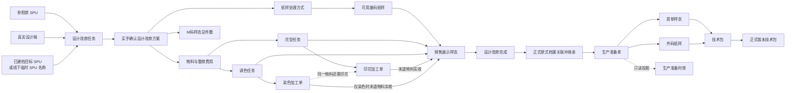

### 4.2 术语表

| 术语 | 本方案定义 | 不得混用 |
|---|---|---|
| 设计改款任务 | 买手基于参照款和设计稿形成目标款方案并完成销售展示样衣的业务任务 | 不再分“设计任务”“改款任务” |
| 线下临时 SPU | 正式建档前的临时款式名称，用于识别设计改款目标，不是正式档案 | 不生成伪造的正式款式 ID、SKU 或档案状态 |
| 基码纸样 | 在设计改款阶段形成或复用的基础纸样 | 不作为生产准备阶段的新任务 |
| 销售展示样衣 | 设计改款阶段按最终方案制作，用于销售展示或测款的样衣 | 不叫首单样衣，不叫产前版样衣 |
| 生产准备单 | 一个正式款式进入生产前，承载前期资料、本次工作、首单样衣、齐码纸样和技术包确认的业务单据 | 不再使用“工程主单”“主单”或“生产准备主单” |
| 首单样衣 | PCS 生产准备阶段，用于确认首单生产准备结果的样衣 | 不叫产前版样衣 |
| 齐码纸样 | PCS 生产准备阶段形成的全尺码纸样文件 | 当前上传阶段不强制补技术包明细 |
| 产前版样衣 | PPIC 分配车缝后，三方工厂先做并交 PPIC／审版团队审核的样衣 | 不属于 PCS 生产准备任务 |
| 生产准备时效 | 从生产准备单和专业任务事实生成的只读时效视图 | 不创建、开始、完成或退回任务 |

### 4.3 页面地址与内部对象完整迁移

生产准备管理使用统一的正式地址。列表使用下列地址，详情在相应列表地址后追加 `/:id`：

| 页面 | 当前地址 | 新正式地址 |
|---|---|---|
| 生产准备单 | `/pcs/engineering/masters` | `/pcs/production-preparation/orders` |
| 设计改款任务 | `/pcs/engineering/design-revision` | `/pcs/production-preparation/design-revision` |
| 制版任务 | `/pcs/patterns/plate-making` | `/pcs/production-preparation/plate-making` |
| 花型任务 | `/pcs/patterns/artwork` | `/pcs/production-preparation/artwork` |
| 调色任务 | `/pcs/engineering/color` | `/pcs/production-preparation/color` |
| 辅料下单任务 | `/pcs/engineering/purchase` | `/pcs/production-preparation/purchase` |
| 技术包确认任务 | `/pcs/engineering/tech-pack` | `/pcs/production-preparation/tech-pack` |
| 销售展示样衣任务 | `/pcs/samples/display-sample` | `/pcs/production-preparation/display-sample` |
| 首单样衣任务 | `/pcs/samples/first-sample` | `/pcs/production-preparation/first-sample` |

旧地址不得再出现在路由注册、重定向、菜单、按钮、列表链接、任务跳转、时效跳转、导出或测试中。迁移完成后直接删除旧地址及其兼容代码；访问旧地址按未注册地址处理，不跳转到新地址，也不得读取或写入业务数据。

内部对象同步采用新业务名称：

| 旧内部语义 | 新内部语义 |
|---|---|
| `EngineeringMaster` | `ProductionPreparationOrder` |
| `EngineeringMasterTask` | `ProductionPreparationTask` |
| `engineeringMasterId` | `productionPreparationOrderId` |
| 工程准备单相关仓储、视图、事件、页面状态和持久化键 | 统一改为 `productionPreparation`／`productionPreparationOrder` 语义 |
| `EngineeringIndependentSamplingRecord` | `DesignRevisionTaskRecord` |
| 设计改款的 `DRAFT`、`IN_PROGRESS`、`WAIT_CONFIRMATION` | `WAITING_SOLUTION_CONFIRMATION`、`PROFESSIONAL_WORKING`、`WAITING_BUYER_CONFIRMATION` |
| PCS 的 `PRE_PRODUCTION_SAMPLE` | PCS 的 `FIRST_SAMPLE` |

文件和目录命名同步收口：原 `pcs-engineering-master-*` 页面／数据文件迁移为 `pcs-production-preparation-order-*`，原 `pcs-independent-sampling*` 迁移为 `pcs-design-revision*`，原生产准备专业任务目录迁移为 `pcs-production-preparation-tasks`。所有引用、导出和测试入口随文件迁移一次改完，不保留同义旧文件转发层。

迁移必须覆盖类型、接口字段、关联关系、仓储键、Mock、导入导出、打印、操作记录、测试和文档。历史记录通过一次迁移转换为新结构；迁移后只写新结构，不做新旧字段双写。FCS 中真正表示产前版样衣的类型和数据不受 PCS `FIRST_SAMPLE` 迁移影响。

### 4.4 责任团队

| 阶段 | 当前负责团队 | 核心动作 | 完成后记录具体操作人 |
|---|---|---|---|
| 设计改款方案 | 买手团队 | 创建任务、上传设计稿、手工添加物料、确认费用、印染需求、M 码样衣总件数和纸样处理方式 | 是 |
| 基码纸样重新制作 | 版师／毛织团队 | 上传真实基码纸样成果 | 是 |
| 花型 | 花型团队 | 制作并提交花型成果 | 是 |
| 调色 | 染厂／调色团队 | 制作并提交颜色成果 | 是 |
| 销售展示样衣 | 制作团队 | 按默认 M 码总件数制作并上传实拍结果 | 是 |
| 设计改款成果确认 | 买手团队 | 审核专业成果并确认整张任务 | 是 |
| 生产准备安排 | 跟单团队 | 创建准备单、确认本次工作和首单样衣要求 | 是 |
| 首单样衣 | 制作团队 | 按颜色、尺码、数量制作并上传实拍结果 | 是 |
| 齐码纸样 | 版师／毛织团队 | 上传对应的真实齐码纸样文件 | 是 |
| 技术包 | 沿用现有审核团队 | 完善资料、审核、退回、重提、生效 | 是 |

## 5. 设计改款目标流程

### 5.1 流程图

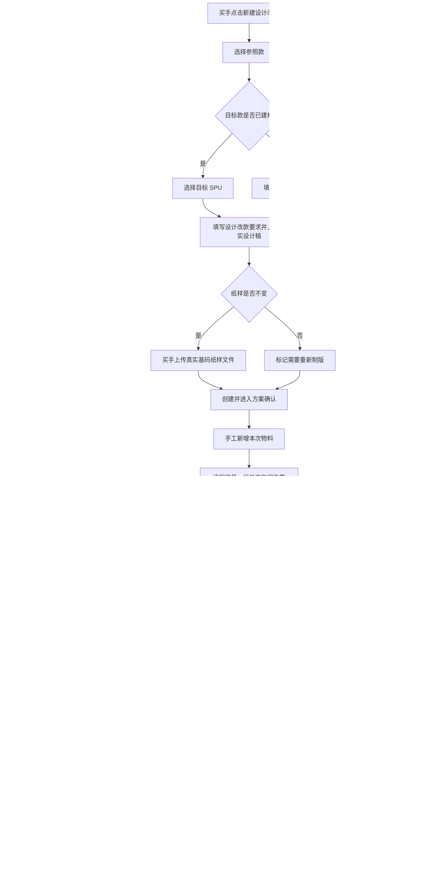

### 5.2 创建弹窗

保留当前“新建设计改款任务”弹窗和上传组件，仅对现有字段做增量替换。

| 区域 | 字段／动作 | 规则 |
|---|---|---|
| 参照款 | 参照款式 SPU | 必选，只能选择已建档款式；与已建档目标款不得相同 |
| 目标款 | 目标来源 | 单选：已建档 SPU、线下临时 SPU |
| 目标款 | 目标款式 SPU | 选择“已建档 SPU”时必选 |
| 目标款 | 线下临时 SPU 名称 | 选择“线下临时 SPU”时必填；只保存名称和临时标识 |
| 任务要求 | 本次设计改款要求 | 必填，直接描述需要改什么、做到什么结果 |
| 设计稿 | 真实设计稿 | 必传；由当前买手选择本地 JPG、JPEG、PNG 或 WebP；沿用现有大小限制和上传反馈 |
| 纸样 | 纸样处理方式 | 必选：“纸样不变，直接复用”或“需要重新制版” |
| 纸样 | 基码纸样文件 | 选择直接复用时必传至少一个真实 `.prj`；DXF、RUL、PDF 可作为补充，不要求预览图 |
| 主动作 | 创建并进入方案确认 | 校验通过后创建真实任务并打开详情第一步 |

创建成功后的用户可见状态为“待方案确认”，不显示“草稿”。如果因上传未完成、文件类型错误或字段缺失而失败，弹窗保持打开，已填内容和已成功读取的文件不得清空。

### 5.3 详情页步骤

保留当前页面头、步骤导航、专业任务表格、操作记录和上传预览能力，将现有四步压缩为三步：

| 步骤 | 团队 | 当前页直接呈现的核心工作 | 唯一主动作 |
|---|---|---|---|
| 第一步：确认设计改款方案 | 买手团队 | 设计稿、纸样处理、手工添加物料、印染需求、整款费用、M 码销售展示样衣总件数和制作要求 | 确认方案并生成工作 |
| 第二步：专业工作 | 各专业团队 | 任务、当前团队、当前动作、前置条件、加工单、状态、进入任务 | 无统一提交按钮；每项进入对应任务详情完成 |
| 第三步：成果确认 | 买手团队 | 专业成果、销售展示样衣结果、未通过原因和整单结论 | 确认设计改款完成 |

删除现有独立“跟单工作安排”步骤。系统根据第一步事实给出任务清单，买手在同一步确认并生成。需要调整任务时，买手在确认前直接修改物料或纸样选择，不再跨团队退回。

第三步也由买手团队处理。未进入第三步前只显示“待买手团队确认”；实际点击通过、退回或确认整单后，操作记录再保存并展示具体买手姓名和时间，不预先绑定个人。

### 5.4 第一步页面布局

页面沿用当前详情页结构，不新建整页。删除颜色和参考带料工作区，将物料、费用和样衣数量压缩为一个连续工作区：

1. 页面头继续展示参照款、目标款或临时 SPU、当前需处理团队和当前步骤。
2. “设计稿”缩成一行摘要和缩略图；点击查看大图，买手在确认前可替换，历史版本保留。
3. “纸样处理”紧接设计稿：二选一；直接复用时在当前位置上传和查看真实文件。
4. 页面不展示“新款颜色”，也不要求买手维护目标色与参考色关系。
5. 页面不展示“参考物料处理”，系统不得从参照款复制、建议或自动补齐物料。
6. 新任务直接建立一份空白整款方案；买手在“物料与费用”大卡片中手工新增物料，并在物料行内完成替换、删除、单位用量、损耗率、印花／染色选择和备注。
7. “新增物料”只打开一次物料选择层；选择后立即回到原表格。复杂字段可使用右侧抽屉，但不得再从抽屉打开第二层业务页。
8. “费用与综合成本”位于同一张“物料与费用”大卡片内，紧接物料表；物料标准价来自物料档案只读展示，自定义费用由买手维护。
9. 销售展示样衣制作安排不选择团队或个人，只展示固定尺码 M，并填写样衣总件数和制作要求。
10. 页面底部只保留一个蓝色按钮“确认方案并生成工作”；该动作同时确认物料、加工要求、费用和样衣安排。

#### 物料建立规则

| 场景 | 系统结果 | 买手可操作 |
|---|---|---|
| 新建设计改款任务 | 自动建立一份空白整款物料与费用方案 | 手工新增第一条物料 |
| 参照款存在正式物料方案 | 不复制、不提示处理、不形成参考物料行 | 仍由买手按本次设计手工新增物料 |
| 物料需要印花或染色 | 按物料行生成对应专业任务和加工单 | 行内选择印花／染色，并维护用量、损耗率和说明 |
| 物料或费用未完整 | 阻断“确认方案并生成工作”，指出具体缺项 | 就地补齐后再次确认 |
| 历史任务存在多份颜色物料方案 | 仅用于历史读取；新任务不再创建 | 不在新页面暴露颜色切换或参考带料入口 |

### 5.5 专业任务生成规则

| 专业工作 | 生成条件 | 前置 | 完成条件 |
|---|---|---|---|
| 基码纸样 | 买手选择“需要重新制版” | 设计稿和方案已确认 | 版师／毛织团队上传并提交真实基码纸样 |
| 花型任务 | 任一物料行“需要印花”为是 | 物料和印花需求已确认 | 花型成果完成买手审核；对应印花加工单已建立且可追溯 |
| 调色任务（纱线） | 任一纱线物料“需要染色”为是 | 物料和染色需求已确认 | 调色成果完成买手审核；对应染色加工单已建立且可追溯 |
| 调色任务（面料） | 任一面料“需要染色”为是 | 物料和染色需求已确认 | 调色成果完成买手审核；对应染色加工单已建立且可追溯 |
| 销售展示样衣 | 每张设计改款任务必做 | 可用基码纸样、所有启用的花型／调色成果已通过、所有末道加工物料已由默认制作团队按应收数量实收 | 制作团队按 M 码总件数提交实际数量和真实样衣图片 |

同一专业任务可以承接多条物料工作行，但每条需要印花或染色的物料工作行必须有独立的加工单关联。专业任务详情必须显示加工单编号、加工对象、状态和“查看加工单”入口。

由已确认 BOM 推导出的任务不是可随意取消的建议项：只要仍有物料标记“需要印花”，花型任务即为必做；只要仍有相应物料标记“需要染色”，对应调色任务即为必做。买手如不需要该任务，只能返回第一步修改并重新确认物料工艺需求，不能在任务清单中单独取消。

### 5.6 设计改款状态图

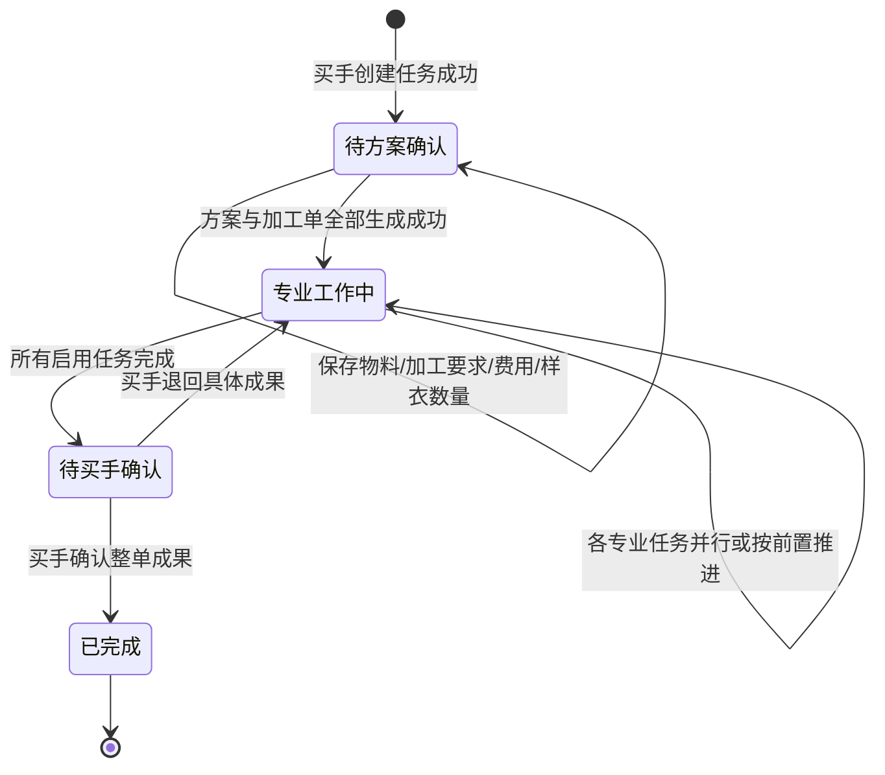

用户可见状态只使用“待方案确认、专业工作中、待买手确认、已完成”。内部状态也必须使用与这四个业务状态一一对应的新值；历史 `DRAFT`、`IN_PROGRESS`、`WAIT_CONFIRMATION`、`COMPLETED` 仅允许在一次迁移时识别并转换，迁移后不得继续写入或参与新增记录的状态判断。

### 5.7 设计改款时序图

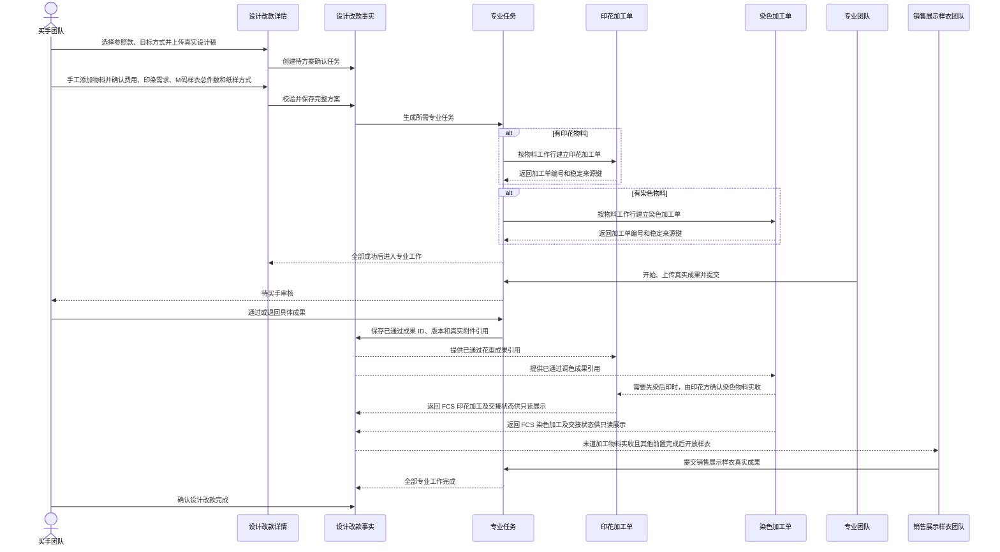

## 6. 印花／染色加工单联动

### 6.0 当前代码事实与接入边界

当前设计改款只会生成 PCS 花型／调色专业任务，没有任何加工单引用。现有 FCS 批量生成服务已经具备来源键去重、批量准备和失败回滚能力，但现有加工单来源只识别生产单、备货和裁片补料；直接调用会把设计改款错误显示为正式生产，并产生错误收货去向。

因此，本次不是重构加工单页面，而是先补一类明确的“设计改款打样”来源，再复用现有批量生成和既有列表／详情。不得把设计改款伪装成生产单、备货单或正式技术包来源。

### 6.1 建单口径

1. 生成花型任务时，按已确认的印花物料工作行建立印花加工单。
2. 生成调色任务时，按已确认的染色物料工作行建立染色加工单。
3. 加工单必须保存设计改款任务、专业任务、物料 SKU 和物料行的来源关系。
4. 相同“设计改款任务 + 专业任务 + BOM 版本 + 物料行 ID + 工艺类型”只能成功建立一次，加工单创建必须幂等。
5. 页面不复制印花／染色加工单的完整编辑能力，只显示关联摘要和现有详情入口。
6. 加工单需求量按整款计算：`单位用量 × 销售展示样衣总件数 ×（1 + 损耗率）`，再按物料档案单位换算；不能直接沿用参照款数量。计算过程保留完整精度，只在最终加工单需求数量上按现有 FCS 对应计量单位精度舍入。
7. 加工单创建时不要求买手选择具体加工厂。印花单先进入“待花型”，染色单先进入“待色样”；相应专业成果通过后，才进入现有待分厂／可加工阶段。内部继续沿用现有印花、染色初始状态，不另造一套执行状态。
8. 只有末道加工后的物料才交给系统默认的销售展示样衣制作团队／地点。单工序时，该工序就是末道；同一物料先染后印时，染色输出先交给印花待加工方，印花输出再交给样衣制作团队。任何一段都不能默认回生产单裁床或生产中转仓。
9. 同一物料同时需要染色和印花时，默认按“先染色、后印花”建立前置；页面以一行短标签显示，买手不需要再次编排复杂工艺路线。
10. 每张加工单按“BOM 物料行 × 工艺类型”建立；同一整款使用销售展示样衣总件数计算加工需求量。
11. 同一物料同时染色和印花时，两张加工单在确认方案时一并建立，但印花单必须等待染色物料由印花待加工方确认实收、且花型成果通过，不能仅凭染色方“已交出”或绕过前置直接开工。

12. 首道印花／染色加工单在专业成果已通过、PPIC 已分厂且加工厂已接单后，由中央仓在现有“待接收”页面生成备料调拨；调拨经仓库审核、加工厂按数量实收后，才能开始加工。先染后印时只给首道染色发料，印花不得再从中央仓重复发料。
13. 印花卷必须先完成真实卷标打印，保存打印人和打印时间，且数量、克重、幅宽等必要交付信息有效，才可勾选卷码并生成交出单；列表、全选、统计与提交必须使用同一判定。

### 6.2 一致性规则

“确认方案并生成工作”是一个整体动作：

- 先在内存中校验并准备全部专业任务，再准备 FCS 加工单批次；两边均可提交后才统一写入。
- 提交前保存 PCS 原记录快照；任一侧写入失败时，恢复 PCS 快照并回滚本批新建加工单，不得遗留孤儿专业任务或孤儿加工单。
- 专业任务和所有必需加工单全部提交成功，设计改款才进入“专业工作中”。
- 任一环节失败，设计改款仍停留在“待方案确认”，页面显示具体失败物料和“重试生成工作”。
- 重试时按完整幂等键复用提交前已经合法存在的同源对象，并补建缺失对象；不能生成重复单，也不能把上次失败批次的孤儿对象当成成功。
- 用户不得看到“任务已生成但加工单不存在”的成功提示。
- 已生成专业任务后修改物料或印染需求，只有全部相关专业任务和加工单均未开始时才可直接撤回；已有收料、加工或交接事实时，必须先按现有任务／加工单流程退回或作废，不能静默改写正在执行的对象。
- 花型／调色任务负责专业资料和买手审核；加工单负责分厂、收料、加工和交接。PCS 只保存加工单 ID、类型、来源键、来源物料行和前置关系，每次从 FCS 读取当前状态；不得在设计改款记录中再保存一份可参与门禁的加工状态。
- 花型通过后，印花加工单从“待花型”进入可加工；调色通过后，染色加工单从“待色样”进入可加工。
- 离开“待花型／待色样”时必须绑定买手已通过的具体成果 ID、版本和真实附件引用。成果被退回或产生新版本时，未开工加工单不能继续使用旧结果；只有新版本再次通过后才能开放。
- 销售展示样衣必须等待所有末道加工物料由指定团队按应收数量确认实收；仅“已交出”、部分接收、数量差异未处理或仍有末道单未完成时均继续阻断。
- 刷新或重新打开页面后，PCS 从稳定引用恢复任务与加工单关系，FCS 从自身事实恢复状态、接收团队和前后工序；不能重新生成、丢失或用缓存状态推进业务。

### 6.3 加工单来源快照

新增的“设计改款打样”来源至少保存：

| 信息 | 用途 |
|---|---|
| 设计改款任务 ID／编号 | 列表、详情和追溯 |
| 专业任务 ID／类型 | 关联花型或调色成果 |
| 已通过成果 ID、版本、真实附件引用 | 开放加工的准确依据；创建时可为空，通过审核后绑定 |
| 目标款式 ID／临时名称／正式 SPU | 识别加工对象 |
| 目标款式设计图 | 加工单列表、详情和打印识别 |
| BOM 版本、BOM 行 ID | 去重和追溯 |
| 物料 SKU、名称、真实图片 | 识别实际加工物料 |
| 需求数量和单位 | 加工和收货核对 |
| 下一加工方／中间接收地点 | 同一物料多道加工时的工序交接；无下一工序时为空 |
| 系统默认销售展示样衣制作团队／最终接收地点 | 末道加工完成后的最终去向和实收确认；不要求买手在第一步选择 |

该来源没有生产单和正式技术包时，页面、打印和导出显示“—”或不展示相应字段，不能伪造编号。

### 6.4 现有 FCS 能力的增量适配

| 现有能力 | 本次处理 |
|---|---|
| 批量准备、来源键去重、统一提交和失败回滚 | 复用现有加工单批量生成注册表和服务 |
| 加工单登记输入 | 将当前强制正式生产单快照的输入改成按来源区分的契约；“设计改款打样”不要求生产单／技术包字段，也不生成正式生产单快照 |
| 印花／染色加工单登记 | 增加“设计改款打样”来源分支，不走正式生产或备货默认分支 |
| 加工单列表和动态详情 | 保留现有页面，只补来源、目标款／物料图片和返回设计改款入口 |
| 工序与收货去向 | 补充显式前置关系；中间工序交给下一加工方，末道交给系统默认样衣制作团队／地点；禁止默认去生产单裁床或中转仓 |
| 首道备料调拨 | 不新建页面；从加工单进入现有待接收页面，按“成果已通过 → 已分厂 → 加工厂已接单”开放“生成备料调拨”；复用既有仓库审核和实收动作 |
| 印花交出 | 保留现有交出页面；待交出行、勾选、全选、统计和提交统一为“已打印卷标且数量／规格完整”的可交出判定 |
| 持久化恢复 | 设计改款来源加工单必须在刷新后按同一来源索引恢复；PCS 引用和 FCS 状态各自只有一个事实来源 |
| 只读编辑、导出和打印 | 显示设计改款编号、目标款、颜色、物料、数量和正确接收地点；隐藏不存在的生产单／技术包字段 |
| 状态 | PCS 只读展示简化状态；FCS 继续负责加工执行状态 |

新增来源类型后，必须对所有来源类型分支做一次结构影响检查，至少覆盖加工单任务链接、流程契约、在线视图、厂内仓库、移动执行任务、平台加工结果、PDA 交接事件和染色时效。任何未知来源都必须显式报错，不能默认落到正式生产。

### 6.5 同一物料先染后印时序图

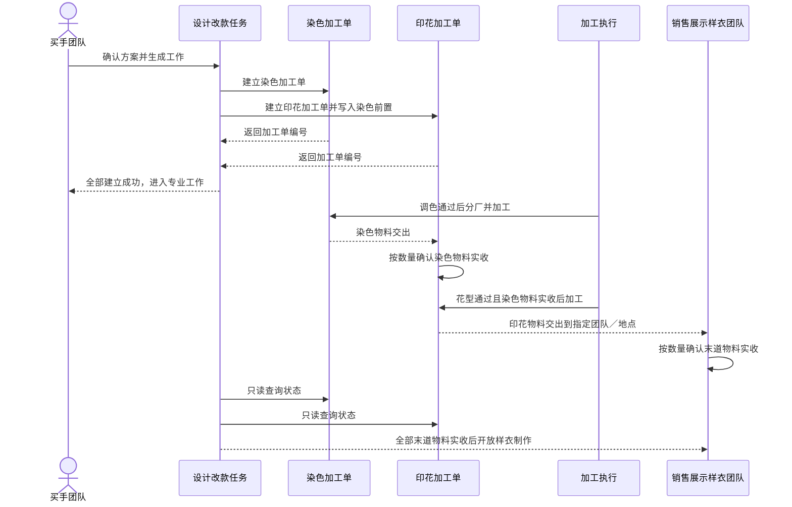

### 6.6 关联生成状态图

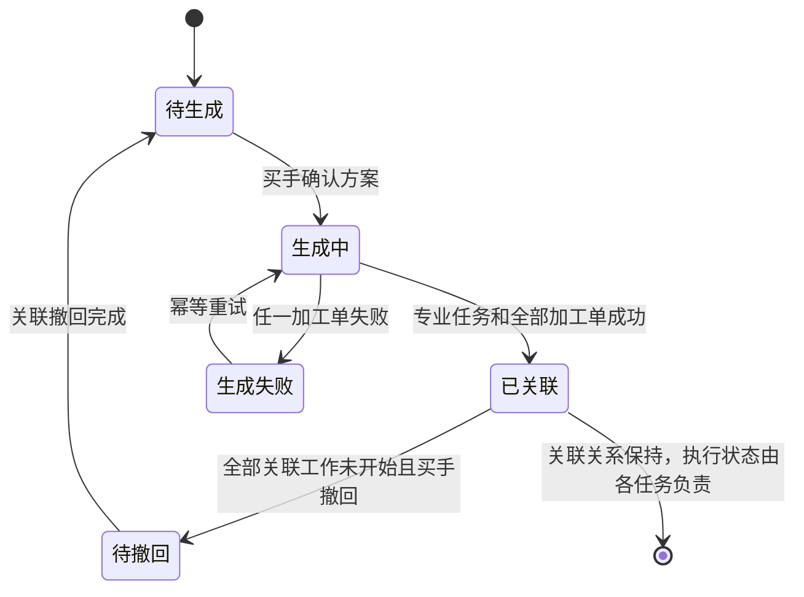

该状态图只描述 PCS 的“是否已完整建立关联”，不重定义 FCS 加工执行状态，也不把销售展示样衣状态混入加工单状态。

### 6.7 FCS 状态只读映射与样衣开放条件

| PCS 简化显示 | FCS 事实 | 销售展示样衣 |
|---|---|---|
| 待专业成果 | 印花待花型，或染色待色样 | 阻断 |
| 待安排加工 | 专业成果已满足，尚未完成分厂／收料 | 阻断 |
| 加工中 | 任一工序已收料或正在加工 | 阻断 |
| 待接收 | 末道已交出，但样衣制作团队尚未实收 | 阻断 |
| 差异待处理 | 部分接收、数量不符或交接异常 | 阻断 |
| 已收齐 | 所有末道加工物料按应收数量完成实收 | 允许结合其他前置判断是否开始 |

上述简化文字只用于 PCS 展示。真正的加工状态、数量和交接事实仍由 FCS 现有状态机负责，PCS 不保存或回写这些值。

## 7. 线下临时 SPU 与正式款式档案承接

### 7.1 临时 SPU 规则

- 临时 SPU 只保存“临时名称、设计改款任务编号、创建时间、创建买手”。
- 不在设计改款阶段伪造正式款式 ID、正式 SPU 编码、SKU、商品项目节点或档案状态。
- 设计改款任务、颜色方案、物料方案、费用、设计稿、基码纸样和专业成果都挂在设计改款任务上。
- 设计改款完成后仍可保持未建档状态；是否立即建档由商品项目流程决定。

### 7.2 正式建档关联

正式创建商品／款式档案时，页面增加“关联设计改款任务”选择项。仅可选择：

- 目标为线下临时 SPU；
- 状态为已完成；
- 尚未绑定正式款式档案；
- 与当前商品项目业务对象不冲突的设计改款任务。

关联后可继承：临时 SPU 名称、设计稿当前版本、整款物料方案、整款费用、基码纸样和专业成果来源。正式 SPU 编码、商品主信息和 SKU 编码仍由正式建档流程生成。

### 7.3 关联时序图

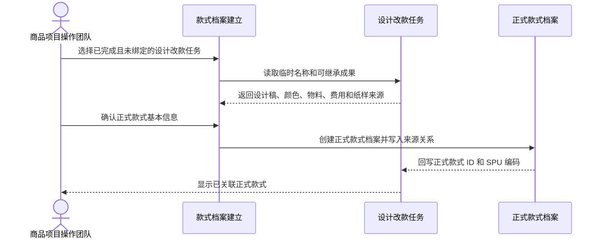

绑定成功后，设计改款历史名称不被覆盖；页面同时显示“创建时临时名称”和“当前正式 SPU”，保证追溯。

## 8. 生产准备管理目标流程

### 8.1 触发边界

业务最终规则是“测款通过并确认做大货后进入生产准备”。但本次不与尚待调整的商品测款原型做强依赖，因此采用以下临时规则：

1. 生产准备单创建弹窗继续要求跟单确认“已满足做大货要求”并填写依据。
2. 该确认只代表本次原型中的人工业务确认，不宣称系统已经读取真实测款结果。
3. 预留后续触发来源字段；商品测款调整完成后再把人工确认替换为真实测款事实。
4. 同一正式 SPU 仍只允许一张未关闭的生产准备单。

### 8.2 流程图

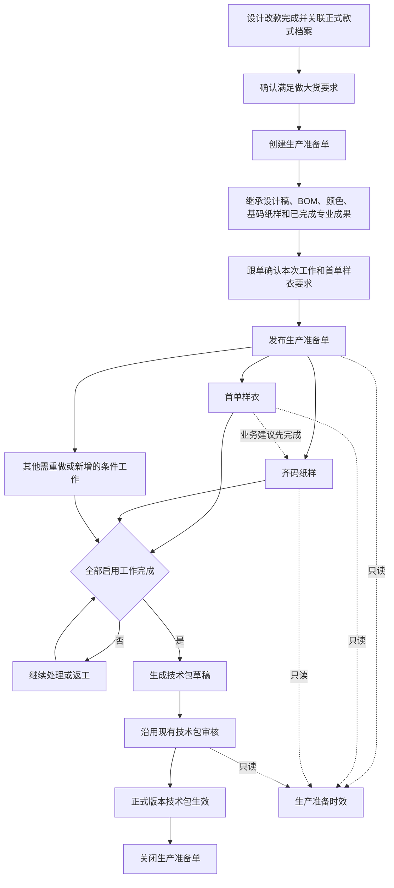

图中的虚线“业务建议先完成”不是系统依赖。首单样衣和齐码纸样在发布后都可以开始。

### 8.3 前期资料继承

生产准备单创建时保留现有成果复用区域，但调整为“前期资料”摘要：

| 前期资料 | 处理方式 |
|---|---|
| 设计稿 | 只读引用设计改款当前确认版本 |
| 整款 BOM／价格 | 复制为生产准备单可确认的方案，保留来源设计改款编号和版本 |
| 基码纸样 | 只读引用设计改款阶段已完成或买手直接上传的真实文件，不生成生产准备基码任务 |
| 花型／调色成果 | 默认复用已通过结果；确需重做时，由跟单在现有任务方案中明确选择重新执行 |
| 销售展示样衣 | 作为前期成果和图片参考，不替代首单样衣 |

生产准备单发布前必须存在可用基码纸样。优先读取已关联设计改款任务的确认版本；没有关联设计改款的历史／例外款式，可以明确选择一份既有、已确认的基码纸样作为前期资料。没有可用基码纸样时阻断发布并引导补齐前期资料，不得在生产准备阶段临时新增基码纸样任务。

### 8.4 本次工作与依赖

| 工作 | 默认规则 | 前置 | 与当前相比 |
|---|---|---|---|
| 首单样衣 | 必做 | 生产准备单已发布、首单样衣要求已下达、已有可用基码纸样 | 删除“等待本阶段基码纸样” |
| 梭织齐码纸样 | 梭织／组合款必做 | 准备单已发布、已有可用基码纸样 | 取消对首单样衣的硬依赖 |
| 毛织齐码纸样 | 毛织／组合款必做 | 准备单已发布、已有可用基码纸样 | 取消对首单样衣的硬依赖 |
| 花型／调色 | 有未完成要求或明确重做时启用 | 相应物料要求已确认 | 已完成的设计改款成果默认复用 |
| 辅料下单 | BOM 存在采购需求时启用 | 生产准备 BOM 与价格已确认 | 保留现有规则 |
| 技术包确认 | 必做 | 本次所有启用工作完成、生产准备 BOM 与价格已确认 | 保留“等待全部启用任务”规则 |

生产准备详情页继续使用现有任务方案表格，只删除生产准备基码纸样行，将其移到“前期资料”摘要。首单样衣和齐码纸样行的“需要先完成”均显示“前期资料已具备”；齐码纸样行附一个非阻断标签“建议在首单样衣确认后完成”。

### 8.5 生产准备状态图

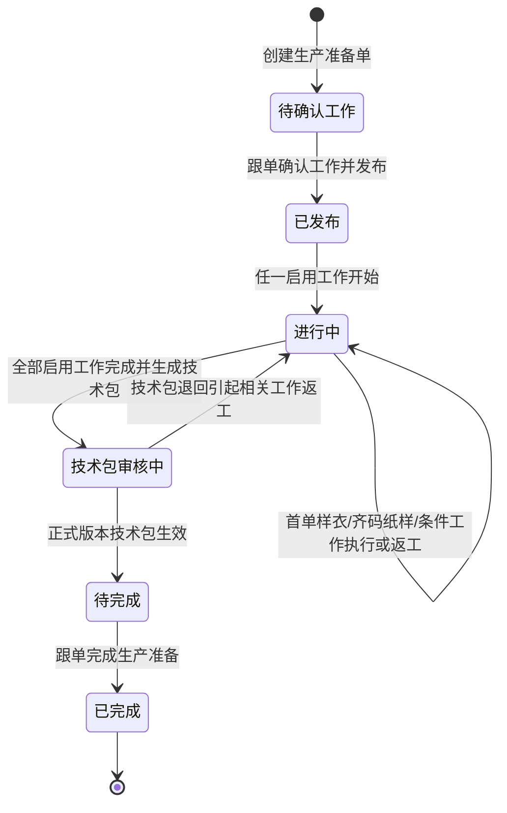

### 8.6 生产准备时序图

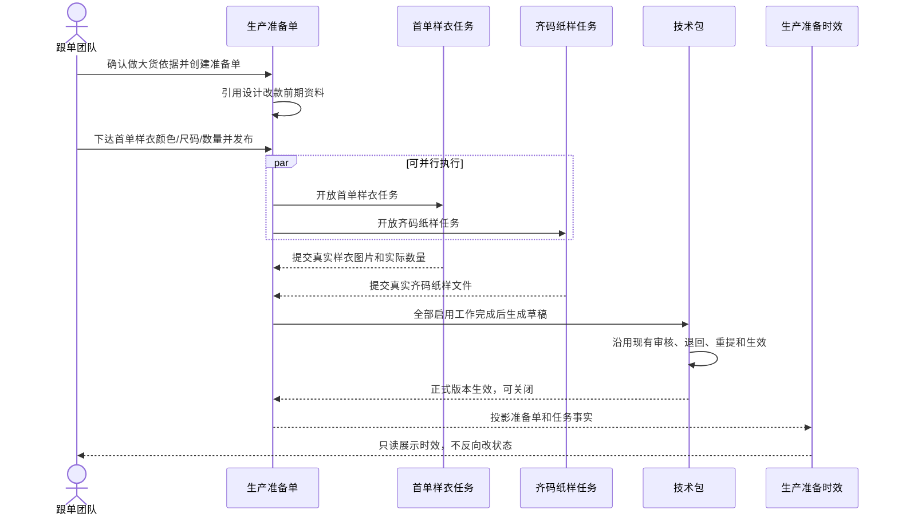

### 8.7 首单样衣

保留当前“颜色 + 尺码 + 要求数量（件）+ 制作要求”下达方式和逐行实际交付方式：

- 跟单在发布前下达至少一行要求。
- 同一颜色和尺码不能重复。
- 制作团队进入任务后按唯一制作要求填写实际数量、使用纸样版本和差异说明；实际交付可补充颜色信息，但不改变 M 码总件数要求口径。
- 每行必须上传对应的真实样衣图片。
- 实际结果与要求不一致时，差异说明必填。
- 页面和列表统一显示“首单样衣”，不得显示“产前版样衣”。

### 8.8 齐码纸样

齐码纸样详情继续复用现有制版任务页面，只按任务类型裁剪表单：

| 项目 | 齐码纸样要求 |
|---|---|
| 真实纸样文件 | 必传至少一个 `.prj`；DXF、RUL、PDF 可作为补充 |
| 纸样预览图 | 当前不强制 |
| 适用尺码 | 当前不强制单独填写；由文件和技术包阶段完善 |
| 幅宽、捆条、裁片部位、面料、里布等 | 当前不展示、不校验，在技术包中维护 |
| 成果说明 | 可选 |
| 替换版本 | 允许新增版本，旧文件继续保留 |

基码纸样重新制作任务仍可沿用现有较完整的真实文件和预览要求；只对齐码纸样使用上述精简规则。

### 8.9 技术包

技术包审核流程不变，只做以下上游适配：

- 基码纸样读取设计改款的已确认版本。
- 齐码纸样读取生产准备阶段上传的真实文件。
- 幅宽、捆条、裁片部位、面料条件、里布条件等在技术包中填写和完善。
- BOM 与价格读取生产准备单已确认方案，并保留设计改款来源版本。
- 技术包退回专业任务时继续沿用现有返工桥接和审核记录。

## 9. PCS 与 FCS 的样衣边界

| 阶段 | 系统 | 样衣名称 | 产生时点 | 负责方 | 审核／确认方 |
|---|---|---|---|---|---|
| 设计改款 | PCS | 销售展示样衣 | 设计改款专业成果具备后 | 制作团队 | 买手团队 |
| 生产准备 | PCS | 首单样衣 | 生产准备单发布后 | 制作团队 | 沿用 PCS 当前确认逻辑 |
| 生产执行 | FCS／PPIC | 产前版样衣 | PPIC 把车缝任务分配给三方工厂后 | 三方工厂 | PPIC 接收，审版团队审核 |

本次 PCS 调整不得修改 FCS 的“产前版样衣”对象、状态或页面。反向回归必须确认：PCS 页面没有“产前版样衣”，FCS 页面仍保留且语义不变。

## 10. 页面级增量调整清单

### 10.1 标准列表统一结构

生产准备单、设计改款、制版、花型、调色、辅料下单、技术包确认、销售展示样衣和首单样衣九张列表统一使用以下层级：

1. 页面标题与页面级主操作：标题左对齐，新建或查看准备单等主操作右对齐。
2. 查询卡片：所有条件包在同一张大卡片；第一行放关键词、状态、当前需处理的团队等高频条件，第二行固定放“查询、重置、导出”；低频条件只在卡片内展开。
3. 统计卡片：位于查询卡片正下方，与当前查询结果使用同一范围；查询和重置后同步刷新。
4. 数据列表卡片：列表名称和记录数在左侧，“列设置”固定在表头最右侧；表格和分页属于同一卡片。
5. 分页：显示总数、当前范围、当前页、总页数和每页条数。

结构以染色加工单 `/fcs/craft/dyeing/work-orders` 去掉工厂切换 Tab 后的页面层级为参照。只复用布局和交互秩序，不照搬染色的接收、加工、交出、加工厂、批量打印或专用导出。生产准备管理不存在工厂切换维度，因此九张列表均不增加工厂 Tab。

查询行为必须真实有效：“查询”同时刷新统计、列表和总条数；“重置”清空全部条件并恢复全部记录；“导出”下载当前条件下的全部匹配记录，不限当前页且不包含操作列；无数据时明确提示“暂无可导出的数据”。“当前需处理的团队”是查询条件之一，不再是唯一查询条件，也不增加“我的任务”等重复标签。

设计改款列表的“参照款式 → 目标款式”列使用纵向关系：参照款完整信息块在第一行；第二行箭头固定左对齐，目标款完整信息块紧随其后。已建档目标款和线下临时 SPU 使用同一排布，款式图片、款号、名称不得拆散。

### 10.2 页面调整范围

| 页面／区域 | 保留 | 局部调整 | 禁止做法 |
|---|---|---|---|
| 左侧菜单 | 现有分组、顺序、图标和子菜单 | 分组名称改为“生产准备管理”；子菜单“工程主单”改为“生产准备单”；全部入口改用新正式地址 | 重排全站导航、保留旧名称活动入口、重做菜单组件 |
| 设计改款列表 | 标准表格、分页、列设置、任务详情入口 | 创建人／负责人改为买手；目标款支持临时名称；补齐查询卡片和统计卡片；参照款与目标款纵向堆叠 | 增加“设计／改款”分类、增加多套我的任务标签、横向挤压两个款式 |
| 新建设计改款弹窗 | 当前弹窗结构、真实设计稿上传、预览和错误反馈 | 目标方式、临时名称、纸样方式、直接复用纸样上传、买手身份 | 拆成向导页、跳转多个页面、上传假文件名 |
| 设计改款详情页头 | 参照款／目标款卡片、状态、返回列表 | 临时 SPU 显示、当前团队、买手信息、短状态 | 堆放重复流程说明 |
| 设计稿区 | 缩略图、大图、历史版本 | 上传／替换权限改为买手，确认前可替换 | 跟单上传、无真实文件的模拟上传 |
| 设计改款步骤 | 现有步骤导航组件 | 四步压缩为三步，删掉独立跟单安排步骤 | 新建完全不同的详情布局 |
| 方案确认区 | 现有颜色表、物料表、费用表、样衣要求表 | 移除二级 Tab；当前页联动；一次确认 | “维护物料”跳转独立页面、弹窗再套弹窗 |
| 专业工作区 | 现有表格和“进入任务”链接 | 增加加工单摘要；修正前置和当前团队 | 在总任务页直接复制各专业完整表单 |
| 制版任务详情 | 现有任务页头、版本、上传、返工、依赖和日志 | 区分基码和齐码的上传门禁；齐码表单精简 | 为齐码另建一套整页 |
| 花型／调色详情 | 现有成果提交和买手审核 | 显示关联加工单编号和入口 | 重构 FCS 加工单页面 |
| 销售展示样衣详情 | 现有真实图片、颜色／尺码／数量逐行提交 | 依赖最终物料、花型／调色和可用基码纸样 | 允许无制作要求或无真实图片完成 |
| 全部专业任务列表 | 现有表格、分页、列配置和详情入口 | 按第 10.1 节补齐查询卡片、真实查询／重置／导出、同口径统计和统一列表表头 | 只保留团队下拉、放无行为按钮、照搬染色业务字段或工厂 Tab |
| 生产准备单列表 | 现有表格、创建入口和唯一性校验 | 使用新名称、新地址和新内部对象；补齐第 10.1 节全部列表结构；人工做大货确认说明收短 | 强行读取当前不完整的测款原型、保留“工程主单”别名或旧地址活动入口 |
| 生产准备单详情 | 现有页头、BOM 摘要、任务表、发布和关闭 | 基码纸样移入前期资料；首单与齐码并行；短提示推荐顺序 | 重做整个准备单详情、复制专业任务表单 |
| 首单样衣详情 | 当前颜色／尺码／数量要求及实际交付 | 去除基码纸样任务硬依赖，改读前期资料 | 改名为产前版样衣 |
| 技术包 | 现有工作区和审核 | 接入新来源；保留审核流程 | 改审核团队、状态或正式版本规则 |
| 生产准备时效 | 现有列表、详情和只读属性 | 不再把设计改款基码纸样计入生产准备时效 | 从时效页直接开始／完成任务 |
| 商品／款式档案建立 | 现有建档入口和字段 | 增加关联已完成临时 SPU 设计改款任务 | 在设计改款时伪造正式档案 |

## 11. 文案精简规范

### 11.1 保留文案的三种情况

只在以下情况显示说明：

1. 用户若不知规则就可能提交错误，例如“纸样不变时必须上传真实纸样文件”。
2. 当前动作存在不可逆影响，例如“确认后将生成专业任务和加工单”。
3. 操作失败需要明确恢复，例如“第 2 行印花加工单创建失败，资料未确认，可重试”。

### 11.2 删除或改短的文案

| 当前类型 | 处理 |
|---|---|
| 重复说明当前团队、当前步骤和下一步 | 只在页面头保留当前团队；步骤导航表达进度 |
| “系统根据……生成……”的长说明 | 改成动作结果，如“确认后生成 3 项专业工作” |
| 每个卡片都解释字段来源 | 删除；来源放到查看详情或操作记录 |
| 空区块先显示一大段指导 | 直接显示可操作空状态，例如“新增物料” |
| 技术词“投影、骨架、事实源、所有者阶段” | 用户页面改为“来自、已生成、当前资料、关联任务” |
| “维护物料” | 视动作改为“选择物料”“添加物料”或“修改物料” |

### 11.3 推荐页面主按钮

| 页面／步骤 | 主按钮 |
|---|---|
| 新建设计改款 | 创建并进入方案确认 |
| 设计改款方案 | 确认方案并生成工作 |
| 专业任务 | 提交本次成果 |
| 设计改款成果 | 确认设计改款完成 |
| 生产准备任务方案 | 确认工作并发布 |
| 首单样衣 | 提交本次实际结果 |
| 齐码纸样 | 提交并完成任务 |
| 技术包 | 沿用当前按钮文案 |

## 12. 数据与兼容调整

### 12.1 设计改款记录

在现有设计改款记录上增量增加或调整以下业务字段，不拆新仓储：

| 字段语义 | 规则 | 历史兼容 |
|---|---|---|
| 负责买手 | 保存买手团队和买手 ID／姓名 | 历史记录缺失时从创建人或现有操作记录补默认展示，不改写历史事实 |
| 目标款方式 | 已建档 SPU／线下临时 SPU | 历史记录默认为已建档 SPU |
| 临时 SPU 名称 | 目标款未建档时必填 | 历史记录为空 |
| 已关联正式款式 | 建档后回写正式款式 ID 和 SPU 编码 | 历史记录沿用当前目标款 |
| 纸样处理方式 | 直接复用／重新制版 | 历史任务根据是否已有基码纸样任务推导 |
| 直接复用纸样文件 | 买手上传的真实文件 | 历史为空，不伪造 |
| 加工单关联 | 专业任务下按物料行只保存加工单 ID、类型、来源键、前置和来源行；状态实时读取 FCS | 历史为空，页面显示“历史任务无联动记录” |

历史记录内部如仍带有“设计／改款”来源标识，只用于兼容读取；创建、列表、详情、来源展示、统计、Mock 和测试统一视为“设计改款”，不再向用户显示分类或按该分类统计。

### 12.2 生产准备单

- 将原“工程主单”对象、仓储、字段、关联 ID、事件、页面状态、持久化键和测试完整迁移为“生产准备单”语义，不以显示映射代替内部迁移。
- 迁移期间只允许读取旧记录并一次转换；新增和修改只写新结构，不保留双写或第二套准备单对象。
- 菜单、列表、详情、任务来源、技术资料、时效、导入导出和跨页面跳转全部使用第 4.3 节的新正式地址及名称。
- 现有基码纸样任务类型保留历史读取能力，但新建准备单不再生成该任务。
- 前期资料引用保存来源设计改款任务、来源专业任务、结果版本和文件 ID。
- 首单样衣和齐码纸样的新任务依赖都指向“前期资料可用”，不互相硬依赖。
- 技术包仍依赖本次所有启用任务完成。

### 12.3 “首单样衣”内部迁移

当前 PCS 内部任务类型 `PRE_PRODUCTION_SAMPLE` 与真实业务“首单样衣”不一致。本次必须：

1. 将 PCS 任务类型、字段、关联、仓储键、页面状态、导出、操作记录、时效和测试迁移为 `FIRST_SAMPLE`／“首单样衣”。
2. 旧 PCS 记录只在一次迁移时识别 `PRE_PRODUCTION_SAMPLE`，转换后只保存新类型。
3. 测试同时扫描用户可见文案和 PCS 内部活动结构，禁止再次使用旧类型推进业务。
4. FCS 的真实“产前版样衣”保持独立对象，不参与 PCS 迁移，也不得被改成首单样衣。

### 12.4 真实上传

所有上传继续使用当前真实文件读取、类型校验、大小校验、上传中、成功、失败、删除和预览机制。不得用文件名字符串、静态假地址或预置成功状态替代用户选择的本地文件。

## 13. 异常、防错与恢复

| 场景 | 阻断结果 | 用户恢复动作 |
|---|---|---|
| 未上传设计稿 | 不能创建设计改款 | 选择本地真实图片后重试 |
| 纸样不变但未上传 `.prj` | 不能创建或确认方案 | 上传真实基码纸样 |
| 参照款与已建档目标款相同 | 不能创建 | 重新选择目标款或改用临时 SPU |
| 临时 SPU 名称为空或重复且未说明 | 不能创建或提示可能重复 | 补充名称或选择现有未绑定任务 |
| 尚未添加物料 | 不能确认方案 | 在“物料与费用”卡片新增至少一条物料 |
| 物料标记印花／染色但信息不完整 | 不能生成工作 | 补齐对应工艺需求 |
| 专业任务／加工单统一提交失败 | 整体不进入专业工作 | 自动恢复两边原状，保留方案后重试；不得留下孤儿或重复对象 |
| 新增加工单来源未被某个消费页面识别 | 明确报错并停止该页面业务动作 | 补齐该来源分支；不得按正式生产默认展示或入仓 |
| 已有关联加工单开始收料或加工后修改方案 | 不能直接撤回并改写 | 先按现有任务／加工单流程退回或作废，再返回方案调整 |
| 末道加工物料仅交出、部分接收或数量有差异 | 销售展示样衣不能开始 | 指定样衣团队确认实收并关闭数量差异 |
| 上传中断 | 不写入成功文件 | 显示失败文件和重新选择入口 |
| 专业成果被退回 | 只退回对应任务／结果 | 原团队按原因重新提交，其他已通过结果不回退 |
| 临时 SPU 已被其他档案绑定 | 阻断重复绑定 | 选择正确设计改款任务或查看已绑定档案 |
| 生产准备单缺少可用基码纸样 | 不能发布 | 关联设计改款结果或选择既有已确认基码纸样 |
| 首单样衣与要求不一致 | 允许记录，但差异说明必填 | 补填差异或改正实际值 |
| 齐码纸样无真实文件 | 不能完成任务 | 上传至少一个真实 `.prj` |
| 技术包资料不完整 | 沿用现有审核阻断 | 在技术包中补充并重新提交 |
| 时效页面点击执行动作 | 不提供此类动作 | 从任务详情进入执行 |

## 14. Mock 场景要求

调整后的 Mock 至少覆盖以下场景，且每个款式、物料、设计稿和样衣都必须有与对象对应的真实图片：

| 场景编号 | 场景 |
|---|---|
| MOCK-01 | 已建档目标 SPU；纸样不变；无印花、无染色；直接进入销售展示样衣 |
| MOCK-02 | 临时 SPU；纸样不变；买手上传真实基码纸样；从空白方案手工新增物料 |
| MOCK-03 | 临时 SPU；需要重新制版；含两条印花物料；生成花型任务和两张印花加工单 |
| MOCK-04 | 已建档目标 SPU；含面料染色和纱线染色；生成两个调色工作组及对应染色加工单 |
| MOCK-05 | 设计改款专业成果被买手退回后重提 |
| MOCK-06 | 已完成临时 SPU 设计改款在正式建档时被关联并继承资料 |
| MOCK-07 | 生产准备单中首单样衣先完成、齐码纸样后完成 |
| MOCK-08 | 生产准备单中齐码纸样先完成、首单样衣后完成，证明并行不阻断 |
| MOCK-09 | 齐码纸样上传多个真实文件，不填写额外技术字段也可完成 |
| MOCK-10 | 技术包因资料缺失退回、补充后重新提交并生成正式版本 |
| MOCK-11 | PCS 首单样衣与 FCS 产前版样衣同时存在，术语和来源互不混淆 |
| MOCK-12 | 加工单创建失败后幂等重试，仅补缺失加工单 |
| MOCK-13 | 同一物料同时需要染色和印花，两张加工单同时建立并按先染后印推进 |
| MOCK-14 | 历史颜色／尺码多行要求汇总为一个 M 码总件数，验证数量不丢失、损耗和单位换算 |
| MOCK-15 | 末道加工物料由销售展示样衣制作团队按数量确认实收、差异关闭后才开放样衣任务，并验证刷新恢复 |
| MOCK-16 | 历史设计、改款记录混合存在，但所有页面和统计统一显示为设计改款 |
| MOCK-17 | 花型／调色成果真实上传、买手退回、重提及刷新后文件恢复 |

## 15. 实施工作包

### WP-01：名称与术语收口

- 业务目标：把 PCS 模块统一为“生产准备管理”，把“工程主单”完整迁移为“生产准备单”，把 PCS 的旧产前版类型迁移为“首单样衣”。
- 主要位置：菜单、路由总入口、生产准备单及专业任务的类型／仓储／页面／事件／持久化、生产准备时效、技术资料、Mock、导入导出、测试和文档。
- 修改：实施第 4.3 节的新正式地址与内部对象；旧记录一次迁移；删除旧地址、旧路由注册、全部旧跳转引用和兼容跳转；禁止继续写旧对象或双写新旧结构。
- 验证：新地址穷举、旧地址与重定向零残留、历史数据迁移、内部字段和持久化键扫描、全局业务文案扫描、PCS 命名页面检查、FCS 产前版页面回归。
- 完成条件：菜单和全部内部链接只使用新地址；新增、编辑、统计、导出只读取新结构；PCS 无旧“工程主单”或错误“产前版样衣”，FCS 术语未被误改。

### WP-02：设计改款身份、目标款与创建门禁

- 业务目标：由买手创建并上传设计稿，支持已建档和临时 SPU。
- 主要位置：`src/data/pcs-engineering-master-types.ts`、`src/data/pcs-engineering-master-sampling.ts`、`src/pages/pcs-independent-sampling.ts`、当前用户与团队目录。
- 修改：创建输入、角色校验、记录规范化、弹窗字段、真实上传和创建状态映射。
- 验证：买手正常创建、非买手阻断、临时 SPU、同款阻断、上传失败保留表单。
- 完成条件：两种目标方式都能创建；操作记录保存实际买手。

### WP-03：设计改款三步详情和浅层交互

- 业务目标：把四步压缩为三步，删除颜色和参考带料模块，将手工物料、加工要求、费用和 M 码样衣总件数放在同一方案步骤。
- 主要位置：`src/pages/pcs-independent-sampling.ts` 的步骤导航、买手准备、工作安排、详情事件和输入处理。
- 修改：移除二级 Tab、独立跟单安排步骤、新款颜色、参考物料处理和样衣要求多行增删；将物料与费用合并为一张大卡片；保持局部刷新。
- 验证：1366×768 首屏、一次物料选择层、无整页闪烁、返回后滚动位置不丢失。
- 完成条件：从进入第一步到确认方案无需离开详情页，常用操作深度不超过一层；页面只出现手工物料、费用、M 码总件数和制作要求。

### WP-04：纸样处理与专业任务规则

- 业务目标：纸样不变直接上传，需要制版才生成任务；销售展示样衣等待全部必要成果。
- 主要位置：`src/data/pcs-engineering-master-types.ts`、`src/data/pcs-engineering-master-sampling.ts`、独立任务详情路由和制版任务适配。
- 修改：纸样方式、直接文件、任务建议、任务生成和依赖规则。
- 验证：直接复用不生成任务；重新制版生成任务；销售展示样衣前置正确。
- 完成条件：两条纸样路径均可走到设计改款完成。

### WP-05：印花／染色加工单联动

- 业务目标：专业任务与对应加工单同时生成且可追溯。
- 设计改款侧位置：`src/data/pcs-engineering-master-types.ts`、`src/data/pcs-engineering-master-sampling.ts`、`src/pages/pcs-independent-sampling.ts`。在专业任务下保存 `processWorkOrderRefs[]`，一条引用对应一个“BOM 行 × 工艺类型”的加工单。
- 加工单生成位置：`src/data/fcs/process-work-order-domain.ts`、`src/data/fcs/process-work-order-generation-key.ts`、`src/data/fcs/process-work-order-generation-registry.ts`、`src/data/fcs/process-work-order-generation-service.ts`、`src/data/fcs/printing-task-domain.ts`、`src/data/fcs/dyeing-task-domain.ts`。把当前 `ProcessWorkOrderRegistrationInput` 的正式生产单强制快照改为按 `sourceType` 区分的输入契约；增加明确的“设计改款打样”来源、来源快照、幂等键和批量提交；复用 `prepareProcessWorkOrderBatch` 等现有批量准备与回滚，不走生产单／备货／裁片补料的默认分支。
- 加工单消费位置：`src/data/fcs/process-order-task-links.ts`、`src/data/fcs/process-order-flow-contract.ts`、`src/data/fcs/process-order-three-axis-view.ts`、`src/data/fcs/process-order-receiving-target.ts`、`src/data/fcs/process-execution-writeback.ts`、`src/data/fcs/process-warehouse-linkage-service.ts`、`src/data/fcs/page-adapters/process-prep-pages-adapter.ts`、`src/data/fcs/task-print-cards.ts`、`src/data/fcs/fcs-route-links.ts`。补齐任务链接、先染后印、列表、详情、刷新恢复、打印、接收去向和正确详情路由；不存在的生产单／技术包字段不展示。
- 来源影响核查：对新增来源类型执行结构影响分析，并逐项核对 `src/data/fcs/dye-work-order-online-view.ts`、`src/data/fcs/factory-internal-warehouse.ts`、`src/data/fcs/mobile-execution-task-index.ts`、`src/data/fcs/platform-process-result-view.ts`、`src/data/fcs/pda-handover-events.ts`、`src/data/fcs/dye-work-order-times.ts`，禁止未知来源静默按正式生产处理。
- 跨仓提交：新增最小协调入口，先构造 PCS 专业任务与 FCS 加工单批次，确认两边可提交后再写入；失败时恢复设计改款原快照并回滚本批加工单。不得用“先写一边、另一边失败后留待人工清理”代替一致性。
- 页面修改：PCS 专业任务行只增加加工单编号、简化状态和现有详情入口；不复制加工单表单，不重构 FCS 列表或详情。
- 验证：单物料、历史多行数量汇总、多物料、无印染、仅印花、仅染色、同一物料先染后印、需求量公式、正确接收去向、来源显示、刷新恢复、失败重试、重复点击和真实详情路由。
- 完成条件：两边不存在孤儿记录；不存在已进入专业工作但缺必需加工单的记录；加工单不冒充生产单来源；刷新后关系不丢；销售展示样衣只在指定团队按应收数量实收末道物料且差异关闭后开放。

### WP-06：临时 SPU 正式建档承接

- 业务目标：正式建档时关联设计改款并继承已确认资料。
- 主要位置：款式档案仓储、商品项目“项目与档案建立”节点、设计改款关系写回、项目归档收集。
- 修改：候选任务、唯一绑定、继承清单、双向关系和历史显示。
- 验证：正常绑定、重复绑定阻断、未完成任务不可选、绑定后历史可追溯。
- 完成条件：正式档案和设计改款双向可打开，继承字段一致。

### WP-07：生产准备单和生产准备依赖调整

- 业务目标：生产准备不重复制作基码纸样；首单样衣和齐码纸样可并行。
- 主要位置：当前生产准备依赖、原工程准备单仓储／视图／详情及其迁移后的 `production-preparation` 对应文件。
- 修改：完成内部对象和文件命名迁移，并调整任务方案、固定依赖、前期资料引用、页面任务行和推荐提示。
- 验证：各生产准备类型、复用／重做条件任务、两种并行完成顺序、技术包门禁。
- 完成条件：新准备单没有生产准备基码任务；两个主任务互不阻断。

### WP-08：齐码纸样表单裁剪

- 业务目标：齐码纸样当前只上传真实纸样文件。
- 主要位置：`src/pages/pcs-engineering-tasks/plate-making-task.ts`、`src/data/pcs-engineering-pattern-result.ts`、上传规则和版本展示。
- 修改：按任务类型区分校验；齐码隐藏预览和额外信息；基码路径保持现有门禁。
- 验证：齐码单／多文件、替换版本、无文件阻断、基码回归。
- 完成条件：齐码无需填写技术包字段即可完成，真实文件仍为硬门禁。

### WP-09：首单样衣保持与解耦

- 业务目标：保留颜色、尺码、数量和真实图片，并取消对本阶段基码任务的依赖。
- 主要位置：`src/pages/pcs-engineering-tasks/first-sample-task.ts`、生产准备单仓储和任务公共页。
- 修改：可用纸样来源改为前期资料；页面业务名映射统一。
- 验证：多颜色多尺码、实际差异、缺图阻断、与齐码并行。
- 完成条件：首单样衣可独立推进且数据完整。

### WP-10：技术包上游适配

- 业务目标：技术包读取正确的基码、齐码、BOM 和专业成果，审核流程不变。
- 主要位置：`src/data/pcs-engineering-tech-pack-workspace.ts`、技术包页面、审核和激活服务。
- 修改：仅调整资料收集映射和缺失提示。
- 验证：草稿生成、审核退回、重提、生效、正式版本消费回归。
- 完成条件：现有审核节点和权限无变化，来源文件正确。

### WP-11：生产准备时效只读投影

- 业务目标：只统计生产准备单与本阶段任务，不把设计改款基码纸样算入时效。
- 主要位置：`src/data/pcs-engineering-preparation-projection.ts`、`src/data/fcs/production-preparation-timing-runtime.ts`、生产准备时效页面。
- 修改：投影项目、任务链接、依赖文字和当前阻断原因；不新增写入口。
- 验证：首单／齐码并行投影、基码排除、链接详情、只读门禁。
- 完成条件：时效数据与生产准备单一致且无法反向改状态。

### WP-12：Mock、测试、治理与交付证据

- 业务目标：用完整业务场景证明方案而不是只通过构建。
- 主要位置：设计改款、生产准备单、制版、首单、技术包、时效相关 Mock、专项脚本、Playwright 和原型审查记录。
- 修改：更新冲突 Mock 和旧断言，增加本方案场景；保留真实图片和真实上传。
- 验证：专项契约、命名页面、完整流程、两轮追踪、治理检查、构建和任务收据。
- 完成条件：原子需求全部有当前版本证据，无未说明待验证项。

### WP-13：生产准备管理列表统一

- 业务目标：让九张标准列表使用一致的查询、统计、列表和分页结构，同时保留各页面自己的业务字段。
- 主要位置：标准列表公共组件、生产准备单、设计改款、制版、花型、调色、辅料下单、技术包确认、销售展示样衣和首单样衣列表。
- 修改：按第 10.1 节增加统一查询卡片、真实查询／重置／导出、同口径统计、列表卡片和分页；列设置固定在列表表头最右侧；设计改款款式对照改为纵向堆叠。
- 验证：九张列表逐页在 1366×768 和 1280×720 操作；查询、重置、无数据导出、跨页导出、统计同步、列设置和款式关系逐项留证。
- 完成条件：九张列表结构一致、功能真实可用、无工厂切换 Tab、无染色专属字段，查询结果与统计和导出一致。

## 16. 原子需求追踪矩阵

> 本表最初用于实施前追踪；当前已把本轮直接完成的 `NAME-004`、`DR-010`～`DR-015`、`DR-018` 同步为“已验证”，其余条目仍保留原实施计划状态。每条编号的完整实现位置、自动化结果、页面证据和验收版本统一记录在《PCS 设计改款与生产准备管理实施验收报告》中，计划文档本身不替代完成证明。

| 编号 | 来源 | 原子需求 | 工作包 | 预期实现位置 | 自动化验证 | 页面／流程证据 | 状态 |
|---|---|---|---|---|---|---|---|
| NAME-001 | §1、§4 | PCS 分组显示“生产准备管理” | WP-01 | 菜单配置 | 文案扫描 | PCS 左侧菜单 | 待实施 |
| NAME-002 | §4、§9 | PCS 只显示销售展示样衣和首单样衣 | WP-01 | 标签映射、页面 | 文案扫描 | PCS 命名页面 | 待实施 |
| NAME-003 | §9 | FCS 继续显示产前版样衣且语义不变 | WP-01 | FCS 只回归 | FCS 既有测试 | FCS 产前版流程 | 待实施 |
| NAME-004 | §0.1、§1、§4.2 | 原“工程主单”在所有用户界面统一为“生产准备单” | WP-01 | 菜单、页面、来源、导入导出 | `src`、`tests`、`scripts` 旧术语零残留 | 菜单与当前详情页已验证 | 已验证 |
| NAME-005 | §0.1、§4.3 | 生产准备管理九张列表和详情全部使用新正式地址；旧地址、旧路由注册、旧引用和兼容跳转全部删除 | WP-01 | 路由、导航、任务和时效跳转 | 新地址穷举与旧地址零残留检查 | 菜单及跨页点击、旧地址不匹配 | 待实施 |
| NAME-006 | §0.1、§4.3、§12.2 | 原工程准备单内部对象、字段、关联 ID、仓储和持久化键完整迁移为生产准备单语义 | WP-01、WP-07 | 类型、仓储、事件、迁移器 | 类型／字段／迁移测试 | 新建、刷新、重开和历史记录 | 待实施 |
| NAME-007 | §4.3、§12.3 | PCS 首单样衣内部类型迁移为 `FIRST_SAMPLE`，FCS 真实产前版类型保持不变 | WP-01、WP-09 | PCS 任务类型和迁移器 | 域隔离与旧类型扫描 | PCS／FCS 对照 | 待实施 |
| UX-001 | §2.2、§11 | 每个区块最多一条必要提示 | WP-03 | 相关页面模板 | 文案契约 | 1366×768 页面 | 待实施 |
| UX-002 | §2.2 | 每个步骤只有一个主按钮 | WP-03 | 详情页动作区 | DOM 断言 | 三步详情 | 待实施 |
| UX-003 | §2.2、§5.4 | 维护物料不离开当前页且不超过一层 | WP-03 | 方案工作区 | 交互层级检查 | 物料新增／替换 | 待实施 |
| UX-004 | §2.2、§5.4 | 步骤内部不再使用颜色／BOM 二级 Tab | WP-03 | 买手方案区 | DOM 断言 | 第一步详情 | 待实施 |
| UX-005 | §2.2 | 本地动作 200ms 内出现可见反馈 | WP-03 | 事件处理 | 交互测试 | 上传／确认失败 | 待实施 |
| UX-006 | §2.1、§4.3、§10 | 页面布局和交互骨架保持增量调整，同时迁移到新正式地址，不新增替代页面或平行业务表单 | WP-01、WP-03 | 新路由和现有页面模板 | 路由／差异范围检查 | 新地址逐页回归 | 待实施 |
| UX-007 | §2.2、§5.4、§11 | 当前步骤核心工作首屏可见，操作记录后置，瞬时成功使用短反馈而非长期横幅 | WP-03 | 详情页内容顺序和反馈 | DOM／交互测试 | 1366×768 首屏 | 待实施 |
| TEAM-001 | §2.2、§4.4、§5.3 | 未完成阶段只显示当前团队，动作完成后记录并展示实际操作人和时间 | WP-02、WP-03 | 页面头、状态和操作记录 | 显示规则测试 | 创建／提交／审核记录 | 待实施 |
| DR-001 | §1、§5.2 | 设计改款必须选择已建档参照款 | WP-02 | 创建输入和门禁 | 领域测试 | 创建弹窗 | 待实施 |
| DR-002 | §5.2 | 目标款支持已建档 SPU | WP-02 | 创建输入 | 领域测试 | 创建场景 A | 待实施 |
| DR-003 | §5.2、§7 | 目标款支持线下临时 SPU 名称 | WP-02 | 记录和页面 | 领域测试 | 创建场景 B | 待实施 |
| DR-004 | §5.2 | 已建档参照款与目标款不能相同 | WP-02 | 创建门禁 | 边界测试 | 错误反馈 | 待实施 |
| DR-005 | §5.2 | 只有买手可创建设计改款 | WP-02 | 角色门禁 | 权限测试 | 买手／非买手 | 待实施 |
| DR-006 | §5.2 | 设计稿由买手真实上传 | WP-02 | 上传仓储和弹窗 | 上传规则测试 | 文件选择器和预览 | 待实施 |
| DR-007 | §3、§5.2、§5.6 | 创建成功后页面与内部状态均为“待方案确认”；历史草稿状态仅一次迁移，不再写入 | WP-01、WP-02 | 状态类型、迁移器和页面 | 状态迁移与旧值写入扫描 | 新建、历史重开、再次保存 | 待实施 |
| DR-008 | §5.3 | 设计改款只有三步 | WP-03 | 步骤导航 | DOM 契约 | 详情步骤 | 待实施 |
| DR-009 | §5.3 | 买手确认方案并生成工作 | WP-03、WP-04 | 页面事件和仓储 | 流程测试 | 第一步主动作 | 待实施 |
| DR-010 | §0.2、§5.4 | 第一步删除“新款颜色”模块，不采集目标色与参考色关系 | WP-03 | 方案页面和初始化 | DOM／数据测试通过 | 第一步详情已验证 | 已验证 |
| DR-011 | §0.2、§5.4 | 删除“参考物料处理”；参照款物料不得自动复制、建议或补齐 | WP-03 | 方案初始化和页面动作 | 无继承测试通过 | 新建任务与第一步详情已验证 | 已验证 |
| DR-012 | §0.2、§5.4 | 新建设计改款时建立一份空白整款物料与费用方案，物料全部由买手手工新增 | WP-03 | BOM 初始化 | 数据测试通过 | 新建任务、新增物料已验证 | 已验证 |
| DR-013 | §0.2、§5.4 | 物料与加工要求、费用与综合成本位于同一张“物料与费用”大卡片并一次确认 | WP-03 | BOM／费用页面和动作 | DOM／原子提交测试通过 | 一次主动作已验证 | 已验证 |
| DR-014 | §5.4 | 每条手工新增物料明确印花和染色需求 | WP-03 | 物料行 | 校验测试通过 | 行内选择已验证 | 已验证 |
| DR-015 | §0.2、§5.4 | 销售展示样衣只填总件数和制作要求，尺码固定 M，不选择团队或个人 | WP-03、WP-05 | 方案表单、任务要求 | 数量与 DOM 测试通过 | 第一步详情已验证 | 已验证 |
| DR-016 | §1、§4.3、§12.1 | 创建、列表、详情、来源、统计、Mock、字段、内部类型和测试均统一为“设计改款” | WP-01、WP-02、WP-12 | 类型迁移和展示 | 旧类型／文案／统计扫描 | 列表、详情、统计 | 待实施 |
| DR-017 | §4.4、§5.3 | 专业成果通过、退回和整单完成均由买手团队操作 | WP-02、WP-03 | 审核角色门禁 | 权限与状态测试 | 第三步成果确认 | 待实施 |
| DR-018 | §0.2、§5.4 | 历史颜色／尺码多行样衣要求汇总为一条 M 码总件数且数量不丢失；新增记录只写新口径 | WP-03 | 要求规范化 | 迁移与数量测试通过 | 历史重开／新建已验证 | 已验证 |
| PAT-001 | §5.2、§5.5 | 纸样不变时买手上传真实基码纸样 | WP-04 | 创建记录和上传 | 上传测试 | 直接复用场景 | 待实施 |
| PAT-002 | §5.5 | 纸样不变不生成基码纸样任务 | WP-04 | 任务建议／生成 | 任务测试 | 专业工作表 | 待实施 |
| PAT-003 | §5.5 | 需要重新制版时生成基码纸样任务 | WP-04 | 任务生成 | 任务测试 | 制版详情 | 待实施 |
| TASK-001 | §5.5 | 印花物料生成花型任务 | WP-04 | 任务生成 | 条件测试 | 专业工作表 | 待实施 |
| TASK-002 | §5.5 | 染色物料生成相应调色任务 | WP-04 | 任务生成 | 条件测试 | 专业工作表 | 待实施 |
| TASK-003 | §5.5 | 销售展示样衣每单必做 | WP-04 | 任务生成 | 必做测试 | 专业工作表 | 待实施 |
| TASK-004 | §5.5 | 销售展示样衣等待所有必要成果 | WP-04 | 依赖规则 | 依赖测试 | 开始门禁 | 待实施 |
| TASK-005 | §5.3 | 专业工作行进入对应任务详情 | WP-03 | 详情路由 | 路由测试 | 点击进入任务 | 待实施 |
| TASK-006 | §5.5 | BOM 仍有印花／染色需求时，相应花型／调色任务不可在任务清单中取消 | WP-04 | 任务确认门禁 | 必做推导测试 | 任务清单／返回方案 | 待实施 |
| ORDER-001 | §6 | 印花工作行同步建立印花加工单 | WP-05 | 联动层 | 联动测试 | 加工单链接 | 待实施 |
| ORDER-002 | §6 | 染色工作行同步建立染色加工单 | WP-05 | 联动层 | 联动测试 | 加工单链接 | 待实施 |
| ORDER-003 | §6 | 加工单保存设计改款、任务和物料来源 | WP-05 | 关系字段 | 追溯测试 | 两端详情 | 待实施 |
| ORDER-004 | §6 | 幂等键包含设计改款、专业任务、BOM 版本、物料行和工艺类型 | WP-05 | 唯一键／查询 | 多物料行与重复点击测试 | 重试场景 | 待实施 |
| ORDER-005 | §6 | 任一侧提交失败时不推进设计改款，且 PCS／FCS 均不遗留孤儿记录 | WP-05 | 跨仓协调与补偿 | 两端失败注入测试 | 失败反馈和重开 | 待实施 |
| ORDER-006 | §6.1 | 加工数量按 M 码销售展示样衣总件数结合单位用量、损耗率和单位换算计算；仅最终值按现有 FCS 单位精度舍入 | WP-05 | 加工单生成输入 | 公式与精度测试 | 整款加工单 | 待实施 |
| ORDER-007 | §6.0、§6.3 | 加工单使用“设计改款打样”来源，不伪造生产单、备货单或正式技术包 | WP-05 | 来源类型和快照 | 来源分支测试 | 列表／详情／打印 | 待实施 |
| ORDER-008 | §6.1、§6.3 | 末道加工的最终接收团队和地点来自系统默认销售展示样衣制作配置，并按应收数量确认实收 | WP-05 | 最终接收去向 | 去向与实收测试 | 加工单详情／交接 | 待实施 |
| ORDER-009 | §6.1、§6.5 | 同一物料同时染色和印花时先染后印 | WP-05 | 加工单前置关系 | 顺序门禁测试 | 两张加工单状态 | 待实施 |
| ORDER-010 | §6.2、§6.4 | 刷新后 PCS 稳定引用和 FCS 自有状态／来源索引／前置关系分别恢复且不重复生成 | WP-05 | 持久化恢复 | 重开与幂等测试 | 刷新后两端详情 | 待实施 |
| ORDER-011 | §6.2 | PCS 只读加工执行状态，FCS 不反向改写设计改款专业成果 | WP-05 | 状态适配 | 单向写入测试 | PCS／FCS 对照 | 待实施 |
| ORDER-012 | §6.2、§6.7 | 销售展示样衣等待所有末道加工物料由指定团队按应收数量确认实收 | WP-04、WP-05 | 样衣开始门禁 | 实收与差异门禁测试 | 样衣任务开始按钮 | 待实施 |
| ORDER-013 | §6.4 | PCS 和 FCS 的“查看加工单”进入实际对应的印花／染色详情 | WP-05 | 路由映射 | 动态路由测试 | 点击两类加工单 | 待实施 |
| ORDER-014 | §6.0、§6.4 | 加工单登记输入按来源区分，设计改款来源不要求也不生成生产单／技术包快照 | WP-05 | 加工单输入契约 | 类型与运行时门禁 | 设计改款建单 | 待实施 |
| ORDER-015 | §6.4 | 新来源在列表、详情、只读编辑、导出、打印、仓库、移动执行、PDA 交接和时效中均有显式处理 | WP-05 | 来源分支消费者 | 来源穷举检查 | Web／PDA／打印对照 | 待实施 |
| ORDER-016 | §6.2、§6.3 | 加工开放绑定买手已通过的具体成果 ID、版本和真实附件，退回或换版不得沿用旧结果 | WP-05 | 专业成果前置引用 | 版本与退回测试 | 专业任务／加工单对照 | 待实施 |
| ORDER-017 | §6.1、§6.3 | 先染后印时染色输出交给印花待加工方，并按应收数量实收、处理差异后才开放印花 | WP-05 | 中间接收去向和前置 | 中间交接测试 | 染色／印花两端 | 待实施 |
| ORDER-018 | §6.2、§15 | 专业任务与加工单先准备后统一提交，失败时恢复 PCS 快照并回滚本批加工单 | WP-05 | 跨仓提交协调入口 | 提交顺序与补偿测试 | 失败后两端重开 | 待实施 |
| ORDER-019 | §6.1、§6.7 | 印花单创建后待花型、染色单创建后待色样；成果未通过不得分厂或开工，通过并绑定成果后才进入既有可加工流程 | WP-05 | FCS 初始状态与前置 | 状态转换测试 | 两类加工单详情 | 待实施 |
| ORDER-020 | §6.1、§6.4 | 首道加工在成果通过、已分厂、加工厂已接单后由中央仓生成备料调拨，审核和实收后才可开工；先染后印不重复发料 | WP-05 | 待接收页和设计改款备料调拨 | 状态门禁与交接测试 | 备料调拨、审核、实收 | 待实施 |
| ORDER-021 | §6.1、§6.4 | 印花卷只有在数量／规格完整且卷标已真实打印并记录操作人时才能交出，列表、勾选、全选、统计和提交同口径 | WP-05 | 印花卷标与交出页 | 卷标和交出门禁测试 | 打印前后的待交出页 | 待实施 |
| ARCH-001 | §7 | 正式建档可选择已完成未绑定临时任务 | WP-06 | 建档候选 | 过滤测试 | 建档页面 | 待实施 |
| ARCH-002 | §7 | 关联后继承确认资料且生成正式编码 | WP-06 | 继承和回写 | 继承测试 | 档案详情 | 待实施 |
| ARCH-003 | §7 | 一张临时任务只能绑定一个正式档案 | WP-06 | 唯一门禁 | 重复绑定测试 | 阻断反馈 | 待实施 |
| ARCH-004 | §7 | 保留临时名称和正式 SPU 双向追溯 | WP-06 | 关系展示 | 关系测试 | 两端详情 | 待实施 |
| PREP-001 | §8.1 | 当前使用人工做大货确认，不强依赖测款 | WP-07 | 准备单创建策略 | 创建测试 | 创建弹窗 | 待实施 |
| PREP-002 | §8.3 | 准备单继承设计改款前期资料 | WP-07 | 准备单创建／复用 | 继承测试 | 准备单详情 | 待实施 |
| PREP-003 | §8.3 | 新准备单不生成生产准备基码纸样任务 | WP-07 | 任务计划 | 任务测试 | 任务方案 | 待实施 |
| PREP-004 | §8.4 | 首单样衣和齐码纸样发布后均可开始 | WP-07 | 依赖策略 | 并行测试 | 两个任务详情 | 待实施 |
| PREP-005 | §8.4 | 页面仅提示建议先首单后齐码 | WP-07 | 准备单详情 | 文案测试 | 任务行标签 | 待实施 |
| PREP-006 | §8.4 | 技术包等待全部启用工作完成 | WP-07、WP-10 | 依赖和技术包 | 门禁测试 | 生成技术包 | 待实施 |
| PREP-007 | §8.3 | 生产准备单发布前必须具备可用基码纸样且不得在本阶段临时新建基码任务 | WP-07 | 前期资料和发布门禁 | 来源门禁测试 | 准备单发布反馈 | 待实施 |
| SAMPLE-001 | §8.7 | 首单样衣要求按颜色、尺码、件数逐行下达 | WP-09 | 准备单和任务 | 数量测试 | 要求表 | 待实施 |
| SAMPLE-002 | §8.7 | 首单实际结果逐行记录并上传真实图片 | WP-09 | 任务提交 | 上传／数量测试 | 任务详情 | 待实施 |
| SAMPLE-003 | §8.7 | 实际与要求不一致必须说明差异 | WP-09 | 提交门禁 | 边界测试 | 错误反馈 | 待实施 |
| SIZE-001 | §8.8 | 齐码纸样至少上传真实 `.prj` | WP-08 | 文件门禁 | 上传测试 | 齐码详情 | 待实施 |
| SIZE-002 | §8.8 | 齐码不强制预览图和技术包字段 | WP-08 | 类型分支 | 表单测试 | 齐码详情 | 待实施 |
| SIZE-003 | §8.8 | 齐码支持多个文件和替换版本 | WP-08 | 结果版本 | 版本测试 | 版本列表 | 待实施 |
| TECH-001 | §8.9 | 技术包读取设计改款基码和生产准备齐码 | WP-10 | 资料收集 | 来源测试 | 技术包工作区 | 待实施 |
| TECH-002 | §8.9 | 纸样详细属性在技术包完善 | WP-10 | 技术包表单 | 字段测试 | 技术包页面 | 待实施 |
| TECH-003 | §8.9 | 技术包审核流程保持不变 | WP-10 | 审核服务 | 既有回归 | 审核全流程 | 待实施 |
| TIME-001 | §8.6、§8.9 | 生产准备时效只读生产准备单及任务 | WP-11 | 投影和运行时 | 只读测试 | 时效详情 | 待实施 |
| TIME-002 | §8.3、§8.9 | 基码纸样不计入生产准备时效 | WP-11 | 投影项目 | 投影测试 | 时效列表 | 待实施 |
| TIME-003 | §8.6 | 时效任务链接进入正确任务详情 | WP-11 | 路由映射 | 路由测试 | 点击任务 | 待实施 |
| UPLOAD-001 | §12.4 | 所有上传都读取真实本地文件 | WP-02、WP-04、WP-08、WP-09 | 上传组件／仓储 | 文件规则测试 | 文件选择器 | 待实施 |
| UPLOAD-002 | §5.5、§12.4 | 花型、调色等专业成果必须上传真实文件，并在刷新后仍可查看和下载 | WP-04、WP-12 | 专业成果上传和恢复 | 文件持久化测试 | 上传、预览、重开 | 待实施 |
| FILTER-001 | §10.1 | 生产准备管理九张列表的高频查询条件统一放在大卡片内，团队是其中一个条件 | WP-13 | 标准列表查询区 | 九页结构检查 | 九张列表查询卡片 | 待实施 |
| FILTER-002 | §2.1、§6.4 | FCS 印花／染色加工单既有筛选保持不变 | WP-05、WP-12 | FCS 列表配置 | 列表回归 | FCS 两类加工单列表 | 待实施 |
| FILTER-003 | §10.1 | 九张列表都提供真实可用的查询、重置和导出 | WP-13 | 列表事件和导出 | 行为与下载检查 | 查询、重置、无数据和跨页导出 | 待实施 |
| FILTER-004 | §10.1 | 查询后统计、列表、总条数和导出使用同一数据范围 | WP-13 | 查询结果与统计 | 口径一致性测试 | 条件前后对照 | 待实施 |
| FILTER-005 | §10.1 | 统计卡片位于查询卡片下方，数据列表独立成卡，列设置固定在列表表头最右侧 | WP-13 | 标准列表布局 | DOM 层级检查 | 1366×768、1280×720 | 待实施 |
| FILTER-006 | §10.1 | 九张列表不设置工厂切换 Tab，也不照搬染色专属条件和操作 | WP-13 | 列表页面配置 | 禁用元素扫描 | 九张列表首屏 | 待实施 |
| FILTER-007 | §0.1、§3、§10.1 | 设计改款的参照款在上，箭头左对齐，目标款在下一行完整堆叠 | WP-13 | 款式关系列 | DOM 和低分辨率检查 | 设计改款列表 | 待实施 |
| COMPAT-001 | §4.3、§12 | 历史记录一次迁移后按新结构打开且不伪造新事实，不长期运行新旧双结构 | WP-01、WP-02、WP-07、WP-12 | 数据迁移器 | 迁移、重开和双写扫描 | 历史详情 | 待实施 |
| TRACE-001 | §16～§18 | 每条需求必须有实现、自动化和页面证据 | WP-12 | 追踪矩阵 | 矩阵检查 | 验收记录 | 待实施 |

实施后另建交付证据表，并按同一编号填写：实际文件／符号、自动化命令与结果、页面证据位置、验证 Git SHA、状态、产品确认人和确认版本。

## 17. 验收场景

### 17.1 设计改款

| 场景 | 前置 | 操作 | 预期结果 |
|---|---|---|---|
| AC-DR-01 已建档目标款创建 | 买手登录；参照款和目标款已建档 | 选择不同 A／B 款，上传真实设计稿，选择重新制版并创建 | 创建成功，状态“待方案确认”，进入第一步 |
| AC-DR-02 临时 SPU 创建 | 买手登录；只有参照款已建档 | 填临时名称，上传设计稿，选择纸样不变并上传 `.prj` | 创建成功；无伪正式款式 ID；纸样可查看 |
| AC-DR-03 非买手创建 | 当前身份非买手 | 提交完整弹窗 | 阻断并显示“仅买手可创建” |
| AC-DR-04 文件选择失败恢复 | 创建弹窗已填内容 | 选择错误格式或超大文件，再选择合法图片 | 错误就地显示；原字段不清空；合法文件可预览 |
| AC-DR-05 删除颜色模块 | 任务待方案确认 | 查看第一步并扫描可操作项 | 不出现新款颜色、参考色、颜色增删或颜色切换 |
| AC-DR-06 不带入参考物料 | 参照款存在已确认物料方案 | 新建设计改款并进入第一步 | 物料表为空，不出现参考物料处理或重新带入入口 |
| AC-DR-07 买手手工新增物料 | 第一部方案为空 | 点击“新增物料”，选择物料并填写用量、损耗率和印染要求 | 当前大卡片内形成物料行；参照款资料不变 |
| AC-DR-08 一次确认物料和费用 | 手工物料及费用已填 | 点击“确认方案并生成工作” | 一次提交成功；物料和费用位于同一大卡片，不需要二次 Tab 或单独确认费用 |
| AC-DR-09 纸样不变 | 已上传真实基码 `.prj` | 确认方案 | 不生成基码任务，销售展示样衣使用该纸样 |
| AC-DR-10 重新制版 | 纸样方式为重新制版 | 确认方案 | 生成基码任务，进入对应制版详情可上传真实成果 |
| AC-DR-11 无印染 | 所有物料印花／染色均为否 | 确认方案 | 不生成花型、调色和加工单；生成必做样衣任务 |
| AC-DR-12 混合印染 | 两条物料分别需要印花、染色 | 确认方案 | 生成相应专业任务；每条需求都有对应加工单和详情入口 |
| AC-DR-13 加工单失败重试 | 分别注入 PCS 专业任务写入失败和 FCS 加工单提交失败 | 确认方案后查看两端并重试 | 首次不推进且两端均无孤儿；重试按幂等键复用合法既有对象、补齐缺失对象，无重复单 |
| AC-DR-14 专业任务路由 | 专业工作已生成 | 逐行点击“进入任务” | 基码、花型、调色、销售展示样衣分别进入正确详情 |
| AC-DR-15 买手退回 | 专业成果待买手确认 | 退回一项并填写原因 | 仅该项回到返工，其余已通过项保持完成 |
| AC-DR-16 整单完成 | 所有专业成果已通过 | 买手确认设计改款完成 | 状态已完成，记录实际买手和时间 |
| AC-DR-17 加工数量 | 已填写 M 码样衣总件数；物料有单位用量和损耗率 | 确认方案后查看各加工单 | 每张单使用整款样衣总件数；中间计算不舍入，最终值按现有 FCS 计量单位精度舍入，不沿用参照款数量 |
| AC-DR-18 加工单来源 | 设计改款生成加工单 | 查看列表、详情、只读编辑、导出和打印 | 来源显示“设计改款打样”及任务、目标款、颜色、物料；不出现伪生产单／技术包编号 |
| AC-DR-19 先染后印 | 同一物料同时标记染色和印花 | 确认方案并尝试先开始印花 | 两张单同时建立；染色物料尚未由印花方实收或花型未通过时印花被阻断；两项满足后才可开始 |
| AC-DR-20 加工物料去向 | 系统已配置默认销售展示样衣制作团队和地点 | 完成先染后印并办理两段交接 | 染色先交印花方并核对应收／实收，差异未关闭时印花不能开始；末道印花再由默认样衣团队／地点确认实收；不默认去裁床或生产中转仓 |
| AC-DR-21 刷新恢复 | 专业任务和加工单已建立并推进 | 刷新 PCS、重开 FCS，再次点击生成 | 关联、状态、前置和接收去向保持；不会重复生成加工单 |
| AC-DR-22 单向状态 | FCS 加工单推进中 | 对照 PCS 专业任务与 FCS 加工单 | PCS 只读展示加工状态；FCS 状态不会把专业成果直接改成已通过 |
| AC-DR-23 样衣等待物料 | 花型／调色成果已通过，但末道加工物料存在已交出未实收、部分接收或数量差异 | 尝试开始销售展示样衣 | 阻断并列出未收齐项目；全部按应收数量实收且差异关闭后才开放 |
| AC-DR-24 加工单详情路由 | 印花、染色加工单均已关联 | 分别点击“查看加工单” | 进入对应真实详情，返回后仍定位当前设计改款任务 |
| AC-DR-25 取消必做任务 | BOM 仍有一行需要印花或染色 | 尝试在专业任务清单取消相应花型／调色任务 | 不允许取消，并引导返回第一步修改物料工艺需求 |
| AC-DR-26 统一设计改款 | 同时存在历史设计和改款记录 | 查看创建、列表、详情、来源和统计 | 均统一显示“设计改款”，无设计／改款标签或分类统计 |
| AC-DR-27 买手成果确认权限 | 专业成果待确认 | 分别用买手和非买手尝试通过、退回、整单完成 | 买手可操作并记录姓名和时间；非买手被阻断 |
| AC-DR-28 专业成果真实上传 | 花型、调色任务进行中 | 选择真实文件、提交、刷新并重新打开 | 文件可预览／下载且关联仍在；未选择真实文件不能提交 |
| AC-DR-29 物料行幂等隔离 | 两条手工物料行使用同一工艺 | 连续确认、重复点击并重试 | 每条物料行各有一张有效加工单；同一行不重复、不同物料行不串单 |
| AC-DR-34 销售展示样衣精简安排 | 任务待方案确认 | 填写总件数和制作要求并确认 | 页面只显示固定 M 码、一个总件数和制作要求；不出现颜色、尺码选择、团队选择或多行增删 |
| AC-DR-35 历史要求汇总 | 历史任务含多条颜色／尺码要求 | 进入新流程并再次确认 | 系统汇总全部正整数件数为一条 M 码要求，制作要求合并保留，不再写入多行 |
| AC-DR-30 专业成果换版 | 加工单待花型或待色样，V1 已通过后又被退回并提交 V2 | 尝试使用 V1 开工，再通过 V2 | V1 失效后不能开放；加工单绑定 V2 的成果 ID、版本和真实附件后才可继续 |
| AC-DR-31 加工单初始状态 | 同一方案分别包含印花和染色物料 | 确认方案后立即查看并尝试分厂／开工，再通过相应专业成果 | 印花单初始待花型、染色单初始待色样；成果未通过时阻断；绑定已通过成果后按 FCS 既有状态机进入待安排／可加工 |
| AC-DR-32 首道备料调拨 | 专业成果已通过；PPIC 已分厂；加工厂已接单 | 从加工单进入待接收页，生成备料调拨、仓库审核并由加工厂按数量实收 | 未满足任一前置时明确等待项；全部完成后可开工；重试不重复生成；先染后印只给染色单发料 |
| AC-DR-33 印花卷标交出门禁 | 印花加工已形成产出卷 | 在卷标未打印、规格不全和完成卷标打印三种情况下分别查看待交出、勾选、全选和提交 | 前两种显示具体阻断原因且不可选；真实打印后即可选并交出；待交出数与可选行一致 |

### 17.2 临时 SPU 建档

| 场景 | 前置 | 操作 | 预期结果 |
|---|---|---|---|
| AC-ARCH-01 正常绑定 | 临时任务已完成且未绑定 | 建档时选择该任务 | 继承确认资料，生成正式 SPU，双向可追溯 |
| AC-ARCH-02 未完成不可选 | 临时任务仍在专业工作 | 打开关联选择 | 该任务不在可选列表 |
| AC-ARCH-03 重复绑定 | 临时任务已绑定 | 另一档案再次选择 | 阻断并显示已绑定档案 |
| AC-ARCH-04 历史名称保留 | 已绑定正式 SPU | 打开设计改款详情 | 同时显示创建时临时名称和当前正式 SPU |

### 17.3 生产准备

| 场景 | 前置 | 操作 | 预期结果 |
|---|---|---|---|
| AC-PREP-01 人工做大货确认 | 正式款式已具备 | 填写依据并创建准备单 | 当前无需真实测款记录即可创建；页面明确为人工确认 |
| AC-PREP-02 前期资料继承 | 款式关联已完成设计改款 | 打开新准备单 | 显示设计稿、BOM、基码纸样、花型／调色来源 |
| AC-PREP-03 无基码任务 | 新准备单待确认工作 | 查看工作清单 | 不出现生产准备基码纸样任务；前期资料显示基码来源 |
| AC-PREP-04 首单与齐码并行 | 工作已发布 | 分别开始两个任务 | 两者均可开始，互不提示前置未完成 |
| AC-PREP-05 推荐顺序不阻断 | 齐码先于首单完成 | 提交齐码纸样 | 允许完成，仅保留推荐提示 |
| AC-PREP-06 首单多颜色多尺码 | 已下达多行要求 | 制作团队逐行提交 | 每行颜色、尺码、件数和图片独立保存 |
| AC-PREP-07 首单差异 | 实际数量与要求不同 | 不填差异说明提交，再补填 | 首次阻断；补填后成功 |
| AC-PREP-08 齐码最小上传 | 齐码任务进行中 | 仅上传真实 `.prj` 并提交 | 无需预览图和技术字段即可完成 |
| AC-PREP-09 齐码替换版本 | 齐码已完成 | 上传新文件并保存新版本 | 新旧版本均可查看，当前版本明确 |
| AC-PREP-10 技术包门禁 | 仍有启用任务未完成 | 尝试生成技术包 | 阻断并指出未完成工作 |
| AC-PREP-11 技术包审核回归 | 所有工作已完成 | 生成、提交、退回、重提并生效 | 角色、状态和审核流程与当前保持一致 |
| AC-PREP-12 完成生产准备 | 正式技术包已生效 | 点击“完成生产准备” | 生产准备单进入“已完成”；正式技术包未生效时阻断并指出原因 |

### 17.4 时效、术语和交互

| 场景 | 操作 | 预期结果 |
|---|---|---|
| AC-TIME-01 时效一致 | 对比准备单任务和时效明细 | 状态、开始、完成和耗时来自同一准备单任务事实 |
| AC-TIME-02 基码排除 | 查看新准备单时效 | 不出现设计改款阶段基码纸样耗时 |
| AC-TIME-03 只读 | 查看时效列表和详情 | 无开始、完成、退回等执行按钮 |
| AC-NAME-01 PCS 业务名称扫描 | 浏览 PCS 所有相关页面、导出和操作记录 | 不出现“生产工程管理”“工程主单”“主单”和错误的“产前版样衣”；统一显示“生产准备管理”“生产准备单”“首单样衣” |
| AC-NAME-02 FCS 回归 | 浏览 PPIC／三方车缝产前版页面 | 继续显示“产前版样衣”，流程不变 |
| AC-NAME-03 新地址闭环 | 从菜单、列表、详情、专业任务、技术资料和时效逐一跳转 | 全部进入第 4.3 节的新正式地址；地址栏、刷新和返回均正常 |
| AC-NAME-04 旧地址删除 | 逐一打开第 4.3 节旧地址及旧详情地址 | 不匹配任何业务路由、不跳转到新地址、不渲染旧页面，也不读取或修改业务数据 |
| AC-NAME-05 内部结构迁移 | 新建、修改、统计、导出并重开一张新单，再打开一张历史单 | 全部只读写新对象、新字段、新关联 ID 和新持久化键；历史单一次转换后正常打开；不存在新旧双写或两套统计 |
| AC-NAME-06 状态迁移 | 创建新设计改款并打开历史草稿记录 | 新任务从内部到页面均为“待方案确认”；历史状态一次转换；后续保存不再写入旧状态值 |
| AC-UX-01 文案密度 | 1366×768 浏览三步详情 | 当前核心表单首屏可见，无重复大段说明 |
| AC-UX-02 物料层级 | 新增、替换、删除一条物料 | 不离开详情页，不出现第二层弹窗／页面 |
| AC-UX-03 局部更新 | 编辑输入、切换颜色、上传文件 | 无整页闪烁、滚动不跳顶、输入不卡顿 |
| AC-UX-04 增量页面边界 | 对比调整前后列表、详情和专业任务 | 保留原页面布局与交互骨架，但页面地址和内部对象已完整迁移；没有平行页面、重复仓储或重复完整表单；创建成功只短暂提示，不长期占据首屏 |
| AC-FILTER-01 查询卡片结构 | 逐页打开生产准备管理九张列表 | 所有查询条件位于同一张大卡片；高频条件在首行，查询、重置、导出在下一行；团队只是其中一个条件 |
| AC-FILTER-02 查询与统计联动 | 组合关键词、状态和团队后查询 | 列表、统计卡片、总条数和分页同时刷新，且数据范围一致 |
| AC-FILTER-03 重置 | 改变多个条件、分页和排序后点击重置 | 所有查询条件清空，列表和统计恢复完整结果，当前页回到第一页 |
| AC-FILTER-04 导出 | 在有结果、跨页结果和无结果条件下分别导出 | 导出当前条件下全部匹配记录、不限当前页、不含操作列；无数据时明确提示 |
| AC-FILTER-05 列表卡片 | 查看九张列表的表头和分页 | 列表名称与记录数在左侧，列设置位于列表表头最右侧，表格和分页在同一卡片内 |
| AC-FILTER-06 无工厂 Tab | 查看生产准备管理九张列表 | 不出现工厂切换 Tab，也不出现染色加工单专属条件、统计和操作 |
| AC-FILTER-07 款式关系排布 | 在 1366×768 和 1280×720 查看设计改款列表 | 参照款在上；箭头在下一行左对齐；目标款在箭头右侧完整堆叠；图片、款号和名称不拆散 |
| AC-FILTER-08 FCS 筛选回归 | 查看 FCS 印花／染色加工单列表 | 既有 FCS 筛选保持，不因 PCS 列表统一而被删除或替换 |

## 18. 两轮核验与完成门禁

### 18.1 第一轮：正向追踪

按“本方案条款 → 原子需求编号 → 工作包 → 实现位置 → 自动化证据 → 命名页面证据”逐项检查：

1. 每个规范章节至少映射一条原子需求。
2. 每条原子需求都有明确代码位置和当前版本证据。
3. 正常、边界、失败恢复场景至少各有一条直接证据。
4. 真实上传必须通过可见按钮触发系统文件选择器，并验证成功、失败和重新选择。
5. 流程必须从创建开始，走到设计改款完成、正式建档、生产准备、正式技术包生效和生产准备完成。

### 18.2 第二轮：反向追踪

按“代码／页面／路由／Mock／测试 → 对应原子需求”反向检查：

1. 搜索跟单创建设计改款、跟单上传设计稿和跟单整单确认的残留。
2. 搜索目标 SPU 必须先建档的残留门禁。
3. 搜索生产准备基码纸样任务和齐码依赖首单的残留。
4. 搜索 PCS 可见“生产工程管理”“工程主单”“主单”和错误的“产前版样衣”。
5. 搜索仍把设计改款分成设计／改款的类型、统计和 Mock。
6. 搜索专业任务已生成但加工单未关联的路径。
7. 搜索齐码纸样仍强制预览图、尺码或技术包字段的门禁。
8. 搜索生产准备时效的任何写操作和设计改款任务混入。
9. 搜索加工单新增来源被默认归为生产单、强制正式技术包快照或另存状态副本的路径。
10. 核对加工单中间交接、末道实收、数量差异和先染后印没有被简化成一个“已交回”。
11. 核对 FCS 产前版样衣、技术包审核和既有加工单页面／筛选没有被越界修改。
12. 核对全部菜单、页面链接、任务跳转、时效跳转和导出只使用新正式地址，并确认旧地址、旧路由注册、旧引用和兼容跳转为零。
13. 搜索旧对象、旧字段、旧关联 ID、旧持久化键和旧状态写入，确认只存在一次迁移读取，不存在新增写入、双写或两套统计。
14. 逐页核对九张列表的查询卡片、统计卡片、列表卡片、列设置和分页；确认没有工厂切换 Tab 或染色专属内容。
15. 核对设计改款款式关系列在两档验收分辨率下均为参照款在上、箭头左对齐、目标款完整堆叠。
16. 核对最终差异只调整既有页面的必要布局与交互区块，没有平行页面、平行仓储或重复完整表单；新正式地址指向迁移后的原页面实现，而不是复制页面。

### 18.3 交付门禁

只有同时满足以下条件才可声明“已验证”：

- 追踪矩阵没有无说明的“待实施、实施中、已实现待验证、已阻塞”。
- 设计改款、临时 SPU 建档、生产准备和技术包的完整流程已按当前分支实际走通并留存记录。
- 最后一次实质修改后重新执行受影响专项测试和命名页面验收。
- 真实图片、真实设计稿、真实基码纸样、真实齐码纸样、花型／调色成果和真实样衣结果均有文件选择、保存和重开证据。
- 列表、详情、专业任务、技术包和时效读取同一业务事实，没有第二套可写状态。
- 1366×768 下没有页面主体横向溢出；宽表只在表格内部滚动。
- 相关原型治理检查、构建、CodeGraph 状态和任务收据全部通过。
- 若需要合并和推送，必须再核对本地 `main`、`origin/main`、远端分支和 GitHub 提交 SHA 一致。

## 19. 推荐实施顺序

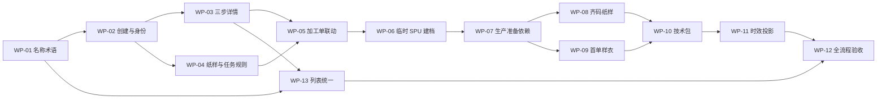

每个工作包完成后只验证直接受影响范围；所有工作包完成后再执行完整流程和两轮追踪。任何后续业务口径变化，先更新本文和原子需求，再改实现与测试，避免代码形成新的隐性规则。

## 20. 最终验收结论模板

实施完成时按以下格式填写，不得提前填写“通过”：

| 项目 | 结果 | 证据 |
|---|---|---|
| 设计改款完整流程 | 待验收 | 待填写 |
| 临时 SPU 正式建档 | 待验收 | 待填写 |
| 印花／染色加工单联动 | 待验收 | 待填写 |
| 生产准备完整流程 | 待验收 | 待填写 |
| 技术包审核与正式版本 | 待验收 | 待填写 |
| 生产准备时效一致性 | 待验收 | 待填写 |
| 真实上传与重开持久化 | 待验收 | 待填写 |
| 页面文案与交互深度 | 待验收 | 待填写 |
| 第一轮正向追踪 | 待验收 | 待填写 |
| 第二轮反向追踪 | 待验收 | 待填写 |
| 最终 Git SHA | 待填写 | 待填写 |
