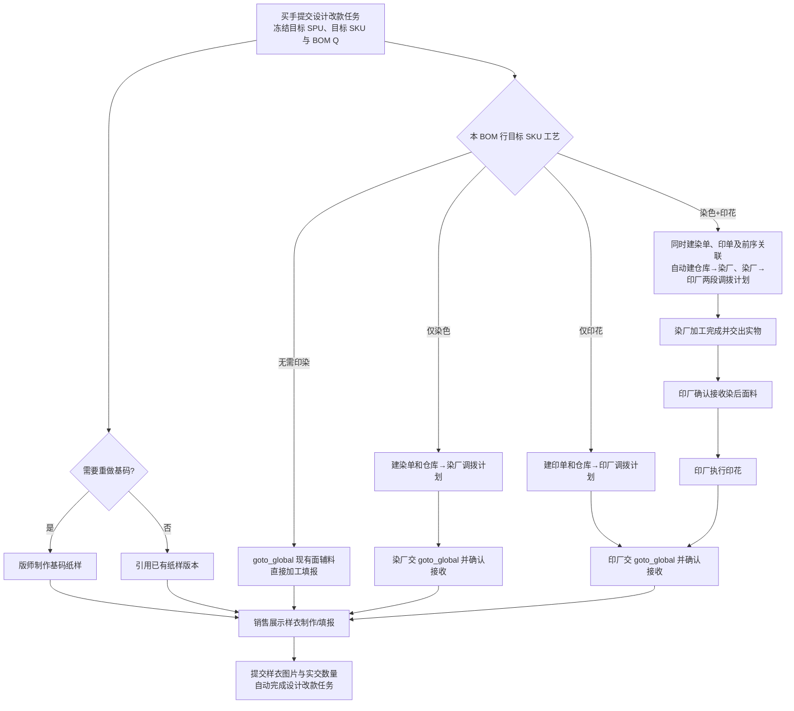
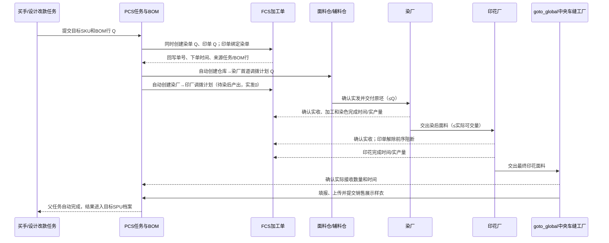
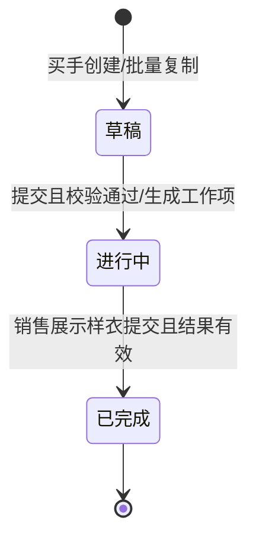

# PCS 设计改款任务产品调整方案

> 方案版本：2026-09-23；性质：待实施的产品设计，不表示页面或业务能力已经上线。依据为本轮用户确认、当前 `main` 分支源码以及用户提供的页面截图。当前核对的 Git HEAD 为 `28aae9b153a75e1a562ddf620c5e039500e440ad`。本次未修改业务代码、线上数据或已有单据。

## 1. 目标、边界与事实优先级

本方案建议设计改款任务从已建档的**目标 SPU**发起。买手在任务中选择目标物料 SKU，系统读取该 SKU 已确定的颜色、潘通号、花型和花型图，并据此形成需要的加工单与销售展示样衣任务。花型设计、染色调色在任务发起前线下完成；线上只处理既定目标物料的调拨、加工、交接和样衣制作。

本方案以用户逐条确认的业务规则为准。用户提供的截图证明现有原料 SKU 页面能展示染色/印花分类、颜色、潘通号、花型与图片等信息，但**不证明 PCS 当前档案接口已经把这些字段完整连通**。另有会议纪要中的“目标 SPU 先建档、参照 SPU 可选、复用已有纸样、草稿可先保存、损耗率为 0”等内容，本方案采纳为**产品设计建议**，尚不能标作用户逐条确认；若实施前发现实际业务例外，先更新这些条款和矩阵。旧方案、旧测试、既有 Mock 和代码中相反的口径均为调整对象。范围限于设计改款来源的 PCS、FCS 加工单及其调拨/交出、中央工厂接收、销售样衣和款式归档；不修改普通生产、备货、补料加工单的业务规则。

不建立线上花型设计、调色审核、专业返工支线，也不增加独立的“样衣开工门禁”。本期对同一 BOM 行同时染色和印花统一按**先染后印**执行；如果将来需要其他顺序或拆批，另行定义，不让用户通过自由文本绕过实物流规则。

## 2. 当前源码核查与差距

| 代码位置 | 当前行为 | 本次调整 |
| --- | --- | --- |
| `src/router/routes-pcs.ts:25,90`、`src/data/app-shell-config.ts:144` | 已有设计改款列表、详情入口。 | 保留入口，调整内容与交互。 |
| `src/pages/pcs-independent-sampling.ts:201,297,426,550,605,625,813` | 弹窗创建；列表无批量复制和加工数量摘要；BOM 手选 SKU、手填染/印标志和损耗率；详情分“方案确认—专业工作—买手结果确认”。 | 改为完整创建工作区、目标 SKU 驱动、订单与交接摘要、勾选批量复制；删除不适用的线上审核/最终确认入口。 |
| `src/data/pcs-engineering-master-sampling.ts:601-710` | 创建必须有参照 SPU；可用临时目标 SPU；复用纸样要求买手重新上传 `.prj`；初始 BOM 空白。 | 目标 SPU 必须已建档；参照 SPU 可选；可复用已存纸样；有参照时带入其物料作为可编辑起点；草稿可保存未齐信息。 |
| `src/data/pcs-engineering-master-sampling.ts:1313,1405,1513-1640` | 根据染/印标志生成花型、调色专业任务；样衣任务整体等待前置任务；印染单按 BOM 用量计算，并能为同一行创建两张单。 | 不生成花型/调色专业任务；保留基码与样衣，按 SKU 与 BOM 生成印染单；同一行染单和印单形成顺序链。 |
| `src/data/pcs-engineering-master-sampling.ts:1734-1960`、`src/data/pcs-engineering-master-types.ts:295-338` | 存在 WAIT_CONFIRMATION、REWORK、买手审核成果和最终确认；样衣另有手动开始动作。 | 样衣提交自动完成父任务；移除该流程的返工、审核和最终确认；用实物接收与纸样版本支撑样衣填报。 |
| `src/data/pcs-material-archive-types.ts:40`、`src/data/pcs-material-variant-types.ts:13` | SKU 有 `colorName`、可选 `pantoneCode`/`patternCode`、图片；变种链可记录前驱与 dye/print 工艺；尚无完整的“目标 SKU → 原坯/染后中间品 SKU → 花型图”统一读取契约。 | 增加一次解析目标 SKU 的展示与加工快照；与既有变种链对齐，避免手工标志形成第二事实源。 |
| `src/data/fcs/design-revision-process-work-order-adapter.ts:26,105,171-244` | 染、印单需求来源已是 `DESIGN_REVISION`；同 BOM 行印单能关联前序染单；但状态要求线上花型/调色审核成果。 | 继续复用来源与前序关联，改为目标 SKU 快照和现场加工状态；不等待不存在的设计/调色审核。 |
| `src/data/fcs/design-revision-material-transfer.ts:42-168`、`src/pages/process-factory/dyeing/pending-receipts.ts:52,144-146` | 首道仓库调拨需在专业成果审核、分厂、接单后人工点“生成”；对染后印花已阻止从仓库重复发第二次料；调拨草稿的 `sentQty` 当前直接写计划量。 | 加工单创建后自动建调拨计划；分厂后落实目标工厂；实际发出量由仓库确认，不将计划量冒充实发量。 |
| `src/data/fcs/dyeing-task-domain.ts:3267,3288,5475-5505`、`src/data/fcs/printing-task-domain.ts:4501` | 染单可关联下游印单；印厂分配后可成为染色交出接收方，染色交出产生工厂来源的收料原单。 | 作为染厂→印厂唯一实物路径，保留卷/批次、实交和实收。 |
| `src/data/fcs/process-order-receiving-target.ts:71`、`src/data/pcs-project-archive-collector.ts:742` | 末道接收目标来自可选样衣团队/位置；归档收集设计稿和专业成果，更新人依赖确认人。 | 末道目标固定映射中央车缝工厂 `goto_global` 及其实际收货位置；归档以样衣提交的完成事件和实际文件为准。 |

页面/代码核查属于当前仓库事实；用户截图属于现场页面证据。没有将本机浏览器正在显示的线上原料列表当作仓库实现，也没有修改线上原料数据。

## 3. 业务对象、角色与唯一关系

| 对象 | 定义与关键字段 | 负责人与关系 |
| --- | --- | --- |
| 设计改款任务 | 唯一任务号、已建档目标 SPU、可选参照 SPU、买手、改款要求、买手款式设计稿、样衣要求、状态、创建时间。 | 买手创建草稿并提交；目标 SPU 与任务一对多。 |
| 任务 BOM 版本/行 | 任务号、BOM 版本、行 ID、**目标成品物料 SKU**、每件用量、样衣件数、单位与换算、总需求量、SKU 工艺快照。 | 同一行可同时要求染色与印花；加工单与调拨均追溯同一版本和行。 |
| 物料加工链 | 原坯/原料 SKU → 染后中间品 → 目标印花 SKU，或单独染/印，或无加工。颜色、潘通号、花型编号/图来自目标 SKU 已确认的变种关系。 | 目标 SKU 标识目标结果，不能拿它当仓库首道发料 SKU。 |
| 基码纸样任务 | 是否重做、纸样来源、版师、纸样版本/文件、完成时间。 | 需重做才生成；不重做时引用已有正式版本。 |
| 染色/印花加工单 | 单号、下单时间、计划量、完成量、完成时间、实际接收/交出量、工厂、来源任务/BOM 行、上下游单号。 | 两单可在提交任务时一起创建；加工执行有先后。需求来源均为“设计改款任务”。 |
| 调拨及工厂交出/接收 | 来源仓/厂、目标厂、SKU/卷/批次、计划量、实发量、实收量、时间、责任人、差异。 | 首道仓库只发一份；染后由染厂交印厂；末道交 `goto_global`。 |
| 销售展示样衣任务 | 任务号、目标 SPU、样衣规格/数量、制作团队、所用纸样版本、实交样衣数量、照片、提交时间。 | `goto_global` 是中央车缝工厂；样衣提交自动完成父任务。 |

身份边界：买手负责创建、选择已定义的目标 SKU、提交任务和追踪；版师负责基码纸样；PPIC/计划负责工厂分配；仓库负责实际发料；染厂、印厂负责加工与交出；`goto_global` 负责最终材料接收、样衣加工填报和样衣提交。列表可显示跨团队事实，但每个动作应仅由其业务责任方执行。

## 4. 创建与草稿

1. 买手在设计改款创建页选择**已建档目标 SPU**，可选参照 SPU。登录身份自动带出买手。选择参照 SPU 时带出可编辑的已有物料关系和可复用纸样；无参照则从空白物料行创建。不能把参照 SPU 当作强制来源，不能继续创建临时目标 SPU。历史临时 SPU 记录仅作只读呈现或专项迁移，不从新入口继续生成。
2. 买手填写改款目标、目标样衣颜色/尺码/件数、是否重做基码纸样，并在创建任务时上传/维护**款式设计稿**。款式设计稿与物料 SKU 自带的**花型图**分开存储和展示。复用基码纸样时选择已存在文件/版本，不强迫买手再次上传相同 `.prj`。
3. 每条 BOM 行通过可搜索/粘贴编码的选择器选**目标结果 SKU**。选择后自动显示物料实图、SKU、颜色、潘通号、是否染色、是否印花、花型编号和花型图，并解析原坯 SKU、染后中间品关系。花型图可放大查看。缺关键元数据、真实图片、转换关系或库存发料 SKU 时显示具体缺项，阻断正式提交；草稿仍可保存。
4. 买手填写单位用量；系统基于样衣件数计算行总需求量。设计改款本期损耗率固定为 0 且不展示可编辑输入，不额外增加一份印/染备料。染/印标志由 SKU 快照决定，页面可展示但不让任务手工改成与目标 SKU 不一致。换另一目标 SKU 后重新读取，历史草稿的旧快照不得覆盖新 SKU。
5. **保存草稿**允许缺少正式提交必填项；**提交任务**一次性校验目标 SPU、设计稿、BOM、SKU 工艺链、纸样选择、样衣要求、工厂接收目标等，冻结本次 BOM/SKU 快照，生成基码任务（若需）、销售展示样衣任务及对应印染加工单。提交失败不留下孤立加工单或重复任务；重复点击按任务/BOM 行/工艺幂等。
6. 列表支持跨页勾选、当前页全选、显示已选条数、清空选择及“批量复制为草稿”。每一原任务独立产生一张新草稿；保留目标 SPU、可选参照 SPU、改款要求、买手设计稿引用、纸样选择、样衣规格及用于创建的 BOM/SKU/用量等输入。新草稿有新任务号、创建人与时间，重新校验被引用档案是否有效；不复制已创建的基码/样衣任务、加工单、调拨、库存接收、结果、状态进度、负责人派工、时间戳及操作日志。批量操作逐条给出成功/失败结果，不因一条坏数据静默丢失其他选择。

### 4.1 SKU 来源与字段映射

选择目标 SKU 后使用一份只读“加工快照”：`targetMaterialSkuId/code`、原坯 SKU、前驱 SKU、颜色/潘通号、`requiresDye`、`requiresPrint`、花型编号/正式图片、物料图片/单位/换算、版本/读取时间。可优先使用现有物料 SKU 和变种链的关联事实，但当前 PCS 的 `MaterialSkuRecord` 字段不足以单靠 `patternCode` 推断花型图和完整先后链，实施时须补齐映射并统一读取；**不能从 SKU 编码字符串猜是否印花、颜色或是否染色**。已提交任务保持当时快照，后续 SKU 档案更新不悄悄改旧加工单；若业务要调整，走明确的任务/BOM 变更记录，本方案不增加专业返工支线。

## 5. 任务依赖、实物流和数量

**并行与先后**：基码纸样工作、染单准备和印单准备可以同日并行；同一行实物染色→印花串行。销售样衣任务随父任务提交生成并可查看，不额外设置“待样衣开工”审批按钮。无印染物料由 `goto_global` 直接加工填报，这不代表整件样衣已经开始制作；需印染的该批物料在 `goto_global` 实际确认接收后进入可加工状态。整件销售展示样衣的制作以所需基码纸样已完成、各需印染材料加工且在中央工厂确认接收为事实上的就绪条件，由事实自动呈现可制作，无需人工再点一次“开工”。最终样衣记录必须引用相应纸样版本；全部必需物料已收/可用且实际样衣成果齐全后才允许提交样衣。

### 5.1 数量口径与唯一发料

对每个 BOM 行定义 `Q = 单件用量 × 样衣要求件数 × 有效单位换算`，损耗率本期为 0。系统存储 BOM 原单位、加工单单位和换算系数，按现有精度规则计算并显示换算后的 Q；例如单位用量 2 Yard/件、样衣 3 件，则 Q=6 Yard。若上游 BOM 已给出**整单总量**，先按其数量语义读取，不能再乘样衣件数。提交前列表/详情应能看到每行 Q 的推导，缺单位换算时阻断。

| 工艺 | 加工单计划量 | 调拨或交出来源 → 目标 | 应发/应收口径 |
| --- | --- | --- | --- |
| 无染无印 | 无 | 不生成到 `goto_global` 的调拨 | 由中央工厂已有物料直接填报，记录实际消耗。 |
| 仅染色 | 染单 Q | 面料仓/辅料仓 → 染厂；染厂 → `goto_global` | 仓库首道计划 Q；最终按染后**实交、实收**记账。 |
| 仅印花 | 印单 Q | 面料仓/辅料仓 → 印厂；印厂 → `goto_global` | 仓库首道计划 Q；最终按印后实交、实收记账。 |
| 同时染印 | 染单 Q、印单 Q，印单指向染单 | 面料仓/辅料仓 → 染厂 → 印厂 → `goto_global` | **仓库只计划发 Q 一次**；染后转印厂以染后实交/实收为准；末道以印后实交/实收为准。绝不为印单再从仓库生成 Q 的第二张首道发料。 |

两张加工单都记录 Q，是对**同一批物料的两道计划加工量**，不是合计要领 `2Q`。加工单创建后立即自动生成相应物流计划：双工艺包括“仓库→染厂，计划 Q”和“染厂→印厂，关联前序染单、计划上限 Q”；后者是待染后产出的**工厂间调拨计划**，不是第二张仓库发料单，创建时实发量为 0。实际仓库发出时间和数量由仓库发料确认产生。若此时尚未分配厂，计划处于“待定目标厂”，不能伪造真实发料；分厂后绑定目标厂。对染后印花，第二段执行为染厂加工结果的工厂交出/印厂接收，印厂确认实收前不可印花；其调拨/交出数量以染后**实际可交数量**为上限，并保留卷/批次。印后 `goto_global` 的接收数量以最终实际接收为准。差异写明应交、实交、实收、差异、责任人和时间，不能以 Q 覆盖实际数量，也不能静默自动补发；补量若发生须有新的来源事实和关联记录，且不属于“专业工作返工”。

### 5.2 加工单、调拨与接收时序

仅染或仅印时省去另一工序；无印染时省去加工单和调拨，中央工厂直接填报。加工单可以提前建立，但 `orderedAt`、染色完成时间、印花完成时间、工厂交出时间和接收时间为不同事实，列表不以计划时间代替实际时间。

## 6. 状态与完成规则

父任务只需要草稿、进行中、已完成的主线表达。已提交任务中的版师任务有待处理/进行中/已完成；染、印单继续使用 FCS 自身的待分厂、待接单、待料、加工中、待交接、已完成等可见状态；销售样衣任务显示待材料/纸样、可填报、制作中、已提交。页面可以显示阻断原因与待谁处理，但不增加“专业工作返工”节点，也不保留买手审核花型/调色或整张结果确认按钮。既有历史 `REWORK`、`WAIT_CONFIRMATION` 数据不得被误解释为新任务状态；迁移或只读映射要有专项策略。

**父任务完成事件**：`goto_global` 提交与目标 SPU/样衣要求对应的实物样衣数量、尺码/颜色、所用纸样版本和真实样衣照片后，系统在同一业务动作中写入样衣任务已提交、父任务已完成与完成时间，并触发目标 SPU 归档引用。提交前校验所需纸样和材料事实齐全、样衣实际数量一致或有差异说明；失败不得只完成父任务一半。买手只查看进度，不再做额外确认。

## 7. 页面与可操作内容

### 7.1 设计改款任务列表（1366×768，最低 1280×720）

按现有标准管理列表结构呈现：标题与新建/批量复制操作、查询卡、统计卡、独立列表卡和分页。查询支持任务号、目标 SPU、参照 SPU、买手、任务状态、基码需要与否、染印组合、加工单号、时间范围；查询/重置/导出与统计同一范围，导出当前全部匹配项，不含操作列。首列勾选与任务号冻结，操作列固定右侧，宽表在表格内部滚动；可配置列显示/顺序/冻结，业务关键列不可隐藏。

建议默认列：勾选；任务号/状态；目标 SPU 实图与编码/款名；参照 SPU；买手款式设计稿缩略图；目标样衣规格/数量；基码纸样（是否制作、任务号、负责人、完成时间）；染色单（单号、下单时间、计划/完成/实交/实收数量、完成时间、厂名、状态）；印花单同组字段；销售样衣任务（任务号、要求/实交件数、团队、提交时间、状态）；当前待处理方；创建/完成时间；操作。多 BOM 行、多张染/印单时，单元格显示“2 张/计划量汇总/最晚完成时间”等紧凑摘要并可展开查看逐行单据，不能把不同单位的数量直接相加。列表主行与详情均可点击关联单据，先显示真实图片与编码。字段为空时用“不需要”“待生成”“待完成”等业务词，不用空白或虚假的 0 完成。

### 7.2 创建/详情

创建页按目标款式与设计稿、参照与纸样、样衣要求、BOM 目标 SKU、自动加工预览、提交摘要分区，同页完成，不把线上花型设计和调色动作放进步骤。BOM 行显示目标 SKU 实图、花型实图、潘通号、颜色、工艺链和数量计算。点击图可看大图，加载失败要可见。提交预览明确“染色单/印花单数量”“首道仓库调拨目的厂”“染后转印厂”“末道交 goto_global”。详情用任务、纸样、各 BOM 行加工链、调拨/交接、销售样衣与操作记录分层展示，能从单号跳转对应加工单。

### 7.3 FCS、仓库与中央工厂

染/印单顶部显示需求来源“设计改款任务”及任务号/目标 SPU/BOM 行，关联前后加工单、目标 SKU 与花型/颜色快照。待接收页面在加工单建立后能看到调拨计划；仓库确认实际发出，工厂按卷/数量实际接收。染后交出指向具体印单及印花厂，末道指向 `goto_global` 的实际厂/库位。中央工厂任务页展示“已接收的印染物料”和“无需印染可直接使用的物料”，按实际可用量填报销售样衣。所有款式/物料在列表、详情、扫码接收、打印预览均保留对象对应真实图片，图片不可得时记素材阻塞，不拿占位图冒充。

## 8. 正常与边界场景

1. **无印染，复用纸样**：买手选目标 SPU/SKU、已存纸样与样衣数量；提交后只有样衣任务，`goto_global` 可直接填报并提交，父任务自动完成；无仓库→中央工厂调拨。
2. **仅染色或仅印花**：提交产生对应单和仓库→加工厂调拨计划；工厂接收、加工并交 `goto_global`；中央工厂确认后填报样衣。列表展示计划与实际数量、单号和真实时间。
3. **同一面料先染后印，基码并行**：同时生成基码任务、染单和印单，两单都计划 Q，仓库只发染厂 Q；印单等待染后面料，印厂实收后印；`goto_global` 实收最终成品，样衣提交后自动完成父任务。
4. **多 BOM 行混合工艺**：各行按 SKU 分别判断，单据/调拨/接收均带 BOM 行 ID，不把不同物料或不同单位混成一张不可追踪的总量。
5. **缺失映射或图片**：目标 SKU 缺潘通号、花型正式图片、原坯 SKU/前驱、单位换算或对象实图时，草稿可以保存，提交显示具体缺项并阻断，避免生成目标不明的加工单。
6. **发料不足、染后短少、交接差异**：计划 Q 不变；实发、实收、实产分别记；印花实际可用量不得超过染后确认接收量，中央厂不得把未收到的数量计为可用。缺口通过有来源的补量/差异记录处理，不进入专业返工支线。
7. **重复操作与状态变化**：重复提交/自动建单/刷新不能生成第二套单据；草稿复制遇到已停用目标 SKU 时保留原输入并指出需重新选择，不拷贝旧订单；已完成任务不可重新提交样衣并重复触发归档。

## 9. 正式实施计划（此处仅规划，不执行代码）

| 工作包 | 业务目标 | 计划修改位置/动作 | 直接验证与完成条件 |
| --- | --- | --- | --- |
| W1 统一物料事实 | 目标 SKU 一次解析完整加工链、图片与来源 SKU。 | `pcs-material-archive-types.ts`、物料/变种仓储及解析器；只补设计改款所需字段和读取映射。 | 四种工艺组合、缺字段、停用 SKU、换 SKU 的专项契约通过；与截图所示字段语义一致。 |
| W2 任务/BOM与草稿 | 已建档目标 SPU、可选参照、买手设计稿、草稿、目标 SKU 驱动、精确 Q。 | `pcs-engineering-master-types.ts`、`pcs-engineering-master-sampling.ts`、BOM resolver、`pcs-independent-sampling.ts`。 | 正常/缺字段/有参照/无参照/纸样复用/重做、数量与单位专项检查；创建与详情页面实际可操作。 |
| W3 印染与唯一调拨 | 两单同源但实物先染后印，首道只发一次；单创建后有调拨计划。 | `pcs-design-revision-process-work-order-port.ts`、FCS adapter、transfer、仓库接收/染厂交出/印厂接收。 | 来源、上下游、幂等、Q 守恒、实发/实收与差异专项检查；命名 Web/PDA 收发场景与打印验收。 |
| W4 样衣及归档 | 中央工厂接收/填报，样衣提交自动完成父任务并归档。 | sampling 任务流、`process-order-receiving-target.ts`、样衣页、`pcs-project-archive-collector.ts`。 | 无加工直填、先染后印、纸样依赖、提交一次与失败回滚；中央工厂页、照片大图及目标 SPU 档案验收。 |
| W5 列表与复制 | 全链路摘要、筛选/导出和批量复制草稿。 | `pcs-independent-sampling.ts` 及必要的现有列表组件。 | 逐行单据/数量/时间、跨页选择、复制白名单、列表低分辨率/宽表/图片/响应性能验收。 |
| W6 旧逻辑与交付 | 移除线上花型/调色/返工/买手终审入口且不破坏其他 FCS 来源。 | 同步调整旧 Mock、专项目标测试、文案与适用历史记录映射；保留其他来源规则。 | 正反追踪本矩阵；当前最终工作树专项/页面/PDA/打印/性能与治理检查形成收据。 |

执行依赖为 W1→W2→W3/W4→W5→W6；W3 的染后印花交接与 W4 的中央厂接收需用同一 BOM 行、SKU 和实际数量事实验证。每个工作包提交时声明下节需求编号；旧测试通过只说明旧口径曾可运行，不能给本方案标“已验证”。用户要求先出方案，本次不进入实施。

## 10. 原子需求追踪与交付矩阵（计划状态）

说明：来源 `U1`＝本轮用户逐条确认，`U2`＝本轮“默认先染后印”，`M`＝用户提供的会议纪要（方案采纳、待产品核定），`C`＝当前源码核查，`P`＝本方案明确推导的防错规则。实施位置为计划绑定；自动化/页面证据均为**待执行**，页面/PDA/打印不适用时注明原因。所有条目当前状态为 `待实施`，证据位置为“待最终版本收据”，产品确认人及版本为“待产品确认/本方案 2026-09-23”。

| 编号 | 来源/章节 | 独立可验收结果 | 工作包/计划位置 | 自动化与运行验证方案 | 当前状态 | 证据位置 | 产品确认人/版本 |
| --- | --- | --- | --- | --- | --- | --- | --- |
| TASK-001 | M/§4 | 仅已建档目标 SPU 可正式提交，参照 SPU 可选。 | W2/sampling、创建页 | 提交校验；创建页正常/边界。 | 待实施 | 待最终版本收据 | 待产品确认 / 2026-09-23 方案 |
| TASK-002 | U1+M/§4 | 买手身份自动带出并在创建时维护款式设计稿。 | W2/sampling、创建页 | 身份/文件契约；创建与大图。 | 待实施 | 待最终版本收据 | 待产品确认 / 2026-09-23 方案 |
| TASK-003 | M/§4 | 有参照时带入物料起点；无参照可自建 BOM。 | W2/BOM、创建页 | 两类创建契约；创建页。 | 待实施 | 待最终版本收据 | 待产品确认 / 2026-09-23 方案 |
| TASK-004 | M/§4 | 复用基码引用已存正式纸样，重做才生成版师任务。 | W2/sampling；W4/样衣 | 复用/重做契约；纸样详情。 | 待实施 | 待最终版本收据 | 待产品确认 / 2026-09-23 方案 |
| TASK-005 | M+P/§4 | 未填齐信息可保存草稿；提交失败无孤立工作项。 | W2/sampling | 草稿/事务契约；创建页。 | 待实施 | 待最终版本收据 | 待产品确认 / 2026-09-23 方案 |
| MASTER-001 | U1/§4.1 | 选目标 SKU 自动带颜色、潘通、是否染色、是否印花、花型图。 | W1/物料解析；W2/BOM 页 | 四组合/换 SKU 契约；真实图与大图。 | 待实施 | 待最终版本收据 | 待产品确认 / 2026-09-23 方案 |
| MASTER-002 | U1+U2/§4.1 | 目标 SKU 能解析首道原坯及染后中间品，缺失阻断提交。 | W1/变种链 | SKU 链/缺项契约；提交提示。 | 待实施 | 待最终版本收据 | 待产品确认 / 2026-09-23 方案 |
| BOM-001 | U1/§5.1 | BOM 行唯一绑定目标 SKU、任务/BOM 版本/行 ID。 | W2/BOM | 版本与行身份契约；详情。 | 待实施 | 待最终版本收据 | 待产品确认 / 2026-09-23 方案 |
| BOM-002 | M+P/§5.1 | Q 按数量语义、单位换算和 0 损耗计算，不二次乘件数。 | W2/resolver | 数量/换算/精度契约；提交预览。 | 待实施 | 待最终版本收据 | 待产品确认 / 2026-09-23 方案 |
| TASK-006 | U1/§1,6 | 不生成线上花型设计和调色任务/审核。 | W2/sampling；W6/旧逻辑 | 类型/入口缺失检查；任务详情。 | 待实施 | 待最终版本收据 | 待产品确认 / 2026-09-23 方案 |
| TASK-007 | U1/§6 | 不生成专业工作返工支线或按钮。 | W6/类型、处理器、页面 | 状态/旧入口检查；详情。 | 待实施 | 待最终版本收据 | 待产品确认 / 2026-09-23 方案 |
| PROC-001 | U1/§3,5 | 染/印单的需求来源是设计改款任务，追溯任务和 BOM 行。 | W3/adapter、单据页 | 来源契约；两类加工单详情。 | 待实施 | 待最终版本收据 | 待产品确认 / 2026-09-23 方案 |
| PROC-002 | U1/§5 | 同行需要染印时同时建两单并建立印单前序染单关联。 | W3/adapter | 双单/关联/幂等契约；详情。 | 待实施 | 待最终版本收据 | 待产品确认 / 2026-09-23 方案 |
| PROC-003 | U2/§5 | 双工艺实物先染后印；印厂确认染后实收前不能加工。 | W3/工厂交接、印单 | 顺序/接收阻断契约；染/印厂 Web/PDA。 | 待实施 | 待最终版本收据 | 待产品确认 / 2026-09-23 方案 |
| PROC-004 | U1/§5 | 加工单保存计划量、下单时间、完成量、完成时间。 | W3/单据；W5/列表 | 时间/数量投影契约；列表/详情。 | 待实施 | 待最终版本收据 | 待产品确认 / 2026-09-23 方案 |
| TRF-001 | U1/§5 | 加工单创建后自动建首道仓库调拨计划，来源仓按物料种类。 | W3/transfer | 自动生成/仓库映射契约；调拨页。 | 待实施 | 待最终版本收据 | 待产品确认 / 2026-09-23 方案 |
| TRF-002 | U1+U2/§5.1 | 同行染印仓库只发染厂 Q，不给印厂重复生成仓库调拨。 | W3/transfer | 唯一发料/库存守恒；仓库与印厂页。 | 待实施 | 待最终版本收据 | 待产品确认 / 2026-09-23 方案 |
| TRF-003 | U1+U2/§5.1 | 两单创建后自动建染厂→印厂调拨计划；染后按实交实收执行，保留卷批次。 | W3/染厂、印厂、接收 | 自动建计划/实物/卷/差异契约；Web/PDA/打印。 | 待实施 | 待最终版本收据 | 待产品确认 / 2026-09-23 方案 |
| TRF-004 | U1/§5.1 | 末道加工交 `goto_global`，实际接收量独立于 Q。 | W3/末道交出；W4/接收 | 目标与数量契约；中央厂 Web/PDA。 | 待实施 | 待最终版本收据 | 待产品确认 / 2026-09-23 方案 |
| TRF-005 | U1/§5.1 | 无印染物料不生成仓库到 `goto_global` 调拨，允许直接填报。 | W4/中央厂 | 无加工契约；样衣页。 | 待实施 | 待最终版本收据 | 待产品确认 / 2026-09-23 方案 |
| TRF-006 | P/§5.1 | 未分厂、未实发、短少和差异不伪造已发已收。 | W3/transfer、receiving | 状态/差异契约；Web/PDA/打印。 | 待实施 | 待最终版本收据 | 待产品确认 / 2026-09-23 方案 |
| SAMPLE-001 | U1/§5,6 | 样衣任务随提交可见，不设独立开工审批。 | W4/sampling、样衣页 | 状态契约；样衣任务。 | 待实施 | 待最终版本收据 | 待产品确认 / 2026-09-23 方案 |
| SAMPLE-002 | U1/§5,6 | 需印染的物料在中央厂确认接收后可填报；无需印染的可直接填报。 | W4/样衣页 | 可用量契约；中央厂操作。 | 待实施 | 待最终版本收据 | 待产品确认 / 2026-09-23 方案 |
| SAMPLE-003 | U1+P/§6 | 新基码或必需材料未就绪时，不能提交不完整样衣成果。 | W4/sampling | 阻断契约；样衣页。 | 待实施 | 待最终版本收据 | 待产品确认 / 2026-09-23 方案 |
| SAMPLE-004 | U1/§6 | 有效样衣提交原子地完成设计改款任务并归档。 | W4/sampling、archive | 提交/回滚/幂等契约；样衣与目标 SPU。 | 待实施 | 待最终版本收据 | 待产品确认 / 2026-09-23 方案 |
| PAGE-001 | U1/§7.1 | 列表展示基码、染单、印单、样衣的单号/时间/数量/状态。 | W5/列表 | 列投影契约；1366/1280 页面。 | 待实施 | 待最终版本收据 | 待产品确认 / 2026-09-23 方案 |
| PAGE-002 | U1/§7.1 | 多 BOM 行可下钻，数量不同单位不误合计。 | W5/列表 | 聚合契约；列表展开。 | 待实施 | 待最终版本收据 | 待产品确认 / 2026-09-23 方案 |
| PAGE-003 | U1/§7.1 | 勾选任务并批量复制为独立新草稿，仅复制创建信息。 | W5/列表；W2/sampling | 复制白名单/逐条结果；跨页操作。 | 待实施 | 待最终版本收据 | 待产品确认 / 2026-09-23 方案 |
| PAGE-004 | C+P/§7 | 查询、重置、导出、统计、分页、列设置满足标准列表规范。 | W5/列表 | 列表治理；命名页面。 | 待实施 | 待最终版本收据 | 待产品确认 / 2026-09-23 方案 |
| IMG-001 | U1+C/§7 | 款式、物料、花型、样衣图片对应实物，支持大图/失败提示。 | W1/W2/W4/W5 | 图片契约；各命名页面/PDA/打印。 | 待实施 | 待最终版本收据 | 待产品确认 / 2026-09-23 方案 |
| SCOPE-001 | U1/§1,9 | 其他来源 FCS 单据行为保持可用，旧入口与文案按新规则收口。 | W6/相关测试/Mock | 相邻来源回归；命名页面。 | 待实施 | 待最终版本收据 | 待产品确认 / 2026-09-23 方案 |
| PERF-001 | 项目 AGENTS/§9 | 所有受影响页面首次进入、刷新、切换和交互满足 `<500ms`，例外须用户明确授权。 | W6/当前服务 | 每项至少五次含首次；浏览器原始样本。 | 待实施 | 待最终版本收据 | 待产品确认 / 2026-09-23 方案 |

交付时矩阵应补充每条的实际文件/符号、自动化结果、页面/PDA/打印/性能结果或不适用理由、证据链接、确认人/确认版本，再将状态按项目允许值更新。不能因为构建通过或本表写了需求就改成“已验证”。

## 11. 当前方案审查记录与验收门禁

本次只完成设计审查：已对当前分支的创建/列表/详情、BOM 计算、SKU/变种类型、FCS 加工单适配、调拨、染后交印、末道接收及归档源码逐项核查；并以“染印同一行 Q=6 Yard”与“无印染直接填报”推演正常和边界路径。尚未改代码，因此**所有矩阵条目均待实施，未运行本方案验收**。未取得当前开发服务的浏览器实测证据；页面截图仅用于物料 SKU 能展示的现场字段，不作为 PCS 新方案已实现证明。

实施后须在同一分支、HEAD、工作树和实际服务上核对：四种工艺组合、批量复制、真实图片/大图与失败态、1366×768/1280×720、中央厂与染印厂 Web/PDA 收发、调拨/交接打印、首屏和每一交互 `<500ms` 的原始样本。最后一次实质修改后重新生成受影响证据；执行 `npm run check:list-page-governance`、`npm run check:prototype-design-governance` 及任务相关专项检查。最终正向从本方案到矩阵/实现/证据，反向从代码、路由、Mock、页面和测试回到需求编号，核对旧花型/调色/返工/买手终审入口是否清除，以及普通生产来源是否保持原有行为。
