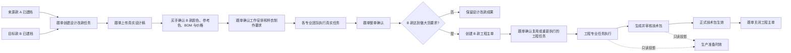
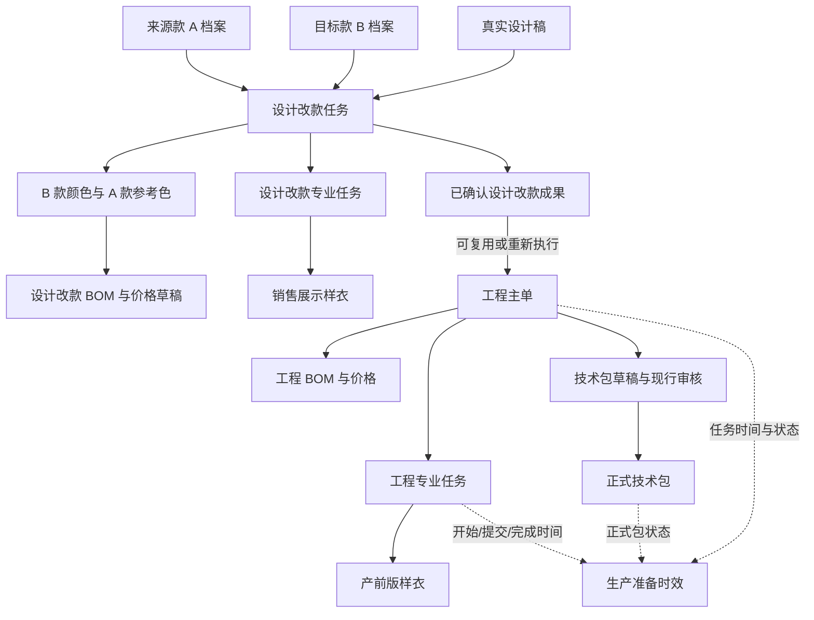
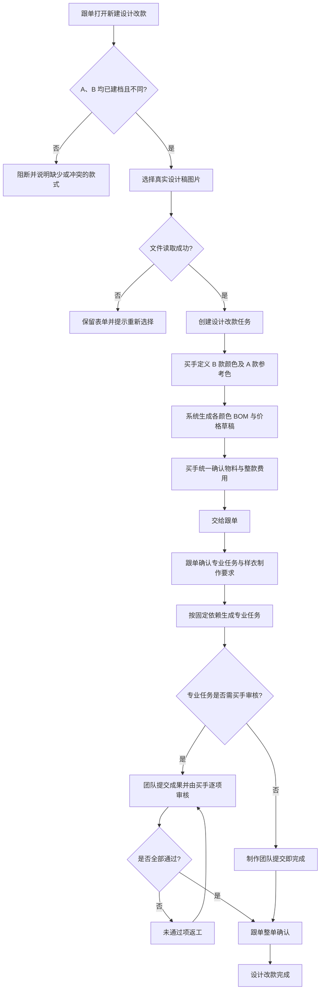
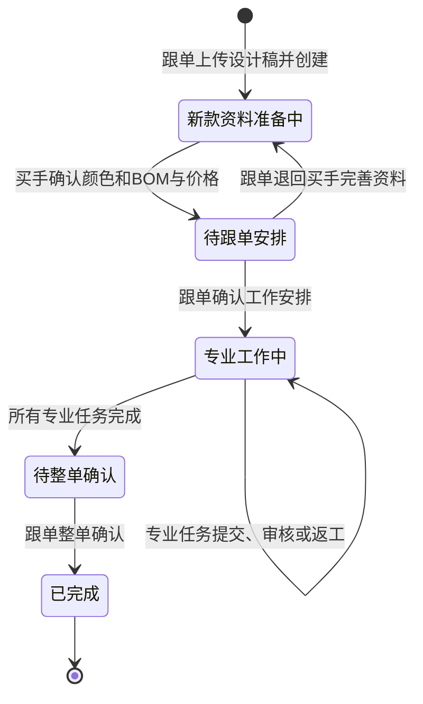
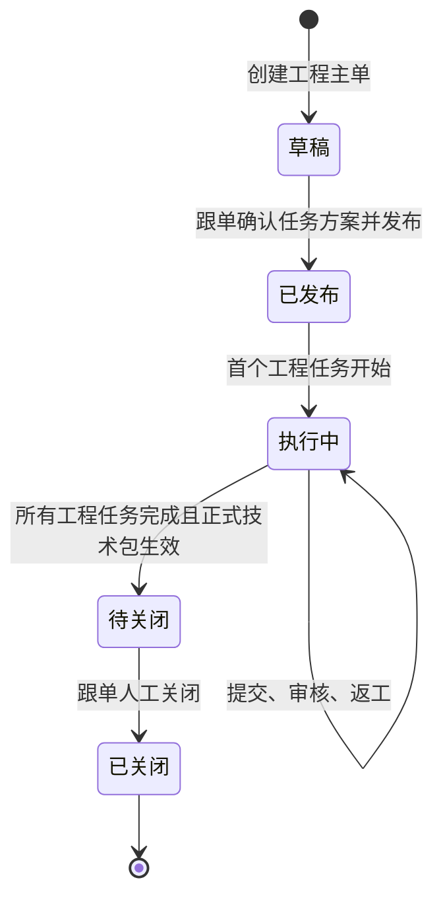
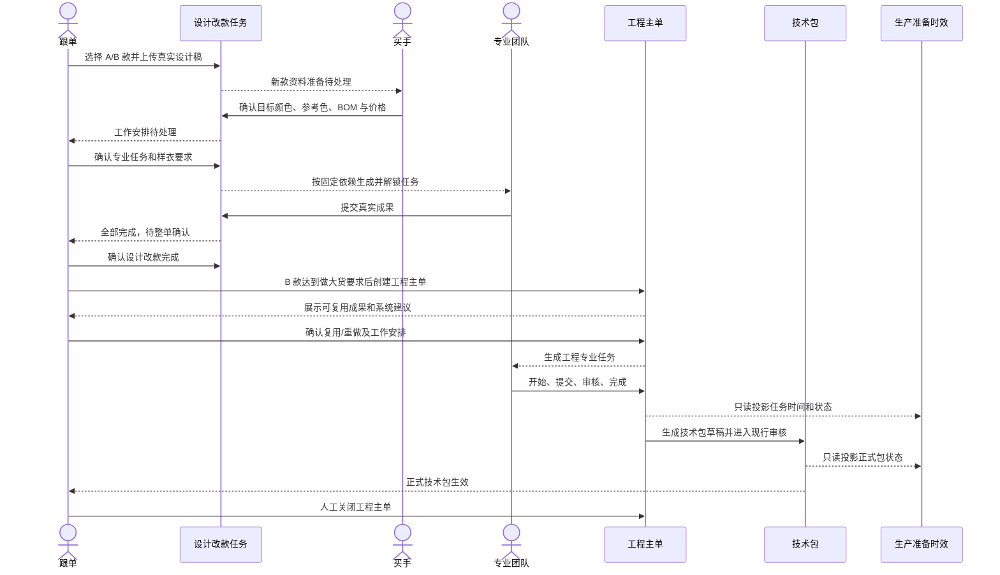

# PCS 设计改款合并、工程变更删除与生产准备时效收口调整方案

## 0. 文档信息

| 项目 | 内容 |
|---|---|
| 文档版本 | V1.2（实施与双轮核验版） |
| 编制日期 | 2026-08-27 |
| 当前状态 | 已实施；第一轮正向核验与第二轮反向核验均通过；待用户验收 |
| 实施分支 | `codex/pcs-design-revision-consolidation-20260827` |
| 基线版本 | `1778d6343e1dd37f37ebe8c0f91833b8cf536568` |
| 适用系统 | 商品中心系统（PCS） |
| 适用范围 | 设计改款、工程主单、专业任务、BOM 与价格、技术包、生产准备时效 |
| 本次不实施 | 历史任务迁移、历史技术包导入、同一 SPU 正式技术包关闭后的修订流程、真实后端接口 |

> 本文既是调整方案，也是本次实施控制文档。实现、自动化、命名页面和双轮追踪证据统一登记在《PCS生产工程管理需求追踪与交付矩阵》和本方案第 9～13 节。

## 1. 本次结论

本次调整收口为三个核心决定：

1. 原“改款打样”和“设计打样”合并为一个业务对象，统一名称为 **设计改款任务**。
2. **删除工程变更**。删除的不只是菜单和页面，还包括其对象、状态、仓储、Mock、路由、事件、专业任务投影、BOM 所有者类型、技术包来源分支、测试、脚本和当前权威文档中的相关逻辑。
3. **生产准备时效只读取工程主单及工程主单专业任务的事实**。它不创建任务、不修改任务，也不读取设计改款任务。

调整后的业务主线为：



## 2. 代码核查范围与当前事实

### 2.1 核查方式

本方案基于以下代码事实形成：

- 已逐段核查设计改款、工程主单、工程变更、技术包和生产准备时效的领域类型、仓储、页面、路由、处理器、Mock、测试与检查脚本。
- 已完整核查工程变更专用仓储和页面文件。
- 已通过 CodeGraph 核查对象调用关系和三层影响范围，并对命中的关键实现逐行读取其当前源码。
- 已使用精确文本检索核查菜单、路由、用户文案、状态、测试和文档残留。
- 当前工作区存在与本方案无关的用户改动；本文未修改、暂存或吸收这些改动。

### 2.2 当前实现与目标实现对照

| 业务范围 | 当前代码事实 | 存在的问题 | 目标口径 |
|---|---|---|---|
| 独立打样 | 以 `REVISION`、`DESIGN` 两种类型分别建单、分别路由、分别展示和统计 | 同一业务流程被人为拆成两类；设计打样甚至不要求来源款 | 合并为单一“设计改款任务” |
| 来源款与目标款 | 改款要求 A、B 两款；设计只要求 B 款 | 与业务确认冲突 | 每张设计改款任务都必须有 A 款和 B 款，且不能是同一 SPU |
| 设计稿 | 当前主要独立打样对象没有正式设计稿字段和创建门禁 | 任务缺少最重要的业务输入 | 设计稿为真实图片文件，由跟单首次上传和在锁定前替换 |
| 页面入口 | 菜单、路由、渲染器、处理器均有“改款打样”和“设计打样”两套入口 | 用户需要理解两个实际相同的模块 | 只保留一个“设计改款任务”入口 |
| 旧改版任务 | 仓库中另有一套旧 `RevisionTaskRecord`、仓储、页面和技术包生成逻辑 | 与当前独立打样并存，形成隐性第二事实源 | 依赖迁入统一设计改款后，删除旧对象和旧生成入口 |
| 渠道测款结论 | 当前渠道商品 Mock 仍会在测款未通过时自动建立旧改版任务 | 新设计改款必须先确定 A/B 款和真实设计稿，不能由测款结论静默生成 | 测款结论只提示可发起设计改款，由跟单按完整资料显式创建 |
| 工程变更 | 有独立菜单、三条路由、完整页面、六状态工作区、本地存储和 Mock | 形成工程主单之外的第二套执行模型 | 完整删除 |
| 工程变更专业任务 | 工程变更任务会投影到制版、花型、调色等专业列表 | 同一专业列表混入两套来源和两套状态事实 | 专业列表只读取设计改款任务或工程主单任务 |
| 技术包来源 | 新技术包允许来源为工程主单或工程变更；还保留历史 `REVISION`、`PLATE`、`ARTWORK`、`MANUAL` 来源类型 | 正式技术包来源不唯一 | 新业务技术包只允许来源于工程主单 |
| BOM 所有者 | BOM 所有者类型包含独立打样、工程主单、技术包草稿、工程变更 | 工程变更删除后仍会残留可写入口 | 删除工程变更所有者类型；保留其余真实业务阶段 |
| 生产准备时效 | 当前已经从工程主单及其任务投影，运行时标记为只读 | 方向正确，需要防止后续被设计改款或其他模块污染 | 保持并加回归门禁 |
| “因需求变更结束” | 工程主单条件任务使用该状态；页面有一句“该任务已因工程变更结束” | 状态本身是主单内需求调整，不等于工程变更模块；文案混淆 | 保留状态，用户文案改为“因本次需求调整结束” |

### 2.3 工程变更当前渗透面

当前“工程变更”不是一个可以只删页面的孤立功能，已经进入以下链路：

1. 工程主单快照中保存 `changeTasks`。
2. 已关闭工程主单可以生成 `EC-*` 工程变更对象。
3. 工程变更有独立工作区和本地存储键。
4. 工作区可以复制当前正式技术包，创建下一版草稿。
5. 工作区会生成制版、花型、调色、样衣等专业任务。
6. 这些任务会投影到统一专业任务列表。
7. 技术包版本允许把工程变更作为正式来源。
8. BOM 与价格允许把工程变更作为所有者阶段。
9. Mock 会自动创建工程变更并推进任务。
10. 多个专项测试和交付矩阵把工程变更视为必须能力。

因此，实施时必须沿“入口 → 对象 → 写入 → 投影 → 技术包 → 测试 → 文档”完整删除，不能只隐藏菜单。

### 2.4 第二轮复核新增发现

为避免只沿页面和主流程删除，第二轮从类型引用、项目归档、项目关闭和正式技术包消费端反向追踪，新增确认以下影响面：

1. 旧改版任务不只存在于旧页面和仓储，还被项目关系契约登记为 `REVISION_TASK`，被项目归档登记为 `REVISION_RECORD`，并由归档收集器直接读取旧仓储。若不处理，页面虽然合并，项目关闭后仍会保存“改版任务／改版记录”第二事实源。
2. 旧改版任务还有两份独立辅助类型文件，分别保存纸样区域、回直播验证状态和物料行；项目关系写回继续直接依赖这些类型。若只删除主类型和仓储，会留下编译断链或把旧对象换名保留。
3. 通用任务来源标准化器仍把“改版任务”作为制版、花型、首版样衣和首单样衣的默认来源。统一后必须改成“设计改款任务”或原专业任务返工来源，不能仅删除旧任务标准化函数。
4. 工程主单详情和项目关闭／一致性检查属于统一来源后的消费端，必须同时改成只识别“设计改款成果”与工程主单任务。
5. 技术包来源类型虽然收口为工程主单，但已发布技术包的内容仍被 FCS 生产单、生产技术包快照及技术包页面读取。来源清理不得误删技术包内容中的“人工维护”“人工调整”等资料字段；必须验证正式技术包内容与 FCS 消费不受影响。
6. 渠道商品和测款结论仍包含“测款未通过后自动建立改版任务”的 Mock 与页面字段；新设计改款需要 A/B 款和真实设计稿，不能沿用该隐式建单方式。
7. 技术包和 FCS 生产快照还沿整链保存 `linkedRevisionTaskIds` 并显示“改版任务数量”；该字段必须统一为设计改款成果溯源关系，不能只改可见文案。
8. 因此，本方案的删除范围必须同时覆盖“旧类型辅助文件 → 来源标准化 → 渠道结论 → 项目关系 → 项目归档 → 项目关闭 → 技术包溯源 → FCS 下游回归”，而不是只覆盖“菜单 → 页面 → 仓储”。

## 3. 目标业务对象与边界

### 3.1 目标对象关系



### 3.2 设计改款任务

设计改款任务用于做大货之前的款式开发和销售展示样衣制作，业务规则如下：

1. 来源款 A 和目标款 B 都必须已存在商品／款式档案。
2. A、B 不能是同一个 SPU。
3. 所有设计改款都必须有真实设计稿，设计稿为图片文件。
4. 设计稿由跟单首次上传；在工作安排确认前，仅跟单可替换。
5. 设计稿替换保留文件名、上传人、上传时间和当前版本；不保留复杂审批流。
6. 页面、列表、统计、筛选和导出均不保留“设计／改款”分类。
7. B 款颜色可以少于、等于或多于 A 款颜色。
8. B 款每个颜色可以选择一个 A 款参考色，也可以选择“无参考色”。
9. 有参考色时，系统把最近一份已完成且已确认的 A 款物料方案作为 B 款初始草稿；买手可以新增、删除和替换物料。
10. 无参考色时，从空白 BOM 与价格草稿开始。
11. BOM 与价格由买手统一确认，物料和整款自定义费用不拆成两次确认。
12. 跟单确认工作安排和销售展示样衣的颜色、尺码、要求数量。
13. 专业任务依赖固定，系统自动补齐前置，不允许业务人员调整依赖。
14. 专业团队在各自规范任务详情页执行，真实上传成果。
15. 专业任务完成后，跟单进行整单确认；完成的成果可以在工程主单中被选择复用或重新执行。
16. 测款未通过、首版样衣返工或其他业务结论不得静默自动创建设计改款任务；只有跟单完成 A/B 款、说明和真实设计稿后才能显式创建。

### 3.3 工程主单

1. 工程主单仍是满足做大货要求后的唯一工程执行主线。
2. 同一 SPU 同时只允许一张未关闭工程主单。
3. 创建工程主单后，第一步由跟单结合系统建议确认任务方案。
4. 系统展示该 B 款已有的设计改款成果，跟单逐项选择“复用”“重新执行”或“不采用”。
5. 工程主单下的产前版样衣与设计改款阶段的销售展示样衣是两个不同对象，不能相互替代。
6. 工程主单未关闭前，BOM、任务补充和返工均在原主单内完成。
7. 正式技术包审核通过、发布生效，并且工程主单关闭门禁全部满足后，由跟单人工关闭。

### 3.4 删除工程变更后的关闭边界

删除工程变更后，系统不再提供“已关闭主单 → 工程变更 → 下一版技术包”的路径。

采用以下明确边界：

1. 工程主单关闭前发现问题：在原工程主单和原任务内修改或返工。
2. 技术包审核过程中发现问题：使用现有技术包审核退回机制，回到原工程主单相关任务或资料修正。
3. 工程主单关闭后：原主单和正式技术包只读，不允许在同一 SPU 下隐式创建“变更任务”或直接改正式版本。
4. 关闭后若要开发新的款式结果：创建新的目标 SPU，以当前款作为来源 A，走新的设计改款任务；达到做大货要求后再创建新目标 SPU 的工程主单。
5. 本期不支持“同一 SPU 关闭后继续修订正式技术包”。将来若业务需要，必须单独定义对象、版本和权限，不得把已删除的工程变更换名恢复。

### 3.5 技术包

1. 新业务技术包只允许由工程主单生成。
2. 设计改款任务只产出可复用成果和 BOM 草稿，不直接生成正式技术包。
3. 制版、花型或旧改版任务不得绕过工程主单生成新技术包。
4. 技术包继续采用当前买手、版师、跟单审核流程。
5. 技术包发布时形成 BOM 与价格正式快照。
6. 正式技术包发布后只读；审核退回发生在发布前。

### 3.6 生产准备时效

1. 唯一事实源为工程主单和工程主单下的专业任务。
2. 读取工程主单任务的生成、解锁、开始、提交、审核、首次完成和有效完成时间。
3. 读取正式技术包状态和生效时间。
4. 不读取设计改款任务，不读取任何已删除的工程变更数据。
5. 页面只展示和统计，不提供开始、完成、返工、改负责人或改依赖的操作。
6. 同一工程主单只形成一条生产准备记录，不因页面刷新或任务反复推进而重复生成。

### 3.7 项目关系、归档与下游消费边界

1. 商品项目和款式档案只保留一类“设计改款任务／设计改款成果”关联，不再登记“改版任务”和“改版记录”。
2. 设计改款完成后，项目归档可以收集设计稿、B 款颜色方案、已确认 BOM 与价格、销售展示样衣和专业成果；这些资料统一归为“设计改款记录”，不得再按“设计／改款”拆组。
3. 同一款式内的首版样衣、产前版样衣返工属于原专业任务的返工轮次，不形成新的设计改款项目关系或归档对象。
4. 项目关闭和数据一致性检查改为核对统一设计改款关系、工程主单、正式技术包和归档资料，不得把旧 `REVISION_TASK` 当作必备对象。
5. 技术包来源字段的清理只针对“谁有权生成新技术包”。技术包内部的 BOM、纸样、工艺、尺码、质量、人工维护资料等正式内容继续保留。
6. 已发布技术包仍须被 FCS 生产单和生产技术包快照正常读取；本次不改变 FCS 对正式技术包内容的业务含义、字段口径和冻结规则。
7. 若正式技术包需要保留上游成果溯源，统一使用“关联设计改款成果”关系；该关系只是溯源，不改变“技术包由工程主单生成”的唯一来源。

## 4. 目标流程

### 4.1 设计改款完整流程



### 4.2 设计改款状态图



说明：页面展示上述业务状态，不展示 `DRAFT`、`IN_PROGRESS` 等英文技术状态。设计稿在“待跟单安排”确认前可由跟单替换；进入“专业工作中”后锁定。

### 4.3 工程主单与技术包状态图



### 4.4 跨团队时序图



## 5. 页面与交互调整

### 5.1 菜单与路由

| 当前 | 调整后 |
|---|---|
| 改款打样任务 | 删除独立入口 |
| 设计打样任务 | 删除独立入口 |
| 工程变更 | 删除入口 |
| `/pcs/engineering/revision-sampling` | 删除，不做兼容重定向 |
| `/pcs/engineering/design-sampling` | 删除，不做兼容重定向 |
| `/pcs/engineering/changes` 及子路由 | 删除，不做兼容重定向 |
| 无统一入口 | 新增“设计改款任务”，建议规范路由 `/pcs/engineering/design-revision` |

旧路由访问结果应为系统统一的未找到页面，不得继续加载旧模块、偷偷跳转或读旧本地数据。

### 5.2 设计改款列表

列表采用与制版、花型、调色等专业任务一致的标准管理列表样式，至少包含：

- 任务编号。
- 来源款 A（真实图片、SPU、名称）。
- 目标款 B（真实图片、SPU、名称）。
- 当前业务状态。
- 当前需处理的团队。
- 专业任务完成数。
- BOM 与价格状态。
- 设计稿状态。
- 跟单。
- 更新时间。
- 操作。

筛选只保留业务需要的条件，其中必须包含“当前需处理的团队”。不得增加“设计／改款类型”筛选或统计标签。列设置位于数据列表表头最右侧。

### 5.3 新建设计改款

创建弹窗按以下顺序：

1. 选择来源款 A。
2. 选择目标款 B。
3. 填写本次设计改款说明。
4. 选择真实设计稿图片文件。
5. 展示跟单团队。
6. 确认创建。

创建门禁：

- A、B 均必填且已建档。
- A、B 不能相同。
- 设计稿必填，必须从本地真实文件读取成功。
- 仅接受约定图片格式；失败时保留已填内容并显示重试动作。
- 创建成功后直接显示“新款资料准备中”，不向业务展示“草稿”技术状态。

### 5.4 设计改款详情

继续采用分团队步骤页，但合并后的所有任务都显示同一四步：

1. 新款资料准备——买手。
2. 工作安排——跟单。
3. 专业工作——各专业团队。
4. 整单确认——跟单。

页头固定展示 A 款、B 款、当前设计稿、当前团队、当前动作和完成后去向。设计稿缩略图可点击查看大图；大图支持关闭按钮、遮罩和 `Esc`。

### 5.5 专业任务列表与详情

1. 设计改款生成的制版、花型、调色和销售展示样衣进入各自专业任务列表。
2. 来源统一显示“设计改款 + 任务编号”。
3. 工程主单生成的任务来源继续显示“工程主单 + 主单号”。
4. 不再出现“工程变更”来源。
5. 父单“进入任务”和专业任务列表“查看详情”必须进入同一任务详情和同一事实。
6. 真实图片、纸样 `.prj` 和其他成果必须使用真实文件选择器，不接受地址或文件名模拟上传。

### 5.6 技术资料页面

1. 技术包列表只列出工程主单来源的当前新业务技术包。
2. 来源筛选、来源标签、提示文案只保留工程主单。
3. BOM 与价格列表不再识别 `ENGINEERING_CHANGE` 所有者阶段。
4. 删除“工程变更生成下一版”“改版任务生成下一版”等按钮、处理器和日志类型。
5. 保留现行技术包审核、退回、再次提交和发布能力。

### 5.7 生产准备时效页面

1. 页面继续读取工程主单投影。
2. 每条记录可以回到工程主单或对应工程任务详情。
3. 页面不得出现设计改款或工程变更来源。
4. 页面不得出现任务推进、改负责人、改依赖或补录实际时间按钮。

## 6. 数据模型调整

### 6.1 统一设计改款模型

目标模型只保留一类独立任务，不再保存 `REVISION`／`DESIGN` 分类。核心字段包括：

- 设计改款任务 ID、编号。
- 来源款 A 的款式 ID、SPU、名称、图片快照。
- 目标款 B 的款式 ID、SPU、名称、图片快照。
- 设计改款说明。
- 当前设计稿文件 ID、文件名、预览地址、上传人、上传时间。
- 目标颜色和参考颜色关系。
- BOM 与价格版本。
- 销售展示样衣制作要求。
- 专业任务。
- 当前团队、状态和操作记录。
- 完成后可复用的专业成果。

建议统一业务来源标识为 `INDEPENDENT_DESIGN_REVISION`，统一编号前缀为 `ES-DR-*`。该标识只用于内部事实关联，页面只显示“设计改款”。

### 6.2 工程主单来源类型

工程任务来源只保留：

- `INDEPENDENT_DESIGN_REVISION`：设计改款成果的复用来源。
- `ENGINEERING_MASTER`：工程主单自身生成的任务。

删除：

- `INDEPENDENT_REVISION_SAMPLING`。
- `INDEPENDENT_DESIGN_SAMPLING`。
- `ENGINEERING_CHANGE`。

做大货资格来源中，把 `REVISION_READY`、`DESIGN_READY` 合并为单一“设计改款成果已确认”口径。

### 6.3 技术包来源类型

当前新业务技术包来源类型收口为 `ENGINEERING_MASTER`。删除：

- `ENGINEERING_CHANGE`。
- 允许 `REVISION`、`PLATE`、`ARTWORK`、`MANUAL` 生成新业务版本的分支。
- 根据关联改版／制版／花型任务猜测技术包来源的回退逻辑。

现有 Mock 技术包必须改为有真实工程主单来源，不能为保留演示数据继续伪造旧来源。

当前技术包和 FCS 快照中的 `linkedRevisionTaskIds` 不得原样保留。目标处理为：

1. 若产品仍需追溯设计改款成果，统一改为 `linkedDesignRevisionTaskIds`（或同义的统一设计改款成果关系），并由工程主单在生成技术包时写入。
2. 该字段只记录工程主单采用了哪些设计改款成果，不得用于判断谁可以生成技术包，也不得把技术包来源显示成设计改款。
3. 若确认下游不需要该层溯源，则整链删除；不得保留旧字段但只改页面文案。
4. 本方案默认保留统一溯源关系，以满足工程主单复用成果和项目归档可追踪要求。

### 6.4 本地 Mock 与存储

1. 设计改款仓储版本升级，重建统一 Mock，不编写旧“设计／改款”迁移逻辑。
2. 删除工程变更本地存储键的读写代码。
3. 浏览器中已经存在的旧工程变更数据不迁移、不展示、不提示；删除代码后自然不可达。
4. 不新增运行时清理器或兼容读取器，以免把已删除能力长期保留在代码中。

## 7. 代码删除与调整清单

### 7.1 必须整文件删除

| 文件 | 处理 |
|---|---|
| `src/data/pcs-engineering-change-workspace.ts` | 删除完整工程变更工作区、状态、任务、日志、存储和技术包汇总逻辑 |
| `src/pages/pcs-engineering-change.ts` | 删除工程变更列表、新建、详情和交互 |
| `src/pages/pcs-engineering-tasks/revision-task.ts` | 在旧依赖迁入统一设计改款后删除重复旧页面 |
| `src/data/pcs-revision-task-types.ts` | 在旧依赖迁入后删除重复旧任务类型 |
| `src/data/pcs-revision-task-repository.ts` | 在旧依赖迁入后删除重复旧仓储 |
| `src/data/pcs-revision-task-file-types.ts` | 删除只服务旧改版对象的纸样区域和回直播验证状态类型 |
| `src/data/pcs-revision-task-material-types.ts` | 删除只服务旧改版对象的物料调整行类型；设计改款统一读取 BOM 与价格事实 |

### 7.2 路由、菜单与处理器

| 位置 | 必须调整 |
|---|---|
| `src/data/app-shell-config.ts` | 删除工程变更、改款打样、设计打样三个菜单；新增一个设计改款任务菜单 |
| `src/router/routes-pcs.ts` | 删除三组旧路由；新增统一列表和详情路由 |
| `src/router/route-renderers.ts` | 删除工程变更和双打样渲染器；新增统一渲染器 |
| `src/main-handlers/pcs-handlers.ts` | 删除工程变更懒加载处理器和双路由匹配；统一设计改款处理器 |

### 7.3 工程主单领域

| 位置 | 必须调整 |
|---|---|
| `src/data/pcs-engineering-master-types.ts` | 删除工程变更类型、快照 `changeTasks` 和双打样类型；新增统一设计改款来源 |
| `src/data/pcs-engineering-master-repository.ts` | 删除工程变更创建、查询、重置和快照兼容；工程主单只保存主单事实 |
| `src/data/pcs-engineering-master-view-model.ts` | 删除工程变更 Mock 创建和自动推进；统一设计改款 Mock |
| `src/data/pcs-engineering-master-sampling.ts` | 合并双类型、强制 A/B 与设计稿、统一编号、Mock、资格和可复用成果 |
| `src/data/pcs-project-inline-node-record-bootstrap.ts` | 将项目内联节点中的设计／改款旧名称和旧来源统一为设计改款 |
| `src/data/pcs-project-relation-types.ts` | 删除“改版任务”关系枚举，新增单一“设计改款任务”关系 |
| `src/data/pcs-project-relation-repository.ts` | 关系标准化和写入只接受统一设计改款来源，不再把旧名称作为默认值 |
| `src/data/pcs-pattern-task-types.ts` | 将花型需求来源中的“改版任务／设计师款”合并为“设计改款任务” |
| `src/data/pcs-pattern-task-repository.ts` | 花型任务来源推导改读统一设计改款来源，不默认回退旧名称 |
| `src/data/pcs-channel-product-project-repository.ts` | 删除测款失败自动建立旧改版任务和等待改版后上架的隐式写入；改为提示跟单显式发起设计改款 |
| `src/pages/pcs-channel-products.ts` | 删除“关联改版任务”字段，按需要展示统一设计改款任务关系 |
| `src/data/pcs-product-lifecycle-governance.ts` | 生命周期可见操作统一为“查看设计改款任务”，不保留旧改版入口 |
| `src/data/pcs-style-archive-bootstrap.ts` | 重建 Mock 文案和关系，不再用旧改版任务解释款式档案来源 |
| `src/pages/pcs-independent-sampling.ts` | 合并列表、创建、详情和处理器；增加设计稿真实上传与权限门禁 |
| `src/pages/pcs-engineering-master-detail.ts` | 删除工程变更入口、双打样来源判断和旧改版复用说明；统一展示设计改款成果及复用决策 |
| `src/pages/pcs-engineering-tasks.ts` | 删除工程变更任务汇总、来源分支和跳转；专业任务聚合只接受设计改款与工程主单来源 |
| `src/pages/pcs-engineering-tasks/master-task-common.ts` | 删除工程变更专业任务投影；统一设计改款来源；修正文案 |
| `src/pages/pcs-engineering-tasks/shared.ts` | 统一任务来源名称、列表标签和详情跳转，不再区分设计／改款 |
| `src/pages/pcs-projects.ts` | 项目页只展示设计改款关系和成果，不再保留双类型展示或筛选 |

### 7.4 BOM 与价格

| 位置 | 必须调整 |
|---|---|
| `src/data/pcs-engineering-bom-types.ts` | 删除 `ENGINEERING_CHANGE` 所有者阶段 |
| `src/data/pcs-engineering-bom-repository.ts` | 删除工程变更注释和调用假设；保留通用 BOM 草稿能力 |
| `src/pages/pcs-technical-data.ts` | 删除工程变更所有者文本、列表过滤和详情路由接受分支 |

### 7.5 技术包

| 位置 | 必须调整 |
|---|---|
| `src/data/pcs-technical-data-version-types.ts` | 技术包新业务来源收口为工程主单 |
| `src/data/pcs-technical-data-version-repository.ts` | 删除工程变更验证、标准化、正式快照判断分支；禁止旧来源创建新版本 |
| `src/data/pcs-tech-pack-task-generation.ts` | 删除工程变更来源解析和旧改版任务生成新版本入口 |
| `src/data/pcs-engineering-tech-pack-workspace.ts` | 列表只读取工程主单来源 |
| `src/data/pcs-technical-data-version-project-source.ts` | 更新来源说明，不再把旧来源描述为有效新业务入口 |
| `src/data/pcs-project-technical-data-writeback.ts` | 删除旧改版任务生成技术包的导出与写回入口 |
| `src/data/fcs/production-tech-pack-snapshot-types.ts` | 将旧“关联改版任务 ID”溯源字段统一为“关联设计改款成果 ID”，或在确认无消费价值后删除；不得继续暴露旧对象 |

以下文件原则上不改变正式技术包内容结构，但必须做下游回归；只有其逻辑直接判断被删除的技术包来源类型时才修改：

| 下游消费位置 | 回归要求 |
|---|---|
| `src/pages/tech-pack/context.ts` | 技术包详情仍能读取正式 BOM、纸样、工艺、尺码和质量资料；不得把内容字段中的 `MANUAL` 误当成已删除的“手工生成技术包来源” |
| `src/pages/tech-pack/events.ts` | 现行审核、退回、提交和资料人工维护动作保持可用，不因来源枚举收口被误删 |
| `src/data/fcs/tech-packs.ts` | FCS 技术包内容类型保持兼容，生产侧仍读取正式内容 |
| `src/data/fcs/production-tech-pack-snapshot-builder.ts` | 生产技术包快照继续按已发布内容冻结；内容行的人工来源含义保持不变 |
| `src/data/fcs/production-orders.ts` | 生产单关联正式技术包的读取链路保持不变 |
| `src/pages/fcs-production-tech-pack-snapshot.ts` | 来源摘要不再显示“改版任务”，需要溯源时统一显示“设计改款成果” |
| `src/pages/production/context.ts` | 生产单技术包摘要清除旧改版计数文案，改读统一溯源关系 |
| `src/pages/production/orders-domain.ts` | 生产单领域摘要清除旧改版计数文案，正式包来源仍显示工程主单 |
| `src/data/pcs-tech-pack-review-diff.ts` | 技术包审核差异继续比较正式资料内容，不依赖旧任务来源 |
| `src/data/pcs-technical-data-version-bootstrap.ts` | 现行 Mock 技术包改为工程主单来源；纸样行等内容内部的人工来源字段不变 |

### 7.6 旧改版任务依赖收口

旧 `RevisionTaskRecord` 仍被项目关系、首版样衣返工、项目归档和旧技术包生成使用，不能直接删文件后留下断链。处理原则：

1. 能表达“来源 A → 目标 B”的开发任务，迁入统一设计改款对象。
2. 首版样衣／产前版样衣在同一款式内返工，继续在原专业任务中新增返工轮次，不再自动创建旧改版任务。
3. 项目归档如需收集设计改款资料，改为读取统一设计改款成果。
4. 删除旧改版任务完成字段策略、启动 Mock、项目关系写回和技术包生成入口。
5. 删除以“改版任务直接生成技术包”为前提的测试和检查脚本，替换为“工程主单唯一生成技术包”契约。
6. 删除项目关系契约中的 `REVISION_TASK`，统一登记为设计改款任务关系。
7. 删除项目归档分组中的 `REVISION_RECORD`，统一收集为设计改款记录；项目关闭和一致性检查同步改读新关系。
8. 删除旧改版专用辅助类型和 `normalizeRevisionTaskSourceType`；制版、花型、样衣等来源标准化中的“改版任务”改为“设计改款任务”或原专业任务返工，不能保留默认回退到旧对象的行为。

重点影响位置包括：

- `src/data/pcs-engineering-task-field-policy.ts`
- `src/data/pcs-task-bootstrap.ts`
- `src/data/pcs-task-source-normalizer.ts`
- `src/data/pcs-task-project-relation-writeback.ts`
- `src/data/pcs-first-sample-project-writeback.ts`
- `src/data/pcs-project-domain-contract.ts`
- `src/data/pcs-project-archive-types.ts`
- `src/data/pcs-project-archive-collector.ts`
- `src/data/pcs-project-archive-bootstrap.ts`
- `src/data/pcs-project-archive-sync.ts`
- `src/data/pcs-project-closure-view-model.ts`
- `src/data/pcs-project-data-consistency.ts`
- `src/data/pcs-project-instance-model.ts`
- `src/data/pcs-project-detail-support.ts`
- `src/pages/pcs-engineering-tasks/master-task-page.ts`

### 7.7 测试、脚本与文档

#### 7.7.1 工程变更直接命中的测试

| 测试文件 | 调整要求 |
|---|---|
| `tests/pcs-engineering-technical-data-and-change.spec.ts` | 删除工程变更页面、菜单、Mock 和任务生成断言；仍有价值的技术资料断言拆入对应技术资料专项测试 |
| `tests/pcs-engineering-bom-task-linkage-page.spec.ts` | 删除工程变更 BOM 所有者和页面入口案例，保留设计改款、工程主单、技术包草稿三阶段链路 |
| `tests/pcs-engineering-tech-pack-linkage.spec.ts` | 删除工程变更和旧改版直接生成技术包案例，改为工程主单唯一来源契约 |
| `tests/pcs-engineering-v4-contract.spec.ts` | 更新现行模块范围、菜单、路由和业务对象契约 |
| `tests/pcs-tech-pack-bom-review-activation-atomic.spec.ts` | 删除工程变更来源样本，改用工程主单技术包审核样本 |
| `tests/pcs-tech-pack-generation-rule-cleanup.spec.ts` | 将工程变更允许路径改为明确阻断路径 |
| `tests/pcs-tech-pack-revision-new-version.spec.ts` | 删除“工程变更生成下一版”主场景；改为已关闭主单和正式包不可写的阻断案例 |
| `tests/pcs-tech-pack-version-log.spec.ts` | 删除工程变更来源日志，保留工程主单创建、审核、退回、发布日志 |

#### 7.7.2 旧改版第二事实源命中的测试

以下测试必须逐一改为统一设计改款或原专业任务返工口径，不能为了让测试继续通过而保留旧 `RevisionTaskRecord`：

- `tests/fcs-production-tech-pack-snapshot-freeze.spec.ts`
- `tests/pcs-engineering-tasks.spec.ts`
- `tests/pcs-engineering-tech-pack-linkage.spec.ts`
- `tests/pcs-first-sample-rework-creates-revision.spec.ts`
- `tests/pcs-professional-task-model-semantic-closure.spec.ts`
- `tests/pcs-professional-task-project-binding.spec.ts`
- `tests/pcs-project-data-consistency.spec.ts`
- `tests/pcs-project-instance-model.spec.ts`
- `tests/pcs-revision-task-demand-fields.spec.ts`
- `tests/pcs-revision-task-live-retest-linkage.spec.ts`
- `tests/pcs-revision-task-page-structure.spec.ts`
- `tests/pcs-revision-task-page.spec.ts`
- `tests/pcs-revision-task-source-rules.spec.ts`
- `tests/pcs-revision-task-tech-pack-new-version.spec.ts`
- `tests/pcs-task2-final-detail-and-semantic-closure.spec.ts`
- `tests/pcs-tech-pack-generation-entry.spec.ts`
- `tests/pcs-tech-pack-revision-new-version.spec.ts`
- `tests/pcs-tech-pack-version-log.spec.ts`

其中：

1. “来源 A → 目标 B”的案例改为统一设计改款任务。
2. 同一款式首版／产前版样衣返工改为原专业任务新增返工轮次。
3. 旧改版直接生成新技术包的案例改为阻断；正常生成案例必须从工程主单进入。
4. 旧改版页面结构测试由统一设计改款列表、创建和详情测试替代。

#### 7.7.3 设计／改款双入口直接命中的测试

| 测试文件 | 调整要求 |
|---|---|
| `tests/pcs-independent-sampling.spec.ts` | 合并领域对象、来源 A/B、设计稿、统一状态和创建门禁契约 |
| `tests/pcs-independent-sampling-pages.spec.ts` | 只保留一套列表、创建和详情页面结构 |
| `tests/pcs-independent-sampling-v41-e2e.spec.ts` | 重写为设计改款跨团队四步完整流程，不再交替构造两种任务 |
| `tests/pcs-engineering-navigation-removal.spec.ts` | 验证三个旧入口与旧路由均删除，统一入口可达 |
| `tests/pcs-engineering-preparation-projection.spec.ts` | 统一任务名称，并验证设计改款推进不进入生产准备时效 |
| `tests/pcs-engineering-thin-dispatcher.spec.ts` | 路由调度只识别统一设计改款列表和详情 |
| `tests/pcs-engineering-v4-contract.spec.ts` | 同步统一领域、路由、状态、技术包来源和时效边界 |

#### 7.7.4 项目关系、归档、工程复用与技术包下游回归

以下测试由第二轮类型影响分析直接命中。它们不一定都要重写，但必须逐个审查：若仍构造旧改版对象或依赖旧来源则更新；若只验证独立的正式资料内容，则保留并作为不受影响的回归证据。

| 测试文件 | 必须验证的业务结果 |
|---|---|
| `tests/pcs-professional-task-relation-lifecycle-idempotency.spec.ts` | 统一设计改款关系写回幂等，不再生成 `REVISION_TASK` 关系 |
| `tests/pcs-professional-runtime-node-cleanup.spec.ts` | 专业运行节点清单删除 `REVISION_TASK`，不得保留不可达旧节点 |
| `tests/pcs-professional-runtime-source-resolution.spec.ts` | 专业任务来源解析使用设计改款或原专业任务返工，不再接受“改版任务” |
| `tests/pcs-professional-task-bootstrap-independent.spec.ts` | 独立专业任务 Mock 改读统一设计改款成果，不构造旧改版任务 |
| `tests/pcs-project-feasibility-boundary.spec.ts` | 项目可行性分支使用设计改款业务口径，不再路由到旧改版任务 |
| `tests/pcs-project-professional-relations-detail.spec.ts` | 项目详情关系只显示设计改款任务，不再列出旧改版关系 |
| `tests/pcs-task2-dead-project-node-compatibility.spec.ts` | 删除旧 `REVISION_TASK` 节点兼容预期；本期明确不迁移、不读取老任务 |
| `tests/pcs-work-item-module-removal.spec.ts` | 保持工作项模块已删除，同时从现行项目步骤断言中清除 `REVISION_TASK` |
| `tests/pcs-revision-task-archive-linkage.spec.ts` | 由统一设计改款归档测试替代后删除，禁止继续以旧文件名维护旧对象 |
| `tests/pcs-engineering-task-standard-list.spec.ts` | 标准列表测试改用统一设计改款入口，不再渲染旧改版任务页面 |
| `tests/pcs-channel-listing-upload-complete.spec.ts` | 渠道上架完成或测款结论不自动进入旧改版节点，按新口径提示显式创建设计改款 |
| `tests/pcs-project-archive-pattern-task-files.spec.ts` | 项目归档可收集统一设计改款与专业成果，不再生成 `REVISION_RECORD` |
| `tests/pcs-project-archive-style-images.spec.ts` | 归档继续保存 A/B 款及设计稿真实图片，不受旧对象删除影响 |
| `tests/pcs-first-sample-completed-node-display.spec.ts` | 同款样衣返工仍显示在原专业任务轮次，不创建设计改款任务 |
| `tests/pcs-first-sample-detail-writeback-project.spec.ts` | 首版／产前版样衣写回项目时不再依赖旧改版任务 |
| `tests/pcs-first-order-sample-independent-entry.spec.ts` | 独立样衣入口与设计改款、工程主单边界清晰，不回退到旧改版对象 |
| `tests/pcs-first-order-sample-source-validation.spec.ts` | 样衣来源白名单使用统一业务名称并阻断旧来源 |
| `tests/pcs-engineering-prior-result-reuse.spec.ts` | 工程主单只能读取已确认设计改款成果，并支持复用／重做／不采用 |
| `tests/pcs-engineering-task-binding-mode.spec.ts` | 任务绑定只接受统一设计改款或工程主单来源 |
| `tests/pcs-engineering-pre-production-sample-submit.spec.ts` | 产前版样衣与销售展示样衣保持两个业务对象 |
| `tests/pcs-engineering-pre-production-sample-submit-dom.spec.ts` | 产前版样衣页面真实提交动作及要求数量不受来源合并影响 |
| `tests/pcs-engineering-task-submit.spec.ts` | 工程任务提交继续写入工程主单事实并同步时效 |
| `tests/pcs-pattern-task-demand-fields.spec.ts` | 花型任务所需业务字段继续从统一父任务／工程主单读取 |
| `tests/pcs-pattern-task-review-flow.spec.ts` | 花型成果仍按既定买手审核规则完成或返工 |
| `tests/pcs-pattern-task-tech-pack-linkage.spec.ts` | 花型成果进入工程主单技术包，不允许花型任务直接生成技术包 |
| `tests/pcs-engineering-bom-pricing.spec.ts` | 工程 BOM 与价格仍为主单唯一事实，并由买手统一确认 |
| `tests/pcs-engineering-bom-version-workflow.spec.ts` | 技术包发布形成正式 BOM 快照，删除工程变更后不产生第二写入口 |
| `tests/pcs-engineering-bom-task-linkage.spec.ts` | BOM 条件任务仍由工程主单生成，来源清理不破坏固定依赖 |
| `tests/pcs-tech-pack-version-log-archive.spec.ts` | 项目归档保留工程主单技术包版本日志，旧改版／工程变更来源不再出现 |
| `tests/pcs-tech-pack-bom-price-review-invalidation.spec.ts` | 技术包样本改用统一溯源字段，BOM 与价格变更后的审核失效规则保持不变 |
| `tests/pcs-test-conclusion-outcome-fields.spec.ts` | 保持测款结论不保存旧改版任务 ID／编号；结论只提供后续显式创建设计改款的业务提示 |
| `tests/fcs-production-tech-pack-snapshot-freeze.spec.ts` | FCS 仍能冻结和读取已发布技术包内容，来源类型收口不改变内容快照 |

#### 7.7.5 检查脚本

| 脚本 | 调整要求 |
|---|---|
| `scripts/check-pcs-engineering-delivery-matrix.ts` | 更新现行原子需求编号和必检范围，删除工程变更必须存在的门禁 |
| `scripts/check-pcs-tech-pack-generation-entry.ts` | 只允许工程主单入口，明确拒绝工程变更、旧改版及专业任务直达入口 |
| `scripts/check-pcs-tech-pack-generation-rules.ts` | 更新来源白名单、阻断矩阵和日志口径 |
| `scripts/check-pcs-revision-remodel-acceptance.ts` | 改为统一设计改款验收，或在能力被新专项脚本完整替代后删除 |
| `scripts/check-pcs-revision-task-refactor.ts` | 旧改版事实源删除后删除该脚本；不得改名继续维护旧对象 |
| `scripts/check-pcs-first-order-sample-node-writeback.ts` | 更新样衣写回来源白名单，验证不再生成旧改版关系 |
| `scripts/check-pcs-plate-sample-readiness.ts` | 更新设计改款成果和工程主单准备度口径，不再读取旧改版任务 |
| `scripts/check-pcs-closure-unification.ts` | 项目关闭门禁删除 `REVISION_TASK`，改为核对统一设计改款关系与正式工程资料 |
| `scripts/check-pcs-project-decision-flow.ts` | 测款结论不得自动创建旧改版任务；如提供入口，只能跳到需跟单补齐 A/B 款和设计稿的新建设计改款页 |
| `scripts/check-style-archive-tech-pack-review.ts` | 技术包测试数据改用统一设计改款成果溯源字段 |
| `scripts/check-tech-pack-pattern-ownership-and-review-rework.ts` | 技术包测试数据改用统一溯源字段，纸样归属和审核返工规则保持不变 |
| `scripts/check-tech-pack-process-route.ts` | 技术包测试数据改用统一溯源字段，生产工艺路线规则保持不变 |
| `scripts/check-tech-pack-review-assignee-opinion-diff.ts` | 审核人、意见和差异测试数据改用统一溯源字段 |
| `scripts/check-tech-pack-review-domain.ts` | 审核领域测试数据改用工程主单来源和统一溯源字段 |
| `scripts/check-tech-pack-review-feishu-notification.ts` | 审核通知测试数据改用统一溯源字段，通知业务不因来源合并改变 |
| `scripts/check-tech-pack-review-logs.ts` | 版本日志不再构造旧改版任务关联 |
| `scripts/check-tech-pack-review-module-locks.ts` | 模块锁测试数据改用统一溯源字段，发布前后锁定规则保持不变 |
| `scripts/check-tech-pack-review-no-change-skip.ts` | 无变化跳过审核测试数据改用统一溯源字段 |
| `scripts/check-tech-pack-review-page-and-release.ts` | 页面和发布测试数据改用工程主单来源及统一溯源字段 |

#### 7.7.6 现行文档与历史材料

实施后必须同步以下现行权威文档：

- `docs/product-design/PCS生产工程管理总体设计文档.md`
- `docs/product-design/PCS生产工程管理实施计划.md`
- `docs/product-design/PCS生产工程管理需求追踪与交付矩阵.md`
- `docs/product-design/PCS生产工程管理产品需求说明书.md`
- `docs/product-design/PCS生产工程管理全流程测试方案与实际案例.md`

`PCS生产工程管理完整调整方案.md`、`PCS生产工程管理遗漏调整方案.md`、专项调整方案、专项验收报告和历史原型审查记录可以作为历史决策证据保留，但必须满足：

1. 文档顶部明确标记历史版本和适用提交。
2. 不再被当前实施计划、交付矩阵或检查脚本作为现行需求读取。
3. 不为消除文字命中而篡改历史结论。

最终对所有残留匹配逐条分类，不允许以“历史兼容”为由在 `src/`、`tests/`、`scripts/` 中保留工程变更能力。

### 7.8 生产准备时效投影

| 位置 | 必须调整或验证 |
|---|---|
| `src/data/pcs-engineering-preparation-projection.ts` | 只从工程主单快照和主单专业任务构造投影；清除设计／改款旧名称映射；拒绝设计改款父单和已删除工程变更对象 |
| `src/data/fcs/production-preparation-timing-runtime.ts` | 保持工程主单投影的一次构造和复用；不得增加来自设计改款的写入或补录入口 |
| `src/pages/production/preparation-timing.ts` | 保持只读展示；返回工程主单或工程专业任务详情；不得提供任务推进动作 |
| `scripts/check-production-preparation-timing-readonly.ts` | 增加来源白名单、无写按钮和无写处理器检查 |
| `scripts/check-production-preparation-timing.ts` | 更新统一设计改款名称，并验证其不会形成时效记录 |
| `tests/pcs-engineering-preparation-projection.spec.ts` | 覆盖同一主单唯一投影、任务时间同步和设计改款隔离 |
| `tests/pcs-engineering-preparation-color-projection.spec.ts` | 保持颜色事实来自工程主单 BOM／任务，不从设计改款草稿取数 |
| `tests/production-preparation-timing-filters.spec.ts` | 验证页面只按工程主单事实筛选和跳转 |

## 8. 实施工作包


### WP1：统一设计改款领域

- **业务目标**：只保留一种设计改款任务。
- **修改**：合并类型、来源、编号、状态、资格、可复用成果；A/B 均必填且不同。
- **证据**：领域专项测试；双类型、双资格来源零残留。
- **完成条件**：任一新任务都无法保存“设计／改款分类”。

### WP2：统一页面与真实设计稿

- **业务目标**：一个入口、一个列表、一个创建弹窗、一个详情骨架。
- **修改**：合并菜单和路由；创建时跟单真实上传设计稿；详情可预览和在锁定前替换。
- **证据**：命名页面创建、替换、失败重试、图片大图和旧路由验收。
- **完成条件**：用户不再看到设计／改款分类，缺少设计稿不能创建。

### WP3：BOM、专业任务和工程主单衔接

- **业务目标**：A 款只作为参考，B 款形成自己的颜色、BOM、样衣和成果。
- **修改**：颜色映射、BOM 复制或空白创建、买手整款确认、跟单工作安排、统一专业任务、主单复用决策。
- **证据**：有参考色、无参考色、多颜色、多尺码、复用和重新执行案例。
- **完成条件**：设计改款完成后，工程主单可读取同一份已确认成果。

### WP4：技术包唯一来源收口

- **业务目标**：正式技术包只从工程主单形成。
- **修改**：删除工程变更和旧任务来源类型、生成函数、回退猜测、列表分支和日志入口；保留技术包内部人工维护资料的内容含义。
- **证据**：工程主单正常生成；设计改款、制版、花型、旧改版和手工入口全部被阻断；已发布技术包仍可被 FCS 读取并冻结内容快照。
- **完成条件**：任何新业务技术包记录的来源均为工程主单，且 FCS 下游消费无回归。

### WP5：完整删除工程变更与旧改版事实源

- **业务目标**：不存在隐藏的第二套执行线和第二套改版对象。
- **修改**：删除整文件、辅助类型、主单快照字段、BOM 所有者、专业任务投影、Mock、处理器、旧改版仓储、来源标准化、项目关系和旧归档分组。
- **证据**：编译、专项测试、项目关系与归档回归、残留扫描、旧路由 404。
- **完成条件**：`src/`、`tests/`、`scripts/` 中不存在工程变更实现；旧改版事实源、`REVISION_TASK` 关系和 `REVISION_RECORD` 归档分组均删除。

### WP6：生产准备时效回归门禁

- **业务目标**：时效永远只读工程主单。
- **修改**：保留现有工程主单投影，增加来源唯一性和不可写检查。
- **证据**：工程任务推进同步；设计改款推进不新增时效记录；页面无写动作。
- **完成条件**：同一主单只投影一条记录，状态和时间与主单一致。

### WP7：Mock、测试、文档和残留清理

- **业务目标**：演示数据、测试和现行文档只描述新口径。
- **修改**：统一 Mock；重写测试；同步项目关系、归档样本、工程主单详情、总体设计、实施计划、矩阵、PRD、测试方案和原型审查记录。
- **证据**：正向与反向追踪、构建、治理检查、任务收据。
- **完成条件**：没有无说明的待实施项，也没有与新口径冲突的旧入口或文案。

## 9. 原子需求追踪表

所有条目均已完成实现，并经第一轮正向追踪和第二轮反向追踪验证。实际文件／符号、自动化结果、页面证据、验证版本和产品口径确认统一登记在《PCS生产工程管理需求追踪与交付矩阵》。

| 编号 | 来源 | 原子需求 | 工作包 | 目标实现位置 | 验证证据 | 状态 |
|---|---|---|---|---|---|---|
| SCOPE-001 | §1 | 删除工程变更完整能力，不只是隐藏菜单 | WP5 | 菜单、路由、领域、页面、测试 | 残留扫描+旧路由 | 已验证 |
| SCOPE-002 | §1 | 改款和设计合并为设计改款 | WP1 | 独立打样领域与页面 | 统一对象测试 | 已验证 |
| SCOPE-003 | §1 | 不保留设计／改款分类和统计 | WP1、WP2 | 类型、列表、筛选、Mock | 页面+文本扫描 | 已验证 |
| DR-001 | §3.2 | 来源款 A 必须已建档 | WP1 | 创建门禁 | 缺 A 阻断 | 已验证 |
| DR-002 | §3.2 | 目标款 B 必须已建档 | WP1 | 创建门禁 | 缺 B 阻断 | 已验证 |
| DR-003 | §3.2 | A、B 不能是同一 SPU | WP1 | 创建门禁 | 同款阻断 | 已验证 |
| DR-004 | §3.2 | 每张任务必须有设计改款说明 | WP1 | 创建输入 | 空说明阻断 | 已验证 |
| DR-005 | §3.2 | 测款结论和样衣返工不得静默创建设计改款，必须由跟单补齐完整资料后显式创建 | WP1、WP2 | 渠道结论、样衣返工、新建入口 | 无隐式创建断言 | 已验证 |
| FILE-001 | §3.2 | 每张任务必须上传真实设计稿图片 | WP2 | 创建弹窗、上传仓储 | 真文件案例 | 已验证 |
| FILE-002 | §3.2 | 仅跟单首次上传设计稿 | WP2 | 权限门禁 | 非跟单阻断 | 已验证 |
| FILE-003 | §3.2 | 仅跟单在工作安排确认前替换设计稿 | WP2 | 详情操作 | 前后状态权限案例 | 已验证 |
| FILE-004 | §3.2 | 设计稿显示上传人、时间、文件名和预览 | WP2 | 详情页 | 页面验收 | 已验证 |
| FILE-005 | §5.3 | 上传失败保留表单并提供重试 | WP2 | 创建弹窗 | 失败恢复案例 | 已验证 |
| IMAGE-001 | §5.4 | A/B 款均展示真实图片并可查看大图 | WP2 | 列表、弹窗、详情 | 图片与 Esc 验收 | 已验证 |
| COLOR-001 | §3.2 | B 款颜色数独立于 A 款 | WP3 | 颜色关系 | 少/等/多案例 | 已验证 |
| COLOR-002 | §3.2 | B 款每色可选择一个 A 款参考色 | WP3 | 颜色关系 | 多对一案例 | 已验证 |
| COLOR-003 | §3.2 | B 款颜色可选择无参考色 | WP3 | 颜色关系 | 空白方案案例 | 已验证 |
| BOM-001 | §3.2 | 有参考色默认带入最近已完成且已确认物料方案 | WP3 | BOM 初始化 | 多历史版本案例 | 已验证 |
| BOM-002 | §3.2 | 无参考色从空白 BOM 开始 | WP3 | BOM 初始化 | 空白案例 | 已验证 |
| BOM-003 | §3.2 | 买手可新增、删除、替换 B 款物料 | WP3 | BOM 详情 | 三类操作案例 | 已验证 |
| BOM-004 | §3.2 | 买手统一确认物料和整款费用 | WP3 | BOM 与价格方案 | 单次确认案例 | 已验证 |
| BOM-005 | §3.2 | 非买手不能维护或确认 BOM 与价格 | WP3 | 权限门禁 | 非买手阻断 | 已验证 |
| BOM-006 | §6.3 | BOM 所有者阶段删除工程变更 | WP5 | BOM 类型与页面 | 类型+路由扫描 | 已验证 |
| DATA-001 | §2.4、§7.1 | 删除旧改版纸样／回直播状态／物料行辅助类型文件 | WP5 | 旧改版辅助类型 | 文件和依赖扫描 | 已验证 |
| DATA-002 | §2.4、§7.6 | 删除旧改版来源标准化函数，并统一专业任务来源名称 | WP5 | 任务来源标准化 | 来源白名单测试 | 已验证 |
| TASK-001 | §3.2 | 跟单确认设计改款工作安排 | WP3 | 父单步骤二 | 页面动作案例 | 已验证 |
| TASK-002 | §3.2 | 销售展示样衣要求按颜色、尺码、数量下达 | WP3 | 工作安排 | 多行要求案例 | 已验证 |
| TASK-003 | §3.2 | 专业任务依赖固定且自动补齐前置 | WP3 | 任务生成 | 依赖案例 | 已验证 |
| TASK-004 | §5.5 | 父单和专业列表进入同一任务详情 | WP3 | 路由与任务事实 | 双入口同 ID | 已验证 |
| TASK-005 | §5.5 | 专业任务成果使用真实文件上传 | WP3 | 各专业详情 | 图片、PRJ、附件案例 | 已验证 |
| TASK-006 | §5.5 | 专业任务来源不再出现工程变更 | WP5 | 专业列表投影 | 列表扫描 | 已验证 |
| TASK-007 | §7.6 | 同款首版样衣返工在原任务新增轮次 | WP5 | 首版样衣写回 | 返工案例 | 已验证 |
| TASK-008 | §7.6 | 首版样衣返工不自动创建旧改版任务 | WP5 | 首版样衣写回 | 无新增任务断言 | 已验证 |
| STATE-001 | §4.2 | 创建后显示新款资料准备中 | WP1、WP2 | 状态映射 | 页面验收 | 已验证 |
| STATE-002 | §4.2 | 买手完成后进入待跟单安排 | WP3 | 父单推进 | 状态案例 | 已验证 |
| STATE-003 | §4.2 | 跟单确认后进入专业工作中 | WP3 | 父单推进 | 状态案例 | 已验证 |
| STATE-004 | §4.2 | 专业任务全部完成后进入待整单确认 | WP3 | 父单投影 | 状态案例 | 已验证 |
| STATE-005 | §4.2 | 跟单整单确认后完成 | WP3 | 父单完成 | 完成案例 | 已验证 |
| MASTER-001 | §3.3 | 同一 SPU 只允许一张未关闭工程主单 | WP3 | 主单仓储 | 重复创建阻断 | 已验证 |
| MASTER-002 | §3.3 | 主单首步由跟单确认任务方案 | WP3 | 主单详情 | 创建后页面案例 | 已验证 |
| MASTER-003 | §3.3 | 主单展示设计改款可复用成果 | WP3 | 复用候选 | 候选案例 | 已验证 |
| MASTER-004 | §3.3 | 跟单逐项选择复用、重做或不采用 | WP3 | 任务方案 | 三种选择案例 | 已验证 |
| MASTER-005 | §3.3 | 销售展示样衣不替代产前版样衣 | WP3 | 任务生成 | 两对象独立断言 | 已验证 |
| MASTER-006 | §3.4 | 主单关闭前修改和返工留在原主单 | WP3 | 主单任务 | 返工轮次案例 | 已验证 |
| MASTER-007 | §3.4 | 已关闭主单和正式包只读 | WP4、WP5 | 关闭门禁 | 关闭后写入阻断 | 已验证 |
| MASTER-008 | §2.4、§7.3 | 工程主单详情只展示统一设计改款成果，不保留工程变更或双打样来源 | WP3、WP5 | 主单详情 | 页面+来源扫描 | 已验证 |
| PACK-001 | §3.5 | 新业务技术包只能由工程主单生成 | WP4 | 技术包来源验证 | 允许/阻断矩阵 | 已验证 |
| PACK-002 | §3.5 | 设计改款不能直接生成正式技术包 | WP4 | 生成入口 | 阻断案例 | 已验证 |
| PACK-003 | §3.5 | 旧改版、制版、花型、手工入口不能生成新业务版本 | WP4 | 生成入口 | 零入口扫描 | 已验证 |
| PACK-004 | §3.5 | 技术包继续走现行审核流程 | WP4 | 审核领域 | 审核通过/退回案例 | 已验证 |
| PACK-005 | §3.5 | 发布时形成 BOM 与价格正式快照 | WP4 | 发布动作 | 快照案例 | 已验证 |
| PACK-006 | §3.7 | 来源类型收口不得误删技术包内容中的人工维护／人工调整字段 | WP4 | 技术包类型、页面、事件 | 内容字段回归 | 已验证 |
| PACK-007 | §3.7 | 已发布技术包仍可被 FCS 生产单和生产快照读取 | WP4 | FCS 技术包消费链 | 下游快照回归 | 已验证 |
| PACK-008 | §6.3、§7.5 | 现行 Mock 技术包统一改为工程主单来源 | WP4、WP7 | 技术包启动数据 | Mock 来源扫描 | 已验证 |
| PACK-009 | §3.7、§6.3 | `linkedRevisionTaskIds` 统一为设计改款成果溯源关系，且不改变工程主单唯一生成来源 | WP4、WP5 | PCS 技术包、FCS 快照 | 字段+下游回归 | 已验证 |
| DELETE-001 | §7.1 | 删除工程变更工作区文件 | WP5 | 专用仓储 | 文件不存在 | 已验证 |
| DELETE-002 | §7.1 | 删除工程变更页面文件 | WP5 | 专用页面 | 文件不存在 | 已验证 |
| DELETE-003 | §7.2 | 删除工程变更菜单、路由、渲染器和处理器 | WP5 | 应用入口 | 旧路由+扫描 | 已验证 |
| DELETE-004 | §7.3 | 删除主单快照 changeTasks 及创建查询重置函数 | WP5 | 主单仓储 | 类型+仓储扫描 | 已验证 |
| DELETE-005 | §7.4 | 删除工程变更 BOM 所有者阶段 | WP5 | BOM 类型 | 类型扫描 | 已验证 |
| DELETE-006 | §7.5 | 删除工程变更技术包来源和生成逻辑 | WP4、WP5 | 技术包领域 | 来源扫描 | 已验证 |
| DELETE-007 | §7.3 | 删除工程变更专业任务投影 | WP5 | 专业任务聚合 | 列表+扫描 | 已验证 |
| DELETE-008 | §7.6 | 删除旧改版任务第二事实源 | WP5 | 旧类型、仓储、页面 | 文件+依赖扫描 | 已验证 |
| DELETE-009 | §6.4 | 不保留旧数据迁移、兼容读取或提示 | WP5 | 仓储与页面 | 代码扫描 | 已验证 |
| DELETE-010 | §7.7 | 更新所有现行测试、脚本和权威文档 | WP7 | tests、scripts、docs | 正反追踪 | 已验证 |
| REL-001 | §3.7、§7.6 | 项目关系契约删除 `REVISION_TASK`，统一登记设计改款任务 | WP5 | 项目关系与写回 | 关系生命周期测试 | 已验证 |
| REL-002 | §3.7 | 花型、制版和样衣任务来源统一为设计改款或原专业任务返工 | WP1、WP5 | 来源类型与标准化 | 来源解析测试 | 已验证 |
| ARCHIVE-001 | §3.7、§7.6 | 项目归档删除 `REVISION_RECORD` 分组 | WP5 | 归档类型与收集器 | 类型+归档扫描 | 已验证 |
| ARCHIVE-002 | §3.7 | 项目归档统一收集设计稿、BOM、样衣和专业成果 | WP5、WP7 | 归档收集器 | 归档文件案例 | 已验证 |
| CLOSE-001 | §3.7 | 项目关闭和数据一致性不再要求旧改版任务 | WP5 | 关闭视图、一致性检查 | 关闭回归 | 已验证 |
| COPY-001 | §2.2 | 保留“因需求变更结束”业务状态 | WP5 | 主单任务状态 | 条件任务案例 | 已验证 |
| COPY-002 | §2.2 | 用户文案不再说“因工程变更结束” | WP5 | 专业任务详情 | 文案扫描 | 已验证 |
| TIME-001 | §3.6 | 时效只读取工程主单和主单任务 | WP6 | 投影器 | 来源断言 | 已验证 |
| TIME-002 | §3.6 | 设计改款任务不进入时效 | WP6 | 投影器 | 数量不变案例 | 已验证 |
| TIME-003 | §3.6 | 时效页面无写动作 | WP6 | 时效页面 | 按钮和处理器扫描 | 已验证 |
| TIME-004 | §3.6 | 同一主单只形成一条时效记录 | WP6 | 投影器 | 去重案例 | 已验证 |
| PAGE-001 | §5.1 | 只保留一个设计改款菜单和规范路由 | WP2 | 菜单、路由 | 页面导航 | 已验证 |
| PAGE-002 | §5.2 | 列表提供当前需处理的团队筛选 | WP2 | 设计改款列表 | 筛选案例 | 已验证 |
| PAGE-003 | §5.2 | 列设置位于列表表头最右侧 | WP2 | 设计改款列表 | 1366×768 验收 | 已验证 |
| PAGE-004 | §5.7 | 时效记录可回到主单或工程任务 | WP6 | 时效页面 | 跳转案例 | 已验证 |
| PAGE-005 | §7.3 | 工程主单详情可进入统一设计改款成果及对应专业任务 | WP3 | 主单详情路由 | 命名页面跳转 | 已验证 |

## 10. 验收场景

### 10.1 正常业务场景

| 场景 | 前置 | 操作 | 预期结果 |
|---|---|---|---|
| AC-001 新建设计改款 | A、B 均已建档且不同 | 跟单选择 A/B、填写说明、上传设计稿并创建 | 创建成功，状态为新款资料准备中，当前团队为买手 |
| AC-002 有参考色 | A 款存在已确认物料方案 | 买手给 B 款颜色选择 A 款参考色 | 默认带入最近一份已完成且已确认方案，可编辑 |
| AC-003 无参考色 | B 款新增颜色 | 选择无参考色 | 生成空白 BOM 与价格草稿 |
| AC-004 颜色数量不同 | A 有 2 色 | B 建 1 色或 3 色 | 均可保存，不强制一一对应 |
| AC-005 整款确认 | 各颜色物料和费用完整 | 买手确认 BOM 与价格 | 物料和费用一次确认并交给跟单 |
| AC-006 工作安排 | 买手资料已完成 | 跟单选择任务并下达多颜色、多尺码、多数量样衣要求 | 固定依赖任务一次生成，当前团队正确 |
| AC-007 专业工作 | 任务已解锁 | 团队开始、真实上传、提交、审核或返工 | 状态、轮次、成果和当前团队同步 |
| AC-008 整单完成 | 所有专业任务完成 | 跟单整单确认 | 设计改款完成并可被工程主单复用 |
| AC-009 创建工程主单 | B 款达到做大货要求 | 创建主单并确认复用／重做 | 生成工程主单任务，不复用销售展示样衣替代产前版 |
| AC-010 正式技术包 | 工程任务和 BOM 完整 | 生成、审核、发布技术包 | 来源为工程主单，形成正式 BOM 与价格快照 |
| AC-011 时效同步 | 工程任务推进 | 开始、提交、审核、完成工程任务 | 生产准备时效只读同步且不重复 |
| AC-012 人工关闭 | 正式包生效且关闭门禁满足 | 跟单关闭主单 | 主单只读，不出现工程变更入口 |
| AC-013 项目归档 | 设计改款已完成且项目满足归档条件 | 建立／刷新项目归档 | 只形成“设计改款记录”，包含设计稿、BOM、样衣和专业成果，不生成“改版记录” |
| AC-014 工程成果复用入口 | B 款存在已确认设计改款成果 | 从工程主单详情查看并选择成果 | 页面只显示统一设计改款来源，可进入同一专业任务详情 |
| AC-015 FCS 消费正式包 | 工程主单技术包已审核发布 | 创建或查看关联生产单技术包快照 | FCS 正常读取已发布内容，BOM、纸样、工艺、尺码和质量资料不丢失 |
| AC-016 同款样衣返工 | 首版／产前版样衣需要重做 | 在原样衣任务发起下一轮并提交 | 原任务增加返工轮次；不新建设计改款任务、旧改版关系或归档记录 |
| AC-017 测款后发起设计改款 | 测款结论认为需要重新开发款式 | 跟单从业务提示进入新建页，补齐 A/B 款、说明和真实设计稿 | 只有确认创建后生成设计改款任务；测款结论本身不静默建单 |
| AC-018 技术包成果溯源 | 工程主单复用了一个或多个设计改款成果 | 生成并发布正式技术包，再查看 PCS 与 FCS 快照 | 技术包来源仍为工程主单，可追溯统一设计改款成果，不出现旧改版任务字段或文案 |

### 10.2 阻断与边界场景

| 场景 | 操作 | 预期结果 |
|---|---|---|
| AC-B01 缺来源款 | 只选 B 款创建 | 阻断并提示选择来源款 A |
| AC-B02 缺目标款 | 只选 A 款创建 | 阻断并提示选择目标款 B |
| AC-B03 同一 SPU | A、B 选择同一款 | 阻断并说明不能相同 |
| AC-B04 缺设计稿 | 不选文件创建 | 阻断并提示上传设计稿 |
| AC-B05 上传失败 | 文件读取失败 | 不创建；保留表单；提供重新选择 |
| AC-B06 非跟单上传 | 用其他团队身份创建或替换设计稿 | 阻断并说明由跟单维护 |
| AC-B07 锁定后替换 | 专业工作已开始后替换设计稿 | 阻断，不静默改变已开始任务输入 |
| AC-B08 非买手改 BOM | 跟单或专业团队修改物料或费用 | 阻断 |
| AC-B09 设计改款直建技术包 | 从设计改款或专业任务触发生成 | 阻断并说明必须进入工程主单 |
| AC-B10 已关闭主单修改 | 修改 BOM、任务或正式技术包 | 阻断；不出现工程变更替代入口 |
| AC-B11 旧路由 | 访问三组已删除路由 | 返回统一未找到页面，不读取旧存储 |
| AC-B12 时效越权 | 在时效页面寻找任务推进 | 不存在写操作 |
| AC-B13 设计改款推进 | 完成设计改款专业任务 | 生产准备时效记录数量不变 |
| AC-B14 条件任务取消需求 | 工程主单 BOM 条件不再需要某任务 | 状态为因需求变更结束，文案说明本次需求调整，不出现工程变更模块 |
| AC-B15 旧项目关系 | 尝试写入 `REVISION_TASK` 或归档 `REVISION_RECORD` | 阻断或编译期不可表达；现行页面和数据不产生该对象 |
| AC-B16 内容字段误删防护 | 技术包包含人工维护纸样／工艺资料 | 执行来源类型清理后打开、审核并由 FCS 读取 | 内容仍存在；只删除旧“生成来源”，不删除资料内部人工维护含义 |
| AC-B17 项目关闭残留 | 项目没有旧改版任务但其余关闭条件满足 | 执行一致性检查和项目关闭 | 不因缺少旧改版任务阻断；归档和关闭读取统一设计改款关系 |
| AC-B18 旧溯源字段 | Mock、脚本或页面继续写入／读取 `linkedRevisionTaskIds` | 运行类型检查、专项测试和残留扫描 | 阻断交付；必须改为统一设计改款成果溯源或明确整链删除 |

## 11. 自动化与残留检查

### 11.1 工程变更零残留

实施完成后，以下范围应无实现性匹配：

```bash
rg -n 'ENGINEERING_CHANGE|EngineeringChange|engineering-change|engineering/changes|changeTasks|工程变更' src tests scripts
```

允许的例外只有：

- 新方案或现行文档中对“已删除工程变更”的说明。
- 明确标注为历史版本、且不再被现行检查读取的历史审查记录。

`src/`、`tests/`、`scripts/` 不允许例外。

### 11.2 双打样和旧事实源零残留

```bash
rg -n 'INDEPENDENT_REVISION_SAMPLING|INDEPENDENT_DESIGN_SAMPLING|EngineeringIndependentSamplingType|REVISION_READY|DESIGN_READY|revision-sampling|design-sampling|改款打样任务|设计打样任务' src tests scripts
```

预期：不再有双类型、双路由和双页面；所有有效路径统一为设计改款。

旧 `RevisionTaskRecord` 清理检查：

```bash
rg -n 'RevisionTaskRecord|pcs-revision-task-types|pcs-revision-task-repository|generateTechPackVersionFromRevisionTask' src tests scripts
```

预期：迁移完成后为零。

旧改版辅助类型、项目关系和归档分组清理检查：

```bash
rg -n 'RevisionTaskPatternArea|RevisionTaskLiveRetestStatus|RevisionTaskMaterialLine|normalizeRevisionTaskSourceType|REVISION_TASK_SOURCE_TYPE_LIST|REVISION_TASK|REVISION_RECORD' src tests scripts
```

预期：现行实现、Mock、测试和脚本中为零；文档中的删除说明不属于本命令范围。

旧改版溯源字段和业务文案清理检查：

```bash
rg -n 'linkedRevisionTaskIds|linkedRevisionTaskCodes|关联改版任务|改版任务已建立|已转改版任务|设计师款' src tests scripts
```

预期：为零。需要保留成果追踪时，必须使用统一设计改款成果关系；不得只改可见文案而保留旧字段。

技术包生成来源清理必须使用精确字段检查，禁止全局删除 `MANUAL`，因为同名值还用于纸样、工艺和资料人工维护：

```bash
rg -n "createdFromTaskType: 'ENGINEERING_CHANGE'|createdFromTaskType: 'REVISION'|createdFromTaskType: 'PLATE'|createdFromTaskType: 'ARTWORK'|createdFromTaskType: 'MANUAL'" src tests scripts
```

预期：新业务 Mock、生成器和测试样本中无旧生成来源；内容行的 `sourceType: 'MANUAL'`、`generatedMode: 'MANUAL'` 等资料含义允许并必须保留。

### 11.3 关键专项验证

至少覆盖：

1. 设计改款创建和 A/B 门禁。
2. 真实设计稿上传、替换、锁定和大图。
3. 颜色映射及 BOM 复制／空白创建。
4. 买手统一确认 BOM 与价格。
5. 专业任务生成、依赖、真实上传、审核和返工。
6. 设计改款成果进入工程主单复用候选。
7. 工程主单唯一生成技术包。
8. 技术包审核、退回、发布和正式快照。
9. 项目关系、项目归档、项目关闭和一致性检查统一读取设计改款。
10. 工程主单详情读取统一成果并进入同一专业任务详情。
11. FCS 生产单与生产技术包快照继续读取已发布正式内容。
12. 生产准备时效只读投影。
13. 删除路由、删除入口和零残留。

### 11.4 页面验收

使用当前实施分支和同一工作树，至少验收：

- 设计改款列表、新建、详情。
- 制版、花型、调色、销售展示样衣专业列表与详情。
- 工程主单新建、任务方案、详情。
- 商品项目详情、项目归档和项目关闭结果。
- BOM 与价格列表和详情。
- 技术包列表、详情和审核。
- 生产准备时效列表和详情。
- 至少一张关联正式技术包的 FCS 生产单技术包详情／快照。

桌面管理页按 1366×768 验收，最低 1280×720；款式和物料同步检查缩略图、加载失败、大图、遮罩和 `Esc`。

## 12. 正向与反向追踪

### 12.1 正向追踪

实施时逐条从本方案原子需求走到：

1. 对应工作包。
2. 实际文件和符号。
3. 自动化验证。
4. 命名页面验证。
5. 当前 Git 版本和证据位置。

任何原子需求缺少其中一项，不能标记“已验证”。

### 12.2 反向追踪

从当前代码、页面、路由、Mock、测试和文案反查需求编号，重点检查：

- 是否仍有未声明的工程变更入口或对象。
- 是否仍有设计／改款双类型或统计。
- 是否仍有旧改版任务仓储作为第二事实源。
- 是否仍有 `REVISION_TASK` 项目关系、`REVISION_RECORD` 归档分组或旧改版辅助类型。
- 是否仍能绕过工程主单生成技术包。
- 是否误删了技术包内容内部“人工维护／人工调整”字段，或破坏 FCS 对正式技术包的读取。
- 是否有设计改款任务写入生产准备时效。
- 是否把“因需求变更结束”误写成工程变更模块。
- 是否加入了本方案未确认的兼容、迁移或同 SPU 关闭后修订能力。

## 13. 完成门禁

只有同时满足以下条件，才可以宣称本次调整“全部完成”：

1. 原子需求追踪表不存在无说明的“待实施”“实施中”“已实现待验证”或“已阻塞”。
2. 工程变更专用文件、入口、领域类型、存储、Mock 和写入链均已删除。
3. 设计改款只剩一个对象、一个菜单、一个路由体系和一个列表／详情体系。
4. 旧改版任务第二事实源和直接生成技术包能力已删除。
5. 旧改版辅助类型、来源标准化、项目关系和 `REVISION_RECORD` 归档分组已删除。
6. 技术包新业务来源只剩工程主单，正式技术包内容和 FCS 下游读取通过回归。
7. 生产准备时效只读工程主单及其任务。
8. 真实设计稿、款式图片、物料图片和专业成果文件完成当前版本页面验收。
9. 所有受影响专项测试、构建、列表治理、原型治理和任务范围收据通过。
10. 最后一次实质修改后重新生成全部相关证据。
11. 当前权威设计、计划、矩阵、PRD 和测试方案已同步，历史记录不会被误认为现行需求。

## 14. 实施前最终确认口径

本方案已经采用以下明确口径，实施时不得曲解：

- 设计与改款完全合并，不保留类型标签。
- 每张设计改款任务都有 A 款、B 款和真实设计稿。
- 设计稿由跟单上传和在锁定前替换。
- 工程变更完整删除，不换名保留。
- 项目关系和项目归档统一为设计改款，不保留 `REVISION_TASK` 或“改版记录”。
- 同款首版／产前版样衣返工留在原专业任务轮次，不转成设计改款。
- 正式技术包只由工程主单生成。
- 技术包生成来源收口不等于删除资料内部的人工维护内容；FCS 仍读取已发布正式包。
- 生产准备时效只读工程主单。
- 主单关闭后不支持同一 SPU 正式技术包继续修订；新开发必须形成新的目标 SPU 并重新走设计改款与工程主单。
