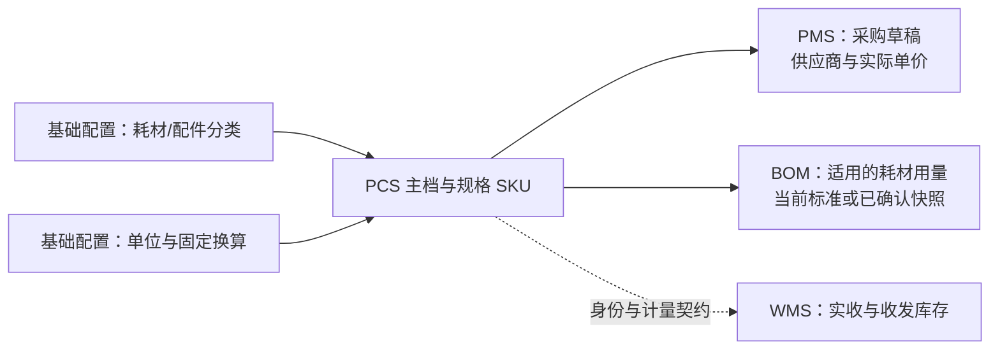

# PCS 耗材与配件档案简化方案 R1

日期：2026-10-09。核查基线：main，`155144308f6b2931a8acb229a579e04ec99af41d`。

文档状态：用户已确认按本方案及计划实施。默认 SKU 列表、纯文本规格型号、配件退出新建服装 BOM 的三项建议均纳入确认范围。实现和验收状态以需求追踪矩阵及两轮逐项对抗审查为准；设计场景本身不是测试证据。

配套：[代码核查记录](./代码核查记录.md)、[实施计划](./实施计划.md)、[需求追踪矩阵](./需求追踪矩阵.md)。

## 1. 目标、范围与已确认边界

耗材、配件应围绕“是什么、具体规格是什么、用什么单位买与领、标准成本是多少、能否选用”组织。取消两类档案对技术属性模板、加工阶段、加工资料的依赖，同时保留识别、防错、计量和追溯能力。

本方案中的配件是设备备件，例如裁剪刀片、缝纫机配件；不是纽扣、拉链、花边等服装辅料。耗材包括包装袋、胶带、润滑油、裁剪耗材、缝纫耗材、清洁耗材、包装辅材。分类沿用现有资料，具体名称可调整，不自动重新归类历史记录。

直接调整范围：耗材档案、配件档案、基础配置中这两类的分类维护、相关规格识别和校验、单位/包装、标准成本、复制、附件、打印、导入导出、采购带入、BOM 选用和加工候选防错。

保持用户既有确认：档案不维护供应商，不维护库存；采购时在 PMS 选择供应商和实际单价；库存数量归 WMS；主计量单位与辅助单位有明确换算；综合成本是含税标准成本，人工维护采购标准价，默认 RMB，可按汇率展示 IDR、USD；一人可维护并审核；PCS 无本地迁移、备份、恢复、清理或空间管理工具。

面料、辅料、纱线保留现有专业属性和加工能力。此次不建设设备维修、备件安装、真实采购入库系统，不改写整个 PMS/WMS，不扩展异常治理模块，不接入后端或云端存储。

## 2. 当前代码问题与简化对应关系

以下是当前代码已确认的行为，不等于当前运行浏览器已复现；运行服务属于另一工作树，详见核查记录。

| 当前问题 | 代码依据 | 目标调整 |
| --- | --- | --- |
| 五种物料共用主档/SKU 页面，耗材和配件也有技术属性、加工关系、加工计划等页面内容 | `pcs-material-archives.ts:120–151,218–298` | 两类使用简单页面分支；移除加工入口和专业属性编辑 |
| 分类与属性模板具有九个详情 Tab，并允许主档、SKU、包装、工艺四层字段；保存时补回包装和工艺默认字段 | `pcs-config-workspace.ts`；`pcs-material-config.ts:223–240` | 两类改为简单分类，脱离模板、版本审核和属性定义 |
| 分类候选来自启用且已审核的模板，直接删除模板会使分类选择断开 | `pcs-material-archive-repository.ts:1170` 附近 | 先建立独立分类来源，再切换档案引用 |
| 新建、编辑、提交审核、包装保存都会调用模板校验 | `pcs-material-archive-repository.ts:1308–1369,1395–1435,1718–1743` | 两类只校验基本资料、规格、单位和费用；专业物料规则保持 |
| SKU 身份指纹不包含 `specName`、`sizeName`，简单规格文字无法独立防重 | `pcs-material-archive-repository.ts:1390–1393` | 两类以规范化“规格型号”识别同主档内的规格 |
| 列表规格列侧重颜色/Pantone/花型，关键词查询没有充分覆盖规格型号 | `pcs-material-archives.ts:80–102`；仓库查询 `:1240` 附近 | 列表、搜索、采购/BOM候选突出规格型号 |
| 所有物料都可命中加工路由，创建加工 SKU 没有耗材/配件类型阻断 | `routes-pcs.ts:88` 附近；仓库 `:1496–1530` | 删除两类的加工路由匹配；仓库、导入、带入和 FCS 新建校验一致阻断 |
| 包装另设 Tab；保存包装会自动建辅助单位关系，但默认仅用于采购/发料，成本采用关系仍需分辨 | 仓库 `:1718–1743` | 包装含量并入计量单位；显示具体包装和用途，避免二次填写换算 |
| 修改包装会停用旧包装关系，当前计价若仍引用旧关系需要同步处理 | 同上；成本 `:1821–1873` | 保存前明确当前采用的包装，原子更新当前采用关系；历史单据保留旧版本 |
| 包装类型使用情况读取 `packageUnit/packageType/materialSkuId`，实际包装对象使用 `packageTypeId/ownerSkuId` 等 | `pcs-config-workspace-repository.ts:602–604`；类型与包装保存 | 修正使用情况关联，防止实际使用却显示零引用 |
| 标准标签只展示颜色等内容，规格型号主要在“含加工资料”的详细标签中出现 | `pcs-material-archives.ts:335,458` | 两类标签默认必须显示规格型号；取消加工模板选择 |
| 技术包“其他”同时允许耗材和设备配件；“包装材料”按不存在于五类物料中的 `packaging` 类型筛选 | `tech-pack/bom-domain.ts:468–482` | 耗材按用途选用，包装耗材映射到包装材料；配件退出新建服装 BOM 为建议确认项 |
| BOM 与价格页面可选所有可用物料，并对每一行显示染色/印花要求 | `pcs-technical-data.ts:55–61,89–123` | 两类不能重新通过 BOM 配置加工要求；保存层同步校验 |
| 生产准备加工任务生成函数没有两类物料阻断，接收类型把非面料/纱线统一归为辅料；若其快照含加工要求，仍可能生成任务 | `pcs-engineering-master-sampling.ts:1424–1511`；`tech-pack/process-domain.ts:98–110` | 候选、BOM保存、任务生成和FCS接收同时排除两类新加工，不以页面移除按钮代替规则 |
| PCS 来源采购能保存草稿，尚不能通过当前入口推进到货、入库 | PMS 采购仓库与页面 | 保持真实带入能力；不把保存草稿称为采购入库闭环 |
| PMS“刷新库存”在演示实现中逐行增加数量，并未读取 WMS 库存 | `pms/inventory-monitor.ts:535` 附近 | 不把该页面数值或刷新动作引入 PCS 档案；登记为外围既有问题 |

## 3. 对象结构和领域职责

### 3.1 页面简单，身份关系保留

继续采用“物料主档 1:N 物料 SKU”。主档保存共同名称、分类和说明；SKU 保存能被采购、领用和识别的具体规格。用户日常从 SKU 清单工作，不必先理解主档和加工阶段。

例如“裁剪刀片”是一份主档，10 英寸和 12 英寸是两个 SKU；“透明包装袋”是一份主档，30×25 cm 与 40×25 cm 是两个 SKU。保留既有 `materialId`、`materialSkuId`、主档编码、SKU 编码、条码与别名，不重新编号，不通过名称关联下游。

相同物品只改变外包装，例如同一型号螺丝每盒 10 个/20 个，维护两个包装换算，不增加 SKU。容量、尺寸、型号变化且已是不同采购/领用对象时才增加 SKU。不得把“1 瓶”“1 盒”默认视为一个相同规格，也不得自动判断两个型号实际可互换。

### 3.2 各领域拥有自己的事实

| 事实 | 归属 | PCS 行为 |
| --- | --- | --- |
| 物料身份、分类、规格型号、主单位与标准换算、识别资料 | PCS 档案 | 维护并供下游选用 |
| 标准采购价、基础运输标准额、综合标准成本 | PCS 标准成本 | 维护当前标准、保存历史版本 |
| 供应商、实际采购单价、数量、交期、收货仓 | PMS 采购 | PCS 仅带入物料 SKU 和计量资料 |
| 实收、入库、库存、库位、发料、退料数量 | WMS | 不在档案手填、复制或用 Mock 刷新生成 |
| 成衣用料与用量、已确认技术资料成本快照 | BOM/技术包 | 引用身份、单位与成本，不改变物料档案身份 |
| 加工定义和加工计划 | 专业物料与 FCS | 耗材/配件不提供新加工对象 |

实线对应本次核查到的引用方向；WMS 虚线表达目标业务职责，不能当作当前通用耗材/配件入库已经接通的证据。共享稳定 ID 与计量版本即可，档案不依赖采购发生、库存存在或维修单创建才能保存。

实现保持现有轻量仓库和页面机制，在少数业务入口明确区分简单物料；不增加大型通用领域层。领域边界通过字段归属和操作校验落实。

## 4. 字段方案

### 4.1 主档字段

| 展示名称 | 对应现有字段/目标承接 | 规则 |
| --- | --- | --- |
| 主档编码 | `materialCode` | 自动生成；沿用 MAT-CS/MAT-EP 编码体系与既有编码；保存后不可改 |
| 名称 | `materialName` | 保存草稿必填；名称不能承担唯一身份；公共名称修改保留日志 |
| 分类 | `categoryId/categoryCode/categoryName` | 分类必选；稳定 ID/代码关联；当前展示名称与历史采用名称分开处理 |
| 通用说明 | `remark`，必要时既有 `specSummary` | 可选普通文字，包含用途、选购说明；不做动态属性模板 |
| 主图/其他资料 | `mainImageUrl/galleryImageUrls` 与现有附件引用 | 草稿可缺；提交审核有可识别实物图；复用 SKU 图片可作为主图 |
| 审核与使用状态 | `approvalStatus/status` | 保留各自含义，不把审核通过等同于启用 |
| 创建/更新时间及人员 | 既有时间、人员字段 | 自动记录；当前更新时间反映本档案相关修改 |

两类不再维护 `templateId/templateVersion` 作为有效业务必填字段，也不再维护成分、组织、纱支、幅宽、克重、适配设备组合、技术属性字段集合等。旧值先完整承接到可读的普通历史说明，之后退出当前有效字段和校验；不静默丢失。

主档不设置库存、仓库库存、供应商或默认供应商；不设置主档加工费；不再用主档主单位约束不同 SKU。既有主档单位可以辅助新增规格预填，但每个 SKU 必须明确自己的单位。

### 4.2 SKU 字段

| 展示名称 | 对应字段 | 规则 |
| --- | --- | --- |
| SKU 编码 | `materialSkuCode` | 系统分配；既有编码保留，新规格沿用 B 序列；不可手改、不可重用已分配编号 |
| 规格型号 | `specName` | 保存时必填；示例“白色 24mm×50m”“10 英寸直刀片”“DB×1 14号” |
| 补充说明 | 普通规格说明/既有备注承接 | 可选，如“适用于××设备”；不用设备型号字典做强制关联 |
| 主计量单位 | `mainUnit`及版本 | 保存时必填；选择基础配置的可用单位；已经审核/被使用时按既有保护规则锁定 |
| 识别图 | `skuImageUrl`/识别附件引用 | 可使用主档图；审核时应能辨认当前规格；不同规格优先各自图片 |
| 条码和已有别名 | `barcode/barcodeAliases` | 保留扫码身份；新增别名防止跨 SKU 重复 |
| 标准成本 | 成本版本引用 | 独立维护，可暂未完整；不以缺成本禁止普通资料保存 |
| 审核、启停、时间、日志 | 现有状态、时间和日志 | 在列表/详情直接表达当前可选用性 |

不再为两类单列颜色、Pantone、花型、花型版本、加工前驱、加工工艺、尺寸属性数组、结构材质字典或接口技术属性。确实影响区分的颜色/尺寸/型号写入“规格型号”，普通说明可补充。不得用必须先维护字典的方式重新增加技术属性。

建议规格型号最长 120 字符、名称最长 80 字符、说明最长 500 字符。导入、表单和保存统一限制；这些是本方案建议的原型输入上限，不是线上既有字段长度事实。

### 4.3 SKU 唯一性与修改

两类同主档内，以规格型号规范化文本防止重复：去首尾空白、合并连续空白、拉丁字母大小写统一。不根据尺寸单位、标点或设备名称推测等价；“10 英寸”和“25.4 cm”不得自动合并。系统编号仍是唯一正式身份。

草稿规格可修改并重新检查重复。已审核规格的识别内容修改默认通过新增 SKU 表达，避免把历史已采购的 10 英寸改成 12 英寸。普通说明、识别图片的更新仍可维护并留日志。若需要纠正已审核规格文字的错别字，应采用明确的“更正规格文字”动作、确认不改变实物并记录前后值，不自动将其当作新规格或改动历史单据快照。

面料/辅料/纱线继续使用专业身份字段，不将两类的文字指纹推广为全物料规则。

## 5. 页面层次

### 5.1 档案列表：直接展示具体规格

保留耗材档案、配件档案两个菜单和当前地址。两类默认每行一个 SKU，取消主档/SKU 顶部视图切换、加工阶段统计和染印绣筛选。

默认表格：选择、物料（小图+名称+SKU 编码）、分类、规格型号、主单位、综合标准成本、审核/使用状态、时间、操作。主档编码在物料格的次级信息或列设置中提供，点击进入主档详情。名称和规格型号可换行，超长部分可展开；不堆入供应商、库存或技术属性。

筛选：关键词（主档编码/SKU 编码/条码别名/名称/规格型号）、分类、审核状态、使用状态。保留查询、重置、导入导出和列设置。统计仅保留规格数、待审核数、成本待补数，按当前筛选一致计算，不使用虚构引用数量。

主操作：新建耗材/新建配件。行操作：详情、编辑；更多中提供复制规格、提交/审核、启停、打印、日志。有效可用 SKU 可“发起采购”。操作由当前状态决定，列表说明不可用原因；不要一行平铺大量按钮。

时间列同格展示创建时间和最近更新时间；单位、包装和成本修改必须被“最近更新”反映，不能只取没有随费用更新的旧 `sku.updatedAt`。

### 5.2 主档详情：两个 Tab

“基本资料”：名称、分类、主档编码、说明、主图和状态。日志通过按钮弹窗。

“规格清单”：所属 SKU、规格型号、主单位、状态、成本摘要；新增规格进入独立编辑页。取消加工关系、独立技术引用、独立资料、独立日志 Tab。已确认存在的下游引用用“使用情况”按钮打开分组明细，不把不真实的静态计数当作实际关联。

### 5.3 SKU 详情：三个 Tab

| Tab | 内容 | 操作 |
| --- | --- | --- |
| 资料与规格 | 主档名/分类、SKU 编码、规格型号、说明、图片与普通附件、状态、时间 | 编辑、复制、审核、启停、打印、日志、使用情况 |
| 计量单位 | 主单位；辅助单位；包装含量；采购/计价/领用用途；明确换算依据 | 维护辅助单位和包装，查看单位历史 |
| 标准成本 | 标准采购、基础运输、综合标准成本；计价单位；币种展示；费用历史 | 修改标准价；查看变更前后金额 |

不保留加工关系、加工计划、技术属性、包装物流、单独资料或单独日志 Tab。毛重与包装尺寸有实际需求时放在“计量单位”的“更多包装信息”折叠区，不占首屏、不强制填写。

### 5.4 新建与编辑

新建整份档案：独立页面一次填写名称、分类、首个规格型号、主单位、识别图和可选说明；保存原子创建主档及首个 SKU 草稿。成本和辅助单位可在保存后进入对应 Tab 维护，不要求先填写一堆辅助资料才能建档。

已有主档新增规格：带出名称、分类，仅填写新的规格型号、主单位与识别资料。不强迫新建另一份主档，不复制正式状态和历史操作。

编辑页沿用详情的三个视图或当前动作的专门表单；每次保存范围清楚，例如“保存规格”“保存单位”“保存标准成本”。切 Tab 保留未保存输入；离开提醒；保存失败保留输入。分类的编辑属于主档，不能在某个 SKU 页面静默修改其他 SKU 的公共分类。

复制规格：进入未保存的新规格表单，带入规格、单位与可复用图片/普通附件，必须修改规格型号后才能保存；成本可显式勾选复制当前标准值，默认不复制；不复制审核、启用、采购、引用或日志历史。附件复用文件引用，不重新复制 Blob。当前“复制主档”只复制主档、不复制 SKU；新交互必须明确“复制为新档案”并带首个待保存规格，避免生成用户看不到用途的空主档。

### 5.5 打印

沿用真实二维码实现和 SKU 稳定身份。两类只有普通识别标签，不出现“含加工资料”模板。默认打印 SKU 编码、名称、规格型号、主单位、二维码；图片可预览并在合适布局展示。主档发起打印时明确选择具体 SKU 与份数，不能把主档编码当作一个实际规格。

本方案不更改样衣 HG 标签、不假定物料标签尺寸与样衣标签尺寸一致。打印预览须单独验收长型号、中文、分页、实际二维码可读和重复份数。

## 6. 基础配置改成简单分类

保留“系统设置 → 基础配置 → 分类与属性模板”的现有入口，面料/辅料/纱线继续维护模板。选择耗材/配件后，正文标题分别为“耗材分类”“配件分类”，不展示模板属性、版本或工艺能力。

### 6.1 分类列表与编辑字段

列表：分类编码、分类名称、状态、使用档案数、更新时间、操作。可以搜索、按状态筛选、排序；不再显示当前模板版本、根/SKU 属性数量、版本审核状态。

新增/编辑分类用短表单：分类名称（必填）、分类编码（自动生成、不可改）、排序、启用/停用、可选说明。详情只需基本资料、引用档案列表和日志，无九个 Tab、无新建版本、无模板审核步骤。分类无需在耗材/配件档案之外再走一轮属性版本审核。

既有七类耗材、五类配件分类先按当前稳定身份承接，不合并同名/近名类别，不重建分类 ID。名称可更正；停用后新建/换分类不可选，历史档案仍显示原引用，允许维护无关普通资料。被使用分类不硬删除，不自动停用其全部 SKU；确需停止物料新选用，应在档案/规格明确执行停用。

### 6.2 属性与模板收口

两类不提供主档属性、SKU 属性、包装属性、工艺属性、多语言分类 Tab、版本换算依据、版本记录等模板维护入口。包装核心校验改为固定业务规则，不再由模板控制。

分类使用数量从实际 `categoryId` 引用统计，点击能查看对应主档。包装类型使用情况改为按真实 `packageTypeId`、`ownerSkuId` 关联。单位和包装类型仍是共享基础配置；固定单位换算仍全局唯一。

配件不再强制关联“适配设备→设备型号”。若用户需要说明适配机型，写入普通规格说明即可。现有共享“适配设备”基础字典及其历史引用不在本次无差别删除；先移除两类的选用、验证和引导文案，历史值承接到可读说明。其他模块是否独立需要设备字典，不能因配件简化直接推定不需要。

## 7. 计量单位与包装

每个 SKU 恰好一个主单位。辅助单位使用“1 辅助单位 = N 主单位”的统一展示，但不要求用户理解内部关系编号。

| 情况 | 数值来源 | 交互 |
| --- | --- | --- |
| 同维度固定单位，如 Yard→M、g→KG | 基础配置固定换算 | 自动带出、只读显示，不在 SKU 重复维护 |
| 盒/包/卷/瓶的含量 | 本 SKU 包装标准含量 | 选择包装类型、填含量与含量单位、说明依据；保存自动生成关系 |
| 跨维度或特定物料的换算 | 本 SKU 已确认的计量关系 | 维护系数和依据；缺失保持待补，禁止默认 1:1 |

辅助关系列表显示“包装/单位名称、换算、用途、默认用途、状态、依据”。同一 SKU 有“盒（10个装）”“盒（20个装）”时，两条关系都可存在，采购和计价候选必须显示含量，不能只显示两个相同的“盒”。每种用途最多一条默认关系。

包装必填：包装类型、含量>0、含量单位、计量依据。包装名称可由“类型+含量”自动生成，允许备注区分包装。毛重、长宽高可选，留空是未知，不填 0 模拟真实数据。固定校验正数/精度与内容单位可换算性即可。

包装保存与生成的关系作为同一动作持久化；不能先包装成功、关系失败。修改包装创建新版本，既有采购和确认 BOM 保留旧采用版本。当前标准成本若用这项包装计价，保存前显示变更预览：重新选择正确关系或明确沿用当前采用的旧版本；不将旧关系直接停用后留下失效当前成本，也不自动按新包装含量改写原“每盒”的报价。当前仍采用旧版本时，页面明确“当前计价采用10个装；新包装20个装尚未用于此报价”。

主单位变更继续核查档案审核、既有单位关系、采购引用和实际下游引用。存在历史采用时不能直接改“个”为“盒”重解释旧数量。

## 8. 标准成本

两类新规格的公式只有：

**综合标准成本 = 标准采购成本 + 基础运输成本。**

两项按同一计价单位、同一含税口径表达。无加工费、染印绣/烫画费、标准损耗、缩率或一次性费。不得用“加工费=0”的可编辑字段继续保留错误能力。

| 字段 | 必填条件 | 来源与规则 |
| --- | --- | --- |
| 计价单位/包装 | 维护标准成本时必填 | 默认主单位，其他选择来自 SKU 已确认计价关系；候选显示含量 |
| 含税标准采购价 | 要形成完整综合标准成本时必填 | 人工维护，可0但需明确输入；实际采购价不自动覆盖 |
| 采购价已含基础运输 | 可选 | 选中时基础运输计入0，页面明确已包含，避免重复累计 |
| 基础运输标准额 | 未含运输时形成完整成本必填 | 人工维护，可0表示确认无基础运输；留空表示待维护 |
| 原币金额与币种 | 沿用已有原币能力 | 若按非 RMB 维护，采用既有汇率机制并保留来源，不增设汇率生效流程 |
| 综合标准成本 | 只读 | 按采用计价单位汇总，可切换 RMB/IDR/USD展示 |
| 变更原因 | 修改已保存标准时必填 | 记录费用前后值、单位与采用关系、人员时间 |

示例：螺丝主单位 PCS；1盒=10PCS；标准采购20 RMB/盒，基础运输1 RMB/盒。综合21 RMB/盒，折合2.1 RMB/PCS。辅助关系若换成20个装，不能不修改每盒报价就把同一记录解释成另一报价。

缺采购或未明确运输口径：综合成本显示“待补齐”，不显示虚假0。普通档案可以审核并启用；要参与需要完整标准成本的 BOM 核价时，按 BOM 规则补齐，不能把成本缺失提示成“补加工费”。发起采购允许独立填写实际采购价。

标准维护后当前引用立即采用新标准，不增加待复核成本版本流程。已确认/发布技术资料使用原有冻结快照，历史采购保留实际价格；本次简化不将“当前标准自动更新”扩展为改写历史单据。

## 9. 审核、启停与使用情况

草稿可不完整；提交审核校验名称、有效分类、规格型号、主单位和识别图，彻底停止模板属性/加工资料校验。费用缺失作为成本待补提示单列。

保留草稿→待审核→通过/驳回的现有轻量流程，允许维护人和审核人同人。新建主档与首个规格在同一审核入口提交/处理，界面说明本次包含哪些对象。已审核主档新增规格时仅处理新规格，不重新审核全部历史 SKU。

可新选用要求主档和 SKU 均已审核且已启用。两层状态在数据中保留，页面只用一个清楚的“可选用/不可选用原因”摘要，避免主档已启用却不知道规格未启用。启用动作明确范围，例如“启用主档与本规格”，原子保存两者，不隐式启用其他未审核规格。

主档停用阻止所属全部 SKU 新选用；单规格停用只影响该规格。历史采购/BOM仍可读，不自动关闭单据、删引用或改库存。停用、归档二次确认并记录原因。归档保护检查真实采购/BOM等引用，不只看静态 `usageRecords`；有引用默认使用停用，保留历史身份。

日志弹窗：时间、动作、说明、操作人，必要时前后值/原因。使用情况弹窗按采购草稿/实际技术引用分组；已有真实来源可点击跳转。暂未接通的维修/库存/采购完成流程不造演示引用，不显示成真实已领用。

## 10. 上下游收口

### 10.1 采购

继续通过稳定 SKU ID 带入 PMS。采购页来源摘要新增/补齐规格型号、分类和正确图片，辅助采购单位必须显示具体包装含量，单位版本随保存草稿冻结。

供应商、实际含税单价、采购数量、区域、收货仓、日期在采购草稿填写。完成仅指当前浏览器保存草稿并可重开；现有 PCS 来源草稿不能推进到货/入库，属于外围功能缺口，不在本次伪造完成。

### 10.2 BOM/技术包

耗材可以按业务需要继续成为“其他”物料；包装袋等包装耗材可按明确分类 ID 配置进入“包装材料”，修正以 `packaging` 类型筛选的断层。不能以名称包含“包装”猜测类别。

**已确认：设备配件退出新建服装 BOM 候选。** 用户要求按本方案实施，采用本方案建议；历史配件引用保留，只读追溯不等于重新允许新建。

耗材/配件相关 BOM 行不出现染色、印花、绣花、水溶、花型、加工前后对象等编辑内容；即使保留历史配件行，也不允许添加新加工要求。UI、事件、BOM保存入口与生产准备生成入口都校验，避免从其他页面重新生成耗材加工单。用量、单位换算、成本引用和 BOM 自身损耗公式保持现有职责；本次排除物料综合标准成本的损耗不等于删除 BOM 需求量损耗。

### 10.3 FCS与仓储

耗材/配件从 FCS 新建物料加工计划候选中排除；直接 URL、复制加工目标、提交保存、PCS 加工带入同样阻断。面料/辅料/纱线加工保持。

WMS 关联仍应采用 SKU 稳定身份和计量快照。本次不增加 PCS 库存 Tab、库存字段、库存手填或采购保存后的模拟入库。不复用 PMS库存监控中“刷新即增加数值”的演示行为作为 WMS来源。

## 11. 导入导出、附件和旧数据

### 11.1 三种业务模板保留，内容简化

档案模板：主档编码（已存在时）、名称、分类编码、SKU编码（更新时）、规格型号、主单位、主档通用说明、规格补充说明、已保存图片/附件引用。新建时编码可空由系统生成；不要求技术属性 JSON、模板 ID/版本、Pantone、花型或加工字段。

单位模板：SKU编码、辅助单位/包装名称、每辅助单位含多少主单位或包装内容、含量单位、用途、默认用途、依据。主单位从 SKU 带出核对；不让用户填写难懂的内部关系 ID。

成本模板：SKU编码、含税标准采购、基础运输、是否含运输、计价单位/包装、原币与币种（如使用）、变更原因。不得默认为实际采购价导入。

本原型耗材/配件档案 CSV 单批最多 500 行；单位与成本 CSV 单批最多 20 行。超限立即提示按完整主档组拆分，不开始保存。专业面料、辅料、纱线导入范围不变。该边界明确显示在导入页面，所有支持批次仍须完整保存并显示结果 ≤1秒。

新建与更新模式明确区分，不能把当前“新增组导入”直接称为可任意覆盖更新。更新以既有稳定编码定位，验证版本，显示差异再确认；既有单据 ID 不改。导入预览列出有效/错误/重复行和准确原因；按主档组原子保存，结果逐组报告；重复提交不重复建档。旧表格出现加工/技术字段时提示改用简单模板，不静默忽略后声称完整导入。

导出以当前业务字段输出；旧资料说明、单位、费用与附件引用可追溯。表格不能把文件 ID 当作文件实体传到其他浏览器；附件导入/导出保持现有原型支持边界，不声称表格自带全部原始文件。

### 11.2 文件和记录存储

复用 PCS 已有 IndexedDB 记录、Blob、版本校验、事务和文件引用机制。名称类似 getItem/setItem 的 `pcsRecordStore` 是现有命令内存外观，不能因此判断业务仍在写 localStorage。

用户记录按记录和动作保存；分类与档案切换涉及同一 PCS 数据库时保持原子关联；附件与主单引用一致提交；事务 complete 后显示成功；失败保留原数据和输入；多页冲突提示重新读取。读取不写种子、不迁移全模块，不清空数据库。

不新增 PCS 浏览器维护入口。若格式升级必须写入旧资料转换，采用独立、有版本、有回执的升级过程，转换后读回核验；失败保留原值。不能在普通渲染时反复做整包转换。

### 11.3 旧资料承接顺序

1. 登记两类已有主档/SKU/分类/模板引用、属性值、单位包装、费用、附件、条码别名和已存在下游引用；保留静态演示与用户覆盖的区分。
2. 创建简单分类注册，以原分类稳定身份建立映射；档案先切换分类来源，再停止模板依赖。
3. 规格展示从当前已采用模板的值和单位生成清楚的“规格型号/说明”。例如袋长30、宽25、原字段单位cm，展示30×25cm；不同模板单位不能按最新版重新解释。
4. 根技术值承接普通说明，SKU技术值承接规格型号/说明；保存来源/转换版本回执后，退出两类当前有效属性集合与模板校验。旧模板快照仅供历史资料引用，不继续作为新建能力。
5. 保留 SKU稳定ID、编码、扫码别名、单位版本、报价版本、附件与冻结引用；不自动合并规格、不重算历史实际成本、不重写采购数量。
6. 当前静态两类示例没有加工链不等于用户本地没有加工记录。若发现既有加工产出或费用，保留历史原值和关联，只读承接，不归零；在实施前报告具体记录并决定个别处理，不以本方案授权删除。
7. 更新两类 Mock 为可读规格与对应真实图片，更新生成的静态基线；保留用户覆盖与删除标记，发布不得复活已删除示例。

这属于已知字段格式的承接，不建设重复编码/缺父档案等已被用户排除的异常处理模块。

## 12. 正常与边界场景、完成标准

| 场景 | 应观察到的结果 |
| --- | --- |
| 新建包装袋30×25cm、PCS，保存后提交审核并启用 | 无技术属性必填；一个主档一个SKU；列表/详情/打印都识别尺寸；刷新一致 |
| 同主档新增40×25cm包装袋 | 新SKU、不同编码；同规格再建阻断；两者下游可清楚分辨 |
| 刀片10/12英寸与同型10/20个装 | 型号变化产生新SKU；同型包装变化只产生单位/包装关系 |
| 按10个装报价并发起采购 | PCS标准21/盒；PMS带入10个装关系，实际价独立；草稿重开一致 |
| 包装改20个装，旧采购已采用10个装 | 旧数量/版本不变；当前报价采用关系明确；不把旧价格偷偷换算成新包装 |
| 固定换算/缺失跨维度/多个同名包装 | 固定自动；缺失待补且阻断相关计算；多个包装明确选择含量 |
| 缺标准运输、采购价已含运费、明确0费用 | 分别为待补、运输计入0、合法确认0；无虚假完整成本 |
| 主档启用但新SKU未审核、单规格停用 | 页面准确显示原因；新的采购/BOM选用按规则阻断；历史仍可读 |
| 分类停用但既有规格仍已审核并启用 | 新档案/改分类不可选择该分类；既有物料不随分类停用而自动停用，历史可读 |
| 耗材从技术包请求染色/伪造直接加工URL | 页面没有入口；保存和FCS接收阻断；无生成半套加工对象 |
| 耗材包装材料进入BOM；既有配件BOM | 分类映射明确；成本/单位准确；历史配件引用保留 |
| 复制附件、导入重复组、多页冲突、保存超限/中止 | 无重复文件字节、无重复建档、无覆盖、无虚假成功，原资料不变 |
| 旧模板单位从cm改mm、旧尺寸引用仍为cm | 根据已采用旧版本解释，不把30cm读成30mm |
| 面料/辅料/纱线正常建加工SKU | 专业属性、编码、连续工艺及成本逻辑不受影响 |

原型验收：1366×768及最低1280×720列表；详情/编辑与打印单独验收；有真实识别图片及错误恢复提示；每个相关页面和动作的读取、计算、保存、渲染完成均≤1秒，无例外。大批导入亦测完整批次完成时间，不能只测Loading/预览出现；在原型支持的现有规模不能达标时，报告失败并优化/明确调整支持规模，不能标记已验证。

本次交付的是可审阅的方案与代码依据。实现、页面、打印、存储故障和性能结果须在后续完成后登记，见矩阵。

## 13. 建议集中确认的三项产品选择

1. 两类默认直接使用SKU列表，主档保留在后台关系及详情中；不保留列表顶部主档/SKU切换。
2. 两类以必填“规格型号”普通文字区分规格，技术信息承接为普通说明；不维护结构化技术属性模板或设备型号字典关联。
3. 设备配件退出新建服装BOM候选，历史引用保留；包装耗材按分类进入包装材料，其他适用耗材仍可进入其他用料。

其余细节均为本方案的具体建议，实施前以本方案确认版为依据。三项确认不代表现有代码已经改好，也不授权扩大到全站采购、库存或维修系统重构。

实施期间澄清：档案 CSV 将主档说明和规格说明分列，避免导出再更新时相互覆盖；同组主档说明必须一致。新建简单主档必须同时保存首个规格，遗留直接空主档复制入口不再允许。

### 2026-10-09 实施期规模调整

原有 5,000 行上限的完整保存实测约 6.7–9.8 秒，失败证据保留；本次明确收窄两类简单物料的单批支持规模，见第11.1节。依据第12章允许明确调整支持规模的条款；不以预览/忙碌状态代替完成，不放宽1秒门禁，不把5,000行失败标记通过。
