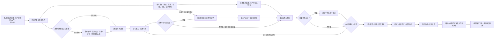
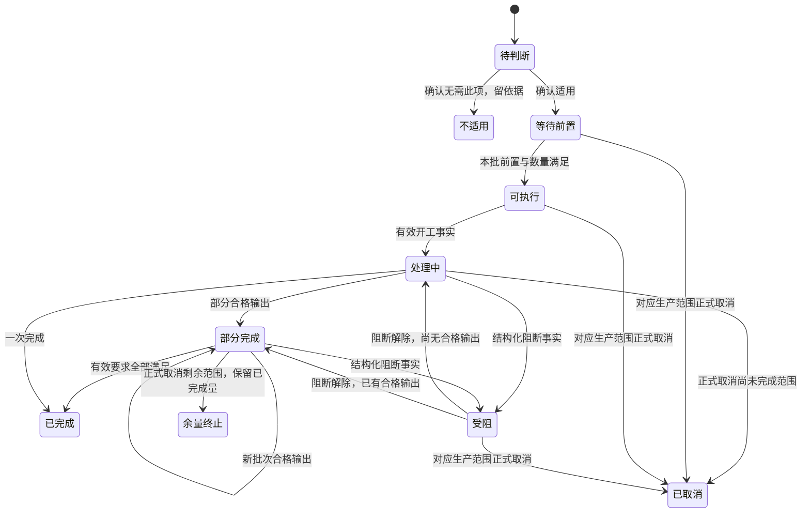
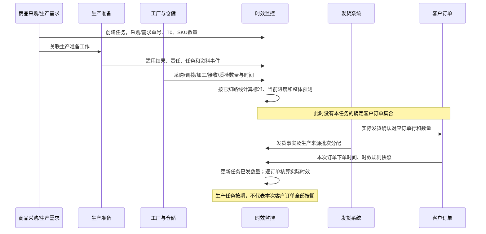
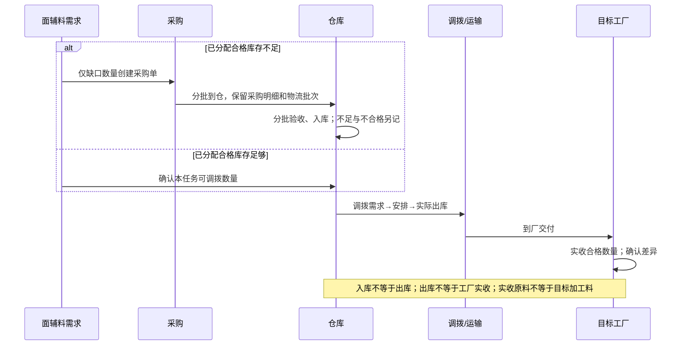
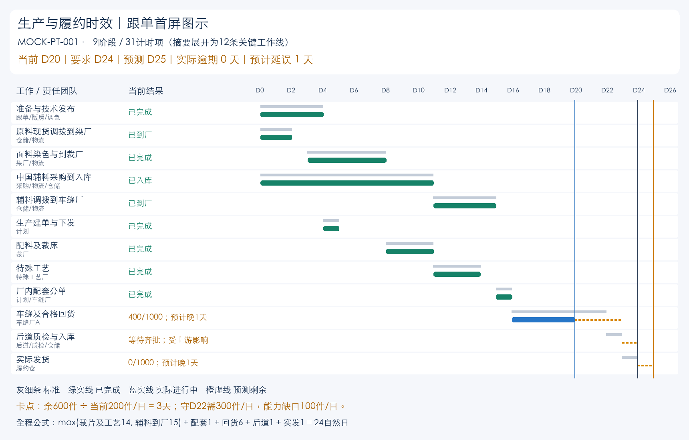
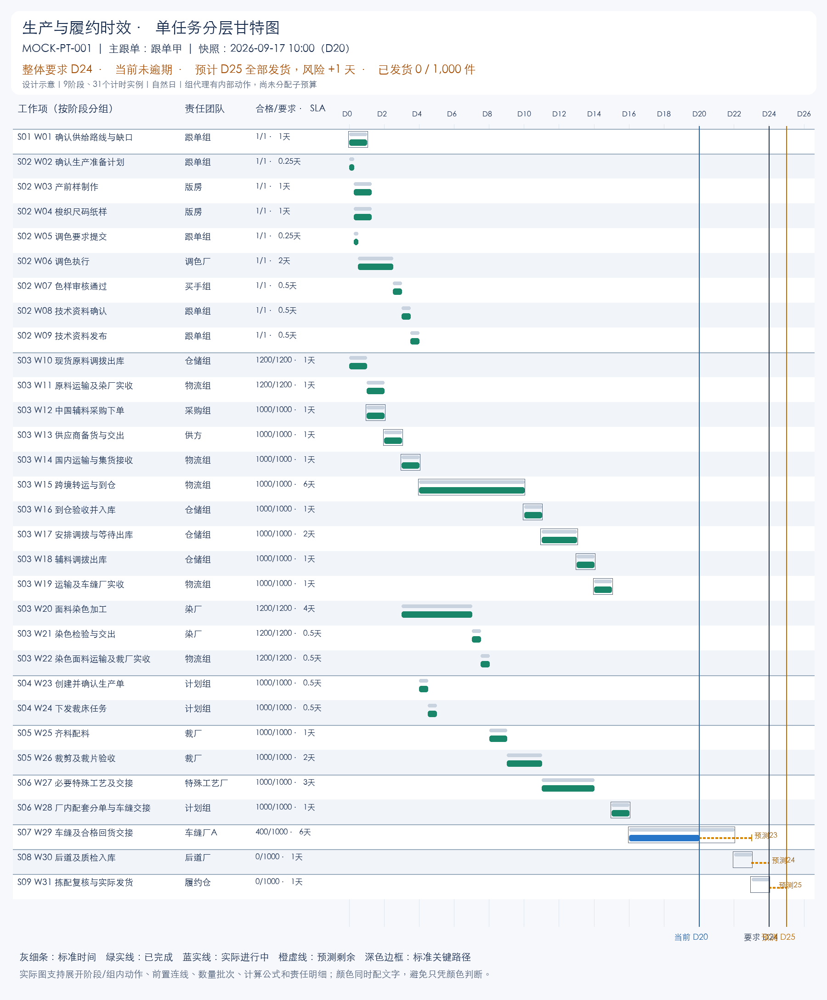

# DDS 供应链域「生产与履约时效」产品设计方案

版本：V4.0 依赖、来源规则与数据事项修订稿｜日期：2026-09-18｜基础 HEAD：4804328a822eec3c77eee1ffa5b10911bb77c9fe｜当前状态：实施与验收中，产品接受未发生

当前版本读取现有 FCS 生产需求、明确关联的技术包路线及既有执行任务；不再以独立的 10 笔 Mock 任务作为业务列表来源。2026-09-17 接入快照为 33 条 FCS 需求、30 条明确技术包路线映射，以及 14 条需求对应的 76 个既有执行任务；这些数量不是恒定规范，后续按实际来源集合计算。这些是当前仓库的原型业务记录，不是线上生产数据。PCS 默认本地准备库为空；整单合格产出、可归属的实际发货事实及正式全程 SLA 仍未齐备，显示待同步、待配置或待判定。已接入的质检样本量不得冒充整单合格回货。

V1/V2 的 24 天、31 项、10 笔任务、5 个客户订单等数字均保留为**历史规则算例**，仅供规则验证示例使用，不计入 V3 业务页面的任务、数量、时效、订单或角色范围。本文涉及这些数字的段落遵循此边界，通用业务规则继续有效。当前版本的首屏不再展示 Mock 标签、角色选择或时区选择，统一北京时间；来源范围在来源说明及设计资料中明确。

V3 历史浏览器记录存在冷加载最高429ms、刷新最高364.099999994ms的失败样本，其不通过结论保留历史。V4 已继续修改依赖图、规则与数据事项；final3的126项单测和浏览器结果保留为历史。最新已执行final5共7250个DDS及来源样本，27组功能、485类入口覆盖及所有性能样本通过；24个访问对象缺对应实图使图片门禁失败，**整体验收尚未通过**。用户本轮确认的事实优先于旧方案和代码，历史通过或失败样本均不冒充当前版本实测。

配套材料：[V3 来源修订与验收边界](source-alignment-v3.md) · [当前实施计划](implementation-plan.md) · [当前需求矩阵](requirements-matrix.csv) · [候选工作项目录](work-item-catalog.md) · [V1/V2 历史 Mock 算例](mock-scenarios.md) · [历史算例 JSON](mock-data.json) · [历史设计核验](design-review.md)

历史参考：[V1 跟单图示](assets/follower-overview.png) · [V1 31 项甘特图](assets/task-timeline.png) · [V1 需求索引](requirements-index.md) · [V1 来源索引](source-index.md)。这些静态资产不是 V3 当前数据或验收截图。

## 01. 产品定位、菜单与范围

建议正式名称为 **生产与履约时效**。它同时覆盖生产任务从下单到实发的过程，以及实际发货所对应客户订单的时效结果；中文“与”比“&”更适合现有后台菜单。位于 **数据决策系统 DDS → 供应链域**，与已有的“物料监控与决策”并列。不要挂在该物料模块内部，也不另建一套采购、调拨、质检或发货操作系统。

```text
数据决策系统 DDS
└─ 供应链域
   ├─ 物料监控与决策（现有）
   └─ 生产与履约时效（新增）
      ├─ 时效总览
      ├─ 生产任务
      ├─ 我的跟单
      ├─ 工作项监控
      ├─ 团队与工厂
      ├─ 订单履约分析
      └─ 规则与配置
```

核心问题：一笔生产任务需要做什么、由谁做、应在何时完成、现在做到多少、哪里卡住、是否会影响整体实发，以及责任团队今天先做什么。

范围包括：阶段／工作项识别、单据关联、条件判断、串并行时效计算、数量和质量进度、预测、整体与局部责任、发货后订单时效核算、规则版本、数据质量、异常跟进记录。DDS读取来源事实并解释，业务动作仍在原系统执行；原型允许模拟跳转与演示记录，不实现真实后端、通知通道、鉴权或排产优化引擎。

**两条修正作为全篇前提：**

- 客户订单在实际发货时才确认关联。生产期间不能先列出“这笔生产任务待发的具体客户订单”，也不能用未知客户订单截止倒排生产。
- 面辅料采购必须追到仓库入库及后续调拨到目标工厂实收；库存足够时也保留调拨全过程。仓库入库、调拨出库、工厂实收是不同事实。

## 02. 当前原型依据与需要补齐的部分

本节先列 V3 本轮接入事实，再保留初始设计的代码背景。不能将原型数据推断为线上数据库事实；初始设计时的来源现状不替代本轮映射结果。

### 02.1 V3 当前来源与缺口

|对象|本轮事实|V3 页面口径|
|---|---|---|
|FCS 生产需求|主列表已承接 33 条现有需求|使用原需求标识、来源采购编号、数量、跟单及来源时间；同款不同需求不合并|
|技术包路线|已有 30 条明确路线映射|节点、适用性、显式直接前置、投入／产出 SKU 从映射技术包读取；无映射保持待关联|
|既有执行任务|14 条需求匹配到 76 个既有任务|沿明确需求及路线节点关系读取实际工厂、状态和起止；数量标明可能为来源生产单总量，本需求份额待确认，不把共用总量计入本需求|
|PCS 生产准备|默认本地准备库为空；准备主单没有需求 ID 关系|DDS 只允许显式关联同款已有准备单／技术包；没有记录时显示暂无可关联准备单，不编造准备完成|
|实际合格产出／实发|未接通可核算的完整事实|要求量与合格量的已知性独立；未知显示待同步，不用 0 冒充无产出／无实发；订单履约结果不生成|
|正式工作 SLA／全程发货承诺|尚未接通|显示待配置；生产需求交付日期保留原含义，不直接改名为全部发货截止|

### 02.2 初始设计的来源背景（供追溯）

|已核对位置|当前事实|本设计如何承接|
|---|---|---|
|`src/data/app-shell-config.ts` DDS配置|供应链域已有“物料监控与决策”及7个子页|在同域增加并列菜单；不修改物料模块业务|
|`src/router/routes.ts`；`src/pages/material-decision/index.ts`|DDS物料页已有独立路由和页面事件入口|复用现有壳、导航与事件组织方式；新模块独立目录|
|`src/data/fcs/production-demands.ts`|有来源单号、SPU、跟单、SKU数量、创建时间、生产单关联|保留需求源头，不把生产单创建时间当T0|
|`src/data/fcs/production-orders.ts`|生产单可携带多个来源需求快照|生产单下钻按来源需求分别保留起点、数量和截止|
|`src/data/pcs-engineering-master-types.ts`；`pcs-engineering-master-repository.ts`|准备单按款式／设计版本组织，存在资料复用；尚无本模块需要的显式需求关联|补齐准备单—生产需求关系；不能只按SPU猜测是哪一笔需求|
|`pcs-engineering-dependency-policy.ts`|已有8类任务、适用判断、前置关系、样衣与尺码纸样并行等规则|直接承接真实任务类型；细分要求提交、执行、审核等计时节点|
|`pcs-engineering-preparation-projection.ts`|现有9类计时投影与固定预算；技术资料确认未作为完整计时节点；需求／生产单号留空；起算随计划／发布等事件|不能把这张局部投影直接复制为全链路时效；补齐源头、确认／发布与基线版本|
|`pcs-engineering-purchase-linkage.ts`|采购联动看物料SKU覆盖及实际下单时间，不能证明足量或到厂|采购下单完成、足量供给、到仓、到厂分别判断|
|`src/data/fcs/production-demand-early-process-work-orders.ts`|需求侧提前染色／印花有来源快照与后续匹配；部分专业任务引用由Mock构造|允许需求阶段提前建加工单；正式监控关联真实任务与版本，不能把构造值当真实完成证据|
|`src/data/tech-pack-process-route.ts`；FCS加工任务与接收事实|存在工艺路线、任务、投入产出、交出／接收等对象|按实际技术路线生成工作，不把所有工艺强制插入每单|
|`src/data/fcs/sewing-production-order-duration.ts`|已有车缝时效展示，但含专门演示场景|可借鉴表达；不作为全链路真实时效引擎|
|`src/data/fcs/sewing-return-calendar.ts`|旧规则排除起始周某个周日|本模块统一自然日，必须显式隔离／调整规则来源；不能静默复用旧算法|
|`src/pages/pms-purchase-orders.ts`|初始核对时本地采购覆盖范围与线上完整采购模块不同|V3 仅显示来源明确的采购编号与已接事实；缺少采购、物流、实收事实保持待同步，不用独立 Mock 覆盖业务任务|
|`src/components/ui/list-page.ts`、`pagination.ts`及同目录组件|已有标准列表、分页等基础组件|延续当前样式和Vanilla TS字符串模板，不引入新UI框架|

**生产准备具体映射：**现有任务为产前样、梭织尺码纸样、毛织尺码纸样、花型、毛纱调色、面料调色、辅料下单、技术资料确认。调色应展开跟单要求、工厂执行、买手审核；花型展开执行与审核。不同路线适用数量不同，不强制每单8项。已复用资料显示版本、来源、确认时间及“已复用”，不虚构制作耗时。已下单辅料任务与采购来源使用同一事实，不能在PCS和采购阶段重复计时。

## 03. 对象、层级与唯一口径

|对象|含义与关系|必须保留|
|---|---|---|
|生产任务|一笔商品采购／对应生产需求的全程监控对象，二者1:1视为同一任务源头|唯一任务ID、两种业务单号、T0、原始／生效数量、主跟单|
|生产准备单|承载准备工作及技术版本；关联某需求，也可能通过明确关系被复用|准备单号、需求关联、适用数量、版本、复用依据；不擅定1:1|
|生产单|组织制造执行，可合并多个需求|来源需求及数量分配快照；每来源T0和截止；唯一主跟单与协同人|
|阶段|跨任务统一浏览分类|9类目录、实际适用／不适用；不是固定串行顺序|
|工作项类型|可配置的业务动作定义|适用条件、单据与事件映射、时效规则、默认责任|
|工作项实例|某任务／物料／批次中实际需要做的一次工作|类型、对象、数量、责任、前置、标准／实际／预测时间|
|判断事项|某工作是否需要、从哪里供给等尚未决定的事项|判断责任人、应判时间、候选合法路线；未知不能当不需要|
|供给分配|将现货、采购、加工产出分配给某需求的数量关系|输入／目标SKU、单位、需求行、批次、分配量、实际可用量|
|物流／调拨批次|采购、转运、调拨的实际数量载体|发出、途中、到仓、入库、到厂实收事件和数量|
|实际发货关联|发货时将客户订单行、出库实物批次与任务数量建立关系|订单下单时刻、实际发货时刻、数量、来源批次、撤销／纠错记录|

同一工作可服务多笔生产需求：任务详情可分别展示其影响，但全局工作项数按实例ID去重。共享能力／产出数量必须分配，不能将同一批物料或同一工厂产能完整计算给多笔任务。生产单多来源时显示“共N个来源任务，最早生效截止…，其中N个风险”，不得用合并时间重置全部时钟。

若实际发货只知道客户订单但无法追到生产来源，订单自身的时效仍可核算；生产任务的已发数量保持“归属待确认”，不能按SPU猜测扣账。这是数据质量事项，有责任人及处理期限。

## 04. 阶段与工作项：目录固定，实例动态

保留 **9 个展示阶段**作为监控分类，不用它们生成固定九段流程。V3 工作来自显式关联的准备任务、技术包路线节点与既有执行任务；各需求实际工作数由来源决定。同一工艺的不同路线节点独立保留，显式前置决定串并行，不能按阶段顺序补前置。资料已复用、明确无需执行、尚未确定三者分开。已实际开工的工作不因缺 SLA 被归为不可执行，执行状态与时效可判定状态独立。阶段只有在来源明确“不需要”时才显示不适用；缺来源不能按不适用处理。

下表及随后 31／21／49 项计数为 V1/V2 历史主算例，用于说明分层计数，不是 V3 33 条需求的固定模板或当前统计。

|阶段|范围与结束结果|主案例计时项数|
|---|---|---:|
|S01 需求受理与方案判断|责任落实、需求及供给路线判断|1|
|S02 生产准备与技术放行|适用专业任务、审核及技术资料发布|8|
|S03 面辅料供给、加工与到厂|缺口采购／现货调拨、必要加工、目标工厂实收可用|13|
|S04 生产建单与任务下发|来源匹配、生产单、工艺与任务下发|2|
|S05 裁床生产|配料、裁剪、验片及批次交接|2|
|S06 特殊工艺与车缝配套|适用特殊工艺、齐套／分单、配套交接|2|
|S07 车缝与回货交接|车缝进度、首批／后续回货和实收|1（组计时）|
|S08 后道、质检与成衣入库|后道处理、质检放行、成衣实收入库|1（组计时）|
|S09 实际发货与订单时效核算|拣配复核、实际发货、订单事实关联与核算|1（组计时）|
|合计|主案例的计时层级；不是所有任务的固定模板|31|

候选动作详见[工作项目录](work-item-catalog.md)。数量必须分开显示“已确认适用的计时项、组内执行动作、待判断事项、不适用项”。本例31项是时效计算展开层；组内动作仍展示责任和事实。当内部独立预算尚未确认时使用组计时，显示“子预算未分配”，不冒充已经具备每个子动作的考核标准。正式逐项考核前必须细分配置，替换组代理且保留版本。不能把31写成全公司统一工作项总数。

主例3个组代理已具体列出21个内部动作：若将这3个父组替换成内部明细，工作树末级行数为`31-3+21=49`，其中2项是实发后的订单关联／核算数据工作，不额外延长生产实发工期。页面切换展开层级时同时说明计数含义，不能将父组与子动作一起求和。

补料、补裁、返工、补采、改派、数量变更等在发生处追加工作实例和分支，不创建一个最后统一处理的“异常阶段”。返回原工序时创建有轮次的新实例，依赖原失败输出，图中依然保持有向无环关系。

## 05. 流程、状态与时序

### 05.1 全链路依赖流程



图中加工、调拨按物料用途各自实例化，不是每种料都先到同一家厂。面料可能先到染厂再到裁厂；辅料可能直接到车缝厂或后道厂。无印染的面料从到厂直接进入适用下游。全量依赖与分批放行门槛由规则决定，不能用一条全单齐套线挡住可执行的批次。

### 05.2 工作项状态与独立时效状态



时效轴独立：正常、临期、预计逾期、已逾期、按期完成、完成但曾逾期、无法判定。数据轴独立：齐全、更新滞后、缺关联、缺规则、冲突。业务受阻不暂停自然日；“已通知”“已催办”不改变完成数量或时效状态。已完成工作的历史超时不会因为当前时间继续前进而继续累加。

任务状态：方案待确认→准备／生产中→待入库／待发货→部分发货→全部发货；正式全量取消为已终止，部分减量后满足剩余范围为“范围减少后关闭”。生产过程中多个阶段可同时活跃，页头显示所有活跃阶段，不强制归到唯一当前阶段。

### 05.3 实际发货时才关联客户订单



### 05.4 采购、入库与调拨时序



## 06. 面辅料的条件工作与数量

物料需求来自需求SKU数量、适用BOM版本、单耗和损耗规则。采用已确认单位换算，不能直接相加M、Yard、PCS。是否采购由可供本需求使用的数量判断，采购地区和供给方式再决定工作路线。

```text
物料总需求 = Σ(该成衣SKU有效需求量 × 单耗 × 适用损耗系数)
新增供给缺口 = max(物料总需求 - 已分配合格现货 - 已落实且未重复占用的其他供给, 0)
到厂尚缺数量 = max(本批所需目标物料数量 - 已分配且目标工厂实收合格的目标物料数量, 0)
可开工成衣数量（逐成衣SKU＋BOM版本＋投入批次）
= floor(min(各物料已分配合格到厂可用量 / 对应单位投入系数))
单位投入系数含适用损耗或收率，沿用需求准备口径，不重复追加。先分配共享物料、完成批准的单位换算；缺换算或BOM时显示待判定。
```

新采购700件仍在途中，属于数量已落实、时间未满足，不能重复下单700件。页面同时展示“新增缺口”“尚未到厂”“预计到厂晚于需用”，避免把供给已覆盖误显示为齐套。

|路线|实际需要的工作链|完成到什么位置|
|---|---|---|
|已有库存|需求分配→调拨安排→出库→运输→目标工厂实收|足量、合格、正确SKU及目标工厂|
|中国采购|确认需求→下采购单→供方交货→国内运输／集货→跨境／目的地运输→到仓验收入库→调拨到厂|不能在国内签收或仓库入库就结束|
|印尼现货采购|下采购单→供方交货→当地运输→到仓验收入库→调拨到厂|中国路线的跨境工作不适用|
|印尼本土制作|适用制版／打样→制作→必要染色→验收与入库→调拨到厂|与印尼买现货用不同规则；不因都为ID而相同|
|采购原料后再加工|原料供给到加工厂，和加工要求／色样汇合→加工→目标物料检验→下一工厂接收|白色原料合格不能计作指定黑色辅料完成|
|部分现货＋部分采购|两部分独立实例、独立批次、按数量释放下游|不能把各来源都当整单数量|

**Mock-PT-006：**需求1000 PCS；现货300已到厂，采购700中500已入库，入库部分只有200已到厂，仓内300待调拨，另外200尚未到仓。到厂可用=300+200=500；尚缺=500；其中300卡在仓库调拨、200卡在采购到仓。必须有两条卡点及各自责任，不能只显示“采购覆盖100%”。

同一采购单多条物流记录按真实采购明细／SKU／批次关联，累计实收去重。退货、不合格、短收和单位差异不得计为合格完成。返工合格回流补回可用量，同一件的原不合格和返工后合格不能同时累计两次。

## 07. 时间、规则和版本

### 07.1 自然日精度

建议统一采用连续24小时自然日：1天=86400秒，周末／节假日不停表。T0=8月28日10:00，D24=9月21日10:00；不是第24个日历日期的23:59。存储／运算采用统一绝对时刻；V3 页面与筛选统一北京时间，不提供时区选择，也不在顶部另列时区提示。日期缺少时分秒时不得捏造精确截止，须标明来源精度并按已批准日期规则计算。

截止相等为按期，超过才逾期；显示保留2位自然日，也可辅以“剩余1天6小时”。判定使用未舍入值，不能显示“0天”掩盖已超过数分钟。工作量的整批处理可向上取整批次数，不能对所有时长向上取整成整数天。

### 07.2 四类规则不能混加

|规则|例子|计算用途|
|---|---|---|
|工作预算|采购下单1天；某类型运输2天|叶子或组代理参与依赖网络|
|阶段／组跨度上限|生产准备最长5天|检查组起止跨度，不在子项之外再加5天|
|固定／相对期限|需求产生后3天内调色；裁床完成后辅料等待不超5天|检查节点与锚点关系，不当作采购持续时间|
|数量里程碑|首批有效回货、达到90%、全部回货|以累计有效数量越过门槛的事实时刻判断|

组代理用于“只有整组时限、内部预算还未分配”的过渡情形；展示内部工作及缺失标准。只有代理或其子项网络其中一个参加汇总。同一责任考核组存在多个团队时，各团队内部动作必须展示；未分配子预算时只能标“本项标准待配置”，不能全部沿用父组时限。

### 07.3 会议、旧图与本次设计的区分

|资料记载|本方案归类|使用边界|
|---|---|---|
|准备整体最长5天|组跨度约束|待确认从需求起算或其他事件、结束是否资料发布|
|需求产生后3天内调色；无需等纸样最终定稿下染色单|固定起点期限＋依赖关系|专业结果和原料满足才可实际加工，提前建单不等于提前开工|
|定位印准备5天、印花3天、染色5天|条件组规则|范围是否含排队、交接、运输需定义；不能与拆分预算重复加|
|齐料配料1天、进裁床后2天|工作／组规则|补料裁剪独立统计，不能抹掉原任务延误|
|齐套分单2天，相关辅助工艺3天|不同工作范围|是否串行看投入产出；不是所有单固定3+2|
|下发工厂后4天内首次回货|首批里程碑|不是4天完成全部回货；需定义有效首批数量与交出／实收事件|
|辅料确认需求后24小时下采购单|下单期限|不是采购到货1天|
|本土制作辅料全流程最长5天|组上限|与旧图“制版3+生产5+染色2=10”冲突，不能两条同时发布|
|中国辅料允许裁后最多等待5天|相对期限|不是中国采购运输总时长5天|
|近7日90%回货平均时效|历史改善指标|不是所有订单7天必须回货90%的标准|
|旧图车缝10天、后道2天、中国采购1+8+2|图示候选值|不能未经口径确认升级为正式标准；观察到的采购平均8.54天也不是SLA|

所有会议数值先进入规则候选区，标明来源及待确认字段。本文主例使用明确标记的Mock规则，支持完整演算，不声称会议已确认了所有时间预算。

### 07.4 五个时间结果同时保留

1. 原始基线：首次明确承诺／暂定基线及当时条件、规则版本。
2. 当前路线标准：按当前已确认路线，从原T0重新计算的理论管理要求。
3. 当前生效截止：实际用于考核的截止，仅由有权限的业务变更产生新版本。
4. 当前预计完成：实际进度、供给和已分配产能推导，可随事实变化。
5. 实际完成：有效业务事实发生时刻；已完成历史不随预测覆盖。

需求路线未定时显示合法场景范围，如20～24天，以及“暂定／待确认”。有可计算的有限场景才给上下界；未知时长没有上界则显示“暂无法计算上界”。9月3日才确认中国采购，并不将原8月28日的T0改成9月3日，也不能因已经延误而自动重设要求。

旧方案中以生产前已绑定客户订单倒排、客户取消直接减少本任务的表述被本次确认取代。本设计中的“全部发货”指当前有效生产范围的实物数量全部实发；不是一个生产前便已知的客户订单集合。

## 08. 整体时效计算与必须可见的公式

### 08.1 串并行计算

对已确认适用的计时网络，动作i的管理预算为dᵢ，前置集合为Pᵢ，从T0起算的最早释放偏移为rᵢ，交接间隔为lagⱼᵢ：

```text
ESᵢ = max(rᵢ, max(EFⱼ + lagⱼᵢ，j属于Pᵢ))
EFᵢ = ESᵢ + dᵢ
整体标准天数 L = max(EFₖ，k属于全部有效实发终点)
理论标准截止 = T0 + L × 86400秒
```

没有前置时内部max取0。串行相加，并行取实际汇合所需分支的最大值。只有明确可替代供给的“择一”才按选定路线计算，不能把全部都要完成的分支取最小值。配置禁止循环依赖；依赖必须说明完成到什么事件、多少合格数量后放行。

存在共享资源时加入明确的资源先后约束；不能假设同一台机器、同一工人或同一200件／日能力能无限并行。基于固定标准能力的预算与当前实际分配能力用于预测，二者不同。

阶段跨度=该阶段定义的结束锚点−开始锚点；无独立锚点时可展示该阶段工作网络最早开始至最晚结束的观察跨度，并注明。阶段之间有重叠，9个阶段跨度不能相加为总时效。

### 08.2 历史规则示例：逐层代入24个自然日

完整31项见[逐项表](mock-scenarios.md)。T0=8月28日10:00，以下D值均相对T0。**每一个数字都属于本例Mock预算。**

```text
供给路线确认结束 = 1
中国辅料采购下单结束 = 1 + 1 = 2

调色审核完成 = 准备计划0.25 + 提交要求0.25 + 调色执行2 + 审核0.5 = 3
产前样完成 = 0.25 + 1 = 1.25
尺码纸样完成 = 0.25 + 1 = 1.25（与产前样并行）
技术发布 = max(1.25, 1.25, 3, 下单2) + 技术确认0.5 + 发布0.5 = 4
生产建单及裁床任务下发 = 4 + 0.5 + 0.5 = 5

现货原料到染厂 = 调拨出库1 + 运输实收1 = 2
染色面料到裁厂 = max(原料2, 调色审核3) + 加工4 + 检验交出0.5 + 运输实收0.5 = 8
裁床完成 = max(到料8, 任务下发5) + 配料1 + 裁剪2 = 11
特殊工艺完成并交接 = 11 + 3 = 14

中国辅料到仓 = 需求确认1 + 采购下单1 + 供方交出1 + 国内运输1 + 跨境到仓6 = 10
中国辅料入库 = 10 + 验收入库1 = 11
中国辅料到车缝厂 = 11 + 调拨安排等待2 + 出库1 + 运输实收1 = 15

车缝可接续投入 = max(特殊工艺裁片14, 辅料到车缝厂15) + 厂内配套分单1 = 16
车缝及合格回货结束 = 16 + 6 = 22
后道、质检及成衣入库结束 = 22 + 1 = 23
全部实发结束 = 23 + 1 = 24

整体 L = max(max(max(2,3)+4+0.5+0.5, 4+0.5+0.5)+1+2+3,
             1+1+1+1+6+1+2+1+1) + 1+6+1+1
       = max(14,15)+1+6+1+1
       = 24自然日
标准截止 = 2026-08-28 10:00 + 24自然日 = 2026-09-21 10:00
```

这里15天已经包含入库后的4天调拨过程。后面的1天仅为厂内配套分单，不再包含外部调拨运输。此例染色组从调色／原料齐备D3至裁厂实收D8为5天；不能再额外加一个“染色5天”。

本例演示放行规则`MOCK-RELEASE-001`选择整批1000件派入后道，因此当前已有400件合格回货时W30仍等待本批全部回货。这是明确的场景假设，不是所有工厂必须整单齐套的业务规则。若该路线实际允许分批，必须释放已具备输入的批次，按08.4重算预测，不能为了保持24天算例阻挡已可执行的400件。

中国辅料改为5天到厂的合法印尼现货路线，其他条件不变：`max(14,5)+1+6+1+1=23天`。采购分支减少10天，整体只减少1天；阶段时长差不能直接作为整单可追回天数。

### 08.3 历史规则示例：动态范围与变更

独立简化演示场景：印尼现货无特殊工艺20天、印尼现货有特殊工艺23天、中国采购无特殊工艺24天、中国采购有特殊工艺24天。初始合法范围20～24；确认有特殊工艺后23～24；再确认中国采购后24。页面显示每一步变化原因、决策时间、责任人、被排除路线和规则版本。不要把主例的固定依赖随意删边来伪造这组独立场景。

原始基线若尚未正式确认，不能对其给出“正式逾期”结论；仍可监控已确认工作及判断事项的期限。若存在已生效的保守承诺日期，按该承诺判断整体是否逾期，同时展示路线仍未定。

### 08.4 历史规则示例：分批与共享能力

|批次|数量|可开工D|同一车缝资源200件／日|运输0.25天|后道资源400件／日|发货0.25天|实发D|
|---|---:|---:|---|---|---|---|---:|
|B1|400|16|16～18|18～18.25|18.25～19.25|19.25～19.5|19.5|
|B2|400|18|18～20|20～20.25|20.25～21.25|21.25～21.5|21.5|
|B3|200|20|20～21|21～21.25|21.25～21.75|21.75～22|22|

B3后道等待B2释放资源；不得安排在21.25之前开始。首批D19.5、全部D22；累计900件首次达成只能按真实批次记录判断，本例D21.5只有800件、D22达到1000件，所以90%节点为D22。不能在两笔回货记录之间线性插值出一个不存在的“90%完成时刻”。

## 09. 当前时效、逾期与预测风险

### 09.1 三种局部时间都需要展示

|时间|起止|用途|
|---|---|---|
|前置等待|计划可进入→实际前置满足|识别上游带入的迟延|
|本环节正式耗时|规则定义的责任起算事件→有效完成／现在|考核本环节；可执行后一直未开工也不能漏记|
|实际作业耗时|实际开工→作业完成／现在|解释排队与执行；不能用迟开工把责任时钟向后推|

局部有三个期限：网络标准节点日期、本环节按正式责任起点推导的SLA截止、为守住整体生效截止必须达到的日期。分别显示，不能混称一个“截止”。固定起点规则依然按固定起点计时，例如需求后3天调色，不改为调色开始后3天。

保障整体的最晚节点从**生产任务当前生效截止**反推，不使用尚未关联的客户订单期限。设LF为保障整体的最晚完成、LS为最晚开始：

```text
LF最终实发终点 = 生产任务当前生效截止
LSᵢ = LFᵢ - dᵢ
LFᵢ = min(LSₖ - lagᵢₖ，k为i的必要后继)
标准时间缓冲 = LSᵢ - ESᵢ
```

各变量统一使用相对T0偏移或统一绝对时间，不能混算。实际预测倒推可替换为可靠的后续剩余时长，必须注明“按当前预测需完成时间”，不覆盖标准网络要求。共享工作按其服务的各有效需求／批次约束取最严格的适用期限，同时显示各来源影响；不把不相关数量的期限错误施加于全批。

```text
本项实际逾期 = max(有效完成时刻或现在 - 本项生效责任截止, 0) / 86400
整体实际逾期 = max(有效实发完成时刻或现在 - 整体生效截止, 0) / 86400
预计整体延误 = max(整体预测完成 - 整体生效截止, 0) / 86400
```

尚未完成、前置未到的工作不能从不存在的实际开始算本项作业超时；它可能已经偏离计划、仍在消耗全程时效，必须显示“受上游阻塞”。到期未完成先显示已逾期，不能被“预计逾期”覆盖。

### 09.2 数量预测必须解释能力与依据

```text
剩余合格输出 = max(有效要求 - 累计去重合格输出, 0)
可连续执行且材料已齐时：预计剩余时间 = 剩余合格输出 / 分配给本任务的可靠能力
预计结束 = max(现在, 前置预计满足, 本任务资源释放) + 排队时间 + 预计剩余时间
```

能力单位与完成定义一致：成衣合格回货件／自然日、染色合格M／自然日等。工厂总产能1000件不能完整分给5笔任务。物料分批供应、跨日资源变化时，逐时段累计可处理量直到覆盖剩余量；只有确实串行等待的排队时间才额外相加，不能与资源释放等待重复。

来源优先级：已确认排产与分配能力→同路线近期可靠有效产出→责任人有依据的预计日期。预测明确标注方法、数据时点、覆盖数量和可信程度。零产能、无合格产出、数据过期、缺必要路线时不能除零或填成0天，要显示“预测不足／预计日期待补”；沿用最后一次预测时必须明显标为过期。

非数量任务依据当前状态、审核轮次和责任人预计结束；未开始且具备输入及已配置标准时可用预算作低可信预测。已用完预算仍未完成不能令剩余预算变为0而认定即将完成。V3 来源没有 SLA 时可登记有依据的责任人手工预计，明确为该工作人工判断，不改变实际、数量或标准；必要全程输入仍缺失时不能因此把全程预测改为可判定。

### 09.3 历史规则示例：尚未逾期，数量已显示风险

当前D20，车缝及合格回货要求1000件、已合格400件，分配给本任务的可靠合格回货能力200件／自然日：

```text
剩余 = 1000 - 400 = 600件
本项预测完成 = D20 + 600/200 = D23
本项要求 = D22，当前实际逾期0，预测延误1天
整体预测 = D23 + 后道质检入库1 + 实发1 = D25
整体要求 = D24，当前实际逾期0，预测延误1天
守住本项需要的能力 = 600/(22-20) = 300件/自然日
能力缺口 = 300 - 200 = 100件/自然日
```

历史算例详情风险卡文案（不得出现在 V3 来源任务中）：“车缝及合格回货剩余600件；当前200件／日，守期需300件／日。预计9月22日10:00全部实发，晚1天。责任：车缝厂A；协调：跟单甲。”数据仅描述可核实差额，不自动承诺加人就一定解决质量与供料约束。

对照Mock-PT-002：已合格700，余300，同样200件／日→本项D21.5、全程D23.5；提前0.5天，正常。不同工厂各自的200件能力，不能把同一能力重复分配。

### 09.4 历史规则示例：上游晚到与本环节追回

Mock-PT-005以自身T0=9月1日10:00计：输入应D13=9月14日、实到D15=9月16日；本项4天，自身截止D19=9月20日。整体要求D20=9月21日，尾程3天，必须D17=9月18日完成才能守整体，需比自身截止提前2天。

当前D16=9月17日，本厂没有逾期；标“上游晚到2天，需追回2天”。预计本项9月19日完成，比自身截止早1天，但整体9月22日，仍晚1天。页面分别给出上游迟延责任、当前执行责任、跟单协调责任，不把全部延误归当前工厂。

### 09.5 风险与卡点归因

主状态优先级：已逾期→预计逾期→待判定→临期→正常。已知整体已逾期即使缺预测仍显示逾期，叠加“数据不足”。临期默认距离相关生效截止≤2天，且未命中更高状态；阈值可配置。预测精确到天与时分秒，风险不等同“用时超过80%”。

沿未满足前置逐层追溯，显示最深的实际卡点和负责团队：当前等待车缝配套→缺某辅料500PCS→其中300仓内待拨、200采购未入库。卡点影响显示被阻数量、被阻后续工作、是否位于当前预测最长路径、消除该卡点后预计能追回多少。多个卡点的影响天数不能直接相加，使用同一网络做单点或组合情景比较。

## 10. 发货、订单核算、减量与关闭

生产任务有效应发量按每个成衣SKU分别核算，防止不同颜色／尺码超发抵消短发：

```text
有效应发 = 原生产需求 + 已确认追加 - 明确作用于本任务的正式减量
SKU剩余应发 = max(SKU有效应发 - 归属该来源的有效实发, 0)
任务剩余 = Σ SKU剩余应发
任务发货进度 = Σmin(SKU有效实发, SKU有效应发) / ΣSKU有效应发
```

客户订单取消但尚未关联生产来源：不变更某笔生产任务数量。如果业务随后正式减少生产需求，则按新的需求变更事件处理，保留两件事的关联依据。全部需求取消不计为100%按时发货，终止与交付完成分开统计。报废、短装、遗失也不能自动当作减量。

发货必须是本方案定义的实际业务事件，例如仓库完成出库并交承运方；创建运单、打印面单、分配订单、拣货完成都不是实际发货。正式发布前须由履约仓确认唯一终点事件。

```text
客户订单某次发货时效 = 本次实际发货 - 客户订单下单
本次超时 = max(本次实际发货 - 此订单对应要求截止, 0)
订单全部履约时效 = 全部有效应发订单行最后完成发货的时刻 - 订单下单
```

一个客户订单可以跨多次发货、多个生产来源：发货行先分别核算；首次发货时效不能冒充全单完成时效。尚未完成的订单显示部分履约结果，只有确知该订单有效应发范围和全部发货事实时才进入完整订单及时率分母。未发部分不能未经来源分配自动挂到某生产任务。

客户订单先部分发货、之后取消剩余量时，保留最后实发时间、取消生效时间及“余量取消后关闭”类型，不倒填此前就已全单发完，也不混入纯发货完成的及时率分母。此规则针对客户订单，与生产需求正式减量是两套不同对象的记录。

**本例对照：**Mock-PT-008要求9月19日全部发货，实际9月17日，生产任务按期；实际关联订单A耗时10天／要求7天、C耗时16天／要求14天，客户订单仍超时。两个结论同时成立。

生产需求1000正式减100、实发700：有效进度700/900=77.78%，原始范围实发70%，减量10%。9月17日前实发900件，之后9月22日才正式取消剩余100：关闭时刻为9月22日，类型“范围减少后关闭”，不能把完成日倒填为最后实发日、借减量抹掉此前逾期。关闭后数据纠错保留旧结论及重算版本，不能无痕改写历史。

成衣已入库但没有可履约订单／业务发货条件未满足：保留“待履约”及原因、责任归属。若仍处于有发货承诺的有效任务范围，整体时钟继续；若属于备货业务，应选用已确认的备货适用规则及承诺阶段，不能自行假定全部库存即刻有订单可发，也不能把等待销售归责工厂。

## 11. 可视化方案：分层甘特图为主，数量曲线为辅

主图选用 **工作树＋标准／实际／预测分层甘特图**。纯阶段进度条无法表现并行、等待、不同责任和延期传播；流程图适合解释依赖但不擅长比较实际时间。因此甘特图作为跟单主工作区，依赖网络作为可切换辅助视图，累计数量曲线用于判断回货／发货节奏。



以下为 V1 历史规则算例的完整计时展开示意，不代表 V3 当前任务的工艺路线：



### 11.1 首屏组成

1. 页头：任务号、商品采购／需求／生产／准备单入口、款式图片与名称、主跟单。
2. 48px摘要：显示来源可确认的任务进展；要求、全程发货截止、可靠预测、合格数量及实际发货缺少依据时分别显示待配置／待同步／待判定。不能填入旧例“20／24天、预测25天、0／1000件”。生产交付日期单独标明原口径。
3. 风险解释条：当前关键卡点、剩余量、负责团队、需追回量／能力；可展开原因。
4. 顶层页签放在摘要与风险条之后、任何长图之前：全程时效、工作明细、数量批次、实际发货与订单、计算与版本、跟进记录；只渲染当前页签。
5. 全程时效页签才展示甘特：默认展开未完成工作，已完成阶段压缩，显示当前展开数与总数；数量页签分数量进度／数量与放行，计算页签分整体公式／逐项倒排／版本记录／适用时的路线判断。
6. 独立 BOM、返工、分批及旧 10 笔 Mock 的规则算例只在隐藏页面“规则验证示例”中访问，不混入当前任务事实。
7. “工作明细”页签内直接使用嵌入表格与紧凑表头工具，不重复页面大标题，也不叠加一层列表卡片内边距；左沿与相邻内容对齐，保留列设置和分页。

### 11.2 行与图形编码

|元素|表达|不可省略|
|---|---|---|
|阶段行|适用工作数、完成／进行中／未开始数、阶段跨度及独立上限|“无独立阶段标准”不显示伪造值|
|工作行左侧|名称、物料／批次、责任团队／人、合格／要求数量、SLA|必要图片与对象编码同块；共享项标识|
|灰色细条|所选基线的标准起止|永远保留，不能被预测覆盖|
|绿色／蓝色实条|已完成／实际执行时间|已完成但逾期时保留绿色完成状态并叠加红色逾期标记|
|橙色虚线|预计剩余过程及未来工作|文字“预计晚1天”，区别实际完成事实|
|红色尾段与标签|已经逾期的部分|红色不用于所有关键路径|
|灰色虚框／问号|未确认工作或待选择路线|显示判断责任及期限，不当成0天|
|深色外框／连线|标准或当前预测关键路径|可切换，两者分开命名；不只靠颜色|
|垂直线|今日、整体生效截止、整体预测完成|日期和D值；基线变更时可加原始截止线|
|菱形节点|首批、90%、全部、入库／发货里程碑|来源是数量事实，不是平均进度推测|
|依赖连线|选中项的直接前置／后继|串行箭头、并行汇合及数量门槛，不把全部线同时铺满|

来源明确未开始的工作实际耗时为“—，尚未开始”；来源起止缺失时显示“待同步”，不能推断为未开始。进行中按有效起点显示已用时间，已完成按有效起止显示最终耗时。未配置SLA显示“待配置”，不是0。鼠标悬浮提示不能成为唯一查看方式，键盘选择／点击也能打开明细。

### 11.3 图内交互与小屏

工具栏：阶段／全部工作／仅风险、按团队筛选、日／小时尺度、适应全程、跳到今天、显示依赖、标准版本、导出。选择风险不得隐藏其必要前置上下文。筛选图形仅改变显示，不改变整体公式；明确“公式仍按全部有效工作计算”。

1366×768默认左侧约420px，右侧时间轴内部横向滚动；阶段行固定，行高至少36px。1280×720提供精简左列与工作详情抽屉，主体不横向溢出。1024×768团队视角优先异常队列，打开任务再看可滚动甘特。大屏1920×1080优先全局态势，不硬塞单任务全部31行。导出可分多页或完整长图，保留图例、版本与快照时间。

数量辅图以自然日为横轴，分别画计划、实际合格回货、实际质检可发、实际发货累计曲线；用阶梯线表达离散批次。单位均为件；不同工序的M／PCS不能混在同一纵轴。不使用“31项完成了28项=90.3%”冒充1000件生产进度。

## 12. 页面、路由和具体操作

以下为本地原型路由；实际覆盖与未通过项见本轮审阅和验收记录。统一前缀 `/dds/supply-chain/production-fulfillment`。

|菜单／页面|路由后缀|主要对象与默认范围|
|---|---|---|
|时效总览|`/overview`|当前所有有效在途生产任务；可切历史完成范围|
|生产任务|`/tasks`|生产任务粒度，来源单号搜索；可切生产单汇总|
|我的跟单|`/follow-up`|当前既定身份的跟单范围；通过跟单条件查看已授权范围，不提供角色切换|
|工作项监控|`/work-items`|全局去重工作项、判断事项与数据事项|
|团队与工厂|`/teams`|组织列表与各组织的工作队列／大屏|
|订单履约分析|`/fulfillment`|已有实际发货关联的订单／发货行|
|规则与配置|`/configuration`|阶段、工作、映射、时效、责任、预警、版本|
|单任务详情（隐藏路由）|`/tasks/:taskId`|全程图示及明细|
|团队详情（隐藏路由）|`/teams/:teamId`|可执行工作／需要协调／交付记录，互斥页签|
|规则验证示例（隐藏路由）|`/examples`|左侧算例目录、右侧单一示例；不计入实际任务统计|

全屏是总览／团队页展示模式，沿用相同来源记录与指标结果，不制造另一套业务数据。详情没有独立菜单。访问未知ID显示明确“记录不存在／已无访问范围”，提供返回列表；未接通的来源页面显示单号及“原型未提供此来源详情”，不伪造跳转成功。

### 12.1 时效总览与监控大屏

默认筛选固定四列：检索、跟单、责任团队、责任工厂。更多条件在同一等列网格内展开，可包含明确日期含义的区间、业务状态及适用业务属性；所有日期按北京时间。查询、重置、导出、更多／收起筛选位于全部条件之后的独立底行。卡片、图、队列、导出共用已查询条件；责任团队与责任工厂独立，不能以单个混合选择器代替。工厂选项仅来自来源工厂及“未指定”，不混入准备团队或“不适用”等伪工厂。顶部不显示 Mock 标签、角色选择、时区选择或独立时区提示。

总览分“运行概况／分布分析／数据待补”互斥页签。运行概况仅显示48px状态摘要、简明数量条、七日到期压力和最多3条优先关注卡片；完整任务列表点击带条件进入生产任务页。分布分析展示阶段与责任卡点，或切换同类工作交付表现；数据待补单独分页。7日图含任务数与剩余件数；阶段涉及任务数不可加总，顶部任务数严格唯一。返回上级恢复已查询条件和所选页签。

V3 总览从 33 条当前 FCS 来源需求按已查询范围聚合；30 条明确技术包路线映射及 14 条需求／76 个既有执行任务作为来源覆盖信息，不等同于全程可判定率。正式 SLA、实发事实和合格数量未接通时，相关卡片显示待配置或待同步，不能显示已确认的 0 或套用历史 8 笔在途、7000／400／6600 件。卡片点入列表须沿用同一条件及来源范围。历史 10 任务对账仅保留在规则示例。

下钻后的高优先列表首列展示状态及原因，后续为任务／来源、跟单、截止／预测、实际／预测延误、当前卡点、责任团队、剩余数量、最近进度时间。详情点击进入同一任务；大屏轮播不自动切走正在人工查看的详情。

### 12.2 生产任务列表

采用现有标准列表结构：标题与主操作→统一查询卡片→48px统计→列表卡片与列设置→分页。主操作“查看时效总览”；无新建采购／生产任务按钮。

高频条件同全模块固定为检索、跟单、责任团队、责任工厂；检索覆盖来源明确的任务／采购／需求／生产单号。其他条件放更多筛选，并依据已接数据提供可用选项，不伪造地区、供给方式或事实状态。查询、重置、导出都应使用同一已查询范围；导出所有匹配记录，不仅当前页。

默认列：状态、任务与款式、来源需求与商品采购、生产单、主跟单、有效应发／已发／剩余、活跃阶段、已用／标准天数、生效截止、预测完成、实际／预计逾期、首要卡点与责任、更新时点、查看详情。原始截止、版本等放可选列。每页默认20条，列显隐／顺序／冻结／每页数按路由持久化；当前页和排序不持久化。操作列固定右侧，必需识别列不可隐藏。

### 12.3 我的跟单

默认优先队列保留整体已逾期、预计逾期、判断逾期／数据待补、临期、正常的业务顺序，但只用有效来源与已配置标准判断。当前跟单范围从既定身份及来源需求的跟单字段获得；筛选不改变授权身份。V3 不出现独立 Mock 的“跟单甲2笔在途”固定结果；缺时效或数量事实进入待判定。

每行必须回答：卡在哪个具体工作、什么数量、责任人是谁、最晚何时给结果、当前处理承诺是否超时。工作详情弹窗先展示单据简要信息，再提供“查看来源单据、登记跟进、登记责任人预计完成、查看变更记录”。正式范围／期限调整须走已确认的来源变更，不能以跟进登记代替。登记跟进只更新跟进记录；实际开工、完工、到货、发货必须由来源事实确认，不允许跟单在DDS手工点完成代替。

催办原型只预览内容和模拟记录，明确“演示，未发送”。正式通知渠道另行接入；本次不向任何人发送真实消息。重复预警按任务＋工作＋风险类型合并，保留首次／最后发生时间；提醒已读不算风险解除。

### 12.4 工作项监控与单据详情弹窗

列表默认去重工作实例；可按责任团队、负责人、工作类型、来源单据、采购地区／路线、时效状态、可执行性、工厂、日期筛选。判断事项与执行事项分区，避免把待定路线当一个正在加工的任务。

工作详情使用居中弹窗，分“单据简要信息／时效与数量／前后依赖／来源证据”，内容互斥；默认简要信息最多12个核心业务字段，跟进与预计结束操作位于内容底部。相关分区合计包含：关联任务及分配量、物料／批次、标准规则和版本、单据及事件证据、计划可执行／实际可执行／实际开始／实际结束、当前状态、正式已用／作业耗时、本项标准／本项截止／保障整体所需日期、实际逾期／预测延误、应做／合格／不合格／剩余量、上下游依赖、责任变化与跟进。

同一行有多个来源采购明细和多笔物流记录时可展开，不串成无法核算的备注。来源记录缺失显示对应数据事项；不得把空结束时间当现在从而把“未开始”误算为已加工。

### 12.5 团队与工厂大屏：用于安排优先级

队列先分 **可执行** 和 **需要协调／等待输入**。每条给出本环节状态、上游到达偏差、保障整体需完成日期、所需追回天数、剩余合格量、当前分配能力、所需能力、相关主跟单。

|业务队列|判断与展示|建议优先动作|
|---|---|---|
|上游正常，本环节已逾期|责任截止已过且未完成|优先组织执行／质量闭环，说明本环节原因|
|上游正常，本环节预计逾期|尚未到期，按数量和能力预测超时|补足明确能力缺口、调整本团队先后顺序|
|上游已晚，本环节需要追回|未必本项超时，但整体倒排需要提前|显示应追回天数和可执行数量，与跟单协商|
|上游与本环节都异常|两类责任同时列出|分清恢复供给与加快执行各自工作|
|还剩0～1／1～2／2～3天|未命中更高状态的临期分箱|确认今日可执行量与完成承诺|
|等待上游|前置／数量未满足|显示提供方及预计到达，不挤占加工队列|
|正常|有可靠事实支持可按时|按计划执行|
|待判断／待补数|缺标准、关系、产能或过期事实|明确补齐责任和期限|

建议优先级：P0整体已逾期且具备执行条件；P1整体预计逾期或需追回；P2本项逾期／风险但尚未影响整体，以及≤1天临期；P3其他正常。判断事项已超期单列高优先协调项。相同优先级按保障整体的最晚完成时间、剩余缓冲、受影响数量、进入队列时间排序；不可执行项不以“立刻开工”排序。紧急插单由有权人员记录原因和影响，不在DDS自动改排产。

团队统计分别显示自己新增延误、上游带入延误、已追回时间和交付结果；不简单将当前接手任务所有整体逾期都归给该团队。团队人数、工厂属性和权限采用组织配置，不从用户名猜测。

### 12.6 订单履约分析

采用“按实际发货行／按完整客户订单／生产与订单时钟对照”互斥页签；对照案例不插在主列表上方。默认统计“所选实际发货时间内的发货行”；可切“所选全单完成时间内已完成的客户订单”。页头一直显示分母口径。展示订单号、下单时间、实际发货时间、要求／实际天数、逾期天数、发货数量、生产来源、发货批次、是否全单完成、对应生产任务是否按期。

V3 尚未接通实际发货及订单关联事实，订单履约页显示“实际发货事实待同步，发货后形成订单记录”，不造客户订单、不推定实发为 0、不展示成功率 100%。V1 的 5 个已发订单、3/5=60%及900/1400=64.29%只用于独立规则示例。已接通后的任务/订单分母仍按第10、13节计算，不能跨对象混除。

### 12.7 规则与配置

配置以目录为主，7个顶层分区互斥。阶段与工作区采用左侧阶段导航、右侧当前阶段工作目录；阶段配置、工作编辑按需进入二级弹窗。切换阶段必须同步当前工作归属。单据映射、时效规则、依赖和责任均从目录进入单对象编辑或试算，禁止同时铺满对象选择、编辑表单、试算与历史。保存草稿、检查配置、发布预览在页头工具区明确分组。

|配置区|字段和操作|验证约束|
|---|---|---|
|阶段与工作目录|阶段名称、排序、工作定义、适用条件、归属阶段、可复用结果|阶段排序仅浏览顺序；不能自动成为依赖|
|单据与事件匹配|来源系统、单据类型、唯一关联键、明细／批次粒度、起止事件、数量／单位字段、状态翻译|支持一个动作多张单、同单多个事件；匹配测试展示命中与未命中|
|时效要求|工作类型、地区、供给方式、工艺、数量档、标准预算、起止锚点、组上限、里程碑、相对期限|匹配优先级确定；同优先级多条命中报冲突；无命中报缺失|
|责任规则|主责任团队／人、接收确认团队、协调跟单、变更有效期|创建人／脚本账号不自动当责任人；缺人进入待指派|
|依赖与放行|前置工作、输入输出SKU、全量／批次／阈值、资源先后|禁止环、禁止单位未换算、禁止不合格物料释放|
|风险与数据质量|临期阈值、数据有效期、预测来源、升级阈值|自然日口径固定，不允许配置工作日停表|
|版本与发布|草稿、样例验证、差异预览、发布、生效范围、停用|保留旧版本；在途任务是否重算有显式范围及记录|

示例配置：`MOCK-SLA-CN-TRANSFER-01`，工作=调拨运输与车缝厂实收组合段、地区CN采购后的ID仓→ID厂、起点=调拨出库确认、终点=工厂合格实收、要求1天、组合协调=物流组、接收责任=收货工厂；必须区分出库→交付与交付→实收两段的事件及责任，不能将晚确认自动归责物流、单位PCS、适用=对应物流路线，版本MOCK-RULE-V1。中国和印尼不能成为唯一匹配条件，还需要现货／制作／加工和运输段。

规则匹配优先顺序建议：明确任务特批（带依据）→完整条件特例→类型与路线→已发布通用规则；同层命中不唯一不猜。发布前用配置的样例检查可算性、循环、冲突、责任和组预算。子项网络7天而组上限5天应阻断发布；不得把总数截成5天，也不得自动把上限改7天。

字段配置属于用户已明确要求的业务能力，开放必要编辑。发布和对在途任务生效是有记录的管理动作；本次设计不把它扩展成复杂审批平台。

## 13. 指标口径与颜色规则

|指标|对象／分母|终止、缺数与去重|
|---|---|---|
|在途任务数|尚未全部实发、未终止的唯一生产任务|不按生产单或工作项重复计|
|整体已逾期数|有生效截止、当前未满足有效实发范围且已过截止的任务|无截止不能判为正常或逾期；另报待判定|
|整体预计逾期数|当前未整体逾期，可靠预测晚于生效截止|预测缺失单列；逾期与风险主分组互斥|
|工作项超时数|按全局工作实例ID去重，满足正式责任超时|共享工作在不同任务出现不重复计数|
|剩余应发件数|逐SKU有效应发减有效实发的非负和|禁止用颜色／尺码超发抵另一SKU短发|
|生产任务按时完成率|期间全部实发且可比较的任务中按期任务／可比较完成任务|终止、范围减少后关闭、缺基线分列；不得混入改善分母|
|客户订单及时率|期间全单发货完成且要求明确的客户订单中按期订单／可比较订单|按客户订单去重；部分履约、缺要求单列|
|发货行超时数量占比|期间超时实发件数／期间可判定实发件数|不命名为订单数超时率|
|阶段最大超时／平均耗时|同类型、同起止事件的可比较样本|展示样本数、范围、最大值；均值不掩盖最长尾部|
|当前逾期可判定率|具有有效的全程发货生效截止及必要事实的在途任务／当前在途任务|生产交付日期不代替实发截止；缺截止单列；历史算例7/8不用于V3|
|预测可判定率|可靠预测且所需标准、投入和数量事实齐全的在途任务／当前在途任务|缺可靠预测不归正常；历史算例6/8不用于V3|
|发货行时效可判定率|具有有效客户下单、实发和要求的发货行／全部归属实发行|缺下单或归属进入数据事项，不混入按期分母|

颜色：红色=已超时／错误阻断，橙黄色=预计超时／需追回／临期，蓝色=执行中／信息，绿色=完成且满足要求，灰色=未开始／不适用／未知。未知配问号和文字，已完成但曾超时配绿色业务完成＋红色历史超时标签。对色觉差异使用线型、图标和文字冗余表达。时间区间统计明确左闭右开，避免相邻报表边界重复。

## 14. 数据契约、关联与质量处理

### 14.1 每一工作项的最小完整字段

|字段组|必须呈现或明确未知的字段|
|---|---|
|身份|任务、需求、生产／准备单、工作类型／实例、阶段、轮次、物料／SKU／批次|
|适用|适用／不适用／待判断、条件证据、判断负责人及截止|
|单据|来源系统、单据号、明细／物流批次、事件ID、来源更新时间、深链|
|责任|主责任团队、主责任人、执行工厂、接收确认方、主跟单、责任生效历史|
|依赖|前置工作、前置事件、要求数量与单位、可分批门槛、替代条件|
|标准|命中规则、预算、起止锚点、原始／当前基线日期、阶段上限及规则版本|
|实际|计划可进入、实际可执行、实际开始、部分完成记录、最终完成、状态和数量|
|时效|已用自然日、最终实际自然日、实际逾期、预测结束／方法／可信度、预计延误、需追回|
|数量|原要求、正式调整、有效要求、合格完成、不合格／返工、已交出、实收、可用、剩余、单位|
|审计|业务发生时间、系统记录时间、纠错时间、操作者、依据、旧新值、跟进记录|

来源业务多张单据不能扁平覆盖成最后一张单。采购、物流、入库、调拨、工厂接收至少保留明细／批次关系及每段数量分配。相同款式多笔需求，需求明细ID优先于SPU文本匹配；无法确定归属必须待处理。

### 14.2 事件与重复纠错

使用原系统已存在的事实，不新建一套与PDA独立的手工完成账。来源事件至少含唯一ID、业务对象及明细、发生时刻、记录时刻、数量单位、前后状态和更正关系。重复事件不重复计数，乱序接收按业务发生时刻还原；晚补记录更新当前事实并标记补录，不覆盖此前预警历史。

V3 当前业务视图读取同一份现有原型来源投影，不为此建设消息队列、事件平台或复杂同步服务。来源更新时间、规则版本和预测版本只有存在时才显示；缺失明确为待同步或待配置。本次实际读取时间作为来源读取时点，各任务 asOf 驱动已用时间、逾期与甘特当前线；筛选或刷新后同步更新列表、卡片、公式和图形。旧固定快照只属于独立规则示例，不作为当前任务数据截至时间。

### 14.3 数据异常及恢复

|问题|当页显示|处理人／恢复条件|
|---|---|---|
|准备单未关联需求|“准备来源待关联”，不能按款式自动归属|跟单／商品中心确认关系|
|工作责任缺失|“待指派”，进入对应协调队列|组织负责人设置有效责任|
|区域／供给方式未知|显示合法路线范围与判断期限|采购／跟单确认|
|有库存但未分配|“库存可见，任务可用待确认”|仓库确认分配|
|入库数量高于采购量|展示差异，不静默截断或强行完结|采购／仓库确认超收或来源纠错|
|下游先完成但无合法前置|提示依赖／补录异常，不删除真实事实|来源方补录或修正关联|
|进度5天未更新|预测标过期，不能当作连续零产出也不能自动正常|执行团队补实际记录|
|缺客户下单时间或要求|本次发货事实仍可见，订单超时“待判定”|订单数据责任团队补齐|
|发货与生产批次归属不明|订单时效可算；生产任务实发归属待定|履约仓确认来源分配|
|退回／返工／事件撤销|追加纠错链与新轮次，重算受影响范围|相应业务负责人确认事实|

## 15. 角色、权限、Web／PDA与图片

|角色|可看|可操作|不能替代的事实|
|---|---|---|---|
|供应链管理|全局、团队、历史和规则效果|查看／导出；授权范围的规则发布和任务变更决策|不能把图表状态当真实收发动作|
|主跟单及跟单主管|本人／团队全程，相关卡点及责任|登记跟进、判断待办、发起变更、查看来源|不能手动虚增到货／完工／发货数量|
|采购／仓储／工厂负责人|自己工作与必要上游下游|补负责人预计日期、响应跟进、转来源业务办理|不改其他团队实际事件|
|规则管理员|规则、样例、冲突与发布范围|维护规则与映射、发布版本|变更不能自动洗掉在途逾期|
|数据负责人|异常来源、未匹配记录|确认关联或转来源纠错|不能编造缺失时刻|
|一线员工|继续使用当前FCS/PDA执行页|扫码、收发、质检等已有动作|不要求操作全链路甘特或配置|

DDS 以管理 Web 为主。以上角色表描述业务职责，不表示 V3 提供可切换身份；当前管理入口使用既定身份，跟单／团队／工厂只作为责任筛选。工厂屏面向主管，1024×768 应可安排优先级；不新建 PDA 大屏或现场打印业务单。原业务打印入口保留。DDS 来源报表标明实际来源范围、查询条件及存在的版本/更新时间，统一北京时间；只有独立规则示例导出才保留明确示例标记，不能给当前来源报表套用旧 Mock 数据和标签。

款式和物料出现在列表、详情、抽屉、导出可视报表时必须使用对象对应图片；缩略图与名称编码同块，点击原图、关闭／遮罩／Esc、保持比例、失败态与替代说明。不能照搬旧代码按品类猜一张图的回退方式。

V1 历史算例使用 SPU-HOODIE-082“连帽拉链卫衣”及`/production-confirmation-demo/grey-zip-hoodie.png`，不作为 V3 其他来源款式的通用回退图。V3 各需求及物料应使用其明确对应的来源素材。当前路线卡已读取投入/产出 SKU，但目标物料尚未逐一具备对应照片，图片覆盖门禁仍未通过；缺图须逐对象记录并补齐，不能因已有 SKU 或部分款式图而宣称全部图通过。旧文档“物料图尚未确认”的陈述仅为当时状态，当前是否缺图以本轮逐对象验收为准。

## 16. 原型交互反馈、空状态与性能

空列表区分没有符合条件、本人暂无任务、尚无实际发货、来源未接入、加载失败和权限不可见；分别提供重置条件、返回列表、查看数据事项等合理动作。接口／源数据错误保留上次快照并明确过期，不清空为0。导出无数据应说明，不能下载空壳成功。

筛选统计一致；查询重置列状态规则遵循当前标准列表；弹窗、抽屉、依赖展开、列设置、图像预览局部DOM更新，不整页重绘。大图保持关闭后列表位置，输入不丢焦点，异步结束不覆盖用户刚更改的筛选。所有按钮必须有行为；未实现的演示来源明确说明。

原型实施时遵循项目硬门禁：受影响页面首次进入、冷启动、刷新、站内切换、所有交互（含导出与图示）每次完整可用响应均须严格小于200ms；每项至少5次含首次，记录原始值、最大值、数据量、缓存与设备。不能以Loading、部分占位、提前停止计时或平均值过关。V3 已涉及来源读取和运行时界面变更，必须重新验证受影响页面；最终当前代码冷加载40个样本、刷新137个样本均超过200ms，最大分别为429ms与364.099999994ms，判定不通过。未补齐最终版本全部原始证据并使每次响应严格低于200ms前，不能宣称页面或整体验收完成。

## 17. V1/V2 历史 Mock 规则场景（不作为V3业务任务来源）

本节历史规则示例的动态日期固定为`2026-09-17 10:00 Asia/Shanghai`；历史 JSON 仅是该示例集合的数据源。V3 当前任务的标识、工作、时间、数量及工厂以现有原型来源记录为准，不能从本表或历史 JSON 回填缺失。下面的数值预期只验规则算例，不验当前业务列表。

|场景|明确预期|
|---|---|
|001 24天主案例|9阶段31计时项；D20实际逾期0、预测D25、风险1天；余600、需300／日、当前200／日|
|002 正常对照|同样预算，已合格700，预测D23.5，未逾期；不能只按已用时间占比报警|
|003 已入库未到厂|采购入库800但工厂实收0，不齐套；当前整体已逾期2天，卡物流调拨|
|004 路线待判断|20～24天合法范围；判断期限已过9天；整体未有生效截止，不伪造整体逾期|
|005 上游晚到需追回|本项未超时，需追回2天；预测整体晚1天，显示上游与本项不同责任|
|006 部分现货与采购|到厂500/1000，仓内待拨300、未到仓200；新增采购缺口0但存在待供给数量|
|007 正式减量与分批|原1000，正式減100，有效900，实发400，剩500，进度44.44%；客户取消本身不触发减量|
|008 生产按期／订单超时|任务9月17日全部发货，早于9月19日期限；关联A、C订单超时|
|009 正式全量取消|有效量0，显示已终止；不是发货100%，不进入完成及时率分母|
|010 规则与数据缺失|保留既有基线判断当前尚未逾期；预测未知／过期，进入待判定队列|
|BATCH 分批资源|400/400/200件，发货D19.5／D21.5／D22，共享车缝／后道资源不冲突|
|RAW-TO-TARGET|白色原料1000到货、黑色目标料合格0，目标仍不齐套|
|CAP-CONFLICT|子项网络7天、组上限5天，报规则冲突；不截断、不扩限|
|LATE-DONE|已完成但完成日比截止晚1天，仍保留历史超时1天|
|FINISH-BY-REDUCTION|D20发900、D25减100，只能D25范围减少后关闭|
|周末／时区／舍入边界|周五+3天=周一同一时刻；中国／印尼显示绝对截止一致；刚超过截止即超时|
|共享与合并|合并生产单保留每需求T0；共享工作全局只计一次，供给／产能按份额分配|
|取消与重复事件|未分配客户订单取消不改任何任务量；重复发货／入库事件不能累加两次|

V1/V2 的执行证据保留在各自历史验收记录，仅对应当时的 Mock 来源与版本。V3 以 source-alignment-v3.md 和当前矩阵为准；目前部分功能检查已有结果，但冷加载/刷新性能不通过，不得将历史验收继承为本轮通过。

## 18. 落地范围与实施边界

V3 可评审范围为七个菜单页、任务／团队详情、工作抽屉、显式准备关联、来源路线与既有执行任务展示、规则匹配及公式解释。业务视图承接 33 条 FCS 需求等本轮来源快照；旧 10 笔差异化 Mock 和边界算例隔离于规则示例页。数量、时效或实发源未接通的部分保留未知，不为维持图表丰富而补假数。所有有输入的 sum/max 及数量计算沿用共同来源，未知条件须传播至结果。

继续使用Vite、TypeScript、Tailwind、现有UI组件及字符串模板；图形采用普通DOM／SVG或Canvas的最小实现，不引入大型甘特／图表框架。模块内计算函数服务同一当前来源投影，独立规则示例保留独立且明确的范围，不预建通用领域框架或真实数据后台。实际接线上源系统、消息通知、权限服务、自动排产与模型预测不属于本次原型实现范围。

建议工作包顺序：事实映射与规则口径→同一数据与计算→核心任务图示→工作／团队／跟单→总览和履约→配置与版本→全范围证据验收。具体文件和原子需求在[实施计划](implementation-plan.md)及[矩阵](requirements-matrix.csv)。实施前以当前代码再核对差异，不把本文件的HEAD长期当作最新版本。

## 19. 待正式发布规则前明确的业务选择

这些事项可在独立规则示例中展示处理方式，但未确认的正式标准不能用于 V3 业务任务考核。本轮尚有实际来源缺口与性能不通过，不能表述为完整原型已验收。

|事项|本方案演示处理|正式确认责任|
|---|---|---|
|自然日是连续24小时或业务日期到日终|建议连续24小时，本文一致采用|供应链负责人|
|准备5天、印染3／5天、本土辅料5天的准确起止和包含段|先作为候选组约束；Mock预算独立明确|跟单、计划、工厂、采购|
|首批回货4天的起点、最小有效批量、交出或接收终点|保留里程碑字段；主例有D19首批200件实收演示|计划／车缝／收货方|
|实际发货终点事件与来源批次可追溯程度|以确认实发事件演示；缺归属进入数据事项|履约仓／订单系统|
|客户订单要求来自哪个业务承诺版本|订单事实带要求快照；无规则待判定|订单业务负责人|
|备货任务在无可发订单时的承诺边界|待履约分列，不归责工厂或自动完结|供应链与销售运营|
|生产单多来源时的主跟单选择与共享工作分配|显式主跟单＋来源跟单，按数量关系演示|跟单主管／计划|
|工作项各子预算、责任及合法分批门槛|组代理显式提示未细分，不能据此考核子团队|相应专业团队|
|缺失物料实图|素材清单列阻塞对象；不以占位图交付|物料资料负责人|

## 20. 依据、变更及追踪

证据优先级：本轮用户确认→用户提供线上页面→当前原型代码→会议纪要→旧业务方案及示意图。线上截图确认存在采购区域、不同采购／到货／转运／入库数量和时间；不能由截图推断所有关联键已经在后端可用。

主要材料：本轮全部补充与批注；《智能纪要：服装生产全链路时效管控会议 2026年9月16日.docx》；《higoods_生产任务全流程时效管理与监控_业务方案_V1.0.md》；用户提供全程时效图、线上采购页面及DDS菜单截图；本方案第02节列出的当前代码。

本次相对旧理解的实质修正：客户订单关联移到实际发货；取消影响分成客户订单与生产范围两条；采购后调拨到厂显式计时；准备单与需求关联需要补齐；自然日不继承旧车缝周日例外；动态预测不得自动改考核截止；图中以责任、数量与依赖解释风险。旧方案的订单预绑定、按已知订单倒排部分不再作为实施依据。

V2已对原方案538个非空行逐行审阅，原文快照见review-v2-line-audit.csv，15项问题见review-v2-findings.md。旧版“259条已验证”不能证明完整语义覆盖，尤其77项候选目录定义不等于77类事件投影已实现。V4 已补调拨三段责任、独立数据事项及依赖图，具体实现和单测按当前矩阵绑定；独立物流交付、需求供给份额、真实客户实发行等来源缺口仍单列，不再概称这些整项功能全部未实现。受变更影响的页面证据须重做，产品接受仍待用户确认。


### 20.1 V2 历史修订及继续有效的信息结构要求

适用于全部二级菜单：筛选条件在同一等列网格中排列，末行不因字段少而拉宽。查询、重置、导出当前查询全部结果、更多筛选／收起筛选必须位于**全部条件之后的独立底行**。V3 默认四项高频条件为检索、跟单、责任团队、责任工厂；更多条件原位展开，操作底行随之下移。控件30px、统计48px；桌面1366/1280保持统一四列，较小屏幕使用同列宽换行，不允许第一行四列第二行六列。统计之后直接进入当前视图主内容，口径说明按需展开，不夹入多张长说明卡。

历史规则示例的未知路线完整公式（不映射 V3 来源任务）：裁片=max(面料8,建单5)+裁床3=11；可选特殊工艺有则+3至14，无则不生成该项。ID辅料到厂=需求下单1+供方到仓1+入库1+调拨1+实收1=5；CN到厂=需求1+下单1+供方1+国内1+跨境6+入库1+调拨安排2+出库1+到厂实收1=15。汇合后=齐套1+车缝与回货6+后道1+实发1=9。因此ID无=max(11,5)+9=20，ID有=max(14,5)+9=23，CN无=max(11,15)+9=24，CN有=max(14,15)+9=24。该独立公式仅用于规则示例，不证明 V3 33 条来源需求已具备完整 SLA 与预测事实。

待补的具体边界演示要求：客户订单100件，来源A首发40，来源B次发30，此时70/100不能进入完整订单分母；第三批30实发后全单完成时间取第三批时刻。若剩余30正式取消，归“余量取消后关闭”，保留前两批实发，不回填为全单发完。该边界的存在与验证应独立记录，不用原5个单次发完订单证明跨批行为。

数据事项最小对象：事项ID、任务/工作、缺项、责任团队与责任人、应补期限、来源入口、处理状态、最后重判时间与结论。登记跟进不解决数据缺口，只有有效来源恢复后重判；已知逾期任务仍红色，叠加数据缺失标记。未接来源恢复的原型不可声称闭环已验证。

图形剩余验收项仍保留：当前预测关键路径、选中节点直接依赖、首批/90%/全部事件里程碑、跳到今天、图表选中同步、按事件同口径阶段整体统计。现有同类工作耗时统计不替代阶段整体历时；独立BATCH算术表不替代分批事件驱动的任务图。逐项实际状态见V2整改核对，不能因信息分层完成而自动标绿。


### 20.2 V3 历史覆盖、验收状态与旧证据边界

V3 的权威增量范围见 [source-alignment-v3.md](source-alignment-v3.md)：从现有来源读取、显式准备关联、按技术包真实路线节点/直接前置/SKU/工厂/起止展示、缺少合格产出和实发事实不填零、缺正式预算不强算完整期限；统一北京时间，移除顶部 Mock/角色/时区控件，统一四列责任筛选，嵌入工作表去重复标题。

本轮 33／30／14／76 是 2026-09-17 的已核对原型来源覆盖快照，不是固定业务目标、线上数据量或时效达成数字；后续来源变化应重新按记录计算。默认 PCS 准备库为空属于可解释的初始现场状态，不能为了展示准备工作而在 DDS 造单。来源执行数量为生产单共用总量时，显示“来源生产单总量；本需求份额待确认”；2500件共用执行总量不能计入20件需求，未分配是明确业务缺口。

V3 当轮专项66项通过，范围类型0错（范围外61项既有错误），Vite构建通过。该轮浏览器检查完成6组1050样本、页面错误0：40次冷加载最大429ms、137次刷新最大364.099999994ms，二者全部超200ms；687次点击最大34.2ms、146次选择最大33ms、40次输入最大30.9ms，本批操作样本通过。该轮已补取消执行不作卡点、非DONE不借残留结束时间判完成的来源边界；历史报告为`output/playwright/dds-pf-v3/verification.json`及`output/playwright/dds-pf-v3/source-manifest.json`，不作为 V4 当前证据。

准备UI无数据场景已检查；有准备记录的完整关联/复用UI、路线所有SKU图片、打印和全部发布边界仍未全覆盖。性能门槛未满足，物料照片未逐一覆盖，缺证也未全部关闭，**V3整体验收不通过**。不能将873个操作样本通过替代177个加载/刷新失败；也不能用0页面错误或构建通过代表整体交付。

矩阵保留 V1/V2 的需求 ID 和历史证据引用，但对受来源／界面切换影响的条目重新标记实施中或已实现待验证；历史规则示例的算术通过只代表该算例，不代表 V3 来源任务、事件、映射或页面通过。新增 V3 原子条目以 source-alignment-v3.md 为来源。未触及的旧证据文件保持原样，以便区分历史与当前结论。


## 21. V4 依赖与单据整改（当前实施口径）

本节优先于 V3 对界面和数据接入状态的描述，详细需求及工作包见 dependency-revision-v4.md。V1/V2/V3 审查记录是历史证据，不能当作当前代码验收。

全程默认使用有向依赖图，另保留甘特、生产准备、工艺路线视图。图的布局由明确前置关系决定，预算缺失不抹掉箭头；无关联边不等于可并行。具体卡点优先显示未完工作的责任逾期、源阻断、质量不合格或预计延期；待上游完成的未开工工作显示等待前置。作废、取消不作为成功放行，检验完成但不合格仍阻止下游。

点击工作卡片打开居中的单据简要信息弹窗，默认显示来源类型、编号、状态、最多 12 项核心业务字段、数量口径和对应款图/物料图。其他时效、前后依赖和来源证据分 Tab。摘要从对应单据提取，不用通用时效字段替代采购、调拨、交接和质检事实；没有明确单据就说明缺失及跟进责任。生产需求入口使用有效的 `/fcs/production/demand-inbox`，标签为“前往生产需求列表”；其他有效入口用“查看来源页面”。列表入口不冒称独立详情或完整业务单据。

来源接入扩展为明确归属的生产单、交接、质检、仓库调拨及工厂实收，采购单依据准备专业任务绑定的单号读取。正式技术包需同时核对 sourceProjectId 对应准备单、createdFromTaskId 对应技术确认专业任务，并验证生产单所用版本。不按同款自动匹配准备单，也不按同物料 SKU 推定需求供给份额。质检抽检数量不代表整单合格回货；送货单登记时间不等于运输交付完成；工厂实收也不能反填物流交付时间。

V4-SOURCE-002 图片来源纠正：已核查源模块的通用品类 sample 回退不具备对象对应证明；例如 DEM-0005 灰色连帽卫衣配到棕色皮夹克 `jacket-sample.jpg`。DDS 必须排除已知通用 sample/placeholder，不能把显示成功当成真实款图通过；保留 DEM-0082 的专属 `grey-zip-hoodie.png` 等明确对应来源。缺图显示“对应实图待补”，保留缺素材清单并进入独立数据事项；不跨款借图、不修改来源业务记录。排除错图是防错实现，不是素材补齐；相关来源/缺图事项用例已绑定final3的126项日志，逐对象浏览器及对象对应核查仍独立验收。final5的缺素材清单仍为24个已访问款号/名称组合，不能当作全库缺图数；QC已移除placehold.co占位图并明确待补，来源页能打开不等于图片对应正确。缺素材时整体仍不能通过。

当前任务可在“规则与配置 → 任务规则映射”明确绑定候选工作、起止事件和适用条件。空预算、未知单位、缺必要数量或来源身份变化阻断发布。单项时效可以先配置；整体基线必须等必要未来工作范围、显式依赖与规则齐备并明确首次建立。这里包括尚未执行的必要发货工作，不要求实际发货已经发生，也不要求客户订单集合提前确定；实际事实缺失影响进度预测，不能与标准范围未确认混为一谈。需求供给路线或未来发货工作范围尚不明确时仍阻断全程标准。新的标准与预测不会移动已有基线和生效截止；来源映射失效也保留已发布的冻结截止。

本轮验收不以构建或单测代替命名页面结果。全部原始浏览器样本、未覆盖项及失败项写入 V4 记录；存在适用未通过项时，保留实施中，不再用“完成”结束整个模块。

### 21.6 数据事项恢复闭环

数据待补 Tab 使用独立事项，稳定关联任务、工作和缺口类型；登记处理团队、负责人和修复期限。只允许重新读取源事实确认恢复，不提供手工正常按钮；保存发现、改派、来源恢复及再次发生记录。文本来源审核项不能因文案消失而自动关闭。当前浏览器原型保留记录，不代表真实业务补录已经完成。

- V4-DATA-001：独立事项 ID、来源键、责任人/团队、修复期限及发现时间；保存安排不修改缺口状态。
- V4-DATA-002：完整来源刷新确认恢复，保留恢复时间与依据；同一缺口重现重开原事项。筛选未返回、工作消失、已知性字段缺失、来源文字消失都不构成恢复；损坏本地记录不覆盖为虚假历史。
- V4-DATA-003：在当前任务范围内，按事项自身负责人、事项状态、修复期限筛选；任务跟单不替代事项负责人。顶部导出使用同一事项筛选结果，导出全部匹配记录而非当前页，包含独立编号、责任、期限、状态、来源及恢复时间，不含操作列；无结果明确提示。
- V4-DATA-004：事项查询条件采用等列排列，字段不足一行时不拉宽；重置事项筛选、刷新来源等操作保持在所有条件下方的独立一行。条件变化后仍遵循该排列，按1366×768和1280×720检查。

事项实现和14项专项证据已存在，精确测试名称见矩阵；final5“数据事项责任期限、筛选导出与持久化”“数据事项查询层级与多分辨率”已有页面及性能证据，恢复/重开的具体语义仍绑定矩阵精确用例；图片门禁仍失败，不因单测或局部功能通过标记已验证。

### 21.7 历史证据：final3结果不通过

final2 报告 output/playwright/dds-pf-v4-final/verification.json：26组功能、7055个原始样本、0功能错误；返回工作项列表的整页加载275.4ms（原始275.40000000596046ms）失败；5个未覆入口（4处有图对象需翻页后测、1项summary数据量变体归类）；访问页面遇到24个款号/名称组合缺素材，不是全库数量。整体不通过。

final3单测 `/tmp/dds-v4-unit-final3.log` 为126/126通过，按矩阵精确用例解释，不替代页面或图片验收。final2后已修正来源链接和入口标签；连续相同的预测恢复只跳过重复计算，不删跟进历史、不改不同工作/日期的原顺序，相应等价测试已通过。final3 combined 报告 output/playwright/dds-pf-v4-final3/combined-verification.json：7347个原始样本（7172全量＋160图片补测＋15来源点击），485个控件类别无覆盖缺口；26组全量功能检查通过，专属图片入口的原队列前提失败由同版本补测解决，原记录保留。仍有12个超时：首次导航239.6/232.8ms、执行来源5次1597.5–1665ms、QC来源5次465.2–1481.8ms；24个已访问款号/名称组合缺对应图，非全库数。覆盖通过，性能及图片门禁失败，整体不通过。

final2 的275.4ms返回工作项列表失败保留历史；final3同路径5次回归为113.5/102.3/104.2/100.9/103ms。需求列表入口5次124.1/118.8/119.2/121.3/121.4ms，能打开与性能结果不等于图片对应正确；QC来源仍有placehold.co占位图，不能标图片通过。正文耗时按0.1ms展示，判定保留报告全部原始精度。 final2的5个未覆入口已通过图片补测与summary计数变体归类补齐，原始失败不删除；专属图片补测纠正测试队列前提，没有应用源码变化。当前只验证打印预览/取消，物理打印未验收；来源点击不证明目标页全部操作或对应实图正确。该轮性能失败作为历史保留；后续实施不能覆盖这些原始样本，产品接受未发生。


### 21.8 候选动作与真实完成事实的状态纠正

77条ACT原子需求均要求“以具体起止事件识别该动作的完成事实”，不能因候选目录及配置字段存在而认定已实现。此次逐条核对发现，这77条原实现绑定均只有`catalog.ts`与`configuration.ts`，自动化说明也只证明候选定义存在，没有绑定每个类型的当前来源投影、事件字段和结果用例。因此77条统一从“已实现待验证”纠正为“实施中”，原需求、起止语义和业务范围完整保留，不把条款改写为“显示目录”来制造通过。

分阶段数量为S01 3条、S02 13条、S03 20条、S04 5条、S05 7条、S06 7条、S07 7条、S08 8条、S09 7条，合计77条；本次保留“已实现待验证”的ACT条目为0。每条具体缺口及关联V3-SOURCE编号已写回矩阵，对应F03（目录不等于事实识别）及F10（组合动作不等于各责任子项完成）。

这不表示已有准备/路线/执行/交接/QC/调拨投影全无实现：这些相邻能力仍按各自V3-SOURCE/V4条目的精确证据保留。它们不能自动覆盖所有77类起止语义，例如实际执行完成不必然代表合格产出、实收不替代物流交付、资料版本存在不替代本次审核事件。只有为具体动作绑定当前来源身份、起止与有效完成条件、适用数量单位/版本/责任，并补对应有效及适用边界事件结果后，才可重新判断该条实现状态；最终验收仍受页面、图片、性能和产品接受门禁约束。


### 21.9 历史证据：final4不通过

final4已执行结果：output/playwright/dds-pf-v4-final4/combined-verification.json，7230个DDS及来源原始样本（7215全量＋15来源点击）、485类控件覆盖0缺口、27组功能检查且0功能错误。13个性能失败：总览冷导航229.9ms、履约页setup导航310.5ms、1024×768总览刷新228.3ms，执行来源5次1589.7–1629.7ms，QC来源5次416.2–466.8ms；24个已访问款号/名称组合缺对应图（非全库数量），QC的placehold.co仍是占位图。覆盖通过，性能和图片门禁失败，整体不通过。

物料bridge另有独立200个样本均<200ms，最大原始值162.59999999403954ms，证据output/playwright/dds-pf-v4-final4-material-bridge/verification.json；不混入7230个DDS及来源样本，不豁免13个失败。 final3的7347样本/12次失败以及final2的275.4ms失败均保留历史，不将不同版本证据混成当前通过。正文耗时按0.1ms展示，判定使用报告原始精度；物理打印仍未验收，来源页可打开不证明其全部交互或图片正确。

final4之后已实施公共UI共享、PCS单定义读取、结束事件存在但开始缺失的不合格卡点修复、来源runtime身份/关系恢复及QC去占位；final5的具体结果另列下节，不改写本节历史失败。 77条ACT仍为实施中，逐类型来源投影及事件结果绑定未齐；剩余问题包括代码语义、性能、验证、业务确认和来源素材，不能概称只待外部数据。


### 21.10 最新已执行结果：final5性能通过，图片与完整业务验收未通过

final5报告：`output/playwright/dds-pf-v4-final5/combined-verification.json`。7235个DDS样本＋15次来源实际点击，共7250个样本；27组功能检查通过，发现485类入口，其中484类适用入口均至少5次、无遗漏；print-confirm 1类按既定物理打印非范围记N/A，仅预览和取消已测。456个测量场景组均至少5次。DDS最大原始耗时171.29999999701977ms，所有DDS及来源样本均<200ms；功能错误、omissions、uncovered均为0。性能与入口覆盖通过，但24个已访问款号/名称组合缺对应实图，涉及23个不同编码（不是全库数量）；QC缺图上下文另列，其来源SKU标签是PO号，无法可靠去重，不合算为第25个对象；图片门禁false、completePass=false，全模块未验收通过。

来源入口已完成精确runtime身份/关系读取恢复并实际验收，QC已移除placehold.co占位图，缺实图明确待补；不能再把这些修复记成尚未实施。15次来源点击均通过：执行149.6/138.5/140.6/139.8/140.5ms，QC85.5/99.3/99.4/85.2/99.2ms，需求列表96.1/131.5/123.1/118.4/133.1ms。数据可读与图片真实对应仍分别判断，来源点击不证明目标页所有业务动作。

技术证据保存在`output/playwright/dds-pf-v4-final5/technical/`：140项专项单测、5项既有关系读取回归、217条显式关系检查、QC事实检查、范围TypeScript 0错（范围外61项既有错）、构建8.12s、431页面静态列表检查及46文件治理检查通过；64文件哈希记录见`source-manifest.json`且复核无漂移，PCS全部14项定义逐值等价见`project-definitions-equivalence.log`。这些证据只按具体契约绑定，不代替77类事件识别及图片门禁。

矩阵状态保持327条：180已实现待验证、144实施中、3不适用，其中ACT77条全部实施中。性能通过不自动升级这些状态；逐类型完成事实、来源/业务确认、图片与适用物理打印等缺口仍按条目推进，产品接受未发生。物料bridge的final5独立回归已完成：200样本、34组、40次冷导航，0失败；冷导航最大原始值84.30000001192093ms、交互最大46.900000005960464ms，全部40次冷导航均未请求DDS模块，实际入口index-B3HAJ7hS.js。证据为`output/playwright/dds-pf-v4-final5-material-bridge/verification.json`和`summary.json`；独立于7250个DDS及来源样本统计。 原final2/final3/final4报告和失败样本完整保留为历史。 矩阵每行仅保留当前一句结论、本项具体用例/缺口及历史证据路径，完整耗时和失败历史由原始报告及审查记录保存。
