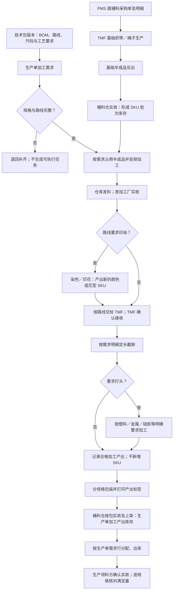
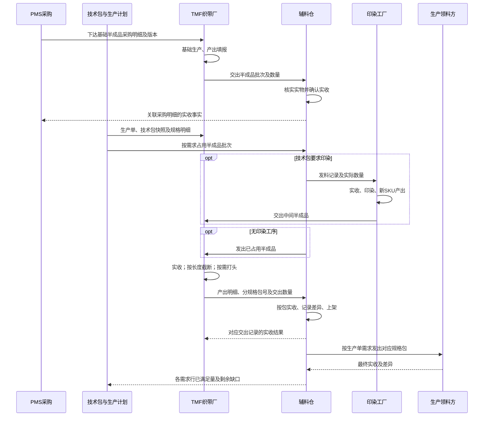
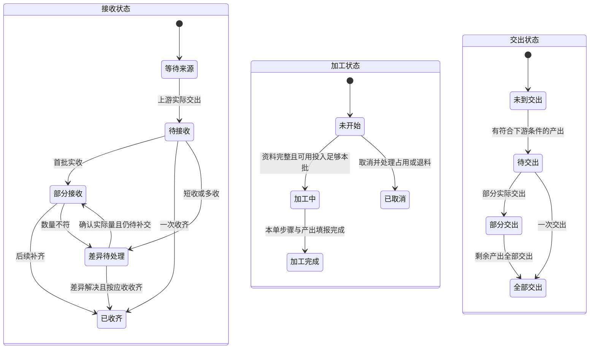
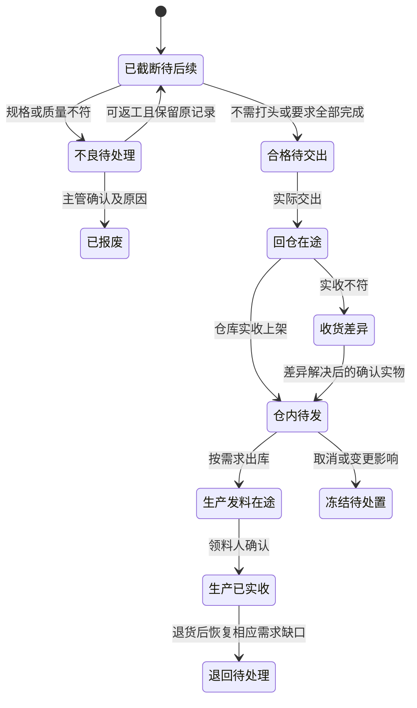

# TMF 织带厂管理产品方案

版本：V1.6 当前验收稿｜日期：2026-09-21｜性质：高保真产品原型设计，非生产系统交付证明。

业务基线：本次对话最终确认口径。首次代码基线为 `main / ed9daa9c1c75fccadd8eb0901ec1876bbee41928`；当前验收为 `codex/tmf-webbing-management`、同一 HEAD，工作树 `/Users/laoer/Documents/higoods`，包含未提交实现。同一工作树的 43188 端口用于当前页面验证；具体逐项证据以需求矩阵和当前收据为准。

配套材料：[实施计划](实施计划.md)、[原子需求追踪矩阵](需求追踪矩阵.md)、[整链路 Mock 数据](mock-full-flow.json)、[文档与数据核查记录](文档与数据核查记录.md)。本文定义业务；计划定义执行顺序；矩阵控制遗漏；核查记录保存正反向审查与运行验收。历史章节中的阶段性“尚未完成”只记录当时版本，不覆盖本页当前验收结论。

## 当前完成结论（2026-09-21）

本版本按实施计划完成 WP01～WP08。需求追踪矩阵 127/127 已验证，规范场景 N01～N05、B01～B24 为 29/29；Web、PDA、打印、真实实拍图、异常恢复和严格性能均已在当前版本重新验收。

当前版本的权威验证收据为 [逐需求证据映射](evidence/2026-09-21-requirement-evidence-map-current.json)、[逐场景独立执行收据](evidence/2026-09-21-scenario-execution-receipts-current.json)、[规范场景覆盖](规范场景验收覆盖.json)、[56个浏览器脚本收据](evidence/2026-09-20-full-browser-run-current.json)、[严格性能收据](evidence/2026-09-21-tmf-strict-performance-current.json) 和 [页面/PDA/打印收据](evidence/2026-09-21-page-pda-print-acceptance-current.json)。文档中此前的阶段性“待实现/未完成”段落属于历史实施记录，以本节、需求矩阵和这些当前收据为准。

## 2026-09-22 V2.0 全量收口修订（当前范围）

用户 2026-09-22 明确批准“全部实现、全部验证通过”，并确认：范围按方案全量（含 §10.1 标“拟”的页面与未绑定 PDA 入口）；色号、花型、端头等缺失图片由实施方从网络获取对象对应的真实产品图或厂商目录图；正式主档映射在原型内建权威主档（物料档案、供应商、仓库）中实现；B02 主管超收确认按 §11.6 实现。执行工作树 `codex/zhidaichangguanli`，分支同名。

本轮口径与验收要求如下，V1.6 及此前段落与本轮冲突处，以本轮为准：

1. **主管超收确认（修订1）**：基础生产产出超过采购计划量、或仓库实收超过采购计划量的部分，普通角色一律阻断；织带厂主管／仓库主管可二次确认（数量、原因、来源）后登记实际事实，采购计划数量不扩大，保留超收标记；确认幂等，未确认部分不进入库存、占用或发料；采购净实收与 B24 退货口径不变。
2. **完整 B14 染色补料链（修订2）**：染色产出必须能基于原染色加工单的实际交出，在 TMF 按需求分配并实收，追溯到原染色单与原发料批次，不重复扣料；新增采购→染色→TMF 接收→截断→回仓可原生重放；旧实物冻结、新需求独立，染色损耗／退料与印花／截断账互不混算。
3. **完整终止处置与主单联动（修订3）**：生产单取消或采购终止后，连续余料、在制条料、不良、冻结产出、上游未收在途、生产领料在途必须逐一处置并留痕；未全部处置并数量对账不得结案。主生产单页面只读展示织带侧待处置／受限与数量投影，可跳转处置入口；主单恢复或取消后织带侧自动刷新，不能绕过限制恢复执行。
4. **原型内建正式主档映射（修订4）**：采购、端头采购、仓库、物料 SKU 的引用必须解析到原型内建权威主档（物料档案、供应商、仓库主档）并在页面显示主档名称与编号；解析失败阻断并提示补齐；映射前的历史记录保留原快照并标记“未映射”，不批量改写；同一对象在采购、需求、批次、包、交出使用稳定主档身份，显示名变化不改变身份。
5. **对象对应图片与来源标注（修订5）**：色号产出、花型产出、塑料包头／金属头／硅胶浸头端头必须各自具备对象对应的真实产品图或厂商目录图，由实施方检索获取并本地存储；每张图登记来源 URL、对应对象与替代身份，页面明确标注“厂商目录参考图”，不得冒充工厂实拍、不得用无关图或生成图顶替；未取得对应图的对象保持阻断，不得静默放行。
6. **拟页面与 PDA 入口纳入本期（修订6）**：待接收 `/fcs/craft/accessory/webbing/pending-receipts`、交出记录 `/fcs/craft/accessory/webbing/handover-records`、半成品库存入口、PDA 工厂执行精确入口均按本期实现为可命名验收页面，不另造脱离 Web 规则的动作集。
7. **证据重绑与一致性（修订7）**：全部收据由最终 HEAD 重新生成并绑定分支与工作树；矩阵、证据映射、性能台账的数字与 SHA 必须一致；对抗式审查文档追加最终结论覆盖声明；正反向追踪 0 未绑定；矩阵不得保留与状态冲突的否定性文字。
8. **历史单治理与不足终止／补做结案（修订8）**：历史未跟踪单展示真实数量与“未知开完工”，不自动补写时间；不足数量可带原因终止并关联补做单结案，结案不改变生产需求满足状态。

新增规范场景：N06（主管超收确认）、B25（终止处置）、B26（B14 染色补料恢复）、B27（主档映射缺失与冲突）、B28（图片缺失与替代）、B29（拟页面跨端）、B30（历史单终止与补做结案）。新增需求编号见需求矩阵《V2.0 全量收口轮次登记》。

本轮完成门禁（五道全绿才可宣称完成）：需求基线双向覆盖且无否定性遗留；每条需求有实现位置与契约；29＋7 个场景独立重放、Web／PDA／打印／图片／低分辨率与全部受影响路由交互性能（每项至少 5 次、全部严格小于 500ms）在当前 HEAD 通过；收据、矩阵、审查记录与任务收据一致；提交推送并取得远端确认（如需接受回执则另行确认）。在本轮完成前，V1.6 的 127/127 与 29/29 只能作为历史版本结论，不得作为当前交付依据。

## 1. 目标、确认口径与范围

### 1.1 目标

在“辅料工厂管理”下新增“织带厂管理”，由 TMF－辅料厂承接织带及绳子的基础生产与生产用途加工，使管理人员能从采购需求追到基础库存，从生产单追到技术包要求、加工投入、加工产出及最终收发结果。

现场员工能够回答：现在处理哪张单、哪种物料、哪种长度和端头、做多少、交给谁。仓管能够区分连续半成品与截断后的条料，不靠备注猜测库存可用性。

### 1.2 用户已经确认的业务规则

1. 三个中央工厂为 SPF－特种工艺、TMF－辅料厂、APF－辅助工艺；辅料厂业务对应 TMF。
2. 花边、织带是业务分类，不因此产生不同的中央工厂身份；绳子的生产属于织带厂管理。
3. 橡筋定长切割与本次织带、绳子业务不同，保留原业务及 SPF 归属。
4. 基础备货来源于 PMS 面辅料采购单，不直接由库存预警替代采购单下达。
5. 基础织带／绳子有半成品 SKU，作为生产所需加工单投入。
6. 本文“订单”指生产单；具体加工要求来自该生产单采用的技术包版本、BOM 和工艺路线。
7. 织带、绳子用于本次生产均需满足定长截断要求；打头按实际要求，绳子一般需要但不强制全部需要。
8. 要求打头时必须明确方式及规格，例如塑料包头、金属头、硅胶浸头。
9. 不同织带宽度分 SPU；颜色、花型通过半成品 SKU 区分。
10. 截断长度与打头要求不新增 SKU，通过加工明细和产出库存记录区分。
11. 没有固定长度、固定端头成品的长期备货场景；加工产出服务生产单，回仓不成为无归属常备库存。
12. 辅料仓是基础料分发和最终产出回收节点；最终按生产单分配发料。
13. 参考染色加工单的业务模型，完整表达需求来源、投入／上游、产出／下游、时间、数量、状态及追溯。
14. Mock 必须覆盖正常和边界场景，验证整套流程，不以互不关联的页面假数据代替。

### 1.3 本方案提出的设计细节

本文后续状态、角色权限、产出标识格式、数量精度、路由和操作方式是基于上述确认事实提出的产品方案，属于待评审设计细节，不伪称用户已逐字段确认。采用简单、可复现的原型交互；不建设真实后端、鉴权、数据库或通用事件平台。

### 1.4 范围与非范围

范围：中央工厂身份统一；PCS 物料与技术包；PMS 基础采购；TMF 基础生产和截断打头；现有染色／印花衔接；WLS 两类库存、交接和生产单发料；Web/PDA 必要执行；包装标签、交接单和整链路 Mock。

非范围：橡筋定长切割业务改造；成衣后续缝制全流程；真实采购付款和财务结算；自动排机、设备联网、复杂质检系统；常备定长成品计划；无依据的跨单自动调剂；全面重构花边、染色和仓储系统。工厂归属调整涉及的旧引用必须收口，但不借此改造无关工艺。

## 2. 当前代码事实与差距

下表路径相对仓库根目录，均为本次或同一 HEAD 下本对话已读取的代码。代码结构不等同于功能已经在页面通过验收。

| 核查位置 | 已确认事实 | 本次设计影响 |
|---|---|---|
| `src/data/app-shell-config.ts:634`；`src/router/routes-fcs.ts:429` | 辅料工厂目前有花边采购需求、生产单、交出记录 | 新增织带分类，复用导航层次，不把页面分类当工厂身份 |
| `src/data/fcs/special-craft-dedicated-factories.ts:18` | APF、SPF 已有专用 ID；橡筋定长切割在 SPF | 统一档案引用，保留独立工艺；不再造同名组织 |
| `src/data/fcs/dye-work-order-demo-details.ts:85` | 示例含 SPF、TMF，标识与其他配置不同 | 示例、派单、仓库和角色归属必须读取同一工厂身份 |
| `src/data/pms/material-purchase-orders.ts:14` | 采购对象有物料、需求明细、供应商名称、数量、到货、交期；当前模型有固定 RMB 字段 | 需明确 SKU 和 TMF 组织关联；不能用名称匹配工厂或照搬固定币种作为新业务规则 |
| `src/data/fcs/lace-factory-purchase-projection.ts:596` | 花边来源按工厂映射和物料类型筛选；自有采购种子 | 可借鉴关联方式，不能把它当成 PMS 面辅料采购已贯通的证明 |
| `src/data/fcs/lace-factory-domain.ts:107,246` | 生产、交出、实收数量和状态分开 | 延续分账思路，不复制花边专属角色和全部状态 |
| `src/data/pcs-material-archive-types.ts:42` | SKU 含颜色、规格、尺寸等通用字段 | 不能因已有 lengthCm 字段就把生产截断长度写入半成品 SKU |
| `src/data/tech-pack-process-route.ts:16,303` | 显式前置关系、BOM、投入产出 SKU；准备阶段染色印花要求换 SKU | 保留印染规则；截断打头使用不换 SKU 的产出形态关系 |
| `src/pages/tech-pack/bom-process-linkage.ts:180,231` | 已有印染触发及橡筋定长切割专门分支 | 增加本次独立工艺绑定，不能借用橡筋工艺代码 |
| `src/data/fcs/process-work-order-domain.ts:95` | 来源快照已有生产单、技术包版本、BOM、路线节点 | 扩充加工规格明细，保留版本和需求归属 |
| `src/data/fcs/dyeing-task-domain.ts:120` | 染色包含接单、投入、节点执行、产出、交接和变更 | 借鉴业务结构，不照搬染缸、配方或 Yard 限制 |
| `src/data/fcs/process-order-flow-contract.ts:1` | 共用来源、接收方及接收／加工／交出三轴 | 复用三轴语义；产出质量、仓储位置和需求满足另行表达 |
| `src/data/fcs/process-output-types.ts:3` | 产出以卷号、克重、幅宽、染缸等卷料信息为主 | 不直接把定长根／条塞入卷料对象；新增最小产出明细表达 |
| `src/pages/wls-accessory-receipts.ts:1,76` | 收货主表读取花边交出及实收，另有盘扣入口 | 要接入织带两类收货，不能仅更换表头；禁止重复记入采购实收 |
| `src/router/routes-pms.ts:46`；`src/router/routes.ts:114` | 已有 `/pms/material-purchase-orders`、`/wls/accessory-receipts` | 作为正式关联入口，不另造平行采购和收货模块 |

### 2.1 当前工作树补充核查

2026-09-20 再核查：当前分支为 `codex/tmf-webbing-management`，HEAD 仍为 `ed9daa9c1c75fccadd8eb0901ec1876bbee41928`，存在未提交实现。上表描述方案最初核查的代码基线，不能将其全部视作当前尚未开始的工作。

- `src/data/fcs/webbing-specifications.ts` 已定义用途、尺码、下料/成品长度、公差、测量条件和 A/B 端要求。
- `src/data/fcs/webbing-production-demands.ts` 已从生产单采用的技术包快照展开需求，保留 BOM、成衣 SKU、路线节点和版本；技术包规格编辑与路线保存代码也已存在；本次未执行页面确认、生产单采用及需求生成整链验收。
- `src/data/pms/tmf-material-purchases.ts` 已包含采购、基础生产实收、连续料占用/交接、截断、打头、余料回仓、包装、产出分配、发料和生产实收的数据动作；库存查询区分仓内实存、占用、已发及生产实收。动作存在不等于仓储页面和最终生产领料闭环已经完成。
- `src/router/routes-fcs.ts` 已注册采购需求、基础生产单和生产加工单列表/详情；WLS已接入两类收货、产出库存分配发料与指定领料人实收。加工详情已有投入实收、截断、实际打头/辅材接收、装包交出。工作树已提供从生产单生成需求、连续料占用/发出、按技术包选择辅材发出，以及未用辅材交回/分批实收的页面入口。已有自定义白料链浏览器证据，但不能替代本方案 N01～N05：PCS 发布至生产单采用完整流程、正式主档映射、印染接续、全部边界恢复及 PDA/打印/全性能仍未完成。辅材采购至来源实收已有分段实现，见下方当前能力说明。详细实施状态见[实施进度](实施进度.md)，不以本方案替代当前实现证据。

本次复核只更新设计材料，不将工作树内已有业务改动表述为本次新增或已验收。产品规则仍以第1.2节和各业务章节为准。

V1.3补充：当前投入记录已支持关联正式印染单，并保留合并加工批次标识；截断产出独立保存来源发料、需求、原半成品SKU、加工规格快照、实际下料/成品长度、合格/待打头/不良数量和米制损耗。因此“同SKU不同加工形态”在代码中已有明确对象基础。合并加工仍须按来源生产单分别归属，不能因合并操作而允许跨单领用。已有数据对象、分段测试或白料演示链都不能替代第11～12节规定的全部规范场景验收，尤其印染后续交接、完整异常恢复、真实图片和各端操作仍按矩阵逐项核验。

### 2.2 本次交付时的代码能力与验收边界

以下用于帮助评审判断复用范围，不能把“存在代码”当作整链通过。

| 已读取的当前代码 | 现有能力 | 本方案仍要求的完整结果 |
|---|---|---|
| `src/data/fcs/webbing-specifications.ts` | 按 BOM、用途、尺码定义每件条数、下料与成品长度、公差、测量条件及 A/B 端；实际规格比较不靠 SKU 长度 | 技术包发布、生产单采用、加工和仓储均遵循同一版本，规格缺失不能下达 |
| `src/data/fcs/tmf-work-order-view.ts` | 按生产单、采用快照和路线节点汇集投入、产出、包及交出记录；失效父包不进入有效包列表 | 同一生产单多长度分别满足；合并加工仍保留各生产单归属 |
| `src/data/pms/material-purchase-orders.ts` | 已有从采用版本的端头辅材 BOM 创建 PMS 采购的动作 | 辅材采购与正式供应方、物料和仓库主档正确关联；端头辅材 SKU 不被误作绳子新 SKU |
| `src/data/pms/tmf-material-purchases.ts` | 已有基础原料／端头辅材采购实收分类、独立库存批次和收发记录 | 按真实计量单位贯通采购、实收、领用、耗用、损耗及余料退回，不用米数推造重量 |
| `src/pages/process-factory/accessory/webbing/production-control-dialog.ts` | 已有取消处置确认，提交时校验打开后的状态和数量是否变化 | 释放未发占用与剩余实物处理分别留痕；取消不能抹掉已截断数量，不能仅确认一次就认定报废或返工完成 |

第11节是规范场景与期望账，第12节是执行验收要求。已有自定义流程、局部动作测试或状态截图不得替换规范场景；完整运行结果仍逐条登记到需求矩阵。

## 3. 角色、责任与操作权限

| 角色 | 主要责任 | 可执行动作 | 禁止或需主管确认 |
|---|---|---|---|
| PCS 技术人员 | 确定 BOM、路线与规格版本 | 编辑未确认要求、提交确认、发起变更 | 不能覆盖已执行历史快照 |
| PMS 采购人员 | 基础半成品采购 | 下达采购、修改未执行需求、查看履约 | 不以手填到货量替代仓库实收事实 |
| 生产计划人员 | 生产单用料与需求归属 | 确认需求、分配可用半成品、处理变更影响 | 不把不同长度缺口相互抵消 |
| TMF 业务／主管 | 确认接收、安排加工、处理异常 | 安排明细、差异和超量确认 | 不能代仓库虚构已实收 |
| TMF 操作员 | 当前任务加工 | 扫单、确认实际领料、分规格填报、交出 | 不能改技术包要求、直接调整库存或跨单调剂 |
| 印染工厂人员 | 指定工序加工和交接 | 接收、现有印染动作、产出和交出 | 未到达工艺条件不得交作最终合格产出 |
| 辅料仓管 | 实物收发 | 扫包核对、实收、上架、移库、分配发料 | 不能不看产出规格只扫 SKU 发条料 |
| 仓库主管 | 差异与受限库存处理 | 多收确认、撤销纠错审批、剩余产出处置 | 必須二次确认并保留原因及前后事实 |
| 生产领料人 | 接收指定生产单辅料 | 扫单核对、确认实收、报告差异 | 不接受错误规格抵数 |

原型身份选择只演示动作权限，不冒充真实鉴权。所有影响数量的动作记录实际角色、姓名、时间；“修改了经办人文字”不等于有权限代确认。

## 4. 业务对象、标识和来源

### 4.1 物料身份

SPU 区分基础品种。织带 2/3/4CM 分别建 SPU；相同宽度但材质、结构、弹性不同仍须区分品种。绳子用真实直径、结构描述，不能套用织带宽度。具体绳径需物料资料确认。

原型中新建织带/绳子主档须明确填入mm或cm截面尺寸，并以米为基础半成品主单位。新建TMF主档使用独立内部身份，演示主档编码分别带W（幅宽）/D（直径）尺寸标识，避免同名不同宽度在同分钟创建时共用SPU身份；既有尺寸待确认参考档案保留原样。

半成品 SKU 区分颜色和花型。已冻结编码形式为 `SPU-潘通色号-颜色标识[-花型标识]`；颜色名另列展示，潘通标识包含色卡体系，自定义色使用稳定内部标识。花型标识必须定位不可混用的图样／配色版本；无潘通或无印花时省略对应段。不因修改显示名称改变内部身份。

示意：`WB30-WHT` → 染色后 `WB30-19-4052-CBL01` → 印花后 `WB30-19-4052-CBL01-P001`。颜色标识 CBL01 在 Mock 中是假定内部蓝色，不冒充已确认潘通颜色；实际未维护潘通时可省略该段。不同加工批次不增加 SKU。截断 50CM/70CM、金属头/塑料头都不增加 SKU。

### 4.2 关联对象

| 对象 | 必要字段／关系 | 唯一性和用途 |
|---|---|---|
| 采购需求明细 | 采购单、行号、版本、半成品 SKU、数量单位、交期、供应方、TMF、目标仓 | 基础生产正式来源；供应方身份与执行工厂分开 |
| 基础生产单 | 来源明细、投入材料明细、产出 SKU、计划量、实际产出、工厂 | 同一来源不得因刷新重复生成；跨采购单不自动合单 |
| 生产加工需求 | 生产单、技术包版本、BOM 项、用途、成衣尺码、用量、路线节点 | 一条需求只能表达一组可独立判断满足的规格 |
| 加工要求快照 | 下料长、成品长、测量条件、公差、端头方式、两端参数、图片 | 确认后版本化；“不需要”与“未填写”不同 |
| 加工单 | 来源明细集合、工序、TMF/印染厂、投入、产出、上下游、时间、三轴状态 | 合并加工必须保留各来源分配，不能丢失需求行 |
| 半成品库存批次 | SKU、来源采购/加工单、仓库、库位、米数、占用量 | 连续料可用数量的唯一来源 |
| 加工产出明细 | 产出 ID、来源加工明细、关联半成品 SKU、实际长度、端头、工序完成情况、合格量 | 是实物产出事实，不是新的物料主档 SKU |
| 包装／批次标签 | 包装 ID、产出 ID、数量、单位、库位、生产单分配 | 一包一组实际规格；可多包引用同一产出明细 |
| 交出及实收 | 交出方、接收方、单据行、包、发出/实收、差异、时间、操作人 | 实收关联原交出，重复扫描不能新增收货 |
| 生产单分配记录 | 需求行、产出 ID、占用数、已发数、最终实收数 | 同规格可共用产出批次，但每份数量只能分配一次 |

基础生产实际投入的纱线、弹性材料等也要记录物料和单位；具体配方由物料生产标准确定。kg 与米不直接守恒，分别记录领用、余料、耗用及米制产出；没有确认单耗时不能伪造精确材料消耗。

### 4.3 标识的行为规则

1. 采购明细及路线需求使用稳定身份，修改版本不靠新建同名单规避历史。
2. 上游物料身份是 SKU；定长加工后继续保留该 SKU 追溯，但库存对象类型改为“生产单加工产出”。
3. 包装拆分时产生新包号并保存父子关系。完整拆分后原包标记失效、退出可用库存，全部子包数量之和必须等于拆分前数量；保留历史原包数量用于追溯，不再将其计入库存。不得复制标签产生两份库存。
4. 同规格多生产单合并加工时，分配合计不得超过实际可用产出；默认分包发料。
5. 半成品扫码不能直接替代定长产出扫码；未知包、已发包、已作废包均有明确阻断提示。

## 5. 端到端业务流程

### 5.1 总流程图

图中印染框代表技术包定义的子路线，不强制染色与印花总是同时发生，也不强制所有中间交接回仓。截断后若暂未完成必需打头，保持厂内在制状态，不进入“最终合格待发”。

### 5.2 采购备货规则

有效采购下达后显示 TMF 基础需求，按采购明细与半成品 SKU 生成基础生产任务。只有采购归属已关联 TMF 且资料完整的记录进入，不按供应商名称模糊匹配。

同一采购单内 SKU、单位、目标仓、交期和生产标准一致的行可合并显示，但保留来源行数量；不一致时分开。已取消或未正式下达的采购不得生成可执行生产单。采购变化在执行前同步并提示，执行后进入变更影响处理，不覆盖历史产出。

仓库实收只登记一次采购履约。后续印染和截断回仓属于生产加工，不再累计这张基础采购单的收货。缺口补交保留原采购关系；超量先确认，不自动扩大采购数量。

### 5.3 生产单加工规则

生产单采用已确认的技术包版本，系统按 BOM、成衣尺码及路线展开需求。相同物料但不同用途、长度或端头要求须分别可追溯。允许同规格合并执行，不允许用汇总条数覆盖规格缺口。

库存足够时占用对应批次；不足则显示缺口及关联采购进度。不得创建虚拟可用库存或直接把“采购在途”当作已领料。可对已实收且明确分配的部分先加工，未到料部分仍显示待料。

### 5.4 时序与事实写入

箭头表示共享业务事实的形成与读取，不要求真实接口或消息总线。原型中由同一份场景数据驱动，不能各页面独立修改汇总值。

## 6. 技术包与加工规格

### 6.1 必填条件

| 字段 | 规则 |
|---|---|
| BOM 物料、用途、尺码 | 关联现有对象；同尺码多用途不合并丢失 |
| 每件用量 | 根／条数，正数；按来源成衣数量计算需求 |
| 下料长度 | 内部建议统一 mm，正数；页面可显示 CM；不能写回半成品 SKU 长度 |
| 成品长度 | 与下料长度分别记录；是否含头、折返或包覆必须明确 |
| 测量条件及公差 | 由确认工艺填写，弹性料明确测量条件；不得自动假定伸长率 |
| 截断方式／切口要求 | 使用可执行的工艺文案；不将热封等同于装头 |
| 是否打头 | 必选：需要／不需要，空值阻断 |
| 端头方式 | 需要时必选塑料包头、金属头、硅胶浸头或经确认的具体方式 |
| 两端要求 | 单端/双端；A/B端方式不同时分别填写 |
| 端头规格和辅材 | 型号、尺寸、颜色、适用材料；浸头记录覆盖要求，不伪造件数 |
| 参考图及验收要求 | 用于识别物料与端头，不用无关图片填充 |
| 工序前后关系 | 由路线确定；防循环、缺前序、对象不匹配 |

### 6.2 路线与版本规则

印花产出若直接进入织带截断，接收方应绑定 TMF 工厂而非终点仓库。绑定须校验采用版本、直接前序、BOM、连续辅料形态和产出/投入 SKU；它只确定交给谁，不新增实物数量。已有有效交出草稿或交出记录时不得改换接收方；正式交出前重新核对路线及生产单是否允许执行。原已采用来源快照保留，执行接续关系单独记录。

颜色或花型变化选择新的产出半成品 SKU。截断节点保留同一半成品 SKU 关联，输出“定长在制／产出明细”；打头节点承接对应定长明细，完成后成为合格产出。这样既不创建新 SKU，也不把所有相同 SKU 的在制品视为同一对象。

一张 TMF 加工单可包含截断和打头两个执行步骤；是否分单由实际交接责任决定，不强制每步骤建单。已完成截断的物料进入打头时不再重复扣米制投入。

确认版本后保存需求快照。变更前后差异必须可见：未开始的数量可重算并释放旧占用；已领料、已加工、已交出部分保留原事实，列出受影响数量并由计划/主管处理。旧产出不能因技术包更新自动变为新长度或新端头。

尚未发生原料/辅材发出和加工事实的旧需求，可由生产计划核对新旧规格及占用、填写原因并二次确认后重算。释放旧占用与生成新需求一次保存；旧需求标记“已换版保留”，保留原规格供追溯，不再执行或重复提示换版。提交时版本或数量变化须重新核对。已有实物的需求不能使用该未发料重算动作，须另行处置。

## 7. 加工单、数量与时间

### 7.1 加工单详情结构

| 分区 | 内容及动作 |
|---|---|
| 单据与责任 | 单号、任务、工厂、负责人、接单、当前阻断原因 |
| 需求来源 | 采购或生产来源、版本、BOM、路线节点、相关款式、尺码；支持跳转 |
| 投入／上游 | 物料图、SKU、批次、上游单据及发出量、计划投入、实收、已耗用、余料 |
| 工艺要求 | 分规格明细，长度、端头、配套材料、确认图片和版本 |
| 加工填报 | 选择规格/批次，录入本次合格、不良、损耗或退料；显示累计及剩余 |
| 产出／下游 | 实际规格、产出ID、包号、数量、下一工厂或辅料仓、交出及实收 |
| 时间与费用 | 要求/计划/实际时间、时效、等待原因；适用的单价、币种、计价单位 |
| 追溯 | 变更、差异、补做、撤销、操作人时间及原因 |

基础备货来源不强制有成衣款式；不能用虚构款式满足表格字段。上游已发量读取上游交出事实，不由本厂已收量倒推。

### 7.2 数量口径与守恒

以下精度是方案建议：长度存储至 mm；米制业务量保留 3 位小数；根/条/个是非负整数；单据展示保留足够精度，误差容限必须显式记录，不能用四舍五入抹平差异。

- 需求条数 = 成衣数量 × 每件条数。
- 理论下料米数 = Σ(各规格需求条数 × 下料毫米数 ÷ 1000)。不自动追加未经确认的损耗率。
- 截断工序实收米数 = 仍在工厂连续料米数 + 退回连续料米数 + 已转成条料的下料当量米数 + 截断损耗米数。条料当量包含合格、在制和不良，但同一条不能重复计入。
- 本次切成条数 = 合格条数 + 待后续加工条数 + 不良条数；三者当前分类互斥。后续打头从在制转合格，不再增加总切成数。
- 独立端头件实收 = 未使用 + 已装配 + 损坏/报废 + 已退回；浸头材料按实际单位核算。
- 辅材仓库实收批次保留来源收货单/明细、SKU、单位、仓库和库位；新发料必须引用已实收批次并扣减源仓库存。仓库发出与工厂实收分开，工厂耗用不再次扣源仓。来源明细不得重复入账，历史缺来源批次的记录不得倒填虚构库存。
- 未用辅材交回引用原发料及原实收批次，工厂交出即从可耗用余额扣除，仓库尚未实收部分保留退料在途；仓库按实际数量分批接收回原批次/库位，只恢复仓内库存，不增加该批次原始实收。已装配、损坏及已交回数量不可再次退回。
- 半成品可分配 = 仓内合格实存 − 已占用 − 冻结；占用是实存的子集，不再从物理库存额外扣一次。
- 发出扣仓内库存并形成在途；对方实收从在途转对方持有。短收未解决差额留为差异，不消失。
- 产出可分配 = 合格实存 − 已占用 − 冻结；需求满足以该需求最终接收合格数为准。
- 各规格需求缺口独立计算，50CM多10条不能抵70CM少10条；退回已发物料要恢复对应需求缺口。
- 印染阶段投入米数 = 实际产出米数 + 已确认损耗/差异；不同 SKU 的数值比较仅用于同单位工序核算，不混入同一可用库存。
- 基础生产 kg 领料与米产出分别核算，不以 kg=米构造守恒；单耗对照已确认生产标准。

### 7.3 时间与完成条件

记录下单、派单、接单、要求完成、计划开始/完成、实际开始/完成、交出和实收。管理最长时效与实际耗时分栏；当前无获批 SLA 数值，Mock 的时间只用于示例，不当作管理标准。存储带时区，印尼现场默认 Asia/Jakarta 展示，跨地区查看须明确时区。

加工完成：应执行步骤完成、数量填报可核对、合格/不良/余料已分类。业务结案：投入、产出、交接、差异和余料均有去向；不足可在有原因和后续补做关联时结案，但生产需求不能变“满足”。采购完成、加工完成、仓库收货、生产需求满足分别判断。

## 8. 状态及异常恢复

### 8.1 三轴状态图

三轴可并存，例如“部分接收＋加工中＋部分交出”。不能为满足单一线性状态而禁止已收批次加工。暂停、差异、变更影响作为明确阻断原因；已执行单不能直接删除或清空，须按已执行事实办理终止和处置。

### 8.2 产出与需求状态图

图示状态按数量片段适用；部分收发时拆分明细数量，不将整个批次一键变“已发完”。需求状态为待供给、部分满足、已满足、变更待处理、已取消；由明细实际量及有效需求版本推导。

### 8.3 异常动作与恢复

| 情况 | 阻断/反馈 | 处理与恢复 |
|---|---|---|
| 缺长度、打头方式或版本 | 不确认路线、不生成可执行任务 | 技术人员补齐并确认，重复生成不多一张单 |
| 库存不足/被其他需求占用 | 显示具体缺口 | 补采购或释放合法占用；不得负库存 |
| 扫错SKU、宽度、花型、包号 | 展示预期与实际，阻断 | 重新扫描正确实物，不允许改标签蒙混 |
| 上游发100，实际收98 | 收98并登记差2 | 补交或确认差异原因；投入只可按98使用 |
| 多收 | 普通仓管不能直接确认 | 主管二次确认并说明来源；不自动扩采购量 |
| 长度正确但头型错误 | 不可登记该需求合格产出 | 返工或报废；保留实际材料耗用 |
| 合格数量超需求 | 超量明确提示、主管确认 | 超出部分不自动占用其他生产单 |
| 领料超量/交出超产出 | 阻断，提示剩余数量 | 修正本次数量；禁止累计超扣 |
| 重复点击/重复扫描 | 返回已有结果或提示已处理 | 不新增第二条数量事实，刷新后仍一致 |
| 已执行后技术包变更 | 显示受影响产出与占用 | 未执行重算，已执行冻结评估，不覆盖旧值 |
| 取消生产单 | 停止后续发料 | 未发占用释放，已截断产出冻结，不能变回连续料 |
| 发出后撤销 | 不直接删除原单 | 下游未收可按受控撤销；已收必须关联退回/纠错 |
| 网络/保存失败 | 明示未保存或已保存，不确定时查询原记录 | 安全重试同一动作；不建设真实离线队列 |

## 9. 仓储、包装与分配

辅料仓设置“半成品”和“生产单加工产出”两个分类。两类库存共享实际仓库与库位体系，但不共享可用数量桶。库存总览禁止混合相加米、根、条，也禁止把定长当量米数列作连续可用料。

加工产出列表必需列：生产单/需求行、半成品图与SKU、实际长度、端头方式和规格、工艺完成/合格状态、包号、实存/占用/可发、单位、库位、来源加工单、入库时间。长度、端头、包号、数量、归属属于防错列，不可隐藏。

回仓扫码流程：扫交出单或包 → 展示应收规格及数量 → 核实实际物料 → 输入实收、差异原因及凭证 → 指定库位 → 确认。合格可发与不良隔离分别显示；错误端头不能用总量一致绕过。

发料流程：选/扫生产单 → 显示逐规格需求缺口 → 扫匹配产出包 → 输入本次数量 → 复核接收方及规格 → 确认出库 → 领料方确认实收。出库和实收不同步时保留在途，不提前满足需求。

标签至少显示：包号及码、生产单、加工单/产出行、半成品 SKU、长度、端头方式/两端规格、数量单位、合格状态、包装时间。条码编码稳定包身份，文本变化不能生成另一份库存。拆包保留父子关系；部分取出时，取出部分与剩余部分都由有效子包承接，原包失效，避免原包和子包重复计数。移库只改位置，不改数量。同仓移库核对原库位、目标库位、原因及实际仓内数量，保留经办人和时间；占用关系不因移库释放，已发料单保留发出时库位。部分实收包先完成交接再移库，已无仓内实物的包不能移库。

同规格跨生产单合并产出只允许显式分配；默认不跨单调剂余量。取消后的剩余产出须由计划和主管确认新用途或处置，本期展示冻结与处理记录，不实现自动推荐调剂。

### 9.1 不增加长度 SKU 时，仓库具体如何区分

SKU 回答“它是哪一种半成品”；产出明细回答“这批实际做成了什么”；包装号回答“这包在哪里、还能发多少”。三者关联使用，不能用同一个 SKU 汇总数替代包级库存。长度、端头为结构化字段，不写在自由备注中。

下面是独立的库存解释示例，不叠加到 N01～N05 主账。四行均关联半成品 SKU `WB30-CBL01-P001`，属于同一生产单的不同需求行，端头与长度均为假定示例：

| 库存对象/包号 | 实际形态与规格 | 实存 | 已占用 | 冻结 | 可发/可分配 | 可满足的需求 |
|---|---|---:|---:|---:|---:|---|
| 连续料批次 LOT-01 | 连续印花织带 | 8m | 0m | 0m | 8m | 先领入后续加工；不可直接充当定长产出 |
| OUT-01 / PKG-01 | 500mm，无需打头，合格 | 400条 | 100条 | 0条 | 300条 | 该生产单500mm、无需打头需求 |
| OUT-02 / PKG-02 | 700mm，双端金属头M01，合格 | 600条 | 600条 | 0条 | 0条 | 已占用的对应700mm金属头需求 |
| OUT-03 / PKG-03 | 700mm，实际为双端塑料头P01，与原要求不符 | 20条 | 0条 | 20条 | 0条 | 不能满足原金属头需求，待处置 |

仓库扫 `PKG-02` 时，直接取它的产出明细、实际规格、质量状态、归属需求和剩余数量。即使扫描得到的半成品 SKU 与 `PKG-03` 相同，也不能相互替代。普通“扫 SKU 发库存”入口必须要求选择正确库存对象类型，并进一步识别包号；缺少规格或归属的加工产出不得发料。

库存在包/库位层保留实物量，在分配行保留生产单占用量，在交接行保留在途与实收量。产出明细的合格总数是来源，不再与包的库存合计相加，避免把同一实物计两遍。一个产出分成多个包时，包数合计不得超过尚未包装的合格产出；一包拆成子包时，父包失效或保留明确余量，不能继续按原数量发出。

例如从 PKG-01 给已占用的需求发100条：该包仓内实存从400变300、占用从100变0；生产发料在途增加100。生产方先实收90，则在途剩10，需求只满足90；补收原在途10后满足100，不再扣一次仓内库存。长度仍为500mm，全程没有新增 SKU。

## 10. 页面、设备、图片和打印

### 10.1 页面清单

以下为目标页面清单。已注册入口的实现及分段验证见实施进度；标为“拟”的地址仍属设计。页面存在不代表所有场景、图片、PDA、打印和性能已经通过。

| 页面 | 地址/入口 | 高频查询与动作 |
|---|---|---|
| PMS面辅料采购 | 已有 `/pms/material-purchase-orders` | 物料/采购单/交期/履约；查看关联基础生产和实收 |
| 织带采购需求 | 已注册 `/fcs/craft/accessory/webbing/purchase-demands` | 来源单、物料、交期、变更；查看/生成基础生产 |
| 基础生产单 | 已注册 `/fcs/craft/accessory/webbing/semi-finished-orders` | 品类、SKU、生产/交接状态；接单、填报、交出 |
| 生产加工单 | 已注册 `/fcs/craft/accessory/webbing/work-orders` | 生产单、工序、长度、头型、状态、超期；查看/加工/交出 |
| 加工单详情 | 已注册 `/fcs/craft/accessory/webbing/work-orders/:id` | 按第7节分区；局部展开、填报、版本差异 |
| 待接收 | 拟 `/fcs/craft/accessory/webbing/pending-receipts` | 上游单/实际交出；扫码、确认实收、差异 |
| 交出记录 | 拟 `/fcs/craft/accessory/webbing/handover-records` | 基础/生产产出、接收方、实收状态；追溯和打印 |
| 辅料仓收货 | 已有 `/wls/accessory-receipts` | 分类接入基础半成品、加工产出、余料退回及织带投入料采购实收，保留花边等现有业务 |
| 加工产出库存 | 已注册 `/wls/accessory-production-stock` | 生产单、规格、包号、库位；拆包、移库、发料 |
| 基础原料收发 | `/wls/accessory-base-materials`，按基础单组织的仓管入口 | 选择已实收原料批次发出；扫描工厂退料单分批实收，重量账独立；采购实收通过辅料仓收货中的织带投入料采购分类生成来源批次；配方与主档映射仍需衔接 |
| 连续料备料 | 已注册 `/wls/accessory-material-preparation` | 以生产需求选择实收批次、占用、释放未发占用、扫描实际发出；不新建平行库存事实 |
| 半成品库存 | 接现有WLS辅料库存入口 | SKU/批次/米数/占用；不另造独立库存真值 |
| 生产领料确认 | `/wls/accessory-production-receipts`，员工执行页 | 指定领料人待收队列；核对包/规格，分批实收；不以仓管发出替代 |
| 技术包BOM/路线 | 接现有技术包页面 | 本次字段编辑、路线预览、确认阻断和版本对照 |
| PDA仓库产出收货 | 已注册 `/wls/raw/pda/tmf-output-receipts`，从原料仓PDA进入 | 选本仓并扫码→核对生产单/实际长度/A、B端→数量/库位实收；共用Web实收事实，提交校验扫码后是否已被其他端收货 |
| PDA工厂执行 | 复用现有任务/交接入口，其余地址待绑定 | 接收、分规格填报、交出；不新建脱离Web规则的动作集 |

半成品库存和其余 PDA 精确子路由尚未现场核验，实施 WP01 必须绑定，不擅填当前可用 URL。

### 10.2 布局与交互

管理列表采用“标题与主操作→查询卡片→统计→列表→分页”。查询/重置/导出真实作用于同一数据范围，导出全部匹配记录，不包含操作列。列设置固定表头右侧，宽表内部滚动；列显隐、顺序、冻结和页大小按路由保存，排序和当前页不持久化。

TMF 页面默认所属工厂固定 TMF，展示品类筛选，不为了仿照染厂页面增加虚构工厂 Tab。管理端信息密度允许较高，详情通过分区或标签查看，不将全部历史纵向堆叠。

员工执行一次只突出当前主动作；扫码后立即展示物料图、长度、端头、数量，3～5步完成确认。弹窗、筛选、输入及图片预览局部更新，避免整页重绘和滚动丢失。

### 10.3 素材与识别

用户提供的原始图片已原样保存于本方案附件，作为参考素材，不修改原图：

- [卷装白色织带半成品](assets/半成品织带卷.jpg)：IMG-01。
- [成束白色绳子半成品](assets/半成品绳子.jpg)：IMG-02。
- [箱装白色带状半成品](assets/箱装半成品织带.jpg)：IMG-03。

照片用于真实物料识别替代：织带卷、绳子、箱装织带三张用户实拍已接入原型，颜色/花型/端头的具体技术属性仍由技术包字段确认；页面明确标识“真实实拍替代图”，不从外观推断宽度、绳径或端头材质。

物料/款式图与名称编码同列或同块，点击大图保持比例，支持按钮、遮罩、Esc关闭；加载和失败明确可见。产出头型以实际对应样图辅助，不能只靠颜色徽章区分。

### 10.4 打印与设备

打印范围：加工明细单、产出包装标签、交出单。字段以同一快照输出，打印50CM标签不能渲染70CM数据；批量打印数量与所选包一致，不因打印新增库存。可扫码追溯原单、产出及当前有效状态。具体标签纸尺寸待现场确认 D06，先用可配置预览验证。

管理端1366×768及1280×720；主管/员工Web1024×768；PDA实施前记录实际设备视口，暂以360×640作为建议验证尺寸，不冒充现场设备。打印预览验证分页、无截断、图片、条码对应和不同长度标签的明显区分。

## 11. Mock 总体设计与完整数据契约

### 11.1 Mock原则

Mock 是原型演示数据，不代表真实工厂业务。所有页面使用同一场景对象及稳定引用；预置中间快照只能用于浏览，完整验收必须从采购起点重放操作，禁止直接把最终状态设为通过。

附带 `mock-full-flow.json` 是产品级数据合同和期望结果，不是已经接入页面的运行时种子。首次实施需将其映射到当前数据结构，通过真实业务动作形成收发、加工和占用记录。不得由测试直接替换关键数量来绕过动作校验。

每个场景拥有独立前缀和初始状态。相同流程生成两遍不得重复建单或收货；隔离环境重置后运行，不清用户数据。刷新/重新进入页面应保持当前演示记录；若原型使用本地持久化，明示设备内演示，不暗示服务端能力。

### 11.2 主数据和覆盖面

工厂：TMF、SPF、APF及一个染厂、一个印花厂；仓库：辅料仓、TMF在制位置和生产领料方。工厂名称为用户确认，Mock内部标识为临时别名，实施时必须关联权威主档，不创建重复工厂。

SPU：20/30/40mm三种织带分别编码，至少一种绳子；基础颜色白/黑，印染增加内部蓝色和P001花型。长度包含500/700mm及绳子1200/1300mm。端头覆盖无需、塑料包头、金属头、硅胶浸头及单端/双端。图片统一使用用户提供真实织带/绳子实拍替代图；技术包仍必须明确颜色、花型、端头方式及规格，替代图不改变 SKU 或工艺字段。

所有工艺公差、绳径、样品参数均为Mock假设，不推导为真实技术标准；技术人员确认后才能使用于正式工艺。

### 11.3 主场景 N01：基础采购→染色→印花→两种长度→回仓→生产实收

数据编号：`N01-PO`采购、`N01-BASE`基础单、`N01-PROD`生产单、`N01-TP-V1`技术包、`N01-DYE`染色、`N01-PRINT`印花、`N01-CUT`截断、`N01-OUT1/OUT2`产出、`N01-PKG1/PKG2`包。所有关系见JSON。

| 步骤 | 操作与期望数量 | 必须跨页面核对 |
|---|---|---|
| 1 | 采购白色WB30-WHT 1000m；TMF基础完工1000m | PMS明细与基础单同源，未收货时库存0 |
| 2 | 基础交出1000m，辅料仓实收1000m | 采购实收1000；基础库存1000 |
| 3 | 生产需求：500mm×400条、700mm×600条，均无需打头；净用620m | 两条需求独立；技术包版本一致 |
| 4 | 占用650m并实际发染厂650m | 发出后白料仓内350；发前占用不重复扣物理库存 |
| 5 | 染厂实收650m，蓝料产出640m、损耗10m | 新SKU WB30-CBL01；650=640+10 |
| 6 | 蓝料640m交印花，实收640m；印花产出630m、损耗10m | 新SKU WB30-CBL01-P001；640=630+10 |
| 7 | 印花630m交TMF，实收630m | 上游实际交出=本次应收；不重复采购收货 |
| 8 | 截断500mm×400=200m；700mm×600=420m；余料8m；切割损耗2m | 630=200+420+8+2；未新增长度SKU |
| 9 | 8m连续印花余料退辅料仓；1000条产出分两规格交仓并实收 | 半成品为白350m、印花8m；条料为400/600，互不混算 |
| 10 | 按生产单发400/600条，领料方确认全部实收 | 两需求均满足；条料仓库存0，采购实收仍1000m |

全链核对：1000m采购实收 = 白料剩余350 + 连续印花余料8 + 已投入生产条料当量620 + 染色损耗10 + 印花损耗10 + 截断损耗2。单位换算只用于守恒审计，不能把620m条料当成可用连续料。

### 11.4 正常场景 N02～N05

| 场景 | 完整流程与关键数值 | 终点期望 |
|---|---|---|
| N02 | 白绳采购1300m→基础实收1300→生产单400根×1.2m、600根×1.3m→领1280m→截断净1260m、余10m、损10m→双端金属头2000个装配→回仓1000根→发料实收 | 连续料30m；产出库存0；需求1000根满足；头件实收2020=装2000+损5+余15 |
| N03 | 白色WB20采购60m→实收→生产单100条×0.5m→领52m→双端塑料包头→净50m、余1m、损1m→回仓→发料实收 | 连续料9m；200个包头装配，领202、损1、余1 |
| N04 | 黑绳采购100m→实收→生产单50根×1.3m→领67m→单端硅胶浸头→净65m、余1m、损1m→回仓→发料实收 | 连续料34m；浸头材料kg另记，不换算成“50个硅胶头” |
| N05 | 白色WB40采购120m→实收→两生产单各100条×0.5m→合并领102m加工200条、余1m、损1m→分两包回仓→分别按来源发料实收 | 连续料19m；两单各满足100；分配合计200，不能重复占用同一100条 |

N02～N05均无印染要求，不得多生成印染任务；N01有印染不得跳过。N03/N04补齐织带需打头和不同绳子端头的覆盖，不将“绳子一般打头”写成系统无条件规则。

### 11.5 边界场景及整链路恢复

每个场景使用基础正常场景副本从采购起点重放，在指定阶段注入问题；阻断后既验证当前页面，也验证所有下游没有错误新增事实。恢复后继续到合法终点，不仅截图一个报错框。

| 场景 | 注入点与动作 | 必须观察的阻断/差异 | 恢复与最终核对 |
|---|---|---|---|
| B01 | N01基础采购1000，首收990 | 采购缺10、库存990，不能显示全收 | 补交实收10后按N01走完全链 |
| B02 | N01收货尝试1005 | 普通仓管不能多收；无新增库存 | 撤回误输按1000收；另用独立副本测试主管确认5的来源和超收标记，不改采购计划 |
| B03 | 任一收货/完工/出库连续点击两次 | 单据与数量只产生一次 | 刷新、跨页面复查后继续正常终点 |
| B04 | N01扫码WB20代替WB30 | 宽度/SPU不符；不扣料、不生成合格产出 | 换正确批次后继续N01 |
| B05 | N01截断后500mm410条、700mm590条 | 总1000但700少10、500多10；净耗618m，余10m、损2m | 500规格发400，余10条冻结；另领8m补700×10，余0.5m、损0.5m；最终两需求满足但仍有冻结500mm10条，不能假装库存0 |
| B06 | N02把应双端金属头100根做成塑料头 | 该100根不合格，不能发作金属头；耗材仍留事实 | 先冻结；本副本采用报废并补做，追加原长及金属头投入，记录报废当量，最终满足1000根且额外损耗可追溯 |
| B07 | N03技术包“需打头”但方式为空 | 路线不能确认；无可执行加工单 | 补塑料包头及规格后同需求只生成一次，继续至发料实收 |
| B08 | N04资料填写硅胶浸头但照搬件数领料 | 单位/材料不匹配提示，不虚构件数 | 修正为确认材料单位，完成浸头和整链收发 |
| B09 | N01仓内1000，已被其他需求占用400，再占650 | 可分配600，缺50；禁止负可用量 | 原需求合法释放50后占650，重放N01；另需求仍占350 |
| B10 | N01印花发630，TMF实收628 | 在途差2；只能使用628，不能填630 | 上游补交2并核对后继续；采购实收不变 |
| B11 | N01定长包回仓500mm少收10 | 对应需求缺10，不因700mm齐就全满足 | 补交原未到包10条，禁止再做一次库存新增和补交双算 |
| B12 | N01拿500mm包发700mm需求 | 阻断、不扣错包、不满足错行 | 扫正确包后继续发料 |
| B13 | N01条料回仓后要求退为连续料 | 不允许将条料加回米制可用库存 | 维持条料身份；仅真正未截断8m按余料回仓 |
| B14 | N01已加工200条500mm后技术包改550mm | 旧200条保留500mm并冻结；不能改标签认作550mm | 未执行需求按新版本重算；差额领料、另做新规格，旧200条处置独立；生产满足按新版本计算 |
| B15 | N02截断后生产单取消 | 停止后续发料，条料冻结；不能删除投入或恢复连续料 | 记录终止及余料退回；需求已取消不标“已满足” |
| B16 | N01发出后领料方短收700mm10条 | 出库已发生、实收不足，需求缺10 | 追踪10条在途差异并补交确认；不能再次扣仓库原600条 |
| B17 | N05拆包100为40+60，重复扫原包 | 原包失效/数量扣减，子包总数100 | 两子包分别发料；不可产生200条库存 |
| B18 | N03已打头产出尝试再次执行打头 | 已完成批次阻断重复耗材和数量填报 | 使用新批次或合法返工记录；原单数量不变 |
| B19 | N01选择“橡筋定长切割”代码替代本次工艺 | 不自动映射TMF截断，不重复生成SPF和TMF任务 | 选独立织带工艺后完整执行；SPF原样例保持原归属 |
| B20 | N02生产单不同但规格相同的包被无授权调用 | 生产单占用不符，阻断跨单抢料 | 使用本单分配包；本期不自动调剂 |
| B21 | N01保存结果未回显时重试/刷新 | 显示已保存或未保存，无重复事件 | 按同动作身份查询确认后继续跨页整链核对 |
| B22 | N03原图缺失、错用白半成品替代包头图 | 显示缺素材/失败，不把视觉验证标通过 | 补真实对应图后验证缩略图、大图、标签，再关闭图片项 |
| B23 | N01未执行前采购1000改900 | 下游计划同步900，历史版本可追溯 | 基础产900再领650；终点白250+余8+条620+损22=900 |
| B24 | N01已收1000后采购改900或取消 | 不删100实物、不倒减库存伪造履约 | 展示执行影响，保留实收1000；按合法退货或采购更正方案处理，未决时不得结案 |

补做、报废、变更的恢复样例需要显式追加单据，不能直接修改旧场景结果。B02/B05/B06/B09/B14/B15/B23/B24已在JSON定义数值终点；其余场景按指定阶段注入、恢复后回到基准终点。以下恢复处理是明确的Mock假设，不代表现场处置已获批准；数据预期可核算，但原型动作仍须实施后逐步执行验证。

### 11.6 数量变化边界的精确恢复账

| 场景 | 完整恢复数据 | 终点守恒与验收 |
|---|---|---|
| B02主管超收副本 | 工厂实际生产并交出1005m，主管确认实收1005m，采购计划保持1000m；继续N01使用650m | 实收1005=白料355+印花余料8+生产条料当量620+损耗22；采购保留超收5标记 |
| B05长度错配 | 首次产410条500mm、590条700mm，净618m、余10m、损2m；从余料再领8m，补700mm10条净7m、退0.5m、损0.5m | 1000=白350+印花余2.5+生产620+冻结短条5+损22.5；短条10条不能消失 |
| B06错头报废补做 | N02中1200mm100根误用塑料头200个并报废；追加采购100m白绳；从原剩30m加补采100m中领122m，补100根净120m、退1m、损1m | 1400=连续9+生产1260+报废120+损11；金属头2020=合格装2000+损5+余15；塑料头202=随报废品200+余2 |
| B09占用冲突 | 原其他需求占400m；合法释放50后占350，本单占650并发出；后续按N01 | 白料实存350且仍被他单占350，可分配0；不可把它显示为自由可用350 |
| B14执行后改长 | 原630m印花料先切500mm200条用100m并冻结，未加工其余；V2改原400条为550mm，另600条仍700mm；另采购白料120m，染后118损2、印后116损2；原剩530+新116=646m，做新需求净640、退4、损2 | 总采购1120=白350+印花余4+冻结旧条100+新需求640+总损26；原采购1000实收不改，新增采购120独立；最终需求以V2核对 |
| B15取消 | N02截断后未打头即取消，连续料退回后共30m；1000根当量1260m冻结，损10m；端头2020个均未使用 | 1300=连续30+冻结1260+损10；生产实收0、需求已取消，不能标已满足 |
| B23执行前改量 | 采购1000改900后生产/实收900；后续仍用650执行N01 | 900=白250+印花余8+生产620+损22；采购版本及计划均可追溯 |
| B24已收后减量 | 基础实收1000且未领生产料；合法关联退货100m至TMF后修订采购计划900；再执行N01领650 | 原实收1000保留，退货100，采购净实收900；原1000=仓白250+印花余8+生产620+损22+TMF退货持有100 |

其他边界采用基准数量且记录中途差额：B10在途2m，B11回仓在途10条500mm，B16最终发料在途10条700mm。补交是找回原在途物料，不新建第二份已领用量。B14/B15的冻结物料可在受控状态下留存作为合法场景终点，不能据此关闭未完成的处置任务。

## 12. 数据验证、页面验收与完成门禁

### 12.1 验证层级

1. 设计数据检查：引用存在、需求唯一、数量非负、同单位守恒、规格拆分及预期终点一致。本次可执行，不代表产品运行通过。
2. 动作契约检查：从采购下达到最终实收逐个调用真实原型动作；在每一步验证共享数据及禁止动作。已有分段运行证据按实施进度登记，未覆盖环节仍须实施并验证，不能用局部通过替代整链通过。
3. 页面整链检查：同一工作树与版本依次操作PMS、TMF、印染、WLS、生产领料；每阶段重新进入来源页与下游页核对，不只测函数。
4. 设备、图片及打印：同一组包号在Web、PDA、标签保持规格和数量一致。

### 12.2 每次整链运行的断言

- 所有采购、生产、加工、交接、包和分配引用有效；没有孤儿包或虚构上游。
- 每条路线节点只在对应有效需求版本生成一次；中间SKU变化可追溯，截断/打头SKU总数不增加。
- 各仓实存、占用、可用、在途和差异的归属明确，无负数和双算。
- 各需求行按规格核对，合计相同但规格不符仍失败。
- 不同步骤不会重复累计基础采购实收；PMS最终量和原收货记录一致。
- 所有产出有长度/端头快照、实际完成状态、数量及去向；头型未明确不放行。
- 待处理、不良、取消和冻结产出不进入合格可发。
- 最终满足量来自生产领料实收；终点库存和损耗符合fixture期望。
- 刷新、换页、切换角色后同一事实不漂移；重复提交和扫码不重复扣增。

### 12.3 数据量和覆盖条件

功能主账以N01～N05和各独立边界副本为准。列表性能另准备至少36张单据，覆盖织带/绳子、白/黑/蓝/印花、多状态、多交期、正常/差异/冻结；每页10条，至少能翻4页。压力数据亦由有效关联生成，不能复制孤立行；不得为通过性能临时删数据。

### 12.4 页面性能门禁

遵守当前AGENTS.md：所有受影响命名页面首次冷启动、整页刷新、站内切换及全部适用交互，每项至少5次，每个样本严格小于500ms；无本任务1秒例外授权。计时从导航/事件到目标内容、必要图片和可操作结果实际绘制完成，不能把loading出现作为完成。

覆盖接单、接收、填报、交出、收货、占用、发料、确认、查询、重置、导出、分页、排序、列设置、输入、图片大图、标签及打印预览生成、错误阻断和恢复。记录原始值、最大值、浏览器/设备、缓存、数据量、分支HEAD/服务工作树；保留慢样本，任一失败则对应需求未完成。最后实质修改后重测受影响项。

### 12.5 交付判定

只有需求矩阵的相关实现位置、契约证据、页面/设备/图片/打印/性能证据齐全且无遗留冲突，才能标“已验证”。仅有本文、Mock数学通过、build通过或截图均不能代替业务验收。

## 13. 决策、素材阻塞与下一阶段输入

| 编号 | 待确定的细节 | 当前处理及影响 |
|---|---|---|
| D01 | SKU颜色/花型具体编码字符规范 | 已冻结为 `SPU-潘通色号-颜色-花型编号`；潘通色号或花型无要求时省略对应段。长度、尺码用途和端头永不进入永久 SKU；具体内部色号/花型字典仍由主档维护 |
| D02 | TMF与采购供应方的实际业务映射 | V1 原型冻结：工厂身份使用 FAC-SPF／FAC-TMF／FAC-APF，供应方仍单独保留 `supplierId/supplierName`，不把工厂当法律供应方；现场可在后续版本替换供应方主档映射 |
| D03 | 基础生产纱线等投入标准、计量精度及损耗口径 | V1 原型冻结：纱线/原料按采购实收原单位登记，Mock 只验证收、耗、退、余守恒，不自动推导配方单耗或损耗率 |
| D04 | 实际收货/发料人员、最终生产接收点 | V1 原型默认冻结：仓库实收由仓管执行，多收由仓库主管确认；TMF加工由织带厂主管负责；生产末端由生产领料人实收，实际组织可由生产单快照替换 |
| D05 | 各SKU真实图片、端头样图、长度公差和实际工艺参数 | 业务字段与图片替代策略已冻结；用户提供的织带卷、绳子、箱装织带实拍已入库，页面标识为真实实拍替代图并继续由技术包校验颜色、花型和端头规格 |
| D06 | PDA现场设备、标签尺寸、管理最长时效 | V1 原型默认冻结：PDA 360×640、管理端 1024×768、标签 150×100mm/A4、标签最长有效期 24 小时；现场确认后升版，不回写旧打印事实 |
| D07 | 已执行变更、错头返工及超收的实际处置授权 | V1 原型默认冻结：超收、报废、冻结、退货、换版均要求对应主管权限、原因和二次确认；未满足实际授权时只允许阻断并留存事实，不强行结案 |

上述待定项不重新质疑已经确认的两类库存、无长度/打头SKU和采购/生产来源规则。后续需求变化先改本方案，再同步实施计划、矩阵和fixture。

## 14. 来源与文档边界

- 用户2026-09-19至2026-09-20本对话确认：为最高业务依据，尤其以最后接受的“不按长度/打头新增SKU”方案为准。
- 会议纪要：`/Users/laoer/Downloads/智能纪要：织带类产品生产备货协调会 2026年9月18日/智能纪要：织带类产品生产备货协调会 2026年9月18日.md`。纪要为AI生成，只作背景，不覆盖后续确认。
- 第2节区分首次基线和当前工作树事实。分段页面及动作验证独立记录，尚未完成全部正常与边界场景整链验收。
- 行业背景：此前本对话查阅的 [ELAS 加工能力](https://www.elas.dk/en/customise-en/)、[MATEUSZ服装绳](https://mateusz.com.pl/en/product-range/clothing-cords/)、[百和抽绳与端头目录](https://paiho-usa.com/wp-content/uploads/2022/03/Paiho-Drawcords-and-Shoelace-Digital-Catalog.pdf)。仅用于支持定长加工及多种端头方式存在，不作为现场参数、通用编码标准或用户授权。

本次补充检索的厂商资料：[E.C.I 抽绳产品说明](https://www.ecigroup-global.com/en/products/categories/drawcord.html)区分连续抽绳、多种结构及硅胶浸头、塑料和金属端头；[PAIHO 端头产品说明](https://www.paiho.com/product-class/Tip_Aglet/)分别列出塑料、金属及注塑端头。由此，技术包不能只写“打头”，还应明确具体方式和材料。厂商展示的可选方式不是本项目必须全部支持的范围；本期按用户确认的塑料包头、金属头、硅胶浸头设计。厂商资料也不决定本项目是否新建 SKU，长度和端头不新增 SKU 仍以用户确认为准。

附件中的人员待办、发送图片要求及外部链接均作为会议背景材料，不作为本次发送消息、修改外部系统或继续实施代码的指令。本次交付范围是产品方案与可核查的整链 Mock 数据合同。

变更记录：V1.0将全部最终确认合并；删除已撤回的“长度/头型独立SKU”和“定长成品长期备货”建议；明确生产单加工产出库存、三轴状态及整链Mock验收。

V1.1复核：更新当前工作树已有数据动作及两条注册路由；补充第9.1节同SKU多规格库存实例。再次核读用户纪要，纪要中“织带印染后即可发货”服从用户后续确认的生产截断要求。

本次重新查阅厂商原始资料：[ELAS](https://www.elas.dk/en/customise-en/)列有染色、印花及热切、冷切、超声切割能力；[MATEUSZ](https://mateusz.com.pl/en/product-range/clothing-cords/)列有卷装或定长供货、透明膜包头、金属头和原切口。它们支持按工艺要求表达实物差异；不规定本项目SKU策略，也不能用ELAS防滑硅胶涂层资料证明硅胶浸头工艺参数。硅胶浸头为用户指定选项，配方、覆盖长度及验收参数需技术包明确。

V1.2复核：更新生产需求生成、仓库备料、辅材发出及退回的当前代码入口，保留上游采购实收和全场景验收缺口；统一拆包为父包失效、子包守恒的表达；范围明确为已确认的织带和绳子，橡筋定长切割保持独立。

V1.3复核：核对当前加工投入、合并批次与加工产出对象；明确合并操作不解除生产单归属，更新动作层验证与整链验收的区分。业务规则及Mock数量合同不变。

V1.4复核：补充投入料采购实收分类及基础原料收发入口。普通PMS投入料采购实际收货与库存批次同源，已发生实收可回读采购履约；首次实收前下达状态持久化、正式SKU/仓库映射及端头采购整链仍未完成。第十一节Mock合同未变，344项静态检查不代表应用全流程已通过；分段证据详见实施进度第三十五、三十六段。

当前实现补充（第三十七段）：普通PMS采购下达、确认等已保存的采购变更现可在首次实收前刷新恢复，失败不会推进；V1.4记载的“首次实收前下达状态持久化”缺口由本段补齐。尚未保存的新建草稿、需求下推、物流和完整日志恢复不由此证明；正式SKU/仓库映射、端头采购整链及全部验收缺口仍保留。

当前实现补充（第三十八段）：端头BOM辅材的SKU/名称/单位随采用快照进入加工需求，可通过PMS业务动作生成采购。端头采购实收只进入打头辅材库存，实际发料与消耗沿同源批次；N02/N03/N04动作测试已包含端头采购上游，但采购创建页面和正式主档映射尚待实现。此处SKU为被消耗的端头材料身份，不是截断后织带或绳子的新SKU。

当前实现补充（第三十九段）：端头辅材采购创建现已接入PMS页面，展示采用版本来源；创建后沿原详情下达，再由WLS实际实收形成履约。端头采购的旧手改到货与手动入库在页面及动作层阻断。第三十八段所述“采购创建页面待实现”由本段补齐；正式主档映射、真实图片、变化处置与全部规范场景验收仍未完成。

当前实现补充（第四十段）：织带执行及仓库/PMS需求查询现读取主生产单限制，主单暂停/取消不能被织带本地恢复绕过；已发在途仍按事实实收。取消释放通过已有确认处置动作保存，自动处置任务与主单操作页面联动仍未完成；不把状态限制投影当作全部取消闭环。

当前实现补充（第四十一段）：加工单列表现可查看生产限制及逐规格实物/占用数量；主单取消自动显示待处置，生产计划确认后释放未发占用并保留加工和交接事实。打开后数量变化会阻断旧确认。“取消处置已确认”表示本次限制/释放记录已确认，不代表剩余实物已完成返工或报废；后续实物处置和完整验收仍未完成。

V1.5交付复核：集中核读当前规格、加工单投影、PMS辅材采购与取消处置代码，修正第2.1节过时的辅材采购描述，并用第2.2节统一当前能力及验收边界。最终确认的SKU规则、工厂归属和全部Mock数量合同不变。

当前实现补充（第四十二段）：已有加工明细统一打印预览，按采用要求及真实收发/打头结果展示，缺图及来源变化会阻断正式打印。预览生成不新增库存；包装标签、独立交出单、PDA及完整图片/性能验收仍未完成。

当前实现补充（第四十三段）：已有同一加工单按所选有效包一包一张的标签预览（原型上限100包），以及按实际交出记录生成的独立交出单。提供150×100mm和A4预览，D06现场尺寸仍待确认。已拆分原包不能再生成有效标签；已有生产发料记录时不按原装包量重印整包，剩余实物须另行核对。原交出历史不因拆包消失，当前库存只算有效子包。标签与扫码详情重新读取已保存织带事实，含百分号包号保留原身份。真实图片、现场码识别、PDA及全性能未完成，缺图预览不等于正式打印交付。

当前实现补充（第五十一段）：不良实物报废按截断产出/打头批次追溯，历史不良数不抹除；已报废量和待处置量分开，已装端头不重复耗用。B06规范数值动作链已从采购至补做、生产实收重放，仍不代表全部上游页面、图片和性能验收完成。证据见实施进度第五十一段。

当前实现补充（第五十二段）：已加工但尚未发给生产端的旧版本可以核对后冻结原实物、释放未发分配并按当前采用版本重新生成需求。旧连续余料仍单独退回；旧产出不变规格、不计新版可用量。已有生产发料/实收时仍须后续已用数量处置，不能直接整单重做。完整B14印染补料场景尚未完成，见实施进度第五十二段。

当前实现补充（第五十三段）：实际回仓连续余料与当前截断投入SKU一致且有原加工来源时，可按截断节点再次备料发给TMF；占用保留目标节点，发料再次核对。原采购、印染及退料实收不重复增加。首道料仍按原印染路线执行。此接续能力尚未替代完整B14规范印染补料整链验收，见实施进度第五十三段。

### 实施补充：染色产出图片事实（第五十五段）

落实既定真实图片要求：连续辅料经染色改变SKU时，缺少产出实图不可沿用白坯投入图；交出前须补齐对应产出资料。缺图保持明确阻断，数量不得因失败建单改变。本段只验证650米投入/640米产出的原生染色子链，完整方案与验收范围不变。

### B05 实施细化：超需求条料按包冻结

在原规格需求已足额分配后，仓库主管可扫描已收齐、未分配、未发料的独立余量包，填写原因并再次确认冻结整包。冻结保留原生产单、SKU、实际长度/端头、库位与条数，记录操作人和时间；可分配量为零，不允许拆包、分配或发料，也不转回连续米料。若包内混有正常需求数量，应先完成实际拆包。确认时重新核对包内实存，其他页面收发改变数量时须重开核对。B05 的10条500mm余量保持冻结待后续处置，不增加未经确认的自动调剂、解冻或报废流程。

### 时间实施细化：计划与实际事实分开

织带加工单按“生产单＋采用快照＋截断节点”保存负责人、计划开始/完成、当前等待说明及变更原因；计划时间按Asia/Jakarta录入，存储为带时区时间。生产单要求交期独立显示，不倒填为工厂计划完成。并发修改须重新读取当前计划；更改计划不改写加工、收发或库存事实。实际节点展示确认接收、首次/末次加工填报、发起交出和下游实收的真实时间；不从这些事件推算不存在的接单、开工或完工事实。管理最长时效在获得明确标准前显示未设定；实际可量得的耗时必须标明起止事件，不称为净加工时长。

### 现场时间实施细化：确认接收、加工填报和发起交出

织带厂按加工单记录投入确认接收、首次及末次加工填报、发起交出和下游实收时间。投入已实收即可加工填报，不设置独立接单或开工门禁；各规格合格产出是否达量由技术包需求和真实产出计算，不设置独立完工动作。500mm 多余条数不能抵消 700mm 缺口，发起交出也不等于下游已经实收或生产需求已经满足。

历史数据只展示能够从投入、产出、交出和实收事实读取的时间，不用当前时间补写不存在的接单、开工或完工。其他页面改变投入、产出或余料后，页面重新读取当前事实并计算处理进度；不足终止和补做关联仍沿用独立处置规则。

### 当前实现补充（第六十九段）：印花连续辅料产出图门禁

正式生产单的织带、绳子、花边等按米管理的印花产出，在交给 TMF 前必须具备与产出 SKU 对应的实物图。投入白坯图只说明加工前物料，不能代替颜色或花型已经改变后的产出图；缺图时交出动作直接阻断，且不写入交出数量、条码状态或下游接续事实。该门禁与染色连续辅料产出图门禁保持一致，历史面料演示单和已有完整产出图的记录不受影响。

本段已在 B05 外部印花交出夹具中验证缺图阻断：将 PATTERN 产出图清空后尝试交出 630 米，动作返回明确缺图错误，交出事实未变化；恢复正常验证仍受当前缺少真实蓝色/花型图片素材阻塞，未使用白色织带照片冒充印花产出。证据见实施进度第六十九段及 `evidence/2026-09-20-print-output-image-gate-contracts.log`、`...types.log`、`...build.log`。

### 当前实现补充（第七十段）：原生印花生产数量链

同一正式生产单的印花节点已补充一条可重放的原生执行证据：辅料仓按技术包路线向 F090 印花厂发出 650 米白坯织带，F090 按来源单实际收料 650 米；印花现场完成花型确认、打样确认、领料开工、印制开始/完成，并登记 630 米合格产出、20 米损耗及一条已维护长度/克重/幅宽并打印的产出卷。实际投入、完成量、损耗和卷码均来自印花执行事实，不能由下游 TMF 截断数量倒推。

该证据仍将 PATTERN 产出图留空，验证交给 TMF 前的图片阻断；下游 630 米分配、截断、回料和生产实收继续使用独立交出事实夹具，不能把缺图的原生产出冒充已交接。补齐真实蓝色/花型实物图后，应在同一生产单重放最终交出，并检查印花产出卷、PDA 交出记录、TMF 印花投入、截断明细及下游接收数量一致。证据见 `evidence/2026-09-20-native-print-production-contracts.log`。

### 当前实现补充（第七十一段）：半成品 SKU 与生产规格分层

织带和绳子的物料主档以物理截面定义 SPU：不同织带幅宽、不同绳子直径必须是不同 SPU；生产截断长度不参与 SPU。半成品 SKU 在 SPU 下记录颜色身份，需染色时写入潘通色号，需印花时追加花型编号，例如 `A-19-4052-BLUE-P001`。无花型时为 `A-19-4052-BLUE`，本白等未染色半成品可以省略潘通色号。颜色、潘通色号和花型改变，意味着不能把库存当作可互换物料，须建立对应 SKU。

长度和端头采用另一层事实：技术包按“BOM 用途 × 成衣尺码 × 截断长度 × 长度口径 × 公差 × 打头要求”保存加工规格；生产需求按规格行拆分；加工产出按实际长度、合格条数、端头方式、端头规格、批次及包装码记录。50CM和70CM可以共用同一半成品 SKU，但不能在分配、生产实收或包装库存中合并成一个无规格数量。塑料包头、金属头、硅胶浸头不会自动生成新的永久 SKU；是否需要打头及具体型号必须由技术包确认，端头辅材按独立 BOM／SKU 和实际单位扣料。

本段实现了 TMF 主档 SKU 编码生成和详情页维护字段，同时保留旧物料档案的通用编码规则。编码层不接受把长度或端头偷偷拼入 SKU；库存识别依靠“半成品 SKU + 加工规格键 + 来源批次／包装码”，跨生产单分配仍必须逐需求行保留用途和尺码。蓝色、花型实拍图仍是后续印染产出交出门禁的独立前置条件，本段没有以白色参考图代替产出图。

### B24实施口径：基础采购关联退货

本段落实§5及§11的已收后减量Mock分支。仓库只能退原基础采购实收批次中未占用、未冻结的连续料；加工回仓余料不能冒充采购退货。退货单关联原采购、基础生产单、原交出/实收批次、SKU、仓库、TMF、数量、原因及双方操作人/时间。仓库确认交出立即减少物理库存并形成退货在途，但不提前减少采购净实收；TMF分次确认实际收到后才累计退货已收、减少采购净实收，退回物单独保留在TMF，不自动变成可再次交出的基础产出。

原收货1000、原产出1000和原交出1000不可改写。退货100收齐后净实收900；采购员修订计划900，再由织带厂主管核对“历史产出1000－已收退货100＝本采购保留900”，确认计划版本；未收齐退货、退回数量不够覆盖减量、原交出仍在途均不允许结束处置。仓库、采购和工厂动作分开，危险动作须原因及再次确认，重复请求不重复扣账。本段不开放退回物再加工/报废，不以退货恢复成品长期备货。取消采购的剩余实物处置仍单独验收。

### V1.4 用户真实图片替代策略（2026-09-20）

用户确认先使用真实织带、绳子实拍作为原型展示素材。三张图片分别用于织带卷、绳子半成品和箱装织带；所有 TMF Mock 物料目录均绑定其中一张真实图，端头/颜色/花型不从图片推断，必须由技术包的规格字段和端头方式决定。图片门禁验证“有真实图片、对象关联、可查看大图、打印/PDA可追溯”，不再因缺少每种颜色/端头的专用照片阻塞原型验收。

## 2026-09-21 当前版本对抗式验收收口

本节是本方案在当前工作树上的最新验收结论；前文按日期保留的阶段性实施段落只用于追溯，不作为当前状态判断。

- 需求矩阵已逐项复核 127 条，状态为“已验证”127 条；原 98 条“已实现待验证”逐行补齐了实现位置、自动化契约、命名页面/PDA/打印/性能证据和当前版本信息。
- N01～N05、B01～B24 共 29 个场景分别从独立 Mock 副本执行，并由独立浏览器子进程执行对应脚本；每条收据记录脚本退出码、脚本自身可观察断言、Mock 检查数、证据 SHA-256 和当前版本。
- 56 个浏览器脚本全部通过；严格性能收据包含 325 个样本、41 个覆盖入口，失败 0、页面错误 0、最大 385.29ms，所有样本严格小于 500ms。页面/PDA/打印专项覆盖技术包编辑、360×640 PDA、1024×768/1280×720 页面、加工单/标签/交出单打印和 PDF 下载。
- PDA 产出实收曾暴露跨页内存快照竞争，本轮已修复为：PDA 页面先确认共享存储写入，再由管理端刷新读取；当前脚本验证了先收 30 条、旧确认阻断、重扫补 10 条、刷新后 40 条且不可重复收。
- 当前收口文件： [逐需求证据映射](evidence/2026-09-21-requirement-evidence-map-current.json)、[逐场景独立收据](evidence/2026-09-21-scenario-execution-receipts-current.json)、[规范场景覆盖](规范场景验收覆盖.json)、[浏览器总收据](evidence/2026-09-20-full-browser-run-current.json)、[严格性能](evidence/2026-09-21-tmf-strict-performance-current.json)、[页面/PDA/打印](evidence/2026-09-21-page-pda-print-acceptance-current.json)。

## 2026-09-23 V2.1 加工单模型与串联 Mock 修订

本节是本方案当前权威补充，覆盖早期文档中“基础生产单”“生产加工单”以及单独接单、开工、完工动作的表述。

### 业务对象与命名

1. PMS 面辅料采购单下达后，在 TMF 采购需求页形成采购来源；页面不提供“载入演示采购”或其他人工造数入口。
2. “基础生产单”统一更名为“半成品加工单”，当前地址为 `/fcs/craft/accessory/webbing/semi-finished-orders`；旧地址不注册、不跳转。
3. “生产加工单”统一更名为“织带加工单”，当前地址为 `/fcs/craft/accessory/webbing/work-orders`。
4. 采购需求、半成品加工单、织带加工单、待接收、交出记录读取同一采购、生产单、技术包、批次、投入、产出和交出事实，不能各自维护孤立 Mock。

### 页面模型

采购需求按照采购管理场景展示采购单与版本、款式、织带／绳子 SKU、采购数量、交期与目标仓、供应商与 TMF 承接关系、采购变更、半成品加工单生成结果。它用于判断“采购从哪里来、买什么、买多少、何时到、形成哪张半成品加工单”，不复制加工执行字段。

半成品加工单与织带加工单按照染色加工单的管理列表结构展示七组主数据：加工单／商品、加工投入／上游、加工要求、处理进度、加工产出／下游、时间、数量；右侧保留操作列。两页不设页顶工厂切换，工厂固定显示 `TMF - 辅料厂`。

### 动作与时间事实

半成品加工单和织带加工单的执行动作统一为：确认接收、加工填报、发起交出。不存在独立“接单”“开工”“完工”动作或状态门禁。首次加工填报时间代表首次实际加工事实，合格产出是否达量由各技术包规格需求与实际合格产出比较得出，发起交出和下游实收分别记录。旧浏览器存储中的 `workExecutions` 字段读取时丢弃，不再投影为当前状态。

### 串联 Mock 与验收

内建 Mock 通过正式领域动作生成 12 条采购及半成品加工链，并生成 3 张织带加工单，覆盖待接收、部分接收、加工达量、已打包和已交出。重复进入页面按操作编号幂等，不重置或覆盖用户已经执行的事实。实现版本 `fdce30661c1683b0212025c45dc5155cff4c314d`；业务浏览器 4/4、TMF 专项单测 45/45、生产构建通过；五页 195 个性能样本全部 `<500ms`，最大 266.97ms，原始数据见 `evidence/2026-09-23-connected-lists-performance.json`。

## V2.2：串联 Mock、加工单模型与操作口径最终修订（2026-09-23）

### V2.2.1 五个页面共用同一业务链

采购需求、半成品加工单、织带加工单、待接收和交出记录不得各自维护孤立演示行。原型首次进入任一页面时，自动准备同一套可追溯 Mock；重复进入只补缺失种子，不覆盖已经发生的接收、加工、交出和实收事实。页面不提供“载入演示采购”按钮。

每条业务链必须能从页面编号连续追溯：

采购单是基础备货的唯一业务来源；半成品加工单保留采购行、供应方、TMF 工厂、目标仓、原料配方及实际收耗退；织带加工单保留生产单、采用技术包版本、工艺节点、连续料批次、用途、尺码、长度、端头、实际产出和下游去向。待接收读取真实上游交出，交出记录读取同一交接事实并展示发出方、接收方、应交、实收、差异与时间。

当前内建验收数据包含 12 条采购／半成品链、5 张织带加工单和 8 条规格需求，覆盖待确认、加工中、已交出、仓库已收和生产实收；同一半成品 SKU 的 500mm、600mm、650mm、700mm 规格，以及金属头、塑料包头、硅胶浸头均由技术包规格区分，不新增长度或端头 SKU。

### V2.2.2 页面职责与统一加工单模型

采购需求页只回答“为什么采购、采购什么、买多少、何时到、向谁采购、是否已形成半成品加工任务”。标准列为：

1. 采购需求／采购单／来源生产采购单；
2. 款式与真实图片；
3. 采购物料、SPU、半成品 SKU 与实物图；
4. 供应商与负责采购员；
5. 采购数量、已收数量、单位和金额；
6. 下达时间、预计到货时间和当前履约进度；
7. 关联半成品加工单及变更状态。

半成品加工单和织带加工单采用与染色加工单一致的页面层级：页面标题与主信息、查询卡片、统计卡片、数据列表卡片、分页；不设置页顶工厂切换。两张加工单均按七组业务信息组织第一屏：

| 信息组 | 半成品加工单 | 织带加工单 |
|---|---|---|
| 加工单／商品 | 半成品加工单、来源采购、款式与物料图 | 织带加工单、生产单、款式与物料图 |
| 加工投入／上游 | 原料批次、发出、工厂实收、耗用与退回 | 连续半成品批次、印染来源、实际发出与实收 |
| 加工要求 | 物料类型、SPU 物理规格、生产标准、原料配方 | 技术包版本、用途、尺码、截断长度、公差、端头方式与端头辅材 |
| 处理进度 | 确认接受、加工填报、交出三段 | 接收、加工、交出三轴；规格不足不得用其他规格抵消 |
| 加工产出／下游 | 实际米数、批次、目标仓与仓库实收 | 合格条／根、批次／包、目标仓、仓收、分配、生产实收 |
| 时间 | 采购下达、计划完成、确认接受、加工填报、发起交出、下游实收 | 生产交期、计划、上游交出、实际接收、填报、交出、下游实收 |
| 数量 | 计划、实际产出、已交出、仓库实收、差异，单位为米 | 应投、实收、净截断、损耗、余料、合格／不良、交出／实收，保留各自单位 |

### V2.2.3 工厂操作与状态规则

半成品加工单和织带加工单的工厂操作统一为：

1. **确认接受**：核对来源单、物料、批次、实际数量、单位和工厂身份；确认后形成实际接收时间。
2. **加工填报**：按实际原料耗用、损耗、余料和分规格产出登记；首次填报即是可追溯的实际加工开始事实，不另建“开工”动作。
3. **发起交出**：只允许已形成可交实物的批次／包装发起交接；发起交出不代表仓库已实收，也不代表生产需求已满足。

系统不提供“接单”“开工”“完工”操作，不以这些旧动作作为任何加工门禁。加工是否达量由需求规格与实际合格产出计算；时间展示只使用确认接受、加工填报、发起交出和下游实收的真实记录。采购下达后系统生成半成品加工任务属于上下游编排，不是工厂人员的第四种页面操作。

### V2.2.4 Web、PDA 与打印一致性

PDA 从待办或生产单号进入同一织带加工单，读取与 Web 相同的来源、技术包规格、可接收余量和操作身份；页面不允许现场自选角色。错生产单、错批次、错 SKU、错单位、超量、重复保存和状态不允许必须阻断，失败不得留下部分数量事实。

加工明细打印读取同一加工单快照，展示加工投入／上游、加工要求、三轴进度、加工产出／下游、时间、数量、二维码、条码和对应采购物料实图。图片和条码完成渲染后才可打印；对象没有对应图片时明确阻断，不以通用占位图放行。

### V2.2.5 当前完成门禁

V2.2 以当前工作树的直接证据为准：

- 412／412 单元测试通过；
- 五页串联业务浏览器验收 7／7 通过；
- N01～N05、B01～B24 共 29 个场景使用 29 个独立子进程、独立账本和独立收据，29／29 通过；
- 五个列表、详情全部页签、PDA 和加工明细打印共 350 个原始性能样本，任一样本按 `>=500ms` 失败，当前失败 0；
- 生产构建、列表治理、原型治理与两轮正反向审查通过。

机器证据索引为 `evidence/2026-09-23-current-acceptance.json`。Mock 只用于原型验证，不代表真实工厂订单或现场已发生业务。
