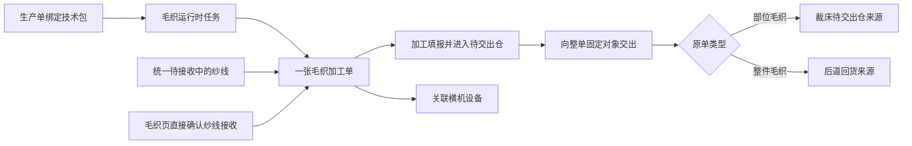
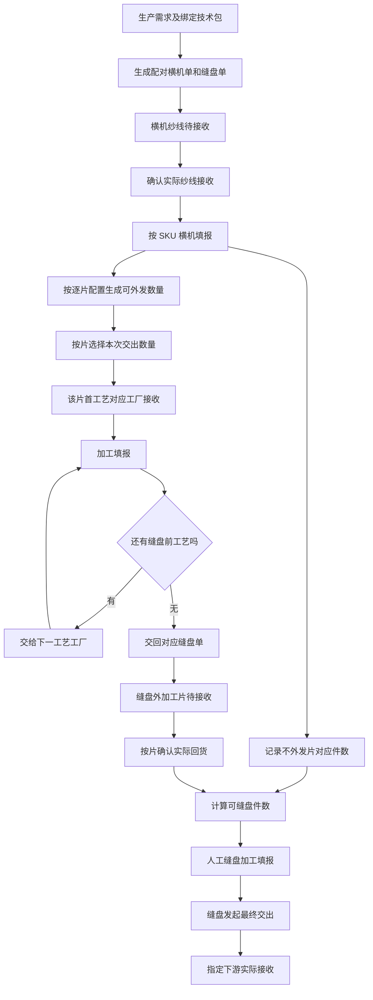
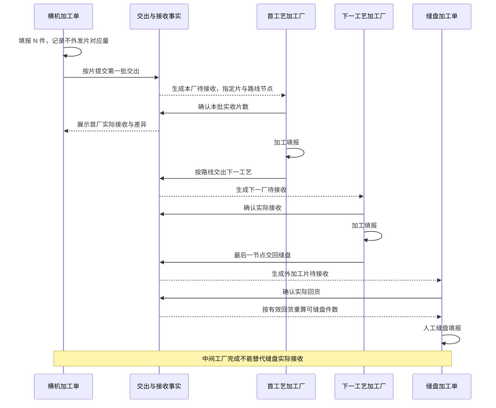
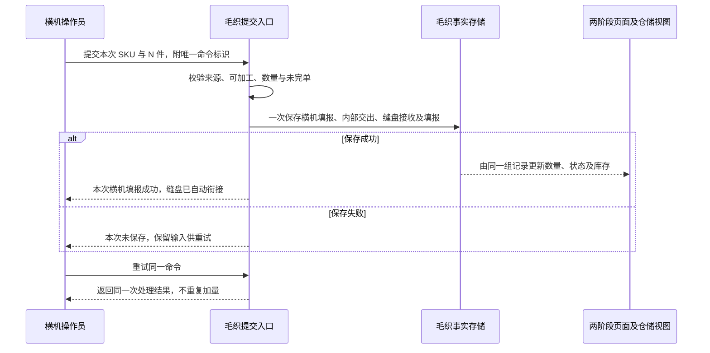
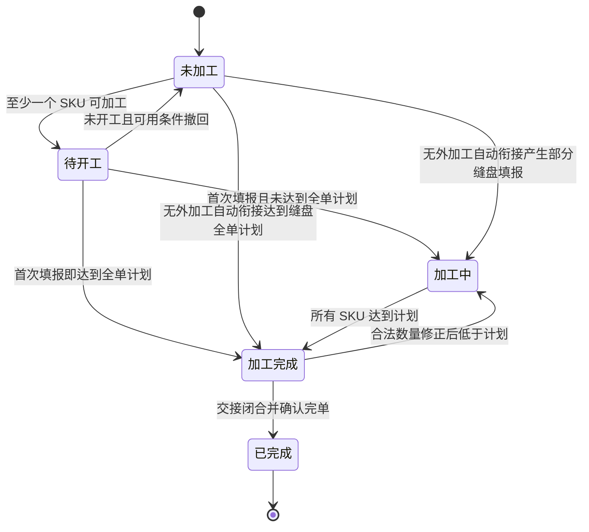
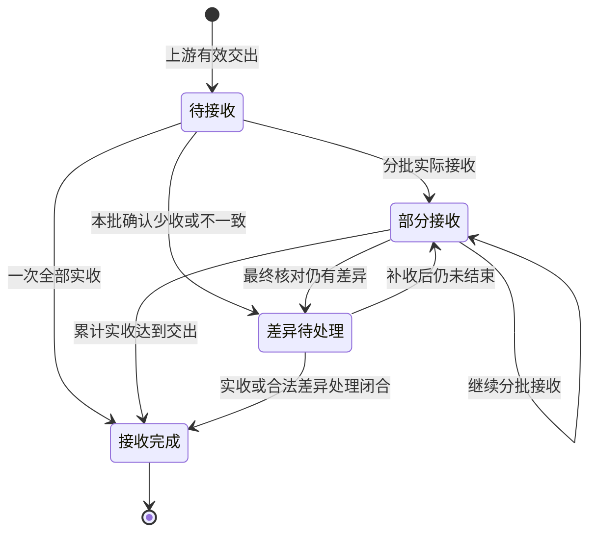

# 毛织管理两阶段拆单与上下游协同调整方案

版本：方案 v1.0｜日期：2026-09-18｜状态：已按用户指令进入实施，验收尚未关闭

本方案把现有毛织加工单拆为**横机加工单、缝盘加工单**，覆盖部位毛织和整件毛织；以生产单绑定的技术包确定外发片及其工艺路线，以横机填报记录“不外发片”对应件数。无外加工时自动衔接两阶段；有外加工时按片外发、按路线流转、在缝盘单接收最终回货，再进行缝盘填报及最终交出。

配套文件：

- [代码核查记录](./code-audit.md)：现状、代码证据、冲突及影响范围。
- [实施计划](./implementation-plan.md)：工作包、负责文件、依赖及验证方式。
- [原子需求追踪矩阵](./requirements.md)：逐条需求、工作包和当前验证证据。

## 1. 依据、目标与边界

### 1.1 本次事实基线

| 项目 | 本次依据 |
|---|---|
| 代码分支 | `codex/work-20260918` |
| 工作树 | `/Users/laoer/Documents/higoods/.worktrees/work-20260918` |
| Git HEAD | `4804328a822eec3c77eee1ffa5b10911bb77c9fe` |
| 业务依据 | 本次对话中用户的需求、纠正及明确确认 |
| 现场参考 | 用户提供的线上毛织、技术包截图；已查看的当前原型染色加工单、待接收页面 |
| 页面参考地址 | `/fcs/craft/dyeing/work-orders`、`/fcs/craft/dyeing/pending-receipts` |
| 证据限制 | 设计阶段参考不等于实施验收；当前已实施并在隔离浏览器验证，未修改线上数据；最新结果见 evidence/verification-index.md |

原工作区位于另一分支且有未提交修改。本方案的代码事实以以上隔离工作树为准；实施前应核对与拟实施基线之间的相关差异。不得把其他分支或服务的页面当作本方案实施验收证据。

### 1.2 已确认业务规则

1. 部位毛织和整件毛织都拆成横机、缝盘两张单。
2. 技术包只维护需要辅助工艺／特种工艺的毛织片；不外发的实际各片统一称为“不外发片”，不要求补齐逐片名称和片数。
3. “不外发片”随横机填报记录对应件数。
4. 外发片的加工先后顺序由技术包工艺路线确定；横机交给该片首个工艺对应的加工厂。
5. 无外加工时，横机填报多少，就自动横机交出多少、缝盘接收多少、缝盘填报多少；最终交出仍由缝盘发起。
6. 原型历史毛织加工单全部清空，不做历史拆单迁移。
7. 保留“全部加工单、未加工、待开工、加工中、加工完成、已完成”六个入口。截图中的“待开工”也保留。
8. 关联横机设备仅属于横机加工单。
9. 参照染色加工单的列表与投入／要求／产出／需求来源模型，明确保留独立的时间、数量列。
10. 迁移并适配待接收，区分横机纱线接收与缝盘外加工片回货接收。

### 1.3 本方案提出的具体设计

上述业务已确认；以下属于为落地补全的设计建议，不能表述为用户已经逐项确认：两阶段编号与路由、SKU 级自动衔接、加工完成与完单门禁、150% 既有填报上限的衔接、部位毛织最终产物标识、跨模块事实引用方式。具体口径见第 3～9、13 节。

### 1.4 范围与非目标

本次实施范围包含毛织数据与页面、相关技术包快照读取、关联辅助／特种工艺接收交出、统一待接收、相关仓储投影、PDA、交出打印，以及裁厂／后道的毛织来源适配。只修改与毛织两阶段有关的共享分支，并验证染色、印花、非毛织工艺不被影响。

保留纱线领退料、库位、盘点、库存查询及横机设备档案等已存在能力；按阶段重新限制入口。不新增真实后端、鉴权、数据库、离线队列、通用工作流引擎；不扩展结算、计件工资、报废审批、复杂返工管理。原型只演示经确认的业务逻辑，不代表生产系统已经具备这些能力。

### 1.5 角色与操作责任

| 角色 | 本次职责 | 防错边界 |
|---|---|---|
| 计划／跟单 | 查看需求、任务、技术包及派工，处理路线或工厂未明确的缺口 | 不替接收厂制造实收记录；已发生交接不随改派重写 |
| 毛织仓管／交接人员 | 接收横机纱线、接收缝盘回货片、按指定对象办理交出 | 接收界面只显示本厂可接收来源，显示应收、实收及差异 |
| 横机操作员／主管 | 按 SKU 填报、关联设备、查看外发进度及本阶段完单 | 不能用纱线 kg 冒充产量，不能把不外发片填成物理片数 |
| 辅助／特种工艺厂人员 | 接收指定片、加工填报、按路线交给下一站 | 不跳过前置工艺，不把加工完结视作下一厂已经收到 |
| 缝盘操作员／主管 | 查看回货缺口、按可用件数填报、最终交出与完单 | 自动衔接记录只读；混合路径不超可用量；无横机设备动作 |

沿用原型已有操作身份和工厂上下文，命令层与界面共同限制动作。本次不建设新的账号、角色权限管理模块。管理端可追溯各角色操作人和时间；员工端聚焦当前对象、本次动作及结果。

## 2. 当前链路及必须调整的问题

### 2.1 当前代码的业务链路

这是代码结构说明，不表示所有跨模块交接已经通过现场验证。逐片外加工及回到缝盘的链路尚未由现有毛织模型表达。

### 2.2 核查结论

| 当前事实 | 对新需求的影响 | 调整方向 |
|---|---|---|
| 一个运行时毛织任务只允许一张加工单，单号和任务身份紧密绑定 | 直接插入两张旧单会导致查询、PDA 唯一性判断失败 | 明确来源任务、阶段单、配对关系三种身份 |
| 部位毛织没有纸样部位明细会拒绝生成 | 与“不外发片不维护逐片明细”冲突 | 输出按来源 SKU 建立；外发片另取技术包，不作为整单存在前提 |
| 整件毛织生成时不解析毛织部位 | 会漏掉整件中的外发片 | 两类毛织均提取逐片工艺 |
| 技术包已有逐片实例和逐片工艺；毛织与特种工艺生成主要读片行摘要 | 不能可靠区分 Q 第 1 片与第 2 片的不同路线 | 消费逐片实例及具体路线节点 |
| 交出目标存放在整单上 | 不支持不同片、不同路线阶段去不同工厂 | 下游目标落实到交出明细与路线节点 |
| 毛织待接收路由已存在，但借用染色页；纱线投影限定自营毛织厂与 YARN | 不能承接外加工片回货；过滤、页面配置可能混用 | 显式毛织模式及两类接收对象 |
| 辅助／特种工艺对裁片默认返回裁床厂；部分仓储记录由汇总状态推导 | 毛织回货可能送错厂；加工完结可能被当作接收事实 | 毛织来源按路线指定下一站，实际接收独立记录 |
| 旧列表只有可以开工／不可以开工／已完成三个入口 | 不符合用户保留的六个入口 | 两阶段统一采用五个业务状态、六个列表入口 |
| 旧完单只要求有正数交出 | 部分交出可能把全单提前结束 | 分开加工完成、交接完成与确认完单 |
| 读数据会补旧 Mock、接收演示单和运行时毛织单 | 仅清空数组后会重新出现历史单 | 同时清理旧事实、引用及生成入口 |

详见[逐项代码证据](./code-audit.md)。

## 3. 目标对象与单据关系

### 3.1 两阶段单与来源任务

一个有效毛织任务范围生成一组配对单；任务已分拆时，以分拆后的有效 SKU 范围分别生成，不恢复为整张生产单范围。

| 对象 | 职责与身份 |
|---|---|
| 生产需求、生产单 | 需求数量的唯一上游，不因拆单加倍 |
| 来源毛织任务 | 保存生产范围、派工上下文、技术包版本；仍是一份来源任务 |
| 横机加工单 | 接收和使用纱线、横机填报、记录不外发片对应件数、外发需要工艺的片、关联设备 |
| 缝盘加工单 | 汇集不外发片对应进度及外加工片回货，记录缝盘产量，交给最终下游 |
| 外加工片需求 | 对应技术包内具体毛织片、适用 SKU、每件需要数量及工艺路线 |
| 辅助／特种工艺加工单 | 承接具体路线节点和具体片，不新建同名的第二套工艺模块 |
| 交出批次／明细 | 标识谁、何时、把什么、多少、交给哪个单据和工厂 |
| 实际接收记录 | 独立确认收到的数量、差异、接收人和时间，引用具体交出明细 |

建议一组单保存 `pairId`、`sourceTaskId`、`stage`、各自唯一 `workOrderId`；阶段值为 `KNITTING`／`LINKING`。单号展示可采用 `HJ…`／`FP…`，具体编号格式为实现建议。关联信息能从任意阶段回看另一阶段。

任务总览显示“一组毛织任务，下含横机、缝盘两阶段”。PDA 可以投影为两个可执行条目，但不得由此新增两份生产需求，不能把两个阶段计划相加作为订单需求或交付量。毛织任务最终交付以缝盘阶段的有效交出／下游接收为准。

### 3.2 三种数量对象

| 对象 | 单位 | 识别维度 | 不能做的处理 |
|---|---|---|---|
| 纱线 | kg，保留现有称重精度 | 纱线 SKU、批次、接收／分配记录 | 不得直接换算成毛织件数 |
| 外发片 | 片，整数 | 纸样包、逐片实例、颜色、尺码、工艺节点、交接批次 | 不按纱线关联条数重复生成产量 |
| 不外发片 | 对应件数，整数 | 配对单、成衣 SKU、横机填报记录 | 不推测物理片名、每件片数或全部片数 |
| 横机／缝盘产量 | 件，整数 | 来源范围内 SKU；部位毛织表示对应成衣件数 | 不把“部位毛织 100 件对应量”写成“100 片” |

“不外发片对应 100 件”只表示这 100 件对应的不外发毛织部分已按横机填报记录进度，不证明具体有多少片，也不创建虚构的 Q、H、袖片等明细。

### 3.3 部位毛织最终产物

建议将缝盘后的部位毛织产物表示为“该来源毛织任务的毛织部件／部件集合，对应 SKU × N 件”，以任务已明确的产物身份关联下游。只有上游真实维护了部件名称与换算关系，才能显示该名称或换算实际片数。

当前裁厂桥接依赖 `woolPartCode`、`woolPartName` 并存在件／片口径差异。应适配任务范围内的部件产物身份，不能借用外发片名称充当缝盘产物，也不能为了满足旧字段补出“不外发片”的物理明细。此处是本方案建议，详见第 13 节。

## 4. 技术包、路线与接收工厂

### 4.1 资料来源与冻结

1. 采用**生产单已绑定的技术包版本**，不得改读该 SPU 最新默认版本。用户截图中默认版本与生产单关联版本不同，正是需要避免的场景。
2. 从绑定版本的毛织纸样包及适用颜色／尺码提取逐片实例、逐片辅助／特种工艺和位置要求。
3. 从同版本工艺路线取得具体工艺节点、前置关系及对象归属；由该节点实际派工记录取得加工厂。
4. 建单时保存可追溯的来源版本、纸样、实例、路线节点和数量关系；已经交出或加工的批次不随最新技术包静默变化。
5. 当前快照类型继承技术包类型，构建时通过对象展开可能保留 `pieceInstances`；问题不是“已证明字段丢失”，而是缺少对该嵌套字段明确的深复制及毛织逐片消费规则。实施应补齐并测试版本隔离。

### 4.2 外发判断和去重

判断范围是**本任务实际使用的毛织纸样和 SKU**，不是该款所有纸样。布料裁片、其他颜色或另一任务范围的工艺不能让本 SKU 被误判为需要外发。

逐片实例是外发对象，纱线 BOM 是投入对象。多种纱线共同关联同一纸样、同一片时，只产生一份该片的需求。建议使用“生产单绑定版本＋任务范围＋纸样包＋逐片实例＋SKU”稳定识别外发片；同一片不同路线节点另以节点 ID 区分。

没有逐片记录且没有毛织片工艺，是有效的“不需要外加工”场景。已经存在毛织片工艺、但实例／适用范围／路线关系不完整时，应提示补全关联，不得静默当作无外加工，更不能自动完成缝盘。

### 4.3 路线与工厂解析

按对象归属和前置节点关系确定路线，序号用于展示及校验，不把工艺名称排序当作业务顺序。同名工艺在路线出现两次时是两个节点，不合并。

横机交出对象 = 该外发片的首个毛织片工艺节点所对应的已分配加工厂。第一厂加工后交给下一节点工厂；最后一个缝盘前工艺完成后交回本配对缝盘单。整件缝盘之后仍有成衣工艺时，归入最终下游，不能提前混入毛织片回货路线。

不同片允许并行送不同厂；一片的路线先后必须明确。同一物理片出现无法解释的多个同时下一站、节点成环、工厂未分配或对象不匹配时，仅阻断相关片的交出，显示需处理的具体节点与责任入口。不得任取第一个候选、按历史默认厂或按工厂名称猜测。

## 5. 业务流程与时序

### 5.1 有外加工，包括混合情形

图中下一工艺厂也要先接收再加工；分批接收、分批加工和分批交出均保留实际记录。不要求所有颜色、尺码或全单回齐才加工；具备可加工余额的 SKU 可先推进。

### 5.2 无外加工

这是用户明确要求的原型联动规则；自动生成的缝盘填报必须标注来源，不能伪装成操作员独立填报。没有横机手工交出按钮，不生成等待人工确认的内部接收待办。

### 5.3 一个加工单内的多 SKU

建议按 SKU 判断自动／外发路径：某颜色有外发片，另一个颜色没有时，前者走回货和人工缝盘，后者走自动衔接。**同一 SKU 内只要有外发片，就属于混合或全外发路径，不因为存在不外发片而自动填报缝盘。**列表需显示“部分 SKU 外加工”，详情逐 SKU 展示。

## 6. 数量、库存、修改与防重

### 6.1 混合情形的计算

对一个 SKU，定义：

- `H`：有效横机累计填报件数。
- `I`：不外发片已记录的对应件数；随横机填报及合法修正同步，不是物理片数。
- `mᵢ`：技术包明确定义的某外发片需求每件用量。逐片实例通常为 1；仅在明确属于可互换的同类片时才能合并用量。
- `Rᵢ`：已完成该片所有缝盘前工艺、由本缝盘单实际确认接收的有效片数。
- `L`：有效缝盘累计填报件数。

存在外发片时，数量上的累计可缝盘上限为 `C = min(H, I, floor(R₁/m₁), …, floor(Rₙ/mₙ))`；本次最多可填报 `max(0, C-L)`。若业务资料明确没有不外发部分，则不增加一个虚构的 `I` 限制，直接按 `H` 和外发片计算；原型默认不维护完整物理片构成，因此 `I` 作为横机对应进度通常与 `H` 同步。

这个计算只约束**已知外发片和对应件数**，不能宣称系统验证了全部实际物理片齐套。不外发片的实体完整性由横机填报责任及缝盘现场确认承接。

例：横机已填报 100 件，不外发片记录对应 100 件；Q1、Q2 各为每件一片，最终回货实收分别为 100、80 片，则累计最多可缝盘 80 件。若已缝盘 50 件，本次可填报 30 件。这里没有假定“不外发片”只有一片或命名为 H。

所有计算严格限定同一任务范围、配对单、SKU 和合法片身份。不能用黑色 L 的余量抵补黑色 M，也不能用 Q1 抵补 Q2。同一片经两厂加工后回货只计一次最终可用量。

### 6.2 横机外发与工艺厂数量

某片累计可生成外发量为 `H × mᵢ`；本次可交出量为该值扣除已有效交出量，并受实际待交出库存余额限制。不同接收工厂分成不同交出单／批次，同厂可一单多行，行上保留各自路线节点。

工艺厂本次可加工不超过本节点已实收减已加工；本次可交出不超过已加工减已交出。接收必须引用实际交出明细，不能从计划数量直接补成实收。接收分批累计，差异独立展示；超交出数量的接收不能直接入账，须先纠正来源或走既有差异确认能力。

### 6.3 保留并协调现有填报容差

当前毛织代码允许累计横机填报不超过计划的 150%。用户没有要求取消它，本方案建议暂保留横机上限 `floor(计划件数 × 1.5)`，在页面显示计划量与可填报上限的区别。

外发片计划量仍按需求计划计算；有效可交出量按实际横机产量计算。关联毛织片工艺的接收上限改用真实合法交出余额，不能沿用其“最多接收计划量”的旧限制卡住合法超计划产出。缝盘受实际可用件数限制，不再独立额外放大 150%；避免两阶段叠乘成 225%。非毛织工艺保持原有规则。若产品决定取消横机容差，应作为明确变更统一调整，不由本次拆单暗改。

### 6.4 库存表达

| 位置／对象 | 增加来源 | 减少来源 |
|---|---|---|
| 横机待加工纱线 kg | 有效实际接收、调入、退料 | 领料、退回、调出及合法调整 |
| 横机待交出外发片 片 | 横机产量按已维护外发片用量生成 | 对应片的实际交出 |
| 缝盘不外发片对应件数 | 横机填报形成内部可用进度 | 缝盘使用对应件数 |
| 外加工厂片库存 片 | 本节点实际接收 | 本节点加工流转及交出 |
| 缝盘外加工回货片 片 | 最后一工艺交回并实际接收 | 按 `mᵢ` 被缝盘产量使用 |
| 缝盘待交出产物 件 | 人工填报或无外加工自动填报 | 最终交出 |

不外发片的件数进度不可加入“总物理片库存”。中间交出、待接收、接收后的存量分别展示，不能把同一批在途和已接收数量重复算作在库。余纱保留现有领退料及仓储处理，不凭件数虚构耗纱量，也不凭空把余纱清零。

### 6.5 数量修改与重复提交

沿用唯一命令标识和有效数量修正记录。输入值不合法、缺少原因、跨单／跨厂、已完单、数量低于后续已使用量时阻断；错误提示说明具体哪笔已被接收、加工或交出。

无外加工的横机数量修正，只有关联缝盘产物尚未最终交出且相关单未完单时，才允许一次同步修正自动衍生的四类记录及库存；不允许单独修改自动缝盘填报。混合路径中，横机数量不能调减到不足以支撑已外发片、已缝盘件数或已使用不外发对应量。

已经由下游确认的交出记录不覆盖原值；遵循既有差异处理和可追溯修正，不新增一套返工／冲销审批系统。所有写入先校验，再一起保存本次所属事实；页面失败不应出现半条自动衔接。重试相同命令返回原结果，载荷变更不能冒用同一命令标识。

## 7. 待接收与上下游责任

### 7.1 毛织待接收入口

保留 `/fcs/craft/wool/pending-receipts`，用“纱线待接收／外加工片待接收”两个业务分类；这是收货对象分类，与加工单的六个状态入口分开。

| 字段／行为 | 纱线待接收 | 外加工片待接收 |
|---|---|---|
| 目标单据 | 横机加工单 | 缝盘加工单 |
| 上游 | 实际染色交出、仓储调拨／领料等有效来源 | 该片最后一个缝盘前工艺厂的实际交出 |
| 对象 | 纱线图片、名称、SKU、批次 | 款式图片、SKU、纸样、片名／序号、已完成工艺 |
| 数量 | 交出与实收 kg；按现有业务展示件数、毛重、净重等 | 交出、已接收、剩余待接收及本次实收片数 |
| 校验 | 来源有效、当前工厂及订单需要该纱线 | 来源有效、目标缝盘单、片和路线最终节点吻合 |
| 入仓／进度 | 横机纱线库存及可加工条件 | 缝盘回货片库存及可缝盘件数 |

共同展示来源单号、来源工厂、生产单、需求来源、目标加工单、发出时间、待接收时间、收货记录及差异。支持筛选、查询、重置、导出、分页、列设置和收货明细。库存型纱线先接收后分配的既有能力可保留；外加工片始终有明确配对单，不能作为任意缝盘单通用可分配存货。

### 7.2 同一实际接收事实

加工单“确认接收”、待接收页和 PDA 交接使用同一确认入口；入口只预选对象，不创建另一份接收记录。纱线接收继续沿用统一收货的来源、称重和分配能力，删除绕开来源直接增加纱线实收的重复业务入口。

外加工片使用片数业务字段，不套用纱线称重必填，也不填虚假的 kg。每次实收引用交出明细，保留接收批次、实收数量、差异、接收人和时间。发出方只看到接收方确认的结果，不能因自身加工完结而自动代填实收。

无外加工内部自动衔接的接收记录显示“横机填报自动接收”，可追溯原填报，但不进入人工待接收队列。混合路径的不外发片内部对应进度同样不产生外厂回货待办。

### 7.3 其他工厂、裁厂和后道

辅助／特种工艺保留自己的加工单和操作页面。来自毛织的片要明确显示来源横机单、目标缝盘单、当前路线节点及下一站，不复用“所有裁片一律回裁床”的默认值；普通布料裁片仍遵循原规则。

部位毛织最终来源只允许缝盘最终交出进入裁厂／既定下游，继续保留实际接收后的来源认定。整件毛织只允许缝盘最终交出进入工艺路线规定的下一厂／后道；横机外发不能被识别为已完成整件毛织产物。后道来源适配还应验证目标厂匹配，不能仅凭整件类型和通用下游工厂类型进入后道列表。

## 8. 状态与完成条件

### 8.1 分开管理三类状态

加工状态回答“该阶段做到了哪一步”；接收状态回答“该类投入是否收到”；交出状态回答“该阶段产物是否交出并被接收”。一个加工单可以是“加工完成、部分交出、下游部分接收”，不能用一个状态覆盖三件事。

横机接收摘要按纱线展示；缝盘分别展示不外发片内部对应进度与外加工片回货。“纱线种类已具备开工条件”不等于“计划纱线全部收齐”。

### 8.2 五个加工状态、六个列表入口

以下是本方案建议的正常完成规则：

| 状态 | 横机加工单 | 缝盘加工单 |
|---|---|---|
| 未加工 | 无填报，暂无可加工 SKU | 无填报，暂无可缝盘 SKU |
| 待开工 | 无填报，至少一个 SKU 已具备横机填报条件 | 无填报，至少一个 SKU 有可缝盘件数 |
| 加工中 | 已有填报，但尚未满足全部 SKU 的计划加工量 | 已有填报，但尚未满足全部 SKU 的计划缝盘量 |
| 加工完成 | 全部有效 SKU 的累计横机填报达到计划；尚未确认完单 | 全部有效 SKU 的累计缝盘填报达到计划；尚未确认完单 |
| 已完成 | 本阶段加工、交接和数量核对完成后确认完单 | 缝盘加工、最终交接和数量核对完成后确认完单 |

“全部加工单”是查询汇总，不是第六种状态。已开工后缺料仍为加工中，另显示缺料阻断，不退回未加工；合法修正使累计数量低于计划时，尚未完单的“加工完成”可回到加工中并保留修正日志。

横机目前开工判断是本 SKU 每种必需纱线都有正数有效接收。暂沿用这一事实口径，不擅自引入未定义的 kg／件精确用量门禁；页面要准确表达为“具备开工所需纱线种类”，不能显示“原料足够完成全部计划”。

### 8.3 完单门禁

横机确认完单建议要求：全部 SKU 达到计划加工量；全部实际生成的外发片已交给第一工艺且接收确认／差异已处理；不外发片对应进度已内部衔接；本阶段无待处理数量冲突。横机完单时释放本阶段设备。**不等待所有外加工回货或缝盘完单**，否则阶段拆分失去责任边界。

缝盘确认完单建议要求：全部 SKU 达到计划缝盘量；全部已产出的有效缝盘产物已最终交出；指定下游已确认接收／差异已处理；没有影响数量闭合的未处理问题。缝盘不涉及设备解除。

无外加工路径仍保留两个阶段的独立完单操作；自动填报不等于自动确认完单。全量加工达到计划而交接未完成时停留“加工完成”。未达到计划的短结、损耗放行不在用户已确认范围，本方案不新增按钮绕过，见第 13 节。

差异闭合不能把少收数量改成实收；加工可用量始终以有效实际接收为准。未来若允许缺数完单，需要独立明确责任、原因与数量去向。

## 9. 管理页面、时间、数量及操作

### 9.1 导航与路由

| 页面 | 建议目标路由 | 内容 |
|---|---|---|
| 横机加工单 | `/fcs/craft/wool/knitting-orders` | 六状态入口、横机相关动作 |
| 横机详情 | `/fcs/craft/wool/knitting-orders/:id` | 纱线、横机填报、片路线、外发、设备 |
| 缝盘加工单 | `/fcs/craft/wool/linking-orders` | 六状态入口、缝盘相关动作 |
| 缝盘详情 | `/fcs/craft/wool/linking-orders/:id` | 不外发片对应进度、外加工回货、填报、最终交出 |
| 毛织待接收 | `/fcs/craft/wool/pending-receipts` | 两类接收对象 |
| 交出打印 | 两阶段详情路由下的 `/handover-print/:handoverId` | 横机外发片／缝盘最终产物 |
| 毛织待加工仓、待交出仓 | 保留现有仓储路由 | 对象、阶段、单位分明 |
| 横机设备、设备关联 | 保留现有设备相关路由 | 只关联横机加工单 |

旧单一 `/work-orders` 及其详情／打印、`/tasks`、`/orders` 等旧单据别名不再注册或兼容跳转；旧引用统一改到具体阶段。毛织分类根入口如继续存在，应作为分类导航指向横机单，不保留旧单据模型。保留仍有业务意义的仓储路由，不为改名顺带改造全局菜单。

### 9.2 列表结构与列内容

保持“标题与主操作 → 查询卡片 → 状态统计入口 → 数据列表卡片 → 分页”。沿用标准列表组件，不复制染色整个页面。状态 Tab 与筛选同步；数量统计按同一基础查询集合计算，点击状态后列表总数等于该状态数量，全部等于五状态之和。

查询条件建议包含关键词类型与关键词、工厂、部位／整件、SPU／SKU、是否外加工、接收状态、加工状态、时间字段及范围；横机可查纱线 SKU，缝盘可查来源工艺／工厂。确有多工厂范围才展示工厂维度，不凭参照页增加工厂 Tab。

| 列 | 横机加工单 | 缝盘加工单 |
|---|---|---|
| 加工单／商品与需求来源 | 横机号、配对缝盘号、款图／SPU／内部款号、部位／整件；需求单、生产单、任务可追溯 | 缝盘号、配对横机号，其他同左 |
| 加工投入／上游 | 必需纱线、图片、SKU、上游单据／厂、计划／交出／实收 kg | 不外发片对应件数；各外发片及最后工艺厂的交出／实收片数 |
| 加工要求 | 绑定技术包、毛织纸样、SKU 计划、外发片工艺与顺序、资料入口 | 缝盘资料、对应范围、必须回货的片和当前缺口 |
| 处理进度 | 纱线接收、横机加工、外发片交出及第一厂接收 | 内部对应进度、外加工回货、缝盘加工、最终交出及下游接收 |
| 加工产出／下游 | 不外发片内部至缝盘；外发片分别至首工艺厂；无外加工自动衔接 | 最终部件或整件及指定下游 |
| **时间** | 创建、上游接收、加工生产、下游交出分组 | 同分组，替换为缝盘实际节点 |
| **数量** | 需求计划件数、横机已填报件数、不外发片对应件数、外发片进度、余纱 kg | 需求计划、可缝盘、累计填报、待交出、已交出／下游实收件数及回货片数 |
| 操作 | 查看、确认纱线接收、加工填报、外发交出、关联设备、完成加工单；现有领退料按有效条件保留 | 查看、确认外加工片回货、人工缝盘填报、最终交出、完成加工单 |

无外加工 SKU 的缝盘填报为只读自动来源，不提供重复手填入口。只有混合／外加工 SKU 能人工填报。行操作按状态、余额和身份判断，页面与命令入口均校验。

列表展示有限摘要、数量和“查看明细”，不展开所有纱线／片／工艺把单行撑成整屏。详情用“概览、投入接收、加工记录、片及工艺路线、交出记录、操作记录”分区；横机另有设备区，缝盘没有设备区。片路线明细显示当前在哪个厂、完成到哪步、还差哪些回货。

### 9.3 时间列的明确口径

| 分组 | 时间项 |
|---|---|
| 单据创建 | 需求单创建、生产单生成、本阶段加工单创建 |
| 上游接收 | 待接收生成、上游实际发出、本阶段实际接收；缝盘区分自动内部接收与外厂实收 |
| 加工生产 | 计划开始／完成、首次加工填报、最近加工填报、达到计划加工完成、确认完单 |
| 下游交出 | 交出单创建、实际交出、直接下游实际接收 |

多批次展示首次、最近、笔数，详情可逐笔追溯。时间来自对应事件，不用 `updatedAt` 代替、不用计划时间伪装实绩；未发生显示“尚未…”，已发生但缺时间显示“时间未记录”。自动事件采用本次横机触发时间并标明自动来源。横机时间列只把第一接收工厂作为直接下游；整条片路线在详情查看。

### 9.4 数量列与公共交互

件、片、kg 分行带单位展示，不能做一个跨单位合计或跨阶段累计产量。多 SKU 汇总可展示件数合计，点击查看颜色／尺码构成；外发片只合计物理片数并保留按片展开。不外发片始终带“对应”二字。

查询同步刷新列表、统计和总条数；重置恢复全部条件；导出当前条件的全部匹配记录，排除操作列并保留单位与阶段。列表分页、列显隐／顺序／冻结／排序沿用现有组件，偏好按横机、缝盘、待接收各自路由存储。表格内部滚动，页面主体不横向溢出；操作列固定右侧，防错识别列不能隐藏。

所有出现的款式、纱线、物料使用真实对应图片，缩略图与标识同块，点击大图支持关闭、遮罩、Esc；加载／失败有明确反馈。毛织片缺少独立照片时展示对应款式及可用技术包图，并标清“款式图／纸样图”，不得把它伪称该片实拍。

## 10. PDA、仓储与打印

PDA 延续交接、执行、仓管的职责：交接处理接收／交出；执行处理填报／完单及横机设备关联；仓管只进行已有库存查询、盘点等仓储动作，不另起一套加工状态。

扫描加工单号直接定位阶段；扫描生产单号有多个候选时，以阶段、单号、图片、颜色／尺码和当前动作区分，不再假设一个任务只有一个加工单。当前厂无权操作的单不进入可执行结果；不能只靠隐藏按钮控制。

横机接收界面展示纱线 kg；缝盘接收展示最终回货片；横机交出按片及接收厂分组，缝盘交出按最终 SKU 及下游分组。输入后即时展示剩余量及差异，确认后能回看本次保存记录。无外加工的自动动作仅显示结果，不能重复点击接收或填报。

打印分别使用“横机加工交出单”“缝盘加工交出单”。横机打印包含片身份、工艺、当前及下一厂、数量片、来源订单／版本和配对缝盘号；缝盘打印包含产物、SKU、数量件和最终去向。二维码指向具体阶段及交出批次。不同接收厂不能共用一张不分去向的交出单；不外发片内部自动衔接无需伪造外发纸单。

仓储列表与打印、Web、PDA 都读取同一有效交接数量。仓储适配不得根据工艺单“已完结”自动制造接收方实收量或把库存设成已回写。

## 11. 代码调整策略与历史清空

### 11.1 最小必要代码边界

继续采用现有 Vanilla TypeScript 模板、标准列表控制器和本地 Mock 存储。在现有 `wool-domain` 内完成阶段模型和计算，不另建通用生产工作流框架。

旧 `WoolWorkOrder` 单阶段对象应替换为含明确阶段的配对单模型；公共毛织概念可以保留，但类型、字段、关联 ID、函数返回值和路由必须能区分两种单。禁止保留一套旧单据写路径再增加两套展示别名。`getWoolWorkOrderByTaskId` 改为显式获取配对单或按阶段查询，调用方逐一迁移。

毛织侧保存阶段、加工、内部衔接和横机／缝盘交出事实；统一收货侧保存人工实际接收事实；辅助／特种工艺侧保存其节点加工及交出事实。跨侧仅引用真实来源 ID 并投影，不复制出可独立修改的第二份事实。对毛织外发片，应由既有工艺交出记录驱动下一站待接收，不能从工艺汇总状态猜交出批次。

无外加工的四类毛织记录在同一毛织存储提交内保存；人工统一收货以收货记录为事实源，毛织接收、库存和进度可重算。跨模块投影失败可在下一次读取恢复，不能二次产生接收；本次不建设分布式事务、离线任务或自动重试框架。

建议在现有文件内补齐以下最小数据契约；名称是拟实施名称，不代表已有实现：

| 契约 | 必需字段／关系 | 数量及事实归属 |
|---|---|---|
| `WoolStageWorkOrder` | `workOrderId`、`workOrderNo`、`stage`、`pairId`、`sourceTaskId`、`pairedWorkOrderId`、生产单／需求引用、执行厂、绑定版本、SKU 计划及时间 | 毛织存储；两阶段各有唯一 ID，不再用一个 `woolOrderId` 混指任意阶段 |
| `WoolExternalPieceDemand` | `pieceDemandId`、`pairId`、`garmentSkuCode`、`patternFileId`、`pieceInstanceId`、每件用量、来源版本、路线节点引用 | 片需求只产生一次；工艺节点引用该片需求，不复制增加物理片 |
| 片路线节点引用 | `sourceEntryId`、`predecessorEntryIds`、`pieceDemandId`、当前工艺单／派工厂、下一节点或目标缝盘单 | 复用技术包路线和实际派工；不另存可随意编辑的工艺顺序 |
| 不外发片对应进度 | `pairId`、`garmentSkuCode`、`sourceReportId`、`correspondingQty`、已使用对应量 | 单位件；由横机填报及缝盘使用事实推导，无物理片名／片数 |
| 阶段填报 | `reportId`、阶段单、SKU、数量件、时间、操作者、手工／自动、触发记录、命令标识 | 自动缝盘记录引用横机原填报；实际工艺片加工仍属于工艺模块 |
| 交出批次与行 | `handoverId`、`handoverLineId`、来源阶段或工艺单、片需求或最终产物、来源／目标节点、目标单和厂、数量及单位 | 一次实物交出只有一个权威批次身份；多厂分单、多次分批不覆盖 |
| 人工实际接收行 | `receiptId`、`receiptLineId`、来源交出行、目标阶段／工艺单、对象、实收、单位、差异、时间、接收人 | 统一收货事实；纱线目标横机、最终毛织片目标缝盘 |
| 内部自动衔接 | `sourceReportId`、横机交出记录、缝盘接收记录、缝盘填报记录及共同命令标识 | 同次提交建立引用，不通过人工收货队列再入账 |

统一接收中现有含义不明确的毛织单关联，建议迁移为可区分的目标引用，例如 `{ stage: 'KNITTING', workOrderId }` 或 `{ stage: 'LINKING', workOrderId }`；纱线分配只接受前者，最终回货片只接受后者。不要把缝盘 ID 填入旧纱线订单字段后依赖页面猜测。

命令层继续集中校验：按阶段查询配对单；横机填报决定本 SKU 的外发／自动路径；外发提交按片解析首节点；外加工最终实收触发缝盘可用量投影；缝盘填报消耗对应量；阶段完单读取当前有效事实。仓储和页面只投影这些结果，不各自计算另一套可加工上限。

### 11.2 清空范围

用户已确认不迁移原型历史毛织加工单。未来实施清空的是**原型内旧毛织业务事实及其派生引用**，不是清空全部原型、全部生产单或线上数据。

| 清理／替换 | 保留 |
|---|---|
| 旧毛织单、旧单接收／填报／交出／完单、数量修改及操作记录 | 无关染色、印花、裁床、辅助／特种工艺业务 |
| 旧毛织单的库存流水、来源分配、打印记录及关联设备记录 | 横机设备档案、有效设备规格、仓库和库位档案 |
| 只因旧毛织交出生成的下游接收来源与演示关联 | 非毛织来源、真实对应图片和技术资料 |
| 旧 Mock 构建器、接收投影演示补单、旧任务自动补单规则 | 生产需求、生产单及其绑定技术包；新规则下合格任务可重新生成新阶段单 |
| 旧页面路由、旧单据别名、相关持久化偏好和旧单查询参数 | 仍有效的毛织分类、仓储、设备入口 |

不直接删除共享收货库或共享工艺库。先按旧毛织 ID 收集引用；共享单据只移除属于旧毛织的行，保留其余行。只清理被明确证明由旧毛织产生的派生事实；遇到混合引用应在实现前列清单，不能按“裁片”“毛织”文本批量删除。

建议升级毛织存储版本，旧版不再读取／迁移；增加明确的初始化版本标记。首次进入、刷新、清缓存、重开浏览器及不同入口均不得重新生成旧单。旧任务仍合格的，在新规则下产生新身份配对单；失效演示任务排除。不能仅换存储键而让共享接收旧来源继续投影回来。

### 11.3 新演示数据

新数据独立创建并清楚标注 Mock，至少覆盖：整件无外加工、部位无外加工、混合片、全外发片、不同片不同首厂、同片多工艺、不同 SKU 路径、部分回货、缺工厂阻断、重复提交、数量修正和两阶段各五种状态。每个场景有完整来源、图片、路线、数量和可继续操作的记录，不能只提供一两张静态样例。

## 12. 验收场景与交付条件

### 12.1 业务验收场景

| 编号 | 场景与操作 | 必须观察到的结果 |
|---|---|---|
| A01 | 整件无外加工，横机填报 100 件 | 四类关联事实各为 100；缝盘无手工接收待办；最终交出仍人工 |
| A02 | 部位无外加工，纸样没有逐片明细 | 能生成配对单；记录对应件数，不报缺少部位错误、不造片名 |
| A03 | 混合 SKU：横机 100，Q1 实收 100，Q2 实收 80 | 不外发片对应 100；缝盘累计上限 80；不自动缝盘 |
| A04 | A03 已缝盘 50，再填 31 | 阻断并提示本次最多 30；所有端数值一致 |
| A05 | Q1 首厂甲、Q2 首厂乙 | 横机按片分别交出；单据／打印／待接收去向正确 |
| A06 | Q1 先绣花再曲牙绣 | 按技术包路线逐厂接收、加工、交出，最后才回缝盘 |
| A07 | 同名工艺出现两次；两纱线关联同一片 | 工艺节点不合并；物理片需求不翻倍 |
| A08 | 横机交出 100 片，分批实收 60、40 | 同一来源累计实收 100，无重复入库；第一次不假装收齐 |
| A09 | 某片首厂未分配／路线不完整 | 相关交出阻断、提示具体缺口；不能自动走无外加工 |
| A10 | 黑色 L 回货不足、黑色 M 有余量 | 不跨 SKU 抵补；其他可加工 SKU 正常推进 |
| A11 | 无外加工横机重复提交／保存失败后重试 | 不重复增量，不存在只有横机或只有缝盘成功的半组记录 |
| A12 | 无外加工填报合法调减，或缝盘已最终交出后调减 | 前者同步四类事实；后者阻断，不篡改下游历史 |
| A13 | 合法横机超计划但未超过 150% | 按实际量生成片余额；工艺接收不被名义计划错误阻断；缝盘不再放大 |
| A14 | 达到计划但只交出一批／下游尚未确认 | 显示加工完成，不能提前完单；首厂确认后横机可独立闭合 |
| A15 | 技术包默认版本更新，已有生产单仍绑定旧版本 | 原单实例、路线及数量依据保持原版本，资料可追溯 |
| A16 | 从加工单、待接收、PDA 接收同一来源 | 同一有效接收事实；工厂与阶段权限一致 |
| A17 | 部位最终交出与整件最终交出 | 仅缝盘最终产物进入正确裁厂／工艺／后道；横机外发不进入 |
| A18 | 清空后从旧链接、列表、PDA、收货、重开浏览器进入 | 旧单／旧待接收不复活；设备档案及非毛织事实不丢失 |
| A19 | 两阶段列表、详情、待接收及打印 | 时间、数量不缺列；真实图片与大图有效；单位和去向一致 |
| A20 | 同一生产单扫码、跨厂扫码、加工单扫码 | 明确阶段候选、准确定位；无权限不执行；缝盘无设备操作 |

### 12.2 页面、性能及证据

管理端按 1366×768 与最低 1280×720；涉及主管／员工 Web 按 1024×768；PDA 用 360×800、400×806 校验。打印独立核对分页、图片、单位、接收厂及二维码。

每条受影响路由的冷启动、刷新、站内切换，以及所有适用按钮、输入、筛选、分页、Tab、弹窗、列设置、图片、保存和打印生成，都以结果完整可用为终点测量。每项至少 5 次，包含首次及正常／边界场景，常规样本必须 **<500ms**；按用户 2026-09-19 最新授权，少数较重页面不超过 1s 即可。本次明确列入例外的是 **PDA 任务队列 `/fcs/pda/exec` 的冷进入**，上限 **≤1000ms**，刷新、站内切换和操作仍按 <500ms；不得用平均值、热态或占位反馈替代。记录分支、HEAD、工作树、服务、浏览器、视口、数据量、缓存条件、测量脚本、原始耗时和最大值。

任何一项缺证据、报错、内容不全或超出上述对应时限，相关需求和总体交付不得标为已验证／完成。上述为本次实施硬门禁；结果见需求矩阵与验收记录，不因代码存在而视为通过。

按矩阵做正向和反向追踪；旧检查里与新业务冲突的三 Tab、单任务单单据、无部位即失败、交出一次即可完单等断言同步替换。保留防重、有效数量、库存守恒、图片和非毛织回归等有价值检查。

## 13. 决策、风险与后续边界

| 事项 | 本方案处理 | 性质 |
|---|---|---|
| 不外发片进度 | 随横机记录对应件数，不维护物理片明细 | 用户已确认 |
| 工艺顺序和首厂 | 技术包路线及该节点派工，不能猜测 | 用户已确认；具体关联校验为实施设计 |
| 历史 | 清空旧原型毛织单及其专属派生，不迁移 | 用户已确认 |
| 六入口与阶段完成区分 | 两张列表均保留；按第 8 节定义门禁 | 入口和区分已确认，具体门禁为方案建议 |
| 150% 填报容差 | 保留横机，工艺按合法交出接收，缝盘受实际可用量约束 | 基于现有规则的方案建议 |
| 一个单内无外加工 SKU 自动联动 | 按 SKU 判定，混合 SKU 不自动缝盘 | 方案建议，避免整单判断误伤其他颜色 |
| 部位毛织缝盘最终对象 | 任务定义的毛织部件／部件集合，按对应件数 | 方案建议；无真实换算不显示实际片数 |
| 短结、报废、返工 | 不自动放行，不扩展新模块；需要时单列业务规则 | 当前非目标 |
| 缺图片或资料 | 可显示缺口，不能作为完成交付 | 项目硬门禁 |
| 上游改派或版本变更 | 已发生事实不随之重写；未交出节点可按有效派工刷新并留痕 | 方案建议；复杂在制迁移不在本次范围 |

以上建议作为可评审的实施基线，后续若调整，先同步本文件、实施计划和需求矩阵，再修改代码。2026-09-18 用户已明确按本方案执行；当前实现与验证结果以需求矩阵为准，尚未发布。

## 14. 实施期间澄清（2026-09-18）

- 技术包只维护需外工艺的物理片。不外发片仅记录横机对应件数，绝不推算缺失片名或片数。
- 路线问题按片阻断，资料范围问题按 SKU 阻断；其他正常片及无外加工 SKU 可继续，完单仍需全部要求闭合。
- 清空旧加工事实后，仍有效的原来源任务允许按新阶段身份重新生成两单，零继承旧产量；不得把原来源任务永久列入黑名单。
- 备料分配参与横机接收筛选和数量，接收日期取原实际接收时间；内部自动交出参与交出时间查询。
- 最终缝盘交出按实际接收厂进入裁厂、后道或成衣工艺；成衣工艺不得把最终件作为缝盘前毛织片。
- 为减少本次首屏负担，复用同批已生成 KOL 任务材料；毛织演示收货以单次同步批次持久化，保留原逐笔校验与失败回退。首屏真实图片在本次导航时并行请求、解码，不改变测量起点。
