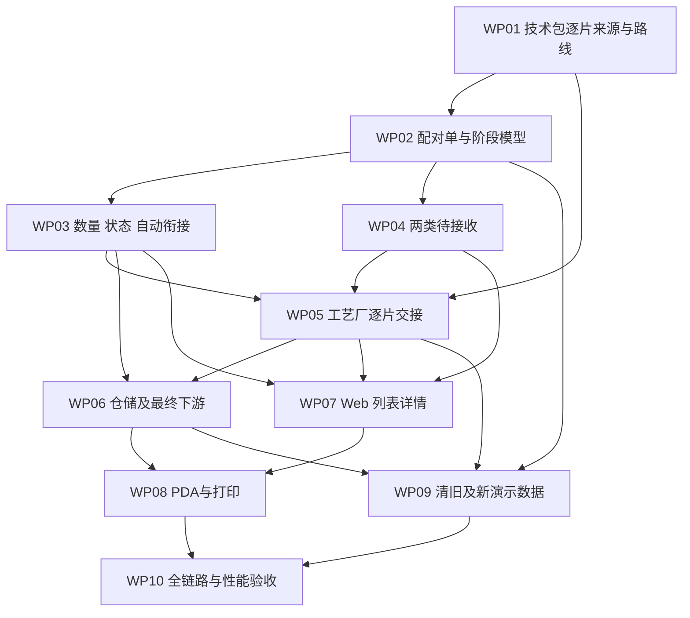

# 毛织两阶段调整实施计划

版本 v1.0｜2026-09-18｜状态：实施与验收中，未完成交付。

权威业务范围见[总体设计](./design.md)，现状依据见[代码核查](./code-audit.md)，逐项控制见[需求矩阵](./requirements.md)。实施中不得通过旧测试或旧文档反向覆盖本次已确认业务。

## 1. 目标与完成标准

交付一套可操作的原型：横机、缝盘配对单；逐片工艺路由；无外加工自动衔接；两类待接收；正确的阶段状态、数量、库存和时间；对应 Web、PDA、打印与上下游来源。旧原型毛织单和旧入口全部退出，非毛织业务保留。

完成条件是矩阵每项达到约定可验收状态，并具有当前分支同一运行服务的自动化及页面证据。业务代码、构建或文档存在不等于完成。性能任何适用样本达到或超过 200ms、图片不全、待办数量不一致或仍有旧单复活，都不能关闭任务。

## 2. 实施前检查

1. 确认目标分支、HEAD、工作树；比较本方案基线之后的毛织及共享文件差异。其他任务修改不吸收、不覆盖。
2. 确认拟运行服务的 cwd、端口、实际版本、受影响路由与验收尺寸；本次专用服务为隔离工作树 5186（开发）／4186（生产构建预览），不使用原工作区 5175 作为证据。
3. 对第 13 节的具体方案建议形成评审结论并记录到矩阵确认列。已确认的“不外发片”“首工艺厂”“历史清空”等不重复提问。
4. 盘点旧毛织 ID、存储键、专属下游引用、自动补单入口和保留的共享数据；先能说明清空结果，再执行定向替换。
5. 核对完整需求与编号覆盖；新增代码必须能回到需求编号。禁止为了复用新增大通用领域框架。

## 3. 工作包依赖

箭头表达数据契约依赖，不要求串行修改每个文件。旧数据清理清单在 WP02 前盘点，在 WP09 用新事实结构执行；未完成清旧验收，不发布新页面给用户验收。

## 4. 工作包明细

### WP01 技术包逐片来源与路线

**业务目标**：两类毛织都能识别正确外发片，按绑定版本和实际路线确认首厂及后续去向。

**文件／符号**：

- `src/data/pcs-technical-data-version-types.ts` 中逐片和路线类型。
- `src/data/pcs-technical-data-fcs-adapter.ts`，现有实例复制。
- `src/data/fcs/production-tech-pack-snapshot-builder.ts`、`production-order-tech-pack-runtime.ts`。
- `src/data/fcs/wool-domain/tech-pack-source.ts` 中来源构建和部位提取。
- `src/data/fcs/special-craft-task-generation.ts` 中路线节点匹配、片需求生成。

**修改**：明确逐片快照深复制；提取来源任务范围的毛织片；稳定实例＋SKU＋节点身份；按前置关系解析路线，按派工找到厂；取消“无逐片即部位毛织不可生成”；不把无资料误判无外加工。

**验证证据**：A02、A05～A07、A09、A15 的最小数据契约；修改返回快照不会改变原快照；两种纱线关联同片仍只有一份需求；同名不同节点独立。

**完成条件**：来源范围、数量、路线和目标可解释；资料缺口能定位；没有用默认版本、默认厂或名称排序兜底。

### WP02 配对单、身份、路由和任务关联

**业务目标**：一个任务范围对应两张独立阶段单，需求不翻倍。

**文件／符号**：

- `src/data/fcs/wool-domain/types.ts`、`store.ts`、`tech-pack-source.ts`、`queries.ts`。
- `src/data/fcs/wool-task-domain.ts` 的公共导出。
- `src/data/fcs/task-detail-rows.ts`、`page-adapters/task-execution-adapter.ts`、相关 `runtime-process-tasks.ts` 消费点。
- `src/router/routes-fcs.ts`、`src/data/fcs/fcs-route-links.ts`、`src/data/app-shell-config.ts` 的路由、跳转与菜单。

**修改**：用阶段单替换旧单阶段对象；来源任务、配对组、阶段 ID 分开；任务查询显式返回一组／某阶段；新增具体阶段路由，删除旧单据路由及旧别名；所有菜单和跨页跳转更新；任务最终完成读取缝盘事实。

**验证证据**：同一任务稳定生成两个不同 ID，重复读取不重复；分拆任务范围不扩大；原需求／交付数量不加倍；静态旧路由扫描＋实际导航。

**完成条件**：任何业务入口都能确定阶段；没有旧模型写入分支或只改显示名的兼容双轨。

### WP03 数量、阶段状态、自动衔接与修改

**业务目标**：无外加工一次填报完成自动衔接；混合路径按实际片回货限制缝盘，阶段完成不混淆。

**文件／符号**：`wool-domain/commands.ts`、`queries.ts`、`types.ts`、`store.ts`、`warehouse-ledger.ts`；重点替换填报、交出、数量修正、完单及 allowed-actions。

**修改**：

- 独立定义 kg／片／件；不外发片仅记录对应件数。
- 无外加工四类记录一次保存，共同触发 ID、操作者和自动来源。
- 混合 SKU 计算可缝盘上限，不自动填报；保持同颜色尺码、同片身份。
- 横机容差与工艺接收、缝盘上限衔接，不重复放大。
- 五状态＋六入口，达到计划与完单分离；横机独立闭合并解除设备。
- 数量修正不突破已外发／已使用／已接收事实；自动子记录不开放独立编辑。

**验证证据**：A01、A03、A04、A10～A14；精确校验四记录、库存和重试；保存失败前后比较不出现部分提交；状态转换及阻断文案。

**完成条件**：数量守恒、阶段独立、防重和修改约束通过，相关边界可在页面重复操作验证。

### WP04 毛织两类待接收

**业务目标**：纱线进入横机，最终外加工片进入缝盘，三个操作入口只产生同一份实际接收。

**文件／符号**：`factory-receiving-types.ts`、`factory-receiving.ts`、`factory-receiving-links.ts`、`factory-receiving-wool.ts`；`src/pages/process-factory/dyeing/pending-receipts.ts` 的共享接收入口；建议将毛织页面适配放在 `src/pages/process-factory/wool/pending-receipts.ts`，只复用现有公共能力。

**修改**：毛织显式场景；两类对象与独立页面偏好；增加片数接收且不要求虚假重量；按实际工厂／阶段过滤；外加工片绑定缝盘单、最终节点和交出行；收口直接纱线接收；人工接收分批、差异、来源、保存后回看；内部自动接收无人工待办。

**验证证据**：A08、A16；跨厂、非最终节点、错片、错单、重复确认、超接收阻断；染色／印花正常接收回归。

**完成条件**：加工单、待接收、PDA 读到同一接收和库存结果；不存在染色单查询或页面偏好误用。

### WP05 辅助／特种工艺逐片交接

**业务目标**：横机外发按片去首厂，工艺厂按路线逐站交接，最终回到缝盘。

**文件／符号**：`special-craft-task-generation.ts`、`special-craft-task-orders.ts`、`special-craft-operations.ts`；工艺页面现有接收、填报、交出处理器；统一交接和仓储的直接消费点。

**修改**：保留工艺模块结构，毛织来源明细增加实例／节点／配对缝盘身份；按明细身份处理，不以 SKU 代替；每次实际交出生成独立批次，下一站从该事实待接收；毛织覆盖默认返裁厂规则；完结不得推断接收方实收；有效交出支撑合法超计划接收。

**验证证据**：A05～A09、A13、A16；同片两工艺、同名两节点、两首厂；第一厂交出后未被下一厂确认时不能显示已实收；普通布料裁片与成衣工艺定向回归。

**完成条件**：整条链能逐笔追溯，按期望目标前进，不会跳工艺或凭状态自动回货。

### WP06 仓储、裁厂、后道和任务最终交付

**业务目标**：片、对应件数、最终产物分别入账，只有缝盘最终交出进入最终下游。

**文件／符号**：`wool-domain/warehouse-ledger.ts`、`cutting-receipts.ts`；`post-finishing-return-source-adapter.ts`、`post-finishing-return-source-fact-bridge.ts`；`process-warehouse-domain.ts` 的受影响分支；毛织仓储页面与生产任务投影。

**修改**：按阶段／对象区分库存；不外发片不计入物理总片数；部位缝盘输出采用真实产物身份及对应件数；整件依据具体最终接收厂进入后道；横机外发、中间厂间交出不能冒充最终交付；余纱仍走原仓储机制。

**验证证据**：A03、A08、A17；已交出在途与已接收在库不双算；非毛织仓储余额不变；实际下游确认后来源和任务汇总一致。

**完成条件**：所有下游都读取阶段正确、目标正确、单位正确的同一来源事实。

### WP07 Web 列表、详情、时间和数量

**业务目标**：按染色参照结构提供两套阶段页面，信息密度可读，时间／数量完整。

**文件／符号**：替换 `src/pages/process-factory/wool/work-orders.ts`、`work-order-detail.ts`；建议目标 `knitting-orders.ts`、`linking-orders.ts` 及对应详情文件；阶段公共渲染仅提取实际共用小函数。参考 `src/pages/process-work-orders/order-list-columns.ts`、染色时间文件及 `src/components/ui/`。

**修改**：落实设计第 9 节八列、六状态入口、筛选统计、导出分页、列设置；时间按真实事件分组，数量分单位；局部更新模态／输入／Tab，不整页闪烁；真实图片和大图；阶段操作及阻断提示；详情控制展开密度。不复制整个染色页面或重建组件体系。

**验证证据**：A19；两阶段所有状态、无数据、长物料／片明细、多批时间；筛选与计数／导出一致；低分辨率、图片成功／失败／大图关闭；所有入口纳入性能清单。

**完成条件**：命名页面可浏览、可操作，时间和数量独立列存在且数据口径正确，不依靠横向页面溢出承载宽表。

### WP08 PDA、设备与打印

**业务目标**：在现场按阶段找到单据；员工少输入、数量清楚、去向不会选错。

**文件／符号**：`wool-domain/mobile.ts`、`wool-pda-task-access.ts`、`wool-pda-scan.ts`、`src/pages/pda-exec.ts`、`pda-handover.ts`、`pda-wool-fact-execution.ts`、`src/data/fcs/factory-mobile-todos.ts` 的阶段待办文案及资料阻断；毛织设备关联页面及 `handover-print.ts`；直接路由处理器。

**修改**：扫码阶段候选、身份校验、交接与执行分工；缝盘无设备动作；横机完单释放设备；两类交出打印与二维码、批次、工厂、单位；仓管不另造加工状态。

**验证证据**：A16、A19、A20；360×800、400×806；扫描同一生产单、多候选、错厂、已完成；打印横机不同首厂和缝盘最终产物；数据与 Web 一致。

**完成条件**：PDA 和打印没有旧单据、旧状态或错误设备动作，能回读真实保存结果。

### WP09 历史清空、旧代码收口与新 Mock

**业务目标**：彻底退出旧原型毛织单，提供足够多的新演示场景，保留无关业务。

**文件／符号**：`wool-domain/store.ts`、`mock-data.ts`、`factory-receiving-wool.ts`；旧单任务生成入口、统一收货和工艺／仓储共享存储的旧毛织引用；菜单／路由／打印／PDA 旧入口；相关检查和旧文档有效性标注。

**修改**：先生成定向清理清单，移除旧毛织事实、专属下游和设备关联；升级存储版本，旧数据不兼容迁移；移除自动演示补单和旧模型入口；新 Mock 依据 A01～A20 组织独立可操作场景，维护真实图片；不要调用 `localStorage.clear()`。

**验证证据**：A18；记录清理前后各类型数量；混合共享单保留非毛织行；重读、刷新、重开、旧地址、PDA 及统一收货入口无旧单复活；空数据初始化安全；新场景数据量满足分页与状态演示。

**完成条件**：没有旧写入口／来源／路由／Mock 复活链，非毛织与设备档案未被清理。

### WP10 逐项验证与交付记录

**业务目标**：证明方案已逐条实现且没有损伤相关共享业务。

**文件／符号**：现有 wool、PDA、仓储、部位交接专项检查和 E2E；按缺口添加最小专项，不建立新测试框架。更新 `requirements.md` 的实现位置、实际证据和确认版本；实现后才创建 `docs/prototype-review-records/` 审查记录。

**修改／执行顺序**：数量／状态契约 → 受影响专项 → 当前工作树 Web/PDA/打印 → 项目构建／治理 → 最终版本再次核对矩阵。最后实质修改使受影响证据失效，必须重测。

**验证证据**：第 5 节证据模板、A01～A20 全覆盖、性能逐路由逐入口至少五样本；主代理对最终完整 diff 做共享事实和范围审查。

**完成条件**：矩阵无未说明缺口，严格 <200ms、真实图片和全链路证据全部通过；产品确认版本记录明确。未达门禁如实保持待验证／阻塞，不以“功能完成”关单。

## 5. 验证包与证据格式

### 5.1 自动化分组

| 验证组 | 要验证的业务结果 | 使用方式 |
|---|---|---|
| T-SOURCE | 来源版本、任务范围、逐片身份、路线顺序、派工目标、无明细合法性 | 扩展现有新需求生成／毛织来源专项 |
| T-PAIR | 两阶段身份、需求不双算、重复建单、旧调用者迁移 | 配对模型最小专项 |
| T-QTY | 件片kg、回货限制、150%衔接、库存、防重、自动记录、修改与完单 | 更新 wool-fact-workflow，必要时拆出聚焦专项 |
| T-RECEIVE | 两类接收、分批、差异、工厂权限、跨入口一致、无假称重 | 扩展现有 factory receiving 和毛织专项 |
| T-CRAFT | 多片多厂、多节点、实际交出与实际接收、非毛织不变 | 工艺单及 knit-aux-special 现有检查 |
| T-DOWN | 仓储、裁厂、后道、任务交付唯一来源及单位 | 现有部位／后道／仓储专项 |
| T-UI | 筛选统计导出、路由、阶段动作、时间、数量、图片绑定 | 标准列表与阶段页面专项及浏览器 |
| T-MOBILE | PDA 访问、扫码候选、动作归属、Web事实一致 | wool-pda 与 knit-aux-special 检查 |
| T-PRINT | 打印对象、工厂、单位、二维码和批次 | wool-handover-printing 与打印浏览器证据 |
| T-RESET | 定向清理、旧键／入口失效、刷新不复活、非毛织保留 | 新清理专项与隔离浏览器会话 |
| T-PERF | 冷启动、刷新、站内切换及全部操作的完整可用时间 | 可复现浏览器脚本，原始五次以上耗时 |

这些是计划中的验证分组名，不是假称已存在的 npm 命令。具体执行脚本和命令由实施时绑定到矩阵。

### 5.2 页面证据

每条证据记录：需求编号、场景编号、路由、入口动作、前置数据、分支／HEAD／工作树／服务、浏览器、视口、数据量、缓存条件、操作结果、图片及截图路径、原始耗时数组、最大值、结论、验证人和时间。

PDA 已存在的直接入口包括 `/fcs/pda/exec`、`/fcs/pda/handover`、`/fcs/pda/factory-receipts`、`/fcs/pda/warehouse` 及其待加工／待交出／出入库／盘点子页。按实际毛织影响列入验收，不只检查新 Web 路由。

页面入口清单至少包含两阶段列表和详情、两类待接收、片路线及工艺操作、相关仓储、设备关联、裁厂／后道毛织来源、PDA 交接／执行／查询、两阶段打印；逐页列出实际出现的查询、重置、导出、Tab、筛选、输入、分页、排序、列设置、展开、弹窗、图片、确认、保存等动作。确实不适用的项写明理由，不能留空。

### 5.3 项目级检查

准备交付且共享路由／事实有修改时，运行项目构建、`check:prototype-design-governance`、`check:list-page-governance` 和实际需要的治理检查。不要修改基线或检查脚本规避失败。原型审查记录只覆盖本次修改；专用任务收据不能吸收用户其他分支差异。

本次设计文档不运行上述业务验收、不创建实现收据。只核对文档相互引用、需求编号、覆盖、状态值及图示内容。

## 6. 风险控制与范围收口

最大风险依次为：把未维护片当作缺资料；同片多纱线重复计数；路线只按工艺名称匹配；旧完单自动制造下游实收；两张单导致任务需求／产量翻倍；旧演示数据重新出现；跨单位汇总；新服务与验收页面版本不一致。

每个工作包提交需声明负责需求编号。新增需求先改总体设计再补矩阵；不自行加入短结、复杂返工、结算或新端。合并、发布、推送属于后续明确任务，本次文档交付不执行。

## 7. 实施记录（持续更新）

- 分支 `codex/work-20260918`；基线 `4804328a822eec3c77eee1ffa5b10911bb77c9fe`；当前改动尚未提交。
- WP01～WP09 已形成实现，具体文件、契约与未通过项见矩阵。WP10 正在执行；任何 UI 项均不得以专项测试取代性能门禁。
- 已通过的中间回归：毛织业务专项、全项目构建及 123 项单测、13 项 Web/PDA 功能浏览器用例、片工艺厂间接收串联。最后实质修改后必须重跑受影响项。
- 当前发现并修复的主要问题：重复旧工艺单、坏片路线误阻断全单、旧任务永久屏蔽、备料接收筛选、PDA 单位相加、PDA 初始化误触发跨厂权限。最终下游裁厂隔离与成衣工艺实收联动正在独立复查。
- 首屏性能中间结果仍超 200ms，完整路由及全入口 5 次测量尚未齐全，任务保持未完成。
