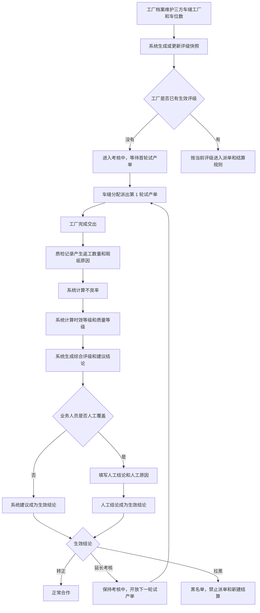
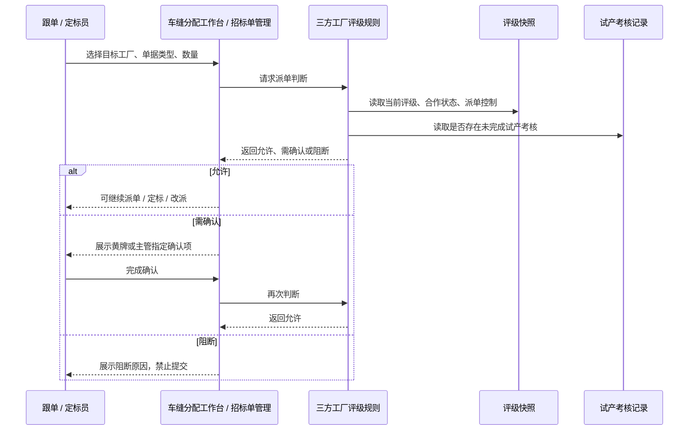
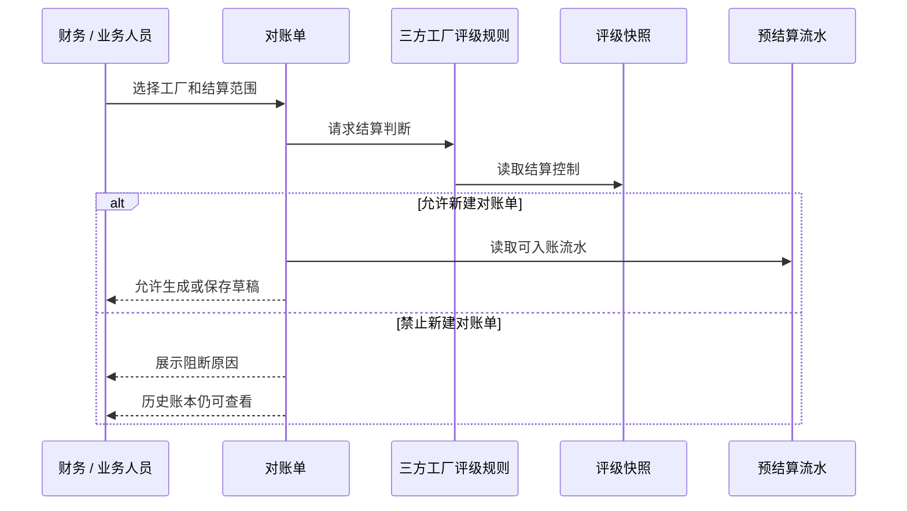
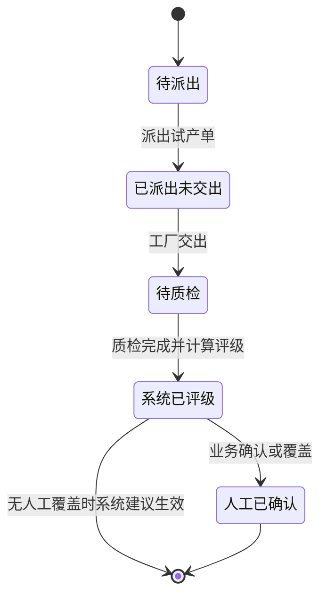
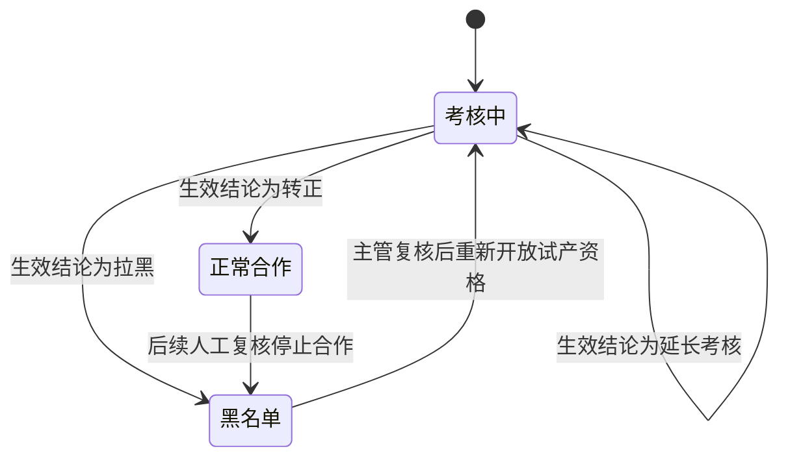

# 三方车缝工厂评级产品需求文档

日期：2026-07-18  
适用系统：FCS 工厂生产协同系统  
适用角色：工厂运营、跟单、定标员、财务、主管  
文档目标：定义三方车缝工厂评级、试产考核、派单拦截、结算拦截和相关页面调整，供研发实现正式功能。

## 1. 背景与目标

三方车缝工厂需要在正式承接车缝任务前完成试产考核。系统应根据试产单的完成时效和质检结果自动评级，并把评级结果用于后续派单、竞价定标、改派和结算控制。

本需求的核心目标：

1. 将三方车缝工厂评级从“工厂档案”中移出，作为独立菜单“三方工厂评级”管理。
2. 所有三方车缝工厂必须有评级快照，不能只覆盖部分工厂。
3. 评级结果必须来自结构化试产考核记录，不得依赖长段文案或人工随意填写。
4. 派单策略和结算策略必须是可执行规则，能在派单、竞价、改派、对账单创建时直接判断。
5. 不良率必须来自质检事实，口径为“返工数量 + 归属工厂责任的瑕疵原因数量”。
6. 支持业务人员在首次评级后手动“延长考核”，延长后允许下一轮试产单，并基于新试产单重新评级。

## 2. 业务范围

### 2.1 本期纳入

- 三方车缝工厂评级快照。
- 三方车缝工厂试产考核记录。
- 车缝车位数维护与评级同步。
- 自动评级规则。
- 人工结论覆盖规则。
- 延长考核规则。
- 派单策略规则。
- 结算策略规则。
- 评级列表、评级详情、车缝分配、派单竞价、对账单的页面联动。
- Mock 数据覆盖全部三方车缝工厂，并与车缝分配、对账单数据串联。

### 2.2 本期不纳入

- 不做真实后端接口设计。
- 不做评级规则配置后台。
- 不做规则版本管理。
- 不做独立审批流。
- 不做非三方车缝工厂评级。
- 不改变非车缝任务分配规则。

## 3. 术语定义

| 术语 | 定义 |
| --- | --- |
| 三方车缝工厂 | 工厂主档中属于第三方，且具备车缝能力的工厂。 |
| 评级快照 | 每个三方车缝工厂当前生效的评级结果，用于列表展示、派单判断和结算判断。 |
| 试产考核记录 | 某个工厂某一轮试产单的派单、交出、质检、系统评级和人工结论记录。 |
| 首单试产 | 工厂进入考核后的第 1 轮试产单。一般情况下每个工厂只有一个首单试产。 |
| 延长考核 | 首轮或上一轮试产完成后，业务人员选择继续考核。延长一次开放下一轮一个试产单。 |
| 不良数量 | 返工数量 + 工厂责任瑕疵原因数量。 |
| 不良率 | 不良数量 / 质检数量。 |
| 工厂责任瑕疵原因 | 明确归属车缝工厂责任、可计入评级不良率的瑕疵原因。 |

## 4. 页面调整清单

以下表格使用菜单名称描述，不使用代码名称或路由名称。

| 一级菜单 | 页面 / 菜单名称 | 调整内容 |
| --- | --- | --- |
| 工厂池管理 | 工厂档案 | 移除完整评级信息和“评级与派单风控”展示；保留工厂主档维护。新增或保留“车缝车位数”字段，位于入驻资料 / 产能资料相关区域，用于评级规模、试产上限和派单风控同步。 |
| 工厂池管理 | 三方工厂评级 | 新增独立页面，集中展示全部三方车缝工厂的评级快照、试产考核摘要、派单策略、结算策略和详情入口。 |
| 工厂池管理 | 工厂产能档案 | 展示车缝车位数，并说明来源于工厂档案。评级快照可读取或同步该车位数。 |
| 任务分配 | 车缝分配工作台 | 工厂候选、直接派单、改派必须读取统一派单规则；黑名单阻断，考核中仅允许试产单，黄牌和主管指定需要确认。 |
| 任务分配 | 招标单管理 | 竞价定标时读取统一派单规则；不可竞价工厂不能被选中，黄牌 / 主管指定工厂需要完成确认后才能定标。 |
| 质量与扣款 | 质检记录 | 作为评级质量事实来源。返工数量和工厂责任瑕疵原因数量参与试产不良率计算。 |
| 对账与结算 | 对账单 | 创建对账单、保存草稿、直接生成对账单时读取统一结算规则；黑名单禁止发起新结算，历史对账单仍可查看。 |
| 对账与结算 | 预结算流水 | 继续作为对账单候选来源；三方车缝工厂评级不直接修改流水金额，但结算拦截会影响能否进入新对账单。 |
| 工厂端移动应用 | 结算 | 不新增评级操作；工厂仍查看历史对账和结算结果。若工厂被黑名单，只影响新对账发起，不隐藏历史。 |

## 5. “三方工厂评级”页面需求

### 5.1 页面定位

“三方工厂评级”是管理端页面，面向工厂运营、跟单、定标员和财务。页面要回答：

- 每家三方车缝工厂当前是什么评级。
- 当前是否正常合作、考核中或黑名单。
- 当前是否允许派单。
- 当前是否允许发起新结算。
- 最近一轮试产单结果是什么。
- 评级结论是系统自动生成，还是人工覆盖。

### 5.2 首屏结构

页面首屏从上到下为：

1. 标题：三方工厂评级。
2. 筛选区。
3. 联动统计卡片。
4. 标准列表。

统计卡片必须在筛选区下方，并随当前筛选结果实时联动。

### 5.3 筛选条件

| 筛选项 | 说明 |
| --- | --- |
| 工厂名称 / 编码 | 支持按工厂名称或工厂编码模糊查询。 |
| 评级 | 全部、S 级、A 级、B 级、C 级。 |
| 合作状态 | 全部、正常合作、考核中、黑名单。 |
| 工厂规模 | 全部、大型工厂、小型工厂。 |
| 是否允许派单 | 全部、允许派单、不允许派单。 |
| 是否允许结算 | 全部、允许结算、不允许结算。 |

### 5.4 统计卡片

统计卡片必须根据筛选结果计算：

| 卡片 | 口径 |
| --- | --- |
| 全部三方车缝工厂 | 当前筛选结果中的三方车缝工厂数量。 |
| 正常合作 | 当前筛选结果中合作状态为正常合作的数量。 |
| 考核中 | 当前筛选结果中合作状态为考核中的数量。 |
| 黑名单 | 当前筛选结果中合作状态为黑名单的数量。 |
| S 级 | 当前筛选结果中当前评级为 S 的数量。 |
| A 级 | 当前筛选结果中当前评级为 A 的数量。 |
| B 级 | 当前筛选结果中当前评级为 B 的数量。 |
| C 级 | 当前筛选结果中当前评级为 C 的数量。 |

页面不得在统计卡片上方保留“随当前筛选结果实时计算”这类说明文案。

### 5.5 标准列表要求

列表必须使用标准列表页能力：

- 分页。
- 排序。
- 列显示 / 隐藏。
- 列冻结。
- 右侧固定操作列。
- 列偏好持久化。

建议列表列：

| 列名 | 内容 |
| --- | --- |
| 工厂 | 工厂名称、工厂编码。 |
| 评级 | 当前 S / A / B / C。 |
| 分数 | 当前总分和扣分摘要。 |
| 合作状态 | 正常合作、考核中、黑名单。 |
| 规模 | 大型工厂 / 小型工厂，展示车位数。 |
| 试产单情况 | 最新试产单号、生产单号、试产状态。 |
| 试产轮次 | 第 1 轮、第 2 轮、第 N 轮。 |
| 试产结论 | 完成时效、不良率、系统建议、人工结论。 |
| 派单策略 | 根据结构化派单控制生成短标签。 |
| 结算策略 | 根据结构化结算控制生成短标签。 |
| 评级原因 | 最近评级原因或人工原因摘要。 |
| 操作 | 查看评级。 |

列表不得直接展示英文状态码。

### 5.6 详情抽屉

点击“查看评级”打开详情抽屉。详情必须包含：

1. 当前评级摘要：评级、分数、合作状态、规模、车位数来源。
2. 当前派单规则：允许单据、试产上限、是否可竞价、是否需风险确认。
3. 当前结算规则：是否允许发起新对账单、历史账本是否可查看。
4. 最新试产单摘要：试产单号、生产单号、轮次、派单数量、完成状态。
5. 全部试产考核记录：按轮次倒序展示每轮试产详情。
6. 规则命中表：时效等级、质量等级、综合评级、系统建议、人工结论。

详情里必须展示“工厂责任瑕疵原因明细”，不能只展示一句“质量波动”。

## 6. 数据模型需求

### 6.1 工厂主档

工厂主档是三方车缝工厂范围和车位数的来源。

必需字段：

| 字段 | 说明 |
| --- | --- |
| 工厂 ID | 工厂唯一标识。 |
| 工厂编码 | 页面和业务识别使用。 |
| 工厂名称 | 页面展示使用。 |
| 工厂层级 | 必须能识别是否为第三方工厂。 |
| 工厂类型 / 工序能力 | 必须能识别是否具备车缝能力。 |
| 车缝车位数 | 在工厂档案 / 入驻资料 / 产能资料维护。 |
| 工厂状态 | 正常、暂停、黑名单等主档状态。 |

三方车缝工厂识别规则：

```text
工厂层级 = 第三方
且
（工厂类型 = 三方车缝工厂 或 工序能力包含车缝）
```

### 6.2 评级快照

每个三方车缝工厂必须有且只有一条当前评级快照。

必需字段：

| 字段 | 说明 |
| --- | --- |
| 工厂 ID / 编码 / 名称 | 与工厂主档一致。 |
| 车缝车位数 | 从工厂主档 / 产能资料读取或同步。 |
| 工厂规模 | 由车位数派生。 |
| 当前评级 | S / A / B / C。 |
| 当前总分 | 当前展示分。 |
| 交期扣分 | 来源于时效表现。 |
| 质量扣分 | 来源于质量表现。 |
| 人工扣分 | 来源于人工复核。 |
| 合作状态 | 正常合作、考核中、黑名单。 |
| 派单控制 | 结构化派单控制值。 |
| 结算控制 | 结构化结算控制值。 |
| 允许单据类型 | 试产单、常规单。 |
| 是否可竞价 | 是否可出现在竞价候选中。 |
| 是否需要派单风险确认 | 黄牌或主管指定场景使用。 |
| 当前考核轮次 | 最新试产考核轮次。 |
| 最新试产单 | 最新试产单号。 |
| 最新试产生产单 | 最新关联生产单。 |
| 最新试产不良率 | 最新试产考核记录派生。 |
| 最新系统建议 | 最新试产考核自动建议。 |
| 最新人工结论 | 最新人工确认结果。 |
| 是否存在未完成试产考核 | 用于阻断重复试产派单。 |

评级快照只表达当前生效状态，不保存完整试产事实。完整事实必须保存在试产考核记录中。

### 6.3 试产考核记录

每条记录代表某个三方车缝工厂的一轮试产考核。

必需字段：

| 字段 | 说明 |
| --- | --- |
| 考核记录 ID | 唯一标识。 |
| 工厂 ID / 编码 / 名称 | 与工厂主档一致。 |
| 考核轮次 | 从第 1 轮开始。 |
| 试产单号 | 本轮试产单。 |
| 关联生产单 | 本轮试产对应生产单。 |
| 试产派单数量 | 本轮派给工厂的试产数量。 |
| 计划交出时间 | 派单计划交出时间。 |
| 实际交出时间 | 工厂实际交出时间。 |
| 延期天数 | 由计划交出时间和实际交出时间计算。 |
| 质检单号 | 对应质检记录。 |
| 质检数量 | 本轮质检总数。 |
| 合格数量 | 质检合格数。 |
| 返工数量 | 质检单中的返工数量。 |
| 工厂责任瑕疵原因明细 | 原因名称 + 数量。 |
| 工厂责任瑕疵数量 | 原因明细数量合计。 |
| 不良数量 | 返工数量 + 工厂责任瑕疵数量。 |
| 不良率 | 不良数量 / 质检数量。 |
| 时效等级 | S / A / B / C。 |
| 质量等级 | S / A / B / C。 |
| 系统自动评级 | 取时效等级和质量等级中的较差等级。 |
| 系统建议结论 | 转正、延长考核、拉黑。 |
| 人工结论 | 业务人员确认或覆盖后的结论。 |
| 人工原因 | 人工覆盖时必填。 |
| 生效结论 | 人工结论优先，否则取系统建议。 |
| 记录状态 | 待派出、已派出未交出、待质检、系统已评级、人工已确认。 |

## 7. 车位数、规模与试产上限规则

车位数维护位置：

```text
工厂档案 / 入驻资料 / 产能资料
```

评级快照读取或同步该车位数。

| 条件 | 工厂规模 | 试产单上限 |
| --- | --- | --- |
| 车缝车位数 >= 30 | 大型工厂 | 1000 件 |
| 车缝车位数 < 30 | 小型工厂 | 300 件 |

规则要求：

1. 三方车缝工厂必须维护车缝车位数。
2. 车位数为空或小于等于 0 时，不允许形成可生效评级，应提示先补充产能资料。
3. 评级快照中的规模和试产上限不得手工填写，必须由车位数派生。
4. 延长考核后的下一轮试产上限仍按车位数派生。

## 8. 工厂责任瑕疵原因规则

计入评级不良率的工厂责任瑕疵原因只能是：

| 原因 | 是否计入评级不良率 |
| --- | --- |
| 做工原因 | 是 |
| 脏污 | 是 |
| 抽纱 | 是 |
| 做错 | 是 |
| 做毁 | 是 |
| 破洞 | 是 |

以下类型不得计入三方车缝工厂责任不良率：

- 布料原因。
- 色差。
- 缺辅料。
- 半套。
- 印花。
- 缺辅料不补。
- 其他未归属车缝工厂责任的原因。

Mock 数据和正式数据均不得为了演示随意新增“针距问题”“缝线不齐”“工艺问题”等字典外原因。

## 9. 不良率计算规则

输入：

- 质检数量。
- 返工数量。
- 工厂责任瑕疵原因明细。

公式：

```text
工厂责任瑕疵数量 = sum(工厂责任瑕疵原因明细.数量)

不良数量 = 返工数量 + 工厂责任瑕疵数量

不良率 = 不良数量 / 质检数量
```

边界规则：

1. 质检数量必须大于 0，才能计算不良率。
2. 未质检状态不得显示 0.0% 不良率，应显示“未质检”或“待质检”。
3. 返工数量不能小于 0。
4. 工厂责任瑕疵原因数量不能小于 0。
5. 已完成质检的试产考核记录必须满足：

```text
质检数量 = 合格数量 + 不良数量
```

## 10. 自动评级规则

### 10.1 时效等级

| 等级 | 条件 |
| --- | --- |
| S | 延期天数 <= 0 |
| A | 延期天数 <= 1 |
| B | 延期天数 <= 3 |
| C | 延期天数 > 3 |

### 10.2 质量等级

| 等级 | 条件 |
| --- | --- |
| S | 不良率 <= 2% |
| A | 不良率 <= 5% |
| B | 不良率 <= 10% |
| C | 不良率 > 10% |

### 10.3 综合评级

综合评级取时效等级和质量等级中的较差等级。

| 时效等级 | 质量等级 | 综合评级 |
| --- | --- | --- |
| S | S | S |
| S | A | A |
| A | B | B |
| B | S | B |
| C | A | C |

### 10.4 系统建议结论

| 综合评级 | 系统建议 |
| --- | --- |
| S | 转正 |
| A | 转正 |
| B | 延长考核 |
| C | 拉黑 |

系统建议必须由综合评级自动派生。

## 11. 人工结论规则

业务人员可以在系统自动评级后确认或覆盖结论。

可选人工结论：

- 转正。
- 延长考核。
- 拉黑。

规则：

1. 人工结论为空时，生效结论等于系统建议。
2. 人工结论不为空时，生效结论等于人工结论。
3. 人工结论与系统建议不一致时，必须填写人工原因。
4. 人工原因必须在评级详情中可见。
5. 人工覆盖不允许修改原始质检数量、返工数量、瑕疵原因数量和延期天数。

生效结论公式：

```text
生效结论 = 人工结论 ?? 系统建议结论
```

## 12. 延长考核规则

延长考核不是独立合作状态，也不是独立审批流。本期业务口径为：

```text
延长考核 = 继续保持考核中 + 允许下一轮一个试产单
```

规则：

1. 第 1 轮试产完成后，系统自动评级。
2. 如果系统建议或人工结论为“延长考核”，工厂继续保持“考核中”。
3. 延长考核后，下一单仍只允许“试产单”。
4. 下一轮试产上限仍按车位数派生。
5. 当前轮存在未完成试产单时，不允许重复派试产单。
6. 每延长一次，只开放下一轮一个试产单。
7. 下一轮试产完成并质检后，系统重新评级。
8. 延长考核允许多次，每一轮都必须保留独立试产考核记录。

示例：

| 轮次 | 试产结果 | 生效结论 | 下一步 |
| --- | --- | --- | --- |
| 第 1 轮 | 综合评级 B | 延长考核 | 允许第 2 轮试产单 |
| 第 2 轮 | 综合评级 B，人工仍延长 | 延长考核 | 允许第 3 轮试产单 |
| 第 3 轮 | 综合评级 A | 转正 | 进入正常合作 |

## 13. 合作状态派生规则

| 生效结论 | 合作状态 | 派单控制 | 结算控制 |
| --- | --- | --- | --- |
| 转正 | 正常合作 | 按当前评级派生 | 允许新建对账单 |
| 延长考核 | 考核中 | 仅试产单 | 允许新建对账单 |
| 拉黑 | 黑名单 | 禁止派单 | 禁止新建对账单，历史可查看 |

如果没有已生效试产结论，只允许展示为“考核中”，并根据试产记录状态展示“待派出”“已派出未交出”或“待质检”。

## 14. 派单策略规则

派单判断必须读取结构化派单控制，不能读取策略文案。

### 14.1 派单输入

每次派单、竞价定标或改派时，规则引擎至少需要以下输入：

| 输入 | 说明 |
| --- | --- |
| 工厂 | 目标工厂。 |
| 动作类型 | 直接派单或发起竞价。 |
| 单据类型 | 试产单或常规单。 |
| 派单数量 | 本次派单数量。 |
| 是否急单 | 是否为赶单 / 急单。 |
| 是否已确认风险 | 黄牌或无评级场景使用。 |
| 是否主管指定 | 主管指定工厂场景使用。 |

### 14.2 派单控制表

| 派单控制 | 适用场景 | 是否允许派单 | 是否可竞价 | 规则 |
| --- | --- | --- | --- | --- |
| 优先派单 | S 级正常合作 | 允许 | 允许 | 排序靠前，可承接常规单、大货和急单。 |
| 正常可选 | A 级正常合作 | 允许 | 允许 | 可承接试产单和常规单。 |
| 黄牌确认 | B 级正常合作 | 确认后允许 | 允许 | 派单前必须确认交期余量和质量风险；建议小单和非急单。 |
| 仅试产单 | 考核中或延长考核中 | 条件允许 | 允许试产候选 | 只能接试产单，不能接常规单；数量不得超过试产上限；有未完成试产时阻断。 |
| 主管指定 | 人工指定合作工厂 | 主管确认后允许 | 不允许 | 只能直接派单，不参与竞价；必须有主管指定确认。 |
| 禁止派单 | 黑名单或暂停合作 | 不允许 | 不允许 | 不允许在车缝分配、竞价定标、改派中选择。 |

### 14.3 阻断与确认规则

| 场景 | 结果 | 提示口径 |
| --- | --- | --- |
| 派单数量 <= 0 | 阻断 | 派单数量必须大于 0。 |
| 三方车缝工厂缺少评级快照 | 阻断或需主管确认 | 治理范围内缺评级快照时应提示先完成评级；特殊兜底必须主管确认。 |
| 黑名单工厂 | 阻断 | 禁止派单，不允许在车缝分配中选择。 |
| 考核中工厂接常规单 | 阻断 | 该工厂还在考核中，只能接试产单。 |
| 考核中工厂试产数量超过上限 | 阻断 | 本次派单数量超过试产上限。 |
| 考核中工厂已有未完成试产单 | 阻断 | 当前轮已有未完成试产单，不能重复派试产单。 |
| 主管指定工厂参与竞价 | 阻断 | 该工厂不参与竞价，只能主管指定派单。 |
| 主管指定工厂直接派单但未确认 | 需确认 | 需要主管指定确认后才能派单。 |
| 黄牌工厂派单但未确认风险 | 需确认 | 需要确认交期余量和质量风险。 |
| 黄牌工厂已确认风险 | 允许 | 黄牌风险已确认，可以派单。 |

### 14.4 候选排序规则

候选工厂排序建议：

| 类型 | 排序优先级 |
| --- | --- |
| S 级优先派单 | 最高 |
| 考核中且满足试产规则 | 中高 |
| A 级正常可选 | 中 |
| 主管指定 | 中低 |
| B 级黄牌 | 低 |
| 未评级但已人工确认 | 很低 |
| 黑名单 / 阻断 | 不进入可选候选 |

## 15. 结算策略规则

结算判断必须读取结构化结算控制，不能读取策略文案。

### 15.1 结算控制表

| 结算控制 | 适用场景 | 是否允许新建对账单 | 历史账本是否可查看 | 规则 |
| --- | --- | --- | --- | --- |
| 允许结算 | 正常合作、考核中、延长考核中 | 允许 | 可查看 | 可按账本发起结算。 |
| 禁止新建对账单 | 黑名单 | 不允许 | 可查看 | 禁止发起新结算，历史账本仅保留查看。 |

### 15.2 对账单应用点

以下动作必须执行结算规则：

1. 进入对账单新建页，选择工厂和周期时。
2. 生成对账单时。
3. 保存对账单草稿时。
4. 从候选流水直接创建对账单时。

黑名单工厂可以展示待生成范围和历史记录，用于说明为什么被拦截，但不得生成新的对账单。

## 16. 试产考核流程



## 17. 派单规则时序



## 18. 结算规则时序



## 19. 状态图

### 19.1 试产考核记录状态



### 19.2 工厂合作状态



黑名单恢复不属于本期主流程，但状态图保留业务方向。若后续实现，必须重新生成试产考核记录，不得直接恢复常规派单。

## 20. Mock 数据要求

Mock 数据必须覆盖：

1. 全部三方车缝工厂，当前口径为 11 家。
2. 每家三方车缝工厂都有评级快照。
3. 每家三方车缝工厂至少有一条试产考核记录，未开始试产的工厂也要有“待派出”记录。
4. 至少覆盖 S / A / B / C 四类评级。
5. 至少覆盖正常合作、考核中、黑名单三类合作状态。
6. 至少覆盖首轮转正、首轮拉黑、首轮延长、延长后重新评级、多次延长。
7. 至少覆盖待派出、已派出未交出、待质检、系统已评级、人工已确认。
8. 车缝分配候选中能看到这些工厂，并能触发允许、需确认、阻断三类结果。
9. 对账单或待生成对账候选中能串联到这些工厂，用于验证结算允许和结算阻断。
10. 质检明细中的工厂责任瑕疵原因只允许使用“做工原因、脏污、抽纱、做错、做毁、破洞”。

禁止：

- 只维护部分三方车缝工厂评级。
- 用自然语言模拟规则结果。
- 使用字典外瑕疵原因。
- 未质检记录显示 0.0% 不良率。
- 黑名单工厂仍可新建对账单。
- 考核中工厂仍可接常规单。

## 21. 验收标准

### 21.1 数据完整性

- 工厂主档中全部三方车缝工厂均有评级快照。
- 评级快照的工厂名称、编码与工厂主档一致。
- 评级快照的车位数从工厂档案 / 产能资料读取。
- 评级快照的规模和试产上限由车位数派生。
- 每家三方车缝工厂均有关联试产考核记录。
- 每个工厂每个轮次最多一个试产单。

### 21.2 规则正确性

- 不良数量 = 返工数量 + 工厂责任瑕疵数量。
- 不良率 = 不良数量 / 质检数量。
- 工厂责任瑕疵原因只允许使用 6 个指定原因。
- 自动评级按时效等级和质量等级取较差等级。
- 系统建议按综合评级派生。
- 人工覆盖必须有人工原因。
- 延长考核后仍是考核中，只能继续派试产单。

### 21.3 页面可见性

- “工厂档案”不再展示完整评级与派单风控面板。
- “工厂档案”可维护车缝车位数。
- “工厂产能档案”可展示车缝车位数。
- “三方工厂评级”列表展示试产单情况、试产轮次、不良率、系统建议、人工结论。
- “三方工厂评级”详情展示全部试产考核记录和工厂责任瑕疵原因明细。
- 页面不展示英文状态码。

### 21.4 交互可达性

- 筛选条件可提交，统计卡片随筛选结果变化。
- 标准列表支持分页、排序、列设置和右侧固定操作列。
- 列设置关闭按钮和关闭图标均可关闭。
- 点击“查看评级”可打开详情。
- 车缝分配和改派页面能看到规则结果、阻断原因和确认入口。
- 招标单管理定标时能看到规则结果、阻断原因和确认入口。

### 21.5 业务闭环

- 考核中工厂只能派试产单。
- 考核中工厂试产数量超过上限时阻断。
- 当前轮有未完成试产单时阻断重复试产。
- B 级黄牌工厂必须确认风险后才允许派单。
- 主管指定工厂不参与竞价，直接派单必须主管确认。
- 黑名单工厂禁止派单、竞价定标和改派。
- 黑名单工厂禁止新建对账单。
- 黑名单工厂历史账本仍可查看。
- 延长考核后的新试产单完成后可重新评级并更新评级快照。

## 22. 研发实现建议

1. 将“试产考核记录”和“评级快照”作为两个独立对象。
2. 评级快照只读取最新生效结果，不直接承载所有试产事实。
3. 派单和结算判断统一走规则函数或规则服务，页面只消费判断结果。
4. 页面展示文案由结构化规则结果生成，不能反向用文案做业务判断。
5. 工厂责任瑕疵原因应使用统一字典，质检、评级、结算口径保持一致。
6. 每次新增三方车缝工厂时，必须同步创建或初始化评级快照和首轮试产考核记录。
7. 后续若增加规则配置页，应保留规则版本和生效时间，避免历史评级被新规则反算。

## 23. 自检清单

| 检查项 | 结论 |
| --- | --- |
| 是否详尽说明规则、策略 | 已覆盖车位、试产、不良率、自动评级、人工覆盖、延长考核、派单、结算。 |
| 是否标明涉及页面及调整 | 已按菜单名称列出所有涉及页面和调整内容。 |
| 是否包含流程图 | 已包含试产考核流程图。 |
| 是否包含时序图 | 已包含派单规则时序图和结算规则时序图。 |
| 是否包含状态图 | 已包含试产考核记录状态图和工厂合作状态图。 |
| 是否避免规则依赖长段文案 | 已明确规则必须读取结构化字段 / 规则结果。 |
| 是否明确不良率口径 | 已明确返工数量 + 工厂责任瑕疵原因数量。 |
| 是否明确延长考核口径 | 已明确延长考核是继续保持考核中并开放下一轮试产。 |
| 是否覆盖 Mock 数据要求 | 已明确 11 家三方车缝工厂全部覆盖并串联车缝分配、对账单。 |
