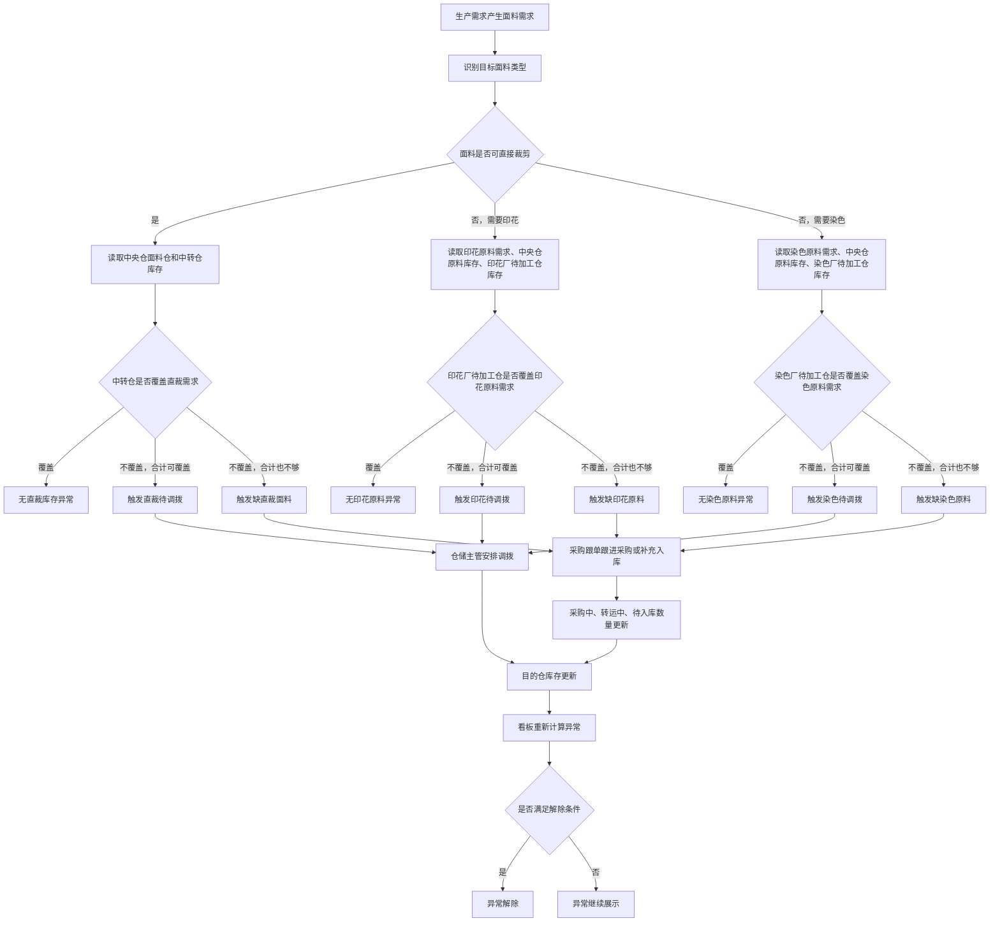
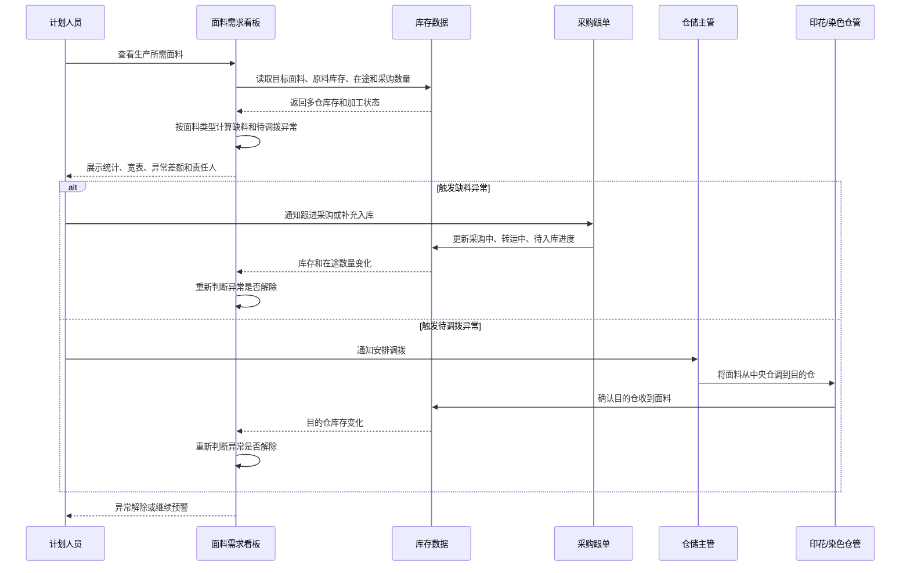
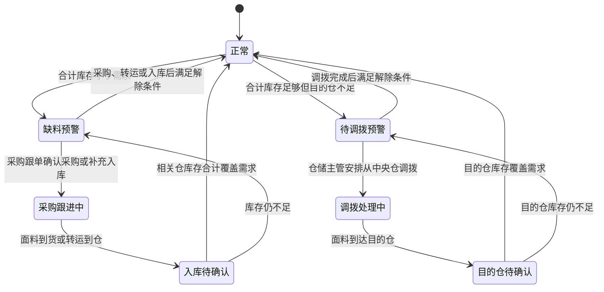

# 仓储管理 - 面料需求看板产品说明文档

## 1. 文档目的

本文档用于说明「仓储管理 - 面料需求看板」的业务目标、页面结构、数据口径、异常规则和研发落地边界，供产品、研发、测试、仓储、计划、采购、印花厂、染色厂协同使用。

本看板不是仓库执行页，也不是调拨单或采购单创建页。它的定位是：帮助仓储主管和计划人员在同一个页面判断面料是否够用、缺的是哪一种面料、应由谁处理、异常在什么条件下解除。

## 2. 业务背景

生产前置阶段中，面料需求会同时涉及直裁面料、印花面料、染色面料和加工前原料。不同类型面料的库存判断口径不同：

- 直裁面料：目标面料可以直接用于裁片，重点看中央仓面料仓和中转仓。
- 印花面料：最终用于生产的是印花后的目标面料，但异常判断时还要看用于印花的原料面料。
- 染色面料：最终用于生产的是染色后的目标面料，但异常判断时还要看用于染色的原料面料。

如果只展示一个库存数量，用户无法判断是缺目标面料、缺印花原料、缺染色原料，还是已有库存但没有调拨到正确目的仓。因此需要一个面料需求看板，把多仓库存、原料库存、加工在途、采购在途和异常规则放在同一张宽表中。

## 3. 使用角色

| 角色 | 主要关注点 | 典型动作 |
| --- | --- | --- |
| 仓储主管 | 哪些面料缺货、哪些库存需要调拨、哪个仓负责处理 | 查看异常，安排调拨，跟进目的仓库存 |
| 计划人员 | 生产需求是否被库存覆盖，是否影响开裁、印花、染色 | 查看缺口，判断是否影响生产计划 |
| 采购跟单 | 缺料是否需要采购，采购中、转运中、待入库数量是否足够 | 跟进采购和入库 |
| 印花仓管 | 印花原料是否到达印花厂待加工仓 | 接收调拨，确认待加工仓库存 |
| 染色仓管 | 染色原料是否到达染色厂待加工仓 | 接收调拨，确认待加工仓库存 |
| 裁床 / 中转仓仓管 | 直裁面料是否到达中转仓 | 接收调拨，支持开裁 |

## 4. 页面入口和页面定位

- 所属系统：仓储物流系统。
- 所属模块：仓储管理。
- 页面名称：面料需求看板。
- 推荐页面顺序：搜索筛选区 → 数据统计区 → 数据列表区。
- 页面模式：管理端 / 主管端宽表看板。
- 不包含的范围：不创建采购单、不创建调拨单、不执行入库、不执行出库、不替代仓库 PDA 操作。

## 5. 页面整体结构

### 5.1 搜索筛选区

搜索筛选区用于快速缩小看板范围，筛选条件和「重置」「筛选」按钮应放在同一行，减少首屏高度占用。

必须支持的筛选条件：

| 条件 | 说明 |
| --- | --- |
| 关键词 | 支持按面料名称、面料编号、面料 SPU 搜索 |
| 面料类型 | 全部、直裁面料、印花面料、染色面料 |
| 是否需印花 | 全部、需印花、不需印花 |
| 是否需染色 | 全部、需染色、不需染色 |
| 异常类型 | 全部、缺直裁面料、缺印花原料、缺染色原料、直裁待调拨、印花待调拨、染色待调拨 |
| 仓库 / 目的仓 | 全部、中央仓面料仓、中转仓、印花厂待加工仓、染色厂待加工仓 |

交互要求：

- 点击「筛选」后刷新统计区和数据列表。
- 点击「重置」后清空所有筛选条件。
- 筛选后列表分页回到第一页。
- 搜索区不承担业务解释功能，业务规则应在异常预警中直接展示。

### 5.2 数据统计区

统计区用于展示当前筛选结果的汇总，不展示全量数据。统计项必须跟随筛选条件变化。

必须展示的统计项：

| 统计项 | 业务口径 |
| --- | --- |
| 总数 | 当前筛选结果中的目标面料数量 |
| 印染数量 | 当前筛选结果中需要印花或需要染色的目标面料数量 |
| 直裁数量 | 当前筛选结果中不需要印花且不需要染色的目标面料数量 |
| 印花中 Yard | 已被印花厂领取，正在印花中的面料长度 |
| 染色中 Yard | 已被染色厂领取，正在染色中的面料长度 |
| 裁剪中 Yard | 已到中转仓并可支持裁剪的直裁面料长度 |
| 采购中 Yard | 当前仍处于采购中的面料长度 |
| 库存数量 | 当前筛选结果中所有相关仓库的库存长度合计 |

数量展示要求：

- 所有面料长度单位统一为 Yard。
- 所有数量必须同时展示卷数。
- 页面不得只展示长度，不展示卷数。
- 页面不得把 Yard 和米混用。

展示示例：

> 560 Yard / 6 卷

### 5.3 数据列表区

数据列表区采用宽表展示。宽表必须分页，即使当前数据量较少也必须保留分页控件。

分页要求：

- 默认每页展示 5 条。
- 支持上一页、下一页。
- 支持查看当前展示范围和总条数。
- 支持切换每页条数。
- 筛选条件变化后回到第一页。

宽表列结构：

| 列 | 展示内容 | 说明 |
| --- | --- | --- |
| 面料信息 | 面料图片、面料名称、面料 SPU、面料编号、面料类型、是否需印花、是否需染色 | 用于识别当前行代表哪一种目标面料 |
| 多仓库存 | 仓库名称、库存 Yard、库存卷数、总库存 | 不展示仓库库位 |
| 原料库存 | 原料面料名称、原料面料编号、原料需求、中央仓库存、目的仓库存、覆盖情况 | 仅印花和染色面料需要重点展示 |
| 印花数据 | 待领料、印花中、待入库 | 只展示数量和卷数 |
| 染色数据 | 待领料、染色中、待入库 | 只展示数量和卷数 |
| 采购数据 | 采购中、转运中、待入库 | 只展示数量和卷数 |
| 异常预警 | 异常类型、差额、触发规则、责任人、解除条件 | 必须让用户看懂为什么异常、谁处理、如何解除 |

## 6. 数量和卷数口径

### 6.1 统一单位

所有面料相关数量统一使用 Yard。页面中不允许出现以米为单位的面料数量。

适用范围包括：

- 多仓库存。
- 原料库存。
- 原料需求。
- 印花待领料、印花中、印花待入库。
- 染色待领料、染色中、染色待入库。
- 采购中、转运中、待入库。
- 异常差额。
- 统计卡片。

### 6.2 卷数展示

每一个面料数量必须同时展示卷数。

研发落地时，卷数应优先来自真实库存卷明细、入库卷记录、采购卷记录或加工交接卷记录。不能只按长度粗略换算替代真实卷数。

如果早期只有长度数据，允许先使用统一换算口径生成演示卷数，但页面和后续接口必须保留真实卷数接入位置。

### 6.3 多仓库存不展示库位

多仓库存只展示仓库名称和库存数量，不展示具体库位。

原因：

- 本看板用于主管判断库存覆盖和调拨方向，不用于仓库人员拣货。
- 库位会占用宽表空间，影响主管扫描。
- 真正需要库位时，应进入库存明细或 PDA 执行页查看。

## 7. 面料类型和库存判断口径

### 7.1 直裁面料

直裁面料是可以直接用于裁片的目标面料。

重点判断：

- 中转仓是否有足够库存支持开裁。
- 中央仓面料仓是否有库存可调拨到中转仓。
- 中央仓面料仓和中转仓合计是否覆盖直裁需求。

直裁调拨含义：

> 将面料从中央仓面料仓调拨到中转仓。

### 7.2 印花面料

印花面料的最终目标面料需要经过印花加工。判断异常时不能只看最终目标面料，还必须看印花原料面料。

重点判断：

- 印花厂待加工仓是否有足够原料支持印花。
- 中央仓面料仓是否有原料可调拨到印花厂待加工仓。
- 中央仓面料仓和印花厂待加工仓合计是否覆盖印花原料需求。

印花调拨含义：

> 将面料原料从中央仓面料仓调拨到印花厂待加工仓。

### 7.3 染色面料

染色面料的最终目标面料需要经过染色加工。判断异常时不能只看最终目标面料，还必须看染色原料面料。

重点判断：

- 染色厂待加工仓是否有足够原料支持染色。
- 中央仓面料仓是否有原料可调拨到染色厂待加工仓。
- 中央仓面料仓和染色厂待加工仓合计是否覆盖染色原料需求。

染色调拨含义：

> 将面料原料从中央仓面料仓调拨到染色厂待加工仓。

## 8. 异常预警规则

异常预警必须清晰展示触发条件、差额、责任人和解除条件。异常规则不能只写「缺面料」或「待调拨」。

### 8.1 缺直裁面料

触发条件：

- 中央仓面料仓库存 + 中转仓库存 < 直裁需求。

业务含义：

- 两个相关仓合计都不够，单靠调拨不能解决，需要采购或补充入库。

差额口径：

- 直裁需求 - 中央仓面料仓库存 - 中转仓库存。

责任人：

- 采购跟单为主，仓储主管协同。

解除条件：

- 中央仓面料仓库存 + 中转仓库存 ≥ 直裁需求。

### 8.2 直裁待调拨

触发条件：

- 中转仓库存 < 直裁需求。
- 中央仓面料仓有库存。
- 中央仓面料仓库存 + 中转仓库存 ≥ 直裁需求。

业务含义：

- 面料总量够，但没有到达裁剪所需的中转仓。

调拨方向：

- 中央仓面料仓 → 中转仓。

差额口径：

- 直裁需求 - 中转仓库存。

责任人：

- 仓储主管。

解除条件：

- 中转仓库存 ≥ 直裁需求。

### 8.3 缺印花原料

触发条件：

- 中央仓面料仓原料库存 + 印花厂待加工仓原料库存 < 印花原料需求。

业务含义：

- 印花原料总量不够，单靠调拨不能解决，需要采购或补充入库。

差额口径：

- 印花原料需求 - 中央仓面料仓原料库存 - 印花厂待加工仓原料库存。

责任人：

- 采购跟单为主，印花仓管和仓储主管协同。

解除条件：

- 中央仓面料仓原料库存 + 印花厂待加工仓原料库存 ≥ 印花原料需求。

### 8.4 印花待调拨

触发条件：

- 印花厂待加工仓原料库存 < 印花原料需求。
- 中央仓面料仓有原料库存。
- 中央仓面料仓原料库存 + 印花厂待加工仓原料库存 ≥ 印花原料需求。

业务含义：

- 印花原料总量够，但没有到达印花厂待加工仓。

调拨方向：

- 中央仓面料仓 → 印花厂待加工仓。

差额口径：

- 印花原料需求 - 印花厂待加工仓原料库存。

责任人：

- 印花仓管和仓储主管。

解除条件：

- 印花厂待加工仓原料库存 ≥ 印花原料需求。

### 8.5 缺染色原料

触发条件：

- 中央仓面料仓原料库存 + 染色厂待加工仓原料库存 < 染色原料需求。

业务含义：

- 染色原料总量不够，单靠调拨不能解决，需要采购或补充入库。

差额口径：

- 染色原料需求 - 中央仓面料仓原料库存 - 染色厂待加工仓原料库存。

责任人：

- 采购跟单为主，染色仓管和仓储主管协同。

解除条件：

- 中央仓面料仓原料库存 + 染色厂待加工仓原料库存 ≥ 染色原料需求。

### 8.6 染色待调拨

触发条件：

- 染色厂待加工仓原料库存 < 染色原料需求。
- 中央仓面料仓有原料库存。
- 中央仓面料仓原料库存 + 染色厂待加工仓原料库存 ≥ 染色原料需求。

业务含义：

- 染色原料总量够，但没有到达染色厂待加工仓。

调拨方向：

- 中央仓面料仓 → 染色厂待加工仓。

差额口径：

- 染色原料需求 - 染色厂待加工仓原料库存。

责任人：

- 染色仓管和仓储主管。

解除条件：

- 染色厂待加工仓原料库存 ≥ 染色原料需求。

## 9. 业务流程图

## 10. 业务时序图

## 11. 异常状态图

## 12. 关键页面规则

### 12.1 搜索和分页

- 搜索筛选区必须在统计区之前。
- 统计区必须在数据列表之前。
- 数据列表必须分页。
- 任何筛选条件变化后，分页必须回到第一页。
- 如果筛选结果为空，列表区展示空状态，不隐藏统计区。

### 12.2 数量显示

- 数量不能只显示数字。
- 数量不能只显示 Yard。
- 必须同时显示 Yard 和卷数。
- 差额也必须显示 Yard 和卷数。
- 0 数量也必须显示为 0 Yard / 0 卷，不能留空。

### 12.3 多仓库存

- 多仓库存可以展示多个仓库。
- 不展示库位。
- 每个仓库展示仓库名称、库存 Yard、库存卷数。
- 总库存展示在仓库明细上方。

### 12.4 原料库存

- 直裁面料可展示「不涉及印花 / 染色原料转换」。
- 印花面料必须展示印花原料库存。
- 染色面料必须展示染色原料库存。
- 原料库存需要区分中央仓面料仓和目的仓。
- 原料覆盖说明必须展示是否已覆盖需求，不能只展示数字。

### 12.5 异常预警

- 异常必须展示异常名称。
- 异常必须展示差额。
- 异常必须展示触发原因。
- 异常必须展示责任人。
- 异常必须展示解除条件。
- 待调拨异常必须展示调拨方向。

## 13. 验收标准

### 13.1 页面结构验收

- 页面顺序为：搜索筛选区 → 数据统计区 → 数据列表区。
- 搜索条件和「重置」「筛选」按钮在同一行展示，空间不足时允许换行。
- 数据列表是宽表展示。
- 数据列表有分页。

### 13.2 数量口径验收

- 页面所有面料数量均展示 Yard。
- 页面所有面料数量均展示卷数。
- 页面不出现以米为单位的面料数量。
- 统计卡片、库存、原料、加工、采购、异常差额的单位一致。

### 13.3 库存展示验收

- 多仓库存展示多个仓库时，只展示仓库名称和数量。
- 多仓库存不展示库位。
- 同一面料存在多个仓库库存时，总库存等于各仓库存合计。

### 13.4 异常规则验收

- 六类异常都能在测试数据中出现。
- 每类异常都有明确触发条件。
- 每类异常都有明确解除条件。
- 待调拨异常展示调拨方向。
- 缺料异常和待调拨异常不能混淆。

### 13.5 业务语义验收

- 直裁面料缺口按目标面料判断。
- 印花面料缺口按印花原料判断。
- 染色面料缺口按染色原料判断。
- 页面不能把印花 / 染色原料误展示成已可直接裁剪的目标面料。

## 14. 不在本期范围

本期不做以下内容：

- 不创建真实调拨单。
- 不创建真实采购单。
- 不做 PDA 拣货、收货、扫码执行。
- 不展示仓库库位。
- 不展示完整库存流水。
- 不做真实权限控制。
- 不做异常处理审批流。

后续如果要扩展执行能力，应单独设计「调拨执行」「采购跟进」「到货入库」「PDA 收发」等页面，并补充扫码识别、责任交接、操作记录和异常兜底。

## 15. 研发落地注意事项

- 页面展示的卷数应来自真实卷明细或业务确认的卷数口径。
- 如果库存系统暂时只有 Yard 长度，必须在数据对接方案中明确临时卷数口径，并预留后续替换为真实卷明细的能力。
- 看板只负责展示和判断，不直接改库存。
- 异常解除依赖库存、采购、转运、入库、调拨结果变化后重新计算。
- 相同业务口径在统计区和列表区必须一致，不能出现统计区已覆盖但列表区仍报警的情况。

