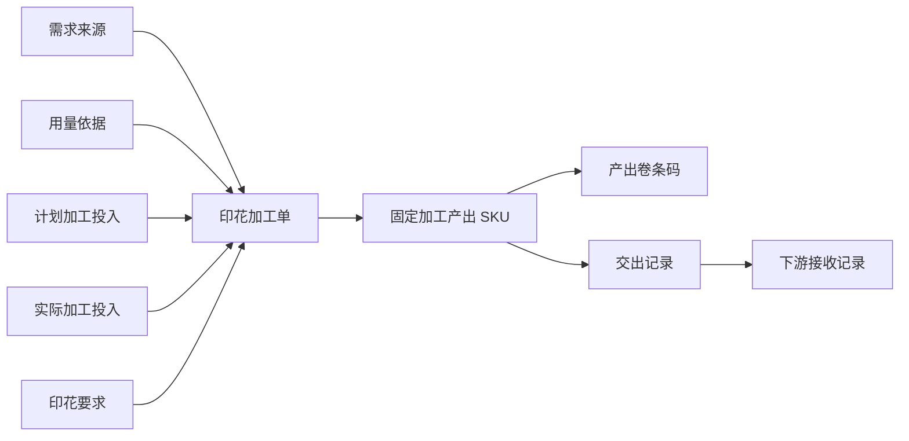
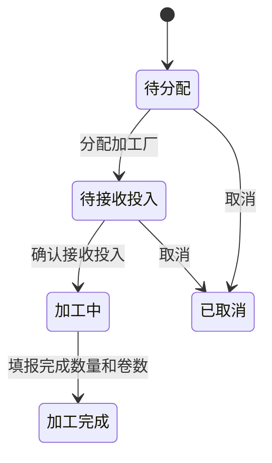
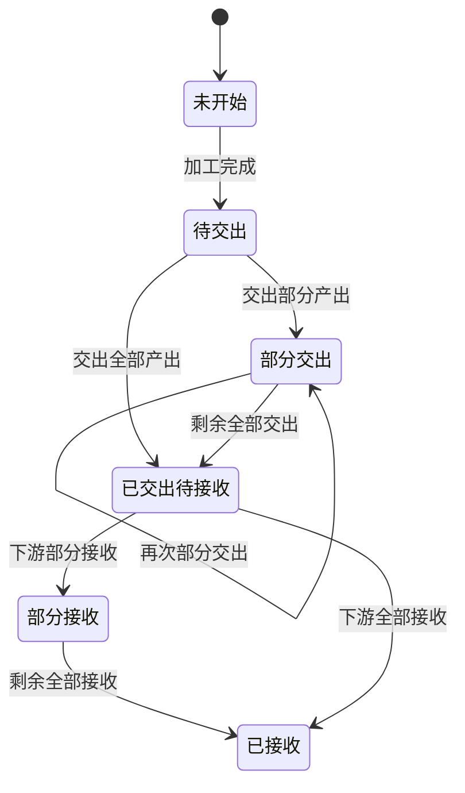

# 印花加工单：需求来源、加工投入、加工产出与双状态产品需求说明

> 版本：2026-08-10 实施版
> 适用范围：面料印花加工单
> 命名页面：`/fcs/craft/printing/work-orders`
> 本文是本次原型实现和验收的业务依据，不把原型 Mock 表述为线上真实数据。

## 1. 背景与目标

现有印花加工单把来源、面料、数量、打印/转印进度、交出和下游确认混在一组字段与一套状态中，存在四个直接问题：

1. 无法清楚回答“为什么加工、实际收到什么、最终交出什么”。
2. 计划投入与实际投入没有独立事实，现场临时换面料后缺少可追溯记录。
3. 加工进度与交出/接收进度揉在一起，`待审核` 等词无法表达真实的下游清点接收动作。
4. 线上已有的信息单、确认单和卷条码打印没有形成一套清晰的打印职责。

本次目标是以印花加工单作为统一加工单结构的第一个完整模板：结构统一，但仍保留印花业务自己的花型、印花面别、打印/转印纸面记录与卷条码特性。

## 2. 范围与非范围

### 2.1 本次范围

- 面料印花加工单列表与详情。
- 需求来源、加工投入、印花要求、加工产出、执行数量、交出与接收。
- 计划投入、实际接收投入、实际使用投入和投入变更记录。
- 加工状态与交出状态双状态。
- 印花信息单、印花确认单、加工产出卷条码。
- 款式、投入面料、产出面料、正反面花型的真实图片缩略图、失败态和高清大图。

### 2.2 非范围

- 不设计裁片印花，不创建裁片 SKU。
- 不把印花测试、等花型米样、等打印、等转印拆成系统必填状态。
- 不要求现场维护损耗；历史损耗仅兼容展示与导出。
- 不把线上行数、汇总数字或示例单号视为业务规则。
- 不保留或解释 `Edit confirmation`，印花确认单中移除该字段。
- 不实现真实接口、数据库、打印机驱动或库存扣减。

## 3. 业务对象与关系

### 3.1 需求来源

需求来源回答“为什么创建这张印花加工单”，只允许四类：

| 类型 | 典型单据 | 业务说明 |
| --- | --- | --- |
| 生产 | 需求单、生产单、技术包/BOM | 为某次生产履约准备印花面料 |
| 采购 | 采购单/采购需求 | 采购目标本身要求取得印花成品面料 |
| 备货 | 备货计划 | 在没有具体生产单消耗前形成可用库存 |
| 补料 | 补料单、原生产单 | 为原生产需求补充不足的印花面料 |

需求来源不是物料来源。加工投入还要单独记录来自哪个仓库、采购到货或上游加工交出。

### 3.2 加工投入

加工投入必须把对象类型和对象绑定展示。本次对象类型固定为“面料”，但仍需显式保存和展示：

- 对象类型：面料。
- 面料名称、面料 SPU、SKU、真实图片。
- 计划投入数量与单位。
- 实际接收 SKU、接收数量、卷数、接收人、接收时间。
- 实际使用数量、卷数。
- 标准单位用量、加工单单位用量及计算依据。
- 物料来源仓/到货来源、当前库存、待印数量。

计划投入与实际投入可以不同；差异必须通过投入变更记录解释，不能静默覆盖。

### 3.3 印花要求

- 工艺名称、类型、深浅、温度。
- 印花面别：单面/双面。
- 正面花型及图片；双面时增加里面花型及图片。
- 花型编号/版本是加工要求，不代替加工产出 SKU。

### 3.4 加工产出

每张印花加工单创建时必须固定一个加工产出：

- 对象类型：面料。
- 面料名称、面料 SPU、产出 SKU、真实图片。
- 计划完成数量、实际完成数量、完成卷数。
- 产出 SKU 不因投入换料而自动变化。
- 同一 SKU 可以经历不同加工状态；状态不编码进 SKU。

加工产出不拆“计划产出对象”和“实际产出对象”。对象唯一，执行时只补实际数量、卷数和条码。

## 4. 数量、单位与精度

### 4.1 用量模型

生产/补料来源通常按用量计算：

`计划投入数量 = 需求基数 × 加工单单位用量`

- 需求基数：件、套或需求单明确单位。
- 标准单位用量：来自 BOM/技术包，仅作为基准。
- 加工单单位用量：本加工单最终采用的用量，可因面料规格或现场决定调整。
- 采购/备货允许直接填写计划投入数量，但不能用 0 伪造单位用量。

### 4.2 换算与精度

- `Meter = Yard × 0.9144`。
- `KG = Meter × 幅宽(cm) ÷ 100 × 克重(g/㎡) ÷ 1000`。
- Yard、Meter：保留 2 位小数。
- KG：保留 3 位小数。
- 单位用量：最多 4 位小数。
- 卷数：整数。

### 4.3 数量约束

- 实际使用数量不得超过累计实际接收数量。
- 完成数量不得超过实际使用数量。
- 累计交出不得超过完成数量。
- 累计接收不得超过累计交出。
- 差异与异议单独记录，不改变加工完成事实。

## 5. 加工投入调整

### 5.1 允许时点

- 尚未产生完成数量：允许整单调整计划/实际投入。
- 已产生完成数量：禁止整单替换；已完成部分保持原事实，剩余数量拆新加工单处理。

### 5.2 调整内容

投入调整必须同时记录：

- 原投入 SKU 与新投入 SKU、对象类型、图片。
- 原/新标准单位用量、原/新加工单单位用量。
- 原/新计划投入数量及单位。
- 变更原因、操作人、操作时间。

同规格替换可以沿用加工单单位用量；跨规格替换必须重新确认加工单单位用量并重算计划投入。

### 5.3 打印影响

- 投入发生变化后，印花信息单与印花确认单提示重新打印。
- 若加工产出 SKU 未变，已生成的产出卷条码不作废。
- 投入调整不得联动修改加工产出 SKU。

## 6. 双状态模型

### 6.1 加工状态

加工状态仅保留：待分配、待接收投入、加工中、加工完成、已取消。

### 6.2 交出状态

交出状态仅保留：未开始、待交出、部分交出、已交出待接收、部分接收、已接收。

### 6.3 完成判定

业务“已完成”是派生结果，不是第三套手工状态。条件为：

1. 加工状态为加工完成。
2. 全部交出记录已接收或按业务关闭。
3. 没有未处理异议。

### 6.4 历史状态

历史 `等打印`、`等转印`、`待审核`、`部分入库` 等只读展示为“历史进度提示”。其中：

- `待审核` 映射为加工完成 + 已交出待接收，业务动作是下游接收，不再叫审核。
- `部分入库` 映射为加工完成 + 部分接收。
- 等花型/样品/打印/转印不再要求现场逐项变更。

## 7. 页面设计

### 7.1 列表筛选

- 综合查询：印花单、任务、需求、生产、采购、备货、补料、商品 SPU、物料 SPU、计划/实际投入 SKU、产出 SKU、交出单、卷条码。
- 加工状态、交出状态、历史状态、需求来源、售卖类型、加工厂、工艺、接收人、物料类型、是否换料、是否历史补料、创建方式、是否存在差异/异议。
- 时间类型：下单、投入接收、加工完成、交出、下游接收；支持起止日期。

### 7.2 列表汇总

- 印花加工单数量。
- 计划投入数量。
- 实际使用数量。
- 完成数量。
- 已交出数量。
- 已接收数量。

不展示或解释线上“采购单数量 572”。

### 7.3 列表字段

固定列：印花加工单、加工投入、加工产出、加工状态、交出状态、操作。其他列允许显示/隐藏和排序。

| 列 | 字段 |
| --- | --- |
| 印花加工单 | 印花单、任务、需求、生产、售卖、创建方式、历史进度提示 |
| 商品信息 | 商品 SPU、真实图片 |
| 需求来源 | 来源类型/单号、投入供料来源、仓库与库存快照 |
| 加工投入 | 对象类型、图片、名称、SPU、计划 SKU、实际 SKU、换料标记、当前库存、待印数量 |
| 印花要求 | 工艺、类型、深浅、温度、面别、正面/里面花型及图片 |
| 加工产出 | 对象类型、图片、名称、SPU、固定产出 SKU |
| 数量进度 | 需求基数、标准/加工单单位用量、计划投入、实际接收/使用、完成、卷数、历史损耗 |
| 加工厂/时间 | 加工厂、下单、接收、完成、交货时间 |
| 加工状态 | 五态之一 |
| 交出状态 | 六态之一、接收人、交出单号、交出/接收/差异/异议 |
| 打印信息 | 打印机、转印完成、待接收；仅作兼容执行事实，不形成加工细状态 |
| 备注/操作 | 备注、日志、详情、调整投入、三类打印入口 |

### 7.4 详情

详情为一个连续业务页面，不要求员工理解多层状态机。页头先展示单据摘要与当前主动作，正文连续展示 12 个业务区块：

1. 需求来源。
2. 用量依据。
3. 计划加工投入与实际加工投入。
4. 投入调整历史。
5. 印花要求。
6. 固定加工产出。
7. 数量与卷数。
8. 加工厂与执行时间。
9. 交出与接收。
10. 产出卷条码。
11. 打印历史。
12. 操作日志与备注。

## 8. 打印设计

### 8.1 印花信息单

用于加工厂明确“为什么做、拿什么做、要做成什么”。支持单张打印和下载，包含：

- 印花单、任务、需求来源与单号、生产/采购/备货/补料关联。
- 商品 SPU、商品图、二维码。
- 需求基数、标准单位用量、加工单单位用量、计划投入。
- 实际接收投入、实际使用投入。
- 固定产出 SKU。
- 工艺、花型、面别、工厂、接收人、备注。

### 8.2 印花确认单

支持单张、批量打印与下载。保留线下纸面填写职责：

- Print confirmation：确认时间、印花长度、印花宽度、卷数。
- Pattern transfer confirmation：确认时间、完成时间、长度、宽度、卷数。
- Storage time、Gudang、Remark。
- 商品/物料图片与二维码。

这些是纸面记录区，不变成系统加工状态。`Edit confirmation` 不保留。

### 8.3 加工产出卷条码

- 一卷一个条码，条码只绑定加工产出 SKU。
- 初始状态为草稿，打印后保留打印人、打印时间和打印历史。
- 列表包含 ID、条码、关联印花单、SKU、状态、卷号、卷长(Y)、重量(KG)、克重、幅宽、入库仓库、入库状态/时间、打印人/时间、操作。
- 编辑包含只读条码、卷长(Y)、米数(M)、重量(KG)、克重、幅宽、缸号、备注。
- 支持批量修改、批量打印、补充条码、选择、分页、逐行编辑和逐行打印。
- 长度或重量换算遵守第 4.2 节精度，KG 固定 3 位小数。
- 条码/入库状态不改变加工状态。

原“打印任务流转卡”不再作为第四类印花业务打印入口；其业务信息并入印花确认单，历史链接仅做兼容。

## 9. 角色与动作

| 角色 | 主要动作 |
| --- | --- |
| 计划/管理 | 创建、分配、维护用量与计划投入、调整投入、取消 |
| 加工厂接收人 | 接收实际投入，确认 SKU、数量和卷数 |
| 加工执行人员 | 填报实际使用、完成数量/卷数、打印机，生成/维护卷条码 |
| 交出人员 | 选择产出卷条码并交出 |
| 下游接收人 | 接收、清点、记录差异与异议 |
| 主管 | 取消、跨规格换料确认、差异兜底和更正 |

## 10. 防错与恢复

- 需求来源、计划投入、固定产出 SKU 缺失时不得形成有效加工单。
- 实际接收对象类型必须为面料；实际 SKU 变化时必须进入投入调整。
- 跨规格换料未确认加工单单位用量时阻断。
- 已有完成数量时阻断整单换料，并提示拆分剩余量。
- 重复接收、使用超接收、完成超使用、交出超完成、接收超交出均阻断。
- 产出 SKU 为空、卷号/条码重复、重量或长度无效时阻断条码保存/打印。
- 图片加载失败必须显示“图片加载失败”，不能静默破图。
- 变更与打印均保留操作人、时间和原因/版本。

## 11. 正常与边界场景

### 11.1 正常场景

生产单要求 800 件成衣，标准用量 1.4200 Yard/件；计划人员确认本单用量 1.4500 Yard/件，计划投入 1,160.00 Yard。工厂接收白色面料 1,160.00 Yard/8 卷，实际使用 1,155.20 Yard，完成印花面料 1,142.80 Yard/8 卷。执行人员生成 8 个产出卷条码并分两次交出，下游分别接收，最终加工状态为加工完成、交出状态为已接收，系统派生业务已完成。

### 11.2 换料边界

原计划投入 120g、152cm 面料，现场改为同 SPU 的 220g、165cm 面料。由于规格变化，计划人员必须重新确认加工单单位用量；系统重算计划投入，记录原/新 SKU、用量、数量、原因和人员。若已经有完成数量，只能将剩余量拆为新加工单。

### 11.3 接收差异

加工厂交出 10 卷共 900.00 Yard，下游实际清点 9 卷共 812.30 Yard。加工状态保持加工完成，交出状态为部分接收，同时形成差异数量和待处理异议；处理后再完成剩余接收或关闭。

## 12. 验收口径

- MODEL-001～005：来源、投入、要求、产出、执行/交出事实互相独立且可追溯。
- QTY-001～006：用量、公式、精度、卷数和数量上限正确；KG 3 位小数。
- INPUT-001～006：换料信息完整、跨规格重算、已完成后阻断整单换料、打印影响正确。
- STATE-001～006：加工五态和交出六态独立，历史状态只读映射，完成派生正确。
- PAGE-001～005：筛选、汇总、列表、详情、动作和全部现有字段有明确归属。
- PRINT-001～008：信息单、确认单、批量、下载、条码列表/编辑/打印完整，且无 `Edit confirmation`。
- IMAGE-001～004：每个款式、投入、产出和花型均有对应缩略图、失败态和高清大图。
