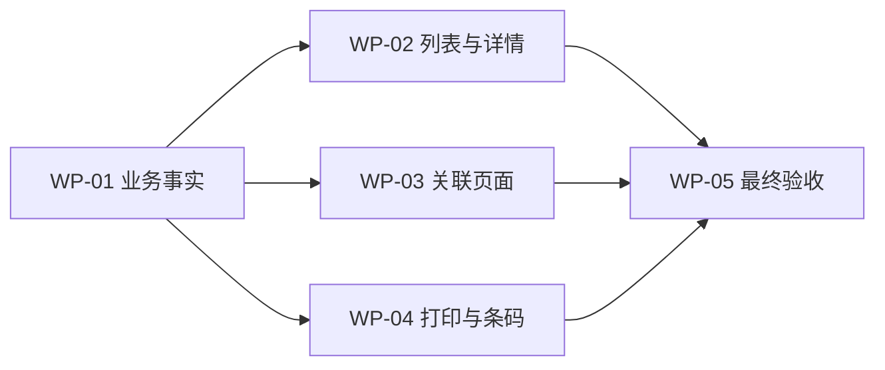

# 印花加工单调整实施计划

> 版本：2026-08-10
> 依据：《印花加工单：需求来源、加工投入、加工产出与双状态产品需求说明》

## 1. 目标与完成标准

本次把印花加工单主列表、详情、现场动作与打印调整为已确认模型，并保持现有业务信息均有归属。完成必须同时满足：

1. 原子需求追踪矩阵不存在无说明的待实施、实施中、待验证或阻塞条目。
2. 业务模型专项契约、页面契约、命名页面、图片大图、三类打印、治理、构建、CodeGraph 与任务收据取得当前最终版本证据。
3. 正向追踪无遗漏；反向追踪无未确认状态、旧流转卡入口或 `Edit confirmation`。

## 2. 工作包

| 工作包 | 业务目标 | 文件/符号 | 修改内容 | 验证证据 | 完成条件 |
| --- | --- | --- | --- | --- | --- |
| WP-01 | 建立印花业务事实模型 | `printing-work-order-business.ts` | 四类来源、投入/用量/产出、双状态、换料、交出、卷条码、打印历史和防错 | `check:printing-work-order-redesign` | MODEL/QTY/INPUT/STATE 可逐项断言 |
| WP-02 | 重构标准列表与详情 | `work-orders.ts`、`work-order-detail.ts`、`events.ts`、对话框 | 全筛选、六项汇总、完整字段列、连续详情、局部弹窗和现场动作 | 页面契约、Playwright | PAGE/IMAGE/主要动作可操作 |
| WP-03 | 对齐关联页面 | `pending-review.ts`、`statistics.ts`、`dashboards.ts` | 接收动作、双状态统计和大屏不再读取旧细分状态 | 页面契约、浏览器 | 无对用户暴露的旧系统状态解释 |
| WP-04 | 完成三类打印 | `print-service.ts`、模板注册、新印花模板、打印预览 | 信息单、确认单、批量确认、下载、产出卷标签；移除可见任务流转卡入口 | 打印契约、打印预览 | PRINT 全部通过，KG 3 位、无 Edit confirmation |
| WP-05 | 治理与交付闭环 | 专项脚本、Playwright、追踪矩阵、审查记录 | 最终正反向追踪、图片/低分辨率/打印验收、CodeGraph、收据 | 最终命令组 | 所有原子需求有当前证据 |

## 3. 依赖顺序

## 4. 兼容与清理策略

- 保留旧印花任务/PDA/仓储事实源，避免越界重构其他执行端；新管理页面读取本次印花业务投影。
- 历史细分状态只作为只读历史提示，不进入新加工状态选择器。
- 历史任务流转卡构建能力可兼容旧链接，但新版印花页面不再展示该入口。
- 现有字段不是删除，而是迁移到需求来源、加工投入、印花要求、加工产出、数量、交出或打印事实。
- 本次 Mock 用于验证业务组合，不代表线上数量或真实库存。

## 5. 验证顺序

1. 业务模型与公式契约。
2. 列表/详情/打印源码契约和类型检查。
3. 标准列表与原型治理。
4. 命名页面 1366×768、图片大图、换料、完成、交出/接收、条码和打印预览。
5. 构建、CodeGraph 同步/状态、任务收据。
6. 更新追踪矩阵和原型审查记录，执行正向与反向追踪。
