# 含车缝任务交付与回货时效产品需求文档

## 1. 文档信息

| 项目 | 内容 |
| --- | --- |
| 文档名称 | 含车缝任务交付与回货时效产品需求文档 |
| 适用系统 | 工厂生产协同系统、工厂端移动应用 |
| 适用业务 | 独立车缝任务、车缝到包装连续任务、裁片到包装连续任务 |
| 主要角色 | 生产计划员、跟单、平台主管、工厂主管、工厂操作员、接收方仓管 |
| 文档用途 | 交付产品、研发、测试和实施进行正式功能开发与验收 |
| 时间口径 | 以接单时点为起点，按连续满 24 小时滚动计算 |
| 数量口径 | 仅接收方确认实收的数量计入履约，允许超量并展示超过 100% 的履约比例 |

## 2. 背景

含车缝任务通常具有数量大、生产周期长、可能分批交出、可能由不同工厂承接等特点。仅用“最终是否完成”判断履约，无法及时识别工厂前期没有回货、接收方延迟确认、任务改派后责任混淆等问题。

现有业务需要同时解决以下问题：

1. 明确独立车缝、车缝到包装、裁片到包装三类任务的最终交付时限。
2. 在最终交付前设置 30%、70%、100% 三个回货节点，提前识别履约风险。
3. 区分工厂“交出”与接收方“确认实收”，避免把单方提交当作已回货。
4. 明确直接派单和竞价中标的接单起算方式。
5. 支持业务分配时间回填，同时阻止填写未来时间。
6. 支持部分款色尺、部分数量分配，并保证各次分配数量互不重叠、总量守恒。
7. 支持任务改派，并保证改派前后的数量、时钟、责任和履约记录相互隔离。
8. 一个生产单可能存在多个车缝承接工厂，但只能有一个主工厂。
9. 对截止前已交出、截止后才确认实收的记录，既要按真实实收时间计算，也要保留接收确认延迟证据供主管复核。

## 3. 产品目标

### 3.1 业务目标

1. 对所有含车缝任务形成统一、可追溯的交付与回货时效口径。
2. 让跟单能在 30%、70%、100% 节点及时发现风险，而不是等到最终截止后才处理。
3. 让工厂、接收方和平台主管对数量与时间事实使用同一口径。
4. 让改派前后的责任清晰，不因后续补录或迟到实收改变新工厂的考核基准。
5. 让生产单主工厂保持唯一，同时允许其他车缝工厂作为实际分配关系参与生产。

### 3.2 用户目标

| 角色 | 用户目标 |
| --- | --- |
| 生产计划员、跟单 | 正确选择任务、工厂、数量和分配时间，查看节点预览，处理竞价、拒单和改派 |
| 工厂主管 | 清楚看到中标任务，明确确认接单，并知道接单后从何时开始计算履约 |
| 工厂操作员 | 查看当前任务、数量和状态，按实际生产结果分批交出 |
| 接收方仓管 | 按实际收到的数量确认实收，记录确认时间和差异 |
| 平台主管 | 查看履约节点、逾期情况、接收确认延迟证据，并进行责任复核 |

## 4. 非目标

本需求不包含以下内容：

1. 不设计工厂推荐算法和自动选厂规则。
2. 不设计自动报价、智能定标和价格谈判规则。
3. 不设计结算金额、罚款金额和赔付规则。
4. 不改变整单生产任务内部过程不拆分的既有边界。
5. 不追踪第三方工厂内部每一道车缝或后道工序的生产明细。
6. 不重构组织权限体系。
7. 不以页面原型中的演示数据作为正式业务规则。

## 5. 术语与业务对象

### 5.1 术语说明

| 术语 | 业务含义 |
| --- | --- |
| 独立车缝任务 | 仅以车缝为主要承接范围、可独立分配给车缝工厂的任务 |
| 车缝到包装连续任务 | 从车缝开始，连续覆盖后道直至包装，由同一工厂整体承接的任务 |
| 裁片到包装连续任务 | 从裁片开始，连续覆盖车缝、后道直至包装，由同一工厂整体承接的任务 |
| 含车缝任务 | 独立车缝任务，以及覆盖范围中包含车缝的连续任务 |
| 业务分配时间 | 业务上认定本次分配生效的时间，可以回填，但不能晚于提交分配动作的当前时间 |
| 实际操作时间 | 操作人员提交分配、改派或确认动作时的系统当前时间 |
| 接单时间 | 本次实际分配结果开始承担履约责任的时间 |
| 交出 | 工厂声明已将一定数量交给下一接收方，是工厂单方提交的事实 |
| 确认实收 | 接收方确认实际收到的数量，是计入履约进度的唯一数量事实 |
| 履约节点 | 从接单时间起计算的 30%、70%、100% 数量与时间目标 |
| 实际分配结果 | 某一任务范围、某一分配数量、某一承接工厂在一次分配或改派后形成的独立履约对象 |
| 履约基准 | 某次实际分配结果在接单时确定的任务类型、分配数量、节点规则和起算时间 |
| 主工厂 | 生产单层面唯一的主要生产责任工厂 |
| 车缝承接工厂 | 实际承接某次车缝任务分配的工厂，可以有多家，但不等同于多家主工厂 |
| 接收确认延迟 | 工厂在节点截止前已交出，但接收方在节点截止后才确认实收的情况 |

### 5.2 对象关系

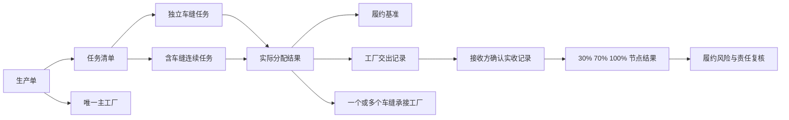

## 6. 核心业务原则

### 6.1 以实际分配结果为履约对象

履约时效不直接挂在生产单总量上，也不直接挂在抽象任务定义上，而是以每一次真实生效的分配结果为单位独立计算。

每次实际分配结果必须明确：

1. 承接的任务类型。
2. 承接的款色尺或任务范围。
3. 分配数量。
4. 承接工厂。
5. 分配方式。
6. 业务分配时间。
7. 接单时间。
8. 适用的 30%、70%、100% 节点规则。

不同实际分配结果的履约进度不得混算。

### 6.2 履约规则在接单时确定

任务接单时，系统必须固定本次实际分配结果的任务类型、分配数量、起算时间和节点截止时间。

后续即使平台调整全局规则，也不得追溯修改已经接单任务的历史节点。

### 6.3 只按确认实收累计

1. 工厂交出不等于回货完成。
2. 只有接收方确认实收后，数量才进入履约累计。
3. 接收方确认多少，就累计多少。
4. 已交出但未确认实收的数量，单独展示为待确认数量。
5. 超量实收按正常实收累计，履约比例可以超过 100%。

### 6.4 按连续满 24 小时滚动计算

“第 N 天”统一解释为从接单时点起经过 N 个完整的 24 小时，不按自然日期零点截断，也不按工作日计算。

示例：

- 接单时间为 7 月 1 日 15:30。
- 第 4 天节点截止时间为 7 月 5 日 15:30。
- 第 9 天节点截止时间为 7 月 10 日 15:30。

## 7. 时效规则

### 7.1 交付时效

交付时效指：承接工厂必须在规定时间内完成本次实际分配结果的全部数量，累计确认实收数量应达到分配数量。

| 任务类型 | 最终交付要求 |
| --- | --- |
| 独立车缝任务 | 接单后满 9 个 24 小时内完成 |
| 车缝到包装连续任务 | 接单后满 10 个 24 小时内完成 |
| 裁片到包装连续任务 | 接单后满 12 个 24 小时内完成 |

### 7.2 回货节点

| 任务类型 | 30% 节点 | 70% 节点 | 100% 节点 |
| --- | --- | --- | --- |
| 独立车缝任务 | 第 4 天达到至少 30% | 第 8 天达到至少 70% | 第 9 天达到至少 100% |
| 车缝到包装连续任务 | 第 5 天达到至少 30% | 第 9 天达到至少 70% | 第 10 天达到至少 100% |
| 裁片到包装连续任务 | 第 6 天达到至少 30% | 第 9 天达到至少 70% | 第 12 天达到至少 100% |

### 7.3 节点数量计算

节点目标数量按本次分配数量乘以节点比例计算，结果存在小数时向上取整。

示例：本次分配 101 件。

| 节点 | 计算结果 | 目标数量 |
| --- | --- | --- |
| 30% | 30.3 件 | 31 件 |
| 70% | 70.7 件 | 71 件 |
| 100% | 101 件 | 101 件 |

### 7.4 节点判定

1. 在截止时点前，累计确认实收达到目标数量，节点为按时达标。
2. 截止时点后首次达到目标数量，节点为逾期达标。
3. 截止时点已过且仍未达到目标数量，节点为逾期未达标。
4. 后续数量追上时，只更新为逾期达标，不改写为按时达标。
5. 100% 节点达到后，本次实际分配结果视为完成。
6. 实收超过分配数量时，仍视为正常完成，并显示真实履约比例。

## 8. 任务分类与页面分流

### 8.1 独立车缝任务

独立车缝任务进入车缝分配工作台。

车缝分配工作台必须支持：

1. 查看完整齐套数量和待分配数量。
2. 查看款色尺明细。
3. 选择部分款色尺。
4. 对每个已选款色尺填写本次分配数量。
5. 直接派单或发起竞价。
6. 预览本次分配的 30%、70%、100% 节点。
7. 查看和发起改派。

### 8.2 含车缝连续任务

含车缝连续任务只进入连续工序任务分配页面，不得进入独立车缝分配工作台。

连续任务按完整任务范围分配，不允许在分配页面拆成款色尺明细，也不允许拆回多个独立工序。

页面必须提供三个明确动作：

1. 直接派单。
2. 发起竞价。
3. 暂不分配。

不得使用含义不清的“整任务分配”作为动作名称。

### 8.3 任务分类决策

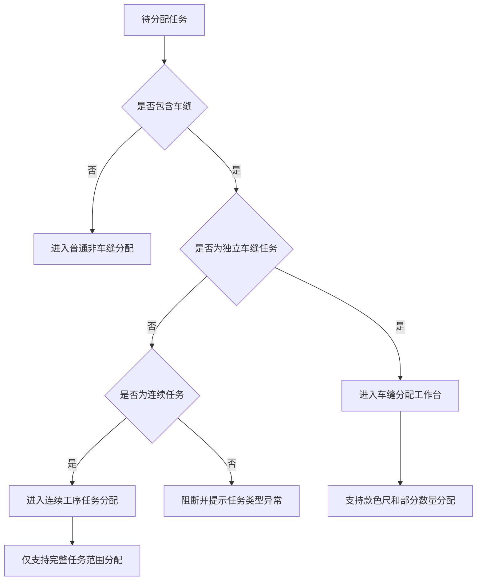

## 9. 分配时间规则

### 9.1 可回填范围

独立车缝任务和含车缝连续任务在直接派单、发起竞价和改派时，均允许填写业务分配时间。

业务分配时间可以早于实际操作时间，但不能晚于本次提交动作发生时的系统当前时间。

### 9.2 提交时重新取当前时间

实际操作时间必须在用户点击最终提交时重新获取，不得使用打开弹窗时的时间。

如果用户长时间停留在弹窗中，仍应以最终点击提交的时点进行未来时间校验。

### 9.3 时间校验

系统必须阻断以下情况：

1. 业务分配时间为空。
2. 时间格式无效。
3. 不存在的日期或时间。
4. 业务分配时间晚于实际操作时间。
5. 竞价接单时间早于定标时间。
6. 竞价接单时间晚于确认接单动作的实际操作时间。

时间校验失败时，不得产生任务状态、审计记录、工厂归属或履约节点的部分变更。

## 10. 直接派单流程

### 10.1 业务规则

1. 直接派单成功后，对应工厂自动接单。
2. 自动接单时间与业务分配时间一致。
3. 30%、70%、100% 节点从业务分配时间开始计算。
4. 直接派单不要求工厂再次点击确认接单。
5. 页面需明确展示“直接派单后工厂自动接单”。

### 10.2 直接派单流程图

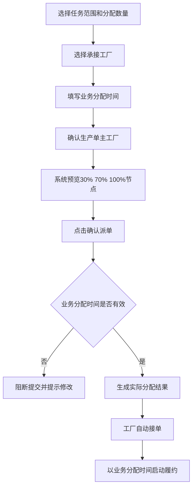

### 10.3 直接派单时序图

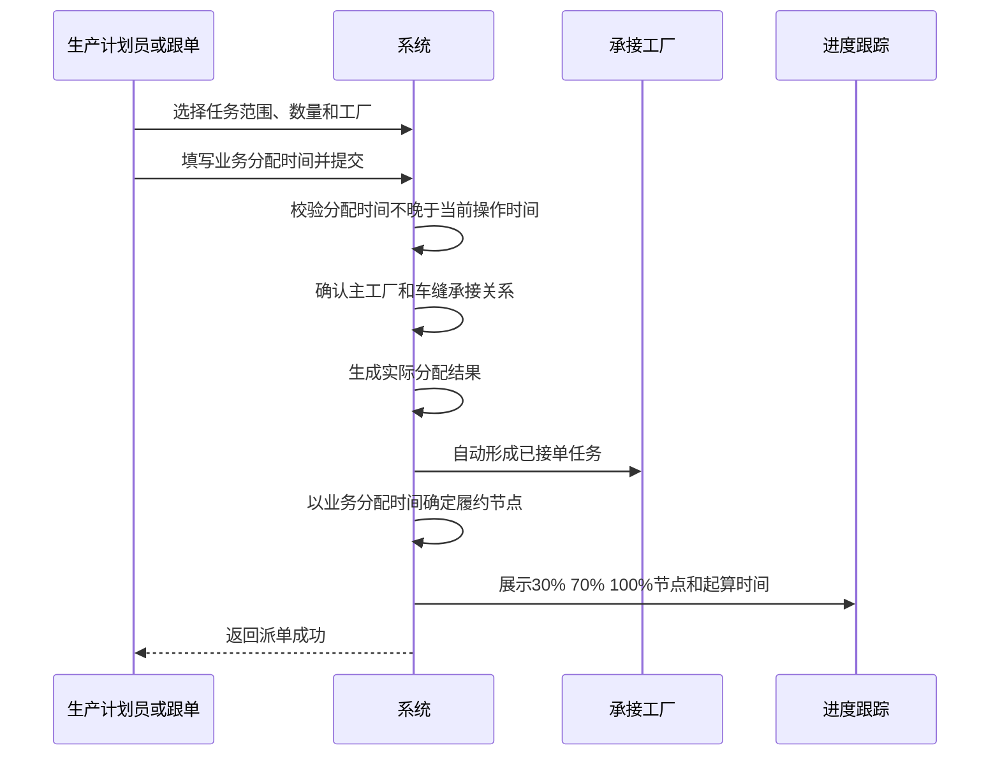

## 11. 竞价流程

### 11.1 业务规则

1. 发起竞价时记录业务分配时间，但不启动履约时钟。
2. 平台定标后，任务进入待工厂确认接单状态。
3. 定标不等于接单。
4. 中标工厂必须在工厂端明确确认接单。
5. 工厂确认接单时，才确定接单时间并启动履约节点。
6. 接单时间必须不早于定标时间，且不得晚于确认动作的实际操作时间。
7. 首次点击“确认接单”只打开确认预览，不得直接修改任务。
8. 确认预览必须展示任务、工序范围、数量和确认接单时间。
9. 工厂二次确认后，任务才正式接单。

### 11.2 竞价接单流程

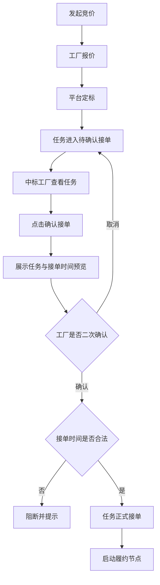

### 11.3 竞价接单时序图

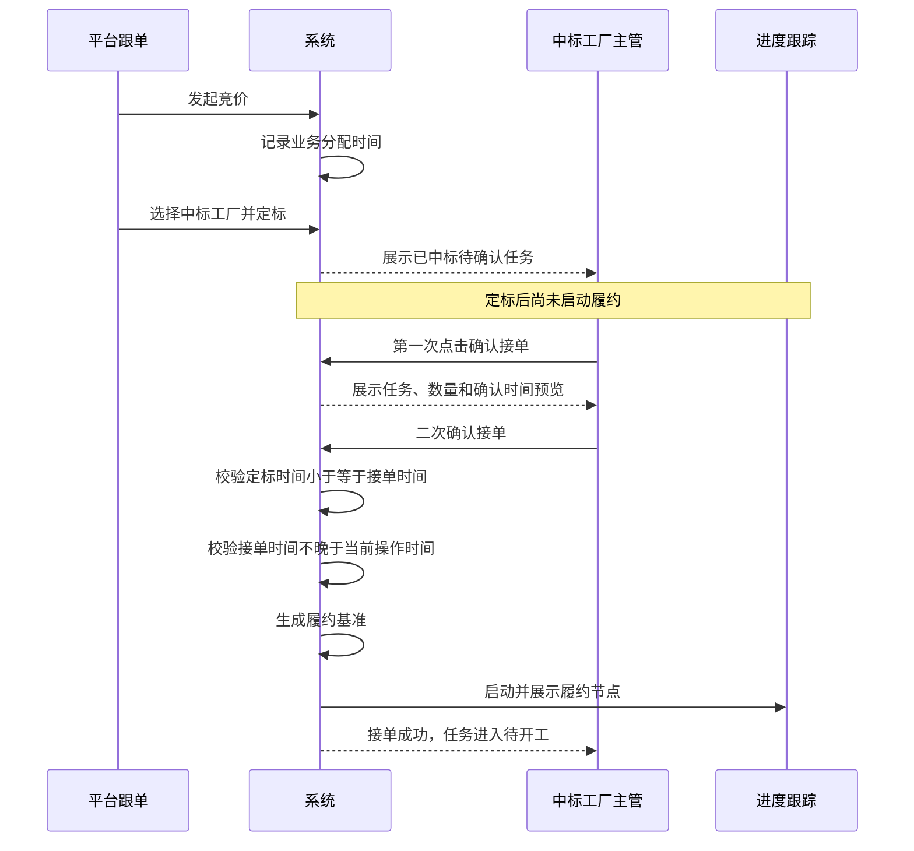

## 12. 主工厂规则

### 12.1 唯一性

一个生产单在任意时点只能有一个主工厂。

多个车缝工厂承接同一生产单时，其他工厂仅作为车缝分配关系存在，不得并列成为主工厂。

### 12.2 主工厂确认规则

1. 生产单已有有效主工厂时，默认保留当前主工厂。
2. 生产单尚无主工厂，且本次分配后只有一个有效车缝承接工厂时，系统自动将该工厂确定为主工厂。
3. 生产单尚无主工厂，且存在多个候选车缝工厂时，必须由业务人员显式选择。
4. 跨多个生产单批量分配时，必须逐生产单判断和确认主工厂，不得用一个选择覆盖全部生产单。
5. 重复选择当前主工厂不应产生“从自己调整为自己”的无意义变更记录。

## 13. 部分款色尺与部分数量分配

### 13.1 适用范围

仅独立车缝任务支持在分配时选择部分款色尺和部分数量。

连续任务始终按完整任务范围分配。

### 13.2 数量分区原则

1. 每个款色尺可单独勾选。
2. 未勾选的款色尺不参与本次分配。
3. 每个已勾选款色尺的分配数量必须大于零。
4. 分配数量不得超过该款色尺当前可分配数量。
5. 一次部分分配后，原任务范围应拆分为“本次已分配范围”和“剩余待分配范围”。
6. 后续再次分配时，只能从剩余待分配范围中选择。
7. 所有分配结果与剩余范围的数量之和必须始终等于原任务数量。
8. 已分配范围之间不得重叠。
9. 原任务不再作为可执行任务，后续进度应等待所有分区任务完成。

### 13.3 数量守恒示例

原任务 1,000 件：

- 第一次分配给甲厂 300 件。
- 第二次分配给乙厂 200 件。
- 剩余待分配 500 件。

系统必须保证：300 + 200 + 500 = 1,000。

## 14. 交出与确认实收

### 14.1 交出规则

1. 工厂可按实际生产节奏分批交出。
2. 每次交出必须记录任务、交出数量、交出时间和交出人。
3. 交出数量进入“累计交出”，但不进入履约完成量。
4. 已交出、未实收的数量进入“待确认实收”。

### 14.2 确认实收规则

1. 接收方根据实际收到的数量确认实收。
2. 确认实收必须记录确认数量、确认时间和确认人。
3. 确认时间不能早于对应交出时间。
4. 无效时间、倒挂时间或无对应交出记录时，必须阻断确认。
5. 确认失败时不得产生部分数量或状态变更。
6. 已确认实收后，数量进入履约累计。
7. 如果仓储等下游联动暂时失败，已成功的确认实收事实不回滚；页面应提示后续同步待处理。

### 14.3 回货时序图

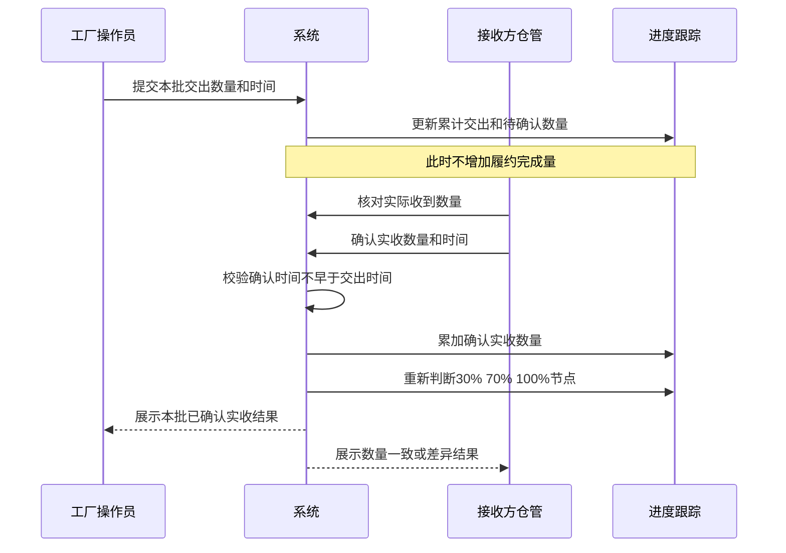

## 15. 接收确认延迟与责任复核

### 15.1 延迟识别

当一笔数量满足以下条件时，应标识为接收确认延迟证据：

1. 工厂交出时间不晚于某一履约节点截止时间。
2. 接收方确认实收时间晚于该节点截止时间。
3. 该笔数量对节点未按时达标产生了实际影响。

### 15.2 受影响数量

受影响数量不能简单等于整笔实收数量，必须同时受以下范围限制：

1. 该笔记录在节点截止前已交出的数量。
2. 节点目标数量与截止前已确认实收数量之间的缺口。

### 15.3 展示内容

管理端节点详情必须展示：

1. 交出记录编号。
2. 工厂交出时间。
3. 接收方确认时间。
4. 受影响数量。
5. 延迟时长。
6. 当前责任复核结论。
7. 责任复核历史。

### 15.4 主管复核

平台主管可选择：

1. 接收方责任。
2. 工厂责任。
3. 双方共同责任。

主管复核只记录责任结论，不改变原始交出时间、确认时间、确认实收数量和节点结果。

## 16. 改派

### 16.1 改派前提

以下任务不得通过普通派单或普通竞价覆盖已有分配结果，必须进入改派流程：

1. 已存在承接工厂。
2. 已经接单。
3. 已经形成履约基准。
4. 已产生交出或确认实收事实。

已完成任务不得改派。

### 16.2 剩余数量冻结

改派数量以改派操作时点为截止进行计算：

剩余数量 = 原分配数量 - 改派操作时点之前已确认实收数量。

改派操作时点之后才确认的旧任务实收，不得回减新任务的分配数量。

### 16.3 新旧分配隔离

1. 旧分配结果停止继续执行，但保留为历史记录。
2. 旧履约基准停止作为当前考核对象，但必须保留查询能力。
3. 新承接工厂以冻结的剩余数量形成新的实际分配结果。
4. 新分配使用新的接单时间和新的履约节点。
5. 旧任务后续迟到实收只更新旧历史，不更新新任务。
6. 新旧任务的交出、实收、节点和责任复核必须分别展示。
7. 管理端可按旧任务、旧工厂、新任务或新工厂搜索改派关系。
8. 历史任务不计入当前执行统计，不提供执行动作。

### 16.4 改派流程图

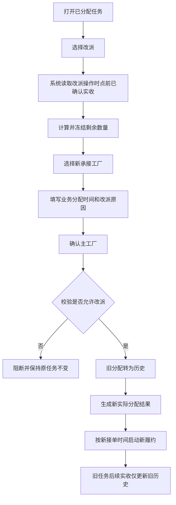

### 16.5 改派时序图

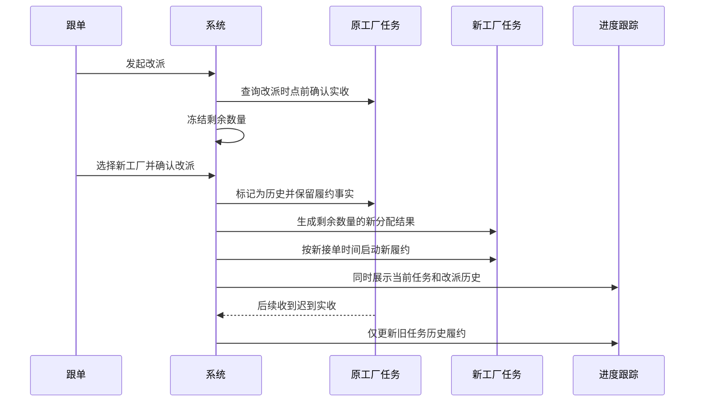

## 17. 拒单与重新分配

### 17.1 拒单规则

1. 只有处于待接单状态且归属当前工厂的任务可以拒单。
2. 拒单必须填写原因。
3. 重复拒单、错误工厂拒单或已接单后拒单必须阻断。
4. 已拒单任务保留追溯信息，但不得继续展示确认接单或去执行动作。

### 17.2 竞价任务拒单

1. 保留原竞价记录、业务分配时间和定标历史。
2. 释放当前中标工厂归属。
3. 任务回到可重新定标状态。
4. 新工厂中标后重新进入待确认接单。
5. 新工厂确认接单后，按新的接单时间启动履约。

### 17.3 直接派单任务拒单

1. 释放当前工厂归属。
2. 任务回到未分配状态。
3. 清除本次未生效的派单价格和分配时间。
4. 后续可再次直接派单或发起竞价。

## 18. 状态设计

### 18.1 任务分配与接单状态图

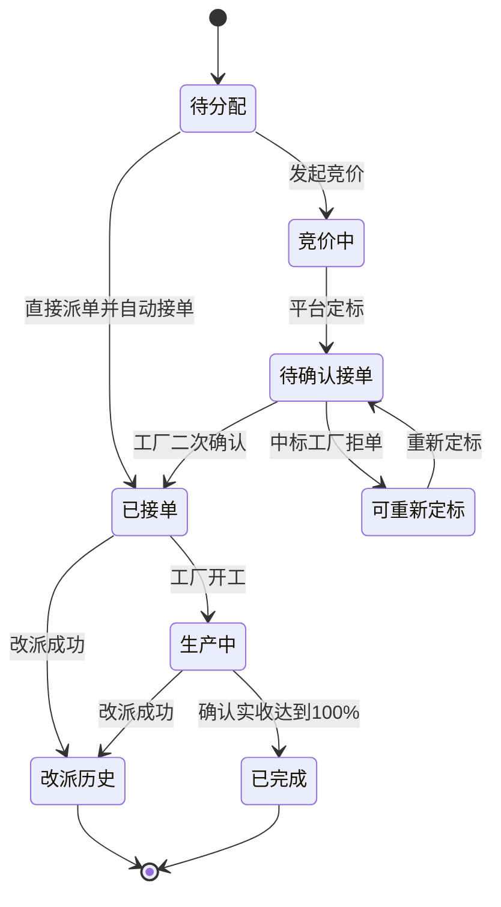

### 18.2 履约节点状态图

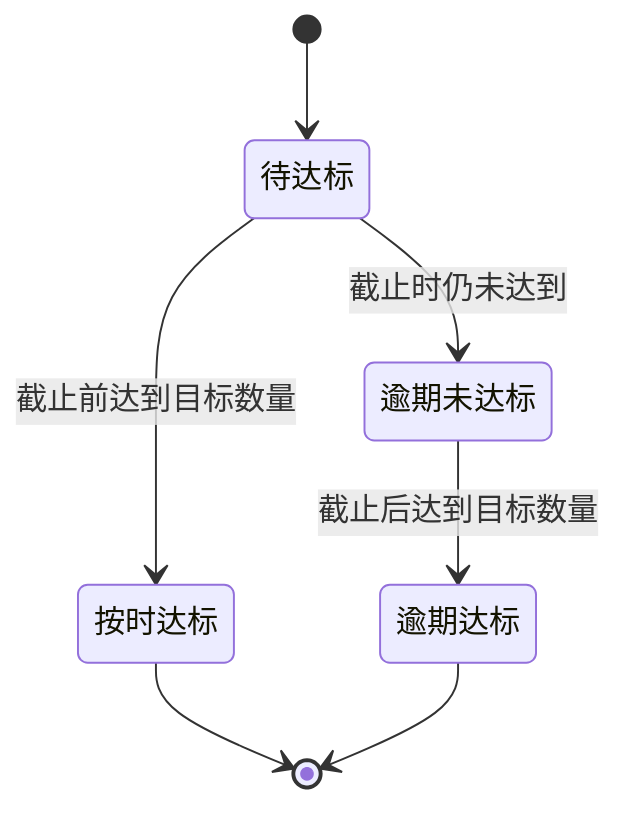

### 18.3 交出与实收状态图

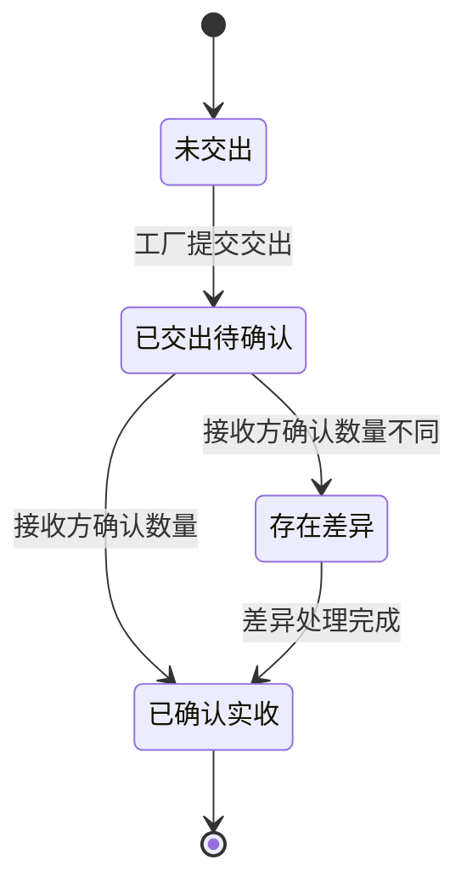

## 19. 页面需求

### 19.1 车缝分配工作台

#### 列表

列表必须展示：

1. 车缝任务与生产单信息。
2. 款式和款色尺范围。
3. 需求数量、已分配数量、待分配数量。
4. 完整齐套数量。
5. 裁片可做成衣判断。
6. 辅料满足情况。
7. 当前分配状态。
8. 查看明细、分配和改派入口。

列表必须分页，并支持按任务、生产单、款式、款色尺、齐套状态和风险筛选。

#### 分配弹窗

分配弹窗必须展示：

1. 分配方式。
2. 承接工厂。
3. 业务分配时间。
4. 实际操作时间。
5. 每个款色尺的完整齐套数量、待分配数量、本次分配数量。
6. 生产单当前主工厂和本次主工厂确认结果。
7. 30%、70%、100% 节点预览。
8. 直接派单自动接单提示，或竞价确认接单提示。

未来时间校验失败时，弹窗必须保持打开并明确说明修改方式。

### 19.2 连续工序任务分配

页面必须展示：

1. 连续任务名称和覆盖工序。
2. 生产单和任务范围。
3. 完整任务数量。
4. 当前承接工厂和主工厂。
5. 分配状态。
6. 直接派单、发起竞价、暂不分配三个动作。

直接派单或竞价弹窗必须强调“按完整任务范围分配，不拆成明细”。

### 19.3 工厂端接单页

#### 已中标任务卡片

必须展示：

1. 任务与生产单。
2. 工序范围。
3. 数量和单位。
4. 中标价格。
5. 任务截止时间。
6. 待确认接单状态。
7. 查看详情和确认接单动作。

待确认接单时不得展示“去执行”。

#### 接单确认预览

必须展示：

1. 任务编号。
2. 工序范围。
3. 数量和中文单位。
4. 确认接单时间。
5. “提交后以该时间作为履约起点”的说明。

### 19.4 任务进度跟踪

#### 列表

必须展示：

1. 任务、生产单和工序。
2. 当前分配和接单状态。
3. 当前承接工厂。
4. 累计交出数量。
5. 累计确认实收数量。
6. 当前履约比例。
7. 下一节点与截止时间。
8. 当前节点风险。

当前任务与改派历史可以同时搜索，但历史记录不得计入当前任务统计。

#### 详情

必须展示：

1. 分配数量。
2. 累计交出、待确认、累计确认实收。
3. 30%、70%、100% 节点目标、截止时间、首次达标时间和结果。
4. 接收确认延迟记录。
5. 主管责任复核入口和历史。
6. 改派前后关系。

### 19.5 接收方确认页

必须展示：

1. 交出方和接收方。
2. 任务和交出记录。
3. 工厂交出数量与时间。
4. 接收方实际收到数量。
5. 数量差异。
6. 确认时间。
7. 确认实收主动作。

数量必须带单位，差异必须直接展示“多多少”或“少多少”，不得要求仓管心算。

## 20. 提示与防错要求

| 场景 | 系统要求 |
| --- | --- |
| 业务分配时间晚于当前时间 | 阻断，并提示“业务分配时间不能晚于当前操作时间” |
| 竞价已定标但未确认接单 | 不启动履约，展示“待确认接单” |
| 待确认接单任务点击执行 | 阻断，并引导先确认接单 |
| 接收确认时间早于交出时间 | 阻断，并提示核对交出时间和确认时间 |
| 普通派单覆盖已有有效分配 | 阻断，并引导进入改派 |
| 多个主工厂候选但未选择 | 阻断，并要求逐生产单确认主工厂 |
| 已完成任务发起改派 | 阻断，并提示已完成任务不可改派 |
| 重复提交同一接单或拒单动作 | 阻断，不产生重复记录 |
| 下游仓储同步失败 | 保留已确认实收事实，提示后续同步待处理 |
| 无法判断责任 | 提供平台主管复核入口 |

## 21. 统计与查询口径

### 21.1 当前任务统计

只统计当前有效的实际分配结果。

改派历史不计入：

1. 当前任务总数。
2. 当前待开工数量。
3. 当前生产中数量。
4. 当前逾期任务数量。

### 21.2 履约比例

履约比例 = 累计确认实收数量 ÷ 分配数量。

履约比例不封顶。

示例：分配 100 件，确认实收 105 件，履约比例展示为 105%。

### 21.3 历史查询

改派历史必须支持按以下条件查询：

1. 原任务。
2. 原承接工厂。
3. 新任务。
4. 新承接工厂。
5. 生产单。

## 22. 异常与边界场景

### 22.1 时间边界

1. 接单时间精确到秒。
2. 恰好在节点截止时点确认实收，视为按时。
3. 晚于节点截止一秒确认，视为逾期。
4. 未来交出或未来确认事实不得提前进入当前查询结果。
5. 历史查询只能看到查询时点之前已经生效的事实。

### 22.2 数量边界

1. 节点数量小数一律向上取整。
2. 零数量不得提交。
3. 负数和非有效数字不得提交。
4. 超量实收允许累计。
5. 同一实收记录不得重复累计。
6. 记录后续作废或重新确认时，以查询时点有效的最新事实为准。

### 22.3 改派边界

1. 剩余数量为零时不得改派。
2. 改派时点后的旧任务实收不影响新任务分配数量。
3. 新任务实收不得回写旧任务。
4. 旧任务迟到实收不得推进新任务节点。
5. 改派失败时，新旧任务、主工厂和履约记录均不得部分变化。

### 22.4 工厂边界

1. 已停用、暂停合作或不具备车缝能力的工厂不得承接车缝任务。
2. 工厂显示名称必须与工厂主数据一致。
3. 工厂端账号必须归属于实际中标或派单工厂。
4. 已完成或已锁定的生产单不得新增待接单任务。

## 23. 验收标准

### 23.1 时效计算

1. 独立车缝从接单时间起生成第 4、8、9 天节点。
2. 车缝到包装从接单时间起生成第 5、9、10 天节点。
3. 裁片到包装从接单时间起生成第 6、9、12 天节点。
4. 所有“天”均按连续满 24 小时计算。
5. 101 件任务的节点数量为 31、71、101 件。

### 23.2 分配与接单

1. 直接派单成功后自动接单，接单时间等于业务分配时间。
2. 竞价定标后不启动履约。
3. 中标工厂二次确认后才启动履约。
4. 接单确认预览显示任务、工序、数量、中文单位和确认时间。
5. 未来业务分配时间提交失败且不产生部分状态。

### 23.3 数量与回货

1. 工厂交出后，累计交出增加，累计确认实收不变。
2. 接收方确认后，累计确认实收增加并重新判断节点。
3. 超量实收正常完成，比例可超过 100%。
4. 同一实收事实不重复累计。
5. 无效时间和时间倒挂的实收不得计入。

### 23.4 改派

1. 改派按操作时点之前的确认实收冻结剩余数量。
2. 旧分配保留历史，新分配建立独立履约时钟。
3. 旧任务后续实收只更新旧历史。
4. 历史任务可搜索、可查看节点、可复核责任，但不计入当前统计。

### 23.5 主工厂

1. 一个生产单始终只有一个主工厂。
2. 单一车缝工厂时可自动确定主工厂。
3. 多候选时必须显式选择。
4. 其他车缝工厂仅作为分配关系存在。
5. 重复确认同一主工厂不产生无意义变更记录。

### 23.6 页面与现场可用性

1. 管理端能够从分配进入进度和历史详情。
2. 工厂端待接单卡片不得直接展示执行动作。
3. PDA 页面使用短句、中文状态和中文数量单位。
4. 主管可从接收确认延迟记录打开责任复核。
5. 所有列表均有分页。
6. 轻量交互不得引起整页闪烁或滚动位置无故丢失。
7. 任一功能按钮的页面处理响应目标不高于 200 毫秒。

## 24. 上线前检查清单

### 24.1 产品检查

- 三类任务的节点配置与本文一致。
- 独立车缝与连续任务入口完全分离。
- 页面不存在含义不清的“整任务分配”动作。
- 直接派单与竞价接单起算方式清晰可见。
- 主工厂和其他车缝承接工厂关系表达清楚。

### 24.2 研发检查

- 时间校验失败时不存在部分写入。
- 接单、实收、改派等动作支持重复提交防护。
- 历史查询不会被未来事实提前覆盖。
- 新旧改派任务的事实相互隔离。
- 接收确认失败不会误计履约数量。

### 24.3 测试检查

- 覆盖三个任务类型和所有节点。
- 覆盖直接派单、竞价、拒单、重新定标和改派。
- 覆盖部分款色尺、部分数量和多次分配。
- 覆盖 101 件向上取整、超量实收、确认延迟和时间倒挂。
- 覆盖单工厂、多工厂和跨生产单批量分配。
- 覆盖历史查询、责任复核和当前统计隔离。
- 覆盖小屏、低分辨率、弱网重试和重复点击。

## 25. 最终业务结论

1. 独立车缝、车缝到包装、裁片到包装分别按 9、10、12 个连续 24 小时完成最终交付。
2. 三类任务分别按 4/8/9、5/9/10、6/9/12 天检查 30%、70%、100% 回货节点。
3. 直接派单自动接单，以业务分配时间作为履约起点。
4. 竞价定标不等于接单，以工厂二次确认接单时间作为履约起点。
5. 只有接收方确认实收的数量计入履约；超量实收允许超过 100%。
6. 履约按每次实际分配结果独立计算，不按生产单总量混算。
7. 改派按操作时点冻结剩余数量，新旧分配的数量、时钟和责任相互隔离。
8. 一个生产单只能有一个主工厂，其他车缝工厂作为实际分配关系存在。
9. 接收确认延迟必须保留证据并支持主管复核，但复核不得改写原始事实。
