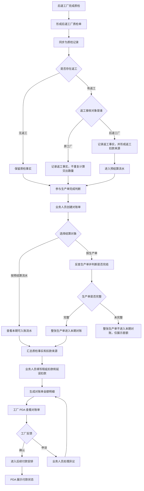
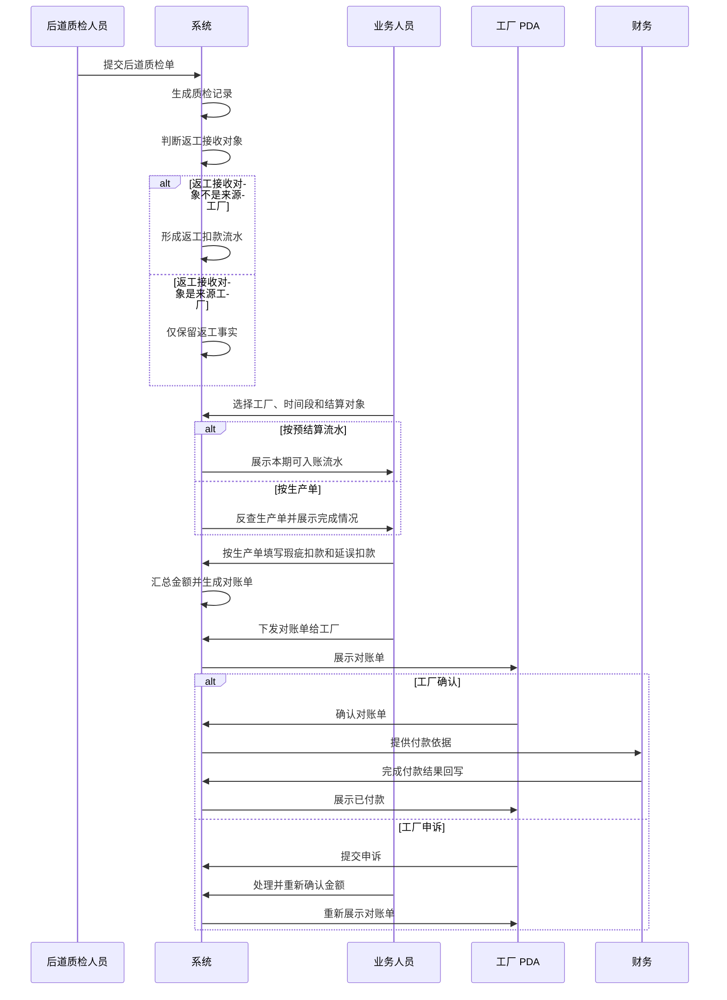

# 工厂质检、扣款、预结算与对账结算产品设计方案

日期：2026-07-04  
适用范围：工厂生产协同系统、后道质检、对账与结算、工厂端 PDA 结算  
文档目标：沉淀 2026 年 7 月 1 日至 7 月 4 日围绕质检、扣款、预结算流水、对账单和 PDA 结算的产品口径，供产品、业务、财务和原型评审使用。

## 1. 设计目标

本轮调整的核心目标，是把工厂结算链路拆成清楚、可追溯、可解释的几个阶段：

- 质检记录只表达质检事实，不承载扣款决策。
- 扣款记录表达扣款事实和扣款来源，并标记是否已经进入对账单。
- 预结算流水作为平台内部结算底账，承接任务收入和部分扣款流水。
- 对账单是业务人员确认本期应付、扣款和净额的正式口径。
- PDA 结算只面向工厂查看、确认、申诉和查看付款结果，不暴露平台内部预结算管理和付款申请流程。

本方案强调业务人员和财务都能看懂：每一笔钱来自哪里、由谁确认、是否进入对账、是否付款，以及工厂能在哪一步反馈。

## 2. 业务对象和边界

| 业务对象 | 主要使用人 | 产品定位 | 允许做什么 | 不允许做什么 |
| --- | --- | --- | --- | --- |
| 后道工厂质检单 | 后道质检人员 | 质检事实源头 | 记录 SKU 质检、合格、返工、瑕疵和返工接收对象 | 作为财务最终扣款凭证 |
| 质检记录 | 业务人员、工厂 | 统一质检事实视图 | 查看质检事实、返工、瑕疵、关联对账情况 | 编辑扣款金额、做扣款决策 |
| 扣款记录 | 业务人员、财务 | 扣款来源台账 | 查看返工扣款和对账单内扣款，标记是否进入对账 | 代替对账单确认金额 |
| 预结算流水 | 平台业务人员、财务 | 平台内部结算底账 | 承接任务收入和返工扣款，供对账单选取 | 在 PDA 工厂端直接展示为主对象 |
| 对账单 | 业务人员、工厂、财务 | 本期正式对账口径 | 冻结范围、结算对象、金额、扣款和结算资料版本 | 纳入未完成生产单或未下发草稿给工厂 |
| PDA 结算 | 工厂 | 工厂端移动查看和反馈入口 | 查看收入、对账单、质检记录、结算资料，确认或申诉对账单 | 管理预结算流水、预付款批次、付款申请、打款回写 |

## 3. 总体业务流程



## 4. 质检记录设计

### 4.1 事实优先

质检记录只回答「质检发生了什么」：

- 哪张质检单。
- 来源工厂和接收方是谁。
- 对应哪张生产单。
- 涉及哪些 SKU。
- 每个 SKU 质检多少、合格多少、返工多少、瑕疵多少。
- 返工接收对象是谁。
- 瑕疵原因分别是多少。
- 是否已经被对账单引用。

质检记录不回答「最终扣多少钱」。扣款金额在质检记录中只允许作为来源事实或弱提示出现，不允许成为可编辑、可确认的财务口径。

### 4.2 多 SKU 和返工接收对象

一张后道质检单可以包含多个 SKU。不同 SKU 可能有不同返工接收对象，系统不能只取第一条返工接收对象作为整张单的结论。

质检记录需要按 SKU 展示：

- 返工数量。
- 返工接收对象。
- 瑕疵原因和数量。
- 后道项目判断。

如果存在返工，且返工接收对象不是来源工厂，需要展示返工扣款金额；如果返工接收对象是来源工厂，只展示返工事实，不重复形成返工扣款。

### 4.3 质检记录状态

```mermaid
stateDiagram-v2
    [*] --> "已形成质检事实"
    "已形成质检事实" --> "未进入对账"
    "未进入对账" --> "待对账引用": "存在可引用扣款或质检事实"
    "待对账引用" --> "已进入对账": "被对账单引用"
    "未进入对账" --> "已进入对账": "直接被对账单引用"
    "已进入对账" --> [*]
```

## 5. 扣款记录设计

### 5.1 扣款记录的来源

扣款记录有两类来源：

1. 质检记录中的返工扣款：当返工接收对象不是来源工厂时，形成返工扣款来源，并进入预结算流水。
2. 对账单中的瑕疵扣款和延误扣款：业务人员在生成对账单时，根据质检事实和生产单时间信息填写金额。

这两类来源可以在同一个扣款记录页面展示，但必须标记清楚：

- 来源是返工扣款，还是对账单内扣款。
- 关联哪家工厂。
- 关联哪张生产单。
- 关联哪张质检记录。
- 是否已经进入对账单。
- 已进入对账单时，进入哪张对账单。

### 5.2 瑕疵扣款粒度

瑕疵扣款按「生产单 + 瑕疵原因」填写金额。

原因是：不同生产单可能是不同款式、不同工价、不同扣款标准。即便瑕疵原因相同，扣款金额也可能不同。

进入瑕疵扣款的车缝工厂责任原因包括：

- 做工原因。
- 脏污。
- 抽纱。
- 做错。
- 做毁。
- 破洞。

系统汇总这些原因的瑕疵数量，业务人员在对账单中按生产单分别填写金额和说明。

### 5.3 延误扣款粒度

延误扣款也按生产单填写。

系统只提供辅助判断信息：

- 生产单开始时间。
- 最后一次交出时间。
- 本期对账范围。
- 相关交出记录。

是否扣延误款、扣多少钱，由业务人员在对账单中判断并填写。系统不自动计算延误扣款。

### 5.4 扣款记录状态

```mermaid
stateDiagram-v2
    [*] --> "产生扣款来源"
    "产生扣款来源" --> "待进入对账"
    "待进入对账" --> "已进入对账": "被对账单引用或填写"
    "已进入对账" --> "已冻结": "对账单确认金额"
    "已冻结" --> "已付款抵扣": "随对账单进入付款结果"
    "已冻结" --> "对账异议中": "工厂提出异议"
    "对账异议中" --> "已冻结": "异议处理完成"
```

## 6. 预结算流水设计

预结算流水是平台内部结算底账，主要承接两类数据：

- 任务收入流水：工厂完成任务后形成的应付加工收入。
- 返工扣款流水：后道质检中返工接收对象不是来源工厂时形成的扣款。

预结算流水用于对账单生成，不直接作为工厂 PDA 的主展示对象。工厂端需要看到的是对账单中的「结算明细」，不是平台内部流水管理。

### 6.1 预结算流水进入对账单的规则

按预结算流水结算时：

- 业务人员选择工厂和自定义时间段。
- 系统展示该时间段内可进入对账的预结算流水。
- 已进入其他对账单或付款流程的流水不可重复进入。
- 本步骤不做生产单完整性反查。

按生产单结算时：

- 系统先通过时间段内的预结算流水反查生产单。
- 展示所有反查出的生产单。
- 未完成生产单整张不进入本期对账。
- 完成生产单下的预结算流水整组进入本期对账。

## 7. 对账单设计

### 7.1 创建对账单的两种流程

按预结算流水：


按生产单：


### 7.2 基础范围

业务人员创建对账单时选择：

- 工厂。
- 自定义开始时间。
- 自定义结束时间。
- 结算对象：按预结算流水或按生产单。
- 当前统一使用印尼盾。
- 备注。

工厂档案中的结算周期只作为参考，不强制决定对账单范围。

### 7.3 对象反查和生产单完整性

只有按生产单结算时才出现对象反查。

对象反查需要展示：

- 反查出的全部生产单。
- 每张生产单是否完整。
- 裁片完成数量。
- 累计交出数量。
- 累计返工数量，并按返工接收对象区分。
- 瑕疵总数量。
- 各类瑕疵原因数量。
- 每张生产单下的预结算流水和明细。

生产单只要未完整，整张生产单不进入本期对账，不做部分进入。

### 7.4 质检扣款

质检扣款步骤用于业务人员确认两类金额：

- 按生产单和瑕疵原因填写瑕疵扣款金额。
- 按生产单填写延误扣款金额。

返工扣款来自预结算流水，只在该步骤弱展示，不在这里重新编辑。

### 7.5 金额确认

金额确认展示本期对账单的完整金额结构：任务收入扣除返工扣款、瑕疵扣款和延误扣款后，形成本期应付净额。

金额确认后，对账单冻结以下业务快照：

- 工厂。
- 对账时间段。
- 结算对象。
- 纳入的预结算流水或生产单。
- 生产单完成判断。
- 质检事实引用。
- 业务人员填写的扣款金额和说明。
- 当前结算资料版本。
- 当前收款账号快照。

### 7.6 对账单状态

```mermaid
stateDiagram-v2
    [*] --> "草稿"
    "草稿" --> "已下发给工厂": "业务人员确认下发"
    "已下发给工厂" --> "待工厂确认"
    "待工厂确认" --> "工厂已确认": "工厂确认"
    "待工厂确认" --> "异议中": "工厂申诉"
    "异议中" --> "待工厂确认": "业务人员调整后重新下发"
    "异议中" --> "工厂已确认": "异议处理完成"
    "工厂已确认" --> "待付款安排"
    "待付款安排" --> "已付款"
    "已付款" --> [*]
```

未下发给工厂的草稿对账单，只能在平台端查看，不能出现在工厂 PDA 对账单列表中。

## 8. PDA 结算设计

PDA 结算是工厂端移动入口，不是平台内部结算系统。

### 8.1 首页结构

PDA 首页按卡片分类展示：

- 收入：累计收入、累计扣款、已付款、未付款、未结算参考金额。
- 对账单：全部、待确认、异议中、未付款、已付款。
- 质检记录：全部、未进对账、已进对账、有返工、有扣款。
- 结算资料：当前版本、历史版本记录。

首页只做入口和摘要，不展示复杂结算流程。

### 8.2 PDA 可见范围

PDA 只能展示已经下发给工厂，或已经形成工厂反馈和付款结果的对账单。

PDA 不展示：

- 未下发草稿对账单。
- 预结算流水管理。
- 预付款批次管理。
- 飞书付款申请。
- 打款回写操作。

付款只表达对账单是否已付款，不表达平台内部付款申请流程。

### 8.3 PDA 对账单列表

每张对账单卡片展示：

- 对账单号。
- 对账周期或时间段。
- 结算对象。
- 任务收入。
- 扣款。
- 本期净额。
- 付款状态。
- 确认、申诉和查看详情入口。

只有待工厂确认的对账单允许确认和申诉。已处理完成或已付款的对账单只能查看。

## 9. 业务时序图



## 10. 财务和会计要求

### 10.1 金额来源必须可解释

每一笔进入对账单的金额都必须能说明：

- 来自哪家工厂。
- 对应哪张生产单。
- 对应哪条收入或扣款来源。
- 扣款原因是什么。
- 金额是谁填写或确认的。
- 是否已经下发给工厂。
- 是否已经被工厂确认或申诉。
- 是否已经付款。

### 10.2 质检事实和财务确认分离

质检记录不是财务凭证。质检事实进入对账单后，经过业务人员确认金额，才成为本期对账口径。

### 10.3 对账单冻结口径

对账单一旦下发给工厂，应冻结当时使用的结算资料版本、收款账号、结算对象、时间范围和金额明细。后续资料变更只影响后续新单据，不反向改写已生成对账单。

### 10.4 工厂端只看结果，不参与平台付款流程

工厂可以在 PDA 上看到对账单是否付款，但不参与预付款批次、飞书付款申请和打款回写。

## 11. 异常和边界场景

| 场景 | 处理方式 |
| --- | --- |
| 生产单未完整 | 整张生产单不进入本期对账，展示差额和原因 |
| 多个 SKU 返工接收对象不同 | 按 SKU 分别展示返工接收对象和数量 |
| 返工接收对象是原工厂 | 不重复累计交出数量，不形成返工扣款 |
| 返工接收对象是后道工厂 | 计入完成判断，同时形成返工扣款来源 |
| 同一瑕疵原因出现在不同生产单 | 按生产单分别填写扣款金额 |
| 同一生产单存在延误风险 | 系统提供时间参考，业务人员决定是否扣款 |
| 对账单未下发 | 仅平台端可见，PDA 不展示 |
| 工厂提出异议 | 对账单进入异议处理，处理后重新确认 |

## 12. 当前不做

本轮不做以下事项：

- 不自动计算延误扣款。
- 不把质检记录做成扣款编辑页。
- 不让 PDA 管理预结算流水。
- 不让 PDA 展示预付款批次和付款申请流程。
- 不做多币种混合结算，当前统一使用印尼盾。
- 不新增财务审核流程。

## 13. 验收口径

产品验收时按以下问题检查：

1. 质检记录是否只展示事实，并能看到 SKU 级返工和瑕疵原因？
2. 有返工且返工接收对象不是来源工厂时，是否能看到对应返工扣款？
3. 扣款记录是否能区分返工扣款和对账单扣款？
4. 按生产单结算时，未完成生产单是否整张不进入本期对账？
5. 瑕疵扣款是否按「生产单 + 瑕疵原因」填写？
6. 延误扣款是否按生产单填写，并只由系统提供时间参考？
7. 对账单金额确认是否能看到收入、返工扣款、瑕疵扣款、延误扣款和净额？
8. PDA 是否只展示已下发或已形成反馈结果的对账单？
9. PDA 是否不出现预结算流水、预付款批次、付款申请和打款回写等平台内部操作？
10. 工厂是否能在 PDA 上看到收入、对账单、质检记录和结算资料版本？
