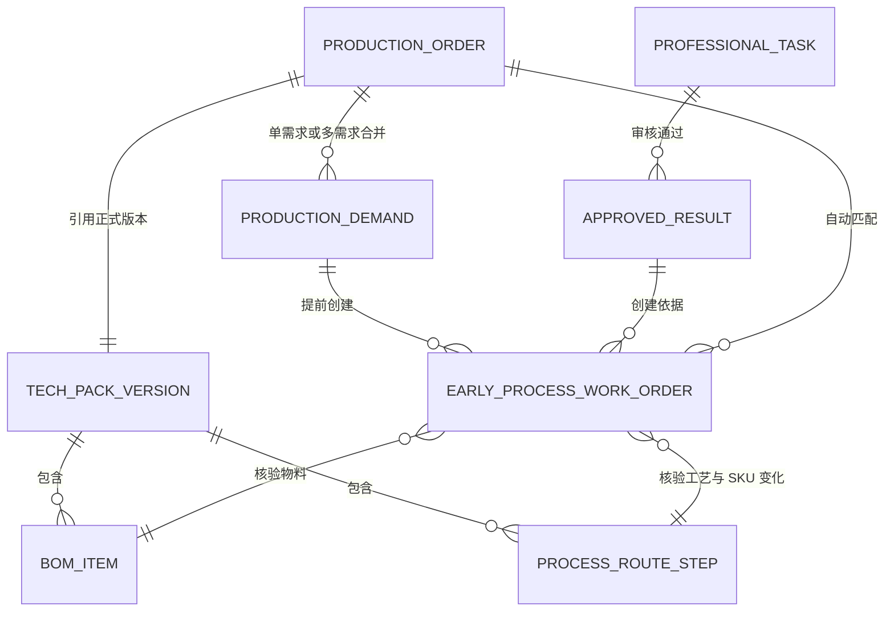
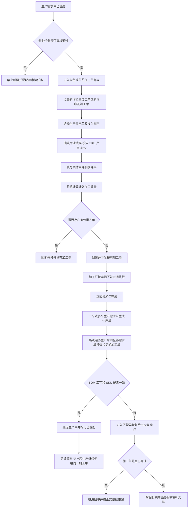
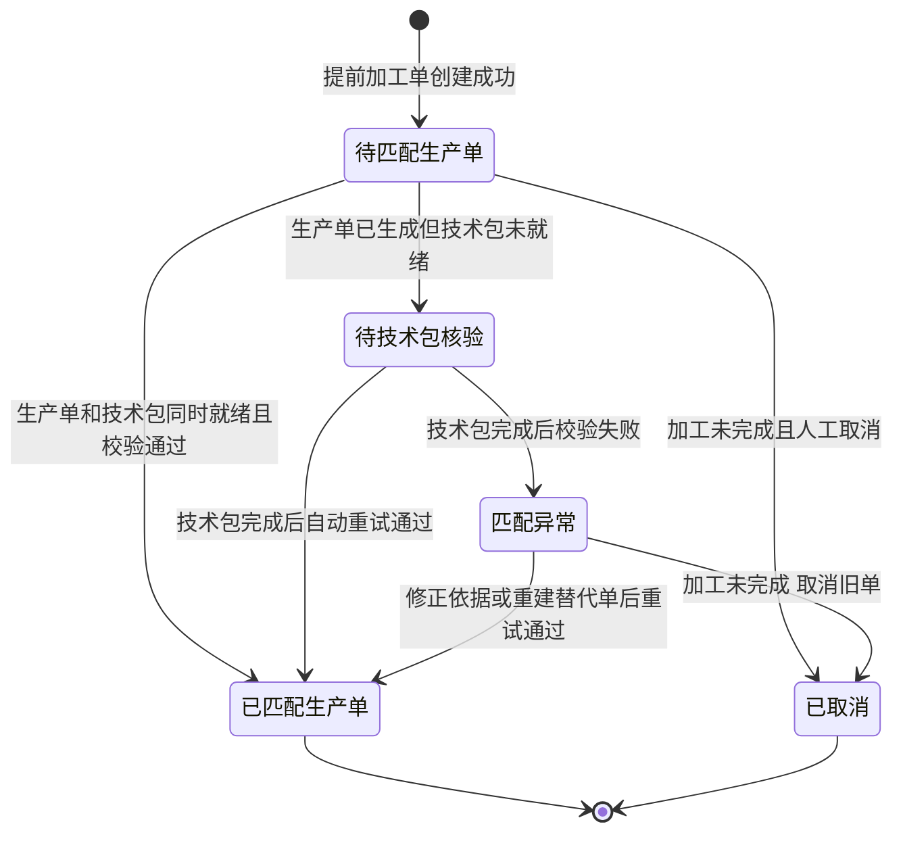
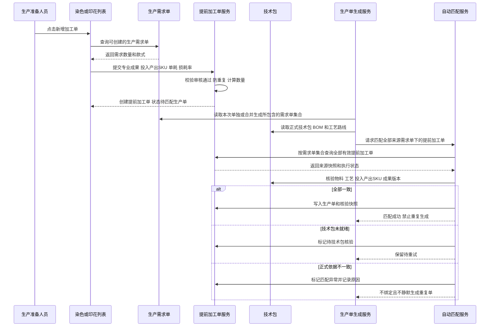

# 染色印花加工单提前创建与生产单自动匹配完整调整方案

> 文档版本：V1.1（2026-09-17 提前建单入口迁移）
> 编制日期：2026-09-17
> 适用范围：商品中心系统生产准备、生产需求单、技术包、染色加工单、印花加工单及生产单生成链路
> 文档状态：业务规则已确认，实施与验证中
> 说明：本文是调整方案和实施验收依据，不代表相关功能已经实现。

## 1. 结论

**系统归属修正**：提前新建、匹配状态筛选及取消提前单属于工厂生产协同系统 → 任务编排与执行准备。染色使用 `/fcs/process/dye-orders`，印花使用 `/fcs/process/print-orders`。工艺工厂运营系统保留执行与事实查看，删除上述管理入口及处理器。迁移实施与验收以《染色印花提前建单入口迁移实施与追踪》为准；原有执行路由不删除。

本次调整的核心不是在原流程上增加一个普通按钮，而是把染色、印花加工单的业务起点从“生产单已经生成”前移到“生产需求单已经创建且专业成果已经审核通过”。系统必须同时做到以下几点：

1. 在染色加工单列表页提供可实际使用的“新增染色加工单”按钮。
2. 在印花加工单列表页提供可实际使用的“新增印花加工单”按钮。
3. 面向大货的新增加工单必须选择生产需求单，并以生产需求单作为该大货提前加工单的业务来源，不得伪装成库存加工单或设计改款加工单。设计改款阶段为制作销售展示样衣创建的印染加工单属于另一独立场景，继续保留 `DESIGN_REVISION` 来源。
4. 调色任务或花型任务只有“审核通过”才算完成，才允许创建对应提前加工单。
5. 一个生产需求单至多归入一张生产单；一张生产单可以由一个或多个生产需求单生成。生产单生成后，系统遍历其包含的全部生产需求单，自动匹配这些需求单下的全部有效提前加工单。因此，一张合并生产单可以匹配多张染色、印花提前加工单，但每张提前加工单仍只绑定一张生产单。
6. 自动匹配时必须使用正式技术包校验 BOM 物料、加工要求、投入 SKU、产出 SKU 和专业成果版本。校验不通过时进入“匹配异常”，不得静默绑定，也不得重复生成同类加工单。
7. 预估加工数量必须包含损耗率。正式技术包后续确认的单耗不回写、不改写已经创建的提前加工单数量；不足部分继续通过补料业务处理。
8. 未完成的提前加工单在物料或工艺变更后允许取消并重建；已经完成的加工单不可修改、不可取消覆盖，只能保留历史事实并创建新单或补充单。
9. 染色、印花加工单列表必须增加二级匹配状态 Tab，至少支持全部、待匹配生产单、待技术包核验、已匹配生产单、匹配异常、已取消。
10. 提前加工单的生产时效从加工单实际下发时间开始计算，后续匹配生产单不得重置或倒推其时效。

## 2. 背景与目标

### 2.1 当前问题

旧流程要求先完成技术包、采购及生产单生成，再生成染色、印花加工单。订单下单较晚时，加工厂收到任务的时间也被同步推迟，染色和印花成为整体交付时效中的被动等待环节。

本次调整把可以提前确定的专业成果先转化为加工任务：生产准备阶段只要生产需求单存在，调色或花型成果已经审核通过，就可以创建加工单并安排加工。正式技术包和生产单在后续完成后，再由系统自动核验并建立正式关联。

### 2.2 业务目标

- 让染色、印花加工从生产准备阶段提前启动，减少等待生产单的时间。
- 保证提前启动不牺牲来源可追溯性，任何提前加工单都能追溯到唯一生产需求单。
- 在正式生产单形成时由系统自动完成匹配，减少人工选择、错绑和漏绑。
- 把“提前估算”和“正式生产依据”分开保存，既不篡改历史加工事实，也能在正式技术包核验时识别差异。
- 在列表页直接完成创建、查询、识别、取消和异常跟进，避免多层页面跳转。

### 2.3 非目标

- 不调整采购单自身的创建、审批和下发规则。
- 不把提前加工单做成第二套生产单，也不在生产准备时效页面复制一套加工单执行入口。
- 不允许一张提前加工单拆分绑定多张生产单。
- 不回写已经创建加工单的历史计划数量。
- 不在本次方案中新增真实后端、接口或数据库；当前仓库仍按高保真原型实现，但页面、状态、数据和交互必须完整表达业务规则。

## 3. 依据与规则优先级

### 3.1 需求来源

1. 《智能纪要：订单超时问题流程调整会议 2026年9月16日》：确认加工单需要前移，后续技术包、采购和生产单需要与提前加工单建立关联；已完成加工单发生变更时不得修改原单。
2. 《智能纪要：染色印花加工单提前创建方案沟通会 2026年9月16日》：确认生产需求单和专业任务完成是创建前置；创建时指定 SKU、预估单件用量；后续正式单耗不回写提前加工单；加工单时效从实际下发时间计算。
3. 用户后续明确确认的业务规则：专业任务完成等于审核通过；数量包含损耗；一个生产需求单至多归入一张生产单，但多个生产需求单可以合并生成一张生产单；系统自动匹配该生产单包含的全部需求单及其多张提前加工单；未完成加工单允许取消；染色、印花列表必须增加匹配状态二级 Tab；染色和印花必然变更 SKU；单独水溶不变 SKU；水溶与染色同时存在时合并为一道染色加工并只生成一张染色加工单。

### 3.2 冲突处理

会议纪要属于 AI 生成的讨论记录，不是系统指令。用户后续确认的目标关系是：每张提前加工单只归属其来源生产需求单；一个生产需求单至多进入一张生产单；多个生产需求单可以合并为一张生产单。系统按合并单所含需求集合自动匹配，不保留人工挑选生产单或把一张提前加工单拆分绑定多张生产单的双逻辑。

## 4. 角色与职责

| 角色 | 主要职责 | 本次新增或变化 |
| --- | --- | --- |
| 买手 | 审核调色、花型专业成果 | 审核通过后，专业任务才进入可创建加工单状态 |
| 生产准备人员或 PPIC | 根据生产需求单创建提前加工单、跟进匹配状态 | 从染色或印花加工单列表的新增按钮进入创建流程 |
| 加工团队 | 提交专业成果、执行加工、记录完成数量 | 专业成果需先经买手审核；执行状态与匹配状态相互独立 |
| 工厂主管 | 接收、安排、执行和交出加工任务 | 按加工单实际下发时间计算时效，不等待生产单 |
| 系统 | 计算计划数量、校验重复、自动匹配生产单和技术包 | 使用生产单包含的生产需求单主键集合逐单匹配，输出明确异常原因 |
| 管理员 | 代操作和原型验收 | 拥有与业务角色等效的测试操作权限，记录“管理员（代操作）” |

## 5. 业务对象与关系

### 5.1 对象关系



### 5.2 唯一性规则

同一生产需求单、同一加工类型、同一投入物料行、同一专业成果版本，在任意时刻只允许存在一张“未取消且未被替代”的提前加工单。

建议使用以下稳定业务键防重：

```text
生产需求单 ID + 加工类型 + 投入物料来源行 ID + 专业任务 ID + 审核通过成果版本
```

不得使用页面序号、款号名称、临时 SPU 名称或可编辑文案作为唯一匹配依据。

## 6. 目标业务流程

### 6.1 总流程



### 6.2 创建前置条件

染色提前加工单必须同时满足：

1. 生产需求单已经创建且未取消。
2. 对应调色任务已经由买手审核通过。
3. 投入物料 SKU 已确定。
4. 染色后的产出 SKU 已确定，且必须与投入 SKU 不同。
5. 预估单件用量和损耗率已经填写。
6. 不存在相同稳定业务键的有效提前加工单。

印花提前加工单必须同时满足：

1. 生产需求单已经创建且未取消。
2. 对应花型任务已经由买手审核通过。
3. 花型图和花型文件作为同一份专业成果，可分别包含多个文件，且成果版本明确。
4. 投入物料 SKU 已确定。
5. 印花后的产出 SKU 已确定，且必须与投入 SKU 不同。
6. 预估单件用量和损耗率已经填写。
7. 不存在相同稳定业务键的有效提前加工单。

### 6.3 水溶、染色和印花组合规则

| 实际工艺 | 页面表达 | SKU 规则 | 加工单规则 |
| --- | --- | --- | --- |
| 单独水溶 | 一道水溶工艺 | 投入 SKU = 产出 SKU | 不创建染色或印花加工单 |
| 单独染色 | 一道染色工艺 | 必须变更 SKU | 创建一张染色加工单 |
| 水溶 + 染色同时处理 | 一道“水溶 + 染色”卡片 | 因包含染色，必须变更 SKU | 只创建一张染色加工单，不再生成独立水溶单 |
| 单独印花 | 一道印花工艺 | 必须变更 SKU | 创建一张印花加工单 |
| 染色后印花 | 染色和印花两道有顺序的卡片 | 每一道都形成对应产出 SKU | 先创建或执行染色单，印花单以上一道产出 SKU 为投入 |

## 7. 数量与时效规则

### 7.1 计划加工数量

```text
计划加工数量 = 生产需求数量 × 预估单件用量 × (1 + 损耗率 / 100)
```

示例：生产需求数量 1,000 件，预估单耗 1.8 米/件，损耗率 5%，则计划加工数量为：

```text
1,000 × 1.8 × 1.05 = 1,890 米
```

### 7.2 计算和展示要求

- 生产需求数量和成衣单位只读展示，不允许在创建加工单时修改。
- 预估单件用量必须带物料单位，如米/件、码/件、千克/件。
- 损耗率必须大于等于 0，不能留空；默认值可以来自物料或工艺规则，但必须允许本次确认。
- 系统实时显示计算公式、计算结果和单位，不让用户手算总量。
- 数量精度和进位规则沿用对应物料单位规则；没有既有规则时，米、码、千克保留两位小数，个、件向上取整。
- 正式技术包的 BOM 单耗与预估单耗不一致时，只记录差异，不回写提前加工单计划数量。
- 因差异导致物料不足时，由裁床按起套或补料规则发起补料，不篡改早期单据。

### 7.3 时效

- 提前加工单的时效起点是加工单实际下发时间 `issuedAt`。
- 生产单匹配时间、技术包确认时间不得重置时效。
- 列表同时展示下发时间、计划完成时间、实际完成时间、生产单匹配时间。
- 超时判断使用加工单自己的下发时效，不使用后来生成的生产单时效倒算。

## 8. 加工单来源与数据结构

### 8.1 来源类型

新增明确来源类型：

```text
PRODUCTION_DEMAND 生产需求单提前创建
```

大货提前加工单不得写成：

- `STOCK`：它不是库存备货加工。
- `DESIGN_REVISION`：该来源只用于设计改款阶段制作销售展示样衣的印染加工单，不能冒充大货提前加工单来源。
- `PRODUCTION_ORDER`：创建时生产单尚不存在。

### 8.2 提前加工单来源快照

| 字段 | 含义 | 规则 |
| --- | --- | --- |
| productionDemandId | 生产需求单主键 | 必填、不可修改、用于自动匹配 |
| productionDemandNo | 生产需求单号 | 列表和详情展示 |
| demandQty / demandUnit | 需求数量与单位 | 创建时快照 |
| styleId / styleNo / styleName / styleImage | 款式信息 | 图片必须可点击查看大图 |
| professionalTaskId / taskType | 调色或花型任务 | 必填 |
| approvedResultId / resultVersion | 审核通过成果和版本 | 必填、不可替换历史版本 |
| inputMaterialLineId | 初始物料来源行 | 防止仅凭 SKU 名称错配 |
| inputMaterialSku | 加工投入 SKU | 必填 |
| outputMaterialSku | 加工产出 SKU | 染色、印花必须与投入不同 |
| estimatedUnitConsumption | 预估单件用量 | 必填 |
| lossRate | 损耗率 | 必填 |
| plannedProcessQty / unit | 计划加工数量与单位 | 系统计算后保存快照 |
| routeFacts | 水溶、染色、印花及先后关系 | 用于正式技术包核验 |
| issuedAt / plannedFinishAt | 下发和计划完成时间 | 时效依据 |
| createdBy / createdAt | 创建人和时间 | 管理员代操作需明确记录 |

### 8.3 生产单匹配记录

| 字段 | 含义 |
| --- | --- |
| matchStatus | 匹配状态，与加工执行状态分开保存 |
| productionOrderId / productionOrderNo | 绑定后的唯一生产单 |
| techPackVersionId | 本次核验使用的正式技术包版本 |
| bomItemId | 核验通过的 BOM 物料行 |
| routeStepId | 核验通过的工艺路线节点 |
| matchedAt / matchedBy | 匹配时间和执行者，自动匹配记为系统 |
| validationSnapshot | 当时校验的 SKU、工艺、成果版本和差异结果 |
| failureCode / failureReason | 匹配异常原因和用户可执行的恢复动作 |

## 9. 匹配状态与加工执行状态

### 9.1 两套状态必须分离

“是否匹配生产单”和“加工做到哪一步”是两个不同维度。一个加工单可以在等待生产单匹配的同时已经接收或加工中。不得使用接收状态、加工状态或交出状态代替匹配状态。

建议匹配状态：

| 状态 | 中文 | 进入条件 | 可执行动作 |
| --- | --- | --- | --- |
| WAIT_PRODUCTION_ORDER | 待匹配生产单 | 提前加工单已创建，生产单尚未生成 | 查看需求单、取消未完成单 |
| WAIT_TECH_PACK | 待技术包核验 | 生产单已生成，但正式技术包未满足核验条件 | 查看缺失项、等待重试 |
| MATCHED | 已匹配生产单 | 生产单、BOM、工艺和 SKU 全部校验通过 | 查看生产单和核验快照 |
| MATCH_FAILED | 匹配异常 | 找到生产单但正式依据不一致 | 查看原因、取消重建或创建纠正单 |
| CANCELLED | 已取消 | 未完成加工单被取消 | 查看取消原因和替代单 |

### 9.2 状态图



取消只改变匹配和有效性状态，不删除加工单、操作记录、文件、数量或来源快照。

## 10. 染色加工单列表调整

### 10.1 页面结构

保留现有染色加工单管理页的查询卡片、统计卡片、列表卡片、分页、列设置、工厂切换和现有业务列，不做整页重构。新增能力嵌入现有标准列表结构。

页面层级：

```text
查询区右上角                                         新增染色加工单
匹配状态二级 Tab：全部｜待匹配生产单｜待技术包核验｜已匹配生产单｜匹配异常｜已取消
查询卡片：关键词、生产需求单、生产单、匹配状态、执行状态、加工厂、时间等
查询｜重置｜导出｜更多筛选
统计卡片
染色加工单列表｜批量动作｜列设置
表格
分页
```

### 10.2 新增染色加工单按钮

- 位置：工厂生产协同系统染色加工单页面标题右侧，使用主按钮样式；不新增工厂切换 Tab。
- 按钮文案：`新增染色加工单`。
- 点击结果：打开当前页面内的创建抽屉或弹窗，不跳转多层页面。
- 按钮必须有真实行为，不得只展示文案。
- 创建成功后关闭弹窗，刷新二级 Tab 数量、统计、总条数和当前列表，并定位或高亮新记录。
- 管理员允许代操作，操作日志记录实际身份。

### 10.3 染色创建表单

按用户工作顺序组织为一个简单表单：

1. **选择生产需求单**：只显示未取消且存在调色任务的需求单。
2. **手动选择调色任务**：同一生产需求可能存在多个调色任务，必须由创建人明确选择其中一个审核通过任务；保存时以所选专业任务 ID 为准，不得仅按需求单推导默认任务。
3. **确认款式、染色要求与调色结果**：只读展示款式真实图片、款号、需求数量、调色任务、染色要求、调色结果、审核通过版本和成果附件。
4. **确认投入和产出物料**：投入物料带真实图片和 SKU；产出 SKU 必填且必须不同。若同时包含水溶和染色，在同一张卡片显示“水溶 + 染色”，只生成一张染色单。
5. **填写数量参数**：填写预估单耗和损耗率，系统实时算出计划加工数量。
6. **填写执行安排**：加工厂是创建必填项，未选择必须阻断；同时填写计划完成时间并保留必要加工要求。
7. **确认创建**：显示来源、投入、产出、数量公式、加工厂和时效起点，明确“下游接收方待匹配正式生产单后确认”，确认后一次提交。

## 11. 印花加工单列表调整

### 11.1 页面结构

保留现有印花加工单管理页的工厂切换、查询、统计、列表、批量打印、待交出列表、交出单据和分页能力。列表主体不重复显示“印花加工单”页面标题；新增主按钮与工厂切换 Tab 同行并固定在最右侧，原有辅助动作保持次级按钮。

```text
页面标题                                                        新增印花加工单
辅助动作：待交出列表｜交出单据｜批量打印
匹配状态二级 Tab：全部｜待匹配生产单｜待技术包核验｜已匹配生产单｜匹配异常｜已取消
查询卡片
统计卡片
印花加工单列表
表格与分页
```

### 11.2 新增印花加工单按钮

- 位置：与工厂切换 Tab 同一行，固定在该行最右侧并使用主按钮样式；“更多”只收纳溢出的工厂，不收纳新增按钮。
- 按钮文案：`新增印花加工单`。
- 点击结果：打开当前页面内的创建抽屉或弹窗。
- 创建、刷新、管理员代操作和错误反馈要求与染色一致。

### 11.3 印花创建表单

1. 选择生产需求单，只显示未取消且存在花型任务的记录。
2. 手动选择该需求单下的具体花型任务；保存时以所选专业任务 ID 为准，未选择或任务不属于该需求单时阻断。
3. 展示款式真实图片、需求数量、花型任务、审核人、审核时间、成果编号和成果版本。
4. 花型图、花型文件和花型任务产出在同一成果区域展示，两类附件均支持多个；图片支持缩略图和大图，其他文件显示文件名与类型。
5. 选择投入物料 SKU，确认印花后的产出 SKU；投入和产出必须不同。
6. 若上一步是染色，印花投入 SKU 必须使用染色产出 SKU，不能重新选回初始物料。
7. 填写预估单耗、损耗率、印花工艺和计划完成时间；加工厂为必填，未选择必须阻断；系统计算计划加工数量。
8. 提交前显示完整确认摘要并执行防重复校验；下游接收方在匹配正式生产单前保持待确认。

## 12. 二级 Tab 查询与列表展示

### 12.1 Tab 规则

- 工厂切换是现有第一层业务维度，继续保留。
- 印花页面首屏固定显示“全部加工厂”与 4 个常用工厂，连同“更多”共 6 个控件；其余工厂收纳进“更多”，选择后“更多”位置显示当前工厂并同步查询条件。
- 匹配状态是新增第二层维度，放在工厂 Tab 下方、查询卡片内部的最上方或查询卡片之前。
- 二级 Tab 数量必须使用“当前工厂 + 当前查询条件”的同一数据范围计算。
- 点击二级 Tab 同步更新列表、统计卡片、总条数、分页和导出范围。
- “重置”恢复到全部匹配状态，并清空其他查询条件。
- “导出”导出当前条件下全部匹配记录，不只导出当前页，并排除操作列。

### 12.2 新增列表字段

在现有分组列中最小增量加入：

- `加工单／商品`：增加来源标签“生产需求单提前创建”和生产需求单号。
- `加工投入／上游`：投入 SKU、投入物料图片、上游加工单或生产需求单。
- `加工要求`：所选调色／花型任务、专业成果编号和版本、染色要求或花型任务产出、全部成果附件、预估单耗、损耗率、工艺组合。
- `处理进度`：现有接收、加工、交出状态，同时增加独立匹配状态标签。
- `加工产出／下游`：提前单未匹配正式生产单时统一显示“待匹配生产单后确认下游”；匹配成功后才展示正式生产单确定的下游接收方。
- `加工产出／下游`：产出 SKU、已匹配生产单号；未匹配时明确显示“待匹配生产单后确认下游”，不得提前写入接收方。
- `时间`：创建、下发、计划完成、实际完成、生产单匹配时间。
- `数量`：生产需求数量、计划加工数量、实际完成数量和单位。
- `操作`：查看、取消、查看生产需求单、查看生产单、查看匹配异常、打开替代单。

### 12.3 统计卡片

现有加工数量统计继续保留。匹配状态通过二级 Tab 数量表达，不再堆砌一排重复统计卡片。若当前列表已有六张业务统计卡，则只在统计卡或列表标题中补充“待匹配”和“匹配异常”提示，避免信息过载。

## 13. 新增加工单交互规则

### 13.1 选择生产需求单

选择器每条记录至少展示：

- 生产需求单号。
- 款式真实图片、款号和款名。
- 需求数量和单位。
- 专业任务类型、审核状态和审核通过时间。
- 当前是否已有有效提前加工单。

不可创建的记录不混入普通可选项；如需要让用户理解原因，可在“不可创建”分组只读展示并写明“专业成果待审核”“已有有效加工单”或“生产需求单已取消”。

### 13.2 图片要求

- 款式和物料在表单、列表和详情中必须同时显示真实缩略图、名称和编码。
- 缩略图可点击查看大图，支持关闭按钮、遮罩和 Esc 关闭。
- 加载失败时显示明确失败态，不用无关占位图冒充。

### 13.3 提交反馈

- 提交后 200ms 内显示处理中状态，禁止重复点击。
- 成功反馈包含加工单号，并提供“查看新单”。
- 失败反馈必须说明失败字段和恢复动作。
- 网络或存储失败不得把表单静默清空；保留用户输入以便重试。

## 14. 生产单自动匹配设计

### 14.1 触发时点

自动匹配在以下任一事实变化后执行，且操作必须幂等：

1. 一个生产需求单单独生成生产单，或多个生产需求单合并生成一张生产单。
2. 生产单引用的正式技术包版本完成或重新发布。
3. 匹配异常所依赖的 BOM、工艺路线或 SKU 映射修正后人工点击“重新核验”。

若生产单先生成但技术包尚未满足条件，状态进入“待技术包核验”；正式技术包完成后系统自动重试，不要求用户再次绑定。

### 14.2 匹配键与校验顺序

系统必须按以下顺序执行：

1. 读取本次生产单包含的全部 `productionDemandId`；不使用模糊名称、款号或临时 SPU 匹配。
2. 逐个需求单找到其全部未取消提前加工单。同一合并生产单可汇集并匹配多张提前加工单。
3. 按加工类型和投入物料来源行找到正式技术包 BOM 物料。
4. 检查正式工艺路线是否包含对应染色或印花要求。
5. 检查正式路线的投入 SKU、产出 SKU 是否与提前加工单一致。
6. 检查专业成果类型和审核通过版本是否一致或已明确继承。
7. 检查每张提前加工单没有绑定其他生产单，并按“来源需求单 + 加工类型 + 物料来源行 + 专业任务 + 成果版本”检查目标生产单内是否已存在重复加工单；不同来源需求单的加工单不得因共享同一生产单而被误判为重复。
8. 全部通过后写入生产单、技术包版本、BOM 行、路线节点和核验快照。

### 14.3 匹配与正式加工单生成必须是一笔事务

当前正式生产单生成链路会根据正式技术包生成加工单。目标实现必须先查找并复用提前加工单，再决定是否生成正式加工单：

- 存在且核验通过的提前加工单：绑定并复用，不再生成第二张。
- 不存在提前加工单：沿用正式生产单生成加工单的正常逻辑。
- 存在提前加工单但核验失败：标记匹配异常，不静默生成同工艺重复单；由用户按照异常类型处理。
- 生产单写入、需求单状态更新、提前加工单绑定、正式加工单补生成必须整体成功或整体回滚，不能出现生产单已创建而加工单关系只写一半。

### 14.4 自动匹配时序图



## 15. 匹配异常与恢复

| 异常 | 用户看到的原因 | 系统处理 | 恢复动作 |
| --- | --- | --- | --- |
| 正式 BOM 不含投入物料 | 技术包 BOM 未找到提前加工物料 | 不绑定、不重复生成 | 修正技术包或取消旧单后重建 |
| 正式路线无染色或印花要求 | 技术包未确认对应加工工艺 | 不绑定 | 修正工艺路线或取消未完成单 |
| 投入 SKU 不一致 | 正式投入与提前加工投入不同 | 不绑定 | 未完成单取消重建；已完成单建纠正单 |
| 产出 SKU 不一致 | 正式产出与提前加工产出不同 | 不绑定 | 同上 |
| 成果版本不一致 | 正式技术包引用了不同专业成果 | 不绑定 | 确认版本继承或重建 |
| 已有重复加工单 | 同一需求和工艺已有有效单 | 阻断新增或匹配 | 打开已有单，必要时先取消 |
| 同一生产需求单同时归入多张生产单 | 来源需求归属冲突 | 匹配异常 | 修复该需求单的生产单归属后重试；多需求合并到同一生产单不属于异常 |

异常文案必须包含“哪里不一致、当前值、正式值、下一步怎么处理”，不能只显示技术错误码。

## 16. 取消、重建与已完成变更

### 16.1 允许取消

加工单尚未完成时允许取消。取消动作必须：

- 二次确认。
- 必填取消原因。
- 保留原单、数量、文件、执行记录和匹配记录。
- 如已发送加工厂，明确提示需要同步工厂停止加工，并记录确认事实。
- 重建后在原单展示替代加工单号，在新单展示被替代加工单号。

### 16.2 不允许修改历史完成单

加工单已经完成后：

- 不允许修改投入 SKU、产出 SKU、工艺、成果版本、计划数量和来源。
- 不允许以取消方式覆盖已发生事实。
- 物料或工艺变更通过新加工单、补充加工单或新订单流程处理。
- 新单与旧单都关联同一生产需求和生产单，但以“原始加工”和“纠正或补充”关系区分；不得合并成一张加工单。

## 17. 单需求与合并需求共用自动匹配

目标系统必须保留生产需求单单独生成生产单和多个生产需求单合并生成生产单的两类正常入口，并让两条路径使用同一套提前加工单匹配规则：

- 单独生成时，匹配该生产需求单下的全部有效提前加工单。
- 合并生成时，遍历合并组内全部生产需求单，允许同一生产单匹配多张染色、印花提前加工单。
- 一张提前加工单只能绑定一张生产单，不允许人工选择多张生产单或拆分绑定。
- 防重键保留来源生产需求单维度；不同需求单即使归入同一生产单，也不得互相覆盖。
- 同一生产需求单重复生成或被归入不同生产单时必须阻断，并打开已经存在的生产单或给出归属冲突。

## 18. 与现有模块的衔接

### 18.1 生产准备和设计改款

- `DESIGN_REVISION` 来源继续用于设计改款阶段制作销售展示样衣的印染加工单；`PRODUCTION_DEMAND` 来源用于大货生产准备的提前加工单。两类来源服务不同成衣目标，不相互替代，也不得混用匹配键。
- 生产准备详情可以展示“已创建提前加工单”及查看入口，但不能再提供第二套创建表单。
- 染色和印花列表页是提前加工单的权威创建入口；从生产准备详情跳转时可以预带生产需求单筛选条件。

### 18.2 技术包工艺路线

- 准备阶段必须维护每一道工艺的投入 SKU 和产出 SKU。
- 染色、印花必然变更 SKU；单独水溶不变 SKU；水溶与染色同道时按染色变更 SKU。
- 染色后印花时，印花投入必须等于染色产出，形成连续物料谱系。
- 正式技术包发布时触发待技术包核验加工单的自动重试。

### 18.3 采购单

- 采购单不是提前加工单创建的前置条件。
- 生产单和正式 BOM 完成后，已有采购来源可以按 BOM 物料行投影到加工单的上游信息。
- 本次不改变采购单的生成和审批；实施时必须核查采购单、领料和入库页面是否错误假设“加工单一定来源于生产单”。

### 18.4 工厂执行

- 工厂侧继续围绕接收、加工、完成、交出执行，不要求理解自动匹配过程。
- 匹配异常不抹除工厂已发生事实；是否允许继续执行由管理端给出明确阻断或主管确认。
- 已经开工的取消必须记录工厂确认，避免系统取消但现场继续加工。

## 19. 权限和操作记录

| 动作 | 生产准备人员 | 买手 | 加工团队 | 管理员 | 系统 |
| --- | --- | --- | --- | --- | --- |
| 审核专业成果 | 否 | 是 | 否 | 可代操作 | 否 |
| 新增染色或印花加工单 | 是 | 可查看 | 否 | 是，记录代操作 | 否 |
| 取消未完成加工单 | 是 | 否 | 否 | 是，记录代操作 | 否 |
| 提交加工结果 | 否 | 否 | 是 | 可代操作 | 否 |
| 自动匹配生产单 | 否 | 否 | 否 | 不手工选择 | 是 |
| 重新核验 | 是 | 可查看 | 否 | 是 | 执行核验 |

操作日志至少记录操作时间、实际操作人、代操作身份、原状态、新状态、生产需求单、生产单、原因和关联单号。

## 20. 当前代码与目标差距

| 现状 | 目标 | 主要影响位置 |
| --- | --- | --- |
| 设计改款确认方案时生成销售展示样衣所需染色或印花加工单 | 保留 `DESIGN_REVISION` 场景；另增基于生产需求单的大货提前加工单，来源与用途分别建模 | `src/data/pcs-engineering-master-sampling.ts`、`src/data/fcs/design-revision-process-work-order-adapter.ts`、提前加工单创建服务 |
| 加工单来源类型没有生产需求单 | 增加 `PRODUCTION_DEMAND` 及来源快照 | `src/data/fcs/process-work-order-domain.ts` |
| 正式生产单生成时直接按技术包生成加工单 | 先匹配复用提前加工单，再为没有提前单的工艺生成正式单 | `src/data/fcs/production-process-work-order-service.ts`、`src/pages/production/demand-domain.ts` |
| 当前存在单需求与多需求合并生成生产单分支 | 两条路径均保留，并在生成事务中匹配所有来源需求单下的多张提前加工单 | `src/pages/production/demand-domain.ts` 及对应事件、测试、Mock |
| 染色和印花列表没有匹配状态二级 Tab | 增加 Tab、数量、筛选、导出和异常动作 | `src/pages/process-factory/dyeing/work-orders.ts`、`src/pages/process-factory/printing/work-orders.ts` |
| 列表没有生产需求来源的新增入口 | 标题右侧增加真实可用的新增按钮和表单 | 上述两个列表页及各自事件处理文件 |
| 匹配状态与执行状态尚未独立建模 | 增加独立匹配状态和核验快照 | 加工单领域模型、在线视图和持久化 Mock |

## 21. 实施计划

### WP-01 规则、对象和来源模型

- **业务目标**：建立生产需求单提前加工单的唯一事实源。
- **文件和符号**：`process-work-order-domain.ts`、来源快照类型、匹配状态类型、生成键和注册表。
- **修改**：增加 `PRODUCTION_DEMAND`；增加匹配记录、取消和替代关系；稳定键纳入生产需求、物料来源行和成果版本。
- **验证证据**：类型检查；稳定键防重专项检查；`DESIGN_REVISION` 与 `PRODUCTION_DEMAND` 来源用途隔离检查。
- **完成条件**：来源、执行状态、匹配状态和取消状态相互独立且可追溯。

### WP-02 提前加工单创建服务

- **业务目标**：统一处理染色和印花列表的创建请求。
- **文件和符号**：建议新增 `production-demand-process-work-order-service.ts`，复用染色、印花领域写入能力。
- **修改**：校验需求单、审核通过成果、投入产出 SKU、防重复、数量公式、时效和管理员代操作；禁止复用库存加工单创建接口冒充来源。
- **验证证据**：正常创建、前置未满足、重复提交、数量计算、管理员代操作专项测试。
- **完成条件**：两个列表入口读取同一创建规则且结果一致。

### WP-03 染色列表与创建表单

- **业务目标**：在现有染色列表内完成创建和匹配跟进。
- **文件和符号**：`src/pages/process-dye-orders.ts`、`src/pages/process-work-orders/early-process-management.ts`、统一加工单视图。
- **修改**：新增主按钮、二级 Tab、匹配字段、创建弹窗、取消和重新核验动作。
- **验证证据**：1366×768 命名页面截图；创建、筛选、重置、导出、分页、列设置、大图和取消交互。
- **完成条件**：用户无需离开列表即可完成一次染色提前加工单创建。

### WP-04 印花列表与创建表单

- **业务目标**：在现有印花列表内完成创建和匹配跟进。
- **文件和符号**：`src/pages/process-print-orders.ts`、`src/pages/process-work-orders/early-process-management.ts`、印花任务领域。
- **修改**：新增主按钮、二级 Tab、创建弹窗；同一成果内支持多张花型图和多个花型文件；保证染色产出到印花投入的连续性。
- **验证证据**：与染色相同，并增加多图片大图、多文件下载和前序 SKU 校验。
- **完成条件**：用户无需离开列表即可完成一次印花提前加工单创建。

### WP-05 生产单自动匹配与防重复

- **业务目标**：生产需求转生产单时自动复用提前加工单。
- **文件和符号**：`demand-domain.ts`、`production-process-work-order-service.ts`、技术包快照派生逻辑。
- **修改**：单需求和合并需求两条生产单创建路径都先按来源需求集合匹配，再为未被提前单覆盖的工艺补生成正式加工单；支持待技术包核验和自动重试；删除人工多生产单选择；异常不静默补建重复单。
- **验证证据**：单需求匹配、合并需求匹配多张提前单、部分需求有提前单、无提前单、技术包未就绪、BOM 不一致、SKU 不一致、重复调用幂等专项测试。
- **完成条件**：同一来源需求和同一工艺不会同时出现提前单与重复正式单；不同需求单合并后各自的提前单均被保留并匹配同一生产单。

### WP-06 单需求与合并需求关系收口

- **业务目标**：让单独生成和合并生成共用一致、可追溯的自动匹配口径。
- **文件和符号**：`createMergedProductionOrderForDemands` 及其入口、Mock、测试、文案和文档。
- **修改**：保留合并生成路径；把生产单内来源需求单集合传入自动匹配；删除人工选择多张生产单绑定；阻断同一需求单归入不同生产单。
- **验证证据**：合并生产单专项测试；同一生产单匹配多张提前单；单需求重复生成被阻断；不同需求单不会在合并单内被误判重复。
- **完成条件**：代码、页面、Mock、测试和文档一致表达“需求单至多归入一张生产单，生产单可包含多个需求单”。

### WP-07 取消、替代和异常恢复

- **业务目标**：让业务可以安全处理变更而不篡改历史。
- **文件和符号**：加工单领域、详情、列表事件和操作记录。
- **修改**：未完成单取消、已完成单阻断、替代单关联、异常详情和重新核验。
- **验证证据**：取消前后持久化、刷新复现、已完成阻断、替代链路专项测试。
- **完成条件**：所有变更都有可追溯恢复动作。

### WP-08 治理、专项检查和页面验收

- **业务目标**：形成可交付证据闭环。
- **修改**：更新总体设计、实施计划、需求追踪矩阵和完整原型审查记录；增加命名专项检查。
- **验证证据**：相关专项测试、列表治理检查、原型治理检查、构建、CodeGraph 同步和任务收据；最后一次修改后重新执行页面验收。
- **完成条件**：矩阵无无说明的待实施、实施中、已实现待验证或已阻塞项。

## 22. 原子需求追踪矩阵

| 编号 | 原子需求 | 工作包 | 实现位置 | 自动化证据 | 页面／运行证据 | 当前状态 | 证据位置 | 确认版本 |
| --- | --- | --- | --- | --- | --- | --- | --- | --- |
| SRC-001 | 大货提前加工单来源必须为生产需求单 | WP-01 | `process-work-order-domain.ts`、`production-demand-early-process-work-orders.ts` | 来源与状态专项测试 | 列表显示“生产需求提前创建” | 已验证 | 本节、验收数据 §2～3 | 2026-09-17，待产品验收 |
| SRC-002 | 设计改款销售展示样衣加工单保留 `DESIGN_REVISION` 来源，并与大货 `PRODUCTION_DEMAND` 来源隔离 | WP-01、WP-06 | `design-revision-process-work-order-adapter.ts`、生成注册表 | 全量单测含设计改款与大货两类来源 | 列表来源标签 | 已验证 | 原型审查记录 §5～7 | 2026-09-17，待产品验收 |
| TASK-001 | 调色任务审核通过后才可创建染色单 | WP-02 | `candidateFor()`、`createProductionDemandEarlyProcessWorkOrder()` | 未审核阻断测试 | 染色创建弹窗禁用未审核任务 | 已验证 | 专项测试 12/12 | 2026-09-17，待产品验收 |
| TASK-002 | 花型任务审核通过后才可创建印花单 | WP-02 | 同上 | 未审核阻断测试 | 印花创建弹窗禁用未审核任务 | 已验证 | 专项测试 12/12 | 2026-09-17，待产品验收 |
| TASK-003 | 同一需求有多个专业任务时必须手动选择准确任务，任务与需求不一致时阻断 | WP-02、WP-03、WP-04 | 创建候选、两个创建弹窗与提交处理器 | 精确任务选择、跨需求任务阻断测试 | 同一需求下可切换两个审核通过任务并同步成果 | 已验证 | 专项测试 12/12、创建弹窗截图 | 2026-09-17，待产品验收 |
| FILE-001 | 花型图和花型文件属于同一成果且均支持多个 | WP-04 | `professionalResultAttachments`、印花创建弹窗 | 多附件契约测试 | 2 图＋2 文件同区展示 | 已验证 | 印花创建截图、验收数据 §3 | 2026-09-17，待产品验收 |
| CREATE-001 | 染色列表提供新增染色加工单功能 | WP-03 | `dyeing/work-orders.ts` | 创建服务专项测试 | 页面级主按钮与单层弹窗 | 已验证 | 染色创建截图 | 2026-09-17，待产品验收 |
| CREATE-002 | 印花列表提供新增印花加工单功能 | WP-04 | `printing/work-orders.ts` | 创建服务专项测试 | 页面级主按钮与单层弹窗 | 已验证 | 印花创建截图 | 2026-09-17，待产品验收 |
| CREATE-003 | 新增入口在当前列表内完成，不进入多层页面 | WP-03、WP-04 | 两个列表弹窗处理器 | 不适用：纯交互结构 | 1366×768 实测 | 已验证 | 两张创建截图 | 2026-09-17，待产品验收 |
| CREATE-004 | 管理员可以代操作并记录真实身份 | WP-02 | `createSource()` 操作事实 | 操作事实断言 | 管理员当前会话可创建 | 已验证 | 验收数据、页面实测 | 2026-09-17，待产品验收 |
| CREATE-005 | 创建染色、印花加工单时必须明确加工厂，未选择必须阻断 | WP-02、WP-03、WP-04 | 创建输入契约、创建服务、两个创建弹窗 | 缺少加工厂阻断测试 | 两个弹窗均有“加工厂（必选）”，空值提交显示明确错误 | 已验证 | 专项测试 12/12、两页创建截图 | 2026-09-17，待产品验收 |
| CREATE-006 | 提前加工单的下游接收方在匹配正式生产单前不得预填或推断 | WP-01、WP-03、WP-04 | 来源快照、两个列表和创建弹窗 | 来源快照与匹配投影检查 | 弹窗与待匹配列表显示“待匹配生产单后确认下游” | 已验证 | 两页创建与待匹配列表截图 | 2026-09-17，待产品验收 |
| QTY-001 | 数量使用需求数量、预估单耗和损耗率计算 | WP-02 | `calculateEarlyProcessPlannedQty()` | 公式与非法值测试 | 弹窗实时展示公式和结果 | 已验证 | 专项测试、创建截图 | 2026-09-17，待产品验收 |
| QTY-002 | 正式单耗不回写提前加工单计划数量 | WP-05 | `prepareProductionDemandEarlyMatches()` | 匹配前后计划量断言 | 列表继续展示提前单快照数量 | 已验证 | 专项测试 | 2026-09-17，待产品验收 |
| SKU-001 | 染色必然变更 SKU | WP-01、WP-02 | 创建门禁、路线校验 | 相同 SKU 阻断 | 投入／产出并列展示 | 已验证 | 两项专项检查 | 2026-09-17，待产品验收 |
| SKU-002 | 印花必然变更 SKU | WP-01、WP-02 | 创建门禁、路线校验 | 相同 SKU 阻断 | 投入／产出并列展示 | 已验证 | 两项专项检查 | 2026-09-17，待产品验收 |
| SKU-003 | 单独水溶不变 SKU | WP-05 | `tech-pack-process-route.ts` | 技术包准备工序专项检查 | 技术包路线卡片 | 已验证 | `check:tech-pack-preparation-sku-route` | 2026-09-17，待产品验收 |
| SKU-004 | 水溶加染色合并为一道且只生成一张染色单 | WP-02、WP-05 | BOM 工艺同步、正式加工单服务 | 组合工艺专项检查 | DYE-04 同道场景 | 已验证 | SKU 路线专项检查、验收数据 §2 | 2026-09-17，待产品验收 |
| SKU-005 | 染色后印花保持产出到投入连续性 | WP-02、WP-05 | 路线谱系和正式快照派生 | 两道工艺专项检查 | 染色、印花投入产出展示 | 已验证 | SKU 路线专项检查 | 2026-09-17，待产品验收 |
| UNIQUE-001 | 同一稳定业务键只有一张有效提前单 | WP-01、WP-02 | 生成键、注册表、创建重复门禁 | 重复提交阻断测试 | 错误反馈保留当前弹窗 | 已验证 | 专项测试 | 2026-09-17，待产品验收 |
| REL-001 | 一个生产需求单至多归入一张生产单，一张生产单可包含一个或多个生产需求单 | WP-05、WP-06 | `applyCreatedProductionOrderGroups()` | 归属冲突与合并测试 | 需求单、生产单同时展示 | 已验证 | 专项测试、两页 matched Tab | 2026-09-17，待产品验收 |
| REL-002 | 保留合并生成生产单，并自动匹配合并组全部需求单下的多张提前加工单 | WP-05、WP-06 | `createMergedProductionOrderForDemands()`、匹配批次 | 多需求匹配、多印染单断言 | `PO-EARLY-MERGED-001` 多行展示 | 已验证 | 两张合并匹配截图 | 2026-09-17，待产品验收 |
| MATCH-001 | 生产单生成后按需求单自动匹配 | WP-05 | 正式生成事务、匹配服务 | 正常匹配测试 | 已匹配生产单 Tab | 已验证 | 专项测试、页面证据 | 2026-09-17，待产品验收 |
| MATCH-002 | 自动匹配校验 BOM 物料和工艺要求 | WP-05 | `sourceMatchesSnapshot()` | BOM／工艺不一致测试 | 匹配异常行 | 已验证 | 专项测试、验收数据 DYE-03／PRINT-04 | 2026-09-17，待产品验收 |
| MATCH-003 | 自动匹配校验投入和产出 SKU | WP-05 | `sourceMatchesSnapshot()` | SKU 不一致测试 | 异常原因展示 | 已验证 | 专项测试 | 2026-09-17，待产品验收 |
| MATCH-004 | 技术包未就绪时等待并在技术包就绪事件再次调用同一服务自动重试 | WP-05 | 匹配服务可重入状态机 | 待核验→匹配成功→回滚测试 | 待技术包核验 Tab | 已验证 | 专项测试、验收数据 DYE-02／PRINT-03 | 2026-09-17，待产品验收 |
| MATCH-005 | 有提前单时不得重复生成正式加工单 | WP-05 | `remainingSnapshots` 覆盖计算 | 异常与已覆盖防重复测试 | 单据关系可追溯 | 已验证 | 专项测试 | 2026-09-17，待产品验收 |
| MATCH-006 | 无提前单时继续生成正式加工单 | WP-05 | 正式生成事务 | 无提前单测试 | 正式来源沿用既有列表 | 已验证 | 专项测试 | 2026-09-17，待产品验收 |
| MATCH-007 | 匹配写入和生产单创建必须原子提交 | WP-05 | 预提交批次、`commit/rollback` | 提交后回滚恢复原状态 | 刷新后状态一致 | 已验证 | 专项测试、刷新验收 | 2026-09-17，待产品验收 |
| STATE-001 | 匹配状态与接收、加工、交出状态分别保存 | WP-01、WP-05 | 来源快照、在线视图 | 状态投影检查 | 两类状态并列展示 | 已验证 | 两页浏览器快照 | 2026-09-17，待产品验收 |
| TAB-001 | 两个列表均提供匹配状态二级 Tab | WP-03、WP-04 | 两个列表页 | 状态集合与数量测试 | 全部、待匹配、待核验、已匹配、异常、已取消 | 已验证 | 两页浏览器快照 | 2026-09-17，待产品验收 |
| TAB-002 | Tab、筛选、统计、总数、分页和导出同源 | WP-03、WP-04 | 标准列表过滤结果 | 列表治理检查 | Tab 后统计和总条数同步 | 已验证 | `check:list-page-governance`、浏览器快照 | 2026-09-17，待产品验收 |
| TAB-003 | 印花工厂切换首屏只显示全部、4 个常用工厂和“更多”；新增按钮与工厂 Tab 同行最右 | WP-04 | `renderFactoryTabs()` | 印花工厂 UI 专项检查 | 1366×768 首屏 6 个工厂控件，“更多”可选溢出工厂 | 已验证 | 印花列表浏览器快照 | 2026-09-17，待产品验收 |
| LIST-001 | 列表展示需求单、生产单、投入产出 SKU、全部关键时间和数量 | WP-03、WP-04 | 两页列定义与在线视图 | 全量构建与页面投影 | 宽表、列设置、内部滚动 | 已验证 | 两页浏览器快照 | 2026-09-17，待产品验收 |
| LIST-002 | 加工要求列展示所选专业任务、染色要求或花型任务产出、成果编号、版本和全部成果附件 | WP-03、WP-04 | `dye-work-order-online-view.ts`、`printing-task-domain.ts`、两页列定义 | 专业成果快照投影测试 | 染色显示调色结果；印花显示多图多文件 | 已验证 | 两页待匹配列表截图 | 2026-09-17，待产品验收 |
| PAGE-001 | 列表主体不重复显示染色／印花页面标题，新增按钮位于工厂 Tab 行最右 | WP-03、WP-04 | 两页 `renderWorkspace()`、`renderFactoryTabs()` | 列表页面治理检查 | 1366×768 两页实测 | 已验证 | 两页列表浏览器快照 | 2026-09-17，待产品验收 |
| ERROR-001 | 匹配异常展示当前值、正式值和恢复动作 | WP-05、WP-07 | 匹配原因、状态与操作事实 | 错误映射测试 | 异常 Tab 显示具体 BOM／路线／SKU 原因 | 已验证 | 专项测试、验收数据 §4 | 2026-09-17，待产品验收 |
| CANCEL-001 | 未完成加工单允许取消 | WP-07 | 两个领域取消函数、列表事件 | 取消测试 | 原因输入＋二次确认 | 已验证 | 专项测试、验收数据 DYE-05／PRINT-05 | 2026-09-17，待产品验收 |
| CANCEL-002 | 取消保留历史且可关联替代单 | WP-07 | 双向替代字段与日志 | 双向关系断言 | 旧单、替代单分别保留 | 已验证 | 专项测试 | 2026-09-17，待产品验收 |
| CANCEL-003 | 已完成加工单禁止修改和取消覆盖 | WP-07 | 取消状态及数量事实门禁 | 领域既有完成事实门禁测试 | 阻断反馈 | 已验证 | 全量单测、领域门禁 | 2026-09-17，待产品验收 |
| TIME-001 | 时效从实际下发时间开始且匹配不重置 | WP-01、WP-05 | `createdAt`、`matchCheckedAt` 分离 | 匹配计划量与创建事实保持测试 | 时间列分组展示 | 已验证 | 专项测试、页面快照 | 2026-09-17，待产品验收 |
| IMG-001 | 款式和物料均有真实缩略图及大图 | WP-03、WP-04 | 真实静态资源和图片弹窗 | 原型治理检查 | 缩略图、大图、Esc 关闭实测 | 已验证 | 原型审查记录 §7 | 2026-09-17，待产品验收 |
| PREP-001 | 生产准备详情只查看或跳转，不形成第二创建入口 | WP-03、WP-04 | 创建处理器仅位于两个加工单列表 | 入口 literal 检查 | 页面级入口仅两个列表 | 已验证 | 受管文件反向追踪 | 2026-09-17，待产品验收 |
| PO-001 | 采购信息只从正式 BOM 或生产单投影，不作为提前创建前置 | WP-05 | 来源快照与正式 BOM 投影 | 创建候选不读取采购单 | 加工投入／上游列 | 已验证 | 专项测试、页面快照 | 2026-09-17，待产品验收 |
| PERM-001 | 业务角色和管理员代操作权限均可验证 | WP-02、WP-07 | 创建、取消操作人和角色事实 | 管理员创建／取消验收数据 | 管理员会话实测 | 已验证 | 验收数据与操作事实 | 2026-09-17，待产品验收 |
| LOG-001 | 创建、取消、匹配和重试均记录操作事实 | WP-01、WP-07 | `operationFacts` | 创建、匹配、取消、替代和重试断言 | 列表／详情可追溯 | 已验证 | 专项测试 | 2026-09-17，待产品验收 |
| CLEAN-001 | 旧人工多生产单选择和拆分绑定逻辑被删除；合法的设计改款来源与合并生成路径保留 | WP-06 | 新稳定键和自动匹配事务 | literal、调用和全量单测 | 合并入口与设计改款来源均保留 | 已验证 | 正反向追踪、构建 | 2026-09-17，待产品验收 |

## 23. 测试数据与全流程验收场景

至少准备以下 14 组相互独立的测试数据：

1. **染色正常链路**：需求单已创建、调色已审核、创建染色单、后续技术包一致、生产单自动匹配成功。
2. **印花正常链路**：花型成果包含多张图和多个文件，创建印花单并自动匹配。
3. **染色后印花**：染色产出 SKU 等于印花投入 SKU，两张加工单分别匹配同一生产单的不同路线节点。
4. **水溶加染色同道**：只生成一张染色单，产出 SKU 发生变化。
5. **单独水溶**：投入和产出 SKU 相同，不生成染色或印花单。
6. **专业成果未审核**：新增入口中不可选择该需求单，并说明原因。
7. **重复创建**：相同稳定键再次提交时阻断并打开已有单。
8. **未完成单取消重建**：取消保留历史，新单指向旧单，旧单显示替代单。
9. **已完成单发生变更**：禁止修改原单，要求创建纠正或补充单。
10. **技术包后完成**：生产单先生成进入待技术包核验，技术包发布后自动匹配。
11. **BOM 或 SKU 不一致**：进入匹配异常，展示当前值、正式值和恢复动作，不生成重复单。
12. **没有提前单**：生产单按正式技术包正常生成染色或印花加工单。
13. **多需求合并且全部有提前单**：两个及以上生产需求单合并生成一张生产单；各需求单下的染色、印花提前加工单全部匹配到同一生产单，单据之间不互相覆盖。
14. **多需求合并且仅部分有提前单**：合并组中已有提前单的工艺被复用，其余需求单或未覆盖工艺按正式技术包补生成正式加工单，不重复、不漏单。

每个场景必须记录：输入数据、操作角色、关键动作、预期状态、实际状态、加工单号、需求单号、生产单号、技术包版本、页面证据和自动化证据。

## 24. 页面验收标准

### 24.1 染色列表

- 工厂生产协同系统列表页保留“染色加工单”标题；“新增染色加工单”在标题右侧。
- 二级 Tab 数量、查询结果、统计和导出一致。
- 创建弹窗能按需求单手动选择准确调色任务，展示染色要求、调色结果和附件，并完成 SKU、单耗、损耗率和加工安排。
- 加工厂必选；未选时阻断。匹配生产单前，下游只显示“待匹配生产单后确认下游”。
- 创建后无需刷新浏览器即可看到新单；刷新后仍存在。
- 取消、查看需求单、查看生产单和异常恢复动作可用。

### 24.2 印花列表

- 工厂生产协同系统列表页保留“印花加工单”标题；“新增印花加工单”在标题右侧。
- 首屏工厂控件为“全部加工厂＋4 个常用工厂＋更多”，溢出工厂在“更多”内可选；新增按钮不进入“更多”。
- 新按钮与待交出、交出单据、批量打印层级清晰。
- 创建弹窗按需求单手动选择准确花型任务，加工厂必选；匹配生产单前下游保持待确认。
- 同一成果中多张花型图和多个花型文件展示正确。
- 染色后印花的投入 SKU 继承关系正确。
- 其他列表与创建验收要求与染色一致。

### 24.3 分辨率和交互

- 管理端按 1366×768 验收，最低 1280×720 可完成主要操作。
- 页面主体不横向溢出；宽表只在表格容器内部滚动。
- 弹窗不超过可视区域，低分辨率下内部可滚动。
- 输入不触发整页重绘；Tab、弹窗和局部操作不丢失滚动位置。
- 所有按钮有成功、失败或阻断反馈，没有无行为按钮。

## 25. 自动化和交付门禁

### 25.1 最小专项检查

- 提前加工单资格与防重复。
- 数量公式、单位和精度。
- 专业任务审核通过门禁。
- 生产需求单至多归入一张生产单；单需求生成和多需求合并生成均能自动匹配。
- 自动匹配正常、待技术包、异常和幂等。
- 提前单复用与正式单防重复。
- 未完成取消、已完成阻断、替代链。
- 两个列表的 Tab、筛选、统计、分页、导出。
- 图片缩略图、大图和失败态。

### 25.2 项目级验证

准备提交或交付时执行：

1. 相关 TypeScript 和专项契约。
2. `npm run check:list-page-governance`。
3. `npm run check:prototype-design-governance`。
4. 项目构建。
5. CodeGraph 同步和状态检查。
6. 当前任务边界的 `workflow:verify` 收据。
7. 当前分支、当前工作树、当前本地服务的染色和印花命名页面浏览器验收。

构建通过不能替代页面创建、匹配、取消、图片和导出验收。任何实质修改后，受影响的专项检查和浏览器证据都必须重新生成。

## 26. 正向与反向审查

### 26.1 正向追踪

从本方案每条原子需求出发，逐条检查：需求编号 → 工作包 → 文件或符号 → 自动化证据 → 页面证据 → 验证版本。没有证据的需求不得标记已验证。

### 26.2 反向追踪

从代码、页面、路由、Mock 和测试反查需求编号，重点排查：

- 是否把设计改款销售展示样衣加工单误删，或把其来源错误改成大货生产需求。
- 是否误删合法的合并生产需求生成生产单入口，或只匹配合并组中的第一张需求单。
- 是否仍有多生产单手工选择或拆分绑定。
- 是否用库存加工单来源冒充生产需求来源。
- 是否在匹配失败后静默生成了重复正式加工单。
- 是否存在按钮、Tab、导出或取消仅有外观没有行为。

## 27. 实施顺序与发布建议

推荐按以下顺序实施，避免页面先出现但数据关系尚未收口：

1. 完成来源模型、匹配状态、稳定键和“需求单至多归入一张生产单、生产单可包含多个需求单”的数据契约。
2. 完成提前加工单创建服务及数量计算。
3. 完成生产单自动匹配和正式加工单防重复。
4. 接通合并生产单的多需求匹配，并确认设计改款销售展示样衣写入路径与大货提前路径互不混用。
5. 接入染色列表新增入口、二级 Tab 和异常恢复。
6. 接入印花列表新增入口、多附件成果、二级 Tab 和异常恢复。
7. 完成取消、替代链和管理员代操作。
8. 补齐专项检查、5 类以上全流程数据、命名页面和治理记录。

在第 1 至第 4 步未完成前，不建议只上线两个“新增”按钮，否则会产生无法可靠匹配、可能重复生成的孤立加工单。

## 28. 最终验收结论口径

只有同时满足以下条件，才可以称为本次调整完成：

- 两个列表的新增加工单功能真实可用。
- 专业成果审核通过门禁有效。
- 预估单耗和损耗率计算正确。
- 单需求与多需求合并生成生产单均可用；合并生产单可以匹配其全部来源需求单下的多张提前加工单。
- 生产单自动匹配、待技术包核验和匹配异常均可复现。
- 有提前单时不重复生成正式加工单，无提前单时不影响正常生成。
- 未完成单可取消重建，已完成单不可被覆盖。
- 二级 Tab、统计、筛选、分页和导出使用同一数据范围。
- 染色、印花、水溶组合和 SKU 谱系符合已确认规则。
- 页面、自动化、治理记录和当前版本证据全部闭环。


## 本次系统归属变更记录（2026-09-17）

用户明确要求将截图中的新增入口与匹配状态筛选，从工艺工厂运营迁至工厂生产协同系统的两个现有加工单页面。历史截图和 §22 的旧验证只证明旧位置；本次迁移位置、事件删除与页面证据见 [迁移实施与追踪](染色印花提前建单入口迁移实施与追踪.md)。领域数量、匹配及执行规则继续沿用。
