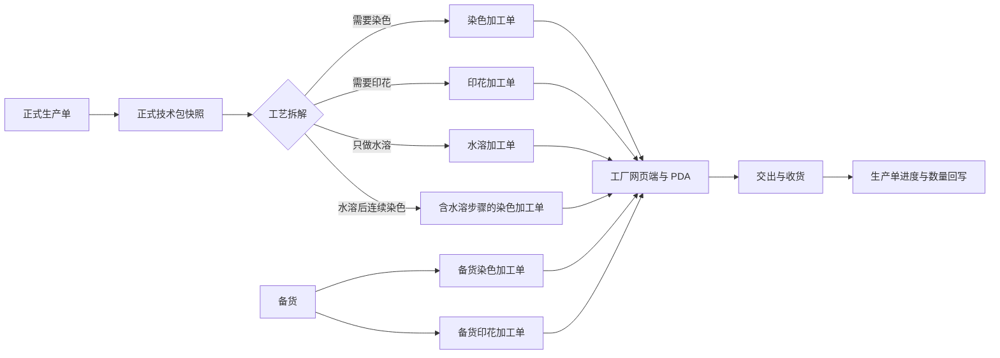
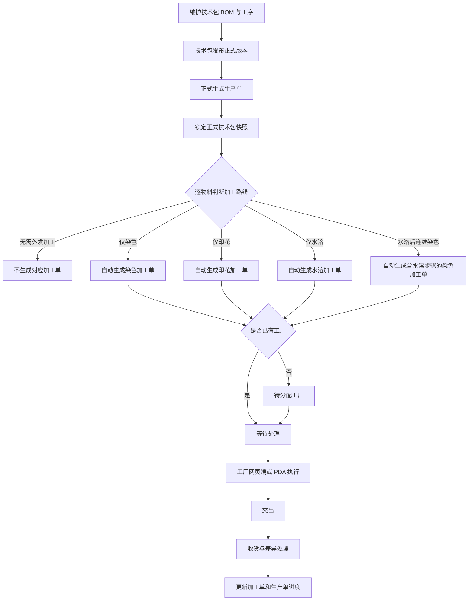
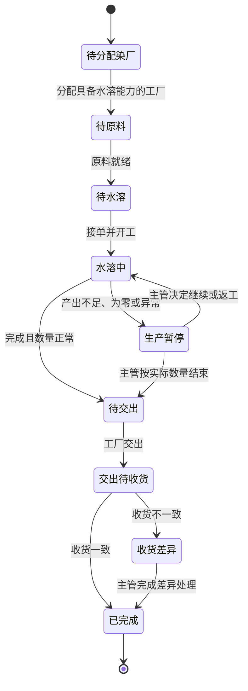
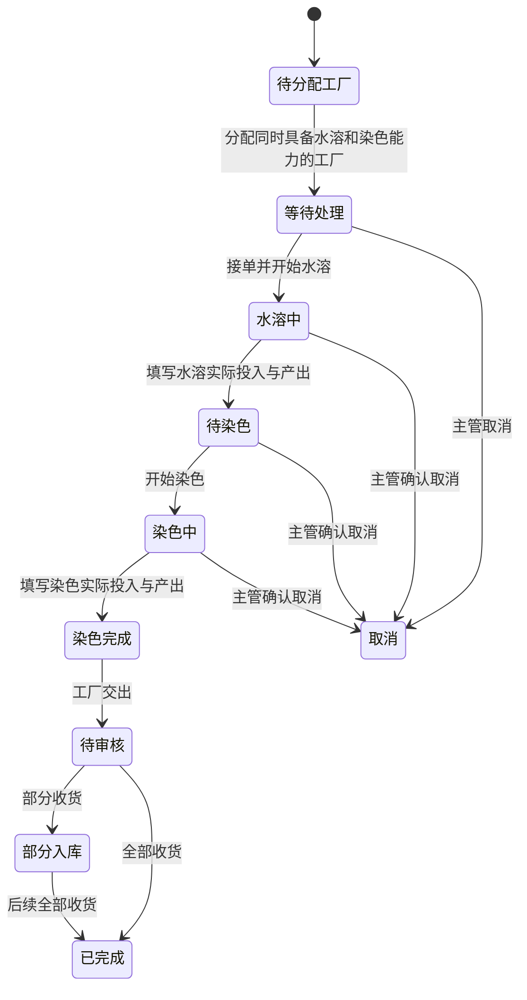
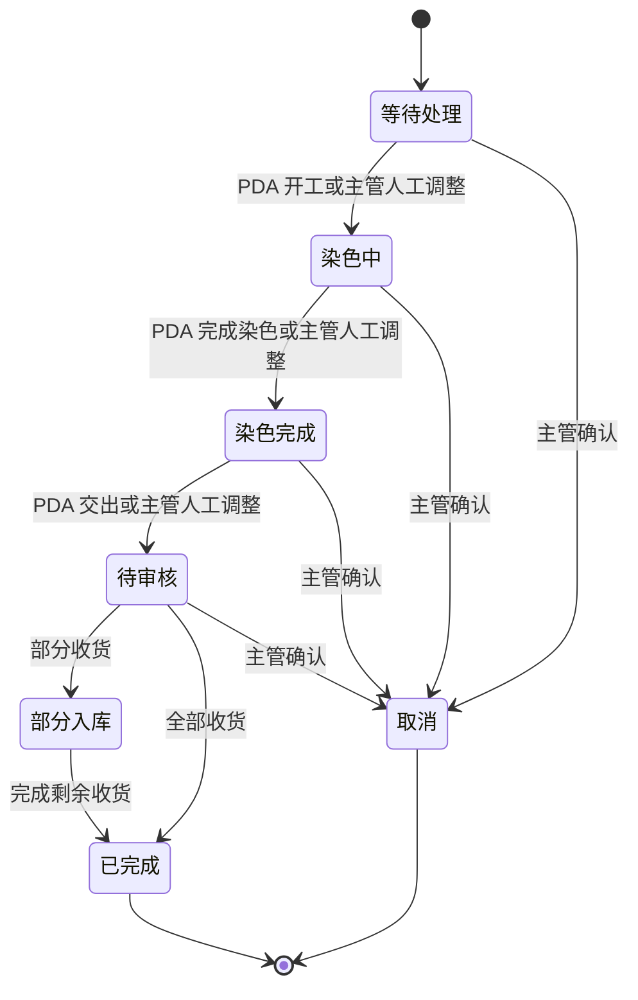
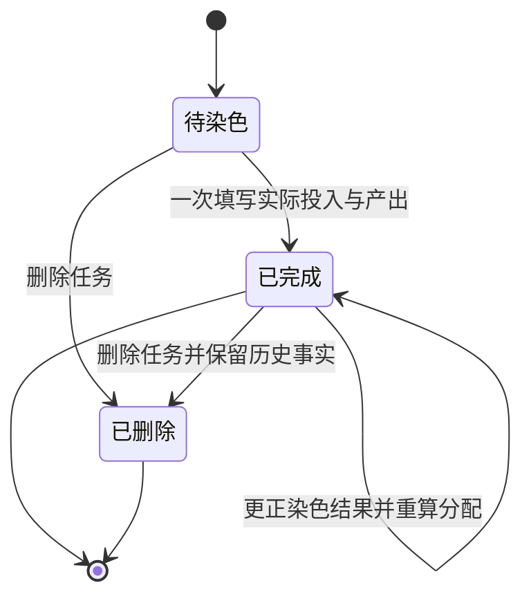
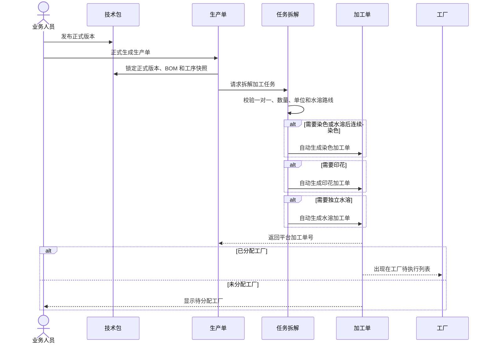
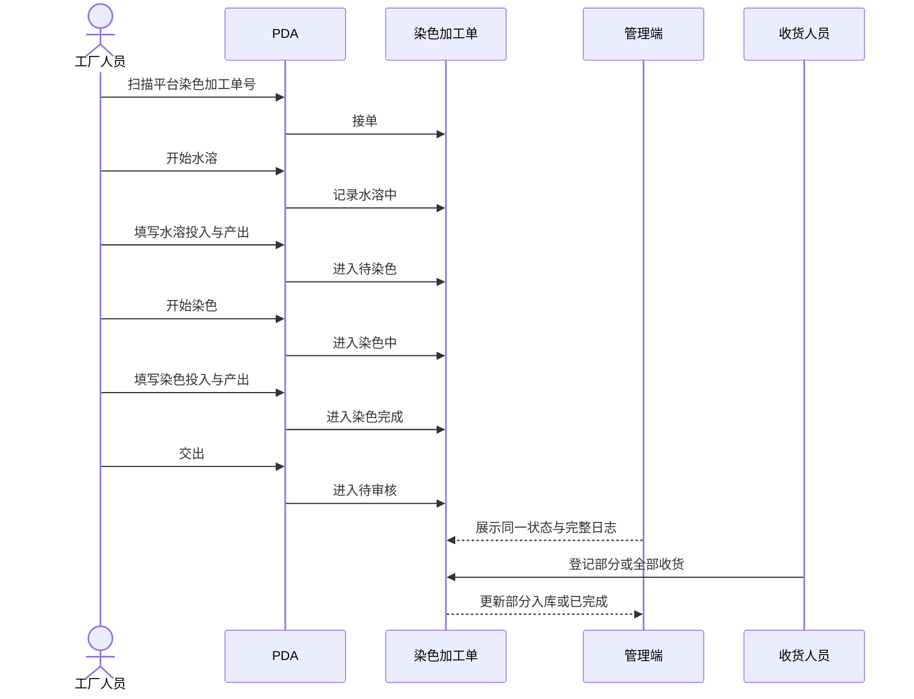

# 染色、印花需求单取消与水溶工序产品需求文档

## 1. 文档信息

| 项目 | 内容 |
|---|---|
| 文档名称 | 染色、印花需求单取消与水溶工序产品需求文档 |
| 文档用途 | 产品、研发、测试、实施及业务验收依据 |
| 适用范围 | 生产单生成、技术包、染色、印花、水溶、染厂管理及 PDA 现场执行 |
| 文档状态 | 研发交付版 |
| 版本 | V1.0 |
| 更新日期 | 2026 年 7 月 18 日 |

## 2. 版本覆盖说明

本文档统一定义以下两项产品调整：

1. 取消“染色需求单”和“印花需求单”两个独立业务对象，加工单直接承接生产单或备货来源。
2. 新增正式“水溶”工序，支持“独立水溶”和“水溶后连续染色”两类执行方式。

本文档是本次研发的统一口径。此前文档中凡存在以下描述，均以本文档为准：

- “生产单先生成染色需求单或印花需求单，再由业务人员按需求创建加工单”；
- “染色加工单或印花加工单以需求单号作为来源业务单号”；
- “水溶后先生成染色需求单，再创建染色加工单”；
- “染色需求单或印花需求单承担数量满足、分配或回货归集”。

此前已确认且不与本文冲突的水溶数量、工厂能力、交出、收货、日志及 PDA 防错规则继续有效。

## 3. 背景与问题

现有链路中，生产单、染色或印花需求单、染色或印花加工单之间存在一层重复业务对象。由于业务已经确认：

- 一张染色或印花加工单只对应一个生产单；
- 一个生产单的同一种加工类型不允许拆成多张加工单；
- 加工结果直接服务于对应生产单；

因此，染色需求单和印花需求单没有独立的拆分、合并、审批或履约价值，反而造成以下问题：

- 来源链路过长，业务人员需要在需求单和加工单之间来回查找；
- 需求单号与加工单号并存，工厂端容易使用错误单号；
- 数量满足关系重复维护，容易出现需求单与加工单状态、数量不一致；
- 水溶工序接入时，如果继续经过需求单，会进一步放大对象和状态复杂度；
- 生产单变更时，需要同时同步需求单和加工单，容易形成多套事实。

本次调整后，正式生产单和正式技术包快照是加工任务的业务来源，加工单是染色或印花执行的唯一载体，平台加工单号是平台端、工厂网页端及 PDA 端共同使用的唯一业务单号。

## 4. 产品目标

### 4.1 业务目标

- 删除没有独立业务价值的染色、印花需求层。
- 正式生产单生成后，自动形成可执行的染色、印花加工单。
- 通过正式技术包 BOM 和工序配置决定是否需要水溶。
- 保证水溶、染色、印花从生产来源到工厂执行、交出、收货全程使用同一套事实。
- 保留工厂主管人工维护加工单状态的业务方式，同时允许 PDA 按现场动作推进相同状态。
- 保证历史单据可追溯，取消页面不等于删除历史执行证据。

### 4.2 成功标准

- 新生成的染色、印花加工单不再依赖任何染色、印花需求单。
- 任一正式生产单的同一种加工类型只生成一张加工单，重复触发不产生重复单据。
- 无工厂时仍生成加工单，并明确显示“待分配工厂”。
- 所有端只使用平台加工单号，不存在工厂自编加工单号。
- 技术包标记“需先水溶”的物料，能够正确生成独立水溶加工单或水溶后连续染色任务。
- 页面、导出、打印、日志和 PDA 均不再展示染色需求单号、印花需求单号。

## 5. 范围

### 5.1 本期范围

- 取消染色需求单、印花需求单菜单、页面、业务单号和新单生成逻辑。
- 正式生产单自动生成染色加工单、印花加工单。
- 保留通过备货创建染色加工单、印花加工单的能力。
- 新增水溶工序字典、技术包配置、生产任务拆解、独立水溶加工单及水溶后连续染色。
- 调整染色、印花、水溶在管理端、工厂端及 PDA 端的状态和来源展示。
- 调整加工单导出、打印流程卡、操作日志及历史迁移策略。
- 保留“合并染色”能力，并使其使用取消需求单后的加工单事实。

### 5.2 不在本期范围

- 不取消通用的“生产需求单”；本次只取消“染色需求单”和“印花需求单”。
- 不新增水溶后连续印花的组合工艺。若后续确有“水溶后印花”需求，另行定义。
- 不新增备货水溶加工单；备货染色加工单不得临时附加水溶工序。
- 不改变印花加工的既有现场工艺步骤和执行状态，只调整来源、生成方式、单号和追溯关系。
- 不允许业务人员手工拆分或合并染色、印花加工单。
- 不用真实删除方式清除历史需求数据和历史执行记录。

## 6. 术语与业务对象

| 名称 | 定义 |
|---|---|
| 正式生产单 | 已正式生成、可以进入任务拆解的生产业务单据 |
| 正式技术包快照 | 生产单正式生成时锁定的技术包版本、BOM 和工序配置 |
| 染色加工单 | 染色执行的唯一业务载体，一张单只属于一个生产单或一笔备货来源 |
| 印花加工单 | 印花执行的唯一业务载体，一张单只属于一个生产单或一笔备货来源 |
| 水溶加工单 | 仅在“只做水溶、完成后需交给其他环节或工厂”时生成的独立加工单 |
| 水溶后连续染色 | 水溶与染色由同一染厂连续完成，中间不交出，只生成一张含水溶步骤的染色加工单 |
| 平台加工单号 | 平台生成的染色、印花或水溶加工单号，也是工厂网页端、PDA、导出和打印使用的唯一单号 |
| 合并染色任务 | 多张符合条件的染色加工单共同执行一次染色的任务，不改变原加工单归属 |
| 计划数量 | 根据生产单和正式技术包快照计算出的加工计划数量 |
| 实际投入数量 | 本次加工实际投入的原料数量 |
| 实际产出数量 | 本次加工完成后可交付的产出数量 |

## 7. 核心业务原则

### 7.1 唯一事实原则

生产单、正式技术包快照和加工单共同构成正式业务事实：

- 生产单定义生产归属、下单时间和生产数量；
- 正式技术包快照定义物料、单位、损耗、颜色和工艺路线；
- 加工单定义加工工厂、执行状态、实际数量、交出、收货和日志。

染色需求单、印花需求单不再作为业务事实，也不再承担数量、状态、来源或追溯职责。

### 7.2 一对一和禁止拆并原则

- 一个生产单需要染色时，只能有一张生产来源的染色加工单。
- 一个生产单需要印花时，只能有一张生产来源的印花加工单。
- 一张染色或印花加工单不得关联多个生产单。
- 一个生产单的同一种加工类型不得拆成多张加工单。
- 重复执行生成动作时，系统返回已存在的加工单，不得新增重复单据。
- 若同一生产单内的物料存在无法由一张加工单承接的相互冲突工艺，系统必须阻止生产单正式生成，并提示修正技术包，不得静默拆单。

### 7.3 加工单号唯一原则

- 加工单号只能由平台生成。
- 工厂网页端和 PDA 端不得创建、编辑或补录另一套工厂加工单号。
- 列表、详情、扫码、导出、流程卡、日志、交出和收货均使用平台加工单号。
- 历史需求单号不得作为加工单号的回退值。

### 7.4 工厂与执行状态分离原则

- 工厂分配是归属维度，执行状态是进度维度，两者不得混为一个状态。
- 未分配工厂的加工单仍然正式存在，工厂显示“待分配工厂”，执行状态显示“等待处理”。
- 未分配工厂的加工单不得在 PDA 接单或开工。
- 分配工厂后，工厂才可在网页端或 PDA 端执行。

## 8. 调整后的对象关系

说明：图中不存在染色需求单和印花需求单。水溶后连续染色不是两张加工单，而是一张染色加工单中的两个连续步骤。

## 9. 总体业务流程

## 10. 取消染色需求单和印花需求单

### 10.1 取消内容

系统停止提供以下内容：

- 染色需求单菜单、列表、详情、筛选、导出和业务单号；
- 印花需求单菜单、列表、详情、筛选、导出和业务单号；
- “按需求创建染色加工单”和“按需求创建印花加工单”入口；
- 加工单中的需求单号、需求满足数量、需求分配明细和需求单跳转；
- 交出、收货和回货环节对需求单数量的二次分配；
- 以需求单作为生产单与加工单之间的状态中介。

### 10.2 保留内容

- 通用“生产需求单”继续保留，不在本次取消范围内。
- 历史染色、印花需求记录以只读审计数据保留，不再作为可操作业务对象。
- 已存在加工单的加工单号、状态、实际数量、工厂、交出、收货及日志全部保留。
- 备货创建染色、印花加工单的能力继续保留。

### 10.3 删除影响结论

本次取消属于业务对象退役，不是直接物理删除历史数据。完成迁移后：

- 新业务不再生成染色、印花需求记录；
- 页面不再展示或依赖需求单；
- 历史需求记录只用于审计和迁移核对；
- 已执行事实不会因需求单退役而丢失；
- 研发不得在新逻辑中通过历史需求数据反向补全加工单事实。

## 11. 加工单自动生成规则

### 11.1 生成时点

生产单正式生成成功后，系统立即读取正式技术包快照并自动生成对应加工单。

- 技术包草稿、生产单草稿或仅保存操作均不生成加工单。
- 生成成功后，生产单详情立即可查看对应加工单。

生成失败时不得静默跳过：

- 生产单保留正式状态，同时显示“加工任务生成失败”和具体失败原因；
- 失败的加工类型在恢复前不得进入后续派厂或执行；
- 系统自动重试，业务人员也可手工发起“重新生成加工任务”；
- 重试继续使用同一正式技术包快照，并执行幂等校验；
- 重试不得生成重复加工单或重复平台加工单号；
- 失败和每次重试均进入操作日志，直至全部必需加工单生成成功。

### 11.2 生成条件

| 正式技术包工艺结果 | 系统结果 |
|---|---|
| 无染色、无印花、无独立水溶 | 不生成本次范围内的加工单 |
| 需要染色，不需先水溶 | 生成一张染色加工单 |
| 需要印花 | 生成一张印花加工单 |
| 只需水溶，水溶后不由同一染厂连续染色 | 生成独立水溶加工单 |
| 需先水溶，随后由同一染厂连续染色 | 生成一张含水溶步骤的染色加工单 |
| 同时需要染色和印花 | 分别生成一张染色加工单和一张印花加工单 |

### 11.3 幂等规则

系统必须以“生产单 + 加工类型”判断加工单是否已存在：

- 已存在染色加工单时，再次触发只返回原染色加工单；
- 已存在印花加工单时，再次触发只返回原印花加工单；
- 已存在独立水溶加工单时，再次触发只返回原水溶加工单；
- 并发触发时也只能成功生成一张对应加工单；
- 失败重试不得产生重复单号或重复任务。

### 11.4 加工单必须固化的信息

加工单生成时必须保存以下业务快照：

- 来源类型：生产或备货；
- 生产单号、生产单下单时间；
- 正式技术包版本；
- 商品、颜色、尺码汇总及生产数量；
- BOM 物料、物料单位、单耗和损耗率；
- 目标颜色和工艺；
- 是否需先水溶及水溶路线；
- 计划加工数量和单位；
- 计划完成时间；
- 已分配工厂，或“待分配工厂”；
- 平台加工单号。

## 12. 数量计算与一致性规则

### 12.1 计划数量

生产来源加工单的计划数量以正式技术包快照为准：

> 计划数量 = 适用商品规格的生产数量 × 对应 BOM 单耗 ×（1 + 损耗率）

规则：

- 按 BOM 物料原生单位计算和展示，不得擅自换算单位。
- 同一加工单包含多条物料明细时，每条明细独立计算，汇总值只可汇总相同单位。
- 单耗、损耗率或单位缺失时，阻止生产单正式生成，并明确提示缺失项。
- 计划数量不允许在加工单上脱离生产单和正式技术包快照随意修改。

### 12.2 实际数量约束

染色加工数量遵守以下基本关系：

> 计划数量 ≥ 实际投入数量 ≥ 实际产出数量 ≥ 交出数量 ≥ 已收货数量

若业务允许超计划投入，必须填写原因并二次确认，系统保留异常标记；不得通过修改计划数量掩盖超量事实。

水溶后连续染色时：

> 水溶实际产出数量是后续染色实际投入数量的上限

系统不得允许染色投入数量超过同一加工单的水溶产出数量。

### 12.3 回货满足关系

- 染色回货数量直接归属于对应染色加工单。
- 印花回货数量直接归属于对应印花加工单。
- 独立水溶收货数量直接归属于对应水溶加工单。
- 系统不再向染色需求单或印花需求单分配数量。
- 生产单进度由加工单的有效收货或完结事实直接更新。

## 13. 来源与备货策略

### 13.1 生产来源

- 来源显示生产单号，可进入生产单详情。
- 显示正式技术包版本和物料快照。
- 生产来源的染色加工单可以参加合并染色。
- 生产来源可以生成独立水溶或含水溶步骤的染色加工单。

### 13.2 备货来源

- 业务人员可通过备货入口创建染色加工单或印花加工单。
- 来源明确显示“备货”，不得伪造生产单号或需求单号。
- 备货加工单仍使用平台加工单号。
- 备货染色加工单不得参加合并染色。
- 备货染色加工单不得手工增加水溶步骤。
- 本期不支持创建备货水溶加工单。

## 14. 工厂分配策略

### 14.1 未分配工厂

正式生产单生成时，即使尚未确定工厂，也必须生成加工单：

- 工厂列显示“待分配工厂”；
- 执行状态显示“等待处理”；
- 管理端可以查看和分配；
- 工厂网页端和 PDA 不可接单、开工或交出。

### 14.2 工厂能力校验

| 加工类型 | 工厂必须具备的能力 |
|---|---|
| 染色加工单 | 染色能力 |
| 印花加工单 | 印花能力 |
| 独立水溶加工单 | 水溶能力 |
| 水溶后连续染色 | 同一工厂同时具备水溶和染色能力 |

不满足能力条件的工厂不得被选中。水溶后连续染色不允许在水溶和染色之间更换工厂。

### 14.3 改派工厂

- 管理端允许改派工厂，包括已开始执行的加工单。
- 改派不改变当前执行状态，不清空已发生的数量和日志。
- 原工厂立即失去后续操作权限。
- 新工厂必须重新接单后才可继续 PDA 操作。
- 改派必须填写原因并永久保留改派前后记录。
- 含水溶步骤的染色加工单改派时，新工厂必须同时具备水溶和染色能力。

## 15. 生产单变更策略

### 15.1 自动同步条件

当加工单尚未执行，且未加入合并染色任务时，生产单或正式技术包发生有效变更后：

- 系统同步最新有效快照；
- 重新计算计划数量、物料、颜色、工艺和水溶路线；
- 保留变更前后日志；
- 不改变平台加工单号；
- 不新增第二张同类型加工单。

### 15.2 保留原快照条件

加工单已发生下列任一情况时，不自动覆盖原快照：

- 已接单或已开工；
- 已填写实际数量；
- 已交出或已收货；
- 已加入合并染色任务；
- 已取消或已完成。

系统必须保留原快照，并在生产单和加工单上提示“生产变更可能影响已生成加工任务”，由业务人员处理。

### 15.3 冲突处理

- 未执行的合并染色成员如需同步生产变更，必须先删除整个合并染色任务，释放成员后再同步。
- 已执行事实不得通过同步覆盖。
- 变更导致工艺类型取消时，未执行加工单可取消并保留记录；已执行加工单只可按异常流程收口。
- 变更导致新增染色或印花工艺时，系统补生成缺失的对应加工单，但仍须满足一对一规则。

## 16. 水溶工序定义

### 16.1 工序属性

“水溶”作为正式工序维护，至少包含：

- 工序名称：水溶；
- 所属生产阶段；
- 适用工厂类型；
- 是否启用；
- 是否需要独立交出；
- 是否允许与染色连续执行；
- 计划数量单位来源；
- 工厂能力要求。

水溶不是备注、标签或染色状态，必须作为可配置、可拆解、可执行、可追溯的正式工序。

### 16.2 技术包配置

技术包需要在同一 BOM 物料上明确：

- 是否需要水溶；
- 水溶后是否连续染色；
- 适用商品规格；
- 单耗、损耗率和单位；
- 后续染色工艺及目标颜色。

规则：

- 是否需水溶必须绑定到具体 BOM 物料，不能只在整份技术包上做笼统标记。
- 所有 BOM 物料类型均可按业务需要配置水溶，不限于某一固定物料类别。
- 技术包草稿可编辑，但不触发加工单变化。
- 只有发布正式版本并被生产单引用后，配置才成为生产事实。
- 已被执行加工单引用的历史快照不得被新版本覆盖。

### 16.3 水溶路线判定

| BOM 配置 | 生成结果 |
|---|---|
| 不需水溶 | 按其他工艺正常拆解 |
| 需要水溶，完成后需独立交出 | 生成独立水溶加工单 |
| 需要水溶，随后同厂连续染色 | 不生成独立水溶加工单，生成含水溶步骤的染色加工单 |
| 需要水溶，但未配置后续方式 | 阻止生产单正式生成，提示补充水溶路线 |
| 连续染色但未配置染色工艺或目标颜色 | 阻止生产单正式生成 |

## 17. 独立水溶加工单

### 17.1 适用场景

当物料完成水溶后需要独立交出、交给其他工厂或进入其他环节时，生成独立水溶加工单。

### 17.2 单据粒度

- 一张独立水溶加工单只属于一个生产单和一条明确的 BOM 物料加工事实。
- 同一物料不得重复生成独立水溶加工单。
- 若同一生产单存在多条互不相同且均需独立水溶的 BOM 物料，可分别形成水溶加工单，避免不同单位、材质或交付对象混在一张单内。

### 17.3 执行规则

- 分配具备水溶能力的工厂后才能接单。
- 工厂完成水溶时一次填写本单累计实际投入数量和累计实际产出数量。
- 实际产出小于计划数量或等于零时，必须填写原因，状态进入“生产暂停”，由主管决定继续、返工或按实际结束。
- 实际产出大于计划数量时，必须填写原因并二次确认。
- 独立水溶只允许一次交出，不支持分批、多次交出。
- 收货数量与交出数量不一致时进入差异处理，不得自动改写交出事实。

### 17.4 状态图

## 18. 水溶后连续染色

### 18.1 业务原则

- 只生成一张染色加工单，不生成独立水溶加工单。
- 水溶和染色由同一染厂连续完成。
- 水溶完成后不发生中间交出、收货或工厂切换。
- 染色加工单详情和流程卡必须明确显示“水溶 → 染色”。
- PDA 每次只突出当前步骤和当前主动作。

### 18.2 执行顺序

### 18.3 数量控制

- 水溶完成时填写水溶实际投入和实际产出。
- 染色开始前，系统展示水溶实际产出作为最大可投入数量。
- 染色实际投入不得超过水溶实际产出。
- 染色实际产出不得超过染色实际投入。
- 最终交出和收货使用染色产出数量，不使用水溶产出数量。
- 所有数量变化进入同一加工单日志，但需明确标注所属步骤。

## 19. 染色加工单状态与人工操作

### 19.1 标准执行状态

不含水溶步骤的染色加工单使用以下状态：

1. 等待处理；
2. 取消；
3. 染色中；
4. 染色完成；
5. 待审核；
6. 部分入库；
7. 已完成。

### 19.2 管理端人工改状态

染厂主管继续通过“染色加工单”页面人工选择状态，这是管理端唯一的状态维护方式。

- 系统不额外建立复杂审批状态机。
- 对取消、状态回退、部分入库、已完成等高风险操作进行二次确认。
- 人工改状态不得捏造并不存在的接单、开工、交出或收货数量。
- 如果目标状态要求数量事实，而当前数量缺失，系统必须提示先补齐对应事实。
- 已完成为终态，不允许直接改回执行中；如需修正数量，发起“更正染色结果”。

### 19.3 PDA 状态映射

PDA 可以推进状态，但推进结果必须与管理端使用同一套状态：

| PDA 动作 | 加工单状态变化 |
|---|---|
| 接单 | 仍为“等待处理”，记录接单人和接单时间 |
| 开工 | 进入“染色中” |
| 完成染色 | 进入“染色完成” |
| 交出 | 进入“待审核” |
| 部分收货 | 进入“部分入库” |
| 全部收货 | 进入“已完成” |
| 管理端取消 | 进入“取消” |

管理端和 PDA 操作同一加工单，不允许各自维护一套独立状态。

### 19.4 状态图

## 20. “更正染色结果”规则

已完成的单张染色加工单或合并染色任务允许发起“更正染色结果”。

- 只允许修改实际投入数量和实际产出数量。
- 必须填写更正原因。
- 系统永久保留更正前值、更正后值、操作人和操作时间。
- 合并染色任务更正后，系统按原生产单顺序重新计算分配。
- 不允许通过更正改变成员、工厂、物料、颜色、工艺或分配顺序。
- 更正后若影响交出或收货事实，系统必须提示业务处理差异，不得静默覆盖历史收货。

## 21. 合并染色规则

### 21.1 定义

合并染色是多张染色加工单共同执行一次染色，不是真正合并加工单。

- 原染色加工单继续存在并保持各自生产单归属。
- 合并染色任务只负责成员锁定、一次实际投入、一次实际产出和结果分配。
- 不生成新的合并加工单号，不替代成员加工单号。

### 21.2 创建条件

染厂主管完全手工选择成员，系统只校验：

- 至少选择两张染色加工单；
- 全部来源于生产单；
- 同一染厂；
- 同一面料；
- 同一目标颜色；
- 同一染色工艺；
- 未加入其他有效合并染色任务。

系统不增加“必须可投缸”等额外基础状态限制。

### 21.3 锁定与删除

- 合并染色任务创建后立即锁定成员，不允许增加、删除或替换成员。
- 如成员选择错误，只能删除整个合并染色任务后重新创建。
- 合并染色任务始终允许删除。
- 删除为业务软删除，必须保留任务、成员、实际投入、实际产出、分配结果、删除人、删除时间和删除原因。
- 已满足数量继续保留为历史有效事实；部分满足和未满足成员被释放，可由业务继续处理。

### 21.4 一次执行

- 创建时不填写数量。
- 一个合并染色任务只执行一次，不支持多次投缸。
- 染色完成后一次填写实际投入总量和实际产出总量。
- 本次实际产出不足时，未满足部分直接记为“未满足”或“部分满足”并终止，不在本任务中继续染。

### 21.5 分配顺序

实际产出按以下固定顺序分配：

1. 生产单下单时间升序；
2. 下单时间相同时，生产单号升序；
3. 必须先满足上一张生产单对应加工单，才能满足下一张；
4. 主管不得手工调整顺序或分配数量。

例如，三张加工单计划数量依次为 400 Yard、350 Yard、250 Yard，实际产出为 800 Yard，则分配结果为：第一张 400 Yard“已满足”，第二张 350 Yard“已满足”，第三张 50 Yard“部分满足”；剩余 200 Yard 本任务终止后不再继续染。

### 21.6 超量与不足

- 产出不足：按固定顺序分配，未分配部分直接终止。
- 产出超出成员总计划量：超量只记录在合并染色任务上，不自动分配给生产单，不自动入备货，也不自动记为损耗。
- 实际投入或产出异常必须填写原因并保留日志。

### 21.7 状态

合并染色任务只使用：

- 待染色；
- 已完成；
- 已删除。

成员满足结果使用：

- 已满足；
- 部分满足；
- 未满足。

## 22. 端到端时序

### 22.1 正式生产单生成加工单

### 22.2 水溶后连续染色执行

## 23. 页面与菜单调整总表

以下名称均为用户可见的菜单或页面名称，不是代码名称或路由名称。

| 所属系统或菜单 | 页面或菜单名称 | 调整类型 | 调整内容 |
|---|---|---|---|
| 生产单管理 | 染色需求单 | 删除 | 删除菜单、列表、详情、导出、单号及新建逻辑；历史数据仅后台审计保留 |
| 生产单管理 | 印花需求单 | 删除 | 删除菜单、列表、详情、导出、单号及新建逻辑；历史数据仅后台审计保留 |
| 生产单管理 | 生产单任务生成规则 | 调整 | 输出由需求单改为染色、印花、水溶加工单；增加一对一、幂等、异常阻断及水溶路线规则 |
| 生产单管理 | 生产单管理 | 调整 | 生产单详情直接展示染色、印花、水溶加工单及状态，不再展示染色、印花需求单节点 |
| 生产单管理 | 生产单变更管理 | 调整 | 增加未执行自动同步、已执行或合并染色保留快照及变更影响提示 |
| 生产单管理 | 生产准备时效 | 调整 | 移除染色、印花需求单节点；本期不把水溶新增为生产准备时效指标 |
| 生产单管理 | 生产准备时效统计 | 调整 | 不再按染色、印花需求单统计；本期不新增水溶时效统计 |
| 生产单管理 | 工序工艺字典 | 调整 | 新增正式“水溶”工序及工厂能力、连续染色、是否独立交出等配置 |
| 技术包 | 技术包详情 - BOM | 调整 | 每条 BOM 物料可配置是否需水溶、适用规格、单耗、损耗率和单位 |
| 技术包 | 技术包详情 - 工序 | 调整 | 展示水溶工序及“独立水溶”或“水溶后连续染色”路线 |
| 任务编排与执行准备 | 任务清单 | 调整 | 直接展示加工单任务和进度，删除染色、印花需求单中间节点 |
| 任务编排与执行准备 | 水溶加工单 | 新增/调整 | 展示生产来源的独立水溶加工单、数量、工厂、状态、交出、收货和日志 |
| 任务编排与执行准备 | 染色加工单 | 调整 | 自动承接生产单；保留备货创建；移除按需求创建、需求单号和需求满足明细；增加水溶路线快照 |
| 任务编排与执行准备 | 印花加工单 | 调整 | 自动承接生产单；保留备货创建；移除按需求创建、需求单号和需求满足明细 |
| 染厂管理 | 染色加工单 | 调整 | 使用平台加工单号；保留人工改状态；显示来源、待分配工厂、七类执行状态和水溶当前步骤 |
| 染厂管理 | 水溶加工单 | 新增 | 展示分配给当前染厂的独立水溶任务，并提供接单、开工、完成、交出和异常处理 |
| 染厂管理 | 合并染色 | 新增/调整 | 主管手工选单、系统四项同类校验、成员锁定、一次完成、顺序分配、更正和软删除 |
| 染厂管理 | 染色待加工仓 | 调整 | 待加工物料直接关联染色加工单，不再经过染色需求单 |
| 染厂管理 | 染色待交出仓 | 调整 | 待交出数量直接归属染色加工单，并显示水溶后连续染色的最终染色产出 |
| 染厂管理 | 染色统计 | 调整 | 去除需求单维度，按加工单、来源、工厂、状态和数量统计 |
| 印花厂管理 | 印花加工单 | 调整 | 使用平台加工单号；直接显示生产或备货来源；移除需求单号和需求跳转 |
| 印花厂管理 | 印花待加工仓 | 调整 | 待加工物料直接关联印花加工单，不再经过印花需求单 |
| 印花厂管理 | 印花待交出仓 | 调整 | 待交出和收货直接归属印花加工单 |
| 印花厂管理 | 印花统计 | 调整 | 去除需求单维度，按加工单、来源、工厂、状态和数量统计 |
| PDA | 执行 | 调整 | 不新增底部菜单；支持染色、印花、独立水溶和含水溶染色任务，按当前步骤展示单一主动作 |
| PDA | 扫码执行页 | 调整 | 只识别平台加工单号，禁止工厂自编单号；展示中文业务状态和当前步骤 |
| 打印与导出 | 染整生产流程卡 | 调整 | 使用平台加工单号，移除需求单号；水溶路线中印双语展示，二维码指向同一加工单 |
| 全生命周期跟踪 | 生产单全生命周期跟踪 | 调整 | 从生产单直接连接染色、印花、水溶加工单，删除需求单中间节点 |

## 24. 重点页面详细要求

### 24.1 “生产单任务生成规则”

页面需明确展示：

- 触发时点为生产单正式生成；
- 染色、印花加工单自动生成；
- 水溶路线如何判定；
- 一生产单一加工类型一张加工单；
- 重复触发返回原单；
- 工艺冲突、单位缺失、数量缺失等阻断原因；
- 生成结果中的加工单号和失败明细。

页面不得继续出现“生成染色需求单”“生成印花需求单”“按需求创建加工单”等说明。

### 24.2 “生产单管理”

生产单详情增加“加工任务”区域，按加工类型展示：

- 平台加工单号；
- 加工类型；
- 来源物料；
- 工艺路线；
- 计划数量及单位；
- 工厂或“待分配工厂”；
- 当前状态；
- 是否存在生产变更影响；
- 查看加工单入口。

不得展示染色需求单号、印花需求单号或需求满足比例。

### 24.3 “染色加工单”

列表至少展示：

- 平台染色加工单号；
- 来源类型与生产单号；
- 商品和物料；
- 目标颜色、染色工艺；
- 是否含水溶步骤；
- 计划数量、实际投入、实际产出、交出、已收货；
- 工厂或“待分配工厂”；
- 执行状态；
- 计划完成时间；
- 查看、编辑、日志操作。

编辑弹窗保留人工状态选择，并可维护计划完成时间、生产工厂、面料接收人、深浅、温度、数量和备注等线上认可内容。高风险状态必须二次确认。

详情需展示来源快照、数量关系、步骤进度、交出与收货、生产变更影响和操作日志。

### 24.4 “印花加工单”

沿用现有印花执行内容，但来源直接改为生产单或备货：

- 自动生成的生产来源单不可再显示需求单号；
- 备货来源明确显示“备货”；
- 平台印花加工单号贯穿工厂端、PDA、导出和打印；
- 交出、收货和统计直接归属于印花加工单。
- 本次不新增或重命名印花执行状态，管理端和 PDA 继续沿用现有印花状态及推进规则。

### 24.5 “水溶加工单”

管理端列表和详情至少展示：

- 平台水溶加工单号；
- 生产单号；
- 正式技术包版本；
- BOM 物料及适用规格；
- 计划数量、实际投入、实际产出和单位；
- 工厂；
- 当前状态；
- 异常原因；
- 交出数量和收货结果；
- 完整操作日志。

工厂端只可查看已分配给当前工厂的任务。

### 24.6 “合并染色”

列表展示任务号、染厂、面料、目标颜色、工艺、成员数、总计划数量、实际投入、实际产出、状态和操作。

创建页由主管手工勾选染色加工单，系统实时提示不满足条件的原因。创建成功后成员立即锁定。

完成页只填写一次实际投入总量、实际产出总量和备注；提交后展示按生产单顺序形成的分配结果。

详情页永久展示成员、排序依据、满足结果、更正记录和删除记录。

### 24.7 PDA“执行”

- 不新增“水溶”底部菜单。
- 任务卡片用短文案区分“水溶加工”“染色加工”“染色加工（含水溶）”“印花加工”。
- 首屏突出平台加工单号、物料、数量、当前步骤和唯一主动作。
- 含水溶染色按“开始水溶 → 完成水溶 → 开始染色 → 完成染色 → 交出”顺序推进。
- 非当前步骤按钮不得同时出现。
- 现场错误需使用直接中文提示，不显示英文状态码。
- 网络或重复点击导致重复提交时，不得重复推进状态或重复记数量。

## 25. 打印与导出

### 25.1 通用规则

- 列表导出、详情导出和流程卡均使用平台加工单号。
- 不导出染色需求单号、印花需求单号和需求满足明细。
- 来源为生产时显示生产单号；来源为备货时显示“备货”。
- 状态必须展示中文业务名称。
- 数量必须带单位，不同单位不得错误汇总。

### 25.2 染整生产流程卡

流程卡保持中文、印尼语双语，至少包含：

- 平台加工单号及二维码；
- 生产单号；
- 下单日期、开单日期和是否加急；
- 商品、物料、颜色、成分、幅宽、克重；
- 计划数量和单位；
- 工艺路线；
- 若含水溶，明确显示“水溶 / Pelarutan → 染色 / Pencelupan”；
- 各现场步骤签名或记录区域。

二维码扫描后必须进入同一平台加工单，不得生成工厂侧平行编号。

## 26. 权限与操作边界

| 角色 | 主要权限 |
|---|---|
| 技术包人员 | 配置 BOM、水溶标记和工艺路线，发布正式版本 |
| 生产业务人员 | 正式生成生产单、查看自动生成加工单、分配工厂、处理生产变更影响 |
| 染厂主管 | 查看本厂任务、人工修改染色状态、创建合并染色、更正结果、处理水溶异常和改派后的接单 |
| 工厂操作员 | 在 PDA 接单、开工、完成和交出，不可修改来源、计划数量或加工单号 |
| 收货人员 | 登记交出后的部分或全部收货，处理或上报数量差异 |
| 审计或管理员 | 查看历史需求迁移记录、全量操作日志和异常处理记录 |

关键限制：

- 工厂端不得新建生产来源加工单。
- 工厂端不得修改平台加工单号。
- PDA 不得跳过前置步骤。
- 只有具备相应能力的工厂可被分配。
- 已执行事实不得因生产变更或历史迁移被覆盖。

## 27. 日志与审计

以下动作必须永久记录操作人、时间、前值、后值和原因：

- 加工单自动生成及重复生成拦截；
- 工厂分配、改派和重新接单；
- 管理端人工状态调整；
- PDA 接单、开工、完成和交出；
- 实际投入、实际产出、交出和收货数量；
- 水溶异常、暂停、继续、返工和按实际结束；
- 生产单变更后的自动同步或保留快照；
- 合并染色创建、完成、分配、更正和删除；
- 染色结果更正；
- 历史需求数据迁移和核对结果。

日志内容不得只写“已修改”，必须能看出修改了什么业务事实。

## 28. 异常与防错策略

| 异常场景 | 系统处理 |
|---|---|
| 正式技术包缺少 BOM 单耗、单位或损耗率 | 阻止生产单正式生成，列出缺失物料 |
| 配置需水溶但未选择独立或连续路线 | 阻止生成，提示补充水溶路线 |
| 连续染色缺少染色工艺或目标颜色 | 阻止生成 |
| 同一生产单同一加工类型已存在加工单 | 返回原加工单，不重复生成 |
| 同一生产单存在无法由一张同类型加工单承接的冲突工艺 | 阻止生成并要求修正技术包，不自动拆单 |
| 无可用工厂 | 正常生成加工单并显示“待分配工厂” |
| 工厂能力不匹配 | 禁止分配并提示缺少的能力 |
| 未分配工厂尝试 PDA 接单 | 拒绝操作并提示先分配工厂 |
| 工厂自编或修改加工单号 | 拒绝保存 |
| 水溶产出小于计划或为零 | 必填原因并进入“生产暂停” |
| 染色投入超过水溶产出 | 拒绝提交 |
| 实际产出超过实际投入 | 拒绝提交 |
| 交出超过实际产出 | 拒绝提交 |
| 收货超过交出 | 拒绝提交 |
| 独立水溶尝试多次交出 | 拒绝并提示本单只允许一次交出 |
| 已执行加工单遇生产变更 | 保留原快照并提示业务处理 |
| 合并染色成员遇生产变更 | 提示先删除合并任务后再处理，已执行事实不覆盖 |
| 合并染色实际产出不足 | 按固定顺序分配，部分或未满足后终止 |
| 合并染色实际产出超量 | 超量留在任务记录，不自动分配 |
| 重复点击 PDA 动作 | 按同一动作幂等处理，不重复记账或跳状态 |

## 29. 历史数据迁移

### 29.1 迁移原则

- 需求单退役采用“停止生成、停止展示、历史只读”的方式。
- 不删除已执行加工单，不重编号，不覆盖状态和数量。
- 新链路以生产单、正式技术包快照和加工单为事实源。
- 历史需求单号仅可作为迁移审计参考，不在新页面、导出、打印或 PDA 展示。

### 29.2 迁移分类

| 历史情况 | 迁移处理 |
|---|---|
| 已有需求单且已有加工单 | 为加工单补齐直接生产来源和正式快照关联，保留原加工单号和执行事实 |
| 已有需求单但尚无加工单，生产单仍有效 | 根据生产单和正式技术包快照生成加工单，不使用可变的需求单字段作为最终事实 |
| 需求单已关闭或取消 | 归档为只读审计记录，不生成新加工单 |
| 历史备货加工单 | 保持“备货”来源，不补造生产单号或需求单号 |
| 已执行加工单与生产单当前数据不一致 | 保留加工单执行快照，记录迁移差异，禁止自动覆盖 |
| 同一生产单存在多张同类型有效加工单 | 列入人工核对清单，迁移前必须明确主单和历史处理方式 |

### 29.3 上线前核对清单

研发需输出并由业务确认以下核对结果：

- 有效生产单缺少染色、印花或水溶加工单；
- 同一生产单存在重复同类型加工单；
- 加工单缺少生产来源或正式技术包快照；
- 加工单号重复或工厂端存在平行编号；
- 工厂能力与已分配任务不匹配；
- 计划、投入、产出、交出、收货数量关系异常；
- 历史需求单与加工单状态不一致；
- 含水溶物料未形成正确执行路线。

未解决的有效业务数据不得直接切换到新链路。

## 30. 上线切换策略

建议分四步切换：

1. **数据预检**：运行历史核对，修复有效数据冲突。
2. **能力上线**：上线水溶工序、技术包配置、加工单自动生成和新页面，但暂不开放正式生产切换。
3. **双向核对**：选取真实生产单验证新加工单与原业务预期一致，期间禁止产生重复加工单。
4. **正式切换**：停止生成和展示染色、印花需求单，所有新生产单直接生成加工单。

切换后不得保留两个可同时写入的生成入口。

## 31. 非功能要求

### 31.1 一致性

- 管理端、工厂网页端和 PDA 状态必须一致。
- 平台加工单号在所有端一致。
- 同一数量事实在列表、详情、导出、流程卡和统计中一致。
- 重复请求、网络重试和多人同时操作不得产生重复加工单或重复数量记录。

### 31.2 可追溯性

- 任一加工单可追溯到生产单、正式技术包版本和 BOM 物料。
- 任一现场动作可追溯到人员、时间、设备或操作入口。
- 历史更正、删除和迁移不得覆盖原记录。

### 31.3 可用性

- PDA 首屏只展示现场执行必需信息和一个主要动作。
- 所有状态、提示和异常使用中文业务文案，不展示英文状态码。
- 列表、日志和明细均需分页；宽表在表格内部滚动并固定操作列。
- 页面轻交互不应引起整页闪烁、滚动位置丢失或明显等待。

## 32. 验收场景

### 32.1 取消需求单

1. 正式生成仅需染色的生产单，系统直接生成一张染色加工单，不生成染色需求单。
2. 正式生成仅需印花的生产单，系统直接生成一张印花加工单，不生成印花需求单。
3. 同一生产单重复触发任务生成，仍只有一张同类型加工单。
4. 所有菜单、详情、导出、打印和 PDA 均找不到染色、印花需求单号。
5. 历史已执行加工单在需求单退役后仍可完整查看状态、数量和日志。

### 32.2 待分配工厂

1. 生产单未指定加工厂时，加工单仍成功生成。
2. 列表显示“待分配工厂”和“等待处理”。
3. PDA 无法接单。
4. 分配匹配能力的工厂后，任务出现在对应工厂并可接单。

### 32.3 独立水溶

1. BOM 物料配置独立水溶后，正式生产单生成独立水溶加工单。
2. 工厂不具备水溶能力时无法被分配。
3. 产出不足时必须填写原因并进入“生产暂停”。
4. 独立水溶只允许一次交出。
5. 收货差异被保留并进入差异处理。

### 32.4 水溶后连续染色

1. 系统只生成一张含水溶步骤的染色加工单。
2. 只能选择同时具备水溶和染色能力的同一工厂。
3. PDA 按水溶、染色、交出的顺序显示主动作。
4. 染色投入超过水溶产出时系统拒绝提交。
5. 流程卡以中印双语显示水溶和染色连续路线。

### 32.5 状态一致

1. PDA 接单后管理端仍显示“等待处理”，并可查看接单日志。
2. PDA 开工后管理端立即显示“染色中”。
3. PDA 交出后管理端显示“待审核”。
4. 管理端人工改状态后 PDA 显示同一状态。
5. 高风险人工状态调整必须二次确认，且不能虚构数量事实。

### 32.6 合并染色

1. 只有生产来源且同染厂、同面料、同目标颜色、同工艺的加工单可选。
2. 创建后成员不可增删，只能删除整个任务。
3. 完成时只填写一次实际投入和实际产出。
4. 产出按生产单下单时间和生产单号固定排序分配。
5. 产出不足时部分或未满足并终止，不可在同任务继续染。
6. 更正结果后按原顺序重算，并保留更正前后记录。
7. 删除后历史执行和分配记录仍可查看。

### 32.7 生产变更

1. 未执行且未加入合并染色的加工单自动同步最新有效快照。
2. 已开始执行的加工单保留原快照并显示变更影响提示。
3. 已加入合并染色的加工单不自动同步。
4. 同步不得改变平台加工单号或生成重复同类型加工单。

## 33. 研发交付清单

研发交付需至少包含：

- 染色、印花需求单新建链路关闭及页面退役；
- 生产单正式生成时的加工单自动生成和幂等控制；
- 加工单直接来源及正式技术包快照；
- 水溶工序字典和技术包配置；
- 独立水溶加工单；
- 含水溶步骤的染色加工单；
- 工厂能力校验和待分配工厂；
- 管理端人工状态与 PDA 状态映射；
- 平台加工单号唯一约束；
- 合并染色一次执行、固定顺序分配、更正和软删除；
- 生产单变更同步与快照保护；
- 列表、详情、日志、导出和中印双语流程卡；
- 历史数据迁移、核对报告和审计记录；
- 本文第 32 章全部业务验收场景。

## 34. 最终产品口径

上线后，业务链路统一为：

> 正式生产单 + 正式技术包快照 → 自动生成染色、印花或水溶加工单 → 分配工厂 → 工厂网页端或 PDA 执行 → 交出与收货 → 直接回写加工单和生产单。

染色需求单、印花需求单不再生成、不再展示、不再参与数量或状态计算。水溶作为正式工序按 BOM 物料判断；独立水溶生成水溶加工单，水溶后连续染色只生成一张含水溶步骤的染色加工单。平台加工单号是所有端唯一认可的加工单号。
