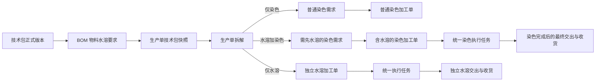
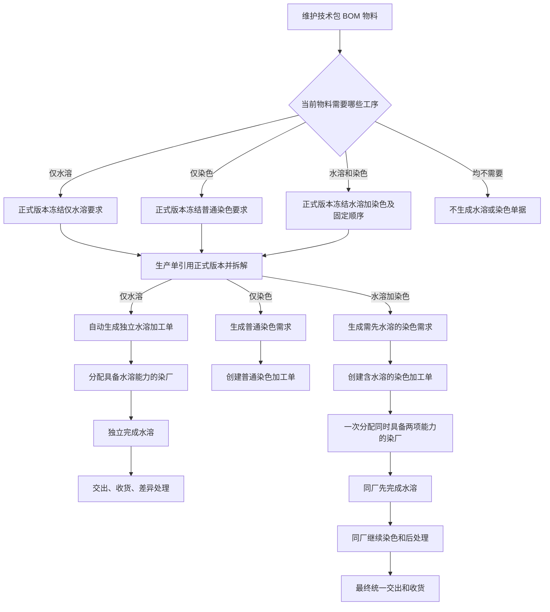
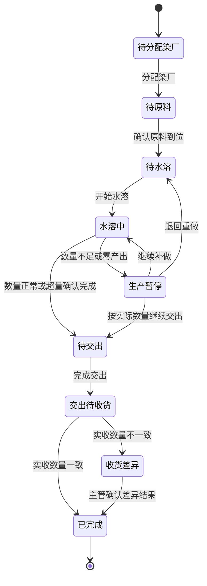
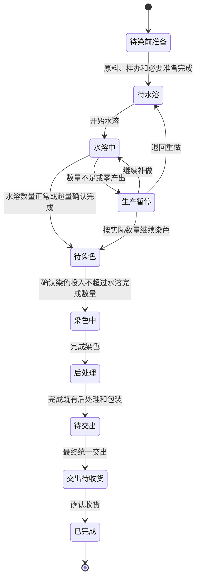
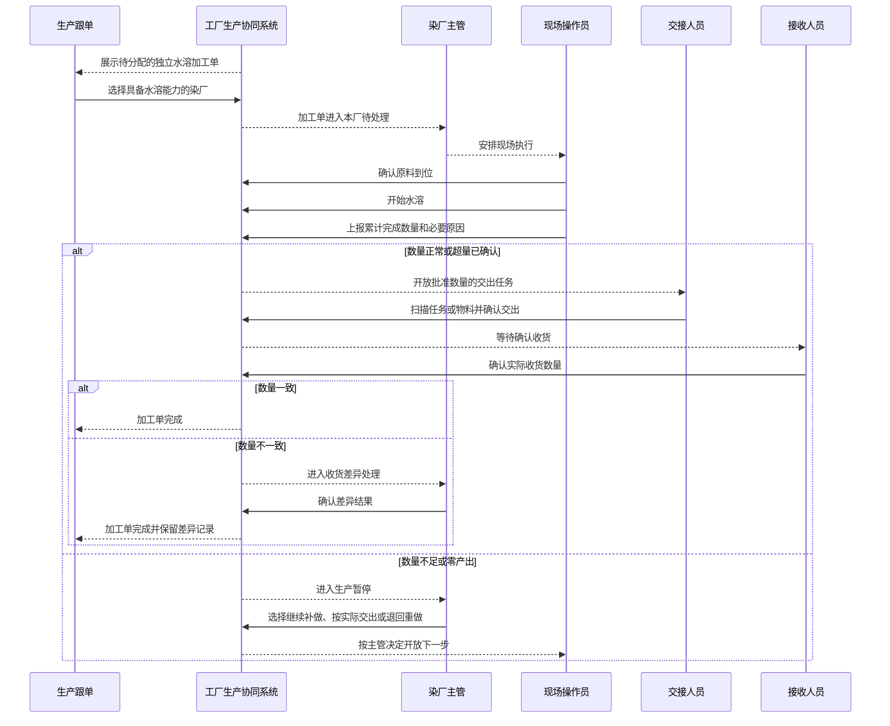
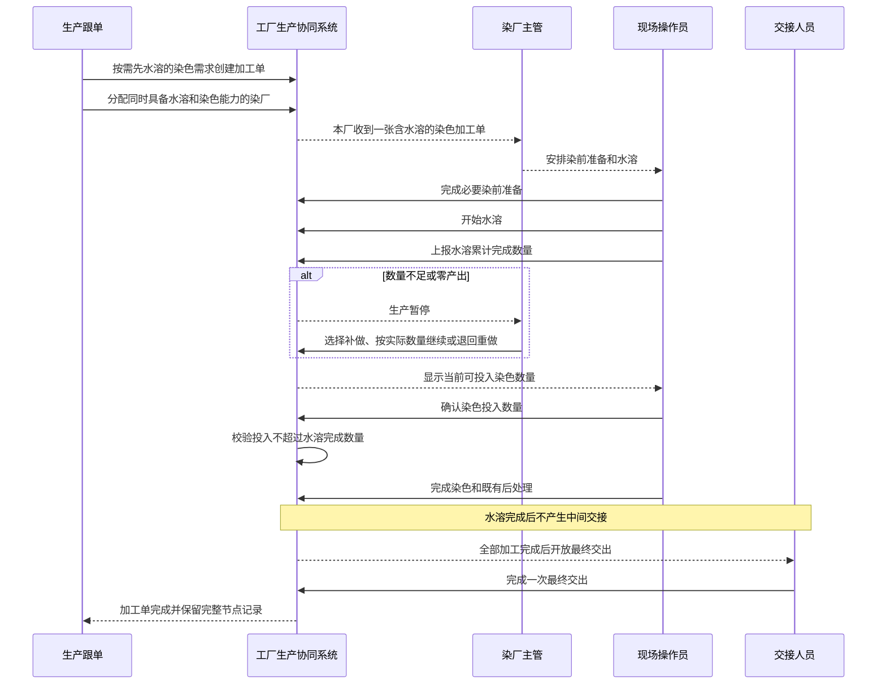

# 水溶工序及加工单产品需求文档

## 1. 文档信息

| 项目 | 内容 |
| --- | --- |
| 文档名称 | 水溶工序及加工单产品需求文档 |
| 文档用途 | 交付产品、研发、测试及实施团队进行正式功能开发和验收 |
| 适用业务 | 技术包维护、生产单拆解、染色需求、染色加工、独立水溶加工、染厂执行、PDA 执行与交接 |
| 适用系统 | 商品中心系统、工厂生产协同系统、工艺工厂运营系统、工厂端移动应用 |
| 适用阶段 | 生产准备阶段 |
| 归属工厂 | 染厂 |
| 核心结论 | 仅水溶生成独立水溶加工单；同一物料同时需要水溶和染色时，只生成一张含水溶的染色加工单，由同一家染厂固定按“先水溶、后染色”连续完成 |
| 文档状态 | 已确认，可进入研发设计与开发 |

## 2. 需求摘要

花边等物料在染色前可能需要先去除水溶性基材。当前业务需要把“水溶”从口头要求或染色备注，升级为生产准备阶段的正式工序，并贯穿技术包、生产单拆解、加工单生成、染厂派工、现场执行、数量差异、交接收货和管理追溯。

本需求覆盖两条业务主线：

1. 物料只需要水溶：生产单拆解后直接生成独立水溶加工单，可单独派给具备水溶能力的染厂，并完成水溶、交出、收货和差异处理闭环。
2. 同一物料同时需要水溶和染色：不生成独立水溶加工单，也不生成水溶需求单；染色需求携带“需先水溶”要求，后续只创建一张含水溶的染色加工单，由同一家染厂先完成水溶，再继续染色和原有后处理，最后统一交出。

水溶是生产准备阶段的正式工序，但与“生产准备时效”无关，不纳入其计时、逾期、催办、统计或阻塞判断。

## 3. 背景与业务问题

### 3.1 业务背景

部分花边、刺绣辅料或其他物料在成型过程中使用水溶性基材。正式染色前必须先完成水溶，否则会影响染色投入、颜色效果和最终成品质量。

水溶由染厂承接。当前绝大部分业务中，同一物料的水溶和染色由同一家染厂连续完成，不存在水溶完成后转交另一家染厂的常态需求。

### 3.2 当前问题

- 技术包无法按具体 BOM 物料正式表达是否需要水溶。
- 技术包工序信息无法展示水溶及其关联物料。
- 生产单拆解时无法稳定判断应生成独立水溶单，还是生成含水溶的染色单。
- 如果分别生成水溶单和染色单，会出现重复派厂、中间交接和状态同步，增加操作成本。
- 如果只在染色加工单上临时勾选水溶，会失去正式技术包来源，容易漏做或错做。
- 水溶完成数量不足时，后续染色投入缺少可靠上限和主管处理路径。
- FCS、PFOS 和 PDA 缺少统一的加工单、任务、数量、状态和操作记录口径。

## 4. 产品目标

1. 将水溶建立为准备阶段、归属染厂的正式工序。
2. 允许技术资料维护人员在每一条 BOM 物料上独立选择水溶要求。
3. 在技术包工序中展示水溶、关联物料及与染色的固定先后关系。
4. 由正式技术包版本和生产单拆解稳定生成正确的业务单据，不由草稿勾选直接生成。
5. 仅水溶物料形成独立水溶加工单闭环。
6. 同一物料同时水溶和染色时保持一张染色加工单、一个染厂、一条连续执行链路。
7. 水溶实际完成数量成为后续染色可投入数量的硬性上限。
8. 让平台跟单、染厂主管、现场操作员和交接人员各自只处理自己负责的动作。
9. 让跨端看到的加工单、任务、工厂、数量、单位、状态和操作记录保持一致。
10. 在不扩展仓库、结算、计价和批次体系的前提下完成最小闭环。

## 5. 成功标准

- 技术包可以明确表达每条物料是否需要水溶。
- 同一物料同时选择水溶和染色时，系统始终按“先水溶、后染色”处理。
- 仅水溶物料只生成一张独立水溶加工单。
- 水溶加染色物料只进入一张含水溶的染色加工单，不生成独立水溶单。
- 不同物料分别选择水溶和染色时，不会被误判为同一物料的组合工序。
- 独立水溶加工单只能派给具备水溶能力且允许接单的染厂。
- 含水溶的染色加工单只能派给同时具备水溶和染色能力的染厂。
- 未完成水溶时不能开始染色。
- 染色投入不能超过水溶实际完成数量。
- 独立水溶可以完成派厂、到料、加工、交出、收货和差异处理。
- FCS、PFOS 和 PDA 对同一业务事实的展示一致。
- 水溶不会进入生产准备时效。

## 6. 范围

### 6.1 本期范围

- 工序工艺字典新增水溶。
- 技术包 BOM 维护水溶要求。
- 技术包工序展示水溶及关联物料。
- 正式技术包版本冻结水溶要求和物料关系。
- 生产单拆解识别仅水溶、仅染色、水溶加染色和无加工四种组合。
- 独立水溶加工单自动生成。
- 染色需求区分普通染色和需先水溶。
- 染色加工单支持含水溶连续执行。
- 染厂能力和派厂校验。
- FCS 独立水溶加工单管理。
- PFOS 独立水溶加工单执行管理。
- PDA 统一执行入口中的独立水溶与含水溶染色任务。
- 独立水溶通用交接、收货和差异闭环。
- 水溶数量不足、零产出、超量、重复操作、错厂、错任务、错扫码和弱网处理。
- 操作人、操作时间、原因和数量变化的追溯。

### 6.2 本期不做

- 不新增水溶需求单。
- 不新增“连续工序任务”这一业务单据。
- 不支持水溶和染色分给不同工厂。
- 不支持水溶完成后转厂染色。
- 不把水溶纳入生产准备时效。
- 不新增水溶专用仓库、库位或库存模块。
- 不新增水溶专用结算、计价、对账或扣款规则。
- 不新增水溶批次管理体系。
- 不新增 PDA 水溶专用底部导航。
- 不改变普通染色、印花、预缩、水洗及其他既有工序的生成规则。
- 不允许在按备货创建染色加工单时临时附加水溶。
- 不支持独立水溶加工单的部分交出。

## 7. 业务术语

| 术语 | 说明 |
| --- | --- |
| 水溶 | 去除物料中水溶性基材的加工工序，属于生产准备阶段，由染厂承接 |
| 仅水溶物料 | 同一条 BOM 物料需要水溶，但不需要染色 |
| 水溶加染色物料 | 同一条 BOM 物料同时需要水溶和染色 |
| 独立水溶加工单 | 由仅水溶物料自动生成，可独立派厂、执行和交接的加工单 |
| 含水溶的染色加工单 | 由水溶加染色物料形成，内部包含水溶和染色连续步骤的一张染色加工单 |
| 水溶计划数量 | 按适用生产数量、BOM 单耗和损耗率计算的应加工物料数量 |
| 水溶完成数量 | 现场累计确认完成水溶的实际物料数量 |
| 批准交出数量 | 正常完成或主管处理后允许独立水溶加工单交出的数量 |
| 生产暂停 | 水溶数量不足、零产出或需要主管决定时的阻断状态 |
| 收货差异 | 交出数量与接收方实收数量不一致，需要主管确认的状态 |

## 8. 角色与职责

| 角色 | 主要职责 |
| --- | --- |
| 技术资料维护人员 | 在技术包 BOM 中维护物料水溶要求，确认水溶与染色关系，发布正式技术包版本 |
| 生产跟单 | 查看生产单拆解结果，创建染色加工单，分配染厂，跟踪进度和异常 |
| 生产管理人员 | 查看全链路状态、来源版本、数量差异、交接结果和操作记录 |
| 染厂主管 | 查看本厂独立水溶和含水溶染色任务，处理数量不足、生产暂停和异常兜底 |
| 染厂现场操作员 | 确认原料、开始水溶、上报水溶完成数量，并按当前步骤继续染色作业 |
| 染厂交接人员 | 对独立水溶加工单执行交出，并确认交出对象和数量 |
| 接收人员 | 确认独立水溶加工单的实际收货数量 |
| 管理员 | 查看全链路，并在主管或交接异常时按授权兜底；不替代普通操作员的日常加工动作 |

## 9. 核心业务原则

### 9.1 判断单位是同一条 BOM 物料

水溶与染色的组合判断必须以同一条 BOM 物料为单位。

- 物料甲选择水溶、物料甲同时选择染色：属于水溶加染色。
- 物料甲选择水溶、物料乙选择染色：分别处理，不得合并为水溶加染色。

### 9.2 固定先水溶、后染色

同一物料同时需要水溶和染色时，工序顺序固定为：

> 水溶 → 染色

技术资料维护人员、跟单和染厂均不能交换顺序，也不能把两步设置为并行。

### 9.3 同厂连续加工

含水溶的染色加工单由同一家染厂完成全部水溶、染色及既有后处理。本期不存在拆分派厂和中途转厂。

### 9.4 单据最简化

- 仅水溶：直接生成独立水溶加工单。
- 水溶加染色：只生成需先水溶的染色需求，后续创建一张含水溶的染色加工单。
- 不生成水溶需求单。
- 不为水溶加染色额外生成独立水溶加工单。

### 9.5 正式版本驱动

技术包草稿中的勾选只用于资料维护和预览。只有生产单引用正式技术包版本并执行拆解时，才生成业务单据。

### 9.6 原单位贯穿

水溶计划、执行、交出和收货必须沿用 BOM 物料单位。系统不得默认把未知单位改成米、件或其他单位。

### 9.7 水溶产出限制染色投入

含水溶的染色加工单中，水溶完成数量是染色可投入数量的最大值。无水溶完成数量时，不能开始染色。

## 10. 业务对象关系

## 11. 总体业务流程

## 12. 工序工艺字典需求

### 12.1 字典定义

系统需新增正式工序“水溶”，业务属性如下：

| 业务属性 | 要求 |
| --- | --- |
| 工序名称 | 水溶 |
| 所属阶段 | 准备阶段 |
| 归属工厂 | 染厂 |
| 适用对象 | BOM 物料 |
| 默认单据 | 独立场景直接形成加工任务 |
| 是否启用 | 启用 |
| 顺序 | 在染色之前 |

### 12.2 字典展示

- 水溶作为结果型字典项展示。
- 展示所属阶段、归属工厂、适用对象和启用状态。
- 本期不扩展复杂的新增、批量维护、删除和版本管理能力。
- 水溶停用后不得影响已经生成并进入执行的历史加工单；新拆解不再生成新的水溶业务单据。

## 13. 技术包 BOM 需求

### 13.1 维护位置

每一条 BOM 物料都需要提供水溶要求选择，并与该物料的染色要求并列展示。

### 13.2 可选范围

所有 BOM 物料类型均允许选择水溶。系统不按面料、花边、辅料、包装材料或其他分类进行硬性限制，由技术资料维护人员根据工艺实际判断。

### 13.3 页面反馈

- 未选择水溶：不显示水溶工艺标签。
- 仅选择水溶：显示“水溶”。
- 仅选择染色：保持普通染色展示。
- 同时选择水溶和染色：同时显示两项，并明确提示“固定顺序：先水溶、后染色”。
- 物料单位缺失且选择水溶时，不允许完成本次水溶要求保存或正式发布，并提示先维护物料单位。

### 13.4 工序联动

- BOM 物料选择水溶后，技术包工序自动出现水溶。
- BOM 物料取消水溶后，系统重新汇总水溶关联物料；没有任何关联物料时，水溶从工序预览中移除。
- 新增、编辑或删除 BOM 物料后，均需重新计算水溶与染色的物料关联。
- 同一物料水溶和染色的顺序由系统固定，不依赖用户手工排序。

### 13.5 草稿与正式版本

- 草稿维护不生成加工单据。
- 发布正式版本时冻结每条物料的水溶要求、染色要求、物料单位、单耗、损耗率、适用颜色尺码和工序顺序。
- 新版本不得自动修改旧生产单已经冻结的加工要求。
- 已进入执行的历史加工单不随技术包草稿或新版本变化而重置。

## 14. 技术包工序需求

技术包工序页需展示水溶及以下业务信息：

- 工序名称。
- 所属阶段。
- 归属染厂。
- 关联的具体 BOM 物料。
- 每条关联物料的名称、编码、规格和单位。
- 与染色共享同一物料时的固定先后关系。

展示要求：

- 不得只显示技术包整体“需要水溶”，必须保留到具体物料。
- 多条物料需要水溶时，应逐条展示或支持展开查看。
- 不同物料分别需要水溶和染色时，不得展示为同一物料的连续工序。
- 用户尝试把同一物料的染色排到水溶之前，或把两步设为并行时，系统必须阻断并说明固定顺序。

## 15. 正式版本与生产单拆解

### 15.1 生成时点

单据生成时点固定为：

1. 维护技术包草稿。
2. 发布正式技术包版本。
3. 生产单引用正式版本并形成快照。
4. 生产单执行任务拆解。
5. 系统按快照中的每一条 BOM 物料和工序组合生成对应单据。

### 15.2 拆解判断

| 同一 BOM 物料的工序组合 | 系统处理 |
| --- | --- |
| 仅水溶 | 自动生成独立水溶加工单 |
| 仅染色 | 生成普通染色需求 |
| 水溶和染色 | 生成需先水溶的染色需求，不生成独立水溶加工单 |
| 均未选择 | 不生成水溶或染色单据 |

### 15.3 重复拆解

- 对同一生产单、同一正式技术包版本、同一 BOM 物料重复执行拆解，不得重复生成单据。
- 重复拆解应返回已经存在的业务结果。
- 如果正式来源已被更正，系统应保留已经产生执行或交接事实的加工单，不得静默删除。
- 尚未执行且明确无效的单据，应通过受控的业务更正方式处理，不在本期自动删除。

### 15.4 来源追溯

每张加工单必须能够追溯到：

- 来源生产单。
- 来源正式技术包版本。
- 来源 BOM 物料。
- 来源工序要求。
- 生成时间。

## 16. 水溶计划数量

### 16.1 计算口径

> 水溶计划数量 = 物料适用颜色尺码的生产数量 × BOM 单耗 ×（1 + BOM 损耗率）

### 16.2 计算规则

- 只计算该物料实际适用的颜色和尺码数量。
- 不直接使用整张生产单的成衣件数。
- 同一物料适用于多个颜色尺码时，先汇总适用生产数量，再按单耗和损耗率计算。
- 计算结果沿用 BOM 物料单位。
- 单耗、损耗率或单位缺失时，不得生成虚构数量，应明确提示技术资料不完整。
- 水溶计划数量同时作为独立水溶加工单和含水溶染色步骤的计划基准。

## 17. 染色需求

### 17.1 需求类型

染色需求分为：

- 普通染色。
- 需先水溶的染色。

### 17.2 需先水溶来源

- 只能来源于正式技术包版本中同一 BOM 物料同时需要水溶和染色的事实。
- 染色需求页面不得提供人工追加或取消水溶要求的入口。
- 染色需求需显示“需先水溶”和“水溶 → 染色”。
- 需求详情需展示来源物料、计划数量、单位和正式技术包版本。

### 17.3 合并约束

- 普通染色需求只能与普通染色需求合并创建加工单。
- 需先水溶的染色需求只能与同类需求合并创建加工单。
- 两类需求不得混合进入同一张染色加工单。
- 用户选择第一条需求后，系统应过滤或禁用不兼容需求。
- 即使通过其他入口形成混合选择，最终确认时仍需阻断。
- 提示应明确说明水溶要求不一致，需要分别创建加工单。

## 18. 染色加工单

### 18.1 创建方式

保持现有染色加工单创建方式：

- 按染色需求创建。
- 按备货创建。

水溶不会改变染色加工单由业务人员创建的现有方式。

### 18.2 按需求创建

- 选择普通染色需求时，创建普通染色加工单。
- 选择需先水溶的染色需求时，创建含水溶的染色加工单。
- 含水溶染色加工单继承正式来源中的水溶要求和固定顺序。
- 创建人员不得在加工单上手工移除水溶步骤。

### 18.3 按备货创建

- 按备货创建缺少正式技术包 BOM 的同一物料工序来源。
- 本期按备货只能创建普通染色加工单。
- 页面不提供“附加水溶”选择。

### 18.4 含水溶染色加工单展示

需展示：

- 需先水溶。
- 工艺顺序“水溶 → 染色 → 既有后处理”。
- 水溶计划数量、累计完成数量和差异。
- 当前步骤。
- 当前染色可投入上限。
- 同一家染厂连续加工提示。
- 水溶异常和主管处理结果。

含水溶染色加工单只在染色加工单中管理，不进入独立水溶加工单列表。

## 19. 染厂能力与派厂

### 19.1 工厂能力

染厂能力需区分：

- 是否具备水溶能力。
- 是否具备染色能力。
- 是否启用。
- 是否允许派单。

### 19.2 独立水溶派厂

- 由生产跟单在独立水溶加工单上选择染厂。
- 候选工厂只展示具备水溶能力、已启用且允许派单的染厂。
- 分配成功后，加工单和对应执行任务同时归属该染厂。
- 不存在关联染色加工单自动跟随，因为仅水溶场景没有染色加工单。

### 19.3 含水溶染色派厂

- 在分配染色加工单时一次确定工厂。
- 候选工厂必须同时具备水溶和染色能力，并处于可派单状态。
- 水溶步骤自动归属同一家染厂。
- 不提供单独分配水溶工厂的入口。
- 不提供后续转厂入口。

## 20. FCS 独立水溶加工单

### 20.1 菜单位置

在“任务编排与执行准备”下新增“水溶加工单”，与染色加工单相邻。

### 20.2 页面范围

只展示独立水溶加工单，不展示含水溶的染色加工单。

### 20.3 列表查询

支持：

- 按加工单号、生产单号、物料名称或物料编码搜索。
- 按当前状态筛选。
- 按染厂筛选。
- 按计划交期筛选。
- 按是否存在异常筛选。
- 分页查看。

### 20.4 列表展示

列表需展示：

- 水溶加工单号和生产单号。
- 款号或款式。
- 物料名称、编码和规格。
- 计划数量、累计完成数量和单位。
- 当前染厂。
- 当前状态。
- 计划交期。
- 异常提示。
- 来源正式技术包版本。

### 20.5 详情

详情需分区展示：

1. 来源生产单、款式和正式技术包版本。
2. 来源 BOM 物料和工艺要求。
3. 水溶计划数量、累计完成数量、批准交出数量和单位。
4. 派厂信息。
5. 当前任务和当前步骤。
6. PDA 操作人、操作时间和执行记录。
7. 数量不足、零产出、超量和主管处理记录。
8. 交出、收货和收货差异结果。

### 20.6 关键动作

| 当前情况 | 可用动作 |
| --- | --- |
| 待分配染厂 | 分配染厂 |
| 已生成任务 | 查看任务 |
| 有执行记录 | 查看执行进度和异常 |
| 已生成交接 | 查看交接 |
| 已完成 | 查看完整记录 |

FCS 负责管理和追溯，不承担现场开始、完成和交出操作。

## 21. PFOS 独立水溶加工单

### 21.1 菜单位置

在染厂管理下新增“水溶加工单”，与染色加工单相邻。

### 21.2 页面范围

- 登录染厂只查看分配给本厂的独立水溶加工单。
- 不能通过修改查看条件访问其他染厂的任务。
- 无可信工厂身份时只允许管理预览，不开放现场动作。
- 含水溶染色加工单继续留在染色加工单中，不重复展示。

### 21.3 页面重点

- 当前物料和计划数量。
- 当前状态和下一步动作。
- 当前操作人和最近操作时间。
- 数量差异和异常。
- 待主管处理。
- 待交出。

### 21.4 角色展示

- 现场操作员看到到料、开始水溶和上报完成数量。
- 生产主管看到生产暂停和主管处理。
- 交接人员看到待交出的任务入口。
- 管理员看到全链路，并作为主管和交接异常兜底。
- 页面不得向角色展示最终必然被拒绝的动作。

## 22. PDA 统一执行

### 22.1 导航与入口

- 不新增水溶专用底部导航。
- 独立水溶任务和含水溶染色任务都进入现有“执行”。
- 独立水溶显示为“水溶加工”。
- 含水溶染色显示为“染色加工（含水溶）”。

### 22.2 任务列表

任务卡片首屏只展示：

- 当前任务类型。
- 物料名称和编码。
- 款式、颜色或其他必要识别信息。
- 计划数量和单位。
- 当前步骤。
- 当前唯一主动作。
- 异常提示。

支持按加工单号、生产单号、物料名称和物料编码搜索；含水溶染色任务继续支持按目标颜色查找。

### 22.3 任务详情

详情首屏按以下顺序组织：

1. 当前要做什么。
2. 当前物料和计划数量。
3. 当前步骤的唯一主动作。
4. 必要的数量或原因输入。
5. 操作结果和下一步。
6. 叫主管或查看异常入口。

完整工艺步骤和历史记录默认折叠，不与当前主动作竞争。

### 22.4 当前动作

| 当前步骤 | 操作员看到的主动作 |
| --- | --- |
| 等原料 | 确认原料到位 |
| 等水溶 | 开始水溶 |
| 水溶中 | 上报完成数量 |
| 生产暂停 | 等主管处理 |
| 等染色 | 开始染色 |
| 染色中 | 上报染色完成 |
| 等交出 | 去交出 |
| 等收货 | 等对方收货 |
| 已完成 | 查看结果 |

### 22.5 扫码防错

- 支持扫描当前任务、加工单或物料标签进入相应任务。
- 进入任务后校验当前账号、当前工厂、任务归属、物料和当前步骤。
- 扫到其他工厂、其他任务或错误物料时必须阻断。
- 错误提示需明确告诉操作员应扫描当前任务或当前物料。
- 已完成动作不得重复开始或重复完成。

### 22.6 身份与角色

- 现场动作必须基于当前有效账号和当前工厂。
- 账号停用、无登录、错误工厂或错误角色时，不展示任务明细或操作入口。
- 管理员不能代替现场操作员执行普通加工动作，只作为主管和交接异常兜底。
- 切换任务或切换账号后，旧任务的草稿、确认窗口和待提交动作必须失效。

### 22.7 弱网与重复提交

- 提交后立即显示处理中，并禁止连续点击。
- 网络不可用时不得改变加工单状态或生成重复记录。
- 保留已输入的数量和原因，联网后允许原内容重试。
- 成功后明确显示当前结果和下一步。
- 已成功动作再次提交时，提示该动作已经完成，不得重复记录。

## 23. 水溶完成数量

### 23.1 录入口径

- 操作员录入累计完成数量，不是本次增量数量。
- 默认带出计划数量，允许按现场实际修改。
- 数量必须为大于或等于零的有效数字。
- 累计完成数量不能小于已记录的累计完成数量。
- 所有数量必须带原 BOM 单位。

### 23.2 等量完成

- 实际完成数量等于计划数量时，直接完成水溶。
- 独立水溶进入待交出。
- 含水溶染色进入待染色。

### 23.3 少于计划

- 必须填写真实原因。
- 加工单进入生产暂停。
- 不允许直接按原计划数量交出或开始染色。
- 主管必须选择后续处理方式。

### 23.4 零产出

- 零属于允许录入的实际数量，但必须填写原因。
- 零产出进入生产暂停。
- 零产出不能选择按实际数量交出。
- 零产出不能开始染色。
- 主管只能选择继续补做或退回重做。

### 23.5 超过计划

- 必须填写原因。
- 必须二次确认，明确展示计划数量、实际数量和超出数量。
- 取消确认时不得改变加工单和执行记录。
- 确认后记录实际数量、原因、操作人和时间。

## 24. 生产暂停与主管处理

### 24.1 独立水溶

主管可选择：

| 处理方式 | 结果 |
| --- | --- |
| 继续补做 | 返回水溶执行，保留已完成累计数量，后续上报不得倒退 |
| 按实际数量继续交出 | 以当前水溶完成数量作为批准交出数量，进入待交出；完成数量必须大于零 |
| 退回重做 | 清空本轮水溶完成结果，返回待水溶，重新开始 |

### 24.2 含水溶染色

主管可选择：

| 处理方式 | 结果 |
| --- | --- |
| 继续补做 | 返回水溶执行，保留已完成累计数量 |
| 按实际数量继续染色 | 以水溶实际完成数量作为染色可投入上限，进入待染色；完成数量必须大于零 |
| 退回重做 | 清空本轮水溶完成结果，返回待水溶 |

### 24.3 处理要求

- 主管处理必须二次确认。
- 记录处理方式、处理人、处理时间和处理说明。
- 旧的处理入口在状态变化后立即失效。
- 操作员只能查看主管结果，不能自行选择主管处理方式。

## 25. 独立水溶状态图

## 26. 含水溶染色状态图

## 27. 独立水溶执行时序

## 28. 含水溶染色执行时序

## 29. 独立水溶交接与收货

### 29.1 交接入口

- 独立水溶完成后复用现有通用交接。
- 不新增水溶专用交接页面或底部导航。
- 同一独立水溶任务只对应一张有效交接单。

### 29.2 交出要求

- 交出对象是当前加工的 BOM 物料。
- 交接页面展示来源加工单、生产单、物料、染厂、批准交出数量和原单位。
- 交接人员必须扫描当前任务、当前加工单或当前物料中的有效标识。
- 交出数量必须等于批准交出数量。
- 本期不允许少交、超交、零交或拆成多次交出。
- 重复提交不得生成第二条交出事实。

### 29.3 收货要求

- 接收人员录入实际收货数量。
- 实收数量允许为零，但必须作为数量差异进入主管处理。
- 实收数量一致时，加工单和交接单同时完成。
- 实收数量不一致时，加工单进入收货差异，不得自动完成。
- 主管确认差异结果后，加工单和交接单同时关闭并保留差异数量。

### 29.4 含水溶染色交接

- 水溶完成后不交出。
- 染色和既有后处理全部完成后，沿用染色加工单现有最终交接。
- 全流程只发生一次最终交出和收货。

## 30. 异常与防错规则

| 异常场景 | 系统处理 | 用户可执行的下一步 |
| --- | --- | --- |
| BOM 物料缺少单位且选择水溶 | 阻断保存或正式发布 | 先维护正确物料单位 |
| 水溶与染色顺序被交换 | 阻断 | 恢复为先水溶、后染色 |
| 不同物料分别水溶和染色 | 分别生成，不做组合 | 分别处理对应物料 |
| 重复拆解 | 不重复生成 | 查看已生成单据 |
| 普通染色与需先水溶需求混选 | 阻断创建 | 分开创建加工单 |
| 按备货尝试附加水溶 | 不提供入口 | 从正式技术包和染色需求发起 |
| 独立水溶派给无能力染厂 | 阻断 | 选择具备水溶能力的染厂 |
| 含水溶染色派给单一能力染厂 | 阻断 | 选择同时具备两项能力的染厂 |
| 未完成水溶直接开始染色 | 阻断 | 先完成水溶或由主管处理暂停 |
| 染色投入超过水溶完成数量 | 阻断 | 调整到允许投入数量以内 |
| 完成数量为空或不是有效数字 | 阻断且不改变状态 | 重新输入有效数量 |
| 完成数量为负数 | 阻断且不改变状态 | 输入大于或等于零的数量 |
| 完成数量为零但无原因 | 阻断且保留输入 | 填写真实原因后重试 |
| 完成数量少于计划但无原因 | 阻断且保留输入 | 填写真实原因后重试 |
| 完成数量超过计划 | 二次确认 | 确认原因和超出数量，或返回修改 |
| 累计完成数量小于已有完成量 | 阻断 | 输入不小于已有完成量的累计数量 |
| 错误工厂账号访问任务 | 不展示任务事实和动作 | 切换到任务所属工厂账号 |
| 错误角色执行动作 | 阻断 | 由对应角色处理 |
| 扫描其他任务或物料 | 阻断 | 扫描当前任务或当前物料 |
| 网络不可用 | 不写入、不改变状态、保留草稿 | 联网后按原输入重试 |
| 重复点击或重复提交 | 只保留一次有效结果 | 查看当前状态 |
| 旧页面继续提交 | 阻断失效操作 | 刷新后按当前状态继续 |
| 交出数量不等于批准数量 | 阻断 | 按批准数量交出 |
| 收货数量不一致 | 进入收货差异 | 由主管确认差异结果 |

## 31. 权限矩阵

| 业务动作 | 技术资料维护人员 | 生产跟单 | 染厂操作员 | 染厂主管 | 交接人员 | 接收人员 | 管理员 |
| --- | ---: | ---: | ---: | ---: | ---: | ---: | ---: |
| 维护 BOM 水溶要求 | 是 | 否 | 否 | 否 | 否 | 否 | 按资料权限 |
| 查看正式来源 | 是 | 是 | 仅执行必要信息 | 是 | 仅交接必要信息 | 仅收货必要信息 | 是 |
| 创建染色加工单 | 否 | 是 | 否 | 否 | 否 | 否 | 按管理权限 |
| 分配染厂 | 否 | 是 | 否 | 否 | 否 | 否 | 按管理权限 |
| 确认原料到位 | 否 | 否 | 是 | 否 | 否 | 否 | 否 |
| 开始与完成水溶 | 否 | 否 | 是 | 否 | 否 | 否 | 否 |
| 处理生产暂停 | 否 | 否 | 否 | 是 | 否 | 否 | 异常兜底 |
| 独立水溶交出 | 否 | 否 | 否 | 否 | 是 | 否 | 异常兜底 |
| 确认收货 | 否 | 否 | 否 | 否 | 否 | 是 | 按授权兜底 |
| 确认收货差异 | 否 | 否 | 否 | 是 | 否 | 否 | 异常兜底 |
| 查看完整追溯 | 按资料范围 | 是 | 否 | 本厂范围 | 本厂交接范围 | 接收范围 | 是 |

## 32. 跨端一致性

| 业务事实 | 商品中心系统 | 工厂生产协同系统 | 工艺工厂运营系统 | 工厂端移动应用 |
| --- | --- | --- | --- | --- |
| BOM 水溶要求 | 维护与正式冻结 | 查看来源快照 | 查看执行要求 | 展示当前作业要求 |
| 独立水溶加工单 | 不管理 | 派厂与全链路追踪 | 本厂执行管理 | 当前动作执行 |
| 含水溶染色加工单 | 不管理 | 染色加工单管理 | 本厂染色工单管理 | 按当前步骤执行 |
| 当前染厂 | 查看来源关系 | 分配和追踪 | 仅本厂可见 | 按登录工厂校验 |
| 水溶计划与完成数量 | 查看技术来源 | 全链路展示 | 执行与异常处理 | 现场录入 |
| 生产暂停 | 不处理 | 查看处理结果 | 主管处理 | 操作员查看结果 |
| 交接与收货 | 不处理 | 查看完整结果 | 查看本厂交出结果 | 交出和收货操作 |

跨端必须共享同一加工单、任务、工厂、数量、单位、状态和操作记录。允许不同端按角色减少展示内容，不允许形成互相矛盾的事实。

## 33. 操作记录与追溯

系统需记录并可追溯：

- 来源生产单、正式技术包版本和 BOM 物料。
- 单据生成时间和生成结果。
- 派厂前后工厂信息。
- 每次开始、完成、暂停和主管处理。
- 操作人、所属工厂、操作时间和操作结果。
- 计划数量、实际完成数量、批准交出数量和单位。
- 数量不足、零产出、超量和收货差异原因。
- 交出人、接收人、交出时间、收货时间和差异数量。
- 被阻断的关键异常应给出用户可理解的原因，但不要求本期建设独立安全审计中心。

历史记录不得因页面刷新、技术包新版本或重复拆解而丢失。

## 34. 页面与交互要求

### 34.1 管理端

- FCS 可采用表格、筛选、分页和抽屉详情。
- 列表必须支持分页，不一次性加载全部记录。
- 轻量筛选、分页、详情和抽屉操作不得造成整页闪烁或滚动位置丢失。
- 详情应突出来源、数量、工厂、当前状态和异常，不展示内部技术状态。

### 34.2 染厂主管端

- PFOS 优先展示本厂待处理、异常、暂停和待交出。
- 主管处理应使用短步骤和二次确认。
- 现场操作员和主管不能在同一状态看到相互冲突的主动作。

### 34.3 员工执行端

- 一页只突出一个主动作。
- 首屏只展示当前任务、当前物料、当前数量、当前步骤和下一步。
- 数量必须带单位，差异直接显示少多少或多多少。
- 扫码优先，长编号不能单独承担识别。
- 错误文案必须说明哪里不对和如何修改。
- 小屏和低分辨率下主按钮始终可见。
- 输入数量和原因时不得丢失焦点、内容或滚动位置。

### 34.4 响应要求

- 筛选、分页、打开详情、打开完成表单和普通输入反馈应在 200 毫秒内完成界面响应。
- 网络提交可显示处理中，但必须立即反馈，防止重复点击。
- 弱网失败必须保留草稿并允许重试。

## 35. 初始化与历史兼容

### 35.1 字典初始化

- 上线时初始化正式水溶工序并启用。
- 水溶归属准备阶段和染厂。
- 不要求业务人员重新手工创建字典项。

### 35.2 历史技术包

- 历史技术包的物料默认不需要水溶。
- 不自动修改历史正式版本。
- 需要水溶的历史款式，应通过新技术包版本明确维护后再用于新的生产单。

### 35.3 历史生产单和加工单

- 上线前已生成的生产单、染色需求和染色加工单保持原逻辑。
- 不自动向历史染色加工单追加水溶步骤。
- 新规则只作用于上线后采用含水溶正式技术包版本并重新拆解的业务。

### 35.4 染厂能力

- 上线前需确认哪些染厂具备水溶能力。
- 未明确配置水溶能力的染厂默认不可承接独立水溶和含水溶染色任务。
- 染厂能力调整只影响新派单，不改变已派发并执行中的历史加工单。

## 36. 验收场景

### 36.1 技术包与拆解

1. 单条物料仅选择水溶，正式拆解后生成一张独立水溶加工单。
2. 单条物料仅选择染色，保持普通染色需求和加工单流程。
3. 同一物料同时选择水溶和染色，只生成需先水溶的染色需求。
4. 不同物料分别选择水溶和染色，不得形成含水溶染色组合。
5. 物料均未选择时，不生成水溶或染色单据。
6. 所有物料类型均可选择水溶。
7. 同一物料的固定顺序不能被交换或设置为并行。
8. 草稿勾选后不生成单据。
9. 重复拆解不重复生成单据。
10. 新技术包版本不修改旧加工单执行事实。
11. 物料缺单位时选择水溶被明确阻断。

### 36.2 染色需求与加工单

12. 需先水溶标识只能来源于正式技术包。
13. 普通染色和需先水溶需求混选时被阻断。
14. 按备货创建时不存在附加水溶入口。
15. 含水溶染色加工单显示水溶计划、完成、差异、当前步骤和固定路线。
16. 含水溶染色加工单不出现在独立水溶列表。

### 36.3 派厂

17. 独立水溶只能选择具备水溶能力且可派单的染厂。
18. 含水溶染色只能选择同时具备水溶和染色能力的染厂。
19. 含水溶染色不存在单独分配水溶工厂或中途转厂入口。

### 36.4 独立水溶执行

20. 操作员可按顺序确认原料、开始水溶和上报完成数量。
21. 等量完成后进入待交出。
22. 少于计划且无原因时被阻断。
23. 少于计划且有原因时进入生产暂停。
24. 零产出无原因时被阻断；有原因时进入生产暂停。
25. 超量完成必须填写原因并二次确认。
26. 继续补做时累计完成数量不得倒退。
27. 按实际数量继续交出时，批准数量等于水溶实际完成数量。
28. 退回重做后重新进入待水溶。

### 36.5 含水溶染色执行

29. 未完成水溶时不能开始染色。
30. 水溶完成数量不足时不能按原计划投入染色。
31. 主管按实际数量继续后，染色投入上限同步调整。
32. 染色投入超过水溶完成数量时被阻断。
33. 水溶完成后不生成中间交接。
34. 完成染色和既有后处理后只生成一次最终交出。

### 36.6 身份、扫码与弱网

35. 无登录、停用账号、错误工厂或错误角色不能查看或执行任务。
36. 扫描错误任务或物料时被阻断并得到明确改法。
37. 重复开始、重复完成和重复交出不产生重复记录。
38. 网络不可用时不改变状态，保留数量和原因。
39. 恢复网络后可按原输入成功重试一次。
40. 切换任务后，旧任务确认入口失效。

### 36.7 交接与收货

41. 独立水溶只生成一张有效交接单。
42. 交出对象、来源物料、批准数量和单位一致。
43. 少交、超交、零交和多次交出被阻断。
44. 实收一致时加工单和交接单同时完成。
45. 实收为零或数量不一致时进入收货差异。
46. 主管确认差异后，加工单和交接单同时关闭并保留差异记录。

### 36.8 范围隔离

47. 水溶不进入生产准备时效列表、统计、催办和逾期判断。
48. 不新增水溶专用仓库、结算、计价、批次和 PDA 导航。
49. 普通染色和其他既有工序规则保持不变。

## 37. 上线前检查清单

- 水溶工序字典已初始化并启用。
- 染厂水溶能力已由业务确认并完成配置。
- 技术包 BOM、工序和正式版本能完整保留水溶要求和原单位。
- 生产单拆解四种组合结果正确且可重复执行。
- 独立水溶和含水溶染色的派厂候选正确。
- FCS、PFOS 和 PDA 状态、数量、单位和操作人一致。
- 独立水溶交出、收货和差异闭环可用。
- 错厂、错角色、错任务、错扫码、空值、零产出、短量、超量、重复提交和弱网均已验证。
- 生产准备时效不受水溶影响。
- 历史技术包、生产单和染色加工单未被自动改写。

## 38. 研发交付边界

研发需要保证本需求中的业务规则、页面行为、权限边界、状态变化、数量口径、异常处理和跨端一致性完整落地。

本产品需求文档不规定数据库表、接口结构、程序模块、内部状态编码或技术实现方式。研发可以按现有系统架构设计技术方案，但技术方案不得改变以下已确认产品边界：

- 仅水溶生成独立水溶加工单。
- 水溶加染色只保留一张含水溶染色加工单。
- 固定先水溶、后染色。
- 含水溶染色全程同厂。
- 不生成水溶需求单和连续工序任务。
- 水溶产出限制染色投入。
- 独立水溶复用现有统一执行和通用交接。
- 水溶不进入生产准备时效。

## 39. 产品自检结论

本需求已完成以下一致性检查：

- 对象边界：独立水溶与含水溶染色不重复建单。
- 物料边界：组合判断始终基于同一条 BOM 物料。
- 生成边界：草稿不生成，正式版本和生产单拆解才生成。
- 工厂边界：含水溶染色固定同厂，不提供拆分派厂。
- 数量边界：按 BOM 实际适用数量计算，原单位贯穿，水溶完成数量限制染色投入。
- 状态边界：独立水溶和含水溶染色分别有完整状态图。
- 角色边界：跟单、操作员、主管、交接人员和接收人员职责分离。
- 现场防错：少读、少选、少算、少填，错误操作在写入前阻断，主管可兜底。
- 跨端边界：各端共享同一业务事实，仅按角色差异化展示。
- 范围边界：未扩展到生产准备时效、仓库、结算、计价、批次和分厂。
