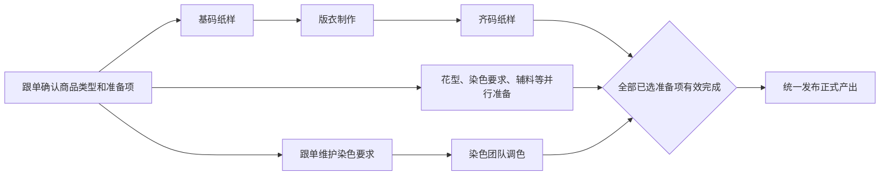
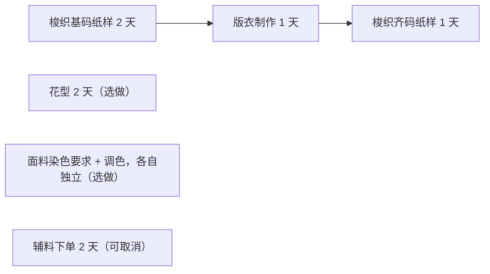
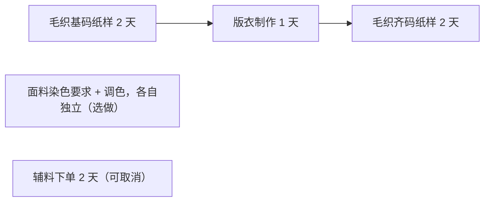
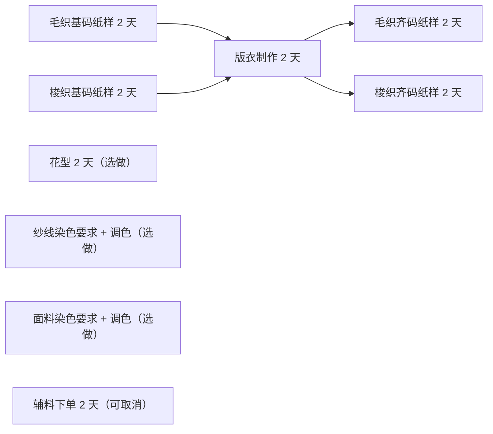
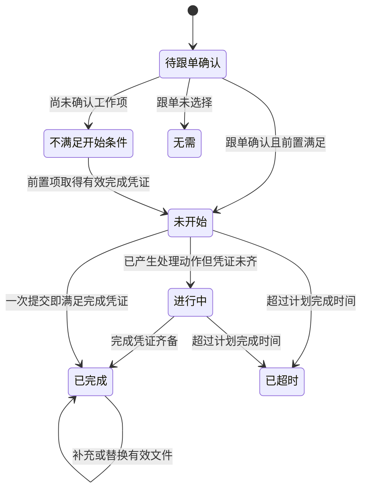
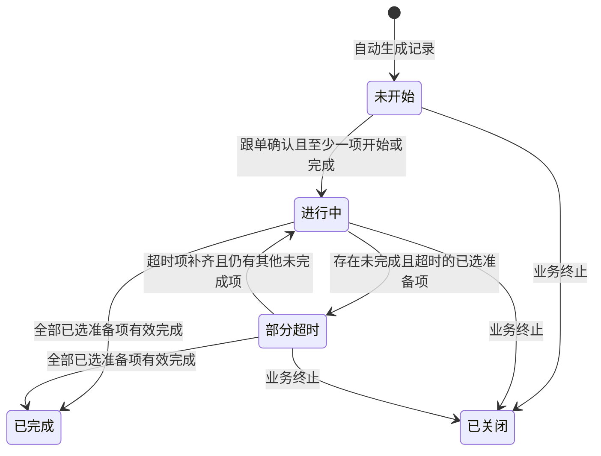
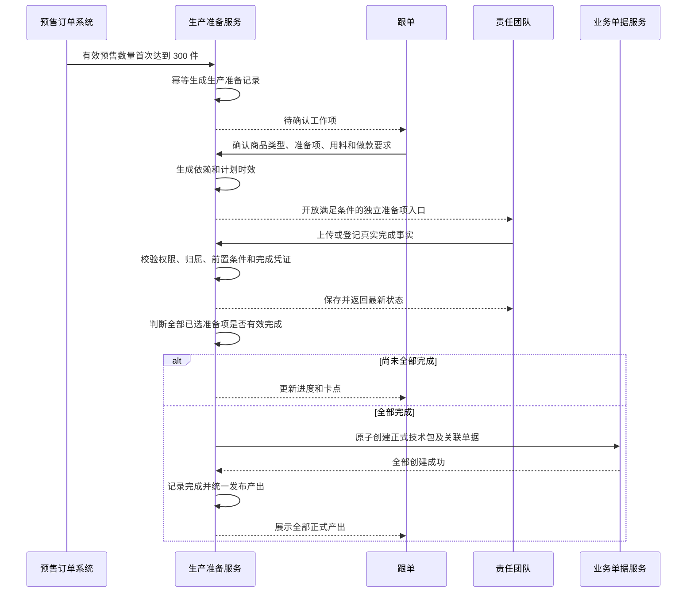

# 生产准备时效产品需求文档

## 1. 文档信息

| 项目 | 内容 |
| --- | --- |
| 文档名称 | 生产准备时效产品需求文档 |
| 文档版本 | v2.0 |
| 更新日期 | 2026-07-18 |
| 适用系统 | 工厂生产协同系统（FCS） |
| 业务阶段 | 商品达到做大货要求后，正式生产资料和准备工作完成前 |
| 主要角色 | 跟单、生产管理、版师团队、毛织团队、车板团队、花型团队、染色团队、采购团队 |
| 文档用途 | 交付产品、研发、测试和业务验收使用 |

## 2. 需求背景

商品预售数量达到做大货要求后，生产团队需要在有限时间内完成纸样、版衣、花型、染色要求、染色调色和辅料下单等工作。不同商品类型对应的准备项不同，部分工作串行，部分工作并行；如果只用备注或人工表格跟进，会产生以下问题：

- 跟单尚未确认准备项，各责任团队已经提前操作，造成错误完成数据。
- 商品类型、准备项和责任团队缺少统一映射，无法准确筛选当前任务。
- “已完成”只有状态，没有真实上传、采购单或染色要求作为证据。
- 基码纸样、版衣制作、齐码纸样的前置关系容易被绕过。
- 花型只有完成图片或只有源文件时，也可能被错误认定为完成。
- 辅料下单以页面更新时间代替真实下单时间，完成时间失真。
- 全部准备项尚未完成时，页面提前展示生产单等正式产出。
- 月度统计无法按统一口径统计基码、齐码、花型、染色等完成数量。
- 无法通过责任团队、准备项进度等条件定位当前可处理和被阻塞的工作。

本需求建立一套以“生产准备记录 + 准备项”为核心的生产准备闭环，使每个状态都由真实业务事实驱动，并为后续接入正式后端、组织权限和业务单据提供明确规则。

## 3. 产品目标

1. 商品达到做大货要求后，自动、幂等地生成生产准备记录。
2. 跟单必须先确认商品类型和本次准备项，责任团队才能开始后续工作。
3. 系统优先根据商品工艺和品类推导商品类型，跟单负责确认或修正。
4. 串行工作严格按前置完成凭证解锁，并行工作可独立推进。
5. 每个准备项使用与业务类型相匹配的真实完成证据，不能仅修改状态。
6. 全部已选准备项完成后，一次性发布正式产出，不允许提前生成部分产出。
7. 提供独立的生产准备统计菜单，支持月度汇总、明细追溯和导出。
8. 页面筛选、分页、排序和常用操作的应用内响应时间不超过 200 ms。

## 4. 非目标

- 本期不实现买手审核。花型是否完成不依赖买手审核状态。
- 本期不设计 PDA 现场执行页面。
- 本期不设计染色要求确认后的变更审批流程；已确认要求如需变更，应进入后续异常或变更需求。
- 本期不改变预售订单、正式技术包、生产需求单、生产单、印花单、染色单和辅料采购单各自的业务流程。
- 本期不允许统计结果反向修改生产准备业务状态。
- 本期不把准备阶段的染色调色等同于正式生产中的染色加工完成。

## 5. 菜单及页面调整范围

### 5.1 菜单结构

工厂生产协同系统的「生产单管理」下设置两个独立菜单：

1. 「生产准备时效」
2. 「生产准备时效统计」

「生产准备时效统计」不是「生产准备时效」页面内的隐藏报表，也不是统计报表大菜单下的通用报表。两个菜单分别服务日常执行和管理统计。

### 5.2 页面调整清单

| 菜单名称 | 页面或区域 | 调整内容 |
| --- | --- | --- |
| 生产准备时效 | 页面标题区 | 标题直接展示在页面内容区，不放在线框或卡片内；删除统计口径、功能说明等非必要文案。 |
| 生产准备时效 | 页面右上角 | 新增「维护非系统内物料」按钮；点击后打开同一个弹窗，支持新增和查看非系统内物料。 |
| 生产准备时效 | 筛选区 | 删除「快捷筛选」「责任人」「是否超时」；将原「买手」改为「跟单」；新增「准备项进度」。 |
| 生产准备时效 | 筛选控件 | 跟单、记录状态、准备项、准备项进度、责任团队均支持多选；准备项和责任团队双向联动。 |
| 生产准备时效 | 准备台账 | 使用标准列表、分页、列显示、列排序、列顺序和列冻结；操作列始终固定在右侧。 |
| 生产准备时效 | 商品信息 | 展示真实商品图片、商品名称、商品编码、商品类型和达到做大货要求的事实。 |
| 生产准备时效 | 操作列 | 「查看详情」是唯一打开完整详情抽屉的入口；每个准备项以独立文字按钮提供操作入口。 |
| 生产准备时效 | 确认工作项弹窗 | 在一个弹窗内依次确认商品类型、准备项、本次用料、做款/打板要求和备注。 |
| 生产准备时效 | 准备项弹窗 | 不同准备项使用独立操作弹窗；按工作类型上传或登记真实完成事实。 |
| 生产准备时效 | 详情抽屉 | 完整展示来源、商品类型确认、物料、做款要求、准备项、上传/下载记录和正式产出；删除物料的「应备、已配、已领」字段。 |
| 生产准备时效 | 产出列 | 更名为「产出」，逐行展示产出对象名称、版本或单号、产出时间。 |
| 生产准备时效统计 | 页面结构 | 独立菜单下设置「月度统计」「明细统计」两个页签。 |
| 生产准备时效统计 | 月度统计 | 展示各准备项月度完成数量、按时/超时数量、平均耗时、责任团队和最近完成时间；支持导出。 |
| 生产准备时效统计 | 明细统计 | 展示构成月度统计的逐条完成事实，可从月度统计的月份进入对应明细。 |
| 生产准备时效统计 | 两个列表 | 均支持分页、每页条数、排序、列显示、列顺序和列冻结。 |

## 6. 角色与职责

| 责任团队 | 角色 | 可执行工作 |
| --- | --- | --- |
| 跟单角色 | 跟单 | 确认商品类型、确认准备项、维护本次用料和做款要求、维护纱线/面料染色要求。 |
| 版师团队 | 版师、版师主管 | 上传梭织基码纸样、梭织齐码纸样；下载纸样文件。 |
| 毛织团队 | 毛织版师、毛织主管 | 上传毛织基码纸样、毛织齐码纸样；下载纸样文件。 |
| 车板团队 | 车版、车版主管 | 上传版衣制作完成图片，填写样衣制作人。 |
| 花型团队 | 花型师、花型主管 | 接收分配的花型任务，上传完成图和花型源文件。 |
| 染色团队 | 染色执行账号 | 在跟单完成染色要求后，上传纱线或面料染色调色结果图片。 |
| 采购团队 | 采购、辅料采购 | 登记、修改一个或多个面辅料采购单号及各自下单时间。 |
| 生产管理 | 生产主管、管理人员 | 查看台账、进度、超时、产出和统计，不代替责任团队提交完成事实。 |

### 6.1 权限原则

- 未确认准备项时，除跟单外，其他团队不能操作任何准备项。
- 已确认后，只向对应责任团队开放其准备项入口。
- 花型师只能处理分配给自己的花型任务；花型主管可查看本团队任务。
- 「查看详情」与各准备项操作入口必须使用不同权限点。
- 研发必须在服务端重新校验当前用户、生产准备记录、准备项、责任团队、记录状态和前置条件，不能信任页面传入的记录编号或准备项编号。
- 同时篡改记录编号和准备项编号时，系统必须拒绝跨记录写入。
- 已关闭记录只允许查看历史详情和既有产出，不允许新增或修改准备事实。

## 7. 核心业务对象

### 7.1 生产准备记录

一条生产准备记录对应一个进入生产准备阶段的商品对象，至少包含：

- 生产准备记录编号。
- 商品图片、商品编码、商品名称。
- 选品、买手、跟单。
- 商品工艺标签和品类标签。
- 做大货数量门槛、达到数量、达到时间、达到用时天数。
- 进入准备时间、预计完成时间、实际完成时间。
- 系统推导商品类型、跟单确认商品类型、确认人、确认时间。
- 本次用料、做款/打板要求、备注。
- 已确认准备项、各准备项状态、责任团队和责任人。
- 正式产出及产出时间。
- 整体状态和关闭原因。

### 7.2 准备项

一个准备项是生产准备记录下的一项独立工作。

统计主键口径为：

> 一条生产准备记录 + 一个准备项 = 1 个统计对象。

同一个准备项上传多次、下载多次或修改多次，仍只计 1 个完成数量。

### 7.3 完成凭证

完成凭证是准备项进入「已完成」的唯一依据。完成凭证可能是：

- 符合类型要求的真实上传文件。
- 花型完成图和花型源文件的组合。
- 跟单维护的结构化染色要求。
- 面辅料采购单号及逐单下单时间。

仅有状态、备注、计划时间、空文件名或缺少操作人的记录，均不构成完成凭证。

## 8. 记录进入与退出规则

### 8.1 自动进入条件

- 预售订单累计有效数量大于等于 300 件时，商品达到做大货要求。
- 数量门槛应支持系统配置，本期默认值为 300 件。
- 达到时间取累计有效数量第一次达到门槛的订单事实时间。
- 进入准备时间与达到时间使用同一个时间，不允许人工改成后续操作时间。
- 达到做大货要求的天数按预售开始日期与达到日期的自然日差计算；同一天达到记为 0 天，次日达到记为 1 天。
- 取消订单、退款等导致有效数量下降，不撤销已经生成的准备记录；如业务决定不再生产，应关闭记录并填写关闭原因。

### 8.2 幂等规则

- 同一个商品在同一次做大货触发事件下只能生成一条有效生产准备记录。
- 重复消费达到门槛事件时，不得生成重复记录。
- 如业务存在同一商品多次独立做大货批次，应以明确的业务批次区分，不能覆盖历史记录。

### 8.3 初始数据

记录生成时必须同步保存当时的选品、买手、跟单、工艺、品类、达到数量、达到时间和达到天数。后续人员信息变化不得覆盖历史进入事实。

### 8.4 关闭规则

- 因取消生产、业务终止或无须继续准备时，可关闭记录。
- 关闭必须填写关闭原因、关闭人和关闭时间。
- 已关闭记录不计入准备项完成数量、平均耗时和正式产出生成。
- 已关闭前已经存在的正式产出继续保留，不得被运行态重新生成、覆盖或删除。

## 9. 商品类型推导与确认

### 9.1 商品类型

生产准备使用以下 4 种互斥类型：

1. 非烫画&非毛织（纯梭织）
2. 烫画&直喷
3. 毛织
4. 毛织&梭织

### 9.2 系统推导

系统按商品工艺和品类标签优先推导：

| 判断优先级 | 判断事实 | 推导类型 |
| --- | --- | --- |
| 1 | 同时包含毛织部位和梭织部位 | 毛织&梭织 |
| 2 | 仅包含毛织部位 | 毛织 |
| 3 | 包含烫画、直喷、DTF、DTG 或同类数码印花工艺，且不属于毛织组合 | 烫画&直喷 |
| 4 | 其他非毛织、非烫画商品 | 非烫画&非毛织（纯梭织） |

系统推导仅是建议，不能直接开放责任团队操作。

### 9.3 跟单确认

- 跟单打开「确认工作项」后，第一步确认商品类型。
- 默认选中系统推导类型。
- 跟单可以人工修正类型；修正时必须填写说明。
- 商品类型和准备项在同一次提交中确认。
- 确认成功后记录确认人和确认时间。
- 页面只展示一个「跟单确认」结果，不并列展示“系统推导”和“准备项确认”两个容易混淆的状态。

## 10. 跟单确认工作项

### 10.1 弹窗步骤

确认过程必须在同一个弹窗内完成：

1. 确认商品类型。
2. 确认系统带出的准备项。
3. 维护本次用料和做款/打板要求。
4. 填写备注。
5. 点击「确认」。

在最终确认前，责任团队不能开始工作，完成进度必须为 0。

### 10.2 各类型默认准备项

| 商品类型 | 默认选中且不可取消 | 默认选中但可取消 | 可追加选择 |
| --- | --- | --- | --- |
| 非烫画&非毛织（纯梭织） | 梭织基码纸样、版衣制作、梭织齐码纸样 | 辅料下单 | 数码印/DTF/DTG花型、面料染色调色 |
| 烫画&直喷 | 数码印/DTF/DTG花型 | 无 | 无 |
| 毛织 | 毛织基码纸样、版衣制作、毛织齐码纸样 | 辅料下单 | 面料染色调色 |
| 毛织&梭织 | 毛织基码纸样、梭织基码纸样、版衣制作、毛织齐码纸样、梭织齐码纸样 | 辅料下单 | 数码印/DTF/DTG花型、纱线染色调色、面料染色调色 |

特殊规则：

- 「辅料下单」默认选中，但跟单可以取消，不是百分之百必做。
- 选择「纱线染色调色」时，系统自动同时选择「确认染色要求（纱线）」。
- 选择「面料染色调色」时，系统自动同时选择「确认染色要求（面料）」。
- 取消某类染色调色时，对应的染色要求确认项也一并取消。
- 染色要求确认项是正式准备项，拥有独立责任人、完成时间和统计数量。
- 未选准备项统一视为「无需」，不参与进度、超时、完成、产出和统计。

### 10.3 本次用料

每条用料先选择来源：

1. 系统内物料。
2. 非系统内物料。

系统内物料：

- 从系统物料数据源搜索选择。
- 选中后展示真实图片、物料名称、物料编码和物料类型。

非系统内物料：

- 从非系统内物料清单搜索选择。
- 展示序号和物料名称。
- 不展示或要求填写所谓“非系统序号”下拉框。
- 物料序号由系统从 1 开始、步长为 1 自动生成，用户不能编辑。

本次用料支持多行，可新增、删除和重新选择。详情中不展示「应备、已配、已领」数量列。

### 10.4 做款/打板要求

- 跟单在确认工作项时维护本款的面料使用说明和做款/打板要求。
- 要求内容对版师、毛织团队、车板团队、花型团队和染色团队可见。
- 要求不能只藏在通用备注中。
- 备注用于补充特殊背景，不代替做款/打板要求。

## 11. 非系统内物料维护

### 11.1 入口

「生产准备时效」页面右上角展示「维护非系统内物料」。

### 11.2 弹窗

同一个弹窗包含：

- 新增区域：仅输入物料名称。
- 清单区域：展示序号、物料名称。
- 分页区域：数据列表必须分页。

### 11.3 规则

- 物料名称必填，去除首尾空格后保存。
- 同名物料不允许重复新增；比较时忽略首尾空格。
- 序号由系统自动生成，从 1 开始、步长为 1，不复用已产生的序号。
- 本期不维护物料编码、图片、类型、数量或供应商。
- 新增成功后，确认工作项弹窗中的非系统内物料数据源立即可选。

## 12. 准备项依赖与计划时效

### 12.1 总体依赖图

### 12.2 非烫画&非毛织（纯梭织）

### 12.3 烫画&直喷

该类型有且仅有花型准备项，不创建纸样、版衣、染色或辅料准备项。

### 12.4 毛织

### 12.5 毛织&梭织

依赖规则：

- 毛织基码纸样和梭织基码纸样并行。
- 两种基码纸样都具备有效完成凭证后，版衣制作才可开始。
- 版衣制作完成后，毛织齐码纸样和梭织齐码纸样并行开始。
- 纱线染色和面料染色由同一染色团队处理，但属于两个独立准备项，可并行推进。
- 花型、染色、辅料与纸样主线并行，不互相等待；染色调色仅等待对应染色要求确认。

### 12.6 时效计算

- 计划开始时间取跟单确认时间或前置准备项实际完成时间，两者取满足开始条件的最晚时间。
- 计划完成时间按准备项计划天数计算。
- 本期时效按自然日计算；跨日任务的计划完成时刻沿用计划开始时刻，业务另有固定截止时刻时以配置为准。
- 当前时间超过计划完成时间且尚无有效完成凭证时，准备项标记超时。
- 实际完成时间晚于计划完成时间时，记为超时完成。
- 并行准备项分别计算时效，不能使用整个记录的结束时间代替。

## 13. 各准备项操作与完成凭证

### 13.1 通用规则

- 每个准备项使用独立操作弹窗。
- 所有上传均为真实文件上传，需保留文件名称、文件类型、文件大小、上传人、上传时间和说明。
- 允许多次上传并保留全部历史，最后一次形成有效完成条件的上传时间作为完成时间。
- 不允许通过直接修改状态完成准备项。
- 文件扩展名和 MIME 类型必须匹配；常见图片和 PDF 需校验文件签名。
- 上传时服务端必须重新校验记录未关闭、跟单已确认、准备项已选择、当前用户有权限、前置项已完成。
- 同一请求包含错误记录编号、错误准备项编号或不匹配的文件类型时，整体拒绝，不产生部分成功数据。

### 13.2 梭织/毛织基码纸样

- 责任团队：版师团队或毛织团队。
- 完成凭证：至少 1 个有效纸样文件。
- 允许文件：PDF、图片及常见纸样文件。
- 完成时间：最近一次有效上传时间。
- 每次上传均生成上传记录。
- 每次下载均生成下载记录，包含下载文件、下载人和下载时间。
- 下载不改变完成时间、准备项状态或生产准备记录状态。

### 13.3 版衣制作

- 责任团队：车板团队。
- 前置条件：本记录全部已选基码纸样均完成。
- 完成凭证：至少 1 张真实版衣完成图片。
- 弹窗字段：上传文件、样衣制作人、说明。
- 「样衣制作人」随本次上传记录保存并在详情中展示。
- 完成时间：最近一次有效图片上传时间。

### 13.4 梭织/毛织齐码纸样

- 责任团队：版师团队或毛织团队。
- 前置条件：版衣制作完成。
- 完成凭证：至少 1 个有效齐码纸样文件。
- 允许文件：PDF、图片及常见纸样文件。
- 完成时间：最近一次有效上传时间。

### 13.5 数码印/DTF/DTG花型

- 责任团队：花型团队。
- 责任人：必须分配具体花型师。
- 花型师可按本人筛选任务并进入独立操作弹窗。
- 完成必须同时具备两类产物：
  1. 至少 1 张完成图。
  2. 至少 1 个花型源文件。
- 图片不能同时充当花型源文件；花型源文件不能充当完成图。
- 完成图允许常见图片格式；源文件允许 AI、PSD、CDR、EPS、PDF 等配置格式。
- 只有一类产物时，状态保持未完成，不计入统计，也不能触发正式产出。
- 完成时间取两类产物均齐备时的最后一次有效上传时间。
- 后续补充上传保留历史，并以最新有效上传时间更新完成时间。
- 本期不以买手审核作为完成前置条件。

### 13.6 确认染色要求（纱线/面料）

- 责任角色：跟单。
- 入口名称：「维护染色要求」。
- 纱线和面料使用各自独立入口、独立数据和独立完成时间。
- 必填内容：对应物料、颜色名称、潘通色号。
- 可填内容：染色说明。
- 完成凭证：物料、颜色名称、潘通色号、维护人和维护时间均完整。
- 完成时间：跟单提交该染色要求的时间。
- 确认染色要求完成不等于染色调色完成。

### 13.7 染色调色（纱线/面料）

- 责任团队：染色团队。
- 前置条件：对应的染色要求确认项已经完成。
- 操作弹窗必须展示对应物料、颜色名称、潘通色号和染色说明。
- 完成凭证：至少 1 张真实染色调色结果图片。
- 完成时间：最近一次有效图片上传时间。
- 纱线调色与面料调色分别完成、分别统计。

### 13.8 辅料下单

- 责任团队：采购团队。
- 无需上传文件或图片凭证。
- 支持新增、修改和删除多个面辅料采购单号。
- 每个采购单号必须单独填写真实下单时间。
- 单号和下单时间必须成对保存，不允许存在只有单号或只有时间的行。
- 完成条件：至少存在 1 个有效采购单号，且所有单号均有下单时间。
- 完成时间：全部有效采购单中的最晚下单时间。
- 页面显示「完成时间」，不能将页面最后更新时间当作完成时间。
- 修改采购单后重新按当前全部单据的最晚下单时间计算完成时间。

## 14. 操作入口规则

### 14.1 跟单未确认

- 操作列仅显示「查看详情」「确认工作项」。
- 不显示生产单入口。
- 不显示各责任团队准备项操作入口。
- 完成进度显示 0，不能展示虚假的已完成比例。

### 14.2 跟单已确认

- 操作列显示「查看详情」。
- 每个已选准备项单独显示文字按钮，例如「上传毛织基码纸样」「上传版衣照片」「维护染色要求」「登记辅料下单」。
- 满足开始条件的按钮可点击；不满足条件的按钮置灰。
- 点击准备项文字按钮只打开对应准备项弹窗，不能同时打开详情抽屉。
- 只有点击「查看详情」才打开完整详情抽屉。

### 14.3 已关闭

- 操作列只显示「查看详情」。
- 通过历史链接直接访问操作弹窗时，系统不渲染表单并拒绝写入。

## 15. 状态模型

### 15.1 准备项业务状态

页面筛选使用 3 个稳定的「准备项进度」：

| 准备项进度 | 判定规则 |
| --- | --- |
| 不满足开始条件 | 跟单未确认，或任一前置准备项没有有效完成凭证。 |
| 未开始 | 跟单已确认、前置已满足，但当前准备项尚无有效完成凭证。进行中、待确认和已超时等未完成状态均归入此筛选档。 |
| 已完成 | 状态、实际完成时间和对应业务凭证同时有效。 |

### 15.2 生产准备记录状态

记录状态规则：

- 未开始：记录已生成但跟单未确认，或确认后尚无准备动作。
- 进行中：已确认且至少一个已选准备项正在处理或完成，仍有未完成项。
- 部分超时：至少一个已选准备项未完成且已超过计划时间。
- 已完成：全部已选准备项均有有效完成凭证，并完成正式产出的统一发布。
- 已关闭：业务主动终止，不再接受写入。

## 16. 完成时间与实际完成时间

- 准备项完成时间按第 13 节对应凭证规则计算。
- 生产准备记录实际完成时间取全部已选准备项完成时间中的最大值。
- 未全部完成时，记录实际完成时间为空。
- 仅上传无效文件、仅填写备注或只修改状态不得产生完成时间。
- 后续补充上传改变准备项最后有效上传时间时，准备项完成时间随之更新；统计归属按更新后的实际完成时间重新计算。
- 基码纸样下载时间不影响任何完成时间。

## 17. 正式产出

### 17.1 发布条件

同时满足以下条件才可统一生成并展示正式产出：

1. 跟单已经确认商品类型和准备项。
2. 所有不可取消项及跟单最终选择的可选项均具备有效完成凭证。
3. 记录未关闭。
4. 产出所需的来源对象均已成功创建。

发布必须是一个原子业务动作：任一必需产出创建失败时，不得在「产出」列展示部分成功结果。

### 17.2 产出展示

「产出」列逐行展示，不使用“预计产出”“正式产出已生成”等笼统标签：

| 产出对象 | 展示内容 | 生成条件 |
| --- | --- | --- |
| 正式版本技术包 | 版本号、时间 | 全部记录均需要。 |
| 生产需求单 | 单号、时间 | 全部记录均需要。 |
| 生产单 | 单号、时间 | 全部记录均需要。 |
| 印花需求单 | 单号、时间 | 选择并完成花型准备时生成。 |
| 印花加工单 | 单号、时间 | 选择并完成花型准备时生成。 |
| 染色单需求 | 单号、时间 | 选择并完成任一染色调色时生成。 |
| 染色加工单 | 单号、时间 | 选择并完成任一染色调色时生成。 |
| 辅料采购单 | 单号、时间 | 选择并完成辅料下单时展示对应采购结果。 |

### 17.3 未完成记录

- 全部准备项完成前，产出列不展示正式产出对象。
- 待跟单确认记录不得存在生产单或其他正式产出。
- 详情中可展示准备工作来源和计划，但不得混入正式产出区域。

## 18. 准备台账

### 18.1 筛选条件

固定顺序：

1. 日期范围。
2. 跟单，多选。
3. 记录状态，多选。
4. 准备项，多选。
5. 准备项进度，多选。
6. 责任团队，多选。
7. 关键词。
8. 筛选。
9. 重置。

多选规则：

- 同一条件内多个值按“或”匹配。
- 不同条件之间按“且”匹配。
- 不选择任何值表示该条件不限。
- 准备项、责任团队和准备项进度必须由同一个准备项同时满足，禁止跨准备项拼接命中。
- 筛选后页码回到第 1 页。
- 分页、刷新和返回页面时保留已应用筛选条件。

### 18.2 准备项与责任团队联动

| 准备项 | 责任团队 |
| --- | --- |
| 梭织基码纸样、梭织齐码纸样 | 版师团队 |
| 毛织基码纸样、毛织齐码纸样 | 毛织团队 |
| 版衣制作 | 车板团队 |
| 数码印/DTF/DTG花型 | 花型团队 |
| 确认染色要求（纱线/面料） | 跟单角色 |
| 染色调色（纱线/面料） | 染色团队 |
| 辅料下单 | 采购团队 |

联动规则：

- 选择准备项后，责任团队候选项仅保留对应团队的并集。
- 选择责任团队后，准备项候选项仅保留这些团队负责准备项的并集。
- 已选值始终可见，不能形成隐藏筛选条件。
- 旧链接或异常参数形成不兼容组合时，保留用户选择并显示标准无结果状态。

### 18.3 列表要求

- 列表必须分页，即使当前数据少也显示总数、当前页、总页数和每页条数。
- 支持列排序、显示/隐藏、拖拽顺序、普通列冻结和恢复默认。
- 商品、整体状态、完成情况和操作列为必需列，不可隐藏。
- 操作列固定在右侧。
- 宽表只在表格内部横向滚动，页面主体不能产生横向溢出。
- 商品图片必须是真实可访问图片，加载失败时显示明确占位，不得使用破图图标。

## 19. 详情抽屉

详情用于完整追溯，不承担准备项操作。

必须展示：

1. 商品及来源信息。
2. 达到做大货要求的数量、时间和天数。
3. 商品类型推导及跟单确认结果。
4. 跟单确认的本次用料、做款/打板要求和备注。
5. 全部已选准备项、责任团队、责任人、计划时间、实际完成时间、前置关系和状态。
6. 每次上传记录。
7. 基码纸样每次下载记录。
8. 染色要求的物料、颜色、潘通色号、维护人和维护时间。
9. 辅料采购单号、每张单下单时间和准备项完成时间。
10. 全部正式产出，逐行展示对象名称、版本或单号、时间。

详情不展示本次用料的「应备、已配、已领」字段。

## 20. 生产准备时效统计

### 20.1 页签

「生产准备时效统计」包含：

1. 月度统计。
2. 明细统计。

点击月度统计中的月份可进入同月份明细，并保留跟单、记录状态、准备项和责任团队等筛选条件。

### 20.2 统计口径

- 统计单位：生产准备记录 + 准备项 = 1。
- 统计月份：准备项实际完成时间所在月份。
- 同一准备项多次上传或修改，只计 1。
- 未选择项、无需项、未完成项、无有效完成凭证项和已关闭记录均不计入。
- 确认染色要求与染色调色是两个独立准备项，分别计数。
- 毛织基码和梭织基码分别计数；毛织齐码和梭织齐码分别计数。
- 按时完成：实际完成时间小于等于计划完成时间。
- 超时完成：实际完成时间晚于计划完成时间。
- 平均耗时：目标范围内所有完成项从计划开始时间到实际完成时间的耗时总和除以完成数量。

### 20.3 月度统计

筛选条件：

- 月份。
- 跟单，多选。
- 记录状态，多选。
- 准备项，多选。
- 责任团队，多选。
- 关键词。

统计页不提供「准备项进度」筛选，因为月度统计和明细统计只展示具备有效完成凭证的准备项。

统计表至少展示：

- 统计月份。
- 准备项。
- 完成数量。
- 按时完成数量。
- 超时完成数量。
- 平均耗时小时。
- 责任团队。
- 最近完成时间。

### 20.4 明细统计

明细逐行展示构成统计的完成项：

- 统计月份。
- 生产准备记录编号。
- 商品。
- 跟单。
- 准备项。
- 责任团队和责任人。
- 计划开始时间、计划完成时间、实际完成时间。
- 耗时和是否超时。
- 完成凭证摘要。

### 20.5 导出

- 月度统计和明细统计分别导出。
- 导出范围为当前全部筛选结果，不是当前页。
- 导出行数和页面统计总数必须一致。
- 中文、逗号、双引号、换行正确转义。
- 以 `= + - @`、制表符、回车或换行开头的文本必须进行表格公式注入防护。

## 21. 数据写入与审计

### 21.1 事务和幂等

- 每次确认、上传、下载审计、染色要求提交和辅料登记均使用唯一操作编号，重复请求不得重复写入。
- 上传文件保存成功且业务记录写入成功后，才向用户返回成功。
- 花型双产物应在同一次提交中校验；任一文件失败时整次提交失败。
- 正式产出使用原子发布，禁止部分成功。

### 21.2 审计字段

每个变更至少保留：

- 操作对象。
- 操作类型。
- 操作前后值。
- 操作人和所属角色。
- 操作时间。
- 来源页面或业务入口。
- 失败原因（失败时）。

### 21.3 并发

- 两人同时编辑同一准备项时，后提交者必须基于最新版本校验。
- 数据已被他人更新时，提示刷新后重试，不能静默覆盖。
- 已关闭或前置关系发生变化后，旧弹窗提交必须被服务端拒绝。

## 22. 异常与提示

| 场景 | 系统处理 |
| --- | --- |
| 跟单尚未确认 | 隐藏责任团队操作入口，提示先确认工作项。 |
| 前置准备项未完成 | 操作入口置灰，不允许提交。 |
| 无权限操作 | 不展示入口；直接请求时返回无权限。 |
| 记录已关闭 | 仅允许查看，提交时提示记录已关闭。 |
| 文件类型不匹配 | 提交前提示允许格式，服务端再次拒绝不匹配文件。 |
| 文件扩展、MIME 或签名不一致 | 拒绝上传并指出具体文件。 |
| 花型缺完成图或源文件 | 不保存为完成，提示两类文件均必填。 |
| 辅料单号或下单时间缺失 | 阻止保存并定位到对应行。 |
| 非系统内物料重名 | 不新增，提示该名称已存在。 |
| 保存期间数据被他人修改 | 提示数据已更新，刷新后重新提交。 |
| 正式产出部分创建失败 | 整体回滚，不展示任何新产出，记录失败原因。 |

## 23. 交互与性能

- 任一按钮点击后的应用内可见响应不超过 200 ms。
- 打开/关闭弹窗、抽屉、多选下拉、分页、页签、排序和列设置应局部更新，不整页闪烁。
- 输入关键词、备注、物料名称时不得每输入一个字符就整页重绘。
- 列表只渲染当前页数据。
- 月度统计和明细统计分别保存列显示、顺序、冻结和每页条数；页码和临时排序不跨重新进入页面持久化。
- 文件选择器和操作系统下载窗口耗时不计入应用内 200 ms，但选择文件后的校验反馈和提交反馈应及时可见。

## 24. 主流程时序图

## 25. 验收数据场景

测试和演示数据必须至少覆盖：

1. 刚达到 300 件、待跟单确认、进度为 0 的记录。
2. 纯梭织，辅料取消、花型和染色均未选择。
3. 纯梭织，选择花型和面料染色。
4. 烫画&直喷，仅有花型准备项。
5. 毛织，选择面料染色、取消辅料。
6. 毛织&梭织，双基码只完成一个，版衣仍不可操作。
7. 毛织&梭织，双基码完成，版衣可操作，双齐码仍等待版衣。
8. 纱线染色要求未确认，纱线调色不可操作。
9. 面料染色要求已确认，面料调色可操作。
10. 花型仅上传完成图，仍未完成。
11. 花型仅上传源文件，仍未完成。
12. 花型完成图和源文件齐备，完成并计入统计。
13. 基码纸样多次上传、多次下载，完整保留每次时间。
14. 版衣上传完成图片并记录样衣制作人。
15. 辅料登记多个采购单，完成时间等于最晚下单时间。
16. 辅料修改某张采购单时间后，完成时间重新计算。
17. 已完成状态但无有效凭证，不计进度、不计统计、不生成产出。
18. 全部准备项完成后，8 类正式产出按实际选择一次性展示。
19. 已关闭记录不允许操作，不产生新统计或新产出。
20. 非系统内物料新增后可在确认工作项中选择。
21. 跟单、状态、准备项、进度和团队多选筛选。
22. 准备项与责任团队双向联动。
23. 月度统计进入明细并保留筛选条件。
24. 月度统计和明细统计分页、排序、列配置和全量导出。
25. 篡改记录编号、准备项编号、上传编号或文件类型时，服务端拒绝写入。

## 26. 验收标准

### 26.1 业务验收

- 未确认准备项时，任何团队均不能推进工作。
- 商品类型与默认准备项符合第 10.2 节。
- 辅料下单可取消；不可取消项不能取消。
- 串行和并行关系符合第 12 节。
- 所有完成状态均有第 13 节规定的有效凭证。
- 花型必须完成图和源文件齐备。
- 基码每次下载均有审计，下载不改变完成时间。
- 辅料完成时间等于最晚真实下单时间。
- 全部准备项完成前不展示正式产出。
- 月度统计满足“生产准备记录 + 准备项 = 1”。

### 26.2 页面验收

- 菜单名称和页面调整符合第 5 节。
- 标题不在线框内，无快捷筛选和非必要说明。
- 操作列为独立文字按钮，只有查看详情打开详情抽屉。
- 商品使用真实图片。
- 三个列表均分页，标准宽表仅在表格内部滚动。
- 产出逐行展示对象、版本或单号、时间。
- 1366×768 完整可用，1280×720 不产生页面级横向溢出。

### 26.3 性能验收

- 筛选、分页、排序、列配置、页签、详情、确认弹窗和准备项弹窗的最终业务结果在 200 ms 内可见。
- 性能计时从真实点击或变更事件开始，到最终业务 DOM 状态首次满足时结束，不以 URL 已变化或旧容器仍存在作为完成条件。

### 26.4 安全与一致性验收

- 服务端不信任页面提交的记录编号、准备项编号、上传编号、状态或责任团队。
- 跨记录、跨准备项和已关闭记录的写入全部拒绝。
- 文件扩展名、MIME 和常见文件签名不一致时拒绝形成完成凭证。
- 重复请求不产生重复上传、重复下载审计或重复正式产出。
- 页面状态、统计结果、导出结果和正式产出使用同一套有效完成凭证口径。

## 27. 研发交付清单

1. 「生产准备时效」菜单及准备台账。
2. 「生产准备时效统计」独立菜单、月度统计和明细统计。
3. 达到做大货门槛后的幂等记录生成。
4. 商品类型自动推导和跟单确认。
5. 确认工作项弹窗、默认勾选和依赖生成。
6. 系统内/非系统内物料选择与非系统内物料维护。
7. 各准备项独立操作弹窗及真实完成凭证。
8. 基码上传、下载及逐次审计。
9. 花型师分配、完成图和源文件双产物。
10. 染色要求维护与染色调色前置控制。
11. 多采购单登记、修改及完成时间计算。
12. 记录和准备项状态机、超时计算。
13. 正式产出原子发布和逐行展示。
14. 多选筛选、准备项/团队联动、分页、排序和列配置。
15. 月度统计、明细追溯和安全导出。
16. 权限、防篡改、幂等、并发和审计。
17. 第 25 节全部验收数据及自动化测试。

## 28. 最终业务结论

生产准备时效不是一个人工维护的进度表，而是一条由真实订单门槛触发、由跟单确认工作范围、由各责任团队提交真实完成事实、由系统按依赖和凭证自动派生状态，并在全部准备完成后统一生成正式产出的业务链路。

研发实现时必须以“有效完成凭证”为唯一完成口径。页面状态、操作解锁、统计、导出和正式产出必须复用同一规则，不能分别维护多套判断。
