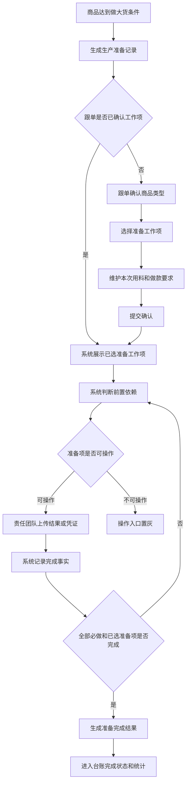
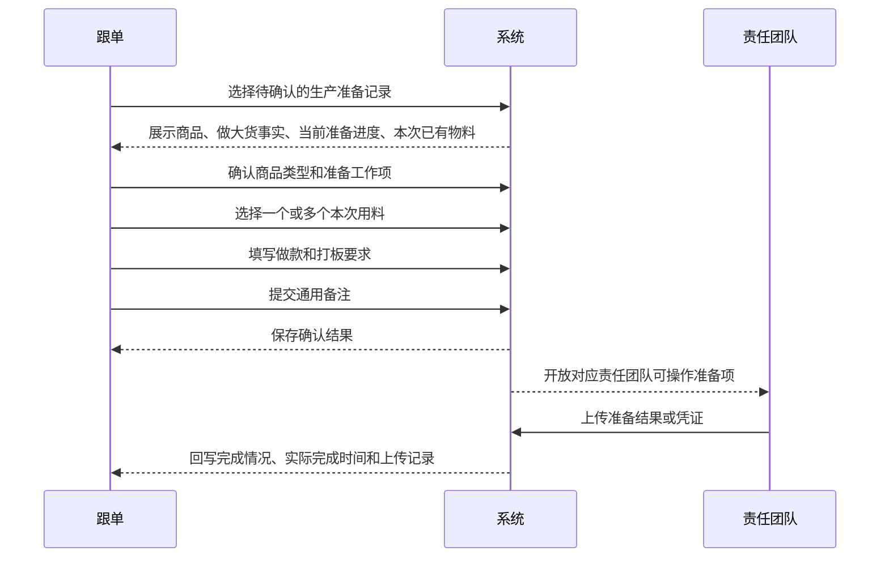
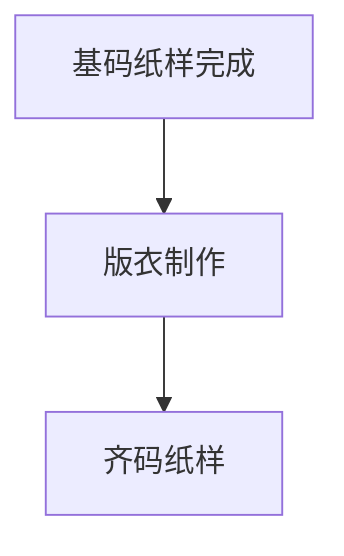
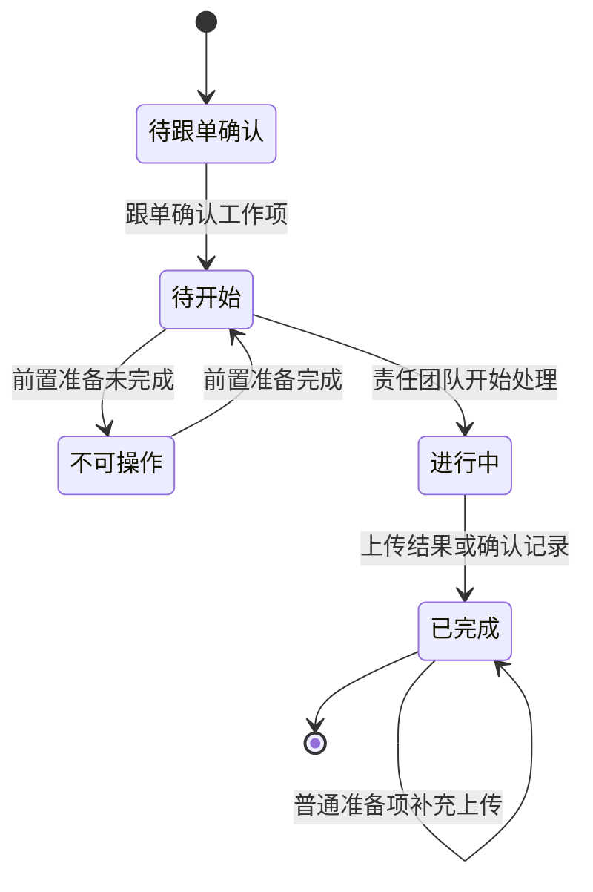

# 生产准备时效产品需求文档

## 1. 文档信息

| 项目 | 内容 |
| --- | --- |
| 文档名称 | 生产准备时效产品需求文档 |
| 适用系统 | 工厂生产协同系统 |
| 适用页面 | 生产准备时效、生产准备时效统计 |
| 涉及角色 | 跟单、生产管理、版师团队、毛织团队、车板团队、花型团队、染色团队、采购团队、生产主管 |
| 需求范围 | 2026-07-08 至 2026-07-09 生产准备时效调整内容 |
| 文档用途 | 交付研发进行正式功能开发 |

## 2. 背景

生产准备时效用于跟踪从商品达到做大货条件后，到生产准备资料和准备工作项完成之间的全过程。

本轮调整前，页面已经能展示生产准备记录、准备工作项、上传记录和统计结果，但存在以下业务问题：

- 筛选条件不够贴近责任处理，无法按责任团队和责任人快速定位问题。
- 列表信息分散，商品、做大货事实、准备时间、完成情况、本次用料等信息不够集中。
- 跟单确认工作项时，本次用料、做款要求、多个物料选择不完整。
- 染色要求原先更像附加动作，没有作为正式准备工作项进入依赖和统计。
- 基码纸样、版衣制作、齐码纸样之间的先后关系没有稳定约束。
- 染色要求未确认时，染色团队可能提前上传调色结果。
- 普通准备工作项需要支持多次补充上传，不能因为已完成就关闭上传入口。

本需求目标是把生产准备时效从“看进度”提升为“按责任、按物料、按前置依赖推动准备工作闭环”。

## 3. 目标

1. 让生产管理人员能按日期、责任团队、责任人快速定位准备记录。
2. 让跟单在确认工作项时一次性确认商品类型、准备项、本次用料和做款要求。
3. 让每个责任团队清楚看到自己要做什么、基于什么要求做、前置是否满足。
4. 让染色要求成为正式准备工作项，由跟单确认后，染色团队再执行调色。
5. 让基码纸样、版衣制作、齐码纸样按真实业务顺序推进。
6. 让统计口径能准确反映准备工作完成情况、责任团队工作量和超时情况。
7. 保留普通准备工作项多次上传能力，满足补图、补文件、补凭证场景。

## 4. 非目标

- 不新增独立菜单。
- 不新增真实审批流。
- 不新增完整组织架构和权限系统。
- 不改变生产准备时效的主页面边界。
- 不把一线员工 PDA 执行页纳入本次范围。
- 不新增买手审核流程。
- 不把染色要求确认等同于染色调色完成。

## 5. 角色分工

| 角色 | 主要职责 |
| --- | --- |
| 跟单 | 确认商品类型、确认准备工作项、维护本次用料、填写做款要求、确认染色要求 |
| 生产管理 | 查看台账、筛选异常、跟进超时、查看统计 |
| 版师团队 | 上传梭织基码纸样、梭织齐码纸样 |
| 毛织团队 | 上传毛织基码纸样、毛织齐码纸样 |
| 车板团队 | 上传版衣结果 |
| 花型团队 | 上传数码印、DTF、DTG 花型资料 |
| 染色团队 | 在染色要求确认后上传染色调色结果 |
| 采购团队 | 登记辅料下单结果和凭证 |
| 生产主管 | 查看卡点、追溯责任、协调跨团队处理 |

## 6. 主流程

## 7. 跟单确认工作项流程

## 8. 页面需求

### 8.1 生产准备时效台账

#### 筛选区

筛选条件必须保持一行展示，避免占用过多首屏空间。

筛选条件包括：

- 日期：支持日期段筛选。
- 买手。
- 生产准备状态。
- 准备工作项。
- 责任团队。
- 责任人。
- 是否超时。
- 关键词。

责任团队和责任人存在联动关系：

- 先选责任团队，再选责任人。
- 未选择责任团队时，责任人应提示先选择责任团队。
- 已选择责任团队后，只展示该团队下的责任人。

#### 统计卡片

统计卡片要求：

- 每张卡片只保留一行文字和一个数值。
- 不展示与本轮责任处理无关的统计项。
- 统计结果必须随筛选条件联动变化。

建议保留统计项：

- 准备记录数。
- 待跟单确认数。
- 进行中数。
- 已超时数。
- 已完成数。

#### 列表信息

列表需要按“快速判断责任和状态”的原则展示。

必需列：

| 列 | 展示要求 |
| --- | --- |
| 商品 | 合并展示商品图片、商品名称、商品编码、商品类型、达到做大货要求 |
| 准备时间 | 合并展示进入准备时间、预计完成时间、实际完成时间 |
| 完成情况 | 列出所有必做和已选准备工作项，完成项亮色，未完成项灰色 |
| 产出 | 展示生产准备完成后生成或关联的业务结果 |
| 责任 | 展示当前记录涉及的责任团队和责任人 |
| 操作 | 展示查看详情、确认工作项、各准备工作项操作入口 |

列表不再单独展示：

- 当前卡点。
- 单独的完成比例。
- 单独的商品类型列。
- 单独的进入准备时间列。
- 单独的预计完成时间列。

商品类型展示规则：

- 跟单已确认时，直接展示商品类型。
- 跟单未确认时，展示“待跟单确认”。
- 不展示“跟单确认：”这类前缀文案。

实际完成时间口径：

- 实际完成时间取该记录最后一个已完成准备工作项的完成时间。
- 如果尚未全部完成，则实际完成时间为空或显示未完成状态。

### 8.2 详情页

详情页用于查看完整事实，不替代列表操作入口。

详情页必须展示：

- 基本信息：商品、买手、跟单、进入准备时间、预计完成时间。
- 做大货事实：达到做大货要求的数量和时间。
- 商品类型：系统判断结果、跟单确认结果。
- 本次用料：物料图片、物料名称、物料编码、物料类型、应备数量、已配数量、已领数量、单位。
- 做款和打板要求。
- 通用备注。
- 准备工作项明细。
- 每个准备工作项的责任团队、责任人、计划时间、实际完成时间、完成状态。
- 前置准备工作项及其完成情况。
- 上传记录和下载记录。
- 产出结果。

### 8.3 确认工作项弹窗

跟单确认工作项时，弹窗按以下顺序组织：

1. 确认商品类型。
2. 确认准备工作项。
3. 维护本次用料和做款要求。
4. 填写通用备注。
5. 确认提交。

#### 商品类型

系统应根据商品工艺自动带出建议商品类型，跟单可人工修正。

商品类型至少包括：

- 非烫画且非毛织。
- 烫画和直喷。
- 毛织。
- 毛织和梭织。

#### 准备工作项

系统根据商品类型带出默认准备项。

规则：

- 必做项默认选中，不允许取消。
- 选做项可由跟单选择或取消。
- 如果跟单选择染色调色，系统必须自动补上对应的确认染色要求。
- 业务人员不需要理解“确认染色要求”和“染色调色”的底层依赖关系。

#### 本次用料

本次用料支持多个物料。

交互要求：

- 物料通过支持搜索的下拉选择。
- 每新增一次，新增一行物料。
- 已选择物料必须展示真实图片、物料名称、物料编码、物料类型。
- 每行物料可填写或展示应备数量、已配数量、已领数量、单位。
- 支持删除误选物料行。
- 多个物料行建议以表格展示，避免卡片堆叠导致弹窗过高。

#### 做款和打板要求

跟单必须填写做款和打板要求。

内容用于指导版师、毛织、车板、花型等团队执行，不能只作为备注隐藏。

#### 通用备注

通用备注为非必填。

用途：

- 说明商品类型人工修正原因。
- 说明特殊业务背景。
- 补充生产准备注意事项。

不再使用“修正原因”作为页面展示文案。

### 8.4 准备工作项操作入口

未确认工作项时：

- 只显示“确认工作项”。
- 不显示各责任团队的上传入口。

已确认工作项后：

- 显示查看详情。
- 显示已选择准备工作项对应的操作入口。
- 可操作项显示蓝色按钮。
- 不可操作项直接置灰。
- 不展示复杂等待原因。

普通准备工作项上传规则：

- 普通准备工作项支持多次上传。
- 即使已完成，也允许继续上传补充文件、补充图片或补充凭证。
- 每次上传都要保留上传人、上传时间、文件名称和说明。
- 已完成状态不应阻断补充上传。

确认染色要求规则：

- 确认染色要求完成后，不允许重复确认。
- 如需调整染色要求，应走后续变更或异常处理流程，不在本轮范围内。

## 9. 准备工作项依赖规则

### 9.1 染色链路

染色要求是跟单要完成的准备工作项。染色调色是染色团队要完成的准备工作项。

业务规则：

- 需要纱线染色时，必须先确认纱线染色要求，再上传纱线调色结果。
- 需要面料染色时，必须先确认面料染色要求，再上传面料调色结果。
- 确认染色要求完成，不代表染色调色完成。
- 染色调色完成，必须有对应染色要求已经完成。
- 染色要求未完成时，染色调色入口置灰。
- 染色要求完成后，染色团队能看到物料、颜色名称、潘通色号和染色备注。

### 9.2 纸样和版衣链路

业务规则：

- 先完成基码纸样，才能制作版衣。
- 版衣完成后，才能制作齐码纸样。
- 如果同一记录同时存在梭织基码和毛织基码，必须两个基码都完成后，才能制作版衣。
- 版衣未完成时，齐码纸样入口置灰。

## 10. 准备工作项状态

状态说明：

- 待跟单确认：跟单尚未确认商品类型和准备工作项。
- 待开始：准备项已确认，等待责任团队处理。
- 不可操作：该准备项的前置准备项尚未完成。
- 进行中：责任团队已开始处理但尚未完成。
- 已完成：准备项已有完成事实。

特殊规则：

- 普通准备项已完成后，仍允许补充上传。
- 确认染色要求已完成后，不允许重复确认。
- 被取消选择的准备项不进入完成统计。

## 11. 产出与统计口径

### 11.1 产出口径

当所有必做和已选择的准备工作项都完成后，系统应将该生产准备记录标记为准备完成，并展示对应产出结果。

产出结果可以包括：

- 正式技术资料。
- 生产需求。
- 生产单。
- 印花需求或加工单。
- 染色需求或加工单。
- 辅料采购相关结果。

具体产出取决于该记录实际选择的准备工作项。

### 11.2 统计口径

统计应支持月度汇总和明细查看。

统计应覆盖：

- 准备记录数。
- 已完成记录数。
- 超时记录数。
- 各准备工作项完成数。
- 各责任团队完成数。
- 各责任人完成数。
- 待跟单确认数。

确认染色要求作为正式准备工作项，应进入完成情况和统计。

染色调色作为独立准备工作项，应按染色团队上传调色结果的时间进入完成统计。

## 12. 业务样例覆盖

研发验收时至少需要覆盖以下样例：

1. 待跟单确认记录不少于 2 条。
2. 已确认且未选择染色的纯梭织记录。
3. 已确认且选择面料染色，染色要求已确认，染色调色可操作。
4. 已确认且选择面料染色，染色要求未确认，染色调色置灰。
5. 已确认且选择纱线染色，染色要求已确认，纱线调色可操作。
6. 同时选择纱线染色和面料染色，两类染色要求分别确认。
7. 基码纸样未完成，版衣制作置灰。
8. 基码纸样完成，版衣制作可操作。
9. 梭织和毛织基码同时存在，只完成一个基码时版衣制作仍置灰。
10. 版衣制作未完成，齐码纸样置灰。
11. 版衣制作完成，齐码纸样可操作。
12. 普通准备项已完成后，仍可再次上传补充文件。
13. 确认染色要求已完成后，不允许重复确认。
14. 本次用料包含多个物料，每个物料都有图片、名称、编码、类型和数量。
15. 统计结果随筛选条件变化。

## 13. 验收标准

### 13.1 页面验收

- 筛选条件一行展示。
- 日期使用日期段筛选。
- 责任人受责任团队约束。
- 统计卡片高度压缩，每张卡片文案不超过一行。
- 商品列合并商品信息、商品类型、达到做大货要求。
- 准备时间列合并进入时间、预计完成时间、实际完成时间。
- 完成情况列逐项展示准备工作项，完成项和未完成项视觉区分清楚。
- 列表不再展示当前卡点列。
- 待跟单确认记录展示清楚。

### 13.2 确认工作项验收

- 跟单可确认商品类型。
- 系统可按商品类型带出默认准备工作项。
- 必做项不能取消。
- 选做项可选择或取消。
- 选择染色调色时，系统自动补上对应确认染色要求。
- 本次用料支持多个物料行。
- 物料支持搜索选择。
- 已选物料展示图片、名称、编码、类型。
- 做款和打板要求必填。
- 通用备注可填。
- 取消和确认按钮始终可见。

### 13.3 依赖验收

- 染色要求未确认时，染色调色不可操作。
- 染色要求确认后，染色调色可操作。
- 染色调色能看到对应染色要求。
- 基码纸样未完成时，版衣制作不可操作。
- 全部已选基码纸样完成后，版衣制作可操作。
- 版衣制作未完成时，齐码纸样不可操作。
- 版衣制作完成后，齐码纸样可操作。
- 不可操作项直接置灰，不展示复杂原因。

### 13.4 上传和追溯验收

- 普通准备工作项支持多次上传。
- 每次上传都生成独立上传记录。
- 上传记录包含上传人、上传时间、文件名称和说明。
- 已完成普通准备项仍可补充上传。
- 确认染色要求已完成后不可重复确认。
- 详情页能查看前置准备项、责任团队、责任人、完成时间和上传记录。

### 13.5 统计验收

- 确认染色要求计入准备工作项完成统计。
- 染色调色按调色结果上传时间计入完成统计。
- 被取消选择的准备项不计入完成统计。
- 未确认记录不生成准备完成结果。
- 全部必做和已选准备项完成后，记录进入准备完成状态。

## 14. 风险与后续

| 风险 | 说明 | 建议 |
| --- | --- | --- |
| 染色要求后续需要修改 | 当前只限制重复确认，不提供变更流程 | 后续纳入生产准备异常或生产单变更流程 |
| 责任团队权限未接真实账号 | 本轮只定义业务角色和页面行为 | 后续接入组织权限时按责任团队和角色标签落地 |
| PDA 执行端未覆盖 | 本轮是管理端和主管端能力 | 后续如给工厂现场执行，需要单独设计 PDA 页面 |
| 物料搜索依赖物料资料完整度 | 物料图片、编码、类型缺失会影响识别 | 正式开发需确保物料资料可被检索和回填 |

## 15. 研发交付清单

- 生产准备时效台账筛选和统计联动。
- 台账列表信息合并和完成情况展示。
- 详情页本次用料、做款要求、准备项依赖、上传记录展示。
- 确认工作项弹窗。
- 多物料选择和物料表格。
- 染色要求确认流程。
- 准备工作项前置依赖控制。
- 普通准备项多次上传。
- 生产准备时效统计口径调整。
- 覆盖本文第 12 节业务样例的测试数据和验收用例。
