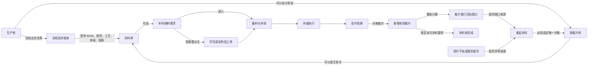
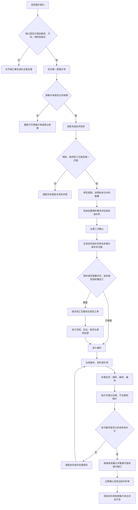
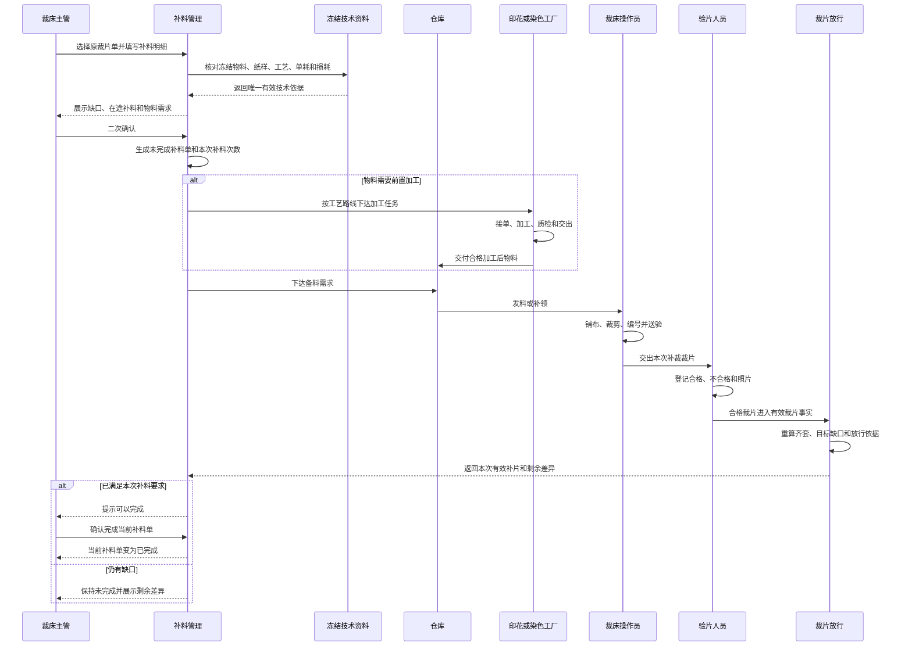

# 补料业务产品需求说明文档

## 1. 文档信息

| 项目 | 内容 |
| --- | --- |
| 文档名称 | 补料业务产品需求说明文档 |
| 文档日期 | 2026-07-28 |
| 文档状态 | 核查后统一需求基线 |
| 适用范围 | 裁片放行、补料管理、裁片单、物料准备与领料、印花与染色加工、补裁、验片、裁片放行反馈 |
| 主要角色 | 裁床办公室文员、裁床主管、验片人员、仓库人员、印花或染色工厂、裁床操作员、生产管理人员、PPIC |
| 文档目标 | 统一补料对象、来源、数量、状态、执行、完成与追溯规则，形成从缺口发现到有效裁片补齐的完整业务闭环 |

## 2. 核查结论

### 2.1 已具备的业务能力

当前补料相关模块已经覆盖以下能力：

- 可从补料管理进入补料列表、新增补料和补料详情。
- 可按生产单或裁片单查看已裁数量、齐套数量、缺口和建议补料数量。
- 可从已确认的裁片放行目标缺口进入补料。
- 可按颜色、尺码、物料、纸样部位填写补料数量。
- 可按冻结技术资料中的物料单耗和损耗反算物料需求。
- 需要印花或染色时，可生成对应加工单，并保留补料单、原裁片单、生产单和冻结技术版本。
- 裁片单可展示多次补料记录，并可分别查看和完成。
- 可按是否有补料、是否存在未完成补料筛选裁片单。
- 印花与染色加工已有接单、执行、交出、收货、差异和审核等执行链路。
- 重复确认、重复完成和部分并发场景已有防重复规则。

### 2.2 当前必须收敛的业务问题

| 优先级 | 问题 | 业务影响 | 本文统一口径 |
| --- | --- | --- | --- |
| 最高 | 同一补料事实存在“已确认”和“未完成 / 已完成”两套主状态 | 同一张补料单在不同入口无法形成一致判断 | “已确认”只表示创建动作成功；正式补料单主状态统一为“未完成 / 已完成” |
| 最高 | 补料管理与裁片单使用的补料记录未形成同一份事实 | 新增后可能无法在原裁片单看到，也无法沿同一记录完成 | 所有入口必须读取同一张补料单 |
| 最高 | 新增入口同时允许生产单和裁片单作为补料对象 | 一个生产单下有多张裁片单时容易挂错对象 | 正式补料单必须且只能归属一张真实裁片单 |
| 最高 | 放行缺口进入补料时，原裁片单选择和归属校验不一致 | 可能绕过裁片单选择，或无法把创建结果带回裁片单 | 放行结果只提供缺口；确认前必须落到唯一原裁片单 |
| 最高 | 当前存在同一生产单号对应两份不同生产需求的情况 | 补料可能读取错误款式、尺码、物料或技术版本 | 生产单号必须唯一；冲突时阻断补料并由生产管理处理 |
| 最高 | 补料确认后只打通了部分印花、染色加工，未贯通备料、领料、补裁、验片和有效裁片反馈 | 补料单可以“建出来”，但无法证明裁片已经补齐 | 补料完成必须以补裁裁片验收并进入有效裁片事实为依据 |
| 高 | 补料完成可人工点击，但未要求执行数量与验片证据 | 可能提前完成或误完成 | 完成时必须核对本次有效补片、差异和责任记录 |
| 高 | 已发起补料数量与当前有效裁片缺口可能重复计算 | 容易重复补料或漏补 | 缺口、在途补料和新增建议必须分别计算 |
| 高 | 同一物料同时需要多个加工工序时，工序先后关系不明确 | 可能把本应串行的加工单并行下达 | 必须按冻结工艺路线生成先后有序的加工单 |
| 高 | 加工单缺少统一的加工前物料与加工后物料表达 | 无法确认加工对象是否正确 | 每张加工单必须明确加工前 SKU、加工后 SKU、工艺、数量和损耗 |
| 中 | 物料异常退回后的补领与裁片补料容易混用“补料”一词 | 可能把补领原料误当成补裁裁片 | 物料补领和裁片补料分别记录，仅在实际裁片缺口形成后才创建裁片补料单 |
| 中 | 权限、通知、超期和历史迁移口径尚未完全统一 | 现场责任不清、历史查询不稳定 | 本文补齐角色、提醒、追溯和历史治理要求 |

### 2.3 当前核查验证结果

| 核查项 | 结果 | 结论 |
| --- | --- | --- |
| 同一裁片单多次补料、次数递增、独立完成、重复完成保护 | 通过 | 可作为补料生命周期基础 |
| 补料确认后生成印花、染色加工单并保持来源追溯 | 部分通过 | 加工单生成规则可用，但整体校验被生产单身份冲突阻断 |
| 放行缺口创建补料并回到同一裁片单 | 未通过 | 当前放行入口与裁片单选择口径不一致 |
| 生产单与冻结需求唯一性 | 未通过 | 同一生产单号出现 4 条 SKU 与 12 条 SKU 两套需求事实 |
| 补料单从缺口到有效裁片补齐 | 未形成完整闭环 | 备料、补裁、验片和放行反馈仍需按本文贯通 |

## 3. 业务范围与边界

### 3.1 本文所称“补料”

本文中的补料是：

> 因原裁片数量或质量不能满足生产目标，针对一张原裁片单再次组织物料、加工、裁剪和验片，最终补充有效裁片的业务活动。

补料的加工前事实是原裁片单、当前有效裁片和对应物料需求；补料的最终加工后对象是新增的有效裁片。

### 3.2 三类容易混淆的业务

| 业务 | 处理对象 | 结果对象 | 是否形成裁片补料单 |
| --- | --- | --- | --- |
| 裁片补料 / 补裁 | 原裁片单的裁片缺口 | 新增有效裁片 | 是 |
| 物料补领 / 换料 | 已领后退回或不足的原料 | 可继续裁剪的替换物料 | 否；只有后续确认形成裁片缺口时才创建 |
| 印花 / 染色补单 | 需要为补裁准备的加工物料 | 满足补裁要求的加工后物料 | 由裁片补料单派生，不替代补料单 |

### 3.3 明确排除

以下名称虽包含“补充”或“补”，但不属于本需求：

- 工厂入驻中的补充资料。
- 商品或技术资料中的补充图片。
- 结算中的补扣款。
- 一般说明文字中的补充信息。
- 正常生产单下的常规备货或常规印染加工。

### 3.4 本期不做

- 不新增独立补料审批流。
- 不支持一张补料单归属多张裁片单。
- 不支持批量完成多张补料单。
- 不把“部分完成”设为补料单主状态。
- 不支持删除补料单。
- 不支持撤销已完成补料单。
- 不因补料单完成自动改变原裁片单主状态。
- 不在本期定义补料成本分摊、供应商扣款和结算规则。
- 不根据采购备注自动推断染色、印花或其他加工。

## 4. 业务术语

| 术语 | 定义 |
| --- | --- |
| 原裁片单 | 首次裁剪时形成、能够唯一定位物料、技术版本和裁片任务的业务单据 |
| 补料单 | 针对一张原裁片单再次组织补裁的独立业务单据 |
| 补料次数 | 同一原裁片单下，按补料单成功创建顺序形成的第几次补料 |
| 补料来源 | 发现缺口的业务场景，例如放行目标缺口、验片不良或裁剪差异 |
| 补料归属 | 补料单直接关联的唯一原裁片单 |
| 目标数量 | 裁床计划达到的颜色尺码成衣数量 |
| 当前有效裁片 | 已完成裁剪并通过有效性确认、可参与齐套计算的裁片 |
| 当前缺片 | 达到目标数量仍缺少的具体部位裁片数量 |
| 在途补料 | 已创建但尚未全部形成有效裁片的补料数量 |
| 建议新增补料 | 扣除当前有效裁片和在途补料后，本次建议再发起的补料数量 |
| 冻结技术版本 | 原生产单下单时确定的技术资料版本，包含 BOM、纸样、工艺、单耗和损耗 |
| 物料需求 | 为完成本次补裁所需的原料或加工后物料数量 |
| 加工前 SKU | 进入某一加工工序前的实际物料 SKU |
| 加工后 SKU | 完成某一加工工序后形成的目标物料 SKU |
| 有效补片 | 本次补裁后通过验片并进入有效裁片事实的数量 |

## 5. 核心业务原则

1. 一张补料单必须且只能归属于一张真实原裁片单。
2. 一张原裁片单可以没有补料，也可以发生多次补料。
3. 每次补料独立记录次数、原因、明细、物料、执行、完成和责任。
4. 生产单是上游背景，不是补料单直接归属对象。
5. 裁片放行结果是缺口来源，不是补料单直接归属对象。
6. 补料原因与实际处理对象必须分开记录，不能把“缺料”“损耗”等原因当成物料或裁片对象。
7. 补料物料必须来自原生产单的冻结技术版本，且能唯一匹配物料和纸样部位。
8. 每张派生加工单必须有加工前 SKU 和加工后 SKU。
9. 同一物料需要多个加工工序时，必须按冻结工艺路线串联，前一道的加工后 SKU 是下一道的加工前 SKU。
10. 正常采购、备货和补领不自动等于裁片补料，也不自动生成染色或印花。
11. 补料单完成只表示本次补料已经形成并验收有效裁片，不代表原裁片单、生产单或其他补料单完成。
12. 所有菜单必须读取同一份补料事实。

## 6. 业务对象关系



### 6.1 关系约束

- 一张生产单可以有多张原裁片单。
- 一张原裁片单可以有多张补料单。
- 一张补料单不得跨原裁片单。
- 一张补料单可以有多条颜色尺码部位明细。
- 一条补料明细必须唯一对应一条冻结 BOM 物料和一个原裁片来源。
- 一条物料需求可以不需要加工，也可以按工艺路线派生一张或多张加工单。
- 一张加工单只能处理一种明确的加工前 SKU 到加工后 SKU 的转换。
- 一张补料单可以对应多次领料、补领、补裁和验片记录，但只能有一个最终完成结论。

## 7. 角色与责任

| 角色 | 主要责任 | 不负责 |
| --- | --- | --- |
| 裁床办公室文员 | 查询缺口、选择原裁片单、填写补料原因和明细、查看进度 | 不确认验片结果，不处理库存 |
| 裁床主管 | 核对缺口、确认补料、处理人工调整、确认完成、处理异常归属 | 不代替仓库确认实物收发 |
| 验片人员 | 记录合格、不合格、缺陷和照片，确认有效补片 | 不修改补料需求和物料单耗 |
| 仓库人员 | 备料、发料、补领、退回确认、数量差异处理 | 不修改裁片缺口 |
| 印花或染色工厂 | 接单、执行、交出、处理加工差异 | 不改变补料归属和补料数量 |
| 裁床操作员 | 扫描任务和物料，执行铺布、裁剪和交出 | 不修改冻结技术版本 |
| 生产管理人员 | 查看跨模块进度、超期、异常和历史追溯 | 不代替现场确认实物事实 |
| PPIC | 查看补料对放行和可派数量的影响 | 不创建或完成裁片补料单 |
| 系统 | 计算缺口、反算物料、生成执行任务、校验归属、汇总进度和保留历史 | 不替代主管判断异常责任 |

### 7.1 使用端与设备

| 场景 | 使用端 | 主要设备 | 现场要求 |
| --- | --- | --- | --- |
| 补料查询、创建、确认和完成 | 管理端 | 办公电脑 | 支持筛选、详情、跨单据追溯和主管确认 |
| 仓库备料、发料、退回和补领 | 仓库执行端 | PDA、扫码枪、标签打印设备 | 优先扫码识别任务、物料、批次和数量 |
| 印花或染色执行 | 工厂执行端 | PDA、平板、工位电脑 | 展示当前任务、加工对象、数量和唯一主动作 |
| 补裁执行 | 裁床执行端 | PDA、平板、扫码枪 | 展示款式图片、物料、颜色尺码部位和应补数量 |
| 验片 | 质检执行端 | 平板、手机或工位电脑 | 快速录入合格、不合格、缺陷和照片 |
| 进度与风险管理 | 管理端 | 办公电脑、大屏 | 展示阻塞环节、责任方、超期和跨模块进度 |

## 8. 补料触发场景

### 8.1 放行目标缺口

裁床主管已确认颜色尺码目标，系统根据当前有效裁片计算出具体部位缺口。

要求：

- 只允许使用最新有效的目标确认结果。
- 必须展示目标数量、当前齐套、缺口部位、缺片数量和建议补料数量。
- 目标结果已变化时，原补料依据立即失效，必须重新核对。
- 放行结果涉及多张原裁片单时，必须按原裁片单拆分创建。

### 8.2 验片不良

验片发现破损、污渍、色差、裁片尺寸不合格或其他不可用裁片。

要求：

- 记录不合格部位、数量、缺陷类型、照片和责任说明。
- 不合格裁片先从有效裁片中扣除，再计算缺口。
- 补料单必须关联对应原裁片单和验片记录。

### 8.3 裁剪数量差异

裁剪结束后，实际可用裁片少于应有数量。

要求：

- 记录计划数量、实际数量、差异数量和差异原因。
- 差异必须落到颜色、尺码、物料和部位。
- 不能只按生产单总数量创建补料。

### 8.4 裁片损耗

搬运、编号、绑菲票、装袋或裁后处理中发生裁片损坏或丢失。

要求：

- 记录发生环节、责任方、数量和证据。
- 已经失效的菲票或裁片数量不得继续参与齐套。
- 补料仍归属于原裁片单。

### 8.5 尺码齐套不足

某些颜色尺码总体数量看似足够，但某个必需部位不足，导致齐套数量低于目标。

要求：

- 按最短缺部位计算，不得用总片数替代齐套判断。
- 展示每件所需片数、当前有效片数和实际缺片数。

### 8.6 原裁片单关闭前补齐

原裁片单尚未关闭，主管基于现场盘点确认仍有缺口。

要求：

- 必须填写具体原因和明细。
- 已关闭原裁片单不得直接新增补料。
- 如确需再次补料，应先按业务规则重新打开原裁片单并记录原因。

### 8.7 物料退回与补领

已领物料在开工前发现质量、规格、批次或数量异常时，先走退回与补领。

要求：

- 原配料事实保持不变，新增退回和补领事实。
- 替换物料能够及时补领且尚未形成裁片缺口时，不创建裁片补料单。
- 因退回、无料或延误最终形成实际裁片缺口时，再按唯一原裁片单创建补料单。

## 9. 端到端业务流程



## 10. 新增补料

### 10.1 入口

允许从以下入口进入新增：

- 补料管理。
- 原裁片单。
- 最新有效的裁片放行目标缺口。
- 验片不良记录。
- 裁剪差异记录。

无论从哪个入口进入，最终都必须选定一张真实原裁片单。

### 10.2 原裁片单选择

选择时展示：

- 原裁片单号。
- 所属生产单。
- 款式和款号。
- 物料 SKU、物料名称和图片。
- 冻结技术版本。
- 当前裁片单状态。
- 当前有效裁片、齐套数量和缺口摘要。
- 已发生的补料次数和未完成补料。

选择规则：

- 每次只能选择一张。
- 已关闭原裁片单不可选择。
- 生产单号重复、原裁片单身份冲突或物料归属不唯一时不可选择。
- 放行缺口无法唯一定位原裁片单时不可继续。

### 10.3 补料原因

结构化原因至少包括：

- 裁片损耗。
- 验片不良。
- 尺码齐套不足。
- 裁剪数量差异。
- 原裁片单关闭前补齐。
- 其他。

所有原因都必须填写说明。选择“其他”时，说明必须明确发生环节和实际情况。

### 10.4 补料明细

每条明细必须包含：

- 成衣颜色。
- 成衣尺码。
- 物料 SKU 和物料名称。
- 物料图片。
- 纸样部位。
- 每件所需片数。
- 目标成衣数量。
- 当前有效裁片数量。
- 当前缺片数量。
- 已在途补料数量。
- 系统建议新增补料数量。
- 本次确认补料数量。
- 人工调整原因。

### 10.5 人工调整

- 本次补料数量可以在有权限人员确认后调整。
- 调整后必须填写原因。
- 不能填写 0、负数、小数或无单位数量。
- 调整不得掩盖当前缺片和在途补料，原建议值必须保留供追溯。
- 明显超过缺口时必须二次提醒，并由主管确认。

### 10.6 二次确认

确认前必须汇总展示：

- 原裁片单和所属生产单。
- 冻结技术版本。
- 补料原因及说明。
- 颜色尺码部位明细。
- 补料总数量。
- 物料理论需求。
- 预计使用库存、补领、采购或加工的供给路径。
- 将生成的印花、染色或其他加工任务。
- 创建人和确认时间。

确认成功后：

- 生成一张正式补料单。
- 同一原裁片单的补料次数唯一递增。
- 主状态为“未完成”。
- 同步显示在补料管理和原裁片单。
- 按需要生成物料和加工执行任务。

## 11. 数量计算

### 11.1 当前缺片

```text
某部位应有裁片数量
= 目标成衣数量 × 每件所需片数

当前缺片数量
= 某部位应有裁片数量 - 当前有效裁片数量
```

结果小于 0 时按 0 计算。

### 11.2 建议补料成衣数量

```text
建议补料成衣数量
= 当前缺片数量 ÷ 每件所需片数，向上取整
```

示例：

- M 码左前片每件需要 2 片。
- 目标为 100 件，应有 200 片。
- 当前有效裁片为 185 片，实际缺 15 片。
- 建议补料成衣数量为 8 件。

### 11.3 建议新增补料

```text
建议新增补料
= 当前建议补料 - 尚未转成有效裁片的在途补料
```

要求：

- 在途补料只计算未完成且尚未进入有效裁片事实的数量。
- 补裁裁片一旦通过验片并进入有效裁片，不得同时继续作为在途数量重复扣减。
- 同一补料明细部分形成有效裁片时，主状态仍为“未完成”，但进度需展示已有效和剩余数量。
- 建议结果小于 0 时按 0 计算。

### 11.4 A / B 物料比较

当现场使用基准物料比较其他物料的齐套差异时：

- 只能作为补料参考，不能替代具体部位缺口。
- 基准物料角色必须已经确认。
- 物料角色无法识别时，必须先由主管确认。
- 多个必需部位存在缺口时，以实际齐套短板为准。
- 已确认的放行目标缺口优先级高于简单 A / B 数量比较。

### 11.5 物料需求

```text
理论物料需求
= 本次补料成衣数量 × 单件用量 ×（1 + 损耗率）
```

要求：

- 单件用量、损耗率和单位必须来自冻结技术版本。
- 同一物料的多条明细可以在同一原裁片单内合并计算。
- 同一冻结物料关联多张原裁片单时必须拆单，不得合并。
- 理论需求和实际发料数量分别记录。
- 实际发料可按仓储最小发料单位向上取整，但不得覆盖理论需求。
- 面料、辅料、包材等必须使用各自真实业务单位。

## 12. 物料供给与加工

### 12.1 供给路径

每条物料需求必须明确一种供给路径：

- 现有可用库存。
- 退回物料质检后重新配出。
- 替换物料补领。
- 新增采购。
- 需要先染色。
- 需要先印花。
- 需要按冻结路线进行多道加工。

供给路径是需求来源与履约方式，不改变补料单的原裁片归属。

### 12.2 加工单生成

需要加工时，每张加工单必须明确：

- 来源补料单。
- 原裁片单。
- 所属生产单。
- 冻结技术版本。
- 冻结 BOM 物料。
- 加工前 SKU。
- 加工后 SKU。
- 工艺名称。
- 计划投入数量和单位。
- 计划产出数量和单位。
- 预计损耗。
- 承接工厂。
- 要求完成时间。
- 下游接收仓或接收环节。

### 12.3 多道工艺

- 工艺顺序必须来自冻结工艺路线。
- 不得因同一物料同时标有染色和印花，就默认并行生成两张互不相关的加工单。
- 前一道加工完成并形成合格加工后 SKU 后，才能满足下一道的加工前 SKU。
- 工序跳过、返工、驳回和数量差异必须保留记录。
- 需要水溶或其他前置工序时，必须作为工艺路线的一部分，不得只在备注中说明。

### 12.4 不需要加工

物料不需要印花、染色或其他前置加工时：

- 不生成无意义加工单。
- 直接进入库存确认、备料和发料。
- 缺少冻结技术版本或物料无法唯一匹配时，仍不得确认补料。

### 12.5 防重复

- 同一补料确认重复提交不得生成重复补料单。
- 同一补料单、同一原裁片单、同一冻结物料、同一工艺不得重复生成加工单。
- 确认过程中任一必要加工单生成失败时，本次确认整体失败，不保留半套业务结果。
- 重新提交时必须能继续使用同一份有效补料内容。

## 13. 备料、补领与仓储

### 13.1 备料

仓库查看：

- 补料单和原裁片单。
- 物料图片、SKU、名称、颜色和规格。
- 理论需求、应发数量、已发数量和剩余数量。
- 加工后物料是否已收货。
- 要求完成时间和优先级。

### 13.2 发料与领料

- 仓库按实际批次、卷号和数量发料。
- 裁床扫描补料任务和物料确认领料。
- 发料数量超过需求时必须二次确认。
- 少发、错料、批次不符或质量异常时必须上报差异。
- 补料领料不得混入原裁片单首次领料而失去补料来源。

### 13.3 退回与补领

- 退回数量不得超过裁床待加工仓可用数量。
- 中转仓确认收回前，退回数量不可再次用于裁剪。
- 退回后先进行质量判定，再决定重新配出、换料重配或异常关闭。
- 补领记录必须关联原发料和补料单，但不新建另一张裁片补料单。

## 14. 补裁执行

### 14.1 补裁任务

正式补料单确认后，应形成可执行的补裁任务，任务至少包含：

- 补料单。
- 原裁片单。
- 生产单和款式图片。
- 颜色、尺码和部位。
- 应补成衣数量、应补裁片数量。
- 物料和批次。
- 纸样和唛架要求。
- 加工前物料与当前可用数量。
- 计划完成时间。

### 14.2 铺布与裁剪

- 补裁可以复用原裁片单的技术依据，但必须形成新的执行事实。
- 铺布单、裁剪记录、操作员、设备、开始时间和结束时间必须关联补料单。
- 实际铺布层数、实际裁剪数量和差异必须记录。
- 不得修改或覆盖原裁片单首次生产事实。

### 14.3 现场端

现场端首屏只展示：

- 当前补料任务。
- 款式图片。
- 原裁片单。
- 物料和批次。
- 颜色、尺码、部位和应补数量。
- 当前唯一主动作。

主动作按现场步骤使用：

- 扫码领料。
- 开始铺布。
- 开始裁剪。
- 确认裁剪完成。
- 交给验片。
- 上报差异。
- 叫主管处理。

## 15. 验片与有效裁片

### 15.1 验片记录

每次验片必须记录：

- 补料单。
- 补裁任务。
- 颜色、尺码和部位。
- 送检数量。
- 合格数量。
- 不合格数量。
- 缺陷类型。
- 照片。
- 验片人和验片时间。
- 处理动作。

### 15.2 有效裁片形成

- 只有验片合格数量可以进入有效裁片事实。
- 不合格数量不得参与齐套和放行计算。
- 合格数量写入后，系统重新计算当前齐套、目标缺口和剩余补料建议。
- 实际合格数量超过本次需求时，超出部分必须保留为实际裁片事实，不得隐藏。

### 15.3 未补齐

当合格数量不足时：

- 补料单保持“未完成”。
- 展示本次要求、已有效、仍缺和差异原因。
- 主管选择继续备料补裁，或上报异常。
- 继续执行仍沿用当前补料单，不自动产生下一次补料。
- 只有主管明确决定结束当前补料并另起一次时，才创建下一张补料单。

## 16. 补料单状态

### 16.1 主状态

补料单只保留两个主状态：

- 未完成。
- 已完成。

“草稿”是确认前的临时填写过程，不是正式补料单状态。

“已确认”是创建成功提示，不是补料单主状态。

### 16.2 状态图

```mermaid
stateDiagram-v2
  [*] --> "未完成": "确认生成补料单"
  "未完成" --> "未完成": "备料、加工、补领、补裁、验片或差异处理"
  "未完成" --> "已完成": "有效补片满足本次要求且主管确认"
  "已完成" --> [*]
```

### 16.3 执行进度

执行进度不作为主状态，单独展示：

- 待物料。
- 物料加工中。
- 待备料。
- 待领料。
- 待补裁。
- 补裁中。
- 待验片。
- 存在差异。
- 已满足完成条件。

### 16.4 完成条件

同时满足以下条件才允许完成：

- 本次补料要求已经形成对应有效裁片。
- 所有颜色尺码部位的有效数量和差异已核对。
- 相关加工、交出、收货、领料、补裁和验片事实可追溯。
- 不存在未处理的阻断性数量差异。
- 完成人具备权限并进行二次确认。

完成结果：

- 只更新当前补料单。
- 记录完成人和完成时间。
- 其他补料单状态不变。
- 原裁片单主状态不变。
- 裁片放行根据最新有效裁片重新计算，不因点击完成直接增加数量。

## 17. 完成补料时序



## 18. 模块需求

### 18.1 补料管理列表

筛选：

- 关键词。
- 原裁片单。
- 所属生产单。
- 款式。
- 补料来源。
- 主状态。
- 执行进度。
- 创建时间。
- 是否存在加工任务。
- 是否超期。

列表字段：

- 补料单号。
- 第几次补料。
- 原裁片单。
- 所属生产单。
- 款式。
- 原因。
- 补料总数量。
- 物料需求摘要。
- 加工任务摘要。
- 执行进度。
- 主状态。
- 创建人和创建时间。
- 要求完成时间。

操作：

- 查看详情。
- 未完成时进入当前待办环节。
- 满足条件时完成当前补料单。
- 查看关联原裁片单、加工单、领料、补裁和验片记录。

列表要求：

- 所有补料列表均须分页，并明确当前页、每页数量和总数。
- 支持按关键业务字段排序。
- 宽表支持选择显示列、调整列顺序和冻结常用列。
- 补料单号、原裁片单、主状态和操作必须始终可见。
- 进入详情或完成操作后，返回列表时保留当前筛选和阅读位置。

### 18.2 补料详情

按以下顺序展示：

1. 补料单、原裁片单、生产单和款式。
2. 补料原因、来源和冻结依据。
3. 颜色尺码部位缺口与本次补料。
4. 物料理论需求、供给路径和实际收发。
5. 印花、染色或其他加工进度。
6. 铺布、裁剪和验片结果。
7. 当前有效补片、剩余缺口和完成条件。
8. 创建、确认、执行、差异和完成记录。

### 18.3 原裁片单

- 每张补料单独立展示“补 · 第几次 · 状态”。
- 多张补料单不得合并成一个汇总标签。
- 点击标签查看对应补料单详情。
- 有未完成补料时显示“完成补料”入口。
- 完成时只能单选一张未完成补料单。
- 可按“有补料 / 无补料”和“有未完成 / 全部已完成”筛选。
- 无补料裁片单不属于“有未完成”或“全部已完成”。
- 已关闭裁片单保留历史标签，不允许新增；关闭前已产生的补料仍可按权限完成。

### 18.4 裁片放行

- 展示目标数量、当前齐套、目标缺口和具体缺片。
- 只有最新已确认目标且存在缺口时显示“去补料”。
- 进入补料时携带具体目标依据，不只携带生产单。
- 目标依据变化后，未确认的补料草稿失效。
- 新增有效补片后重新计算缺口。
- 补料单完成本身不直接增加放行数量。

### 18.5 印花与染色加工

- 列表和详情显示来源为“裁片补料生成”。
- 展示补料单、原裁片单、生产单、冻结技术版本、加工前 SKU 和加工后 SKU。
- 支持接单、执行、交出、收货、差异、审核和驳回。
- 染色页面中的“是否补料”必须由来源自动判断，不允许与补料来源相互矛盾。
- 加工完成只代表加工物料完成，不代表补料单完成。

### 18.6 仓库与领料

- 可按补料来源查看待备料、待发料、已发料和差异。
- 扫码确认任务、物料、批次和数量。
- 展示应发、已发、剩余、已退和待补领。
- 加工后物料收货后才能进入可发状态。

### 18.7 补裁与验片

- 可按补料单生成并执行补裁任务。
- 铺布、裁剪、菲票和验片均保留补料来源。
- 现场端以动作和实物识别为主，避免复杂管理字段。
- 验片合格后形成有效裁片，并反馈到放行缺口。

### 18.8 生产进度与追溯

- 生产管理可从生产单查看所有原裁片单及其补料次数。
- 可查看每次补料当前阻塞环节、责任方和预计完成时间。
- 可从补料单追溯到来源缺口、冻结技术版本、物料、加工、仓储、补裁、验片和有效裁片。
- 原始生产事实保持只读，不因补料覆盖。

## 19. 业务字段

### 19.1 补料单主信息

- 补料单号。
- 补料次数。
- 原裁片单号。
- 原裁片单身份。
- 所属生产单号。
- 款式编码、款式名称和图片。
- 冻结技术版本。
- 补料来源类型和来源记录。
- 补料原因和说明。
- 主状态。
- 执行进度。
- 要求完成时间。
- 创建人、创建时间。
- 完成人、完成时间。

### 19.2 明细信息

- 颜色。
- 尺码。
- 物料 SKU 和名称。
- 物料图片。
- 纸样部位。
- 每件所需片数。
- 目标数量。
- 当前有效片数。
- 当前缺片数。
- 在途补料。
- 建议新增数量。
- 本次补料数量。
- 实际合格补片。
- 剩余差异。

### 19.3 物料与加工信息

- 冻结 BOM 物料。
- 理论需求。
- 实际备料、发料、退回和补领。
- 供给路径。
- 加工前 SKU。
- 加工后 SKU。
- 工艺路线。
- 加工单号。
- 承接工厂。
- 计划和实际投入、产出、损耗。
- 交出、收货、差异和审核。

### 19.4 执行与质量信息

- 补裁任务。
- 铺布单和裁剪记录。
- 物料批次和卷号。
- 操作员、设备、班次。
- 开始和结束时间。
- 送检、合格、不合格数量。
- 缺陷类型和照片。
- 差异处理人、处理时间和结果。

## 20. 权限、通知与时效

### 20.1 权限

- 新增补料、确认补料、人工调量、完成补料分别授权。
- 仓库只能维护实物收发和差异，不修改补料缺口。
- 加工工厂只能维护本厂加工执行事实。
- 验片人员只能维护质量事实。
- 生产管理和 PPIC默认只读。
- 无权限人员仍可查看其职责所需的来源和进度。

### 20.2 通知

以下情况通知当前责任人和裁床主管：

- 补料单创建。
- 物料不足或无法唯一匹配。
- 加工任务超期。
- 加工交出或收货存在差异。
- 补领仍未满足。
- 补裁完成待验片。
- 验片不合格或数量不足。
- 已满足完成条件但尚未完成。
- 目标依据变化导致草稿失效。

### 20.3 时效

每张补料单必须有要求完成时间，并分别展示：

- 物料预计就绪时间。
- 加工预计完成时间。
- 补裁预计完成时间。
- 验片预计完成时间。
- 当前是否超期。

超期只作为风险，不改变补料单主状态。

### 20.4 弱网与设备异常

- 提交前必须明确当前内容是否已保存。
- 弱网重试不得形成重复补料单、重复加工单或重复完成记录。
- 扫码设备不可用时，允许主管通过受控方式选择对象，并保留代操作记录。
- 图片上传失败时允许重拍和补传，阻断性质量证据未上传前不得完成对应验片。
- 现场端发生无法恢复的设备问题时，必须提供“叫主管处理”入口。

## 21. 防错与异常

| 场景 | 处理规则 |
| --- | --- |
| 生产单号重复 | 阻断创建，提示生产管理先处理重复生产单 |
| 原裁片单无法唯一定位 | 阻断创建，要求选择唯一原裁片单 |
| 原裁片单已关闭 | 禁止新增；如确需新增，先重新打开并记录原因 |
| 放行目标已变化 | 草稿失效，重新计算缺口 |
| 缺少冻结技术版本 | 阻断确认 |
| 物料无法唯一匹配冻结 BOM | 阻断确认 |
| 成衣 BOM 被误作补裁物料 | 阻断确认 |
| 同一冻结物料关联多张原裁片单 | 拆分补料单后再确认 |
| 补料数量为空、为 0、负数或小数 | 阻断确认 |
| 人工数量超过缺口 | 二次提醒并要求主管说明 |
| 同一确认重复提交 | 返回原结果，不重复生成 |
| 部分加工单生成失败 | 整体不成立，不保留半套结果 |
| 物料少发、错料、质量异常 | 上报差异，保持补料未完成 |
| 加工交出与收货不一致 | 进入差异处理，不满足下游备料 |
| 验片合格数量不足 | 保持未完成，显示剩余缺口 |
| 补料已被他人完成 | 不重复完成，提示查看最新状态 |
| 完成条件尚未满足 | 阻断完成，指出未完成环节 |
| 弱网或重复点击 | 保留已确认结果，避免重复单据 |
| 现场无法判断 | 提供拍照、上报差异和叫主管处理 |

## 22. 历史数据治理

### 22.1 可确认归属

- 按原裁片单归属历史补料。
- 同一原裁片单按成功创建时间确定补料次数。
- 已有明确完成事实的记为“已完成”。
- 没有明确完成事实的记为“未完成”。
- 保留原创建人、时间、原因、明细和完成记录。

### 22.2 无法确认归属

- 不允许自动挂到生产单下任意一张裁片单。
- 标记为“归属待确认”并进入异常清单。
- 由业务人员核对生产单、物料、技术版本和原裁片记录后确认。
- 未确认前只读，不参与次数、在途补料和完成统计。

### 22.3 重复生产单号

- 同一生产单号只能保留一份有效业务身份。
- 重复记录必须确认真实生产单、款式、SKU 范围和冻结技术版本。
- 处理完成前，相关补料、放行和加工任务不得继续新增。
- 已产生的历史记录不得删除，应保留冲突处理记录。

## 23. 业务验收场景

### 23.1 无补料

- 原裁片单无补料标签。
- 不显示“完成补料”。
- 可被“无补料”筛选找到。

### 23.2 单次补料

- 选择一张未关闭原裁片单。
- 填写原因和一条颜色尺码部位明细。
- 生成第 1 次补料，状态为“未完成”。
- 补料管理和原裁片单同时可见且内容一致。

### 23.3 多次补料

- 同一原裁片单连续创建三张补料单。
- 次数依次为第 1、2、3 次，唯一且连续。
- 每张状态和详情独立。
- 完成第 2 次不影响第 1、3 次。

### 23.4 放行缺口补料

- 最新目标存在具体部位缺口。
- 从放行进入时展示缺口依据。
- 选择唯一原裁片单后创建。
- 目标变化后旧草稿失效。
- 新增有效补片后缺口减少。

### 23.5 放行缺口跨原裁片单

- 同一生产单的缺口来自两张原裁片单。
- 系统要求拆成两张补料单。
- 每张分别生成次数、物料和执行任务。

### 23.6 验片不良补料

- 验片登记不合格数量和照片。
- 不合格裁片从有效数量扣除。
- 生成补料单并关联验片记录。
- 补裁合格后重新进入有效裁片。

### 23.7 无需印染

- 冻结物料无需前置加工。
- 不生成印花或染色加工单。
- 直接进入备料和补裁。

### 23.8 单道加工

- 物料需要染色或印花。
- 生成一张具有加工前 SKU 和加工后 SKU 的加工单。
- 加工完成、交出并收货后进入备料。
- 加工完成不自动完成补料单。

### 23.9 多道加工

- 同一物料需要两道或以上工艺。
- 按冻结路线顺序生成任务。
- 上一道加工后 SKU 正确成为下一道加工前 SKU。
- 任一道失败时，下游不得错误开工。

### 23.10 物料退回与补领

- 已领物料部分退回。
- 原配料记录不回退。
- 退回物料隔离，质检后重新配出或换料。
- 补领继续满足当前补料单，不重复创建裁片补料。

### 23.11 补裁不足

- 本次要求补 10 件，验片后只形成 8 件有效补片。
- 补料单保持“未完成”。
- 展示已有效 8 件、剩余 2 件及差异原因。
- 继续执行仍关联当前补料单。

### 23.12 完成补料

- 所有本次要求均已形成有效补片。
- 主管二次确认完成。
- 当前补料单变为“已完成”。
- 其他补料单和原裁片单主状态不变。

### 23.13 并发与重复操作

- 两人同时创建同一原裁片单补料时，次数保持唯一连续。
- 重复点击确认不产生重复补料单和加工单。
- 两人同时完成同一补料单时，只有第一次有效。

### 23.14 身份冲突

- 同一生产单号对应不同款式或不同 SKU 范围。
- 系统阻断新增补料、放行补料和加工任务生成。
- 业务人员处理冲突后才能继续。

### 23.15 历史异常归属

- 历史补料缺少原裁片单。
- 记录进入归属待确认，不参与次数和统计。
- 人工确认后重新计算该原裁片单的补料次数。

## 24. 管理指标

管理端至少支持以下指标：

- 未完成补料单数量。
- 已满足完成条件但尚未完成数量。
- 超期补料数量。
- 按原因统计的补料次数和数量。
- 按原裁片单统计的多次补料。
- 物料待就绪数量。
- 加工中、待补裁、待验片和存在差异数量。
- 实际补料数量与目标缺口差异。
- 验片合格率和补裁损耗。
- 从创建到有效补片的总时长。

指标只用于管理分析，不替代实物和质量事实。

## 25. 需求落地优先级

### 25.1 第一优先级：统一事实和归属

- 解决生产单号重复。
- 统一补料管理与原裁片单的补料记录。
- 正式补料单只归属一张原裁片单。
- 放行缺口必须落到唯一原裁片单。
- 主状态统一为“未完成 / 已完成”。

### 25.2 第二优先级：贯通执行闭环

- 补料确认后形成物料、加工和补裁任务。
- 加工单补齐加工前 SKU、加工后 SKU 和工艺顺序。
- 打通备料、领料、补领、补裁和验片。
- 验片合格形成有效裁片并反馈放行。
- 完成补料必须校验有效补片。

### 25.3 第三优先级：现场与管理收口

- 补齐现场扫码、图片、差异和主管兜底。
- 补齐超期提醒和责任进度。
- 治理历史归属和重复身份。
- 补齐管理指标。

## 26. 最终业务结论

补料的核心不是“再生成一张单”，而是把某张原裁片单的真实裁片缺口补成有效裁片。

正式补料单必须直接归属于一张真实原裁片单。生产单、裁片放行结果、验片记录和裁剪差异只提供来源与依据，不能代替原裁片单归属。

一张原裁片单可以多次补料，每次形成独立补料单，并分别记录第几次、原因、明细、物料、加工、补裁、验片和完成责任。补料单主状态只保留“未完成”和“已完成”；各执行环节作为进度单独展示。

需要印花、染色或其他加工时，每张加工单必须明确加工前 SKU、加工后 SKU 和工艺顺序。采购、库存、补领和加工是物料供给路径，不得根据备注自动推断，也不得改变补料单归属。

补料完成的唯一业务闭环是：物料就绪、补裁执行、验片合格、新增有效裁片、重新计算齐套和缺口、主管确认完成。仅创建补料单、仅完成印染、仅领到物料或仅点击完成，都不能证明补料已经完成。
