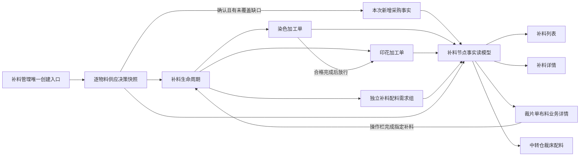
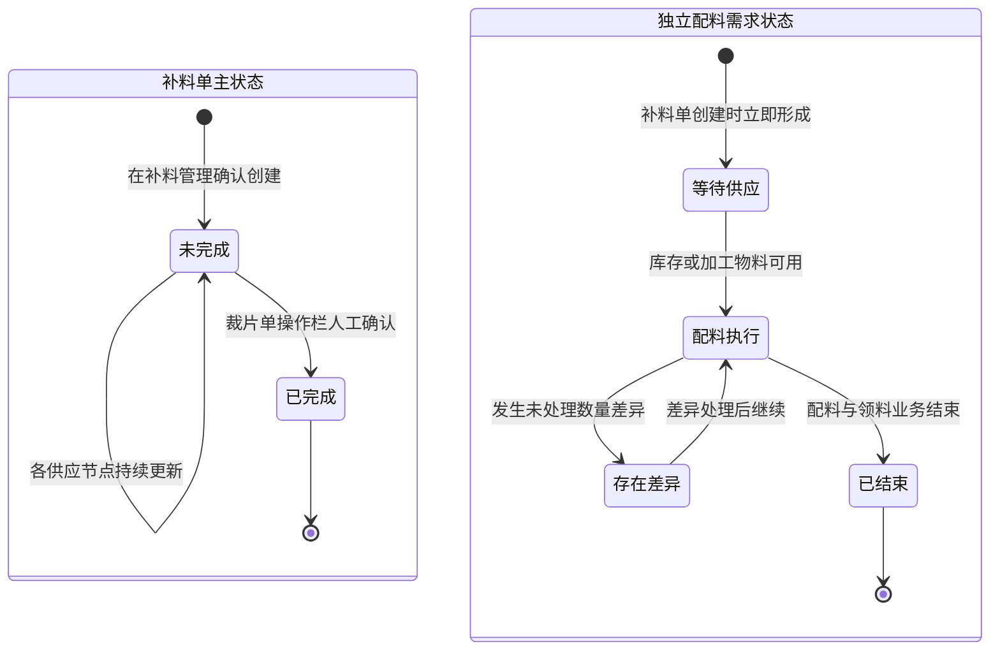
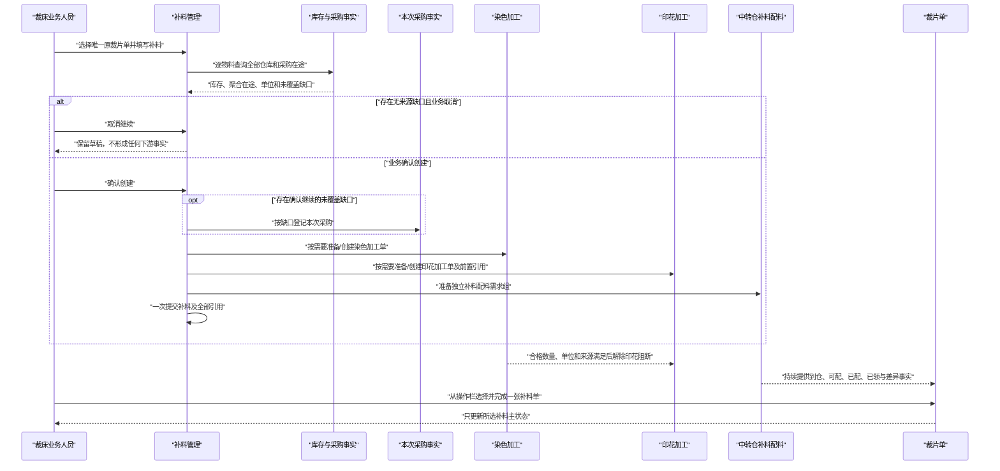

# 补料业务实施计划

> 计划依据：`docs/product-design/补料业务调整方案.md`、本轮已确认业务规则，以及对补料管理、裁片单、印染加工单、中转仓裁床配料、库存、采购在途、仓内流转、路由和专项检查代码的逐行核查。
>
> 文档性质：本文件是正式实施依据，不代表调整方案已经实现。当前仓库是高保真原型，实施继续使用 Vanilla TypeScript、共享 Mock 事实和必要交互，不建设真实后端、数据库或采购接口。
>
> 文档关系：`补料业务调整方案.md`是唯一业务口径；本计划负责把每项业务要求落实到文件、符号、实施顺序和验证证据。已删除的两份旧补料文档不得恢复、引用或继续维护。

## 一、实施目标与完成标准

### 1.1 总目标

在不改变裁片、生产、采购、印染和仓库原有主业务状态的前提下，完成以下补料闭环：

1. 补料管理是唯一正式创建入口；其他页面只能带来源条件进入该页面，裁片单只查看布料业务详情和完成指定补料单。
2. 创建前按物料检查所有相关仓库库存与采购在途，分别保留数量、单位、状态和时间事实。
3. 各仓无可用库存且没有采购在途覆盖时，明确提示“不建议创建补料单”；业务取消则什么都不形成，业务确认则为未覆盖缺口形成采购单。
4. 已有采购在途只作为供应判断事实，不绑定具体采购单、不展示采购单号、不重复采购。
5. 整个补料链路不创建调拨单，也不把仓库调拨建议当作补料供应结果。
6. 需要染色就创建染色加工单，需要印花就创建印花加工单；两者都需要时同时形成两张单，但印花在染色合格完成前不可开始。
7. 补料单创建成功后，中转仓裁床配料立即新增一条独立补料需求；一张补料单对应一个需求组，多种物料作为组内明细，不与正常需求或其他补料单合并。
8. 补料列表展示节点总览；补料详情和裁片单布料业务详情展示逐物料节点事实，不展示流程、时间线或整体预计可配料时间。
9. “完成补料”只从裁片单列表操作栏进入；一次只完成被选择的一张补料单，不改变裁片单、生产单或其他补料单状态。
10. 列表、详情、仓库和 PDA 读取同一份补料生命周期、节点与数量事实，真实图片、单位、防错、追溯和历史均闭环。

### 1.2 完成标准

只有同时满足以下条件，才可把本任务标记为 `verified`：

- 调整方案第 1～29 节和第 27.1～27.12 验收场景均能在本文覆盖矩阵中找到明确实现步骤和验证证据。
- 全仓只有 `/fcs/craft/cutting/supplement-management` 承担补料创建；裁片单和其他页面不存在直接创建动作。
- 有库存、已有采购在途、无库存无在途后取消、无库存无在途后继续四种供应决策均有专项契约。
- 染色、印花、染色后印花三种加工组合均有生成、状态投影和执行阻断契约。
- 每张补料单创建后立即形成且只形成一个中转仓补料需求组，多物料不拆组，多补料单不合并。
- 补料列表、补料详情、裁片单布料业务详情、中转仓配料列表在同一数据状态下展示一致的数量与节点状态。
- 旧的 `requiredCompleteAt`、`expectedAvailableAt`、`supplyPaths` 及“预计可配料时间”不再出现在补料事实、页面、Mock 和检查中。
- 补料详情没有完成按钮；裁片单操作栏可完成一张指定补料单，并阻断重复完成和未处理数量差异。
- 不形成任何 `INTERNAL_TRANSFER` 单据，补料确认前后仓内调拨单数量保持不变。
- 款式和物料图片均为对象明确绑定的真实资源，支持缩略图、大图、关闭和加载失败态。
- 最后一次实质修改后，核心逻辑测试、命名专项检查、命名页面验收、构建、治理检查、CodeGraph 同步和可隔离任务收据全部重新执行。

## 二、实施基线与当前代码事实

### 2.1 分支、工作树和验收基线

本轮核查基线为：

- 分支：`codex/supplement-upstream-supply-path`；
- Git HEAD：`754bc2e24ea3c32b6d470fa45d951b1f12204770`；
- CodeGraph：索引健康，1340 个文件、41894 个节点、149340 条关系；
- 当前工作树包含用户已有的补料统一事实源、裁床配料和治理改动，正式实施不得覆盖、搬移或吸收无关差异。

正式实施开始前必须重新记录分支、HEAD、工作树和运行端口。若当前工作树仍有无法隔离的无关修改，应新建独立 worktree 承接本计划，不得在脏工作树生成全量任务收据。

### 2.2 已具备能力与可保留部分

| 范围 | 当前代码事实 | 保留方式 |
| --- | --- | --- |
| 唯一创建页面 | `supplement-management.ts` 已承载来源选择、填写、确认、保存和列表 | 保留正式路由与页面骨架，补齐供应判断和节点展示 |
| 来源唯一性 | 创建页已限制一次选择一个生产单或裁片单，并验证唯一原裁片单、冻结技术包和 BOM | 保留并扩展为供应决策前置校验 |
| 生命周期 | `supplement-order-registry.ts` 已统一 `未完成/已完成`、次数、幂等和深拷贝边界 | 继续作为补料主事实源，扩展节点引用和决策快照 |
| 加工单生成 | `process-work-order-generation-*` 已按 DYE、PRINT 生成并具有批量提交/回滚和来源幂等键 | 保留批事务，增加加工依赖和节点引用 |
| 裁片单完成入口 | `cut-orders.ts` 操作栏已在有未完成补料时显示“完成补料”，支持多单单选 | 保留入口，删除详情内完成动作并增加差异校验 |
| 裁床配料共享事实 | `pickup-management-runtime.ts` 已读取活跃补料单并投影到配料域 | 不另建第二套补料记录，修正需求分组和数量层次 |
| 标准列表 | 补料管理已采用标准列表壳、分页与列偏好能力 | 扩展节点列、筛选和关键列约束 |
| 路由 | 正式路由为 `/fcs/craft/cutting/supplement-management`；裁后放行只导航到该路由并带预填参数 | 保留预填导航，但所有最终确认仍在补料管理 |

### 2.3 必须修正的现状差距

| 差距 | 当前位置 | 目标处理 |
| --- | --- | --- |
| 创建前看不到全部库存和采购在途 | `SupplementDraft`、创建页和确认弹窗没有供应事实 | 增加逐物料供应检查、决策矩阵与风险二次确认 |
| 库存来源不完整 | `fabric-demand-board.ts` 有中转仓、总仓面料、染色/印花待加工仓，但没有总仓辅料仓；`production-object-overview.ts` 仅生成“原料仓”汇总 | 建补料专用库存读模型，明确列出所有实际相关仓，不使用调拨建议 |
| 没有本次采购承接事实 | 当前只有采购在途展示快照，没有采购登记域 | 增加最小补料采购事实登记，只承接业务确认后的未覆盖缺口 |
| 已有采购在途带具体采购单号 | `MaterialPurchaseTransit` 包含采购单号 | 补料只保存/展示聚合快照，主动剥离具体采购单身份和链接 |
| 加工先后关系未建模 | 生成器按 DYE、PRINT 顺序建单，但两张单独立，印花初始即可执行 | 给印花加工单增加染色前置关系，统一拦截 Web、PDA 和直接写回 |
| 补料配料批准数量被压成 0 | `resolvePickupRequiredQty()` 在加工未完成时返回 0 | 分离批准需求数量、加工可供数量和当前可配数量 |
| 补料需求按生产单合并 | `pickup-management-projection.ts` 以生产单构建组 | 正常需求按原逻辑，补料按补料单构建独立需求组 |
| 只染色/染后印花路由不完整 | `PickupProcessRoute` 只有 `NONE/DYE/DYE_PRINT`，印花必然被归为 DYE_PRINT | 增加 `PRINT`，四种组合独立推导 |
| 详情仍是基本信息和加工单表 | `renderSupplementDetailDialog()` 没有逐物料节点表 | 改为六列节点事实表，不展示流程和整体预计时间 |
| 裁片单详情仍可完成 | `renderSupplementDetail()` 存在“完成该补料单”；事件有 `request-complete-supplement` | 删除按钮和事件，只保留操作栏入口 |
| 完成没有差异准入 | `completeSupplementOrder()` 只判断存在和重复 | 增加未处理数量差异检查，但不以节点未完成自动阻断 |
| 旧预计时间仍在事实源 | 生命周期和 fixture 仍保存 `requiredCompleteAt/expectedAvailableAt/supplyPaths` | 删除类型、注册默认值、Mock、页面和测试断言 |
| 图片为规则生成的通用图 | `getSpuImageUrl()`、`getMaterialImageUrl()` 按文本选通用资源 | 改为对象数据显式绑定真实图，并增加大图和失败态 |
| 采购创建失败曾被误解为业务分支 | 当前无采购创建流程 | 新实现不得增加“采购单创建失败”状态、按钮、重试或半成品节点 |

## 三、范围、非范围与需求编号

### 3.1 实施需求

| 编号 | 实施要求 |
| --- | --- |
| R-01 | 补料管理为唯一正式创建入口，其他页面只能导航和预填 |
| R-02 | 裁片单只查看布料业务详情、关联补料和操作栏完成补料 |
| R-03 | 一次补料必须绑定唯一原裁片单、生产单、冻结技术包和唯一 BOM 物料 |
| R-04 | 原因/说明必填，补料成衣数量为有效正整数，物料需求按冻结单耗和损耗形成 |
| R-05 | 按物料检查中转仓、总仓面料仓、总仓辅料仓、染色待加工仓、印花待加工仓和其他实际相关仓 |
| R-06 | 库存展示总量、可用、占用/不可用、库区/库位、状态、更新时间和单位 |
| R-07 | 采购在途按物料和同单位汇总，保留数量、状态和已有预计到货时间 |
| R-08 | 已有采购在途不关联具体采购单、不展示单号或跳转、不重复采购 |
| R-09 | 无库存且无在途时提示不建议创建，决定权在业务；取消则不形成任何单据和需求 |
| R-10 | 业务确认继续后，为未覆盖缺口形成本次采购单；不设计采购创建失败业务分支 |
| R-11 | 新增采购量等于物料需求减可用库存覆盖减已有在途覆盖，结果不大于零不采购 |
| R-12 | 单位不一致不比较、不汇总、不参与缺口扣减，并明确提示核对 |
| R-13 | 补料业务永不创建调拨单，也不调用仓内调拨生成能力 |
| R-14 | 需要染色创建染色加工单，需要印花创建印花加工单，不需要的节点显示“不需要” |
| R-15 | 同时需要染色和印花时两单均形成，印花在染色合格完成前显示等待且不可开始 |
| R-16 | 补料创建成功后立即形成一个独立中转仓补料配料需求组 |
| R-17 | 一单多物料保留一个需求组、多条物料明细；多张补料单分别形成需求组 |
| R-18 | 批准需求、加工可供、已到仓、当前可配、已配、已领、剩余数量独立保存和展示 |
| R-19 | 补料列表支持方案规定的筛选、节点总览、分页、列设置、排序、顺序和冻结 |
| R-20 | 补料详情为逐物料六列节点事实表，不展示流程、时间线、下一步说明和整体预计可配料时间 |
| R-21 | 节点存在多张业务单时展示数量/张数汇总并可展开全部明细，汇总与明细一致 |
| R-22 | 裁片单列表分别展示每张补料单、次数、状态、未完成数量和详情入口 |
| R-23 | 裁片单布料业务详情展示原配料/领料及各补料单的库存、采购、染色、印花和配料事实，只读 |
| R-24 | “完成补料”只在裁片单操作栏出现；多张未完成时单选，确认前展示当前节点 |
| R-25 | 完成只改变目标补料单；不改变裁片单、生产单和其他补料单，不自动增加裁片数量 |
| R-26 | 补料主状态只有未完成/已完成；各供应节点状态不得写入主状态 |
| R-27 | 存在未处理数量差异时阻断完成；节点尚未完成但无差异时仍由业务决定是否完成 |
| R-28 | 重复创建按确认键返回原结果，不重复生成采购、加工单和配料需求；重复完成明确提示 |
| R-29 | 全链保存方案要求的来源、次数、原因、物料、数量、人员、时间和关联业务对象追溯 |
| R-30 | 款式和每种物料使用真实对应图片，缩略图同对象展示，可看高清大图并有失败态 |
| R-31 | 所有数量带单位，成衣与物料数量、各节点计划/完成/可用数量不得互相替代 |
| R-32 | 只展示节点自身已有时间；未维护显示“未记录”，不推算整体预计时间 |
| R-33 | 页面显示中文业务状态，不显示技术状态码；节点事实缺失显示“未形成” |
| R-34 | Web、仓库和 PDA 读取同一补料需求事实，PDA 不增加创建/完成入口且不得回归 |
| R-35 | 补料完成不新增审批，不自动改变裁片/生产状态，不重定义复裁、验片、放行、结算 |
| R-36 | 补料主状态与配料需求状态相互独立；补料单被人工完成后，尚未结束的配料需求仍须继续显示和执行 |
| R-37 | 同时染色和印花时，合格染色输出是印花的实际投入；数量、单位和批次来源必须可核对，不得只校验状态先后 |

### 3.2 明确非范围

- 不实现真实 PMS 采购接口、供应商协同、付款、收货或自动重试基础设施。
- 不新增补料审批流，不将风险确认改造成审批。
- 不新增或复用调拨单、仓内流转单、调拨建议或自动调仓。
- 不由系统预测“预计可配料时间”“最早可配时间”或跨节点总交期。
- 不因采购、染色、印花、入仓或配料完成而自动完成补料单。
- 不在裁片单、裁后放行、中转仓或 PDA 页面直接创建/编辑补料。
- 不改变正常裁床配料需求的身份、数量和原有领料流程。
- 不重构全部采购、库存、印染或仓储模块，只补充补料所需的最小共享事实和读模型。
- 不恢复两份已删除的旧补料文档，不以旧测试或旧 Mock 覆盖本次确认规则。

### 3.3 角色、责任与动作边界

| 角色 | 本次可执行动作 | 本次不可执行动作 | 页面/事实来源 |
| --- | --- | --- | --- |
| 裁床办公室人员 | 在补料管理选择对象、填写原因和数量、查看供应情况 | 确认仓库实物、修改采购/加工执行事实 | 补料管理 Web |
| 裁床主管 | 确认创建、决定无来源缺口是否继续、在裁片单完成指定补料 | 代替采购/仓库/加工人员维护节点 | 补料管理、裁片单 Web |
| 采购人员 | 维护本次新增采购的数量、到货、状态和已有预计到货时间 | 修改补料数量、把既有在途绑定到补料单 | 采购事实投影 |
| 仓库人员 | 维护库存、到仓、配料、领料和差异 | 创建补料、修改原因、生成补料调拨单 | 中转仓配料 Web/PDA |
| 染色人员 | 维护染色接单、加工、完成、合格数量和差异 | 修改补料数量、直接启动印花 | 染色加工 Web/PDA |
| 印花人员 | 在前置满足后维护印花接单、加工、完成和差异 | 染色未合格完成时开始印花 | 印花加工 Web/PDA |
| 裁床配料人员 | 查看独立需求、准备物料、记录已配和可领数量 | 修改采购、染色或印花单据 | 中转仓配料 Web/PDA |
| 生产管理人员 | 查看补料节点、异常和责任 | 默认不代替现场创建、配料或完成补料 | 管理端只读视图 |

当前仓库不建设真实鉴权系统；实施应复用现有角色上下文表达动作边界。若原型没有对应角色切换，只验证页面职责和动作归属，不得把 Mock 可见性表述为生产鉴权已经完成。

## 四、目标事实模型与唯一事实源

### 4.1 补料生命周期

继续以 `src/data/fcs/cutting/supplement-order-registry.ts` 为唯一补料生命周期事实源，调整现有 `SupplementOrderLifecycle`：

```ts
interface SupplementOrderLifecycle {
  id: string
  recordNo: string
  confirmationKey: string
  requestFingerprint: string
  productionOrderId: string
  productionOrderNo: string
  cutOrderId: string
  cutOrderNo: string
  sequenceNo: number
  reason: string
  reasonDetail: string
  lines: SupplementGarmentLine[]
  materialDemands: SupplementMaterialDemand[]
  supplyDecisionSnapshots: SupplementMaterialSupplyDecisionSnapshot[]
  processWorkOrderRefs: SupplementProcessWorkOrderRef[]
  createdPurchaseOrderRefs: SupplementCreatedPurchaseOrderRef[]
  materialPrepDemandId: string
  status: '未完成' | '已完成'
  createdBy: string
  createdAt: string
  completedBy: string
  completedAt: string
  draftMeta: SupplementDraftMeta & {
    styleCode: string
    styleName: string
    styleImageUrl: string
  }
}
```

删除 `requiredCompleteAt`、`expectedAvailableAt`、`supplyPaths`。当前差异中已删除的旧 `src/data/fcs/cutting/supplement-records.ts` 保持删除，并通过全仓零引用检查确认没有第二套补料记录回流。列表和详情的“当前节点”由节点读模型计算，不将采购中、染色中或配料中写回补料主状态。

### 4.2 物料需求与图片身份

每个 `SupplementMaterialDemand` 至少增加并固定：

- `materialPatternMappingId/sourceBomItemId`：唯一物料映射；
- `materialSku/materialName/materialRole/materialCategory`；
- `color/specification/patternPart`；
- `requiredQty/unit`；
- `materialImageUrl/materialImageAlt`；
- `dyeRequired/printRequired`；
- `originalCutOrderId/originalCutOrderNo`。

款号、款名和款式图片在补料确认时一并形成来源快照，历史列表/详情不得再通过当前候选反查后回退 `/pants-sample.jpg`。物料图片从 BOM/物料事实显式读取 `materialImageUrl` 并随物料需求保存。不得再按名称猜测并替换通用图。图片缺失保留对象身份并显示“图片未提供”，加载失败显示“图片加载失败”，两者都不能用无关图片兜底。

### 4.3 创建时供应决策快照

新增 `src/data/fcs/cutting/supplement-supply-domain.ts`，负责逐物料读取、规范化、校验和形成不可变的确认快照：

```ts
interface SupplementMaterialSupplyDecisionSnapshot {
  materialDemandId: string
  materialSku: string
  requiredQty: number
  unit: string
  inventoryRows: SupplementWarehouseInventoryFact[]
  availableInventoryCoverageQty: number
  existingTransitSummary: SupplementExistingTransitSummary | null
  existingTransitCoverageQty: number
  uncoveredQty: number
  recommendation: '可继续' | '不建议创建'
  businessDecision: '无需确认' | '取消' | '确认继续'
  newPurchaseRequired: boolean
  checkedAt: string
}
```

库存行必须保存仓库、库区/库位、库存、可用、占用/不可用、状态、更新时间和单位。检查范围以当前实际仓库事实为准，至少覆盖中转仓、总仓面料仓、总仓辅料仓、染色待加工仓、印花待加工仓；其他出现该物料的实际仓也一并展示。

已有采购在途只保存聚合后的 `inTransitQty/arrivedQty/pendingQty/status/estimatedArrivalAt/unit`，不得保存或回传具体采购单号、采购单 ID 或跳转地址。

### 4.4 本次新增采购事实

新增 `src/data/fcs/cutting/supplement-purchase-order-registry.ts`，仅表示“本次补料确认继续后形成的采购单”，不建设完整采购系统：

```ts
interface SupplementCreatedPurchaseOrder {
  purchaseOrderId: string
  purchaseOrderNo: string
  supplementOrderId: string
  materialDemandId: string
  materialSku: string
  createdAt: string
  purchaseQty: number
  arrivedQty: number
  pendingQty: number
  unit: string
  status: '采购中' | '部分到货' | '已到货'
  estimatedArrivalAt?: string
}
```

生命周期保存 `createdPurchaseOrderRefs[]`，节点读模型按物料需求读取一张或多张本次采购单。当前确认可以默认把同一物料缺口形成一张采购单，但数据结构、汇总和详情不得假设永远只有一张；采购业务后续拆成多张时，补料节点仍须完整展示全部单据。

生成数量固定为：

```text
max(物料需求数量 - 同单位可用库存覆盖 - 同单位已有采购在途覆盖, 0)
```

该登记器在原型中是确定性事实登记，不提供“创建失败”状态、失败 Mock、重试按钮或失败节点。确认落单使用一个业务提交边界：取消时补料、采购、加工和配料需求均不形成；确认成功时全部引用完整形成；技术异常不得留下可见半成品，但不被建模为“采购单创建失败”业务场景。

### 4.5 染色与印花依赖

扩展 `ProcessWorkOrderGenerationInput` 和 `ProcessWorkOrderRegistrationInput`，让同一物料的印花单可保存染色前置引用：

```ts
interface ProcessExecutionPrerequisite {
  type: 'DYE_COMPLETED'
  upstreamWorkOrders: Array<{
    workOrderId: string
    workOrderNo: string
    materialSku: string
    expectedInputQty: number
    unit: string
  }>
}
```

生成器仍按 DYE 后 PRINT 发号和登记；当同一输入含两种工艺时，将本批生成/复用的染色单身份写入印花单。印花单可在创建时存在，但节点状态投影为“等待染色完成”。统一新增 `getPrintExecutionBlockReason()` / `assertPrintExecutionPrerequisite()`：只有全部前置染色单达到现有“已完成”业务状态且不存在未处理差异时，才允许印花开始。

放行不仅校验状态，还必须形成实际投入关系：印花开始时读取前置染色的合格完成数量、单位和批次/交接来源，写入印花投入事实；投入单位必须一致，投入数量不得超过合格染色输出。存在多张染色或印花单时按明确引用逐张对应，不得用“同生产单、同物料名称”模糊匹配。

该准入必须覆盖：

- Web 可执行动作计算和确认；
- `process-action-writeback-service.ts` 的统一写回；
- `process-execution-writeback.ts` 的移动执行写回；
- 直接调用 `startColorTest()`、`startPrinting()` 的域函数；
- PDA 任务可执行状态和提示。

只需印花的补料单没有前置引用，按现有印花流程执行；只需染色时不生成印花单。

### 4.6 独立中转仓补料配料需求

新增 `src/data/fcs/cutting/supplement-material-prep-demand-registry.ts`，一张补料单登记一个需求组：

```ts
interface SupplementMaterialPrepDemand {
  demandId: string
  demandNo: string
  supplementOrderId: string
  supplementOrderNo: string
  productionOrderId: string
  cutOrderId: string
  sequenceNo: number
  reason: string
  status: SupplementMaterialPrepStatus
  lines: SupplementMaterialPrepDemandLine[]
  createdAt: string
}

interface SupplementMaterialPrepDemandLine {
  materialDemandId: string
  materialSku: string
  approvedRequiredQty: number
  processAvailableQty: number
  arrivedQty: number
  currentAvailableQty: number
  preparedQty: number
  pickedQty: number
  remainingQty: number
  unit: string
  unresolvedDifferenceQty: number
}
```

`approvedRequiredQty` 在补料单创建时立即形成，不能因加工未完成被改成 0。`processAvailableQty`、`arrivedQty`、`currentAvailableQty` 再由染色/印花、入仓和配料事实推进。

需求状态必须覆盖调整方案的完整业务集合：等待库存准备、采购中、等待染色、染色中、等待印花、印花中、等待到仓、部分到仓、可配料、部分配料、已配料、部分领料、已领料、存在差异、已结束。状态由实际节点事实推导，不得用补料单的“未完成/已完成”替代。

补料主状态与配料需求状态相互独立：业务人员完成补料单后，如果配料需求仍处于等待、配料、领料或差异状态，该需求继续留在相应仓库列表；只有配料需求自身达到“已结束”才进入历史。反过来，配料需求结束也不得自动完成补料单。

### 4.7 节点事实读模型

新增 `src/data/fcs/cutting/supplement-node-facts.ts`，统一为补料列表、补料详情、裁片单和中转仓提供只读投影：

```ts
interface SupplementMaterialNodeFactView {
  material: SupplementMaterialIdentityView
  inventory: SupplementInventoryNodeView
  purchase: SupplementPurchaseNodeView
  dye: SupplementProcessNodeView
  print: SupplementProcessNodeView
  materialPrep: SupplementMaterialPrepNodeView
  hasUnresolvedDifference: boolean
}
```

投影规则：

- 不经过节点：`不需要`；
- 应经过但单据未形成：`待创建`；
- 已形成未开始：`待开始`；
- 同时需染印且染色未完成：印花为`等待染色完成`；
- 事实缺失：`未形成`；时间缺失：`未记录`；
- 多单据：采购、染色、印花均以引用数组读取，先显示单据数与同单位数量合计，展开显示全部单据；
- 不生成默认单号、默认时间、默认数量或内部状态码；
- “当前主要节点”只用于列表概览，不写回生命周期主状态。

### 4.8 事实关系图



### 4.9 主状态与配料状态独立关系



两个状态域只共享补料单身份和节点事实，不互相自动推进。补料主状态完成后，配料需求仍按自身状态继续；配料需求结束后，补料主状态仍等待裁床业务人员明确完成。

### 4.10 创建与完成实施时序



该时序不调用调拨能力。已有采购在途只在 `F` 返回聚合事实，不进入 `P`，也不形成补料到具体既有采购单的引用。

## 五、分阶段实施步骤

> 每一步均按“业务目标 → 文件/符号 → 修改 → 验证证据 → 完成条件”执行。步骤 0～4 是共享事实前置，步骤 5～9 才能接页面；前置未闭环不得用页面临时字段代替。

### 步骤 0：锁定实施基线与需求契约

**业务目标**：确保本计划基于唯一调整方案实施，不被旧文档、旧 fixture 或当前脏工作树中的其他任务覆盖。

**文件/符号**：

- `docs/product-design/补料业务调整方案.md`；
- `docs/product-design/补料业务实施计划.md`；
- 当前 Git 分支、HEAD、路由和运行服务；
- 后续新增的补料专项检查。

**修改**：

1. 正式实施前记录分支、HEAD、服务端口、Web 路由和 PDA 验收入口。
2. 建立 R-01～R-37 与 27.1～27.12 的自动/页面验收清单。
3. 确认两份旧补料文档保持删除，不从 Git 历史恢复旧字段或旧流程。
4. 先冻结当前用户已有补料统一事实源改动的任务边界，避免重复建第二套 registry。

**验证证据**：Git 状态、路由访问 200、CodeGraph 状态、需求覆盖脚本/检查清单。

**完成条件**：实施基线可复现，所有需求编号都有后续步骤，没有未归属需求。

### 步骤 1：收口补料生命周期和旧字段

**业务目标**：让所有页面只读取一张补料单事实，并彻底删除整体预计可配料时间和旧流程路径模型。

**文件/符号**：

- `src/data/fcs/cutting/supplement-order-registry.ts`；
- 保持删除 `src/data/fcs/cutting/supplement-records.ts`；
- `src/data/fcs/cutting/cut-order-supplement-fixture.ts`；
- `src/runtime/fcs/cutting/pickup-management-runtime.ts` 的 `toPickupSupplementRecordFactInputs()`；
- `tests/supplement-order-registry.test.ts`。

**修改**：

1. 从生命周期类型、克隆、注册默认值和 fixture 删除 `SupplementSupplyPath`、`supplyPaths`、`requiredCompleteAt`、`expectedAvailableAt`。
2. 增加供应决策快照、本次采购引用、加工单引用、独立配料需求 ID 和完整物料身份字段。
3. 保留 `未完成/已完成` 两种主状态、按裁片单递增次数、确认键幂等、深拷贝和跨裁片单冲突校验。
4. 旧 fixture 转换为新的节点事实种子；不以空字符串伪装“未记录”。
5. 公开边界只导出一个补料生命周期类型，其他模块通过只读函数访问；删除旧记录模块后全仓不得存在残留导入或同义类型。

**验证证据**：扩展 `tests/supplement-order-registry.test.ts`，验证深拷贝、次数、幂等、旧字段消失、节点引用完整和状态仅两种。

**完成条件**：全仓补料代码不再读写三个旧字段；补料管理、裁片单和配料运行时读取同一生命周期记录。

### 步骤 2：建立库存、采购在途和供应决策

**业务目标**：创建前准确回答“哪里有库存、是否已有在途、还有多少未覆盖缺口、是否需要风险确认”。

**文件/符号**：

- 新增 `src/data/fcs/cutting/supplement-supply-domain.ts`；
- `src/data/wls/fabric-demand-board.ts` 的仓库库存事实；
- `src/data/fcs/production-object-overview.ts` 的 `getMaterialResourceOverview()`、`MaterialInventoryBatch`、`MaterialPurchaseTransit`；
- `src/pages/process-factory/cutting/supplement-management.ts` 的 `SupplementDraft`、`buildMaterialDemands()`、创建步骤和确认弹窗；
- 新增 `scripts/check-cutting-supplement-supply-decision.ts`。

**修改**：

1. 按物料查询所有相关仓库，补足总仓辅料仓事实；库存行保留仓库、位置、总量、可用、占用/不可用、状态、更新时间和单位。
2. 只使用库存和采购事实，不读取 `fabricDemandBoardNextActions`、调拨预警或建议动作。
3. 将已有采购在途按同一物料、同一单位聚合；剥离采购单号、ID 和链接。
4. 单位不一致的库存/在途保留展示但不参与覆盖量，显示“单位不一致，需核对”。
5. 按公式计算 `uncoveredQty`，明确覆盖四种判断：足够库存、足够在途、库存/在途部分覆盖、完全无来源；逐物料生成“可继续/不建议创建”。任一物料存在无来源缺口时，整张补料确认弹窗突出已覆盖数量、未覆盖数量、风险物料和缺口。
6. 业务取消风险确认：保持草稿，不生成补料、采购、加工和配料需求；业务确认继续：写入明确的 `businessDecision`。
7. 普通有库存或已有在途覆盖场景不弹“无来源确认”，但仍展示完整供应事实供业务判断。
8. 调整 `buildMaterialDemands()`：物料需求单位从冻结 BOM/物料事实读取并规范化，不再把非 yard 物料统一写成“件”；单耗或损耗无效时沿用现有冻结 BOM 校验直接阻断，不使用 `0.42`、`1` 等默认值静默生成需求。

**验证证据**：专项脚本覆盖多仓库存、部分覆盖、全部无库存、已有在途、单位不一致、多物料混合决策和已有在途无采购单号；分别验证“总仓有/中转仓无”“染色待加工仓有库存”“印花待加工仓有库存”“多个仓共同覆盖”均不创建调拨单；使用米、码、卷、公斤、条、粒、套等代表性单位验证不被改写成“件”，无效单耗/损耗明确阻断。

**完成条件**：四种核心供应场景都能得到稳定、可解释、无调拨建议的决策快照。

### 步骤 3：登记本次新增采购并保证确认幂等

**业务目标**：只在业务确认无来源缺口后，为缺口形成采购事实，已有在途不重复采购。

**文件/符号**：

- 新增 `src/data/fcs/cutting/supplement-purchase-order-registry.ts`；
- `supplement-management.ts` 的 `confirmSupplementAndGenerateProcessWorkOrders()`；
- `supplement-order-registry.ts` 的确认键/请求指纹；
- `scripts/check-cutting-supplement-supply-decision.ts`；
- `scripts/check-cutting-supplement-process-work-orders.ts`。

**修改**：

1. 为每个 `uncoveredQty > 0` 且业务确认继续的物料登记本次采购事实；本次采购合计数量等于缺口，单位与物料需求一致。当前原型可默认形成一张，模型与读侧必须支持采购业务后续拆成多张。
2. 新采购记录保存补料单和物料需求引用；补料详情展示采购单号、创建时间、采购量、已到、待到、状态和采购业务已有预计到货时间。
3. 已有采购在途场景不调用采购登记器，不保存具体采购引用。
4. 使用补料确认键与物料需求 ID 构造采购幂等键；重复确认返回同一组采购引用，不重新编号。
5. 将采购、加工单、补料记录和独立配料需求纳入同一个确认提交计划，先完成全部校验和身份预留，再一次提交。
6. 不增加“采购单创建失败”业务状态、失败 fixture、失败提示分支或业务重试入口；技术异常只保证没有半套可见结果。

**验证证据**：验证有库存不采购、已有在途不采购、缺口采购量公式、多物料分别采购、取消零落单、重复确认零重复、确认后引用完整。

**完成条件**：新采购只来自业务确认的实际缺口，现有在途与新采购的展示和追溯边界完全分开。

### 步骤 4：建立加工组合和“先染后印”准入

**业务目标**：加工单生成与执行顺序完全符合四种工艺组合。

**文件/符号**：

- `src/data/fcs/process-work-order-generation-key.ts`；
- `src/data/fcs/process-work-order-generation-registry.ts`；
- `src/data/fcs/process-work-order-generation-service.ts`；
- `src/data/fcs/process-work-order-domain.ts`；
- `src/data/fcs/dyeing-task-domain.ts` 的登记和完成状态；
- `src/data/fcs/printing-task-domain.ts` 的登记、`startColorTest()`、`startPrinting()`；
- `src/data/fcs/process-web-status-actions.ts`；
- `src/data/fcs/process-action-writeback-service.ts`；
- `src/data/fcs/process-execution-writeback.ts`；
- `src/data/fcs/process-mobile-task-binding.ts`；
- `src/data/fcs/pda-start-link.ts`；
- `src/data/fcs/mobile-execution-task-index.ts`；
- `scripts/check-cutting-supplement-process-work-orders.ts`。

**修改**：

1. 四种组合固定为：无加工不建单、只染色建 DYE、只印花建 PRINT、染色+印花建 DYE 和 PRINT。
2. 生成批次先解析/预留染色身份，再把其作为印花前置引用；现有来源键继续保证单工艺幂等。
3. 印花单初始业务展示根据前置关系为“等待染色完成”，但单号、创建时间和计划数量立即可查。
4. 将“染色合格完成”明确收口为现有染色单最终 `COMPLETED` 且无未处理差异；仅染色执行结束、待交出、待收货或差异状态均不能放行印花。多张前置染色单必须全部满足。
5. Web 动作列表显示禁用原因；PDA 开工链接和移动任务索引显示“等待染色完成”且不提供可执行开工；Web 确认、统一写回、移动写回和域函数再次校验，避免绕过页面直接开始。
6. 染色完成后不新建第二张印花单，只解除原印花单的执行阻断；印花开始时记录实际采用的染色输出单据、合格数量、单位和批次/交接来源，禁止超出合格输出投入。
7. 修改 `resolveSupplementProcessResult()` 当前“同节点多引用即归属不唯一”的处理：按补料单、物料需求 ID、工艺类型和明确加工单引用读取一张或多张结果；只有引用本身重复、缺失或跨物料冲突时才判异常。
8. 补料节点投影分别读取全部加工单号、创建时间、数量、完成量、工厂、计划/实际完成时间和异常差异，并保证同单位汇总等于展开明细。

**验证证据**：扩展现有加工单专项检查，覆盖四种组合、两单来源一致、严格前置、所有入口阻断、染色完成后放行、合格输出投入数量/单位/来源、多加工单汇总、重复确认复用、加工批事务无半写。

**完成条件**：任何代码路径都不能在前置染色未合格完成时开始印花；只印花场景不受误阻断。

### 步骤 5：形成独立中转仓补料配料需求

**业务目标**：补料单一创建，仓库就看见批准需求；物料未到不等于没有需求。

**文件/符号**：

- 新增 `src/data/fcs/cutting/supplement-material-prep-demand-registry.ts`；
- `src/data/fcs/cutting/pickup-demand-domain.ts` 的 `PickupProcessRoute`、`derivePickupProcessRoute()`、`resolvePickupRequiredQty()`、`buildPickupDemandFacts()`；
- `src/runtime/fcs/cutting/pickup-management-runtime.ts`；
- `src/data/fcs/cutting/production-material-prep.ts`；
- `src/pages/process-factory/cutting/pickup-management-projection.ts` 的 `buildPickupOrderGroups()`；
- `src/pages/process-factory/cutting/pickup-management-list.ts`；
- `scripts/check-material-prep-pickup-management.ts`、`scripts/check-cutting-pickup-three-list.ts`。

**修改**：

1. 补料确认提交时按补料单登记一个需求组；需求 ID 幂等，不因重复渲染或重复确认新增。
2. 一张补料单多物料时保存多条明细；同一裁片单三张补料单产生三个需求组。
3. `PickupProcessRoute` 增加 `PRINT`，保留 `NONE/DYE/DYE_PRINT`，最终可供来源分别为库存/采购、染色结果、印花结果、染后印花结果。
4. 移除“加工未完成则 requiredQty=0”的逻辑，新增 `approvedRequiredQty` 和 `processAvailableQty`；物料未到时列表仍显示完整批准需求和当前可配 0。
5. 补料分组键改为补料单 ID，正常需求继续使用原生产/配料单分组；两类需求不合并。
6. 到仓、可配、已配、已领和剩余按同单位独立计算；剩余不得用“需求-当前可配”冒充，应按批准需求减有效已领/已完成业务量。
7. 加工有差异、入仓有差异或配料有差异时记录结构化未处理差异，供完成准入读取。
8. 物理上尚不可领的物料不进入可领批次，但其需求组仍在管理列表可见；不得为了显示需求伪造库存批次。
9. `buildPickupDemandFacts()` 不再只接收 `listActiveSupplementOrders()`；读取全量补料与独立配料需求状态。补料主状态已完成但配料需求未结束时，继续进入仓库待处理投影；配料需求已结束后进入历史。
10. 配料状态映射覆盖等待库存准备、采购中、等待/进行染色、等待/进行印花、等待/部分到仓、可配、部分/全部配料、部分/全部领料、差异和已结束。

**验证证据**：现有配料专项检查增加即时需求、一单一组、多物料明细、三单三组、批准量不归零、四工艺路由、配料状态全集、补料已完成但配料未结束仍可见、配料结束不自动完成补料、正常需求不回归、PDA 只出现实际可领数量。

**完成条件**：仓库能同时看清“要补多少”和“现在能配多少”，补料单身份从需求到领料全程可追溯。

### 步骤 6：建立统一节点事实读模型

**业务目标**：四个页面不再各自拼接库存、采购、加工和配料状态。

**文件/符号**：

- 新增 `src/data/fcs/cutting/supplement-node-facts.ts`；
- `supplement-supply-domain.ts`；
- `supplement-purchase-order-registry.ts`；
- `process-work-order-domain.ts`；
- `supplement-material-prep-demand-registry.ts`；
- `supplement-order-registry.ts`。

**修改**：

1. 以补料单+物料需求为行键，分别读取库存快照/当前事实、新采购或既有在途、染色、印花和配料需求。
2. 实现节点中文状态映射、缺失表达、节点时间、数量汇总、差异和多单据展开数据。
3. 对多张单据执行“展开明细合计=单元格汇总”的运行时断言；单位不同则分组展示，不跨单位合计。
4. 生成列表层概览：库存仓数与可用量、采购摘要、染色摘要、印花摘要、中转仓摘要、当前主要节点。
5. 提供 `getSupplementCompletionEligibility()`：只对显式未处理差异返回阻断原因；不把节点未开始/进行中自动当成差异。

**验证证据**：新增节点投影单元测试，固定相同输入在补料列表、详情、裁片单和仓库投影中返回相同状态与数量。

**完成条件**：页面层只负责渲染，不再实现独立供应判断或状态推导。

### 步骤 7：调整补料管理创建、列表和详情

**业务目标**：补料管理承担完整创建判断和业务查看，列表一眼看到上游，详情只看节点事实。

**文件/符号**：

- `src/pages/process-factory/cutting/supplement-management.ts`；
- `src/main-handlers/fcs-handlers.ts`；
- `src/router/route-renderers-fcs.ts`；
- `src/router/routes-fcs.ts`；
- `src/pages/process-factory/cutting/cut-piece-release.ts` 的 `go-supplement` 导航；
- `src/components/ui/` 现有标准列表、弹窗和分页能力。

**修改**：

1. 保留唯一创建路由、来源选择、唯一原裁片单和冻结 BOM 校验；其他页面的预填参数最终仍进入本页确认。裁片放行的 `go-supplement` 只允许导航并带入目标快照，不得直接登记补料。
2. 对象选择结果至少展示原裁片单、生产单、款式名称/款号/真实图、物料名称/编码/真实图/颜色/规格、当前裁片数量、缺口依据、已有补料次数、已有未完成补料数量和是否存在未完成补料；当前 `shortageQty`、`existingSupplementQty`、`suggestedSupplementQty` 等差异依据继续作为补料数量判断事实，不被库存供应数量替代。
3. 在物料明细后增加“供应情况”步骤/区块，逐物料显示全部仓库和采购在途，再进入二次确认。
4. 二次确认完整展示补料对象、生产单、原裁片单、原因/说明、颜色/尺码/物料、补料成衣数量、物料需求数量、各仓库存、采购在途，以及本次将形成的采购、染色、印花和独立配料需求；不得只提示“需要印染”。
5. 无来源缺口确认弹窗明确展示已覆盖数量、未覆盖缺口、不建议原因和“取消/确认继续”；普通确认弹窗也展示节点摘要，但不虚构供应时间。
6. 列表筛选补齐：关键词、补料单号、生产单、原裁片单、款式、主状态、是否采购/染色/印花、当前主要节点、创建时间。
7. 列表列调整为：补料单号、补料对象、补料数量、物料需求、库存、采购、染色、印花、中转仓配料、主状态、创建信息、操作。
8. 详情顶部逐项展示补料单号、主状态、第几次补料、原裁片单、生产单、款式名称/款号/真实图、原因/说明、补料数量、创建人/时间以及完成后的完成人/时间；主体严格为“补料物料、库存、采购、染色、印花、中转仓配料”六列事实表。
9. 多单据单元格提供展开/收起；已有采购在途展开仍不显示具体采购单号；本次采购、染色和印花的同单位汇总必须等于全部展开明细。
10. 详情不渲染流程图、时间线、节点连线、下一步说明或完成按钮；全页不出现“预计可配料时间”。
11. 列表保持标准列表模式：分页、表格内横向滚动、补料单号/补料对象/主要节点/状态等防错列不可隐藏、操作列右冻、列显示/顺序/排序/冻结持久化。
12. 将 `nowText()` 等硬编码业务时间改为统一 Mock 时钟/传入时间，页面不得伪造节点时间。
13. 按 3.3 角色边界组织动作：补料管理创建确认归裁床角色，节点执行信息只读；不为采购、仓库、染色、印花人员在本页增加越权修改入口。

**验证证据**：新增/扩展页面静态契约，浏览器在 1366×768 和 1280×720 验收筛选、宽表、详情、展开、风险确认、图片大图和失败态。

**完成条件**：业务只在补料管理完成从选择到供应确认再到落单；列表和详情覆盖全部节点且无旧流程表达。

### 步骤 8：调整裁片单查看与完成入口

**业务目标**：裁片单只承担查看布料业务详情和完成一张指定补料单。

**文件/符号**：

- `src/pages/process-factory/cutting/cut-orders.ts`；
- `src/pages/process-factory/cutting/cut-orders-model.ts`；
- `supplement-node-facts.ts`；
- `supplement-order-registry.ts` 的 `completeSupplementOrder()`；
- `tests/cut-order-supplement-linkage.spec.ts` 中现有详情完成与操作栏完成用例。

**修改**：

1. 列表保留补料标识，按每张补料单分别展示次数、状态、未完成数量和详情入口，不压成一个合并状态。
2. 将详情中的布料/配料区域收口为“布料业务详情”，展示原配料领料及每张补料单的逐物料节点事实。
3. 删除补料详情中的“完成该补料单”按钮、`request-complete-supplement` 事件及任何从详情完成的旁路。
4. 操作栏仅在存在未完成补料时显示“完成补料”；一张未完成直接确认，多张未完成先单选。
5. 确认弹窗展示补料单号、次数、原因、补料数量和当前节点情况，并调用统一完成准入。
6. 有未处理数量差异时阻断并指出物料和节点；无差异时业务可确认，不要求所有节点自动完成。
7. 成功后只更新目标补料单的状态、完成人和完成时间；不刷新/改写裁片单主状态、生产单状态或其他补料单。
8. 所有补料单完成后隐藏操作；历史详情继续可查；重复请求返回明确提示。
9. 全文件不得出现新增补料按钮或创建处理器。
10. 迁移 `tests/cut-order-supplement-linkage.spec.ts` 中所有通过“完成该补料单”从详情完成的旧用例：删除旧旁路期望，保留并加强操作栏单选、焦点返回、局部刷新、滚动保持、分页回退、跨页面共享状态和 200ms 反馈检查。

**验证证据**：页面事件专项覆盖 0/1/多张未完成、单选、差异阻断、完成一张、其他不变、主状态不变、重复完成和详情只读。

**完成条件**：全仓“完成补料”的用户动作只有裁片单操作栏这一条路径。

### 步骤 9：收口中转仓列表与 PDA 事实

**业务目标**：仓库看见独立补料需求和实际进展，PDA 只执行可领事实且不产生第二套数量。

**文件/符号**：

- `src/pages/process-factory/cutting/pickup-management-list.ts`；
- `src/pages/process-factory/cutting/pickup-management-projection.ts`；
- `src/data/fcs/cutting/production-material-prep.ts`；
- `src/runtime/fcs/cutting/pickup-management-runtime.ts`；
- 现有裁床领料 PDA 数据入口与检查脚本。

**修改**：

1. 补料需求组标题显示补料单号、第几次、原裁片单、生产单和原因，组内显示各物料真实图片、编码和数量。
2. 每条物料显示批准需求、已到仓、当前可配、已配、已领、剩余和状态，所有数量带单位。
3. 加工等待显示明确的“等待染色/印花”，但批准需求一直可见。
4. 正常配料与补料配料使用不同来源标识和分组键；筛选可单独查看补料需求。
5. PDA 继续从共享物理可领事实生成任务；需求存在但尚无可领数量时，只在管理端显示等待，不伪造 PDA 可领任务。
6. Web 配料、PDA 领料和补料详情对已到、可配、已配、已领和剩余使用相同口径。
7. 补料主状态已完成但配料需求未结束时，需求仍留在当前仓库列表；配料自身已结束后进入历史。列表不得通过 `listActiveSupplementOrders()` 直接把两种状态绑定。
8. 1024×768 验收主管/仓管主要动作；按项目现有 PDA 小屏尺寸回归扫码、数量和状态，不增加补料创建或完成操作。

**验证证据**：配料三个列表专项、PDA 数据闭环专项、1024×768 与 PDA 实页截图。

**完成条件**：仓库能按补料单追踪需求，PDA 不超领、不提前出现物理任务，Web/PDA 数量一致。

### 步骤 10：真实图片、异常和恢复体验

**业务目标**：对象可识别、错误可理解，且不通过占位图或虚构事实掩盖缺失。

**文件/符号**：

- 补料 fixture、生产/裁片对象图片字段；
- `supplement-management.ts`、`cut-orders.ts`、`pickup-management-list.ts`；
- 复用现有局部图片预览交互模式，不整页重绘。

**修改**：

1. 为验收场景中的每个款式和物料配置明确对应的本地真实图片资源及替代说明。
2. 缩略图与款号/款名、物料编码/物料名位于同一单元格或信息块。
3. 点击局部打开大图弹窗，保持比例，支持关闭按钮、遮罩和 Esc；低分辨率不溢出。
4. 图片加载中、缺失和加载失败分别有可见状态，不显示破图，不自动换无关图片。
5. 风险确认、单位不一致、重复确认、重复完成、未处理差异和节点缺失使用明确中文业务提示。
6. 不增加“采购创建失败”提示；加工单技术事务错误也不得被包装为采购失败。

**验证证据**：逐对象图片清单、浏览器缩略图/大图/失败态截图、键盘 Esc 与遮罩关闭检查。

**完成条件**：所有演示对象满足真实图片硬门禁；缺图对象被明确列为素材阻塞，不能宣称页面完成。

### 步骤 11：删除旧逻辑与防回归约束

**业务目标**：避免旧字段、旧入口、调拨动作和错误数量口径在未来再次被引用。

**文件/符号**：

- 全部受影响 `src/`、`scripts/`、`tests/`；
- `src/data/fcs/warehouse-material-execution.ts` 的 `createIssueOrTransferFromRequest()` 与 `INTERNAL_TRANSFER` 仅作为禁止引用边界；
- `src/data/wls/fabric-demand-board.ts` 的调拨建议仅作为禁止引用边界。

**修改**：

1. 删除所有补料专属旧预计时间、旧供应路径、详情完成事件和加工未完成需求归零逻辑。
2. 全仓断言裁片单无新增补料动作，其他页面只能导航到正式路由。
3. 增加静态契约：补料确认模块不得导入调拨创建函数、调拨单列表或调拨建议。
4. 动态契约记录确认前后 `listWarehouseInternalTransferOrders()` 数量和身份完全不变。
5. 更新旧 fixture 和测试预期，使其服从本次业务事实，不为通过旧检查恢复冲突字段。
6. 保留加工单技术批事务故障测试；明确其验证“无半套加工单”，不将其描述成采购失败业务场景。

**验证证据**：`rg` 禁止项检查、调拨零变化断言、旧字段零引用、路由/动作静态契约。

**完成条件**：旧实现无法通过类型、测试或页面旁路重新进入补料链路。

### 步骤 12：治理记录、命名页面验收与交付闭环

**业务目标**：用当前工作树的直接证据证明每项需求实际完成。

**文件/符号**：

- 新增 `docs/prototype-review-records/<日期>-cutting-supplement-supply-nodes.md`；
- `package.json` 中现有命名检查；
- CodeGraph 和任务收据。

**修改与执行**：

1. 填写完整原型审查记录，逐页记录角色、路由、状态、数量、图片、异常、分辨率和验收结论。
2. 运行补料生命周期测试、供应决策专项、加工单专项、配料三个列表专项、PDA 数据闭环专项。
3. 运行 `npm run check:list-page-governance`、`npm run check:prototype-design-governance` 和 `npm run build`。
4. 启动同一工作树服务，验收补料管理、补料详情、裁片单、布料业务详情、中转仓配料和相关 PDA。
5. 最后一次实质修改后重跑所有受影响检查与页面；旧截图、旧绿灯或其他分支结果无效。
6. 执行一次 CodeGraph sync/status，确认无待同步受影响文件。
7. 在干净/可隔离工作树运行 `npm run workflow:verify -- --output <临时目录>/task-receipt.json --task-boundary "补料供应判断、加工顺序、独立配料需求、列表详情与裁片单完成入口"`。

**验证证据**：测试输出、浏览器截图、治理记录、构建输出、CodeGraph 状态和任务收据。

**完成条件**：R-01～R-37 与 27.1～27.12 全部有当前版本证据，且无未声明例外。

## 六、页面级调整清单

### 6.1 补料管理列表

必须实现：

- 筛选：关键词、补料单号、生产单、原裁片单、款式、主状态、是否采购、是否染色、是否印花、当前主要节点、创建时间；
- 列：补料单号、补料对象、补料数量、物料需求、库存、采购、染色、印花、中转仓配料、补料状态、创建信息、操作；
- 库存概览：有库存仓数和同单位可用量，或“各仓均无库存”；
- 采购概览：不需要、已有采购在途、本次采购中、部分到货、已到货；
- 染色概览：不需要、待开始、进行中、部分完成、已完成、异常；
- 印花概览：不需要、等待染色、待开始、进行中、部分完成、已完成、异常；
- 配料概览：等待到仓、部分到仓、可配料、部分配料、已配料、已领料；
- 主状态只显示未完成/已完成；操作只提供查看详情。

列表不得出现整体预计可配料时间。

### 6.2 新增补料页面

页面顺序固定为：

1. 选择唯一生产单/裁片单来源；
2. 选择颜色、尺码、纸样/部位，填写正整数补料件数；
3. 填写原因与说明；
4. 按冻结 BOM 形成逐物料需求；
5. 展示全部库存与采购在途；
6. 计算未覆盖缺口和采购决策；
7. 展示最终二次确认；
8. 形成补料、必要采购、加工单和独立配料需求。

无来源缺口时，确认文案必须明确“不建议创建”的风险与缺口；取消保持草稿，确认继续才落单。

### 6.3 补料详情

顶部基本信息完整展示，主体每种物料一行，列固定为：

| 列 | 必须展示 |
| --- | --- |
| 补料物料 | 真实图、名称、编码、颜色、规格、角色/类别、需求数量单位、纸样/部位 |
| 库存 | 全部仓库、位置、库存、可用、占用/不可用、状态、更新时间 |
| 采购 | 新采购显示单号/创建时间/采购量/已到/待到/状态/已有预计到货；已有在途不显示具体单号；无需采购显示不需要 |
| 染色 | 单号、创建时间、加工量、完成量、状态、工厂、已有计划时间、实际时间、异常差异 |
| 印花 | 同染色字段；前置未完成显示等待染色完成 |
| 中转仓配料 | 需求号、需求量、已到仓、当前可配、已配、已领、剩余、状态、实际到仓/配料完成时间 |

不展示流程、时间线、节点连线、下一步说明、预计可配料时间和完成按钮。

### 6.4 裁片单列表与布料业务详情

- 每张补料单单独展示标识、次数、状态、未完成数量和详情入口；
- 布料业务详情同时展示原配料领料和每张补料的节点事实；
- 无新增、编辑、采购、加工或调拨动作；
- 操作栏完成动作按 0/1/多张未完成补料规则显示；
- 完成确认只更新所选补料，保留所有历史详情。

### 6.5 中转仓裁床配料

- 一张补料单一个列表需求组，标题可直接识别补料单、次数、原裁片单和生产单；
- 多物料在组内逐行展示；
- 批准需求与当前可配分开；
- 正常需求与补料需求不合并；
- 无可领物料时保留需求组，但不生成虚假可领批次；
- 仓库操作更新的到仓、配料、领料和差异事实回流到补料节点读模型。
- 配料状态完整使用：等待库存准备、采购中、等待染色、染色中、等待印花、印花中、等待到仓、部分到仓、可配料、部分配料、已配料、部分领料、已领料、存在差异、已结束。
- 补料主状态已完成不等于配料需求已结束，两个状态在列表筛选、汇总和历史中分别判断。

### 6.6 节点时间、追溯与打印边界

允许展示的时间仅来自节点自身已形成事实：本次采购创建时间及采购已有预计到货时间、染色/印花创建时间/计划完成时间/实际完成时间、实际到仓时间、实际配料完成时间、补料创建时间和完成时间。未维护时显示“未记录”，不得从上下游时间推算整体到料或可配时间。

从补料单必须能追溯到：生产单、唯一原裁片单、第几次补料、原因/说明、颜色/尺码、每种物料及需求量、创建人/时间、本次新增的一张或多张采购单、全部染色单、全部印花单、独立配料需求、完成人/时间。已有采购在途只保存当时的聚合供应判断快照，不形成具体采购单追溯关系。

本次不新增或修改打印单据、打印模板和打印路由；印花加工属于业务节点，不等于打印输出。验证中应确认现有裁片/仓库打印不因共享事实调整回归，但不创建补料详情打印功能。

## 七、异常、防错、幂等与恢复清单

| 场景 | 实现动作 | 验证重点 |
| --- | --- | --- |
| 未唯一选择原裁片单 | 阻断创建 | 不形成确认键和下游对象 |
| 原因/说明缺失 | 阻断 | 焦点与中文提示清晰 |
| 补料量为小数、0、负数、NaN、无穷 | 阻断 | 成衣件数逐条按正整数校验；按单耗计算出的物料需求可保留业务小数 |
| 物料不能唯一匹配冻结 BOM | 阻断 | 不形成补料和加工单 |
| 库存/在途单位不一致 | 不参与合计，提示核对 | 不错误扣减采购缺口 |
| 各仓无库存且无在途 | 强提示但允许业务决定 | 取消零落单，继续按缺口采购 |
| 已有采购在途 | 仅聚合展示 | 无具体单号、无绑定、无重复采购 |
| 重复确认 | 返回原结果 | 采购、加工和配料需求均不重复 |
| 染色未完成尝试印花 | 统一阻断 | Web、PDA、直接写回均不可绕过 |
| 染色状态完成但投入数量/单位/来源不合法 | 阻断印花开始 | 合格输出、单位、批次/交接来源可追溯且不得超量 |
| 加工物料/来源身份不一致 | 阻断对应加工 | 补料保持未完成 |
| 一单多物料 | 各物料独立节点 | 状态和数量不互相覆盖 |
| 多张未完成补料 | 单选后完成 | 其他补料保持原状态 |
| 存在未处理差异 | 阻断完成 | 明确指出物料和节点 |
| 节点未完成但无差异 | 不自动阻断 | 决定权仍在业务 |
| 重复完成 | 提示无需重复 | 完成人/时间不被重写 |
| 节点事实缺失 | 显示未形成/未记录 | 不造单号、时间、数量 |
| 图片缺失/失败 | 可见缺失/失败态 | 不用占位图冒充 |
| 调拨能力存在于仓库域 | 补料不调用 | 调拨单前后数量、身份不变 |

## 八、Mock 数据矩阵

实施后的固定 Mock 至少包含以下互不冲突的业务对象：

| 场景 | 数据要求 |
| --- | --- |
| 多仓有库存 | 中转仓和总仓面料仓均有同单位库存，展示全部仓；不采购、不调拨 |
| 辅料仓有库存 | 总仓辅料仓存在辅料库存，证明检查范围不是只有面料 |
| 部分库存+部分在途 | 两者共同覆盖需求，不新增采购 |
| 无库存+已有在途 | 只展示聚合在途及已有预计到货，无采购单号 |
| 无库存无在途取消 | 确认弹窗取消后所有 registry 数量不变 |
| 无库存无在途继续 | 按缺口生成本次采购，配料需求立即可见 |
| 只染色 | 染色单存在，印花不需要，配料等待染色 |
| 只印花 | 印花单存在，无染色前置，配料等待印花 |
| 先染后印 | 两单存在，印花等待；染色最终完成后放行 |
| 无加工 | 直接等待库存/采购到仓，不生成加工单 |
| 一单多物料 | 一个需求组、至少两条物料，节点状态不同 |
| 一裁片单三次补料 | 次数 1/2/3、三个需求组、完成一张其他不变 |
| 多业务单据 | 同一节点至少两张单据，汇总与展开明细一致 |
| 已完成补料但配料未结束 | 补料主状态已完成，仓库需求仍在待处理列表，直至配料自身结束 |
| 单位冲突 | 米和码并存但不合计，明确提示 |
| 多业务单位 | 米、码、卷、公斤、条、粒、套保持真实单位，成衣件数与物料数量不混用 |
| 未处理差异 | 至少一个加工或配料差异，完成被阻断 |
| 图片失败 | 一条受控失败 URL 验证失败态；正式完成清单中的真实对象仍须有可用图 |

Mock 时间必须代表节点自身事实，不为了填满页面生成预计时间；未形成的数据保留缺失并按规则展示。

## 九、验证方案与执行顺序

### 9.1 核心逻辑检查

按以下顺序运行，前项失败先修根因：

1. `tests/supplement-order-registry.test.ts`：生命周期、次数、幂等、完成、主状态与配料状态独立、旧模块/旧字段删除。
2. `scripts/check-cutting-supplement-supply-decision.ts`：库存、在途、缺口、采购、不调拨和单位。
3. `npm run check:cutting-supplement-process-work-orders`：加工组合、来源、原子性和先染后印。
4. `npm run check:material-prep-pickup-management`：独立补料需求、批准量/可配量、到仓和领料。
5. `npm run check:cutting-pickup-three-list` 及现有裁床领料重要回归：正常需求、补料需求和 PDA。
6. 更新 `tests/cut-order-supplement-linkage.spec.ts`：删除详情完成旁路用例，保留操作栏完成的可访问性、局部响应、滚动、分页与共享状态验收。
7. 新增页面静态契约：唯一入口、详情只读、禁止预计时间、禁止调拨引用、真实图片交互。

### 9.2 Web 命名页面验收

| 页面 | 路由/入口 | 重点验收 |
| --- | --- | --- |
| 补料管理列表 | `/fcs/craft/cutting/supplement-management` | 筛选、节点列、分页、列设置、横向滚动、真实图片 |
| 新增补料 | 同路由 `mode=create` | 唯一来源、供应检查、风险确认、取消/继续、幂等 |
| 补料详情 | 列表“查看详情” | 六列事实表、多单展开、无流程/预计时间/完成按钮 |
| 裁片单列表 | `/fcs/craft/cutting/cut-orders` | 多补料分别展示、操作栏完成、无新增入口 |
| 布料业务详情 | 裁片单详情 | 原配料+补料节点，只读 |
| 中转仓裁床配料 | `/fcs/craft/cutting/pickup-management` | 一补料一需求组、多物料、批准量和可配量 |
| 染色加工单 | 补料生成单进入现有染色页面 | 来源追溯、数量、状态、完成事实 |
| 印花加工单 | 补料生成单进入现有印花页面 | 等待染色、动作阻断、染色完成后放行 |

管理列表按 1366×768 验收、最低 1280×720；主管/仓管主要路径按 1024×768 验收。页面主体不得横向溢出，宽表只在表格容器滚动。

### 9.3 PDA 回归

- 使用项目实际小屏尺寸验收裁床领料任务；
- 批准需求但无物理可领数量时，不出现可领取数量；
- 有可领批次时，Web/PDA 的物料、单位、可领和已领一致；
- 印花前置染色未完成时，移动写回同样阻断；
- PDA 不新增补料创建、编辑或完成入口。

### 9.4 构建、治理与交付

- `npm run check:list-page-governance`；
- `npm run check:prototype-design-governance`；
- `npm run build`；
- CodeGraph sync/status；
- 可隔离任务收据；
- 最终完整 diff 由主实施人做一次高风险审查，重点核对共享生命周期、数量守恒、Web/PDA 写回、路由和历史兼容。

## 十、调整方案验收场景一对一覆盖

| 调整方案场景 | 实现步骤 | 自动证据 | 页面证据 |
| --- | --- | --- | --- |
| 27.1 唯一创建入口 | 0、7、8、11 | 路由/动作静态契约 | 补料管理可建；裁片单只看和完成 |
| 27.2 有库存 | 2、3、5 | 供应决策、零采购、零调拨、即时需求 | 多仓库存与配料需求 |
| 27.3 无库存但有采购在途 | 2、3、7 | 聚合在途、无采购引用、零重复采购 | 无采购单号的在途单元格 |
| 27.4 无库存无在途后取消 | 2、3 | 所有 registry 前后不变 | 风险弹窗取消 |
| 27.5 无库存无在途后确认 | 2、3、5 | 缺口采购、无失败分支、即时需求 | 采购中和配料需求 |
| 27.6 只需染色 | 4、5、6 | 仅 DYE、PRINT 不存在 | 染色节点和配料等待 |
| 27.7 只需印花 | 4、5、6 | 仅 PRINT、无前置误阻断 | 印花节点和配料等待 |
| 27.8 同时染色印花 | 4、5、6 | 两单、全入口阻断/放行、合格染色输出投入可追溯 | 印花等待染色完成 |
| 27.9 多张补料单 | 1、5、8 | 次数 1/2/3、三需求组、单单完成 | 裁片单分别展示 |
| 27.10 多种物料 | 1、5、6 | 一组多行、节点不串值 | 详情和仓库展开 |
| 27.11 完成补料 | 6、8 | 单选、差异阻断、其他状态不变 | 操作栏完成、详情只读 |
| 27.12 详情节点表 | 6、7 | 节点字段/禁止项静态契约 | 每物料一行、每节点一列 |

## 十一、调整方案章节完整覆盖矩阵

| 调整方案章节 | 本计划承接位置 |
| --- | --- |
| 1 文档信息 | 文首文档性质、依据和关系 |
| 2 调整背景 | 二 |
| 3 产品目标 | 一、3.1 |
| 4 非范围 | 3.2 |
| 5 当前能力与差距 | 二 |
| 6 核心对象 | 四 |
| 7 对象关系 | 4.1～4.8 |
| 8 角色责任 | 3.3、步骤 7/9/12 |
| 9 唯一创建入口 | R-01～R-03、步骤 0/7/8/11 |
| 10 新增补料步骤 | 步骤 2/3/7、6.2 |
| 11 库存检查 | R-05～R-06、4.3、步骤 2 |
| 12 供应与采购 | R-07～R-12、4.3～4.4、步骤 2/3 |
| 13 不创建调拨单 | R-13、步骤 2/11 |
| 14 染色与印花 | R-14～R-15、4.5、步骤 4 |
| 15 中转仓配料需求 | R-16～R-18、4.6、步骤 5/9 |
| 16 补料列表 | R-19、步骤 7、6.1 |
| 17 补料详情 | R-20～R-21、4.7、步骤 6/7、6.3 |
| 18 裁片单页面 | R-22～R-25、步骤 8、6.4 |
| 19 主状态与完成 | R-26～R-28、R-36、4.9、步骤 1/5/6/8 |
| 20 端到端流程 | 4.8、步骤 2～9 |
| 21 创建与完成时序 | 4.10、步骤 2～9 |
| 22 异常防错恢复 | 七 |
| 23 数量与单位 | R-11/12/18/31、4.3/4.6、步骤 2/5/6 |
| 24 时间规则 | R-32、步骤 1/6/7/11 |
| 25 追溯 | R-29、4.1～4.7、步骤 1/3/4/5 |
| 26 页面设备图片 | R-30/33/34、步骤 7/9/10/12 |
| 27 验收场景 | 十 |
| 28 五阶段优先级 | 五中的步骤 1～9按同一依赖顺序执行 |
| 29 最终业务结论 | 一、三及全部完成标准 |

## 十二、实施依赖、风险和控制

| 风险/依赖 | 影响 | 控制措施 |
| --- | --- | --- |
| 当前工作树已有补料改动 | 可能覆盖用户工作或产生重复事实源 | 在原改动上最小扩展；必要时独立 worktree；逐文件审查 diff |
| 采购模块当前只有 Mock 展示 | 无真实 PMS 创建接口 | 只建补料所需最小采购事实，不伪装真实外部采购已完成 |
| 仓库事实来源分散且辅料仓缺失 | 供应判断可能漏仓 | 补料专用读模型显式列仓；fixture 覆盖面料和辅料 |
| 印花执行入口多 | 单点拦截可被 Web/PDA/直接函数绕过 | 域函数最终校验，上层动作计算重复给出可理解提示 |
| 染色“完成”存在多个中间状态 | 过早放行印花 | 只以最终 `COMPLETED` 且无差异为放行条件 |
| 配料域现按生产单分组 | 补料单身份可能丢失 | 补料专属 groupKey，正常需求保持原键 |
| 当前运行时只读取未完成补料单 | 人工完成补料后，尚未结束的配料需求会从仓库消失 | 仓库按独立配料需求状态投影，不按补料主状态过滤；补料完成与配料结束分别测试 |
| 同一物料同节点存在多张单据 | 当前加工投影把多引用视为归属不唯一，可能隐藏合法拆单 | 改为按明确引用数组逐张读取、同单位汇总和展开；仅身份冲突才报异常 |
| 多单位库存/在途 | 缺口计算错误 | 同单位才扣减；不同单位仅展示和提示，不自动换算 |
| 图片资源不真实或不稳定 | 不满足硬门禁 | 实施前建立对象-图片清单；缺素材即记录阻塞，不用占位图 |
| 页面宽度增加 | 管理列表横向溢出 | 标准表格内部滚动、关键列冻结、列偏好和两档分辨率验收 |
| 旧检查与新业务冲突 | 为绿灯恢复错误规则 | 更新旧契约，以本次用户确认和调整方案为最高事实 |

依赖顺序固定为：生命周期收口 → 供应决策 → 新采购 → 加工依赖 → 独立配料需求 → 节点读模型 → 三类页面 → 图片与治理。页面不得绕过未完成的共享事实步骤先写临时 Mock。

## 十三、无待确认业务项与实施停止条件

本轮业务讨论已经确认，实施不再把以下内容列为待确认：

- 唯一创建入口；
- 已有采购在途不关联具体采购单；
- 无库存无在途由业务确认后采购；
- 不存在“采购单创建失败”业务场景；
- 不创建调拨单；
- 同时染色和印花必须先染后印；
- 一张补料单对应一个独立配料需求组；
- 补料详情只看节点事实；
- 不需要预计可配料时间；
- 完成补料只在裁片单操作栏。

只有出现以下新事实时才停止实施并请求业务决定：

1. 现有仓库事实无法识别某一实际仓库归属，且会改变库存覆盖和采购量；
2. 染色业务确认“合格完成”不是现有最终完成状态，而是另一个有明确责任人的放行节点；
3. 采购业务要求改变本次缺口总量公式或新增供应商分配决策；同一节点多张采购单本身已由模型支持，不再作为停止条件；
4. 用户要求将补料完成与裁片数量、裁片单状态或生产单状态联动；
5. 缺少真实款式/物料图片且无法从当前资料补齐。

除上述会实质改变业务结果的情况外，实施按本计划直接推进，不因页面文案或内部命名再次暂停。

## 十四、最终交付物

实施完成后应交付：

1. 补料供应判断、采购缺口、加工依赖、独立配料需求和统一节点事实代码；
2. 调整后的补料管理、补料详情、裁片单布料业务详情/完成入口和中转仓配料页面；
3. 真实款式/物料图片资源与大图/失败态交互；
4. 补料生命周期、供应决策、加工顺序、配料需求、完成规则和零调拨专项检查；
5. 第 27.1～27.12 场景对应的当前页面验收证据；
6. 完整原型审查记录、构建/治理结果、CodeGraph 状态和可隔离任务收据；
7. 一份只包含本任务文件的最终 diff 清单，以及仍存在的真实素材或外部数据限制说明。

达到以上交付物和完成标准后，方可声明补料调整方案已实现并验证；仅文档完成、代码存在、测试通过或页面截图中的任何单项，都不能单独作为完成证明。
