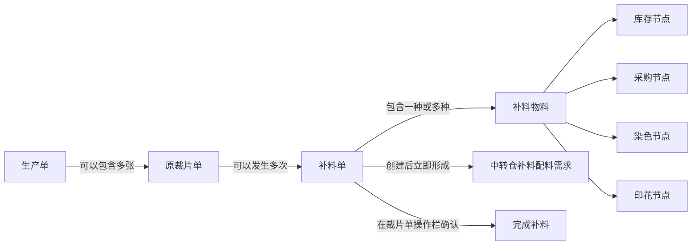
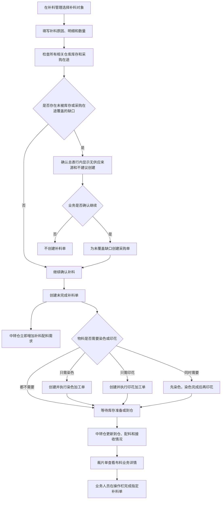
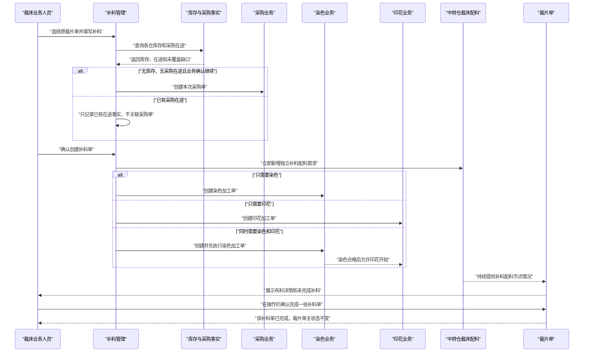

# 补料业务调整方案

## 1. 文档信息

| 项目 | 内容 |
| --- | --- |
| 文档名称 | 补料业务调整方案 |
| 文档日期 | 2026-08-05 |
| 文档状态 | 需求确认后的产品设计方案 |
| 适用范围 | 补料管理、裁片单、物料库存与采购在途、染色加工、印花加工、中转仓裁床配料 |
| 主要使用角色 | 裁床主管、裁床办公室人员、采购人员、仓库人员、染色人员、印花人员、裁床配料人员 |
| 文档目标 | 统一补料单的创建入口、供应判断、加工顺序、节点展示、中转仓配料需求、完成动作及新增补料页面体验 |

本文是本次补料业务调整的最终业务口径。本文中的流程图、状态图和时序图用于说明产品规则，不要求展示在补料详情页面中。

### 1.1 变更记录

| 日期 | 变更内容 |
| --- | --- |
| 2026-08-04 | 形成补料唯一入口、供应判断、采购、染色、印花、中转仓配料、详情节点和完成动作的完整业务方案 |
| 2026-08-05 | 补料列表筛选区压缩为两行；新增补料删除对象选择区重复标题、说明和最外层线框；二次确认弹窗改为页面确认步骤；补料明细、物料需求、供应和后续处理合并为确认总表；取消独立风险提示区和“已知悉风险”按钮 |

## 2. 调整背景

补料单创建以后，业务人员目前能够看到补料基本信息及部分印花、染色加工单，但补料物料的库存、采购、染色、印花和中转仓配料情况尚未形成统一、清晰的业务视图。

同时，补料相关页面职责需要进一步收口：

- 补料单只能在补料管理页面创建。
- 裁片单页面不创建补料单，只查看布料业务详情和已有补料情况。
- 裁片单通过操作栏完成已经存在的补料单。
- 补料单创建后，中转仓裁床配料必须立即出现对应的补料配料需求。
- 补料过程不创建调拨单。
- 同时需要染色和印花时，必须先染色、后印花。
- 补料详情不展示流程，只展示每种物料在各业务节点的实际情况。
- 不展示、也不推算“预计可配料时间”。
- 补料管理筛选区需要压缩到两行，减少对列表首屏空间的占用。
- 新增补料的对象选择区域需要删除重复说明和最外层线框。
- 补料确认内容较长，不再使用弹窗，改为新增补料页面中的独立确认步骤。
- 补料明细、物料需求、供应情况和后续处理合并到一张确认总表中展示。

## 3. 产品目标

本次调整完成后，需要实现以下业务结果：

1. 业务人员只从补料管理页面创建补料单，避免多个创建入口产生不同口径。
2. 创建前能够看见该物料在所有相关仓库中的库存，以及是否存在采购在途。
3. 所有仓库无库存且没有采购在途时，在对应物料行显示“不建议创建”及确认后的采购数量，但最终决定权归业务人员。
4. 业务人员确认继续后，创建补料单，并创建本次缺口对应的采购单。
5. 已有采购在途时，不重复采购，也不把补料单关联到某张已有采购单。
6. 染色、印花加工单按照实际工艺需要创建；同时需要两种加工时严格执行“染色完成后再印花”。
7. 补料单创建成功后，中转仓裁床配料立即增加一条独立的补料配料需求。
8. 补料单列表和补料详情都能够查看库存、采购、染色、印花及中转仓配料等节点情况。
9. 裁片单页面能够查看布料业务详情、已有补料记录，并通过操作栏完成指定补料单。
10. 各页面读取同一份补料事实，避免状态、数量和单据关系不一致。
11. 补料列表筛选条件连同“筛选”“重置”在标准管理端分辨率下固定为两行。
12. 新增补料按照“选择补料对象、填写补料信息、确认创建补料单”三个页面步骤连续办理。
13. 确认创建时使用一张总表完成补料构成、物料需求、供应情况和后续处理的横向核对，不再使用长弹窗或独立风险提示区。

## 4. 不在本次调整范围内的内容

本次不调整以下业务：

- 不新增补料审批流。
- 不改变现有补料创建入口、创建权限和业务确认责任。
- 不在裁片单页面新增或复制补料单。
- 不创建调拨单。
- 不把已有采购在途关联到补料单。
- 不因已有采购在途而重复创建采购单。
- 不设计“采购单创建失败”的业务场景。
- 不在补料详情中展示业务流程图、时间线或状态流转图。
- 不在确认页面设置独立风险提示区域，也不使用“已知悉风险”作为确认按钮文案。
- 不展示或计算“预计可配料时间”。
- 不因补料单创建或完成自动改变裁片单主状态。
- 不因某一张补料单完成而自动完成同一裁片单下的其他补料单。
- 不在本次调整中重新定义补裁、验片、裁片放行和结算规则。

## 5. 当前业务能力与主要差距

### 5.1 当前已经具备的能力

- 补料管理页面已经具备补料单列表、新增补料、二次确认弹窗和补料详情。
- 补料单能够记录生产单、原裁片单、补料原因、补料数量、物料需求、创建人和创建时间。
- 同一原裁片单能够存在多张补料单，并按照创建顺序形成第几次补料。
- 补料单主状态已经区分“未完成”和“已完成”。
- 裁片单能够展示关联补料单，并区分每张补料单的次数和状态。
- 裁片单操作栏已有“完成补料”动作，存在多张未完成补料单时可以选择其中一张完成。
- 需要染色或印花时，能够形成对应加工单并保留补料来源。
- 中转仓裁床配料已经能够识别未完成补料单所产生的物料需求。
- 重复创建、重复完成和补料单身份冲突已有基础防重能力。

### 5.2 当前需要调整的差距

| 业务事项 | 当前情况 | 目标调整 |
| --- | --- | --- |
| 创建入口 | 其他业务页面可能引导进入补料创建过程，页面职责容易被理解为多个入口 | 正式创建统一发生在补料管理页面；其他页面最多只能跳转并带入查看依据 |
| 裁片单职责 | 既能查看补料，又可能被误解为新增补料入口 | 只查看布料业务详情、查看已有补料、通过操作栏完成补料 |
| 库存与采购判断 | 补料确认尚未完整展示所有仓库库存和采购在途 | 创建前按物料汇总所有相关仓库库存与采购在途 |
| 无供应来源 | 尚未形成“行内结论清楚、但由业务决定”的完整表达 | 无库存且无采购在途时在确认总表对应物料行显示“不建议创建”和采购缺口；业务确认后创建补料单和采购单 |
| 已有采购在途 | 采购事实与补料关系容易被误解为具体单据关联 | 只展示在途汇总事实，不关联具体采购单、不重复采购 |
| 染色与印花 | 能分别形成两张加工单，但两者之间尚未形成明确先后约束 | 同时需要时，印花必须等待染色完成 |
| 中转仓配料 | 已有补料需求识别基础，但展示更接近物料明细，补料单与正常需求的边界还不够突出 | 一张补料单形成一条独立补料配料需求，行内查看多种物料 |
| 等待加工时的数量 | 加工未完成时，可配数量可能显示为零，容易让裁床看不到原始补料需求 | 始终展示批准的补料需求数量；可配、已配、已领数量分别展示 |
| 补料详情 | 当前以补料明细和印染加工单为主 | 调整为“每种物料一行、每个业务节点一列”的节点事实表 |
| 整体预计时间 | 现有设计中曾预留整体预计时间概念 | 不展示、不计算预计可配料时间 |
| 调拨 | 其他物料看板存在调拨建议 | 补料只读取库存事实，不复用调拨建议，也不创建调拨单 |
| 列表筛选密度 | 十二个筛选条件和两个操作按钮分成多行，占用较多首屏空间 | 所有筛选条件连同“筛选”“重置”在标准管理端分辨率下固定为两行 |
| 对象选择区域 | 页面标题下再次展示“选择补料对象”及说明，并使用大卡片线框包裹全部内容 | 删除重复标题、重复说明和最外层线框，保留页签、搜索、候选列表、选择结果和下一步 |
| 确认承载方式 | 二次确认使用长弹窗，存在可视区域不足、嵌套滚动和横向核对困难 | 改为新增补料页面中的完整确认步骤，使用页面正常滚动和底部固定操作区 |
| 确认信息组织 | 补料明细、物料需求、供应情况和后续结果分块展示，相同物料信息重复 | 合并为一张确认总表，以物料分组横向展示完整处理结论 |

## 6. 核心业务对象

| 业务对象 | 定义 |
| --- | --- |
| 生产单 | 补料业务所属的生产背景，一张生产单可以对应多张裁片单和多张补料单 |
| 原裁片单 | 本次补料对应的原裁片业务对象，用于确定物料、颜色、尺码、纸样和补料次数 |
| 补料单 | 针对一张原裁片单形成的独立补料记录 |
| 补料物料 | 为完成本次补料需要准备的面料、辅料或其他物料 |
| 库存节点 | 展示该物料在各相关仓库中的库存和可用数量 |
| 采购节点 | 展示本次新增采购或已有采购在途的实际情况 |
| 染色节点 | 展示本次补料相关染色加工单及执行情况 |
| 印花节点 | 展示本次补料相关印花加工单及执行情况 |
| 补料配料需求 | 补料单创建后，在中转仓裁床配料中新增的独立需求记录 |
| 完成补料 | 业务人员在裁片单操作栏对某一张未完成补料单进行结束确认 |

## 7. 业务对象关系



关系约束：

- 一张补料单只能归属于一张原裁片单。
- 一张原裁片单可以有多张补料单。
- 每张补料单独立记录次数、原因、物料、节点情况、创建和完成责任。
- 一张补料单可以包含多种物料。
- 每种物料分别判断库存、采购、染色、印花和中转仓配料情况。
- 一张补料单对应一条独立补料配料需求；多种物料在该需求内分行展示。
- 补料配料需求不得与生产单的正常配料需求合并。

## 8. 角色与责任

| 角色 | 主要责任 | 权限边界 |
| --- | --- | --- |
| 裁床办公室人员 | 在补料管理中选择对象、填写原因和数量、查看供应情况 | 不确认仓库实物，不修改采购和加工执行事实 |
| 裁床主管 | 确认创建补料、决定无供应来源时是否继续、在裁片单完成补料 | 不代替采购、仓库或加工工厂维护业务节点 |
| 采购人员 | 维护本次新增采购单的采购数量、到货和状态 | 不修改补料数量，不把已有采购在途强行绑定到补料单 |
| 仓库人员 | 维护库存、到仓、配料和接收事实 | 不创建补料单，不改变补料原因 |
| 染色人员 | 维护染色加工单的接单、加工、完成和数量事实 | 不启动尚未满足前置条件的印花业务 |
| 印花人员 | 维护印花加工单的接单、加工、完成和数量事实 | 同时需要染色时，染色未完成不得开始印花 |
| 裁床配料人员 | 查看补料配料需求、准备物料、记录已配和可领数量 | 不修改采购、染色和印花单据 |
| 生产管理人员 | 查看补料节点情况、异常和责任 | 默认只读，不代替现场完成补料 |

## 9. 唯一创建入口

### 9.1 页面职责

补料单只有一个正式创建入口：补料管理页面。

补料管理页面承担：

- 查看补料单列表；
- 新增补料单；
- 选择补料对象；
- 填写补料原因和数量；
- 查看各仓库存和采购在途；
- 确认是否继续创建；
- 查看补料详情和各业务节点情况。

### 9.2 其他页面的边界

- 裁片单页面不得直接创建补料单。
- 裁片放行、验片差异或其他页面如需要引导补料，只能跳转到补料管理页面，并带入可供核对的业务依据。
- 跳转和预填不等于创建；仍需在补料管理页面完成选择、核对和确认。
- 所有补料单最终都从补料管理页面形成正式记录。

### 9.3 补料对象选择

补料管理内部可以按生产单或原裁片单搜索业务对象，但正式确认前必须落到唯一原裁片单。

选择对象时至少展示：

- 原裁片单号；
- 所属生产单；
- 款式名称、款号和真实图片；
- 物料名称、编码、真实图片、颜色和规格；
- 当前裁片数量和缺口依据；
- 已有补料次数；
- 是否存在未完成补料。

无法唯一确定原裁片单时，不允许确认创建。

## 10. 新增补料业务步骤

### 10.1 第一步：选择补料对象

业务人员在补料管理中选择生产单或原裁片单，并最终确认本次补料所属的唯一原裁片单。

页面顶部已经展示“新增补料”及页面用途，因此对象选择区域不再重复展示“选择补料对象”标题及操作说明，也不再使用最外层卡片线框包裹全部内容。

对象选择区域直接展示：

- “按生产单选择”和“按裁片单选择”两个页签及各自可选数量；
- 当前页签对应的搜索框、搜索和重置按钮；
- 可选生产单或裁片单列表；
- 当前选中的补料对象；
- 进入下一步的按钮。

删除最外层线框不等于删除表格自身的表头、行分隔线、选中状态和必要边界。候选列表仍需保持清楚的行列关系，并继续展示款式和物料真实图片。

### 10.2 第二步：填写补料内容

每条补料明细至少包括：

- 成衣颜色；
- 成衣尺码；
- 物料名称和编码；
- 物料真实图片；
- 物料颜色、规格和单位；
- 对应纸样或部位；
- 当前缺口；
- 已有未完成补料数量；
- 本次补料数量；
- 补料原因；
- 补料说明。

本次补料数量必须大于零，并使用该物料真实业务单位。成衣补料数量和物料需求数量分别展示，不得混为一个数量。

### 10.3 第三步：确认创建补料单

业务人员提交填写内容后，不打开弹窗，也不打开侧边抽屉，而是在同一个新增补料页面进入“确认创建补料单”步骤。

进入该步骤时，按每种补料物料检查：

- 所有相关仓库库存；
- 各仓可用数量；
- 已有采购在途数量；
- 是否需要染色；
- 是否需要印花；
- 是否已经存在本次补料相关加工事实。

确认步骤使用页面完整宽度和浏览器正常纵向滚动，不设置弹窗内部滚动区域。页面顶部明确当前处于确认步骤，页面底部固定显示“返回修改”和“确认创建补料单”。

### 10.4 确认页面总体结构

确认页面只保留三个主要区域：

1. 补料摘要；
2. 补料确认总表；
3. 底部操作区。

不再分别堆放“补料明细”“系统反算物料需求”“供应情况”“确认后产生的业务结果”等多张独立表格，也不设置独立风险提示区域。

补料摘要采用单行紧凑展示，至少包括：

- 补料对象；
- 所属生产单；
- 原裁片单；
- 补料原因；
- 补料总件数；
- 物料种数。

补料说明较长时可在摘要下方完整展示，但不得挤占总表主要阅读空间。

### 10.5 补料确认总表

确认总表按照“同一种物料为一个分组、面料别名和纸样信息为组内需求明细”的方式组织。不得仅按物料编码粗暴合并不同纸样、不同物料别名或不同需求单位，也不得因合并展示改变任何数量。

总表字段如下：

| 字段 | 展示内容 |
| --- | --- |
| 物料 | 物料真实图片、物料名称、编码、颜色、规格和单位；同一种物料在同一分组只重复展示一次 |
| 本次补料构成 | 面料别名、纸样或部位、涉及的成衣颜色和尺码；颜色尺码较多时先显示汇总数量，并可展开全部明细 |
| 补料件数 | 对应补料构成的本次成衣补料件数 |
| 物料需求 | 系统反算的物料需求数量及真实业务单位 |
| 各仓库存 | 中转仓、总仓面料仓、总仓辅料仓、染色待加工仓、印花待加工仓等相关仓库的总量、可用量和不可用量 |
| 采购情况 | 不需要采购、已有采购在途，或确认创建后新增采购；已有采购在途只展示数量、状态和采购业务已有的预计到货时间，不建立具体采购单关联 |
| 染色 | 不需要，或确认后创建染色加工单；同时需要染色和印花时明确染色先行 |
| 印花 | 不需要、等待染色，或确认后创建印花加工单 |
| 中转仓配料 | 确认后形成补料配料需求；物料未到仓时显示等待库存或等待加工，不提前形成可领任务 |
| 本次处理 | 汇总该物料本次采用库存、等待已有采购在途、需要新增采购、需要染色、需要印花等处理结论 |

总表展示规则：

- 同一种物料的图片、名称和编码合并展示，减少重复阅读。
- 同一种物料对应多个面料别名、纸样、颜色或尺码时，组内逐条保留需求明细。
- 颜色、尺码明细较多时可以折叠，但折叠入口必须显示涉及颜色数、尺码数和补料件数，展开后不得遗漏任何明细。
- 补料件数与物料需求数量必须分别展示，并分别带单位。
- 各仓库存、采购、染色、印花和中转仓配料直接作为总表列，不再拆成页面下方的独立表格。
- 不需要的节点明确显示“无需”，不得留空。
- 同时需要染色和印花时，印花列显示“等待染色完成”，不得表现为两个节点可以同时开始。
- 所有仓库无可用库存且没有采购在途时，在对应物料行的“本次处理”中显示“不建议创建；确认创建后采购 ××”。
- 库存或已有采购在途只能覆盖部分需求时，在对应物料行显示库存覆盖、在途覆盖、未覆盖缺口及“确认创建后采购 ××”。
- 不设置独立风险提示卡片、风险弹窗或“已知悉风险”按钮。
- 不展示或计算预计可配料时间。
- 总表较宽时只允许在表格内部横向滚动，页面主体不得横向溢出；物料和本次处理等关键列保持可识别。

### 10.6 返回修改与最终确认

底部操作区固定展示：

- “返回修改”；
- “确认创建补料单”。

“返回修改”回到填写补料信息步骤，并完整保留已经选择的补料对象、每条补料数量、补料原因和补料说明。不得要求业务人员重新选择对象或重新填写明细。

最终确认按钮统一使用“确认创建补料单”。即使存在无库存且无采购在途的物料，也不改成“已知悉风险”等文案；业务人员根据总表“本次处理”列作出是否继续的决定。

最终确认过程中应立即给予处理中反馈，并防止重复点击形成重复补料单、采购单、加工单或中转仓补料配料需求。

### 10.7 确认创建后形成业务结果

确认成功后同时形成以下结果：

- 一张状态为“未完成”的补料单；
- 同一原裁片单下唯一递增的补料次数；
- 需要新增采购时，对应的采购单；
- 需要染色时，对应的染色加工单；
- 需要印花时，对应的印花加工单；
- 中转仓裁床配料中的一条独立补料配料需求。

### 10.8 页面步骤与返回关系


确认步骤不是新的补料创建入口，也不是补料详情。只有在该步骤执行“确认创建补料单”后，才形成正式补料单和对应业务结果。

## 11. 库存检查规则

### 11.1 检查范围

库存检查必须覆盖所有可能存放该物料的业务仓库，包括但不限于：

- 中转仓；
- 总仓面料仓；
- 总仓辅料仓；
- 染色待加工仓；
- 印花待加工仓；
- 其他实际存放该物料的业务仓库。

### 11.2 展示内容

每个仓库至少展示：

- 仓库名称；
- 库区或库位；
- 当前库存数量；
- 当前可用数量；
- 已占用或不可用数量；
- 物料单位；
- 库存更新时间。

### 11.3 判断原则

- 有库存只表示存在可供业务判断的物料事实，不自动创建调拨单。
- 多个仓库有库存时，全部展示，不只展示其中一个仓库。
- 库存总量和可用量分开，不能把已占用、冻结、待检或不可用数量当成可用库存。
- 库存单位必须与补料物料需求单位一致；单位不一致时不得直接相加。
- 补料业务只读取仓库库存事实，实际备料、领取和到仓仍按现有仓库业务执行。

## 12. 供应判断与采购规则

### 12.1 判断矩阵

| 库存情况 | 采购在途情况 | 确认总表行内结论 | 是否建议创建补料 | 业务确认后的处理 |
| --- | --- | --- | --- | --- |
| 有足够可用库存 | 不限 | 展示各仓库存 | 可以创建 | 创建补料单，不创建采购单、不创建调拨单 |
| 无可用库存 | 有足够采购在途 | 展示“已有采购在途” | 可以创建 | 创建补料单，不关联现有采购单、不重复采购 |
| 无可用库存 | 无采购在途 | 显示“各仓无库存、无采购在途；不建议创建；确认创建后采购 ××” | 不建议，但不阻断 | 业务取消则不创建；业务确认继续则创建补料单和采购单 |
| 库存或在途只能覆盖部分需求 | 仍存在未覆盖缺口 | 显示库存覆盖、在途覆盖、未覆盖数量和“确认创建后采购 ××” | 对未覆盖部分不建议继续 | 业务确认继续后，只为未覆盖缺口创建采购单 |

### 12.2 已有采购在途

“已有采购在途”只作为物料供应事实，不建立补料单与具体采购单的关联关系。

采购节点展示：

- “已有采购在途”；
- 在途数量；
- 已到数量；
- 待到数量；
- 当前状态；
- 采购业务已经维护的预计到货时间。

不得展示或保存：

- 关联采购单号；
- 补料占用某张采购单；
- 补料来源于某张采购单；
- 补料与某张采购单的固定绑定关系。

### 12.3 本次补料新增采购

当所有仓库无可用库存、没有采购在途，并且业务人员确认继续时：

- 创建本次补料所需采购单；
- 采购数量等于本次尚未被库存和已有在途覆盖的物料缺口；
- 补料详情采购节点展示本次采购单的实际情况；
- 不设计采购单创建失败、补料单半完成、重新创建采购单或人工补建采购单等业务分支。

本次采购节点至少展示：

- 采购单号；
- 创建时间；
- 采购数量及单位；
- 已到数量；
- 待到数量；
- 当前状态；
- 采购业务已有的预计到货时间。

## 13. 不创建调拨单

补料业务无论物料位于哪个仓库，都不创建调拨单。

具体规则：

- 总仓有库存、中转仓无库存时，不创建调拨单。
- 染色待加工仓或印花待加工仓有库存时，不创建调拨单。
- 多个仓库共同覆盖补料需求时，不创建调拨单。
- 补料管理只展示物料所在仓库、可用数量和当前状态。
- 后续物料移动按照仓库现有备料、领取、到仓或交接业务处理，不产生补料专属调拨单。
- 其他物料看板中的调拨建议不能作为补料业务动作使用。

## 14. 染色与印花加工规则

### 14.1 不需要染色和印花

- 不创建染色加工单。
- 不创建印花加工单。
- 染色节点和印花节点均显示“不需要”。
- 物料直接进入库存确认和中转仓配料准备。

### 14.2 只需要染色

- 创建染色加工单。
- 不创建印花加工单。
- 染色节点展示实际加工单情况。
- 印花节点显示“不需要”。

### 14.3 只需要印花

- 创建印花加工单。
- 不创建染色加工单。
- 印花节点展示实际加工单情况。
- 染色节点显示“不需要”。

### 14.4 同时需要染色和印花

同时需要两种加工时，顺序固定为先染色、后印花。


业务约束：

- 染色加工单和印花加工单分别保留自己的单号、数量和状态。
- 染色是印花的前置条件。
- 染色未完成时，印花节点显示“等待染色完成”。
- 染色未形成合格结果时，印花不得开始。
- 染色合格物料作为印花的实际投入物料。
- 印花完成后，才满足该物料最终加工完成条件。
- 不能把两张加工单当成互不相关的并行任务。

### 14.5 加工节点展示内容

染色和印花节点分别展示：

- 加工单号；
- 创建时间；
- 加工物料；
- 计划加工数量及单位；
- 已完成数量；
- 当前状态；
- 承接工厂；
- 已有的计划完成时间；
- 实际完成时间；
- 前置等待原因或异常说明。

加工节点自身已经维护的计划时间可以展示，但不得据此计算或展示整体“预计可配料时间”。

## 15. 中转仓补料配料需求

### 15.1 生成规则

只要正式创建补料单，中转仓裁床配料就必须立即出现一条补料配料需求。

该需求：

- 归属于补料单对应的生产单；
- 明确标识来源为“补料需求”；
- 显示补料单号和原裁片单号；
- 显示补料原因；
- 显示补料物料种类和数量；
- 不与生产单原有正常配料需求合并；
- 不等待采购、染色、印花或到仓完成后才出现。

### 15.2 多张补料单

同一生产单存在多张补料单时：

- 每张补料单分别形成独立补料配料需求；
- 各自显示补料单号、创建时间、物料和状态；
- 一张补料单完成不影响其他补料配料需求；
- 不把多张补料单合并成无法追溯的总需求。

### 15.3 多种物料

一张补料单包含多种物料时：

- 补料配料列表按补料单保留一条独立需求；
- 需求行显示物料种类数和总体状态；
- 展开后每种物料分别展示需求数量、加工路线、已到仓数量、已配数量、已领数量和当前状态。

### 15.4 数量口径

每种补料物料必须同时保留以下数量：

- 批准需求数量；
- 当前已到仓数量；
- 当前可配数量；
- 当前已配数量；
- 当前已领数量；
- 当前剩余数量。

采购、染色或印花尚未完成时：

- 批准需求数量仍然照常展示；
- 当前可配数量可以为零；
- 不得因为当前可配数量为零而把补料需求数量显示为零；
- 当前状态显示实际等待节点。

### 15.5 配料需求状态

建议使用以下业务状态：

- 等待库存准备；
- 采购中；
- 等待染色；
- 染色中；
- 等待印花；
- 印花中；
- 等待到仓；
- 部分到仓；
- 可配料；
- 部分配料；
- 已配料；
- 部分接收；
- 已接收；
- 存在差异；
- 已结束。

## 16. 补料管理列表设计

### 16.1 列表目标

业务人员在不进入详情的情况下，应能看见补料单的基本信息和各上游节点总体情况。

### 16.2 筛选条件

至少支持：

- 关键词；
- 补料单号；
- 生产单；
- 原裁片单；
- 款式；
- 补料状态；
- 是否需要采购；
- 是否需要染色；
- 是否需要印花；
- 当前主要节点；
- 创建时间。

筛选区同时保留“补料对象”筛选。全部十二个筛选条件连同“筛选”“重置”两个按钮，在标准管理端分辨率下固定为两行，不得出现第三行操作按钮。

两行顺序如下：

| 行 | 从左到右 |
| --- | --- |
| 第一行 | 补料对象、主状态、采购、染色、印花、当前主要节点、创建日期 |
| 第二行 | 补料单号、生产单、原裁片单、款式、关键词、筛选、重置 |

宽度分配规则：

- 补料对象、主状态、采购、染色、印花等选项较少的下拉框使用紧凑宽度。
- 补料单号、生产单、原裁片单和款式使用中等宽度。
- 当前主要节点和关键词允许适当加宽，以保证常用内容可识别。
- “筛选”“重置”使用正常按钮宽度，不占满整列。
- 字段名称不得因压缩而被截断；输入值较长时可在输入框内滚动，不扩大整列。
- 筛选区整体仍保持清晰的字段名称、输入区域和行间距，不以过度压缩高度牺牲可读性。

两行要求以管理端标准验收分辨率 1366×768 为基准，并在最低 1280×720 下继续保持两行。筛选区不得造成页面主体横向溢出。

### 16.3 列表字段

| 字段 | 展示内容 |
| --- | --- |
| 补料单号 | 补料单唯一编号 |
| 补料对象 | 原裁片单、所属生产单、款式图片和款式信息 |
| 补料数量 | 补料成衣数量及单位 |
| 物料需求 | 物料图片、物料名称、编码、需求数量和物料种类数 |
| 库存情况 | 有库存仓库数量、可用数量或“各仓均无库存” |
| 采购情况 | 不需要、已有采购在途、本次采购中、部分到货或已到货 |
| 染色情况 | 不需要、待开始、进行中、已完成或异常 |
| 印花情况 | 不需要、等待染色、待开始、进行中、已完成或异常 |
| 中转仓配料 | 等待到仓、部分到仓、可配料、部分配料、已配料或已接收 |
| 补料状态 | 未完成或已完成 |
| 创建信息 | 创建人和创建时间 |
| 操作 | 查看详情 |

列表不设置“预计可配料时间”字段。

### 16.4 列表首屏要求

- 页面进入后，筛选区、补料单统计和列表表头应能同时进入首屏主要可视范围。
- 压缩筛选区不得删除任何已确认筛选条件，也不得把低频条件隐藏到默认收起的高级筛选中。
- “筛选”和“重置”与第二行输入框底部对齐，业务人员无需在筛选区内继续向下寻找操作按钮。
- 调整只改变筛选区排列和宽度，不改变筛选口径、筛选结果、分页和列表列设置。

## 17. 补料详情设计

### 17.1 详情定位

补料详情用于查看业务事实，不用于讲解流程。

详情页面不展示：

- 流程图；
- 时间线；
- 节点连线；
- 下一步流程说明；
- 预计可配料时间。

### 17.2 基本信息

详情顶部展示：

- 补料单号；
- 补料状态；
- 第几次补料；
- 原裁片单；
- 所属生产单；
- 款式名称、款号和真实图片；
- 补料原因和说明；
- 补料数量；
- 创建人和创建时间；
- 已完成时的完成人和完成时间。

### 17.3 节点事实表

详情采用“每种物料一行、每个业务节点一列”的形式：

| 补料物料 | 库存情况 | 采购情况 | 染色情况 | 印花情况 | 中转仓配料情况 |
| --- | --- | --- | --- | --- | --- |

### 17.4 补料物料列

展示：

- 物料真实图片；
- 物料名称；
- 物料编码；
- 颜色；
- 规格；
- 物料角色或类别；
- 本次需求数量及单位；
- 对应纸样或部位。

### 17.5 库存情况列

展示所有相关仓库：

- 仓库名称；
- 库区或库位；
- 库存数量；
- 可用数量；
- 占用或不可用数量；
- 当前状态；
- 更新时间。

没有库存时显示“各仓均无库存”。

### 17.6 采购情况列

本次补料新建采购时展示：

- 采购单号；
- 创建时间；
- 采购数量及单位；
- 已到数量；
- 待到数量；
- 当前状态；
- 采购业务已有的预计到货时间。

创建补料前已经存在采购在途时展示：

- 已有采购在途；
- 在途数量；
- 已到数量；
- 待到数量；
- 当前状态；
- 已有的预计到货时间。

该场景不展示具体采购单号，也不提供跳转采购单的关联动作。

不需要采购时显示“不需要”。

### 17.7 染色情况列

展示：

- 染色加工单号；
- 创建时间；
- 加工数量及单位；
- 已完成数量；
- 当前状态；
- 承接工厂；
- 已有的计划完成时间；
- 实际完成时间；
- 异常或差异说明。

不需要染色时显示“不需要”。

### 17.8 印花情况列

展示：

- 印花加工单号；
- 创建时间；
- 加工数量及单位；
- 已完成数量；
- 当前状态；
- 承接工厂；
- 已有的计划完成时间；
- 实际完成时间；
- 异常或差异说明。

同时需要染色和印花、染色尚未完成时，显示“等待染色完成”。

不需要印花时显示“不需要”。

### 17.9 中转仓配料情况列

展示：

- 补料配料需求编号或补料单号；
- 需求数量及单位；
- 已到仓数量；
- 当前可配数量；
- 已配数量；
- 已领数量；
- 剩余数量；
- 当前状态；
- 实际到仓时间；
- 实际配料完成时间。

### 17.10 节点统一表达规则

| 实际情况 | 页面表达 |
| --- | --- |
| 不经过该节点 | 不需要 |
| 需要经过，但业务单据尚未形成 | 待创建 |
| 业务单据已形成但尚未开始 | 待开始 |
| 正在执行 | 进行中，并展示数量进度 |
| 部分完成 | 部分完成，并展示已完成和剩余数量 |
| 已完成 | 已完成，并展示实际完成数量和时间 |
| 同时需要染色和印花，染色未完成 | 等待染色完成 |
| 已有采购在途 | 已有采购在途，不展示具体采购单号 |
| 无库存且无采购在途 | 暂无供应来源 |
| 节点事实缺失 | 未形成，不得用默认单号或虚构时间代替 |

### 17.11 多张业务单据

同一物料在同一节点存在多张业务单据时：

- 单元格先展示单据数量和汇总数量；
- 支持展开查看每张单据的单号、创建时间、数量和状态；
- 不得只展示其中一张而隐藏其他单据；
- 汇总数量必须与展开明细合计一致。

## 18. 裁片单页面设计

### 18.1 页面职责

裁片单页面只承担：

- 查看裁片单对应的布料业务详情；
- 查看关联补料单；
- 查看每张补料单的次数和状态；
- 查看补料物料各节点情况；
- 通过操作栏完成补料。

裁片单页面不承担：

- 新增补料；
- 修改补料物料和数量；
- 创建采购单；
- 创建染色或印花加工单；
- 创建调拨单。

### 18.2 列表展示

裁片单存在补料时，展示：

- “补料”标识；
- 第几次补料；
- 补料单当前状态；
- 未完成补料数量；
- 查看补料详情入口。

多张补料单必须分别展示，不得合并成一个无法选择和追溯的状态。

### 18.3 布料业务详情

布料业务详情至少能够查看：

- 裁片单和生产单；
- 款式、物料和纸样；
- 原有配料和接收情况；
- 已有补料单；
- 每张补料单的物料、数量和原因；
- 库存、采购、染色、印花和中转仓配料节点情况。

详情为查看用途，不提供新增补料按钮。

### 18.4 操作栏“完成补料”

只有当前裁片单存在未完成补料单时，操作栏显示“完成补料”。

操作规则：

1. 只有一张未完成补料单时，直接进入该补料单的完成确认。
2. 有多张未完成补料单时，先选择一张，只能单选。
3. 确认前展示补料单号、第几次补料、补料原因、补料数量和当前节点情况。
4. 业务人员确认后，只完成本次选择的补料单。
5. 不改变裁片单主状态。
6. 不影响同一裁片单下的其他补料单。
7. 所有补料单均已完成后，操作栏不再显示“完成补料”。
8. 已完成补料单仍可查看历史详情。

补料详情本身为只读查看，不再提供“完成该补料单”按钮；完成动作统一从裁片单操作栏进入。

## 19. 补料单状态与节点状态

### 19.1 补料单主状态

补料单只保留两个主状态：

- 未完成；
- 已完成。

“采购中”“染色中”“印花中”“待到仓”“配料中”等都属于节点状态，不作为补料单主状态。

### 19.2 主状态图

```mermaid
stateDiagram-v2
  [*] --> "未完成": "在补料管理确认创建"
  "未完成" --> "未完成": "采购、染色、印花、到仓或配料节点更新"
  "未完成" --> "已完成": "在裁片单操作栏确认完成补料"
  "已完成" --> [*]
```

### 19.3 完成规则

- 完成补料是业务人员的明确确认动作，不由采购、染色、印花或配料状态自动触发。
- 完成前应查看本次补料的物料和各节点实际情况。
- 存在未处理数量差异时，应先处理差异再完成。
- 完成后记录完成人和完成时间。
- 重复完成同一张补料单时，提示“该补料单已完成，无需重复操作”。
- 完成补料不直接增加裁片数量，也不自动改变裁片单、生产单或其他补料单状态。

## 20. 端到端业务流程

以下流程仅用于说明业务规则，不展示在补料详情页面。



## 21. 创建与完成时序



## 22. 异常、防错与恢复

| 场景 | 业务处理 |
| --- | --- |
| 未选择唯一原裁片单 | 阻断确认，要求重新选择 |
| 缺少补料原因或说明 | 阻断确认 |
| 补料数量为零、负数或无效数值 | 阻断确认 |
| 物料无法对应有效技术资料 | 阻断确认，要求先处理物料资料 |
| 仓库库存单位不一致 | 不合计，提示核对单位 |
| 各仓无库存且无采购在途 | 在确认总表对应物料行显示“不建议创建”和采购缺口，但由业务决定是否继续 |
| 业务取消继续 | 不创建补料单和采购单 |
| 业务确认继续 | 创建补料单和采购单，不设计采购创建失败分支 |
| 已有采购在途 | 不关联具体采购单，不重复采购 |
| 同时需要染色和印花 | 染色未完成时阻断印花开始 |
| 加工单身份或物料不一致 | 阻断对应加工继续，补料单保持未完成 |
| 补料单重复确认 | 返回原补料单，不重复生成单据和配料需求 |
| 一张补料单包含多种物料 | 按物料分别展示节点，数量不得互相覆盖 |
| 一张裁片单有多张未完成补料 | 完成时先单选一张 |
| 补料单已完成 | 不允许重复完成，保留历史详情 |
| 节点事实暂时缺失 | 显示“未形成”，不使用虚构单号、时间或状态 |
| 物料图片缺失或加载失败 | 明确显示图片缺失，不能用无关图片代替 |

## 23. 数量与单位规则

### 23.1 数量分层

必须区分：

- 补料成衣数量；
- 物料需求数量；
- 库存数量；
- 可用库存数量；
- 采购数量；
- 在途数量；
- 染色计划和完成数量；
- 印花计划和完成数量；
- 已到仓数量；
- 已配数量；
- 已领数量。

以上数量不得互相替代。

### 23.2 采购缺口

```text
本次新增采购数量
= 补料物料需求数量
- 可用于本次判断的库存数量
- 已有采购在途可覆盖数量
```

结果小于或等于零时，不新增采购。

### 23.3 单位

- 每个数量必须带单位。
- 同一种物料在各节点使用同一业务单位。
- 单位不一致时不得直接比较或汇总。
- 成衣“件”和物料“米、码、卷、公斤、条、粒、套”等不得混用。

## 24. 时间信息规则

### 24.1 不展示整体预计可配料时间

所有页面均不展示、不推算：

- 预计可配料时间；
- 最早可配时间；
- 根据采购、染色、印花自动计算的整体到料时间。

### 24.2 可以展示的节点时间

节点自身已经形成的业务时间可以在对应单元格中展示：

- 采购单创建时间；
- 采购业务已有的预计到货时间；
- 染色加工单创建时间、计划完成时间和实际完成时间；
- 印花加工单创建时间、计划完成时间和实际完成时间；
- 实际到仓时间；
- 实际配料完成时间；
- 补料单创建时间和完成时间。

节点没有维护时间时显示“未记录”，不得自行推算。

## 25. 追溯要求

从补料单必须能够追溯到：

- 所属生产单；
- 唯一原裁片单；
- 第几次补料；
- 补料原因和说明；
- 颜色、尺码、物料和数量；
- 创建人和创建时间；
- 本次新增采购单；
- 染色加工单；
- 印花加工单；
- 中转仓补料配料需求；
- 完成人和完成时间。

已有采购在途仅作为当时的供应判断事实留痕，不形成补料单到具体采购单的追溯关系。

## 26. 页面和设备要求

### 26.1 管理端

- 补料管理和裁片单属于管理端高信息密度列表。
- 列表必须分页，并明确当前页、每页数量和总数。
- 宽表在表格内部横向滚动，不造成整个页面横向溢出。
- 补料单号、补料对象、主要节点、状态和操作为关键字段。
- 支持列显示、排序、顺序和冻结，但不能隐藏关键防错字段。

### 26.2 物料和款式图片

- 每一种物料和每一个款式必须使用真实对应图片。
- 图片与物料名称、编码或款号放在同一信息块。
- 缩略图可查看大图。
- 图片加载失败必须显示明确失败状态。
- 不得用纯色块、图标、首字母或无关图片冒充真实物料图片。

### 26.3 裁床和仓库查看

- 裁床重点看到当前是哪张补料单、缺什么物料、卡在哪个节点。
- 仓库重点看到物料需求、当前已到仓、可配、已配和剩余数量。
- 采购、染色和印花节点使用明确业务状态，不展示内部代码。

## 27. 验收场景

### 27.1 唯一创建入口

- 补料管理页面可以新增补料。
- 裁片单页面没有新增补料按钮。
- 裁片单仅能查看补料和通过操作栏完成补料。
- 其他页面引导补料时，进入补料管理页面后再确认创建。

### 27.2 有库存

- 多个仓库有库存时全部展示。
- 显示各仓库存和可用数量。
- 创建补料单后不创建采购单。
- 不创建调拨单。
- 中转仓立即出现补料配料需求。

### 27.3 无库存但有采购在途

- 显示“已有采购在途”、数量、状态和已有预计到货时间。
- 不展示关联采购单号。
- 不建立补料与具体采购单的绑定关系。
- 不重复创建采购单。
- 创建补料单后立即形成中转仓补料配料需求。

### 27.4 无库存且无采购在途，业务取消

- 在对应物料行显示“各仓无库存、无采购在途；不建议创建；确认创建后采购 ××”。
- 业务人员取消后不创建补料单。
- 不创建采购单。
- 不形成中转仓补料配料需求。

### 27.5 无库存且无采购在途，业务确认

- 不设置独立提示区；对应物料行已经显示“不建议创建”和确认后的采购数量，业务仍可继续。
- 确认后创建补料单。
- 创建本次缺口对应的采购单。
- 不出现采购单创建失败分支。
- 中转仓立即形成补料配料需求，并显示采购中。

### 27.6 只需染色

- 创建染色加工单。
- 印花节点显示“不需要”。
- 中转仓补料配料需求显示等待染色或染色中。
- 染色完成后更新到仓和配料情况。

### 27.7 只需印花

- 创建印花加工单。
- 染色节点显示“不需要”。
- 中转仓补料配料需求显示等待印花或印花中。

### 27.8 同时需要染色和印花

- 分别形成染色和印花加工单。
- 染色先执行。
- 染色未完成时，印花显示“等待染色完成”且不能开始。
- 染色合格完成后才允许印花开始。
- 中转仓最终按照印花完成后的物料更新配料情况。

### 27.9 多张补料单

- 同一原裁片单连续创建三张补料单，次数分别为第 1、2、3 次。
- 中转仓分别出现三条补料配料需求。
- 裁片单分别展示三张补料单。
- 完成其中一张不影响另外两张。

### 27.10 多种物料

- 一张补料单包含多种物料时，中转仓列表保留一条补料配料需求。
- 展开后各物料分别展示库存、采购、染色、印花和配料情况。
- 不同物料的数量、状态和业务单据不得串行或互相覆盖。

### 27.11 完成补料

- 有未完成补料时，裁片单操作栏显示“完成补料”。
- 多张未完成补料时只能单选一张。
- 确认后只完成所选补料单。
- 裁片单主状态保持不变。
- 所有补料单完成后，操作栏不再显示“完成补料”。
- 补料详情只读，不提供完成按钮。

### 27.12 详情节点表

- 每种物料一行。
- 库存、采购、染色、印花和中转仓配料分别占一列。
- 各单元格展示实际单号、时间、数量和状态。
- 不涉及节点显示“不需要”。
- 详情不展示流程图和时间线。
- 详情不展示预计可配料时间。

### 27.13 列表筛选区

- 在 1366×768 和 1280×720 下，十二个筛选条件连同“筛选”“重置”只占两行。
- 第一行和第二行的字段顺序与第 16.2 节一致。
- 不删除、不隐藏任何已确认筛选条件。
- “筛选”“重置”不单独占第三行，也不占满整列。
- 筛选区、统计信息和列表表头能够进入首屏主要可视范围。
- 页面主体不存在因筛选区产生的横向滚动。
- 调整前后使用相同条件筛选时，筛选结果保持一致。

### 27.14 新增补料对象选择

- 页面不再显示对象选择区域内部的“选择补料对象”标题和重复说明。
- 对象选择区域不再显示包裹全部内容的最外层卡片线框。
- “按生产单选择”和“按裁片单选择”页签完整保留。
- 搜索、重置、候选列表、选中状态和“下一步”完整可用。
- 候选列表表头、行分隔线和真实图片展示保持清楚。
- 未选择对象时不能进入下一步；选择后能够进入填写补料信息。

### 27.15 确认创建补料单

- 点击“提交补料”后进入同一新增补料页面的确认步骤，不打开弹窗或侧边抽屉。
- 确认步骤使用页面完整宽度和正常纵向滚动，不出现弹窗内部滚动。
- 页面只展示补料摘要、补料确认总表和底部操作区三个主要区域。
- 补料明细、物料需求、库存、采购、染色、印花和中转仓配料能够在同一总表中横向核对。
- 同一种物料只重复展示一次主要身份信息，不同面料别名、纸样、颜色和尺码明细均可完整查看。
- 无库存且无采购在途时，只在对应物料行显示“不建议创建”和确认后的采购数量，不出现独立提示区或“已知悉风险”按钮。
- 最终按钮统一显示“确认创建补料单”。
- “返回修改”后，补料对象、补料数量、原因和说明全部保留。
- 最终确认只能形成一张补料单及一组对应业务结果，连续点击不得重复创建。
- 页面不展示预计可配料时间。

## 28. 调整优先级

### 第一阶段：统一入口和事实

- 固定补料管理为唯一创建入口。
- 裁片单删除任何新增补料表达，只保留查看和完成。
- 确保补料管理、裁片单和中转仓读取同一张补料单。

### 第二阶段：补齐供应判断

- 接入全部相关仓库库存。
- 接入采购在途汇总事实。
- 落实无库存、无采购在途时的行内处理结论和业务确认。
- 落实确认继续后创建采购单。
- 明确全链路不创建调拨单。

### 第三阶段：补齐加工顺序

- 只染色、只印花分别创建对应加工单。
- 同时需要染色和印花时建立严格前后关系。
- 印花等待染色完成。

### 第四阶段：补齐中转仓配料需求

- 补料单创建后立即新增补料配料需求。
- 正常需求和补料需求分开。
- 多张补料单分别追溯。
- 批准需求数量与当前可配数量分开。

### 第五阶段：完成页面收口

- 补料列表筛选区压缩为两行，并完成 1366×768、1280×720 首屏验收。
- 新增补料对象选择区域删除重复标题、重复说明和最外层线框。
- 二次确认弹窗改为新增补料页面中的确认创建步骤。
- 补料明细、物料需求、供应情况和后续处理合并为一张补料确认总表。
- 确认页面删除独立提示区和“已知悉风险”按钮，处理结论统一放在物料行内。
- 返回修改时保留全部填写内容，最终确认防止重复创建。
- 补料列表增加节点概览。
- 补料详情调整为节点事实表。
- 裁片单详情只查看布料和补料情况。
- 完成补料统一从裁片单操作栏进入。
- 删除预计可配料时间和详情流程表达。

## 29. 最终业务结论

补料单只有一个正式创建入口，即补料管理页面。裁片单页面只负责查看布料业务详情、查看已有补料，以及通过操作栏完成某一张未完成补料单。

创建补料前必须查看全部相关仓库库存和采购在途。所有仓库无库存且没有采购在途时，在确认总表对应物料行显示“不建议创建”和确认后的采购缺口，不设置独立提示区，但决定权仍归业务人员；业务确认继续后，创建补料单和采购单。已有采购在途时，只展示在途供应事实，不关联具体采购单，也不重复采购。

补料业务不创建调拨单。需要染色就创建染色加工单，需要印花就创建印花加工单；同时需要染色和印花时，必须先染色、后印花，印花等待染色合格完成。

补料单创建成功后，中转仓裁床配料必须立即增加一条独立补料配料需求。该需求不与正常配料合并，并持续展示批准需求、到仓、可配、已配、已领和剩余数量。

补料详情只展示各节点实际情况，采用“每种物料一行、每个节点一列”的事实表。库存、采购、染色、印花和中转仓配料分别展示实际单号、创建时间、数量、状态及节点已有时间；不展示流程图、时间线或预计可配料时间。
