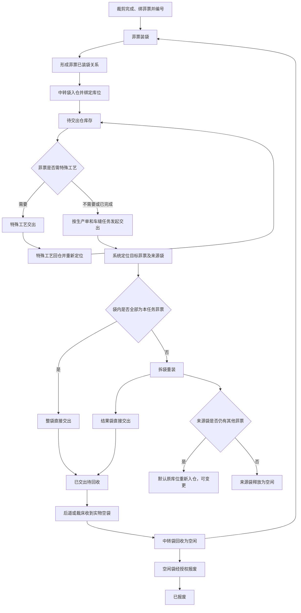
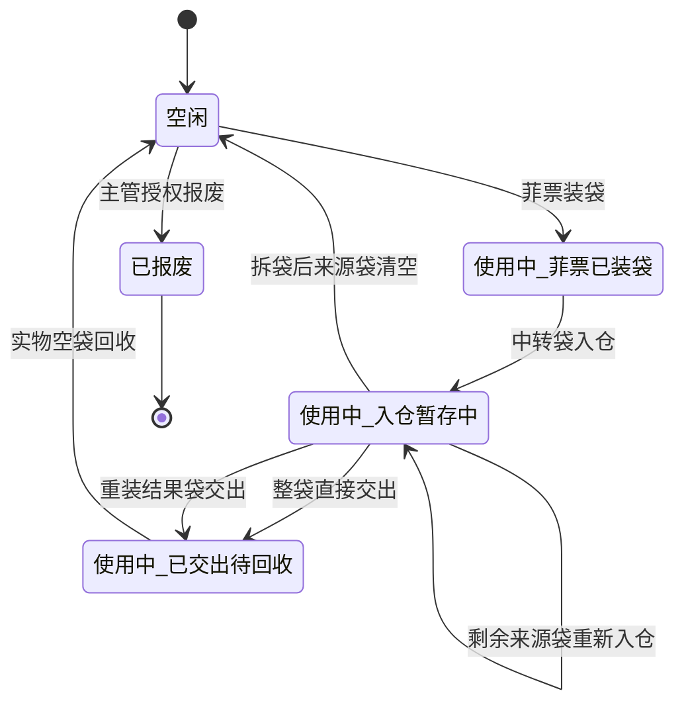
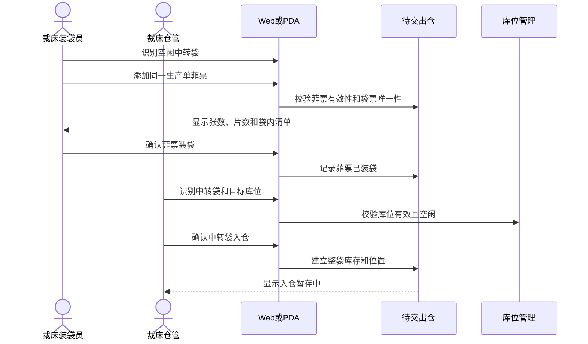
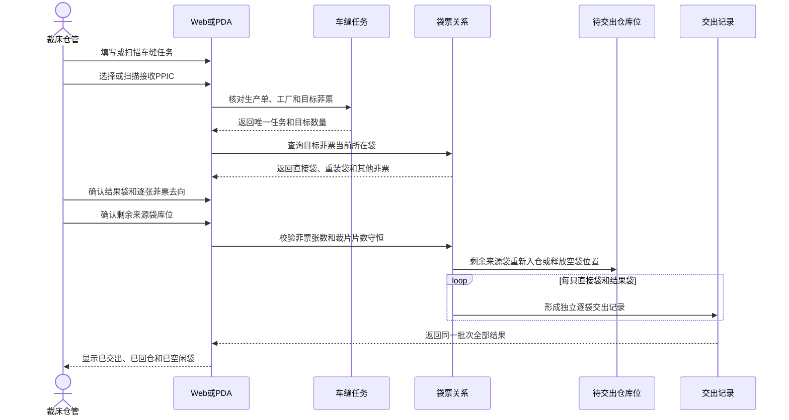
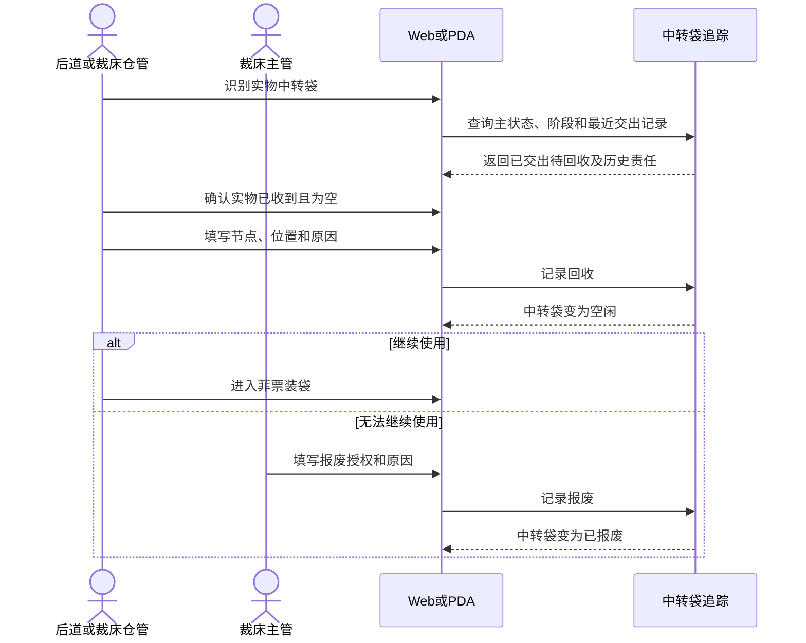

# 裁床待交出仓与中转袋全流程产品需求说明书

## 1. 文档信息

| 项目 | 内容 |
|---|---|
| 文档名称 | 裁床待交出仓与中转袋全流程产品需求说明书 |
| 适用范围 | 裁床待交出仓、Web、PDA、中转袋流转及相关上下游协同 |
| 目标读者 | 产品、研发、测试、实施、裁床仓管、裁床主管、计划与生产管理人员 |
| 文档性质 | 研发、测试与实施共同执行的完整业务需求 |
| 业务单位 | 菲票按“张”，裁片按“片”，中转袋按“只” |

本文所有测试编号和数量仅用于测试环境验证，不代表真实工厂已经发生的业务事实。

## 2. 文档目的

本需求用于统一裁床待交出仓和中转袋的完整业务规则，覆盖从菲票装袋、整袋入仓、按车缝任务交出、拆袋重装、特殊工艺回仓，到实物空袋回收、再次使用和报废的闭环。

本需求同时明确：

- 待交出仓应展示和管理哪些库存、记录、库位与异常。
- Web 与 PDA 分别如何完成现场操作。
- 中转袋主状态、业务阶段及允许动作。
- 中转袋、生产单、车缝任务、菲票、库位、接收工厂和 PPIC 的关系。
- 裁床与车缝工厂、特殊工艺工厂、后道工厂之间的业务边界。
- 研发和测试可以直接使用的完整测试数据与验收场景。

“拆袋重装”不是独立业务入口。它是“中转袋交出”过程中，系统根据目标车缝任务和当前袋内菲票自动判断后进入的处理分支。

## 3. 业务背景

裁床完成铺布、裁剪、绑菲票和编号后，需要将菲票及对应裁片装入中转袋，再将整袋放入待交出仓并绑定具体库位。车缝任务分配完成后，裁床按一个生产单的一个车缝任务，将该任务需要的全部菲票和裁片交给指定车缝工厂的 PPIC。

现场并不保证装袋时的组合与最终车缝任务分配完全一致，因此会出现：

- 一只袋内全部有效菲票均属于本次车缝任务，可整袋直接交出。
- 一只袋内只有部分菲票属于本次车缝任务，其余菲票尚未分配任务。
- 一只袋内同时包含本次任务菲票和其他车缝任务菲票。
- 历史袋票关系中可能存在其他生产单菲票。
- 一次交出同时存在直接交出袋和拆袋重装结果袋。
- 从多只来源袋取出菲票，合并到一只或多只结果袋。
- 结果袋可能复用本次来源袋，也可能使用其他空闲袋。
- 线上显示某只实物空袋尚未回收，现场却已拿到该袋并准备再次使用。
- 来源袋未作为结果袋且仍有菲票时，必须重新入仓并绑定库位。

系统必须帮助现场人员完成正确分流、数量守恒、位置闭环和责任交接，而不是要求现场人员理解复杂状态或自行判断全部规则。

## 4. 产品目标

1. 建立待交出仓从装袋、入仓、交出、回仓、回收至报废的完整闭环。
2. 一次交出只处理一个生产单的一个车缝任务、一个接收车缝工厂和一个接收 PPIC。
3. 根据车缝任务自动定位目标菲票及其当前所在中转袋。
4. 自动区分直接交出和拆袋重装，不把非目标菲票错误标记为交出异常。
5. 支持多来源袋、多结果袋、来源袋复用和直接袋同时交出。
6. 确保任何仍装有菲票的袋要么已交出，要么已入仓并绑定有效库位。
7. 确保菲票张数、裁片片数、袋票关系和交出责任均可追溯。
8. Web 与 PDA 使用同一业务事实和相同校验口径。
9. 中转袋只保留“使用中、空闲、已报废”三个主状态。
10. 为研发、测试和实施提供可重复执行的完整测试数据。

## 5. 非目标与业务边界

### 5.1 不管理车缝工厂内部袋流转

系统只需要记录裁床将哪只中转袋、哪些菲票、多少裁片交给了哪个车缝工厂及其 PPIC。

系统不管理：

- 车缝工厂收到袋后的内部拆袋、换袋和空袋池。
- 多个车缝工厂之间的协作、借袋、调袋或分包。
- 车缝工厂内部把裁片缝制成成衣的装袋过程。
- 车缝工厂交给后道工厂的袋是否为裁床原来交出的同一只袋。

### 5.2 后道收货边界

车缝工厂交给后道工厂的是成衣和中转袋，不是裁床交出的菲票和裁片。车缝工厂交出的中转袋可能是其过去收到的任意中转袋，也可能受外部协作和分包影响。

后道工厂或裁床在实际收到并确认空袋后，可以完成中转袋回收。系统不得通过生产单或原裁床交出记录限制车缝工厂交给后道工厂的具体袋号。

### 5.3 不新增复杂主状态

不增加待清洗、待维修等第四种主状态，也不建立额外异常标签体系。袋无法继续使用时，应完成空袋回收后报废。

## 6. 业务术语

| 术语 | 说明 |
|---|---|
| 菲票 | 绑定一组裁片、部位、颜色、尺码和数量的现场追踪凭证 |
| 中转袋 | 装载菲票及对应裁片、用于工厂间实物流转的可重复使用载体 |
| 待交出仓 | 裁床完成装袋后，暂存待交出菲票和中转袋的仓储节点 |
| 来源袋 | 本次车缝任务目标菲票当前所在的中转袋 |
| 结果袋 | 拆袋重装后用于承载本次车缝任务目标菲票并直接交出的袋 |
| 直接交出袋 | 袋内全部当前有效菲票均属于本次车缝任务，可不拆袋直接交出的袋 |
| 剩余来源袋 | 未作为结果袋，且拆出本任务菲票后仍保留其他菲票的来源袋 |
| 车缝任务 | 一个生产单向一个接收车缝工厂分配裁片的唯一任务 |
| PPIC | 接收车缝工厂中对本次交出负责的计划与生产协调人员 |
| 交出批次 | 一次确认形成的生产单、车缝任务、工厂、PPIC 和全部交出袋集合 |
| 强制回收 | 线上仍显示已交出待回收，但实物空袋已在现场，经核对后先释放为空闲的操作 |

## 7. 角色与职责

| 角色 | 主要职责 |
|---|---|
| 裁床装袋员 | 核对中转袋和菲票，完成菲票装袋 |
| 裁床仓管 | 中转袋入仓、库位确认、任务交出、来源袋回仓、空袋回收 |
| 裁床主管 | 处理强制回收、报废授权、历史袋票关系和无法自动恢复的问题 |
| 车缝任务分配人员 | 为生产单建立接收车缝工厂任务并确定目标菲票 |
| 接收工厂 PPIC | 作为裁床交出的明确接收责任人 |
| 特殊工艺回仓员 | 按来源特殊工艺交出记录完成菲票及带袋回仓 |
| 后道仓管 | 收到成衣和实物袋后，在确认空袋时完成回收 |
| 管理与追溯人员 | 查看库存、交出记录、回仓记录、数量差异和袋流转历史 |

危险操作必须区分执行人与授权人。报废授权人不得由系统默认替代。

## 8. 业务对象与关系

### 8.1 生产单、车缝任务和接收工厂

- 一次交出只允许一个生产单。
- 一次交出只允许该生产单下的一个车缝任务。
- 一个生产单对同一个车缝工厂只允许存在一个有效车缝任务。
- 一个车缝任务只对应一个接收车缝工厂。
- 接收人必须是该接收工厂当前有效的 PPIC。
- 同一生产单可以分别向不同车缝工厂建立不同任务。

### 8.2 中转袋与菲票

- 新装袋时，一只中转袋只允许装一个生产单的菲票。
- 一个生产单的菲票可以分装到多只中转袋。
- 一张菲票在同一时点只能归属一只有效中转袋。
- 一只中转袋可以包含同一生产单下不同车缝任务的菲票。
- 历史袋票关系若存在其他生产单菲票，本次交出不得因此阻断；非本任务菲票按正常重装对象处理。
- 每次装袋、重装、交出、回仓、回收和报废均保留操作前后关系，不覆盖历史。

### 8.3 中转袋与库位

- 袋在待交出仓中必须绑定到唯一有效库位。
- 库位按“仓库、库区、货架、层、位置”管理。
- 一个具体位置同一时点只能放置一只中转袋。
- 中转袋从库位取出交出、清空或移位后，原库位应释放。
- 剩余来源袋重新入仓时，默认回原库位，但操作人可以选择其他有效空闲库位。

### 8.4 交出批次与逐袋记录

- 一次确认形成一个交出批次。
- 一个交出批次只能对应一个生产单、一个车缝任务、一个接收工厂和一个 PPIC。
- 每只直接交出袋和每只结果袋分别形成独立交出记录。
- 所有逐袋记录通过同一交出批次关联。
- 每条逐袋记录保存袋号、菲票快照、张数、片数、生产单、车缝任务、接收工厂、PPIC、交出人和交出时间。

## 9. 上下游数据与责任

| 环节 | 向待交出仓提供的业务事实 | 待交出仓的处理 | 向下游输出 |
|---|---|---|---|
| 裁剪与菲票编号 | 有效菲票、生产单、裁片单、颜色、尺码、部位、裁片片数 | 校验是否可装袋 | 袋内菲票清单 |
| 菲票装袋 | 袋号、所选菲票、装袋人、装袋时间 | 建立袋票关系 | 菲票已装袋 |
| 中转袋入仓 | 袋号、库区、库位、入仓人 | 绑定整袋位置 | 入仓暂存库存 |
| 车缝任务分配 | 生产单、车缝任务、接收工厂、目标菲票 | 定位来源袋并判定直接交出或重装 | 交出批次和逐袋交出记录 |
| 特殊工艺交出 | 来源交出记录、工艺、承接工厂、应回菲票和数量 | 回仓核对、差异记录、库位确认 | 已做特殊工艺的待交出库存 |
| 后道或裁床空袋接收 | 实物袋、实物为空、接收节点和位置 | 回收并释放为空闲 | 可再次装袋或报废的空袋 |

车缝工厂内部流转不是系统上游数据要求，也不是裁床交出完成的前置条件。

## 10. 待交出仓产品结构

### 10.1 Web 六个、PDA 七个操作入口

Web 页面顶部提供以下六个独立操作：

1. 菲票装袋。
2. 中转袋入仓。
3. 中转袋交出。
4. 特殊工艺回仓。
5. 中转袋回收。
6. 中转袋报废。

PDA 仓管“待交出仓”卡片在以上六个操作之外增加“菲票打编号”，共七个独立入口；该入口进入既有 PDA 菲票编号页，不新增编号业务逻辑。

不提供独立“拆袋重装”入口。拆袋重装只能从“中转袋交出”中进入。

### 10.2 六类查看页面

| 页面 | 主要用途 |
|---|---|
| 库存明细 | 查看菲票、裁片、袋码、库位、任务占用、特殊工艺和当前状态 |
| 菲票装袋 | 查看装袋记录、袋内菲票、数量、装袋人和时间 |
| 中转袋入仓 | 查看整袋入仓位置、入仓人、时间及袋内数量 |
| 中转袋交出 | 查看已经完成的逐袋交出记录，不放置待操作任务 |
| 特殊工艺回仓 | 查看来源交出、承接工厂、工艺、应回实回、库位、状态和差异 |
| 库位图 | 查看库区、货架、层、位置及占用袋号 |

### 10.3 库存工作台

库存明细支持按以下条件查询：

- 菲票号、生产单号、裁片单号或中转袋号。
- 库存状态。
- 库区。
- 特殊工艺状态。
- 接收对象。

库存工作台展示：

- 待入仓菲票张数。
- 在库裁片片数和库存记录数。
- 已被车缝任务占用的裁片片数。
- 已装袋待交出的中转袋数量。
- 交出或回仓差异数量。
- 无特殊工艺、未做特殊工艺、已做特殊工艺的库存分布。

每条库存至少展示：

- 菲票、生产单、裁片单。
- 款式、颜色、尺码、部位。
- 当前库存、已占用和可交出片数。
- 中转袋、库区、库位和入仓时间。
- 特殊工艺状态、接收对象和库存状态。
- 查看流水和调整库位操作。

## 11. 总体业务流程

## 12. 功能一：菲票装袋

### 12.1 业务前提

- 菲票已经生成并完成有效编号。
- 菲票未作废。
- 菲票当前未绑定在其他有效中转袋中。
- 所选菲票属于同一生产单。
- 中转袋为空闲，或符合强制回收条件。

### 12.2 Web 操作

- 手工填写或粘贴中转袋编号。
- 通过查询和选择添加一张或多张菲票，也可批量粘贴菲票编号。
- 展示生产单、裁片单、颜色、尺码、部位、菲票张数和裁片片数。
- 填写或确认装袋人。
- 确认后形成袋内菲票快照。

### 12.3 PDA 操作

- 优先扫描中转袋条码或二维码。
- 连续扫描菲票条码或二维码。
- 扫码不可用时支持手工填写袋号和菲票号。
- 每次扫描后立即显示已识别对象和累计张数、片数。

### 12.4 强制回收后装袋

若系统显示中转袋已交出待回收，但现场实物袋已收到且为空，可在装袋过程中选择强制回收。

必须确认：

- 实物袋已收到。
- 实物袋为空。
- 最近一次交出事实可追溯。
- 强制回收原因。
- 操作人和二次确认。

完成强制回收后，袋先变为空闲，再建立新的装袋关系。已报废袋不得强制回收。

### 12.5 结果

- 中转袋主状态为“使用中”。
- 业务阶段为“菲票已装袋”。
- 此动作只建立袋内关系，不绑定库位。
- 下一动作必须为“中转袋入仓”，除非该袋在任务交出重装中作为结果袋直接交出。

## 13. 功能二：中转袋入仓

### 13.1 业务前提

- 中转袋已经完成菲票装袋。
- 袋内菲票关系完整。
- 袋尚未交出或报废。
- 目标库位存在、启用且当前可用。

### 13.2 操作要求

Web：

- 手工填写或选择中转袋、库区和库位。
- 可填写备注并确认入仓人。

PDA：

- 优先扫描中转袋。
- 再扫描库区或具体库位。
- 支持手工填写兜底。

入仓时不要求重新扫描袋内全部菲票，袋内关系沿用装袋时的有效快照。

### 13.3 校验

- 袋必须已完成装袋。
- 库位必须属于待交出仓。
- 库位必须可用且未被其他袋占用。
- 同一袋不得同时占用多个有效库位。
- 重复确认不得产生第二条入仓事实。

### 13.4 结果

- 中转袋仍为“使用中”。
- 业务阶段变为“入仓暂存中”。
- 袋与具体库位绑定。
- 袋内菲票进入待交出仓库存，可被车缝任务定位和占用。

特殊工艺回仓不得从本功能进入，必须使用独立“特殊工艺回仓”入口。

## 14. 功能三：中转袋交出

### 14.1 交出入口与任务识别

Web 支持：

1. 手工填写车缝任务编号。
2. 选择可用车缝任务。
3. 手工填写生产单号，再确定接收车缝工厂。

PDA 支持：

1. 优先扫描车缝任务条码或二维码。
2. 扫码不可用时手工填写车缝任务编号。
3. 识别生产单后选择对应接收车缝工厂。

任务识别后必须展示：

- 生产单。
- 车缝任务。
- 接收车缝工厂。
- 目标菲票张数和裁片片数。
- 可选的该工厂有效 PPIC。

### 14.2 自动定位来源袋

系统按目标菲票当前有效袋票关系，自动找出全部相关中转袋，不要求操作人员再从候选列表逐袋添加。

每只袋展示：

- 袋号和当前库位。
- 本任务菲票张数和片数。
- 其他菲票张数和片数。
- 建议处理方式：直接交出或拆袋重装。

### 14.3 直接交出判断

只有袋内全部当前有效菲票均属于本次车缝任务时，才允许整袋直接交出。

袋内出现下列内容时，进入正常拆袋重装：

- 未分配车缝任务的菲票。
- 属于其他车缝任务的菲票。
- 历史袋票关系中的其他生产单菲票。

这些情况不属于本次交出的业务异常，不要求先补任务分配，也不要求主管审批后才能继续。系统只要求本次任务目标菲票全部进入正确交出袋。

### 14.4 拆袋重装规则

- 结果袋只能装本次车缝任务的目标菲票。
- 本次目标菲票必须全部进入直接交出袋或结果袋。
- 可以从多只来源袋取票并合并到一只结果袋。
- 可以设置多只结果袋。
- 可以使用新的空闲袋。
- 可以复用本次来源袋。
- 来源袋一旦作为结果袋，确认后直接交出，不重新入仓。
- 一个结果袋仍只能装同一生产单的菲票。
- 一张菲票不得进入多个结果袋。
- 结果袋不得为空。

### 14.5 使用线上未回收的实物空袋

结果袋若线上显示“已交出待回收”，只有同时满足以下条件才可使用：

- 实物袋已经在操作人员手中。
- 实物袋确认为空。
- 最近交出事实可查询。
- 填写强制回收原因并完成二次确认。

系统应先完成回收为空闲，再将该袋作为本次结果袋。已报废袋永远不能进入该流程。

### 14.6 剩余来源袋处理

- 未作为结果袋且仍有其他菲票的来源袋必须重新入仓。
- 默认带出拆袋前的原库区和原库位。
- Web 允许手工修改库区和库位。
- PDA 允许重新扫描库位，也支持手工填写。
- 新库位必须有效且可用。
- 来源袋全部菲票被转出后，袋变为空闲，原库位释放。
- 不得出现袋内仍有菲票、未交出、又没有库位的悬空状态。

### 14.7 五步操作

| 步骤 | 名称 | 主要动作 | 完成条件 |
|---|---|---|---|
| 1 | 确定车缝任务 | 识别生产单、车缝任务、工厂和 PPIC | 唯一组合完整 |
| 2 | 核对相关中转袋 | 查看目标菲票、直接袋和重装袋 | 全部目标来源可识别 |
| 3 | 直接交出或重装 | 确认直接袋、结果袋及逐张菲票去向 | 目标菲票全部进入交出袋 |
| 4 | 处理剩余来源袋 | 核对默认原库位或修改库位 | 所有带票来源袋有有效位置 |
| 5 | 汇总确认 | 核对任务、PPIC、袋数、张数和片数 | 数量守恒且全部校验通过 |

### 14.8 一次确认与结果

最终确认前必须展示：

- 来源袋合计。
- 直接交出袋合计。
- 重装结果袋合计。
- 剩余来源袋回仓合计。
- 清空后释放为空闲的来源袋。
- 生产单、车缝任务、接收工厂和 PPIC。
- 菲票张数和裁片片数守恒结果。

确认成功后：

1. 形成本次拆袋重装关系。
2. 剩余来源袋重新入仓或清空为空闲。
3. 每只直接袋和结果袋分别形成交出记录。
4. 所有交出记录归入同一交出批次。
5. 所有交出袋进入“已交出待回收”。

任一前置校验失败时，不得形成部分交出结果，并应保留操作人员当前已填写内容。

## 15. 功能四：特殊工艺回仓

### 15.1 独立入口

特殊工艺回仓必须从 Web 和 PDA 的独立入口进入，不得作为中转袋入仓中的分支。

特殊工艺回仓记录页面只展示回仓记录，不显示额外的扫码教学或重复操作模块。

### 15.2 操作内容

- 选择或扫描来源特殊工艺交出记录。
- 核对承接工厂、工艺、应回菲票和应回数量。
- 填写或扫描回仓中转袋。
- 填写或扫描实际回仓菲票。
- 确认具体库区和库位。
- 确认操作人。

### 15.3 结果与差异

- 回仓菲票恢复到裁床待交出仓库存。
- 带袋回仓时恢复当前袋票关系并绑定库位。
- 回仓后的菲票标记为已完成对应特殊工艺。
- 实回少于应回时，形成少回差异。
- 实回大于应回时，阻断或形成待复核差异，不直接增加有效库存。
- 部分回仓应保留剩余未回数量和后续处理责任。
- 同一来源交出记录和同一菲票不得重复回仓。

## 16. 功能五：中转袋回收

### 16.1 使用场景

- 后道工厂收到成衣和中转袋，确认实物袋已经拆空。
- 后道工厂将空袋送回裁床，由裁床仓管完成回收。
- 裁床准备再次使用某只袋，但线上仍显示已交出待回收。

### 16.2 普通回收

必须确认：

- 实物袋已收到。
- 实物袋为空。
- 回收节点。
- 回收位置。
- 回收原因。
- 操作人和二次确认。

普通回收成功后，中转袋变为空闲，可再次装袋。

### 16.3 强制回收

强制回收只允许线上处于已交出待回收、实物空袋已在现场的袋。

必须核对最近交出记录，不得用于绕过仍在库、仍有菲票或已报废的袋。

### 16.4 阻断规则

- 袋内仍有有效菲票时不得回收。
- 菲票已装袋、入仓暂存中的袋不得回收。
- 空闲袋无需重复回收。
- 已报废袋不得回收。
- 未确认实物收到或实物为空时不得回收。

## 17. 功能六：中转袋报废

### 17.1 业务前提

- 只有空闲袋可以直接报废。
- 袋内不得有任何有效菲票。
- 必须填写报废原因、授权人、操作人并完成二次确认。

### 17.2 已交出空袋回收后报废

若实物空袋已收到，但线上仍显示已交出待回收，可在报废操作中选择“回收后再报废”。

系统应依次保留两条业务事实：

1. 实物空袋回收，袋变为空闲。
2. 空闲袋报废，袋变为已报废。

最终只显示已报废，但历史中必须能够看到两次动作及各自责任人。

### 17.3 阻断规则

- 袋内有菲票时，必须先通过中转袋交出完成全部菲票转移。
- 使用中的袋不得直接报废。
- 已报废袋不得重复报废。
- 已报废袋不得回收、装袋、入仓、重装或交出。

## 18. 查看、台账与追溯

### 18.1 菲票装袋记录

每条记录展示：

- 中转袋号及二维码。
- 装袋时间和装袋人。
- 菲票张数。
- 生产单和裁片单数量。
- 裁片片数。
- 当前是否已继续入仓。
- 袋内菲票详情。

### 18.2 中转袋入仓记录

每条记录展示：

- 中转袋号及二维码。
- 入仓时间和入仓人。
- 待交出仓、库区和库位。
- 菲票张数和裁片片数。
- 袋内菲票详情。

### 18.3 中转袋交出记录

该页面展示已完成交出记录，不展示待操作任务。每条记录包含：

- 交出记录号和交出单号。
- 中转袋号。
- 交出时间和交出人。
- 接收工厂和 PPIC。
- 生产单和车缝任务。
- 本次菲票张数和裁片片数。
- 当前状态。
- 所属交出批次和袋内快照。

### 18.4 特殊工艺回仓记录

每条记录展示：

- 回仓记录和来源交出记录。
- 承接工厂和工艺。
- 应回与实回片数。
- 回仓库位。
- 回仓状态。
- 差异数量、原因和处理状态。

### 18.5 库存流水

从菲票或中转袋可查看完整时间线，包括：

- 菲票生成和编号。
- 菲票装袋。
- 中转袋入仓及库位。
- 车缝任务占用。
- 拆袋重装前后关系。
- 来源袋回仓或释放。
- 中转袋逐袋交出。
- 特殊工艺交出与回仓。
- 空袋回收。
- 中转袋报废。

流水必须保留操作人、时间、业务对象、数量、前后状态和必要原因。

## 19. 库位图与位置管理

### 19.1 库位层级

库位图按以下层级展示：

**仓库 → 库区 → 货架 → 层 → 位置**

例如：`A-R01-L01-P03` 表示 A 区、R01 货架、L01 层、P03 位置。

### 19.2 库位展示

每个位置应显示：

- 空闲或占用。
- 当前中转袋号。
- 生产单或袋内数量摘要。
- 最近入仓时间。

### 19.3 调整库位

- 只有仍在待交出仓的袋允许调整库位。
- 新库位必须有效且空闲。
- 调整后释放原库位并记录操作人、时间、原位置和新位置。
- 已交出袋不得继续占用待交出仓库位。

## 20. 中转袋状态与业务阶段

### 20.1 三个主状态

| 主状态 | 含义 | 可进入的下一动作 |
|---|---|---|
| 空闲 | 实物袋已确认为空，可再次使用 | 菲票装袋、报废 |
| 使用中 | 袋正在装载、暂存、交出或等待回收 | 依据当前业务阶段处理 |
| 已报废 | 袋永久停用 | 仅查看历史 |

### 20.2 使用中的三个对外业务阶段

| 业务阶段 | 含义 | 允许动作 |
|---|---|---|
| 菲票已装袋 | 已建立袋票关系，尚未确认库位 | 中转袋入仓 |
| 入仓暂存中 | 已进入待交出仓并绑定库位 | 中转袋交出、位置调整 |
| 已交出待回收 | 袋已离开裁床，等待实物空袋确认 | 普通回收、符合条件时强制回收、回收后报废 |

拆袋重装是交出过程中的操作，不新增第四个持久业务阶段。重装确认后，结果袋直接进入已交出待回收；剩余来源袋回到入仓暂存中；清空来源袋进入空闲。

### 20.3 状态图

## 21. Web 与 PDA 分工

| 业务动作 | Web | PDA |
|---|---|---|
| 菲票装袋 | 手工填写、粘贴、查询和选择 | 扫袋后连续扫菲票，支持手填 |
| 中转袋入仓 | 手工填写或选择袋、库区、库位 | 扫袋、扫库位，支持手填 |
| 中转袋交出 | 手工填写任务或生产单，选择工厂和 PPIC | 扫车缝任务优先，连续扫袋和菲票，支持手填 |
| 特殊工艺回仓 | 选择来源记录并手工填写袋、票和库位 | 扫来源记录、袋、菲票和库位，支持手填 |
| 中转袋回收 | 手工填写袋号并完成确认 | 扫空袋优先，支持手填 |
| 中转袋报废 | 手工填写袋号、原因和授权 | 扫空袋优先，支持手填 |

共同要求：

- 两端使用相同数量、袋票关系、状态和库位事实。
- PDA 每一步只突出一个主动作，并显示“第几步、共几步”。
- Web 不显示“扫码优先”文案。
- PDA 扫码失败或条码损坏时必须允许手工填写。
- 两端重复确认不得生成第二条业务事实。

## 22. 关键业务时序

### 22.1 装袋与入仓时序

### 22.2 任务交出与拆袋重装时序

### 22.3 回收与报废时序

## 23. 数量与守恒规则

### 23.1 数量口径

- 菲票数量统一使用“张”。
- 裁片数量统一使用“片”。
- 中转袋数量统一使用“只”。
- 每张菲票必须带对应裁片片数。

### 23.2 交出守恒

本次任务目标菲票必须满足：

**目标菲票 = 直接交出袋内目标菲票 + 所有结果袋内目标菲票**

本次全部来源袋必须满足：

**来源袋操作前全部菲票 = 交出袋全部菲票 + 剩余来源袋全部菲票**

张数和片数必须同时守恒。任何菲票缺失、重复或同时进入两个去向均不得确认。

## 24. 异常、防错与恢复

| 场景 | 系统处理 |
|---|---|
| 未找到车缝任务 | 阻断，提示核对任务编号或生产单 |
| 同一输入匹配多个任务或工厂 | 阻断，一次只能处理唯一组合 |
| PPIC 不属于接收工厂 | 阻断并要求重新选择或扫描 |
| 袋内有未分配任务菲票 | 正常进入重装，不标记异常 |
| 袋内有其他任务菲票 | 正常进入重装，不标记异常 |
| 历史袋内有其他生产单菲票 | 正常进入重装，保留历史追溯 |
| 目标菲票未全部进入交出袋 | 阻断确认 |
| 结果袋为空或重复 | 阻断确认 |
| 一张菲票进入多个结果袋 | 阻断确认 |
| 结果袋不是空闲且不是本次来源袋 | 阻断；符合条件时允许先强制回收 |
| 结果袋已报废 | 永久阻断 |
| 剩余来源袋没有有效库位 | 阻断确认 |
| 新库位已被占用 | 阻断并要求更换 |
| 袋内仍有菲票时回收或报废 | 阻断并引导先完成中转袋交出 |
| 重复点击或弱网重试 | 返回原业务结果，不重复记账 |
| 提交过程中前置校验失败 | 不形成部分结果，保留当前输入 |
| PDA 扫码失败 | 保留当前进度，允许重扫或手工填写 |
| 历史关系无法唯一识别 | 提示主管核查，不擅自覆盖历史 |

## 25. 权限与操作证据

| 动作 | 执行角色 | 是否需要二次确认 | 必须保留的证据 |
|---|---|---|---|
| 菲票装袋 | 裁床装袋员 | 否 | 袋、菲票、张数、片数、时间、操作人 |
| 中转袋入仓 | 裁床仓管 | 否 | 袋、库区、库位、时间、操作人 |
| 中转袋交出 | 裁床仓管 | 最终汇总确认 | 任务、工厂、PPIC、全部袋票快照、数量、时间 |
| 特殊工艺回仓 | 特殊工艺回仓员 | 差异时需要 | 来源交出、实回菲票、库位、差异、操作人 |
| 中转袋回收 | 后道或裁床仓管 | 是 | 实物收到、实物为空、节点、位置、原因、操作人 |
| 中转袋报废 | 主管授权后执行 | 是 | 空闲确认、原因、授权人、操作人、时间 |

## 26. 可用性与现场要求

- PDA 适配现场小屏，关键动作不依赖横向滚动。
- Web 在常用桌面分辨率下完成主要操作。
- PDA 扫码成功后立即展示袋号、任务、菲票或库位识别结果。
- 现场错误文案必须说明哪里不对、如何修正、何时找主管。
- 按钮使用明确动作，如“确认装袋”“确认入仓”“确认本次交出”“确认回收”“确认报废”。
- 回收、报废、强制回收等危险动作必须避免误触。
- 弱网或重复点击时必须显示是否已保存以及如何重试。
- 列表、记录和流水均应支持分页，避免一次加载过多记录。

## 27. 测试数据说明

### 27.1 测试账号

| 端 | 账号 | 密码 | 用途 |
|---|---|---|---|
| PDA | `ID-F001_operator` | `123456` | 裁床仓管待交出仓操作 |

### 27.2 生产单和车缝任务

| 项目 | 主任务 | 其他任务 |
|---|---|---|
| 生产单 | `PO-REPACK-DEMO-001` | `PO-REPACK-DEMO-001` |
| 车缝任务 | `SEW-RP-DEMO-001` | `SEW-RP-DEMO-OTHER` |
| 接收工厂 | 拆袋重装演示车缝厂 | 其他任务演示车缝厂 |
| 有效 PPIC | Ayu PPIC、Budi PPIC | Ayu PPIC、Budi PPIC |
| 目标菲票 | 10 张 / 198 片 | 3 张 / 62 片 |

Web 可填写或选择上述车缝任务。PDA 可将任务编号作为条码或二维码内容进行扫描，也支持手工填写。

### 27.3 三只核心来源袋

| 中转袋 | 原库位 | 菲票 | 裁片 | 主任务菲票 | 其他菲票 | 主任务处理建议 |
|---|---|---:|---:|---:|---:|---|
| `BAG-REPACK-DEMO-01` | `A-R01-L01-P01` | 5 张 | 100 片 | 5 张 / 100 片 | 0 | 整袋直接交出，也可复用为结果袋 |
| `BAG-REPACK-DEMO-02` | `A-R01-L01-P02` | 5 张 | 100 片 | 3 张 / 60 片 | 2 张 / 40 片，未分配任务 | 拆袋重装 |
| `BAG-REPACK-DEMO-03` | `A-R01-L01-P03` | 5 张 | 100 片 | 2 张 / 38 片 | 3 张 / 62 片，属于其他任务 | 拆袋重装 |

三只来源袋合计 15 张菲票、300 片裁片。

### 27.4 十五张菲票明细

| 中转袋 | 菲票 | 颜色 | 尺码 | 部位 | 裁片 | 车缝任务归属 |
|---|---|---|---|---|---:|---|
| `BAG-REPACK-DEMO-01` | `FP-RP-01-01` | 藏青 | S | 前片 | 18 片 | `SEW-RP-DEMO-001` |
| `BAG-REPACK-DEMO-01` | `FP-RP-01-02` | 藏青 | M | 后片 | 20 片 | `SEW-RP-DEMO-001` |
| `BAG-REPACK-DEMO-01` | `FP-RP-01-03` | 灰蓝 | L | 袖片 | 22 片 | `SEW-RP-DEMO-001` |
| `BAG-REPACK-DEMO-01` | `FP-RP-01-04` | 灰蓝 | XL | 领片 | 16 片 | `SEW-RP-DEMO-001` |
| `BAG-REPACK-DEMO-01` | `FP-RP-01-05` | 黑色 | 2XL | 口袋片 | 24 片 | `SEW-RP-DEMO-001` |
| `BAG-REPACK-DEMO-02` | `FP-RP-02-01` | 藏青 | S | 前片 | 18 片 | `SEW-RP-DEMO-001` |
| `BAG-REPACK-DEMO-02` | `FP-RP-02-02` | 藏青 | M | 后片 | 20 片 | `SEW-RP-DEMO-001` |
| `BAG-REPACK-DEMO-02` | `FP-RP-02-03` | 灰蓝 | L | 袖片 | 22 片 | `SEW-RP-DEMO-001` |
| `BAG-REPACK-DEMO-02` | `FP-RP-02-04` | 灰蓝 | XL | 领片 | 16 片 | 未分配 |
| `BAG-REPACK-DEMO-02` | `FP-RP-02-05` | 黑色 | 2XL | 口袋片 | 24 片 | 未分配 |
| `BAG-REPACK-DEMO-03` | `FP-RP-03-01` | 藏青 | S | 前片 | 18 片 | `SEW-RP-DEMO-001` |
| `BAG-REPACK-DEMO-03` | `FP-RP-03-02` | 藏青 | M | 后片 | 20 片 | `SEW-RP-DEMO-001` |
| `BAG-REPACK-DEMO-03` | `FP-RP-03-03` | 灰蓝 | L | 袖片 | 22 片 | `SEW-RP-DEMO-OTHER` |
| `BAG-REPACK-DEMO-03` | `FP-RP-03-04` | 灰蓝 | XL | 领片 | 16 片 | `SEW-RP-DEMO-OTHER` |
| `BAG-REPACK-DEMO-03` | `FP-RP-03-05` | 黑色 | 2XL | 口袋片 | 24 片 | `SEW-RP-DEMO-OTHER` |

### 27.5 可用结果袋和状态测试袋

| 中转袋 | 初始用途 |
|---|---|
| `BAG-B-003` | 初始为空闲袋，可作为新的结果袋；交出后可继续测试强制回收复用 |
| `BAG-A-003` | 空闲备用结果袋 |
| `BAG-C-001` | 空闲大容量备用结果袋 |
| `BAG-A-011` | 已报废袋，用于验证回收、装袋、入仓、重装和交出永久阻断 |

### 27.6 特殊工艺回仓测试数据

| 中转袋 | 来源交出记录 | 菲票 | 工艺 | 应回数量 |
|---|---|---|---|---:|
| `TB-OUT-0401` | `HR-CUT-AUX-260324-001-001` | `FT-260324-006` | 绣花 | 80 片 |
| `TB-OUT-0402` | `HR-CUT-SPC-260324-001-001` | `FT-260324-007` | 激光开袋 | 48 片 |

测试回仓可使用 A 区有效空闲库位，例如 `A-R01-L01-P04`。

## 28. 推荐测试顺序

### 28.1 场景一：主任务分类预览

选择 `SEW-RP-DEMO-001` 和拆袋重装演示车缝厂的有效 PPIC，不提交。

预期：

- `BAG-REPACK-DEMO-01` 显示直接交出，5 张 / 100 片。
- `BAG-REPACK-DEMO-02` 显示拆袋重装，目标 3 张 / 60 片，其他 2 张 / 40 片。
- `BAG-REPACK-DEMO-03` 显示拆袋重装，目标 2 张 / 38 片，其他 3 张 / 62 片。
- 两类其他菲票均显示为正常重装对象，不显示交出异常。

### 28.2 场景二：先交出其他任务

选择 `SEW-RP-DEMO-OTHER`，使用 `BAG-B-003` 作为结果袋。

预期：

- 从 `BAG-REPACK-DEMO-03` 取出 `FP-RP-03-03`、`04`、`05`，共 3 张 / 62 片。
- `BAG-B-003` 作为结果袋直接交出，进入已交出待回收。
- `BAG-REPACK-DEMO-03` 保留 `FP-RP-03-01`、`02`，共 2 张 / 38 片。
- `BAG-REPACK-DEMO-03` 默认回 `A-R01-L01-P03`，允许变更有效库位。

### 28.3 场景三：主任务同时覆盖直接交出、来源袋复用、多个结果袋和强制回收

再选择 `SEW-RP-DEMO-001`：

- 复用 `BAG-REPACK-DEMO-01` 为结果袋。
- 将其原有 5 张菲票继续放在该袋。
- 将 `FP-RP-02-01`、`FP-RP-02-02` 也装入该袋。
- 使用场景二中已交出的 `BAG-B-003` 作为第二只结果袋。
- 确认实物 `BAG-B-003` 已收到且为空，完成强制回收。
- 将 `FP-RP-02-03` 装入 `BAG-B-003`。
- `BAG-REPACK-DEMO-03` 整袋直接交出。
- `BAG-REPACK-DEMO-02` 保留两张未分配菲票并回 `A-R01-L01-P02`。

预期同一批次形成三只交出袋：

- `BAG-REPACK-DEMO-01`：重装结果袋。
- `BAG-B-003`：强制回收后再次使用的结果袋。
- `BAG-REPACK-DEMO-03`：整袋直接交出。

同时形成一只重新入仓来源袋：

- `BAG-REPACK-DEMO-02`：2 张 / 40 片，默认原库位。

### 28.4 场景四：回收、报废和阻断

1. 对已交出的 `BAG-REPACK-DEMO-01` 确认实物收到且为空，执行回收，预期变为空闲。
2. 对空闲的 `BAG-REPACK-DEMO-01` 填写原因和授权人后报废，预期变为已报废。
3. 再次回收该袋，预期阻断。
4. 尝试报废仍有两张菲票的 `BAG-REPACK-DEMO-02`，预期阻断并引导先转移菲票。
5. 使用 `BAG-A-011` 尝试装袋或强制回收，预期永久阻断。

### 28.5 场景五：特殊工艺回仓

分别使用两条特殊工艺数据验证：

- 绣花全量回仓并绑定库位。
- 激光开袋回仓及来源交出记录追溯。
- 重复提交同一来源记录和菲票不得形成第二次回仓。

### 28.6 Web 与 PDA 交叉验证

建议：

1. Web 完成其他任务交出。
2. PDA 完成主任务交出。
3. Web 完成一只袋的回收。
4. PDA 完成该袋报废。
5. 两端分别核对库存、交出记录、状态、库位和流水一致。

每次需要从初始数据重测时，应清空测试环境的本地业务数据后重新加载测试数据。

## 29. 验收标准

### 29.1 待交出仓结构

1. Web 提供六个独立操作入口；PDA 提供七个独立操作入口，其中“菲票打编号”进入既有编号页。
2. 不显示独立拆袋重装入口。
3. 特殊工艺回仓不再包含在中转袋入仓中。
4. 查看区包含库存明细、菲票装袋、中转袋入仓、中转袋交出、特殊工艺回仓和库位图。
5. 中转袋交出查看页只展示已完成交出记录。
6. 特殊工艺回仓记录页不显示重复扫码说明模块。

### 29.2 装袋与入仓

7. 一只袋新装袋时只能选择同一生产单菲票。
8. Web 支持手工填写和批量选择；PDA 扫码优先且支持手填。
9. 装袋只形成袋票关系，不自动绑定库位。
10. 入仓必须绑定有效空闲库位，不重复扫描袋内菲票。
11. 装袋记录、入仓记录和袋内详情均可查询。

### 29.3 任务交出

12. 一次只允许一个生产单、一个车缝任务、一个工厂和一个有效 PPIC。
13. 系统自动定位全部目标菲票及相关袋。
14. 只有袋内全部菲票属于本任务时才直接交出。
15. 未分配、其他任务和历史其他生产单菲票不作为交出异常。
16. 同一批次支持直接袋和重装结果袋并存。
17. 支持多来源袋合并到一只或多只结果袋。
18. 支持复用本次来源袋。
19. 支持符合条件的已交出空袋先强制回收再作为结果袋。
20. 结果袋确认后直接交出，不重新入仓。
21. 剩余来源袋默认原库位，Web 和 PDA 均允许变更。
22. 剩余来源袋仍有菲票时必须重新入仓；清空后变为空闲。
23. 菲票张数和裁片片数同时守恒。
24. 每只交出袋形成独立交出记录，并归属同一交出批次。
25. Web 和 PDA 均显示五步进度及当前步骤。

### 29.4 特殊工艺、回收与报废

26. 特殊工艺回仓按来源交出记录、菲票、袋和库位完成。
27. 特殊工艺回仓支持部分回仓和数量差异追溯。
28. Web 和 PDA 均有独立回收和报废入口。
29. 回收必须确认实物收到且为空，并记录节点、位置和原因。
30. 袋内有菲票时不得回收或报废。
31. 只有空闲袋可以直接报废。
32. 已交出空袋可先回收为空闲再报废，并保留两条事实。
33. 已报废袋永久阻断所有再次使用动作。

### 29.5 状态、记录与跨端一致性

34. 中转袋主状态始终只有使用中、空闲和已报废。
35. 使用中只对外展示菲票已装袋、入仓暂存中、已交出待回收三个业务阶段。
36. 拆袋重装不形成第四个持久业务阶段。
37. 库存、库位、袋票关系、交出记录和状态在 Web 与 PDA 一致。
38. 重复确认和弱网重试不得生成重复业务事实。
39. 所有关键动作均可按袋、菲票、生产单、任务、时间和操作人追溯。
40. 本文列出的测试任务、3 只来源袋、15 张菲票、结果袋和特殊工艺数据能够完成全部推荐场景。

## 30. 研发交付完成条件

研发交付时应同时满足：

- 本文全部业务规则已实现。
- Web 和 PDA 均完成命名场景验收。
- 所有数量、状态、库位和责任记录形成闭环。
- 全部测试数据可重复初始化。
- 正常场景、混袋场景、强制回收、回收报废、特殊工艺回仓和异常阻断均通过。
- 产品、研发、测试对不管理车缝工厂内部袋流转的边界理解一致。
- 不以页面展示成功代替业务记录、数量守恒和跨端一致性验证。
