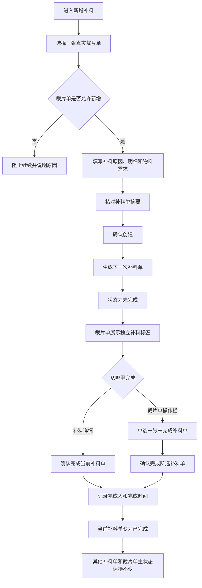
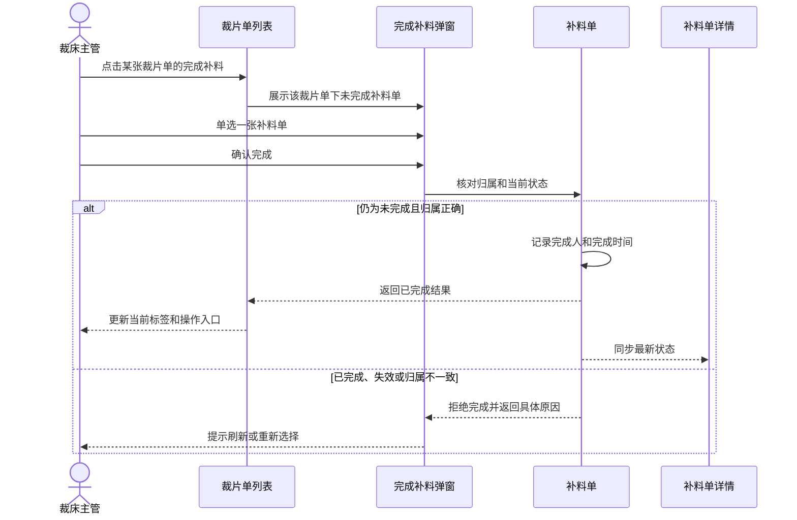
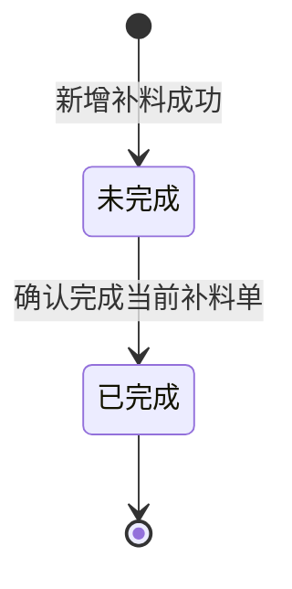

# 裁片单补料管理产品需求文档

## 1. 文档信息

| 项目 | 内容 |
| --- | --- |
| 文档名称 | 裁片单补料管理产品需求文档 |
| 文档版本 | 1.0 |
| 更新日期 | 2026-07-23 |
| 适用系统 | 工艺工厂运营系统 |
| 涉及菜单 | 裁后处理 - 补料管理；裁片准备 - 裁片单；裁片放行管理 |
| 主要角色 | 裁床办公室文员、裁床主管、补料业务人员、生产管理人员 |
| 文档用途 | 交付产品、研发、测试及业务验收使用 |
| 文档状态 | 业务方案已确认，可进入研发设计与开发 |

## 2. 需求摘要

补料是针对某一张裁片单再次组织生产物料和裁片的业务动作。补料单必须直接归属于裁片单，而不是直接归属于生产单或裁片放行记录。

一张裁片单可能因为不同原因多次补料。每次补料均形成一张独立补料单，并按创建先后记录为第 1 次、第 2 次、第 3 次。每张补料单独立保存补料原因、颜色尺码明细、物料需求、补料数量、创建信息和完成信息。

补料单只有「未完成」和「已完成」两个状态。新增补料后默认为「未完成」；裁床主管或有权限的补料业务人员可以从裁片单列表或补料单详情完成其中一张未完成补料单。每次操作只能完成一张，不支持批量完成、部分完成、撤销完成或重新打开。

裁片单列表需要逐张展示所属补料单。一个标签只代表一张补料单，展示「补 · 第几次 · 状态」。不得把多张补料单合并成一个汇总标签。

## 3. 需求背景

### 3.1 当前业务问题

- 新增补料同时提供生产单和裁片单两个选择入口，补料对象不明确。
- 生产单下可能有多张不同面料、不同部位的裁片单，按生产单新增补料容易挂错对象。
- 裁片单列表无法直接识别是否发生过补料、发生过几次以及每次是否完成。
- 多次补料被汇总展示时，无法判断具体哪一次仍未完成。
- 补料人员需要在多个页面之间查找记录，无法从裁片单直接查看或完成补料。
- 补料单状态口径过多，不利于现场人员理解和统一管理。
- 同一补料事实在不同菜单中可能出现数量、状态或明细不一致。
- 完成一张补料单时，存在误操作到同一裁片单下其他补料单的风险。

### 3.2 业务影响

- 裁床主管无法快速确认当前裁片单是否还有待完成补料。
- 补料业务人员可能选错裁片单，导致补料明细和实际生产对象不一致。
- 生产管理人员无法准确追溯每次补料的原因、数量、物料和完成责任。
- 多次补料之间缺少清晰边界，容易出现重复完成或漏完成。
- 后续物料准备、印花、染色等协同工作缺少稳定的补料来源依据。

## 4. 产品目标

1. 明确补料单与裁片单的直接归属关系。
2. 支持一张裁片单多次补料，每次形成独立补料单。
3. 统一补料单状态，只保留「未完成」和「已完成」。
4. 让使用人员在裁片单列表快速识别每次补料及其状态。
5. 支持按是否有补料、补料是否完成快速定位裁片单。
6. 支持从裁片单操作栏选择并完成一张未完成补料单。
7. 支持从补料单详情直接完成当前补料单。
8. 保证两个完成入口使用同一业务规则，并得到一致结果。
9. 保留每张补料单的创建人、创建时间、完成人和完成时间。
10. 阻止挂错裁片单、重复完成、批量误操作和失效来源继续新增。

## 5. 本期不做

- 不支持直接以生产单作为补料对象。
- 不支持以裁片放行记录作为补料对象。
- 不支持一张补料单同时归属多张裁片单。
- 不支持批量完成多张补料单。
- 不支持补料单部分完成。
- 不支持撤销完成或重新打开已完成补料单。
- 不支持删除补料单。
- 不因补料单完成自动改变裁片单主状态。
- 不因补料单完成自动完成配料、领料、裁剪、印花或染色任务。
- 不在本期新增补料审批流程。
- 不在本期新增补料成本、结算或扣款规则。
- 不在本期改变裁片放行数量的计算规则。

## 6. 业务术语

| 术语 | 业务说明 |
| --- | --- |
| 裁片单 | 按具体商品、面料、部位及生产任务形成的裁片生产对象 |
| 补料单 | 针对一张裁片单再次组织补料的独立业务单据 |
| 补料次数 | 同一张裁片单下，按补料单创建先后形成的顺序 |
| 未完成 | 补料单已经创建，但本次补料尚未确认完成 |
| 已完成 | 本次补料已由有权限人员确认完成 |
| 补料明细 | 本次需要补充的颜色、尺码、数量等明细 |
| 物料需求 | 本次补料对应的面料或其他物料及需求数量 |
| 裁片放行依据 | 已确认的裁片放行结果，可作为发起补料时的缺口参考 |
| 可新增裁片单 | 当前未关闭且允许继续发起补料的真实裁片单 |

## 7. 角色与职责

| 角色 | 主要职责 |
| --- | --- |
| 裁床办公室文员 | 查询裁片单、查看补料标签、查看补料详情、发起新增补料 |
| 补料业务人员 | 选择裁片单、填写补料原因和明细、确认创建补料单 |
| 裁床主管 | 查看待完成补料、完成指定补料单、处理失效或不匹配异常 |
| 生产管理人员 | 查询补料历史、核对补料来源、数量、状态和责任记录 |

### 7.1 权限原则

- 新增补料、完成补料必须分别设置业务权限。
- 只有具备新增补料权限的人员可以创建补料单。
- 只有具备完成补料权限的人员可以确认补料完成。
- 仅有查看权限的人员可以查看标签和详情，但不能新增或完成。
- 已关闭裁片单只允许查看历史补料，不允许新增补料。
- 已完成补料单只允许查看，不允许再次完成。
- 每次新增和完成都必须记录实际操作人和操作时间。

## 8. 业务对象关系

### 8.1 关系规则

- 一张生产单可以包含多张裁片单。
- 一张裁片单可以没有补料单，也可以有一张或多张补料单。
- 一张补料单必须且只能归属于一张裁片单。
- 生产单只作为裁片单的上游来源，不是补料单的直接归属对象。
- 裁片放行结果只提供缺口和候选裁片单参考，不是补料单的直接归属对象。
- 同一张裁片单下的每张补料单均有独立单号、次数、状态和明细。
- 补料单归属一经创建不得改挂到其他裁片单。

## 9. 核心业务规则

### 9.1 补料次数

- 同一张裁片单的第 1 张补料单记为「第 1 次」。
- 后续补料单按创建成功顺序依次记为「第 2 次」「第 3 次」。
- 不同裁片单分别从「第 1 次」开始计算。
- 已完成补料单仍占用原次数，不得重新编号。
- 后续如发生作废或冲销需求，应保留原次数；本期不提供作废或冲销功能。
- 多人同时创建时，必须保证同一张裁片单不会产生重复次数。

### 9.2 补料状态

- 新增补料成功后，状态默认为「未完成」。
- 只有「未完成」可以进入「已完成」。
- 「已完成」是终态，本期不能返回「未完成」。
- 状态变化只作用于当前补料单。
- 完成补料单不会改变同一裁片单下其他补料单的状态。
- 完成补料单不会自动改变裁片单的配料、领料、裁剪、放行或关闭状态。

### 9.3 一次只完成一张

- 从裁片单操作栏完成补料时，只能单选一张未完成补料单。
- 未选择具体补料单前，不允许确认完成。
- 从补料详情完成时，只完成当前正在查看的补料单，不再重复选择。
- 不提供全选、多选或全部完成。
- 快速重复点击只能产生一次有效完成结果。

### 9.4 跨菜单一致性

- 补料管理与裁片单列表必须读取同一份补料事实。
- 在补料管理新增后，裁片单列表应显示新标签。
- 在任一入口完成后，两个菜单均应显示「已完成」。
- 补料次数、补料数量、原因、明细、物料需求和完成信息必须保持一致。
- 页面先后访问顺序不得改变补料单数量、次数或状态。

## 10. 总体业务流程

## 11. 菜单及页面调整范围

| 菜单 | 页面或区域 | 需求 |
| --- | --- | --- |
| 裁后处理 - 补料管理 | 补料列表 | 查询补料单、查看状态、查看详情、完成当前补料单 |
| 裁后处理 - 补料管理 | 新增补料弹窗 | 保留弹窗，只允许选择裁片单，删除生产单选择入口和无效说明 |
| 裁片准备 - 裁片单 | 筛选区 | 增加「是否有补料」「补料完成状态」 |
| 裁片准备 - 裁片单 | 商品信息 | 每张补料单展示一个独立标签 |
| 裁片准备 - 裁片单 | 补料详情弹窗 | 展示当前补料单完整业务信息 |
| 裁片准备 - 裁片单 | 操作栏 | 有未完成补料时展示「完成补料」 |
| 裁片放行管理 | 发起补料 | 将已确认的缺口作为参考带入补料管理，但仍必须选择真实裁片单 |

## 12. 补料管理列表

### 12.1 列表目的

补料管理列表用于集中查询每一张补料单，确认其所属裁片单、补料次数、当前状态、补料内容和责任记录。

### 12.2 筛选条件

至少支持：

- 补料单号。
- 裁片单号。
- 生产单号。
- 款号或商品编码。
- 补料状态。
- 创建时间。

不得提供「补料对象」筛选。补料对象只有裁片单，不存在可供选择的其他对象类型。

### 12.3 列表信息

每行至少展示：

- 补料单号。
- 所属裁片单号。
- 所属生产单号。
- 商品信息。
- 第几次补料。
- 补料原因。
- 补料数量。
- 当前状态。
- 创建人和创建时间。
- 完成人和完成时间。
- 查看详情。

未完成补料单可展示「完成该补料单」；已完成补料单不展示完成入口。

### 12.4 分页与查询

- 列表必须分页。
- 查询和重置后回到第 1 页。
- 无结果时明确显示当前条件下没有补料单。
- 查询条件不得改变补料事实本身。

## 13. 新增补料弹窗

### 13.1 保留弹窗

继续使用「新增补料」弹窗完成创建，不改成独立页面。

### 13.2 删除内容

- 删除弹窗顶部重复的标题说明区。
- 删除「生产单」页签及其数量。
- 删除按生产单选择补料对象的入口。
- 删除「先选择生产单或裁片单」等双对象说明。
- 删除任何会让用户误以为补料可以直接挂在生产单下的选项。

### 13.3 第一步：选择裁片单

打开弹窗后直接进入「选择裁片单」。

支持按以下内容搜索：

- 裁片单号。
- 生产单号。
- 款号。
- 商品编码。
- 商品名称。

候选信息至少展示：

- 裁片单号。
- 所属生产单号。
- 商品图片。
- 款号或商品编码。
- 商品名称。
- 面料或物料摘要。
- 计划数量或可信的参考数量。
- 当前是否允许新增补料。
- 不允许新增时的具体原因。

选择规则：

- 每次只能选择一张裁片单。
- 已关闭裁片单不可选择。
- 已失效或已不允许继续生产的裁片单不可选择。
- 裁片单缺少必要归属信息时不可选择。
- 不可选择时必须展示原因，不能只将选项变灰。
- 未选择裁片单时不能进入下一步。

### 13.4 第二步：填写补料信息

至少填写或确认：

- 所属裁片单。
- 所属生产单。
- 第几次补料预览。
- 补料原因。
- 补料原因说明。
- 颜色。
- 尺码。
- 补料数量。
- 对应物料。
- 物料需求数量及单位。

填写规则：

- 至少有一条有效补料明细。
- 每条补料数量必须大于 0，并带单位。
- 同一颜色、尺码和物料的重复行应提示合并或阻止重复提交。
- 物料需求数量必须大于 0，并使用物料原业务单位。
- 补料原因必须选择；需要补充说明的原因必须填写说明。
- 补料总数量由系统汇总，不要求用户心算。

### 13.5 第三步：确认创建

确认信息至少包含：

- 即将创建的补料单次数。
- 所属裁片单号。
- 所属生产单号。
- 补料原因。
- 补料明细摘要。
- 补料总数量。
- 物料需求摘要。

用户确认后才创建补料单。

创建成功后：

- 生成独立补料单号。
- 次数使用当前裁片单的下一次。
- 状态为「未完成」。
- 记录创建人和创建时间。
- 返回补料管理列表并显示创建结果。
- 裁片单列表同步出现新的独立标签。

### 13.6 裁片放行结果带入

从裁片放行管理进入新增补料时：

- 可以带入生产单、已确认放行结果、缺口明细和来源裁片单候选。
- 缺口信息只作为本次补料的填写参考。
- 仍然停留在「选择裁片单」步骤。
- 必须从当前放行结果对应的真实裁片单中单选一张。
- 多张候选时不得自动替用户选择。
- 候选裁片单全部关闭、没有匹配裁片单或放行结果已失效时，必须阻止继续。
- 用户最终确认创建时，应保留本次使用的放行依据，便于后续追溯。

## 14. 裁片单列表

### 14.1 补料标签

补料标签展示在「商品信息」内，不新增独立宽表列。

一张补料单对应一个标签，格式为：

- 「补 · 第 1 次 · 未完成」
- 「补 · 第 2 次 · 已完成」

展示规则：

- 同一张裁片单的标签按补料次数从小到大排列。
- 每个标签只代表一张补料单。
- 多个标签可换行展示。
- 不展示「补 3 次」等合并标签。
- 不将多张补料单合并成一个状态。
- 无补料单时不显示标签，也不显示空占位。
- 未完成与已完成使用易于区分但克制的状态颜色。
- 点击某个标签，只打开对应补料单详情。

### 14.2 是否有补料筛选

| 选项 | 业务判断 |
| --- | --- |
| 全部 | 不限制裁片单是否存在补料单 |
| 有补料 | 裁片单下至少存在一张补料单 |
| 无补料 | 裁片单下不存在任何补料单 |

### 14.3 补料完成状态筛选

| 选项 | 业务判断 |
| --- | --- |
| 全部 | 不限制已有补料单的完成情况 |
| 有未完成 | 至少存在一张未完成补料单 |
| 全部已完成 | 至少存在一张补料单，且所有补料单均已完成 |

边界规则：

- 无补料裁片单不属于「有未完成」。
- 无补料裁片单不属于「全部已完成」。
- 同时存在已完成和未完成补料单时，属于「有未完成」。
- 只有全部补料单均已完成时，才属于「全部已完成」。
- 选择「无补料」后，「补料完成状态」自动恢复为「全部」并暂时不可选择，避免形成无业务意义的组合。
- 重新选择「全部」或「有补料」后，「补料完成状态」恢复可选择。
- 重置后两个筛选均恢复为「全部」。

### 14.4 操作栏

- 裁片单至少有一张未完成补料单时，展示「完成补料」。
- 裁片单无补料单时，不展示「完成补料」。
- 裁片单全部补料单已完成时，不展示「完成补料」。
- 已关闭裁片单不允许新增补料；关闭前已产生的未完成补料单仍可按原权限逐张完成。
- 现有查看详情、配料、唛架、打印等操作保持原业务边界。

## 15. 补料单详情

### 15.1 详情信息

至少展示：

- 补料单号。
- 所属裁片单号。
- 所属生产单号。
- 商品信息。
- 第几次补料。
- 当前状态。
- 补料原因。
- 补料原因说明。
- 颜色、尺码和补料数量明细。
- 物料名称、物料编码、需求数量和单位。
- 补料总数量。
- 创建人和创建时间。
- 完成人和完成时间。
- 使用的裁片放行依据；无放行依据时不展示。

未完成时，完成信息显示「尚未完成」。

### 15.2 详情动作

- 未完成补料单展示「完成该补料单」。
- 已完成补料单不展示完成按钮。
- 不展示部分完成、撤销完成、重新打开或删除。
- 完成前必须二次确认。
- 二次确认必须明确补料单号、所属裁片单、第几次和补料总数量。
- 完成成功后，详情状态立即变为「已完成」并显示完成责任。

## 16. 从裁片单操作栏完成补料

### 16.1 选择弹窗

点击「完成补料」后，只展示当前裁片单下的未完成补料单。

每个可选项至少展示：

- 补料单号。
- 第几次补料。
- 创建时间。
- 补料原因。
- 明细摘要。
- 补料总数量。

### 16.2 选择规则

- 使用单选方式。
- 一次只能选择一张。
- 未选择时不能确认。
- 已完成补料单不得出现在可选列表中。
- 如果打开弹窗后该补料单已被其他人员完成，应刷新结果并提示当前状态。

### 16.3 完成结果

- 只完成选中的补料单。
- 记录完成人和完成时间。
- 当前标签变为「已完成」。
- 其他标签状态保持不变。
- 如果仍有未完成补料单，继续展示「完成补料」。
- 如果完成的是最后一张未完成补料单，隐藏「完成补料」。
- 当前筛选为「有未完成」且该裁片单不再符合条件时，该行从结果中移除。

## 17. 完成补料业务时序

## 18. 补料单状态图

状态约束：

- 「未完成」是新增后的唯一初始状态。
- 「已完成」是本期唯一终态。
- 不存在处理中、部分完成、已确认、已取消、已关闭等补料状态。
- 裁片单关闭不是补料单状态，不改变关闭前已产生补料单的状态，也不阻止有权限人员逐张完成未完成补料单。

## 19. 信息记录要求

### 19.1 裁片单归属

必须保存并展示：

- 裁片单唯一身份。
- 裁片单号。
- 所属生产单号。
- 商品信息。

裁片单唯一身份和裁片单号必须属于同一张裁片单。两者不一致、任一缺失或跨裁片单组合时，不能创建、展示为有效归属或执行完成。

### 19.2 补料内容

必须保存：

- 补料单号。
- 第几次补料。
- 补料原因及说明。
- 颜色、尺码、补料数量。
- 物料名称、物料编码、需求数量和单位。
- 补料总数量。

### 19.3 责任与追溯

必须保存：

- 创建人。
- 创建时间。
- 完成人。
- 完成时间。
- 使用的裁片放行依据。
- 每次创建和完成的操作结果。

历史记录不得因后续商品、人员或裁片单信息变化而被覆盖。

## 20. 并发、重复操作与一致性

### 20.1 并发新增

- 同一张裁片单被多人同时新增补料时，补料次数必须唯一且连续。
- 创建确认时应重新核对当前最新次数。
- 如当前次数已被占用，应自动使用下一次，不得覆盖既有补料单。

### 20.2 并发完成

- 两人同时完成同一张补料单时，只允许第一次有效完成。
- 后续操作应得到「该补料单已完成，无需重复操作」。
- 不得覆盖首次记录的完成人和完成时间。

### 20.3 重复提交

- 用户快速重复点击创建或完成时，只能生成一次有效结果。
- 网络重试不得产生重复补料单或重复完成记录。
- 页面重新进入后应显示最终业务结果。

### 20.4 跨菜单一致性

- 新增、完成后，补料管理和裁片单必须显示同一结果。
- 不允许一个菜单显示未完成，另一个菜单显示已完成。
- 不允许同一张补料单在两个菜单显示不同次数、原因或数量。

## 21. 异常与提示

| 场景 | 业务处理 |
| --- | --- |
| 未选择裁片单 | 阻止下一步，提示「请选择一张裁片单」 |
| 裁片单已关闭 | 禁止选择，提示「该裁片单已关闭，不能新增补料」 |
| 裁片单已失效 | 禁止选择，并说明当前不可继续的原因 |
| 未填写补料原因 | 阻止创建，提示选择补料原因 |
| 补料明细为空 | 阻止创建，提示至少填写一条补料明细 |
| 补料数量小于或等于 0 | 阻止创建，提示填写大于 0 的数量 |
| 裁片单归属不一致 | 阻止创建或完成，提示重新选择当前裁片单 |
| 未选择待完成补料单 | 阻止确认，提示选择一张未完成补料单 |
| 补料单已被其他人员完成 | 不重复完成，提示刷新查看最新状态 |
| 补料单不存在 | 关闭无效详情，提示「未找到对应补料单，请刷新后重试」 |
| 最后一张未完成补料已完成 | 更新标签并隐藏「完成补料」 |
| 裁片放行依据已失效 | 阻止继续使用，提示返回查看最新放行结果 |
| 放行依据无可用裁片单 | 停留在选择步骤，提示当前没有可新增补料的裁片单 |
| 网络中断或结果不确定 | 禁止重复生成，恢复后先查询最终结果 |

错误提示必须说明发生了什么、为什么不能继续以及下一步怎么处理，不能只显示「操作失败」。

## 22. 历史数据处理

### 22.1 可确认归属的历史补料单

- 按真实裁片单归属纳入本需求。
- 同一裁片单下按历史创建时间确定补料次数。
- 已有明确完成事实的补料单记为「已完成」。
- 没有明确完成事实的补料单记为「未完成」。
- 历史完成责任可追溯时应保留原操作人和原时间。

### 22.2 无法确认归属的历史补料单

- 不得仅凭生产单号自动挂到任意裁片单。
- 不得使用临时编号冒充真实裁片单。
- 应进入异常清单，由业务人员确认真实裁片单。
- 归属确认前可以查看历史内容，但不能从裁片单列表完成。

### 22.3 历史数量缺失

- 缺少可信数量时显示「未提供」。
- 不得把未知数量显示为 0。
- 补齐历史数量前，不影响查看原始补料原因和状态事实。

## 23. 页面与交互要求

- 补料管理和裁片单均为管理端或主管端页面，可以使用分页列表。
- 裁片单宽表的操作栏必须始终可见。
- 多个补料标签不得遮挡商品信息或操作入口。
- 弹窗在常用工厂电脑分辨率下必须能看到主要内容和底部按钮。
- 补料明细较多时在弹窗内部滚动，不扩大页面宽度。
- 打开、关闭、筛选、查看详情和完成补料不得导致整页闪烁或滚动位置丢失。
- 用户打开弹窗后，键盘操作应停留在当前弹窗内。
- 关闭确认弹窗后，应回到原完成按钮或当前详情。
- 完成操作后应优先显示结果，常用操作响应时间不超过 200 毫秒。
- 所有数量必须带单位，所有状态必须使用中文业务名称。
- 状态颜色只用于辅助识别，不能只靠颜色区分。

## 24. 业务验收场景

### 24.1 无补料

- 裁片单没有补料单。
- 不展示补料标签。
- 不展示「完成补料」。
- 「无补料」筛选可以找到该裁片单。

### 24.2 一张未完成补料单

- 展示「补 · 第 1 次 · 未完成」。
- 点击标签可查看详情。
- 详情可完成当前补料单。
- 操作栏可选择并完成该补料单。

### 24.3 两张补料单且全部完成

- 展示两个独立已完成标签。
- 不展示「完成补料」。
- 「全部已完成」筛选可以找到该裁片单。

### 24.4 三张补料单且状态混合

- 第 1 次已完成，第 2 次和第 3 次未完成。
- 展示三个独立标签。
- 「有未完成」筛选可以找到该裁片单。
- 操作栏只列出第 2 次和第 3 次。
- 完成其中一张不影响另一张。

### 24.5 完成最后一张未完成补料单

- 当前补料单变为已完成。
- 所有标签均为已完成。
- 「完成补料」消失。
- 当前裁片单不再出现在「有未完成」结果中。
- 当前裁片单进入「全部已完成」结果。

### 24.6 已关闭裁片单

- 历史补料标签仍可查看。
- 不允许新增补料。
- 关闭前已产生的未完成补料单仍可逐张完成。
- 完成既有补料单只更新该补料单，不重新打开裁片单，也不改变裁片单主状态。

### 24.7 从裁片放行结果发起

- 带入缺口依据和真实来源裁片单候选。
- 多张候选时必须由用户单选。
- 关闭或失效裁片单不可选择。
- 选择成功后才进入填写补料信息。
- 创建后补料单只归属选中的裁片单。

### 24.8 并发完成

- 两名主管同时完成同一补料单。
- 仅第一名主管的完成有效。
- 第二名主管看到已完成提示。
- 首次完成责任不被覆盖。

## 25. 业务验收标准

### 25.1 新增补料

- 新增补料继续使用弹窗。
- 只能选择一张真实裁片单。
- 不再提供生产单选择页签。
- 所属生产单只作为来源信息展示。
- 不可新增裁片单有明确原因。
- 补料原因、明细和物料需求校验完整。
- 创建后次数正确、状态为「未完成」。
- 重复提交不会生成重复补料单。

### 25.2 裁片单展示

- 一张补料单对应一个标签。
- 标签准确显示第几次和当前状态。
- 多张补料单不合并展示。
- 标签按次数顺序排列。
- 点击标签打开正确补料单详情。
- 无补料时不展示标签。

### 25.3 筛选

- 「有补料」只返回至少有一张补料单的裁片单。
- 「无补料」只返回没有补料单的裁片单。
- 「有未完成」只返回至少有一张未完成补料单的裁片单。
- 「全部已完成」排除无补料和混合状态。
- 选择「无补料」后，完成状态自动恢复为「全部」并暂时不可选择。
- 重置恢复默认条件。

### 25.4 完成补料

- 操作栏只在存在未完成补料时展示。
- 操作栏一次只能选择并完成一张。
- 详情只完成当前补料单。
- 两个入口的确认信息和完成结果一致。
- 完成后记录完成人和完成时间。
- 已完成补料单不能重复完成。
- 完成一张不影响其他补料单和裁片单主状态。
- 完成最后一张后操作入口消失。

### 25.5 一致性与追溯

- 补料管理与裁片单显示同一数量、次数、状态和明细。
- 页面访问顺序不影响业务结果。
- 裁片单身份不完整或不一致时不能建立有效归属。
- 历史未知数量不显示为 0。
- 创建和完成责任可追溯。
- 裁片放行依据失效后不能继续创建。

### 25.6 可用性与性能

- 常用分辨率下可以完成查询、详情、新增和完成操作。
- 操作栏在横向查看宽表时仍可使用。
- 弹窗底部操作不会被遮挡。
- 键盘用户可以完整操作弹窗。
- 轻量操作不引起整页刷新或滚动位置丢失。
- 常用操作响应时间不超过 200 毫秒。

## 26. 上线前数据准备

- 确认历史补料单与真实裁片单的关联结果。
- 确认无法自动关联的异常清单及处理责任人。
- 确认历史完成状态和完成责任是否可信。
- 确认补料原因选项及需要填写说明的原因。
- 确认补料数量与物料需求数量的业务单位。
- 确认哪些裁片单状态允许新增补料。
- 确认哪些角色拥有新增、完成和只读权限。
- 准备无补料、单次补料、多次补料、混合状态、全部完成、已关闭和异常归属等验收数据。

## 27. 研发、测试与业务交付清单

### 27.1 研发交付

- 补料单与裁片单直接归属。
- 同一裁片单补料次数唯一递增。
- 新增补料只选择裁片单。
- 补料管理列表和详情。
- 裁片单独立补料标签。
- 两个新增筛选条件。
- 详情完成当前补料单。
- 操作栏单选完成一张补料单。
- 创建和完成的重复提交保护。
- 并发新增和并发完成保护。
- 历史数据关联与异常处理。
- 操作责任和时间追溯。

### 27.2 测试交付

- 覆盖业务验收场景中的全部状态和边界。
- 覆盖一张裁片单多次补料。
- 覆盖两个完成入口。
- 覆盖筛选组合。
- 覆盖重复点击和多人并发。
- 覆盖失效放行依据、关闭裁片单和错误归属。
- 覆盖跨菜单一致性。
- 覆盖常用分辨率、键盘操作和响应时间。

### 27.3 业务验收

- 裁床办公室确认新增补料流程符合实际操作。
- 裁床主管确认单张完成和异常处理规则。
- 生产管理确认补料历史和责任信息满足追溯要求。
- 业务负责人确认历史补料数据的归属和状态口径。

## 28. 最终业务结论

补料单直接归属于裁片单。一张裁片单可以多次补料，每次形成一张独立补料单，并分别记录第几次、补料内容和完成状态。

补料单只保留「未完成」和「已完成」两个状态。裁片单列表逐张展示「补 · 第几次 · 状态」标签，不做汇总合并。

新增补料继续使用弹窗，但只允许选择一张真实裁片单。生产单和裁片放行结果只能作为来源与参考，不能成为补料单归属对象。

完成补料支持裁片单操作栏和补料单详情两个入口。每次只能完成一张补料单，完成一张不影响其他补料单，也不改变裁片单主状态。
