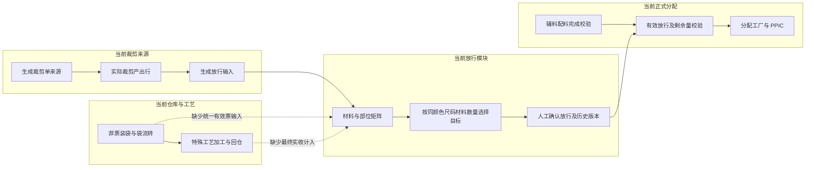
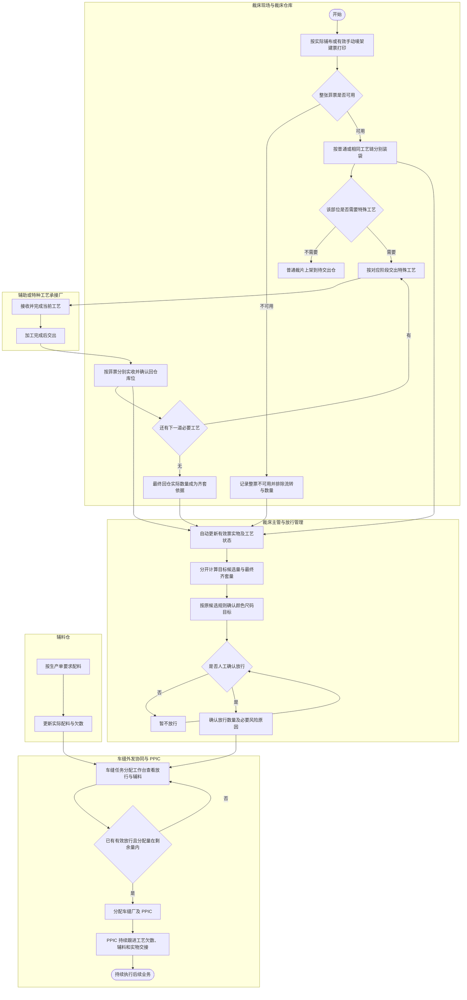
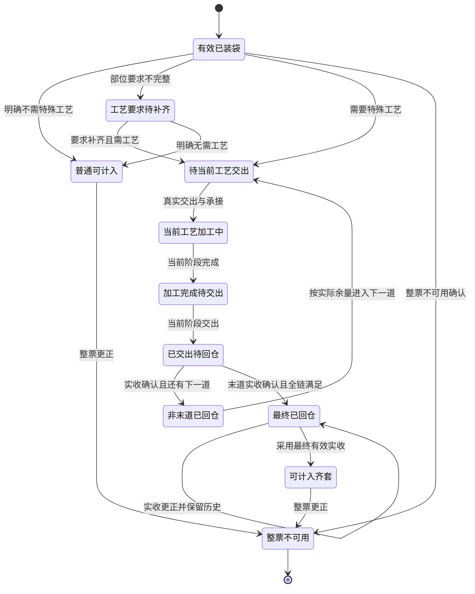
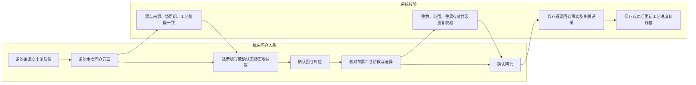
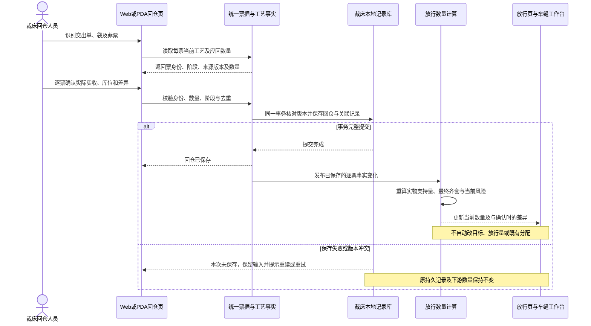
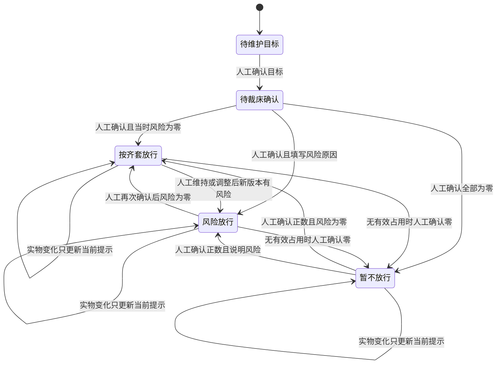
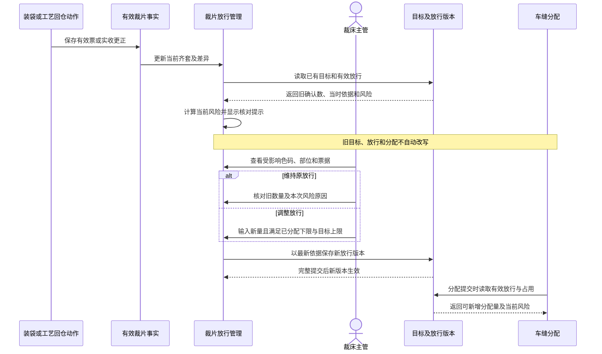
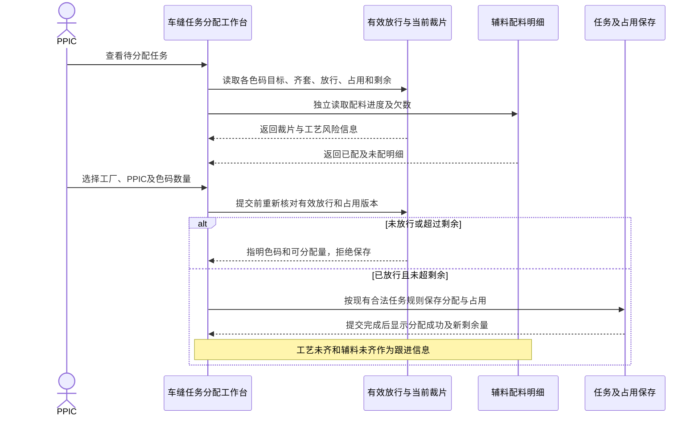
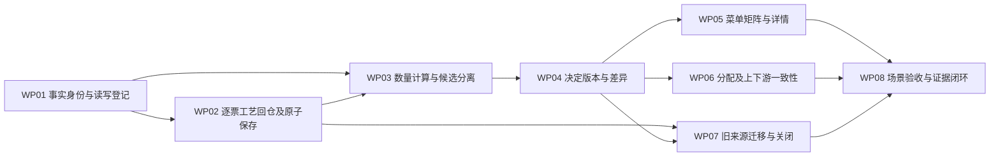

# 裁片放行管理与上下游产品调整方案

> 文档版本：V1.1，2026-10-09；纳入实施与界面文案收口。  
> 文档性质：用户已确认的产品调整方案、实施与验收依据；当前已完成本地实现与验证，两轮逐项对抗审查各88/88通过。  
> 业务基础口径：以用户本轮明确确认及补充流程图为准。第 2、18 节保留实施前代码核查，当前逐项状态以第 17 节关联矩阵为准。  
> 实施基线：`codex/sidebar-menu-group-ui`，`155144308f6b2931a8acb229a579e04ec99af41d`；最终验证清单见[版本清单](evidence/2026-10-09-cut-piece-release/version-v49.json)，应用构建为v48。  
> 工作树：`/Users/laoer/.codex/worktrees/9ec5/higoods`；本地预览：`http://127.0.0.1:4190`，服务与该工作树一致。  
> 项目边界：HiGood 高保真原型，浏览器本地数据；本文不承诺真实后端、多人共享或生产系统能力。

阅读顺序：第 1～4 节说明确认口径、当前缺口和完整流程；第 5～8 节定义有效票、工艺回仓和数量；第 9～13 节说明页面、决定版本和上下游；第 14～17 节给出场景、实施和验收；第 18～19 节保留源码定位与方案版本。

## 1. 本次调整要解决什么问题

裁片放行应回答两个不同的问题：**当前实物已经具备多少套可用于车缝的裁片，以及裁床主管已经确认允许 PPIC 分配多少件车缝任务。** 前者是系统随现场事实变化计算的数量，后者是有版本、有依据的人工决定。

实施前代码主要把裁剪产出事实作为矩阵输入，没有把已装袋有效菲票、具体部位的工艺链及最终回仓实收数量完整接入放行计算。直接裁出并不意味着裁片可用；装袋也不意味着特殊工艺已经完成；工厂报加工完成也不意味着裁片已经回到裁床仓库。上述数量不能混用。

本次方案将放行管理放到裁床仓库管理下，以有效已装袋菲票为起点，区分普通裁片与需要特殊工艺的裁片。特殊工艺裁片只有完成全部必要工艺，并以最终特殊工艺回仓的实际实收数量，才能贡献齐套数量。目标、放行、车缝分配、实物交出、辅料配料分别保留自己的含义和记录。

### 1.1 已确认的业务口径

| 编号 | 用户确认 | 本方案落点 |
| --- | --- | --- |
| U01 | 菜单从“裁后处理”移到“裁床仓库管理” | 第 9.1 节；原页面对象和路由保留 |
| U02 | 目标确认、放行确认改为表格矩阵 | 第 9.3、9.4 节 |
| U03 | 矩阵纵轴按成衣颜色列行，横轴尺码从小到大 | 第 9.2 节；不是按样衣列行 |
| U04 | 放行数据源取自已装袋菲票 | 第 5 节；有效性、身份和去重必须同时满足 |
| U05 | 一张菲票要么全部裁片可用，要么全部不可用 | 第 5.2 节；不设计部分不可用或拆票剔除 |
| U06 | 辅助工艺、特种工艺可以是一道或多道连续加工 | 第 6 节；按部位对应的完整有序工艺链判断 |
| U07 | 需要特殊工艺的裁片，以最终特殊工艺回仓数量为准 | 第 6、7 节；加工完成、交出、非末道回仓均不替代最终实收 |
| U08 | 多张菲票回仓，按菲票分别实收 | 第 8 节；禁止总量按预计量自动分摊 |
| U09 | 单元格显示需工艺、已完成、未完成数量，点击展示侧栏详情 | 第 9.5、9.6 节；另明确显示加工完成未回仓和数量差异 |
| U10 | 不要求齐套才能放行 | 第 10 节；保留有原因的风险放行 |
| U11 | 不要求辅料配齐或裁片齐套才能分配，但必须裁片已放行 | 第 12 节；现有相关数量和任务适用范围继续校验 |
| U12 | 目标选择来源、候选规则不改变 | 第 7.4、9.3 节；只调整呈现并接入正确实物来源，不改为自由填目标 |
| U13 | 同意数量变化建议：实时事实变化，确认目标、确认放行和既有分配不自动改写 | 第 11 节；人工维持或调整放行形成新版本 |
| U14 | 保留已分配下限和放行剩余量上限 | 第 7.5、11、12 节；不得以风险二次确认突破分配上限 |

用户提供的流程图是业务事实依据。本轮在独立浏览器资料中验证装袋、回仓与派工，不代表现场已实际执行；原型验证及发布仍分别留证。

### 1.2 范围和非范围

本次覆盖：菜单归属、放行列表与详情、两组颜色尺码矩阵、有效已装袋菲票来源、逐菲票工艺回仓、部位工艺链与齐套计算、数量变化提示和人工确认版本、辅料并行展示、正式车缝分配的相关门禁，以及上述事实在 Web、PDA、补料入口和实物交出中的一致性。

本次不建立新的质检审批系统、部分裁片报废系统、真实离线队列或云端数据库；不改变生产单拆解、工艺分类、工艺定价、合同、首样、结算或 SLA 规则；不把已有简易裁片交出改成强制装袋；不重写整个裁床或车缝模块。

整票不可用登记是为落实有效数据来源提供的必要动作，不扩展为部分剔除、拆票、自动补票或多级审批。补料来源、自由补料、退仓实物、打印票面和已交出责任按第 13 节保留边界。

## 2. 代码核查结论：当前能力与实际缺口

本章结论来自相关文件和关键处理函数逐行阅读。完整阅读的核心文件及大型文件的具体阅读范围见第 18 节。不能把“读取了相关函数”表述为“逐行读完了整个项目”。

### 2.1 当前链路



### 2.2 逐项现状

| 核查项 | 当前代码已经存在的行为 | 需要调整的具体问题 | 证据 |
| --- | --- | --- | --- |
| 菜单 | “裁片放行管理”位于“裁后处理”；已有独立路由 | 移动菜单到裁床仓库管理，不新增同名副本 | C01 |
| 矩阵来源 | 放行页面通过生成裁剪单、实际裁剪产出构造事实；生成器只接实际裁剪来源 | 没有完整接入有效已装袋票、手动唛架菲票及工艺最终回仓 | C02、C03 |
| 部位折算 | 已按部位单耗折算，材料内取短板，再在材料之间取短板 | 保留短板规则，将每个部位的合格输入改为第 5～7 节定义 | C04 |
| 颜色字段 | 菲票存在成衣颜色与面料颜色；若干仓库投影优先取面料色 | 放行按成衣色归属，侧栏另外展示面料色，不能把两者互换 | C03、C07 |
| 目标 | 同一颜色尺码内选择某材料单元格的折算数量；已有依据快照 | 保留候选机制；目标矩阵化，并分开实物候选量和最终齐套量 | C04、C05 |
| 确认布局 | 已确认目标和放行数量按卡片平铺 | 改为真正的颜色行、尺码列，可横向比对 | C06 |
| 侧栏 | 已有部位数量、单耗、裁片单、铺布单和事实编号 | 增加有效票、袋号、逐道工艺、实际回仓、未回仓和差异追溯 | C06 |
| 放行 | 已有按齐套、风险、暂不放行及版本；有已分配下限、目标上限 | 保留这些约束；补齐实时风险和确认时风险的区别 | C05 |
| 事实变化 | 追加事实会改目标状态和放行状态；目标快照读取要求与最新矩阵版本相同 | 自动变化会使原确认失效或无法供下游读取，须改为独立差异提示 | C05 |
| 普通装袋 | 已有票据身份、装袋占用、袋使用周期、重复动作检查 | 不能仅依“混袋”标记放过普通与工艺票混装、不同工艺链混装 | C07 |
| Web 工艺回仓 | 活跃仓库入口主要选袋和菲票；袋操作沿用原票片数，另有相等数量限制 | 必须增加每票实际实收，不再要求实收等于原票面数 | C08 |
| 工艺加工回仓 | 工艺绑定中已有顺序、加工、交出、回仓数量；多个绑定回仓部分路径仍沿用预计数 | 原型已有信息不等于放行已经使用这些事实；禁止多票预计量自动填成实收 | C09 |
| PDA 工艺回仓 | 扫一张票、填写实回数的旧入口已存在；同票多个工艺项仍按比例分摊；带袋回仓转到入仓；一个处理入口固定取演示交出单 | 必须准确绑定当前交出单、票和工艺阶段；不得按多道工艺摊一份实收或提交到固定演示对象 | C10 |
| 辅料展示 | 正式分配工作台已展示真实配料行；放行记录另有将辅料准备量直接赋成齐套量的字段 | 使用辅料仓真实配料来源；裁片齐套不能冒充辅料配齐 | C05、C11 |
| 正式分配 | 提交链校验有效放行和可分配剩余量，同时仍校验配料齐备 | 去掉适用车缝任务的“辅料未齐即不可分配”，保留放行与数量门禁 | C11、C12 |
| 列表数量 | 可做放行数的显示存在以目标数量替代零放行数的逻辑 | 暂不放行 0 件必须显示 0 件；未确认必须显示未确认 | C06、P01 |
| 实物交出 | 有袋交出和简易整票交出两种方式，共享消耗、防重复与实际交出责任 | 继续读取实物事实；风险放行不能生成不存在的裁片或增加仓库库存 | C13、H02 |
| 存储 | 裁后动作已存在记录级 IndexedDB 事务；生成放行数据仍有旧 localStorage 整包保存入口 | 复用现有裁床事务，迁移本次依赖的放行数据，不能另建一套事实源 | C14、C05 |

### 2.3 运行页面核对范围

P01：本轮在同工作树的本地放行列表只读核对，看到旧菜单归属、“目标后数据已变化”“确认后需复核”等状态，并看到原型演示生产单 PO14677 的各颜色尺码可做数量为 0，列表总量却显示 281 件。该条用于证明列表零值展示问题，不代表真实生产单业务事实。

本轮“查看矩阵”点击后没有成功打开详情，页面同时出现其他标签页修改 PMS 数据的提示；未把这次点击当作详情验收成功。详情现状依据逐行代码与用户提供的截图。本文所有调整后的界面和数字示例仍为待实施方案，未进行页面功能验收。

### 2.4 旧文档的处理

旧《裁片放行管理优化 产品需求说明》中“PPIC 可超过可派数量二次确认派工”的条款被本轮规则取代。后续分配必须在有效放行剩余量内，不提供超量风险豁免。

旧文档中保留确认历史、按实际交出确定车缝责任、风险放行填写原因的原则继续使用。关于事实变化后的目标和放行，按第 11 节执行；不沿用“事实一变就使确认失效”的阻断方式。已有简易交出、手动建票、退仓和补料文档的边界按第 13 节保留。

## 3. 角色、对象和责任边界

### 3.1 角色分工

| 角色 | 本次负责的动作 | 不能替代的事实 |
| --- | --- | --- |
| 裁床现场人员 | 识别有效菲票、装袋，普通裁片入待交出仓，特殊工艺交出 | 不能用裁剪完成替代装袋，也不能用出厂替代最终回仓 |
| 裁床仓管 / 回仓人员 | 按票点收工艺回仓实物，确认数量、库位及来源；登记整票不可用或回仓更正 | 不能输入一个总量让系统自动分摊到票；不能改已打印票面掩盖差异 |
| 特殊工艺承接厂人员 | 按对应部位和工艺阶段加工、完成、交出 | 加工完成或已交出不直接变成裁床齐套 |
| 裁床主管 | 确认目标，确认或调整放行，解释风险，核对数量变化 | 放行是分配承诺，不是实物收发动作 |
| 辅料仓人员 | 按生产单及现有配料明细配料，更新实际配料情况 | 不能用裁片齐套数量推导辅料完成 |
| PPIC | 在放行剩余量内分配，查看工艺欠数、辅料欠数和数量变化，跟进工厂及交接 | 不自动取消旧分配，也不能用派工数量替代实交 / 实收 |
| 系统 | 按同一票据事实计算数量，展示当前与确认时差异，保存操作与版本 | 不替人自动改变确认目标、放行和已分配任务 |

沿用既有角色和动作入口，不增加新的审批岗位或审核链。原型记录操作身份用于追溯，不将固定演示姓名或免登录演示身份表述为真实鉴权。

### 3.2 业务对象

| 对象 | 必须保留的身份 / 关系 | 数量含义 |
| --- | --- | --- |
| 生产单及成衣 SKU | 生产单、款式、成衣颜色、尺码，及所采用 BOM / 技术资料依据 | 成衣单位“件” |
| 必需材料与部位 | 材料 SKU、BOM 明细、部位身份、必要的左右 / 部位实例、每件成衣单耗 | 部位单位“片”，单耗“片 / 件” |
| 菲票 | 稳定票 ID、票号、来源类型、来源裁剪单或有效手动唛架、成衣色码、材料、部位 | 原始票面片数保留；有效量、工艺实收量为另行记录的事实 |
| 装袋记录 | 票 ID、袋 ID、袋使用周期、装袋时间、人员及有效关系 | 袋是载体；换袋、重装、回收不新增一份产出 |
| 部位工艺要求 | 对应部位、要求版本、工艺名称、类型、有序阶段及最终阶段 | 同一批裁片做多道工艺仍是一批裁片，不按工序倍增数量 |
| 工艺执行与回仓 | 票 ID、工艺阶段、承接厂、来源交出单、实际加工 / 交出 / 实收、库位及人员时间 | 实收按票按阶段记录，最终有效量取最终阶段实收 |
| 目标快照 | 生产单、各色码目标、选择的候选材料、依据版本、确认人和时间 | 已确认目标件数，不自动跟随事实变化 |
| 放行版本 | 各色码放行量、目标与实物依据、确认时风险、原因、确认人和时间 | 有效放行承诺件数 |
| 车缝分配占用 | 有效任务、成衣 SKU / 色码、占用件数、关联放行版本 | 已分配件数；取消 / 调整按既有有效状态释放 |
| 实物交出 / 接收 | 真实票据、袋、交出记录、接收厂与接收结果 | 决定实物责任，不直接改写目标和放行 |
| 辅料配料 | 生产单 / 任务配料明细、物料、单位、需求、已配和剩余 | 各物料自己的单位，不强行汇成一个“齐套件数” |

同名称部位不能自动视为同一部位，同材料编号不能替代 BOM 行身份。若左右部位具有明确身份，则分别满足左右要求；若同一部位确为可互换的每件 2 片，则按 2 片 / 件折算。不得将左右库存相加后掩盖单侧缺口。

## 4. 调整后的完整业务流程

### 4.1 跨角色流程图



流程中的目标选择与放行确认不要求特殊工艺全部完成。工艺未完会影响系统齐套数量和风险展示；裁床主管仍可在已确认目标范围内作风险放行。辅料仓独立更新配料，未配齐只形成待跟进信息。真正的新分配必须有有效放行且未超过剩余量。

### 4.2 三个判断必须分开

| 判断 | 系统依据 | 允许与不允许 |
| --- | --- | --- |
| 裁片是否计入齐套 | 有效已装袋票、必要部位、单耗、全部工艺、最终实收 | 工艺未完成或未最终回仓不计入；普通有效票可以计入 |
| 裁床是否放行 | 已确认目标、人工放行量、有效已分配下限、风险原因 | 可未齐套放行；不能凭风险原因越过目标上限或已分配下限 |
| PPIC 是否可新增分配 | 有效人工放行、该色码剩余量及现有任务 / 工厂规则 | 可未齐套、辅料未齐分配；不能未放行或超剩余量分配 |

实物出仓和接收继续在实物入口核对真实对象及可交数量。上述第三个判断通过，不代表裁片或辅料已真实交出。

## 5. 有效已装袋菲票的数据来源

### 5.1 纳入和排除

纳入放行事实的票必须同时满足：能识别稳定票据身份；有实际裁剪来源或既有规则认可的手动唛架来源；成衣色码、材料及部位能对应生产单依据；具有有效装袋事实；整票可用；未作废；当前数量事实可追溯。

| 场景 | 是否作为放行数据源 | 是否贡献齐套 |
| --- | --- | --- |
| 只有生产计划、唛架预计量、铺布 / 裁剪产出，尚未装袋 | 否 | 否 |
| 有效已装袋普通部位菲票 | 是 | 按有效片数折算 |
| 有效已装袋、需要特殊工艺的菲票 | 是 | 只有最终工艺回仓实收部分才贡献 |
| 有效手动唛架建出的菲票，按既有编号 / 装袋要求完成装袋 | 是 | 普通 / 工艺规则相同，不能因没有铺布单而丢失 |
| 整票不可用、作废，或装袋事实本身被有效撤销 | 保留追溯，但从当前有效汇总排除 | 否 |
| 换袋、拆袋再装、袋回收再用 | 同一张票仍只计一次 | 不因载体操作增加或减少产出 |
| 已完成普通准备或最终工艺回仓，后续交给车缝 | 保留曾经有效装袋及完成事实 | 累计有效齐套不因正常交出重复扣减；当前仓库可交库存另算 |
| 车缝退回裁片、换片布票、退仓大菲票或自由补料记录 | 不是可直接叠加的新增有效产出 | 必须经既有对应业务形成合法新事实，不能仅凭退仓票增加齐套 |

“已装袋”是这张裁片票进入该数据来源的有效业务事实，不要求它始终占用原袋。否则工艺无袋回仓、换袋或交给车缝会让已完成数量消失。正常移库 / 交出只改变所在位置及可交库存；作废或更正才改变有效数量。累计有效齐套和当前仓库剩余实物必须分开。

### 5.2 整票可用 / 整票不可用

不提供“这张票有多少片可用”的编辑框。只有“整票可用”“整票不可用”两种有效性结论。

装袋选票时，默认纳入可用票；现场发现整票裁错、严重色差色斑、严重皱褶等无法使用时，登记整票不可用，显示被排除的票号、部位和原票片数，并从可装袋、可交出以及当前有效放行计算中排除。原因可使用上述类别加说明，不增加审批角色。

已装袋后发现不可用，仍以整票更正记录处理：确认前展示受影响袋、工艺交出、放行和分配；保存后实时更新当前有效数量和风险。若已交给下游，历史实交 / 实收责任保留，由 PPIC 跟进对应差异，不能通过不可用标记抹去已经发生的交接。

恢复误标时也保留前后结论、原因、人员、时间和版本，并核对是否已有后续处理。登记、恢复都属于数量事实动作，保存失败不得只在页面中移除或恢复票据。原始已打印票面、二维码和打印记录不改写。

### 5.3 装袋分组与重复防错

普通票和需要特殊工艺的票分别装袋；不同工艺要求 / 顺序的票分别装袋。不能只按“都有特殊工艺”混装。

同袋票可有不同尺码或部位，但必须满足现有生产单、工厂、袋可用性规则，且加工要求兼容。判断相同工艺链使用工艺身份、顺序及要求依据，不能只比较显示名称。扫描到不兼容票时立即显示“这张票需要不同加工，请另选中转袋”，不等提交后才发现。

一张票不能同时被两个有效袋使用周期占用，袋号不能代替票据去重键。补打菲票不生成新的裁片数量，同一动作重复点击、刷新重试、重复扫描都不能重复累计。

## 6. 特殊工艺如何影响齐套

### 6.1 工艺要求按部位确定

工艺来源使用生产单 / 技术资料中已经绑定到该裁片部位的要求及其版本，辅助工艺和特种工艺均纳入。成衣级要求不能无差别套到所有部位，也不能把缺少绑定视为“不需要工艺”。

一张票绑定其对应部位的有序链，例如：前片“烫画 → 绣花”，后片“不需要工艺”，袖片“特种车缝”。同一生产单可以同时有以上三种情况。工艺链长度不写死为两道，按实际一至 N 道读取。

工艺资料不完整时显示“工艺要求待补齐”，暂不把该票作为已完成普通裁片贡献齐套。其已装袋原始实物可追溯，人工既有放行仍按第 11 节保留，新的确认不得假装已知齐套。

### 6.2 阶段与最终数量

| 当前事实 | 特殊工艺裁片贡献齐套的数量 |
| --- | --- |
| 装袋完成，尚未交出 | 0 |
| 第一工艺加工完成，尚未交出或回仓 | 0 |
| 第一道回仓，后面仍有必要工艺 | 0；该次实收成为后续阶段实物数量依据 |
| 最后一道工艺加工完成，但未最终回裁床仓 | 0 |
| 所有必要工艺均有有效完成事实，最后一道实际回仓已确认 | 最终该票实际实收片数 |
| 只存在回仓记录，没有明确的票或最终工艺身份 | 待核对，不能凭名称或状态字样直接计入 |
| 已登记最终回仓，后续合法更正实收 | 采用更正后有效实收；保留原回仓记录和差异 |

例：某前片菲票原始 100 片，需“烫画 → 绣花”。第一道实收 95 片，第二道最终实收 90 片，该票贡献 90 片。不能计 100，不能计 95，不能将两次回仓相加为 185，也不能按两道工艺计成 200 片。

不同工厂之间的连续交接，继续使用既有工艺流转规则；必须保留前道真实完成和后道承接关系。图中循环展示的是既有裁床回仓再交出方式，不新增“每道必须回裁床”这一外部工厂直转的限制。无论采用哪种已支持方式，齐套均等待最终回到裁床仓的实收事实。

实施细化（2026-10-09，第二轮反例 R2-05）：逐票回仓登记必须明确核对本阶段加工完成；未核对或未加工不能作为完成事实。该核对与该票实收记录一起保存，回仓更正沿用原完成事实。旧记录缺少完成依据时保留原实收与交接数量，显示待核对，不自动补造加工完成。本条落实“所有必要工艺均有有效完成事实”，不增加审批，也不要求外厂每道回裁床仓。

### 6.3 单票工艺状态图



整票不可用可发生在任意有效阶段，上图仅展开三个代表入口；后续操作受同一有效性校验约束。误标恢复读取该票原有阶段与有效事实，不从头虚构一次加工。实收为 0 的整票结案保留回仓点收事实，贡献 0 片，不继续生成无实物的下一道加工任务。

### 6.4 需要做、已经做、还没做的计数口径

默认摘要以**唯一裁片数量，单位“片”**展示，不用“工序执行次数”表示裁片数量。同一张 100 片票需要两道工艺，“需工艺”显示 100 片，侧栏显示两道工艺各自进度。

| 展示字段 | 定义 |
| --- | --- |
| 本批需工艺 | 当前有效已装袋工艺票在纳入时的片数，按票去重 |
| 已完成并最终回仓 | 完整工艺链满足且最终实收已确认的有效片数；这部分才可用于齐套 |
| 未完成 / 未最终回仓 | 仍在必要工艺链中或最后一道已完成但尚未最终回仓的当前有效片数 |
| 其中加工完成待回仓 | 上一字段的子集，突出“做完了但还没收到”的区别，不再额外相加 |
| 工艺数量差异 | 本批原始工艺量与后续有效实物量之间已经确认的数量差异；展示原因及对应阶段 |

有已确认差异时不能把“需工艺 − 最终实收”全部标为“未加工”。例如需 100、最终实收 90、已确认少回 10、无待回仓时，显示“需工艺 100 片 / 已完成并回仓 90 片 / 未完成 0 片 / 少回 10 片”。若 10 片仍在工厂，则显示待处理或待回仓 10，不擅自认定损耗。

同一链的多次阶段差异按该票最新有效实物及历史来源核对，不能把每道的累计短差重复扣减。仅要求上述数量能追溯，不新增自动损耗认定或独立异常审批模块。

## 7. 数量定义、公式和目标选择

### 7.1 两种部位数量，两个用途

以下均在“生产单 + 成衣颜色 + 尺码 + 材料 / BOM 行 + 必需部位”范围内计算。

| 符号 | 名称 | 单位 | 定义 |
| --- | --- | --- | --- |
| `P` | 当前有效实物片数 | 片 | 有效已装袋票的当前可追溯实物量；可含等待工艺的裁片，已确认损耗 / 更正据实反映 |
| `E` | 可计入齐套片数 | 片 | 普通有效票的合格实物量，加上工艺票完成全部工艺后的最终有效回仓实收 |
| `n` | 部位单耗 | 片 / 件 | 每件成衣需要该部位的片数，必须有效且大于 0 |
| `C` | 某材料的实物支持量 | 件 | 材料内全部必需部位的 `floor(P / n)` 中最小值，用作原有目标候选的数量依据 |
| `K_material` | 某材料的最终齐套量 | 件 | 材料内全部必需部位的 `floor(E / n)` 中最小值 |
| `K` | 该色码系统齐套量 | 件 | 全部必需材料的 `K_material` 中最小值 |
| `T` | 已确认目标 | 件 | 主管按原规则选择并确认的目标快照 |
| `A` | 当前有效人工放行 | 件 | 最新有效人工放行版本中的该色码件数 |
| `O` | 有效已分配占用 | 件 | 该色码在适用车缝任务中的有效占用，取消 / 调整按既有规则释放 |
| `V` | 当前可新增分配量 | 件 | `max(A − O, 0)`；没有有效放行时不可分配 |
| `R` | 当前风险放行量 | 件 | `max(A − K, 0)`；不能用确认时旧风险替代 |
| `H` | 距目标的最终齐套缺口 | 件 | `max(T − K, 0)`；可能由未加工 / 未回仓或实物不足构成 |

`P` 和 `E` 均不等于“当前仍在原袋或原库位的片数”。已经交给车缝的有效裁片仍属于累计产出及已完成依据；当前可交库存另从既有库存 / 消耗事实读取，防止同一批再次交出。

### 7.2 短板公式

```text
部位实物支持件数 = floor(该部位 P / 单耗 n)
部位最终齐套件数 = floor(该部位 E / 单耗 n)
材料实物支持量 C = min(该材料全部必需部位实物支持件数)
材料最终齐套量 K_material = min(该材料全部必需部位最终齐套件数)
成衣色码最终齐套量 K = min(全部必需材料 K_material)
当前风险 R = max(有效人工放行 A - 当前系统齐套 K, 0)
当前可新增分配 V = max(有效人工放行 A - 有效已分配 O, 0)
```

订单汇总的风险、缺口和剩余量应先按色码计算，再分别求和。例如一个色码少 10 件、另一个色码多 10 件，风险仍为 10 件，不能用总放行减总齐套得到 0 件。任何汇总都不改变各格独立的分配上限。

不能将材料间的件数相加，不能将不同成衣颜色或尺码互相抵扣。若某部位每件需要 2 片、最终有效片数 95，则支持 47 件，剩余 1 片单独可追溯，不四舍五入为 48 件。

必需部位和单耗已知、确认没有有效数量时，数量为 0；身份、单耗、必需材料范围或工艺要求缺失时，显示“待核对 / 待计算”，不能按 0 或 1:1 静默补值，也不能忽略缺少的部位取其余部位最小值。当前风险在无法可靠计算 `K` 时显示“待核对”，不伪装成 0。

### 7.3 物料不足和工艺等待分开

部位物理补足需求为 `max(T × n − P, 0)` 片，保留原有补料 / 补裁折算规则。该部位尚不能支持齐套的数量为 `max(T × n − E, 0)` 片，两者不等价。

已有 100 片有效裁片尚未烫画时：`P=100，E=0`。目标 100 件、单耗 1，则实物补足缺口 0、最终齐套缺口 100。此时应跟进工艺，不应自动生成“需要再裁 100 片”的补料依据。只有实物差异确认后，才依据真实 `P` 计算物理缺口。

### 7.4 目标规则保持不变，但不能把候选量换成最终齐套量

现有规则是：同一成衣颜色 / 尺码，从该组材料单元格对应的折算数量中选择一个作为目标。继续保留候选来源、完整覆盖色码、候选归属和依据版本校验，不改为任意输入目标。

本方案把用于目标候选的原有“裁片实物折算数量”明确为 `C`；把工艺约束后的齐套量定义为 `K_material / K`。这是保留原有候选语义所必需的分离。若直接将所有候选改为最终工艺齐套量，已装袋但未做工艺的材料候选会变成 0，主管既无法维持原目标选择，也无法按目标风险放行。

已确认目标保持原数量和确认时依据。数量变化后展示差异，用户主动“重新选择目标”时才使用最新候选生成新目标快照。已确认目标可以高于某些材料当前支持量，继续用于识别欠数；不能因短板而自动压到系统齐套量。

### 7.5 人工放行边界

新的人工放行确认按每个色码校验 `O ≤ A_new ≤ T`，数量为非负安全整数、单位件。可以 `A_new > K`，但当前已知风险大于 0 必须填写风险原因。

第一次确认的默认建议是 `min(T, K)`；重新打开已有放行时默认显示已保存的 `A`，不得用当前齐套自动覆盖。无可靠 `K` 时明确依据不完整，不能以自动默认 0 冒充计算结果；已经有效的历史确认按第 11 节保留，新确认须核对依据后提交。

已分配下限、目标上限不受风险原因豁免。目标被人工重新选择后若低于旧放行，显示目标与放行差异，原决策不自动改写；若新目标低于已占用量，则不可能直接保存满足 `O ≤ A_new ≤ T` 的新放行，须先在既有分配调整入口处理占用。

## 8. 按菲票分别实收：Web 与 PDA

### 8.1 回仓操作流程



Web 保留现有仓库操作入口和库位选择，以表格展示本次多张票；PDA 优先扫码逐票确认，用简短卡片累积本次已确认明细。两端提交同样的逐票实收事实，不维护两套数量。

### 8.2 每票实收字段

| 字段 | 展示 / 编辑规则 |
| --- | --- |
| 来源交出单及承接厂 | 根据真实来源识别，不固定到演示单据 |
| 菲票号 | 唯一识别；扫码后立即显示所属生产单、款式图片、成衣色、尺码、材料色、部位 |
| 本次工艺 | 显示“第 2 / 3 道 · 绣花”，明确是否最终工艺 |
| 本次应回 | 当前工艺实际交出或有效承接片数，不能将同票多道工艺片数相加 |
| 实际实收 | 每张票一个数值；可确认与应回相同，也可据实填写差异，单位片 |
| 差异 | 系统计算少回 / 多回并列出来源；有数量差异须说明，不能改票面消除差异 |
| 库位 | 沿用当前可用仓区 / 货架 / 库位，按既有允许的归属选择 |
| 人员、时间 | 当前动作实际记录，不由确认界面伪造历史 |

默认可展示应回作参照，但未逐票确认的数量不能直接当作已实收。不能使用一个总量输入、自动平均、比例分摊或“将所有预计数直接保存”为实收。多道工艺中的一次收货只属于当前阶段，不把一个实收数拆给多道阶段。

### 8.3 数量与身份校验

实收为非负安全整数。空白、负数、小数、非有限值或超安全整数拒绝保存，并指出具体票号；空白不转成 0。整票没有实物回仓时允许明确记录 0 片点收及原因，库存不增加。此处是逐票工艺实收结果，不是“部分裁片可用”的编辑。

实收不能无依据超过当前阶段可回数量。发现应回来源少记或身份不符时，进入现有更正 / 核对动作后再收，不能随意造出多片库存。少回时保存本次按票实际点收及差异；未确认属于损耗的余量继续按原业务跟进，不自动开补料。

袋、票、生产单、承接厂、工艺阶段必须一致；未到当前阶段、已经回仓、票已不可用、被其他动作占用或袋周期已改变时，阻断重复或错收。同票同阶段的更正应指向原回仓记录，不能作为另一份新增回仓相加。

交接先后按实际发生时刻判断，兼容旧记录的本地时间和带时区时间；新操作保留秒及时间依据，同一分钟内的合法先交出、后回仓不能因显示格式或截断秒数被误阻断。历史时间原文和责任保留，不擅自推定缺失的时区。

本次不设计同票拆分多批回仓或逐片拒收机制。原型保留现有回仓及差异动作边界；一份实际收货结果、更正与重复重试必须可区分。

### 8.4 回仓至放行更新时序图



## 9. 页面调整方案

### 9.1 菜单、地址与页面层次

菜单层次调整为“工艺工厂运营系统 → 裁床厂管理 → 裁床仓库管理 → 裁片放行管理”。建议放在“待交出仓”附近，便于仓管在装袋 / 回仓后查看放行。

保留 `/fcs/craft/cutting/cut-piece-release`、现有菜单键和事件入口。此次只移动父菜单，不是业务对象更名，不建立新旧两套地址或重复页面。进入旧收藏地址仍显示同一页面，左侧选中新的父组。

详情按现有页面结构组织：生产单身份与款式图片 → 当前实物 / 工艺矩阵 → 目标确认矩阵 → 裁片放行确认矩阵 → 历史与依据。保留同一生产单内颜色、材料及来源追溯，不把这次改动扩大为整个外壳重设计。

### 9.2 矩阵通用规范

两组确认矩阵均是真正的二维表格：纵轴成衣颜色，横轴从小到大的尺码；同一个颜色尺码始终位于相同坐标。

成衣颜色按生产单中的业务顺序显示。尺码优先采用产品配置的有序尺码；标准字母尺码按 XS、S、M、L、XL、2XL……，数值尺码按数值升序。不按字典序排成 L、M、S；缺少自定义尺码顺序时显示需核对信息，不能以猜测顺序作为已确认事实。

各矩阵统一列宽和行高，颜色表头固定、尺码表头清楚。管理端可横向滚动更多尺码，当前行列有轻度定位高亮；颜色和尺码文字始终可识别。数量带“件”，工艺摘要带“片”，不可只用红黄绿表示含义。

无对应成衣 SKU 的交叉格显示“— / 无此色码”，不可编辑；有 SKU 且确认有效数量为 0，显示“0 件”；数据缺失显示“待核对”。三者不能混成空白或 0。

现有材料明细矩阵继续按成衣颜色分组，每组内为“材料行 × 尺码列”。材料格主值明确为“最终可齐套 × 件”，另外展示“实物支持 × 件”及工艺片数摘要；目标选择读取实物支持值，不误取主值中的最终齐套量。材料格点击打开该材料、该成衣颜色、该尺码的部位详情；两组确认矩阵则始终采用成衣颜色行，不能再次改成材料行。

### 9.3 目标确认矩阵

示意数据沿用用户截图的颜色和尺码，仅用于说明布局：

| 成衣颜色 / 尺码 | M | L | XL |
| --- | ---: | ---: | ---: |
| Black | 208 件 | 350 件 | 520 件 |
| White | 185 件 | 280 件 | 340 件 |
| Navy | 170 件 | 260 件 | 340 件 |
| Red | 165 件 | 250 件 | 320 件 |

编辑状态下，格内显示当前已选目标和“选择依据”。点击数量 / 选择按钮展示该颜色尺码原有材料候选：材料名称与图片、实物支持量 `C`、当前最终齐套量 `K_material`、部位短板和工艺等待信息；选择候选后更新格内草稿，不立即保存。

查看状态下，每格显示已确认 `T`，必要时辅以“实物支持变化”“当前齐套缺口”等简短提示。矩阵下显示按当前事实计算的物料需补、刚好、多余摘要，以及当前采用的目标版本与确认人时间。物理补料摘要不得包含纯工艺等待造成的缺口。

底部保留“重新选择目标”“去补料管理”和保存 / 确认目标动作。重新选择时先呈现旧值与最新候选，确认才产生新快照；取消返回旧已保存目标。退出未保存编辑有离开提醒。即使依据发生变化，原目标量与历史依据仍可查看。

### 9.4 裁片放行确认矩阵

| 成衣颜色 / 尺码 | M | L | XL |
| --- | --- | --- | --- |
| Black | 放行输入 200 件；已分配 0 件 | 放行输入 350 件；已分配 0 件 | 放行输入 500 件；已分配 0 件 |
| White | 放行输入 180 件；已分配 0 件 | 放行输入 270 件；已分配 0 件 | 放行输入 330 件；已分配 0 件 |
| Navy | 放行输入 170 件；已分配 0 件 | 放行输入 260 件；已分配 0 件 | 放行输入 340 件；已分配 0 件 |
| Red | 放行输入 150 件；已分配 0 件 | 放行输入 235 件；已分配 0 件 | 放行输入 300 件；已分配 0 件 |

每格主信息为已保存 / 正在编辑的放行数；辅助信息至少包括目标、系统齐套、已分配、剩余可分配和当前风险。较多信息采用紧凑的两至三行文字，详细来源放在侧栏，不能让输入框淹没在大段说明中。

点击数量输入框只编辑数量；点击格内“查看裁片详情”或摘要区域打开侧栏，避免点击输入即弹侧栏影响连续录入。输入框使用非负整数，展示已分配下限与目标上限；键盘 Tab 按行列顺序移动，错误就地指向色码及原因。

矩阵上方显示“当前生效版本、确认类型、确认人、时间”，另显示“当前实物较确认时变化”的提示，不能把两者合成一个失效状态。矩阵下方展示系统齐套合计、当前风险放行合计、距目标最终齐套缺口，分别标明单位。

保留“确认放行”“查看版本日志”“查看补料依据”。有实物变化时增加“核对后维持放行”“调整放行”两个清楚动作：前者沿用旧放行量、以最新依据确认新版本；后者进入矩阵编辑后确认。仍有风险时填写 / 确认当前风险原因，不能用旧原因未经核对直接冒充本次确认。

### 9.5 单元格工艺摘要

目标矩阵与放行矩阵的色码格均可展示该色码涉及的裁片工艺摘要；原材料明细矩阵则显示本材料对应摘要。两者使用同一逐票来源，不能各自独立累计。

推荐展示示例：

```text
系统齐套 90 件
特殊工艺：需 100 片 · 已完成并回仓 90 片 · 未完成 0 片
少回 10 片                         查看裁片详情
```

存在末道已加工未回仓时，追加“其中加工完成待回仓 20 片”。无需特殊工艺时显示“无需特殊工艺”，不显示三个无解释的 0。多个材料 / 部位在颜色尺码格中的工艺片数可作总进度摘要，但不把其合计片数换算为齐套件数；真正齐套仍按必需部位短板计算。

红色只用于错误、不可用、明确缺口或数量风险；黄色用于待加工、待回仓、待核对；绿色用于完成 / 一致；蓝色用于动作和信息。保留文字与数量，不能用颜色或图标替代“尚未最终回仓”的说明。

### 9.6 裁片详情侧栏

侧栏标题为“裁片详情”，标题下固定当前生产单、成衣颜色、尺码；从材料格打开时再明确材料。从两组色码确认矩阵打开时，显示该色码全部必需材料和部位，不默认跳到任意第一材料。

侧栏由以下内容依次组成：

1. 当前色码摘要：目标 `T`、当前齐套 `K`、放行 `A`、已分配 `O`、可新增分配 `V`、当前风险 `R`。
2. 必需材料及部位：真实材料图片、名称 / 编号、面料色、部位、单耗、有效实物 `P`、可计入片数 `E`、折算件数、短板说明。
3. 菲票明细：票号、来源实际铺布 / 手动唛架、成衣色码、原票片数、整票有效性、装袋事实、袋号 / 使用周期、当前所在位置。
4. 工艺链：按顺序显示每道名称、辅助 / 特种类型、承接厂、加工 / 交出 / 回仓状态及各自实际数量；突出最后一道。
5. 回仓凭据：逐票最终实收、库位、人员、时间、来源交出单、差异及更正记录。
6. 与确认时差异：影响该格的新增装袋、整票不可用、工艺回仓或数量更正；旧齐套、新齐套、风险变化和是否已人工核对。

每张工艺票明确“当前可计入 0 / 90 片，原因：尚有绣花未完成 / 最终已实收”。不得只显示“已回仓”而不说明是第几道、是否最终以及实收数。

可按材料、部位、待加工 / 待回仓 / 已最终回仓 / 不可用筛选；回仓多票仍逐票列行。侧栏以追溯为主，数量更正使用原有相应业务动作，不能在侧栏直接改一个汇总数。

管理端建议宽约 560～640px，1024px 屏幕采用更宽比例或全高面板；提供可见关闭按钮，Esc 关闭并把焦点还给原格。真实图片可点开大图，遮罩 / 关闭 / Esc 均可关闭，图片失败给出可见反馈。

### 9.7 列表、日志与导出

列表保持标准查询、重置、统计、列设置、分页及既有身份跳转，增加独立“事实变化 / 待核对”筛选，避免继续以“确认后需复核”替代有效放行类型。

数量列明确展示目标总量、系统齐套总量、已确认放行总量、已分配、可新增分配及当前风险；总量不能用 `放行 || 目标` 等零值回退。未确认显示“未确认”，已确认零放行显示“0 件”。不要让同一列表列名一会儿代表目标、一会儿代表放行。

日志分开“目标确认”“放行确认”“实物 / 工艺事实变化”，可以在同一日志窗口按类型筛选。版本详情保存当时目标、齐套、放行、已分配、风险、原因及关联事实身份；最新页面显示当前值，历史页显示当时值。

导出遵循页面筛选与现有范围，输出颜色尺码、各数量、工艺统计、有效版本、当前差异及单位；不可把草稿导出成已确认数量。导出扩展只覆盖本次新增口径，不搭建新的报表系统。

## 10. 放行状态与事实变化提示

### 10.1 三个维度分别保存

| 维度 | 取值 / 表达 | 变化规则 |
| --- | --- | --- |
| 目标确认 | 未确认、已确认 | 事实变化不自动撤销已确认；人工重新选择形成新目标快照 |
| 人工放行决定 | 待确认、按齐套放行、风险放行、暂不放行 | 由人工确认版本决定；历史类型与当时风险保留 |
| 当前实物提示 | 与确认时一致、数量已变化请核对、当前有风险、数据待核对 | 随已保存事实变化，可与任何已有决定并存 |

“按齐套放行 V1，当前风险 10 件，数量已变化请核对”是合法展示：V1 在确认时按齐套，现在实物下降形成当前风险。不能为了让状态看起来一致而改写 V1 为风险放行，也不能因当前风险把 V1 直接作废。

“暂不放行”是人工确认的 0；从未确认是另一种情况。两者均不能新增分配，但当前事实可继续更新。

### 10.2 放行决定状态图



图中每次人工确认都生成新的有效版本，旧版本保留。当前实物提示是独立字段，不在该状态图中增加一个自动阻断的“确认后需复核”状态。

## 11. 数量变化后的处理规则

### 11.1 自动更新与人工决定

| 变化对象 | 自动更新 | 保留不自动修改 | 人工后续动作 |
| --- | --- | --- | --- |
| 新增有效装袋票 | `P`、普通可计入量或工艺需做量、短板、当前差异 | 已确认目标、放行、旧分配 | 必要时重新选择目标或确认放行 |
| 当前 / 最终工艺回仓 | 每票实物量、阶段、最终 `E`、齐套和当前风险 | 原确认时依据与风险、已有分配 | 查看差异；必要时维持 / 调整 |
| 整票不可用 / 恢复 | 当前有效票集合和对应数量 | 原票、历史收发、历史确认、旧分配 | 确认风险及下游责任 |
| 回仓实收更正 | 更正后有效数量、短板、当前风险及差异 | 原回仓记录、旧确认版本 | 核对后维持 / 调整放行 |
| 分配取消 / 调整 | 有效占用 `O`、剩余量 `V` | 历史放行与原分配记录 | 再次按剩余量分配 |
| 移库、正常交出、袋回收 | 位置、可交库存、实际交接责任 | 已完成累计产出和有效放行 | 正常后续交接；不伪造一次产出损失 |

### 11.2 核对提示及版本

仅对有关票、有效数量、工艺完成 / 最终回仓资格、目标或占用产生实际差异的变化更新对应业务依据。重读同一事实、重排明细、重复扫描、同一回仓动作重试，不产生新的数量变化或确认版本。

存在齐套下降、当前风险新增 / 上升或重要依据差异时，显示“数量已变化，请核对放行”，并列出影响色码、原因和前后量。齐套上升可展示“新增已齐套数量”，不伪装为错误。人工核对以最新已保存依据为准；之后再有变化，重新提示新差异。

“维持原放行”以原 `A`、最新事实依据和本次原因保存新版本；“调整放行”以新的各格 `A_new` 保存新版本。两者均保留旧版本，保存前重新核对最新目标、事实及占用。对同一输入和同一依据的重复提交去重。

数量变化提示不自动取消已有任务，也不单独阻断新增分配。新增分配仍按有效人工放行及其剩余量判断；没有有效放行、超剩余量、身份或必要来源无法核对等既有防错继续阻断。

### 11.3 已分配约束的具体示例

| 场景 | 当前展示 | 可以做 | 不能做 |
| --- | --- | --- | --- |
| `T=100，K=100，A=100，O=80`；实物更正后 `K=90` | 目标 100、放行 100、已分配 80、可新增 20、当前风险 10，提示核对 | 维持放行 100 并说明风险；或调整到 90，剩余 10 | 自动改目标 90、自动改放行 90或取消旧任务 |
| 同上，之后 `K=70，O=80` | 当前风险 30，原放行仍 100，旧分配仍 80 | 可人工调到 80，当前风险 10，剩余 0；PPIC 跟进占用与实物差异 | 直接把放行降到 70，导致低于已占用 80 |
| `A=90，O=80`，申请新增 11 | 可新增仅 10 | 分配 10 或更少；需要更多时先合法调整放行 | 通过风险二次确认突破到 11 |
| `A=100，O=80`，工艺实收使 `K` 从 90 上升到 100 | 当前风险变 0，历史确认风险仍可查 | 继续按剩余 20 分配；人工再次确认新版本 | 自动删掉原风险原因或改历史类型 |

### 11.4 变化与核对时序图



## 12. 车缝分配与辅料配料

### 12.1 正式分配的适用范围

本次调整针对从车缝开始的独立车缝任务，以及车缝 + 烫整包装等需要裁床裁片放行的任务。含裁剪的“裁剪 + 车缝 + 包装”整体外发仍按原任务履约策略由承接厂裁剪，不强制经过本模块裁床放行。不得对所有包含 SEW 字样的任务统一新增放行条件。

工作台实际入口为 `/fcs/dispatch/workbench?type=SEWING`；旧车缝分配地址为既有跳转入口。PPIC 后续任务列表 `/fcs/sewing-outsourcing/tasks` 与分配工作台职责不同，不能把两个页面当成同一个入口。

### 12.2 可分配条件

保留任务有效性、工厂能力、PPIC 归属、SKU 范围、数量和现有业务必填校验。适用任务还须有有效人工放行，按同一成衣 SKU / 色码核对本次分配量不超过 `V`。

删除“必须系统齐套”“必须辅料配齐”的分配前置条件，前后端原型提交路径、共享任务保存检查和候选按钮须采用同一规则。只放开按钮但提交仍拒绝，或只绕过提交但页面仍禁用，都不算实现。

数量未超剩余但当前 `R>0`，显示风险信息、原放行原因、未最终回仓部位及辅料欠数，由 PPIC 跟进；不新增第二次风险审批，也不提供超剩余量豁免。

### 12.3 辅料仓保持独立来源

配料行继续显示物料图片、名称 / 编号、单位、需求、已配、待配、实际已确认和库存等既有信息。辅料未配齐显示待跟进，无配料明细显示来源待核对，不用裁片数量制造一份虚构的配料结果。

辅料配料保存后更新工作台对应信息；裁片装袋 / 回仓只更新裁片区。两个分支在工作台汇合展示，但不互相改写数量。物料单位或身份缺失等基础错误仍按必要防错处理；本次取消的是“配齐才能分配”的完成度门禁，不授权坏数据静默保存。

### 12.4 分配提交时序图



## 13. 实物交出、打印、补料和退仓的保留边界

### 13.1 放行与交出不是同一个动作

放行管理从有效已装袋票计算，不等于强制所有实物交出入口都先装袋。既有简易交出允许的真实有效菲票范围、未打印实际菲票识别规则、整票交出及保存即形成既有接收结果的业务边界继续保留。

已有装袋票不能同时从简易交出再次消耗；有袋交出与简易交出共享票据消耗和重复防错。后续需要交出最终工艺裁片时，读取该票最终有效实收量，不能再按原始票面强制多交；仍按当前整票实物交出，不引入任意拆票交数。

车缝最低应回责任继续依据真实交出 / 接收事实、必需部位及既有退回规则计算，不以 `T`、`K`、`A` 或分配量直接替代。正常交出不使累计有效齐套自动减少；可交库存和已交责任独立反映实物移出。

### 13.2 打印与手动建票

支持实际铺布建票和既有有效手动唛架建票两种来源。手动来源不能伪造铺布单号、实际面料卷或裁剪完成事件；侧栏明确显示其来源。

已打印菲票原始票面数量、票号、二维码及打印历史保留。更正实物有效性或工艺回仓在事实记录中表达，不回写票面以消除损耗。未打印、未下游使用的票据修改 / 删除继续按原有规则执行。

普通票及辅助 / 特种工艺票的部位要求、打印内容和既有白纸 / 黄纸分纸规则保留。新方案不通过“打印颜色”猜测工艺链，而使用实际绑定要求。

### 13.3 补料与退仓

放行页“去补料管理 / 查看补料依据”采用已确认目标和最新有效实物 `P` 识别物理缺口。保存目标后有工艺事实变化，不能仅因矩阵版本改变就读取不到已确认目标；最新物理差异同时明确展示。

工艺加工等待、已完成待回仓不自动成为补裁数量。最终少回被确认形成物理不足时，按已有补料业务由人员发起，保留其单一原裁剪单来源等约束，不自动生成补料单。

退仓裁片接收入仓、退仓大菲票、自由补料继续各自业务，不自动把退仓量加入本模块齐套，不改退仓来源和补料自由数量规则。已交出责任扣减仍以既有有效退回确认事实为准，不等待补裁完成，也不因放行调整而消失。

### 13.4 冻结的上游来源

原模块存在冻结裁片单和晚到事实记录。上游冻结保留其原有裁剪 / 资料依据与历史记录；仓库装袋、真实工艺回仓和合法实收更正是后续实物事实，不能因为原裁剪来源被冻结而不反映已确认仓库数量。

新增票若属于被冻结来源的新产出，继续按原有晚到来源核对规则处理，不直接与已确认原始产出相加。页面要区分“冻结的原裁剪依据”和“最新仓库 / 工艺事实”，不得用一个冻结标志同时冻结所有现场数量，也不新增未经确认的审批角色。

## 14. 具体业务场景和预期结果

以下均为原型设计验证数据，不是工厂已发生事实。每个场景必须核对页面、计算、持久记录和下游读取，不能只看某一状态标签。

| 场景 | 输入 | 预期结果 |
| --- | --- | --- |
| S01 普通完整齐套 | 同色码前片、后片、袖片分别有效装袋 100、100、200 片；单耗 1、1、2 | `K=100`；袖片 200 不当成 200 件；人工放行 100 后可按剩余量分配 |
| S02 未装袋排除 | 产出已裁 100，但相关票无有效装袋事实 | 不贡献本模块目标候选 / 齐套；显示来源尚未纳入，不直接读裁剪产出填 100 |
| S03 整票不可用 | 100 片来自 10 张各 10 片有效普通票，其中 1 张登记整票不可用 | 该部位有效量从 100 到 90；无“剔除 3 片”输入；历史目标 / 放行保持，风险据实变化 |
| S04 一道工艺未回仓 | 前片 100 片已完成烫画但未回裁床；其他部位充分 | `P=100，E=0，K=0`；显示加工完成待回仓 100；目标候选可保留 100，风险放行 100 必须有原因 |
| S05 多道工艺 | 前片 100，烫画回仓 95，绣花尚未最终回仓 | 不能按 95 计入齐套；链显示第 2 道未最终回仓；不按两道累计成 195 |
| S06 最终实收 | S05 的绣花最终按该票实收 90，其他部位足够 | `P=90，E=90，K=90`；完成回仓 90；确认少回差异 10与待处理数量分别展示 |
| S07 多票不同实收 | 两票应回 60、40，分别实收 58、35 | 记录分别为 58、35，总 93；不能总数 93按预计比例分成 55.8、37.2或沿用 60、40 |
| S08 部位单耗与左右 | 同一可互换部位单耗 2，最终实收 95；另一个场景明确左右两种实例 | 前者支持 47 件；后者分别核对左右短板，不用一侧数量弥补另一侧 |
| S09 成衣色与面料色不同 | Black / M 成衣使用白色条面料 | 汇入 Black / M，详情展示白色条面料；不能新生成“白色条”成衣行 |
| S10 目标确认后实物变化 | 目标 100已确认，后续更正使候选变 90 | 目标仍 100，物理缺口重新计算；原目标快照可读；主动重选才变目标 |
| S11 旧分配受数量下降影响 | `T=100，A=100，O=80，K` 从100到90 | 原分配 80不变、`V=20、R=10`；人工可维持100或改90，不能自动取消任务 |
| S12 降到已占用以下 | S11继续降到 `K=70`，申请放行70 | 拒绝低于占用80；可改80并提示风险10、剩余0 |
| S13 辅料未齐但可分配 | 有效放行100、已占用80、辅料部分未配，申请新增20 | 按现有任务合法规则可保存20；欠辅料仍在工作台与PPIC跟进中展示 |
| S14 超放行剩余 | S13申请21，或有效放行未确认 | 阻断；不能风险确认超派；显示具体色码剩余20或未确认 |
| S15 回仓完成后风险消除 | 风险放行100，最后10片合法最终回仓使 `K=100` | 当前风险变0，原确认时风险和原因保留，不自动生成新确认 |
| S16 重复与换袋 | 同票补打、重复回仓提交、换袋、袋重新启用 | 同一票数量不重复；正常换位置不降低累计齐套；真正重复消耗被阻断 |
| S17 手动唛架票 | 有效手动票无铺布单，已按规则装袋 | 能进入同一放行计算；侧栏不显示伪造铺布单；按对应部位工艺判定 |
| S18 缺少工艺或单耗 | 已装袋票缺少部位工艺要求，或单耗为空 | 显示待核对，不按无需工艺 / 单耗1补值；不会误报齐套和零风险 |
| S19 保存失败与多页冲突 | 逐票实收已填，事务中止或另一页改变当前票 / 占用 | 不提示成功、不增加齐套；输入保留；重读后核对再保存 |
| S20 确认零值 | 人工暂不放行全部0，另有只确认目标未放行的单 | 前者放行总量0；后者未确认；均不得拿目标量冒充已放行 |
| S21 交出责任与累计齐套 | 完成100件齐套后真实交出80件对应裁片 | 累计齐套仍100，可交库存减少；责任按实际交出80形成，不用放行量100替代 |
| S22 退仓及冻结边界 | 已冻结裁剪来源有合法工艺实收，另有车缝退仓大菲票 | 前者更新仓库工艺数量且保留冻结依据；后者不直接新增齐套产出 |
| S23 混袋与错收 | 普通票和需绣花票拟混袋；或将烫画票收在绣花来源单 | 分别阻断不兼容装袋和错阶段回仓，明确票号及应去动作 |
| S24 适用任务范围 | 独立车缝及车缝+烫包；另有裁剪+车缝+包装整包任务 | 前两者按有效裁片放行与剩余量；整包任务保持既有自裁履约规则 |

## 15. 原型存储、迁移和失败恢复

本章是后续实现必须满足的原型数据要求，不代表本轮已完成迁移。复用现有 `higood-cutting-records-v1` 数据库及记录、动作、版本、文件仓库，不为本次需求新增大型领域框架或第二套工艺事实系统。

### 15.1 业务对象与读写登记

| 对象 | 当前来源 / 存储 | 本次负责的读写入口及关联 | 调整要求 |
| --- | --- | --- | --- |
| 固定生产单、材料、票据演示记录和图片 | 随应用发布的静态数据与资源 | 列表、矩阵、侧栏、首次直达 | 直接读取；普通导入 / 读取不整包复制为浏览器业务数据 |
| 用户创建 / 修改的部位菲票及手动票 | 既有裁床记录与部位菲票持久层 | 建票、修改、打印、装袋及下游读取 | 使用稳定票 ID，保留已打印身份和来源；复用现有记录级提交 |
| 装袋、袋周期、交出、库位 | 已有裁床动作记录库 | Web / PDA 装袋、入仓、工艺交出、实际交出 | 当前资格与消耗读同一事实，原子保存相关记录 |
| 整票有效性及更正 | 本次需补充的记录事实 | 装袋候选、有效汇总、可交对象、差异追溯 | 按票保存，保留原票，不能只在列表内存隐藏 |
| 工艺要求与各阶段执行 / 回仓 | 既有工艺绑定、流转及仓库回仓记录 | 加工页、交出页、Web / PDA 回仓、放行侧栏 | 完整保留要求版本、阶段及逐票实际量；统一持久事实的身份关系 |
| 目标、放行、依据变化 | 生成放行记录仍存在 `higood-generated-cut-piece-release-v1` 旧保存入口 | 目标确认、放行确认、日志、补料快照和分配读取 | 转为逐记录保存；不能把整包 JSON 换到 IndexedDB 后就视为完成 |
| 正式分配与占用 | 既有任务持久来源 | 工作台候选、提交、取消、调整、PPIC 后续 | 保存时核对有效放行 / 占用版本；不得只依赖先打开放行页的内存 |
| 辅料配料 | 既有生产物料配料事实 | 配料保存、分配预览、后续跟进 | 独立读取当前事实；本次不迁移无关物料模块 |
| 图片与附件 | 静态资源或已有文件引用 | 侧栏预览、来源追溯 | 不新增业务 Base64；新上传若有则原始 Blob + 文件 ID，复用引用 |
| 筛选、列宽、菜单状态 | 少量 UI 偏好 | 列表与菜单 | 可留 localStorage，失败使用默认值；不能夹带业务快照 |

实施前补全对象对应的实际 collection / 记录 ID、旧键独占或共用范围及全部保存入口，登记在交付证据中。该表不能替代实际读写入口检查。

### 15.2 保存、版本与通知

逐票回仓同一次业务动作应原子保存回仓、工艺阶段、票据有效实物、袋 / 库位关联和操作记录。多个请求分别成功不能等同整个动作成功。材料和票据读取、校验、文件读取和计算在写事务之前准备；写事务中核对版本与动作去重，等待事务完整提交后才发布新数量和成功提示。

目标 / 放行确认保存其决定、快照、关联依据和操作记录；分配动作保存任务和占用，并在实际保存阶段核对仍使用当前有效放行和数量。不要为了跨模块一次提交而迁移整个任务系统；应沿用现有动作事务范围，消除本次入口的过期依据和半套关联结果。

同一票同一阶段使用稳定动作身份；同一操作重试返回原结果，不重复收货。回仓数量更正建立关联更正版本，不复用“新收货”增加库存。多标签页冲突明确提示重新读取，不能静默覆盖另一页已完成的事实或占用。

### 15.3 旧数据迁移与兼容

固定顺序：登记旧键和记录 → 停止受影响旧写入及种子落盘 → 分批转换到已有 IndexedDB → 读回核对数量、内容和引用 → 删除已验证的旧源范围 → 标记完成。

保留已有目标、放行版本、原因、确认人时间、已分配关系及原票身份。旧记录缺少装袋 / 最终工艺回仓证据时，显示“旧依据待核对”，保留历史决定；不伪造装袋、工艺完成或实际回仓来补齐示例数字。

能够从现有保存来源准确关联的事实直接映射；无法关联的历史事实保留原始信息及待核对原因，不猜测部位、成衣颜色或最终阶段。源数据和目标冲突时中止对应迁移并提示，不覆盖。迁移可恢复且按稳定来源 ID 去重；共用键只处理本次对象，不清空整个 localStorage 或删库重建。

旧页面无法阻止继续写入时保留源数据并报告迁移未完成。普通页面读取不重复执行迁移，不全量扫描复制种子。不长期双写，不为保存失败回退到 localStorage。

### 15.4 失败恢复和本地资料边界

IndexedDB 打开失败、容量不足或事务中止，显示“本次未保存”，保留可恢复输入，原持久记录及下游数量不变。读取失败不能伪装成空数据后重建演示记录；可以展示静态原型内容，但明确用户数据无法读取 / 保存，提供重新读取。

沿用裁床已有轻量备份 / 恢复能力，覆盖新增逐票实收、有效性和放行版本关系；错误备份、重复冲突、无效引用不得损坏现有数据。没有新附件时不扩大文件维护范围。普通使用不自动清理用户业务记录，清空 / 重置须按项目已有授权边界执行。

本地修改仅在同一浏览器、同源范围有效。换设备、换浏览器、换域名或主动清除网站数据不会自动恢复，不把原型描述为多人实时共享系统。

## 16. 验收标准与证据要求

### 16.1 证据分类

| 证据编号 | 应覆盖内容 | 当前状态 |
| --- | --- | --- |
| E01 | 菜单新归属、原地址直达、无重复菜单 / 页面、矩阵轴线 | 待实施后生成 |
| E02 | 有效票资格、手动来源、成衣色码、整票不可用、去重与分组 | 待实施后生成 |
| E03 | 一至 N 道工艺、末道资格、逐票不同实收、阶段量不重复 | 待实施后生成 |
| E04 | 单耗取整、材料 / 部位短板、缺失与零值、候选 C 与齐套 K、物理补料区别 | 待实施后生成 |
| E05 | 目标 / 放行快照、当前风险与历史风险、维持 / 调整、已分配下限 | 待实施后生成 |
| E06 | 正式分配无齐套 / 配料完成门禁，放行与剩余量仍阻断，任务适用范围 | 待实施后生成 |
| E07 | 两组矩阵、材料摘要、侧栏、工艺详情、日志、导出及键盘 / 图片 | 待实施后生成 |
| E08 | Web / PDA 实收一致、实物交出消耗、打印身份、补料 / 退仓边界 | 待实施后生成 |
| E09 | 记录级持久化、刷新 / 直达、多页冲突、失败恢复、迁移与旧写入关闭 | 待实施后生成 |
| E10 | 命名页面、目标设备和性能样本，最后修改后重新验收 | 待实施后生成 |

代码现状证据 C01～C15、页面只读核对 P01、历史边界 H01～H04在第 18 节。它们只能证明设计依据，不能作为 E01～E10 的实现通过证据。

### 16.2 命名页面和设备

| 页面 / 动作 | 地址或既有入口 | 验收设备与重点 |
| --- | --- | --- |
| 裁片放行列表与详情 | `/fcs/craft/cutting/cut-piece-release` | 管理端 1366×768，最低 1280×720；矩阵坐标、零值、两种风险和侧栏 |
| 裁床仓库装袋 / 回仓 | `/fcs/craft/cutting/warehouse-management/wait-handover` | 主管 / 执行 Web 1024×768；分组防错、逐票实收、库位、成功 / 失败 |
| 中转袋流转与明细 | `/fcs/craft/cutting/transfer-bags`、`/fcs/craft/cutting/transfer-bag-detail` | 袋周期、换袋、普通 / 工艺状态与真实票据数量 |
| PDA 工艺回仓 | `/fcs/pda/cutting/handover/:taskId?action=special-craft-return`，以及当前带袋入仓入口 | 使用项目实际小屏尺寸并在证据中记录；扫码、逐票输入、任务来源、完成提示 |
| PDA 装袋 / 入仓 | `/fcs/pda/cutting/inbound/:taskId` 及既有入仓动作 | 使用同一实际 PDA 尺寸；票有效性、袋工艺兼容、当前数量 |
| 正式车缝分配工作台 | `/fcs/dispatch/workbench?type=SEWING` | 管理端 1366×768 / 1280×720；未齐仍可派、超剩余仍拒绝、SKU 对应 |
| PPIC 后续跟进 | `/fcs/sewing-outsourcing/tasks` | 已分配保留、关联放行版本、工艺和辅料风险继续可见 |
| 补料依据 | `/fcs/craft/cutting/supplement-management` | 当前已确认目标可读取；待工艺不冒充物理缺口 |
| 交出记录 / 简易交出 | `/fcs/craft/cutting/handover-orders` 及既有简易入口 | 最终实收用于真实交出、防重复、不强制新增装袋或第二次接收 |
| 打印 / 手动菲票 | 既有部位菲票、手动建票和分纸打印入口 | 原票身份与打印不变，手动来源在装袋 / 放行中不中断 |

只读设计阶段不冒充这些页面已完成验收。实现后的浏览器必须运行本次代码工作树；不得修改一个工作树却用另一版本页面生成证据。

### 16.3 必须验证的规则

第 14 节 S01～S24 全部纳入验收。核心自动化优先验证实际数量结果与持久读回：有效票筛选、阶段链、不同实收、材料短板、目标候选、版本不自动改写、下限 / 剩余量以及任务提交。不能只检查源码含某字段、某字符串或某按钮就算业务通过。

复用现有放行矩阵、可做放行、车缝放行门禁、特殊工艺回仓和实物交出专项脚本。旧脚本若要求“配料未齐阻断分配”“事实变化使确认失效”或“实收必须等于原票面”，应按本轮确认更新；不能为了绿灯保留旧行为。

正常 IndexedDB 下验证关闭重开、刷新、独立直达下游；localStorage 满额 / 被禁时业务保存不受影响；IDB 打开失败、事务中止、容量失败时无虚假成功和半套记录。重复提交、跨页冲突、迁移中断和恢复、共用旧键保留、备份读回亦分别验证。

纯视觉需求可标自动化不适用，但必须有相应命名页面与设备证据。打印沿用格式的回归以原票身份和分纸规则为重点，不因为只改放行页面省略手动来源检查。

### 16.4 性能门禁

执行项目统一门禁：适用页面冷启动、刷新、路由切换，以及打开矩阵 / 侧栏、目标选择、逐票回仓、放行保存、分配确认等关键动作，分别保留至少 5 个有效样本，每个样本完整完成时间不超过 1000ms。

完整完成包括必要业务读取、计算、可见内容及图片呈现；保存动作包括事务提交完成和结果展示。出现 Loading、请求已发出、输入框先出现、单个 request 成功均不能作为完成终点。

样本记录路由、设备尺寸、代码 SHA、服务工作树、数据规模、开始 / 结束定义及每次耗时。数量规模至少包括多颜色、多尺码、多材料、多票及多道工艺组合。超时或缺少证据不得标“已验证”。本轮已按用户确认进入实施和实际验收，当前结论以逐项矩阵及当前版本原始证据为准。

点击和输入以与页面时钟一致的可信事件时间戳为起点，包含事件排队到执行的等待；保存终点还包含本次操作身份、袋周期、逐票实收及库位的独立持久读回、必要图片成功解码和实际绘制。自动化命令发送、返回大份验证资料、取消导航后工具等待新文档的耗时另行保留，不作为界面完成时间；不得减去固定常数、重标旧样本或跳过实际读取和绘制。原生确认分别测量出现与确认返回后完整恢复，阅读和操作确认的时间单独保留。

### 16.5 完成定义

产品方案写完不是实现完成；构建通过不是业务通过；页面截图不是数量来源证明。后续只有全部适用原子需求有当前代码位置、自动化或不适用说明、命名页面 / PDA / 打印 / 性能证据且没有冲突旧入口，才能标已验证。

Git 合并、GitHub 推送、Vercel 部署和产品接受分别记录，不能用其中一个替代其他。本轮未要求代码发布。各需求当前实施、运行验证和两轮审查状态以逐项矩阵为准；所有适用门禁通过前不声明完成。

## 17. 后续实施工作包与原子需求追踪

### 17.1 实施依赖和工作包

先统一票据身份及存储边界，再接工艺实收和数量公式，随后调整目标 / 放行决定、页面与下游。禁止只修改矩阵样式就宣称业务完成。



| 工作包 | 业务目标 → 负责位置 | 具体修改 | 验证证据 → 完成条件 |
| --- | --- | --- | --- |
| WP01 | 统一有效票及要求身份 → C03、C07、C09、C14 | 登记全部来源和读写；打通实际 / 手动票、成衣色码、BOM 部位、有效装袋与工艺要求；明确普通和不同链分组；定义整票有效性事实 | E02、E09；输入资格不依赖页面初始化，不猜测身份，旧来源与范围已登记 |
| WP02 | 按票按阶段真实实收 → C08、C09、C10、C14 | Web 多票明细和 PDA 单票步骤；去掉预计量替代实收、比例分摊与原票数量强制相等；绑定真实当前交出单；在已有记录库中原子保存相关事实并关闭受影响旧写入 | E03、E08、E09；不同实收及一至 N 道工艺能独立持久读回，失败不改变库存和进度 |
| WP03 | 正确计算齐套与候选 → C02、C03、C04 | 替换产出直取来源；分开 P、E、C、K；保留短板单耗和候选机制；处理工艺未回仓、整票不可用、零值 / 缺失及物理补料 | E02、E03、E04；S01～S10等数量结果及侧栏来源一致 |
| WP04 | 保留决定、展示实时差异 → C05 | 目标快照不因后续事实失读；事实变化与决定状态分开；当前风险与历史风险分开；维持 / 调整保存最新依据版本；上下限、有效占用与去重校验 | E05、E09；S10～S12、S15、S19、S20通过，无旧自动失效入口 |
| WP05 | 可比较、可编辑、可追溯 → C01、C06 | 移动菜单；两组颜色尺码矩阵；工艺摘要与侧栏；输入行为、列表零值、日志、导出和真实图片 | E01、E07、E10；管理和主管设备完成主要任务，矩阵坐标及数量单位一致 |
| WP06 | 分配、配料、实物和补料读同一事实 → C11、C12、C13、C15 | 删除适用任务的配齐前置；保留有效放行 / 剩余量、工厂及任务规则；消除辅料=裁片齐套假值；最终实收传到真实交出；保留简易交出、退仓及冻结边界 | E06、E08、E10；候选、提交、保存和后续页面同规则，手动 / 工艺票不断链 |
| WP07 | 关闭旧业务保存并迁移历史 → C05、C14 | 在新记录读写可用后分批迁移；核对历史目标 / 放行 / 占用 / 回仓身份；读回验证后清理对应旧源；不伪造历史、不长期双写 | E09；刷新与直达一致，迁移中断可恢复，旧键验证清理且不再回写 |
| WP08 | 形成需求到证据闭环 → 本章矩阵及第 16 节 | 逐条专项验证、页面 / PDA / 打印与 5 次性能样本；完整 diff 审查；正反向核对未遗漏、未越界、无旧冲突文案 / Mock / 测试 | E01～E10；全部适用条目已验证，有代码 SHA 和产品接受记录 |

WP02 / WP04先建立本次新事实的记录级保存，不把持久化拖到所有页面改完后再处理；WP07负责存量迁移校验和旧源清理收口。任一阶段不得普通读取时先落全量种子，也不得让新旧页面长期双写。

### 17.2 需求登记表

每条只表达一个可判断结果。来源列回指正文，不用旧文档覆盖用户本轮确认。当前负责位置是核查到的现有文件 / 符号证据编码；实施后必须补到实际修改符号与行号。状态列是实施状态，不能用已编写产品方案替代实现状态。

| 需求编号 | 来源章节 / 业务依据 | 原子需求 | 工作包 / 位置 | 验证映射 | 状态 |
| --- | --- | --- | --- | --- | --- |
| SCOPE-001 | 1.2 | 仅本轮范围内调整，不新增真实后端、云存储或无关流程 | WP01 / C01～C15 | E09、E10，完整 diff 与范围检查 | 已实现待验证 |
| MENU-001 | 9.1 / U01 | 菜单仅移到裁床仓库管理且无重复入口 | WP05 / C01 | E01 | 已实现待验证 |
| MENU-002 | 9.1 | 保留现有对象、页面地址及直达能力 | WP05 / C01 | E01 | 已实现待验证 |
| SOURCE-001 | 5.1 / U04 | 只有有效已装袋票贡献放行计算，不直接用未装袋产出 | WP01、WP03 / C02、C03、C07 | E02、E04；S02 | 已实现待验证 |
| SOURCE-002 | 5.1、13.2 | 有效手动唛架票装袋后进入同一计算且不伪造铺布 | WP01、WP03 / C03 | E02、E08；S17 | 已实现待验证 |
| SOURCE-003 | 3.2、5.1 | 成衣色码、材料 BOM 行和部位身份准确对应 | WP01 / C03、C04、C07 | E02、E04；S08、S09 | 已实现待验证 |
| SOURCE-004 | 5.1、7.1 | 换袋、正常移库 / 交出不重复增产或扣减累计齐套 | WP01、WP03 / C07、C13 | E02、E08；S16、S21 | 已实现待验证 |
| VALID-001 | 5.2 / U05 | 不提供同票部分可用、部分剔除或拆票输入 | WP01、WP05 / C06、C07 | E02、E07；S03 | 已实现待验证 |
| VALID-002 | 5.2 | 整票不可用排除当前数量和后续流转且保留追溯 | WP01、WP06 / C07、C13 | E02、E08；S03 | 已实现待验证 |
| VALID-003 | 5.2、11.1 | 整票更正不改原票、确认决定和历史交接责任 | WP01、WP04、WP06 / C03、C05、C13 | E02、E05、E08 | 已实现待验证 |
| BAG-001 | 5.3 / 用户流程图 | 普通票与工艺票不能同袋 | WP01、WP05 / C07 | E02、E07；S23 | 已实现待验证 |
| BAG-002 | 5.3 / 用户流程图 | 不同必要工艺链与顺序不能同袋 | WP01、WP05 / C07、C09 | E02、E07；S23 | 已实现待验证 |
| BAG-003 | 5.3 | 同票有效占用、袋周期与重复扫描不会重复累计 | WP01、WP02 / C07、C08、C14 | E02、E09；S16 | 已实现待验证 |
| CRAFT-001 | 6.1 / U06 | 工艺要求来自具体部位与版本，覆盖辅助和特种 | WP01、WP02 / C03、C09 | E03 | 已实现待验证 |
| CRAFT-002 | 6.1 / U06 | 工艺链支持一至 N 道有序必要工艺 | WP02 / C09 | E03；S05 | 已实现待验证 |
| CRAFT-003 | 6.2 / U07 | 非最终回仓不计入齐套 | WP02、WP03 / C08、C09 | E03、E04；S05 | 已实现待验证 |
| CRAFT-004 | 6.2 / U07 | 最终加工完成但未回裁床仓不计入齐套 | WP02、WP03 / C08、C09 | E03、E04；S04 | 已实现待验证 |
| CRAFT-005 | 6.2 / U07 | 全链满足后以最终有效实收片数计入 | WP02、WP03 / C08、C09 | E03、E04；S06 | 已实现待验证 |
| CRAFT-006 | 6.1、7.2 | 缺工艺绑定或要求不全不默认无需工艺 | WP01、WP03 / C03、C09 | E03、E04；S18 | 已实现待验证 |
| CRAFT-007 | 6.4 | 多道工艺统计按唯一裁片计数，不按道数倍增 | WP03、WP05 / C09、C06 | E03、E07；S05 | 已实现待验证 |
| CRAFT-008 | 6.4 | 未加工、加工完成待回仓、最终已回仓与差异明确区分 | WP03、WP05 / C09、C06 | E03、E07；S04、S06 | 已实现待验证 |
| RECEIPT-001 | 8.1、8.2 / U08 | 多票回仓逐票保存各自实际实收 | WP02 / C08、C09、C10 | E03、E08；S07 | 已实现待验证 |
| RECEIPT-002 | 8.2 / U08 | 不按总量、预计量比例或多个阶段自动分摊实收 | WP02 / C09、C10 | E03、E08；S07 | 已实现待验证 |
| RECEIPT-003 | 8.2、8.3 | 绑定真实当前来源单、票、工艺阶段、厂和库位 | WP02 / C08、C10 | E03、E08；S23 | 已实现待验证 |
| RECEIPT-004 | 8.3 | 实收必须非负安全整数，空白不当零，零量明确点收 | WP02 / C08、C10 | E03、E08 | 已实现待验证 |
| RECEIPT-005 | 8.3 | 实收不无依据超应回量，差异据实记录与说明 | WP02 / C08、C09、C10 | E03、E08；S06、S07 | 已实现待验证 |
| RECEIPT-006 | 8.3、15.2 | 原收货更正替代有效量，重复重试不新增数量 | WP02 / C08、C14 | E03、E09；S16 | 已实现待验证 |
| RECEIPT-007 | 8.1、8.4 | Web 与 PDA 回仓保存和读取同一事实 | WP02、WP06 / C08、C10、C14 | E08、E09；S19 | 已实现待验证 |
| QTY-001 | 7.1、7.4 / U12 | 目标实物候选 C 与最终齐套 K 分开 | WP03 / C04、C05 | E04；S04、S10 | 已实现待验证 |
| QTY-002 | 7.2 | 按单耗向下取整，不把片数直接当件数 | WP03 / C04 | E04；S01、S08 | 已实现待验证 |
| QTY-003 | 7.2 | 必需部位、材料分别取短板，不跨色码抵扣 | WP03 / C04 | E04；S01、S08、S09 | 已实现待验证 |
| QTY-004 | 3.2、7.2 | 已知左右实例分别满足，缺部位不能被其他数量掩盖 | WP01、WP03 / C03、C04 | E02、E04；S08 | 已实现待验证 |
| QTY-005 | 7.2 | 无 SKU、已知零量和资料缺失是不同结果 | WP03、WP05 / C04、C06 | E04、E07；S18 | 已实现待验证 |
| QTY-006 | 7.3 | 工艺等待不作为物理补裁缺口 | WP03、WP06 / C04、C15 | E04、E08；S04 | 已实现待验证 |
| TARGET-001 | 7.4、9.3 / U12 | 同色码从原材料候选选择目标，不改成自由输入 | WP03、WP05 / C04、C06 | E04、E07 | 已实现待验证 |
| TARGET-002 | 7.4、11.1 / U13 | 事实变化不自动改目标或使原目标快照不可读 | WP04 / C05 | E05；S10 | 已实现待验证 |
| TARGET-003 | 9.3 | 主动重选确认才保存新目标，取消保留原快照 | WP04、WP05 / C05、C06 | E05、E07 | 已实现待验证 |
| RELEASE-001 | 7.5 / U10 | 未齐套仍可在目标内人工风险放行 | WP04 / C05 | E05；S04 | 已实现待验证 |
| RELEASE-002 | 7.5 | 已知当前风险大于零时放行原因必填 | WP04、WP05 / C05、C06 | E05、E07 | 已实现待验证 |
| RELEASE-003 | 7.5、11.3 / U14 | 新放行不得低于有效已分配占用 | WP04 / C05 | E05；S12 | 已实现待验证 |
| RELEASE-004 | 7.5 / U14 | 新放行不得高于目标，风险原因不豁免 | WP04 / C05 | E05 | 已实现待验证 |
| RELEASE-005 | 7.5、9.4 | 打开已有放行沿用保存值，不自动改成当前齐套 | WP04、WP05 / C05、C06 | E05、E07；S11 | 已实现待验证 |
| CHANGE-001 | 10.1、11.1 / U13 | 当前有效事实实时更新，人工放行决定不自动失效 | WP04 / C05 | E05；S11、S15 | 已实现待验证 |
| CHANGE-002 | 7.1、10.1 | 当前风险与确认时风险分别保存 / 展示 | WP04、WP05 / C05、C06 | E05、E07；S15 | 已实现待验证 |
| CHANGE-003 | 11.1、11.3 / U13 | 事实更正不自动取消或修改旧分配 | WP04、WP06 / C05、C12 | E05、E06；S11 | 已实现待验证 |
| CHANGE-004 | 11.2 | 有实际差异提示受影响色码，重复读取不造变化版本 | WP04 / C05 | E05、E09；S16 | 已实现待验证 |
| CHANGE-005 | 9.4、11.2 | 人工维持 / 调整以最新依据保存新版本并留历史 | WP04、WP05 / C05、C06 | E05、E07；S11、S12 | 已实现待验证 |
| PAGE-001 | 9.2、9.3 / U02、U03 | 目标确认矩阵为成衣颜色行、尺码升序列 | WP05 / C06 | E01、E07 | 已实现待验证 |
| PAGE-002 | 9.2、9.4 / U02、U03 | 放行确认矩阵采用同一轴和坐标 | WP05 / C06 | E01、E07 | 已实现待验证 |
| PAGE-003 | 9.2 | 使用业务尺码顺序，未知自定义顺序明确待核对 | WP05 / C06 | E01、E07 | 已实现待验证 |
| PAGE-004 | 9.4 | 数量编辑与开详情交互分开，错误定位具体色码 | WP05 / C06 | E07 | 已实现待验证 |
| PAGE-005 | 9.5 / U09 | 单元格展示需工艺、最终已回仓和未完成片数 | WP05 / C06 | E07；S04、S06 | 已实现待验证 |
| PAGE-006 | 9.6 / U09 | 单元格打开对应色码 / 材料的侧栏详情 | WP05 / C06 | E07 | 已实现待验证 |
| PAGE-007 | 9.6 | 侧栏有部位、菲票、袋、逐道工艺和逐票实收来源 | WP05 / C06 | E07、E08 | 已实现待验证 |
| PAGE-008 | 9.6 | 真实图片可看大图并处理关闭、Esc和失败状态 | WP05 / C06 | E07 | 已实现待验证 |
| PAGE-009 | 9.7 | 未确认、暂不放行0和目标数量不混用 | WP05 / C06 | E07；S20 | 已实现待验证 |
| PAGE-010 | 9.7 | 日志区分决定与事实，导出单位和当前版本不混入草稿 | WP05 / C06 | E05、E07 | 已实现待验证 |
| DISPATCH-001 | 12.1 | 放行门禁适用从车缝开始任务，整包自裁保持原策略 | WP06 / C11、C12 | E06；S24 | 已实现待验证 |
| DISPATCH-002 | 12.2 / U11 | 适用任务没有有效放行不得新增分配 | WP06 / C05、C12 | E06；S14 | 已实现待验证 |
| DISPATCH-003 | 7.1、12.2 / U14 | 分配不得超过有效放行减有效占用，不提供超量豁免 | WP06 / C05、C12 | E06；S14 | 已实现待验证 |
| DISPATCH-004 | 12.2 / U11 | 未齐套和辅料未配齐本身不阻断适用车缝分配 | WP06 / C11、C12 | E06；S13 | 已实现待验证 |
| DISPATCH-005 | 12.2 | 页面候选、提交与共享保存检查采用同一门禁 | WP06 / C11、C12 | E06、E09 | 已实现待验证 |
| ACCESSORY-001 | 12.3 | 配料读取真实物料事实，不用裁片齐套赋值 | WP06 / C05、C11 | E06、E08 | 已实现待验证 |
| ACCESSORY-002 | 12.3 | 配料与工艺欠数分别可见并交由PPIC继续跟进 | WP06 / C11、C12 | E06、E08；S13 | 已实现待验证 |
| DOWNSTREAM-001 | 13.1 | 简易交出保留既有整票范围和接收边界，不强制装袋 | WP06 / C13、H02 | E08 | 已实现待验证 |
| DOWNSTREAM-002 | 13.1 | 两类交出共享消耗、防重复并使用最终有效实物量 | WP06 / C08、C13 | E08；S16、S21 | 已实现待验证 |
| DOWNSTREAM-003 | 13.1 | 最低应回责任读实交 / 实收及退回，不读放行承诺替代 | WP06 / C13、H02、H04 | E08；S21 | 已实现待验证 |
| DOWNSTREAM-004 | 13.2 | 原票打印身份和分纸规则保留，手动来源不中断 | WP06 / C03、H03 | E08；S17 | 已实现待验证 |
| DOWNSTREAM-005 | 13.3 | 补料读已确认目标和最新实物，保留原来源及人工发起规则 | WP06 / C15、H04 | E04、E08；S10 | 已实现待验证 |
| DOWNSTREAM-006 | 13.3 | 退仓票 / 自由补料不直接叠加新增齐套 | WP06 / C15、H04 | E08；S22 | 已实现待验证 |
| DOWNSTREAM-007 | 13.4 | 冻结裁剪依据保留但真实后续仓库工艺事实继续反映 | WP03、WP06 / C05 | E04、E08；S22 | 已实现待验证 |
| STORE-001 | 15.1、15.2 | 本次业务按记录保存于现有IDB，不增业务localStorage回退 | WP02、WP04、WP07 / C05、C14 | E09 | 已实现待验证 |
| STORE-002 | 8.4、15.2 | 关联动作原子保存，事务完成后才成功和更新数量 | WP02、WP04 / C14 | E09；S19 | 已实现待验证 |
| STORE-003 | 15.2 | 保存阶段核对来源 / 占用版本并识别多页冲突 | WP02、WP04、WP06 / C14、C12 | E09；S19 | 已实现待验证 |
| STORE-004 | 15.1、15.4 | 刷新、关闭重开、直达下游独立读回同一保存结果 | WP07 / C14 | E09 | 已实现待验证 |
| STORE-005 | 15.3 | 迁移保留历史、可中断恢复，验证后才清理旧源 | WP07 / C05、C14 | E09 | 已实现待验证 |
| STORE-006 | 15.3 | 历史缺失证据标待核对，不伪造装袋或工艺实收 | WP07 / C05、C09 | E09 | 已实现待验证 |
| STORE-007 | 15.1、15.3 | 普通读取不种子落盘、不全量业务整包重写或长期双写 | WP02、WP07 / C14、C05 | E09 | 已实现待验证 |
| STORE-008 | 15.4 | 读取 / 保存失败保留旧数据和输入，不虚假成功 | WP02、WP04、WP07 / C14 | E09；S19 | 已实现待验证 |
| STORE-009 | 15.1、15.4 | 文件引用和现有备份覆盖新增事实，不自动清空用户数据 | WP07 / C14 | E09；无新附件时文件新写入不适用 | 已实现待验证 |
| VERIFY-001 | 16.2 | 同代码工作树的命名页面按相应设备完成主要任务 | WP08 / 第16.2节 | E10 | 已实现待验证 |
| VERIFY-002 | 16.3 | S01～S24逐项验证并更新冲突旧脚本 / Mock / 文案 | WP08 / 第14节 | E01～E09 | 已实现待验证 |
| PERF-001 | 16.4 | 适用加载与关键动作5样本均完整完成≤1000ms | WP08 / 第16.4节 | E10 | 已实现待验证 |
| VERIFY-003 | 16.5、17.3 | 正反向需求追踪、证据SHA和接受回执齐备才称完整交付 | WP08 / 本章矩阵 | E01～E10 | 已实现待验证 |

### 17.3 交付证据登记规则

上表保留方案 V1.0 开工前登记状态。当前 88 条需求（含第 19.1 节 COPY-001～COPY-004）的实现、验证及两轮审查状态统一读取[逐项交付矩阵](evidence/2026-10-09-cut-piece-release/requirements.json)，不从历史“待实施”栏推断当前完成度。产品基础确认人为**用户**，确认版本为**本轮对话，2026-10-09**；最终界面接受回执另登记。

为避免把大宽表中的占位误读为已有证据，实施时以同一需求编号登记以下交付字段。此登记规则与上表及逐项交付矩阵联合使用；当前文件、实际运行与接受回执分别登记，不填写虚假路径或确认人。

| 必填字段 | 本版本记录值 / 后续填写方式 |
| --- | --- |
| 需求编号 | 上表唯一稳定编号，禁止一项实现覆盖未声明的额外业务变化 |
| 来源文档和章节 | 本文对应章节及 U01～U14；保留变更记录 |
| 对应工作包 | 上表 WP01～WP08，可跨包但结果不可合并为一条大需求 |
| 实现文件 / 符号 | 当前为上表 C 编码指向的待修改位置；实现后写实际文件、符号和行号 |
| 自动化验证 | 按 E 分类绑定实际运行的专项契约及结果；纯视觉明确不适用及理由 |
| 页面 / PDA / 打印 / 性能 | 按第16.2节列适用场景与实际设备；不适用必须说明原因 |
| 当前状态 | 以关联逐项交付矩阵为准；仅用待实施、实施中、已实现待验证、已验证、已阻塞、不适用 |
| 证据链接 / 位置 | 关联矩阵登记真实命令结果、截图或测量文件，不用历史现状证据冒充本轮通过 |
| 产品确认人和版本 | 业务基础为用户 / 2026-10-09；具体实现验收另登记接受人、日期和代码SHA，不用编写人替代 |

开工前正向检查正文所有规范性条款是否进入上表；实现后反向检查菜单、路由、页面、Mock、处理器、持久化和测试是否回指需求编号。最后一次实质修改后重生成受影响证据，再决定是否升级状态。

## 18. 逐行阅读范围和代码证据索引

### 18.1 阅读方式和边界

本轮延续此前核查，代码 HEAD 未变。核心放行页面、放行仓库、领域计算、生成输入和手动票模块已完整逐行阅读；大型上下游文件按实际调用链阅读完整相关函数、事件入口、读写桥接和数量投影，不只看文件名或单个命中行。

下表是可重新定位的源码起点。链接行号为核查版本的一处具体位置；范围和函数说明用于表达实际阅读及结论依据，不用“整个大文件已读完”的笼统说法。

| 编码 | 文件 / 符号起点 | 已阅读范围及支持结论 |
| --- | --- | --- |
| C01 | [菜单配置](/Users/laoer/.codex/worktrees/9ec5/higoods/src/data/app-shell-config.ts:513)、[FCS路由](/Users/laoer/.codex/worktrees/9ec5/higoods/src/router/routes-fcs.ts:282) | 菜单513～537；路由正式分配282～296、裁床仓库366～375。确认旧父组、同一放行地址及不同职责入口 |
| C02 | [生成放行输入](/Users/laoer/.codex/worktrees/9ec5/higoods/src/data/fcs/cutting/generated-cut-release.ts:1) | 全文51行；来源筛选、材料身份、部位要求和实际产出事实构造。没有已装袋 / 最终回仓资格输入 |
| C03 | [生成菲票](/Users/laoer/.codex/worktrees/9ec5/higoods/src/data/fcs/cutting/generated-fei-tickets.ts:597)、[手动菲票](/Users/laoer/.codex/worktrees/9ec5/higoods/src/data/fcs/cutting/manual-fei-tickets.ts:1) | 生成票相关来源 / 部位要求函数，工艺597～642、色码2110～2135、实际来源列表2653～2655；手动票全文605行。成衣色与面料色不同、部位工艺范围、手动来源及打印身份 |
| C04 | [放行领域计算](/Users/laoer/.codex/worktrees/9ec5/higoods/src/data/fcs/cut-piece-release-domain.ts:1) | 全文416行；事实结构17～32、部位计算223～247、矩阵250～335、目标337～377、补料380～405。短板、单耗、目标候选及物理缺口 |
| C05 | [放行记录与保存](/Users/laoer/.codex/worktrees/9ec5/higoods/src/data/fcs/cut-piece-release.ts:1) | 全文2018行；保存389～427、来源同步436～482、事实追加537～549、SKU投影576～654、目标1348～1423、适用任务1600～1605、分配就绪1694～1799、放行1814～1940。目标失读、状态自动变化、旧保存、占用及人工上下限 |
| C06 | [放行页面](/Users/laoer/.codex/worktrees/9ec5/higoods/src/pages/process-factory/cutting/cut-piece-release.ts:1) | 全文1889行；生成来源62～65、列表491附近、目标候选716～740、确认区873～980、侧栏1148～1178、确认事件1830～1871。卡片布局、详情缺项和零值回退 |
| C07 | [袋运行事实](/Users/laoer/.codex/worktrees/9ec5/higoods/src/data/fcs/cutting/transfer-bag-runtime.ts:988) | 票据投影988～1011、装袋1425～1529、特殊回仓操作桥接2260附近的完整相关函数。数量与颜色投影、装袋占用、原票片数及混袋策略 |
| C08 | [袋操作](/Users/laoer/.codex/worktrees/9ec5/higoods/src/data/fcs/cutting/transfer-bag-operations.ts:192)、[仓库操作页](/Users/laoer/.codex/worktrees/9ec5/higoods/src/pages/process-factory/cutting/wait-handover-actions.ts:399)、[仓库入口配置](/Users/laoer/.codex/worktrees/9ec5/higoods/src/pages/process-factory/cutting/warehouse-hub.ts:3489) | 操作输入192～200、回仓归一与身份2910～3053、带袋回仓3474～3663、无袋3665～3855；仓库选票 / 装袋 / 回仓完整相关函数及提交事件1～870、1145～1293；hub3489～3553及事件转交3640附近。活跃回仓不含逐票数量、沿用原票及相等约束 |
| C09 | [特殊工艺菲票流转](/Users/laoer/.codex/worktrees/9ec5/higoods/src/data/fcs/cutting/special-craft-fei-ticket-flow.ts:854) | 工艺绑定854～1195、顺序重算1182～1300、数量投影1496～1665、加工1969～2074、回仓2187～2372、扫码 / 汇总2494～2648、生成刷新3009～3106。绑定数量、阶段、实际量与预计量混用、工序重复汇总及生成来源限制 |
| C10 | [PDA回仓入口](/Users/laoer/.codex/worktrees/9ec5/higoods/src/pages/pda-cutting-wait-handover-actions.ts:1)、[PDA交出与回仓](/Users/laoer/.codex/worktrees/9ec5/higoods/src/pages/pda-cutting-handover.ts:650) | 入口全文77行；实际页导入与状态1～110、逐票校验与回仓650～850、事件保存1350～1401。已有每票输入但多工艺比例分摊、带袋转入仓、固定演示交出单等缺口 |
| C11 | [分配工作台](/Users/laoer/.codex/worktrees/9ec5/higoods/src/pages/unified-dispatch-workbench.ts:821)、[辅料配料事实](/Users/laoer/.codex/worktrees/9ec5/higoods/src/data/fcs/cutting/production-material-prep.ts:4142) | 工作台准备摘要821～870及实际分配确认相关完整函数1406起；配料适用映射745～775、就绪计算4142～4227。独立配料显示、实际未齐阻断与页面文案冲突 |
| C12 | [车缝共享门禁](/Users/laoer/.codex/worktrees/9ec5/higoods/src/data/fcs/sewing-assignment-readiness.ts:1)、[任务保存](/Users/laoer/.codex/worktrees/9ec5/higoods/src/data/fcs/runtime-process-tasks.ts:707)、[履约策略](/Users/laoer/.codex/worktrees/9ec5/higoods/src/data/fcs/task-fulfillment-policy.ts:1)、[PPIC任务页](/Users/laoer/.codex/worktrees/9ec5/higoods/src/pages/sewing-outsourcing/tasks.ts:1) | 门禁全文37行、任务保存相关调用707～720及关联完整函数；策略全文132行；PPIC页入口1～145。配料检查安装到保存、独立车缝与整包边界、分配页和跟进页不是同一入口 |
| C13 | [车缝实物投影与消耗](/Users/laoer/.codex/worktrees/9ec5/higoods/src/data/fcs/cutting/sewing-dispatch.ts:966) | 简易交出候选 / 保存相关完整函数、特殊票可用966～995、准备投影1640～1828及相邻消耗关系。真实交出与最终量、共享占用，不能替换为放行承诺 |
| C14 | [裁床事务仓库](/Users/laoer/.codex/worktrees/9ec5/higoods/src/data/fcs/cutting/cutting-record-repository.ts:1)、[裁后动作桥](/Users/laoer/.codex/worktrees/9ec5/higoods/src/data/fcs/cutting/cutting-event-repository.ts:1)、[部位票持久层](/Users/laoer/.codex/worktrees/9ec5/higoods/src/data/fcs/cutting/part-ticket-records.ts:1) | 记录库1～190含事务完成、版本、去重和备份恢复校验；动作桥全文123行；票层键定义、读取 / 暂存、记录级保存、迁移及动作准备的完整相关函数1～212、252～372。复用记录级IDB，不误称整个裁床仍存localStorage |
| C15 | [补料管理](/Users/laoer/.codex/worktrees/9ec5/higoods/src/pages/process-factory/cutting/supplement-management.ts:1) | 已确认目标读取、补料短缺构造、来源关系及页面处理相关完整函数。对应C04、C05快照版本问题和物理缺口依赖 |

### 18.2 历史文档的独立边界核查

| 编码 | 文档 | 阅读及使用范围 |
| --- | --- | --- |
| H01 | [旧放行产品需求](/Users/laoer/.codex/worktrees/9ec5/higoods/docs/裁片放行管理优化-产品需求说明.md) | 原版本全文440行；主管确认、实交责任及风险原因保留；超剩余量二次确认派工等条款按第2.4节取代 |
| H02 | [任务打印与简易交出总体方案](/Users/laoer/.codex/worktrees/9ec5/higoods/docs/product-design/任务单打印与简易裁片交出总体调整方案.md) | 全文442行；保留不强制装袋、整票、防重复共享消耗与已有接收边界 |
| H03 | [部位菲票手动建票与分纸打印设计](/Users/laoer/.codex/worktrees/9ec5/higoods/docs/product-design/FCS部位菲票手动建票与分纸打印总体设计.md) | 全文111行；实际 / 手动来源、打印不可改、部位工艺与分纸规则 |
| H04 | [退仓与补料来源简化设计](/Users/laoer/.codex/worktrees/9ec5/higoods/docs/product-design/裁片退仓处理与补料来源简化总体设计.md) | 全文255行；退仓实物、退仓大菲票、原裁剪单补料来源、自由补料和已交出责任边界 |

上述独立历史条款核查由一个只读子代理完成，主代理对冲突条款和边界对应章节复核后纳入方案。子代理未修改代码或文件；主代理负责当前共享事实、规则整合和最终文档。

### 18.3 既有专项检查的使用方式

已核对相关现有检查覆盖：矩阵短板和单耗、风险放行原因、有效放行与占用上限、原票来源及工艺交出 / 回仓。当前没有把这些检查的静态存在表述为本轮运行通过。

后续优先复用并更新：`check-cut-piece-release-matrix`、`check-cut-piece-release-available-qty`、`check-generated-cut-release`、`check-sewing-outsourcing-release-gate`、`check-cutting-special-craft-dispatch-return`及对应实物交出检查。补上“有效装袋 → 多道工艺逐票实收 → 最终齐套 → 人工决定保留 → 分配剩余量”的完整数量场景，而不是增加大量仅检查源码词汇的脚本。

## 19. 方案口径与阶段变更记录

本节保留每个阶段当时的问题、修复和验证状态；其中“待验证”及旧版本超时是历史记录。当前交付结论只以本次冻结版本矩阵、原始运行证据及两轮逐项审查为准。

本轮用户已明确的主要业务口径没有继续悬置：矩阵按成衣颜色、整票有效性、逐菲票实收、最终特殊工艺回仓、未齐可放行、辅料未齐可分配、有效放行及剩余量门禁、数量变化不自动改确认决定均按本方案落实。

具体布局、字段命名、物理候选量与最终齐套量的拆分、工艺差异的展示、逐票更正关联、存储及验收拆分是本方案为实现这些规则提出的具体设计。实施中若发现部位 / 工艺资料不能准确关联，按待核对处理并登记实际缺项，不以 Mock 猜测补齐。

本轮已按用户授权进入业务原型实现与逐项验证。实现及两轮对抗审查状态见 [实施与双轮审查](裁片放行管理实施与双轮对抗审查.md)；设计阶段代码证据不充当实现验收证据。后续若修改已确认规则，应先更新本文、工作包及矩阵，再调整代码和验证，避免产品方案与实际入口形成两套口径。

| 日期 / 版本 | 变更 | 依据 |
| --- | --- | --- |
| 2026-10-09 / V1.0 | 汇总本轮确认，基于当前代码逐行核查形成完整调整方案，明确旧条款替代、跨模块工作包和验收要求 | 用户当前对话、补充流程图、当前HEAD及第18节证据 |

| 2026-10-09 / V1.1 实施细化 | 回仓逐票核对加工完成；冻结时登记原票范围；補料读取已保存目标与最新实物并分别显示依据版本；保持原审批、人工发起与工艺直转边界 | 第一、二轮实际反例与原6.2、13.3、13.4条款 |

### 19.1 界面用语增补（V1.2，用户 2026-10-09 新增要求）

依据 [华为《界面用语》](https://developer.huawei.com/consumer/cn/doc/doccenter-ux-design/design-ui-language-0000001795698453)（页面更新时间 2026-09-08，已读取正文），本次裁片放行及所依赖的补料、分配、交出、回仓、换片布菲票页面遵循：

- **COPY-001 必要性**：只展示当前判断和操作需要的信息；删去上下文已说明和相邻重复的说明。数量口径只保留一处；有详细追溯时按需展开。
- **COPY-002 简洁与统一**：使用简短常用词、明确动作；当前与历史数量分别标明时间口径，不向员工解释投影、事务、快照等实现机制。
- **COPY-003 可识别对象**：换片布票在列表、详情、打印和混袋/交出清单使用现场票序，配合生产单、面料名称、颜色、长度识别；内部路径、转义字符串不作为用户可见票号。保留原稳定 ID、扫码载荷、持久化票号及关联，避免已打印票失联。正常物料业务编码可以保留；技术资料内部记录键不冒充物料编码。打印预览中实际出纸的选票行同样使用短票名，结合生产单、面料和颜色区分，原勾选 ID 不变。
- **COPY-004 可处理提示**：异常说明问题与下一动作；数量越界保留具体上下限，未保存保留当前输入；危险确认保留真实影响及明确确认动作。不得为了减少文字隐藏逐票实收、加工完成、差异原因、风险原因或其他门禁。

华为针对帮助引导的标题与辅助文本长度建议仅用于该场景，不作为所有业务异常提示的统一字符上限。规范不要求增加无关引导或维护工具。

实施反例还发现手动唛架的同 ID、同内容部位行重复，以及颜色汇总代表 SKU 被沿用于所有尺码：建票时相同来源行只保留一次；同 ID 不同内容阻断；按本单明确颜色/尺码和物料范围内唯一技术包部位绑定，不合并不同左右实例、不猜工厂，不修改原已打印记录。

实际串联验证细化：手动唛架票在原始来源中明确没有铺布执行层序，编号查询和装袋必须读取该真实手动来源；此类票不要求不存在的铺布层序编号，也不生成虚假编号完成记录。实际铺布票缺少编号区间或尚未完成编号仍维持原门禁。该范围仅接通手动票既有下游读取，不新增编号业务保存方式。

唛架裁片明细必须限于所选来源物料：技术资料明确属于拼接料 / 口袋布的部位不能被主料唛架错误展开并建票。不同材料保留各自唛架来源；资料不明确时仍保留待核对，不能猜测映射或放宽建票身份校验。

同一道工艺的不同票保留各自阶段 ID，同袋兼容按有序工艺身份、版本和承接关系判断；交出及实收逐票关联本票阶段，不能借用首票阶段 ID。实际承接厂来自已经合法分配且范围明确的加工任务，票上原默认厂不替代实际任务厂；多项候选没有明确选择时待核对，禁止猜厂。原已打印票号、默认字段和扫码身份均保留。

实施核对补充：简易交出按同一最终有效实物依据读取特殊工艺裁片，不能因原票 5 片、最终实收 4 片而拒绝合法整票实物；原票数量及已分配责任保持，交出 4 片。普通票保留原实际完裁来源资格，不以普通手动计划直接替代实际完裁；手动工艺票只有完整最终回仓实物依据后才进入该交出范围。整票不可用、已消耗、袋占用、归属和剩余量限制继续生效。

### 19.2 连续工艺的可执行原型示例（V1.3）

现有演示单 `PO-202603-0002` 的技术资料明确规定后片“打条 → 压褶”，但旧任务示例没有对应的裁片加工任务，无法通过正常页面演示连续交接。本轮仅增加这两条未分配静态示例任务：部位、物料、成衣颜色 / 尺码、工艺身份和顺序均读取该单已发布技术资料。原订单的已有任务、拆解结果及责任均保留。

示例任务不带默认承接厂、价格、加工完成、回仓或放行事实。普通读取不保存种子；使用者需通过正常页面选择承接厂、分配任务、打印 / 装袋、交出、逐票登记前道加工完成及最终实收。示例仅用于原型演示和本轮正常场景验证，不代表任何工厂已经执行。纳入 CRAFT-001～CRAFT-008、RECEIPT-003、VERIFY-001～VERIFY-002 的既有范围，仍沿用同一来源校验和保存门禁。

### 19.3 本轮复验补齐（2026-10-09）

- 普通演示部位须与纸样资料一致，明确登记无特殊工艺；缺失工艺依据的业务记录继续阻断，不将未知视为无工艺。
- 简易交接与任务单中的物料识别使用名称、颜色和有效业务编码，隐藏内部技术资料键；二维码、原票号、原分配范围不变。
- 任务单保留改派后重打及实际交出依据的必要提醒，删除重复说明。

- 侧栏按每道实际交出、加工完成与回仓事实展示业务单号、人员、时间和实收库位；当前在袋位置或已交承接厂与历史回仓分别展示，不把历史回仓位置当作当前位置。内部记录编号及装袋使用周期仅在追溯详情中展开。
- 无袋实收尚未装袋、转移或实交时，更正以库存差额记录；后续已经装袋或实交时，保留原袋事实和既有责任。原袋数量与最新有效实收不一致时，新的交出候选和保存均阻断，要求核对，不自动修改原袋。
- 普通静态来源读取不依赖浏览器偏好存储是否可用；业务数量保存继续使用记录级 IndexedDB。
- 已完成资料转换的业务，在旧存储不可读时仍须能保存、刷新及独立重新读取；首次打开尚未核对旧资料且无法读取时，保留旧数据并提示先完成转换，不能把无法读取当作空数据。两种条件分别验证，普通放行保存不等同于全部旧资料转换完成。
- 手动建票只提示选择唛架并生成部位菲票，来源详情保留真实无铺布依据。
- 明确由内部身份构造的静态示例票号、袋号使用“示例菲票 001 / 示例中转袋 001”等显示号，配合原铺布来源、颜色、尺码和部位识别；完整原身份在“查看原始编号”中保留。真实现场票号、袋号和扫码内容不缩略、不重编号；整票危险确认采用同一显示口径，保持实际数量与历史影响。
- 旧资料转换的进度保留在操作区；失败提示只显示一次，保留原资料及重试动作。
- 补料草稿缺少原因、说明或有效原裁片单时，在当前表单保留具体错误和输入，不因页面重绘清空提示。

对应 CRAFT-001、CRAFT-008、RECEIPT-003、RECEIPT-006、PAGE-007、DOWNSTREAM-001～003、VALID-002、STORE-002、STORE-007～008、COPY-001～004；验证包括普通完裁票候选、实际任务按钮打印、逐票实收更正、当前库位与跨端交接。

裁床读取工艺任务资料时，不提前读取无关的工艺厂物料接收记录；工艺厂自身的接收来源校验保持原有口径。先打开裁床再打开工艺厂，任务身份、需求数量与仓库关联记录应一致。


### 19.4 当前正常入仓与记录显示修复（v23）

- 同一分钟装袋后入仓必须保留实际动作先后。新增装袋、入仓默认保存完整时刻。旧记录丢失秒时，仅在该分钟整组具有唯一、有效的账本顺序时恢复实际先后；全部完整时刻、跨分钟或序号不可靠时保持原时间规则，不猜秒数、不重写旧事实。
- 实际工艺回仓号若是内部生成路径和 UUID，默认只显示登记状态、数量、实际承接厂、库位和操作时间，原编号在“查看记录编号”中追溯。已有真实业务号和业务袋周期保留。
- 原拆袋检查的普通来源 fixture 明确无需工艺，工艺 fixture 只读取本检查实际实收；更新旧截断分钟的默认时间断言，不放宽生产门禁、不将单元 fixture 当作正常页面完成证据。
- 修复前原样失败、修改中断言失败及修复后原始结果全部保留。50 项专项和原完整拆袋检查通过仅是源码证据；正常两袋、连续工艺、逐票实收、最终命名界面和两轮88条审查仍需按 v23 重新收口。


### 19.5 提交与回仓时刻一致性复验（v24）

- 正常袋已经入仓后，候选、提交校验、当前库位与袋生命周期必须按同一组实际操作排序，不能候选可选却提交仍视为仅装袋。周期开始、回收与报废边界使用同一可靠顺序；引用同一事实的周期边界不重复计数。
- 实际带袋、无袋与空袋回仓入口保留完整时刻及原时区，不先截成没有时区的分钟文本。回仓必须晚于实际来源，数量、实收责任、身份、幂等和危险确认保持原规则。
- v23正常按钮失败与新增最小反例全部保留；v24的55项专项和718项单元检查属于源码证据，仍须以当前构建重新完成命名页面、逐票最终实收及两次88条审查。

对应 SOURCE-004、RECEIPT-003、RECEIPT-007、DOWNSTREAM-002、VERIFY-002，不新增业务例外。


### 19.6 当前库位关联与 PDA 回仓默认时刻（v25）

- 库位卡按实际回仓菲票的原快照显示生产单；实收为零的票保留点收历史，但不冒充仍有库存的票。存在多个实际生产单时显示全部关联，不借用第一票。原交出与回仓事实保持原样。
- PDA 实际特殊工艺回仓使用带秒和时区的默认动作时间，不提前截断为本地分钟。保留逐票实收、原因、加工完成、来源厂和库位校验。
- 两个真实入口最小反例修复后通过，完整构建720项单元检查通过；这些仅是源码证据，最终命名页面、性能与两轮88条审查仍须完成。

对应 SOURCE-003、RECEIPT-003、RECEIPT-007、PAGE-007、DOWNSTREAM-002、COPY-004、VERIFY-002，不新增现场业务口径。


### 19.7 历史换袋投影与逐票输入稳定性（v26）

- 仍保留的历史换袋记录，库位来源应按原操作事实的真实时刻及可靠顺序匹配，不能按时间文本格式比较。工厂、仓库、库位、完整票集合及声明的来源周期必须一致，不恢复旧动作入口。
- 逐票数量和原因填写、确认及加工完成勾选不替换当前输入区和确认按钮。最后一个字段保持聚焦时，可直接点击确认入仓；系统读取每票当前值后执行原保存门禁，不要求员工先点空白区域。
- 真实输入失焦导致按钮替换的原失败保留；修复后节点及输入保持专项通过，721项单元检查通过，最终正常聚焦输入保存及两轮88条审查仍待闭环。

对应 SOURCE-004、RECEIPT-001、RECEIPT-003～004、DOWNSTREAM-002、STORE-003、STORE-007、COPY-004、VERIFY-002，不新增业务例外。


### 19.8 同秒连续更正与重复提交（v27）

- 同一秒内连续执行合法逐票实收更正，每个已完成更正版本都可独立保存，不能因时间文本相同误判重复。重复提交同一更正仍只保留一组事实。
- 更正继续保留原实收、原责任、原因及确认，库存只按当前有效实收差额调整，不累加原版本，不改写已经交出的责任事实。
- 带袋及无袋两条实际入口的同秒五次连续更正、各次重复去重最小反例已修复；60项专项和723项单元检查通过。最终命名页面实际保存和两轮88条审查待闭环。

对应 RECEIPT-006～007、STORE-002～004、VERIFY-002，不增加新的业务例外。


### 19.9 初始演示订单的真实新增来源（v28）

- 初始演示订单经正常动作保存真实手动菲票或打印正式来源票后，当前矩阵必须读取该生产单正式物料和部位，以及真实已装袋票和最终逐票实收；不能因订单最初属于示例而忽略新票，也不能把旧示例数量与新票叠加。
- 当前正式齐套要求保留该生产单的全部必需物料和部位，不能仅选已有后片而漏掉未备齐的前片、袖片等。仅为PDA边界验证生成的变体示例不作为该生产单额外必需物料。没有真实新票的旧静态演示仍按其明确示例来源读取。
- 原确认目标、原确认放行、原分配与历史依据继续保留；当前齐套与风险据新事实更新。资料切换不自动改写人工决定，也不在普通读取时写入种子。

对应 SOURCE-001～003、CRAFT-005、QTY-003、PAGE-007、TARGET-002、CHANGE-001、STORE-007、VERIFY-002；实际旧页面遗漏原样保留，修复与当前版联动验收待完成。


### 19.10 正常装袋保存的完整耗时（v29）

- 装袋操作须在当前本地已保存票据规模下满足完整保存、独立读回与页面完成的性能门禁，不通过清空资料或换小资料集规避超时。
- 普通实际裁剪票、手动唛架票、换片布票沿用原来源识别和装袋校验；仅在扫描来源需要毛织裁片时读取其既有候选，避免为每次普通装袋先计算无关车缝全量可交出数量。毛织票仍使用原资格，不扩大装袋或交出范围。
- 不省略事务提交、数量门禁、工艺兼容、防重复和保存后当前事实刷新，不以出现“正在保存”代替完成。

对应 PERF-001、SOURCE-002、BAG-001～003、DOWNSTREAM-001、STORE-002、STORE-004、STORE-007、VERIFY-002；原v28功能通过但三次装袋超时与诊断保留，修复后另行生成当前证据。

旧检查不得强制恢复“Web端手工填写为主”等已删除重复说明；通过实际输入、选择入口及原保存门禁核对可操作性，对应COPY-001、COPY-004、VERIFY-002。


### 19.11 同一次读取的袋和工艺事实批量计算（v30）

- 装袋、工艺交出和最终回仓继续在已保存资料规模下验证完整完成耗时。当前袋和票的数量、周期、实际厂、工艺阶段及库位始终据当前有效事实计算。
- 同一次读取中的多只袋可共用该次完整事实及已按原规则校验的工艺交出结果，避免每只袋重新读取整份账本并重复验证同一批工艺记录。不得跨保存动作复用旧结果、修改原事实或削弱严格来源校验。
- 保留历史换袋恢复、零量点收、最新实收更正及显式旧资料读取范围；新保存后的读取须重新计算，旧记录和人工决定不改写。

对应PERF-001、SOURCE-004、RECEIPT-003、RECEIPT-006～007、PAGE-007、DOWNSTREAM-002、STORE-002～004、STORE-007、VERIFY-002。原v29装袋及两类工艺交出超时保留，当前性能仍未通过。


### 19.12 同次裁片详情读取减少重复校验（2026-10-10）

同一浏览器档案 v30 装袋真实保存 1093ms，未通过性能门禁。详情读取同一次完整事件快照中的有效工艺交出仅严格解析一次，再按各票和各阶段匹配；原公开单票投影仍自行校验事件。回仓数量仍取原严格逐票回仓函数，工艺关系复用同次已读实收，零量不得被当作未提供。完整事件、各票数量和可用性、实际工艺关系及各生产单部位资料仍参与变化判断；部位资料每生产单读取一次，资料变更后须重新计算。加工完成投影仅在完整变化判断不命中缓存时计算。不得跨保存沿用旧快照、改写原事实或放宽来源、阶段、承接厂和库存门禁。

关联 PERF-001、CRAFT-001～008、RECEIPT-003/006/007、PAGE-007、SOURCE-004、STORE-002/003/004/007、VERIFY-002；同档案当前完整动作五样本及原严格契约通过后才能关闭。


### 19.13 同步提交内重复读账与交出读取收口（2026-10-10）

v31 同档案第 4 条首道交出 1046ms 未通过，停止新增后诊断实际下一道交出；原事实和超时记录全部保留。裁床同步事务准备阶段，反复读取完全相同的原始事件文本仅转换一次，返回独立副本；原始文本变化立即重新转换，退出、抛错和下一次动作不得沿用之前结果。仅本次同步暂存动作生效，不改变原记录保存方式、事务 complete、版本校验或正常页面读取。特殊工艺提交以同次完整记录一次核对当前袋、阶段、实收和实际承接关系；列表选袋复用原批量严格袋读取，各袋来源及前道数量仍严格验证。数量、原历史、扫码身份与库存门禁保持原规则。

关联 PERF-001、BAG-001～003、SOURCE-004、CRAFT-001～008、RECEIPT-003/006/007、PAGE-007、DOWNSTREAM-002、STORE-002/003/004/007/008、VERIFY-002；原严格/事务契约及同档案每关键动作五样本通过才能关闭。


### 19.14 同一提交开始使用一次完整持久读取（2026-10-10）

v32 同档案直转 1030.8ms 仍未通过。正常新操作提交开始仅读取一次完整持久记录，再将同一记录集合交给原生产来源、票、事件和裁片放行读取，不重复整份读取及同一放行投影。记录版本仍在实际写事务中核对；开始读取后其他页面保存，仍必须冲突撤回而不覆盖。重复操作返回已有结果前，重新读取当前持久记录；成功提交后仍从记录库重新读取，不使用准备阶段内存冒充保存结果。原校验、迁移守卫、原子保存、complete 成功时点、失败保留输入及历史保持。

关联 PERF-001、RECEIPT-007、SOURCE-004、STORE-002/003/004/007/008、VERIFY-002；同档案真实五次与当前版本事务、冲突及失败验证通过后关闭。

### 19.15 款式图片源与列表补齐（R1-52）

逐图复查发现放行详情的款式图片字段未读取，列表也没有款式缩略图。列表和详情均在款号、名称同块显示实图，点开大图，关闭、遮罩、Esc 和加载失败使用既有交互。正式生产单优先读取本单冻结资料的商品图、款式图或样衣图；已核对的款式图片目录及下列静态示例为后备，未知新款不得按名称猜图。此调整不改数量、工艺、历史决策和存储动作。

下表图片明确作为静态原型示例，不代表实际 HiGood 工厂款式照片；共用照片只代表示例的款式类别，颜色明细由原矩阵表达。

| 款号 | 示例对象与图片 | 对应依据 |
| --- | --- | --- |
| ASYSA26060310 | 女式圆领短袖 / PCS tee-black.jpg | 既有 PCS 款号目录的精确绑定 |
| ASYSA26060311 | 男式防晒衬衫 / PCS shirt-blue.jpg | 浅蓝长袖翻领衬衫实拍 |
| ASYSA26060312 | 女式针织开衫 / cardigan-sample.jpg | 罗纹针织开衫照片 |
| ASYSA26060313 | 束脚工装裤 / PCS cargo-black.jpg | 工装口袋与束脚裤实拍 |
| ASYSA26060314 | 女童荷叶边连衣裙 / cut-piece-release/girl-ruffle-pink.jpg | H&M 女童粉色多层荷叶边裙商品图 |
| ASYSA26060315 | 女式通勤外套 / PCS blazer-white.png | 女式通勤西装外套商品图 |
| ASYSA26060316 | 男式运动连帽卫衣 / PCS hood-grey.jpg | 灰色连帽卫衣商品图 |
| ASYSA26060317 | 女式休闲衬衫裙 / PCS linen-dress-white.jpg | 女式翻领纽扣衬衫裙实拍 |

新增女童素材来源：[H&M 女童裙官方页面](https://www2.hm.com/en_asia3/kids/girls/clothing/dresses.html?colorWithNames=pink_ffc0cb)，原图：https://image.hm.com/assets/hm/17/23/17236b7ebd34e5aeddd885edae1d48690a0dc396.jpg ，保存为本地静态资源，820×1230，SHA256 b5ae350b301e80c059ec031680905e779af08b70f34f721b076231beae7d57e4。其余素材复用已发布本地资源及 PCS 素材来源登记。

负责需求：PAGE-008、PERF-001、VERIFY-001、VERIFY-002；真实页面逐款验收完成前保持未通过。

### 19.16 原生确认采集精度（R1-51）

浏览器可信事件与两帧绘制使用同一高精度时钟。浏览器提示事件的宿主时间采集精度为 1 毫秒，因此门禁采用首次实际观察时刻加 1 毫秒的保守上界；同时保留原观察时间、原差值、真实提示内容、用户确认等待与完整原耗时。原 v34 两条因毫秒取整产生负 0.1 / 0.2 毫秒的失败样本保留原样，当前五次验收重新运行，不修改旧结论。此精度处理不允许排除真实排队、修改系统动作或提升 1000 毫秒门禁。负责 PERF-001 / STORE-008 / COPY-004 / VERIFY-001 / VERIFY-002。

补料操作的完成时刻也须在同一浏览器调用中取得：先核对当前目标及受影响数量、等待图片解码和两帧，再返回该时刻。不得在完成后另一次工具读取时钟，把协议等待算作系统动作；原 v36 1176.4 毫秒失败及首次修正遗漏的原始记录保留。最终采集器已实际重跑 50 次通过，最终逐项双审仍待闭环（R1-55）。

### 19.17 静态示例物料图片补齐（R1-53）

逐图验收发现 PO14677 物料没有图片，实际数据契约进一步发现 PO-202603-0002 及其余静态示例也缺少图片。仅补静态原型明确物料类型的已核对实物照片：通用示例主面料使用白色棉针织布、里料使用浅灰弹力里布、袖口辅料使用蓝色罗纹；Hoodie 示例抓绒主面料使用既有雾灰抓绒实拍，帽里布与罗纹沿用对应类型实拍。来源分别为既有 process-orders、pcs-reviewed 与 fei-ticket 素材登记。这些是示例物料照片，不代表各成衣颜色对应的真实工厂 BOM 照片，不向未知正式物料套图。

资料缺失示例仍缺单耗、仍不能计算齐套；补图不补业务资料、不改变数量、工艺、确认历史、扫码身份或存储动作。全部 9 张静态记录的每个必需物料通过实图契约，并以实际解码及大图操作验收后关闭。对应 PAGE-008、PERF-001、VERIFY-001、VERIFY-002。

### 19.18 仓库入口回归修复（R1-54）

正常连续回仓验收发现“维护库位图”点击无响应。本轮仓库页面事件优化遗漏原库位图委派，现恢复原库位维护处理器；其余交出和回仓沿用原轻量仓库处理器。不得以修改网址或直接写入配置代替按钮成功，不改库位编排、旧配置存储、实收、工艺和库存规则。对应 VERIFY-001、VERIFY-002、PERF-001、SCOPE-001，实际原按钮与正常维护/回仓链验证后关闭。


### 19.19 当前仓库库存与工艺保管位置（R1-56、R1-57）

当前库存按有效在用袋和各张菲票实物数量显示。交给工艺厂的裁片在裁床仓库为 0，显示实际当前工艺及承接厂；最终逐票实收 3 片、0 片时分别显示 3 片、0 片，同一菲票不追加成两份库存。未完成全部必需工艺的仓内裁片不展示车缝可交量。只装袋尚未入仓的票不冒充在库库存。票面数量、旧交出与回仓流水、T/A/O 保持原值。仓库页只保留识别、数量、当前状态和必要操作文案。读取按同一事件集合计算，避免每张票/每袋重复解析来源；每类完整操作仍须 5 次且全部不超过 1000 ms。

19.19 兼容与防错补充：既有无袋逐票回仓按每张票实际数量、原真实库位展示；只回一张不改变同袋其他仍在工艺厂的票。无袋库存重新装袋或实交后，不重复占原库位；此后的原实收更正不改变当前袋或历史交出数量。当前袋来源冲突或当前数量与有效依据不一致时，保留实际袋数，显示“待核对”，可交为 0；合法零量实收保留一行，显示“无可用裁片”。不新增无袋操作入口。回仓流水保留各版本与当次应回/实回，显示“已点收”、历史/更正版本和“少/多多少”；实收差异不冒充尚未完成的现场点收。技术生成的 UUID 组合不作为默认表格文案，显示回仓/交出日期与对应行，原记录身份与扫码载荷保持不变。

19.19 加工先后补充：旧阶段已经被重新装袋或后道实交消费后的历史更正，不遮蔽末道当前库存、实际库位或有效最终实收。更正操作时间不改变原实物回仓与后道交接的先后关系；原实物时间从严格原回仓和更正引用继承，当前更正时间仍如实保留，不以新时间否定先前合法后道加工。

19.19 正常分配补充：已有效最终实收且来源、数量一致的裁片，尚未车缝分配只是下游待办，不作为裁片来源冲突；库存保持可分配，实际车缝交出仍须先分配任务并核对真实唯一接收厂。明确的票/片数快照矛盾等来源阻断继续显示“待核对”、可交为 0。

待交出仓原筛选必须实际应用菲票、袋码、库存状态及接收对象等条件；所有当前数量保留张、片、袋等现场单位。该要求仅修复原按钮并补必要单位，不改变数量计算、交出门禁或记录来源。

### 19.19 普通裁片工艺依据补充（R1-80）
旧部位资料没有保存工艺字段时，只有本生产单正式纸样中相同纸样编号、版本、材料和唯一部位明确标注无需工艺，才能按普通裁片计算。仅票面显示无工艺、资料缺失或存在歧义均不能代替此依据。特殊工艺仍以末道逐票实际回仓为准；不更改票面、历史目标、放行和分配。
