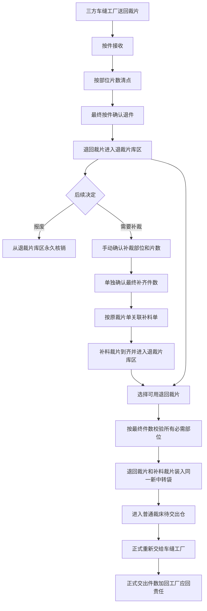

# 裁片退仓处理与菲票固定打印完整产品设计方案

> **历史版本提示（2026-08-15）**：本文中的菲票固定打印要求继续有效；裁片退仓从“补料到齐后在退仓模块重新齐套、装袋、再交出”开始的设计已经失效，现行退仓与补料口径以《裁片退仓处理与补料来源简化总体设计》v2.0 为准。

## 1. 背景

当前需要同时解决两类问题：

1. 部位菲票中，非特殊工艺菲票与特殊工艺菲票的物理尺寸不一致，且“面料 / 颜色”“唛架编号 + 铺布单号”等信息挤在同一行，现场识别困难。
2. 三方车缝工厂把裁片退回裁床后，尚缺少一条明确的接收、清点、库存隔离、报废、补料、重新齐套、重新打票和再次交出的完整业务链。

这两类问题有关联，但不能混为同一件事：菲票调整只改变打印展示和纸张规格；裁片退仓处理建立新的退仓业务闭环。既有菲票生成、普通 / 特殊工艺分类、白色 / 黄色热敏纸分流、特殊工艺承接工厂门禁、补打和手动新增等逻辑继续保留。

## 2. 目标

- 非特殊工艺部位菲票和特殊工艺部位菲票统一采用线上现行非特殊工艺菲票的 100mm × 100mm 物理规格。
- 菲票上的面料与颜色分两行展示，唛架编号与铺布单号分两行展示，并明确面料在生产现场的身份，例如“面kainA”“面kainB”“面kainA衬衣”。
- 在“裁后处理”下增加“裁片退仓处理”，承接三方车缝工厂退回裁片。
- 按“件”接收和确认退件责任，按“片”清点、入库、报废、补料和齐套，严禁两个单位互相替代。
- 退回裁片默认进入裁床待交出仓内独立的“退裁片库区”，未重新齐套前不得混入普通待交出库存。
- 支持手动选择补裁部位和片数，补裁数量不受此前清点数量上限限制，同时单独明确最终需要补齐多少件。
- 支持把仍可用的退回裁片与新补裁片重新齐套，装入同一个新中转袋后进入普通裁床待交出仓，再按既有交出动作正式交给车缝工厂。
- 旧实物菲票缺失或无法识别时，仍可快速确认部位并打印退裁片大菲票。

## 3. 非目标与保留边界

- 不改变现有部位菲票、捆条菲票的生成规则和数据来源。
- 不改变非特殊工艺、辅助工艺、特种工艺的判断口径。
- 不改变白色热敏纸与黄色热敏纸的使用规则，也不允许两种纸色的菲票混合打印。
- 不取消“特殊工艺承接工厂未明确时禁止正式打印”的门禁。
- 不把普通补打解释为“旧票作废并新建一张票”。
- 不把三方车缝工厂退仓与车缝自退、特殊工艺回仓或普通中转袋退回混为同一业务对象。
- 不新增车缝工厂侧或 PDA 侧的执行页面；本轮由裁床管理端完成退仓处理，并在现有裁床待交出仓中展示齐套结果。
- 不实现真实称重、自动视觉识别、真实打印机驱动或后台接口；原型只表达完整业务规则和必要交互。

## 4. 角色与职责

| 角色 | 主要职责 |
| --- | --- |
| 三方车缝工厂交接人 | 把本次退回裁片和现场说明交给裁床 |
| 裁床退仓员 | 按件接收、按部位片数清点、确认退件件数、快速确认部位和打印退裁片大菲票 |
| 裁床主管 | 处理差异、确认报废、决定补哪些部位和多少片、确认最终补齐件数 |
| 补料处理人 | 承接关联补料单，完成补裁并把补料裁片送回退裁片库区 |
| 裁片齐套员 | 用退回裁片和补料裁片按最终件数重新齐套，装入新中转袋 |
| 裁床交出仓管 | 在裁床待交出仓确认正式重新交出，形成新的责任增加事实 |

## 5. 核心业务对象

### 5.1 裁片退仓单

每张裁片退仓单只对应一个被冻结的来源交出事实、一个车缝任务、一个生产单、一个款式、一个颜色和一个尺码。它汇总接收记录、部位清点、退裁片库存、补料计划、新中转袋、重新交出记录和操作追溯。

### 5.2 来源责任快照

退仓开始时必须冻结原正式交出单、交出记录和放行快照。后续即使来源页面数据发生展示变化，本次退仓仍以冻结时的正式交出齐套件数为责任基数。

### 5.3 接收记录

接收记录同时保留：

- 本次确认退件数量，单位为“件”。
- 每个部位实际清点数量，单位为“片”。
- 件数与部位片数之间的差异说明。
- 来源工厂、操作人和确认时间。

### 5.4 退裁片库存批次

每批库存明确来源是“三方工厂退回”还是“补料裁片”，并记录部位、片数、已占用片数、已报废片数、库区和库位。退回裁片和补料裁片在重新齐套前都归集到退裁片库区，但来源不能丢失。

### 5.5 退仓补料计划

一个补料计划包含两类独立数量：

- 每个部位需要补裁多少片。
- 最终要补齐多少件完整裁片。

若补裁部位来自不同原裁片单，必须按原裁片单拆分成多张补料单，但这些补料单仍归属于同一个退仓补料计划。

### 5.6 重新齐套批次

重新齐套批次记录最终齐套件数、各部位使用片数、新中转袋、进入待交出仓时间以及正式交出结果。进入待交出仓与正式交出是两个不同事实。

### 5.7 退裁片大菲票

退裁片大菲票可以覆盖多个已确认部位，用于旧实物菲票缺失、损坏或难以逐票识别的场景。大菲票不依赖旧实物票仍然存在，但必须能够回到退仓单、生产单、款式、颜色、尺码、部位及各部位片数。

## 6. 数量与责任口径

### 6.1 单位边界

- “件”表示一套可由车缝工厂承担回货责任的完整裁片。
- “片”表示某个具体部位的裁片数量。
- 部位片数存在差异时，只进入库存、报废、补料和齐套处理，不反向修改已经确认的退件件数。
- 任何页面、提示和操作记录都必须带单位。

### 6.2 车缝工厂当前应回数量

车缝工厂当前应回数量计算如下：

> 当前应回件数 = 首次正式交出齐套责任件数 + 后来正式重新交出件数 − 已确认退件件数

只有两个动作会改变当前应回责任：

1. 最终确认退件：按确认的“件”数扣减。
2. 从裁床待交出仓正式重新交出：按正式交出的“件”数增加。

以下动作不得改变当前应回责任：

- 某个部位少回、多回或清点差异。
- 退裁片报废。
- 创建或完成补料。
- 退回裁片与补料裁片重新齐套。
- 齐套中转袋仅进入裁床待交出仓、尚未正式交出。

### 6.3 示例

首次正式交出齐套责任为 200 件：

1. 车缝工厂退回 12 件，部位实点为前片 12 片、后片 10 片、袖片 12 片。最终仍按 12 件确认退件，当前应回为 `200 − 12 = 188 件`；后片少 2 片作为部位差异处理。
2. 后片报废 2 片，当前应回仍为 188 件。
3. 主管决定最终补齐 15 件，并手动填写前片补 3 片、后片补 7 片、袖片补 17 片。补料数量可以高于原清点数量，因为它表达本次生产决定，不是对退回数量的复制。
4. 原退回裁片与补料裁片齐套出 15 件，装入新中转袋并进入裁床待交出仓，当前应回仍为 188 件。
5. 中转袋正式重新交给车缝工厂后，当前应回变为 `200 + 15 − 12 = 203 件`。

## 7. 目标流程

## 8. 接收、清点与确认

接收动作以一个三步工作面完成：

1. **按件接收**：录入本次现场接收件数和操作人。
2. **按部位清点**：逐个部位填写实际片数；有旧票时可辅助扫描，无旧票时按系统已知部位直接清点。
3. **最终按件确认**：系统再次提示确认后将按件扣减工厂应回责任，同时按各部位实际片数入退裁片库区。

若本次确认件数超过当前应回件数，必须阻断并要求主管处理。部位片数为零允许保存，但至少要清点到一个有数量的部位。

## 9. 退裁片库区与报废

- 退裁片库区属于裁床待交出仓的隔离库区，但未齐套裁片不是普通待交出库存。
- 退回裁片确认后立即按部位进入该库区。
- 补料完成的裁片也进入该库区，以便与原退回裁片一起齐套。
- 普通待交出中转袋不能直接混入未齐套退裁片。
- 报废必须选择部位和片数，不能超过该部位可用片数，提交前二次确认。
- 报废后永久核销对应可用片数，并保留操作人、时间、部位和数量；报废不再扣减工厂应回件数。

## 10. 补料与重新齐套

### 10.1 创建补料

- 主管可以逐部位手动填写补裁片数。
- 补裁片数不受本次退回清点片数上限限制。
- 必须单独填写最终补齐件数。
- 至少有一个部位的补裁片数大于零。
- 系统按每个部位的原裁片单拆分补料单，并在退仓单中展示关联关系。

### 10.2 补料到齐

补料完成后，补料裁片按部位和来源补料单进入退裁片库区。此时仍不能直接视为完整件，也不能增加工厂应回责任。

### 10.3 重新齐套

- 以最终补齐件数计算每个必需部位应有片数。
- 可同时使用仍可用的退回裁片和已经到齐的补料裁片。
- 任一必需部位不足时，必须阻断齐套并明确提示缺少哪个部位、需要多少片、当前有多少片。
- 齐套件数必须与最新已完成补料计划的最终补齐件数一致。
- 齐套成功后，把所用部位放入同一个新中转袋，未使用的多余裁片继续留在退裁片库区。

### 10.4 重新交出

- 新中转袋先进入普通裁床待交出仓，此时只形成待交出库存。
- 交出仓管二次确认正式交出后，形成新的交出记录。
- 只有正式交出成功，齐套件数才加回车缝工厂当前应回责任。

## 11. 菲票打印调整

### 11.1 普通与特殊工艺菲票

- 非特殊工艺部位菲票：100mm × 100mm，继续使用白色热敏纸。
- 特殊工艺部位菲票：100mm × 100mm，继续使用黄色热敏纸。
- 特殊工艺菲票可多展示特殊工艺和承接工厂信息，但不能扩大物理纸张尺寸。
- 白色和黄色热敏纸的菲票不能合并打印。
- 特殊工艺承接工厂未明确时继续禁止正式打印。

### 11.2 字段排版

- “面料 / 颜色”单元格第一行展示面料名称和现场面料身份，第二行展示颜色。
- “唛架编号 + 铺布单号”单元格第一行展示唛架编号，第二行展示铺布单号。
- 第二行可使用略小字号和较弱视觉层级，但仍需清晰可读。
- 面料身份取正式业务资料中的值，例如“面kainA”“面kainB”“面kainA衬衣”，不得根据颜色或图片臆造。

### 11.3 退裁片大菲票

- 固定采用 100mm × 100mm。
- 展示退仓单、生产单、款式、色码、面料名称与身份、来源车缝工厂、退裁片库区、大菲票号，以及本票包含的所有部位和片数。
- 二维码可定位退仓单和本票部位集合。
- 可通过扫描旧菲票号、输入部位码 / 名称或一键选择全部可用部位快速确认。
- 旧实物菲票缺失不阻断大菲票生成。

## 12. 页面设计

### 12.1 导航

“裁片退仓处理”位于“裁后处理”下，与菲票打印、中转袋和待交出仓形成相邻但独立的业务入口。

### 12.2 列表

列表展示：

- 退仓单、来源交出单和交出记录。
- 款式图、款号 / 款名、物料图、物料名称 / 身份、颜色 / 尺码。
- 来源车缝工厂、生产单和车缝任务。
- 接收状态和已确认退件件数。
- 当前应回件数及公式组成。
- 退裁片库区、待交出仓和已报废片数。
- 关联补料单、后续处理状态、最近更新时间和操作。

列表使用标准管理列表能力：分页、每页条数、列显示、列顺序、排序、冻结和按页面保存偏好；当前页和临时排序不长期保存。

### 12.3 详情

详情集中展示来源责任、数量公式、库区边界、部位库存、接收记录、补料计划、重新齐套批次以及完整操作追溯，并提供当前状态允许的动作。

### 12.4 裁床待交出仓

现有裁床待交出仓增加“退裁片库区与重新齐套待交出”区域：

- 退裁片库区只显示未齐套可用片数，并提供返回退仓单处理的入口。
- 已重新齐套的新中转袋显示件数和片数，并提供正式交出入口。
- 页面明确提示“齐套进入待交出仓不增加责任，正式交出才增加”。

## 13. 状态

### 13.1 接收状态

- 待接收
- 已接收待清点
- 已确认退件

当前原型以三步工作面一次完成接收、清点和最终确认；“已接收待清点”作为业务状态保留，不在本轮增加单独的暂存动作。

### 13.2 后续处理状态

- 待处理
- 补料中
- 待重新齐套
- 已进入待交出仓
- 已关闭

### 13.3 库存状态

- 退裁片在库
- 补料裁片到齐
- 已占用齐套
- 已报废
- 已进入待交出仓
- 已重新交出

## 14. 防错、异常与恢复

- 退件件数超过当前应回数量：阻断并提示主管处理。
- 未清点到任何部位：阻断确认。
- 报废超过可用片数：阻断并提示当前可报废片数。
- 未填写最终补齐件数或未选择任何补裁部位：阻断创建补料。
- 补料跨原裁片单：自动拆分补料单，不能把来源合并丢失。
- 补料未完成或某个必需部位不足：阻断重新齐套。
- 齐套件数与最新已完成计划不一致：阻断并要求先确认补料计划。
- 重复完成补料或重复正式交出：保持幂等，不重复增加库存或责任。
- 旧实物菲票缺失：允许按已知部位直接选择并生成大菲票。
- 图片加载失败：显示明确失败态，不用无关占位图冒充。
- 报废和正式重新交出：必须二次确认并保留追溯记录。

## 15. 图片要求

- 列表中的款式图与款号 / 款名在同一单元格，物料图与物料名称 / 编码在同一单元格。
- 每个展示的款式和物料都必须使用与对象对应的正式图片。
- 缩略图可点击查看大图，大图支持关闭按钮、遮罩和 Esc 关闭，保持比例且不超出低分辨率视口。
- 加载中和加载失败状态必须可见。

## 16. 操作追溯

至少记录以下动作：来源责任冻结、确认退件、报废退裁片、创建补料计划、补料裁片到齐、重新齐套装袋、正式重新交出、生成退裁片大菲票、打印退裁片大菲票。每条记录包含业务单号、数量和单位、操作人、时间及说明。

## 17. 验收标准

1. 普通和特殊工艺部位菲票实测物理预览均为 100mm × 100mm。
2. 白色 / 黄色纸色分流和特殊工艺承接工厂门禁保持有效。
3. 面料 / 颜色、唛架编号 / 铺布单号均分两行，面料身份可见。
4. “裁后处理”下能进入“裁片退仓处理”。
5. 列表具备标准列表、表格、分页、排序、冻结和偏好保存能力。
6. 接收以件为最终责任数量，部位以片入库，部位差异不改变确认件数。
7. 工厂应回公式能正确覆盖“退回后又补齐并重新交出”的场景。
8. 退回裁片默认进入退裁片库区，报废只核销该区片数。
9. 补裁部位和片数可手动调整且不受退回片数上限限制，最终补齐件数单独填写。
10. 跨原裁片单时生成多张关联补料单，并能在统一补料管理中查看。
11. 退回裁片与补料裁片可共同齐套到一个新中转袋；部位不足时阻断。
12. 齐套进入待交出仓不增加责任，正式交出后才增加。
13. 旧实物票缺失时能快速选择部位并生成、打印固定 100mm × 100mm 的退裁片大菲票。
14. 报废、补料、齐套、交出和打印均有可追溯操作记录。
15. 款式 / 物料图片、缩略图、大图、关闭、失败态和低分辨率均通过现场验收。
