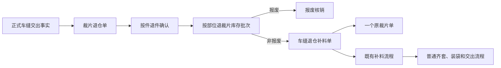
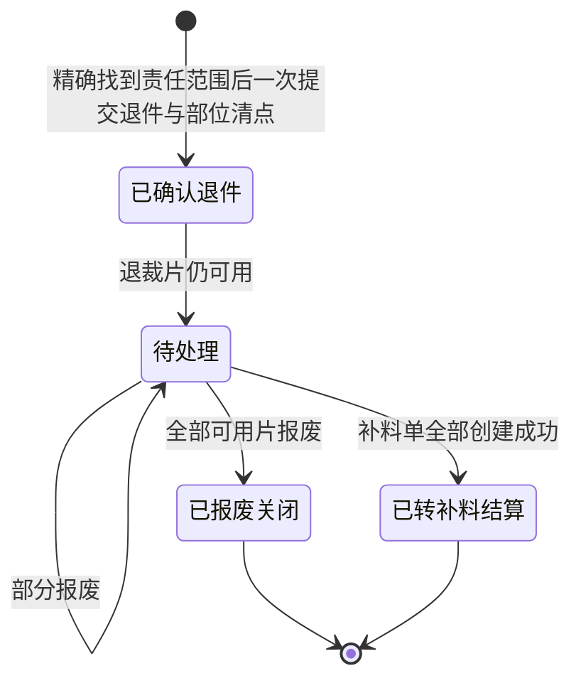

# 裁片退仓处理与补料来源简化总体设计

## 1. 文档状态

- 版本：v3.0
- 日期：2026-08-15
- 当前权威范围：三方车缝工厂裁片退仓、退裁片库区、报废、退仓补料、补料来源分类和原裁片单关联。
- 替代范围：替代《裁片退仓处理与菲票固定打印完整产品设计方案》中“补料到齐后继续在退仓模块重新齐套、装袋、正式交出”的设计。菲票固定打印部分不受本次调整影响。

## 2. 背景与目标

三方车缝工厂可能把已正式交出的齐套裁片退回裁床。现场先按件接收，再按部位和片数清点；确认后需要区分报废与非报废处理。非报废裁片后续统一进入既有补料业务，退仓模块只负责创建并关联补料单，不重复建设补料完成、齐套、装袋和交出流程。

本次目标：

1. 让裁床人员通过车缝任务单号、“生产单 + 实际承接车缝工厂”或菲票号，精确找到已正式交出的车缝任务责任范围，并一次性完成退仓发起、按件确认与按部位入库。
2. 保持“件”和“片”两套数量口径独立，正确计算车缝工厂当前应回责任。
3. 明确实物菲票证据的录入方式，允许旧票缺失或无法识别时手工确认部位。
4. 报废从退裁片库区核销；非报废创建补料单后，退仓侧立即结算。
5. 为补料单增加独立业务来源“人工发起 / 车缝退仓”，并强制绑定一个原裁片单。
6. 在补料管理和原裁片单中持续展示补料状态和退仓来源，不把后续执行塞回退仓页面。

## 3. 非目标与保留边界

- 不调整普通菲票、特殊工艺菲票、捆条菲票的既有生成、分类、纸张和打印分流。
- 不在退仓模块实现补料采购、染色、印花、物料准备、裁剪完成、齐套、装袋或正式交出。
- 不把退裁片直接视为普通待交出库存，也不在退仓页面创建中转袋。
- 不因创建退仓、报废、创建补料或补料完成而增加车缝工厂应回责任。
- 不把“补料来源类别”和“补料原因”“补料对象”“补料状态”混为一个字段。
- 原型只维护 Mock 事实和必要交互，不新增真实后端、鉴权、数据库或离线队列。

## 4. 角色与现场条件

| 角色 | 主要动作 | 责任边界 |
|---|---|---|
| 裁床退仓员 | 发起退仓、按件接收、按部位清点、录入票据证据、快速打大菲票 | 不决定后续补裁范围，不修改冻结交出事实 |
| 裁床主管 | 审核报废、手工决定补哪些部位和多少片、确认最终补多少件、创建补料单 | 报废和补料必须留痕；补料数量不受退回片数上限约束 |
| 补料处理人 | 在既有补料流程中推进物料准备与补裁 | 不回写退仓责任；退仓模块只读其状态 |
| 待交出仓人员 | 在普通流程接收后续齐套、装袋和交出对象 | 不把退裁片库区的散片直接作为可交出齐套库存 |
| 管理人员 | 查询责任、退仓、报废、补料和原裁片单关联 | 不替代现场接收证据 |

现场可能没有旧菲票，旧菲票也可能污损无法识别，因此“没有实物票”是正常业务分支，而不是异常终止条件。

## 5. 业务对象与关系

### 5.1 裁片退仓单与车缝任务责任范围

每张退仓单冻结一个精确车缝任务责任范围，至少包括车缝任务、承接工厂、生产单、颜色、尺码、来源裁片单集合、交出单、有效正式交出记录、款式、物料和部位。不得只用生产单、交出单或工厂作为唯一责任键；同一生产单按明细拆给多个车缝任务或多个工厂时，必须分开核算。创建后不得随上游页面变化而漂移。

新增退仓不展示全量责任候选，而是先精确查找：

1. 车缝任务单号：精确匹配任务。
2. 生产单 + 车缝工厂：工厂只能从该生产单已实际分配且已有有效正式交出的车缝工厂中选择；如果查到多张车缝任务，必须再选定具体任务。
3. 菲票号：通过有效正式交出记录中的历史菲票反查车缝任务；无匹配或一票匹配多个责任范围时阻断。

同一精确责任范围存在未结算退仓单时不得重复发起。缺少车缝任务级齐套责任快照、工厂确认的有效交出数量、款式图、正式物料图、原裁片单或部位来源时，结果必须阻断并说明缺失事实。

### 5.2 接收记录

接收记录同时保存：

- 最终确认退件数量，单位为“件”。
- 各原裁片单、各部位实际清点数量，单位为“片”。
- 每个部位的识别方式、实物票状态、扫描票号、操作人和时间。
- 部位差异摘要。差异只进入报废或补料判断，不反向修改确认退件件数。

### 5.3 退裁片库存批次

确认退件后，每个“原裁片单 + 部位”形成可追溯库存批次，默认库区为“退裁片库区”。批次分别记录确认片数、可用片数、已报废片数和已转补料片数。

### 5.4 补料单

补料单的业务来源独立为：

- `人工发起`：从补料管理主动新增或既有放行快照发起。
- `车缝退仓`：从裁片退仓单创建。

每张补料单必须绑定且只绑定一个原裁片单。若一张退仓单包含多个原裁片单，提交时按原裁片单原子拆分为多张补料单；任一拆单失败则全部回滚，不允许只创建一部分。

车缝退仓补料额外冻结退仓单、退仓记录、来源交出单、来源交出记录、放行快照及可复用退裁片明细。

## 6. 数量与责任口径

### 6.1 车缝工厂当前应回

`当前应回件数 = 首次正式交出齐套责任件数 + 后续普通流程正式交出件数 - 累计已确认退件件数`

规则：

- 退仓单创建不扣减。
- 最终按件确认退件时扣减一次。
- 部位多片、少片或票据缺失不再扣减。
- 报废、创建补料、补料完成都不改变应回责任。
- 只有普通交出流程形成新的正式交出事实后，才作为“后续正式交出”增加责任。
- 同一正式交出范围的多张历史退仓按累计已确认退件计算，不能只看当前退仓单。
- 本次退件不得超过该精确任务责任范围的当前应回；已有未结算旧退仓占用时先扣减占用量。

### 6.2 部位可退片数上限

每个“原裁片单 + 部位”的本次可退上限独立计算：

`本次部位可退片数 = 该车缝任务范围工厂已有效接收的部位片数 - 历史已确认退回片数 - 未结算旧退仓占用片数`

以工厂有效接收回写数量为准；已交出但尚未由工厂接收、已取消或待提交的记录不可作为可退上限。任一部位输入超上限时阻断整单提交。件数与部位片数互不推导：合计片数与退件数不一致时只提示差异，不代替上限校验。

### 6.3 退裁片库存守恒

对每个原裁片单和部位：

`已确认退回片数 = 当前可用片数 + 已报废片数 + 已转补料片数`

禁止负库存、超量报废、重复转补料或结算后再次处理。

### 6.4 补料数量

- “新补裁片数”由主管按部位手工输入，不受本次退回片数限制。
- “最终补多少件”单独必填，为正整数，不从部位片数自动猜测。
- 每个仍有可用退裁片的原裁片单至少存在一条正数补裁部位；否则应先把该原裁片单下剩余裁片全部报废。
- 可复用退裁片数量只作为冻结参考，不等于新补裁数量，也不自动合并进补裁数量。

## 7. 实物菲票证据规则

“系统是否存在历史菲票号”和“本次实物票是否在场”是两个事实：

1. 扫描旧菲票：只有票号与冻结来源完全匹配且未被其他退仓重复使用，才记录为“实物票在场且已扫码”。
2. 未带实物票：记录为“票据缺失 + 手动选部位”，扫描票号必须为空。
3. 票据不可识别：记录为“无法识别 + 手动选部位”，扫描票号必须为空。
4. 扫错来源、重复扫描、扫码模式没有票号、手动模式残留票号均必须阻断。
5. 校验失败时保留现场已输入的件数、部位片数和证据选择，便于纠正，不整页重置。

## 8. 目标流程与状态

退仓模块结算后只展示补料单号和补料单当前状态。补料完成与否不重新打开退仓单，也不改变其结算结果。

## 9. 页面与动作

### 9.1 菜单与列表

- “裁后处理”下展示带图标的“裁片退仓处理”。
- 页面标题行最右侧提供“新增退仓”主动作；“查看退裁片库区”为次要动作，不得将主动作排在标题与右侧动作之间。
- 管理列表使用统一列表骨架、标准表格和标准分页，支持搜索、接收状态、后续处理筛选、排序、列设置、冻结和按路由保存偏好。
- 列表展示退仓单、款式与正式物料图、来源工厂、接收清点、当前应回、退裁片库存、补料关联、处理状态、更新时间和操作。

### 9.2 发起退仓

发起抽屉依次展示“找到车缝任务 → 确认任务和冻结来源 → 录入退件与部位片数 → 确认并入退裁片库区”。不展示无搜索条件的全量候选。

选定责任范围后展示款式图、物料图、生产单、车缝任务、工厂、交出单/记录、颜色尺码、原裁片单、当前应回件数以及每个部位的有效交出、已退和本次可退片数。操作人录入本次退件数和各部位片数/票据证据后，系统原子创建退仓单、确认退件并将部位片数入退裁片库区；任一校验失败时不得留下空的“待接收”退仓单。

### 9.3 历史待接收单兼容

新发起流程不再创建空的“待接收”单。已存在的历史“待接收”退仓单仍保留“接收清点”兼容入口，但必须按新的件数和部位片数上限校验。

### 9.4 报废

按“原裁片单 + 部位”选择可用库存，输入报废片数和必填原因，二次确认后核销。全部核销时自动以“已报废关闭”结算。

### 9.5 创建补料并结算

手工填写各部位新补裁片数和最终补件数。提交后按原裁片单拆单，来源为“车缝退仓”，退裁片可用库存整体转为“已转补料”，退仓单立即结算。页面只保留补料状态联查。

### 9.6 补料管理与原裁片单

- 补料列表新增“业务来源”筛选和标准列，支持人工发起与车缝退仓。
- 补料详情展示业务来源；车缝退仓补料额外展示退仓单、来源交出、原裁片单和可复用裁片快照。
- 原裁片单行和详情使用“人工补料 / 车缝退仓补料”标签区分，可打开对应补料详情。
- 同一原裁片单允许多次补料，按补料次数和状态分别展示，不得覆盖历史记录。

### 9.7 裁床仓库

“退裁片库区”作为独立区域展示在库、已转补料和已报废数量，并可回到退仓单。该区与普通待交出中转袋严格分离，不直接产生待交出库存。

## 10. 退裁片大菲票

- 旧实物菲票缺失时可扫描历史票号、输入原裁片单/部位码/部位名或一键选择全部可用部位。
- 大菲票记录退仓单、生产单、款式、色码、面料及物料身份、来源工厂、所选部位片数、制票人和二维码。
- 纸张固定为 100mm × 100mm，二维码使用真实二维码渲染，支持打印。
- 生成大菲票只解决退裁片识别，不代表旧票作废，也不触发补料或交出。

## 11. 图片与防错

- 款式和每一种物料使用对象对应的真实效果图或正式物料图，与名称/编号同一信息块展示。
- 缩略图可打开大图，支持关闭、遮罩和 Esc；图片保持比例且不溢出。
- 加载中与失败态可见，失败时显示对象说明，不以色块或无关图片冒充。
- 责任超量、重复发起、扫描错票、重复票、缺少报废原因、超库存报废、零补料、重复结算均阻断并保留可纠正入口。

## 12. 兼容与迁移

- 旧退仓原型存储读取时迁移到新结构；历史已走到重新齐套或再交出的记录只作为冻结历史事实展示，不再提供旧动作。
- 既有补料记录默认归类为“人工发起”，不改变原编号、状态和物料执行事实。
- 新增来源字段后，所有新补料写入都必须显式给出业务来源。
- 旧“补料到齐、重新齐套装袋、正式重新交出”入口和事件不得继续出现在当前退仓页面、仓区或可执行契约中。

## 13. 验收场景

### 13.1 正常场景

操作人输入车缝任务 `ST-260324-001`，系统找到生产单、工厂、色码、原裁片单和有效交出记录。该范围首次责任 200 件，历史已确认退件 12 件，当前可退 188 件；前片有效交出 60 片、历史已退 12 片，当前可退 48 片。操作人新退 2 件，前片扫码 2 片，后片票据无法识别并手工录入 2 片。系统一次确认后创建退仓单、显示当前应回 186 件并将退片入退裁片库区。后续大菲票、报废和补料流程保持不变。

### 13.2 边界场景

- 候选缺少正式交出或真实图片：禁止发起并显示原因。
- 生产单同时拆给多个车缝任务：选工厂后仍显示任务结果，未选定具体任务不能提交。
- 菲票号能找到系统历史，但本次实物票不在场：只用于查找任务，不自动将部位证据标为“有实物票”。
- 交出记录尚未由工厂有效接收：不得用于计算可退部位片数。
- 本次退件超当前应回，或任一部位超当前可退片数：阻断整单并保留输入。
- 同一来源已有未结算退仓：禁止重复发起。
- 错票或票号已使用：禁止确认，保留已填写数量。
- 部位清点合计与退件件数不一致：允许确认并展示差异，不改变件数。
- 报废超过可用片数或缺少原因：禁止提交。
- 一张退仓涉及两个原裁片单：按两个原裁片单原子拆单，任一失败全部回滚。
- 已结算后再次接收、报废或创建补料：禁止操作。

## 14. 产品确认边界

当前版本可由研发和测试按本文件验收。是否进入生产开发、真实数据接口、权限和后续普通补料/交出流程改造，需另行立项确认。

## 15. 2026-08-15 补充回归口径

### 15.1 裁床接收旧数据迁移

- PO0002 等旧 Store 在补齐种子配料、接收会话和节点快照后，必须恢复当前真实待领节点，不能只保留历史“新增补料待领”结论却丢失当前承载节点。
- 补料单继续保留独立补料需求身份；已经确认到仓的补料物料按原生产单裁床配料单进入当前物理待领节点，仍以补料需求行精确区分，不得按相同 SKU 借用正常需求库存。
- 尚未确认到仓的补料继续形成独立中转仓需求组，不得伪造可领数量、库位或 PDA 活动节点。

### 15.2 染色旧补料数据兼容

- 染色工作流检查与页面演示从当前补料草稿事实读取来源类别和印染需求，不再假设补料生命周期记录中仍存在已移除的 `draft` 嵌套对象。
- 染色加工单列表的分页、排序和筛选由列表控制器局部处理，切换每页条数不得触发主内容区整页重绘。
- 染色派生只按目标任务或交出单读取所需交接事实，保持原有返回顺序和对象语义，避免为一次查询重复克隆全部交接单。

以上两项是兼容与回归修复，不改变退仓责任、补料来源、染色工艺或交接业务规则；合并任务二维码等其它既存基线问题不在本补充范围内。
