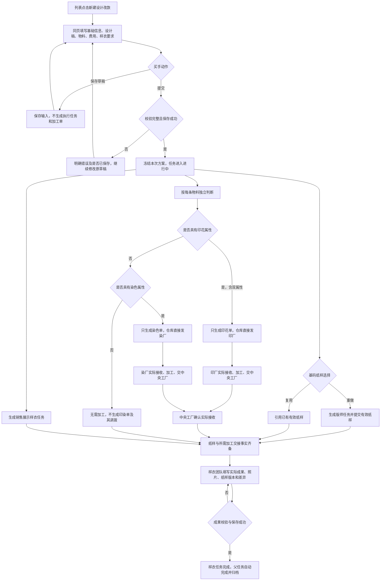
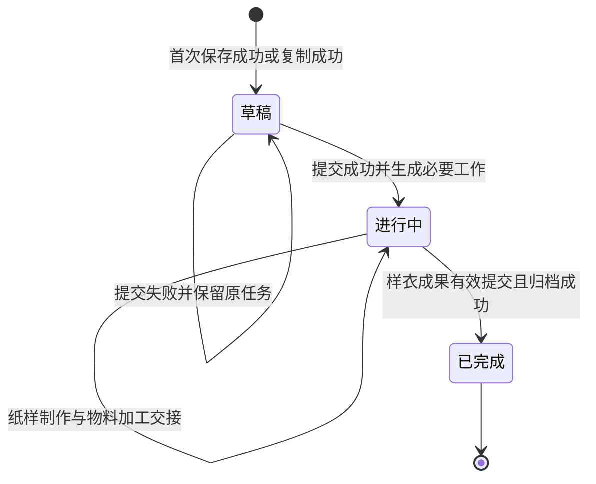
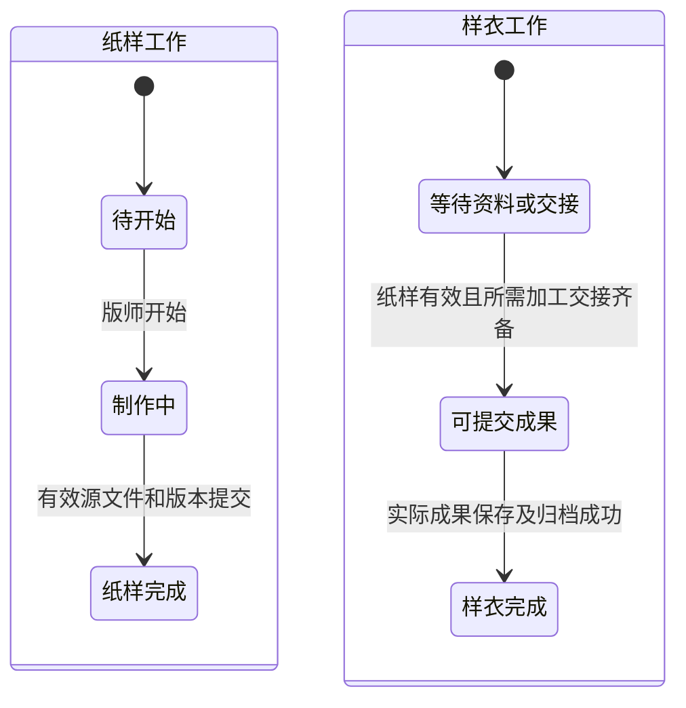
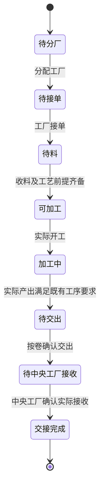
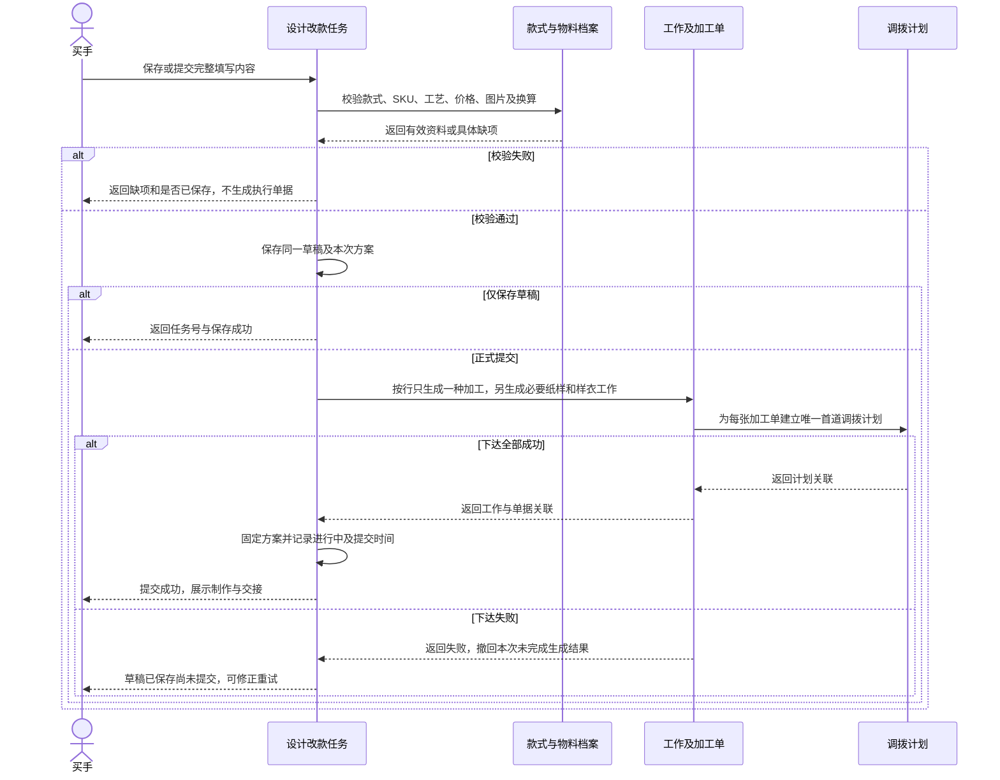
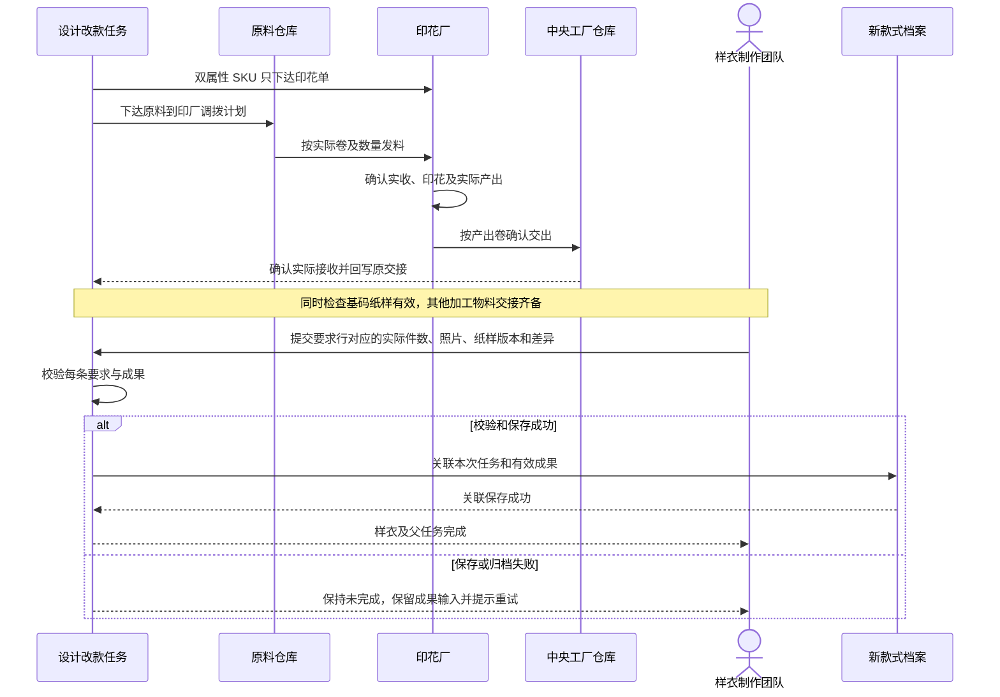

# 设计改款任务产品功能说明

> **版本：V1.1 · 研发交付版**
>
> **日期：2026-09-24**
>
> **适用模块：商品中心系统（PCS）／生产准备管理／设计改款任务**
>
> **用途：产品、研发、测试、实施人员共同使用的完整功能基线。**

本文说明设计改款任务当前版本的业务逻辑、页面功能、字段、操作规则和团队协作流程，供产品、研发和测试共同使用。覆盖买手填写、复制与修改、任务下达、物料加工、实物交接、样衣制作及成果归档。

---

## 目录

1. [目标、范围与核心规则](#1-目标范围与核心规则)
2. [术语与业务对象](#2-术语与业务对象)
3. [角色及操作权限](#3-角色及操作权限)
4. [上游准备与数据来源](#4-上游准备与数据来源)
5. [端到端业务流程](#5-端到端业务流程)
6. [列表页](#6-列表页)
7. [新建及草稿填写页](#7-新建及草稿填写页)
8. [物料、加工判定与费用计算](#8-物料加工判定与费用计算)
9. [保存、提交及失败恢复](#9-保存提交及失败恢复)
10. [制作与交接详情](#10-制作与交接详情)
11. [基码纸样与销售展示样衣](#11-基码纸样与销售展示样衣)
12. [加工单、调拨、收发及打印](#12-加工单调拨收发及打印)
13. [状态模型与时序](#13-状态模型与时序)
14. [批量复制与附件](#14-批量复制与附件)
15. [异常、防错与追溯](#15-异常防错与追溯)
16. [交互与非功能要求](#16-交互与非功能要求)
17. [研发功能分工](#17-研发功能分工)

## 1. 目标、范围与核心规则

### 1.1 业务目标

买手围绕一个已建档的新款式，一次填写改款要求、设计稿、物料、费用和样衣制作要求。提交后自动生成必要的基码纸样任务、物料加工单及销售展示样衣任务，各团队按实际工作和收发事实推进，最终由中央工厂提交样衣成果，自动完成设计改款任务并关联新款式档案。

### 1.2 本期范围

- 设计改款列表、筛选、统计、分页、导出、列设置及批量复制。
- 同页新建、保存草稿、继续编辑、提交任务、制作与交接详情。
- 已建档原／新款式选择、设计稿管理、基码纸样重做或复用。
- 物料 SKU 搜索、自动加工判定、单位用量、费用与综合成本。
- 设计改款来源的染色／印花加工单、仓库发料、加工厂接收／加工／交出、中央工厂接收。
- 销售展示样衣要求、实际成果、差异说明、完成和归档。

### 1.3 明确排除

- 不在设计改款中生成花型任务、调色任务、线上花型／调色审核。
- 不增加专业返工支线、买手样衣成果审核或整张任务最终确认。
- 不创建临时新 SPU，不在此页面维护款式或物料主档。
- 不将染色／印花加工单误称为“花型任务／调色任务”。
- 不修改普通生产、备货、补料等其他加工单来源的规则。
- 不照搬老系统尚无数据来源的加急、同款 SPU、寄样地址、打板区域等条件。
- 不自动建立采购、付款、结算、正式生产单或完整库存调整流程。

### 1.4 核心业务规则

1. “新建设计改款”直接进入完整填写页，不先弹出基础信息建单窗口。
2. 打开页面不创建记录；保存草稿或提交时才持久保存。
3. 统一使用 **原款式（SPU）**、**新款式（SPU）**，原款可选，新款必选，两者不能相同。
4. 基码纸样需要重做才生成制作任务；复用时引用已有合格文件。
5. 加工方式由目标物料 SKU 决定，买手不能手工修改为与 SKU 不一致的组合。
6. **同一物料行只能染色、印花或不加工。SKU 同时具备染色和印花属性时，仅印花，通过印花实现目标颜色。**
7. **互斥规则按物料行执行。** 同一任务的 A 物料仅染色、B 物料仅印花时，允许分别生成染单和印单。
8. 本期物料损耗率固定为 0；计划量、实发、实收、产出和交出量分别记录。
9. 销售展示样衣提交成功后，自动完成父任务并归档，不再等待买手点击确认。

## 2. 术语与业务对象

| 对象 | 定义 | 关系与边界 |
| --- | --- | --- |
| 设计改款任务 | 买手发起的一次新款式改款与展示样衣制作需求 | 一张任务对应一个新 SPU，可关联一个原 SPU；同一新 SPU 可存在不同任务，不能仅按 SPU 判定重复提交 |
| 原款式（SPU） | 本次参考的已有款式 | 可不选；其买手、图片等来自款式档案 |
| 新款式（SPU） | 本次产出的已建档款式 | 不是在任务中创建的新档案；不得等同原款 |
| 设计稿 | 买手描述新款式目标的图片附件 | 区别于物料花型图、纸样文件和实际样衣照片 |
| 物料方案／BOM | 本任务使用的物料明细及其数量依据 | 有版本与稳定行标识；按整款维护方案，不额外要求买手维护颜色映射 |
| 目标物料 SKU | 样衣最终需要使用的物料规格 | 工艺、颜色、花型等来自档案，不从编码文本猜测 |
| 发料 SKU | 需加工物料的加工前输入物料 | 与目标 SKU 归属同一物料档案；无需加工时使用所选 SKU |
| 基码纸样 | 制作样衣所使用的正式纸样成果 | 重做任务产出或已有版本引用，必须能追溯文件与版本 |
| 加工单 | 染色或印花的实际执行单据 | 可追溯任务、BOM 版本／行、输入／目标 SKU；同一行至多一种加工 |
| 调拨／交出／接收 | 实物从仓库到加工厂、从加工厂到中央工厂的交接记录 | 计划与实际分开；按卷／批次／数量及单位追溯 |
| 样衣要求行 | 买手下达的一组颜色、尺码、件数和制作要求 | 一张任务可有多行 |
| 样衣成果行 | 实际制作的颜色、尺码、件数、照片与纸样版本 | 每行必须关联一条样衣要求；一条要求可有多个实际成果行 |
| 中央工厂 | 最终接收加工物料并制作展示样衣的组织 | 组织和收货库位分别维护，不能混用 |

**稳定关系：** 任务 → BOM 版本 → 物料行 → 加工单 → 调拨／交出／接收；任务 → 基码纸样／样衣任务 → 成果 → 新款式档案。每个关联应保留原始标识，不能依靠名称模糊匹配。

## 3. 角色及操作权限

| 角色 | 可以执行 | 限制 |
| --- | --- | --- |
| 买手 | 新建、维护本人草稿、选款式／SKU、上传设计稿、填费用／要求、提交、复制、查看进度 | 提交后不直接覆盖已下达的方案或他人的草稿，不代替工厂确认实物 |
| 管理员 | 按授权维护任务、处理失败恢复和数据问题 | 代操作须记录真实操作人，不能冒用买手／工厂身份制造完成事实 |
| 版师 | 查看纸样任务、开始制作、提交纸样版本／说明／文件 | 不能修改买手的目标款式、物料和费用 |
| 计划／PPIC | 分配染厂或印花厂、查看计划与交接、按既有加工单规则完单 | 分厂不等于工厂接单、发料或实收 |
| 面料／辅料仓管 | 核对来源、按实际数量与卷码发料 | 不得把计划量自动写成实发量，不能重复扣发 |
| 加工厂主管／员工 | 接单、确认实际收料、执行相应工序、维护实际产出 | 不可跳过接单和实收前提；仅操作所属工厂任务 |
| 加工厂仓管 | 选择产出卷、建交出单、扫描核对、确认交出 | 交出对象和去向须明确，不能仅填总量替代实际卷明细 |
| 中央工厂仓管 | 按来源单据确认实际接收 | 收到多少记多少，不能以计划数替代 |
| 中央工厂样衣团队 | 查看要求、选已完成纸样版本、填实际成果和差异、提交样衣 | 未具备纸样／加工交接事实或缺必要成果时不能提交 |
| 跟单／管理查看角色 | 查看、筛选、导出权限范围内的任务及关联单据 | 可见范围与具体操作权限分开控制 |

操作权限按登录身份及组织授权判定；买手维护本人草稿，管理员代操作记录实际身份。

## 4. 上游准备与数据来源

| 数据 | 权威来源 | 设计改款中的使用方式 |
| --- | --- | --- |
| 原／新 SPU、款名、款图、品牌、品类 | 款式档案 | 搜索选择后展示；不在本任务重复维护 |
| 原款式买手 | 原款档案的立项负责人 | 无记录时显示“未记录”，不拿本任务买手补值 |
| 新款式买手 | 本任务买手身份 | 列表与详情保持一致；管理员代操作需保留添加人 |
| SKU 编码、物料、图片、颜色、潘通、花型及花型图 | 物料 SKU 及物料档案 | 选择后读取，正式提交冻结本次加工依据 |
| 标准单价、计价单位、单位换算 | 物料档案及计价资料 | 自动计算，失效或缺失时提示维护资料 |
| 汇率 | 系统汇率配置 | 以“1 CNY = R IDR”展示，任务页不可任意改汇率 |
| 已有纸样 | 已完成任务／正式纸样文件，或本次合法上传 | 引用明确版本；不靠手输版本名称替代文件 |
| 工厂、收货组织和库位 | 组织及仓储配置 | 分厂／接收时读取，不能凭名称推断库位 |
| 执行时间、负责人及收发数量 | 实际任务与单据操作记录 | 列表直接汇总，不由用户在列表重复填写 |

提交时应保存本次使用的目标 SKU 加工属性、输入 SKU、花型／颜色信息、数量口径和计算依据。后续档案变更不能悄悄改变已下达加工单。成本展示须明确标准单价和汇率，供买手核对本次费用。

## 5. 端到端业务流程

图中纸样与材料工作可以并行；每张任务只走实际适用的材料分支。没有加工物料时不等待不存在的加工单。不存在染厂向印厂转交同一行物料的新建路径。

## 6. 列表页

### 6.1 页面结构

按“标题及新建按钮 → 查询卡片 → 统计卡片 → 列表卡片与批量操作 → 分页”排列。标题为“设计改款任务”，右上角为“新建设计改款”。无工厂切换 Tab。

### 6.2 查询条件

| 层级 | 条件 | 查询规则／选项 |
| --- | --- | --- |
| 默认 | 综合查询 | 任务号、原／新 SPU、买手、加工单号；支持粘贴，忽略首尾空格 |
| 默认 | 任务状态 | 全部、草稿、进行中、已完成 |
| 默认 | 当前团队 | 当前需要处理工作的团队；多团队并行时命中任一团队即可 |
| 更多 | 基码纸样 | 全部、需要制作、复用纸样 |
| 更多 | 染印组合 | 全部、无需印染、仅染色、仅印花、含染色和印花物料；最后一项指不同物料行，不表示同一行双加工 |
| 更多 | 原款式（SPU）、新款式（SPU） | 分别按编码查询 |
| 更多 | 原款式买手、新款式买手、添加人 | 分别查询，不混成同一字段 |
| 更多 | 纸样上传人／版师 | 使用实际纸样上传人；未分配版师不得伪造负责人 |
| 更多 | 品牌、款式品类 | 新款式档案的实际值 |
| 更多 | 是否上传纸样 | 全部、是、否；复用的有效纸样同样属于有纸样 |
| 更多 | 是否创建染色单、是否创建印花单 | 全部、是、否；按真实关联单据判断，不按 SKU 能力猜测 |
| 更多 | 时间类型 | 添加时间、完成时间、上传纸样时间 |
| 更多 | 开始日期、结束日期 | 可单边筛选；双边含起止日期；开始晚于结束时阻断查询；选定时间不存在的记录不命中日期范围 |

- 多条件取交集，综合查询内部按任一匹配字段命中。
- 展开更多后，条件在同一网格连续排列，上一行排满后再换行；不得在默认条件右侧留整块空位。
- 查询同时刷新列表、统计和总条数；收起更多不清除已填写条件。
- 重置清除全部查询条件，恢复完整结果并回到第一页。
- 导出全部匹配记录，不仅当前页，不含勾选和操作列；空结果提示无可导出数据。
- 统计展示查询结果总数、草稿、进行中、已完成，口径与查询结果一致。

### 6.3 列字段及布局

| 顺序 | 列 | 必须展示内容 |
| --- | --- | --- |
| 1 | 勾选 | 行选择，与已选数量同步 |
| 2 | 任务号 | 唯一编号，可进入详情 |
| 3 | 状态 | 独立一列，不能塞回款式列 |
| 4 | 原款式 → 新款式 | 原／新款图及编码、款名、设计稿缩略图、原款式买手、新款式买手、添加人、品牌名、添加时间、完成时间 |
| 5 | 物料与费用 | 物料、费用、合计三个部分，以浅色横线分隔 |
| 6 | 基码纸样 | 重做／复用、任务或版本链接、状态、负责人／团队、计划完成及实际开始／提交／完成时间、纸样上传情况、上传人和上传时间 |
| 7 | 染色加工单 | 每张单据的单号、状态、工厂、下单时间、计划／完成／交出／确认接收量及单位、完成时间 |
| 8 | 印花加工单 | 与染色单一致的独立单据摘要 |
| 9 | 销售展示样衣 | 任务号、要求与已交件数、状态／等待原因、负责人／团队、计划完成及实际开始／提交／完成时间 |
| 10 | 操作 | 查看详情；固定在表格右侧 |

展示限制：

- 不再设置独立的“当前需处理的团队”“工作项／负责团队”“时间”三列，信息归入实际工作列。
- 款式组合列不显示“更新”“工作下达”“设计稿上传”三类时间；品牌只显示品牌名，不拼接品类。
- 染色／印花单据用普通列内容呈现，不套边框卡片、折叠框。
- 多张单据逐张展示或明确下钻，不能丢失单号；不同物料和单位不得相加为一个无单位总量。
- “无需加工”“提交后生成”“未关联加工单”分别使用，不能混用。
- 物料部分一行一物料：实图、名称／SKU、计划用量及单位、标准单价、小计；费用部分一行一费用：名称、金额、可选备注；合计展示物料总额、费用总额、综合成本。
- 演示数据应有多行物料和费用；真实任务不得为视觉效果自动补写物料。

分页提供 10／20／50 条，显示当前页与总数。支持列显示、顺序、排序、冻结；关键识别列不可隐藏，普通冻结列在左，操作列在右。列配置和每页条数按页面保存，页码和排序不长期保存。宽表只在表格容器内部滚动。

## 7. 新建及草稿填写页

### 7.1 页面层级

两步展示：**① 填写并提交任务 → ② 制作与交接**。未提交时第二步不可办理。

第一步仅有以下四个业务分区的浅色线框：

1. 基本信息与设计稿。
2. 物料与加工要求。
3. 费用与综合成本。
4. 销售展示样衣制作安排。

不增加“第一步：确认本次方案”重复标题，不再为物料与费用共同套一层外框，底部操作区不套装饰边框。底部提供“保存草稿”“提交任务并生成工作”，长页面时保持可访问且不遮挡最后一行表单。

### 7.2 基本信息

| 字段 | 类型／来源 | 保存草稿 | 正式提交 | 规则 |
| --- | --- | --- | --- | --- |
| 原款式（SPU） | 搜索下拉／档案 | 可空 | 可空 | 非空必须有效且不同于新款 |
| 新款式（SPU） | 搜索下拉／档案 | 必填 | 必填 | 必须已建档，不允许临时手输 SPU |
| 买手 | 登录身份只读 | 自动 | 自动 | 不由用户任意改为他人 |
| 基码纸样 | 重做／复用 | 默认重做 | 必选 | 复用需要明确文件；缺文件可先保留草稿，提交阻断 |
| 本次设计改款要求 | 多行文本 | 必填 | 必填 | 去首尾空格，不能仅空白 |
| 设计稿 | 多图片上传 | 至少一张保存成功 | 至少一张保存成功 | 与物料花型图区分，图片类型及大小见第 14 章 |
| 复用纸样 | 已有版本选择／本地文件 | 可暂缺 | 复用时必填 | 至少包含有效 `.prj`；明确来源任务、版本及文件 |

上表明确草稿的最小保存条件；“允许保存草稿”不等于允许创建无新款、无设计稿、无要求的空记录。

### 7.3 三类搜索下拉的统一交互

适用于原款、新款和每行物料 SKU：

- 点击后显示搜索输入与候选列表，可直接粘贴完整编码，也可输入部分编码或名称。
- 忽略编码大小写及首尾空格；不擅自改写编码中间字符。
- 候选显示编码和名称；物料候选以中文展示有效加工方式，不显示英文工艺串。
- 只有明确选择候选才改变已选对象，搜索、清空关键字、取消或无结果均不得误改原值。
- 无结果明确提示核对编码／名称；按 Esc 或点击外部关闭；再次打开可重新检索。
- 选择后展示对象对应图片及标识；物料选择器起点固定，花型图和说明位于其下方，不把选择框挤向右侧。
- 搜索仅更新候选区域，不能整页刷新、丢失已填内容或跳回页首。

### 7.4 物料与费用填写

物料明细字段见第 8 章；“新增物料”添加一行可编辑物料，不生成加工单。“删除”仅移除当前草稿的该行，并重新计算金额，不应影响其他行。

费用可新增多行、修改、删除；每行包括费用名称、IDR 金额、备注。无费用明细按“本次无自定义费用”处理，不强迫填写一条 0 元费用。金额大于 0，有金额必须有名称；费用总额不得重复乘样衣件数。

### 7.5 样衣制作安排

| 字段 | 规则 |
| --- | --- |
| 颜色 | 必填文本，整款可填“整款”；不是线上调色需求 |
| 尺码 | 必填，当前默认 M，可修改 |
| 数量 | 件，大于 0 的整数；默认 1 |
| 制作要求 | 可选，说明工艺、外观或注意事项 |

支持增加、删除颜色／尺码行；至少保留一条有效要求。当前物料单件用量按全部要求行的总件数计算。不同颜色／尺码使用不同物料子集或不同单耗不在本期编辑能力内。

## 8. 物料、加工判定与费用计算

### 8.1 物料字段

| 字段 | 是否可改 | 规则 |
| --- | --- | --- |
| 目标物料 SKU | 草稿可选 | 有效 SKU、所属物料有效、标准单价有效、已维护设计改款加工属性 |
| 实图、名称、编码 | 只读 | 与 SKU 同一信息块，图片可放大 |
| 单位用量 | 可填 | 有限且大于 0，支持小数 |
| 用量单位 | 可填／默认带出 | 默认 SKU 计价单位，不同单位必须有有效换算 |
| 数量口径 | 单件用量／整单总量 | 显式选择，禁止重复乘样衣件数 |
| 损耗率 | 固定 0 | 只读显示，不开放修改 |
| 染色、印花 | 自动、只读 | 按下表计算；不允许同时为“是” |
| 颜色／潘通号 | 档案带出 | 染色必须具备；印花可保留目标颜色说明但不因此额外生成染单 |
| 花型编号／花型图 | 档案带出 | 印花必须具备，图可放大 |
| 标准单价 | 只读 | CNY／计价单位，有效且大于 0；显示四位小数 |
| 计划用量／物料小计 | 自动 | 显示计算依据和单位 |
| 说明 | 可选 | 不得通过备注覆盖自动加工判定 |

### 8.2 每行加工决策表

| SKU 有染色属性 | SKU 有印花属性 | 染色显示 | 印花显示 | 生成及物流 |
| --- | --- | --- | --- | --- |
| 否 | 否 | 否 | 否 | 不生成加工单及其调拨 |
| 是 | 否 | 是 | 否 | 一张染单；仓库 → 染厂 → 中央工厂 |
| 否 | 是 | 否 | 是 | 一张印单；仓库 → 印厂 → 中央工厂 |
| 是 | 是 | 否 | 是 | **一张印单**；仓库 → 印厂 → 中央工厂，无染色前序 |

加工属性“未维护”不等于“无需加工”，提交时阻断。双属性仅印花时不要求染后中间品 SKU；需要有效的同物料发料 SKU 和目标印花 SKU。

**多行例子：** A 行纯染、B 行双属性、C 行无加工 → A 一张染单、B 一张印单、C 无单。A、B 互不成为前序，可以并行。按任务＋BOM 版本＋行＋加工方式识别唯一生成结果，重复提交不得重复建单。

### 8.3 数量公式

设 `N` 为全部样衣要求件数之和，`Uᵢ` 为第 i 行输入用量，`Kᵢ` 为用量单位转计价单位的系数：

- 单件用量：`Qᵢ = Uᵢ × N × Kᵢ`。
- 整单总量：`Qᵢ = Uᵢ × Kᵢ`。
- 损耗固定为 0，不额外乘备料系数。
- 同单位 `Kᵢ = 1`；米转 Yard 为 `1 / 0.9144`，Yard 转米为 `0.9144`；其他换算读取已维护关系，不从名称推测。
- 计划量展示四位小数；生成加工单前按加工单允许单位转换，并保留转换依据。
- 件数为整数；米、Yard、重量等按相应物料单位计量，PCS 辅料与 Yard 面料不能合并数量。
- 基码任务不再重复增加一份物料需求。

### 8.4 金额与汇率

设 `Pᵢ` 为标准单价 CNY／计价单位，`F` 为费用合计 IDR，`R` 为系统汇率 IDR／CNY：

- 行材料成本：`Qᵢ × Pᵢ`，展示两位小数 CNY。
- 材料总成本 `M = Σ(Qᵢ × Pᵢ)`；内部保留计算精度，合计展示时四舍五入。
- 综合成本 CNY：`M + F / R`，展示两位小数。
- 综合成本 IDR：`M × R + F`，展示整数。
- 此处是**本次全部样衣的任务成本**，不是单件销售价、采购结算价或已支付金额。
- 汇率必须大于 0；缺失时阻断需要汇总换算的正式提交。不能把示例汇率 2,200 硬编码为永久规则。
- 由于行小计和总计取整层级不同，可能出现分位差异，不能重复对已取整金额进行换算。

**可复核例子：** N=3 件；棉布单件 2 Yard、单价 ¥6.38，得到 6 Yard、¥38.28；橡筋整单 3 米、单价 ¥0.82，得到 3 米、¥2.46；费用 Rp 11,000，R=2,200。材料合计 ¥40.74；综合成本 **¥45.74／Rp 100,628**。整单橡筋不能再乘 3 件，费用也不能乘 3。

## 9. 保存、提交及失败恢复

### 9.1 保存草稿

- 首次保存创建唯一任务号；后续保存更新同一草稿。
- 保存基本信息、已保存附件引用、物料、费用和样衣要求，不生成专业工作、加工单或调拨。
- 物料和费用可以尚未齐备；已填写的数量、单位、费用和附件必须合法，不能把非法数值当作“草稿可缺项”放行。
- 存在物料时，需要有效样衣件数以完成用量校验。复用纸样允许暂缺文件，但提交前必须齐备。
- 刷新后可恢复成功保存的数据；保存失败保留当前输入并明确“未保存”。

### 9.2 正式提交校验清单

1. 操作人有权限，任务为可提交草稿；原／新款有效且不相同。
2. 新款已建档、改款要求非空、设计稿已真实保存。
3. 重做／复用选择有效；复用时有已保存 `.prj`。
4. 至少一条有效物料；标准单价、单位换算、正用量、样衣数量和 0 损耗通过校验。
5. SKU 加工属性及发料 SKU 完整；染色具有颜色与潘通，印花具有花型编号与正式图片。
6. 费用信息完整或明确无费用，综合成本可计算。
7. 至少一条完整样衣要求，件数为正整数。
8. 中央工厂及接收配置有效，所生成工作有明确归属。

### 9.3 提交成功结果

- 冻结本次物料及加工依据，父任务进入进行中。
- 重做纸样时生成一项基码纸样任务；复用时不生成重复纸样任务。
- 生成一项销售展示样衣任务，包含全部要求行。
- 按每行判定生成染单或印单，以及对应仓库到加工厂的调拨计划。
- 记录提交人、提交时间、关联单号及操作日志；返回制作与交接步骤。
- 图纸和物料方案不再直接修改，不增加一条独立“买手确认”步骤。

### 9.4 失败与幂等

- 直接提交时若草稿保存成功、下达失败，显示“草稿已保存，尚未提交：具体原因”，保留该任务号并留在原草稿。
- 不能出现页面报错但实际多生成一套订单、只锁定方案却没有可恢复入口，或父任务进行中但子项全丢失。
- 同一提交的重复点击、请求重试和刷新必须返回既有结果，不重新建任务／单据。
- 批量复制以每张源任务为独立处理单元；一张失败不能撤销其他已成功的新草稿。
- 容量不足、上传失败或保存失败不能提示清空业务数据作为常规恢复方式；先保留输入和原记录，指出是否产生新任务及可重试方式。

## 10. 制作与交接详情

顶部展示任务号、独立状态、买手、改款要求、原／新款式图片及编码、设计稿当前版本和返回列表。显示当前步骤与需处理团队；**详情允许摘要显示团队，列表不再单独增加团队列。**

第二步按实际工作组织：基码纸样、染色加工单、印花加工单、销售展示样衣。每项展示状态、责任方、计划完成时间（有记录才显示）、实际时间和可执行动作。工作可并行，不得因为界面从左到右排列而错误地串行阻塞。

- 基码纸样：打开任务，查看源文件／版本及完成结果。
- 染／印单：打开相应加工详情，查看输入和目标 SKU、工厂、数量、调拨、加工、交出、中央工厂接收。
- 样衣：查看要求和已交成果，展示缺纸样或缺实物交接的具体原因。
- 操作记录：真实时间、操作人、动作、关键内容；不能用初始化时间补填实际开始／完成时间。
- 已完成任务以只读追溯为主，可复制为新草稿；不能再次提交造成重复归档。

## 11. 基码纸样与销售展示样衣

### 11.1 重做基码纸样

版师接到任务后开始制作，提交以下内容：成果名称、纸样版本、纸样说明、适用部位／尺码、源文件。至少包含有效 `.prj`，可附 `.dxf`、`.rul`、`.pdf`。提交成功即完成该工作，记录提交人／时间／版本并使样衣可选用，不引入买手线上审核。

### 11.2 复用基码纸样

买手选择已完成任务的有效纸样版本或上传现有 `.prj`。保留来源任务、文件、版本与上传人。引用原文件不要求重新上传同一文件；没有可用文件时不能假装复用完成。无需生成新的版师工作，但列表应清楚显示“复用纸样”。

### 11.3 样衣就绪条件

样衣任务随提交立即可见。实际提交成果前，以下条件同时成立：

- 重做纸样已完成，或复用纸样有效且可选择。
- 每条需要加工的物料已完成规定加工及中央工厂实物接收。
- 没有未解除的缺单、无效关联或待交接原因。

无需印染的物料按本期规则可直接使用，不为它们虚构加工单或仓库至中央工厂调拨。样衣可制作状态由上述事实计算，不增加独立开工审批按钮。

### 11.4 实际样衣成果字段及校验

| 字段 | 规则 |
| --- | --- |
| 关联要求行 | 必须选择本任务已下达要求，不能提交无归属成果 |
| 成果名称 | 必填 |
| 实际颜色、尺码 | 必填，保留实际值，不强行覆盖为计划值 |
| 实际件数 | 大于 0 的整数，按要求行汇总比较 |
| 所用纸样版本 | 从已完成／有效复用版本选择，禁止自由输入不存在版本 |
| 制作说明 | 必填 |
| 样衣照片 | 至少一份成功保存的实际成果图片 |
| 差异说明 | 颜色、尺码或汇总件数与该要求不符时必填 |

每条要求至少有一条成果。允许拆成多条实际成果，按要求行汇总件数。当前基线允许有差异且已填写说明的成果提交；这不代表存在质量审批。是否要求差异必须由主管批准属于扩展决策，不能偷偷新增买手终审。

### 11.5 完成与归档

成功提交样衣后，同一业务动作内完成样衣任务、父任务及完成时间，并建立新款式档案的设计改款成果关联。可追溯设计稿、纸样、物料方案、样衣照片、结果数量和操作记录。任何关联保存失败须恢复未完成状态并保留成果输入，不得提示成功后再次刷新回到失败或重复归档。

## 12. 加工单、调拨、收发及打印

### 12.1 加工单来源信息

染单和印单均标明需求来源“设计改款任务”，保存任务号、新 SPU、设计稿、本次 BOM 版本／行、发料 SKU、目标 SKU、图片、计划量／单位及生成时间。不能把该来源显示成生产单或备货采购单。工厂在本单直接使用已确定的颜色／花型资料，不等待花型或调色任务。

### 12.2 首道发料与接单

- 加工单创建后产生调拨计划；面料、辅料分别归属正确来源仓。
- 尚未分厂时显示待分配目标厂，不伪造已发货。计划／PPIC 分厂后落实目标组织。
- 工厂接单、仓库实发、工厂实收分别记录；具体仓储审批沿用既有规则。
- 实际发料使用输入 SKU，目标加工结果使用目标 SKU，不可互换。
- 仓库按实物卷／批次、实际数量、单位、操作人和时间确认发出；接收方按实际收料确认。
- 同一物料不因双属性而增加第二份仓库发料，不建新染厂 → 印厂中转计划。

### 12.3 加工、交出、中央工厂接收

染厂和印厂分别沿用现有工序管理，记录实际投入、产出、损耗和完成时间。计划量不等于已完成量，生产完成不等于已交出，已交出不等于下游已确认接收。

管理端待交出列表选择实际产出卷，创建交出草稿，扫描核对卷码并确认交出；正式交出记录保留原卷身份、规格和去向。最终接收方为中央工厂，接收后回写原交接并更新设计改款进度。

PDA 用于查看任务、扫码和实际接收等已有执行能力；本期设计改款产出交出统一在管理端办理，不开放仅输入总量的旧交出入口。PDA 应明确提示办理位置。

### 12.4 数量与差异口径

分别记录：计划量、仓库实发、加工厂实收、实际投入、实际产出、实际交出、中央工厂实收。保留单位和卷／批次，不用一个“完成数量”覆盖全部事实。

未收到的物料不能算作可用。少收、超收、重复扫描、错误卷码或去向不符须明确显示差异并按既有收发规则阻断或记录，不自动补发、不静默改原计划。若需补量，必须有可追溯的新来源和批准动作；本功能不新建补料审批或库存调整体系。

### 12.5 打印要求

| 打印物 | 内容 |
| --- | --- |
| 加工单／工序流转卡 | 设计改款来源、任务号、新 SPU、加工单号、输入与目标物料识别、数量单位、工艺资料、工厂 |
| 调拨／交出单 | 来源和目标组织、关联加工单、SKU、实际卷码／批次、应交与实交、操作时间 |
| 卷标签 | 唯一卷码、物料 SKU、实际规格与数量单位、关联加工单 |

真实图片与标识对应，图片比例不变，打印预览和实际输出可阅读。重复打印不新增实物卷或重复交出；“已点击打印”不能自动代表现场已完成标签打印确认。

## 13. 状态模型与时序

### 13.1 父任务状态图

| 状态 | 可执行 | 不允许 |
| --- | --- | --- |
| 草稿 | 有权限者维护方案、保存、提交、查看、复制 | 伪造已开始加工或完成成果 |
| 进行中 | 责任方执行纸样、加工、交接和样衣；买手查看与复制 | 买手直接覆盖下达方案、替换执行依据、手动标父任务完成 |
| 已完成 | 查看成果、档案关联和日志、复制新草稿 | 重复提交样衣或重复生成归档 |

本期父任务没有“待买手审核”“待最终确认”“返工”新增状态，也不提供作废／撤销业务。复制生成另一张草稿，不是原任务回退。

### 13.2 工作与加工状态

“等待资料／可提交”是事实推导出的可操作状态，不是新增审批。纸样复用时直接引用有效成果，不创建上述纸样制作实例。

该图是业务摘要，不替换染／印系统内部工序状态。部分交出或部分接收时继续显示剩余和实际进度；样衣就绪读取真实交接完成事实，不以计划完成日期或单据标题判断。加工单行政完单与下游接收事实分别保留。

### 13.3 提交时序图

生产系统可以采用事务或等效一致性机制，但必须达到图中的对外结果；不能把跨系统部分失败留给用户猜测。

### 13.4 双属性物料与样衣完成时序图

## 14. 批量复制与附件

### 14.1 批量复制为草稿

支持跨页勾选、本页全选、清空选择和显示已选条数。每张源任务对应一张独立新草稿；新任务号、创建人和创建时间重新产生。

| 内容 | 复制规则 |
| --- | --- |
| 基础信息 | 复制原／新款式、改款要求、建单设计稿引用、纸样重做／复用选择及复用文件引用 |
| 物料 | 复制源任务当前物料 SKU、各行用量、用量口径、单位、样衣件数和备注；生成独立可编辑明细 |
| 费用 | 复制费用决定、每项费用名称、金额、备注和顺序；生成独立费用明细 |
| 销售展示样衣制作安排 | 复制每行颜色、尺码、要求件数和制作要求；已下达任务读取下达的要求，草稿读取当前保存的安排 |
| 执行结果 | 不复制执行工作、加工单、调拨、收发、样衣成果、完成状态、派工和执行时间 |

**复制成功只生成草稿，不自动提交，也不生成任何执行工作或加工单。** 买手进入新草稿的第一步，可以继续修改物料、费用和销售展示样衣制作安排，点击“保存草稿”保存修改；确认无误后再手动点击“提交任务并生成工作”。复制不是提交动作，不需要增加额外的确认步骤。

复制必须以源任务当前保存的物料和费用为准，不从原款式重新带入一套方案替代。新草稿的任务号、物料明细标识和费用明细标识独立生成，不携带源方案的提交锁定或执行快照。修改新草稿不影响源任务；源任务之后变化也不联动覆盖新草稿。重新提交时按所选物料资料校验、计算并生成本次执行单据。

批量结束显示“成功 X 张、失败 Y 张”，列出每个失败源任务及原因。原款／新款失效或建单设计稿缺失时该条失败，不用当前最新图片冒充建单图片。无选中记录时禁止执行。

### 14.2 附件规则

| 附件 | 格式 | 单文件大小 | 必填要求 |
| --- | --- | --- | --- |
| 设计稿 | jpg、jpeg、png、webp | ≤5 MB | 建单至少一张 |
| 纸样源文件 | prj、dxf、rul、pdf | ≤8 MB | 复用或纸样完成至少包含 prj |
| 实际样衣成果图 | jpg、jpeg、png、webp | ≤5 MB | 每条提交成果有有效图片 |
| 物料／花型图 | 档案引用 | 沿用档案规则 | 对应对象必须可用，印花须有正式花型图 |

保存文件名称、用途、类型、大小、上传人、上传团队、上传时间、文件标识及版本关系。文件选择不等于保存成功；失败必须可见并可重试。替换设计稿保留文件版本，已提交方案禁止直接替换执行依据。保留建单设计稿标识以支持复制白名单。

图片缩略图与对象名称／编码同列或同块，大图保持比例，可通过关闭按钮、遮罩和 Esc 关闭；加载失败显示明确提示。Mock 概念效果图必须标注“仅供 Mock 演示，不代表实物样衣照片”，正式业务必须使用实际成果图片。

## 15. 异常、防错与追溯

| 场景 | 用户反馈与处理结果 |
| --- | --- |
| 原／新款相同 | 阻断保存和提交，提示重新选择新款 |
| 档案已停用／不存在 | 标明具体款式或物料，保留原输入供修改 |
| SKU 加工属性未维护 | 不按“无需加工”放行，提示先维护档案 |
| 双属性 SKU | 自动显示染色否、印花是，只建印单，不让用户自行二选一 |
| 无标准单价／无换算 | 明确缺项，不能按 0 元或 1:1 猜算 |
| 无设计稿／纸样／花型图 | 按对应保存与提交要求阻断，指出具体缺失文件 |
| 非法件数、负数、0 用量、非数字 | 定位行及字段，保留其他输入 |
| 未分厂、未接单、未实收 | 显示具体等待对象，禁止跳步加工，不伪造时间 |
| 扫错、重复卷码或去向不符 | 按收发规则阻断，不重复扣发或接收 |
| 实交实收差异 | 分开保留计划与实际，记录差异责任和说明，不自动补齐 |
| 纸样／加工交接未完成 | 样衣提交阻断并列出尚缺工作／单据 |
| 样衣颜色、尺码、件数不一致 | 必填差异说明；每条要求仍须有成果 |
| 重复提交或网络重试 | 返回已有单据／结果，不重复生成或归档 |
| 浏览器容量／上传／保存失败 | 明确未保存或仅草稿成功；输入与原任务保留，不以清空数据为默认方案 |
| 多人同时修改 | 生产系统需提示版本冲突并要求刷新核对，不静默覆盖他人已保存内容 |
| 提交后想改方案 | 本期不开放直接覆盖；说明已下达，转管理员按既有制度处理或创建新任务，不新增隐性返工 |

操作日志至少记录任务／对象标识、动作、操作人及身份、时间、结果、关键变更内容与失败原因。计划完成、实际开始、实际提交、实际完成分别保存；没有事实的字段显示“—”，不得以更新时间补齐。时间统一存储后按项目配置时区展示，跨印尼／中国操作可辨识时区。

## 16. 交互与非功能要求

- 管理端按 1366×768 验收，最低 1280×720；主管／员工 Web 主要动作在 1024×768 可完成，PDA 按实际设备验收。
- 查询、输入、下拉、弹窗、展开等采用局部更新，不闪屏、不丢焦点、不改变无关滚动位置。
- 页面加载与操作结果可用严格小于 500ms，每项至少保留五次原始样本，不以平均值掩盖慢样本。
- 已授权例外仅为染色加工单列表、印花加工单列表的冷进入 ≤1,000ms；刷新、路由切换、交互及其他页面仍小于 500ms。端到端响应在实际部署环境及约定网络条件下验收。
- 上传、打印等动作必须显示真实成功／失败状态，不能把出现 Loading 当作业务完成。
- 持久化成功后刷新结果仍在；生产系统应有真实共享存储和文件保存，不能依赖浏览器 localStorage 作为多人业务事实源。
- 角色权限、幂等、版本冲突、附件可靠保存和失败恢复需要在实际服务端同样成立；本文不指定数据库、接口路径或框架。
- 本期不引入复杂离线队列和自动重试体系；失败时支持明确可控的人工重试。

## 17. 研发功能分工

### 17.1 实施依赖与完成条件

| 工作包 | 业务目标与依赖 | 实现范围 | 完成证据 |
| --- | --- | --- | --- |
| W1 数据与校验 | 统一款式、SKU、数量、价格及附件依据 | 档案读取、每行工艺判定、输入校验及保存边界 | 四种 SKU 属性、无效档案、换算、金额案例契约 |
| W2 买手工作区 | 在 W1 上完成同页输入 | 搜索下拉、四分区、草稿、费用、样衣要求 | 正常／缺项／无结果／刷新恢复的页面证据 |
| W3 提交与下达 | 在 W1、W2 上生成唯一结果 | 方案版本、工作、加工单、调拨计划、失败恢复 | 无加工／纯染／纯印／双属性／混合物料及重复提交 |
| W4 制作与交接 | 在 W3 上推进实物与纸样 | 版师、仓库、工厂、中央工厂、PDA／打印关联 | 数量、卷码、实际交接、前提阻断和打印 |
| W5 样衣与归档 | 在 W4 的有效事实基础上闭环 | 要求对应、实际成果、差异、完成与归档 | 无纸样阻断、差异、失败回滚、重复归档防错 |
| W6 列表与复制 | 汇总 W1～W5 的真实结果 | 列表布局、筛选、统计、导出、列设置、复制 | 字段逐项、跨页、复制内容、草稿编辑与源任务独立性 |
| W7 验收发布 | 对最终版本正反向追踪 | 权限、图片、性能和业务结果 | 本期业务功能、边界及性能验收结果 |
