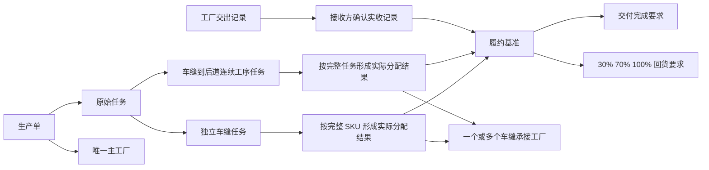
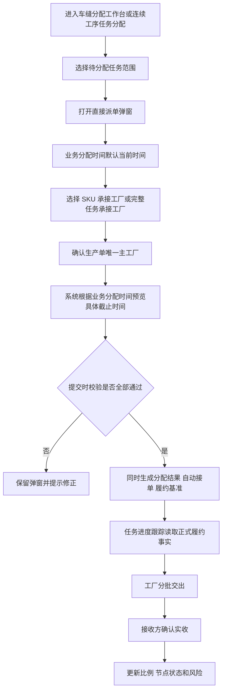
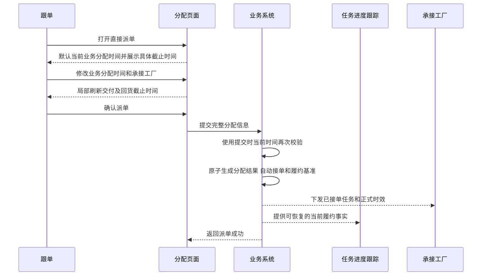
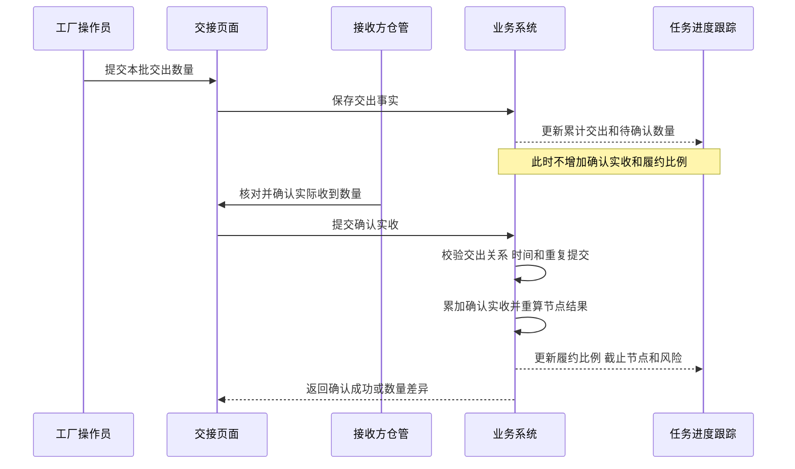
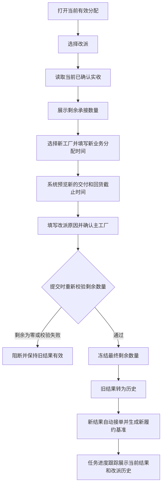
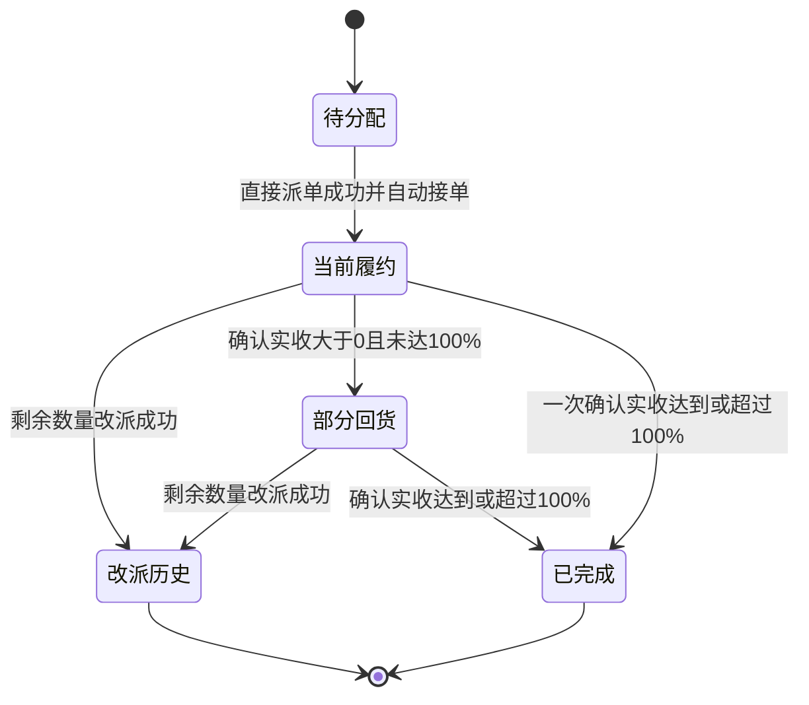
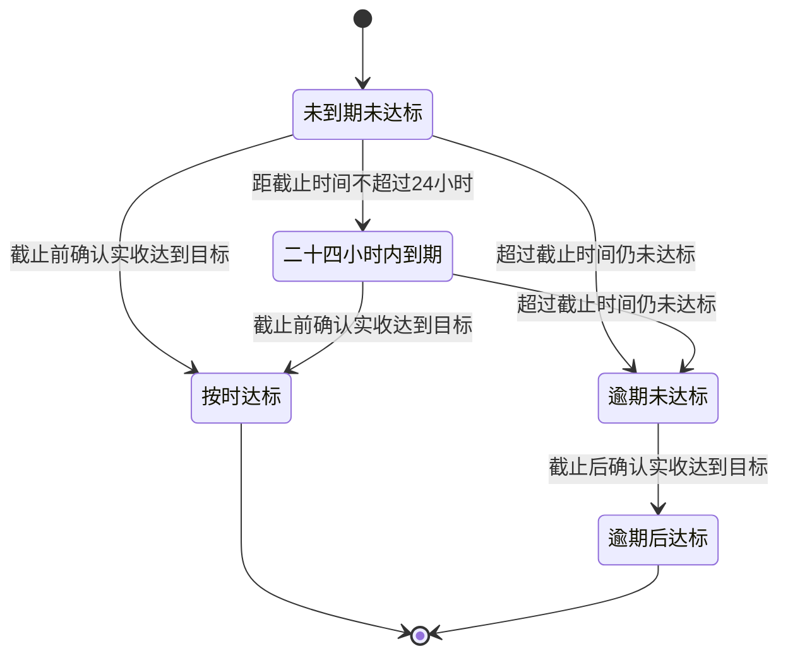

# 车缝与车缝到后道任务自定义分配及履约时效产品需求文档

## 1. 文档信息

| 项目 | 内容 |
| --- | --- |
| 文档名称 | 车缝与车缝到后道任务自定义分配及履约时效产品需求文档 |
| 文档版本 | V1.0 |
| 文档日期 | 2026-07-18 |
| 适用系统 | 工厂生产协同系统、工厂端移动应用 |
| 适用业务 | 独立车缝任务、车缝到后道连续工序任务 |
| 主要角色 | 生产计划员、跟单、平台主管、承接工厂负责人、工厂操作员、接收方仓管 |
| 文档用途 | 交付产品、研发、测试和实施进行正式功能开发、联调与验收 |
| 时间口径 | 以业务分配时间为起点，按连续满 24 小时滚动计算 |
| 数量口径 | 仅接收方确认实收的数量计入履约；允许超量实收，履约比例可以超过 100% |

### 1.1 文档效力

本文件是本次“自定义分配时间、交付时效、回货时效”需求的完整交付口径。

对于独立车缝任务和车缝到后道连续工序任务，如本文件与此前的含车缝任务时效文档、页面原型或演示数据存在冲突，以本文件为准。

本文件不使用页面原型中的代码名称、路由名称和数据字段作为业务规则。研发实现可自行设计技术结构，但必须保证业务对象、时间、数量、状态和跨页面结果符合本文。

## 2. 需求背景

车缝相关任务在实际业务中可能先完成线下沟通，再由跟单补录到系统。如果系统只能使用操作当下的时间，就会导致系统中的履约起点晚于真实分配时间，交付和回货节点也随之失真。

同时，一个生产单的独立车缝任务可能按 SKU 分配给多个工厂。每家工厂承担的 SKU、数量和履约责任不同，不能只在生产单或原始任务层面生成一组混合时效。

当前业务链路还存在以下核心问题：

1. 直接派单和改派入口的业务分配时间、交付时效及回货时效展示不一致。
2. 部分页面只展示“第几天”，没有根据业务分配时间展示具体截止日期和时间。
3. 分配弹窗重复展示列表已有的齐套、裁床判断、物料风险等信息，内容过多，影响操作聚焦。
4. 分配结果、SKU 分工厂关系或时效结果如果只在当前页面临时保存，刷新页面或直接进入“任务进度跟踪”后便无法恢复。
5. “任务进度跟踪”只展示原始任务，无法清楚表达一个任务下不同 SKU、不同承接工厂的独立履约情况。
6. 工厂提交交出后，如果接收方尚未确认实收，现有展示容易把“已交出”误认为“已回货”。
7. 改派后如果覆盖原有记录，会造成原工厂与新工厂的数量、时间和责任混淆。

因此，本次需求不仅要在分配弹窗中计算日期，还必须建立从“派单或改派”到“任务进度跟踪”，再到“接收方确认实收”的完整履约事实链路。

## 3. 产品目标

### 3.1 业务目标

1. 允许跟单按真实业务发生时间回填业务分配时间。
2. 根据业务分配时间自动计算并展示交付完成、30% 回货、70% 回货和 100% 回货的具体截止日期与时间。
3. 让分配前预览与分配后正式履约要求完全一致。
4. 让每个当前有效的实际分配结果都具有独立、可恢复、可追溯的履约基准。
5. 让任务进度跟踪能够同时看清原始任务整体情况，以及 SKU × 承接工厂的明细履约情况。
6. 只以接收方确认实收作为履约完成事实，避免单方交出造成虚假达标。
7. 保留改派前后的完整历史，保证新旧工厂责任互不污染。

### 3.2 用户目标

| 角色 | 用户目标 |
| --- | --- |
| 生产计划员、跟单 | 选择承接工厂、回填真实分配时间、确认主工厂，并在提交前看到准确的具体截止时间 |
| 平台主管 | 查看当前履约风险、改派历史、接收确认延迟和异常关系，能够追溯责任 |
| 承接工厂负责人 | 明确本工厂承接的任务范围、数量、履约起点和各节点截止时间 |
| 工厂操作员 | 按实际生产节奏分批交出，并看到已交出与待确认数量 |
| 接收方仓管 | 按实际收到数量确认实收，使履约进度基于真实收货事实更新 |

### 3.3 成功标准

1. 四个入口均支持自定义业务分配时间：独立车缝直接派单、独立车缝改派、车缝到后道直接派单、车缝到后道改派。
2. 四个入口均展示交付完成、30%、70%、100% 的具体截止日期和时间。
3. 派单成功后刷新页面、关闭后重新进入或直接进入任务进度跟踪，履约信息仍可恢复。
4. 接收方确认实收后，任务进度跟踪中的确认实收数量、比例、节点状态和风险同步更新。
5. 改派后当前履约只统计新生效结果，旧结果可查询但不混入当前统计。
6. 相关轻量交互在正常本地或内网环境下的页面响应时间不高于 200 毫秒。

## 4. 需求范围

### 4.1 本次范围

| 任务类型 | 直接派单 | 改派 | 自定义分配时间 | 交付时效 | 按比例回货时效 | 任务进度跟踪 |
| --- | --- | --- | --- | --- | --- | --- |
| 独立车缝任务 | 包含 | 包含 | 包含 | 包含 | 包含 | 包含 |
| 车缝到后道连续工序任务 | 包含 | 包含 | 包含 | 包含 | 包含 | 包含 |

### 4.2 本次不包含

1. 裁剪到包装及其他不属于本次范围的连续工序任务。
2. 非车缝任务分配。
3. 发起竞价、竞价定标、中标工厂人工确认接单及竞价拒单。
4. 工厂推荐、自动选厂、产能排程和价格决策。
5. 结算、扣款、罚款和赔付规则。
6. 第三方工厂内部每一道车缝或后道工序的生产过程拆解。
7. 对历史已生效任务按新规则追溯重算。

不在本次范围内的任务和页面维持现状，不得错误套用车缝或车缝到后道时效规则。

## 5. 术语与业务对象

### 5.1 术语说明

| 术语 | 业务含义 |
| --- | --- |
| 独立车缝任务 | 仅以车缝为主要承接范围，可按完整 SKU 分配给不同车缝工厂的任务 |
| 车缝到后道连续工序任务 | 从车缝开始连续覆盖后道，由同一家工厂按完整任务范围承接的任务 |
| 业务分配时间 | 业务上认定本次派单或改派生效的时间；默认当前时间，允许回填过去时间，但不能晚于提交动作发生时的系统当前时间 |
| 实际操作时间 | 操作人员点击确认提交时的系统当前时间，仅用于校验和审计，不由用户填写 |
| 自动接单 | 直接派单或改派成功后，承接工厂无需再次人工确认，系统立即认定其已接单 |
| 履约起点 | 本次实际分配结果开始计算交付和回货时效的时间；在本次范围内等于业务分配时间 |
| 实际分配结果 | 一次派单或改派成功后，某个承接工厂对确定任务范围和数量承担责任的独立履约对象 |
| 履约基准 | 实际分配结果生效时固定的任务类型、分配数量、履约起点、节点目标数量和各截止时间 |
| 交出 | 工厂声明已向下一接收方交出一定数量，是工厂单方提交的事实 |
| 确认实收 | 接收方确认实际收到的数量，是计入履约进度的唯一数量事实 |
| 待确认实收 | 工厂已经交出，但接收方尚未确认的数量 |
| 主工厂 | 生产单层面唯一的主要生产责任工厂 |
| 车缝承接工厂 | 实际承接某些 SKU 或连续任务的工厂；一个生产单可以有多个车缝承接工厂，但仍只能有一个主工厂 |
| 当前有效结果 | 当前仍承担后续生产与履约责任的实际分配结果 |
| 改派历史 | 改派成功后停止承担后续责任、但继续保留原始履约事实的旧分配结果 |

### 5.2 业务对象关系

### 5.3 原始任务与实际分配结果的关系

任务进度列表仍以原始任务为一行，避免同一个业务任务因多工厂分配而在列表中被重复拆散。

履约计算不直接使用原始任务总量，而是以实际分配结果为单位独立计算：

- 独立车缝任务：同一次提交中，同一工厂承接的一个或多个完整 SKU 合并形成该工厂的一个实际分配结果，并按这些 SKU 的任务数量合计计算节点目标。
- 车缝到后道连续工序任务：完整任务由一家工厂承接，通常形成一个实际分配结果。
- 原始任务的整体进度由当前有效的实际分配结果汇总得到。
- 改派历史不参与当前整体进度汇总。
- 同一原始任务在不同时间、不同提交动作中形成的分配结果不得仅因承接工厂相同而自动合并，因为其业务分配时间和履约基准可能不同。
- SKU × 承接工厂是页面披露任务范围的明细粒度，不等于必须把同一实际分配结果拆成多个独立履约时钟。

## 6. 核心业务规则

### 6.1 适用任务识别

系统必须根据任务实际覆盖的工序范围识别时效类型：

1. 仅承担车缝的，适用“车缝”规则。
2. 从车缝开始并连续覆盖后道的，适用“车缝到后道”规则。
3. 其他任务不得因名称相似、包含包装字样或曾经关联车缝而自动套用本规则。
4. 一个实际分配结果只能适用一种时效类型。
5. 提交前预览使用的时效类型必须与提交后冻结的时效类型一致。

### 6.2 独立车缝的 SKU 分工厂规则

1. 独立车缝任务只能按 SKU 维度选择承接工厂。
2. 一个 SKU 的全部任务数量必须分配给同一家工厂。
3. 同一个 SKU 不允许再按数量拆分给多家工厂。
4. 不同 SKU 可以选择不同承接工厂。
5. SKU 的任务数量为系统确定的只读数量，分配时不得手工改写。
6. 支持勾选多个 SKU 后批量设置同一家工厂，批量设置后仍可逐行调整。
7. 提交前，每个本次分配的 SKU 都必须选择一家有效工厂。
8. 已形成当前有效分配的 SKU 不得再次通过普通派单覆盖；更换工厂必须使用改派。

示例：一个生产单包含 4 个 SKU，每个 SKU 400 件。SKU-A、SKU-B 分配给甲厂，SKU-C、SKU-D 分配给乙厂，则甲厂和乙厂各形成 800 件的独立履约责任。同一个 SKU 不得再拆为甲厂 200 件、乙厂 200 件。

### 6.3 车缝到后道的整任务分配规则

1. 车缝到后道连续工序任务必须按完整任务范围分配给一家工厂。
2. 不允许按 SKU、工序或数量拆成多家工厂共同承接。
3. 页面不得使用含义不清的“整任务分配”作为独立业务概念，应明确表达“完整任务由一家工厂承接”。
4. 改派时，已确认实收的数量保留在原历史结果，剩余未实收数量由新工厂继续承接。

### 6.4 业务分配时间规则

1. 打开直接派单或改派弹窗时，业务分配时间默认显示当前时间。
2. 用户可以回填过去的日期和时间。
3. 业务分配时间不能为空。
4. 业务分配时间不得晚于点击确认提交时的实际操作时间。
5. 页面编辑过程中要即时校验，提交时必须再次使用最新系统时间校验。
6. 不设置统一的最早可回填日期；如业务后续需要控制补录周期，应另行提出规则。
7. 页面展示精确到分钟，正式履约事实必须保留到秒。
8. 同一次提交中的全部 SKU、承接工厂和主工厂确认使用同一个业务分配时间。
9. 实际操作时间由系统自动记录，只用于审计，不在聚焦型分配弹窗中作为用户字段展示。
10. 业务分配时间发生变化时，页面必须立即重新计算全部具体截止时间，不得保留旧预览。
11. 回填时间导致某个或全部节点已经到期时，允许继续派单，但必须在提交前明确提示“按回填时间计算，任务已存在逾期节点”。用户确认后，正式履约结果立即按真实时间进入相应逾期状态，不得把履约起点改为实际操作时间来规避逾期。

### 6.4.1 时区规则

1. 业务分配时间、交出时间、确认实收时间和各截止时间必须表示可唯一确定的时间点。
2. 同一生产单统一使用所属业务组织配置的业务时区，不得直接使用操作设备临时设置的时区作为计算依据。
3. 管理端和工厂端如采用不同本地时区展示，必须显示时区标识，并保证其代表同一个实际时间点。
4. 时效比较使用统一时间点进行，不得直接比较不同设备显示的日期文本。
5. 业务时区配置变更不得改变已经冻结的历史截止时间所代表的实际时间点。

### 6.5 自动接单与履约起点

本次范围内的直接派单和改派均采用派单方式：

1. 提交成功即视为承接工厂自动接单。
2. 自动接单时间等于业务分配时间。
3. 履约起点等于业务分配时间。
4. 不等待工厂端再次确认后才启动时效。
5. 如果提交失败，不得产生接单事实或启动履约时钟。
6. 如果业务分配时间为回填时间，所有截止时间都从该回填时间开始计算，而不是从实际操作时间开始计算。

### 6.6 连续满 24 小时计算规则

所有“第 N 天”统一解释为从履约起点起经过 N 个完整的 24 小时：

- 不按自然日零点截断。
- 不按工作日计算。
- 不跳过周末或节假日。
- 截止时间保留履约起点的时、分、秒。
- 跨月、跨年、闰年时继续按实际经过时长计算。

示例：业务分配时间为 2026-07-18 14:30:00，车缝任务第 4 天节点为 2026-07-22 14:30:00，第 9 天节点为 2026-07-27 14:30:00。

### 6.7 交付与回货时效规则

#### 6.7.1 独立车缝任务

| 要求 | 截止时间 | 数量目标 |
| --- | --- | --- |
| 交付完成 | 业务分配时间 + 9 × 24 小时 | 分配数量的 100% |
| 第一个回货节点 | 业务分配时间 + 4 × 24 小时 | 确认实收达到分配数量的 30% |
| 第二个回货节点 | 业务分配时间 + 8 × 24 小时 | 确认实收达到分配数量的 70% |
| 最终回货节点 | 业务分配时间 + 9 × 24 小时 | 确认实收达到分配数量的 100% |

#### 6.7.2 车缝到后道连续工序任务

| 要求 | 截止时间 | 数量目标 |
| --- | --- | --- |
| 交付完成 | 业务分配时间 + 10 × 24 小时 | 分配数量的 100% |
| 第一个回货节点 | 业务分配时间 + 5 × 24 小时 | 确认实收达到分配数量的 30% |
| 第二个回货节点 | 业务分配时间 + 9 × 24 小时 | 确认实收达到分配数量的 70% |
| 最终回货节点 | 业务分配时间 + 10 × 24 小时 | 确认实收达到分配数量的 100% |

“交付完成”和“100% 回货”当前具有相同截止时间，但必须保留为两个业务要求：前者表示承接任务必须全部完成并交付，后者表示接收方确认实收必须达到 100%。不得因为日期相同而在规则层合并为一个概念。

#### 6.7.3 交付完成判定

1. 在本次需求中，交付完成以累计确认实收数量达到或超过实际分配数量为可核验完成事实。
2. 工厂仅标记“生产完成”或仅提交“已交出”，均不能直接判定交付完成。
3. 截止时间前累计确认实收达到 100%，交付时效视为按时完成。
4. 截止时间后才达到 100%，交付状态视为逾期完成，并保留首次达到 100% 的确认实收时间。
5. 超量实收时交付正常完成，交付完成时间仍取首次累计达到分配数量的确认实收时间。
6. 交付完成和 100% 回货可共享同一个确认实收事实，但页面必须分别表达“交付要求”和“回货节点”的业务含义。

### 6.8 节点目标数量规则

1. 每个实际分配结果根据自己的分配数量独立计算节点目标。
2. 同一次提交中，同一工厂承接多个 SKU 时，分配数量为这些 SKU 任务数量之和，30%、70%、100% 按合计数量计算。
3. 节点目标数量出现小数时一律向上取整。
4. 30% 目标数量 = 分配数量 × 30% 后向上取整。
5. 70% 目标数量 = 分配数量 × 70% 后向上取整。
6. 100% 目标数量 = 完整分配数量。
7. 分配数量必须大于零。

示例：分配数量为 101 件时，30%、70%、100% 目标分别为 31 件、71 件、101 件。

### 6.9 确认实收与履约累计规则

1. 工厂提交交出后，只增加累计交出数量和待确认实收数量。
2. 工厂单方提交的交出数量不计入回货履约比例。
3. 只有接收方确认实收后，确认数量才进入累计确认实收。
4. 接收方确认多少，履约累计多少；数量差异必须按实际确认结果记录。
5. 同一笔确认实收事实不得重复累计。
6. 确认实收时间不得早于对应交出时间。
7. 恰好在节点截止时刻确认实收，视为按时；晚于截止时刻即视为逾期。
8. 超量实收正常累计，履约比例不封顶。
9. 分配 100 件、累计确认实收 105 件时，任务视为完成，履约比例展示 105%。
10. 超量实收不得反向增加分配数量，也不得改变已经冻结的节点目标数量。
11. 已确认实收需要纠错时，不允许无痕删除；必须通过有权限的冲销或更正动作保留原记录、原因、操作人和时间。
12. 确认实收被有效冲销或更正后，系统必须基于当前有效事实重新计算累计数量、首次达标时间、节点状态和整体风险。
13. 如果更正导致原先已达标的节点重新变为未达标，页面必须如实回退节点状态并保留更正审计，不得锁死在原已达标状态。

### 6.10 主工厂规则

1. 一个生产单在任意时点只能有一个主工厂。
2. 一个生产单可以有多个车缝承接工厂，但其他工厂只代表实际分配关系，不得并列成为主工厂。
3. 生产单已有有效主工厂时，默认保留；如业务允许调整，必须显式确认并保留调整记录。
4. 生产单尚无主工厂，且本次分配后只有一个有效车缝承接工厂时，可自动确定该工厂为主工厂。
5. 生产单尚无主工厂，且本次分配涉及多个候选工厂时，必须由跟单明确选择唯一主工厂。
6. 跨多个生产单操作时，必须逐生产单确认主工厂，不得用一个选择覆盖全部生产单。
7. 未确定唯一主工厂时不得提交派单或改派。
8. 重复确认现有主工厂不得产生无意义的变更记录。

### 6.11 履约基准冻结规则

派单或改派成功时，系统必须一次性固定以下业务事实：

1. 原始任务及生产单关系。
2. 实际分配结果及承接工厂。
3. 独立车缝的 SKU、颜色、尺码和任务数量，或车缝到后道的完整任务范围。
4. 业务分配时间、实际操作时间和自动接单时间。
5. 时效类型。
6. 交付完成截止时间。
7. 30%、70%、100% 回货目标数量及截止时间。
8. 当前有效或历史状态。
9. 主工厂确认结果。

冻结后，即使全局规则、工厂名称或任务配置发生变化，也不得自动重算或覆盖历史履约基准。后续页面必须读取本次正式分配时冻结的事实，不得使用当前规则临时反推历史截止时间。

### 6.12 提交一致性规则

派单或改派提交必须作为一个完整业务动作处理：

1. 分配结果、SKU 与工厂归属、主工厂确认、自动接单和履约基准必须同时成功。
2. 任一环节失败，整个提交均视为失败。
3. 失败时弹窗保持打开，并保留用户已经填写的内容。
4. 失败时不得产生部分分配、部分接单、部分时效或错误主工厂。
5. 重复点击确认不得生成重复分配结果或重复履约基准。

## 7. 调整页面与菜单范围

本节只使用用户在系统中看到的菜单名称，不使用代码名称或路由名称。

| 一级菜单 | 二级菜单 | 本次是否调整 | 调整说明 |
| --- | --- | --- | --- |
| 任务分配 | 车缝分配工作台 | 是 | 独立车缝直接派单和改派支持回填业务分配时间；按 SKU 选择承接工厂；确认唯一主工厂；自动展示交付及 30%、70%、100% 的具体截止时间；弹窗精简为完成分配所必需的信息 |
| 任务分配 | 连续工序任务分配 | 是 | 仅对车缝到后道任务调整；直接派单和改派支持回填业务分配时间；完整任务由一家工厂承接；自动展示交付及 30%、70%、100% 的具体截止时间；其他连续工序任务保持现状 |
| 任务进度与异常 | 任务进度跟踪 | 是 | 列表新增统一的履约时效摘要与风险筛选；详情按当前履约和改派历史分区；独立车缝按 SKU × 承接工厂展示，车缝到后道按完整任务展示；刷新或直接进入页面后仍能恢复正式履约事实 |
| 工厂端移动应用 | 交接 | 是 | 工厂交出后展示待确认实收；接收方确认实收后驱动履约数量、比例、节点状态和风险更新；明确只有确认实收计入履约 |
| 工厂端移动应用 | 接单 | 否 | 本次派单成功即自动接单，不增加工厂人工确认动作；如展示任务详情，应读取已冻结的履约起点和截止时间，但不新增操作流程 |
| 任务分配 | 招标单管理 | 否 | 竞价、定标和中标确认不属于本次范围，维持既有规则 |
| 任务分配 | 非车缝任务分配 | 否 | 不适用本次规则，不进行调整 |

## 8. 页面详细需求

### 8.1 任务分配 > 车缝分配工作台

#### 8.1.1 列表职责

车缝任务列表继续承担“是否具备分配条件”的判断，展示齐套、裁床判断、裁片闭环、物料和相关风险。分配弹窗不再重复这些信息。

列表应提供：

1. 查看任务及 SKU 明细。
2. 对未分配的完整 SKU 发起直接派单。
3. 对已有当前有效分配的 SKU 发起改派。
4. 明确已分配、部分已分配和待分配状态。
5. 当一个原始任务包含多个承接工厂时，列表可以展示工厂数量摘要，但不在列表中铺开全部履约节点。

#### 8.1.2 直接派单弹窗结构

弹窗只保留以下五个核心区域，并按顺序展示：

1. 业务分配时间。
2. SKU 与承接工厂。
3. 唯一主工厂确认。
4. 交付时效要求。
5. 按比例回货时效要求。

底部只保留“取消”和“确认派单”。

弹窗不得重复展示：

1. 当前齐套数量。
2. 裁床判断详情。
3. 裁片单闭环详情。
4. 毛织片、特种工艺裁片和辅料明细。
5. 风险摘要和大段业务说明。
6. 实际操作时间输入框。
7. 用户不能修改的重复任务信息。

#### 8.1.3 SKU 与承接工厂

表格列建议为：

| 列 | 展示与操作要求 |
| --- | --- |
| SKU | 展示 SKU 标识 |
| 颜色/尺码 | 展示颜色和尺码 |
| 任务数量 | 只读展示该 SKU 的完整任务数量 |
| 承接工厂 | 每行必须选择一家有效工厂 |

不展示“当前齐套”和“风险摘要”列，因为这些信息已经在主列表中完成判断。

页面支持多选 SKU 后批量设置承接工厂，但不得通过复制行、增加子行或输入数量的方式把一个 SKU 分给多家工厂。

#### 8.1.4 具体时效展示

页面必须根据当前业务分配时间展示具体日期，而不是仅展示“接单后第 N 天”。

示例：

| 时效 | 页面展示示例 |
| --- | --- |
| 交付完成 | 2026-07-27 14:30 前完成 100% |
| 30% 回货 | 2026-07-22 14:30 前确认实收达到 30% |
| 70% 回货 | 2026-07-26 14:30 前确认实收达到 70% |
| 100% 回货 | 2026-07-27 14:30 前确认实收达到 100% |

区域底部用一句短提示说明：“按连续满 24 小时滚动；仅接收方确认实收计入回货比例。”

业务分配时间变化后，只刷新时间错误提示、时效区域和确认按钮状态，不得关闭或重建弹窗，不得丢失 SKU、承接工厂和主工厂选择。

#### 8.1.5 直接派单提交

提交前依次校验：

1. 业务分配时间有效且不晚于当前时间。
2. 每个 SKU 均已选择一家工厂。
3. 同一个 SKU 未被拆给多家工厂。
4. 生产单存在唯一主工厂。
5. 所选工厂当前可承接车缝任务。
6. 相关 SKU 未在操作期间被其他有效分配占用。

提交成功后自动接单，并生成正式、可恢复的履约基准。

### 8.2 任务分配 > 连续工序任务分配

#### 8.2.1 适用范围

本页面只对“车缝到后道”连续工序任务接入本需求。其他连续工序任务维持既有显示和操作，不显示本次时效预览。

#### 8.2.2 分配弹窗

弹窗按以下顺序展示：

1. 业务分配时间。
2. 完整任务范围与承接工厂。
3. 唯一主工厂确认。
4. 交付时效要求。
5. 按比例回货时效要求。

明确提示“该连续工序任务由一家工厂完整承接，不按 SKU、工序或数量拆分”。

时效区域展示：

| 时效 | 计算与展示要求 |
| --- | --- |
| 交付完成 | 业务分配时间 + 10 × 24 小时，并展示具体日期和时间 |
| 30% 回货 | 业务分配时间 + 5 × 24 小时，并展示具体日期和时间 |
| 70% 回货 | 业务分配时间 + 9 × 24 小时，并展示具体日期和时间 |
| 100% 回货 | 业务分配时间 + 10 × 24 小时，并展示具体日期和时间 |

删除实际操作时间展示和与主列表重复的数量、风险说明。业务分配时间变化时只局部刷新时效区域。

### 8.3 改派弹窗

独立车缝和车缝到后道均通过明确的“改派”动作进入，不得用普通派单覆盖已有当前有效结果。

改派弹窗展示：

1. 原承接工厂。
2. 改派范围：独立车缝展示完整 SKU；车缝到后道展示完整任务。
3. 原分配数量、已确认实收数量和本次剩余承接数量。
4. 新承接工厂。
5. 新业务分配时间。
6. 改派原因。
7. 主工厂确认。
8. 新的交付和 30%、70%、100% 具体截止时间。

### 8.4 任务进度与异常 > 任务进度跟踪

#### 8.4.1 列表展示原则

列表以原始任务为一行，不因 SKU 或工厂数量增加而复制原始任务行。

原“交付时效”列统一调整为“履约时效”，集中展示：

1. 当前有效分配摘要：独立车缝展示已分配 SKU 数和承接工厂数；车缝到后道展示当前承接工厂。
2. 累计确认实收数量 / 当前有效分配数量。
3. 整体履约比例，允许超过 100%。
4. 最早尚未完成的节点及具体截止时间。
5. 当前所有有效分配结果中的最高风险。

列表增加“履约风险”筛选，至少支持：

- 全部。
- 正常。
- 24 小时内到期。
- 已逾期。
- 已完成。
- 履约数据不完整。

当任务尚未形成正式分配和履约基准时，展示“尚未形成履约记录”，不得用“—”伪装成正常无风险。

当正式分配已经存在但履约事实无法完整读取时，展示“履约数据不完整”，并提供核对入口；不得临时使用当前全局规则补算一个看似正常的截止时间。

#### 8.4.2 列表聚合规则

1. 当前有效分配数量为全部当前有效实际分配结果的分配数量之和。
2. 当前确认实收数量为全部当前有效实际分配结果的确认实收数量之和。
3. 整体比例为当前确认实收数量除以当前有效分配数量，比例不封顶。
4. 下一节点取所有未完成节点中截止时间最早者。
5. 最高风险按“履约数据不完整 > 已逾期 > 24 小时内到期 > 正常 > 已完成”的优先级展示。
6. 改派历史不参与当前数量、比例、下一节点和风险汇总。
7. 不同实际分配结果之间不得互相借用超量实收冲抵另一工厂的节点缺口。

#### 8.4.3 详情结构

详情分为两个页签：

1. 当前履约。
2. 改派历史。

“当前履约”顶部展示：

- 当前有效分配数量。
- 累计交出数量。
- 待确认实收数量。
- 累计确认实收数量。
- 整体履约比例。
- 最高风险。

明细表按以下粒度展示：

- 独立车缝：先按实际分配结果展示承接工厂、分配总量和共享履约节点，再展开该结果下的 SKU × 承接工厂明细。因同一个 SKU 只能由一家工厂承接，不允许出现同一 SKU 的多家当前有效工厂行。
- 车缝到后道：完整任务 × 承接工厂一行。

如页面采用扁平表格逐行展示 SKU，必须明确哪些 SKU 共享同一个实际分配结果和履约节点，并避免把同一工厂结果的分配数量、确认实收数量和风险重复累计。节点目标和节点结果以实际分配结果为准，SKU 行主要用于说明该工厂承接的具体任务范围。

明细至少展示：

1. SKU、颜色、尺码；车缝到后道显示完整任务范围。
2. 承接工厂。
3. 分配数量。
4. 业务分配时间。
5. 交付完成截止时间与状态。
6. 30%、70%、100% 节点的目标数量、截止时间、当前结果和首次达标时间。
7. 累计交出数量。
8. 待确认实收数量。
9. 累计确认实收数量。
10. 履约比例。
11. 当前风险。

明细表必须分页。宽表只允许在表格容器内横向滚动，操作列保持可见。

#### 8.4.4 履约详情抽屉

从明细行进入履约详情，按时间顺序展示：

1. 派单或改派生效。
2. 自动接单和履约基准生成。
3. 工厂每批交出。
4. 接收方每批确认实收。
5. 交出与实收数量差异。
6. 30%、70%、100% 首次达标。
7. 节点逾期或逾期后达标。
8. 接收确认延迟证据。
9. 主管责任复核记录。

#### 8.4.5 改派历史页签

改派历史至少展示：

1. 原工厂和新工厂。
2. 原业务分配时间和改派生效时间。
3. 改派原因。
4. 原分配数量。
5. 改派时已确认实收数量。
6. 冻结并转移的剩余数量。
7. 原结果最终交出、确认实收和节点情况。
8. 新旧结果的关联关系。

历史结果只读，不提供继续交出、继续改派等当前执行动作。

### 8.5 工厂端移动应用 > 交接

#### 8.5.1 工厂交出

工厂提交交出时必须记录：

1. 实际分配结果。
2. 本批交出数量。
3. 交出时间。
4. 交出人。
5. 下一接收方。

提交成功后：

- 累计交出数量增加。
- 待确认实收数量增加。
- 累计确认实收数量不变。
- 履约比例和节点达标状态不因单方交出而增加。

#### 8.5.2 接收方确认实收

接收方页面必须展示工厂交出数量、实际收到数量、差异、交出时间和确认时间。

确认成功后：

1. 以接收方确认的实际数量累计履约。
2. 减少相应待确认实收数量。
3. 重新判断交付完成和 30%、70%、100% 节点。
4. 更新任务进度跟踪中的数量、比例、节点结果和风险。
5. 如确认时间晚于节点截止时间，按真实确认时间判断逾期。

数量差异必须直接展示“多多少”或“少多少”，不得要求仓管自行计算。

## 9. 核心业务流程

### 9.1 直接派单流程

### 9.2 直接派单时序

### 9.3 交出与确认实收时序

## 10. 改派规则与流程

### 10.1 改派前提

1. 已存在当前有效分配的任务必须通过改派更换工厂。
2. 已完成的实际分配结果不得改派。
3. 剩余未确认实收数量必须大于零。
4. 改派必须填写原因。
5. 新工厂必须具备有效承接资格。

### 10.2 剩余数量冻结

改派数量以点击确认改派时的实际操作时点为准：

> 新分配数量 = 原分配数量 - 改派提交成功前已确认实收数量

提交时必须重新读取最新确认实收数量，不能直接使用打开弹窗时的旧数值。

### 10.3 新旧结果隔离

1. 改派成功后，旧分配结果转为历史，新分配结果成为当前有效结果。
2. 旧结果保留原分配数量、原履约基准、交出、确认实收、节点和责任事实。
3. 新结果使用新的业务分配时间、自动接单时间、分配数量和履约基准。
4. 改派提交成功后才确认的旧任务实收，只更新旧历史，不减少新结果的分配数量。
5. 新结果的确认实收不得回写旧结果。
6. 旧结果后续超量实收不得抵扣新工厂的履约责任。
7. 改派失败时，旧结果继续有效，不得先转历史。

### 10.4 改派流程图

## 11. 状态与风险策略

### 11.1 实际分配结果状态图

### 11.2 单个履约节点状态

| 状态 | 判断规则 | 展示建议 |
| --- | --- | --- |
| 未到期未达标 | 当前时间早于截止时间，确认实收未达目标 | 中性状态，展示剩余时间和缺口数量 |
| 24 小时内到期 | 距截止时间不超过 24 小时，确认实收未达目标 | 预警状态，突出具体截止时间和缺口 |
| 按时达标 | 首次达到目标的确认实收时间不晚于截止时间 | 成功状态，展示首次达标时间 |
| 逾期未达标 | 当前时间晚于截止时间，确认实收仍未达目标 | 严重风险，展示逾期时长和缺口 |
| 逾期后达标 | 首次达到目标的确认实收时间晚于截止时间 | 已达标但保留逾期事实 |

### 11.3 节点状态图

### 11.4 整体风险判定

一个原始任务存在多个当前有效分配结果时，列表风险取其中最严重者，不得用平均值弱化异常。

风险优先级：

1. 履约数据不完整。
2. 已逾期。
3. 24 小时内到期。
4. 正常。
5. 已完成。

只要任一当前有效实际分配结果存在逾期未达标节点，原始任务整体就显示“已逾期”。

## 12. 数据一致性、恢复与追溯策略

### 12.1 唯一事实来源

分配成功后形成的正式分配结果和履约基准，是后续所有页面展示的唯一事实来源。

车缝分配工作台、连续工序任务分配、任务进度跟踪和工厂端交接不得分别维护彼此独立的时效数据，也不得各自根据页面当前信息重新推算历史结果。

### 12.2 可恢复要求

以下场景必须恢复同一份正式履约事实：

1. 派单后立即进入任务进度跟踪。
2. 浏览器刷新。
3. 关闭页面后重新进入。
4. 通过收藏或其他菜单直接进入任务进度详情。
5. 系统服务重启后再次查询。
6. 交接确认后返回任务进度跟踪。

不得把仅保存在当前页面内存中的临时结果视为正式履约事实。

### 12.3 不完整数据策略

1. 原始任务存在，但尚未分配：展示“尚未形成履约记录”。
2. 已有分配关系，但履约基准缺失或内容不全：展示“履约数据不完整”。
3. 履约基准存在，但原始任务关系暂时无法解析：保留分配与履约事实，并标识“任务关系待核对”。
4. 不得用当前全局规则临时补算缺失历史数据并当作正式结果。
5. 数据修复必须保留修复前后审计记录。

### 12.4 重复事实防护

1. 派单、改派、交出和确认实收均需防止重复提交。
2. 同一交出事实只能被确认其可确认范围内的数量。
3. 同一确认实收事实只能累计一次。
4. 网络重试不得产生重复分配、重复节点或重复确认数量。

### 12.5 规则变更策略

1. 新规则只影响规则生效后新生成的实际分配结果。
2. 已经生效的实际分配结果继续使用其冻结的履约基准。
3. 历史记录不得因全局规则变化而改变截止时间或达标结论。
4. 如必须纠正历史数据，应走有权限、有原因、有审计的人工修正流程，不通过普通页面自动重算。

## 13. 异常、防错与失败策略

| 场景 | 系统处理 |
| --- | --- |
| 业务分配时间为空 | 阻断提交，提示“请选择业务分配时间” |
| 业务分配时间格式无效 | 阻断提交，提示“业务分配时间格式不正确” |
| 业务分配时间晚于提交时当前时间 | 阻断提交，提示“业务分配时间不能晚于当前时间” |
| 修改为无效时间 | 立即清除旧的具体截止时间，避免用户误认为旧预览仍有效 |
| SKU 未选择承接工厂 | 阻断提交，并定位未完成行 |
| 同一 SKU 尝试分配给多家工厂 | 阻断提交，提示“同一个 SKU 只能由一家工厂承接” |
| 车缝到后道尝试拆分 | 阻断提交，提示“该连续工序任务必须由一家工厂完整承接” |
| 多个主工厂候选但未确认 | 阻断提交，要求逐生产单确认唯一主工厂 |
| 普通派单覆盖已有有效分配 | 阻断，并引导使用改派 |
| 改派时剩余数量为零 | 阻断，提示任务已全部确认实收，无需改派 |
| 弹窗打开后又发生实收 | 提交时重新计算剩余数量，并以最新结果为准；如为零则阻断 |
| 保存正式履约事实失败 | 整体提交失败，弹窗保持打开，不产生部分派单或接单 |
| 履约数据缺失 | 明确展示“履约数据不完整”，不得展示“—”或临时补算结果 |
| 接收确认时间早于交出时间 | 阻断确认，要求核对时间 |
| 确认数量与交出数量存在差异 | 展示差异并按接收方实际确认数量累计；超出可确认范围时阻断 |
| 下游联动暂时失败 | 已成功的确认实收事实不回滚，标记后续同步待处理 |
| 重复点击或网络重试 | 返回原业务结果，不重复生成事实 |

## 14. 接收确认延迟与责任复核

### 14.1 延迟证据识别

同时满足以下条件时，形成接收确认延迟证据：

1. 工厂在某履约节点截止前已经交出相关数量。
2. 接收方在该节点截止后才确认实收。
3. 延迟确认对该节点未按时达标产生实际影响。

### 14.2 受影响数量

受影响数量不能简单等于整笔实收数量，应取以下范围共同限制后的结果：

1. 节点截止前已交出但未确认的数量。
2. 节点目标数量与截止前已确认实收数量之间的缺口。

### 14.3 展示与复核

履约详情应展示交出时间、确认时间、延迟时长、受影响数量和当前复核结论。

平台主管可以记录“接收方责任”“工厂责任”或“双方共同责任”。复核结论只用于责任判断，不得修改原始交出时间、确认时间、确认数量和节点达标事实。

## 15. 权限与审计要求

### 15.1 权限原则

1. 只有具有任务分配权限的人员可以直接派单或改派。
2. 改派权限可高于普通派单权限，并应支持组织按实际管理要求配置。
3. 工厂只能查看本工厂当前或历史承接结果。
4. 接收方只能确认其负责接收的交出记录。
5. 责任复核只开放给平台主管或被授权人员。

### 15.2 审计内容

以下动作必须记录操作人、实际操作时间和业务结果：

1. 直接派单。
2. 主工厂确认或调整。
3. 改派及改派原因。
4. 工厂交出。
5. 接收方确认实收。
6. 履约数据人工修正。
7. 责任复核。

业务分配时间和实际操作时间必须同时保留，便于识别回填行为，但实际操作时间不需要出现在聚焦型分配弹窗中。

## 16. 性能与交互要求

1. 打开弹窗、关闭弹窗、修改业务分配时间、选择承接工厂、切换页签和展开详情等轻量交互，页面处理响应时间不高于 200 毫秒。
2. 修改业务分配时间时只更新时效区域、校验提示和确认按钮状态，不进行整页重绘。
3. 输入业务分配时间、改派原因或筛选条件时，不得每次输入都触发整页刷新。
4. 弹窗打开或局部刷新后，不得丢失用户已选择的 SKU、工厂、主工厂和改派原因。
5. 任务进度详情与改派历史均必须分页，限制首屏明细数量。
6. 宽表在表格容器内部滚动，页面主体不产生横向溢出。
7. 1366 × 768 为标准验收分辨率，1280 × 720 为最低可用分辨率。
8. 弹窗内容需要滚动时，底部“取消”和“确认”操作始终可达。

## 17. 业务示例

### 17.1 独立车缝多工厂

业务分配时间：2026-07-18 14:30:00。

| 实际分配结果 | SKU | 工厂 | 分配数量 | 30% 目标 | 70% 目标 | 100% 目标 |
| --- | --- | --- | --- | --- | --- | --- |
| 甲厂结果 | SKU-A、SKU-B | 甲厂 | 800 件 | 240 件 | 560 件 | 800 件 |
| 乙厂结果 | SKU-C、SKU-D | 乙厂 | 800 件 | 240 件 | 560 件 | 800 件 |

两家工厂分别计算履约。即使甲厂超量实收 850 件，也不能弥补乙厂的履约缺口。原始任务列表汇总展示两家工厂的当前整体进度，并以两家工厂中更严重的风险作为任务风险。

车缝具体截止时间：

- 30% 回货：2026-07-22 14:30:00。
- 70% 回货：2026-07-26 14:30:00。
- 交付完成和 100% 回货：2026-07-27 14:30:00。

### 17.2 车缝到后道

业务分配时间：2026-07-18 09:00:00，完整任务数量 500 件，由丙厂承接。

- 30% 目标 150 件，截止 2026-07-23 09:00:00。
- 70% 目标 350 件，截止 2026-07-27 09:00:00。
- 交付完成和 100% 回货目标 500 件，截止 2026-07-28 09:00:00。

如果工厂已交出 200 件，但接收方只确认实收 140 件，则履约比例为 28%，仍未达到 30% 节点；另外 60 件处于待确认实收状态。

### 17.3 超量实收

某实际分配结果分配数量 100 件，累计确认实收 105 件：

- 任务状态为已完成。
- 履约比例展示 105%。
- 100% 节点的首次达标时间取累计确认实收首次达到 100 件的确认时间。
- 超出的 5 件正常计入累计确认实收，但不改变节点目标。

### 17.4 改派

原工厂分配 400 件，改派提交前已确认实收 150 件，则新工厂承接 250 件，并以新业务分配时间计算新的节点。

如果改派成功后，原工厂又有 20 件迟到确认实收：

- 原历史结果的确认实收更新为 170 件。
- 新工厂分配数量仍为 250 件。
- 这 20 件不得计入新工厂履约，也不得减少新工厂的 250 件责任。

## 18. 验收标准

### 18.1 时间与预览

1. 四个派单或改派入口均默认当前业务分配时间，并允许回填过去时间。
2. 业务分配时间晚于提交时当前时间，提交失败且不产生任何分配结果。
3. 修改时间后，交付完成、30%、70%、100% 四个具体日期同步更新。
4. 时间无效时不保留上一次有效日期。
5. 车缝按 4、8、9 个连续 24 小时计算回货节点，9 个连续 24 小时计算交付完成。
6. 车缝到后道按 5、9、10 个连续 24 小时计算回货节点，10 个连续 24 小时计算交付完成。
7. 跨月、跨年、闰年计算正确。
8. 预览结果与提交后的正式履约基准完全一致。

### 18.2 分配粒度与主工厂

1. 独立车缝可以把不同 SKU 分给不同工厂。
2. 同一个 SKU 不能拆分数量给多家工厂。
3. SKU 任务数量不可在分配弹窗中修改。
4. 车缝到后道必须完整分配给一家工厂。
5. 一个生产单任意时点只有一个主工厂。
6. 多家车缝承接工厂不产生多个主工厂。
7. 缺少唯一主工厂确认时，提交被阻断。

### 18.3 跨页面与恢复

1. 直接派单成功后进入任务进度跟踪，可看到对应正式时效。
2. 派单成功后刷新浏览器，分配关系、具体截止时间和当前履约仍存在。
3. 关闭页面后直接进入任务进度详情，仍能恢复同一履约事实。
4. 任务进度列表以原始任务一行展示，详情按 SKU × 承接工厂展开。
5. 车缝到后道详情按完整任务 × 承接工厂展示。
6. 尚未分配的任务显示“尚未形成履约记录”。
7. 已分配但履约事实不完整时显示“履约数据不完整”，不展示临时补算日期。

### 18.4 交出与确认实收

1. 工厂交出后，累计交出和待确认增加，确认实收与履约比例不变。
2. 接收方确认后，确认实收、履约比例、节点状态和风险正确更新。
3. 恰好在截止时间确认视为按时，晚一秒确认视为逾期。
4. 同一确认实收事实不会重复累计。
5. 超量实收允许完成，比例可以超过 100%。
6. 一家工厂的超量实收不抵扣另一家工厂的缺口。

### 18.5 改派

1. 改派提交时按最新确认实收冻结剩余数量。
2. 新旧分配结果的数量、履约起点、节点和实收相互隔离。
3. 改派失败时旧结果继续有效，不产生部分新结果。
4. 旧结果后续确认实收只更新改派历史。
5. 改派历史可查询，但不计入当前任务统计和风险。

### 18.6 页面与性能

1. 分配弹窗只保留业务分配时间、SKU 与承接工厂、唯一主工厂、交付时效和按比例回货时效等核心内容。
2. 列表已展示的齐套、裁床判断和物料风险不在弹窗重复展示。
3. 任务进度列表及详情均支持分页和明确的总数口径。
4. 轻量交互不引起整页闪烁、弹窗关闭或滚动位置无故丢失。
5. 相关功能按钮和局部交互响应不高于 200 毫秒。

## 19. 测试场景矩阵

| 编号 | 场景 | 关键结果 |
| --- | --- | --- |
| T01 | 独立车缝单 SKU 直接派单 | 自动接单，生成 4/8/9 天回货节点和 9 天交付节点 |
| T02 | 独立车缝 4 个 SKU 分给 2 家工厂 | 每个 SKU 唯一归属，两家工厂形成独立履约结果，生产单只有一个主工厂 |
| T03 | 尝试拆分同一 SKU 数量给两家工厂 | 阻断提交 |
| T04 | 车缝到后道直接派单 | 完整任务由一家工厂承接，生成 5/9/10 天回货节点和 10 天交付节点 |
| T05 | 回填过去业务分配时间 | 具体截止时间按回填时间计算，自动接单时间等于回填时间 |
| T06 | 填写未来业务分配时间 | 提交失败，不产生部分业务事实 |
| T07 | 修改业务分配时间 | 四个截止时间在弹窗内局部更新，其他选择不丢失 |
| T08 | 派单后刷新并进入任务进度跟踪 | 能恢复正式分配关系和全部时效 |
| T09 | 工厂交出、接收方未确认 | 只增加累计交出和待确认，不增加履约比例 |
| T10 | 接收方分批确认达到 30% | 30% 节点记录首次达标时间并更新风险 |
| T11 | 截止前交出、截止后确认 | 节点按确认时间判定逾期，并形成接收确认延迟证据 |
| T12 | 101 件节点计算 | 30%、70%、100% 目标为 31、71、101 件 |
| T13 | 105% 超量实收 | 正常完成，比例显示 105% |
| T14 | 多工厂中一厂逾期 | 原始任务整体显示最高风险“已逾期” |
| T15 | 部分实收后改派 | 新工厂承接提交时冻结的剩余数量，使用新履约起点 |
| T16 | 改派成功后旧工厂迟到实收 | 只更新旧历史，不影响新工厂责任 |
| T17 | 改派提交期间剩余数量变为零 | 提交阻断，旧结果保持完成状态 |
| T18 | 正式履约事实缺失 | 展示“履约数据不完整”，不临时补算 |
| T19 | 重复点击派单或确认实收 | 不产生重复分配或重复累计 |
| T20 | 跨月、跨年和闰年 | 仍按连续满 24 小时准确计算 |

## 20. 上线与兼容策略

### 20.1 存量数据

1. 上线前已存在且已经形成完整履约基准的任务，继续使用原履约基准。
2. 上线前未形成正式履约基准的任务，不得静默使用新规则反推历史结果。
3. 如业务要求补齐存量任务，应提供单独的数据核对和补录方案，并由有权限人员确认真实业务分配时间。
4. 补录必须留下操作人、实际操作时间和补录原因。

### 20.2 上线检查

- 两类任务识别准确。
- 四个入口的时间校验和具体日期预览一致。
- 一个 SKU 只能由一家工厂承接。
- 车缝到后道只能由一家工厂完整承接。
- 一个生产单只有一个主工厂。
- 派单结果和履约基准可跨页面、刷新和重启恢复。
- 任务进度跟踪能够聚合当前结果并查看改派历史。
- 只有确认实收计入履约，超量比例不封顶。
- 重复提交、失败回滚和数据不完整提示符合要求。
- 关键页面性能、分页和低分辨率可用性通过验收。

## 21. 最终业务结论

1. 本次只覆盖独立车缝任务和车缝到后道连续工序任务的直接派单、改派及后续履约跟踪。
2. 两类任务均可自定义业务分配时间；时间允许回填，但不得晚于提交动作发生时的当前时间。
3. 直接派单和改派成功即自动接单，业务分配时间同时作为履约起点。
4. 所有时效均按连续满 24 小时滚动计算，并在页面展示具体日期和时间。
5. 独立车缝在第 4、8、9 个连续 24 小时检查 30%、70%、100% 回货，并在第 9 个连续 24 小时完成交付。
6. 车缝到后道在第 5、9、10 个连续 24 小时检查 30%、70%、100% 回货，并在第 10 个连续 24 小时完成交付。
7. 独立车缝按完整 SKU 选择工厂，同一个 SKU 不得按数量拆给多家工厂；车缝到后道由一家工厂完整承接。
8. 一个生产单可以有多个车缝承接工厂，但必须始终只有一个主工厂。
9. 派单成功时必须冻结并持久保存正式履约基准，任务进度跟踪不得依赖页面临时数据或当前规则反推。
10. 只有接收方确认实收计入履约；超量实收正常完成，履约比例可以超过 100%。
11. 改派以提交时已确认实收冻结剩余数量，新旧分配的数量、时间、节点、实收和责任必须相互隔离。
12. 任务进度列表按原始任务汇总，详情按 SKU × 承接工厂或完整任务 × 承接工厂展示当前履约，并独立保留改派历史。
