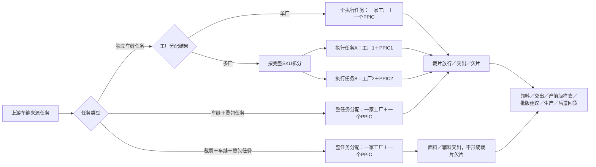
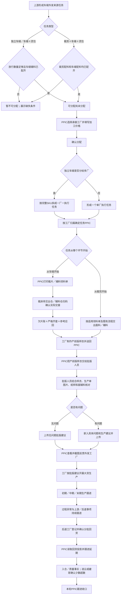

# 车缝外发协同（PPIC）全流程业务理解文档

> 文档性质：业务理解与需求确认基线，不代表相关功能已经实现。
>
> 版本：V1.9
>
> 日期：2026-09-07
>
> 适用系统：工厂生产协同系统
>
> 一级菜单名称：**车缝外发协同**
>
> 完整调整方案：`docs/product-design/车缝外发协同（PPIC）完整调整方案.md`
>
> 实施计划：`docs/implementation-plans/2026-08-31-车缝外发协同（PPIC）实施计划.md`
>
> 需求追踪矩阵：`docs/requirement-traceability/2026-08-31-车缝外发协同（PPIC）需求追踪矩阵.md`
>
> V1.2修订：明确“产前版样衣”是三方工厂制作的实物，“批版建议”才是批版人员核对、给出建议并上传系统的业务节点。
>
> V1.3修订：按实际使用反馈精简页面，删除独立“综合查询”；车缝任务的专业入口统一收进操作列；PPIC确认收到产前版样衣时必须上传本次实物照片；补料跟进和责任移交菜单必须显示有效图标。
>
> V1.4修订：我的工作台改为登录人视角的全局汇总与专业入口，不展示车缝任务列表；PPIC管理人员明确为婕哥、凌云；“裁片交出与欠片”更名为“交出与欠片”并按未交出、已交出不欠片、已交出且欠片分组；裁片退仓改为PPIC线下收到工厂申请后在系统建单，仓库只接收；暂时完整删除PPIC侧“对数与结算跟进”菜单、路由、页面和专属代码。
>
> V1.5修订：依据线下真实批版单和登记台账，批版建议改为“批版面料、工艺意见、用料意见、其他意见”四类结构化记录；登记身份明确为日期、SPU、PO、三方车缝工厂、产前版样衣照片、批版单佐证和批版人员；PPIC接收产前版样衣时支持多张照片的选择、预览、删除、保存和回看。
>
> V1.6修订：根据实际页面复核，把车缝外发专业台账统一为标准列表；业务状态Tab与搜索筛选分区；“交出与欠片”改为任务清单进入完整明细，部位排除仅允许整个部位或缺口达到一半的结构性缺失并支持取消；补料跟进只保留仍有裁片欠片的任务；裁片退仓把实物退仓数量与工厂回货责任调整数量分开，并按退仓原因决定是否提出责任调整。
>
> V1.7修订：车缝外发协同的7个专业二级菜单页面统一使用同一套业务Tab、筛选区和列表骨架；凡存在搜索模块必须提供“查询”“重置”两个明确动作；除“我的工作台”外删除重复统计卡片，数量只保留在互斥业务Tab上。车缝任务按三类任务切换，责任移交按是否已有移交历史切换；隐藏的迁移审计和面辅料详情不属于二级菜单页面。
>
> V1.8修订：把原附件中最有价值的七段上游供应链耗时，与外发后的30%／70%／100%回货节点统一纳入“生成单全流程耗时”二级菜单；分析颗粒度为生产单，定位为实际耗时分析而不是超时分析。每个节点只展示开始时间、结束／达成时间和实际耗时，不额外抽象状态；点击节点必须能够看到参与计算的来源单据、原始时间、选取原因和版本历史。原表被打码内容、上游标准周期、超时预警、原因排名、产能排期和可视化看板本轮不纳入。
>
> V1.9修订：确立“在现有原型基础上增量优化，不推翻重构”的总原则；车缝任务新增裁片领料单、辅料领料单打印入口，PPIC持单领料后由辅料仓或裁床待交出仓扫码确认交接并留存线上历史；任务分配工作台在“独立车缝任务”“合并任务”内按“暂不可分配、可分配尚未分配、已分配”展示。独立车缝、车缝＋烫包以“已有可覆盖分配数量的裁片放行＋车缝辅料已配齐”为可分配门禁，裁剪＋车缝＋烫包以“裁剪配料＋车缝配料均配齐”为门禁；PPIC派单时必填加工价格，系统不管理核价审批。同步明确：不建设电子合同、不要求真实生产数据迁移；人为排除部位只是查看和核算参考，不得让缺件成衣进入后道；产前版样衣及批版建议应跟踪但问题不阻断后续回货；特殊工艺查询只看生产单关联的辅助工艺和特种工艺；同周周日不计入回货时效。

## 1. 文档目的

本文综合以下信息形成：

1. 本轮沟通中已经明确或修正的业务事实，以及当前业务现场对任务分配、领料交接和跟单动作的补充。
2. 当前原型与代码中已经存在的面辅料采购、生产准备、中转仓配齐、裁剪、辅助／特种工艺、裁片放行、任务分配、打印、裁片／辅料交接、后道回货和退仓能力；财务结算属于相邻专业域，不作为本轮PPIC菜单能力。
3. 原始附件《外发结点及需求.xlsx》`Sheet1!A1:AZ23` 及后续版《外发结点及需求(1).xlsx》中的查询诉求和外发节点流程。
4. 附件《超时分析.xlsx》中“面料采购—面料加工—裁剪配料—完成裁剪—特殊工艺—裁片齐套—外发加工派单”七个环节；其中“面料采购”按实际对象更名为“面辅料采购”，“裁片齐套”按业务动作更名为“裁片放行”。本轮只提取实际耗时分析价值，打码内容和上游超时判断不纳入。
5. 既有车缝任务、裁片放行相关需求文档中仍有参考价值、但尚未被本轮沟通推翻的内容。

本文的目标不是简单复述附件，而是把分散的节点、数量、责任和例外统一成一条可执行、可核对、可追溯的业务链路，并明确哪些内容已经确认、哪些仍需产品继续决策。

### 1.1 事实优先级

当附件、历史文档、当前代码和本轮沟通之间存在冲突时，按以下优先级理解：

1. 本轮沟通中用户明确确认的业务事实。
2. 当前正在运行的原型、现有代码和上下游共享事实源。
3. 原始附件表达的业务目标和节点。
4. 历史需求文档和旧规则。

因此，本文中的“目标业务规则”不等同于“当前代码行为”。两者的差异统一放在第 21 章说明。

### 1.2 增量迭代原则

“车缝外发协同”是在现有工厂生产协同原型上继续补齐和校准，不另起一套系统，也不推翻现有任务、路由、列表和交接基础：

- 保留当前已经可用的任务分配、工厂归属、裁片放行、车缝配料、打印、仓库扫码交接、后道回货和专业列表能力；
- 只修正已经确认不符合业务的名称、门禁、数量口径、入口、角色权限和展示方式；
- 同一业务事实只维护一份来源。PPIC页面读取并呈现上下游事实，不复制裁床、辅料仓、后道或财务的台账；
- 新增领料单打印时复用既有打印预览和仓库交接入口，新增可分配三态时复用现有任务分配工作台，不新增平行菜单、平行任务池或第二套状态机；
- 原型使用足以覆盖正常、欠料、分批、异常和历史追溯的代表性Mock数据，不把Mock数量或演示回执表述为真实生产数据迁移。

## 2. 一句话业务定义

PPIC 不是单纯维护三方工厂档案的团队，而是对三方车缝外发任务进行全流程履约管理的团队：从识别任务是否可分配、选择工厂并填写加工价格，到打印领料单、跟进扫码交接、物料／裁片欠缺、产前版样衣、批版建议、生产、回货和异常，持续推进任务完成。对数与结算在完整业务链上仍由财务等专业团队承接，但本轮PPIC功能暂不建设相应菜单、页面或专属投影代码。

这条业务链的核心不是“派过单就结束”，而是持续回答以下问题：

- 哪个任务暂不可分配、哪个已经可分配但尚未分配、哪个已经分配；缺少的前置条件是什么，最多可以分多少？
- 最终拆成了哪些实际执行任务，每个任务由哪家工厂、哪个 PPIC 负责？
- PPIC需要去哪个仓库领取哪些裁片／辅料，打印了哪张领料单，交出方何时扫码并确认了多少实物？
- 对从车缝开始的任务，公司承诺给工厂的裁片是否已经交齐，还欠哪些颜色、尺码和部位？
- 对从裁剪开始的任务，面料和辅料是否已经交齐，当前能否开始裁剪？
- 对从车缝开始的任务，工厂根据实际收到并最终能够组成完整成衣的裁片应当回多少件；部位排除视图给出的参考应回是多少；对从裁剪开始的任务，按任务责任应当回多少件；后道工厂已经确认回货多少件，还欠多少件？
- 工厂制作的产前版样衣是否已经带回 PPIC，是否已交给批版人员，批版建议是否已经上传并反馈给工厂？
- 当前任务正常、需要关注还是已经异常；下一步应当跟进裁床、工厂、批版人员、后道还是仓库？
- 以生产单为单位，从面辅料采购到100%后道确认回货，每个环节实际从何时开始、何时结束、耗时多久，具体由哪些来源单据共同决定？
- 最终数量差异、少数、超数和责任如何留给相邻专业域继续处理，同时不在PPIC侧重复建设结算能力？

## 3. 业务范围与边界

### 3.1 纳入范围

PPIC 车缝外发协同覆盖三类任务：

1. **独立车缝任务**。
2. **车缝＋烫包任务**。
3. **裁剪＋车缝＋烫包任务**。

覆盖的业务阶段为：

1. 按任务类型读取并计算可分配前置条件：独立车缝、车缝＋烫包读取有效裁片放行数量和车缝辅料配齐事实；裁剪＋车缝＋烫包读取裁剪配料、车缝配料的配齐事实。
2. 在现有任务分配工作台的“独立车缝任务”“合并任务”内，把全部任务按“暂不可分配、可分配尚未分配、已分配”呈现，并能查看缺少的前置条件。
3. 由PPIC选择三方车缝工厂、填写本次加工价格并形成实际执行任务；系统不管理价格如何核算、审批或议定。
4. 根据工厂有效归属确定任务对应的PPIC。
5. 在车缝任务中打印裁片领料单、辅料领料单；PPIC持单去辅料仓或裁床待交出仓领料，由交出方扫码核对并确认实际交接，线上保留历史。
6. 独立车缝、车缝＋烫包的裁片实际交出、部位差异、欠片、补料和退料；裁剪＋车缝＋烫包的面料、辅料交出。
7. 三方车缝工厂产前版样衣带回、PPIC交给批版人员、批版建议上传和反馈工厂。
8. 生产初期、中期、末期跟进以及过程异常。
9. 分批回货、大货入仓、样衣归还、少数和超数确认。
10. 责任判定、异常收口和任务完成跟进；对数与结算暂不纳入本轮PPIC页面范围。
11. PPIC个人工作台、异常提醒、专业入口和管理汇总；车缝任务明细只在“车缝任务”列表展示。
12. 以生产单为颗粒度，查询面辅料采购、面料加工、裁剪配料、完成裁剪、特殊工艺加工、裁片放行、外发加工派单以及30%／70%／100%后道确认回货的开始时间、结束／达成时间、实际耗时和来源明细。

### 3.2 上下游边界

- **裁片放行管理仍属于裁床厂管理。** 对独立车缝、车缝＋烫包任务，裁床产生和维护齐套事实、目标数量与放行承诺；PPIC 消费放行结果并据此分配任务，不应在 PPIC 模块复制一套相互独立的放行数据。裁剪＋车缝＋烫包由承接工厂完成裁剪，不消费上游裁片放行数量。
- **裁片／辅料交出是仓库与PPIC之间可扫码追溯的交接。** 车缝任务生成对应领料单后，PPIC持单到裁床待交出仓或辅料仓领取；交出方扫码打开原任务和本次应交明细，核对实物后确认实际交出。裁片交出只适用于独立车缝、车缝＋烫包；裁剪＋车缝＋烫包交出的是面料、辅料，不形成裁片欠片账。领料单和扫码记录只是既有交出事实的入口与凭证，不另建第二本库存账。
- **补料操作属于裁床。** 无论补料需求由裁床发现，还是由PPIC团队负责人凌云协调判断，具体补料单都只能由裁床发起；PPIC只查看缺片、补料单及其状态，不替裁床创建或推进补料单状态。
- **后道、质检、仓储和结算仍有各自专业职责。** PPIC 工作台只汇总本轮纳入的交出、欠片、批版、回货、完成度和异常，不代替专业团队完成其动作。尤其是回货事实必须来自后道工厂管理中的回货登记和确认，PPIC不得自行填写一份回货记录；PPIC侧结算入口本轮删除。
- **裁片退仓分成两个系统动作。** 三方车缝工厂在线下向PPIC提出退仓；PPIC核对执行任务、部位和数量后在系统创建退仓申请；裁床待交出仓只按PPIC建单结果接收、记录差异并入仓，不再重复承担业务审核。

### 3.3 本轮明确不纳入的内容

本文不直接确定接口、数据库表、技术状态码或最终页面视觉稿，也不把原型Mock数据当作真实工厂事实。以下内容已经明确不纳入本轮，不再作为阻塞主流程的待确认项：

- 不要求导入真实20多名PPIC、600多家工厂或生产数据，也不要求生产环境迁移回执；原型只需用代表性Mock证明页面和业务关系；
- 不建设核价、审批、议价或工厂确认价格流程；PPIC在每次分配三类车缝任务时直接填写加工价格；
- 不设计电子合同，也不把电子合同作为PPIC派单、领料、生产或回货的门禁；相邻系统已有流程保持现状即可；
- 不设计最终结算数量、工费、质量扣款、欠数扣款和其他调整的公式或精度，PPIC侧“对数与结算跟进”继续保持删除；
- 不设计裁床放弃补料的审批层级；系统只展示裁床形成的事实、原因、影响和后续处理；
- 不设计节假日暂停、正式延期、任务中止、撤销、重派等复杂时效继承，当前唯一例外是同周周日不计入回货时效；
- PPIC月度跟单指标当前只用于工作情况展示，不解释为绩效考核或风险排名；
- “生成单全流程耗时”只分析已经发生的实际耗时，不建设上游标准周期、超时预警、超时原因排名、产能排期、JT／T、产品等级系数或独立可视化看板。

## 4. 角色及职责

| 角色 | 核心职责 | 不应承担的职责 |
|---|---|---|
| PPIC | 查看任务是否满足分配条件；选择三方车缝工厂并填写加工价格；打印裁片／辅料领料单并持单领料；跟进扫码交接、欠片和补料；使用部位排除视图核查参考应回；接收产前版样衣时上传本次实物照片并转交批版人员；查看、截图并反馈批版建议；继续跟进生产、后道回货、退料和异常；线下收到工厂退仓申请后核对部位与数量并在系统建单 | 不代替裁床制造裁片或发起补料；不代替仓库确认实交；不代替批版人员编写批版建议；不自行填报后道回货、仓库实收或质量结果；不在PPIC侧审批价格、合同或结算 |
| PPIC管理人员（婕哥、凌云） | 查看团队范围内各类汇总、PPIC负荷和跨人员异常；按成员筛选；与裁床协调补料需求；对未完任务发起明确的PPIC责任移交；对少数／超数等最终数量差异作管理确认 | 不直接代替裁床发起补料；不允许系统因工厂主数据归属变化而自动转移未完任务；不静默重写历史任务责任；不把数量确认扩展为本轮结算审批 |
| 裁床计划／管理人员 | 维护目标数量、齐套事实、放行数量及放行版本；判断并发起具体补料操作；提供欠料和预计齐料信息 | 不代替 PPIC 决定三方车缝工厂 |
| 裁床待交出仓 | 扫描裁片领料单，核对任务、工厂、部位、应交与本次实交，确认裁片交接并留存操作历史；对已由PPIC建单的退仓实物进行接收和入仓 | 不替PPIC选择工厂、修改任务或填写价格；不对退仓裁片重新作业务责任审批 |
| 辅料仓 | 扫描辅料领料单，核对任务、工厂、辅料、应交与本次实交，确认辅料交接并留存操作历史 | 不代替PPIC分配任务；不把备料／配齐数量直接当作实际交出数量 |
| 三方车缝工厂 | 接收PPIC协调交付的裁片，或接收面料、辅料并核对实物；制作一件大货产前版样衣并送回；线下向PPIC提出裁片退仓需求并交回实物；根据批版建议生产大货；按业务链路把加工结果交至后道；反馈过程异常；归还样衣和剩余物料 | 不直接登录PPIC管理端创建退仓申请；不得以未被确认的口头变更替代系统任务、欠片、批版建议或回货责任 |
| 批版人员 | 接收PPIC转交的产前版样衣，结合公司自制／留存样衣、生产单图片、纸样、面料和辅料等资料核对；记录“无问题”或“有问题＋四类结构化意见”，并把批版建议上传系统 | 不代替 PPIC 做日常工厂履约跟进；不修改裁片、回货或结算事实 |
| 后道工厂／后道团队 | 承接烫包及其他后道节点；登记和确认实际回货数量、时间与差异；反馈接收、生产、回货和异常 | 不修改上游裁片交出事实，不以申报数量覆盖最终确认数量 |
| 质检／复检 | 确认质量结果、返工、报废等质量事实 | 不在本轮PPIC范围内计算工费或扣款 |
| 仓库 | 确认大货或退料的物理接收和入仓 | 不代替 PPIC、质检或财务作业务责任判定 |
| 财务／结算 | 在相邻专业域承接既有对账与结算 | 不把目标数量、放行数量或未经确认的回货数量直接当成结算数量；本轮不新增PPIC结算能力 |

## 5. 核心业务对象与关系

### 5.1 对象定义

| 业务对象 | 业务含义 |
|---|---|
| 上游车缝来源任务 | 生产需求生成的原始任务，用于表达需要完成的SKU集合和总需求。拆分后主要承担汇总作用 |
| 生产单全流程耗时记录 | 以一张生产单为一行，把面辅料采购至100%后道确认回货的十个节点投影为开始时间、结束／达成时间和实际耗时；节点明细保留参与计算的原始单据、任务、版本和时间依据 |
| 车缝实际执行任务 | 真正由一家三方车缝工厂承接、由一个PPIC跟进的任务，是领料、物料／裁片交出、产前版样衣、批版建议、生产、回货和异常追溯的主对象 |
| 任务可分配判断 | 系统根据任务类型读取裁片放行和配料事实得出的业务判断；只决定当前是否开放分配动作，不代替PPIC选择工厂 |
| 工厂分配 | PPIC填写加工价格、确定承接工厂并形成实际执行范围的业务动作；独立车缝按完整SKU分配并占用裁片放行额度，两个组合任务整任务分配 |
| 裁片领料单 | 由已分配的车缝任务生成，绑定任务、生产单、工厂、PPIC、裁床待交出仓及应领裁片明细，供PPIC打印持单领料和仓库扫码交接 |
| 辅料领料单 | 由已分配的车缝任务生成，绑定任务、生产单、工厂、PPIC、辅料仓及应领辅料明细，供PPIC打印持单领料和仓库扫码交接 |
| 扫码交接记录 | 裁床待交出仓或辅料仓扫描领料单后确认的实际交接事实，记录应交、实交、差异、批次、交出人、领取人和时间；与原交出账共用事实源 |
| 裁片放行版本 | 裁床对独立车缝、车缝＋烫包任务的某批SKU或颜色尺码作出的可分配数量承诺，必须保留版本和修改历史 |
| 裁片实际交出 | 公司为独立车缝、车缝＋烫包任务实际交给工厂的裁片事实，记录批次、颜色、尺码、部位和片数 |
| 面辅料实际交出 | 公司为裁剪＋车缝＋烫包任务实际交给工厂的面料、辅料事实，按各自物料编码、规格和单位记录 |
| 裁片欠片账 | 按独立车缝、车缝＋烫包任务承诺应交给工厂、但尚未累计交出的裁片数量，单位为“片” |
| 严格齐套数量 | 对存在裁片交出的任务，不排除任何必需裁片部位时，按实际累计交出裁片可组成的成衣数量，单位为“件” |
| 排除部位后的参考齐套数量 | PPIC在查看／核算时暂不纳入某个结构性欠缺部位所得的参考数量，只用于理解“若该部位补齐，工厂应完成多少件”；不改变真实欠片、完整成衣要求或后道接收门禁 |
| 工厂回货责任账 | 工厂最终应回、后道已确认回货、待回的成衣数量账，单位为“件”；对存在欠片的任务同时展示物理严格齐套数量和排除部位后的参考应回，不能把参考值冒充可交后道的完整成衣数量 |
| 产前版样衣 | 三方车缝工厂收到裁片／物料后制作并送回的一件大货产前版实物；样衣名称仍为“产前版样衣” |
| 批版建议 | 批版人员根据产前版样衣和公司样衣、生产单图片、纸样、面辅料等资料形成并上传的核对结论；这是业务动作、节点和系统记录的名称 |
| 后道回货批次 | 后道工厂管理中登记并确认的每次回货事实，包含申报、复核数量、日期、差异、接收和质量去向，是PPIC回货查询的数据来源 |
| 补料单 | 对应缺失裁片的补充业务单据，只能由裁床发起和推进；PPIC只查看关联与状态 |
| 裁片退仓单 | PPIC线下收到工厂退仓需求、核对未使用或多余裁片后创建的业务单据；系统内包含PPIC建单与仓库接收／异常／入仓事实，不存在工厂线上提交或PPIC二次审核状态 |
| 少数／超数记录 | 最终回货、入仓或对数时相对责任数量出现的少回、多回及原因记录，不等同于任意一个部位少两片 |
| 数量差异确认记录 | 由PPIC管理人员凌云或婕哥对少数／超数事实作出的管理确认；本轮不延伸到扣款、结算公式或申诉流程 |

### 5.2 对象关系

“独立车缝单厂”和“独立车缝多厂”不是两种任务类型，而是同一类独立车缝任务在工厂分配后的两种结果。拆分后的上游来源任务可以汇总查看整体进度，但不能用来源任务覆盖每个执行任务的工厂、PPIC、价格、领料、交出和回货事实。

## 6. 车缝任务分配与拆分规则

### 6.1 三类任务的分配规则

| 任务类型 | 是否允许分给多家三方车缝工厂 | 分配颗粒度 | 分配后对象 |
|---|---:|---|---|
| 独立车缝 | 允许 | 完整SKU；同一SKU的数量不能拆给多家工厂 | 无论单厂还是多厂，一家工厂生成一个独立执行任务 |
| 车缝＋烫包 | 不允许 | 整个组合任务 | 一个任务对应一家工厂；后续存在裁片交出和欠片 |
| 裁剪＋车缝＋烫包 | 不允许 | 整个组合任务 | 一个任务对应一家工厂；后续只交面料、辅料，不存在裁片欠片 |

“完整SKU”表示该SKU在当前可分配任务中的全部数量作为一个原子分配单元。一个来源任务包含多个SKU时，可以把不同完整SKU分给不同工厂；不能把同一个SKU的1000件拆成工厂A 600件、工厂B 400件。

### 6.2 一厂一任务

独立车缝任务一旦分给多家工厂，不是在同一张执行任务上增加多个工厂字段，而是生成多张实际执行任务：

- 一个三方车缝工厂对应一个执行任务。
- 一个执行任务只对应一个PPIC。
- 对适用任务，裁片承诺、领料单、扫码交出、欠片和部位排除查看口径均绑定执行任务；三类任务的加工价格、产前版样衣、批版建议、生产进度、后道回货和异常也都绑定执行任务。
- 来源任务只汇总各子任务进度和数量，不能替代子任务作为操作对象。

### 6.3 分配额度

以下放行额度规则只适用于独立车缝、车缝＋烫包。对每个SKU／颜色尺码，当前有效分配数量之和不得超过当前有效放行数量：

`可继续分配数量 = 当前有效放行数量 - 当前有效分配数量合计`

已撤销且不再生效的分配可以释放额度；从一家工厂明确改派到另一家工厂时，应形成可追溯的撤销和新分配，不能直接覆盖原工厂记录。

### 6.4 三类任务的可分配门禁

“裁床已经放行”不等于任务已经满足全部分配条件。系统必须按任务类型同时读取裁片／面料和车缝辅料的准备事实：

| 任务类型 | 满足分配的条件 | 暂不可分配时要说明的缺口 |
|---|---|---|
| 独立车缝 | 当前有效裁片放行数量能够覆盖本次拟分配数量，且对应车缝辅料已经配齐 | 未放行、可用放行不足、车缝辅料未配齐，或多个条件同时缺失 |
| 车缝＋烫包 | 当前有效裁片放行数量能够覆盖整个组合任务，且对应车缝辅料已经配齐 | 未放行、可用放行不足、车缝辅料未配齐，或多个条件同时缺失 |
| 裁剪＋车缝＋烫包 | 裁剪配料已经配齐，且车缝配料已经配齐 | 裁剪配料未配齐、车缝配料未配齐，或两者都未配齐 |

这里的“配齐”必须读取各自专业模块已经形成的配齐事实，而不是由PPIC手工勾选。满足条件只表示系统开放分配动作；最终选哪家工厂、是否现在分配，仍由PPIC明确决定，系统不得自动派单。

### 6.5 任务分配工作台的三态展示

现有“任务分配工作台”继续作为统一分配入口，不新建PPIC专属分配页面。在现有“独立车缝任务”和“合并任务”两个主Tab内，增加互斥的三态Tab／快捷筛选及数量：

1. **暂不可分配：** 尚未满足第6.4节对应门禁。列表仍完整展示任务，并直接说明缺少哪项、当前数量和来源入口；分配按钮不可用。
2. **可分配尚未分配：** 门禁全部满足，且尚无有效工厂分配。列表突出“直接派单”动作。
3. **已分配：** 已经形成有效工厂分配。列表展示承接工厂、任务PPIC、分配数量、加工价格和分配时间，并阻止重复分配。

“独立车缝任务”展示独立车缝；“合并任务”同时承接车缝＋烫包、裁剪＋车缝＋烫包，并在行内明确任务类型和采用的门禁。三态是面向PPIC的业务汇总，不替换现有待分配、竞价中、已定标、已直接派单等技术分配进度；需要时可在行内继续查看详细进度。

### 6.6 分配时填写加工价格

PPIC分配独立车缝、车缝＋烫包、裁剪＋车缝＋烫包任一任务时，必须填写本次给三方车缝工厂的加工价格及币种／计价单位；价格必须大于0，未填写不得提交。分配确认后冻结本次任务价格，并记录填写人和时间；后续如需修改，沿用现有原型的修改与日志方式留痕。

系统不判断这个价格是如何核算出来的，不建设核价、审批、议价或工厂确认流程，也不要求在选厂前存在另一张核价单。

## 7. PPIC 与工厂、任务的责任关系

### 7.1 关系形成时间

正常主数据关系是一个PPIC跟进多家三方车缝工厂，即 `PPIC 1:N 工厂`；同一时点，一家正式三方车缝工厂必须且只能有一个有效PPIC归属。这是正式工厂档案的必填不变量，不是派单时才允许暴露的普通异常。

但任务对应的PPIC不是在上游任务生成时预先指定，而是在选择工厂后才能确定：

1. 未分配任务进入团队共享的待分配池，此时没有任务PPIC。
2. 当前登录的有效PPIC或PPIC管理人员（婕哥、凌云）选择承接工厂并填写加工价格；生产计划员等其他岗位不能代替PPIC完成含车缝任务分配。
3. 系统读取该工厂当时有效的PPIC归属。
4. 生成的一厂一执行任务确定工厂和PPIC。
5. 该任务进入对应PPIC的个人工作台。

分配动作和任务跟进责任是两个需要分别冻结的事实：系统既要记录“哪名PPIC执行了本次分配”，也要记录“该工厂对应的哪名PPIC负责后续任务”。两者在正常情况下可以是同一人，也可能因团队负责人代分配、工厂归属或后续显式移交而不同，不能只保留一个名字。

当前原型中用于演示的正式三方车缝工厂档案如果缺少PPIC，必须一次性全部补齐；以后新增或转正式时也不得保存没有唯一有效PPIC的正式工厂档案。派单仍保留最后一道防御性校验，以防异常数据绕过主数据约束，但正常业务中不应出现“无PPIC工厂”。该要求只约束原型内的Mock主数据完整性，不等同于要求迁移真实600多家工厂的生产数据。

### 7.2 历史责任

任务形成后，工厂主数据中的PPIC归属如果发生变化，不应静默改写历史操作人和已经发生的履约事实：

- 新归属只用于此后新形成的执行任务。
- 已完成任务永远保留任务形成时的PPIC责任记录。
- 尚未完成任务不得自动转给新PPIC，必须由PPIC管理人员婕哥或凌云发起明确的责任移交。
- 移交必须列明原PPIC、新PPIC、移交时间、未完执行任务、剩余数量、未闭环事项、最近承诺和操作人；新PPIC确认接手后才进入其工作台。

## 8. 裁片放行：三种数量和两个硬门禁

本章只适用于从已裁好的裁片开始生产的**独立车缝任务**和**车缝＋烫包任务**。裁剪＋车缝＋烫包任务由承接工厂完成裁剪，不读取或占用上游裁片放行数量。

### 8.1 三种数量必须并存

| 数量 | 业务含义 | 性质 |
|---|---|---|
| 当前齐套数量 | 根据当前已经具备的各必需裁片部位，能够严格组成多少件衣服 | 物理事实，系统计算 |
| 目标数量 | 本轮计划希望完成或放行的数量 | 计划目标 |
| 放行数量 | 裁床明确承诺可以进入PPIC分配池的数量 | 业务承诺和分配上限 |

理想情况下三者一致，但实际可能不一致。例如目标1000件、当前严格齐套800件、裁床放行1000件，表示裁床对1000件作出放行承诺，但当前还有部位欠片需要后续补齐；这不是把当前齐套数量改成1000。

三者不一致时，页面和查询必须同时展示，不允许用一个“可用数量”把三种含义混在一起。

### 8.2 门禁一：没有放行，不得分配

只有裁片放行管理形成了具体、有效的放行数量后，PPIC才能分配相应的独立车缝或车缝＋烫包任务。以下情况均不得派单：

- 尚未形成放行记录。
- 放行记录仍为草稿或已撤销。
- 对应SKU／颜色尺码没有可用放行数量。
- 本次分配后累计有效分配数量将超过放行数量。

这是一条硬门禁，不是“提示风险后仍可继续”。

### 8.3 门禁二：放行数量不得调低到已分配数量以下

一旦已经存在有效车缝分配，修改后的放行数量必须满足：

`新放行数量 >= 当前有效分配数量合计`

若任意SKU／颜色尺码不满足，整次修改保存失败，旧放行版本继续有效。系统必须明确指出冲突明细，例如：

- SKU：蓝色／M码；
- 当前有效放行：1000件；
- 已分配：800件；
- 拟修改：700件；
- 最低允许修改值：800件。

不采用“先把放行改低，再生成已分配超放行异常”的做法，因为这会让已经生效的工厂任务失去合法数量来源。

### 8.4 放行版本与追溯

每次有效放行或修改至少保留：放行对象、SKU／颜色尺码、三种数量、修改前后值、原因、操作人、审核人和时间。分配、欠片和后续回货责任核查必须能够追溯到当时生效的放行版本。

### 8.5 裁剪＋车缝＋烫包的前置条件

裁剪＋车缝＋烫包任务从裁剪开始，分配后公司交给承接工厂的是面料和辅料，因此：

- 不以裁片放行数量作为派单额度；
- 不生成裁片实际交出、裁片欠片、严格齐套或人为排除部位；
- 可分配门禁固定为“裁剪配料已经配齐＋车缝配料已经配齐”，两项缺一不可；
- 应分别记录面料、辅料的应交、实交、单位和差异；
- 配齐只是派单门禁，实际交出仍按面料、辅料分别扫码确认；不得把面辅料差异伪装成裁片欠片。

## 9. 裁片实际交出与两本数量账

本章两本账只适用于独立车缝和车缝＋烫包。裁剪＋车缝＋烫包没有裁片交出及欠片，只维护面料、辅料交出事实和后续产出／回货责任。

### 9.1 实际交出允许不齐套

放行和分配之后，裁床实际交出的裁片可能出现：

- 某个尺码整体少交；
- 某个尺码的某个部位多交；
- 另一个部位少交；
- 某个部位完全没有裁出；
- 某个部位只交出约一半；
- 分多批逐步补交。

因此，裁片交出不能只记录“交出800套”，也不能因为不齐套就禁止交出。必须按执行任务、交出批次、SKU／颜色、尺码、裁片部位和片数保留事实。

### 9.2 第一本账：公司／裁床欠三方工厂的裁片

这本账回答“按照已经分给该工厂的数量，公司还欠工厂哪些裁片”。单位是“片”。

对每个执行任务、SKU／颜色尺码和裁片部位：

`部位应交片数 = 该任务已分配数量 × 每件用片数`

`部位欠片数 = max(0, 部位应交片数 - 累计有效实交片数)`

规则如下：

- 一个部位多交不能抵消另一个部位少交。
- 多交部分单独记录为超交，不把欠片账算成负数。
- 欠片始终保留到补交、正式放弃或任务按明确规则收口。
- 放行数量是来源任务的总承诺；拆成多个执行任务后，每个工厂的欠片按该执行任务实际占用的分配数量计算，不能给每个工厂重复套用总放行数量。

### 9.3 第二本账：三方工厂应回与实际回货

这本账回答“工厂最终应完成多少件、当前有多少件已经具备完整回货条件、后道已确认收到多少件、还差多少件”。单位是“件”。至少并列展示：

- 任务分配数量；
- 严格齐套数量；
- 排除部位后的参考齐套／参考应回数量；
- 后道累计已确认回货数量；
- 相对任务分配数量的待回数量和超回数量；
- 因裁床欠片暂时不能归责给工厂的数量。

计算原则为：

`严格齐套数量 = 所有必需部位按每件用量折算后可组成完整成衣件数的最小值`

`参考齐套数量 = 在查看口径中暂不纳入被标记部位后，其余部位可支撑的参考件数`

`最终待回数量 = max(0, 任务分配数量 - 累计已确认回货数量 - 已有正式业务依据的责任调减数量)`

参考齐套数量只用于看清“主体裁片能支撑多少任务、裁床还需补什么、工厂最终应完成什么”，不能作为不完整成衣可回货、可进后道的凭证。补交原欠片只消减欠片并提高严格齐套数量，不会把同一任务的最终应回责任重复增加。

### 9.4 两本账不能相互替代

例如任务分配1000件、口袋尚欠1000片时，参考齐套可以显示主体裁片支撑1000件，但严格齐套仍为0件；在口袋补齐并装配前，不完整成衣不得进入后道。即使后道已经确认部分回货，也不代表欠片记录自动消失或质量已经合格。

因此必须同时保留：

1. 裁片部位欠片事实；
2. 严格齐套和排除部位后的参考口径；
3. 工厂最终应回及后道实际确认回货；
4. 质量和入仓事实。

## 10. 人为排除部位的真实业务含义

人为排除部位只存在于独立车缝和车缝＋烫包的裁片齐套计算中，不适用于裁剪＋车缝＋烫包。

### 10.1 为什么要提供排除查看

排除部位主要不是为了处理“偶尔少两片”的微小差异，也不是批准工厂不装某个部位，而是为了在裁床未能及时裁出某个部位时，帮助PPIC看清主体裁片、后续补料和工厂最终应回责任，例如：

- 1000件任务的某个口袋部位一片都没有交出；
- 某个花边或小部位只交出500件对应片数；
- 主体裁片已经足以进行部分前置制作，但某个部位将严格齐套数压到0或一半。

PPIC可以在查看口径中临时不纳入该部位，得到一个参考齐套／参考应回数量，用于判断裁床还欠什么、后续补料到位后工厂应完成多少件。这个动作不改变服装结构，不等于允许不完整成衣继续进入后道。

### 10.2 排除改变什么、不改变什么

排除部位只改变页面中的参考计算口径，不改变以下事实：

- 该部位仍是款式所需裁片，不从BOM或任务需求中删除。
- 裁床／公司对工厂的欠片仍然存在。
- 后续仍要跟进补裁、补交或正式业务处置。
- 排除不代表批版建议无问题、质量合格、成衣完整、仓库已收或可以结算。
- 缺少任何必需部位的成衣都不允许进入后道；必须补齐部位并完成整件后，才能形成可确认回货的完整成衣。
- 后续补交原欠片时，只消减欠片并恢复严格齐套，不重复增加任务最终应回责任。

### 10.3 两个典型场景

**场景A：整个部位缺失**

- 任务分配：1000件。
- 主体各部位：均可组成1000件。
- 口袋：0片。
- 严格齐套：0件。
- 排除口袋后的参考齐套／参考应回：1000件。
- 当前可进入后道的完整成衣：0件。
- 工厂最终任务责任：1000件，但在口袋补齐前相应缺口不能归责为工厂回货延期。
- 裁床欠工厂：口袋1000件对应片数。

**场景B：某部位缺少一半**

- 任务分配：1000件。
- 主体各部位：均可组成1000件。
- 花边：只够500件。
- 严格齐套：500件。
- 排除花边后的参考齐套／参考应回：1000件。
- 当前可进入后道的完整成衣：最多500件。
- 裁床仍欠：花边500件对应片数。
- 工作台应突出“花边缺50%、已排除、待裁床补交”，而不是只显示一个笼统的欠片数字。

### 10.4 排除记录要求

每次排除至少记录：

- 执行任务、工厂和PPIC；
- SKU／颜色、尺码和被排除部位；
- 当前应交、实交、欠片和缺口比例；
- 排除原因及必要图片／说明；
- 严格齐套数量和排除部位后的参考齐套／参考应回数量；
- 是否临时、预计补齐时间、裁床责任人；
- 标记人和标记时间；本轮不增加审批环节；
- 取消排除或补齐后的收口记录。

### 10.5 工作台提醒颗粒度

欠片明细账必须精确，但个人工作台不能按任意固定片数生成高优先级事项。业务上重点关注的是整个部位没有裁出、某部位缺口达到需求量一半、已经人为排除、已影响生产或发生逾期；没有达到这些条件的局部差异仍保留在任务详情中。出现以下情况时突出为PPIC待办或异常：

- 整个部位缺失；
- 缺口比例较高；
- 已使用人为排除；
- 已影响产前版样衣制作、批版建议、连续生产、回货或交期；
- 补料承诺已到期或多次跟进无结果。

已确认“缺口达到需求量一半”应突出；除此以外是否升级，继续依据排除决定、生产影响和时效判断。系统不得使用“欠片大于0”、固定50片或“只少几片”等任意绝对数量阈值。

### 10.6 排除查看的进入、取消与追溯

“部位排除”不能出现在所有欠片行上。只有当前部位仍有欠片，并且属于“整个部位未交”或“缺口达到该部位应交数量一半”的结构性缺失时，当前任务PPIC才能使用排除查看。低于一半的局部欠片继续保留在明细账和补料跟进中，但不提供排除按钮。

排除查看必须支持由当前任务PPIC明确取消。取消后恢复该部位参与参考计算，保留原标记、取消原因、取消人员和时间。排除和取消都不得直接增加、减少或冻结实际回货数量，也不得绕过后道对完整成衣的接收门禁。

## 11. 产前版样衣与批版建议

### 11.1 业务定义

三方车缝工厂收到PPIC分发的裁片，或收到裁剪＋车缝＋烫包任务所需的面辅料后，先制作一件大货产前版并送回。这件实物在业务上仍叫**产前版样衣**，不是“批版建议”。

PPIC接收产前版样衣后，把实物交给批版人员。批版人员结合公司内部已制作／留存的样衣、生产单图片、纸样、面料、辅料等资料进行核对，判断这件衣服是否存在问题。批版人员在系统中形成的结论和四类结构化意见，才叫**批版建议**。

因此必须区分：

- **产前版样衣**：三方车缝工厂制作并送回的实物对象；
- **批版建议**：批版人员核对实物和生产资料后上传系统的业务动作、节点及记录。

两者都必须绑定具体执行任务和具体工厂，批版建议还必须绑定本次核对所依据的产前版样衣。

### 11.2 与PCS现有样衣名称的关系

三方车缝工厂拿到实际外发执行任务后制作并送回PPIC的第一件大货产前版，才是真正的**产前版样衣**。

PCS当前使用“产前版样衣”名称的商品开发／工程阶段样衣，业务实质是**首单样衣**。两个对象发生阶段、责任主体和用途不同：

- PCS：首单样衣，用于商品开发／工程阶段；
- 车缝外发：产前版样衣是工厂制作的实物，批版建议是批版人员的大货生产前核对意见。

因此不能合并记录，也不能继续让两个对象共用“产前版样衣”名称。PCS现有相关页面、字段和文案应统一更名为“首单样衣”；车缝外发系统中的业务节点、页面和记录统一使用“批版建议”，页面内再展示关联的“产前版样衣”实物信息。

### 11.3 批版建议流程与证据

该节点至少经历：

1. 待工厂制作产前版样衣；
2. 产前版样衣待送回PPIC；
3. PPIC已接收，待交批版人员；
4. 批版人员核对中；
5. 批版建议已上传；
6. PPIC已查看并反馈外发工厂；
7. 工厂根据批版建议生产大货；
8. 产前版样衣归还／留存处理。

批版人员的核对依据至少包括：公司内部已制作／留存样衣、生产单图片、纸样、面料和辅料信息；如实际业务还有工艺单、尺寸表等资料，应作为同一次批版所引用的资料版本记录。

PPIC确认收到产前版样衣时，必须上传本次实物照片。现场可能需要从正面、侧面、背面和局部细节留证，因此照片不是单值字段：一次可以选择多张，也可以分次追加；提交前能够预览和逐张删除；确认接收后全部照片按原顺序绑定本次产前版样衣。列表展示多张代表缩略图和照片总数，详情、批版建议卡及大图入口可以回看全部照片，不能退化成只保存第一张。

批版结论分为：

- **无问题**：记录无问题结论，说明工厂可按当前产前版样衣和生产资料执行大货；
- **有问题**：必须按线下批版单至少填写一类结构化意见，明确工厂后续大货应如何制作。

线下批版单的正式分类必须在系统中保持一致：

1. **批版面料**（Persetujuan Kain untuk Sampel）：面料、色差、裁片编号和配套等意见；
2. **工艺意见**（Catatan Proses/Metode Produksi）：车缝工艺、部位位置、线路和制作方法等意见；
3. **用料意见**（Catatan Pemakaian/Penggunaan Bahan）：面辅料用法、松量、拉伸和安装等意见；
4. **其他意见**（Catatan Lainnya）：前述分类之外、工厂生产大货必须注意的事项。

“有问题”时四类意见至少填写一项；没有意见的分类明确展示“无”，不能用一个无法归类的“具体建议”大文本替代四类记录。批版人员和批版日期由领取人身份与提交时间自动形成，不要求再次手填。现场手写批版单可上传一张或多张照片作为签名、日期及原始记录佐证，但其不能替代结构化意见。

“有问题”不能自动等同于“批版不通过”或“必须重新制作一件样衣”。按本次业务说明，批版人员上传四类结构化意见后，PPIC即可查看并截图发给外发工厂，工厂按意见生产大货。只有批版人员明确要求重新做版／再次批版时，才增加下一次记录；系统不得把此前未经确认的“有问题就强制整改、重新送审、通过后才能生产”固化成统一流程。

产前版样衣及批版建议在业务上应当完成并留痕，样衣归还／留存也应持续跟进；但它们不是后续回货的硬阻断门禁。即使批版建议标记“有问题”、需要工厂按建议修正，系统仍不得因此拒绝读取或确认后道已经实际收到的大货。批版问题应作为跟进事项和历史证据存在，不能反向篡改真实回货事实。

批版建议记录至少包含：建议单号、执行任务、SPU、PO、三方车缝工厂、PPIC、产前版样衣标识及全部照片、送回与转交时间、批版人员、批版日期、引用资料及版本、结论、批版面料、工艺意见、用料意见、其他意见、线下批版单佐证照片、上传时间和PPIC反馈时间。

系统需要提供适合截图的批版建议卡片：清楚显示PO、SPU、工厂、全部产前版样衣图片、结论、四类结构化意见、批版人员和日期；线下批版单照片作为可查看佐证，不把内部技术字段堆在截图主体中。系统本轮不代替即时通讯发送，PPIC仍按现场方式截图并发给外发工厂。

## 12. 从任务形成到完结的目标流程

### 12.1 附件节点的业务解释

原始附件中的“可派单／不可派单”不是人工随意选状态，而应由第6.4节门禁自动计算：独立车缝、车缝＋烫包同时检查有效裁片放行数量和车缝辅料配齐；裁剪＋车缝＋烫包同时检查裁剪配料和车缝配料。工厂是否有唯一有效PPIC继续作为选厂时的数据门禁。价格由PPIC在派单时填写，不存在派单前核价审批或合同门禁。

附件中的“PPIC分单”与“确定工厂”是前后相邻但不应混成一个动作。本文暂理解为：PPIC先判断任务范围、完整SKU拆分方式和工艺路径，再进入待派单并选择实际承接工厂；最终以一厂一执行任务落地。若现场把“分单”用于其他含义，需要在页面设计前统一术语。

“暂不可分配”至少包括：适用任务无有效放行、可用放行不足、车缝辅料未配齐、裁剪配料未配齐或车缝配料未配齐。“分配失败”至少包括：分配超过当前有效额度、工厂没有唯一有效PPIC、加工价格为空或不大于0、工厂当前不能承接。每一种情况都要显示具体缺口和修正入口，不能只展示一个红色状态。工厂PPIC缺失是必须在原型工厂档案层消除的数据错误，不应成为日常待处理业务。

## 13. 备料、补料和退料

### 13.1 备料与领料

工厂确定并形成执行任务后，“车缝任务”操作列增加适用的打印入口：

- **打印裁片领料单：** 适用于独立车缝、车缝＋烫包；裁剪＋车缝＋烫包不生成裁片领料单。
- **打印辅料领料单：** 适用于需要由辅料仓交出的车缝辅料；裁剪＋车缝＋烫包的面料仍沿用现有面料交出流程，不在本轮擅自新增“面料领料单”。

领料单不是新的任务或库存单据，而是既有执行任务与交出明细的打印凭证。每张领料单至少包含：领料单号／二维码、打印版本、执行任务、生产单、款式及图片、任务类型、承接工厂、PPIC、交出仓库、SKU／颜色／尺码、裁片部位或辅料编码、单位、应领数量、已领数量、本次可领数量和打印时间。打印入口只显示在当前任务确有对应物料时，不用“空白领料单”代替不适用。

目标交接流程为：

1. PPIC在车缝任务中打印适用领料单，并持单去辅料仓或裁床待交出仓领取实物。
2. 交出方扫描二维码，系统直接打开该执行任务及本张领料单的未交明细，不要求仓库重新搜索或手抄单号。
3. 交出方逐项核对实物，填写／确认本次实交数量；系统即时计算本次少交、多交和累计未交。
4. 交出方确认后形成线上交接历史，至少记录领料单版本、交出批次、交出人、领取PPIC、时间、应交、实交和差异。
5. PPIC把已领取物料交给对应三方车缝工厂，并回到“交出与欠片”或任务详情查看仓库交出结果；PPIC本人不得代替交出方确认实际实交。

一次任务允许分批领料和多次扫码交接。重复扫描已完成批次时只能查看记录或进入仍未交部分，不能重复累计；补打只增加打印历史，不新建任务、不重置已交数量。已撤销、已替换或已失效的领料单必须阻断确认并指向当前有效版本。

系统始终同时保留“单据应交”和“累计实际实交”，不能在扫码确认后覆盖原始应交数量。打印、扫码和仓库确认复用当前打印预览、裁片／辅料交出及仓库事实源，不建设一套平行领料台账。

### 13.2 裁片欠片、辅料欠缺和特殊工艺依赖

附件把“裁片欠缺”“辅料欠缺”和“特殊工艺是否完成”都放在派单前后需要关注的齐料链路中，但三者不能共用同一本数量账：

- 独立车缝、车缝＋烫包的裁片欠片按颜色、尺码、部位和片数进入裁片欠片账，并参与严格齐套和排除部位后的参考齐套计算。
- 辅料欠缺按辅料编码、规格和业务单位跟进，不应伪装成某个裁片部位，也不直接进入裁片齐套公式。
- 裁剪＋车缝＋烫包的面料、辅料差异只进入相应的物料交出账，不生成裁片欠片或人为排除部位。
- 特殊工艺查询只读取该生产单关联的辅助工艺加工单和特种工艺加工单，展示烫钻、绣花、烫图、四合扣等适用工艺的待加工数量、已完成数量、确认接收时间和完成时间。

这里的“特殊工艺查询”是生产单上游工艺完成情况的只读汇总，不统计所谓“后道工艺”，也不复制既有辅助／特种工艺模块。可分配门禁只按第6.4节已确认条件判断；特殊工艺是否影响具体物料可交，读取其专业模块已经形成的结果，不再发明一个笼统的“工艺齐料”手工状态。

### 13.3 补料发起责任

具体补料操作的发起方只能是裁床。需要区分“发现／协调补料需求”和“创建补料单”两个动作：

1. 裁床可以根据欠片事实主动判断并发起补料；
2. 凌云是PPIC团队负责人，可以发现问题、与裁床沟通并推动裁床作出补料判断；
3. 即使由凌云提出需要补料，最终也必须由裁床在沟通确认后发起具体补料单；
4. PPIC个人无权另建补料单，也不手工改写补料状态。

人为排除部位、工厂实收差异、生产损耗或质量问题可以形成“需要裁床判断是否补料”的线索，但不能因此把发起权限转给PPIC或工厂。

### 13.4 补料计划与跟进

PPIC对补料是**查看和跟进关联结果**，不是补料单操作人。PPIC至少需要看到：

- PO、执行任务、工厂、PPIC；
- 缺少的SKU／颜色、尺码、部位和数量；
- 当前是否已经存在补料；
- 关联补料单号；
- 补料单当前状态，以及备料、裁剪、特殊工艺等上游实际进度；
- 当前是否已经具备交给三方车缝工厂的条件；
- 最终补交批次、实际交出数量和欠片消减结果；
- 如果裁床决定不再补料，查看其记录的原因、影响数量和后续处理；本轮不增加审批层级。

附件中的“第一次、第二次、第三次跟进”可作为普通跟进日志的历史表达，但不应变成PPIC补料单上的三个固定操作字段。PPIC工作台只需保留通用的最近跟进、对方承诺和下次跟进时间，并以裁床补料单状态作为事实源。

补料跟进清单只承接**当前仍有裁片欠片**的执行任务。欠片清零后任务自动退出该清单，不再保留一个“已补齐／可交工厂”Tab制造重复台账。清单按“裁床尚未建补料单、裁床补料处理中、补料完成待实际交出”三个当前情况分组；补料单完成仍不等于裁片已经交给工厂，最终必须读取实际交出责任账。

### 13.5 裁片退仓职责

目标流程为：

1. 工厂在线下向负责该任务的PPIC提出退仓需求。
2. 当前任务PPIC在线下核对执行任务、裁片部位、尺码、数量、原因和必要图片。
3. PPIC在系统创建退仓申请；创建即形成确定的待仓库接收明细，不再增加“待PPIC审核”中间状态。
4. 工厂／PPIC把实物交至裁床待交出仓。
5. 裁床待交出仓按PPIC建单明细接收并入仓；发现实物差异时记录仓库异常并退回当前PPIC重新确认，但仓库不能修改PPIC建单数量。
6. 系统分别保留PPIC建单、仓库异常／接收和入仓事实。

退仓必须结构化记录原因，并把“实物退仓折算件数”与“工厂回货责任调整件数”分开：

- 多交／错发裁片退回、质量问题换片、排除部位后补交但未使用等原因，只改变裁片实物和库存，不自动冲减工厂应回成衣。
- 生产任务数量已经正式调减、剩余任务已经正式取消或转派等原因，可以提出回货责任扣减，但必须绑定明确的业务依据号。
- PPIC建单时冻结调整口径、调整前应回、拟调整件数和预计调整后应回；仓库接收入仓前只显示“拟调整”，不能提前改写责任。
- 仓库按冻结明细实际入仓后，系统才把允许调整的数量写入责任版本；仓库不能改变原因、口径或件数。

因此，退仓数量不能直接等同于责任扣减数量。任何责任变化都必须能从退仓原因、依据、PPIC建单和仓库入仓四项事实完整追溯。

## 14. 生产、回货和大货入仓

### 14.1 生产阶段

附件要求工厂在生产初期、中期和末期更新状态。阶段记录应回答：

- 当前实际做到哪一步、完成多少件；
- 是否按计划；
- 是否存在裁片、辅料、工艺、人员、设备或质量问题；
- 下一里程碑和预计完成时间；
- 最近一次PPIC跟进时间和结果。

阶段更新不是用三个勾选框代替真实进度，而是形成时间、数量、问题和责任的连续记录。

### 14.2 回货责任与后道回货事实

工厂可以分批回货，但PPIC侧不自行创建或填写回货批次。回货数据必须读取**后道工厂管理**中的回货事实：

1. 工厂登记回货时形成申报数量和送货信息；
2. 后道接收方按SKU点数；逐SKU差异率超过5%时，当前原型要求二次点数并在需要时完成差异授权；
3. 最终确认后形成每个SKU的确认数量、确认时间、确认人和“已确认待送检”状态；
4. PPIC回货查询只读取这些已确认事实形成投影，不提供另一个可手填的回货入口。

每个投影批次至少关联执行任务、车缝工厂、后道工厂、批次、计划回货日期、申报数量、最终确认数量、确认时间、差异、接收方、质量去向和后续节点。工厂申报数量不能直接当成已确认回货数量。

回货查询需要同时展示：

- 按日期应回数量；
- 当日／区间实际回货数量；
- 累计应回、累计已确认回货和待回；
- 每个批次的差异与状态；
- 超期未回数量。

“后道确认回货”是经后道工厂管理点数确认的回货事实；“大货入仓”是仓库对实物的接收结果；“质检合格”又是独立的质量结果，三者不能合并为一个完成状态。

### 14.3 回货时效

当前原型代码已经明确三类任务的30%／70%／100%累计回货基础天数；结合本轮确认的“起算周周日不计时”，目标口径如下：

| 任务类型 | 累计回货30% | 累计回货70% | 累计回货100% |
|---|---:|---:|---:|
| 独立车缝 | 第4个计时日 | 第8个计时日 | 第9个计时日 |
| 车缝＋烫包 | 第5个计时日 | 第9个计时日 | 第10个计时日 |
| 裁剪＋车缝＋烫包 | 第6个计时日 | 第9个计时日 | 第12个计时日 |

统一计算口径为：

- 回货时效从执行任务的有效接单事实起算：直接派单在业务分配完成时自动接单，因此业务分配日是起算日；竞价／投标派单以工厂实际确认接单日为起算日；不按滚动的N×24小时计算；
- 唯一特殊日历规则是“同周周日不计时”：若起算事件所在自然周的周日落在里程碑计时区间内，跳过该周日再顺延计数；若起算事件发生在周日，该周日记为起算事实但不占用第1个计时日，下周一作为第1个计时日。只排除起算周的这个周日，后续周日仍按自然日计入；
- 每个节点的截止时间为目标计时日23:59:59；
- 当前代码中的计划节点累计目标数量为 `向上取整（任务分配数量 × 30%／70%／100%）`；
- 实际累计回货只能读取后道工厂管理最终确认的数量和确认时间；
- 达到节点前显示待达成，截止后未达成显示延期；达到节点的首次时间用于判断是否按时；
- 延期必须说明影响数量、原因、责任方、最新承诺和下一跟进时间。

标准时效和同周周日排除规则均已确认。节假日暂停、正式延期、任务中止、撤销或重派后的时效继承本轮明确不考虑，不作为当前设计的待确认项。

对独立车缝、车缝＋烫包，还必须把“计划节点目标”“严格齐套数量”和“排除部位后的参考应回数量”分开：计划仍按任务分配数量计算；当前可形成完整回货的数量不得超过严格齐套数量；因裁床欠片导致计划目标暂时无法形成完整成衣的差额，应指向裁床跟进，不能自动算成工厂延期责任。参考应回只帮助PPIC核查最终责任，不让不完整成衣进入后道。裁剪＋车缝＋烫包没有裁片欠片约束，按整任务分配责任计算。

## 15. 生成单全流程耗时

### 15.1 业务定位与分析颗粒度

“生成单全流程耗时”是“车缝外发协同”下的独立二级菜单，名称按业务确认使用“生成单”，不改成“生产单全流程耗时”。它解决的不是某个执行任务现在该由谁跟进，而是让PPIC以**生产单**为单位，看清从上游面辅料准备到三方车缝任务全部回货的完整时间链。

本页面的定位是**实际耗时分析**，不是“各环节超时分析”：

- 一行代表一张生产单；
- 上游不套用附件中“前六节点2天、派单4天”的标准周期；
- 不因为实际耗时较长就自动显示超时、异常或责任方；
- 附件中被打码的内容不进入本轮需求；
- 每个时间都必须能回到真实业务单据、操作记录或确认事实，不允许只展示一个无法解释的汇总数字；
- 明细仍保留一张生产单下不同物料、工序、裁片单、铺布单、放行版本、执行任务和工厂的分支，生产单行只是汇总入口。

这个页面与“我的工作台”不同：工作台回答“登录人现在要处理什么”；本页面回答“这张生产单的每段流程实际用了多久、时间依据是什么”。它也不是已经删除的“综合查询”，不会把所有PPIC专业动作重新堆在一个页面。

### 15.2 十个耗时节点

| 序号 | 节点名称 | 开始时间 | 结束／达成时间 | 业务说明 |
|---:|---|---|---|---|
| 1 | 面辅料采购 | 生产单关联的全部有效面辅料采购单中最早的下单时间 | 生产单所需全部面辅料最后一次完成全部入库的时间 | 原附件虽写“面料采购”，实际包含面料和辅料，因此统一使用“面辅料采购” |
| 2 | 面料加工 | 生产准备阶段全部相关单据中最早的单据生成时间 | 全部相关准备单据中最晚的完成时间 | 一种面辅料可能包含多道准备工序，一张生产单也可能包含多种面辅料，必须聚合全部有效分支 |
| 3 | 裁剪配料 | 生产单所需裁剪面辅料在中转仓整体首次达到“配齐”的时间 | 该生产单全部裁剪配料任务最晚完成配料的时间 | “中转仓已配齐”是物料流转事实，“已完成配料”是后续作业事实，两个时间不能混为一个 |
| 4 | 完成裁剪 | 裁剪工厂首次从中转仓有效领料的时间 | 生产单下全部裁片单的全部铺布单最晚裁剪完成时间，包含补料裁剪完成时间 | 只要仍有有效补料裁剪尚未完成，当前生产单的本节点就尚无最终结束时间 |
| 5 | 特殊工艺加工 | 生产单下全部辅助工艺加工单、特种工艺加工单中最早的确认接收时间 | 全部适用加工单中最晚的完成时间 | 没有相关工艺的生产单本节点显示“—”，明细说明该生产单不涉及此环节 |
| 6 | 裁片放行 | 裁片放行单的首次有效放行时间 | 累计有效放行齐套数量第一次达到当前有效目标数量的时间 | 同一张放行单允许多次放行；主表使用当前有效目标和版本计算，明细完整保留每次放行及目标变化 |
| 7 | 外发加工派单 | 当前任务类型的全部可分配门禁最后满足的时间 | 生产单下全部适用车缝执行任务最晚完成三方工厂分配的时间 | 独立车缝、车缝＋烫包取有效裁片放行与车缝配料完成中的较晚时间；裁剪＋车缝＋烫包取裁剪配料与车缝配料均配齐时的较晚时间 |
| 8 | 30%回货 | 相关车缝执行任务的有效接单时间 | 全部有效执行任务分别达到30%后，最后一个任务首次达成30%的时间 | 回货数量只读取后道最终确认事实；不能用工厂申报数量或PPIC手填数量代替 |
| 9 | 70%回货 | 相关车缝执行任务的有效接单时间 | 全部有效执行任务分别达到70%后，最后一个任务首次达成70%的时间 | 任务目标、任务类型和实际达成时间均在执行任务分支内计算，生产单行只做聚合 |
| 10 | 100%回货 | 相关车缝执行任务的有效接单时间 | 全部有效执行任务分别达到100%后，最后一个任务首次达成100%的时间 | “100%回货”以**后道确认收货**为达成事实，不以工厂发货、后道申报、质检完成或成衣入仓代替 |

每个节点的实际耗时统一为：

`实际耗时 = 结束／达成时间 - 开始时间`

显示时保留精确日期时间，并用便于阅读的“X天X小时X分钟”表达耗时。若已经形成开始时间但尚无结束时间，则结束时间显示“—”，耗时显示“已用时X天X小时”；若尚无可靠开始事实，则三个值均显示“—”，原因放在节点明细中说明。

### 15.3 各节点的聚合与有效性规则

#### 15.3.1 只聚合当前有效业务事实

撤销、作废、被正式替换的单据或任务不能继续参与主表时间计算，但必须在节点明细中保留并标识其历史关系。发生补单、改单、目标调整或任务重派时：

- 主表按当前有效范围重新计算；
- 原来的时间和选取结果不能被静默覆盖；
- 明细能够说明哪个旧事实失效、由哪个新事实替代、何时变化；
- 同一事件重复同步或重复确认不得重复累计数量或改变首次达成时间。

#### 15.3.2 “开始”与“完成”必须分别取证

一个环节关联很多单据时，不能用某一张单据的状态代表整个环节。例如裁剪配料中：中转仓已经“配齐”，只代表生产单所需物料已经在中转仓达到配齐条件；只有相关配料任务全部完成，才形成本节点的结束时间。因此开始与结束必须分别读取各自的业务事实，不能因为页面上同时出现“已配齐”和“已配料”就取同一个时间。

#### 15.3.3 裁片放行是一单多次放行

裁片放行不同于普通“多张单据取最早／最晚”：同一生产单的放行对象可以只有一张放行单，但单内存在多次有效放行及版本变化。因此明细至少展示：

- 目标数量、当前齐套数量和每次放行数量；
- 每次放行前后累计值；
- 是否为风险放行；
- 放行时间、操作人、原因和版本；
- 第一次放行为什么被选为开始时间；
- 哪一次累计放行达到当前有效目标，为什么被选为结束时间；
- 目标数量变化后，旧的达成事实与按当前目标重新计算的结果。

放行数量仍受既有硬门禁约束：存在有效分配后，新的有效放行数量不得低于已经分配的数量。耗时页面只读取放行事实，不提供绕过门禁修改放行的入口。

#### 15.3.4 上下游允许交叉推进

十个节点是分析维度，不是强迫业务完全串行的状态机。风险放行、分批放行、分批领料、分批派单和分批回货可能使相邻节点时间重叠。系统应忠实展示真实时间，不为了画成一条整齐时间线而改写事件顺序。

### 15.4 三类车缝任务的适用差异

- **独立车缝、车缝＋烫包：** 读取公司裁剪、裁片放行和车缝配料事实，可以存在裁片欠片；外发加工派单的开始时间取对应有效裁片放行与车缝配料完成两者中的较晚值。
- **裁剪＋车缝＋烫包：** 裁剪由承接工厂完成，公司向工厂交出面料和辅料，不存在公司裁片放行或裁片欠片。生产单行中的“完成裁剪”“裁片放行”可以显示“—”，节点明细明确说明该任务路径不适用；外发加工派单取裁剪配料、车缝配料均配齐时两项事实中的较晚时间作为开始依据。
- **一张生产单存在多条任务路径：** 主表只汇总适用分支；点击节点后必须按任务类型、SKU、工厂和执行任务展开，不能把不适用分支当成缺失数据，也不能让一条路径的数量或时间覆盖另一条路径。

### 15.5 多执行任务与回货里程碑

生产单可以包含多个车缝执行任务和多家工厂。30%／70%／100%回货不能先把所有工厂数量相加后统一判断，否则工厂A的超回会掩盖工厂B的未达成。正确顺序为：

1. 每个有效执行任务按自己的分配数量、任务类型和有效接单时间计算30%／70%／100%目标；
2. 每个任务只累计能够映射到自身的后道最终确认回货；
3. 分别取得每个任务第一次达到相应比例的时间；
4. 只有全部有效任务都达到该比例，生产单层面的该节点才形成结束时间；
5. 生产单节点的结束时间取各任务首次达成时间中的最晚值。

执行任务的有效接单时间遵循第14.3节口径：直接派单在业务分配完成时自动接单；竞价／投标派单以工厂实际确认接单为准。生产单主表中，回货节点的开始时间取全部有效执行任务中最早的有效接单时间，结束时间取全部任务达成后的最晚首次达成时间，形成的是整张生产单从首个任务启动到整体达成的时间跨度；各工厂、各任务自己的履约耗时仍在节点明细中分别展示，不能用生产单跨度替代工厂时效判断。

三类任务的30%／70%／100%标准回货天数和起算周周日排除规则继续用于“回货跟进”和工作台的临期／延期判断，但“生成单全流程耗时”只展示实际发生时间与实际耗时，不在节点单元格中叠加是否超期。实际耗时按两个真实时间点直接相减，不从结果中扣除周日；周日排除只用于计算计划截止日。

### 15.6 列表展示与节点明细

生产单列表每个节点单元格只展示：

1. 开始时间；
2. 结束／达成时间；
3. 实际耗时或已用时。

**不展示额外抽象的节点状态。** 一张生产单的一个节点可能聚合很多单据，每张单据状态不同；再制造“未开始、进行中、已完成、需复核、数据缺失、不适用”等统一状态，会隐藏真实分支并增加理解成本。原始单据自己的状态只在节点明细中展示。

点击任一节点，明细至少展示：

- 生产单、款式、生产数量和节点计算说明；
- 参与计算的单据类型、单号、物料／工序／SKU、执行任务和工厂；
- 每张来源单据自身的业务状态；
- 单据生成、确认接收、开始、完成、全部入库、配齐、配料、放行、分配、接单或后道确认回货等适用时间；
- 哪条记录被选为最早开始、最晚完成或首次达到比例，以及选取原因；
- 未参与计算的作废、替换、订正记录及版本历史；
- 可进入对应来源页面核查原始业务单据的入口。

主表不得只给一个无法追溯的“2.6天”。只要显示了开始、结束或耗时，就必须能在明细中找到构成该结果的直接证据。

### 15.7 数据范围、查询、列表和导出

普通PPIC与PPIC管理人员的数据范围不同：

- 普通PPIC只查看当前责任属于本人的执行任务所关联的生产单；任务分配后，系统补齐该生产单此前已经发生的上游节点历史；
- 一张生产单同时关联多个PPIC时，每名普通PPIC都可以看到该生产单，但只执行本人任务范围内的专业动作；耗时明细必须标清其他分支，避免误认为全部都由当前PPIC负责；
- 婕哥、凌云可以查看团队全部生产单并按PPIC筛选；
- 尚未分配工厂、因而尚无任务PPIC的生产单，只进入PPIC管理人员／团队全局范围，不进入任一普通PPIC个人范围。

页面采用标准管理列表，必须满足：

- 左侧固定生产单和款式信息；款式必须有真实对应图片，缩略图可查看大图；
- 中间依次展示十个耗时节点，宽表只在表格内部横向滚动；
- 右侧固定明细操作；
- 支持分页、每页条数、列显示、列顺序和冻结；
- 本页面不设置重复统计卡片；当前没有经业务确认的互斥分类，也不为了统一外观强行增加无意义状态Tab；
- 搜索区至少支持生产单／SPU、PPIC、三方工厂、任务类型、订单交期、指定节点、节点时间范围和耗时范围；
- 搜索区必须同时提供“查询”和“重置”，编辑条件不直接改变结果；
- “导出”导出当前查询条件下的全部结果，不只导出当前页。

导出文件至少包含两张表：

1. **生产单耗时汇总：** 一张生产单一行，包含十个节点的开始、结束／达成和实际耗时；
2. **节点来源明细：** 一条来源单据／任务／放行版本／回货里程碑一行，包含归属生产单、节点、原始时间、状态、是否入选主表计算、入选原因和来源入口。

### 15.8 本轮范围与暂不纳入内容

本轮确认建设：

1. “生成单全流程耗时”二级菜单和生产单列表；
2. 十个节点的实际开始、结束／达成和耗时；
3. 节点点击明细与来源追溯；
4. 普通PPIC与婕哥、凌云的数据范围；
5. 查询、重置、分页、宽表列控制和全量导出。

本轮明确暂不建设：

- 上游七个环节的标准周期、允许延期天数、超时预警、红黄绿标识；
- 订单、工厂、部门或采集超时原因的填写、分类、汇总和排名；
- 三方工厂月产能、日产能、产品等级、自动交期计算和排单预测；
- “JT”“T”指标；
- 独立的可视化分析看板；
- 扣款、对数与结算分析。

这些内容将来如需建设，必须基于本页已经可追溯的事实时间另立需求，不能在本轮把“耗时较长”直接解释为“超时”或“某方责任”。

## 16. 少数、超数、异常与管理确认

### 16.1 少数和超数

附件中的“少数／超数”应理解为任务回货、入仓或最终对数时的数量差异类别，而不是把每一个裁片部位的微小欠片都称为少数。

至少区分：

- 裁片应交与实交差异，单位为片；
- 严格齐套／参考应回与工厂回货差异，单位为件；
- 工厂申报回货与仓库实收差异，单位为件；
- 仓库实收与质检合格差异，单位为件；
- 后道最终确认回货与任务分配数量差异，单位为件。

只有先说明是哪一层差异，少数或超数才有业务意义。

### 16.2 异常分类

建议按责任环节分类，而不是全部堆在“异常查询”：

- **分配异常**：适用任务无放行或放行不足、对应配料未配齐、工厂PPIC主数据损坏、加工价格未填写或超放行。
- **裁床异常**：结构性欠片、补料超期、交出差异。
- **工厂异常**：拒绝接单、产前版样衣未送回、未按批版建议生产、生产停滞、回货延期、无正当理由欠数。
- **批版建议异常**：产前版样衣已送回但未及时交给批版人员、批版建议未上传、“有问题”但四类结构化意见均为空或PPIC尚未反馈工厂。
- **后道异常**：烫包或其他后道接收、生产、回货异常。
- **仓储异常**：申报与实收不一致、待入仓超期。
- **质量异常**：不合格、返工、报废。
- **相邻专业域事项**：对账、扣款和结算继续由既有专业模块承接，本轮不投影为PPIC菜单、页面或工作台卡片。

### 16.3 少数／超数的管理确认

少数或超数的事实、原因和来源批次形成后，由PPIC管理人员**凌云或婕哥**作最终管理确认。确认至少保留：执行任务、生产单、工厂、差异层级、业务单位、应有数量、实际数量、差异数量、原因、证据、确认人和确认时间。

本轮只要求把数量差异确认清楚并可汇总，不设计正当理由字典、申诉、扣款、最终工费或结算公式。存在欠数不得在PPIC模块自动生成扣款。

## 17. PPIC个人工作台

### 17.1 为什么必须有个人工作台

业务提供的“约20多名PPIC、600多家三方车缝工厂”用于说明未来使用规模和工作台必须按登录人聚合的原因，不是本原型的真实数据迁移要求。原型只需用足够丰富的Mock覆盖多PPIC、多工厂、多任务和异常场景。普通PPIC如果每次从全局任务中筛选所有工厂，会遗漏真正需要处理的事项，因此系统登录后应直接告诉当前PPIC：

- 我负责的正在执行任务和工厂分别有多少；
- 哪些正常推进；
- 哪些需要关注；
- 哪些已经异常；
- 下一步要找谁、做什么、最晚什么时候完成；
- 我已经跟进过什么，对方最新承诺是什么。

### 17.2 数据归属

- 未选择工厂的任务没有任务PPIC，应进入团队共享的“待分配任务”池。
- 选择工厂并形成执行任务后，任务才计入该工厂对应PPIC的个人工作台汇总。
- 一厂一任务拆分后，各PPIC只汇总和跟进自己的实际执行任务；来源任务可由管理人员进行聚合查看，具体任务行仍在“车缝任务”页。
- 个人工作台按执行任务中冻结的PPIC责任取数，不能仅按工厂当前主数据反查；工厂换归属后，未完任务只有在婕哥或凌云完成明确移交后才从原PPIC汇总转入新PPIC汇总。

### 17.3 两个判断维度

**健康程度：**

- 正常：按计划推进，有明确责任人和下一期限，当前不存在冲突。
- 需关注：尚未构成严重异常，但出现结构性缺口、临近期限、承诺待兑现或多次跟进未闭环。
- 异常：已阻断派单、生产或回货，或者明确超期、责任冲突、数据矛盾。

“正常”不等于“已完成”，只表示当前推进符合计划。

**下一责任方：**

- PPIC本人；
- 裁床；
- 三方车缝工厂；
- 批版人员；
- 后道工厂／后道团队；
- 质检／复检；
- 仓库；
- 财务／结算属于相邻专业域，本轮不作为PPIC工作台责任方入口。

### 17.4 工作台结构

“我的工作台”本质是登录人视角的全局情况汇总和入口，**不得渲染车缝任务列表、任务行、分页表格或任务操作列**；具体执行任务只在“车缝任务”页面展示。工作台至少提供以下汇总入口：

1. **还未交出**：已分配但尚未形成对应交出事实的车缝任务数量。
2. **已交出且欠片**：已交出、仍存在结构性欠片或需要继续跟进裁床的任务数量。
3. **待批版闭环**：产前版样衣尚未送回、尚未形成批版建议或建议尚未反馈工厂的数量。
4. **回货临期／未达成**：按30%／70%／100%节点汇总临期或未达成任务。
5. **尚未完成**：仍在生产或回货中的任务数量。
6. **异常或数据不完整**：责任、来源或业务事实存在明确异常的数量。
7. **下一责任方**：按裁床、三方车缝工厂、批版人员、后道和仓库汇总，作为进入相应专业页面的入口。

本轮已经删除PPIC侧结算功能，因此工作台不展示“已完成未结算”卡片；如未来重新纳入，必须先恢复正式需求、数据来源和权限设计，不能只补一个统计数字。

工作台的提醒应基于业务结构和影响，而不是“任意差异都报警”。整个部位缺失、缺口达到需求量一半、已排除、影响生产或逾期必须突出；其他局部差异保留明细，并在影响生产或临近收口时升级。

普通PPIC的个人工作台身份直接来自当前登录用户，只汇总当前责任版本属于本人的任务，不提供前端身份切换器。婕哥、凌云是当前两名PPIC管理人员，使用团队工作台查看全组汇总并可按成员筛选；成员筛选只是管理查询范围，不得伪装为切换成某名普通PPIC执行其业务动作。

## 18. 一级菜单与信息架构建议

### 18.1 一级菜单名称

不建议使用“PPIC管理”。这个名称更像人员、组织或权限管理，不能表达裁片、车缝任务、批版建议和回货的完整业务。

一级菜单名称已经确认并固定为：**车缝外发协同**。

理由：

- “车缝外发”准确限定核心业务对象；
- “协同”能够覆盖PPIC与裁床、三方工厂、批版人员、后道和仓库之间的跨团队推进；
- 即使以后岗位名称变化，菜单仍然以业务命名，不依赖组织名称。

不再保留“车缝外发”作为候选名称。“PPIC工作台”只描述一个角色页面，不适合作为整个一级业务域名称。

### 18.2 建议子菜单

1. 我的工作台；
2. 生成单全流程耗时；
3. 车缝任务；
4. 交出与欠片；
5. 批版建议；
6. 回货跟进；
7. 补料跟进；
8. 裁片退仓；
9. 责任移交。

不再设置独立“综合查询”菜单；“对数与结算跟进”也暂时完整删除。附件的16类查询是业务信息诉求，不等于必须建设一个无边界聚合页面；本轮保留的信息分别由我的工作台、生成单全流程耗时、车缝任务操作列、各专业跟进页面及任务详情承载。“生成单全流程耗时”只围绕生产单的十个时间节点及其来源证据，不是恢复已经删除的综合查询。

裁床厂管理中的“裁片放行管理”继续保留为裁床操作入口；PPIC侧展示其结果和可用额度，并可以穿透查看来源。“交出与欠片”按“未交出、已交出不欠片、已交出且欠片”三个Tab展示，未交出任务在交出发生前不判欠片。裁片退仓页提供“新增退仓申请”入口，操作身份明确为当前任务PPIC；仓库侧只负责接收、记录差异和入仓。

批版建议、补料跟进、回货跟进和裁片退仓等专业页也应按“当前情况”设置直接可读的Tab或分组，让PPIC一眼识别待处理、异常和已完成状态，而不是先理解技术状态码后再筛选。

## 19. 附件中的16类查询诉求

本章保留附件原始信息需求用于追溯，但V1.3明确：这些查询主题不再对应一个独立“综合查询”页面。每项信息应回到工作台、车缝任务详情或对应专业页面读取；删除聚合页面不代表删除其真实业务数据。

附件“回货查询”一行出现的“回回”按上下文理解为“应回／回货”。“发货”结合后续出库、领料和数量确认节点，统一理解为公司向三方工厂交出生产物料：独立车缝、车缝＋烫包交裁片；裁剪＋车缝＋烫包交面料和辅料。

| 编号 | 查询主题 | 业务理解 | 主要口径与注意点 |
|---:|---|---|---|
| 1 | 发货查询 | 查询公司向三方工厂实际交出裁片或面辅料的日期和数量 | 按任务类型展示交出对象及单位，不与工厂回货混用，并按实际交出批次统计 |
| 2 | 回货查询 | 查询不同日期计划应回和后道实际确认回货数量 | 展示应回、后道已确认回货、待回、超期和后道回货批次；PPIC不可手填 |
| 3 | 生产进度查询 | 查询订单当前环节及各环节发生时间 | 执行阶段读取执行任务里程碑；跨上游至回货的时间链由“生成单全流程耗时”按生产单汇总并穿透来源，不能只显示一个百分比 |
| 4 | 状态查询 | 在任务分配工作台按暂不可分配、可分配尚未分配、已分配查看任务，并继续查询生产中、完结等履约情况 | 三态必须按任务类型和共享事实自动计算；拆分来源任务与执行任务不可重复计数 |
| 5 | 异常查询 | 查询派单异常和生产过程异常 | 必须展示异常类型、影响数量、责任方、下一动作和期限 |
| 6 | 数量差异查询 | 对比裁剪、交出、回仓等数量 | 先明确比较层级和单位；片与件不能直接相减 |
| 7 | 少数汇总查询 | 汇总每种少数原因 | 以凌云或婕哥确认的回货／入仓差异为主，按原因和责任汇总；不在本轮计算扣款 |
| 8 | 延期汇总查询 | 展示超期未完成任务 | 展示超期节点、超期时长、影响数量、最新承诺和PPIC |
| 9 | 订单详情 | 查看工厂、PPIC、裁剪数量、等级、入仓数量、回货批次、交期、工艺和欠数 | 实际操作主对象应为执行任务；来源任务提供聚合穿透 |
| 10 | 扣款查询 | 原附件提出无正当理由欠数等扣款查询 | 本轮明确不纳入PPIC范围；不建设查询、公式、审批或扣款入口 |
| 11 | 补料查询 | 通过PO查看缺片与裁床补料单 | 展示缺少部位／数量、是否已有补料、补料单号、当前状态和是否可交工厂；PPIC只读，具体补料由裁床发起 |
| 12 | 退料查询 | 查询系统登记的裁片退仓 | 工厂线下提出，PPIC核对后建单，裁床待交出仓按建单结果接收和入仓；不存在工厂线上提交后再由PPIC审核的状态 |
| 13 | 产量展示 | 展示当日回货、总体平均回货、单个工厂平均回货 | 必须明确统计区间、执行任务去重和“回货”确认口径 |
| 14 | 工费查询 | 查询款式难度信息和给三方车缝工厂的加工价格 | 加工价格由PPIC派单时必填并按任务冻结；系统不管理核价、审批或工厂确认过程 |
| 15 | 跟单查询 | 汇总每个PPIC每月跟单情况 | 区分负责工厂、任务量、完成量、异常、超期和跟进闭环；当前只展示工作情况，不作为绩效排名 |
| 16 | 特殊工艺查询 | 按烫钻、绣花、烫图、四合扣等查看生产单相关工艺汇总 | 只读取生产单对应的辅助工艺和特种工艺完成情况，并穿透到来源单据；不统计所谓后道工艺 |

## 20. 状态、里程碑与完结条件

### 20.1 建议里程碑

业务上至少要能识别以下里程碑，而不是要求实现为一套扁平状态枚举：

1. 暂不可分配；
2. 可分配尚未分配；
3. 已分配，已确定工厂、任务PPIC和加工价格；
4. 待打印领料单／待仓库扫码交接／分批交出中；
5. 存在欠片／补料中；
6. 待产前版样衣制作／待送回／待PPIC转交批版人员；
7. 批版中／批版建议已上传／PPIC已反馈工厂；
8. 生产初期／中期／末期；
9. 30%／70%／100%回货待达成、临期或延期；
10. 大货待入仓／已入仓；
11. 少数超数待凌云或婕哥确认；
12. 已完成PPIC跟进。

同一任务在一个时间点可能同时具备“生产中”和“裁床欠片”等不同维度，系统不应强迫用一个状态丢失其他事实。建议把阶段、健康程度、责任方和数量责任分开表达。

### 20.2 完结原则

PPIC跟进不能只因工厂口头说“完成”就自动收口。至少需要确认：

- 任务范围内的执行SKU已经完成或有正式终止决定；
- 回货批次和仓库实收已经对清；
- 产前版样衣记录、批版建议、PPIC反馈工厂事实和样衣去向能够被跟进；其中“有问题”或样衣尚待归还不阻断后道真实回货；
- 对适用任务，裁片欠片、退仓已有收口方式；三类任务的少数和超数均已有收口方式；
- 质量、返工和报废结果已确认；
- 凌云或婕哥已对需要管理确认的少数／超数完成确认。

对账、扣款、工费和结算不属于本轮PPIC完结门禁。后道确认收到完整成衣是100%回货的事实依据；产前版样衣或批版建议即使存在问题，也不得阻断已经真实发生的后道回货。

## 21. 当前代码能力与目标业务的主要差异

本章只用于说明现状，不把现有原型行为视为最终业务规则。

| 业务主题 | 当前代码事实 | 与目标业务的差异／结论 |
|---|---|---|
| 一级菜单 | 已新增“车缝外发协同”一级业务域和8个直接入口 | 目标信息架构新增“生成单全流程耗时”后为9个直接入口；综合查询与PPIC对数结算入口仍保持删除 |
| 生成单全流程耗时 | 当前尚无对应菜单、路由和页面；既有生产单进度跟踪由前端组装43条Mock记录，未形成贯通真实来源单据的生产单级聚合 | 不能直接把既有Mock列表改名复用；需要把十个节点分别绑定面辅料采购、生产准备、中转仓配齐／配料、裁剪、特殊工艺、放行版本、有效分配／接单和后道最终确认事实 |
| 上游节点时间 | 面辅料采购、生产准备、中转仓、裁剪、特殊工艺和裁片放行各自已有部分时间记录，但分散在不同业务对象中 | 尚缺“生产单→全部有效来源→最早／最晚／首次达成”的统一投影，以及能够解释主表时间来源的节点明细 |
| 工厂PPIC归属 | 工厂档案已有 `assignedPpicId/Name/Phone` 字段；核查时原型正式车缝工厂样例存在空归属，本轮已在主数据读写层补齐21家正式车缝工厂，并把原默认占位身份替换为启用PPIC，同时增加“正式车缝工厂不得缺失、无效或占位PPIC”检查 | 当前原型Mock中的正式车缝工厂必须保持唯一启用PPIC且无默认占位身份；本项目是原型，不要求导入真实20多名PPIC、600多家工厂或提供生产迁移回执 |
| 任务PPIC责任 | 执行任务已冻结工厂当时的 `assignedPpicId/Name`，责任移交记录保留原、新PPIC和剩余事项 | 工厂归属变化不得自动更新未完任务，必须由婕哥或凌云显式移交 |
| 独立车缝拆分 | `runtime-process-tasks.ts` 已支持按完整SKU分组、多工厂后生成一厂一执行任务 | 与本轮确认方向基本一致；后续所有履约事实必须以执行任务为主对象 |
| 组合任务分配 | `merged-production-task.ts` 当前仍把车缝＋烫包、裁剪＋车缝＋烫包定义为SKU颗粒度 | 与“两个组合任务必须整任务分给一家工厂”冲突，应按本轮确认修正 |
| 任务前置条件 | `task-fulfillment-policy.ts` 已区分三类PPIC任务，但现有任务分配工作台主要按任务类型、分配进度、分配方式等筛选，没有把裁片放行／配料事实聚合成业务可分配三态 | 独立车缝、车缝＋烫包需同时检查放行额度和车缝辅料配齐；裁剪＋车缝＋烫包需同时检查裁剪配料和车缝配料；结果投影到现有“独立车缝任务”“合并任务”，不另建任务池 |
| 分配工作台三态 | 现有“独立车缝任务”“合并任务”Tab和统一任务列表已经存在，分配状态仍以待分配、分配中、竞价中、已定标、已直接派单等执行进度为主 | 在两个现有Tab内部增加“暂不可分配、可分配尚未分配、已分配”业务Tab／快捷筛选及计数；保留原执行进度作为行内详情，不推翻现有工作台 |
| 加工价格与合同 | 当前直接派单弹窗已经要求填写派单价并在确认后冻结；现有任务策略仍包含合同相关条件，系统也有相邻生产合同能力 | 保留“PPIC派单时必填加工价格、确认后留痕”的现有方向；不建设核价／审批流程，不新增电子合同，也不得把合同作为PPIC三类任务的分配、领料或回货门禁 |
| 裁片放行 | 已有当前齐套、目标、放行及版本能力，也能提示放行高于齐套的风险 | 只应约束独立车缝、车缝＋烫包；当前仍需完整落实“无有效放行不得分配”和“新放行不得低于已分配”的硬门禁 |
| 裁片交出 | 已允许存在部位、尺码或物料差异时记录实际交出 | 方向一致，但仅适用于独立车缝、车缝＋烫包，并需与执行任务承诺、欠片账和回货责任账完整衔接 |
| 领料单与扫码交接 | 现有车缝任务操作列只有专业页面入口和全链详情，没有裁片／辅料领料单；代码中已有通用任务打印预览，也已有裁床待交出仓、辅料／物料交接和实际交出事实 | 在现有车缝任务操作列增量接入两类领料单；二维码必须回到现有仓库交出动作并写入同一交出事实源，支持分批、差异、补打和失效控制，重复扫码不得重复计数，不新建平行库存账 |
| 齐套计算与部位排除 | 已能根据累计实交部位数量计算最低可回数量，当前原型还把部位排除用于“有效齐套／回货责任”计算 | 目标口径必须改为“严格齐套＋排除部位后的参考齐套／参考应回”并列；排除只辅助查看和核查，不能真实删部位、放宽后道接收或让不完整成衣成为已回货 |
| 回货责任与起算 | 现有回货履约按任务分配数量生成30%／70%／100%计划里程碑；独立车缝为第4／8／9自然日，车缝＋烫包为第5／9／10自然日，裁剪＋车缝＋烫包为第6／9／12自然日。当前同时存在“业务分配时间”和“工厂有效接单时间”两种起算实现；直接派单会在分配时自动接单，竞价任务则等待工厂确认 | 统一业务口径应为执行任务有效接单：直接派单的分配与接单时间相同，竞价／投标任务使用实际确认接单时间；起算周周日不占用计时日。前两类任务还需并列投影严格齐套和参考应回，裁床欠片造成的计划差额不能自动归责工厂 |
| 后道回货来源 | 后道全流程已有工厂登记、后道点数、差异超过5%二次点数／授权、最终确认数量和时间；当前正式回货事实投影已经明确排除PDA交接，只读取仍然有效的后道最终确认版本 | 数据来源方向已经与业务一致；但现有PPIC回货页仍以专用Mock投影为主，尚未形成覆盖全部生产单、多个执行任务和十节点耗时的通用聚合 |
| 批版建议 | 现有质量文案中可见“首件确认后批量生产”的概念 | 尚未形成“工厂制作产前版样衣→PPIC转交批版人员→按公司样衣／生产单图片／纸样／面辅料核对→上传批版建议→PPIC截图反馈工厂”的完整任务流程；建议有问题或样衣待归还不得阻断后道真实回货 |
| PCS样衣命名 | PCS当前多处把商品开发／工程阶段对象称为“产前版样衣”，同时代码中也存在“首单样衣”对象 | 业务已确认PCS前者实为首单样衣，应统一更名；真正的产前版样衣属于本PPIC外发执行流程 |
| 裁片退仓 | PPIC侧已提供建单入口，仓库侧读取冻结明细并接收／记录异常／入仓 | 已按“工厂线下提出、PPIC核对并建单、仓库只接收”收口，不存在工厂线上提交或PPIC二次审核 |
| PPIC工作台 | 个人页按登录PPIC汇总，团队页仅向婕哥、凌云开放并支持成员范围筛选 | 页面只显示情况汇总和专业入口，不显示车缝任务列表；任务行统一回到“车缝任务”页 |
| 补料跟进 | 已有裁床补料相关业务对象 | 权责方向正确；PPIC侧尚未形成“缺哪些部位／数量、是否有补料单、单号、状态、能否交工厂”的只读关联视图 |
| 综合查询 | 独立菜单、路由、页面和聚合数据已删除 | 信息回到工作台、车缝任务及相应专业页，不再建设重复聚合页 |
| PPIC对数与结算 | 菜单、路由、页面、专属投影和专项脚本已删除 | 相邻财务结算基础不属于本次删除范围；未来是否重建PPIC跟进需另立需求 |

## 22. 正常与边界场景验证

### 22.1 正常车缝＋烫包任务

车缝＋烫包任务取得足以覆盖整任务的有效放行，车缝辅料也已配齐。任务从“暂不可分配”进入“可分配尚未分配”；PPIC选择工厂A、填写加工价格并确认整任务分配。系统根据工厂A确定PPIC张三，形成一个执行任务。张三在车缝任务中打印裁片领料单和辅料领料单，分别到裁床待交出仓和辅料仓领料；两个交出方扫码确认实际交接，张三再把物料交给工厂A。工厂制作产前版样衣并送回；PPIC转交批版人员，批版人员上传批版建议，PPIC截图反馈工厂后进入大货生产。后道工厂分批确认回货，质检／仓库继续处理。

**预期：** 不发生多厂拆分；分配后进入“已分配”并展示工厂、PPIC、价格和时间；两张领料单、打印版本、扫码批次、应交／实交／差异均可追溯；存在裁片欠片账、严格齐套和参考应回；任务、产前版样衣、批版建议和后道回货可完整追溯。

### 22.2 正常裁剪＋车缝＋烫包任务

裁剪＋车缝＋烫包任务的裁剪配料和车缝配料均已配齐，PPIC填写加工价格后把整任务分给工厂B，公司向其交出面料和辅料，由工厂B开始裁剪并继续完成车缝、烫包。

**预期：** 任一配料未配齐时都处于“暂不可分配”；两项均配齐才进入“可分配尚未分配”。不读取或占用裁片放行，不产生裁片领料单、裁片交出、欠片、严格齐套或人为排除；面料和辅料分别记录应交、实交和差异，后续仍进入产前版样衣、批版建议、生产和后道回货。

### 22.3 独立车缝多厂拆分

来源任务包含SKU-A、SKU-B、SKU-C。SKU-A和SKU-B分给工厂甲，SKU-C分给工厂乙。

**预期：** 生成两个执行任务；工厂甲任务对应其PPIC，工厂乙任务对应另一PPIC；同一个SKU没有被数量拆分；来源任务只汇总两个任务。

### 22.4 放行调低失败

某SKU当前放行1000件，已经有效分配800件。裁床尝试把放行改为700件。

**预期：** 整次保存失败，旧放行1000件继续生效，明确提示最低可改为800件；不会先保存700件再制造超分配异常。

### 22.5 整个部位未裁出

1000件任务主体裁片齐全，口袋一片未交。PPIC使用“排除口袋”查看口径核查主体裁片能支撑的参考应回。

**预期：** 严格齐套0件、排除口袋后的参考齐套／参考应回1000件；裁床欠口袋1000件对应片数；在口袋补齐并装配前，可进入后道的完整成衣仍为0件。工作台突出跟进裁床，补交口袋只消减欠片并提高严格齐套，不重复增加任务最终应回责任。

### 22.6 未达半数的局部差异

1000件任务某部位已交600片、尚欠400片，缺口低于需求量一半，当前未排除、未影响生产且没有逾期。

**预期：** 400片欠片明细准确保留，但不因绝对片数大就自动占据PPIC首页高优先级异常；一旦缺口达到一半、使用排除、影响生产或逾期，立即按相应业务条件升级。

### 22.7 批版建议存在问题

工厂完成产前版样衣并送回，PPIC交给批版人员。批版人员对照公司样衣、生产单图片、纸样和面辅料后发现工艺问题。

**预期：** 批版结论记录为“有问题”，按批版面料、工艺意见、用料意见和其他意见分类填写，至少一类有内容；批版人员和日期由系统留痕，可上传线下手写单据照片作为佐证。PPIC可以直接打开适合截图的批版建议卡片，卡片展示全部产前版样衣照片及四类意见并发给外发工厂；工厂按建议生产大货。系统不自动把它变成“批版不通过／必须重新送审”，只有批版人员明确要求再次批版时才追加下一次记录；无论建议是否有问题，都不能阻断或丢弃后道已经真实确认的回货。

### 22.8 凌云提出补料

凌云发现某生产单下的车缝任务完整缺少一个裁片部位，与裁床确认需要补料。

**预期：** 凌云只形成协调和跟进事实；裁床发起具体补料单。PPIC工作台自动展示缺少部位／数量、补料单号、状态和是否可交工厂，不出现PPIC创建或修改补料单的按钮。

### 22.9 后道确认回货与时效

一张分配1000件的独立车缝任务采用直接派单，2026年8月1日（周六）完成业务分配并自动形成有效接单。起算周的8月2日（周日）不计入时效，工厂在30%节点前申报回货300件，但后道最终只确认298件。

**预期：** 8月1日为第1个计时日，跳过8月2日，8月5日为第4个计时日且截止到23:59:59；30%节点目标为300件。PPIC和时效计算读取后道确认的298件而非申报300件，因此节点未达成。PPIC不可自行把回货改成300件。

### 22.10 正式工厂PPIC归属与未完任务移交

正式车缝工厂档案准备更换归属PPIC，名下仍有未完执行任务。

**预期：** 正式工厂档案始终具有唯一有效PPIC；主数据改为新PPIC后，只影响新任务。旧任务不会自动转移，必须由婕哥或凌云选择未完任务、列明剩余事项并发起责任移交；原PPIC、新PPIC和完整历史均保留。

### 22.11 裁片退仓

工厂线下向PPIC提出退回剩余裁片，PPIC核对任务、部位和数量后在系统创建退仓申请。

**预期：** 建单后直接进入待仓库接收；裁床待交出仓只按PPIC建单结果接收和入仓，差异则记录仓库异常并由当前PPIC重新确认；不要求裁床人员再次作业务核查，也不存在工厂线上提交或待PPIC审核状态。

### 22.12 少数／超数管理确认

工厂应回1000件，仓库累计实收990件，尚有10件未回。

**预期：** 先形成10件待回和少数原因核查，由凌云或婕哥确认差异层级、数量、原因和证据；本轮不进入扣款查询或结算公式，也不自动扣款。

### 22.13 生产单多来源耗时

一张生产单关联多张面辅料采购单、多种生产准备工序、多个裁片单和铺布单。其中第一张采购单最早下单，最后一项辅料最晚全部入库；裁剪阶段另有一张补料铺布单最后完成。

**预期：** 面辅料采购从最早有效下单算到全部所需面辅料最后入库；完成裁剪从首次有效领料算到包含补料在内的最后一张有效铺布单裁剪完成。点击两个节点都能看到全部来源记录、被选为开始／结束的记录及原因，作废单据只保留历史但不参与当前结果。

### 22.14 一张放行单多次放行

某生产单只有一张裁片放行单，目标1000件，先后有效放行400件、300件、300件。

**预期：** 裁片放行节点开始时间取第一次400件放行，结束时间取第三次放行后累计首次达到1000件的时间；明细展示三次放行、累计值和版本。若目标合法调整，主表按当前有效目标重新计算，但旧目标和旧达成事实仍可追溯。

### 22.15 多工厂回货里程碑

一张生产单拆成工厂A、工厂B两个独立车缝执行任务。工厂A已经超额达到70%，工厂B只达到20%。

**预期：** 生产单30%和70%节点都不能用A的超回抵扣B的不足；每个任务分别计算自己的比例和首次达成时间。只有A、B均达到相应比例后，生产单节点才形成结束时间，并取两者首次达成时间中的较晚值。

### 22.16 裁剪＋车缝＋烫包的节点适用性

一张生产单只生成裁剪＋车缝＋烫包任务，公司向承接工厂交出面料、辅料，工厂自行完成裁剪。

**预期：** 生产单行的公司“完成裁剪”和“裁片放行”显示“—”，点击后说明该任务路径不适用，而不是显示数据异常；外发加工派单从裁剪配料、车缝配料均配齐时两项事实中的较晚时间开始计算，后续30%／70%／100%仍读取该执行任务的有效接单和后道最终确认回货。

### 22.17 可分配三态不会自动派单

独立车缝任务已经有足够放行数量，但车缝辅料尚未配齐；随后辅料模块形成配齐事实。

**预期：** 配齐前任务位于“暂不可分配”，行内同时展示已放行和“车缝辅料未配齐”，分配动作被阻断；配齐后自动转入“可分配尚未分配”，但系统不自动选择工厂。PPIC填写加工价格并确认工厂后，任务进入“已分配”。

### 22.18 分批扫码、补打和重复扫描

PPIC打印一张裁片领料单，裁床待交出仓第一次只交出部分裁片；之后PPIC补打同一有效领料单，仓库再次扫码完成剩余交出，并误扫了已经完成的旧批次。

**预期：** 两次实际交出分别形成历史，累计数量正确；补打只增加打印记录，不重复应交数量；再次扫描已完成批次只可查看或提示已完成，不重复累计。若原领料单已经被新版本替换，旧二维码阻断确认并指向当前版本。

## 23. 需求来源与确认矩阵

> 本矩阵用于检查本文是否完整覆盖附件与沟通内容，不代表实现状态。实现计划和交付证据应在需求确认后另行建立。

### 23.1 任务、责任与分配

| 编号 | 原子业务要求 | 来源 | 确认状态 |
|---|---|---|---|
| ITER-001 | 车缝外发协同必须在现有原型、路由、任务和共享事实源上增量优化，不推翻重构、不建立平行台账 | 2026-09-07明确原则 | 已确认 |
| TASK-001 | PPIC范围包含独立车缝、车缝＋烫包、裁剪＋车缝＋烫包三类任务 | 沟通确认 | 已确认 |
| TASK-002 | “独立车缝单厂／多厂”只是同一独立车缝任务的两种分配结果，不是两种任务类型 | 沟通修正＋附件图纠正 | 已确认 |
| TASK-003 | 只有独立车缝任务允许分给多家三方车缝工厂 | 沟通修正 | 已确认 |
| TASK-004 | 独立车缝多厂分配的最小颗粒度为完整SKU，同一SKU不得数量拆分 | 沟通修正 | 已确认 |
| TASK-005 | 无论独立车缝单厂或多厂，一家工厂生成一个执行任务 | 沟通修正 | 已确认 |
| TASK-006 | 车缝＋烫包、裁剪＋车缝＋烫包整任务分给一家工厂，不进行多厂拆分 | 沟通确认 | 已确认 |
| TASK-007 | 独立车缝、车缝＋烫包存在裁片放行、裁片交出和欠片 | 沟通修正 | 已确认 |
| TASK-008 | 裁剪＋车缝＋烫包只交面料、辅料，不存在裁片欠片 | 沟通修正 | 已确认 |
| TASK-009 | 所有履约事实绑定执行任务，来源任务只做聚合 | 由一厂一任务推导 | 业务推导，建议确认 |
| ALLOC-001 | 含车缝任务的工厂分配只能由当前登录的有效PPIC或PPIC团队负责人执行，并分别冻结分配操作人和任务责任PPIC | PPIC职责范围与本轮执行收口 | 已确认执行口径 |
| ALLOC-002 | 独立车缝、车缝＋烫包只有在有效裁片放行数量覆盖拟分配数量且车缝辅料已配齐时才可分配 | 2026-09-07明确补充 | 已确认 |
| ALLOC-003 | 裁剪＋车缝＋烫包只有在裁剪配料、车缝配料均配齐时才可分配 | 2026-09-07明确补充 | 已确认 |
| ALLOC-004 | 现有任务分配工作台的独立车缝、合并任务内按暂不可分配、可分配尚未分配、已分配三态展示全部任务及数量 | 2026-09-07明确补充 | 已确认 |
| ALLOC-005 | 暂不可分配行必须展示具体缺失条件和来源；可分配不会自动派单，仍由PPIC明确选厂 | 门禁说明＋增量原则 | 已确认 |
| PRICE-001 | PPIC分配三类车缝任务时必须填写大于0的加工价格、币种／单位并在确认后留痕 | 2026-09-07明确补充＋当前原型 | 已确认 |
| PRICE-002 | 系统不建设核价、审批、议价或工厂确认价格流程 | 2026-09-07明确范围 | 已确认不做 |
| OWNER-001 | 未分配任务没有任务PPIC，进入共享待分配池 | 沟通确认 | 已确认 |
| OWNER-002 | 选定工厂后，根据工厂有效归属确定执行任务PPIC | 沟通确认 | 已确认 |
| OWNER-003 | 正常关系为一个PPIC跟进多家工厂 | 沟通确认 | 已确认 |
| OWNER-004 | 原型中每家正式三方车缝工厂必须且只能有一个有效PPIC，现有Mock缺失档案必须全部补齐 | 沟通明确修正＋原型边界 | 已确认 |
| OWNER-005 | 工厂归属变化不得静默改写已形成任务的PPIC责任 | 沟通明确修正 | 已确认 |
| OWNER-006 | 尚未完成任务不得自动转给新PPIC，必须由PPIC管理人员婕哥或凌云发起明确移交 | 沟通明确修正＋当前管理人员名单 | 已确认执行口径 |
| OWNER-007 | 责任移交保留原PPIC、新PPIC、未完任务、剩余事项、时间和操作历史 | 沟通明确修正 | 已确认 |
| OWNER-008 | 正式三方车缝工厂不得使用默认、占位或无效PPIC；当前原型缺失或占位归属必须全部替换为启用人员 | 沟通明确修正 | 已确认 |

### 23.2 放行、交出与数量责任

| 编号 | 原子业务要求 | 来源 | 确认状态 |
|---|---|---|---|
| REL-001 | 当前齐套、目标、放行是三个独立数量并同时展示 | 沟通确认 | 已确认 |
| REL-002 | 三种数量可以不一致 | 沟通确认 | 已确认 |
| REL-003 | 独立车缝、车缝＋烫包没有具体有效放行数量时，PPIC不得分配 | 沟通确认＋任务边界修正 | 已确认 |
| REL-004 | 独立车缝、车缝＋烫包的累计有效分配不得超过有效放行 | 放行业务含义 | 已确认 |
| REL-005 | 修改后的放行不得低于当前有效分配数量 | 沟通明确修正 | 已确认 |
| REL-006 | 低于已分配时整次修改失败，旧放行继续有效 | 沟通修正 | 已确认 |
| REL-007 | 放行修改必须保留版本、原因、人员和时间 | 可追溯要求 | 业务推导，建议确认 |
| HAND-001 | 独立车缝、车缝＋烫包的实际裁片交出允许按尺码、部位出现多、少和分批 | 沟通确认＋任务边界修正 | 已确认 |
| HAND-002 | 实交必须细化到任务、批次、颜色、尺码、部位和片数 | 数量核算必要条件 | 业务推导，建议确认 |
| HAND-003 | 欠工厂的裁片按执行任务分配承诺和部位用量计算，单位为片 | 沟通确认与一厂一任务修正 | 已确认 |
| HAND-004 | 一个部位多交不得抵消另一个部位少交 | 沟通事实 | 已确认 |
| HAND-005 | 独立车缝、车缝＋烫包并列展示严格齐套和排除部位后的参考应回；只有完整成衣才能进入后道 | 2026-09-07明确修正 | 已确认 |
| HAND-006 | 应回、已确认回货、待回货和超回必须分开 | 回货责任推导 | 业务推导，建议确认 |
| HAND-007 | 裁片欠片账、严格齐套／参考应回、工厂最终应回和后道实际回货必须同时存在 | 沟通确认＋2026-09-07修正 | 已确认 |
| HAND-008 | 片与件、不同层级差异不得直接混算 | 附件数量差异需求 | 已确认 |
| HAND-009 | 裁剪＋车缝＋烫包分别维护面料、辅料的应交、实交、单位和差异，不生成裁片欠片账 | 沟通明确修正 | 已确认 |
| PRINT-001 | 车缝任务操作列提供适用的裁片领料单、辅料领料单打印入口；裁剪＋车缝＋烫包不生成裁片领料单 | 2026-09-07新增需求 | 已确认 |
| PRINT-002 | 领料单绑定执行任务、生产单、工厂、PPIC、交出仓、物料明细、应领／已领／本次可领、二维码和打印版本 | 领料交接所需防错字段 | 已确认业务推导 |
| PRINT-003 | PPIC持单领料，由辅料仓或裁床待交出仓扫码打开原任务并确认实际交接，PPIC不能代替交出方确认实交 | 2026-09-07新增需求 | 已确认 |
| PRINT-004 | 扫码交接记录应交、实交、差异、批次、交出人、领取PPIC和时间，并写入既有交出事实源 | 2026-09-07新增需求＋上下游边界 | 已确认 |
| PRINT-005 | 分批交出可多次扫码；补打不新增任务或数量，重复扫描不重复累计，失效二维码必须阻断 | 扫码交接防错要求 | 已确认业务推导 |

### 23.3 部位排除、补退料、产前版样衣和批版建议

| 编号 | 原子业务要求 | 来源 | 确认状态 |
|---|---|---|---|
| EXC-001 | 人为排除只是在整个部位或较大比例欠缺时便于PPIC查看和核查参考应回，不是真正删除部位 | 2026-09-07明确修正 | 已确认 |
| EXC-002 | 排除只改变参考计算，不删除部位需求、欠片或任务最终应回责任 | 2026-09-07明确修正 | 已确认 |
| EXC-003 | 排除后同时展示严格齐套和参考齐套／参考应回，参考值不能冒充可进入后道的完整成衣 | 2026-09-07明确修正 | 已确认 |
| EXC-004 | 后续补交只消减欠片并恢复严格齐套，不重复增加任务最终应回责任 | 沟通确认＋2026-09-07修正 | 已确认 |
| EXC-005 | 极小差异保留明细但不必单独形成高优先级首页待办 | 沟通修正 | 已确认 |
| EXC-006 | 结构性缺失、较高缺口、排除、生产影响或超期才突出跟进 | 沟通修正 | 已确认原则，阈值待确认 |
| EXC-007 | 首页优先级不得使用固定绝对片数；整个部位、缺口达到需求量一半、已排除、生产影响或逾期才升级 | 沟通修正与实现核验 | 已确认执行口径 |
| SUP-001 | 具体补料单只能由裁床发起和推进 | 沟通明确修正 | 已确认 |
| SUP-002 | 凌云是PPIC团队负责人之一，可以协调并推动补料判断，但沟通后仍由裁床发起补料单 | 沟通明确修正 | 已确认 |
| SUP-003 | PPIC只查看缺少部位／数量、是否有补料、补料单号、状态和是否可交车缝工厂 | 沟通明确修正 | 已确认 |
| SUP-004 | PPIC不创建补料单、不修改补料状态；附件三次跟进不固化成补料操作字段 | 沟通明确修正 | 已确认 |
| SUP-005 | 裁片欠片、辅料欠缺和特殊工艺依赖分别按自身对象与单位跟进 | 附件齐料分支 | 业务推导，建议确认 |
| SUP-006 | 补料写动作的数据层只接受裁床角色，PPIC、凌云及系统身份都不得绕过 | 沟通明确修正与权限防错 | 已确认执行口径 |
| SUP-007 | 裁床决定不再补料时只记录原因、影响和后续处理，本轮不设计审批层级 | 2026-09-07明确范围 | 已确认 |
| RETMAT-001 | 工厂线下向任务PPIC提出裁片退仓需求，工厂不在PPIC系统线上建单 | 沟通明确修正 | 已确认 |
| RETMAT-002 | PPIC在线下核对任务、部位与数量后在系统创建裁片退仓申请 | 沟通明确修正 | 已确认 |
| RETMAT-003 | 裁床待交出仓只按PPIC建单结果接收、记录差异和入仓，不重复业务核查且不能修改建单数量 | 沟通确认＋本轮修正 | 已确认 |
| RETMAT-004 | PPIC建单与仓库异常／接收／入仓是可追溯事件，不设置工厂线上提交或待PPIC审核状态 | 职责拆分＋本轮修正 | 已确认执行口径 |
| SAMPLE-001 | 三方车缝工厂收到裁片／物料后制作一件大货产前版样衣并送回PPIC | 沟通确认＋本轮名称澄清 | 已确认 |
| SAMPLE-002 | PPIC把产前版样衣交给批版人员；批版人员结合公司样衣、生产单图片、纸样、面料和辅料进行核对 | 本轮业务原话 | 已确认 |
| SAMPLE-003 | 批版结论为“无问题”或“有问题”；有问题时四类结构化意见至少填写一项并上传系统 | 本轮真实批版单与后续确认 | 已确认 |
| SAMPLE-004 | 批版建议绑定具体执行任务、工厂和本次产前版样衣 | 一厂一任务＋本轮澄清 | 业务推导，建议确认 |
| SAMPLE-005 | 三方车缝工厂制作的第一件大货产前版实物仍叫产前版样衣 | 沟通明确修正 | 已确认 |
| SAMPLE-006 | PCS当前所谓“产前版样衣”实为首单样衣，页面、字段和文案应统一更名 | 沟通明确修正 | 已确认 |
| SAMPLE-007 | 系统业务节点、页面和记录名称使用“批版建议”，不能再把业务动作叫“产前版样衣核查” | 本轮明确修正 | 已确认 |
| SAMPLE-008 | PPIC可以直接查看并截图批版建议发给外发工厂，工厂据此生产大货 | 本轮业务原话 | 已确认 |
| SAMPLE-009 | PPIC确认收到产前版样衣时必须上传本次实物照片，照片绑定具体执行任务和本轮样衣 | 2026-09-01页面反馈 | 已确认 |
| SAMPLE-010 | 产前版样衣照片支持一次多选、分次追加、提交前预览和逐张删除；全部照片均保存，列表显示多张缩略图和总数，建议卡与大图可以回看全部 | 2026-09-01真实业务补充 | 已确认 |
| SAMPLE-011 | 批版建议按批版面料、工艺意见、用料意见、其他意见结构化；同时登记日期、SPU、PO、工厂、批版人员，并可附线下批版单照片 | 2026-09-01真实批版单与台账 | 已确认 |
| SAMPLE-012 | 产前版样衣、批版建议和样衣去向应跟踪留痕，但建议有问题或样衣待归还不得阻断后道真实回货 | 2026-09-07明确确认 | 已确认 |

### 23.4 生产、工作台和查询

| 编号 | 原子业务要求 | 来源 | 确认状态 |
|---|---|---|---|
| PROD-001 | 记录生产初期、中期、末期状态和时间 | 附件流程 | 附件明确，字段待确认 |
| PROD-002 | 生产过程异常必须上系统并包含下一责任方 | 附件流程＋沟通 | 已确认原则 |
| RETURN-001 | 支持分批回货并区分应回、后道已确认回货、待回和延期 | 附件查询2、8＋沟通修正 | 已确认 |
| RETURN-002 | 大货入仓、回货接收和质量合格是不同事实 | 附件流程的节点拆解 | 业务推导，建议确认 |
| RETURN-003 | PPIC回货数据只读取后道工厂管理最终确认的数量和时间，不允许PPIC自行填写 | 沟通明确修正＋代码核查 | 已确认 |
| RETURN-004 | 独立车缝30%／70%／100%分别为第4／8／9个计时日 | 当前代码核查＋同周周日修正 | 已确认 |
| RETURN-005 | 车缝＋烫包30%／70%／100%分别为第5／9／10个计时日 | 当前代码核查＋同周周日修正 | 已确认 |
| RETURN-006 | 裁剪＋车缝＋烫包30%／70%／100%分别为第6／9／12个计时日 | 当前代码核查＋同周周日修正 | 已确认 |
| RETURN-007 | 执行任务有效接单为起算事实：直接派单在业务分配时自动接单，竞价／投标以工厂实际确认接单为准；目标数量向上取整，节点截至目标计时日23:59:59 | 当前代码与派单方式核查 | 已确认执行口径 |
| RETURN-008 | 独立车缝、车缝＋烫包同时展示按分配数量计算的计划节点目标、严格齐套和排除部位后的参考应回；裁床欠片差额不自动归责工厂，参考值不允许不完整成衣进入后道 | 放行／回货两本账＋2026-09-07修正 | 已确认 |
| RETURN-009 | 回货登记只能由工厂送货身份形成，最终确认只能由后道回货确认岗位完成；PPIC在数据动作层也必须被阻断 | 沟通明确修正与后道代码核查 | 已确认 |
| RETURN-010 | 起算事件所在自然周的周日不占用计时日；若起算日是周日则下周一为第1计时日，后续周日仍正常计入 | 2026-09-07明确确认 | 已确认 |
| DIFF-001 | 少数／超数由PPIC管理人员凌云或婕哥作最终管理确认；本轮不延伸到扣款、申诉或结算公式 | 2026-09-07明确确认 | 已确认 |
| WB-001 | 登录后PPIC看到自己负责执行任务的整体情况汇总和专业入口 | 沟通确认＋本轮修正 | 已确认 |
| WB-002 | 工作台区分正常、需关注、异常 | 沟通确认 | 已确认 |
| WB-003 | 工作台区分待跟进裁床、工厂、批版人员、后道和仓库等责任方 | 沟通确认＋本轮删除结算入口 | 已确认 |
| WB-004 | 工作台汇总未交出、已交出且欠片、待批版闭环、30%／70%／100%临期或未达成、未完成和异常／数据不完整 | 本轮明确修正 | 已确认 |
| WB-005 | 我的工作台不得展示车缝任务列表、任务行、分页或行操作；任务明细只在车缝任务列表展示 | 本轮明确修正 | 已确认执行口径 |
| WB-006 | 普通PPIC按登录身份固定查看本人汇总，不可自助切换身份；婕哥、凌云通过团队工作台按成员筛选 | 团队规模与权限边界＋本轮明确名单 | 已确认执行口径 |
| WB-007 | 团队工作台的成员筛选只改变管理查询范围，不允许管理人员冒充普通PPIC执行操作 | 权限边界 | 已确认执行口径 |
| MENU-001 | 新增统一一级业务菜单，不使用“PPIC管理” | 沟通确认＋当前原型 | 已确认执行口径 |
| MENU-002 | 一级菜单命名为“车缝外发协同” | 沟通确认＋当前原型 | 已确认执行口径 |
| MENU-003 | 子菜单“裁片交出与欠片”更名为“交出与欠片”，按未交出、已交出不欠片、已交出且欠片三个Tab展示 | 本轮明确修正 | 已确认执行口径 |
| MENU-004 | 批版建议、补料跟进、回货跟进和裁片退仓按可理解的当前情况Tab或分组展示 | 本轮明确修正 | 已确认执行口径 |
| MENU-005 | PPIC侧“对数与结算跟进”菜单、路由、页面和专属代码暂时完整删除 | 本轮明确修正 | 已确认执行口径 |
| MENU-006 | “车缝外发协同”下新增二级菜单“生成单全流程耗时”，按生产单展示十个节点的实际时间和耗时 | 2026-09-07业务确认 | 已确认 |
| PAGE-006 | 8个专业二级菜单凡存在搜索模块必须同时提供“查询”和“重置”；编辑搜索条件不直接改变清单，查询后应用条件，重置清空筛选但保留当前业务Tab（如有） | 用户2026-09-01页面反馈＋新增耗时页面 | 已确认执行口径 |
| PAGE-007 | 除“我的工作台”外，所有二级菜单页面删除统计卡片；存在业务Tab的页面将数量保留在Tab中，“生成单全流程耗时”不额外制造统计卡片或状态Tab | 用户2026-09-01页面反馈＋2026-09-07节点展示修正 | 已确认执行口径 |
| PAGE-008 | 生成单全流程耗时与既有7个专业页面统一使用标准筛选区、表格区和分页骨架；存在互斥业务分类时统一Tab样式，没有分类时不强行增加无意义Tab | 用户2026-09-01页面反馈＋2026-09-07节点展示修正 | 已确认执行口径 |
| QUERY-001 | 覆盖发货查询 | 附件查询1 | 附件明确 |
| QUERY-002 | 覆盖回货查询 | 附件查询2 | 附件明确 |
| QUERY-003 | 覆盖生产进度查询 | 附件查询3 | 附件明确 |
| QUERY-004 | 任务分配工作台覆盖暂不可分配、可分配尚未分配、已分配三态，并保留执行进度明细 | 附件查询4＋2026-09-07明确补充 | 已确认 |
| QUERY-005 | 覆盖异常查询 | 附件查询5 | 附件明确 |
| QUERY-006 | 覆盖数量差异查询 | 附件查询6 | 附件明确，口径需按层级细化 |
| QUERY-007 | 覆盖少数原因汇总 | 附件查询7 | 附件明确 |
| QUERY-008 | 覆盖延期汇总 | 附件查询8 | 附件明确 |
| QUERY-009 | 覆盖订单／执行任务详情 | 附件查询9 | 附件明确 |
| QUERY-010 | 扣款查询不纳入本轮PPIC范围 | 附件查询10＋2026-09-07范围确认 | 已确认不做 |
| QUERY-011 | 覆盖补料查询 | 附件查询11 | 附件明确 |
| QUERY-012 | 覆盖退料查询 | 附件查询12 | 附件明确，职责已修正 |
| QUERY-013 | 覆盖产量展示 | 附件查询13 | 附件明确，统计口径待确认 |
| QUERY-014 | 工费查询读取PPIC派单时填写并冻结的加工价格，不建设核价审批 | 附件查询14＋2026-09-07明确确认 | 已确认 |
| QUERY-015 | PPIC月度跟单汇总当前只展示工作情况，不作为绩效或风险排名 | 附件查询15＋2026-09-07明确确认 | 已确认 |
| QUERY-016 | 特殊工艺查询只读取生产单关联的辅助工艺、特种工艺完成情况，不统计后道工艺 | 附件查询16＋2026-09-07明确确认 | 已确认 |
| SET-001 | 少数、超数等事实继续由相邻专业域保留，但本轮不在PPIC侧建设对数／结算入口 | 附件流程＋本轮删除决定 | 已确认，本轮PPIC功能不适用 |
| SET-002 | PPIC侧对数与结算菜单、路由、页面、专属数据投影、处理器和专项脚本均不得残留 | 本轮明确修正 | 已确认执行口径 |

### 23.5 生成单全流程耗时

| 编号 | 原子业务要求 | 来源 | 确认状态 |
|---|---|---|---|
| TIME-001 | “车缝外发协同”新增二级菜单“生成单全流程耗时”，一行代表一张生产单 | 2026-09-07业务确认 | 已确认 |
| TIME-002 | 本页面只分析实际开始、结束／达成和耗时，不把附件内容解释为上游超时分析 | 2026-09-07业务修正 | 已确认 |
| TIME-003 | 主表依次包含面辅料采购、面料加工、裁剪配料、完成裁剪、特殊工艺加工、裁片放行、外发加工派单、30%回货、70%回货、100%回货十个节点 | 2026-09-07业务确认 | 已确认 |
| TIME-004 | 面辅料采购从最早有效下单到生产单所需全部面辅料最后完成全部入库 | 2026-09-07节点口径 | 已确认 |
| TIME-005 | 面料加工从生产准备最早单据生成到全部适用准备单据最晚完成 | 2026-09-07节点口径 | 已确认 |
| TIME-006 | 裁剪配料从生产单在中转仓整体达到配齐到全部裁剪配料任务最晚完成；配齐与配料完成是两个不同事实 | 2026-09-07业务修正＋中转仓现场核查 | 已确认 |
| TIME-007 | 完成裁剪从首次有效领料到全部裁片单下所有铺布单最晚裁剪完成，并包含补料裁剪 | 2026-09-07节点口径 | 已确认 |
| TIME-008 | 特殊工艺加工从全部辅助／特种工艺单最早确认接收到最晚完成；无适用工艺时显示“—”并在明细说明 | 2026-09-07节点口径 | 已确认 |
| TIME-009 | 裁片放行按一张单内的多次有效放行计算：首次放行为开始，累计放行齐套数量首次达到当前有效目标为结束，完整保留版本 | 2026-09-07业务确认＋放行代码核查 | 已确认 |
| TIME-010 | 外发加工派单从该任务类型全部可分配门禁最后满足的时间开始，到全部适用车缝执行任务最晚完成工厂分配结束；前两类取放行与车缝配料，裁剪组合任务取裁剪配料与车缝配料 | 2026-09-07节点口径＋本轮门禁修正 | 已确认 |
| TIME-011 | 30%／70%／100%回货从有效接单开始，以后道最终确认累计数量首次达到任务比例为达成；100%代表后道确认收货 | 2026-09-07业务确认＋上下游核查 | 已确认 |
| TIME-012 | 一个生产单存在多个执行任务时，先按任务分别计算比例；一个工厂超回不得抵消另一工厂未达成，全部任务达成后生产单才达成 | 一厂一任务规则＋2026-09-07生产单汇总要求 | 已确认业务推导 |
| TIME-013 | 每个节点单元格只展示开始时间、结束／达成时间、实际耗时或已用时，不显示抽象节点状态 | 2026-09-07明确修正 | 已确认 |
| TIME-014 | 点击任一节点必须展示参与计算的来源单据、原始状态和时间、入选开始／结束的原因、作废／替换／版本历史及来源入口 | 2026-09-07业务确认 | 已确认 |
| TIME-015 | 独立车缝、车缝＋烫包读取公司裁剪和放行；裁剪＋车缝＋烫包不生成公司裁片放行／欠片，不适用节点显示“—”并解释路径差异 | 已确认任务边界＋2026-09-07节点汇总要求 | 已确认 |
| TIME-016 | 普通PPIC查看本人任务关联生产单并回溯上游历史；婕哥、凌云查看团队全部生产单；未分配生产单只进入管理范围 | 已确认责任关系＋2026-09-07页面定位 | 已确认 |
| TIME-017 | 页面采用标准管理列表、真实款式图片、表内横向滚动、左右冻结、分页和列控制；不设统计卡片，不为统一外观制造无意义状态Tab | 既有页面基线＋2026-09-07节点展示修正 | 已确认执行口径 |
| TIME-018 | 搜索区提供查询和重置，至少支持生产单／SPU、PPIC、工厂、任务类型、订单交期、节点、时间和耗时条件 | 既有页面基线＋2026-09-07页面范围 | 已确认执行口径 |
| TIME-019 | 导出当前查询范围的全部记录，至少包含生产单耗时汇总和节点来源明细两张表，不只导出当前页 | 2026-09-07导出诉求 | 已确认 |
| TIME-020 | 上游标准周期／超时预警、超时原因及排名、产能与自动交期、JT／T、产品等级、独立可视化看板、扣款和结算分析暂不纳入 | 2026-09-07范围确认 | 已确认不做 |

### 23.6 增量与非范围约束

| 编号 | 原子业务要求 | 来源 | 确认状态 |
|---|---|---|---|
| SCOPE-001 | 本项目为产品原型，Mock用于证明关系和场景，不要求真实20多名PPIC、600多家工厂或生产数据迁移回执 | 2026-09-07明确确认 | 已确认 |
| SCOPE-002 | 不设计电子合同，也不把合同作为分配、领料、生产或回货门禁 | 2026-09-07明确确认 | 已确认不做 |
| SCOPE-003 | 不设计最终结算数量、工费、质量扣款、欠数扣款和其他调整的公式或精度 | 2026-09-07明确确认 | 已确认不做 |
| SCOPE-004 | 除起算周周日不计时外，不处理节假日暂停、正式延期、中止、撤销、重派后的时效继承 | 2026-09-07明确确认 | 已确认不做 |
| SCOPE-005 | PPIC月度指标当前只展示工作情况，未来若用于绩效必须另立需求和解释口径 | 2026-09-07明确确认 | 已确认 |
| SCOPE-006 | 特殊工艺查询只看生产单对应的辅助工艺和特种工艺，不引入“后道工艺”范围 | 2026-09-07明确确认 | 已确认 |

## 24. 权限、审计和防错原则

以下动作会改变数量承诺、任务责任、物理交接或管理确认，必须具有明确权限并保留操作事实：

- 发布或修改裁片放行；
- 由当前登录的有效PPIC／PPIC管理人员填写加工价格并分配、撤销分配或改派工厂；
- 维护正式车缝工厂PPIC归属；
- 由PPIC管理人员婕哥或凌云发起未完任务责任移交；
- PPIC打印／补打领料单；裁床待交出仓或辅料仓扫码确认实际交出；
- PPIC标记或取消部位排除查看口径；该动作不得改变实际交出或后道接收门禁；
- 批版人员上传／订正批版建议，PPIC确认已反馈外发工厂；
- 由裁床发起、变更或记录不再补料；
- PPIC线下核对裁片退仓部位和数量并在系统建单；
- 由凌云或婕哥确认少数、超数；由质检确认质量事实；
- 强制完结任务。

审计记录至少包含对象、动作前后值、原因、操作人、时间和必要附件；确需管理确认的少数／超数另记凌云或婕哥的确认事实，不给其他动作强行增加审批。任何自动计算结果都应能追溯到来源批次，不能只保存最终数字。

## 25. 待确认事项

以下问题不影响本文主业务口径，留到页面详细设计或实现时按现有原型最小化确认：

1. 裁片领料单、辅料领料单采用的纸张尺寸、打印联数、是否需要手写签名栏和现场打印机规格。
2. 领料单二维码采用整单还是批次颗粒度；本文已确定不得重复累计和必须保留版本，但最终版式需要结合仓库扫码设备验证。
3. 生产初期、中期、末期每次更新的最小字段、更新频率和是否由工厂端直接填写。
4. 产前版样衣归还／留存的实际保管岗位和最终确认人；该问题只影响样衣去向记录，不影响后道回货。
5. 除“整个部位缺失、缺口达到一半、已使用排除查看、影响生产或逾期”外，工作台是否还需要其他高优先级升级条件。
6. PPIC月度工作展示和产量展示的默认统计区间、指标排列及是否需要导出；当前不做绩效排名。

## 26. 总结

本需求的本质，是在现有原型上把三方车缝外发从“分配工厂后靠人线下追”继续补齐为围绕实际执行任务的可见、可交接、可追溯闭环，而不是推翻重建：

1. 业务只有独立车缝、车缝＋烫包、裁剪＋车缝＋烫包三类任务；“独立车缝单厂／多厂”只是同一任务类型的分配结果。
2. 只有独立车缝可以分多厂，且必须按完整SKU拆成一厂一执行任务；两个组合任务整任务分给一家工厂。
3. 独立车缝、车缝＋烫包从裁片开始，受裁片放行约束并产生裁片交出／欠片；裁剪＋车缝＋烫包从裁剪开始，只交面料、辅料，不产生裁片欠片。
4. 独立车缝、车缝＋烫包必须同时满足“放行数量足够＋车缝辅料配齐”；裁剪＋车缝＋烫包必须同时满足“裁剪配料＋车缝配料均配齐”。满足门禁只开放分配，不自动派单。
5. 现有任务分配工作台在“独立车缝任务”“合并任务”内用“暂不可分配、可分配尚未分配、已分配”呈现全部任务；暂不可分配必须说明缺什么。
6. PPIC分配三类任务时直接填写加工价格并确认工厂；系统不管理核价审批、不新增电子合同，也不把合同作为门禁。
7. 选择工厂后才确定任务PPIC；原型中每家正式三方车缝工厂必须有唯一PPIC。未完任务不会随主数据自动换人，只能由婕哥或凌云发起明确移交。
8. 车缝任务增加裁片领料单、辅料领料单打印；PPIC持单领料，辅料仓或裁床待交出仓扫码确认实际交出，分批、差异、补打、失效和重复扫描都必须留痕且不重复累计。
9. 裁片实际交出允许不齐套，欠片按部位和片数保留；人为排除只是PPIC查看参考齐套／参考应回的工具，不删除部位、不放宽完整成衣要求，未补齐不得进入后道。
10. 三方车缝工厂制作并送回的第一件大货产前版实物才是产前版样衣；PPIC上传多张实物照片并转交批版人员后形成的系统节点和记录叫批版建议。批版人员上传“无问题”或“有问题＋四类结构化意见”，PPIC截图反馈工厂；建议有问题或样衣待归还不阻断后道真实回货。
11. 具体补料单只能由裁床发起；PPIC管理人员可以协调推动，PPIC只查看缺片、补料单号、状态和是否可交工厂，不增加放弃补料审批。
12. PPIC回货数据必须来自后道工厂最终确认，不得自行填写；30%／70%／100%标准时效分别为独立车缝4／8／9个计时日、车缝＋烫包5／9／10个计时日、裁剪＋车缝＋烫包6／9／12个计时日，起算周周日不计时。
13. 少数／超数由PPIC管理人员凌云或婕哥最终确认；扣款、最终工费、结算公式和申诉不在本轮范围。
14. 新增“生成单全流程耗时”，以生产单汇总面辅料采购、面料加工、裁剪配料、完成裁剪、特殊工艺加工、裁片放行、外发加工派单及30%／70%／100%后道确认回货；它只分析真实发生的时间和耗时，不把上游耗时直接解释为超时。
15. 每个耗时节点只展示开始、结束／达成和实际耗时，不制造统一状态；点击后必须看到所有来源单据、原始时间、入选原因和版本。特殊工艺只查询生产单对应的辅助工艺与特种工艺，不引入后道工艺。
16. PPIC工作台按登录人汇总情况和专业入口，绝不复制车缝任务列表；婕哥、凌云看团队汇总，普通PPIC只看本人。20多名PPIC、600多家工厂只是规模背景，原型不承担真实生产数据迁移。
17. “交出与欠片”使用未交出、已交出不欠片、已交出且欠片三个Tab；未交出不提前判欠片，其他存在明确互斥业务分类的专业页也按当前情况分组。
18. 工厂在线下提出裁片退仓，PPIC核对后在系统建单，仓库只接收／记录差异／入仓；PPIC侧对数与结算功能继续保持删除，上游超时原因、产能交期和可视化看板也暂不纳入。

在以上业务事实确认后，后续产品设计才能进一步把菜单、页面、状态、权限、数量公式、查询口径和验收场景转化为正式实施计划与需求追踪矩阵。
