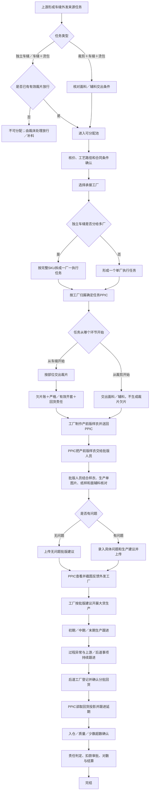

# 车缝外发协同（PPIC）全流程业务理解文档

> 文档性质：业务理解与需求确认基线，不代表相关功能已经实现。
>
> 版本：V1.7
>
> 日期：2026-09-01
>
> 适用系统：工厂生产协同系统
>
> 建议一级菜单名称：**车缝外发协同**（最终名称待产品确认）
>
> 完整调整方案：`docs/product-design/车缝外发协同（PPIC）完整调整方案.md`
>
> 实施计划：`docs/implementation-plans/2026-08-31-车缝外发协同（PPIC）实施计划.md`
>
> 需求追踪矩阵：`docs/requirement-traceability/2026-08-31-车缝外发协同（PPIC）需求追踪矩阵.md`
>
> V1.2修订：明确“产前版样衣”是三方工厂制作的实物，“批版建议”才是批版人员核对、给出建议并上传系统的业务节点。
>
> V1.3修订：按实际使用反馈精简页面，删除独立“综合查询”；车缝任务的专业入口统一收进操作列；PPIC确认收到产前版样衣时必须上传本次实物照片；补料跟进和责任移交菜单必须显示有效图标。
>
> V1.4修订：我的工作台改为登录人视角的全局汇总与专业入口，不展示车缝任务列表；PPIC管理人员明确为婕哥、凌云；“裁片交出与欠片”更名为“交出与欠片”并按未交出、已交出不欠片、已交出且欠片分组；裁片退仓改为PPIC线下收到工厂申请后在系统建单，仓库只接收；暂时完整删除PPIC侧“对数与结算跟进”菜单、路由、页面和专属代码。
>
> V1.5修订：依据线下真实批版单和登记台账，批版建议改为“批版面料、工艺意见、用料意见、其他意见”四类结构化记录；登记身份明确为日期、SPU、PO、三方车缝工厂、产前版样衣照片、批版单佐证和批版人员；PPIC接收产前版样衣时支持多张照片的选择、预览、删除、保存和回看。
>
> V1.6修订：根据实际页面复核，把车缝外发专业台账统一为标准列表；业务状态Tab与搜索筛选分区；“交出与欠片”改为任务清单进入完整明细，部位排除仅允许整个部位或缺口达到一半的结构性缺失并支持取消；补料跟进只保留仍有裁片欠片的任务；裁片退仓把实物退仓数量与工厂回货责任调整数量分开，并按退仓原因决定是否提出责任调整。
>
> V1.7修订：车缝外发协同的7个专业二级菜单页面统一使用同一套业务Tab、筛选区和列表骨架；凡存在搜索模块必须提供“查询”“重置”两个明确动作；除“我的工作台”外删除重复统计卡片，数量只保留在互斥业务Tab上。车缝任务按三类任务切换，责任移交按是否已有移交历史切换；隐藏的迁移审计和面辅料详情不属于二级菜单页面。

## 1. 文档目的

本文综合以下信息形成：

1. 原始附件《外发结点及需求.xlsx》`Sheet1!A1:AZ23` 中的查询诉求和外发节点流程。
2. 本轮沟通中已经明确或修正的业务事实。
3. 当前原型代码中已经存在的任务分配、裁片放行、裁片交出、回货和退仓能力；财务结算属于相邻专业域，不作为本轮PPIC菜单能力。
4. 既有车缝任务、裁片放行相关需求文档中仍有参考价值、但尚未被本轮沟通推翻的内容。

本文的目标不是简单复述附件，而是把分散的节点、数量、责任和例外统一成一条可执行、可核对、可追溯的业务链路，并明确哪些内容已经确认、哪些仍需产品继续决策。

### 1.1 事实优先级

当附件、历史文档、当前代码和本轮沟通之间存在冲突时，按以下优先级理解：

1. 本轮沟通中用户明确确认的业务事实。
2. 原始附件表达的业务目标和节点。
3. 当前代码反映的既有能力与数据结构。
4. 历史需求文档和旧规则。

因此，本文中的“目标业务规则”不等同于“当前代码行为”。两者的差异统一放在第 20 章说明。

## 2. 一句话业务定义

PPIC 不是单纯维护三方工厂档案的团队，而是对三方车缝外发任务进行全流程履约管理的团队：从任务前置条件确认、选择工厂、物料／裁片交出、产前版样衣交接、批版建议、生产跟进、回货、异常与责任判定，持续推进任务完成。对数与结算在完整业务链上仍由财务等专业团队承接，但本轮PPIC功能暂不建设相应菜单、页面或专属投影代码。

这条业务链的核心不是“派过单就结束”，而是持续回答以下问题：

- 哪个任务可以分配、最多可以分多少？
- 最终拆成了哪些实际执行任务，每个任务由哪家工厂、哪个 PPIC 负责？
- 对从车缝开始的任务，公司承诺给工厂的裁片是否已经交齐，还欠哪些颜色、尺码和部位？
- 对从裁剪开始的任务，面料和辅料是否已经交齐，当前能否开始裁剪？
- 对从车缝开始的任务，工厂根据实际收到的有效齐套裁片应当回多少件；对从裁剪开始的任务，按任务责任应当回多少件；后道工厂已经确认回货多少件，还欠多少件？
- 工厂制作的产前版样衣是否已经带回 PPIC，是否已交给批版人员，批版建议是否已经上传并反馈给工厂？
- 当前任务正常、需要关注还是已经异常；下一步应当跟进裁床、工厂、批版人员、后道还是仓库？
- 最终数量差异、少数、超数和责任如何留给相邻专业域继续处理，同时不在PPIC侧重复建设结算能力？

## 3. 业务范围与边界

### 3.1 纳入范围

PPIC 车缝外发协同覆盖三类任务：

1. **独立车缝任务**。
2. **车缝＋烫包任务**。
3. **裁剪＋车缝＋烫包任务**。

覆盖的业务阶段为：

1. 按任务类型读取前置条件：独立车缝、车缝＋烫包读取裁片齐套、目标和放行结果；裁剪＋车缝＋烫包读取面料、辅料的可交出情况。
2. 判断是否具备相应的派单条件。
3. 确定三方车缝工厂并形成实际执行任务。
4. 确定任务对应的 PPIC。
5. 核价、电子合同、通知备料和通知工厂领料。
6. 独立车缝、车缝＋烫包的裁片实际交出、部位差异、欠片、补料和退料；裁剪＋车缝＋烫包的面料、辅料交出。
7. 三方车缝工厂产前版样衣带回、PPIC交给批版人员、批版建议上传和反馈工厂。
8. 生产初期、中期、末期跟进以及过程异常。
9. 分批回货、大货入仓、样衣归还、少数和超数确认。
10. 责任判定、异常收口和任务完成跟进；对数与结算暂不纳入本轮PPIC页面范围。
11. PPIC个人工作台、异常提醒、专业入口和管理汇总；车缝任务明细只在“车缝任务”列表展示。

### 3.2 上下游边界

- **裁片放行管理仍属于裁床厂管理。** 对独立车缝、车缝＋烫包任务，裁床产生和维护齐套事实、目标数量与放行承诺；PPIC 消费放行结果并据此分配任务，不应在 PPIC 模块复制一套相互独立的放行数据。裁剪＋车缝＋烫包由承接工厂完成裁剪，不消费上游裁片放行数量。
- **裁片交出是裁床与 PPIC／三方工厂的交接。** 该交接只适用于独立车缝、车缝＋烫包。裁床负责按有效单据交出实物，系统保留实际交出明细；PPIC负责根据任务承诺跟进欠片。裁剪＋车缝＋烫包交出的是面料、辅料，不形成裁片欠片账。
- **补料操作属于裁床。** 无论补料需求由裁床发现，还是由PPIC团队负责人凌云协调判断，具体补料单都只能由裁床发起；PPIC只查看缺片、补料单及其状态，不替裁床创建或推进补料单状态。
- **后道、质检、仓储和结算仍有各自专业职责。** PPIC 工作台只汇总本轮纳入的交出、欠片、批版、回货、完成度和异常，不代替专业团队完成其动作。尤其是回货事实必须来自后道工厂管理中的回货登记和确认，PPIC不得自行填写一份回货记录；PPIC侧结算入口本轮删除。
- **裁片退仓分成两个系统动作。** 三方车缝工厂在线下向PPIC提出退仓；PPIC核对执行任务、部位和数量后在系统创建退仓申请；裁床待交出仓只按PPIC建单结果接收、记录差异并入仓，不再重复承担业务审核。

### 3.3 本文不直接确定的内容

本文不直接确定接口、数据库表、技术状态码、最终页面样式，也不把原型 Mock 数据当作真实工厂事实。工费公式、扣款公式、合同签署规则和回货时效的例外／暂停规则等尚未充分确认的内容，只说明业务原则和待确认点，不擅自固化。三类任务30%／70%／100%的标准回货时效已经由当前代码核实，不再列为待确认事项。

## 4. 角色及职责

| 角色 | 核心职责 | 不应承担的职责 |
|---|---|---|
| PPIC | 选择三方车缝工厂；跟进裁片／物料交出与欠片；提出并记录部位排除；查看补料单；接收产前版样衣时上传本次实物照片并转交批版人员；查看、截图并反馈批版建议；继续跟进生产、后道回货、退料、异常和责任；线下收到工厂退仓申请后核对部位与数量并在系统建单 | 不代替裁床制造裁片或发起补料；不代替批版人员核对样衣或编写批版建议；不自行填报后道回货、仓库实收或质量结果；不在PPIC侧确认结算 |
| PPIC管理人员（婕哥、凌云） | 查看团队范围内各类汇总、PPIC负荷和跨人员异常；按成员筛选；与裁床协调补料需求；对未完任务发起明确的PPIC责任移交 | 不直接代替裁床发起补料；不允许系统因工厂主数据归属变化而自动转移未完任务；不静默重写历史任务责任 |
| 裁床计划／管理人员 | 维护目标数量、齐套事实、放行数量及放行版本；判断并发起具体补料操作；提供欠料和预计齐料信息 | 不代替 PPIC 决定三方车缝工厂 |
| 裁床待交出仓 | 根据有效交出单交出裁片；对已由 PPIC 审核的退仓实物进行接收和入仓 | 不对退仓裁片重新作部位、数量和业务责任审核 |
| 三方车缝工厂 | 领取裁片，或领取面料、辅料并确认实收；制作一件大货产前版样衣并送回；线下向PPIC提出裁片退仓需求并交回实物；根据批版建议生产大货；按业务链路把加工结果交至后道；反馈过程异常；归还样衣和剩余物料 | 不直接登录PPIC管理端创建退仓申请；不得以未被确认的口头变更替代系统任务、欠片、批版建议或回货责任 |
| 批版人员 | 接收PPIC转交的产前版样衣，结合公司自制／留存样衣、生产单图片、纸样、面料和辅料等资料核对；记录“无问题”或“有问题＋四类结构化意见”，并把批版建议上传系统 | 不代替 PPIC 做日常工厂履约跟进；不修改裁片、回货或结算事实 |
| 后道工厂／后道团队 | 承接烫包及其他后道节点；登记和确认实际回货数量、时间与差异；反馈接收、生产、回货和异常 | 不修改上游裁片交出事实，不以申报数量覆盖最终确认数量 |
| 质检／复检 | 确认质量结果、返工、报废等质量事实 | 不直接改变工费或扣款，除非通过正式责任与结算流程 |
| 仓库 | 确认大货或退料的物理接收和入仓 | 不代替 PPIC、质检或财务作业务责任判定 |
| 财务／结算 | 根据有效任务、核定工价、合格接收数量和已审批调整形成对账与结算 | 不把目标数量、放行数量或未经确认的回货数量直接当成结算数量 |

## 5. 核心业务对象与关系

### 5.1 对象定义

| 业务对象 | 业务含义 |
|---|---|
| 上游车缝来源任务 | 生产需求生成的原始任务，用于表达需要完成的SKU集合和总需求。拆分后主要承担汇总作用 |
| 车缝实际执行任务 | 真正由一家三方车缝工厂承接、由一个PPIC跟进的任务，是物料／裁片交出、产前版样衣、批版建议、生产、回货、异常和结算追溯的主对象 |
| 工厂分配 | 确定承接工厂并形成实际执行范围的业务动作；独立车缝按完整SKU分配并占用裁片放行额度，两个组合任务整任务分配 |
| 裁片放行版本 | 裁床对独立车缝、车缝＋烫包任务的某批SKU或颜色尺码作出的可分配数量承诺，必须保留版本和修改历史 |
| 裁片实际交出 | 公司为独立车缝、车缝＋烫包任务实际交给工厂的裁片事实，记录批次、颜色、尺码、部位和片数 |
| 面辅料实际交出 | 公司为裁剪＋车缝＋烫包任务实际交给工厂的面料、辅料事实，按各自物料编码、规格和单位记录 |
| 裁片欠片账 | 按独立车缝、车缝＋烫包任务承诺应交给工厂、但尚未累计交出的裁片数量，单位为“片” |
| 严格齐套数量 | 对存在裁片交出的任务，不排除任何必需裁片部位时，按实际累计交出裁片可组成的成衣数量，单位为“件” |
| PPIC调整后有效齐套数量 | 对存在裁片交出的任务，经有权限的PPIC临时排除部分未及时裁出的部位后，用剩余纳入计算的部位计算出的有效齐套数量 |
| 工厂回货责任账 | 工厂根据有效齐套裁片应回、已回、待回的成衣数量，单位为“件” |
| 产前版样衣 | 三方车缝工厂收到裁片／物料后制作并送回的一件大货产前版实物；样衣名称仍为“产前版样衣” |
| 批版建议 | 批版人员根据产前版样衣和公司样衣、生产单图片、纸样、面辅料等资料形成并上传的核对结论；这是业务动作、节点和系统记录的名称 |
| 后道回货批次 | 后道工厂管理中登记并确认的每次回货事实，包含申报、复核数量、日期、差异、接收和质量去向，是PPIC回货查询的数据来源 |
| 补料单 | 对应缺失裁片的补充业务单据，只能由裁床发起和推进；PPIC只查看关联与状态 |
| 裁片退仓单 | PPIC线下收到工厂退仓需求、核对未使用或多余裁片后创建的业务单据；系统内包含PPIC建单与仓库接收／异常／入仓事实，不存在工厂线上提交或PPIC二次审核状态 |
| 少数／超数记录 | 最终回货、入仓或对数时相对责任数量出现的少回、多回及原因记录，不等同于任意一个部位少两片 |
| 责任与扣款单 | 对已经确认的差异、质量或无正当理由欠数进行责任判定后形成的结算调整依据 |

### 5.2 对象关系

“独立车缝单厂”和“独立车缝多厂”不是两种任务类型，而是同一类独立车缝任务在工厂分配后的两种结果。拆分后的上游来源任务可以汇总查看整体进度，但不能用来源任务覆盖每个执行任务的工厂、PPIC、交出、回货和结算事实。

## 6. 车缝任务分配与拆分规则

### 6.1 三类任务的分配规则

| 任务类型 | 是否允许分给多家三方车缝工厂 | 分配颗粒度 | 分配后对象 |
|---|---:|---|---|
| 独立车缝 | 允许 | 完整SKU；同一SKU的数量不能拆给多家工厂 | 无论单厂还是多厂，一家工厂生成一个独立执行任务 |
| 车缝＋烫包 | 不允许 | 整个组合任务 | 一个任务对应一家工厂；后续存在裁片交出和欠片 |
| 裁剪＋车缝＋烫包 | 不允许 | 整个组合任务 | 一个任务对应一家工厂；后续只交面料、辅料，不存在裁片欠片 |

“完整SKU”表示该SKU在当前可分配任务中的全部数量作为一个原子分配单元。一个来源任务包含多个SKU时，可以把不同完整SKU分给不同工厂；不能把同一个SKU的1000件拆成工厂A 600件、工厂B 400件。

### 6.2 一厂一任务

独立车缝任务一旦分给多家工厂，不是在同一张执行任务上增加多个工厂字段，而是生成多张实际执行任务：

- 一个三方车缝工厂对应一个执行任务。
- 一个执行任务只对应一个PPIC。
- 对适用任务，裁片承诺、实际交出、欠片和部位排除均绑定执行任务；三类任务的产前版样衣、批版建议、生产进度、后道回货、异常、责任和结算也都绑定执行任务。
- 来源任务只汇总各子任务进度和数量，不能替代子任务作为操作对象。

### 6.3 分配额度

以下放行额度规则只适用于独立车缝、车缝＋烫包。对每个SKU／颜色尺码，当前有效分配数量之和不得超过当前有效放行数量：

`可继续分配数量 = 当前有效放行数量 - 当前有效分配数量合计`

已撤销且不再生效的分配可以释放额度；从一家工厂明确改派到另一家工厂时，应形成可追溯的撤销和新分配，不能直接覆盖原工厂记录。

## 7. PPIC 与工厂、任务的责任关系

### 7.1 关系形成时间

正常主数据关系是一个PPIC跟进多家三方车缝工厂，即 `PPIC 1:N 工厂`；同一时点，一家正式三方车缝工厂必须且只能有一个有效PPIC归属。这是正式工厂档案的必填不变量，不是派单时才允许暴露的普通异常。

但任务对应的PPIC不是在上游任务生成时预先指定，而是在选择工厂后才能确定：

1. 未分配任务进入团队共享的待分配池，此时没有任务PPIC。
2. 当前登录的有效PPIC（含团队负责人凌云）选择承接工厂；生产计划员等其他岗位不能代替PPIC完成含车缝任务分配。
3. 系统读取该工厂当时有效的PPIC归属。
4. 生成的一厂一执行任务确定工厂和PPIC。
5. 该任务进入对应PPIC的个人工作台。

分配动作和任务跟进责任是两个需要分别冻结的事实：系统既要记录“哪名PPIC执行了本次分配”，也要记录“该工厂对应的哪名PPIC负责后续任务”。两者在正常情况下可以是同一人，也可能因团队负责人代分配、工厂归属或后续显式移交而不同，不能只保留一个名字。

当前原型中既有正式三方车缝工厂档案如果缺少PPIC，必须一次性全部补齐；以后新增或转正式时也不得保存没有唯一有效PPIC的正式工厂档案。派单仍保留最后一道防御性校验，以防异常数据绕过主数据约束，但正常业务中不应出现“无PPIC工厂”。

### 7.2 历史责任

任务形成后，工厂主数据中的PPIC归属如果发生变化，不应静默改写历史操作人和已经发生的履约事实：

- 新归属只用于此后新形成的执行任务。
- 已完成任务永远保留任务形成时的PPIC责任记录。
- 尚未完成任务不得自动转给新PPIC，必须由PPIC团队负责人凌云发起明确的责任移交。
- 移交必须列明原PPIC、新PPIC、移交时间、未完执行任务、剩余数量、未闭环事项、最近承诺和操作人；新PPIC确认接手后才进入其工作台。

## 8. 裁片放行：三种数量和两个硬门禁

本章只适用于从已裁好的裁片开始生产的**独立车缝任务**和**车缝＋烫包任务**。裁剪＋车缝＋烫包任务由承接工厂完成裁剪，不读取或占用上游裁片放行数量。

### 8.1 三种数量必须并存

| 数量 | 业务含义 | 性质 |
|---|---|---|
| 当前齐套数量 | 根据当前已经具备的各必需裁片部位，能够严格组成多少件衣服 | 物理事实，系统计算 |
| 目标数量 | 本轮计划希望完成或放行的数量 | 计划目标 |
| 放行数量 | 裁床明确承诺可以进入PPIC分配池的数量 | 业务承诺和分配上限 |

理想情况下三者一致，但实际可能不一致。例如目标1000件、当前严格齐套800件、裁床放行1000件，表示裁床对1000件作出放行承诺，但当前还有部位欠片需要后续补齐；这不是把当前齐套数量改成1000。

三者不一致时，页面和查询必须同时展示，不允许用一个“可用数量”把三种含义混在一起。

### 8.2 门禁一：没有放行，不得分配

只有裁片放行管理形成了具体、有效的放行数量后，PPIC才能分配相应的独立车缝或车缝＋烫包任务。以下情况均不得派单：

- 尚未形成放行记录。
- 放行记录仍为草稿或已撤销。
- 对应SKU／颜色尺码没有可用放行数量。
- 本次分配后累计有效分配数量将超过放行数量。

这是一条硬门禁，不是“提示风险后仍可继续”。

### 8.3 门禁二：放行数量不得调低到已分配数量以下

一旦已经存在有效车缝分配，修改后的放行数量必须满足：

`新放行数量 >= 当前有效分配数量合计`

若任意SKU／颜色尺码不满足，整次修改保存失败，旧放行版本继续有效。系统必须明确指出冲突明细，例如：

- SKU：蓝色／M码；
- 当前有效放行：1000件；
- 已分配：800件；
- 拟修改：700件；
- 最低允许修改值：800件。

不采用“先把放行改低，再生成已分配超放行异常”的做法，因为这会让已经生效的工厂任务失去合法数量来源。

### 8.4 放行版本与追溯

每次有效放行或修改至少保留：放行对象、SKU／颜色尺码、三种数量、修改前后值、原因、操作人、审核人和时间。分配、欠片和后续结算必须能够追溯到当时生效的放行版本。

### 8.5 裁剪＋车缝＋烫包的前置条件

裁剪＋车缝＋烫包任务从裁剪开始，分配后公司交给承接工厂的是面料和辅料，因此：

- 不以裁片放行数量作为派单额度；
- 不生成裁片实际交出、裁片欠片、严格齐套或人为排除部位；
- 应分别记录面料、辅料的应交、实交、单位和差异；
- 面辅料是否已具备开工条件必须可见，但不得把面辅料差异伪装成裁片欠片。

## 9. 裁片实际交出与两本数量账

本章两本账只适用于独立车缝和车缝＋烫包。裁剪＋车缝＋烫包没有裁片交出及欠片，只维护面料、辅料交出事实和后续产出／回货责任。

### 9.1 实际交出允许不齐套

放行和分配之后，裁床实际交出的裁片可能出现：

- 某个尺码整体少交；
- 某个尺码的某个部位多交；
- 另一个部位少交；
- 某个部位完全没有裁出；
- 某个部位只交出约一半；
- 分多批逐步补交。

因此，裁片交出不能只记录“交出800套”，也不能因为不齐套就禁止交出。必须按执行任务、交出批次、SKU／颜色、尺码、裁片部位和片数保留事实。

### 9.2 第一本账：公司／裁床欠三方工厂的裁片

这本账回答“按照已经分给该工厂的数量，公司还欠工厂哪些裁片”。单位是“片”。

对每个执行任务、SKU／颜色尺码和裁片部位：

`部位应交片数 = 该任务已分配数量 × 每件用片数`

`部位欠片数 = max(0, 部位应交片数 - 累计有效实交片数)`

规则如下：

- 一个部位多交不能抵消另一个部位少交。
- 多交部分单独记录为超交，不把欠片账算成负数。
- 欠片始终保留到补交、正式放弃或任务按明确规则收口。
- 放行数量是来源任务的总承诺；拆成多个执行任务后，每个工厂的欠片按该执行任务实际占用的分配数量计算，不能给每个工厂重复套用总放行数量。

### 9.3 第二本账：三方工厂欠公司的回货

这本账回答“根据工厂实际收到的有效齐套裁片，工厂应回多少件、已回多少件、还应回多少件”。单位是“件”。

至少区分：

- 严格齐套数量；
- PPIC调整后有效齐套数量；
- 工厂回货责任基数；
- 累计已确认回货数量；
- 待回货数量；
- 超回数量。

计算原则为：

`严格齐套数量 = 所有必需部位按每件用量折算后可组成件数的最小值`

`有效齐套数量 = 经有效排除后，所有仍纳入计算部位可组成件数的最小值`

`待回货数量 = max(0, 当前回货责任基数 - 累计已确认回货数量)`

回货责任基数随着有效交出或有效排除增加时，应累计更新但不得重复增加。同一批补交裁片只是补齐原欠片时，不能让1000件责任错误变成1500件或1002件。

### 9.4 两本账不能相互替代

即使通过排除部位把有效齐套数量提高到1000件，公司仍可能欠工厂1000片口袋；即使工厂已经回货1000件，也不代表欠片记录自动消失、回货全部质量合格或可以直接按1000件结算。

因此必须同时保留：

1. 裁片部位欠片事实；
2. 工厂回货责任；
3. 实际回货接收；
4. 质量与结算确认。

## 10. 人为排除部位的真实业务含义

人为排除部位只存在于独立车缝和车缝＋烫包的裁片齐套计算中，不适用于裁剪＋车缝＋烫包。

### 10.1 为什么要排除

排除部位主要不是为了处理“偶尔少两片”的微小差异，而是处理裁床未能及时裁出某个部位的结构性缺失，例如：

- 1000件任务的某个口袋部位一片都没有交出；
- 某个花边或小部位只交出500件对应片数；
- 主体裁片已经足以连续生产，但某个非主体部位将严格齐套数压到0或一半。

PPIC为了让主生产能够继续，可以在有业务依据的情况下临时把该部位排除出本次有效齐套计算。

### 10.2 排除改变什么、不改变什么

排除部位只改变“本次工厂回货责任所采用的有效齐套计算口径”，不改变以下事实：

- 该部位仍是款式所需裁片，不从BOM或任务需求中删除。
- 裁床／公司对工厂的欠片仍然存在。
- 后续仍要跟进补裁、补交或正式业务处置。
- 排除不代表批版建议无问题、质量合格、成衣完整、仓库已收或可以结算。
- 后续补交原欠片时，只消减欠片，不重复增加已经形成的回货责任。

### 10.3 两个典型场景

**场景A：整个部位缺失**

- 任务分配：1000件。
- 主体各部位：均可组成1000件。
- 口袋：0片。
- 严格齐套：0件。
- PPIC排除口袋后有效齐套：1000件。
- 工厂回货责任基数：1000件。
- 裁床欠工厂：口袋1000件对应片数。

**场景B：某部位缺少一半**

- 任务分配：1000件。
- 主体各部位：均可组成1000件。
- 花边：只够500件。
- 严格齐套：500件。
- PPIC排除花边后有效齐套：1000件。
- 裁床仍欠：花边500件对应片数。
- 工作台应突出“花边缺50%、已排除、待裁床补交”，而不是只显示一个笼统的欠片数字。

### 10.4 排除记录要求

每次排除至少记录：

- 执行任务、工厂和PPIC；
- SKU／颜色、尺码和被排除部位；
- 当前应交、实交、欠片和缺口比例；
- 排除原因及必要图片／说明；
- 严格齐套数量和调整后有效齐套数量；
- 是否临时、预计补齐时间、裁床责任人；
- 提出人、审核人和生效时间；
- 取消排除或补齐后的收口记录。

### 10.5 工作台提醒颗粒度

欠片明细账必须精确，但个人工作台不能按任意固定片数生成高优先级事项。业务上重点关注的是整个部位没有裁出、某部位缺口达到需求量一半、已经人为排除、已影响生产或发生逾期；没有达到这些条件的局部差异仍保留在任务详情中。出现以下情况时突出为PPIC待办或异常：

- 整个部位缺失；
- 缺口比例较高；
- 已使用人为排除；
- 已影响产前版样衣制作、批版建议、连续生产、回货或交期；
- 补料承诺已到期或多次跟进无结果。

已确认“缺口达到需求量一半”应突出；除此以外是否升级，继续依据排除决定、生产影响和时效判断。系统不得使用“欠片大于0”、固定50片或“只少几片”等任意绝对数量阈值。

### 10.6 排除动作的进入、取消与追溯

“部位排除”不能出现在所有欠片行上。只有当前部位仍有欠片，并且属于“整个部位未交”或“缺口达到该部位应交数量一半”的结构性缺失时，当前任务PPIC才能发起排除。低于一半的局部欠片继续保留在明细账和补料跟进中，但不提供排除按钮。

有效排除必须支持由当前任务PPIC明确取消。取消后恢复该部位参与后续有效齐套计算，保留原排除版本、取消原因、取消人员和时间；已经基于合法交出／排除形成的历史回货责任不得被静默倒减。

## 11. 产前版样衣与批版建议

### 11.1 业务定义

三方车缝工厂收到PPIC分发的裁片，或收到裁剪＋车缝＋烫包任务所需的面辅料后，先制作一件大货产前版并送回。这件实物在业务上仍叫**产前版样衣**，不是“批版建议”。

PPIC接收产前版样衣后，把实物交给批版人员。批版人员结合公司内部已制作／留存的样衣、生产单图片、纸样、面料、辅料等资料进行核对，判断这件衣服是否存在问题。批版人员在系统中形成的结论和四类结构化意见，才叫**批版建议**。

因此必须区分：

- **产前版样衣**：三方车缝工厂制作并送回的实物对象；
- **批版建议**：批版人员核对实物和生产资料后上传系统的业务动作、节点及记录。

两者都必须绑定具体执行任务和具体工厂，批版建议还必须绑定本次核对所依据的产前版样衣。

### 11.2 与PCS现有样衣名称的关系

三方车缝工厂拿到实际外发执行任务后制作并送回PPIC的第一件大货产前版，才是真正的**产前版样衣**。

PCS当前使用“产前版样衣”名称的商品开发／工程阶段样衣，业务实质是**首单样衣**。两个对象发生阶段、责任主体和用途不同：

- PCS：首单样衣，用于商品开发／工程阶段；
- 车缝外发：产前版样衣是工厂制作的实物，批版建议是批版人员的大货生产前核对意见。

因此不能合并记录，也不能继续让两个对象共用“产前版样衣”名称。PCS现有相关页面、字段和文案应统一更名为“首单样衣”；车缝外发系统中的业务节点、页面和记录统一使用“批版建议”，页面内再展示关联的“产前版样衣”实物信息。

### 11.3 批版建议流程与证据

该节点至少经历：

1. 待工厂制作产前版样衣；
2. 产前版样衣待送回PPIC；
3. PPIC已接收，待交批版人员；
4. 批版人员核对中；
5. 批版建议已上传；
6. PPIC已查看并反馈外发工厂；
7. 工厂根据批版建议生产大货；
8. 产前版样衣归还／留存处理。

批版人员的核对依据至少包括：公司内部已制作／留存样衣、生产单图片、纸样、面料和辅料信息；如实际业务还有工艺单、尺寸表等资料，应作为同一次批版所引用的资料版本记录。

PPIC确认收到产前版样衣时，必须上传本次实物照片。现场可能需要从正面、侧面、背面和局部细节留证，因此照片不是单值字段：一次可以选择多张，也可以分次追加；提交前能够预览和逐张删除；确认接收后全部照片按原顺序绑定本次产前版样衣。列表展示多张代表缩略图和照片总数，详情、批版建议卡及大图入口可以回看全部照片，不能退化成只保存第一张。

批版结论分为：

- **无问题**：记录无问题结论，说明工厂可按当前产前版样衣和生产资料执行大货；
- **有问题**：必须按线下批版单至少填写一类结构化意见，明确工厂后续大货应如何制作。

线下批版单的正式分类必须在系统中保持一致：

1. **批版面料**（Persetujuan Kain untuk Sampel）：面料、色差、裁片编号和配套等意见；
2. **工艺意见**（Catatan Proses/Metode Produksi）：车缝工艺、部位位置、线路和制作方法等意见；
3. **用料意见**（Catatan Pemakaian/Penggunaan Bahan）：面辅料用法、松量、拉伸和安装等意见；
4. **其他意见**（Catatan Lainnya）：前述分类之外、工厂生产大货必须注意的事项。

“有问题”时四类意见至少填写一项；没有意见的分类明确展示“无”，不能用一个无法归类的“具体建议”大文本替代四类记录。批版人员和批版日期由领取人身份与提交时间自动形成，不要求再次手填。现场手写批版单可上传一张或多张照片作为签名、日期及原始记录佐证，但其不能替代结构化意见。

“有问题”不能自动等同于“批版不通过”或“必须重新制作一件样衣”。按本次业务说明，批版人员上传四类结构化意见后，PPIC即可查看并截图发给外发工厂，工厂按意见生产大货。只有批版人员明确要求重新做版／再次批版时，才增加下一次记录；系统不得把此前未经确认的“有问题就强制整改、重新送审、通过后才能生产”固化成统一流程。

批版建议记录至少包含：建议单号、执行任务、SPU、PO、三方车缝工厂、PPIC、产前版样衣标识及全部照片、送回与转交时间、批版人员、批版日期、引用资料及版本、结论、批版面料、工艺意见、用料意见、其他意见、线下批版单佐证照片、上传时间和PPIC反馈时间。

系统需要提供适合截图的批版建议卡片：清楚显示PO、SPU、工厂、全部产前版样衣图片、结论、四类结构化意见、批版人员和日期；线下批版单照片作为可查看佐证，不把内部技术字段堆在截图主体中。系统本轮不代替即时通讯发送，PPIC仍按现场方式截图并发给外发工厂。

## 12. 从任务形成到完结的目标流程

### 12.1 附件节点的业务解释

原始附件中的“可派单／不可派单”不是人工随意选状态，而应由任务类型、放行／物料条件、核价、工艺、工厂归属等前置条件共同决定。其中，有效裁片放行是独立车缝、车缝＋烫包的硬门禁；裁剪＋车缝＋烫包不消费裁片放行。

附件中的“PPIC分单”与“确定工厂”是前后相邻但不应混成一个动作。本文暂理解为：PPIC先判断任务范围、完整SKU拆分方式和工艺路径，再进入待派单并选择实际承接工厂；最终以一厂一执行任务落地。若现场把“分单”用于其他含义，需要在页面设计前统一术语。

“派单异常”至少包括：适用任务无有效放行、分配超过放行、主数据异常导致工厂没有唯一有效PPIC、核价未完成、工厂无法承接、合同信息缺失或工艺要求无法满足。每一种异常都需要责任人、下一动作和处理结果，不能只展示一个红色状态。工厂PPIC缺失是必须在正式工厂档案层消除的数据错误，不应成为日常待处理业务。

## 13. 备料、补料和退料

### 13.1 备料与领料

工厂确定后，流程包括通知备料、备料状态反馈、生成出库单、通知工厂领料、工厂确认实收以及把数量上传系统。独立车缝、车缝＋烫包领取裁片；裁剪＋车缝＋烫包领取面料和辅料。系统应同时保留“单据应交”和“实际实交”，不能在工厂确认后覆盖原始应交数量。

### 13.2 裁片欠片、辅料欠缺和特殊工艺依赖

附件把“裁片欠缺”“辅料欠缺”和“特殊工艺是否完成”都放在派单前后需要关注的齐料链路中，但三者不能共用同一本数量账：

- 独立车缝、车缝＋烫包的裁片欠片按颜色、尺码、部位和片数进入裁片欠片账，并参与严格／有效齐套计算。
- 辅料欠缺按辅料编码、规格和业务单位跟进，不应伪装成某个裁片部位，也不直接进入裁片齐套公式。
- 裁剪＋车缝＋烫包的面料、辅料差异只进入相应的物料交出账，不生成裁片欠片或人为排除部位。
- 烫钻、绣花、烫图、四合扣等特殊工艺如果是车缝前置条件，应显示待加工数量、已完成数量和预计完成时间；如果是车缝后的节点，则作为执行任务的下游进度跟进。

辅料或特殊工艺未完成时是否一定阻断派单，需要按任务类型和工艺路径确定；无论是否允许提前选厂，都必须明确其是否阻断领料、首件或量产，不能只用一个笼统的“齐料”状态。

### 13.3 补料发起责任

具体补料操作的发起方只能是裁床。需要区分“发现／协调补料需求”和“创建补料单”两个动作：

1. 裁床可以根据欠片事实主动判断并发起补料；
2. 凌云是PPIC团队负责人，可以发现问题、与裁床沟通并推动裁床作出补料判断；
3. 即使由凌云提出需要补料，最终也必须由裁床在沟通确认后发起具体补料单；
4. PPIC个人无权另建补料单，也不手工改写补料状态。

人为排除部位、工厂实收差异、生产损耗或质量问题可以形成“需要裁床判断是否补料”的线索，但不能因此把发起权限转给PPIC或工厂。

### 13.4 补料计划与跟进

PPIC对补料是**查看和跟进关联结果**，不是补料单操作人。PPIC至少需要看到：

- PO、执行任务、工厂、PPIC；
- 缺少的SKU／颜色、尺码、部位和数量；
- 当前是否已经存在补料；
- 关联补料单号；
- 补料单当前状态，以及备料、裁剪、特殊工艺等上游实际进度；
- 当前是否已经具备交给三方车缝工厂的条件；
- 最终补交批次、实际交出数量和欠片消减结果；
- 如果裁床正式放弃补料，查看其审批、影响和责任结论。

附件中的“第一次、第二次、第三次跟进”可作为普通跟进日志的历史表达，但不应变成PPIC补料单上的三个固定操作字段。PPIC工作台只需保留通用的最近跟进、对方承诺和下次跟进时间，并以裁床补料单状态作为事实源。

补料跟进清单只承接**当前仍有裁片欠片**的执行任务。欠片清零后任务自动退出该清单，不再保留一个“已补齐／可交工厂”Tab制造重复台账。清单按“裁床尚未建补料单、裁床补料处理中、补料完成待实际交出”三个当前情况分组；补料单完成仍不等于裁片已经交给工厂，最终必须读取实际交出责任账。

### 13.5 裁片退仓职责

目标流程为：

1. 工厂在线下向负责该任务的PPIC提出退仓需求。
2. 当前任务PPIC在线下核对执行任务、裁片部位、尺码、数量、原因和必要图片。
3. PPIC在系统创建退仓申请；创建即形成确定的待仓库接收明细，不再增加“待PPIC审核”中间状态。
4. 工厂／PPIC把实物交至裁床待交出仓。
5. 裁床待交出仓按PPIC建单明细接收并入仓；发现实物差异时记录仓库异常并退回当前PPIC重新确认，但仓库不能修改PPIC建单数量。
6. 系统分别保留PPIC建单、仓库异常／接收和入仓事实。

退仓必须结构化记录原因，并把“实物退仓折算件数”与“工厂回货责任调整件数”分开：

- 多交／错发裁片退回、质量问题换片、排除部位后补交但未使用等原因，只改变裁片实物和库存，不自动冲减工厂应回成衣。
- 生产任务数量已经正式调减、剩余任务已经正式取消或转派等原因，可以提出回货责任扣减，但必须绑定明确的业务依据号。
- PPIC建单时冻结调整口径、调整前应回、拟调整件数和预计调整后应回；仓库接收入仓前只显示“拟调整”，不能提前改写责任。
- 仓库按冻结明细实际入仓后，系统才把允许调整的数量写入责任版本；仓库不能改变原因、口径或件数。

因此，退仓数量不能直接等同于责任扣减数量。任何责任变化都必须能从退仓原因、依据、PPIC建单和仓库入仓四项事实完整追溯。

## 14. 生产、回货和大货入仓

### 14.1 生产阶段

附件要求工厂在生产初期、中期和末期更新状态。阶段记录应回答：

- 当前实际做到哪一步、完成多少件；
- 是否按计划；
- 是否存在裁片、辅料、工艺、人员、设备或质量问题；
- 下一里程碑和预计完成时间；
- 最近一次PPIC跟进时间和结果。

阶段更新不是用三个勾选框代替真实进度，而是形成时间、数量、问题和责任的连续记录。

### 14.2 回货责任与后道回货事实

工厂可以分批回货，但PPIC侧不自行创建或填写回货批次。回货数据必须读取**后道工厂管理**中的回货事实：

1. 工厂登记回货时形成申报数量和送货信息；
2. 后道接收方按SKU点数；逐SKU差异率超过5%时，当前原型要求二次点数并在需要时完成差异授权；
3. 最终确认后形成每个SKU的确认数量、确认时间、确认人和“已确认待送检”状态；
4. PPIC回货查询只读取这些已确认事实形成投影，不提供另一个可手填的回货入口。

每个投影批次至少关联执行任务、车缝工厂、后道工厂、批次、计划回货日期、申报数量、最终确认数量、确认时间、差异、接收方、质量去向和后续节点。工厂申报数量不能直接当成已确认回货数量。

回货查询需要同时展示：

- 按日期应回数量；
- 当日／区间实际回货数量；
- 累计应回、累计已确认回货和待回；
- 每个批次的差异与状态；
- 超期未回数量。

“后道确认回货”是经后道工厂管理点数确认的回货事实；“大货入仓”是仓库对实物的接收结果；“质检合格”又是独立的质量结果，三者不能合并为一个完成状态。

### 14.3 回货时效

当前原型代码已经明确三类任务的30%／70%／100%累计回货时效：

| 任务类型 | 累计回货30% | 累计回货70% | 累计回货100% |
|---|---:|---:|---:|
| 独立车缝 | 第4个自然日 | 第8个自然日 | 第9个自然日 |
| 车缝＋烫包 | 第5个自然日 | 第9个自然日 | 第10个自然日 |
| 裁剪＋车缝＋烫包 | 第6个自然日 | 第9个自然日 | 第12个自然日 |

统一计算口径为：

- 业务分配日期是第1个自然日，不按滚动的N×24小时计算；
- 每个节点的截止时间为该自然日23:59:59；
- 当前代码中的计划节点累计目标数量为 `向上取整（任务分配数量 × 30%／70%／100%）`；
- 实际累计回货只能读取后道工厂管理最终确认的数量和确认时间；
- 达到节点前显示待达成，截止后未达成显示延期；达到节点的首次时间用于判断是否按时；
- 延期必须说明影响数量、原因、责任方、最新承诺和下一跟进时间。

标准时效不再待确认；只有节假日暂停、正式延期、任务中止或重派后的时效继承等例外规则仍需另行确认。

对独立车缝、车缝＋烫包，还必须把“计划节点目标”和“当前可归责给工厂的应回数量”分开：计划仍按任务分配数量计算；工厂当前应回不得超过已经交出的有效齐套数量。因裁床欠片导致计划目标暂时无法形成有效齐套的差额，应指向裁床跟进，不能自动算成工厂延期责任。裁剪＋车缝＋烫包没有裁片欠片约束，按整任务分配责任计算。

## 15. 少数、超数、异常、责任和扣款

### 15.1 少数和超数

附件中的“少数／超数”应理解为任务回货、入仓或最终对数时的数量差异类别，而不是把每一个裁片部位的微小欠片都称为少数。

至少区分：

- 裁片应交与实交差异，单位为片；
- 有效齐套与工厂回货差异，单位为件；
- 工厂申报回货与仓库实收差异，单位为件；
- 仓库实收与质检合格差异，单位为件；
- 最终可结算数量与任务分配数量差异，单位为件。

只有先说明是哪一层差异，少数或超数才有业务意义。

### 15.2 异常分类

建议按责任环节分类，而不是全部堆在“异常查询”：

- **分配异常**：适用任务无放行、超放行、工厂PPIC主数据损坏、核价／合同问题。
- **裁床异常**：结构性欠片、补料超期、交出差异。
- **工厂异常**：拒绝接单、产前版样衣未送回、未按批版建议生产、生产停滞、回货延期、无正当理由欠数。
- **批版建议异常**：产前版样衣已送回但未及时交给批版人员、批版建议未上传、“有问题”但四类结构化意见均为空或PPIC尚未反馈工厂。
- **后道异常**：烫包或其他后道接收、生产、回货异常。
- **仓储异常**：申报与实收不一致、待入仓超期。
- **质量异常**：不合格、返工、报废。
- **结算异常（相邻专业域）**：数量未对清、工价未冻结、责任未判定、扣款未审批；本轮不投影为PPIC菜单、页面或工作台卡片。

### 15.3 责任判定和扣款

扣款不能由“存在欠数”自动触发。至少要经过：

1. 差异事实确认；
2. 原因和证据补充；
3. 责任方判定；
4. 是否存在正当理由；
5. 扣款依据、金额或数量确认；
6. 审批和申诉／复核；
7. 进入对账与结算。

附件中的“无正当理由欠数”是扣款查询重点，但什么属于正当理由、不同责任类型如何扣款以及审批层级，仍需财务和业务共同确认。

## 16. PPIC个人工作台

### 16.1 为什么必须有个人工作台

PPIC团队约20多人，需要跟进600多家三方车缝工厂。普通PPIC如果每次从全局任务中筛选数百家工厂，会遗漏真正需要处理的事项。系统登录后应直接告诉当前PPIC：

- 我负责的正在执行任务和工厂分别有多少；
- 哪些正常推进；
- 哪些需要关注；
- 哪些已经异常；
- 下一步要找谁、做什么、最晚什么时候完成；
- 我已经跟进过什么，对方最新承诺是什么。

### 16.2 数据归属

- 未选择工厂的任务没有任务PPIC，应进入团队共享的“待分配任务”池。
- 选择工厂并形成执行任务后，任务才计入该工厂对应PPIC的个人工作台汇总。
- 一厂一任务拆分后，各PPIC只汇总和跟进自己的实际执行任务；来源任务可由管理人员进行聚合查看，具体任务行仍在“车缝任务”页。
- 个人工作台按执行任务中冻结的PPIC责任取数，不能仅按工厂当前主数据反查；工厂换归属后，未完任务只有在婕哥或凌云完成明确移交后才从原PPIC汇总转入新PPIC汇总。

### 16.3 两个判断维度

**健康程度：**

- 正常：按计划推进，有明确责任人和下一期限，当前不存在冲突。
- 需关注：尚未构成严重异常，但出现结构性缺口、临近期限、承诺待兑现或多次跟进未闭环。
- 异常：已阻断派单、生产或回货，或者明确超期、责任冲突、数据矛盾。

“正常”不等于“已完成”，只表示当前推进符合计划。

**下一责任方：**

- PPIC本人；
- 裁床；
- 三方车缝工厂；
- 批版人员；
- 后道工厂／后道团队；
- 质检／复检；
- 仓库；
- 财务／结算属于相邻专业域，本轮不作为PPIC工作台责任方入口。

### 16.4 工作台结构

“我的工作台”本质是登录人视角的全局情况汇总和入口，**不得渲染车缝任务列表、任务行、分页表格或任务操作列**；具体执行任务只在“车缝任务”页面展示。工作台至少提供以下汇总入口：

1. **还未交出**：已分配但尚未形成对应交出事实的车缝任务数量。
2. **已交出且欠片**：已交出、仍存在结构性欠片或需要继续跟进裁床的任务数量。
3. **待批版闭环**：产前版样衣尚未送回、尚未形成批版建议或建议尚未反馈工厂的数量。
4. **回货临期／未达成**：按30%／70%／100%节点汇总临期或未达成任务。
5. **尚未完成**：仍在生产或回货中的任务数量。
6. **异常或数据不完整**：责任、来源或业务事实存在明确异常的数量。
7. **下一责任方**：按裁床、三方车缝工厂、批版人员、后道和仓库汇总，作为进入相应专业页面的入口。

本轮已经删除PPIC侧结算功能，因此工作台不展示“已完成未结算”卡片；如未来重新纳入，必须先恢复正式需求、数据来源和权限设计，不能只补一个统计数字。

工作台的提醒应基于业务结构和影响，而不是“任意差异都报警”。整个部位缺失、缺口达到需求量一半、已排除、影响生产或逾期必须突出；其他局部差异保留明细，并在影响生产或临近收口时升级。

普通PPIC的个人工作台身份直接来自当前登录用户，只汇总当前责任版本属于本人的任务，不提供前端身份切换器。婕哥、凌云是当前两名PPIC管理人员，使用团队工作台查看全组汇总并可按成员筛选；成员筛选只是管理查询范围，不得伪装为切换成某名普通PPIC执行其业务动作。

## 17. 一级菜单与信息架构建议

### 17.1 一级菜单名称

不建议使用“PPIC管理”。这个名称更像人员、组织或权限管理，不能表达裁片、车缝任务、批版建议和回货的完整业务。

建议名称为：**车缝外发协同**。

理由：

- “车缝外发”准确限定核心业务对象；
- “协同”能够覆盖PPIC与裁床、三方工厂、批版人员、后道和仓库之间的跨团队推进；
- 即使以后岗位名称变化，菜单仍然以业务命名，不依赖组织名称。

若需要更短的菜单文案，可以使用“车缝外发”；“PPIC工作台”适合作为子菜单或页面名称，不适合作为整个一级业务域名称。

### 17.2 建议子菜单

1. 我的工作台；
2. 车缝任务；
3. 交出与欠片；
4. 批版建议；
5. 回货跟进；
6. 补料跟进；
7. 裁片退仓；
8. 责任移交。

不再设置独立“综合查询”菜单；“对数与结算跟进”也暂时完整删除。附件的16类查询是业务信息诉求，不等于必须建设一个聚合页面；本轮保留的信息分别由我的工作台、车缝任务操作列、各专业跟进页面及任务详情承载，避免再造重复数据和穿透入口。

裁床厂管理中的“裁片放行管理”继续保留为裁床操作入口；PPIC侧展示其结果和可用额度，并可以穿透查看来源。“交出与欠片”按“未交出、已交出不欠片、已交出且欠片”三个Tab展示，未交出任务在交出发生前不判欠片。裁片退仓页提供“新增退仓申请”入口，操作身份明确为当前任务PPIC；仓库侧只负责接收、记录差异和入仓。

批版建议、补料跟进、回货跟进和裁片退仓等专业页也应按“当前情况”设置直接可读的Tab或分组，让PPIC一眼识别待处理、异常和已完成状态，而不是先理解技术状态码后再筛选。

## 18. 附件中的16类查询诉求

本章保留附件原始信息需求用于追溯，但V1.3明确：这些查询主题不再对应一个独立“综合查询”页面。每项信息应回到工作台、车缝任务详情或对应专业页面读取；删除聚合页面不代表删除其真实业务数据。

附件“回货查询”一行出现的“回回”按上下文理解为“应回／回货”。“发货”结合后续出库、领料和数量确认节点，统一理解为公司向三方工厂交出生产物料：独立车缝、车缝＋烫包交裁片；裁剪＋车缝＋烫包交面料和辅料。

| 编号 | 查询主题 | 业务理解 | 主要口径与注意点 |
|---:|---|---|---|
| 1 | 发货查询 | 查询公司向三方工厂实际交出裁片或面辅料的日期和数量 | 按任务类型展示交出对象及单位，不与工厂回货混用，并按实际交出批次统计 |
| 2 | 回货查询 | 查询不同日期计划应回和后道实际确认回货数量 | 展示应回、后道已确认回货、待回、超期和后道回货批次；PPIC不可手填 |
| 3 | 生产进度查询 | 查询订单当前环节及各环节发生时间 | 应基于执行任务里程碑，不只显示一个百分比 |
| 4 | 状态查询 | 按已派单、待派单、派单异常、生产中、完结分类汇总 | 状态必须有明确进入条件；拆分来源任务与执行任务不可重复计数 |
| 5 | 异常查询 | 查询派单异常和生产过程异常 | 必须展示异常类型、影响数量、责任方、下一动作和期限 |
| 6 | 数量差异查询 | 对比裁剪、交出、回仓等数量 | 先明确比较层级和单位；片与件不能直接相减 |
| 7 | 少数汇总查询 | 汇总每种少数原因 | 以已确认的回货／入仓／结算差异为主，按原因和责任汇总 |
| 8 | 延期汇总查询 | 展示超期未完成任务 | 展示超期节点、超期时长、影响数量、最新承诺和PPIC |
| 9 | 订单详情 | 查看工厂、PPIC、裁剪数量、等级、入仓数量、回货批次、交期、工艺和欠数 | 实际操作主对象应为执行任务；来源任务提供聚合穿透 |
| 10 | 扣款查询 | 查询无正当理由欠数等扣款 | 只查询已形成责任和审批依据的扣款，不把未判定异常直接视为扣款 |
| 11 | 补料查询 | 通过PO查看缺片与裁床补料单 | 展示缺少部位／数量、是否已有补料、补料单号、当前状态和是否可交工厂；PPIC只读，具体补料由裁床发起 |
| 12 | 退料查询 | 查询系统登记的退料并推送裁床 | PPIC审核部位和数量，裁床待交出仓按审核结果接收和入仓 |
| 13 | 产量展示 | 展示当日回货、总体平均回货、单个工厂平均回货 | 必须明确统计区间、执行任务去重和“回货”确认口径 |
| 14 | 工费查询 | 查询款式难度等级和工费 | 读取任务分配时核定／冻结的工价版本；最终结算仍以有效结算规则为准 |
| 15 | 跟单查询 | 汇总每个PPIC每月跟单情况 | 不只统计任务数，还应区分负责工厂、任务量、完成量、异常、超期和跟进闭环 |
| 16 | 特殊工艺查询 | 按烫钻、绣花、烫图、四合扣等查看相关工艺汇总 | 区分车缝前置依赖和车缝后续节点，能够穿透到具体执行任务和进度 |

## 19. 状态、里程碑与完结条件

### 19.1 建议里程碑

业务上至少要能识别以下里程碑，而不是要求实现为一套扁平状态枚举：

1. 待形成放行；
2. 已放行、待分配；
3. 分配异常；
4. 已确定工厂、已确定PPIC；
5. 核价／合同／备料处理中；
6. 待领料／交出中；
7. 存在欠片／补料中；
8. 待产前版样衣制作／待送回／待PPIC转交批版人员；
9. 批版中／批版建议已上传／PPIC已反馈工厂；
10. 生产初期／中期／末期；
11. 回货中／回货延期；
12. 大货待入仓／已入仓；
13. 少数超数待确认；
14. 责任与扣款待处理；
15. 待对数／待结算；
16. 已完结。

同一任务在一个时间点可能同时具备“生产中”和“裁床欠片”等不同维度，系统不应强迫用一个状态丢失其他事实。建议把阶段、健康程度、责任方和数量责任分开表达。

### 19.2 完结原则

任务不能只因生产结束或最后一批回货就自动完结。至少需要确认：

- 任务范围内的执行SKU已经完成或有正式终止决定；
- 回货批次和仓库实收已经对清；
- 产前版样衣记录、批版建议、PPIC反馈工厂事实和样衣去向已处理；
- 对适用任务，裁片欠片、退仓已有收口方式；三类任务的少数和超数均已有收口方式；
- 质量、返工和报废结果已确认；
- 责任和扣款无未决事项；
- 工费和结算数量已确认；
- 对账完成。

具体哪些项目是强制完结门禁，仍需结合财务和仓储规则最终确认。

## 20. 当前代码能力与目标业务的主要差异

本章只用于说明现状，不把现有原型行为视为最终业务规则。

| 业务主题 | 当前代码事实 | 与目标业务的差异／结论 |
|---|---|---|
| 一级菜单 | 已新增“车缝外发协同”一级业务域和8个直接入口 | 本轮已删除综合查询与PPIC对数结算入口，保留个人／团队汇总和专业页面 |
| 工厂PPIC归属 | 工厂档案已有 `assignedPpicId/Name/Phone` 字段；核查时原型正式车缝工厂样例存在空归属，本轮已在主数据读写层补齐21家正式车缝工厂，并把原默认占位身份替换为启用PPIC，同时增加“正式车缝工厂不得缺失、无效或占位PPIC”检查 | 当前原型21家均有唯一启用PPIC且无默认占位身份；真实20多人和600多家工厂的生产归属清单仍须由业务提供并单独迁移，不能用Mock证明生产数据已补齐 |
| 任务PPIC责任 | 执行任务已冻结工厂当时的 `assignedPpicId/Name`，责任移交记录保留原、新PPIC和剩余事项 | 工厂归属变化不得自动更新未完任务，必须由婕哥或凌云显式移交 |
| 独立车缝拆分 | `runtime-process-tasks.ts` 已支持按完整SKU分组、多工厂后生成一厂一执行任务 | 与本轮确认方向基本一致；后续所有履约事实必须以执行任务为主对象 |
| 组合任务分配 | `merged-production-task.ts` 当前仍把车缝＋烫包、裁剪＋车缝＋烫包定义为SKU颗粒度 | 与“两个组合任务必须整任务分给一家工厂”冲突，应按本轮确认修正 |
| 任务前置条件 | `task-fulfillment-policy.ts` 只对独立车缝、车缝＋烫包启用车缝齐料上下文，对裁剪＋车缝＋烫包关闭 | 与本轮确认的裁片／面辅料边界一致；还需把对应页面和数量账全部按类型收口 |
| 裁片放行 | 已有当前齐套、目标、放行及版本能力，也能提示放行高于齐套的风险 | 只应约束独立车缝、车缝＋烫包；当前仍需完整落实“无有效放行不得分配”和“新放行不得低于已分配”的硬门禁 |
| 裁片交出 | 已允许存在部位、尺码或物料差异时记录实际交出 | 方向一致，但仅适用于独立车缝、车缝＋烫包，并需与执行任务承诺、欠片账和回货责任账完整衔接 |
| 齐套计算 | 已能根据累计实交部位数量计算最低可回数量 | 对完全未出现的必需部位可能缺少足够约束，且没有PPIC人工排除部位及版本记录 |
| 回货责任 | 现有回货履约按任务分配数量生成30%／70%／100%计划里程碑；独立车缝为第4／8／9自然日，车缝＋烫包为第5／9／10自然日，裁剪＋车缝＋烫包为第6／9／12自然日 | 时效表已明确；对前两类任务还需同时投影有效齐套形成的工厂可归责应回量，裁床欠片造成的计划差额不能自动归责工厂 |
| 后道回货来源 | `post-finishing-full-flow.ts` 已具备工厂登记、后道点数、差异超过5%二次点数／授权、最终确认数量和时间；但 `sewing-delivery-receipt-facts.ts` 当前仍从PDA交接记录生成时效实收事实 | 缺少“后道最终确认回货 → PPIC查询／车缝回货时效”的直接投影；PPIC不得新增手填回货入口 |
| 批版建议 | 现有质量文案中可见“首件确认后批量生产”的概念 | 尚未形成“工厂制作产前版样衣→PPIC转交批版人员→按公司样衣／生产单图片／纸样／面辅料核对→上传批版建议→PPIC截图反馈工厂”的完整任务流程 |
| PCS样衣命名 | PCS当前多处把商品开发／工程阶段对象称为“产前版样衣”，同时代码中也存在“首单样衣”对象 | 业务已确认PCS前者实为首单样衣，应统一更名；真正的产前版样衣属于本PPIC外发执行流程 |
| 裁片退仓 | PPIC侧已提供建单入口，仓库侧读取冻结明细并接收／记录异常／入仓 | 已按“工厂线下提出、PPIC核对并建单、仓库只接收”收口，不存在工厂线上提交或PPIC二次审核 |
| PPIC工作台 | 个人页按登录PPIC汇总，团队页仅向婕哥、凌云开放并支持成员范围筛选 | 页面只显示情况汇总和专业入口，不显示车缝任务列表；任务行统一回到“车缝任务”页 |
| 补料跟进 | 已有裁床补料相关业务对象 | 权责方向正确；PPIC侧尚未形成“缺哪些部位／数量、是否有补料单、单号、状态、能否交工厂”的只读关联视图 |
| 综合查询 | 独立菜单、路由、页面和聚合数据已删除 | 信息回到工作台、车缝任务及相应专业页，不再建设重复聚合页 |
| PPIC对数与结算 | 菜单、路由、页面、专属投影和专项脚本已删除 | 相邻财务结算基础不属于本次删除范围；未来是否重建PPIC跟进需另立需求 |

## 21. 正常与边界场景验证

### 21.1 正常车缝＋烫包任务

车缝＋烫包任务取得有效放行，核价完成后整任务分给工厂A。系统根据工厂A确定PPIC张三，形成一个执行任务。裁片按批次交出，工厂制作产前版样衣并送回；PPIC转交批版人员，批版人员上传批版建议，PPIC截图反馈工厂后进入大货生产。后道工厂分批确认回货，质检／仓库继续处理，最终对账结算。

**预期：** 不发生多厂拆分；存在裁片交出、欠片和有效齐套账；任务、工厂、PPIC、产前版样衣实物、批版建议和后道回货可完整追溯。

### 21.2 正常裁剪＋车缝＋烫包任务

裁剪＋车缝＋烫包任务整任务分给工厂B，公司向其交出面料和辅料，由工厂B开始裁剪并继续完成车缝、烫包。

**预期：** 不读取或占用裁片放行，不产生裁片交出、欠片、严格齐套或人为排除；面料和辅料分别记录应交、实交和差异，后续仍进入产前版样衣、批版建议、生产和后道回货。

### 21.3 独立车缝多厂拆分

来源任务包含SKU-A、SKU-B、SKU-C。SKU-A和SKU-B分给工厂甲，SKU-C分给工厂乙。

**预期：** 生成两个执行任务；工厂甲任务对应其PPIC，工厂乙任务对应另一PPIC；同一个SKU没有被数量拆分；来源任务只汇总两个任务。

### 21.4 放行调低失败

某SKU当前放行1000件，已经有效分配800件。裁床尝试把放行改为700件。

**预期：** 整次保存失败，旧放行1000件继续生效，明确提示最低可改为800件；不会先保存700件再制造超分配异常。

### 21.5 整个部位未裁出

1000件任务主体裁片齐全，口袋一片未交。PPIC确认主体可先生产并排除口袋。

**预期：** 严格齐套0件、有效齐套1000件；工厂回货责任基数1000件；裁床欠口袋1000件对应片数；工作台突出跟进裁床，补交口袋只消减欠片、不重复增加回货责任。

### 21.6 未达半数的局部差异

1000件任务某部位已交600片、尚欠400片，缺口低于需求量一半，当前未排除、未影响生产且没有逾期。

**预期：** 400片欠片明细准确保留，但不因绝对片数大就自动占据PPIC首页高优先级异常；一旦缺口达到一半、使用排除、影响生产或逾期，立即按相应业务条件升级。

### 21.7 批版建议存在问题

工厂完成产前版样衣并送回，PPIC交给批版人员。批版人员对照公司样衣、生产单图片、纸样和面辅料后发现工艺问题。

**预期：** 批版结论记录为“有问题”，按批版面料、工艺意见、用料意见和其他意见分类填写，至少一类有内容；批版人员和日期由系统留痕，可上传线下手写单据照片作为佐证。PPIC可以直接打开适合截图的批版建议卡片，卡片展示全部产前版样衣照片及四类意见并发给外发工厂；工厂按建议生产大货。系统不自动把它变成“批版不通过／必须重新送审”，只有批版人员明确要求再次批版时才追加下一次记录。

### 21.8 凌云提出补料

凌云发现某生产单下的车缝任务完整缺少一个裁片部位，与裁床确认需要补料。

**预期：** 凌云只形成协调和跟进事实；裁床发起具体补料单。PPIC工作台自动展示缺少部位／数量、补料单号、状态和是否可交工厂，不出现PPIC创建或修改补料单的按钮。

### 21.9 后道确认回货与时效

一张分配1000件的独立车缝任务，业务分配日为8月1日。工厂申报回货300件，但后道最终只确认298件。

**预期：** 第4自然日的30%节点目标为300件；PPIC和时效计算读取后道确认的298件而非申报300件，因此节点未达成。PPIC不可自行把回货改成300件。

### 21.10 正式工厂PPIC归属与未完任务移交

正式车缝工厂档案准备更换归属PPIC，名下仍有未完执行任务。

**预期：** 正式工厂档案始终具有唯一有效PPIC；主数据改为新PPIC后，只影响新任务。旧任务不会自动转移，必须由婕哥或凌云选择未完任务、列明剩余事项并发起责任移交；原PPIC、新PPIC和完整历史均保留。

### 21.11 裁片退仓

工厂线下向PPIC提出退回剩余裁片，PPIC核对任务、部位和数量后在系统创建退仓申请。

**预期：** 建单后直接进入待仓库接收；裁床待交出仓只按PPIC建单结果接收和入仓，差异则记录仓库异常并由当前PPIC重新确认；不要求裁床人员再次作业务核查，也不存在工厂线上提交或待PPIC审核状态。

### 21.12 少数与扣款

工厂应回1000件，仓库累计实收990件，尚有10件未回。

**预期：** 先形成10件待回和少数原因核查；只有事实、原因、责任和审批完成后，才能在扣款查询与结算中体现，不自动扣款。

## 22. 需求来源与确认矩阵

> 本矩阵用于检查本文是否完整覆盖附件与沟通内容，不代表实现状态。实现计划和交付证据应在需求确认后另行建立。

### 22.1 任务、责任与分配

| 编号 | 原子业务要求 | 来源 | 确认状态 |
|---|---|---|---|
| TASK-001 | PPIC范围包含独立车缝、车缝＋烫包、裁剪＋车缝＋烫包三类任务 | 沟通确认 | 已确认 |
| TASK-002 | “独立车缝单厂／多厂”只是同一独立车缝任务的两种分配结果，不是两种任务类型 | 沟通修正＋附件图纠正 | 已确认 |
| TASK-003 | 只有独立车缝任务允许分给多家三方车缝工厂 | 沟通修正 | 已确认 |
| TASK-004 | 独立车缝多厂分配的最小颗粒度为完整SKU，同一SKU不得数量拆分 | 沟通修正 | 已确认 |
| TASK-005 | 无论独立车缝单厂或多厂，一家工厂生成一个执行任务 | 沟通修正 | 已确认 |
| TASK-006 | 车缝＋烫包、裁剪＋车缝＋烫包整任务分给一家工厂，不进行多厂拆分 | 沟通确认 | 已确认 |
| TASK-007 | 独立车缝、车缝＋烫包存在裁片放行、裁片交出和欠片 | 沟通修正 | 已确认 |
| TASK-008 | 裁剪＋车缝＋烫包只交面料、辅料，不存在裁片欠片 | 沟通修正 | 已确认 |
| TASK-009 | 所有履约事实绑定执行任务，来源任务只做聚合 | 由一厂一任务推导 | 业务推导，建议确认 |
| ALLOC-001 | 含车缝任务的工厂分配只能由当前登录的有效PPIC或PPIC团队负责人执行，并分别冻结分配操作人和任务责任PPIC | PPIC职责范围与本轮执行收口 | 已确认执行口径 |
| OWNER-001 | 未分配任务没有任务PPIC，进入共享待分配池 | 沟通确认 | 已确认 |
| OWNER-002 | 选定工厂后，根据工厂有效归属确定执行任务PPIC | 沟通确认 | 已确认 |
| OWNER-003 | 正常关系为一个PPIC跟进多家工厂 | 沟通确认 | 已确认 |
| OWNER-004 | 每家正式三方车缝工厂必须且只能有一个有效PPIC，现有缺失档案必须全部补齐 | 沟通明确修正 | 已确认 |
| OWNER-005 | 工厂归属变化不得静默改写已形成任务的PPIC责任 | 沟通明确修正 | 已确认 |
| OWNER-006 | 尚未完成任务不得自动转给新PPIC，必须由PPIC团队负责人凌云发起明确移交 | 沟通明确修正 | 已确认 |
| OWNER-007 | 责任移交保留原PPIC、新PPIC、未完任务、剩余事项、时间和操作历史 | 沟通明确修正 | 已确认 |
| OWNER-008 | 正式三方车缝工厂不得使用默认、占位或无效PPIC；当前原型缺失或占位归属必须全部替换为启用人员 | 沟通明确修正 | 已确认 |

### 22.2 放行、交出与数量责任

| 编号 | 原子业务要求 | 来源 | 确认状态 |
|---|---|---|---|
| REL-001 | 当前齐套、目标、放行是三个独立数量并同时展示 | 沟通确认 | 已确认 |
| REL-002 | 三种数量可以不一致 | 沟通确认 | 已确认 |
| REL-003 | 独立车缝、车缝＋烫包没有具体有效放行数量时，PPIC不得分配 | 沟通确认＋任务边界修正 | 已确认 |
| REL-004 | 独立车缝、车缝＋烫包的累计有效分配不得超过有效放行 | 放行业务含义 | 已确认 |
| REL-005 | 修改后的放行不得低于当前有效分配数量 | 沟通明确修正 | 已确认 |
| REL-006 | 低于已分配时整次修改失败，旧放行继续有效 | 沟通修正 | 已确认 |
| REL-007 | 放行修改必须保留版本、原因、人员和时间 | 可追溯要求 | 业务推导，建议确认 |
| HAND-001 | 独立车缝、车缝＋烫包的实际裁片交出允许按尺码、部位出现多、少和分批 | 沟通确认＋任务边界修正 | 已确认 |
| HAND-002 | 实交必须细化到任务、批次、颜色、尺码、部位和片数 | 数量核算必要条件 | 业务推导，建议确认 |
| HAND-003 | 欠工厂的裁片按执行任务分配承诺和部位用量计算，单位为片 | 沟通确认与一厂一任务修正 | 已确认 |
| HAND-004 | 一个部位多交不得抵消另一个部位少交 | 沟通事实 | 已确认 |
| HAND-005 | 独立车缝、车缝＋烫包的工厂回货责任按实际交出的有效齐套数量计算，单位为件 | 沟通确认＋任务边界修正 | 已确认 |
| HAND-006 | 应回、已确认回货、待回货和超回必须分开 | 回货责任推导 | 业务推导，建议确认 |
| HAND-007 | 裁片欠片账与工厂回货责任账必须同时存在 | 沟通确认 | 已确认 |
| HAND-008 | 片与件、不同层级差异不得直接混算 | 附件数量差异需求 | 已确认 |
| HAND-009 | 裁剪＋车缝＋烫包分别维护面料、辅料的应交、实交、单位和差异，不生成裁片欠片账 | 沟通明确修正 | 已确认 |

### 22.3 部位排除、补退料、产前版样衣和批版建议

| 编号 | 原子业务要求 | 来源 | 确认状态 |
|---|---|---|---|
| EXC-001 | 人为排除主要处理整个部位或较大比例裁片未及时裁出的情况 | 沟通修正 | 已确认 |
| EXC-002 | 排除只改变有效齐套计算，不删除部位需求和欠片 | 沟通确认 | 已确认 |
| EXC-003 | 排除后同时保留严格齐套和调整后有效齐套 | 沟通确认 | 已确认 |
| EXC-004 | 后续补交只消减欠片，不重复增加既有回货责任 | 沟通确认 | 已确认 |
| EXC-005 | 极小差异保留明细但不必单独形成高优先级首页待办 | 沟通修正 | 已确认 |
| EXC-006 | 结构性缺失、较高缺口、排除、生产影响或超期才突出跟进 | 沟通修正 | 已确认原则，阈值待确认 |
| EXC-007 | 首页优先级不得使用固定绝对片数；整个部位、缺口达到需求量一半、已排除、生产影响或逾期才升级 | 沟通修正与实现核验 | 已确认执行口径 |
| SUP-001 | 具体补料单只能由裁床发起和推进 | 沟通明确修正 | 已确认 |
| SUP-002 | 凌云是PPIC团队负责人之一，可以协调并推动补料判断，但沟通后仍由裁床发起补料单 | 沟通明确修正 | 已确认 |
| SUP-003 | PPIC只查看缺少部位／数量、是否有补料、补料单号、状态和是否可交车缝工厂 | 沟通明确修正 | 已确认 |
| SUP-004 | PPIC不创建补料单、不修改补料状态；附件三次跟进不固化成补料操作字段 | 沟通明确修正 | 已确认 |
| SUP-005 | 裁片欠片、辅料欠缺和特殊工艺依赖分别按自身对象与单位跟进 | 附件齐料分支 | 业务推导，建议确认 |
| SUP-006 | 补料写动作的数据层只接受裁床角色，PPIC、凌云及系统身份都不得绕过 | 沟通明确修正与权限防错 | 已确认执行口径 |
| RETMAT-001 | 工厂线下向任务PPIC提出裁片退仓需求，工厂不在PPIC系统线上建单 | 沟通明确修正 | 已确认 |
| RETMAT-002 | PPIC在线下核对任务、部位与数量后在系统创建裁片退仓申请 | 沟通明确修正 | 已确认 |
| RETMAT-003 | 裁床待交出仓只按PPIC建单结果接收、记录差异和入仓，不重复业务核查且不能修改建单数量 | 沟通确认＋本轮修正 | 已确认 |
| RETMAT-004 | PPIC建单与仓库异常／接收／入仓是可追溯事件，不设置工厂线上提交或待PPIC审核状态 | 职责拆分＋本轮修正 | 已确认执行口径 |
| SAMPLE-001 | 三方车缝工厂收到裁片／物料后制作一件大货产前版样衣并送回PPIC | 沟通确认＋本轮名称澄清 | 已确认 |
| SAMPLE-002 | PPIC把产前版样衣交给批版人员；批版人员结合公司样衣、生产单图片、纸样、面料和辅料进行核对 | 本轮业务原话 | 已确认 |
| SAMPLE-003 | 批版结论为“无问题”或“有问题”；有问题时四类结构化意见至少填写一项并上传系统 | 本轮真实批版单与后续确认 | 已确认 |
| SAMPLE-004 | 批版建议绑定具体执行任务、工厂和本次产前版样衣 | 一厂一任务＋本轮澄清 | 业务推导，建议确认 |
| SAMPLE-005 | 三方车缝工厂制作的第一件大货产前版实物仍叫产前版样衣 | 沟通明确修正 | 已确认 |
| SAMPLE-006 | PCS当前所谓“产前版样衣”实为首单样衣，页面、字段和文案应统一更名 | 沟通明确修正 | 已确认 |
| SAMPLE-007 | 系统业务节点、页面和记录名称使用“批版建议”，不能再把业务动作叫“产前版样衣核查” | 本轮明确修正 | 已确认 |
| SAMPLE-008 | PPIC可以直接查看并截图批版建议发给外发工厂，工厂据此生产大货 | 本轮业务原话 | 已确认 |
| SAMPLE-009 | PPIC确认收到产前版样衣时必须上传本次实物照片，照片绑定具体执行任务和本轮样衣 | 2026-09-01页面反馈 | 已确认 |
| SAMPLE-010 | 产前版样衣照片支持一次多选、分次追加、提交前预览和逐张删除；全部照片均保存，列表显示多张缩略图和总数，建议卡与大图可以回看全部 | 2026-09-01真实业务补充 | 已确认 |
| SAMPLE-011 | 批版建议按批版面料、工艺意见、用料意见、其他意见结构化；同时登记日期、SPU、PO、工厂、批版人员，并可附线下批版单照片 | 2026-09-01真实批版单与台账 | 已确认 |

### 22.4 生产、工作台和查询

| 编号 | 原子业务要求 | 来源 | 确认状态 |
|---|---|---|---|
| PROD-001 | 记录生产初期、中期、末期状态和时间 | 附件流程 | 附件明确，字段待确认 |
| PROD-002 | 生产过程异常必须上系统并包含下一责任方 | 附件流程＋沟通 | 已确认原则 |
| RETURN-001 | 支持分批回货并区分应回、后道已确认回货、待回和延期 | 附件查询2、8＋沟通修正 | 已确认 |
| RETURN-002 | 大货入仓、回货接收和质量合格是不同事实 | 附件流程的节点拆解 | 业务推导，建议确认 |
| RETURN-003 | PPIC回货数据只读取后道工厂管理最终确认的数量和时间，不允许PPIC自行填写 | 沟通明确修正＋代码核查 | 已确认 |
| RETURN-004 | 独立车缝30%／70%／100%分别为第4／8／9自然日 | 当前代码核查 | 已确认 |
| RETURN-005 | 车缝＋烫包30%／70%／100%分别为第5／9／10自然日 | 当前代码核查 | 已确认 |
| RETURN-006 | 裁剪＋车缝＋烫包30%／70%／100%分别为第6／9／12自然日 | 当前代码核查 | 已确认 |
| RETURN-007 | 业务分配日为第1自然日，节点截至当日23:59:59，目标数量向上取整 | 当前代码核查 | 已确认 |
| RETURN-008 | 独立车缝、车缝＋烫包同时展示按分配数量计算的计划节点目标和受有效齐套约束的工厂应回量；裁床欠片差额不自动归责工厂 | 放行／回货两本账的直接结论 | 已确认原则 |
| RETURN-009 | 回货登记只能由工厂送货身份形成，最终确认只能由后道回货确认岗位完成；PPIC在数据动作层也必须被阻断 | 沟通明确修正与后道代码核查 | 已确认 |
| WB-001 | 登录后PPIC看到自己负责执行任务的整体情况汇总和专业入口 | 沟通确认＋本轮修正 | 已确认 |
| WB-002 | 工作台区分正常、需关注、异常 | 沟通确认 | 已确认 |
| WB-003 | 工作台区分待跟进裁床、工厂、批版人员、后道和仓库等责任方 | 沟通确认＋本轮删除结算入口 | 已确认 |
| WB-004 | 工作台汇总未交出、已交出且欠片、待批版闭环、30%／70%／100%临期或未达成、未完成和异常／数据不完整 | 本轮明确修正 | 已确认 |
| WB-005 | 我的工作台不得展示车缝任务列表、任务行、分页或行操作；任务明细只在车缝任务列表展示 | 本轮明确修正 | 已确认执行口径 |
| WB-006 | 普通PPIC按登录身份固定查看本人汇总，不可自助切换身份；婕哥、凌云通过团队工作台按成员筛选 | 团队规模与权限边界＋本轮明确名单 | 已确认执行口径 |
| WB-007 | 团队工作台的成员筛选只改变管理查询范围，不允许管理人员冒充普通PPIC执行操作 | 权限边界 | 已确认执行口径 |
| MENU-001 | 新增统一一级业务菜单，不建议命名为“PPIC管理” | 沟通确认 | 已确认不使用旧思路，最终名称待确认 |
| MENU-002 | 一级菜单建议命名为“车缝外发协同” | 本文建议 | 设计建议待确认 |
| MENU-003 | 子菜单“裁片交出与欠片”更名为“交出与欠片”，按未交出、已交出不欠片、已交出且欠片三个Tab展示 | 本轮明确修正 | 已确认执行口径 |
| MENU-004 | 批版建议、补料跟进、回货跟进和裁片退仓按可理解的当前情况Tab或分组展示 | 本轮明确修正 | 已确认执行口径 |
| MENU-005 | PPIC侧“对数与结算跟进”菜单、路由、页面和专属代码暂时完整删除 | 本轮明确修正 | 已确认执行口径 |
| PAGE-006 | 7个专业二级菜单凡存在搜索模块必须同时提供“查询”和“重置”；编辑搜索条件不直接改变清单，查询后应用条件，重置清空筛选但保留当前业务Tab | 用户2026-09-01页面反馈 | 已确认执行口径 |
| PAGE-007 | 除“我的工作台”外，所有二级菜单页面删除统计卡片；业务数量只在Tab中展示，不重复占用页面纵向空间 | 用户2026-09-01页面反馈 | 已确认执行口径 |
| PAGE-008 | 车缝任务、交出与欠片、批版建议、回货跟进、补料跟进、裁片退仓和责任移交统一使用同一Tab样式、筛选区、表格区和分页骨架 | 用户2026-09-01页面反馈 | 已确认执行口径 |
| QUERY-001 | 覆盖发货查询 | 附件查询1 | 附件明确 |
| QUERY-002 | 覆盖回货查询 | 附件查询2 | 附件明确 |
| QUERY-003 | 覆盖生产进度查询 | 附件查询3 | 附件明确 |
| QUERY-004 | 覆盖状态查询 | 附件查询4 | 附件明确 |
| QUERY-005 | 覆盖异常查询 | 附件查询5 | 附件明确 |
| QUERY-006 | 覆盖数量差异查询 | 附件查询6 | 附件明确，口径需按层级细化 |
| QUERY-007 | 覆盖少数原因汇总 | 附件查询7 | 附件明确 |
| QUERY-008 | 覆盖延期汇总 | 附件查询8 | 附件明确 |
| QUERY-009 | 覆盖订单／执行任务详情 | 附件查询9 | 附件明确 |
| QUERY-010 | 覆盖扣款查询 | 附件查询10 | 附件明确，规则待确认 |
| QUERY-011 | 覆盖补料查询 | 附件查询11 | 附件明确 |
| QUERY-012 | 覆盖退料查询 | 附件查询12 | 附件明确，职责已修正 |
| QUERY-013 | 覆盖产量展示 | 附件查询13 | 附件明确，统计口径待确认 |
| QUERY-014 | 覆盖工费查询 | 附件查询14 | 附件明确，核价规则待确认 |
| QUERY-015 | 覆盖PPIC月度跟单汇总 | 附件查询15 | 附件明确，指标待确认 |
| QUERY-016 | 覆盖特殊工艺查询 | 附件查询16 | 附件明确，范围待确认 |
| SET-001 | 少数、超数等事实继续由相邻专业域保留，但本轮不在PPIC侧建设对数／结算入口 | 附件流程＋本轮删除决定 | 已确认，本轮PPIC功能不适用 |
| SET-002 | PPIC侧对数与结算菜单、路由、页面、专属数据投影、处理器和专项脚本均不得残留 | 本轮明确修正 | 已确认执行口径 |

## 23. 权限、审计和防错原则

以下动作会改变数量承诺、责任或结算依据，必须具有明确权限并保留操作事实：

- 发布或修改裁片放行；
- 由当前登录的有效PPIC分配、撤销分配或改派工厂；
- 维护正式车缝工厂PPIC归属；
- 由PPIC管理人员婕哥或凌云发起未完任务责任移交；
- 人为排除裁片部位或取消排除；
- 批版人员上传／订正批版建议，PPIC确认已反馈外发工厂；
- 由裁床发起、变更或正式放弃补料；
- PPIC线下核对裁片退仓部位和数量并在系统建单；
- 确认少数、超数、质量差异和责任；
- 生成或调整扣款；
- 确认对账和结算；
- 强制完结任务。

审计记录至少包含对象、动作前后值、原因、操作人、审核人、时间和必要附件。任何自动计算结果都应能追溯到来源批次，不能只保存最终数字。

## 24. 待确认事项

以下问题不影响对主流程的理解，但会影响后续详细产品设计和实现：

1. 一级菜单最终采用“车缝外发协同”还是更短的“车缝外发”。
2. 真实20多名PPIC与600多家正式三方车缝工厂的具体归属清单和生产数据迁移回执。当前原型内的21家正式车缝工厂已经全部替换为启用PPIC且不存在默认占位身份，但不能用Mock冒充真实600多家生产数据导入。
3. 核价必须在选择工厂前完成到什么程度；工价由谁审批，工厂是否需要确认。
4. 电子合同的生成、签署、生效、变更和作废规则。
5. 标准回货时效之外，节假日暂停、正式延期、任务中止、撤销或重派后的时效继承规则。
6. 人为排除部位的申请人、审核人、可排除范围，以及未补齐时是否允许进入后道、入成衣仓或结算。
7. 除已确认的整部位、缺口达到需求量一半、已排除、生产影响和逾期外，是否还需要增加其他可配置的业务升级条件。
8. 裁剪＋车缝＋烫包的面料／辅料齐备门禁、用量差异和最终产出责任的精确公式。
9. 裁床正式放弃补料的审批层级、影响确认和后续责任。
10. “少数／超数”的最终确认岗位、正当理由字典、责任判定和申诉流程。
11. 最终结算数量、工费、质量扣款、欠数扣款和其他调整的精确公式及精度。
12. 产前版样衣归还是否是任务完结硬门禁，样衣由谁保管和确认；批版人员标记“有问题”时，哪些严重场景需要明确要求重新制作样衣并再次批版。
13. 特殊工艺查询覆盖车缝前置工艺、后道工艺还是两者，如何避免与现有特殊工艺模块重复统计。
14. PPIC月度跟单指标是用于工作量展示、绩效还是风险管理，不同用途不能共用一个未经解释的排名。

## 25. 总结

本需求的本质，是把三方车缝外发从“分配工厂后靠人线下追”升级为围绕实际执行任务的责任闭环：

1. 业务只有独立车缝、车缝＋烫包、裁剪＋车缝＋烫包三类任务；“独立车缝单厂／多厂”只是同一任务类型的分配结果。
2. 只有独立车缝可以分多厂，且必须按完整SKU拆成一厂一执行任务；两个组合任务整任务分给一家工厂。
3. 独立车缝、车缝＋烫包从裁片开始，受裁片放行约束并产生裁片交出／欠片；裁剪＋车缝＋烫包从裁剪开始，只交面料、辅料，不产生裁片欠片。
4. 对适用任务，裁床用放行数量作出可分配承诺；PPIC不能无放行派单，裁床也不能把放行调低到已经生效的分配以下。
5. 选择工厂后才确定任务PPIC；每家正式三方车缝工厂必须有唯一PPIC。未完任务不会随主数据自动换人，只能由PPIC管理人员婕哥或凌云发起明确移交。
6. 裁片实际交出允许不齐套，但必须同时维护“裁床欠工厂的片数”和“工厂欠公司的件数”两本账；人为排除处理整个部位或较大比例未及时裁出的场景，只调整有效齐套口径，不消灭欠片。
7. 三方车缝工厂制作并送回的第一件大货产前版实物才是产前版样衣；PPIC上传多张实物照片并转交批版人员后形成的系统节点和记录叫批版建议。批版人员上传“无问题”或“有问题＋四类结构化意见”，PPIC截图反馈工厂；PCS当前同名对象实为首单样衣，必须区分并更名。
8. 具体补料单只能由裁床发起；PPIC管理人员可以协调推动，PPIC只查看缺片、补料单号、状态和是否可交工厂。
9. PPIC回货数据必须来自后道工厂最终确认，不得自行填写；30%／70%／100%标准时效分别为独立车缝4／8／9日、车缝＋烫包5／9／10日、裁剪＋车缝＋烫包6／9／12日。
10. PPIC工作台必须把600多家工厂的复杂信息转化为登录人视角的情况汇总和专业入口，绝不复制车缝任务列表；婕哥、凌云查看团队汇总，普通PPIC只看本人汇总。
11. “交出与欠片”使用未交出、已交出不欠片、已交出且欠片三个Tab；未交出不提前判欠片，其他专业页也按当前情况分组。
12. 工厂在线下提出裁片退仓，PPIC核对后在系统建单，仓库只接收／记录差异／入仓；PPIC侧对数与结算功能本轮完整删除。

在以上业务事实确认后，后续产品设计才能进一步把菜单、页面、状态、权限、数量公式、查询口径和验收场景转化为正式实施计划与需求追踪矩阵。
