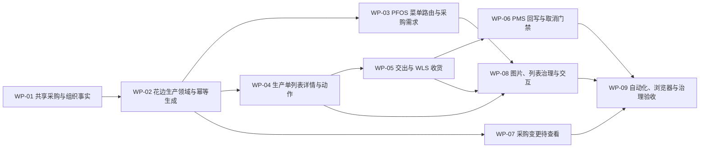

# 辅料工厂管理实施计划

## 1. 计划信息

| 项目 | 内容 |
| --- | --- |
| 对应总体设计 | `docs/product-design/辅料工厂管理总体产品设计文档.md` V1.5（加工投入最小化纠偏版） |
| 对应追踪矩阵 | `docs/product-design/辅料工厂管理需求追踪与交付矩阵.md` |
| 当前状态 | V1.5 已完成任务范围实现与验证：124 条原子需求均有实现和当前证据；未提交、推送或获得产品接受回执 |
| 实施分支 | `codex/accessory-factory-management` |
| 第一阶段范围 | 花边采购需求、花边生产单、交出、中央辅料仓收货和采购实收回写 |
| 完成定义 | V1.5 受影响需求全部完成实现、专项检查转绿并在命名页面复验，矩阵内不存在无说明的待实施、实施中、已实现待验证或已阻塞项；旧加工投入字段、入口、门禁、文案和测试均无残留 |

## 2. 实施目标

在保持当前 Vite、TypeScript、Tailwind CSS 和字符串模板架构不变的前提下，为 PFOS 增加“辅料工厂管理 > 花边厂管理”，并完成以下最小闭环：

```text
有效内部花边采购单
→ 采购单 SKU 唯一自动生成花边生产单
→ 独立固化需求来源、加工投入和加工产出
→ 确认接收／一次或多次加工填报
→ 完成加工单／撤销完成
→ 一次或多次交出
→ WLS 中央辅料仓实际收货
→ PMS 采购单 SKU 实收数量回写
```

## 3. 实施依据

### 3.1 业务依据

- 辅料工厂管理是 PFOS 一级业务分类，不是统一工厂主体。
- 第一阶段先实现 Renda Jaya 花边厂。
- 一个采购单 SKU 只生成一张花边生产单。
- 生产状态直接对齐辅助工艺的待接收、加工中、已完结；交出、收货和采购变更查看分别计算。
- 加工投入、需求来源和加工产出必须是三类独立业务事实／快照，并分别投影到列表和详情。
- 有效生产单必须自动带入默认加工投入；例外修改只涉及投入 SKU 和单位用量，计划投入总量由计划产出乘以单位用量计算。
- 第一阶段不记录实际投入、投入来源／批次、领退料或原料库存，也不以其作为确认接收或完成加工单门禁。
- 完工、交出、实收是三套不同事实。
- 采购结算不在第一阶段。

### 3.2 当前代码依据

- `src/data/app-shell-config.ts` 已建立 PFOS 专业工厂分组结构。
- `src/data/fcs/special-craft-task-orders.ts` 和 `src/data/fcs/process-web-status-actions.ts` 已提供简化加工状态、生产填报、交出及日志参考。
- `src/data/fcs/process-work-order-generation-key.ts` 已提供稳定来源键和幂等生成参考。
- `src/data/fcs/process-warehouse-domain.ts` 已提供交出、实收和差异事实参考。
- `src/data/pcs-engineering-purchase-linkage.ts` 已提供采购单、供应商、款式和物料行事实。
- `src/components/ui/` 已有标准列表、按钮、弹窗、抽屉、分页和反馈能力。

## 4. 实施范围与非范围

### 4.1 负责范围

- PFOS 菜单、路由和花边厂页面。
- 花边采购来源投影、唯一自动生成和运行时 Mock 事实。
- 花边生产状态、确认接收、加工填报、完成加工单、撤销完成和取消。
- 采购变更版本、待查看／已查看和醒目标识。
- 花边交出和 WLS 实收。
- PMS 采购订单关联生产与实收展示、取消门禁。
- 操作日志、真实图片、大图和必要异常场景。
- 专项检查、命名浏览器验收、治理记录和 CodeGraph 同步。

### 4.2 不负责范围

- 价格、金额、结算、对账、付款和财务凭证。
- 拉链、织带、布包扣实际页面和专业字段。
- 真实后端、数据库、接口、鉴权和离线基础设施。
- 设备排产、复杂工序、质检、返工和成本核算。
- 加工投入的实际耗用、来源／批次、临时增删投入行、领料、发料、退料和原料库存。
- 花边 PDA 专用入口和打印模板。

## 5. 总体实施顺序



## 6. 工作包

### WP-01：共享采购事实、工厂映射与演示数据

**实施状态：已验证（V1.5）**

**业务目标**

形成一组可以同时被 PCS、PMS、PFOS 和 WLS 读取的采购单及 SKU 事实，并明确 Renda Jaya 供应商到花边厂组织的映射。

**需求编号**

`ORG-001`～`ORG-004`、`SRC-001`～`SRC-005`、`PROD-002`～`PROD-003`、`SCOPE-006`。`SRC-006` 的生产单需求来源快照由 WP-02、WP-04 维护。

**实际文件／符号**

- `src/data/fcs/lace-factory-purchase-projection.ts`：采购单、SKU、供应商到工厂映射、完整性过滤和 Mock 事实。
- `public/materials/fabric-contrast.jpg`、`public/materials/yarn-stitching.jpg`、`public/lace-dress-sample.jpg`：与演示对象对应的实拍／正式图片。

**修改内容**

1. 为采购 SKU 补齐稳定 SKU ID、物料类型、规格、颜色、图片、交期、目标仓库和采购版本。
2. 建立供应商与工厂组织映射，第一阶段只启用 Renda Jaya 花边映射。
3. 投影时过滤外部供应商、非花边 SKU、取消／作废采购单和不完整数据。
4. 每个可生成采购 SKU 提供一条或多条完整默认用料关系，包含投入 SKU、真实图片、基础单位和大于 0 的单位用量。
5. 默认用料关系缺失或不完整时进入采购需求同表自动生成异常，不创建空白生产单。
6. 提供正常、采购变更、超产、分批交出、收货差异、取消阻断和投入修改所需 Mock。

**验证证据**

- 专项脚本校验采购单、SKU、供应商、工厂、单位和图片完整性。
- 单元契约校验外部供应商和非花边 SKU 不进入投影。
- 默认投入完整、缺失失败、安全修复重试及计划投入计算契约。
- 页面证据由 WP-03、WP-05、WP-06 完成。

**完成条件**

同一采购事实可被三个下游模块读取，且不存在分别复制、分别修改的多套采购 Mock。

### WP-02：花边生产领域、唯一键与自动生成

**实施状态：已验证（V1.5）**

**业务目标**

按采购单 ID＋SKU ID 唯一生成花边生产单，并把需求来源快照、加工投入清单和加工产出对象建成三个独立结构；状态与动作直接对齐辅助工艺加工单骨架。

**需求编号**

`AUTO-001`～`AUTO-008`、`PROD-001`～`PROD-017`、`QTY-001`～`QTY-010`、`LOG-001`～`LOG-006`、`SCOPE-006`。

**实际文件／符号**

- 新增 `src/data/fcs/lace-factory-domain.ts`。
- 新增 `src/data/fcs/lace-production-generation-key.ts`。
- 模块内最小运行时事实仓库，没有新增大型通用 store，也没有混入辅助／特种工艺专有对象。

**修改内容**

1. 保留独立的 `inputLines: LaceProcessingInputLine[]`、`demandSource: LaceDemandSourceSnapshot` 和 `processingOutput: LaceProcessingOutput` 三类事实；加工投入行改为投入 SKU／物料快照、基础单位和单位用量，计划投入总量按生产计划动态计算。
2. 实现采购单 ID＋SKU ID 稳定唯一键。
3. 同一 SKU 多行来源在生成前作为整组校验；任一行无效或产出物料、单位、交期、目标仓身份不一致时整组失败，全部有效后才合并数量并保留来源行、全部来源款式和各自数量；款式不同不拆生产单。
4. 自动生成成功、失败和重试均保持幂等。
5. 将旧待生产、生产中、已完成状态迁移为待接收、加工中、已完结；已取消继续作为异常终止状态。
6. 删除实际投入、来源／批次、主管无投入原因及完成前实际投入门禁；删除空白生产单和“待维护”状态。
7. 实现受控修改投入 SKU 和单位用量；待接收／加工中允许，已完结需先撤销完成，已取消阻断，修改不改变生产状态并完整留痕。
8. 实现确认接收、加工填报累计、1.5 倍二次确认判断、完成加工单、撤销完成、取消和受控恢复；完成加工单不以投入实际、全部交出或全部收货为前提。
9. 日志保存时区、关联对象、采购版本、加工投入前后值和二次确认结构化事实，并支持从生产单追到收货与采购回写。
10. 所有变更使用不可丢失的日志事实，不物理删除历史。

**验证证据**

- 三 SKU 自动生成三单，同一事件重放后仍为三单。
- 同采购单同 SKU 多行及多个来源款式仍只生成一单且计划数量正确合计；部分无效或关键身份不一致时整组不生成。
- 状态、动作、数量公式、1.5 倍边界、取消和撤销完成专项检查。
- 三类独立事实的身份、数量、单位、图片、快照和变更追溯契约。
- 默认投入、SKU／单位用量修改、计划投入公式、状态门禁和日志契约。
- 旧实际投入、来源／批次、待维护、主管豁免和完成门禁的负向检查。
- 重复提交不产生重复加工填报记录。

**完成条件**

V1.5 领域契约全部通过；生产单无需页面即可证明唯一性、默认加工投入、三类事实独立、计划投入计算、数量和状态动作正确。旧加工投入结构和入口已由负向契约确认不再存在。

### WP-03：PFOS 菜单、路由与花边采购需求

**实施状态：已验证（V1.5 复验，结构沿用）**

**业务目标**

让 Renda Jaya 人员从正确菜单进入采购需求列表，并立即识别新增需求、关联生产单和待查看采购变更。

**需求编号**

`FRAME-001`～`FRAME-004`、`AUTO-007`～`AUTO-008`、`PAGE-001`、`PAGE-009`、`PAGE-011`、`CHANGE-001`～`CHANGE-008`。

**实际文件／符号**

- 修改 `src/data/app-shell-config.ts`。
- 修改 `src/router/routes-fcs.ts`、`src/router/route-renderers-fcs.ts`。
- 新增 `src/pages/process-factory/accessory/lace/purchase-demands.ts`。
- 修改 `src/main-handlers/fcs-handlers.ts`，只接入花边厂页面事件。

**修改内容**

1. 在毛织厂与后道工厂之间新增“辅料工厂管理”。
2. 新增“花边厂管理 > 采购需求、花边生产单、交出记录”。
3. 建立稳定命名路由，默认进入花边采购需求。
4. 采购需求采用标准管理列表、48px 摘要、分页和列治理。
5. 实现 `采购变更待查看 N 单`、行级醒目标识和完整变更抽屉。
6. 查看当前变更版本后局部更新为已查看；新版本再次变为待查看。
7. 将自动生成异常与正常采购需求合并到同一标准列表；删除列表外独立异常卡片。
8. 以采购单 ID＋SKU ID 聚合失败来源，同一身份只展示一行；完整显示失败原因、待补齐字段、PMS 修复责任和重试结果，不虚构缺失数量、交期或仓库。
9. 增加自动生成结果筛选；来源修复后让原行转为唯一生产单结果，重试和刷新不产生重复行或重复生产单。

**验证证据**

- 菜单顺序和路由专项检查。
- 标准列表治理检查。
- 1366×768、1280×720 浏览器验收。
- 查看变更前后对比、统计去重和新版本重置验收。
- 采购单 338520 自动生成失败进入同一分页列表、没有独立红色卡片；多失败来源聚合为一行且修复后原行转正常的专项契约与页面验收。

**完成条件**

指定工厂身份进入页面后只能看到本厂需求，并能在同一列表识别正常需求、自动生成异常和所有待查看采购单。

### WP-04：花边生产单列表、详情和生产动作

**实施状态：已验证（V1.5）**

**业务目标**

让花边厂业务人员在列表和详情中明确看到加工投入、需求来源、加工产出，并完成确认接收、多次加工填报、完成加工单、撤销完成和取消。

**需求编号**

`PROD-001`～`PROD-017`、`QTY-001`～`QTY-010`、`PAGE-002`～`PAGE-004`、`PAGE-012`～`PAGE-014`、`PERM-001`～`PERM-006`、`LOG-001`～`LOG-003`、`UI-006`、`SCOPE-006`。

**实际文件／符号**

- 新增 `src/pages/process-factory/accessory/lace/work-orders.ts`。
- 新增 `src/pages/process-factory/accessory/lace/work-order-detail.ts`。
- 必要弹窗优先使用 `src/components/ui/` 现有能力。
- 事件处理保持局部 DOM 更新，不整页重绘。

**修改内容**

1. 标准生产单列表分别展示加工投入摘要、需求来源摘要和加工产出摘要；加工投入只展示真实投入物料、单位用量和系统计算的计划投入总量，同时保留四套产出数量和四个状态维度。
2. 详情在单一“生产信息”Tab 内完整展示三类独立业务事实；加工投入区域在待接收／加工中显示次要动作“修改加工投入”，弹窗只编辑投入 SKU、单位用量和日志原因。
3. 实现确认接收、加工填报、修改填报、完成加工单、撤销完成、取消和受控恢复，并移除旧同义动作入口。
4. 1.5 倍二次确认展示计划、提交前、本次、提交后、超出量和比例；完成加工单展示计划、完工、交出、剩余和差异。
5. 已完结仍允许交出剩余产出；撤销完成只回到加工中，不回滚历史事实。
6. 权限决定按钮是否可见和可执行；所有命令使用页面当前身份，不自动替换为主管。
7. 生产单列表保留六个任务 Tab，但生产状态 Tab 改为全部、采购变更待查看、待接收、加工中、已完结、已取消；待查看 Tab 按生产单计数，顶部摘要同时显示去重采购单数和生产单数。
8. 列表增加当前身份切换，并将当前真正可执行的单据级动作全部直接展示在固定右侧操作栏；列表与详情共用同一权限和状态门禁。
9. 详情保持生产信息、完工与交出、操作日志三个内容 Tab；生产／交出／收货状态、五项数量、当前动作、反馈和采购变更常驻在 Tab 外。
10. Tab 切换和动作后的局部更新保留当前身份、次级筛选、排序、列设置、当前详情 Tab 和滚动位置。
11. 从列表操作栏删除“维护投入／修改加工投入”；删除实际投入、来源／批次、待补齐、主管无投入原因及完成加工单相关门禁和文案。

**验证证据**

- 辅助工艺状态／动作对齐契约及旧文案负向检查。
- 列表三类事实摘要与详情三个独立事实块契约。
- 加工投入默认展示、两字段修改、计划投入计算、状态门禁和日志契约。
- 旧实际投入、来源／批次、待维护、主管豁免和完成门禁负向检查。
- 少产、普通超产、恰好 1.5 倍、超过 1.5 倍和数量倒挂测试。
- 1024×768 主管端和 1366×768 管理端真实页面验收。
- 快速连续点击只生成一次事实。
- 六个任务 Tab 的计数、交集筛选、待查看按用户／版本退出与重入专项检查。
- 业务员、主管、平台主管在四个生产状态下的操作可见性、领域门禁、确认、日志和列表归属变化检查。
- 详情三个 Tab 内容完整性、常驻摘要、动作后保持当前 Tab、`Esc` 和 1024×768／1280×720 无页面横向溢出验收。

**完成条件**

业务人员可从列表直接识别三类事实并执行当前动作，也可在三个详情 Tab 中完成第一阶段全部生产动作；加工投入默认已知且只在详情例外修改，状态、数量、权限和上下游事实无串写。V1.4 加工投入相关页面证据作废，由 V1.5 当前分支 1280×720 列表和 1024×768 详情证据替换。

### WP-05：交出记录与 WLS 中央辅料仓收货

**实施状态：已验证（V1.5 复验，规则未变）**

**业务目标**

每次交出形成一条可追溯记录，并在 WLS 中形成一条对应待收货记录，最终记录实际收货和差异。

**需求编号**

`HAND-001`～`HAND-007`、`RECEIPT-001`～`RECEIPT-009`、`PAGE-005`～`PAGE-006`。

**实际文件／符号**

- `src/data/fcs/lace-factory-domain.ts`：交出、WLS 待收货投影、最终收货、差异与 PMS 实收汇总；没有修改不适配的现有加工仓领域。
- 新增 `src/pages/process-factory/accessory/lace/handover-records.ts`。
- 新增 `src/pages/wls-accessory-receipts.ts`。
- 修改 `src/router/routes.ts`、`src/data/app-shell-config.ts` 和必要的事件入口。

**修改内容**

1. 校验可交出余额并生成独立交出记录。
2. 将允许交出的生产状态映射改为加工中或已完结，并确认完成加工单不要求先完成全部交出。
3. 一次事务式演示中同时形成交出、累计数量、WLS 待收货和日志。
4. 一条交出记录第一阶段只完成一次最终收货确认。
5. 实收少于、等于、大于交出都按真实数量记录；保存实际入库库区；多收需要当前仓库主管身份二次确认。
6. 收货页面突出来源工厂、采购单、生产单、花边图片、交出数量和主动作。

**验证证据**

- 一次全量交出只生成一条；分两次交出生成两条。
- 交出超余额和重复提交专项检查。
- 实收一致、少收、多收三类收货契约。
- PFOS 交出详情和 WLS 收货页面跨端一致性验收。

**完成条件**

任意有效交出记录都能从 PFOS 追踪到 WLS 收货结果，且不存在只有一侧保存成功的半链路。

### WP-06：PMS 采购关联展示、实收回写与取消门禁

**实施状态：已验证（V1.5 复验，规则未变）**

**业务目标**

让采购人员看到内部工厂生产和实收情况，并在取消采购单前阻断尚未先取消的生产单。

**需求编号**

`CANCEL-001`～`CANCEL-007`、`CHANGE-009`、`RECEIPT-006`～`RECEIPT-009`、`PAGE-007`。

**实际文件／符号**

- 新增 `src/pages/pms-purchase-orders.ts` 或将当前占位采购订单路由替换为明确页面。
- 修改 `src/router/routes.ts` 注册 PMS 命名路由。
- `src/data/fcs/lace-factory-domain.ts` 提供实际收货投影、采购回写和取消校验。
- 页面与 PFOS、WLS 读取同一模块内采购 Mock 和运行时事实，不复制第二套花边采购订单。

**修改内容**

1. 采购单详情展示关联花边生产单和各 SKU 的计划、完工、交出、实收。
2. WLS 收货后按采购单 SKU 汇总实际收货。
3. 取消采购单前检查全部关联生产单并返回具体阻断明细。
4. 全部待接收时允许采购取消并同步取消待接收生产单；存在加工中或已完结时阻断，除非先按权限取消对应生产单。
5. 采购变更先在整单副本上校验，全部通过后才升版本和同步；任一字段失败不留下局部修改。
6. 未知 SKU、空白／无效交期或目标仓 ID／名称不完整时整次阻断，版本、数量和其他字段均保持原值。
7. 取消成功、失败和阻断原因写入日志。

**验证证据**

- 采购取消状态组合专项检查。
- 收货 198／交出 200 时采购实收为 198 的跨模块契约。
- 多 SKU 后续字段失败、未知 SKU、无效交期和不完整目标仓的整单回滚契约。
- PMS 页面取消阻断弹窗和关联信息浏览器验收。

**完成条件**

不存在先取消采购单再处理已生产事实的路径，采购实收到货量完全由 WLS 收货事实驱动。

### WP-07：采购变更版本与待查看机制

**实施状态：已验证**

**业务目标**

让业务人员进入列表即可识别变更，同时保持“查看”而非“审批”的语义。

**需求编号**

`CHANGE-001`～`CHANGE-008`。

**实际文件／符号**

- 扩展 `src/data/fcs/lace-factory-domain.ts` 的采购版本、变更差异和查看记录。
- 采购需求和生产单页面复用同一变更投影。
- 参考 `ProcessWorkOrderChangeImpact`／`ProcessWorkOrderAutoSyncRecord` 的来源快照模式，不直接复用印染专有状态。

**修改内容**

1. 比较数量、SKU、单位、交期、目标仓、供应商、工厂、款式、备注和状态变化。
2. 保存采购版本、变更前后和受影响生产单。
3. 顶部统计按采购单去重。
4. 打开完整对比后记录当前用户对当前版本已查看；采购需求页提供当前查看身份，不能固定为同一个演示账号。
5. 新版本自动重置为待查看。
6. 数量、交期、仓库和备注作为安全字段整单提交；SKU、工厂和单位在第一阶段入口只读并执行已开工阻断说明。

**验证证据**

- 同采购单多 SKU 只计一单。
- 用户 A 已查看不自动代表用户 B 已查看。
- 再次变更后两个用户均按新版本重新待查看。
- 页面不得出现“确认变更、已确认、接受变更”。

**完成条件**

变更版本、用户查看记录、列表统计和行级标识完全一致，不影响生产主状态。

### WP-08：真实图片、标准列表和交互治理

**实施状态：已验证（V1.5 图片与交互复验）**

**业务目标**

保证全部款式和物料可识别，页面符合管理／主管端分辨率、列表和局部交互要求。

**需求编号**

`IMG-001`～`IMG-005`、`UI-001`～`UI-006`、`PAGE-008`～`PAGE-011`。`PAGE-012`～`PAGE-014` 的业务内容由 WP-04 按 V1.5 重新验收。

**实际文件／符号**

- 复用 `src/components/ui/` 的标准列表、分页、按钮、弹窗、抽屉和反馈。
- `src/pages/process-factory/accessory/lace/shared.ts` 提供本业务域最小图片大图、失败态、重试和 `Esc` 关闭能力。
- 新增页面顶部声明标准列表模式并进入列表治理检查。

**修改内容**

1. 所有记录提供真实缩略图、替代说明、加载态、失败态和大图。
2. 款式／物料图片与编码名称同列同块。
3. 列表分页、列治理、左右冻结和表格内滚动。
4. 五个标准列表的筛选、重置和分页使用列表控制器局部更新；弹窗、抽屉和日志使用局部表面更新。
5. 避免输入触发整页重绘、页面闪烁或滚动位置丢失。
6. 任务 Tab 和详情 Tab 只替换对应局部表面；固定右侧操作列允许动作按钮换行，并保持表格内部滚动。

**验证证据**

- 全数据图片对应关系专项检查。
- 点击缩略图、Esc、遮罩和关闭按钮验收。
- 1366×768、1280×720、1024×768 截图和交互证据。
- `npm run check:standard-list-page-template`，并由 `npm run check:lace-factory-management` 核查本次五个列表页的模式声明与标准列表骨架。

**完成条件**

没有任何款式或物料使用占位图，所有命名页面在规定分辨率下可完成主任务。

### WP-09：专项验证、治理记录和交付闭环

**实施状态：已验证（V1.5 任务范围）**

**业务目标**

让每条原子需求有且只有一组充分的实现与验收证据。

**需求编号**

矩阵全部第一阶段需求。

**实际文件／符号**

- `scripts/check-lace-factory-management.ts`：业务、页面、图片、日志、权限与范围专项契约。
- `scripts/check-lace-product-delivery-docs.ts`：总体设计、计划、矩阵、V1.5 重新打开要求、两条新增原子要求和证据有效期闭环检查。
- `tests/lace-factory-input-v15.spec.ts`：保存默认投入、六任务 Tab、详情三 Tab、两字段修改、状态动作、真实图片和低分辨率的命名页面验收。
- `docs/prototype-review-records/2026-08-10-accessory-factory-input-simplification.md` 保存 V1.5 用户可见变更的完整原型审查记录；V1.4 记录只作历史。
- `docs/product-design/辅料工厂管理需求追踪与交付矩阵.md` 回填全部 V1.5 原子需求。

**修改内容**

1. 运行文件级、功能级、运行时级和项目级必要检查。
2. 最后一次实质修改后重新生成所有受影响证据。
3. 运行 CodeGraph 同步和状态检查。
4. 运行原型治理检查；提交／交付前按任务边界生成任务收据。
5. 正向追踪总体设计到实现证据，反向追踪代码到需求编号。
6. 初次结论不作为复核依据；重新检查每条需求的真实实现与页面证据，并把发现的 9 条遗漏验收点加入矩阵。
7. 对 V1.5 受影响要求执行正向、反向追踪；先以专项契约暴露 V1.4 旧结构，再在实现后逐条登记当前自动化和当前分支命名页面证据。

**验证证据**

- `npm run check:lace-factory-management`。
- `npm run check:lace-product-delivery-docs`。
- Playwright CLI 命名页面验收及 `/private/tmp/lace-v15-*.png`。
- `npm run build`。
- 菜单／路由、标准列表和原型设计治理检查。
- 当前分支任务收据（执行结果记录在第 12 节）。

**完成条件**

文档闭环和业务专项检查通过；命名页面、CodeGraph、治理、构建和任务收据均在最后一次实质代码修改后重跑。V1.5 重新打开项及新增 `QTY-010`、`SCOPE-006` 全部达到“已验证”；最终结论继续区分任务范围需求验证与项目级 `implemented`、`verified`、`delivered`、`accepted`。

## 7. 依赖与共享事实边界

| 依赖 | 前置条件 | 失败影响 |
| --- | --- | --- |
| 采购 SKU 稳定 ID | PMS／采购 Mock 提供不可变身份 | 无法可靠唯一生成或追踪变更 |
| 供应商到工厂映射 | Renda Jaya 映射启用 | 需求无法进入正确工厂 |
| 真实物料和款式图片 | 素材可稳定访问且对象对应 | 图片硬门禁阻塞页面完成 |
| 目标仓库 | 采购单明确中央辅料仓 | 交出无法生成下游收货 |
| 统一交出／收货事实 | PFOS 与 WLS 读取同一记录 | 数量和状态可能分叉 |
| 用户／组织身份 | 当前会话能区分工厂和角色 | 无法证明数据隔离和操作权限 |

## 8. 历史与兼容处理

1. 本次新增业务不迁移或改写现有印花、染色、毛织、辅助工艺和特种工艺加工单。
2. 现有 PCS 采购单号引用继续可用，但不能作为花边生产单自动生成的唯一事实源，必须补齐 SKU 级采购事实。
3. 历史采购单没有稳定 SKU ID 时，不自动批量生成花边生产单；演示数据必须明确标记为 Mock。
4. 旧链接如指向 PMS 占位页，在新采购订单页上线后应保持可导航，不保留两套语义冲突入口。
5. 菜单新增不得恢复此前已经删除的 PFOS 工作台重复侧栏入口。

## 9. 风险与控制

| 风险 | 控制措施 |
| --- | --- |
| 把“辅料工厂”实现为统一主体 | 领域对象和页面以花边厂为第一阶段业务域，工厂组织单独建模 |
| 为未来工厂预建过重抽象 | 第一阶段只建设花边所需最小能力，未来按已验证模式扩展 |
| 三类事实只做页面标题、领域仍互相推算 | 建立需求来源快照、加工投入清单和加工产出对象三个明确结构，并分别检查身份、数量、单位、图片和版本 |
| 采购、完工、交出、实收数量混算 | 四套数量分别存储和展示，采购回写只取 WLS 实收 |
| 生产状态被交出覆盖 | 状态维度独立计算和单独测试 |
| 采购变更变成审批 | 全程使用待查看／已查看，查看不阻断生产 |
| 重复自动生成或重复提交 | 稳定唯一键和动作级重复提交保护 |
| 取消采购绕过生产事实 | PMS 提交取消前同步检查全部生产单 |
| 图片看似存在但对象不匹配 | 逐记录验证图片来源和对象对应关系 |
| 工作区已有无关差异被吸收 | 实施和验证始终使用任务边界，只修改／暂存声明需求编号的文件 |

## 10. 最终验证清单

### 10.1 文件级

- 任务 diff 只包含声明的需求编号和文件。
- TypeScript 类型和直接业务契约通过。
- 没有遗留“待确认采购变更”等冲突文案。
- 没有遗留将花边生产单作为现行规则展示的“待生产、生产中、已完成、开始生产、填报完工、手动完成”状态／动作。
- 没有遗留加工投入“实际投入、来源／批次、待维护、待补齐、无可记录投入原因、维护投入”字段、文案、入口和完成门禁。
- 领域对象明确包含需求来源快照、加工投入清单和加工产出对象，三者不可互相替代。
- 加工投入行明确包含投入 SKU、物料快照、基础单位和单位用量；计划投入总量按计划产出乘单位用量计算。
- 没有重复生产单生成入口。

### 10.2 功能级

- 自动生成唯一性、三类事实、状态动作、数量、变更、取消、交出、收货和日志专项检查通过。
- 默认投入、缺失异常、修复重试、两字段修改、状态门禁、计划投入公式和修改日志专项检查通过。
- 标准列表治理检查通过。
- 原型设计治理检查通过。
- 采购需求异常合并、生产单六 Tab、显式操作矩阵、列表三类事实摘要和详情三 Tab 专项契约通过。

### 10.3 运行时级

- PFOS 花边采购需求、生产单、详情和交出记录。
- WLS 中央辅料仓待收货和收货确认。
- PMS 采购关联、实收回写和取消阻断。
- 真实缩略图、失败态和大图。
- 1366×768、1280×720、1024×768 命名页面。
- 正常场景和至少一个变更、超量、取消阻断、收货差异场景。
- 采购单 338520 自动生成异常与正常需求同表、无独立异常卡片。
- 生产单六个任务 Tab（全部、采购变更待查看、待接收、加工中、已完结、已取消）、待查看按采购单／生产单双口径、次级筛选交集和当前身份动作矩阵。
- 列表逐行可识别加工投入、需求来源和加工产出；详情三个内容 Tab 内，“生产信息”完整展示三个独立事实块。
- 列表加工投入只显示投入 SKU、单位用量和计划投入总量且不出现修改动作；详情修改弹窗只有投入 SKU、单位用量和日志原因。
- 详情常驻三类状态与五项数量、动作后保持当前 Tab、`Esc` 和低分辨率无页面横向溢出。

### 10.4 项目级

- 构建通过。
- CodeGraph 同步后无待同步任务文件。
- 最终原型审查记录完整。
- 任务收据绑定最终 Git HEAD 和任务边界。
- 追踪矩阵完成正向与反向审查。

## 11. 当前阶段说明

V1.5 已完成任务范围实现与验证。WP-01、WP-02、WP-04 和 WP-09 已按新的加工投入结构、动作、页面和证据完成；WP-03、WP-05～WP-08 的既有规则在最后一次修改后完成相邻回归。V1.4 加工投入相关证据只保留为历史。

当前状态边界：

- `implemented`：已满足；当前分支存在 V1.5 实现，旧加工投入字段、动作、门禁和页面文案无残留。
- `verified`：任务范围已满足；V1.5 专项、4 个命名页面场景、治理、构建和 CodeGraph 均以当前差异重跑。项目级任务收据实际状态为 `implemented`，唯一 blocker 是范围外历史列表页 `src/pages/wls-fabric-demand-board.ts` 未通过全仓静态列表治理。
- `delivered`：功能提交为 `ec2365fd`，本地合并提交为 `405f1c48`；只有 GitHub 远端 `main` 明确包含该合并结果后才满足。
- `accepted`：未满足，尚无产品负责人对远端版本的接受回执。

## 12. 实施结果与证据登记

| 工作包 | 实际结果 | 主要实现位置 | 证据组 | 状态 |
| --- | --- | --- | --- | --- |
| WP-01 | 默认用料关系改为投入 SKU＋基础单位＋单位用量；缺失关系进入同表自动生成异常 | `lace-factory-purchase-projection.ts` | EV-DOMAIN、EV-IMAGE | 已验证 |
| WP-02 | 删除旧实际投入／批次／豁免结构，增加计划投入公式和两字段修改命令 | `lace-production-generation-key.ts`、`lace-factory-domain.ts` | EV-DOMAIN | 已验证 |
| WP-03 | 菜单路由和异常同表实现保留；默认投入缺失、PMS 修复和原唯一键迁移完成复验 | `app-shell-config.ts`、`purchase-demands.ts`、`routes-fcs.ts` | EV-MENU、EV-PAGE | 已验证 |
| WP-04 | 列表投入摘要、显式动作和详情修改投入区按 V1.5 调整 | `work-orders.ts`、`work-order-action-policy.ts`、`work-order-detail.ts` | EV-DOMAIN、EV-PAGE | 已验证 |
| WP-05 | 交出、WLS 收货与差异规则未改变，共享领域相邻回归通过 | `lace-factory-domain.ts`、`handover-records.ts`、`wls-accessory-receipts.ts` | EV-DOMAIN、EV-PAGE | 已验证 |
| WP-06 | PMS 关联、实收回写和取消门禁规则未改变，共享领域相邻回归通过 | `pms-purchase-orders.ts`、`lace-factory-domain.ts` | EV-DOMAIN、EV-PAGE | 已验证 |
| WP-07 | 采购变更版本、按用户查看和新版本重置 | `lace-factory-domain.ts`、`purchase-demands.ts` | EV-DOMAIN、EV-PAGE | 已验证 |
| WP-08 | 图片和局部交互能力保留；投入区域、弹窗、断图重试、大图、Esc 和低分辨率完成复验 | `src/pages/process-factory/accessory/lace/shared.ts` 及各列表／详情页 | EV-LIST、EV-IMAGE、EV-PAGE | 已验证 |
| WP-09 | V1.5 自动化、4 个命名页面场景、图片、治理、构建、CodeGraph、正反向追踪和任务收据均已登记 | `scripts/check-lace-*.ts`、`tests/lace-factory-input-v15.spec.ts`、三份产品文档、治理记录 | EV-DOC、EV-GOV、EV-BUILD、EV-CODEGRAPH、EV-RECEIPT | 已验证 |

### 12.1 正向追踪

总体设计的规范性章节继续映射到稳定需求编号；V1.5 新增 `QTY-010`、`SCOPE-006`，共 124 条。`npm run check:lace-product-delivery-docs` 对编号唯一性、章节覆盖、字段完整性、状态、实现位置和证据值域执行自动核查。

### 12.2 反向追踪

本次新增的菜单、路由、领域事实、PFOS 页面、WLS 页面、PMS 页面、事件入口和检查脚本均可回到 FRAME、SRC、AUTO、PROD、QTY、CHANGE、CANCEL、HAND、RECEIPT、LOG、PERM、PAGE、IMG、UI 或 SCOPE 需求组。未新增结算、其他专业辅料工厂页面、PDA 或打印入口。

### 12.3 已知项目级基线问题

全仓静态列表候选检查会命中本任务范围外的历史页面 `src/pages/wls-fabric-demand-board.ts` 缺少列表模式声明。本任务未修改该页面，也未通过调整基线或检查脚本绕过；五个本次新增列表页由专项契约和标准列表模板检查单独证明符合治理要求。

`/private/tmp/lace-factory-task-receipt-v14.json` 和 V1.4 命名页面数据只作历史记录，不能证明 V1.5。V1.5 使用 `/private/tmp/lace-factory-task-receipt-v15.json` 和本次 4 个 Playwright 场景；该收据在提交前绑定基点 HEAD `9773936367b0597883419d5d599bdd74a4c62cba` 及完整任务差异，任务差异随后形成提交 `ec2365fd` 并由 `405f1c48` 合入本地 `main`。菜单、全量原型治理、构建和 CodeGraph 通过，收据状态为 `implemented`，唯一 blocker 为范围外 `src/pages/wls-fabric-demand-board.ts`。任务范围验证与项目级状态必须继续分开，不修改范围外页面、基线或检查脚本绕过门禁。
