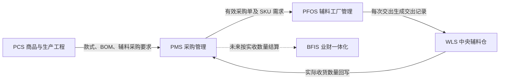
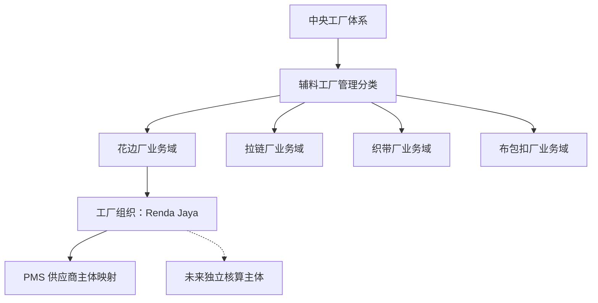
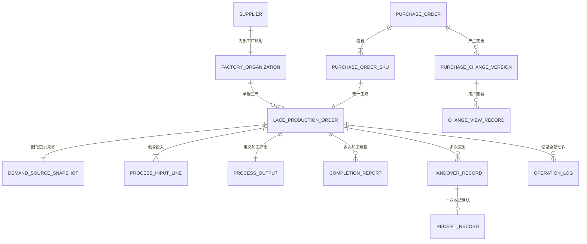
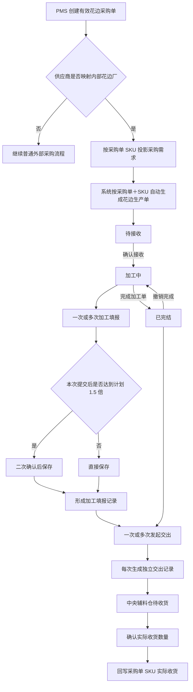

# 辅料工厂管理总体产品设计文档

## 1. 文档信息

| 项目 | 内容 |
| --- | --- |
| 文档名称 | 辅料工厂管理总体产品设计文档 |
| 文档版本 | V1.5（加工投入最小化纠偏版） |
| 编制日期 | 2026-08-08 |
| 文档状态 | V1.5 业务基线、任务范围实现与本地验证已闭环；124 条原子需求均有当前实现和证据，尚未提交、推送或获得产品接受回执 |
| 第一阶段业务 | 花边厂管理 |
| 第一阶段工厂组织 | Renda Jaya |
| 适用系统 | 采购管理系统（PMS）、商品中心系统（PCS）、工艺工厂运营系统（PFOS）、仓储物流系统（WLS） |
| 主要角色 | 采购人员、花边厂业务人员、花边厂生产主管、花边厂管理人员、中央辅料仓收货人员、平台主管 |
| 文档用途 | 作为产品、研发、测试和实施团队进行页面设计、原型开发、业务验收与后续扩展的权威业务依据 |
| 实现状态说明 | 当前分支已按 V1.5 实现：生产单自动带入加工投入；例外修改只涉及投入 SKU 和单位用量；不记录实际投入、来源／批次或主管豁免。领域专项、4 个命名页面场景、图片、治理、构建与正反向追踪均以当前差异复验 |

V1.2 不改变用户已经确认的 V1.1 业务方向，只把实现复核中发现的隐含规则拆成可独立验收的原子要求：同 SKU 来源行整组生成、采购变更失败不留局部修改、二次确认信息、当前身份执行、收货库区和结构化日志追溯。其对加工投入的复杂维护口径已由 V1.5 废止。

V1.3 不改变采购、生产、交出和收货规则，重点收口页面任务组织：自动生成异常进入采购需求同一列表；生产单列表按任务 Tab 分流并直接列出当前可执行动作；详情仅保留三个内容 Tab，关键状态、数量、动作和采购变更始终常驻可见。

V1.4 依据产品负责人再次确认纠正两类偏差：第一，`加工投入`、`需求来源`、`加工产出`必须是生产单内三个彼此独立、可追溯的业务事实／快照，而不是仅在页面上分成三个标题；第二，花边生产单直接沿用辅助工艺加工单的简单状态与动作骨架，即`待接收 → 加工中 → 已完结`，对应`确认接收、加工填报、完成加工单`，不再自行改写为“待生产、开始生产、填报完工、手动完成”。V1.3 与这两类要求有关的实现、自动化和页面证据只作为历史记录，不作为 V1.4 验收结论。

V1.5 进一步收口加工投入：有效采购需求生成生产单时必须已经带入默认用料关系；每条加工投入仅以投入 SKU 和单位用量作为可修改业务字段，计划投入总量由计划产出数量乘以单位用量自动计算。第一阶段不记录实际投入、投入来源、投入批次、领退料或原料库存，也不以这些内容作为确认接收或完成加工单门禁。V1.4 中“维护投入、待补齐实际投入、无可记录投入原因”等实现和证据全部失效。

## 2. 核心结论

### 2.1 产品框架结论

“辅料工厂管理”应放在 PFOS 中，作为与裁床厂、印花厂、染厂、毛织厂、后道工厂并列的一级业务分类，菜单位置为“毛织厂管理”之后、“后道工厂管理”之前。

“辅料工厂”只是业务分类的统称，不是一个统一经营主体，也不是一个统一供应商主体。花边厂、拉链厂、织带厂、布包扣厂分别是独立的专业工厂业务域；Renda Jaya 是第一阶段花边厂对应的具体工厂组织。

第一阶段菜单结构为：

```text
工艺工厂运营系统 PFOS
├─ 裁床厂管理
├─ 印花厂管理
├─ 染厂管理
├─ 毛织厂管理
├─ 辅料工厂管理
│  └─ 花边厂管理
│     ├─ 采购需求
│     ├─ 花边生产单
│     └─ 交出记录
├─ 后道工厂管理
├─ 辅助工艺工厂管理
└─ 特种工艺工厂管理
```

后续按真实业务启用：

```text
辅料工厂管理
├─ 花边厂管理
├─ 拉链厂管理
├─ 织带厂管理
└─ 布包扣厂管理
```

各专业工厂可以复用相同的“采购需求、生产单、生产填报、交出、收货回写、操作日志”骨架，但产品上仍然分别归属各自工厂业务域，不建立一个名为“辅料工厂”的统一生产主体。

### 2.2 业务链路结论

中央采购仍然向供应商下采购订单。当采购订单的供应商映射为公司自有辅料工厂，例如 Renda Jaya 时，该采购订单同时成为对应专业工厂的生产需求来源。

系统按照采购单的 SKU 自动生成专业工厂生产单：

- 一张采购单可以包含多个 SKU，因此可以自动生成多张花边生产单。
- 同一张采购单中的同一个 SKU 只能对应一张花边生产单。
- 同一 SKU 分多天、分多批生产时，不再拆分生产单，而是在同一张生产单下进行多次完工数量填报。
- 系统重复接收同一采购事实、页面重复刷新或自动任务重复执行时，不得重复生成生产单。

### 2.3 状态结论

花边生产单只保留与辅助工艺加工单一致的简单生产主状态：

```text
待接收 ──确认接收──> 加工中 ──完成加工单──> 已完结
                     ↑                     │
                     └────撤销完成─────────┘

待接收／加工中／已完结 → 已取消
```

生产状态、交出履约状态、仓库收货状态和采购变更查看状态必须分开表达，任何一类状态都不得覆盖另一类状态。

这里的“确认接收”表示花边厂接收采购需求对应的生产任务，不表示中央仓已经把加工投入物料交给花边厂，也不表示审批采购变更。加工投入在生产单生成时已经带入，例外修改只涉及投入 SKU 和单位用量。

### 2.4 数量结论

- 加工中允许多次执行“加工填报”，每次记录本次完工数量并累计形成实际产出。
- 少产和超产均不阻断生产。
- 当本次提交后累计完工数量达到或超过计划数量的 1.5 倍时，必须弹出二次确认，但确认后仍允许提交。
- 生产单由业务人员执行“完成加工单”，不按数量自动完结。
- 已完结生产单可以撤销完成，撤销后回到加工中。
- 每一次发起交出都生成一条独立交出记录；一次性交出全部数量时，只生成一条交出记录。
- 中央辅料仓确认的实际收货数量，是回写采购订单到货数量的唯一依据。

### 2.5 变更文案结论

采购单发生变更后使用“待查看／已查看”，不使用“待确认／已确认”。“查看”只表示业务人员已经看到变更，不表示审批、同意或接受变更。

统一文案为：

- 顶部统计：`采购变更待查看 N 单`。
- 列表标识：`采购已变更 · 待查看`。
- 操作按钮：`查看变更`。
- 查看后标识：`采购变更 · 已查看`。

## 3. 事实依据与当前系统核查

### 3.1 已确认的业务事实

1. 后续除扣子外，大部分辅料预计在印度尼西亚生产。
2. 辅料工厂在产业组织上属于中央工厂体系的组成部分，因此生产执行入口归 PFOS，而不是另建供应商门户。
3. 从采购和财务关系看，每家辅料工厂仍可对应采购供应商和独立核算主体。
4. 第一阶段优先解决“看到采购需求、自动形成生产单、能够生产填报、能够交出、下游能够收货”的业务闭环。
5. 采购结算、成本核算和财务对账暂不进入第一阶段。
6. 一张采购单按 SKU 形成多张生产单；采购单与 SKU 的组合具有生产单唯一性。
7. 生产单状态保持简单，交出和收货使用独立维度。
8. 所有关键操作必须有日志。
9. 页面中出现的款式和物料都必须有真实对应图片、缩略图和大图查看能力。

### 3.2 实施前代码已经具备的相关基础

当前原型已经存在以下可复用产品基础：

1. PFOS 已按裁床、印花、染色、毛织、后道、辅助工艺和特种工艺划分专业工厂菜单域。
2. 辅助工艺加工单已经采用“待接收、加工中、已完结”的简化主状态，并将加工填报、发起交出、节点记录和仓库关联分开保存。
3. 现有通用加工单能够保留来源快照，并区分尚未执行时的自动同步记录与已经执行后的变更影响记录。
4. 现有交出模型能够独立记录交出数量、实际接收数量、数量差异、交出人、接收人、时间、图片凭证和关联记录。
5. PCS 辅料采购准备任务已经能够读取采购单号、款式、供应商、采购状态、下单时间和物料 SKU 明细，并计算采购单是否覆盖所需辅料。
6. 当前“辅料采购”能力仍以采购单引用和生产准备完成判断为主，尚未形成“采购单 SKU 自动生成辅料生产单”的完整业务对象和页面闭环。
7. 当前 PMS 菜单已经有“采购订单、供应商管理、合同管理”入口，但仓库中的完整采购订单页面和辅料生产联动仍需在实施阶段补齐。

### 3.3 当前缺口

| 缺口 | 影响 |
| --- | --- |
| 没有“辅料工厂管理”一级分类 | 花边、拉链、织带等专业工厂没有正确的产品归属位置 |
| 没有花边采购需求视图 | Renda Jaya 人员无法只查看分配给本厂的采购需求 |
| 没有采购单 SKU 到花边生产单的自动生成规则 | 采购与实际生产执行脱节，容易人工漏单或重复建单 |
| 没有花边生产投入、需求来源和产出结构 | 无法说明用什么生产、为哪张采购单生产、最终产出什么 |
| 没有采购变更待查看机制 | 业务人员进入列表时不能第一时间识别采购数量、交期或仓库变化 |
| 没有花边加工填报和完成加工单机制 | 无法按多次加工填报累计实际完工数量 |
| 没有花边交出到中央辅料仓的闭环 | 无法形成交出记录、实际收货和采购订单回写 |
| 没有针对采购取消的生产门禁 | 可能取消已经进入生产的采购需求 |
| 没有贯穿全部动作的操作日志 | 无法追溯自动生成、变更查看、生产、交出和收货责任 |

## 4. 背景与业务问题

### 4.1 业务背景

辅料供应链正在由“主要从中国采购成品辅料”转向“在印度尼西亚由公司自有或受控工厂生产辅料”。采购订单仍然是中央采购与工厂之间明确需求、交期、数量和未来结算的业务依据，但工厂内部需要一套真正可执行的生产管理能力。

如果只把 Renda Jaya 当作普通供应商，系统只能看到“采购中、到货、入库”，无法支持工厂内部的任务接收、加工填报、分批交出和生产追溯。如果把所有花边、拉链、织带、布包扣工厂合并为一个“辅料工厂主体”，又会混淆实际组织、物料、工艺和独立核算关系。

因此，正确方案是：

- 采购关系继续由 PMS 的采购订单表达。
- 专业工厂生产执行由 PFOS 表达。
- 中央辅料仓的实际收货由 WLS 表达。
- 各系统围绕同一采购单、SKU、生产单、交出记录和收货记录共享事实。

### 4.2 需要解决的问题

1. 工厂业务人员如何只看到属于本厂的采购需求。
2. 如何避免人工漏建、重复创建或错误拆分花边生产单。
3. 如何在一个生产单中表达加工投入、需求来源和加工产出。
4. 如何用简单状态支持多次生产填报。
5. 如何让采购变更醒目可见，但不引入审批含义。
6. 如何阻止取消已经进入生产、但尚未先取消生产单的采购订单。
7. 如何支持分批交出，并让每一批都有独立下游收货结果。
8. 如何以仓库实收数量回写采购订单，而不是以工厂填报或交出数量冒充到货数量。
9. 如何保留各自独立核算所需的组织和数量事实，同时不提前建设结算模块。

## 5. 产品定位与系统边界

### 5.1 系统关系



### 5.2 各系统职责

| 系统 | 本业务职责 | 不承担的职责 |
| --- | --- | --- |
| PCS | 提供款式、BOM、辅料采购要求和需求来源关系 | 不执行花边生产，不确认仓库实收 |
| PMS | 维护采购订单、供应商、采购 SKU、计划数量、交期、目标仓库及取消动作 | 不维护花边厂内部生产进度 |
| PFOS | 将内部工厂采购需求转为专业生产单，执行投入、确认接收、加工填报、完成加工单和交出 | 不修改采购价格，不进行采购结算 |
| WLS | 接收花边厂交出记录，确认实际收货数量和差异 | 不代替花边厂执行加工填报 |
| BFIS | 未来承接采购结算和独立核算 | 第一阶段不建设相关页面和规则 |

### 5.3 辅料工厂管理的产品边界

“辅料工厂管理”只负责聚合专业辅料工厂入口和共享执行规则，不生成一个跨工厂的统一“辅料生产单”。第一阶段的业务单据名称必须是“花边生产单”，未来分别使用“拉链生产单”“织带生产单”“布包扣生产单”。

## 6. 产品目标与成功标准

### 6.1 产品目标

1. 在 PFOS 建立正确的辅料工厂一级分类和花边厂专业入口。
2. 让 Renda Jaya 管理人员和业务人员直接看到分配给本厂的有效花边采购需求。
3. 按采购单与 SKU 自动且唯一地生成花边生产单。
4. 用“待接收、加工中、已完结”三个正常状态完成第一阶段生产管理。
5. 支持加工中多次执行加工填报，并保留每一次实际完工事实。
6. 支持完成加工单和撤销完成，不用数量自动替代业务判断。
7. 支持一次或多次交出，每次生成独立交出记录。
8. 支持中央辅料仓逐条确认交出记录的实际收货数量。
9. 让采购订单按 SKU 累计实际收货数量。
10. 让采购变更在列表中醒目可见，并以“待查看／已查看”表达知晓状态。
11. 让采购取消、生产单取消、超量填报、重复提交等关键边界可控且可追溯。
12. 为未来独立核算保留工厂组织、供应商、采购单、SKU、交出和实收事实，但不提前实现结算。

### 6.2 成功标准

- 同一采购单同一 SKU 永远只有一张有效花边生产单。
- 一张含三个花边 SKU 的采购单自动生成三张生产单。
- 同一生产单能够连续记录多次加工填报和多次交出。
- 生产状态不因部分交出、全部交出、部分收货或收货差异而被覆盖。
- 采购单再次修改后，相关列表立即重新出现“采购已变更 · 待查看”。
- 已进入生产且尚未取消生产单时，采购订单取消被明确阻断。
- 累计完工达到计划数量 1.5 倍时出现二次确认，确认后仍可保存。
- 完工数量不足计划数量时仍可完成加工单，并明确显示少产差异。
- 每条交出记录都有对应的下游收货结果或待收货状态。
- 采购订单的实际到货量只取中央辅料仓实收数量。
- 所有款式、加工投入物料和加工产出物料均有真实缩略图和大图。
- 自动操作和人工操作都能在日志中追溯。

## 7. 范围

### 7.1 第一阶段范围

1. PFOS 新增“辅料工厂管理”一级菜单分类。
2. 新增“花边厂管理”专业模块。
3. Renda Jaya 工厂组织与采购供应商映射。
4. 花边采购需求列表、详情和采购变更查看。
5. 有效采购单按采购单 SKU 自动生成花边生产单。
6. 花边生产单列表、详情、确认接收、加工填报、完成加工单、撤销完成和取消。
7. 加工投入、需求来源、加工产出三类独立业务事实及其列表摘要、详情完整投影。
8. 采购变更醒目标识、变更前后对比、待查看和已查看记录。
9. 生产数量、交出数量、实际收货数量的独立累计。
10. 花边交出记录及中央辅料仓待收货记录。
11. 中央辅料仓实际收货和采购订单回写。
12. 采购订单取消前的生产单状态门禁。
13. 所有关键动作操作日志。
14. 列表、详情、弹窗和收货页面中的真实款式／物料图片。
15. 支撑正常、少产、超产、分批生产、分批交出、收货差异、采购变更和取消阻断的 Mock 场景。

### 7.2 第一阶段不做

1. 不实现采购价格、加工费、税费、运费或其他金额计算。
2. 不实现采购结算、对账、付款、开票、应收应付和财务凭证。
3. 不实现辅料工厂成本核算、原料库存金额、生产成本分摊或利润报表。
4. 不建设统一的“辅料工厂主体”或跨工厂统一生产单。
5. 不实现拉链、织带、布包扣的专业生产字段和页面，仅预留菜单扩展位置。
6. 不实现复杂排产、设备排程、工序路线、计件工资、质检和返工体系。
7. 不新增独立异常处理中心；必要防错直接在采购需求、生产单、交出和收货页面完成。
8. 不实现真实后台接口、数据库、鉴权、离线队列和自动重试基础设施；原型只演示必要页面与轻交互。
9. 不新增专用 PDA 导航和打印模板；第一阶段以管理／主管 Web 为主。
10. 不把采购变更查看设计成审批、签字或接受变更。

## 8. 术语与对象定义

| 术语 | 定义 |
| --- | --- |
| 辅料工厂管理 | PFOS 中聚合花边厂、拉链厂、织带厂、布包扣厂等专业工厂入口的一级业务分类 |
| 花边厂管理 | 第一阶段专业工厂业务模块，负责花边采购需求、花边生产单和花边交出 |
| 工厂组织 | 实际承担生产和独立核算的组织，例如 Renda Jaya |
| 供应商映射 | PMS 中采购供应商与 PFOS 中工厂组织之间的稳定对应关系 |
| 采购需求 | 从有效采购订单中投影给对应内部工厂的 SKU 级生产需求，只读展示采购事实 |
| 花边生产单 | 对应一张采购单中的一个花边 SKU，由系统自动生成并由花边厂执行的生产单 |
| 生产计划数量 | 采购单当前版本中该 SKU 的采购数量 |
| 加工填报 | 加工中记录某次实际完成的花边产出数量；一张生产单可以有多条加工填报记录 |
| 累计完工数量 | 同一生产单全部有效加工填报数量之和 |
| 交出记录 | 花边厂每次将一定数量交给指定中央辅料仓时形成的独立记录 |
| 实际收货数量 | 中央辅料仓对某条交出记录确认的实际收到数量 |
| 采购变更待查看 | 采购单产生了业务人员尚未打开查看的新版本变化 |
| 采购变更已查看 | 当前用户已经打开当前采购变更版本的完整前后对比；不表示审批 |
| 加工投入 | 花边生产实际消耗或计划消耗的原材料对象及数量 |
| 需求来源 | 采购单、采购 SKU、关联款式和需求交期等上游业务事实 |
| 加工产出 | 本生产单要生产的花边 SKU，以及计划、完工、交出和实收数量 |

## 9. 组织、供应商与独立核算边界

### 9.1 组织关系



### 9.2 独立核算预留

每一张生产单、加工填报、交出记录和收货回写都必须保留：

- 工厂组织标识和名称。
- 对应采购供应商标识和名称。
- 采购单号和采购 SKU。
- 数量与原始单位。
- 交出数量、实际收货数量及差异。
- 操作人、操作时间和关联记录。

这些事实是未来结算依据，但第一阶段页面不得出现“待结算、已结算、应付金额、加工费”等财务状态或操作。

### 9.3 数据隔离

- Renda Jaya 普通用户只查看和操作映射给 Renda Jaya 的花边采购需求与生产单。
- 平台管理人员可以跨工厂查看，但必须明确当前工厂组织。
- 未来新增第二家花边厂时，使用同一花边厂业务模块按工厂组织筛选和授权，不复制整套菜单。
- 不同专业工厂之间不得互相看到或修改对方生产单。

## 10. 角色与职责

| 角色 | 主要职责 | 不能执行 |
| --- | --- | --- |
| 采购人员 | 创建、修改、取消采购单；查看关联生产单和实际收货回写 | 不确认接收生产任务、不执行加工填报、不发起交出 |
| 花边厂业务人员 | 查看本厂采购需求和变更；查看系统生成的生产单；在允许状态下修改投入 SKU／单位用量；确认接收；加工填报；完成加工单；发起交出 | 不修改采购单、不确认中央仓实收、不进行财务结算 |
| 花边厂生产主管 | 执行业务人员全部操作；撤销完成、取消生产单；处理主管兜底事项 | 不修改采购价格、不代替仓库确认实收；普通超量填报不需要主管审批 |
| 花边厂管理人员 | 查看本厂全量需求、生产、交出、收货和操作日志 | 默认不直接修改采购事实 |
| 中央辅料仓收货人员 | 查看待收货交出记录；确认实际收货数量、时间、收货人、差异和凭证 | 不修改花边完工数量、不完成生产单 |
| 中央辅料仓主管 | 处理实收大于交出等高风险差异并二次确认 | 不修改采购计划数量 |
| 平台管理员 | 跨组织查看、处理自动生成失败和必要兜底恢复 | 不替代日常业务操作，不改变历史日志 |

## 11. 业务对象与关系

### 11.1 对象关系图



### 11.2 关键对象

| 对象 | 核心身份 | 说明 |
| --- | --- | --- |
| 采购订单 | 采购单 ID／采购单号 | 上游采购事实和未来结算依据 |
| 采购订单 SKU | 采购单 ID＋SKU ID | 生产单自动生成和唯一性判断的最小单位 |
| 花边生产单 | 花边生产单 ID／单号 | 对应一个采购单 SKU，整个生产周期只保留一张 |
| 需求来源快照 | 生产单 ID＋采购版本 | 固化生成时的采购单、来源行、全部款式、交期、目标仓库和版本，并保留后续变更轨迹 |
| 加工投入行 | 生产单 ID＋投入物料行 ID | 一张生产单可以有多个投入物料 |
| 加工产出对象 | 生产单 ID | 固化本单要生产的花边物料身份、图片、计划数量和单位，并承载实际产出投影 |
| 加工填报 | 加工填报 ID | 每次填报独立记录，不因后续填报而覆盖 |
| 交出记录 | 交出记录 ID／单号 | 每次交出独立生成，一次全量交出也只有一条 |
| 收货记录 | 收货记录 ID | 第一阶段一条交出记录最多对应一次最终收货确认 |
| 采购变更版本 | 采购单 ID＋变更版本号 | 保存变更前后内容和发生时间 |
| 变更查看记录 | 变更版本＋用户 | 保存谁在何时查看了哪个版本 |
| 操作日志 | 日志 ID | 保存系统和人员对业务对象执行的所有关键动作 |

## 12. 采购需求进入花边厂的规则

### 12.1 进入条件

采购订单 SKU 同时满足以下条件时，才进入花边厂管理：

1. 采购订单已经生效且未取消、未作废。
2. 采购 SKU 的物料类型属于花边。
3. 采购供应商已经映射到启用中的花边厂组织。
4. 第一阶段映射组织为 Renda Jaya。
5. SKU、物料名称、计划数量、单位、交期和目标仓库完整。

### 12.2 不进入条件

- 普通外部花边供应商的采购订单不进入 PFOS 花边厂管理。
- 拉链、织带、布包扣采购订单不进入花边厂管理。
- 已取消、已作废或缺少有效数量的采购 SKU 不生成生产单。
- 供应商未映射到工厂组织时，不擅自归入任意工厂。

### 12.3 采购需求展示

采购需求是对 PMS 采购事实的只读投影。花边厂人员可以查看，但不能在 PFOS 中修改：

- 采购单号和当前版本。
- 供应商与映射工厂。
- 花边 SKU、名称、规格、颜色和真实图片。
- 采购数量与单位。
- 下单时间、要求交期和目标仓库。
- 关联款式、款号、款式名称和真实图片。
- 采购申请人、采购人员和备注。
- 关联花边生产单及生产状态。
- 采购变更待查看状态。

## 13. 花边生产单自动生成

### 13.1 生成时点

采购订单首次满足进入条件时，系统自动为每个花边 SKU 生成花边生产单。业务人员不需要点击“创建生产单”，页面也不提供重复创建入口。

### 13.2 唯一性规则

生产单唯一键为：

> 采购单 ID＋花边 SKU ID

规则如下：

1. 同一采购单同一 SKU 只能生成一张生产单。
2. 同一采购单不同 SKU 分别生成生产单。
3. 同一 SKU 如果在采购单中出现多行，系统合并为一个采购 SKU 需求，计划数量按有效行合计，并保留全部来源行号、来源款式和各行数量；多个来源款式不得拆成多张生产单。
4. 采购单后续修改数量、交期、仓库或备注时，更新原生产单来源，不新建第二张生产单。
5. 自动任务重跑、页面刷新或重复消息不得生成重复生产单。
6. 已取消的生产单不得被自动任务悄悄重建；恢复必须走受控恢复动作。
7. 同一采购单 SKU 的多条来源行必须作为一个完整分组校验；任一来源行缺少必填信息时，整组不得生成生产单，不能用剩余有效行先生成一个数量不完整的生产单。
8. 同组来源行的 SKU、产出物料身份、单位、交期和目标仓库必须一致；不一致时记录整组生成异常，修复后按原唯一键安全重试。款式属于需求来源，可以有多个，但每个来源款式都必须保留真实图片、来源行号和分摊数量。

### 13.3 自动生成结果

生成成功后：

- 采购需求显示关联花边生产单号。
- 花边生产单进入“待接收”。
- 系统写入“系统自动生成花边生产单”日志。
- 日志包含采购单、SKU、采购版本、计划数量、单位、工厂组织和生成时间。

生成失败时：

- 不创建半完整生产单。
- 失败需求与正常采购需求进入同一标准列表，不再另设“自动生成异常”卡片或独立异常区。
- 同一采购单 ID＋SKU ID 的多条失败来源合并为一行，集中展示全部失败原因、缺失字段、PMS 采购修复责任和安全重试条件；不得为了凑齐列表字段虚构采购数量、交期或目标仓库。
- 修复来源后，原采购单 ID＋SKU ID 对应的同一行转为正常需求并关联唯一生产单；刷新、重试和重复同步仍受唯一键约束，不得保留一条失败行再新增一条正常行。
- 自动生成失败不是生产单状态，不扩展生产主状态。

## 14. 生产单的三类独立业务事实

每张花边生产单必须同时保存并投影“加工投入、需求来源、加工产出”三类独立业务事实。三者不是三个展示标题，也不是同一个物料字段的不同叫法：每一类都必须有自己的身份、数量、单位、图片和变更追溯能力。页面可以把三者放在同一个“生产信息”Tab 内，但任何一类都不能通过另外两类临时推算后冒充已保存事实。

生产单至少形成以下三个明确结构：

| 业务事实 | 建议领域结构 | 回答的问题 | 不得替代为 |
| --- | --- | --- | --- |
| 需求来源快照 | `demandSource: LaceDemandSourceSnapshot` | 为什么生产、由哪张采购单和哪些款式提出需求 | 只保留采购单号或从当前采购单临时查询 |
| 加工投入清单 | `inputLines: LaceProcessingInputLine[]` | 使用哪些物料、每单位花边需要多少投入、计划投入总量是多少 | 产出花边 SKU、实际耗用、批次或空白占位 |
| 加工产出对象 | `processingOutput: LaceProcessingOutput` | 最终生产哪一种花边、计划与实际产出多少 | 采购行或完工累计数字本身 |

同一个 SKU、数量或图片可以在不同事实中作为必要投影出现，但必须明确它属于哪一类事实，不能共用一个可变对象造成来源变更时历史投入或产出身份被覆盖。生产单生成时必须同时固化需求来源、默认加工投入和加工产出；若默认用料关系不完整，则生产单不生成，并在采购需求同一列表展示自动生成异常。

### 14.1 加工投入

加工投入说明“用什么生产花边”。一张生产单可以按照默认用料关系包含一条或多条投入物料，每条保存：

- 投入物料 SKU、名称、规格、颜色和真实图片。
- 投入物料基础单位，例如 `KG`。
- 单位用量，例如 `0.02 KG/Yard`。
- 由计划产出数量和单位用量计算出的计划投入总量。

计算口径：

```text
计划投入总量 = 当前计划产出数量 × 单位用量
```

例如计划生产 `600 Yard` 花边，机台引线单位用量为 `0.02 KG/Yard`，则计划投入总量为 `12 KG`。采购计划数量变更时，系统按照原单位用量重新计算计划投入总量，不改写投入 SKU 和单位用量。

第一阶段的默认用料关系由上游用料／配方事实提供。若关系缺失或任一投入 SKU、基础单位、单位用量、图片不完整，该采购 SKU 进入自动生成异常，不允许先生成空生产单再由花边厂补齐。

“修改加工投入”只允许在生产单详情中修改投入 SKU 和单位用量。选择新 SKU 后，名称、规格、颜色、图片和基础单位从物料档案自动带入；计划投入总量重新计算。若默认关系包含多条投入，则逐条修改，但第一阶段不在生产单内临时新增或删除投入行。修改原因只用于操作日志，不属于加工投入业务字段。

修改加工投入允许发生在待接收或加工中，不改变生产主状态。已完结必须先撤销完成，已取消不可修改。所有修改保留修改前后 SKU、修改前后单位用量、原因、操作人、身份、时间、生产单、采购单和采购版本。

第一阶段不记录实际投入、实际耗用、投入来源、投入批次、生产批次／班次，不联动领料、发料、退料、原料库存扣减、配方档案维护和成本金额，也不以这些内容作为确认接收或完成加工单门禁。

### 14.2 需求来源

需求来源说明“为什么生产这批花边”：

- 采购单号、采购版本和采购 SKU 行。
- 供应商与工厂组织。
- 采购计划数量、单位、交期和目标仓库。
- 全部关联款式、款号、真实图片、来源行分摊数量及生产需求或 BOM 来源。
- 采购创建人、采购人员和备注。
- 当前采购变更状态及查看入口。

### 14.3 加工产出

加工产出说明“最终要产出什么”：

- 花边 SKU、名称、规格、颜色和真实图片。
- 计划产出数量与单位。
- 累计完工数量。
- 累计交出数量。
- 剩余可交出数量。
- 累计实际收货数量。
- 完工与计划差异、交出与完工差异、实收与交出差异。

## 15. 数量与单位口径

### 15.1 四套数量事实

| 数量 | 来源 | 作用 |
| --- | --- | --- |
| 计划数量 | 当前采购单 SKU | 表达当前采购需求，不等于实际产量 |
| 累计完工数量 | 有效加工填报合计 | 表达花边厂实际产出 |
| 累计交出数量 | 有效交出记录合计 | 表达花边厂已经交出的实物 |
| 累计实际收货数量 | 中央辅料仓有效收货记录合计 | 回写采购订单并作为未来结算数量基础 |

### 15.2 计算公式

```text
计划投入总量 = 当前计划产出数量 × 单位用量
累计完工数量 = Σ 有效加工填报中的本次完工数量
累计交出数量 = Σ 有效交出记录数量
剩余可交出数量 = 累计完工数量 - 累计交出数量
累计实际收货数量 = Σ 有效收货记录实际数量
完工差异 = 累计完工数量 - 当前计划数量
待收货数量 = 累计交出数量 - 累计实际收货数量
```

### 15.3 数量约束

1. 完工数量允许少于、等于或大于计划数量。
2. 完工数量达到计划数量 1.5 倍只触发二次确认，不阻断。
3. 本次交出数量必须大于 0，且不能超过当前剩余可交出数量。
4. 修改加工填报后，累计完工数量不得小于已经交出的累计数量。
5. 实际收货数量可以与交出数量不同，差异必须明确展示。
6. 实收大于交出属于高风险差异，需要仓库主管二次确认、填写原因并保留凭证。

### 15.4 单位规则

- 计划、完工、交出和收货沿用采购 SKU 原始单位。
- 单位用量使用“投入物料基础单位／产出单位”展示，例如 `0.02 KG/Yard`；计划投入总量使用投入物料基础单位展示。
- 页面所有数量必须同时显示单位，例如 `350 Yard`、`120 米`、`600 条`。
- 第一阶段不在花边生产单中自动换算 Yard、米、卷或公斤。
- 采购单位发生变更且生产单已经进入生产时，视为高风险关键字段变更，按取消门禁处理，不能静默换算历史数量。

## 16. 四个相互独立的状态维度

### 16.1 生产主状态

| 状态 | 进入条件 | 可执行动作 |
| --- | --- | --- |
| 待接收 | 系统自动生成生产单 | 查看、在详情修改加工投入、确认接收、取消生产单 |
| 加工中 | 花边厂业务人员确认接收 | 加工填报、修改允许修改的填报、在详情修改加工投入、发起交出、完成加工单、取消生产单 |
| 已完结 | 业务人员完成加工单 | 查看、发起交出、撤销完成 |
| 已取消 | 受权人员取消生产单 | 只读查看、查看取消原因和日志；满足恢复条件时由平台主管恢复原单 |

生产单不会因为累计完工达到计划数量而自动变为已完结。完成加工单只结束生产填报，不要求所有已完工数量已经交出或被中央仓收货；交出和收货继续按独立维度推进。

### 16.2 交出履约状态

| 状态 | 计算口径 |
| --- | --- |
| 未交出 | 累计交出数量为 0 |
| 部分交出 | 累计交出数量大于 0 且小于累计完工数量 |
| 已全部交出 | 累计完工数量大于 0，且累计交出数量等于累计完工数量 |

如果撤销完成后又新增完工数量，原“已全部交出”可以自然变回“部分交出”，不修改历史交出记录。

### 16.3 收货状态

单条交出记录状态：

- 待收货。
- 已收货。
- 已收货 · 有差异。

生产单汇总状态：

- 未收货：没有任何交出记录完成收货。
- 部分收货：部分交出记录已收货，仍有交出记录待收货。
- 已收货：全部有效交出记录均已完成收货。
- 存在收货差异：作为独立风险标识，与上述汇总状态同时展示。

### 16.4 采购变更查看状态

| 状态 | 含义 |
| --- | --- |
| 无新变更 | 当前没有未查看采购版本 |
| 待查看 | 当前采购版本发生变化，当前用户尚未打开完整对比 |
| 已查看 | 当前用户已经打开当前版本对比，只代表知晓 |

查看状态不阻断确认接收、加工填报或交出，不改变生产单状态。

## 17. 端到端业务流程



## 18. 采购单变更

### 18.1 需要识别的变更

至少识别以下字段变化：

- 采购计划数量。
- SKU、物料名称、规格、颜色和图片。
- 采购单位。
- 要求交期。
- 目标收货仓库。
- 供应商或映射工厂。
- 关联款式或来源需求。
- 采购备注和生产要求。
- 采购单状态。

### 18.2 列表提醒

1. 采购需求列表和花边生产单列表顶部都展示 `采购变更待查看 N 单`。
2. `N 单`按采购单去重；一张采购单即使影响多个 SKU，也只计一单。
3. 受影响行显示黄色醒目标识 `采购已变更 · 待查看`，并保留明显的行级背景或左侧标记。
4. 红色只用于取消阻断、数据错误等危险情况，不用于普通待查看提醒。
5. 已查看后降级为弱提示 `采购变更 · 已查看`，但历史版本仍可在详情中查看。

### 18.3 查看变更

点击“查看变更”后打开完整变更详情，至少展示：

- 采购单号和版本号。
- 变更人和变更时间。
- 变更字段。
- 变更前内容。
- 变更后内容。
- 受影响的花边生产单。
- 当前计划、累计完工、累计交出和累计实收，帮助人员判断影响。

用户打开完整变更对比后，系统将该用户对当前版本标记为“已查看”，并记录查看人、查看时间和版本。该动作不出现“确认变更”“接受变更”或“同意变更”等文案。

### 18.4 再次变更

采购单在已查看后再次修改时：

- 生成新的采购变更版本。
- 相关生产单重新显示“待查看”。
- 以前的已查看记录不覆盖新版本。
- 顶部待查看统计重新计入该采购单。

### 18.5 变更对生产单的影响

| 变更类型 | 待接收生产单 | 加工中／已完结生产单 |
| --- | --- | --- |
| 数量、交期、目标仓库、备注 | 同步到原生产单并生成变更记录 | 同步最新需求，保留变更前后和明显待查看提醒 |
| 供应商／工厂变更 | 原单未开始时取消原归属并按新工厂处理 | 阻断采购变更，必须先取消原生产单 |
| SKU 变更或删除 SKU | 取消旧 SKU 生产单，再按新 SKU 唯一生成 | 阻断采购变更，必须先取消原生产单 |
| 单位变更 | 未开始时同步并记录 | 阻断，避免历史数量单位被静默改变 |

普通数量、交期和仓库变更不要求花边厂审批，但必须醒目展示和保留查看记录。

第一阶段 PMS 原型只直接开放数量、交期、目标仓库和备注等安全字段。SKU、供应商／工厂和单位在当前页面只读并展示门禁说明；如后续接入这些关键字段的上游变更事件，必须先执行上表门禁，不得在当前入口静默改写。一次采购变更中的任一字段校验失败时，整次变更均不保存、不升版本、不留下部分 SKU 已修改的半状态。

## 19. 采购取消与生产单取消

### 19.1 采购订单取消门禁

采购人员取消采购订单时，系统必须检查该采购单对应的全部花边生产单。

| 关联生产单情况 | 采购单取消结果 |
| --- | --- |
| 全部为待接收 | 允许取消采购单，并同步取消待接收生产单 |
| 全部为已取消 | 允许取消采购单 |
| 任一为加工中 | 阻断取消，提示先取消具体生产单 |
| 任一为已完结 | 阻断取消，提示先处理并取消具体生产单 |
| 任一生产单已有无法撤销的交出／收货事实 | 阻断取消，提示先处理下游记录 |

阻断提示必须列出生产单号、SKU、当前生产状态、累计完工和累计交出数量，不能只提示“无法取消”。

### 19.2 生产单取消

1. 待接收生产单可以由花边厂主管取消。
2. 加工中或已完结生产单可以取消，但必须由受权主管执行二次确认并填写原因。
3. 已存在加工填报时，取消不会删除实际生产记录；生产单进入已取消后所有生产和交出操作锁定。
4. 已存在交出记录或下游收货记录时，第一阶段禁止直接取消生产单，必须先按下游业务规则处理相关记录。
5. 取消生产单后，系统记录取消前状态、累计完工、累计交出、操作人、时间和原因。
6. 采购单仍有效且生产单因误操作被取消时，只能由平台主管恢复原生产单，不允许重新生成第二张生产单。

### 19.3 不存在的业务场景

系统不得允许“先取消采购单，再发现对应生产单已经生产，最后进入人工处理”的路径。采购取消必须在提交前完成生产状态校验。

## 20. 花边生产单操作

### 20.1 确认接收

前提：

- 生产单处于待接收。
- 采购单仍然有效。
- 生产单归属当前工厂。
- 加工产出 SKU、计划数量和单位完整。
- 默认加工投入已经随生产单生成，投入 SKU、基础单位和单位用量完整。

保存后：

- 状态变为加工中。
- 记录确认接收人和时间。
- 写入操作日志。

确认接收只表示花边厂接受并开始处理这张生产任务，不生成加工投入的实物交接记录，也不改变采购变更的查看状态。

### 20.2 加工填报

加工中可以多次执行加工填报。每次填报至少包含：

- 本次完工数量和单位。
- 完工时间。
- 操作人。
- 备注，可选。
- 必要现场图片，可选。

保存后形成一条独立加工填报记录，并重新计算累计完工和剩余可交出数量。

### 20.3 修改加工填报

1. 不物理删除加工填报。
2. 在生产单未取消时，受权人员可以修改尚未造成数量倒挂的填报。
3. 修改后累计完工不得小于累计交出。
4. 修改必须填写原因。
5. 日志保存修改前数量、修改后数量、修改人和时间。

### 20.4 超量二次确认

如果：

```text
本次提交后累计完工数量 ≥ 当前计划数量 × 1.5
```

系统弹窗展示：

- 当前计划数量。
- 提交前累计完工数量。
- 本次完工数量。
- 提交后累计完工数量。
- 相对计划的超出数量和比例。

当前填报人点击“仍要提交”后保存；点击“返回修改”则不保存。系统不得自动把操作人替换为主管。该规则不需要额外审批，不生成新的生产状态。

### 20.5 完成加工单

1. 只有加工中的生产单可以完成加工单。
2. 完成前展示计划、累计完工、累计交出、剩余可交出及差异。
3. 累计完工少于、等于或大于计划均允许完成。
4. 系统不因数量不足自动阻断，不要求把剩余计划数量改成 0。
5. 完成加工单不校验实际投入、投入批次或主管豁免原因。
6. 完成后状态变为已完结，锁定新增和修改加工填报以及加工投入修改。
7. 已完结后仍可继续交出尚未交出的有效完工数量；完成加工单不以“全部交出”或“全部收货”为前提。
8. 完成动作写入日志。

### 20.6 撤销完成

1. 已完结生产单显示“撤销完成”。
2. 撤销前必须二次确认并填写原因。
3. 撤销后回到加工中，可继续加工填报。
4. 已有完工、交出和收货记录不回滚、不删除。
5. 交出履约状态和收货状态按现有事实继续计算。
6. 撤销完成写入完整操作日志。

## 21. 交出管理

### 21.1 发起条件

- 生产单处于加工中或已完结。
- 累计完工数量大于累计交出数量。
- 本次交出数量大于 0。
- 本次交出数量不超过剩余可交出数量。
- 目标仓库读取采购单指定仓库，第一阶段通常为中央工厂辅料仓。

### 21.2 每次交出一条记录

每点击一次“发起交出”并成功保存，就生成一条新的交出记录。

- 一次交出全部可交出数量：一条交出记录。
- 分两次交出：两条交出记录。
- 分多天交出：每次各自形成记录。
- 重复点击或重复提交同一次交出不能生成重复记录。

### 21.3 交出记录内容

- 交出记录号。
- 花边生产单号。
- 来源采购单号和采购 SKU。
- 花边 SKU、名称、规格、颜色和真实图片。
- 关联款式及真实图片。
- 交出前累计完工数量。
- 交出前累计已交出数量。
- 本次交出数量和单位。
- 交出后累计数量和剩余可交出数量。
- 交出工厂和目标仓库。
- 交出人、交出时间、包装数量、物流说明和备注。
- 必要图片或凭证。
- 下游收货状态、实际收货数量和差异。

### 21.4 交出后动作

保存交出时必须一次完成：

1. 新增交出记录。
2. 更新生产单累计交出数量。
3. 在目标中央辅料仓生成对应待收货记录。
4. 写入生产单和交出记录操作日志。

任一步失败时，不得只生成一半业务事实。

## 22. 中央辅料仓收货与采购回写

### 22.1 收货入口

中央辅料仓在 WLS 中查看来自花边厂的待收货记录。每条待收货记录必须与一条花边交出记录一一对应。

### 22.2 收货确认

第一阶段一条交出记录完成一次最终收货确认，收货人员填写：

- 实际收货数量和单位。
- 收货人。
- 收货时间。
- 入库仓库／实际库区；实际库区必须保存并在 WLS 与交出详情中可追溯。
- 差异原因和备注。
- 差异或破损图片，可选；实收大于交出时必填。

### 22.3 差异展示

```text
收货差异 = 实际收货数量 - 本次交出数量
```

- 等于 0：显示“数量一致”。
- 小于 0：显示“少收 X 单位”。
- 大于 0：显示“多收 X 单位”，由仓库主管二次确认。

第一阶段只记录真实差异，不扩展责任判定、赔付或结算状态。

### 22.4 回写采购订单

收货保存后：

1. 交出记录写入实际收货数量、收货人和收货时间。
2. 花边生产单重新计算累计实际收货数量。
3. PMS 对应采购单 SKU 的实际收货数量更新为全部有效收货记录之和。
4. 采购单表头按各 SKU 汇总显示实际到货情况。
5. 未来结算读取同一实际收货事实，不重新人工录入数量。

花边厂的累计完工或累计交出不能直接写成采购到货数量。

## 23. 操作日志与审计

### 23.1 必须记录的动作

- 系统识别内部工厂采购需求。
- 系统自动生成生产单成功或失败。
- 采购单发生变更。
- 用户查看采购变更。
- 维护或修改加工投入。
- 确认接收生产任务。
- 新增或修改加工填报。
- 触发并确认 1.5 倍超量提示。
- 完成加工单。
- 撤销完成。
- 取消生产单。
- 恢复被误取消的原生产单。
- 发起交出。
- 中央辅料仓确认收货。
- 收货差异二次确认。
- 采购单实际收货数量回写。
- 采购取消成功或被生产门禁阻断。

### 23.2 日志字段

每条日志至少包含：

- 日志编号。
- 业务对象类型和编号。
- 动作名称。
- 操作前状态和操作后状态。
- 操作前数量和操作后数量，适用时必填。
- 操作人 ID、姓名、角色和所属组织；自动动作为“系统”。
- 操作时间和工厂时区。
- 原因或备注。
- 关联采购版本、加工填报、交出记录或收货记录。
- 二次确认事实，适用时记录。

日志中的所属组织、时区、关联对象类型、关联对象编号、采购版本和二次确认必须使用结构化字段保存，不能只埋在自然语言备注中。生产单详情应能沿关联对象追到完工、交出、收货和采购实收回写；交出详情应能看到对应的收货日志。

### 23.3 日志原则

- 日志按时间倒序展示。
- 业务人员不能删除或改写历史日志。
- 修改业务记录时保留修改前后值，不能只保留最终结果。
- 生产单取消、采购取消或采购变更不得删除以前的生产事实。

## 24. 页面信息架构

### 24.1 花边采购需求列表

页面目标：让 Renda Jaya 业务人员进入页面后立即知道“有哪些采购需求、哪些发生了变化、关联生产单是什么状态”。

顶部 48px 单行摘要建议：

- 全部采购需求 N 单／N 个 SKU。
- 今日新增 N 个 SKU。
- 采购变更待查看 N 单。

“自动生成异常”只作为主列表中的生成结果和可筛选条件，不设置独立异常卡片，也不单独占用顶部统计卡。采购需求主列表同时承载“已正常生成／待自动生成”和“自动生成异常”两类行，并以采购单 ID＋SKU ID 作为行身份；同一身份在任一时刻只能出现一行。

筛选：

- 采购单号／SKU／物料名称／款号。
- 采购状态。
- 采购变更查看状态。
- 关联生产状态。
- 要求交期。
- 目标仓库。
- 自动生成结果：全部／已关联生产单／自动生成异常。

核心列：

| 列 | 展示内容 |
| --- | --- |
| 采购需求 | 采购单号、版本、下单时间、采购人员；异常数据缺失时明确显示待补齐 |
| 花边物料 | 真实缩略图、SKU、名称、规格、颜色 |
| 关联款式 | 真实缩略图、款号、款式名称 |
| 采购数量 | 当前计划数量和单位；异常行不得虚构或错误合计 |
| 交付要求 | 要求交期、目标仓库；缺失项明确显示待补齐 |
| 生产单／生成结果 | 花边生产单号、生产主状态；或自动生成异常、全部原因和 PMS 修复责任 |
| 数量进度 | 累计完工／累计交出／累计实收 |
| 采购变更 | 待查看／已查看及最近变更时间 |
| 操作 | 查看需求、查看变更、查看生产单 |

### 24.2 花边生产单列表

顶部摘要：

- 待接收 N 单。
- 加工中 N 单。
- 已完结 N 单。
- 采购变更待查看 N 单。

列表按以下六个任务 Tab 展示，默认进入“全部”：

1. 全部。
2. 采购变更待查看。
3. 待接收。
4. 加工中。
5. 已完结。
6. 已取消。

“采购变更待查看”是独立查看维度，不是生产状态。其 Tab 徽标按受影响生产单张数统计；顶部摘要仍按采购单去重，并同时表达“涉及 N 个采购单、M 张生产单”。切换 Tab 只重置当前页，不清空关键字、交出状态、收货状态、交期、排序、列设置和当前身份。

筛选：

- 生产单号、采购单号、花边 SKU、款号。
- 交出履约状态。
- 收货状态。
- 交期范围。

核心列：

| 列 | 展示内容 |
| --- | --- |
| 生产单 | 单号、创建时间、工厂组织 |
| 加工投入 | 主要投入物料真实缩略图、SKU、名称、单位用量和系统计算的计划投入总量；多条时显示条数并可进入详情查看全部 |
| 需求来源 | 采购单号、采购版本、变更标识、全部来源款式真实缩略图／款号及来源行数量 |
| 加工产出 | 花边真实缩略图、SKU、名称、规格和计划产出 |
| 数量 | 计划、完工、交出、实收及单位 |
| 生产状态 | 待接收／加工中／已完结／已取消 |
| 交出状态 | 未交出／部分交出／已全部交出 |
| 收货状态 | 未收货／部分收货／已收货及差异标识 |
| 交期 | 要求交期和临期提示 |
| 操作 | 固定右侧、直接罗列当前身份和当前状态真正可执行的单据级动作，不使用“查看／操作”合并按钮或下拉菜单 |

操作栏规则：

- 始终显示“查看详情”。
- 有采购变更时显示“查看采购变更”。
- 待接收显示“确认接收”；主管或平台主管另显示“取消生产单”。
- 加工中显示“加工填报、完成加工单”；存在可交出余额时显示“发起交出”；主管或平台主管另显示“取消生产单”。
- 已完结且存在可交出余额时显示“发起交出”；主管或平台主管显示“撤销完成、取消生产单”。
- 已取消仅平台主管在满足领域恢复门禁时显示“恢复误取消”。
- “修改加工投入”只放在详情页加工投入区域，不进入列表操作栏。
- 修改某条加工填报属于记录级动作，只放在详情的加工填报记录中，不进入列表操作栏。
- 列表动作与详情动作读取同一角色、状态和数量门禁；执行前确认、重复提交保护、日志和错误反馈不得因入口不同而绕过。

### 24.3 花边生产单详情

页面不再把全部内容纵向平铺。标题区下方仅设置三个内容 Tab：

1. **生产信息**：加工投入、需求来源、加工产出三类独立业务事实的完整投影。
2. **完工与交出**：加工填报记录、交出记录和每次交出的下游收货结果。
3. **操作日志**：完整只读日志，不再嵌套折叠区。

以下内容不属于 Tab，必须始终常驻可见：

- 单据标题、当前演示操作身份。
- 生产主状态、交出履约状态、中央仓收货状态。
- 计划数量、累计完工、累计交出、累计实收、剩余可交出五项数量事实及单位。
- 当前真正可执行的生产、交出和主管动作。
- 保存成功／失败反馈。
- 采购变更醒目横幅；有待查看版本时不得折叠隐藏。

默认进入“生产信息”。切换内容 Tab 只替换内容区域，不整页重绘、不改变滚动位置；动作完成、身份切换或弹窗关闭后保持用户当前 Tab。弹窗仍支持遮罩、关闭按钮和 `Esc` 关闭。

加工投入区域完整展示每条投入的真实图片、SKU、名称、规格、颜色、基础单位、单位用量和计划投入总量。待接收或加工中在该区域右上角显示次要动作“修改加工投入”，弹窗只允许选择投入 SKU、填写单位用量和作为日志依据的修改原因；列表操作栏和详情头部主动作区不重复展示该动作。

详情页根据当前状态只突出一个主要生产动作：

- 待接收：确认接收。
- 加工中：加工填报为主动作；存在可交出产出时，发起交出为次动作。
- 已完结且仍有可交出数量：发起交出。
- 已完结且无可交出数量：查看记录。
- 已取消：只读查看。

页面必须明确展示当前演示操作身份。按钮可见性、命令权限和日志操作人都读取该当前身份；需要主管权限时只提示切换到真实主管身份，不得由页面在提交时自动替换成主管账号。

### 24.4 交出记录列表

展示全部花边交出记录，支持按生产单、采购单、SKU、交出时间、目标仓库和收货状态筛选。

每行展示本次交出数量、累计交出、收货状态、实际收货、差异、交出人和接收人。点击进入记录详情，查看完整上下游关系和操作日志。

### 24.5 中央辅料仓待收货页面

页面首屏突出：

- 当前待收货记录。
- 来自哪家花边厂。
- 哪张采购单和花边生产单。
- 花边真实图片、SKU、交出数量和单位。
- 目标仓库。
- 主动作“确认收货”。

仓库页面围绕“谁交出、实际收到什么、收到多少、差多少”组织，不展示花边厂内部加工投入明细。

### 24.6 PMS 采购订单关联展示

采购订单详情新增只读关联区：

- 关联内部工厂。
- 关联花边生产单。
- 各 SKU 的计划、累计完工、累计交出和累计实际收货。
- 采购变更影响。
- 取消门禁原因。

生产状态仅用于采购人员判断，不替代采购订单原有状态。

## 25. 列表与交互规范

1. PFOS 的采购需求、花边生产单、交出记录，以及本阶段新增的 WLS 收货、PMS 采购订单，共五个页面均为标准管理列表。
2. 列表必须分页，明确当前页、每页条数和总数。
3. 宽表只允许表格容器内部横向滚动，页面主体不得整体横向溢出。
4. 支持列显示、列顺序、排序和冻结；生产单号、物料、数量、状态和操作列为必需列。
5. 操作列固定右侧，关键识别列固定左侧。
6. 筛选、分页、展开、弹窗和抽屉采用局部更新，不因一次输入整页闪烁。
7. 按钮点击后 200ms 内出现加载、成功或失败反馈。
8. 重复点击“加工填报、完成加工单、撤销完成、交出、收货”不得生成重复记录。
9. 生产单任务 Tab 和详情内容 Tab 使用局部内容更新；切换后保留筛选、排序、列设置、当前身份、详情当前 Tab 和滚动位置。
10. 生产单操作列固定右侧并允许按钮在单元格内换行；表格整体仍只在自身容器横向滚动，不挤压页面主体。

## 26. 款式与物料图片要求

### 26.1 覆盖范围

以下对象在列表、详情、弹窗、抽屉和收货页中出现时都必须有真实对应图片：

- 关联款式。
- 采购花边 SKU。
- 加工产出花边 SKU。
- 每一种加工投入物料。

### 26.2 展示要求

1. 表格中缩略图与对象名称、编码在同一列同一单元格。
2. 非表格页面中图片与对象标识位于同一信息块。
3. 点击缩略图打开原图或高清大图弹窗。
4. 大图支持关闭按钮、遮罩点击和 `Esc` 关闭。
5. 大图保持宽高比，在 1024×768 和 1366×768 下不溢出。
6. 加载失败时显示明确失败状态和重试入口。
7. 禁止用纯色块、图标、首字母、渐变或无关占位图冒充真实图片。
8. 缺少真实图片的对象不能作为页面完成验收。

## 27. 权限矩阵

| 动作 | 采购人员 | 花边厂业务人员 | 花边厂主管 | 中央仓收货人员 | 中央仓主管 | 平台管理员 |
| --- | --- | --- | --- | --- | --- | --- |
| 查看采购需求 | 可 | 本厂可 | 本厂可 | 关联收货可 | 关联收货可 | 全部可 |
| 修改采购单 | 可 | 不可 | 不可 | 不可 | 不可 | 按 PMS 权限 |
| 查看采购变更 | 可 | 本厂可 | 本厂可 | 关联信息可 | 关联信息可 | 全部可 |
| 确认接收 | 不可 | 可 | 可 | 不可 | 不可 | 兜底可 |
| 加工填报 | 不可 | 可 | 可 | 不可 | 不可 | 兜底可 |
| 完成加工单 | 不可 | 可 | 可 | 不可 | 不可 | 兜底可 |
| 撤销完成 | 不可 | 默认不可 | 可 | 不可 | 不可 | 可 |
| 取消生产单 | 不可 | 默认不可 | 可 | 不可 | 不可 | 可 |
| 发起交出 | 不可 | 可 | 可 | 不可 | 不可 | 兜底可 |
| 确认实际收货 | 不可 | 不可 | 不可 | 可 | 可 | 兜底可 |
| 多收二次确认 | 不可 | 不可 | 不可 | 不可 | 可 | 可 |
| 查看全部操作日志 | 关联采购可 | 本厂可 | 本厂可 | 关联收货可 | 关联收货可 | 全部可 |

权限判定以当前登录／演示身份为准。页面不得为了让动作成功而把普通业务员自动替换为花边厂主管，也不得把普通仓管自动替换为中央仓主管；切换身份后，按钮、数据范围、变更待查看状态和日志操作人必须一起按新身份重新计算。

## 28. 异常、防错与恢复

| 场景 | 系统处理 | 恢复动作 |
| --- | --- | --- |
| 自动生成收到重复采购事件 | 不生成第二张生产单 | 展示原生产单 |
| 供应商未映射工厂 | 不生成生产单，记录生成异常 | 完成映射后安全重试 |
| SKU、数量、单位或目标仓库缺失 | 不创建半完整生产单 | 修复采购数据后重试 |
| 同一采购单 SKU 的部分来源行无效，或产出物料／单位／交期／目标仓身份不一致 | 整个 SKU 分组不生成，禁止按剩余有效行生成半单；来源款式不同不属于身份冲突 | 修复该 SKU 全部来源行后按原唯一键重试 |
| 一次采购变更的后续字段校验失败 | 整次不保存、不升版本、不保留前面字段的局部修改 | 修正全部字段后重新提交 |
| 采购单变更未查看 | 列表醒目标识，不阻断生产 | 点击查看变更 |
| 加工中取消采购单 | 阻断并列出关联生产单 | 先按权限取消生产单 |
| 加工填报少于计划 | 允许保存 | 手动判断是否继续加工或完成加工单 |
| 加工填报达到计划 1.5 倍 | 二次确认后允许保存 | 返回修改或仍要提交 |
| 修改完工导致完工小于已交出 | 阻断 | 调整正确数量后重试 |
| 交出数量大于剩余可交出 | 阻断 | 修改本次交出数量 |
| 重复点击交出 | 只生成一条记录 | 展示已保存记录 |
| 实收小于交出 | 允许保存并显示少收差异 | 后续业务查看，不进入结算处理 |
| 实收大于交出 | 仓库主管二次确认并填写原因 | 确认真实数量或返回重数 |
| 图片加载失败 | 显示失败和重试，不显示破图 | 重试或补齐真实素材 |
| 弱网或提交超时 | 明确显示是否已保存 | 查询原记录后重试，禁止盲目重复创建 |
| 误取消生产单 | 不自动生成新单 | 采购仍有效且无下游冲突时，由平台主管恢复原单 |

## 29. 时间与展示口径

1. 业务记录保存原始时间和所属工厂时区。
2. 第一阶段 Renda Jaya 原型默认按 `Asia/Jakarta` 展示。
3. 采购变更、加工填报、交出和收货都显示到分钟；操作日志保留到秒。
4. 交出时间与收货时间不能倒挂；收货时间不得早于交出时间。
5. 人工填写未来时间时必须阻断。
6. 列表临期提示以采购要求交期为准，不自行推导结算时效。

## 30. Web、PDA 与打印分工

### 30.1 第一阶段 Web

第一阶段以管理／主管 Web 为主，覆盖：

- 花边采购需求。
- 花边生产单。
- 确认接收、加工填报、完成加工单和撤销完成。
- 发起交出。
- 中央辅料仓收货。
- 操作日志和变更查看。

### 30.2 第一阶段 PDA

不新增花边厂专用 PDA 导航和专用执行页。未来如果现场需要扫码生产或扫码交出，必须读取同一生产单、加工填报、交出和收货事实，不建立第二套状态或数量账。

### 30.3 第一阶段打印

不新增花边生产单、交出单或收货单专用打印模板。未来新增打印时，必须显示真实款式／物料图片、生产单号、采购单号、SKU、数量单位、工厂、目标仓库和二维码，并与 Web 使用同一业务事实。

## 31. 正常业务场景

### 31.1 一张采购单三个 SKU

采购单 `CG-260808-001` 包含：

- 花边 SKU A：350 Yard。
- 花边 SKU B：600 Yard。
- 花边 SKU C：1200 Yard。

供应商映射为 Renda Jaya。系统自动生成三张花边生产单，每张只对应一个 SKU。自动任务再次执行时仍保持三张，不得变成六张。

### 31.2 同一 SKU 分三次生产、两次交出

花边生产单计划 350 Yard：

1. 第一次加工填报完工 100 Yard。
2. 第二次加工填报完工 120 Yard。
3. 第三次加工填报完工 130 Yard。
4. 第一次交出 200 Yard，生成交出记录 1。
5. 第二次交出 150 Yard，生成交出记录 2。

生产单始终只有一张，加工填报三条，交出记录两条。

### 31.3 一次生产、一次性交出

计划 350 Yard，累计完工 350 Yard，业务人员一次交出 350 Yard。系统只生成一条交出记录；中央辅料仓对该记录确认一次实际收货。

### 31.4 少产后完成加工单

计划 350 Yard，累计完工 330 Yard。主管查看差异 `少 20 Yard` 后仍可完成加工单。生产状态变为已完结，完工差异继续展示，不自动补齐数量。

### 31.5 撤销完成继续生产

已完结生产单累计完工 330 Yard。主管撤销完成并填写原因，生产单回到加工中；新增加工填报 20 Yard 后累计完工变为 350 Yard。以前的加工填报、交出和收货记录保持不变。

### 31.6 默认投入与例外修改

生产单计划 600 Yard，系统按默认用料关系带入机台引线 SKU，单位用量为 `0.02 KG/Yard`，计划投入总量自动显示为 `12 KG`。业务人员在加工中把投入 SKU 替换为另一个有效物料并把单位用量改为 `0.025 KG/Yard`，系统自动带入新物料图片和档案，计划投入总量变为 `15 KG`；生产状态仍为加工中，日志保存修改前后 SKU、单位用量和原因。

## 32. 边界业务场景

### 32.1 超过 1.5 倍

计划 100 Yard，提交前累计完工 140 Yard，本次填报 15 Yard。提交后累计 155 Yard，达到计划的 155%。系统弹出二次确认，确认后允许保存，不增加审批状态。

### 32.2 采购数量变更

采购计划从 350 Yard 改为 400 Yard。生产单仍是原单，计划数量更新为 400 Yard，列表显示 `采购已变更 · 待查看`。业务人员打开前后对比后变为 `采购变更 · 已查看`。如果采购再次改为 420 Yard，重新进入待查看。

### 32.3 加工中取消采购

采购人员取消采购单时，其中一张花边生产单处于加工中。系统阻断取消，并提示生产单号、SKU、累计完工和当前状态。采购单不得先被取消。

### 32.4 生产单已取消后取消采购

花边厂主管先按权限取消生产单并填写原因，且生产单没有不可撤销的交出／收货记录。采购人员再次取消采购单时，校验通过并完成取消。

### 32.5 收货短少

交出 200 Yard，中央辅料仓实际收到 198 Yard。收货记录显示 `少收 2 Yard`，采购单 SKU 实际收货累计增加 198 Yard，而不是 200 Yard。

### 32.6 收货多出

交出记录为 200 Yard，仓库清点为 202 Yard。普通收货人员提交时进入主管二次确认；主管填写原因并确认后，实际收货按 202 Yard 记录并显示 `多收 2 Yard`。

### 32.7 重复提交

网络延迟时用户连续点击两次“发起交出”。系统只能生成一条交出记录，并向用户显示该记录已经保存，不能产生两次累计交出。

### 32.8 默认用料关系缺失

采购 SKU 的默认用料关系缺少投入 SKU 或单位用量。系统不生成空白生产单，采购需求同一列表的对应行显示自动生成异常、全部缺失字段和 PMS／用料关系维护责任。资料补齐后系统按原采购单 ID＋SKU ID 重试并只生成一张生产单。

## 33. 验收标准

### 33.1 产品框架

1. PFOS 中“辅料工厂管理”位于“毛织厂管理”之后、“后道工厂管理”之前。
2. 第一阶段只启用“花边厂管理”，不把 Renda Jaya 直接作为菜单名称。
3. 菜单不再把花边、拉链、织带和布包扣理解为一个统一工厂主体。

### 33.2 采购需求与自动生成

1. 只有映射内部花边厂的有效采购 SKU 进入花边厂管理。
2. 一张采购单多个 SKU 分别生成生产单。
3. 同一采购单同一 SKU 只能存在一张生产单。
4. 重复事件和刷新不能重复生成。
5. 生成失败有明确原因和安全重试能力。
6. 同一采购单 SKU 任一来源行无效或身份不一致时整组不生成，不得形成计划数量不完整的半单。
7. 自动生成异常与正常需求位于同一分页列表，独立异常卡片不存在。
8. 同一采购单 ID＋SKU ID 的异常来源只形成一行；修复后该行转为唯一生产单结果，不产生重复行或重复生产单。
9. 异常行只展示可证实信息，缺失数量、交期和仓库明确标为待补齐，不得虚构。

### 33.3 生产执行

1. 正常生产主状态仅为待接收、加工中、已完结；已取消作为异常终止状态。
2. 加工中可以多次执行加工填报，每次记录本次完工数量。
3. 少产和普通超产不阻断。
4. 达到计划 1.5 倍时出现二次确认，确认后可保存。
5. 完成加工单必须由人员主动执行。
6. 已完结可以撤销完成并回到加工中。
7. 所有动作有操作日志。
8. 有效生产单生成时已带入默认加工投入；每条投入只允许例外修改 SKU 和单位用量，计划投入总量由计划产出乘以单位用量自动计算。
9. 超量确认弹窗完整展示计划、提交前、本次、提交后、超出量和比例；完成加工单弹窗展示计划、完工、交出、剩余和差异。
10. 生产单列表提供全部、采购变更待查看、待接收、加工中、已完结、已取消六个 Tab，且次级筛选与 Tab 取交集。
11. 列表操作栏直接展示当前身份、状态和数量下真正可执行的动作，不以“查看／操作”合并入口隐藏。
12. 生产单详情只有生产信息、完工与交出、操作日志三个内容 Tab；三类状态、五项数量、当前动作和采购变更始终可见。
14. 加工投入、需求来源和加工产出是三个独立保存的业务事实／快照；列表分别提供可识别摘要，详情在“生产信息”Tab 内完整展示，任一事实不得由另一事实临时推算代替。
13. 切换 Tab 或完成动作后保留当前身份、筛选、排序、列设置、详情当前 Tab 和滚动位置。
15. 列表操作栏不出现“维护投入”或“修改加工投入”；详情加工投入区域只允许修改投入 SKU、单位用量和日志原因。
16. 页面、弹窗和完成门禁中不存在实际投入、投入来源／批次、无可记录投入原因或待维护状态。

### 33.4 交出与收货

1. 每次交出生成一条记录。
2. 一次性交出只生成一条记录。
3. 交出不能超过剩余可交出数量。
4. 每条交出记录生成一条中央辅料仓待收货记录。
5. 仓库实际收货数量回写采购单 SKU。
6. 完工和交出数量不能冒充实际收货。
7. 收货差异明确展示少收或多收数量。
8. 收货保存实际入库库区，交出详情能够追溯收货人、时间、仓库、库区和凭证。

### 33.5 采购变更与取消

1. 列表进入即能看到哪些采购单发生变更。
2. 顶部使用 `采购变更待查看 N 单`，按采购单去重。
3. 查看变更不出现审批含义。
4. 新采购版本产生后重新进入待查看。
5. 加工中或已完结生产单未先取消时，采购单取消被阻断。
6. 不存在“采购先取消、已生产后人工处理”的路径。
7. 采购变更任一字段校验失败时整次不保存，不升版本、不留下局部 SKU 修改。
8. 采购变更待查看按当前用户和版本计算，页面不得用固定账号或自动代替主管执行动作。
9. 待查看 Tab 徽标按生产单张数统计，顶部摘要按采购单去重并同时显示涉及的生产单张数；查看同一采购单完整变更后，当前用户对应的全部受影响生产单退出待查看 Tab，新版本再次出现。

### 33.6 图片和现场可用性

1. 所有款式、投入物料和产出物料都有真实对应缩略图。
2. 所有缩略图可打开高清大图。
3. 加载失败有可见失败状态和恢复动作。
4. 管理列表在 1366×768 正常使用，最低 1280×720。
5. 主管 Web 在 1024×768 可以完成主要操作。
6. 页面主体无横向溢出，表格在自身容器内滚动。

## 34. 分阶段演进

### 34.1 第一阶段：花边生产闭环

采购需求、自动生成、确认接收、加工填报、完成加工单／撤销完成、交出、中央仓收货、采购回写、变更待查看、取消门禁、日志和真实图片。

### 34.2 第二阶段：专业辅料工厂扩展

按业务优先级增加拉链厂、织带厂和布包扣厂。新增模块复用已验证的采购需求和交出骨架，但独立定义各自加工投入、设备、规格和产出字段。

### 34.3 第三阶段：质量、仓储与设备

根据现场成熟度增加工厂原料库存、质量检验、返工、设备、排产、批次和更细生产过程，不反向污染第一阶段简单生产状态。

### 34.4 第四阶段：独立核算与采购结算

以采购单 SKU 的实际收货数量为结算数量基础，结合价格、税费、运费、差异责任和工厂核算规则进入 BFIS。结算状态保持独立，不写入生产主状态。

## 35. 已确认设计决策与非阻塞假设

### 35.1 已确认决策

- 辅料工厂管理归 PFOS 一级菜单分类。
- 花边、拉链、织带和布包扣是不同专业工厂业务域。
- 第一阶段先做花边厂管理。
- 采购单按 SKU 自动生成生产单。
- 一张采购单同一 SKU 只能有一张生产单。
- 生产状态与交出履约状态分离。
- 加工中可以多次执行加工填报。
- 每次交出生成独立交出记录。
- 超过计划 1.5 倍二次确认但不限制保存。
- 生产单支持完成加工单和撤销完成。
- 采购取消必须先检查生产单。
- 采购变更使用待查看／已查看，不使用待确认。
- 所有动作记录日志。
- 必须独立保存并展示加工投入、需求来源和加工产出。
- 加工投入默认随生产单生成，例外修改只涉及投入 SKU 和单位用量。
- 第一阶段不记录实际投入、投入批次、领退料或原料库存，也不以其作为完成门禁。
- 所有款式和物料必须有真实图片及大图。
- 结算延后处理。

### 35.2 第一阶段默认规则

以下为保障闭环而采用的默认规则，不构成额外业务模块：

- 交出允许发生在加工中或已完结，只要存在剩余可交出数量。
- 一条交出记录第一阶段只做一次最终收货确认；分批发货应建立多条交出记录。
- 加工填报不物理删除，修改必须留痕且不能造成完工小于交出。
- 实收多于交出需要仓库主管二次确认。
- 误取消生产单通过恢复原单处理，不重新生成第二张单。
- 第一阶段以 Web 为主，不新增 PDA 专用入口和打印模板。

这些默认规则如后续发生业务调整，必须先修改本文，再同步实施计划、需求矩阵、代码和验收证据。

## 36. 最终产品结论

辅料工厂管理不是供应商门户，也不是一个统一的辅料生产主体；它是 PFOS 中承载多个专业辅料工厂的一级业务分类。第一阶段以 Renda Jaya 花边厂为落点，把中央采购订单转化为工厂可执行的花边生产单，并通过确认接收、多次加工填报、多次交出、中央辅料仓实收和采购订单回写形成最小但完整的生产闭环。

产品必须坚持五个分离：

1. 专业工厂业务域与具体工厂组织分离。
2. 生产状态与交出／收货状态分离。
3. 计划数量、完工数量、交出数量和实际收货数量分离。
4. 采购变更“是否查看”与“是否审批接受”分离。
5. 加工投入、需求来源与加工产出三类业务事实彼此分离。

在此基础上，未来可以继续扩展其他辅料专业工厂、质量、仓储、设备和独立核算，而不需要推翻第一阶段的核心对象关系。

## 附录 A：代码核查依据

本附录只说明本次设计阅读过的当前代码事实，不把代码现状当作已经实现本需求的证明。

| 代码位置 | 已核查事实 | 对本设计的影响 |
| --- | --- | --- |
| `AGENTS.md` | 当前仓库是高保真产品原型；跨模块需求必须形成总体设计、实施计划和追踪矩阵；款式／物料真实图片是硬门禁 | 本文按业务规则、页面、状态、数量、异常、图片和验收完整设计 |
| `src/data/app-shell-config.ts` | PFOS 已按专业工厂分组；当前顺序中毛织厂之后是后道工厂，随后是辅助／特种工艺域 | 辅料工厂管理应插入毛织厂与后道工厂之间 |
| `src/data/fcs/special-craft-task-orders.ts` | 辅助／特种工艺任务使用待接收、加工中、已完结；节点记录、仓库关联和数量进度独立存在 | 花边生产单直接对齐该简单状态骨架，不另造同义状态 |
| `src/data/fcs/process-web-status-actions.ts` | 现有辅助工艺支持确认接收、加工填报、发起交出和完成加工单，交出不必覆盖生产状态 | 花边生产单沿用相同动作语义，同时保持生产、交出和收货状态分离 |
| `src/data/fcs/process-work-order-domain.ts` | 通用加工单保留来源快照、加工投入和加工产出等独立事实，以及变更影响和自动同步历史 | 花边生产单需要把需求来源快照、加工投入清单和加工产出对象建成独立结构，并保留采购版本和变更前后事实 |
| `src/data/fcs/process-work-order-generation-key.ts` | 现有加工单使用稳定来源键防止重复生成 | 花边生产单建立采购单 ID＋SKU ID 唯一键 |
| `src/data/fcs/process-warehouse-domain.ts` | 现有交出记录独立保存交出量、实收量、差异、交接双方、时间、凭证和关联对象 | 花边交出与中央仓收货可沿用同类事实边界 |
| `src/data/pcs-engineering-purchase-linkage.ts` | 当前采购事实含采购单号、款式、供应商、状态、下单时间和物料 SKU 行；PCS 主要保存采购单号引用并计算覆盖 | 上游具备采购 SKU 事实，但尚需新增向花边生产投影和自动生成能力 |
| `src/data/fcs/production-preparation-timing-runtime.ts` | 当前生产准备可登记多个面辅料采购单号和更新时间 | 该能力只证明采购引用存在，不能替代专业工厂生产单 |
| `src/pages/pcs-engineering-tasks/purchase-task.ts` | 已有辅料下单任务、采购单绑定、物料覆盖和操作日志展示 | 花边采购需求应读取同一采购事实，不在 PFOS 重建采购编辑功能 |

### A.1 核查版本

- 当前分支：`codex/accessory-factory-management`。
- 实施前核查基线 Git HEAD：`97739363`。
- 以上表格是实施前事实依据，不替代本次实现和验证证据。

## 附录 B：V1.3／V1.4 历史证据与 V1.5 实施验证

### B.1 实现范围

V1.3 曾在本地分支形成以下原型闭环。下列内容只描述旧版本实现，不代表 V1.5 已经满足：

```text
PMS 有效内部花边采购单
→ PFOS 按采购单 ID＋SKU ID 唯一自动生成花边生产单
→ 页面分区展示加工投入／需求来源／加工产出
→ 旧版开始生产／多次完工填报／手动完成／撤销完成
→ 一次或多次交出
→ WLS 中央辅料仓按交出记录确认实际收货
→ PMS 采购 SKU 按 WLS 实收汇总回写
```

实际实现位置包括：

- 采购投影、工厂映射与演示事实：`src/data/fcs/lace-factory-purchase-projection.ts`。
- 唯一生成键：`src/data/fcs/lace-production-generation-key.ts`。
- 生产、完工、取消、交出、收货、采购变更与日志：`src/data/fcs/lace-factory-domain.ts`。
- PFOS 页面：`src/pages/process-factory/accessory/lace/`。
- WLS 收货页面：`src/pages/wls-accessory-receipts.ts`。
- PMS 采购关联页面：`src/pages/pms-purchase-orders.ts`。
- 菜单、路由和事件入口：`src/data/app-shell-config.ts`、`src/router/`、`src/main-handlers/fcs-handlers.ts`。

### B.2 逐项复核发现与补缺

本次没有沿用初次“107 条已验证”的结论，而是重新按总体设计逐条走到实现和证据。复核后确认并补齐以下遗漏：

1. 同一采购单 SKU 的任一来源行无效时，原投影可能按剩余有效行生成数量不完整的生产单；现改为整组校验、整组失败，并增加产出物料、单位、交期和目标仓身份一致性门禁。
2. 采购变更命令原先可能在后续字段校验失败时留下前面 SKU 的局部数量修改；现改为整单副本校验成功后一次提交。
3. V1.4 曾把无配方、实际投入和主管豁免设计为加工投入维护闭环；V1.5 已确认该方向过度设计，改为生产单生成前必须具备默认用料关系，例外修改只涉及投入 SKU 和单位用量。
4. 采购需求页虽然按用户保存变更查看记录，但页面固定使用同一用户；现已增加当前查看身份，待查看统计和查看日志均按当前用户重新计算。
5. 生产详情和 WLS 收货页原先可能由页面直接传入主管常量；现均读取当前身份，普通人员不能被系统自动替换为主管。
6. 生产单详情原先缺少置顶采购变更横幅；现把待查看横幅放在加工投入之前，避免进入详情后遗漏变更。
7. 超量确认、手动完成和撤销完成弹窗的业务事实不够完整；现补齐数量前后、差异、比例、二次确认和原因。
8. 收货事实原先缺少实际入库库区；现由 WLS 必填保存，并在 WLS 与交出详情展示。
9. 日志原先缺少结构化时区、关联对象、采购版本和二次确认字段，且详情查询不能沿关联对象追到收货和采购回写；现已补齐保存与关联追溯。
10. 五个列表页的查询／重置原先存在整页重绘路径；现改为列表控制器局部刷新，并加入静态契约防止回退。
11. 误取消恢复原先只校验生产单状态；现同时要求采购仍有效且不存在交出／收货事实，避免已取消采购被重新开工。
12. 交出包装数量原先允许小数进入后再取整；现要求正整数，失败不形成交出半链路。
13. 初始 Mock 已有生产中、已完成和已收货状态，但部分动作历史不完整；V1.4 已补齐确认接收、加工填报、手动完成和采购实收回写日志，V1.5 另补“修改加工投入”日志并删除实际投入动作。
14. 原整组一致性把“来源款式不同”误判为生成异常，与采购单＋SKU 唯一键冲突；现允许一个生产单保留并展示多个来源款式及各自图片、来源行和数量。
15. 采购安全字段变更原先可能忽略未知 SKU、空白／无效交期或不完整目标仓并继续提交其他字段；现统一阻断整次提交，版本、数量和其他字段均保持原值。

这些补缺被拆成新增原子需求，矩阵总数由 107 条调整为 116 条；增加数量是为了把原先合并或遗漏的验收结果独立出来，不代表扩展到结算、其他专业辅料厂、PDA 或打印范围。

V1.3 又针对当时的页面核查新增 6 条原子需求，矩阵总数由 116 条调整为 122 条，并完成异常同表、六个任务 Tab、显式操作栏和详情三个内容 Tab 等页面收口。V1.4 保留这些页面组织原则，但撤销其中与旧状态／动作名称、列表缺失加工投入摘要以及三类事实仅做展示分区有关的验证结论。

### B.3 V1.3 历史验证证据

- 业务专项契约：`npm run check:lace-factory-management`。
- 菜单与路由契约：`node --import tsx scripts/check-menu-routes.mjs --systems=pfos,wls,pms`。
- 工艺工厂菜单契约：`node --import tsx scripts/check-process-factory-tabs-and-post-finishing.ts`。
- 标准列表契约：`npm run check:standard-list-page-template`。
- 原型治理：`npm run check:prototype-design-governance -- --all`。
- 生产构建：`npm run build`。
- 需求文档闭环：`npm run check:lace-product-delivery-docs`。

V1.3／V1.4 的浏览器复验曾覆盖采购需求同表、六个任务 Tab、固定操作列、详情三个 Tab、局部 `Esc` 关闭、真实图片和低分辨率无主体溢出。它们只作为历史证据；凡涉及加工投入、列表动作、生产信息 Tab、修改弹窗、完成门禁、图片和局部交互的结论必须在 V1.5 最后一次实质修改后重新生成。

### B.4 V1.5 当前交付状态边界

- V1.5 业务规则和任务范围实现已闭环；旧实际投入、来源／批次、主管豁免、完成门禁和列表“维护投入”入口已从领域、页面和专项检查中删除。
- 三类事实、辅助工艺式状态动作、六个任务 Tab、详情三个 Tab、交出收货及图片治理方向继续保留，并在最后一次实质代码修改后完成相邻回归。
- 当前证据包括 V1.5 领域专项、124 条文档矩阵契约、4 个 Playwright 命名页面场景、断图重试和大图、低分辨率、治理、构建、CodeGraph 与任务收据；具体结果登记在实施计划、追踪矩阵和 V1.5 原型审查记录。
- 未执行提交、推送或 GitHub 远端确认，因此不得表述为 `delivered`。
- 未获得产品负责人对某个远端版本的接受回执，因此不得表述为 `accepted`。
