# 辅料工厂管理第一阶段——花边厂产品需求说明文档

## 1. 文档信息

| 项目 | 内容 |
| --- | --- |
| 文档名称 | 辅料工厂管理第一阶段——花边厂产品需求说明文档 |
| 文档版本 | V1.0 研发交付版 |
| 编制日期 | 2026-08-10 |
| 文档状态 | 业务需求定稿，可进入研发评审与测试设计 |
| 第一阶段专业工厂 | 花边厂 |
| 第一阶段工厂组织 | Renda Jaya |
| 涉及系统 | 商品中心、采购管理、工艺工厂运营、仓储物流 |
| 主要使用角色 | 采购人员、花边厂业务人员、花边厂主管、花边厂管理人员、中央辅料仓收货人员、中央辅料仓主管、平台主管 |
| 目标读者 | 产品、研发、测试、实施及业务验收人员 |
| 文档性质 | 本文定义业务目标、规则、页面、权限和验收结果，不定义技术实现方式 |

## 2. 需求摘要

随着大部分辅料逐步转向印度尼西亚生产，需要在工艺工厂运营系统中建立“辅料工厂管理”一级业务分类，并以花边厂作为第一阶段落地对象。

“辅料工厂”只是对花边厂、拉链厂、织带厂、布包扣厂等专业工厂的业务分类统称，不是一个统一生产主体，也不是一个统一供应商。每一种专业辅料工厂拥有自己的生产对象、用料关系、工艺事实和经营主体。

第一阶段以 Renda Jaya 花边厂为对象，实现以下业务闭环：

1. 中央采购创建花边采购订单。
2. 属于内部花边厂的采购需求自动进入花边厂管理。
3. 系统按照“采购订单＋花边 SKU”唯一生成花边生产单。
4. 生产单生成时自动带入加工投入、需求来源和加工产出。
5. 花边厂确认接收任务，进行一次或多次加工填报，并由人员主动完成加工单。
6. 花边厂可以一次或多次交出已完成的花边，每次交出形成独立记录。
7. 中央辅料仓按交出记录确认实际收货数量和差异。
8. 实际收货数量回写采购订单，作为未来采购结算和工厂独立核算的数量基础。

第一阶段不实现采购结算、成本核算、原料库存、领退料、生产批次、质量检验、复杂排产、PDA 专用执行和打印模板。

## 3. 背景与业务问题

### 3.1 业务背景

过去辅料主要作为外购成品，由采购人员下单、供应商送货、仓库收货。随着辅料生产逐步转移到印度尼西亚，公司自有或受控的辅料工厂同时具有两种业务身份：

- 在产业组织上，它们属于中央工厂体系中的专业生产工厂。
- 在采购和财务关系上，它们仍然对应独立供应商和独立核算主体。

因此，采购订单仍然是需求、数量、交期、目标仓库和未来结算的依据；但仅有采购状态无法支持工厂内部的任务接收、生产填报、完成、分批交出和责任追溯。

### 3.2 当前需要解决的问题

1. 花边厂人员无法集中看到只属于本厂的采购需求。
2. 人工创建生产单容易漏建、重复创建或按错误维度拆单。
3. 生产单无法清楚回答“为什么生产、用什么生产、产出什么”。
4. 生产状态如果混入交出、收货和结算，会迅速变得复杂且难以使用。
5. 采购数量、交期或目标仓库变更后，工厂人员无法在列表中第一时间识别。
6. 采购订单可能在关联生产单已经进入生产后被错误取消。
7. 分批交出与仓库分批收货缺少一一对应的业务记录。
8. 花边厂完工数量、交出数量和中央仓实际收货数量容易被混为同一数量。
9. 未来独立核算需要可靠的工厂、采购、生产、交出和实收事实，但第一阶段不应提前引入财务流程。

## 4. 产品目标

1. 在工艺工厂运营系统中建立正确的辅料工厂业务位置。
2. 让 Renda Jaya 人员只看到并操作属于本厂的花边采购需求和生产单。
3. 由系统自动、完整、唯一地生成花边生产单，不要求人工创建。
4. 使用与辅助工艺加工单一致的简单生产状态和动作。
5. 独立表达加工投入、需求来源和加工产出三类业务事实。
6. 支持同一生产单多次加工填报、多次交出和逐次收货。
7. 让采购变更醒目可见，但不把查看设计成审核或接受。
8. 在采购取消前完成生产状态和下游事实校验。
9. 以中央辅料仓实际收货数量回写采购订单。
10. 让所有自动操作和人工操作都可追溯。
11. 让所有款式和物料都能通过真实图片被准确识别。
12. 为后续拉链、织带、布包扣以及独立核算保留稳定的业务边界。

## 5. 成功标准

1. 一张采购订单包含三个花边 SKU 时，系统自动生成三张花边生产单。
2. 同一采购订单中的同一个 SKU 永远只对应一张有效生产单。
3. 同一采购订单 SKU 存在多条来源行时，合并为一张生产单并保留全部来源款式和分摊数量。
4. 默认加工投入缺失时不生成空生产单，异常与正常需求显示在同一列表。
5. 同一生产单可以进行多次加工填报，而不需要拆成多张生产单。
6. 生产状态不会因为部分交出、全部交出、部分收货或存在收货差异而被覆盖。
7. 少产和普通超产均可由业务人员主动完成加工单。
8. 累计完工达到或超过计划数量的 1.5 倍时必须二次确认，但确认后允许保存。
9. 每次交出只生成一条独立交出记录；一次性交出全部数量时同样只生成一条。
10. 每条交出记录只对应一条中央辅料仓待收货记录。
11. 采购订单实际到货数量只取中央辅料仓确认的实际收货数量。
12. 采购再次变更后，已查看的生产单重新进入“采购变更待查看”。
13. 任一关联生产单进入加工中或已完结时，采购订单取消必须被阻断。
14. 所有关键动作均能追溯操作人、时间、前后状态、前后数量及关联单据。
15. 所有款式、投入物料和产出物料都有真实缩略图及可查看的大图。

## 6. 产品范围

### 6.1 第一阶段范围

1. “辅料工厂管理”一级业务分类。
2. “花边厂管理”专业工厂模块。
3. 采购供应商与花边厂组织的对应关系。
4. 花边采购需求列表及采购变更查看。
5. 花边生产单自动生成及生成异常恢复。
6. 花边生产单列表和详情。
7. 加工投入、需求来源、加工产出三类独立事实。
8. 确认接收、加工填报、修改加工填报、完成加工单、撤销完成和取消生产单。
9. 修改加工投入中的投入 SKU 和单位用量。
10. 花边交出记录。
11. 中央辅料仓待收货、实际收货、差异和实际库区。
12. 采购订单实际收货数量回写及生产关联展示。
13. 采购变更待查看／已查看。
14. 采购订单取消门禁。
15. 全链路操作日志。
16. 款式和物料真实图片、缩略图、大图及失败恢复。
17. 管理端和主管端 Web 页面。

### 6.2 第一阶段不做

1. 采购价格、加工费、税费、运费和其他金额计算。
2. 对账、结算、付款、开票、应收应付和财务凭证。
3. 工厂成本核算、利润分析、原料库存金额和生产成本分摊。
4. 原料领料、发料、退料、库存扣减和仓内调拨。
5. 实际投入、实际耗用、投入来源和投入批次记录。
6. 生产批次、班次、设备排程、工序路线和计件工资。
7. 花边质量检验、返工、报废和质量责任判定。
8. 拉链、织带和布包扣的专业生产页面。
9. 统一的跨专业工厂生产单。
10. 独立异常处理中心；异常在对应业务列表和单据中处理。
11. 花边厂专用 PDA 页面。
12. 花边生产单、交出单和收货单专用打印模板。
13. 把采购变更查看设计为审批、签字、同意或接受。

## 7. 产品框架与菜单位置

“辅料工厂管理”位于工艺工厂运营系统中，与裁床厂、印花厂、染厂、毛织厂和后道工厂并列，位置在“毛织厂管理”之后、“后道工厂管理”之前。

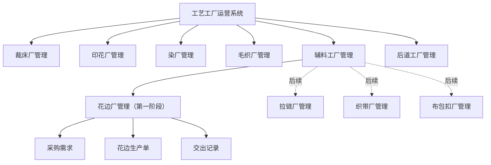

菜单和命名规则：

1. “辅料工厂管理”是分类名称，不代表工厂主体。
2. “花边厂管理”是第一阶段专业业务域。
3. Renda Jaya 是工厂组织名称，不直接作为菜单名称。
4. 生产单必须命名为“花边生产单”，不得命名为笼统的“辅料生产单”。
5. 后续每种专业工厂分别拥有自己的生产单和专业字段。

## 8. 组织、供应商与独立核算边界

### 8.1 组织关系

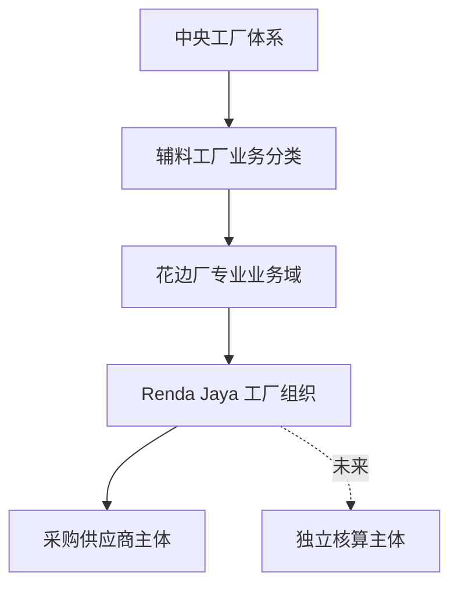

### 8.2 业务边界

1. Renda Jaya 在工艺工厂运营系统中是花边生产组织。
2. Renda Jaya 在采购管理中对应一个采购供应商主体。
3. 同一工厂组织的采购需求、生产单、交出和日志必须保持组织归属一致。
4. 普通花边厂用户只能查看和操作本厂数据。
5. 平台管理人员跨工厂查看时，必须始终显示当前工厂组织。
6. 不同专业工厂不得查看或修改彼此生产单。
7. 未来新增第二家花边厂时，在花边厂管理中按组织授权和筛选，不复制第二套花边菜单。

### 8.3 独立核算预留

以下事实必须贯穿采购、生产、交出和收货，以支持未来独立核算：

- 工厂组织和采购供应商。
- 采购订单和采购 SKU。
- 花边生产单。
- 数量及原始单位。
- 每次交出数量。
- 每次实际收货数量及差异。
- 目标仓库和实际库区。
- 操作人、时间和关联记录。

第一阶段不得出现“待结算、已结算、应付金额、加工费”等财务状态和动作。

## 9. 系统职责与上下游关系

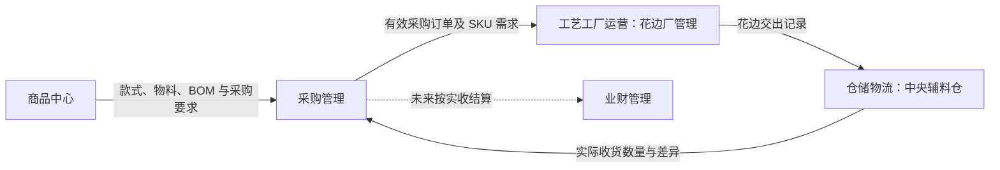

| 系统 | 第一阶段职责 | 明确不承担 |
| --- | --- | --- |
| 商品中心 | 提供款式、物料、BOM 和采购要求 | 不执行花边生产，不确认仓库收货 |
| 采购管理 | 创建和维护采购订单；提供供应商、SKU、数量、单位、交期、目标仓库及取消动作 | 不维护花边厂内部生产进度 |
| 工艺工厂运营 | 接收内部工厂采购需求；管理花边生产、加工填报、完成和交出 | 不修改采购价格，不进行采购结算 |
| 仓储物流 | 接收花边交出；确认实际收货、差异和库区 | 不修改花边完工数量，不代替花边厂完成生产单 |
| 业财管理 | 未来承接采购结算和工厂独立核算 | 第一阶段不进入业务闭环 |

## 10. 角色与职责

| 角色 | 主要职责 | 不允许执行 |
| --- | --- | --- |
| 采购人员 | 创建、修改、查看和取消采购订单；查看关联生产及实际收货 | 不确认接收生产任务，不加工填报，不发起交出，不确认仓库实收 |
| 花边厂业务人员 | 查看本厂采购需求和变更；确认接收；修改允许修改的加工投入；加工填报；完成加工单；发起交出 | 不修改采购订单，不确认仓库实收，不进行财务结算 |
| 花边厂主管 | 执行业务人员动作；撤销完成；取消生产单；处理本厂主管兜底事项 | 不修改采购价格，不代替仓库确认实收 |
| 花边厂管理人员 | 查看本厂采购、生产、交出、收货和日志全貌 | 默认不修改采购事实 |
| 中央辅料仓收货人员 | 查看待收货；确认实际收货数量、时间、库区、差异和凭证 | 不修改花边完工数量，不完成生产单 |
| 中央辅料仓主管 | 执行仓管动作；处理实收大于交出的二次确认 | 不修改采购计划和花边完工数量 |
| 平台管理员 | 跨组织查看；处理自动生成失败；在满足条件时恢复误取消生产单 | 不替代日常业务操作，不删除历史事实 |

所有动作必须使用当前真实操作身份。系统不得为了让动作成功而自动把普通业务人员替换成主管，也不得把普通仓管替换成仓库主管。

## 11. 业务术语

| 术语 | 业务定义 |
| --- | --- |
| 采购需求 | 从有效采购订单中提供给内部花边厂的 SKU 级生产需求，花边厂只读 |
| 花边生产单 | 对应一张采购订单中的一个花边 SKU，由系统自动生成并由花边厂执行 |
| 加工投入 | 本生产单计划使用的原材料 SKU 和单位用量，不代表实际领料或实际耗用 |
| 需求来源 | 本单为何生产，包括采购订单、采购版本、关联款式、来源数量、交期和目标仓库 |
| 加工产出 | 本单最终生产的花边 SKU，以及计划、完工、交出和实收数量 |
| 加工填报 | 加工中记录一次实际完成数量的业务动作，每次形成独立记录 |
| 累计完工 | 本生产单全部有效加工填报数量之和 |
| 交出记录 | 花边厂每次把一定数量交给指定中央辅料仓形成的独立记录 |
| 实际收货 | 中央辅料仓对一条交出记录最终确认的实际收到数量 |
| 采购变更待查看 | 采购订单产生了当前用户尚未打开查看的新版本变化 |
| 采购变更已查看 | 当前用户已经查看当前版本的完整前后对比，只表示知晓 |

## 12. 业务对象与关系

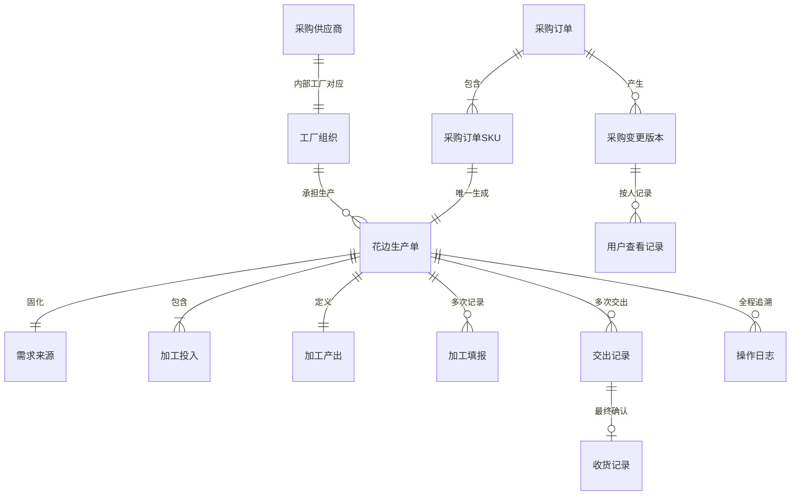

### 12.1 核心对象身份

| 对象 | 唯一判断单位 | 说明 |
| --- | --- | --- |
| 采购订单 | 一张采购订单 | 上游采购事实和未来结算依据 |
| 采购订单 SKU | 一张采购订单＋一个 SKU | 自动生成生产单的最小业务单位 |
| 花边生产单 | 一张采购订单＋一个 SKU | 整个生产周期只保留一张有效生产单 |
| 加工填报 | 一次成功填报 | 多次填报互不覆盖 |
| 交出记录 | 一次成功交出 | 每次交出独立追溯 |
| 收货记录 | 一条交出记录的最终收货 | 第一阶段一条交出记录最多确认一次 |
| 采购变更版本 | 一张采购订单的一次完整变更 | 保存变更前后内容 |
| 用户查看记录 | 一个用户查看一个变更版本 | 不同用户分别计算待查看 |

## 13. 核心业务原则

1. **专业工厂独立**：花边、拉链、织带和布包扣分别是专业业务域。
2. **采购驱动生产**：第一阶段不允许人工脱离采购需求创建花边生产单。
3. **一单一 SKU 一生产单**：同一采购订单同一 SKU 只能有一张生产单。
4. **三类事实独立**：加工投入、需求来源、加工产出必须分别保存和展示。
5. **四套数量独立**：计划、完工、交出、实际收货不得互相替代。
6. **四个状态维度独立**：生产、交出、收货、采购变更查看分别表达。
7. **人员主动完结**：数量达到计划不自动完成生产单。
8. **实际收货回写采购**：花边厂完工和交出不得冒充采购到货。
9. **异常就地处理**：生成异常、取消阻断和收货差异在对应业务页面处理。
10. **操作事实不可删除**：生产单取消或采购取消不得删除历史生产、交出和收货事实。
11. **生成异常同表**：自动生成异常必须并入主列表，不得另建独立异常卡片或异常区。
12. **投入修改最小化**：只允许修改投入 SKU、单位用量；修改原因仅用于日志。
13. **不记录实际投入**：第一阶段不记录实际投入、实际耗用、投入来源和投入批次。

## 14. 采购需求进入花边厂的规则

### 14.1 必须同时满足的条件

1. 采购订单已经生效，且未取消、未作废。
2. 采购物料属于花边。
3. 采购供应商对应启用中的内部花边厂组织。
4. 第一阶段工厂组织为 Renda Jaya。
5. SKU、物料名称、采购数量、单位、交期和目标仓库完整。
6. 同一采购订单 SKU 的全部来源行可以形成一致、完整的需求。
7. 默认加工投入关系完整，至少包含投入 SKU、基础单位、单位用量和真实图片。

### 14.2 不进入花边厂的情况

- 普通外部花边供应商的采购订单。
- 拉链、织带、布包扣或其他非花边物料。
- 已取消或已作废的采购订单。
- 数量无效或关键资料不完整的采购 SKU。
- 供应商尚未对应任何内部工厂。

### 14.3 花边厂可查看的采购事实

- 采购订单号和当前版本。
- 供应商和对应工厂。
- 花边 SKU、名称、规格、颜色和真实图片。
- 采购数量和单位。
- 下单时间、要求交期和目标仓库。
- 全部关联款式、款号、名称、真实图片和来源数量。
- 采购申请人、采购人员和备注。
- 关联花边生产单及当前生产状态。
- 采购变更待查看状态。

花边厂只能查看采购事实，不得在花边厂管理中修改采购订单。

## 15. 花边生产单自动生成

### 15.1 生成时点

采购订单首次完整满足花边厂进入条件时，系统自动为每个花边 SKU 生成生产单。业务人员不需要也不允许点击“创建生产单”。

### 15.2 唯一与合并规则

1. 同一采购订单同一 SKU 只生成一张生产单。
2. 同一采购订单不同 SKU 分别生成生产单。
3. 同一 SKU 在采购订单中出现多行时，按 SKU 合并为一张生产单。
4. 合并后的计划数量等于全部有效来源行数量之和。
5. 每条来源行的款式、来源数量和采购行信息仍需保留。
6. 多个不同来源款式可以合并，不得因此拆成多张生产单。
7. 同组来源行的产出 SKU、单位、交期和目标仓库必须一致。
8. 采购数量、交期、仓库或备注变更时更新原生产单来源，不新建第二张。
9. 重复同步、重复刷新和重复执行不得生成重复生产单。
10. 已取消生产单不得被自动重新生成；符合条件时只能恢复原生产单。

### 15.3 整组校验

同一采购订单 SKU 的全部来源行必须作为一个整体检查：

- 任一来源行缺少必填资料，整组不生成。
- 任一来源行的产出身份、单位、交期或目标仓库不一致，整组不生成。
- 不允许先使用部分有效来源行生成数量不完整的生产单。
- 资料修复后仍按原“采购订单＋SKU”生成唯一生产单。

### 15.4 生成成功

生成成功后必须同时发生：

1. 采购需求显示关联花边生产单号。
2. 生产单进入“待接收”。
3. 固化需求来源。
4. 带入默认加工投入。
5. 固化加工产出。
6. 记录系统自动生成日志。

### 15.5 生成失败

1. 不创建半完整或空白生产单。
2. 生成失败与正常采购需求显示在同一列表，不设置独立异常卡片或异常区。
3. 同一采购订单 SKU 的全部失败原因合并在同一行展示。
4. 缺失数量、交期或仓库时明确显示“待补齐”，不得虚构数据。
5. 页面明确指出由采购或用料资料维护人员修复来源。
6. 修复后原异常行转为正常需求并关联唯一生产单。
7. 不允许保留一条异常行，再新增一条相同采购订单 SKU 的正常行。
8. 自动生成失败不增加新的生产状态。

## 16. 生产单三类独立业务事实

### 16.1 加工投入

加工投入回答“计划使用什么物料生产花边”。每条投入至少展示：

- 投入物料真实图片。
- SKU、名称、规格和颜色。
- 基础单位。
- 单位用量。
- 计划投入总量。

计划投入总量计算规则：

> 计划投入总量＝当前计划产出数量×单位用量

示例：计划产出 600 Yard，单位用量为 0.02 KG/Yard，则计划投入总量为 12 KG。

加工投入规则：

1. 生产单生成时必须已经带入默认加工投入。
2. 默认投入缺失时不允许先生成生产单再补齐。
3. 采购计划数量变化时，按原单位用量重新计算计划投入总量。
4. 允许例外修改的业务内容只有投入 SKU 和单位用量。
5. 选择新 SKU 后，名称、规格、颜色、图片和基础单位自动更新。
6. 第一阶段保持原有投入行数，不允许临时新增或删除投入行。
7. 待接收和加工中允许修改；已完结必须先撤销完成；已取消禁止修改。
8. 修改加工投入不改变生产状态。
9. 修改原因只作为操作日志依据，不属于加工投入资料。
10. 第一阶段不记录实际投入、实际耗用、投入来源、投入批次、领料、发料或退料。
11. 确认接收和完成加工单不以实际投入记录为前提。

### 16.2 需求来源

需求来源回答“为什么生产这张花边生产单”，至少包括：

- 采购订单号和采购版本。
- 采购 SKU 和全部来源行。
- 采购供应商和生产工厂。
- 采购计划数量、单位、要求交期和目标仓库。
- 全部关联款式、款号、名称、真实图片和来源数量。
- 采购申请人、采购人员和采购备注。
- 当前采购变更状态及查看入口。

需求来源在生产单生成时固化。后续采购变更需要保留变更前后内容，不能只展示最新采购结果而丢失历史。

### 16.3 加工产出

加工产出回答“最终生产什么”，至少包括：

- 花边真实图片。
- 花边 SKU、名称、规格和颜色。
- 计划产出数量和单位。
- 累计完工数量。
- 累计交出数量。
- 剩余可交出数量。
- 累计实际收货数量。
- 完工与计划差异。
- 交出与完工差异。
- 实收与交出差异。

## 17. 数量与单位规则

### 17.1 四套数量事实

| 数量 | 业务来源 | 业务含义 |
| --- | --- | --- |
| 计划数量 | 当前采购订单 SKU | 当前采购需求，不代表实际产量 |
| 累计完工数量 | 全部有效加工填报 | 花边厂已经完成的实际产出 |
| 累计交出数量 | 全部有效交出记录 | 花边厂已经交出的实物 |
| 累计实际收货数量 | 全部有效收货记录 | 中央辅料仓实际收到并回写采购的数量 |

### 17.2 计算规则

- 累计完工数量＝全部有效加工填报数量之和。
- 累计交出数量＝全部有效交出记录数量之和。
- 剩余可交出数量＝累计完工数量－累计交出数量。
- 累计实际收货数量＝全部有效收货数量之和。
- 完工差异＝累计完工数量－当前计划数量。
- 待收货数量＝累计交出数量－累计实际收货数量。
- 收货差异＝本次实际收货数量－本次交出数量。

### 17.3 数量约束

1. 完工数量可以少于、等于或大于计划数量。
2. 累计完工达到或超过计划数量的 1.5 倍时二次确认，不禁止提交。
3. 本次交出数量必须大于 0。
4. 本次交出不得超过当前剩余可交出数量。
5. 修改加工填报后，累计完工不得小于累计交出。
6. 实际收货可以少于、等于或大于交出数量。
7. 实收大于交出时，必须由中央仓主管二次确认并填写原因。

### 17.4 单位规则

1. 计划、完工、交出和收货沿用采购 SKU 原始单位。
2. 所有数量必须同时显示单位，例如 350 Yard、120 米、600 条。
3. 单位用量按“投入物料基础单位／产出单位”展示，例如 0.02 KG/Yard。
4. 计划投入总量使用投入物料基础单位。
5. 第一阶段不自动换算 Yard、米、卷或公斤。
6. 生产已经开始后，采购单位变更必须被阻断，不能静默换算历史数量。

## 18. 四个相互独立的状态维度

### 18.1 生产主状态

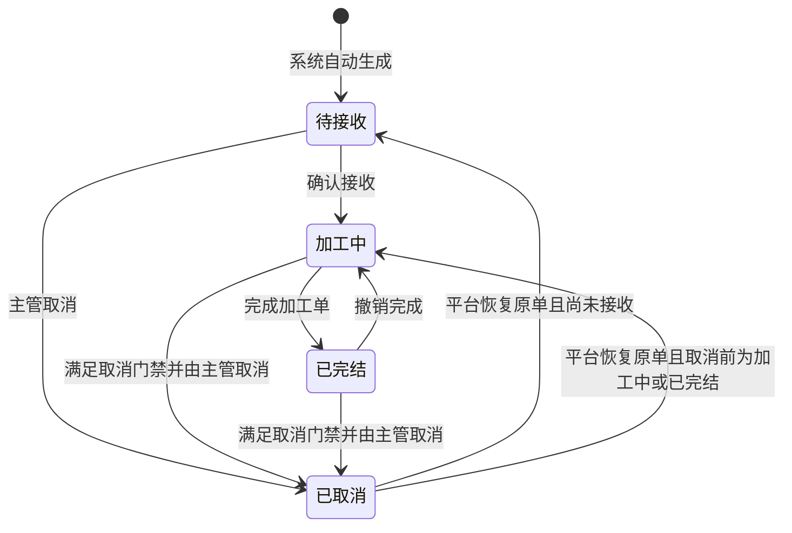

| 状态 | 进入条件 | 主要动作 |
| --- | --- | --- |
| 待接收 | 系统成功生成生产单 | 查看、修改加工投入、确认接收、主管取消 |
| 加工中 | 花边厂确认接收 | 加工填报、修改加工填报、修改加工投入、发起交出、完成加工单、主管取消 |
| 已完结 | 人员主动完成加工单 | 查看、发起交出、主管撤销完成、满足门禁时主管取消 |
| 已取消 | 受权人员完成取消 | 只读查看；满足条件时由平台主管恢复原单 |

生产单不会因为累计完工等于或超过计划数量而自动完结。完成加工单只结束继续加工填报的正常入口，不要求已经全部交出或全部收货。

### 18.2 交出履约状态

| 状态 | 判断规则 |
| --- | --- |
| 未交出 | 累计交出数量为 0 |
| 部分交出 | 累计交出大于 0 且小于累计完工 |
| 已全部交出 | 累计完工大于 0，且累计交出等于累计完工 |

撤销完成后如果又增加完工数量，原“已全部交出”可以自然变为“部分交出”，历史交出记录不改变。

### 18.3 仓库收货状态

单条交出记录：

- 待收货。
- 已收货。
- 已收货·有差异。

生产单汇总：

- 未收货：没有任何交出记录完成收货。
- 部分收货：部分交出已收货，仍有待收货记录。
- 已收货：全部有效交出记录均已完成收货。
- 存在收货差异：作为附加风险标识，与收货进度同时展示。

### 18.4 采购变更查看状态

| 状态 | 含义 |
| --- | --- |
| 无新变更 | 当前没有未查看采购版本 |
| 待查看 | 当前用户尚未查看最新采购变更版本 |
| 已查看 | 当前用户已经打开最新版本的完整前后对比 |

采购变更查看状态不阻断确认接收、加工填报、完成或交出，也不改变生产主状态。

### 18.5 状态维度关系

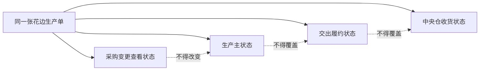

## 19. 总体业务流程

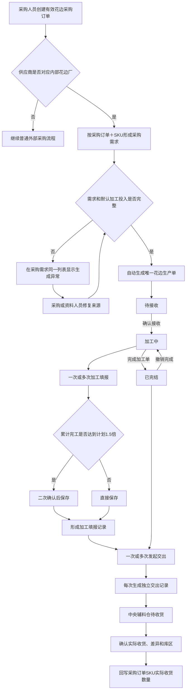

## 20. 自动生成时序

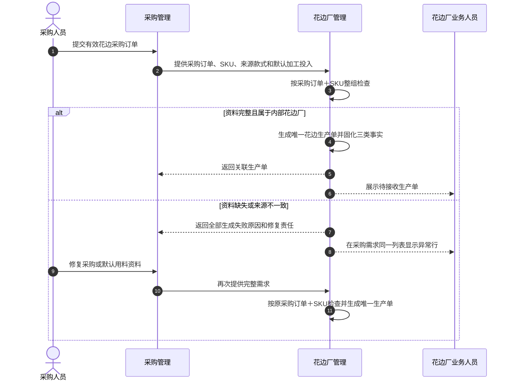

## 21. 采购变更管理

### 21.1 必须识别的变更

- 采购计划数量。
- 花边 SKU、名称、规格、颜色和图片。
- 采购单位。
- 要求交期。
- 目标收货仓库。
- 供应商或对应工厂。
- 关联款式或来源数量。
- 采购备注和生产要求。
- 采购订单状态。
- 默认加工投入关系。

### 21.2 待查看规则

1. 采购需求列表和生产单列表顶部展示“采购变更待查看 N 单”。
2. 顶部 N 按采购订单去重。
3. 生产单列表“采购变更待查看”Tab 的数量按受影响生产单张数统计。
4. 同时表达“涉及 N 个采购订单、M 张生产单”。
5. 受影响行使用黄色醒目标识“采购已变更·待查看”。
6. 用户打开完整前后对比后变为“采购变更·已查看”。
7. 查看记录按用户和采购版本分别保存。
8. 同一采购订单再次变更时，相关生产单重新进入待查看。
9. “查看”只代表知晓，不出现确认、同意、接受或审批含义。

### 21.3 变更详情

至少展示：

- 采购订单号和版本。
- 变更人和变更时间。
- 变更字段。
- 变更前内容和变更后内容。
- 受影响的全部花边生产单。
- 当前计划、累计完工、累计交出和累计实收。

### 21.4 变更影响规则

| 变更类型 | 待接收生产单 | 加工中或已完结生产单 |
| --- | --- | --- |
| 数量、交期、目标仓库、备注 | 同步至原生产单并形成变更记录 | 同步最新需求，保留前后内容并重新待查看 |
| 供应商或工厂 | 允许在未开始时取消原归属并重新判断 | 阻断变更，必须先取消原生产单 |
| SKU 变更或删除 | 取消旧 SKU 生产单后按新 SKU 重新判断 | 阻断变更，必须先取消原生产单 |
| 单位变更 | 未开始时同步并记录 | 阻断变更，防止历史数量单位被改写 |
| 默认加工投入变化 | 未开始时同步最新默认投入并记录 | 不覆盖本单现有投入；由人员查看后决定是否修改 SKU 或单位用量 |

一次采购变更必须作为整体保存。任一字段校验失败时，整次变更不保存、不产生新版本，也不得留下部分 SKU 已修改的状态。

### 21.5 采购变更时序

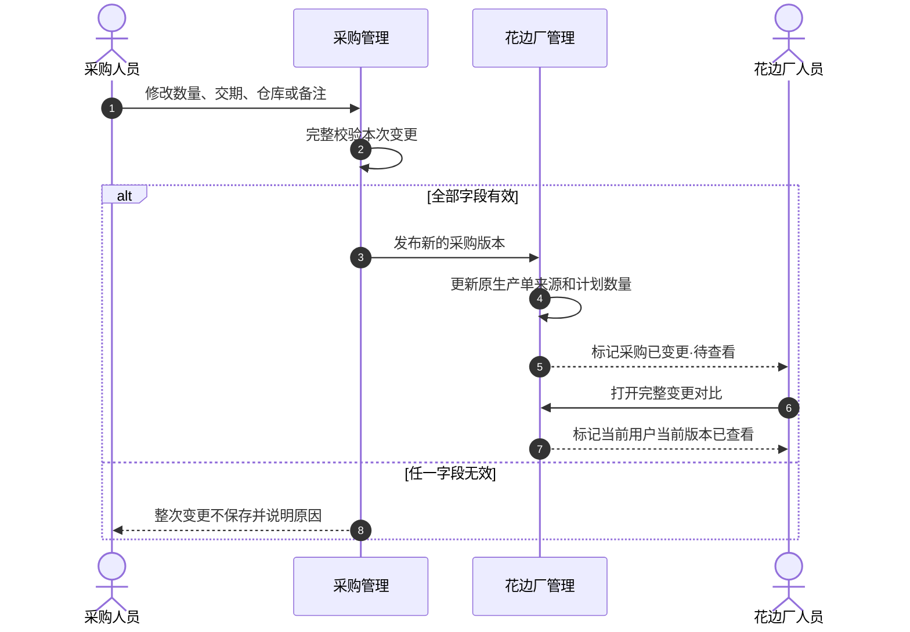

## 22. 采购取消与生产单取消

### 22.1 采购订单取消门禁

采购人员提交取消前，必须检查该采购订单关联的全部花边生产单和下游事实。

| 关联情况 | 取消结果 |
| --- | --- |
| 所有生产单均为待接收，且无交出或收货 | 允许取消采购订单，并同步取消待接收生产单 |
| 所有生产单均为已取消，且无未处理下游事实 | 允许取消采购订单 |
| 任一生产单为加工中 | 阻断，必须先处理并取消该生产单 |
| 任一生产单为已完结 | 阻断，必须先处理并取消该生产单 |
| 任一生产单存在尚不能撤销的交出或收货 | 阻断，必须先处理下游记录 |

阻断提示必须列出生产单号、SKU、生产状态、累计完工和累计交出，不得只显示“无法取消”。

系统不得出现“采购订单已经取消，之后才发现生产单已经生产，再进入人工处理”的路径。校验必须发生在采购取消保存之前。

### 22.2 生产单取消

1. 待接收生产单可由花边厂主管取消。
2. 加工中或已完结生产单必须由主管二次确认并填写原因。
3. 已存在加工填报时，取消不删除任何完工事实。
4. 已存在交出或收货时，第一阶段禁止直接取消生产单。
5. 取消后生产单只读，禁止继续加工、修改投入、完成或交出。
6. 取消日志保存取消前状态、累计完工、累计交出、操作人、时间和原因。
7. 采购订单仍有效且生产单被误取消时，由平台主管恢复原生产单。
8. 恢复误取消不得新建第二张生产单。

### 22.3 取消时序

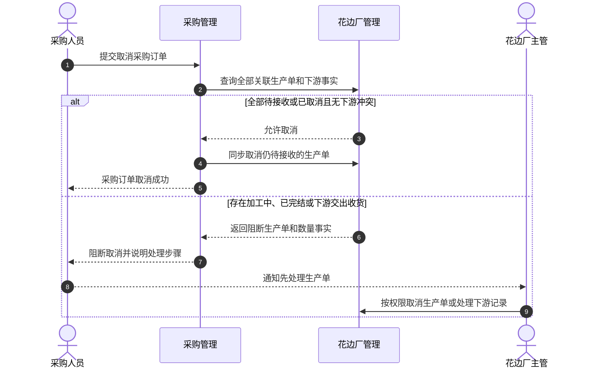

## 23. 花边生产操作

### 23.1 确认接收

前提：

- 生产单为待接收。
- 采购订单仍有效。
- 生产单属于当前工厂。
- 加工产出 SKU、计划数量和单位完整。
- 默认加工投入中的 SKU、基础单位和单位用量完整。

结果：

- 生产单进入加工中。
- 记录确认接收人和时间。
- 写入操作日志。

“确认接收”只表示花边厂接受生产任务，不表示中央仓已经交付原料，也不表示审批采购变更。

### 23.2 加工填报

加工中可以多次填报。每次至少填写：

- 本次完工数量和单位。
- 完工时间。
- 操作人。
- 备注，可选。
- 现场图片，可选。

每次成功保存形成一条独立记录，并重新计算累计完工和剩余可交出数量。

### 23.3 修改加工填报

1. 加工填报不物理删除。
2. 受权人员可修改未造成数量倒挂的记录。
3. 修改后累计完工不得小于累计交出。
4. 修改必须填写原因。
5. 保存修改前数量、修改后数量、修改人和时间。

### 23.4 超量二次确认

当“提交后累计完工数量≥当前计划数量×1.5”时，二次确认必须展示：

- 当前计划数量。
- 提交前累计完工数量。
- 本次完工数量。
- 提交后累计完工数量。
- 超出计划的数量和比例。

操作人可以选择“仍要提交”或“返回修改”。确认后仍由当前操作人保存，不增加主管审批，也不增加新状态。

### 23.5 完成加工单

1. 只有加工中的生产单可以完成。
2. 完成前展示计划、累计完工、累计交出、剩余可交出和完工差异。
3. 累计完工少于、等于或大于计划均允许完成。
4. 完成必须由人员主动执行，系统不得按数量自动完成。
5. 完成不检查实际投入、投入批次或无投入原因。
6. 完成后进入已完结，禁止新增或修改加工填报及加工投入。
7. 已完结后仍可交出尚未交出的有效完工数量。
8. 完成不要求已经全部交出或全部收货。

### 23.6 撤销完成

1. 只有已完结生产单显示撤销完成。
2. 必须由花边厂主管或平台主管执行。
3. 撤销前二次确认并填写原因。
4. 撤销后回到加工中，可以继续加工填报和修改加工投入。
5. 已有完工、交出和收货记录不回滚、不删除。
6. 交出和收货状态根据现有事实继续计算。

## 24. 交出管理

### 24.1 发起条件

- 生产单为加工中或已完结。
- 累计完工大于累计交出。
- 本次交出数量大于 0。
- 本次交出不超过剩余可交出数量。
- 目标仓库读取当前有效采购要求。

### 24.2 每次交出独立记录

1. 每次成功发起交出生成一条新记录。
2. 一次性交出全部数量只生成一条记录。
3. 分两次交出生成两条记录。
4. 分多天交出时每天的实际交出分别记录。
5. 重复点击或重复提交同一次交出不得生成重复记录。

### 24.3 交出记录内容

- 交出记录号。
- 花边生产单和来源采购订单。
- 花边真实图片、SKU、名称、规格和颜色。
- 关联款式及真实图片。
- 交出前累计完工和累计交出。
- 本次交出数量和单位。
- 交出后累计交出和剩余可交出。
- 交出工厂和目标仓库。
- 交出人、时间、包装数量、物流说明和备注。
- 必要图片或凭证。
- 下游收货状态、实际收货数量和差异。

### 24.4 保存结果

交出成功后必须同时形成以下完整事实：

1. 新增一条交出记录。
2. 更新生产单累计交出数量。
3. 在目标中央辅料仓形成一条对应待收货记录。
4. 写入生产单和交出记录日志。

如果任一结果未能形成，本次交出不得留下部分成功状态。

## 25. 中央辅料仓收货与采购回写

### 25.1 收货入口

中央辅料仓按交出记录查看待收货任务。每条待收货任务必须清楚说明：

- 谁交出。
- 来自哪个花边厂。
- 对应哪张采购订单和花边生产单。
- 实物是什么，包含真实图片、SKU、名称和规格。
- 应收多少及单位。
- 应进入哪个仓库。

### 25.2 收货确认

第一阶段一条交出记录只完成一次最终收货确认。收货人员填写：

- 实际收货数量和单位。
- 收货人。
- 收货时间。
- 实际仓库和实际库区。
- 差异原因和备注。
- 差异或破损图片，可选；实收大于交出时必填。

### 25.3 差异规则

| 结果 | 展示和处理 |
| --- | --- |
| 实收等于交出 | 显示“数量一致” |
| 实收小于交出 | 显示“少收 X 单位”，允许保存 |
| 实收大于交出 | 显示“多收 X 单位”，必须由仓库主管二次确认并填写原因 |

第一阶段只记录真实差异，不处理责任、赔付或结算。

### 25.4 采购回写

收货成功后：

1. 交出记录显示实际收货数量、收货人、时间、仓库和库区。
2. 花边生产单重新计算累计实际收货数量。
3. 采购订单对应 SKU 的实际收货数量等于全部有效收货记录之和。
4. 采购订单按各 SKU 汇总实际到货情况。
5. 未来结算读取同一实际收货事实，不再人工重复录入数量。

累计完工和累计交出不得直接写成采购订单实际到货数量。

## 26. 生产、交出与收货时序

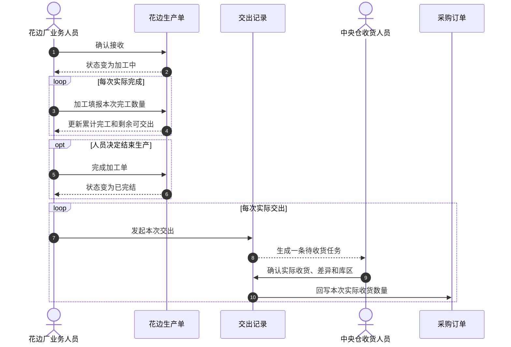

## 27. 操作日志与审计

### 27.1 必须记录的动作

- 系统识别内部工厂采购需求。
- 自动生成生产单成功或失败。
- 采购订单发生变更。
- 用户查看采购变更。
- 修改加工投入。
- 确认接收。
- 新增加工填报。
- 修改加工填报。
- 触发并确认 1.5 倍超量提示。
- 完成加工单。
- 撤销完成。
- 取消生产单。
- 恢复误取消生产单。
- 发起交出。
- 中央辅料仓确认收货。
- 多收二次确认。
- 采购订单实际收货回写。
- 采购取消成功。
- 采购取消被生产门禁阻断。

### 27.2 每条日志内容

- 日志编号。
- 业务对象和单号。
- 动作名称。
- 操作前状态和操作后状态。
- 适用时的操作前数量和操作后数量。
- 操作人姓名、角色和所属组织；自动操作标记为系统。
- 操作时间和工厂时区。
- 原因或备注。
- 关联采购版本、加工填报、交出或收货记录。
- 是否发生二次确认及确认人。

### 27.3 日志原则

1. 日志按时间倒序展示。
2. 业务人员不能删除或改写历史日志。
3. 修改记录时必须保留前后值。
4. 取消生产单或采购订单不得删除以前的生产事实。
5. 从生产单可以追溯完工、交出、收货和采购回写。
6. 从交出记录可以追溯对应收货结果和收货日志。

## 28. 权限矩阵

| 动作 | 采购人员 | 花边厂业务人员 | 花边厂主管 | 中央仓收货人员 | 中央仓主管 | 平台管理员 |
| --- | --- | --- | --- | --- | --- | --- |
| 查看采购需求 | 可 | 本厂可 | 本厂可 | 关联收货可 | 关联收货可 | 全部可 |
| 修改采购订单 | 可 | 不可 | 不可 | 不可 | 不可 | 按采购权限 |
| 查看采购变更 | 可 | 本厂可 | 本厂可 | 关联信息可 | 关联信息可 | 全部可 |
| 修改加工投入 | 不可 | 待接收／加工中可 | 待接收／加工中可 | 不可 | 不可 | 兜底可 |
| 确认接收 | 不可 | 可 | 可 | 不可 | 不可 | 兜底可 |
| 加工填报 | 不可 | 可 | 可 | 不可 | 不可 | 兜底可 |
| 完成加工单 | 不可 | 可 | 可 | 不可 | 不可 | 兜底可 |
| 撤销完成 | 不可 | 不可 | 可 | 不可 | 不可 | 可 |
| 取消生产单 | 不可 | 不可 | 可 | 不可 | 不可 | 可 |
| 发起交出 | 不可 | 可 | 可 | 不可 | 不可 | 兜底可 |
| 确认实际收货 | 不可 | 不可 | 不可 | 可 | 可 | 兜底可 |
| 多收二次确认 | 不可 | 不可 | 不可 | 不可 | 可 | 可 |
| 查看全部操作日志 | 关联采购可 | 本厂可 | 本厂可 | 关联收货可 | 关联收货可 | 全部可 |

## 29. 页面信息架构

### 29.1 花边采购需求列表

页面目标：让花边厂人员进入页面后立即知道“有哪些采购需求、哪些发生变化、哪些自动生成失败、关联生产单是什么状态”。

顶部摘要：

- 全部采购需求数量和 SKU 数量。
- 今日新增 SKU 数量。
- 采购变更待查看采购订单数量。

不得单独设置“自动生成异常”统计卡。生成异常必须并入主列表，并可通过筛选查看。

筛选条件：

- 采购订单号、SKU、物料名称、款号。
- 采购状态。
- 采购变更查看状态。
- 关联生产状态。
- 要求交期。
- 目标仓库。
- 自动生成结果：全部、已关联生产单、自动生成异常。

核心列：

| 列 | 展示内容 |
| --- | --- |
| 采购需求 | 采购订单号、版本、下单时间和采购人员 |
| 花边物料 | 真实缩略图、SKU、名称、规格和颜色 |
| 关联款式 | 全部款式的真实缩略图、款号、名称和来源数量 |
| 采购数量 | 当前计划数量和单位；缺失时明确待补齐 |
| 交付要求 | 要求交期和目标仓库；缺失时明确待补齐 |
| 生产单或生成结果 | 关联生产单号和状态；或全部生成失败原因及修复责任 |
| 数量进度 | 累计完工、累计交出和累计实收 |
| 采购变更 | 待查看／已查看和最近变更时间 |
| 操作 | 查看需求、查看变更、查看生产单 |

### 29.2 花边生产单列表

顶部摘要：

- 待接收数量。
- 加工中数量。
- 已完结数量。
- 采购变更待查看采购订单数量及涉及生产单数量。

列表固定为六个任务 Tab：

1. 全部。
2. 采购变更待查看。
3. 待接收。
4. 加工中。
5. 已完结。
6. 已取消。

“采购变更待查看”是查看维度，不是生产状态。切换 Tab 后保留关键字、交出状态、收货状态、交期、排序、列设置和当前操作身份。

核心列：

| 列 | 展示内容 |
| --- | --- |
| 生产单 | 单号、创建时间和工厂组织 |
| 加工投入 | 投入缩略图、SKU、名称、单位用量和计划投入总量；多条投入显示条数 |
| 需求来源 | 采购订单、版本、采购变更标识和全部来源款式 |
| 加工产出 | 花边缩略图、SKU、名称、规格和计划产出 |
| 数量 | 计划、完工、交出、实收和单位 |
| 生产状态 | 待接收、加工中、已完结或已取消 |
| 交出状态 | 未交出、部分交出或已全部交出 |
| 收货状态 | 未收货、部分收货、已收货及差异标识 |
| 交期 | 要求交期和临期提示 |
| 操作 | 固定右侧，直接展示当前允许动作 |

操作栏要求：

- 始终展示“查看详情”。
- 有采购变更时展示“查看采购变更”。
- 待接收展示“确认接收”；主管另有“取消生产单”。
- 加工中展示“加工填报、完成加工单”；有可交出数量时展示“发起交出”；主管另有“取消生产单”。
- 已完结且有可交出数量时展示“发起交出”；主管展示“撤销完成”，满足门禁时展示“取消生产单”。
- 已取消只允许查看；平台主管在满足恢复条件时展示“恢复误取消”。
- 不使用“查看／操作”合并按钮或隐藏动作的下拉菜单。
- “修改加工投入”不出现在列表操作栏。
- “修改加工填报”只出现在详情中的具体加工填报记录上。

### 29.3 花边生产单详情

标题区域必须始终显示：

- 生产单号和当前操作身份。
- 生产主状态、交出履约状态和中央仓收货状态。
- 计划、累计完工、累计交出、累计实收和剩余可交出五项数量及单位。
- 当前允许执行的生产、交出和主管动作。
- 保存成功或失败反馈。
- 采购变更醒目横幅；待查看时不得折叠隐藏。

详情只设置三个内容 Tab：

1. **生产信息**：完整展示加工投入、需求来源和加工产出。
2. **完工与交出**：展示加工填报、交出记录及每次交出的下游收货结果。
3. **操作日志**：展示完整只读日志。

默认进入“生产信息”。切换 Tab、完成动作或关闭弹窗后保持当前 Tab 和滚动位置。

加工投入区域：

- 展示每条投入的真实图片、SKU、名称、规格、颜色、基础单位、单位用量和计划投入总量。
- 待接收或加工中在该区域提供次要动作“修改加工投入”。
- 修改窗口只允许选择投入 SKU、填写单位用量和操作原因。
- “修改加工投入”不得出现在详情头部主动作区。

主要动作：

- 待接收：确认接收。
- 加工中：加工填报；有可交出数量时，发起交出作为次动作。
- 已完结且有可交出数量：发起交出。
- 已完结且无可交出数量：查看记录。
- 已取消：只读查看。

### 29.4 交出记录列表

支持按生产单、采购订单、SKU、交出时间、目标仓库和收货状态筛选。

每行展示：

- 花边图片和身份。
- 本次交出数量。
- 交出后累计数量。
- 收货状态。
- 实际收货数量和差异。
- 交出人、交出时间、收货人和收货时间。

### 29.5 中央辅料仓待收货页面

首屏围绕“谁交出、收到什么、应收多少、实际收到多少、差多少”组织，突出主动作“确认收货”。

必须展示：

- 花边厂组织。
- 采购订单和花边生产单。
- 花边真实图片、SKU、名称和规格。
- 交出数量和单位。
- 目标仓库。
- 当前收货状态。

仓库页面不展示花边厂内部加工投入明细。

### 29.6 采购订单关联展示

采购订单中提供只读关联信息：

- 对应内部工厂。
- 各 SKU 关联花边生产单。
- 计划、累计完工、累计交出和累计实际收货。
- 采购变更对生产的影响。
- 采购取消被阻断的具体原因。

生产状态只用于采购人员判断，不替代采购订单自身状态。

## 30. 列表与交互要求

1. 采购需求、生产单、交出记录、中央仓收货和采购订单均使用管理列表。
2. 所有列表必须分页，并显示当前页、每页数量和总数。
3. 宽表只在表格区域内部横向滚动，页面主体不得整体横向溢出。
4. 支持列显示、列顺序、排序和冻结。
5. 单号、物料、数量、状态和操作为必需列。
6. 关键识别列固定左侧，操作列固定右侧。
7. 列表动作必须直接显示，不用笼统入口隐藏。
8. 切换筛选、分页、Tab、弹窗和抽屉时不得整页闪烁。
9. 用户点击动作后应立即看到处理中、成功或失败反馈。
10. 重复点击加工填报、完成、撤销完成、交出或收货不得产生重复记录。
11. 操作失败时必须说明失败原因、当前是否已保存以及下一步恢复动作。
12. 管理列表在 1366×768 下正常使用，最低适配 1280×720。
13. 主管端在 1024×768 下可以完成主要动作。

## 31. 款式与物料图片要求

### 31.1 必须覆盖的对象

- 所有关联款式。
- 采购花边 SKU。
- 加工产出花边 SKU。
- 每一种加工投入物料。

### 31.2 展示规则

1. 每个对象必须使用与其真实对应的实拍图、效果图或正式物料图。
2. 表格中缩略图与对象名称、编码位于同一单元格。
3. 非表格页面中图片与对象标识位于同一信息块。
4. 点击缩略图打开原图或高清大图。
5. 大图支持关闭按钮、点击遮罩关闭和 Esc 关闭。
6. 大图保持宽高比，在低分辨率下不溢出。
7. 加载失败时显示明确失败状态和重试入口。
8. 禁止使用纯色块、图标、首字母、渐变或无关图片冒充真实图片。
9. 缺少真实图片的对象不得作为完成交付。

## 32. 异常、防错与恢复

| 场景 | 系统处理 | 恢复动作 |
| --- | --- | --- |
| 重复收到同一采购需求 | 不生成第二张生产单 | 展示原生产单 |
| 供应商未对应内部工厂 | 不生成生产单，在采购需求列表显示原因 | 完成组织对应后重新检查 |
| SKU、数量、单位、交期或仓库缺失 | 整个采购订单 SKU 不生成 | 修复采购资料后重新检查 |
| 默认加工投入缺失 | 不生成空生产单 | 补齐投入 SKU、基础单位、单位用量和图片后重新检查 |
| 同一采购订单 SKU 部分来源行无效 | 整组不生成，禁止形成半单 | 修复全部来源行后按原身份重试 |
| 同组产出、单位、交期或仓库不一致 | 整组不生成 | 统一来源事实后重试 |
| 采购变更任一字段无效 | 整次变更不保存、不产生新版本 | 修正全部字段后重新提交 |
| 采购变更未查看 | 列表醒目标识，不阻断生产 | 打开完整变更对比 |
| 加工中或已完结时取消采购 | 阻断并列出生产单和数量 | 先按权限处理并取消生产单 |
| 加工填报少于计划 | 允许保存 | 人员决定继续生产或完成 |
| 累计完工达到计划 1.5 倍 | 二次确认后允许保存 | 返回修改或仍要提交 |
| 修改完工后小于已交出 | 阻断 | 更正本次修改数量 |
| 交出超过剩余可交出 | 阻断 | 修改本次交出数量 |
| 重复提交交出 | 只保留一条交出记录 | 展示已保存记录 |
| 实收小于交出 | 允许保存并显示少收差异 | 后续查看，不进入结算处理 |
| 实收大于交出 | 仓库主管二次确认并填写原因 | 确认真实数量或返回重数 |
| 图片加载失败 | 显示失败状态和重试 | 重试或补齐真实图片 |
| 网络延迟或提交超时 | 明确告知是否已保存 | 先查询原记录，再决定是否重试 |
| 误取消生产单 | 不自动新建生产单 | 满足条件时由平台主管恢复原单 |

## 33. 时间与显示口径

1. 所有业务记录保存所属工厂时区。
2. Renda Jaya 默认使用雅加达时区。
3. 采购变更、加工填报、交出和收货显示到分钟。
4. 操作日志保留到秒。
5. 收货时间不得早于交出时间。
6. 人工填写未来时间必须被阻断。
7. 临期提醒以采购订单要求交期为准。
8. 第一阶段不推导结算时效。

## 34. Web、PDA 与打印分工

### 34.1 第一阶段 Web

Web 覆盖：

- 花边采购需求。
- 花边生产单。
- 采购变更查看。
- 确认接收、加工填报、完成和撤销完成。
- 发起交出。
- 中央辅料仓收货。
- 采购关联展示和取消门禁。
- 操作日志。

### 34.2 第一阶段 PDA

第一阶段不新增花边厂专用 PDA 页面。未来新增扫码生产或扫码交出时，必须读取与 Web 相同的生产单、数量、交出和收货事实，不建立第二套状态或数量账。

### 34.3 第一阶段打印

第一阶段不新增专用打印模板。未来新增打印时，必须与 Web 使用相同业务事实，并至少展示款式／物料真实图片、生产单号、采购订单号、SKU、数量单位、工厂、目标仓库和可扫码标识。

## 35. 正常业务场景

### 35.1 一张采购订单包含三个 SKU

采购订单包含：

- 花边 SKU A：350 Yard。
- 花边 SKU B：600 Yard。
- 花边 SKU C：1200 Yard。

供应商对应 Renda Jaya。系统生成三张花边生产单。重复同步后仍为三张，不得变为六张。

### 35.2 同一 SKU 多条来源款式

同一采购订单中的同一花边 SKU 分别服务两个款式，来源数量为 200 Yard 和 150 Yard。系统生成一张计划 350 Yard 的生产单，并在需求来源中保留两个款式及各自数量。

### 35.3 分三次生产、分两次交出

计划 350 Yard：

1. 三次加工填报分别为 100、120、130 Yard。
2. 累计完工为 350 Yard。
3. 第一次交出 200 Yard，形成交出记录 1。
4. 第二次交出 150 Yard，形成交出记录 2。
5. 中央仓分别确认两次收货。

最终仍只有一张生产单、三条加工填报和两条交出记录。

### 35.4 一次性交出

计划和累计完工均为 350 Yard。业务人员一次交出 350 Yard，只生成一条交出记录和一条待收货记录。

### 35.5 少产后完成

计划 350 Yard，累计完工 330 Yard。业务人员看到“少 20 Yard”后仍可主动完成加工单，差异继续展示，不自动补齐。

### 35.6 撤销完成继续生产

已完结生产单累计完工 330 Yard。主管撤销完成并填写原因，生产单回到加工中；再填报 20 Yard 后累计完工为 350 Yard。以前记录保持不变。

### 35.7 默认投入和例外修改

计划产出 600 Yard，默认投入单位用量为 0.02 KG/Yard，计划投入为 12 KG。业务人员把投入 SKU 替换为另一个有效物料，并把单位用量改为 0.025 KG/Yard，计划投入自动变为 15 KG；生产状态不变，日志保存前后 SKU、单位用量和原因。

## 36. 边界业务场景

### 36.1 累计完工超过 1.5 倍

计划 100 Yard，提交前累计 140 Yard，本次填报 15 Yard，提交后为 155 Yard。系统展示完整二次确认；当前操作人选择仍要提交后保存，不增加审批状态。

### 36.2 采购数量再次变更

采购计划由 350 Yard 改为 400 Yard。原生产单计划更新，投入计划总量按原单位用量重算，并显示待查看。业务人员查看后变为已查看；采购再次改为 420 Yard 时重新待查看。

### 36.3 加工中取消采购订单

采购订单关联一张加工中的生产单。系统阻断取消并列出生产单号、SKU、状态、累计完工和累计交出。采购订单保持有效。

### 36.4 先取消生产单再取消采购

花边厂主管先取消没有下游交出和收货的生产单并填写原因。采购人员再次提交取消，校验通过后取消采购订单。

### 36.5 收货短少

交出 200 Yard，中央仓实际收到 198 Yard。显示“少收 2 Yard”，采购订单实际收货累计增加 198 Yard。

### 36.6 收货多出

交出 200 Yard，仓库清点 202 Yard。普通仓管不能直接完成；仓库主管填写原因并二次确认后，记录 202 Yard 并显示“多收 2 Yard”。

### 36.7 重复提交

网络延迟时连续点击两次发起交出。系统只生成一条交出记录，并明确显示已经保存的记录。

### 36.8 默认加工投入缺失

采购 SKU 缺少投入 SKU 或单位用量。系统不生成生产单，在采购需求同一列表显示全部缺失项和修复责任。资料补齐后只生成一张生产单。

## 37. 研发验收场景

### 37.1 产品框架与组织

| 编号 | 验收场景 | 预期结果 |
| --- | --- | --- |
| AF-001 | 查看工艺工厂运营菜单 | 辅料工厂管理位于毛织厂管理之后、后道工厂管理之前 |
| AF-002 | 展开辅料工厂管理 | 第一阶段只启用花边厂管理及采购需求、花边生产单、交出记录 |
| AF-003 | 查看工厂命名 | Renda Jaya 作为工厂组织展示，不作为菜单名称 |
| AF-004 | 普通 Renda Jaya 用户进入花边厂管理 | 只能看到本厂采购需求、生产单和交出记录 |
| AF-005 | 平台管理员跨工厂查看 | 页面始终明确当前专业工厂和工厂组织 |

### 37.2 采购需求与自动生成

| 编号 | 验收场景 | 预期结果 |
| --- | --- | --- |
| AF-006 | 内部花边厂有效采购订单含三个 SKU | 自动生成三张生产单 |
| AF-007 | 同一采购订单同一 SKU 出现两行 | 合并为一张生产单并汇总数量 |
| AF-008 | 同一 SKU 两个来源款式 | 一张生产单保留两个款式及各自来源数量 |
| AF-009 | 重复同步同一采购需求 | 不新增第二张生产单 |
| AF-010 | 默认投入缺失 | 不生成生产单，异常显示在采购需求主列表 |
| AF-011 | 同组任一来源行无效 | 整个采购订单 SKU 不生成，不形成半单 |
| AF-012 | 生成异常行缺少采购数量或仓库 | 明确显示待补齐，不虚构内容 |
| AF-013 | 修复生成异常 | 原异常行转为正常并关联唯一生产单 |
| AF-014 | 外部花边供应商采购订单 | 不进入花边厂生产管理 |
| AF-015 | 拉链、织带或布包扣采购 | 不进入花边厂管理 |

### 37.3 加工投入、需求来源与加工产出

| 编号 | 验收场景 | 预期结果 |
| --- | --- | --- |
| AF-016 | 查看新生成生产单 | 同时存在加工投入、需求来源和加工产出三类独立事实 |
| AF-017 | 计划 600 Yard、用量 0.02 KG/Yard | 计划投入显示 12 KG |
| AF-018 | 采购计划由 600 改为 700 Yard | 单位用量不变，计划投入重算为 14 KG |
| AF-019 | 待接收修改加工投入 | 只可修改投入 SKU、单位用量和操作原因，生产状态不变 |
| AF-020 | 选择新的投入 SKU | 名称、规格、颜色、基础单位和真实图片同步更新 |
| AF-021 | 已完结尝试修改加工投入 | 不允许修改，必须先撤销完成 |
| AF-022 | 已取消尝试修改加工投入 | 明确阻断 |
| AF-023 | 查看加工投入页面和完成动作 | 不出现实际投入、批次、领退料或无投入原因 |

### 37.4 生产状态与动作

| 编号 | 验收场景 | 预期结果 |
| --- | --- | --- |
| AF-024 | 新生成生产单 | 状态为待接收，主要动作是确认接收 |
| AF-025 | 确认接收 | 状态变为加工中并记录操作人和时间 |
| AF-026 | 加工中连续填报三次 | 形成三条独立记录并正确累计完工 |
| AF-027 | 累计完工低于计划 | 允许保存并允许人员完成加工单 |
| AF-028 | 累计完工普通超产但低于 1.5 倍 | 允许直接保存 |
| AF-029 | 累计完工达到或超过 1.5 倍 | 展示完整二次确认，确认后允许保存 |
| AF-030 | 完工数量达到计划 | 不自动完结，仍需人员完成 |
| AF-031 | 加工中执行完成加工单 | 状态变为已完结，历史填报保留 |
| AF-032 | 已完结撤销完成 | 二次确认并填写原因后回到加工中 |
| AF-033 | 撤销完成时已有交出或收货 | 原交出和收货不回滚，可继续生产 |
| AF-034 | 修改加工填报导致完工小于交出 | 阻断保存并说明原因 |

### 37.5 采购变更与取消

| 编号 | 验收场景 | 预期结果 |
| --- | --- | --- |
| AF-035 | 采购数量、交期或仓库变更 | 原生产单更新并出现采购已变更·待查看 |
| AF-036 | 一个采购订单影响多张生产单 | 顶部按一个采购订单统计，Tab 按受影响生产单统计 |
| AF-037 | 当前用户打开完整变更对比 | 当前用户当前版本变为已查看，不出现审批文案 |
| AF-038 | 采购订单再次变更 | 相关生产单重新进入待查看 |
| AF-039 | 不同用户查看同一版本 | 分别记录各自待查看／已查看状态 |
| AF-040 | 一次采购变更中任一字段无效 | 整次不保存，不产生新版本，不留下局部修改 |
| AF-041 | 采购订单关联加工中生产单时取消 | 阻断并列出生产单、SKU、状态和数量 |
| AF-042 | 所有关联生产单待接收且无下游事实 | 允许取消采购并同步取消生产单 |
| AF-043 | 生产单已有交出或收货时取消 | 阻断并说明需先处理下游记录 |
| AF-044 | 误取消生产单后恢复 | 恢复原生产单，不生成第二张 |

### 37.6 交出、收货与采购回写

| 编号 | 验收场景 | 预期结果 |
| --- | --- | --- |
| AF-045 | 一次性交出全部可交出数量 | 生成一条交出记录和一条待收货记录 |
| AF-046 | 分两次交出 | 生成两条相互独立的交出记录 |
| AF-047 | 交出数量超过剩余可交出 | 阻断保存 |
| AF-048 | 重复提交同一次交出 | 只生成一条记录 |
| AF-049 | 中央仓实收等于交出 | 显示数量一致并回写实际收货 |
| AF-050 | 中央仓实收小于交出 | 显示少收差异，按实收数量回写采购 |
| AF-051 | 中央仓实收大于交出 | 必须由仓库主管二次确认并填写原因和凭证 |
| AF-052 | 查看收货完成后的交出记录 | 可追溯收货人、时间、仓库、库区、数量和差异 |
| AF-053 | 对比完工、交出和采购到货 | 三套数量分别显示，采购到货只取实际收货 |

### 37.7 页面、图片、权限与日志

| 编号 | 验收场景 | 预期结果 |
| --- | --- | --- |
| AF-054 | 查看采购需求页 | 生成异常位于同一列表，没有独立异常卡片 |
| AF-055 | 查看生产单列表 | 存在全部、采购变更待查看、待接收、加工中、已完结、已取消六个 Tab |
| AF-056 | 查看生产单操作列 | 所有当前可执行动作直接展示，不使用合并操作入口 |
| AF-057 | 查看生产单详情 | 只有生产信息、完工与交出、操作日志三个内容 Tab |
| AF-058 | 切换详情 Tab 后执行动作 | 动作完成后保持当前 Tab 和滚动位置 |
| AF-059 | 普通业务人员尝试主管动作 | 不自动提升身份，明确提示需要主管处理 |
| AF-060 | 查看所有款式和物料 | 每个对象都有真实缩略图，点击可查看大图 |
| AF-061 | 图片加载失败 | 显示失败状态和重试入口，不展示破图或无关占位图 |
| AF-062 | 查看操作日志 | 自动生成、变更、投入修改、生产、完成、撤销、取消、交出和收货均可追溯 |
| AF-063 | 重复点击关键动作 | 不生成重复填报、交出或收货记录，并明确反馈保存结果 |
| AF-064 | 在 1280×720 查看管理列表 | 页面主体不横向溢出，宽表仅在表格内滚动 |
| AF-065 | 在 1024×768 完成主管操作 | 主要信息和动作可见且可完成 |

## 38. 上线前业务验收数据准备

为确保研发和测试能够覆盖完整业务，验收环境至少准备以下数据：

1. 一张包含三个花边 SKU 的有效内部工厂采购订单。
2. 一张同一花边 SKU 包含两条不同款式来源的采购订单。
3. 一条默认加工投入缺失的采购需求。
4. 一张待接收生产单。
5. 一张加工中且尚未完工的生产单。
6. 一张加工中且已有多次加工填报的生产单。
7. 一张已完结但仍有可交出数量的生产单。
8. 一张已取消生产单。
9. 一张存在采购变更待查看的采购订单，且影响多张生产单。
10. 一条部分交出的生产单。
11. 一条待收货交出记录。
12. 一条收货一致记录。
13. 一条少收记录。
14. 一条多收待主管确认记录。
15. 一条达到计划 1.5 倍的加工填报场景。
16. 一条取消采购被加工中生产单阻断的场景。
17. 每个款式、花边 SKU 和投入物料的真实对应图片。

## 39. 分阶段演进

### 39.1 第一阶段：花边生产闭环

采购需求、自动生成、默认加工投入、确认接收、加工填报、完成／撤销完成、交出、中央仓收货、采购回写、采购变更待查看、取消门禁、日志和真实图片。

### 39.2 第二阶段：其他专业辅料工厂

按业务优先级增加拉链厂、织带厂和布包扣厂。可以复用采购需求、生产单、交出和收货骨架，但必须分别定义各专业工厂的加工投入、设备、规格、质量和产出事实。

### 39.3 第三阶段：质量、原料与设备

根据现场成熟度增加原料库存、领退料、质量检验、返工、设备、排产和生产批次。新增能力不得反向污染第一阶段简单生产状态。

### 39.4 第四阶段：独立核算与采购结算

以采购订单 SKU 的实际收货数量为结算数量基础，结合采购价格、税费、运费、差异责任和工厂核算规则进行结算。结算状态必须独立于生产、交出和收货状态。

## 40. 已确认业务决策

1. 辅料工厂管理属于工艺工厂运营系统一级业务分类。
2. 辅料工厂不是统一生产主体。
3. 花边、拉链、织带和布包扣分别属于不同专业工厂业务域。
4. 第一阶段只建设花边厂管理，具体工厂为 Renda Jaya。
5. 采购订单按 SKU 自动生成生产单。
6. 同一采购订单同一 SKU 只能有一张生产单。
7. 加工投入、需求来源和加工产出独立保存和展示。
8. 加工投入默认随生产单生成，只允许例外修改投入 SKU 和单位用量。
9. 第一阶段不记录实际投入、投入来源、批次、领退料或原料库存。
10. 生产状态采用待接收、加工中、已完结，已取消为异常终止状态。
11. 生产状态、交出状态、收货状态和采购变更查看状态相互独立。
12. 加工中允许多次加工填报。
13. 少产和普通超产不限制完成。
14. 累计完工达到或超过计划 1.5 倍时二次确认，但不禁止提交。
15. 完成加工单必须由人员主动执行，并支持主管撤销完成。
16. 每次交出生成独立记录。
17. 中央辅料仓实际收货数量是采购实际到货和未来结算的数量依据。
18. 采购变更使用待查看／已查看，不使用待确认／已确认。
19. 采购取消必须先检查全部关联生产单和下游事实。
20. 所有关键动作必须记录日志。
21. 所有款式和物料必须有真实图片、缩略图和大图。
22. 第一阶段不建设采购结算、成本核算、专用 PDA 和打印模板。

## 41. 最终产品结论

辅料工厂管理是工艺工厂运营系统中的专业工厂业务分类，不是供应商门户，也不是一个统一的辅料生产主体。第一阶段通过 Renda Jaya 花边厂，把中央采购订单转化为工厂可执行的花边生产单，并以简单生产状态完成确认接收、多次加工填报、人员主动完结、分批交出、中央辅料仓实际收货和采购回写。

研发实现和测试验收必须始终坚持以下五个分离：

1. 专业工厂业务域与具体工厂组织分离。
2. 加工投入、需求来源与加工产出分离。
3. 生产状态、交出状态、收货状态与采购变更查看状态分离。
4. 计划数量、完工数量、交出数量与实际收货数量分离。
5. 采购变更“是否查看”与“是否审批接受”分离。

只要这五个边界保持稳定，后续增加其他专业辅料工厂、质量、原料、设备和独立核算时，就不需要推翻第一阶段的核心产品结构。
