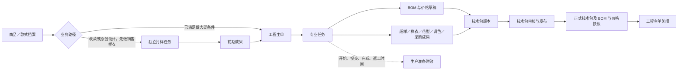
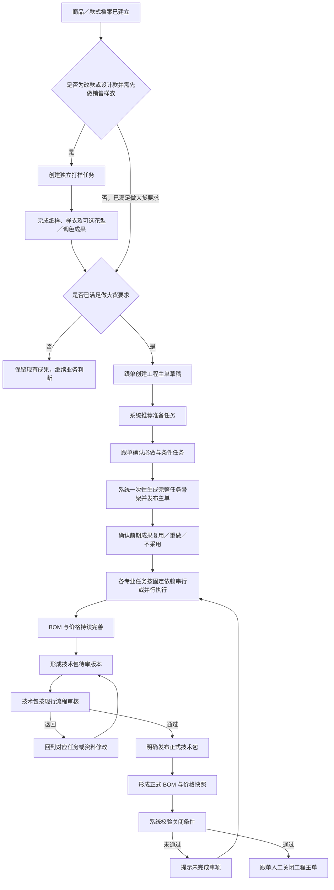
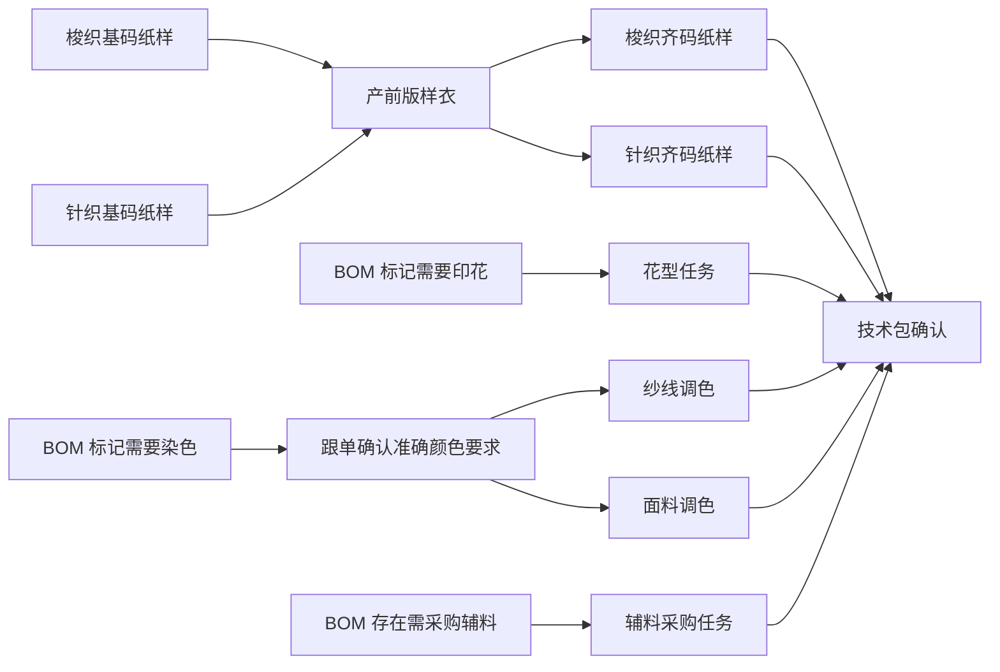
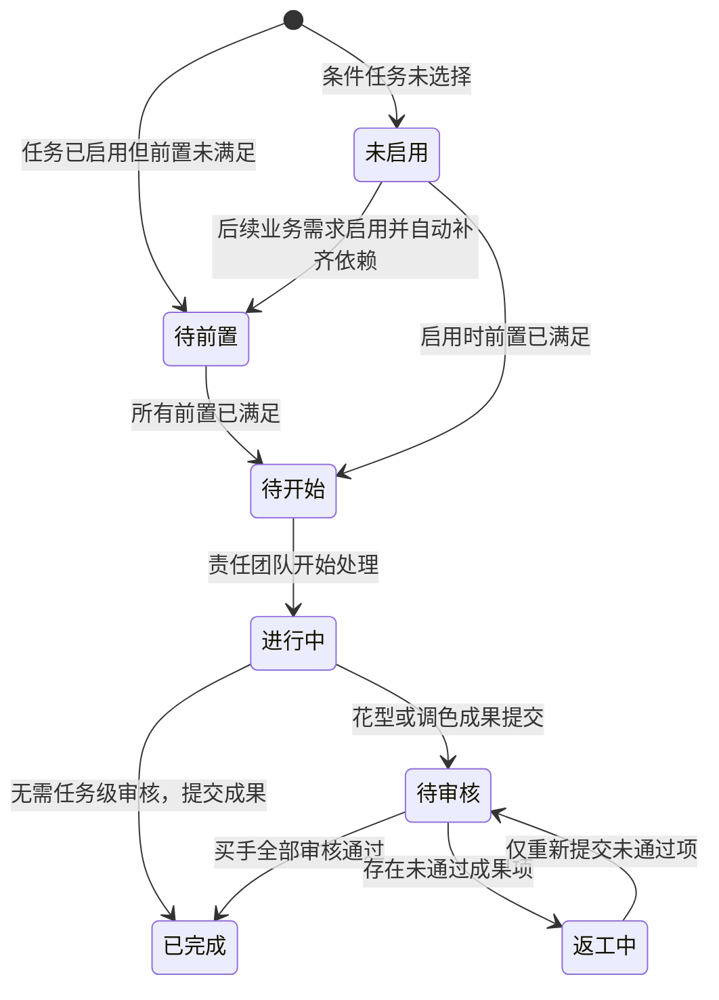
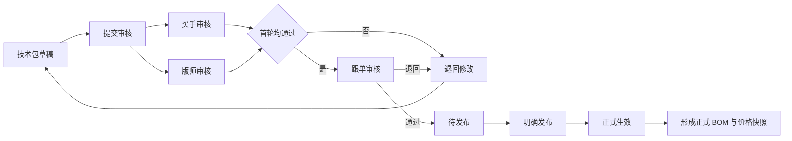
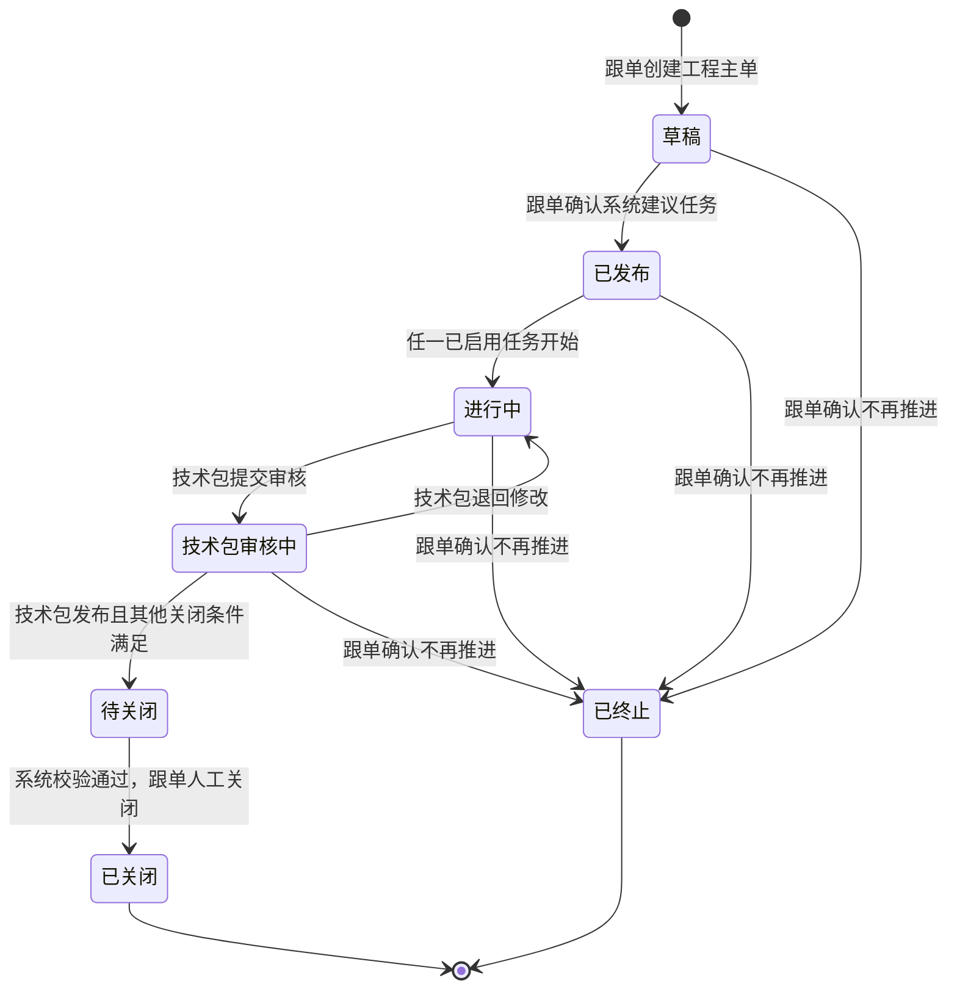
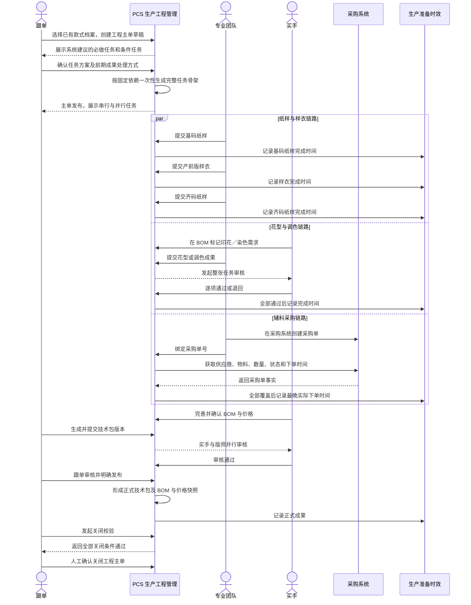

# PCS 生产工程管理产品需求说明书

| 文档信息 | 内容 |
| --- | --- |
| 文档版本 | V1.0 |
| 需求状态 | 已确认，可进入研发评审与任务拆解 |
| 适用系统 | 商品中心系统（PCS） |
| 适用模块 | 生产工程管理 |
| 主要角色 | 跟单、买手、版师／针织团队、样衣制作团队、花型团队、染厂、采购人员、技术包审核人员 |
| 编制日期 | 2026-08-03 |

---

## 1. 文档目的

本文档用于指导 PCS 生产工程管理模块的产品设计、研发实现、测试验收和业务上线。

本文档重点回答以下问题：

1. 什么情况下需要创建工程主单。
2. 工程主单、专业任务、生产准备时效、BOM 与价格、技术包之间是什么关系。
3. 不同业务角色分别负责什么，什么时候可以操作。
4. 制版、产前版样衣、花型、调色、采购等任务如何串行或并行推进。
5. 哪些成果需要审核，哪些成果由制作团队提交后即完成。
6. 工程主单在什么条件下可以关闭。
7. 页面、状态、字段、业务门禁和验收标准应如何统一。

本文档只描述产品与业务需求，不包含技术实现方案。

---

## 2. 背景与业务问题

### 2.1 商品中心系统的模块边界

商品中心系统整体分为四个业务模块：

1. 商品测款。
2. 生产工程管理。
3. 物料／商品档案。
4. 样衣管理。

当前建设顺序为：

1. 优先完成并上线生产工程管理。
2. 接着完成物料／商品档案。
3. 最后完成商品测款。
4. 样衣管理暂不纳入当前阶段。

### 2.2 当前需要解决的核心问题

首单进入正式生产前，需要多个团队完成制版、产前版样衣、花型、调色、辅料采购、技术资料整理等准备工作。这些工作之间既有固定前后依赖，也有可并行推进的专业任务。

本模块需要解决：

- 由一张工程主单统一承载本款式的生产工程准备。
- 新建主单后，先由系统给出任务建议，再由跟单确认本款式实际需要执行的任务。
- 每个专业团队处理自己的真实任务，不在多个模块重复维护同一件事。
- 生产准备时效只记录工程任务的实际开始、提交、完成和返工时间，不再成为任务安排入口。
- BOM 与价格贯穿打样、工程和技术包形成过程，并在技术包正式生效时形成正式快照。
- 技术包必须来源于工程主单，完成现行审核并发布后，才能作为正式生产资料。

---

## 3. 产品目标与非目标

### 3.1 产品目标

1. 建立“款式档案 → 工程主单 → 专业任务 → 技术包”的统一生产工程链路。
2. 让跟单能够清楚看到所有专业任务的依赖、负责人、状态、成果和时效。
3. 让专业团队只处理自己负责的任务，减少跨页面重复录入。
4. 让买手统一维护 BOM 与价格，并审核花型和调色成果。
5. 让生产准备时效自动、只读地反映工程任务的真实执行情况。
6. 形成可审核、可发布、可追溯的正式技术包版本。
7. 通过固定依赖、必填校验和关闭门禁，防止缺少前置成果就进入后续生产。

### 3.2 本期非目标

本期不包含：

- 商品测款流程的完整建设。
- 样衣唯一条码、样衣库存、借用、流转和退回管理。
- 实际大货染色执行。
- 在 PCS 内创建采购单或复制采购系统的下单能力。
- 自定义、拖动或修改专业任务依赖关系。
- 专业任务暂停、取消或任务级审批流。
- 异常中心、异常提报和异常处理流程。
- 从工程主单之外直接新建技术包。
- 导入、转换或手工绑定其他来源的技术包。

---

## 4. 核心业务定义

| 业务名词 | 定义 |
| --- | --- |
| 首单 | 某一 SPU 以前未正式售卖并且未正式生产，本次首次进入大货生产准备。 |
| 工程主单 | 首单进入正式生产前，由跟单建立并统筹全部专业准备任务的业务主单。 |
| 专业任务 | 工程主单下由具体团队执行的真实任务，例如制版、产前版样衣、花型、调色和采购。 |
| 独立打样任务 | 在尚未进入大货生产准备时，为改款或原创设计制作销售展示样衣而建立的任务。 |
| 改款打样 | 基于一个已有 SPU 进行修改，并形成另一个目标 SPU 的打样活动。 |
| 设计打样 | 不基于已有款式，围绕一个已建立的目标 SPU 开展原创设计打样。 |
| 前期成果 | 改款打样或设计打样阶段已形成的纸样、样衣、花型、调色等可复用成果。 |
| BOM 与价格 | 以 SPU 和商品颜色为范围，维护物料、单位用量、损耗、工艺要求、标准价格和自定义费用的统一业务对象。 |
| 技术包 | 汇总正式生产所需 BOM、纸样、花型、颜色、工艺、尺码、设计、附件和质量要求的正式资料版本。 |
| 花型库 | 保存经买手审核通过、可以在后续款式和技术资料中复用的花型资产。 |
| 部件模板库 | 保存领型、袖型、口袋等可复用标准部件资料，属于技术资料。 |
| 生产准备时效 | 读取工程主单专业任务事件，用于展示和统计首单工程准备时间的只读业务记录。 |

---

## 5. 业务对象与关系

### 5.1 关系规则

1. 所有工程业务都必须先有商品／款式档案。
2. 独立打样任务和工程主单均以目标 SPU 为成果归属对象。
3. 工程主单是专业任务的唯一任务安排与执行事实源。
4. 生产准备时效只读取工程主单及专业任务产生的时间事实。
5. 技术包必须从工程主单或工程变更任务生成。
6. BOM 与价格不是独立于技术包之外的第二份正式资料；技术包生效时形成正式 BOM 与价格快照。

---

## 6. 角色与职责

| 角色 | 主要职责 | 关键权限 |
| --- | --- | --- |
| 跟单 | 创建工程主单；确认系统建议任务；协调各专业团队；维护准确染色要求；确认技术包；校验并关闭主单 | 创建、发布、确认任务方案、维护调色要求、绑定业务协作信息、关闭主单 |
| 买手 | 维护 BOM 与价格；判断物料是否需要印花或染色；审核花型和调色成果；参与技术包审核 | 新增／修改 BOM、维护自定义费用、逐项审核花型与调色成果 |
| 版师／针织团队 | 制作基码纸样和齐码纸样；维护可复用部件模板 | 开始任务、提交纸样成果、新建部件模板版本、引用模板 |
| 样衣制作团队 | 制作产前版样衣 | 开始任务、提交样衣图片和数量 |
| 花型团队 | 根据需要印花的物料制作花型 | 开始任务、逐项提交花型成果、处理退回项 |
| 染厂 | 根据已确认的颜色要求完成调色 | 开始任务、逐项提交调色成果、处理退回项 |
| 采购人员 | 在采购系统下单，并在工程任务中绑定采购单号 | 查询、绑定和解除有效采购单 |
| 技术包审核人员 | 按现行审核职责审核技术包版本 | 提交审核意见、通过或退回技术包 |
| 系统配置人员 | 统一维护人民币与印尼盾汇率 | 维护最新有效汇率；工程页面仅展示 |

### 6.1 权限原则

1. BOM 与价格只允许买手维护和修改，其他角色只读。
2. 物料标准单价只能来自物料档案，买手不能在 BOM 中修改。
3. 花型和调色成果最终均由买手审核。
4. 生产准备时效中的工程来源记录对所有角色只读。
5. 工程主单关闭必须由跟单执行，系统只负责校验，不自动关闭。

---

## 7. 总体业务流程

### 7.1 流程原则

1. 创建工程主单不等于直接开始全部任务。
2. 新主单的第一个业务动作必须是“确认任务方案”。
3. 系统先建议，跟单再确认；必做任务不能取消，条件任务由跟单选择。
4. 任务依赖关系固定，不向用户开放调整。
5. 任务确认后一次性生成完整任务骨架，未选择的条件任务显示为“未启用”。
6. 后续 BOM 中出现印花或染色需求时，可以按固定规则启用对应条件任务，并自动补齐其前置任务。

### 7.2 独立打样任务详细规则

独立打样任务用于改款或原创设计在进入正式大货准备前形成销售展示样衣及其相关成果，不从属于工程主单。

#### 改款打样

1. 必须明确“基于什么款式”和“做成什么款式”。
2. 来源 SPU 与目标 SPU 都必须提前建立商品／款式档案。
3. 来源 SPU 与目标 SPU 不能相同。
4. 打样形成的纸样、样衣、花型、调色和 BOM 草稿成果均归属于目标 SPU。
5. 可以根据实际需要关联创建花型任务、纱线调色任务或面料调色任务。

#### 设计打样

1. 目标 SPU 必须提前建立商品／款式档案。
2. 设计打样不要求来源 SPU；如果实际是基于已有款式修改，应使用改款打样。
3. 打样形成的全部成果归属于目标 SPU。
4. 可以根据实际需要关联创建花型任务、纱线调色任务或面料调色任务。

#### 独立打样中的物料

1. 独立打样使用与工程阶段一致的 BOM 与价格草稿。
2. 买手维护物料、单位用量、损耗、打样数量、印花需求和染色需求。
3. 系统按单位用量、打样数量和损耗计算本次总需求量。
4. 独立打样成果达到做大货条件后，工程主单可以将其作为前期成果输入，但必须由跟单逐项决定复用、重做或不采用。

---

## 8. 工程主单

### 8.1 创建条件

只有同时满足以下条件，才允许创建工程主单：

1. 商品／款式档案已存在。
2. 商品／款式档案具有可识别的 SPU、名称和主图。
3. 该 SPU 尚未完成正式生产。
4. 该 SPU 当前不存在未关闭的工程主单。
5. 创建人具备跟单职责，并明确工程主单负责人。

### 8.2 创建方式

当前阶段由跟单人工创建工程主单。

创建时只需要选择：

- 目标商品／款式。
- 跟单负责人。

创建成功后形成“草稿”主单，不在创建弹窗中选择专业任务。

后续如果增加系统自动创建，新建后的业务行为仍必须与人工创建一致：先进入任务方案确认，再生成专业任务。

### 8.3 唯一性规则

1. 同一 SPU 同一时间只允许存在一张未关闭的工程主单。
2. 主单未关闭期间需要补充任务或返工，必须在原主单内完成。
3. 主单关闭后发生新的工程修改，应建立独立工程变更任务，并基于已生效技术包生成新版本。

### 8.4 主单基础信息

| 字段 | 必填 | 说明 |
| --- | --- | --- |
| 工程主单编号 | 系统生成 | 全局唯一，便于任务、时效和技术包追溯 |
| SPU | 是 | 来源于商品／款式档案，不可自由填写 |
| 商品名称 | 是 | 来源于商品／款式档案 |
| 商品主图 | 是 | 与商品名称和 SPU 同时展示，可查看大图 |
| 跟单负责人 | 是 | 主单协调与关闭责任人 |
| 创建方式 | 是 | 当前为人工创建；后续可展示系统创建 |
| 当前状态 | 系统生成 | 见工程主单状态规则 |
| 当前阶段 | 系统生成 | 根据任务与技术包进度计算 |
| 创建时间 | 系统记录 | 主单草稿生成时间 |
| 发布时间 | 系统记录 | 跟单确认任务方案的时间 |
| 关闭时间 | 系统记录 | 跟单完成关闭的时间 |

---

## 9. 任务方案确认

### 9.1 业务目标

任务方案确认用于解决“不同款式需要执行的专业准备并不完全相同”的问题，同时保证必要任务和固定依赖不会被遗漏。

### 9.2 系统建议

系统根据以下信息给出任务建议：

- 商品／款式档案的品类和做货属性。
- 是否存在可复用的前期成果。
- BOM 中的印花、染色和辅料需求。
- 当前已确认的固定准备项规则。

### 9.3 任务分类

| 分类 | 操作规则 | 示例 |
| --- | --- | --- |
| 必做任务 | 默认选中并锁定，跟单不可取消 | 基码纸样、产前版样衣、齐码纸样、技术包确认 |
| 条件任务 | 系统建议，跟单可以勾选或暂不启用 | 花型、纱线调色、面料调色、辅料采购 |

### 9.4 确认规则

1. 跟单必须完成任务方案确认，主单才能从草稿进入已发布。
2. 必做任务不能取消。
3. 条件任务可根据当前实际需求选择。
4. 依赖关系只展示，不允许修改。
5. 如果选择了后置任务，系统自动补齐所有前置任务。
6. 确认操作一次性生成完整任务骨架，不允许只生成部分前置任务。
7. 任务方案确认完成后，系统记录确认人和确认时间。

### 9.5 确认结果

- 已选择任务：按依赖情况进入“待前置”或“待开始”。
- 未选择的条件任务：显示“未启用”。
- 主单状态：由“草稿”变为“已发布”，随后根据任务执行进入“进行中”。

---

## 10. 前期成果的承接

### 10.1 适用场景

改款或设计款在进入大货准备前，可能已经完成销售样衣、基码纸样、花型或调色成果。创建工程主单时，需要对这些成果进行业务判断，避免无意义重复制作。

### 10.2 处理方式

对每项可用前期成果，跟单必须选择一种处理方式：

| 处理方式 | 含义 | 对工程任务的影响 |
| --- | --- | --- |
| 复用 | 直接作为本次工程主单的输入 | 满足对应依赖，不生成一次虚假的新执行记录 |
| 重做 | 本次大货准备需要重新执行 | 正常创建并执行对应任务 |
| 不采用 | 该成果不作为本次输入 | 不满足依赖；需要按当前任务方案处理 |

### 10.3 复用规则

1. 系统默认推荐目标 SPU 最近一份“已完成且已确认”的成果。
2. 跟单可以改选其他已完成的历史成果版本。
3. 复用成果需要保留来源任务、成果版本和确认人。
4. 复用只代表依赖满足，不计入本次任务完成数量、执行时长和准时率。
5. 复用成果进入技术包时，仍需接受技术包整体审核。

---

## 11. 专业任务体系

### 11.1 任务清单

| 专业任务 | 主要负责人 | 核心成果 | 完成规则 |
| --- | --- | --- | --- |
| 梭织基码纸样 | 版师 | 基码纸样资料 | 制作团队提交即完成 |
| 针织基码纸样 | 针织团队 | 基码纸样资料 | 制作团队提交即完成 |
| 产前版样衣 | 样衣制作团队 | 产前版样衣图片、数量 | 制作团队提交即完成 |
| 梭织齐码纸样 | 版师 | 齐码纸样资料 | 制作团队提交即完成，后续在技术包审核 |
| 针织齐码纸样 | 针织团队 | 齐码纸样资料 | 制作团队提交即完成，后续在技术包审核 |
| 花型任务 | 花型团队、买手 | 各物料花型成果 | 买手逐项审核全部通过后完成 |
| 纱线调色任务 | 跟单、染厂、买手 | 颜色要求和调色成果 | 买手逐项审核全部通过后完成 |
| 面料调色任务 | 跟单、染厂、买手 | 颜色要求和调色成果 | 买手逐项审核全部通过后完成 |
| 辅料采购任务 | 采购人员 | 已绑定的采购单事实 | 全部所需物料被有效采购单覆盖且均有实际下单时间 |
| 技术包确认任务 | 跟单及现行审核角色 | 已发布技术包 | 正式技术包发布后完成 |

### 11.2 固定依赖关系

说明：

1. 纸样链路按“基码纸样 → 产前版样衣 → 齐码纸样”串行推进。
2. 花型、调色和辅料采购可在固定规则允许的情况下，与纸样链路并行推进。
3. 技术包确认必须等待本次已启用的所有必要专业成果满足要求。
4. 系统不提供新增、删除、拖动或改变依赖关系的入口。

### 11.3 通用任务字段

| 字段 | 说明 |
| --- | --- |
| 任务编号 | 每张真实任务唯一 |
| 任务类型 | 制版、样衣、花型、调色、采购、技术包等 |
| 所属工程主单 | 可追溯到唯一工程主单 |
| 目标 SPU | 成果归属款式 |
| 负责团队／负责人 | 当前任务执行责任 |
| 前置任务 | 固定依赖，不可编辑 |
| 当前状态 | 任务状态图所定义的状态 |
| 当前轮次 | 初次执行或返工轮次 |
| 计划完成时间 | 由既定准备时效规则确定 |
| 解锁时间 | 所有前置条件满足的时间 |
| 开始时间 | 执行团队首次开始时间 |
| 提交时间 | 本轮成果提交时间 |
| 审核时间 | 需要审核的任务记录审核时间 |
| 首次完成时间 | 第一次达到完成条件的时间 |
| 当前有效完成时间 | 最近一次通过或完成的时间 |

---

## 12. 任务状态

### 12.1 专业任务状态图

### 12.2 状态说明

| 状态 | 业务含义 | 允许的主要动作 |
| --- | --- | --- |
| 未启用 | 条件任务当前不适用 | 按业务规则启用 |
| 待前置 | 已启用，但仍有前置任务未完成 | 查看前置任务 |
| 待开始 | 前置已满足，等待责任团队开始 | 开始任务 |
| 进行中 | 责任团队正在执行 | 维护并提交成果 |
| 待审核 | 花型或调色成果等待买手审核 | 买手审核 |
| 返工中 | 部分成果未通过，需重新制作 | 修改未通过项并重新提交 |
| 已完成 | 当前有效成果满足完成条件 | 查看成果和时间记录 |

### 12.3 状态规则

1. 任务不能跳过“待前置”直接开始，除非前置在启用时已经满足。
2. 只有花型和调色任务进入“待审核”。
3. 制版、齐码纸样和产前版样衣由制作团队提交后直接完成。
4. 任务不提供暂停和取消动作。
5. 返工只影响未通过成果项，已通过成果项保持锁定。

---

## 13. 制版任务

### 13.1 任务类型

- 梭织基码纸样。
- 针织基码纸样。
- 梭织齐码纸样。
- 针织齐码纸样。

### 13.2 业务规则

1. 基码纸样完成后，产前版样衣任务才能解锁。
2. 产前版样衣完成后，齐码纸样任务才能解锁。
3. 制版任务不设置单独审核。
4. 制作团队提交成果后，该任务完成。
5. 齐码纸样作为技术包的一部分，最终随技术包统一审核。
6. 技术包审核退回涉及纸样时，在原任务增加返工轮次，不重复创建同类型任务。

### 13.3 成果字段

| 字段 | 必填 | 说明 |
| --- | --- | --- |
| 纸样类型 | 是 | 梭织／针织、基码／齐码 |
| 适用尺码 | 是 | 基码或齐码范围 |
| 成果文件／图片 | 是 | 纸样成果的可识别资料 |
| 制作人 | 是 | 实际提交人 |
| 提交时间 | 系统记录 | 本轮成果提交时间 |
| 备注 | 否 | 必要的制作说明 |

---

## 14. 产前版样衣任务

### 14.1 业务定位

产前版样衣用于验证正式生产前的款式呈现，由样衣制作团队依据基码纸样制作。

### 14.2 完成规则

1. 基码纸样完成或确认复用后，任务才可开始。
2. 制作团队填写成果图片和制作数量后提交。
3. 制作团队提交完成即视为任务完成，不设置任务级审核。
4. 产前版样衣成果进入技术包后，随技术包统一审核。

### 14.3 成果字段

| 字段 | 必填 | 单位／说明 |
| --- | --- | --- |
| 样衣成果图片 | 是 | 至少 1 张，可查看大图 |
| 制作数量 | 是 | 件 |
| 提交人 | 是 | 实际制作团队成员 |
| 提交时间 | 系统记录 | 本轮提交时间 |
| 说明 | 否 | 仅填写必要信息 |

---

## 15. 花型任务

### 15.1 任务来源

买手在 BOM 中将某一物料标记为“需要印花”后，该物料进入花型任务范围。

### 15.2 任务处理

1. 一张花型任务可以包含多个需要印花的物料成果项。
2. 花型团队按物料逐项提交花型图片、花型文件和必要说明。
3. 花型团队提交整张任务后，任务进入待审核。
4. 买手对整张任务进行一次审核，但必须逐项标记结果。

### 15.3 审核规则

1. 全部成果项通过：整张花型任务完成。
2. 存在未通过项：整张花型任务进入返工中。
3. 未通过项必须填写未通过原因。
4. 已通过项锁定，不要求重复提交或重复审核。
5. 花型团队只修改并重新提交未通过项。
6. 全部成果项最终通过后，每个成果项分别进入花型库，成为可复用花型资产。

### 15.4 成果项字段

| 字段 | 必填 | 说明 |
| --- | --- | --- |
| 物料编码／名称／图片 | 系统带入 | 来源于 BOM，需要同列识别 |
| 印花需求 | 系统带入 | 买手在 BOM 中维护的需求 |
| 花型成果图片 | 是 | 便于买手逐项审核 |
| 花型成果文件 | 是 | 可用于后续生产资料 |
| 提交说明 | 否 | 必要说明 |
| 审核结果 | 买手填写 | 通过／未通过 |
| 未通过原因 | 条件必填 | 结果为未通过时必须填写 |

---

## 16. 调色任务

### 16.1 业务边界

调色任务用于形成准确的染色要求和调色成果，不负责实际大货染色。

调色分为两类：

- 纱线调色任务。
- 面料调色任务。

### 16.2 三阶段处理

#### 阶段一：读取 BOM 染色判断

买手在 BOM 中确认每种物料是否需要染色。需要染色的物料自动进入对应调色任务。

#### 阶段二：跟单确认准确颜色要求

跟单按物料维护：

- 潘通色卡色号。
- 颜色名称。
- 染色色号或内部识别信息。
- 颜色样图。
- 必要的染色说明。

此阶段由跟单负责，不由买手代填。

#### 阶段三：染厂调色、买手审核

1. 染厂按已确认要求逐项提交调色成果。
2. 整张任务提交后进入待审核。
3. 买手逐项标记通过或未通过。
4. 未通过项必须填写原因并重新调色。
5. 全部成果项通过后，调色任务完成。

### 16.3 审核规则

调色任务与花型任务采用同一套审核规则：整张提交、逐项判断、未通过项返工、已通过项锁定、全部通过后整张完成。

### 16.4 成果项字段

| 字段 | 维护角色 | 必填 | 说明 |
| --- | --- | --- | --- |
| 物料编码／名称／图片 | 系统带入 | 是 | 来源于 BOM |
| 是否需要染色 | 买手在 BOM 维护 | 是 | 是时进入调色任务 |
| 潘通色卡色号 | 跟单 | 是 | 准确颜色依据 |
| 颜色名称 | 跟单 | 是 | 中文业务名称 |
| 染色色号 | 跟单 | 否 | 业务需要时填写 |
| 颜色样图 | 跟单 | 否 | 辅助识别 |
| 调色成果图片 | 染厂 | 是 | 审核依据 |
| 调色成果说明 | 染厂 | 否 | 必要说明 |
| 审核结果 | 买手 | 是 | 通过／未通过 |
| 未通过原因 | 买手 | 条件必填 | 未通过时填写 |

---

## 17. 辅料采购任务

### 17.1 业务原则

采购人员仍在采购系统完成下单。PCS 不复制采购下单流程，只允许采购人员在辅料采购任务中绑定采购单号。

### 17.2 操作流程

1. 采购人员在采购系统创建采购单。
2. 在 PCS 辅料采购任务中输入采购单号。
3. 系统查询并展示采购单必要信息。
4. 采购人员确认绑定。
5. 系统按所有已绑定采购单判断 BOM 所需辅料是否被完整覆盖。

### 17.3 展示信息

| 信息 | 说明 |
| --- | --- |
| 采购单号 | 可追溯到采购系统 |
| 供应商 | 来自采购单 |
| 采购物料 | 编码、名称、图片、规格 |
| 采购数量 | 带业务单位 |
| 采购状态 | 来自采购单 |
| 实际下单时间 | 用于完成时间判断 |

### 17.4 完成规则

辅料采购任务同时满足以下条件后完成：

1. 所有需要采购的 BOM 辅料行均被有效采购单覆盖。
2. 每张已绑定采购单均存在实际下单时间。
3. 采购单状态有效，没有被作废。

任务完成时间取全部有效采购单中最晚的实际下单时间。

### 17.5 阻断规则

- 采购单不存在：禁止绑定，并提示采购单号无效。
- 采购单已作废：禁止绑定。
- 采购物料与本任务 BOM 需求无关：禁止绑定。
- 尚有 BOM 辅料未覆盖：任务不能完成，并明确显示未覆盖物料。

---

## 18. BOM 与价格

### 18.1 业务定位

BOM 与价格在独立打样和工程阶段为草稿，随着业务推进持续完善；技术包发布后，形成正式版本中的 BOM 与价格快照。

### 18.2 维护权限

1. 只有买手可以新增、删除和修改 BOM 物料行。
2. 只有买手可以维护自定义费用。
3. 其他角色只读。
4. 业务人员如发现内容问题，线下联系买手，由买手直接修改；本期不建立问题提报流程。

### 18.3 适用范围

1. BOM 按“SPU + 商品颜色”维护。
2. 同一商品颜色下的 BOM 统一适用于全部尺码。
3. 物料方案可参考目标 SPU 最近一份已完成且已确认的方案。
4. 买手可以改选其他已完成的方案版本。
5. 复用方案时复制物料结构和工艺要求，物料标准单价始终读取最新有效值。

### 18.4 BOM 物料字段

| 字段 | 说明 |
| --- | --- |
| 商品颜色 | 当前 BOM 分组颜色 |
| 序号 | 物料顺序 |
| 物料类型 | 面料、辅料、包装材料等 |
| 物料编码 | 来源于物料档案 |
| 物料名称 | 来源于物料档案 |
| 物料图片 | 与编码、名称同列展示，可查看大图 |
| 规格 | 物料规格 |
| 单位用量 | 单件商品用量 |
| 单位 | 来源于物料档案 |
| 损耗率 | 百分比 |
| 打样数量 | 当前打样所需件数 |
| 本次总需求量 | 系统计算 |
| 是否需要印花 | 买手判断 |
| 印花需求 | 需要印花时填写 |
| 是否需要染色 | 买手判断 |
| 染色需求 | 买手填写业务需求，准确色号由跟单在调色任务维护 |
| 水溶要求 | 业务需要时填写 |
| 正反面花型 | 业务需要时填写 |
| 关联花型成果 | 花型任务完成后关联 |
| 标准单价 | 来源于物料档案，人民币 |
| 物料小计 | 系统计算，人民币 |

### 18.5 数量计算

本次总需求量 = 单位用量 × 打样数量 ×（1 + 损耗率）

展示和计算必须保留物料档案定义的业务单位。缺少单位换算关系时，该物料不得加入 BOM，并提示先维护单位换算关系。

### 18.6 标准单价规则

1. 标准单价使用人民币。
2. 标准单价来源于物料档案，买手不能在 BOM 中修改。
3. 草稿阶段始终读取物料档案最新有效标准单价，不提供同步按钮。
4. 标准单价精度为 4 位小数。
5. 物料小计和汇总金额精度为 2 位小数。
6. 本期物料成本不包含运费。
7. 物料没有标准单价时，不允许加入 BOM，并提示：

> 该物料暂无标准单价，无法加入。请先维护该物料的标准单价。

8. 已加入 BOM 的物料标准单价失效时，该行立即标记“标准单价失效”，并禁止提交技术包审核。

### 18.7 自定义费用

1. 自定义费用统一作用于整个 SPU。
2. 自定义费用使用印尼盾。
3. 费用名称由买手填写，例如车位费、印花费等。
4. 自定义费用由买手新增、修改和删除。

### 18.8 汇率与综合成本

1. 汇率由系统配置统一维护，BOM 与价格页面只读展示。
2. 只使用当前最新有效汇率，不处理汇率历史变化。
3. 汇率展示格式为：1 人民币 = X 印尼盾。
4. 页面同时展示：
   - 人民币物料成本。
   - 印尼盾自定义费用。
   - 当前汇率。
   - 人民币综合成本。
   - 印尼盾综合成本。

计算口径：

- 人民币综合成本 = 人民币物料成本 + 印尼盾自定义费用 ÷ 当前汇率。
- 印尼盾综合成本 = 人民币物料成本 × 当前汇率 + 印尼盾自定义费用。

### 18.9 正式快照

只有技术包完成审核并明确发布生效时，才形成以下快照：

- BOM 物料明细。
- 标准单价。
- 物料成本。
- 自定义费用。
- 使用汇率。
- 人民币和印尼盾综合成本。

技术包发布后，正式快照不随物料档案价格或系统汇率变化而自动改变。

---

## 19. 技术包

### 19.1 创建边界

1. 新业务不允许绕过工程主单直接新增技术包。
2. 工程主单满足技术资料生成条件后，生成技术包草稿版本。
3. 工程主单关闭后的工程变更任务可以生成新的技术包版本。

### 19.2 技术包内容

技术包沿用现行业务结构，至少包含：

1. BOM。
2. 价格。
3. 纸样。
4. 物料与花型关系。
5. 颜色与物料关系。
6. 工艺要求。
7. 尺码资料。
8. 设计资料。
9. 附件。
10. 质量要求。

### 19.3 技术包列表信息

技术包列表应保持以下核心信息：

- 技术包编号。
- 商品图片、商品名称和 SPU。
- 状态。
- 版本。
- 完整度。
- 做货难度。
- 跟单。
- 版师。
- 关联生产单。
- 创建时间。
- 操作。

### 19.4 审核与发布流程

### 19.5 审核规则

1. 技术包版本必须沿用当前审核流程。
2. 买手与版师并行完成首轮审核。
3. 首轮均通过后，进入跟单审核。
4. 任一审核退回，技术包回到草稿修改。
5. 审核通过不等于生效，必须执行明确发布动作。
6. 只有发布成功，技术包才成为正式版本，BOM 与价格才形成正式快照。
7. 技术包正式生效后，工程主单中的技术包确认任务完成。

### 19.6 技术资料管理

生产工程中的技术资料统一包含：

1. 技术包。
2. 花型库。
3. 部件模板库。

#### 花型库规则

1. 只有经过买手审核通过的花型成果才能进入花型库。
2. 一项审核通过的物料花型成果对应一项独立花型资产。
3. 花型资产至少包含花型名称、成果图片、成果文件、适用物料、来源任务、目标 SPU、审核人、审核时间和版本。
4. 后续打样或工程任务可以引用已有花型资产，但必须记录实际引用版本。
5. 已发布技术包引用的花型版本后续不随花型库新版本自动改变。

#### 部件模板库规则

1. 部件模板库属于技术资料，不属于任务安排或任务配置。
2. 部件模板用于维护领型、袖型、口袋等可复用标准部件。
3. 部件模板至少包含：模板名称、部件类型、模板图片、纸样文件、适用品类、维护人、版本、启用状态和更新时间。
4. 部件模板由版师团队维护，制版任务可以引用。
5. 引用模板时必须明确模板版本，不能只记录模板名称。
6. 正式技术包发布时固化本次引用的部件模板版本。
7. 部件模板后续修改或发布新版本，不影响已经发布的技术包。
8. 停用模板不能被新任务引用，但既有技术包仍可查看其已固化版本。

---

## 20. 生产准备时效

### 20.1 业务定位

生产准备时效是首单款式级的时间记录与统计，不是生产批次管理，也不是任务安排入口。

从工程主单形成两条业务线：

1. 执行线：工程主单生成专业任务，各团队在专业任务中执行。
2. 记录与统计线：生产准备时效读取各任务的开始、提交、审核、完成和返工时间。

### 20.2 只读原则

生产准备时效页面只允许：

- 查看固定准备项。
- 查看状态和时间。
- 查看责任团队。
- 查看来源工程主单、专业任务、采购单和正式技术包。
- 查看统计结果。

生产准备时效页面不允许：

- 创建专业任务。
- 确认或调整准备项。
- 修改任务依赖。
- 上传专业成果。
- 维护 BOM、花型或调色要求。
- 审核专业成果。

### 20.3 固定准备项映射

| 准备项 | 来源任务／事实 | 完成时间口径 |
| --- | --- | --- |
| 梭织基码纸样 | 梭织基码纸样任务 | 成果提交时间 |
| 针织基码纸样 | 针织基码纸样任务 | 成果提交时间 |
| 产前版样衣 | 产前版样衣任务 | 成果提交时间 |
| 梭织齐码纸样 | 梭织齐码纸样任务 | 成果提交时间 |
| 针织齐码纸样 | 针织齐码纸样任务 | 成果提交时间 |
| 花型准备 | 花型任务 | 买手全部审核通过时间 |
| 纱线染色要求确认 | 纱线调色任务 | 跟单完成准确颜色要求时间 |
| 纱线调色 | 纱线调色任务 | 买手全部审核通过时间 |
| 面料染色要求确认 | 面料调色任务 | 跟单完成准确颜色要求时间 |
| 面料调色 | 面料调色任务 | 买手全部审核通过时间 |
| 辅料下单 | 辅料采购任务 | 全部有效采购单中最晚实际下单时间 |

### 20.4 统计规则

1. 同一任务同一轮次只记录一次，避免重复统计。
2. 同时保留首次完成时间和当前有效完成时间。
3. 返工后使用当前有效完成时间反映最新结果，同时保留首次完成事实。
4. 前期成果复用不计本次完成数量、执行时长和准时率。
5. 已完成但缺少开始时间的任务仍计入完成数量，但不计算有效执行时长，并明确显示时效数据不完整。
6. 工程主单关闭后，生产准备时效保持关闭结果，不被后续其他记录覆盖。

---

## 21. 工程主单状态

### 21.1 状态图

### 21.2 状态说明

| 状态 | 进入条件 | 主要动作 |
| --- | --- | --- |
| 草稿 | 创建工程主单 | 确认任务方案 |
| 已发布 | 跟单确认任务方案并生成任务 | 查看和协调任务 |
| 进行中 | 任一已启用任务开始 | 推进专业任务和 BOM |
| 技术包审核中 | 技术包版本提交审核 | 查看审核进度、处理退回 |
| 待关闭 | 正式技术包已发布且其他关闭条件满足 | 系统校验、跟单关闭 |
| 已关闭 | 跟单完成关闭 | 只读查看；后续修改走工程变更 |
| 已终止 | 整张主单经业务判断不再推进 | 只读查看终止原因 |

### 21.3 终止规则

1. 终止仅作用于整张工程主单，不是专业任务取消。
2. 终止需要填写原因并进行二次确认。
3. 终止不设置审批流。
4. 已关闭主单不能终止，已终止主单不能恢复。

---

## 22. 工程主单关闭

### 22.1 关闭条件

工程主单只有同时满足以下条件，才进入待关闭：

1. 所有已启用专业任务均已完成。
2. 所有固定依赖均已满足。
3. 正式技术包版本已经审核通过并发布生效。
4. 正式技术包中的 BOM 与价格快照有效。
5. 不存在标准单价失效、单位换算缺失等阻断项。
6. 系统关闭校验通过。

### 22.2 关闭操作

1. 系统展示关闭校验结果。
2. 校验未通过时，逐项列出尚未满足的条件，并提供对应业务对象的查看入口。
3. 校验通过后，由跟单执行“关闭工程主单”。
4. 跟单二次确认后，主单变为已关闭。
5. 系统不得自动关闭主单。
6. 已关闭主单不得重新打开。

### 22.3 不作为关闭门禁的内容

以下属于工程主单之后的生产业务产出，不作为工程主单关闭条件：

- 生产需求是否已经创建。
- 生产单是否已经创建。
- 大货印花单或染色单是否已经创建。

---

## 23. 关闭后的工程变更

### 23.1 适用场景

工程主单关闭后，如果已生效技术资料仍需修改，不在已关闭主单内直接编辑，而是建立独立工程变更任务。

### 23.2 业务规则

1. 工程变更任务必须关联目标 SPU 和当前生效技术包版本。
2. 变更任务只启用本次实际需要调整的专业任务。
3. 变更任务可以复用原主单成果作为输入。
4. 修改完成后生成新的技术包版本。
5. 新版本继续执行现行技术包审核与发布流程。
6. 原技术包版本保持可追溯，不被覆盖。

---

## 24. 关键业务时序

---

## 25. 页面与信息架构要求

### 25.1 工程主单列表

列表用于跟单和管理人员查询与创建工程主单，应包含：

- 新建工程主单。
- 按主单编号、SPU、商品名称、跟单、状态和时间筛选。
- 状态统计。
- 商品图片、商品名称和 SPU 同列展示。
- 当前阶段、任务进度、风险状态和最后更新时间。
- 标准分页、排序、列显示、列顺序和冻结能力。
- 操作列固定在右侧。

### 25.2 工程主单详情

详情页按以下顺序组织：

1. 商品／款式与主单摘要。
2. 草稿状态下的任务方案确认。
3. 可用前期成果及复用／重做／不采用选择。
4. 专业任务泳道。
5. BOM 与价格摘要。
6. 技术包状态和版本。
7. 生产准备时效摘要。
8. 主单操作记录。

专业任务采用泳道表达：

- 横向表示逻辑阶段。
- 纵向按专业任务类型分组。
- 每张真实任务独立显示一张卡片。
- 依赖线仅用于表达关系，不允许编辑。
- 选中任务时突出其前置和后续任务。
- 任务详情使用抽屉承载，页面只保留必要业务文案。

### 25.3 专业任务列表

按专业任务类型分别提供列表，至少展示：

- 任务编号。
- 来源类型和来源编号。
- 商品图片、名称和目标 SPU。
- 负责团队／负责人。
- 前置依赖。
- 当前状态和轮次。
- 计划完成时间。
- 最后更新时间。
- 操作。

### 25.4 图片要求

1. 所有出现商品、款式或物料的地方，必须展示对应真实图片。
2. 缩略图必须与名称和编号同列展示。
3. 点击缩略图必须弹窗查看大图。
4. 大图弹窗支持关闭按钮和点击遮罩关闭。

### 25.5 文案要求

1. 页面使用中文业务语言。
2. 不展示内部状态码。
3. 不放置解释系统实现的长文案。
4. 按钮使用明确动作，例如“确认任务方案”“提交成果”“审核花型”“绑定采购单”“发布技术包”“关闭工程主单”。

---

## 26. 业务阻断与提示

| 场景 | 系统处理 | 提示要求 |
| --- | --- | --- |
| 款式档案不存在 | 禁止创建工程主单或独立打样任务 | 请先创建商品／款式档案 |
| 同一 SPU 已存在未关闭主单 | 禁止重复创建 | 展示现有工程主单编号并提供查看入口 |
| SPU 已正式生产 | 禁止创建首单工程主单 | 说明该款式不属于首单 |
| 必做任务未选择 | 不允许取消选择 | 必做任务保持锁定 |
| 选择后置任务但缺少前置 | 自动补齐前置任务 | 明确展示自动补齐结果 |
| 物料没有标准单价 | 禁止加入 BOM | 该物料暂无标准单价，无法加入。请先维护该物料的标准单价。 |
| 物料缺少单位换算 | 禁止加入 BOM | 请先维护该物料的单位换算关系 |
| 已加入物料标准单价失效 | 标记物料行并禁止提交技术包审核 | 标准单价失效，请恢复价格或替换物料 |
| 花型／调色存在未通过项 | 整张任务进入返工中 | 未通过项必须显示原因，已通过项保持锁定 |
| 采购单无效或已作废 | 禁止绑定 | 明确采购单不可用原因 |
| 采购物料未完整覆盖 BOM | 采购任务不能完成 | 列出尚未覆盖的物料 |
| 技术包未发布 | 工程主单不能关闭 | 技术包审核通过后仍需明确发布 |
| 关闭条件未满足 | 禁止关闭 | 逐项列出未满足条件和对应查看入口 |

---

## 27. 数据与追溯要求

### 27.1 操作记录

下列动作必须记录操作人、时间和结果：

- 创建工程主单。
- 确认任务方案。
- 选择前期成果处理方式。
- 启用条件任务。
- 开始任务。
- 提交成果。
- 花型／调色逐项审核。
- 绑定或解除采购单。
- 提交、审核、退回和发布技术包。
- 执行关闭校验。
- 关闭或终止工程主单。

### 27.2 返工记录

返工必须保留：

- 返工轮次。
- 退回人和退回时间。
- 未通过成果项。
- 未通过原因。
- 本轮重新提交人和提交时间。
- 再次审核结果。
- 首次完成时间和当前有效完成时间。

### 27.3 责任归属

1. 每张专业任务必须有明确责任团队。
2. 每个待审核成果必须有明确审核角色。
3. 每个主单必须有唯一跟单负责人。
4. 每条时效记录必须能追溯到工程主单和真实专业任务。

---

## 28. 验收场景

### 28.1 场景一：普通首单完整闭环

前置：目标 SPU 已有档案，未生产，不存在未关闭工程主单。

验收步骤：

1. 跟单创建工程主单草稿。
2. 系统推荐必做任务和条件任务。
3. 跟单确认任务方案。
4. 系统一次性生成任务骨架，并按依赖显示待前置／待开始。
5. 各团队完成纸样、样衣、花型、调色和采购任务。
6. 买手完善 BOM 与价格，并完成花型和调色审核。
7. 技术包完成审核并发布。
8. 系统形成正式 BOM 与价格快照。
9. 关闭校验通过，跟单人工关闭主单。

通过标准：全过程只有一张工程主单；专业任务、生产准备时效和技术包可相互追溯；主单状态最终为已关闭。

### 28.2 场景二：改款打样成果复用

前置：源 SPU 与目标 SPU 均存在且不同；目标 SPU 已有已确认的改款打样成果。

验收步骤：

1. 创建目标 SPU 的工程主单。
2. 系统展示可复用的前期成果。
3. 跟单选择复用基码纸样和花型，选择重做产前版样衣。
4. 复用成果满足对应依赖，但不产生本次虚假执行时间。
5. 产前版样衣和后续任务按当前主单正常执行。

通过标准：来源成果和目标 SPU 清晰；复用项不计本次完成数量、执行时长和准时率。

### 28.3 场景三：花型部分未通过

前置：一张花型任务包含三个物料成果项。

验收步骤：

1. 花型团队提交整张任务。
2. 买手审核两个通过、一个未通过，并填写未通过原因。
3. 任务进入返工中。
4. 两个已通过项锁定。
5. 花型团队只修改并重新提交未通过项。
6. 买手通过后，整张任务完成。

通过标准：三项成果分别形成可追溯审核记录；只有全部通过才完成任务并进入花型库。

### 28.4 场景四：调色三阶段协作

前置：BOM 中两种面料被买手标记为需要染色。

验收步骤：

1. 两种面料自动进入面料调色任务。
2. 跟单分别填写潘通色号和颜色名称。
3. 染厂逐项提交调色成果。
4. 买手逐项审核。
5. 未通过项重新调色，全部通过后任务完成。

通过标准：买手的“是否需要染色”、跟单的“准确颜色要求”、染厂的“调色成果”和买手的“最终审核”职责不可混淆。

### 28.5 场景五：采购单绑定完成

前置：BOM 中有三种需采购辅料。

验收步骤：

1. 采购人员在采购系统完成两张采购单。
2. 在辅料采购任务绑定两张采购单号。
3. 系统展示供应商、物料、数量、状态和实际下单时间。
4. 两张采购单合计覆盖三种辅料。
5. 系统取较晚的实际下单时间作为任务完成时间。

通过标准：PCS 内无重复下单表单；采购任务完成口径与采购系统事实一致。

### 28.6 场景六：标准单价阻断

前置：买手尝试加入一项没有标准单价的物料。

验收步骤：

1. 系统阻止加入。
2. 显示明确提示。
3. 物料档案维护有效标准单价后，买手可以重新加入。
4. 草稿 BOM 自动读取最新有效价格。

通过标准：买手无法在 BOM 中手工修改标准单价；无有效价格的物料不能进入正式技术包。

### 28.7 场景七：技术包退回与再审核

前置：全部专业任务已经完成，技术包已提交审核。

验收步骤：

1. 买手或版师退回技术包。
2. 技术包回到草稿修改。
3. 涉及专业成果的修改回到原任务增加返工轮次。
4. 修改完成后重新提交审核。
5. 买手、版师、跟单依次完成审核，随后明确发布。

通过标准：审核通过和发布生效严格区分；正式快照只在发布时形成。

### 28.8 场景八：关闭门禁

前置：所有专业任务已完成，但技术包仅审核通过、尚未发布。

验收步骤：

1. 跟单发起关闭校验。
2. 系统阻止关闭，并提示“技术包尚未发布”。
3. 跟单发布技术包。
4. 系统形成正式快照并重新校验。
5. 校验通过后，跟单人工关闭。

通过标准：系统不能自动关闭；未发布技术包不能绕过关闭门禁。

### 28.9 场景九：生产准备时效只读

前置：工程主单中存在进行中、已完成、返工中和复用的准备成果。

验收步骤：

1. 在生产准备时效查看全部固定准备项。
2. 检查状态、责任团队、开始和完成时间。
3. 复用项明确显示为前期成果复用，并排除本次时效统计。
4. 页面只能查看，不能修改、上传或审核。

通过标准：全部数据均可追溯至工程主单和专业任务，不形成第二套执行入口。

---

## 29. 研发验收清单

### 29.1 主单与任务

- [ ] 仅符合首单条件的 SPU 可创建工程主单。
- [ ] 同一 SPU 只能存在一张未关闭主单。
- [ ] 新主单第一步为任务方案确认。
- [ ] 必做任务锁定，条件任务可选。
- [ ] 依赖关系固定且不可调整。
- [ ] 缺少前置任务时自动补齐。
- [ ] 确认后一次性生成完整任务骨架。
- [ ] 每张真实任务独立展示并可追溯。

### 29.2 专业成果

- [ ] 制版和产前版样衣由制作团队提交后完成。
- [ ] 花型和调色由买手逐项审核。
- [ ] 存在未通过项时整张任务返工。
- [ ] 已通过项锁定，未通过项必须填写原因。
- [ ] 花型全部通过后逐项进入花型库。
- [ ] 调色严格区分 BOM 判断、跟单颜色要求、染厂成果和买手审核。

### 29.3 BOM 与价格

- [ ] 只有买手可维护。
- [ ] 标准单价只能读取物料档案，使用人民币。
- [ ] 无标准单价或单位换算时禁止加入 BOM。
- [ ] 草稿阶段始终读取最新有效标准单价。
- [ ] 自定义费用使用印尼盾并作用于整个 SPU。
- [ ] 同时展示人民币、印尼盾和最新汇率。
- [ ] 仅在技术包发布时形成正式快照。

### 29.4 技术包与关闭

- [ ] 技术包只能来源于工程主单或工程变更任务。
- [ ] 技术包包含现行十类资料。
- [ ] 买手与版师并行审核，之后由跟单审核。
- [ ] 审核通过后必须明确发布才生效。
- [ ] 正式发布后技术包确认任务完成。
- [ ] 系统校验通过后，只允许跟单人工关闭主单。
- [ ] 已关闭主单不可重新打开。

### 29.5 时效与页面

- [ ] 生产准备时效完整展示十一项固定准备项。
- [ ] 时效数据只来源于工程主单和真实专业任务。
- [ ] 时效页面不存在编辑、上传、审核或任务安排入口。
- [ ] 复用成果不计本次执行时效。
- [ ] 商品和物料均展示真实图片，缩略图可打开大图。
- [ ] 页面仅保留必要业务文案，状态和动作全部中文。

---

## 30. 发布优先级建议

### 第一优先级：建立工程主链路

- 工程主单创建与唯一性门禁。
- 系统建议与跟单确认任务方案。
- 固定依赖与任务状态。
- 制版、产前版样衣、花型、调色、采购任务。
- 工程主单详情泳道与专业任务列表。

### 第二优先级：打通正式资料

- BOM 与价格。
- 物料档案标准单价和单位换算门禁。
- 技术包生成、审核、发布和正式快照。
- 工程主单关闭门禁。

### 第三优先级：形成管理闭环

- 生产准备时效只读记录与统计。
- 前期成果复用。
- 工程变更任务与新技术包版本。
- 完整操作记录和返工追溯。

---

## 31. 最终业务口径

1. 工程主单是首单正式生产准备的唯一业务主线。
2. 独立改款打样和设计打样用于做出销售展示样衣，不等于工程主单。
3. 只有满足做大货条件后，才创建工程主单。
4. 新工程主单必须先由系统建议、跟单确认任务，再开始执行。
5. 专业任务依赖固定，系统自动补齐前置，不允许人工调整。
6. 生产准备时效只记录和统计，不创建、不安排、不修改专业任务。
7. BOM 与价格只有买手可维护；标准单价来自物料档案。
8. 花型和调色成果均由买手最终审核。
9. 采购人员在采购系统下单，PCS 只绑定采购单号并读取必要事实。
10. 技术包必须来源于工程主单，沿用现行审核流程，并在明确发布时生效。
11. 正式技术包中同时固化 BOM、价格和汇率快照。
12. 系统校验全部条件通过后，由跟单人工关闭工程主单。
