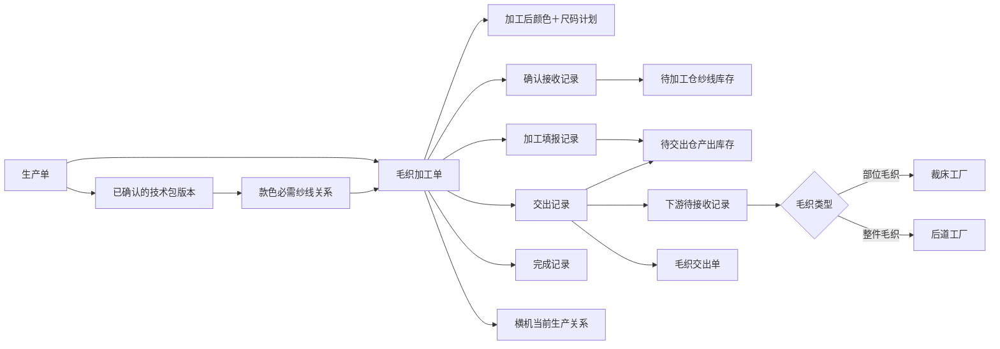
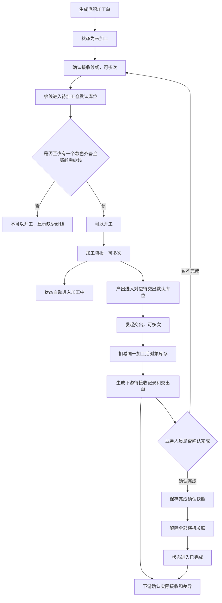
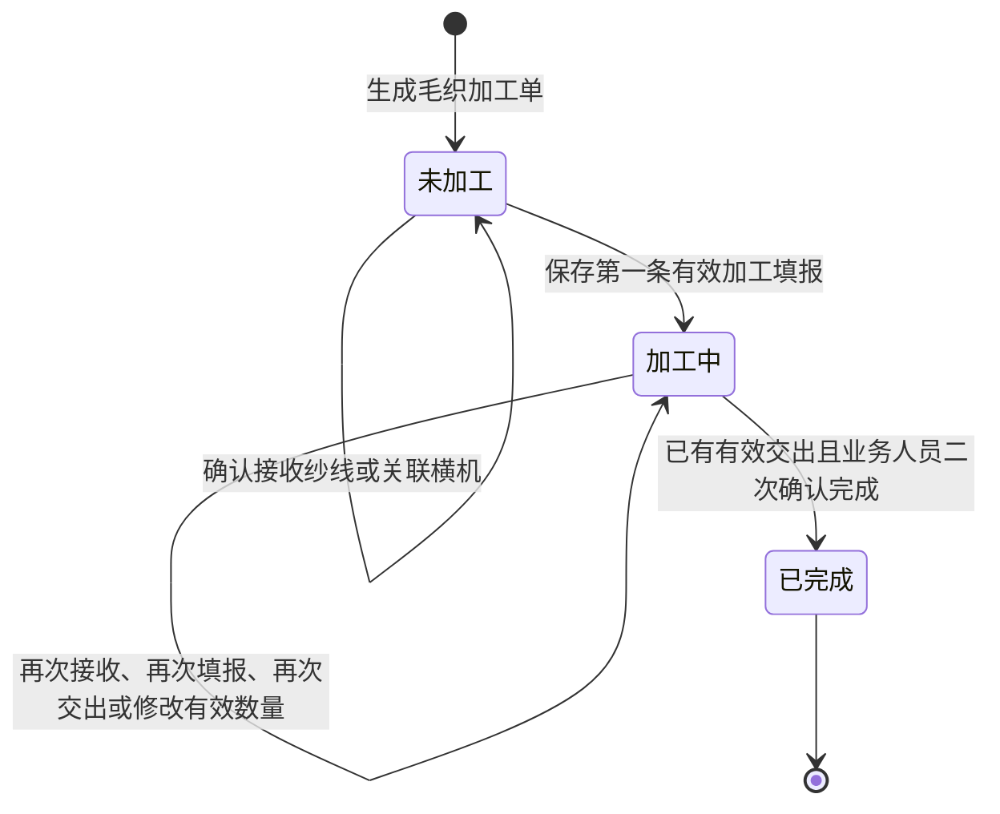
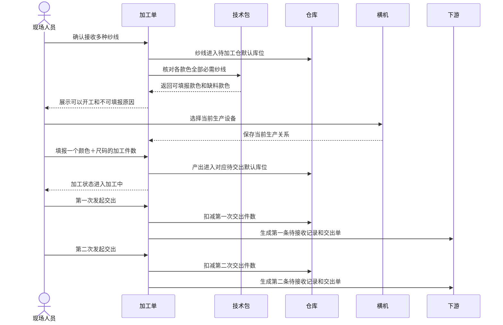
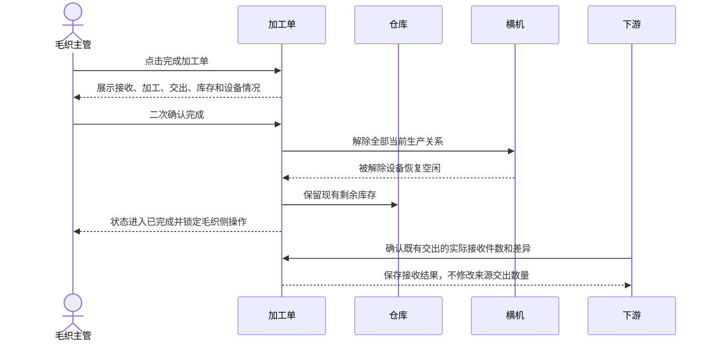

# 毛织管理产品需求说明书

> 文档版本：V1.0
> 编制日期：2026-08-05
> 文档状态：待研发评审
> 适用范围：毛织加工单、毛织仓库、横机生产关联、现场执行、下游交接及毛织交出单
> 数量基准：整件毛织和部位毛织均按“颜色＋尺码”的件数管理

## 1. 文档目的

本文档用于向产品、研发、测试和现场业务人员说明毛织管理的完整业务要求，统一以下事项：

- 毛织加工单由哪些业务事实构成。
- “未加工、加工中、已完成”如何进入和退出。
- “可以开工、不可以开工、已完成”列表分组如何判断。
- 确认接收、加工填报、发起交出和完成加工单的先后关系及操作门禁。
- 整件毛织与部位毛织的加工后对象、数量单位和下游去向。
- 横机与加工单如何建立和解除当前生产关系。
- 加工填报、待交出库存、发起交出和下游接收如何保持同一数量口径。
- 毛织交出单的内容、真实图片和二维码要求。
- 旧毛织节点、菲票、价格、统计和已排产业务的删除边界。

本文档只定义业务需求和验收结果，不规定研发内部实现方式。

## 2. 背景与业务问题

旧毛织流程曾以“横机成片、缝盘、熨烫、包装、菲票打印”等固定节点推进加工单，造成以下问题：

1. 加工状态被工序节点支配，无法表达多次接收、多次填报和多次交出的真实过程。
2. 横机排产被误当成加工单状态，而实际业务只需要维护设备当前正在生产哪张加工单。
3. 整件毛织与部位毛织的加工后对象和数量口径混淆。
4. 确认接收纱线、加工产出、待交出库存和实际交出之间缺少一致的业务关系。
5. 系统容易把投入纱线误解为交出对象。
6. 自动完成或数量推算无法替代业务人员对现场情况的判断。

本次需求将毛织加工单改为以事实记录为中心的业务模型：接收记录说明实际收到哪些纱线，加工填报说明实际做出多少件，交出记录说明实际交出多少件，完成记录说明业务人员何时确认收口。

## 3. 产品目标与非目标

### 3.1 产品目标

1. 一张加工单支持多次确认接收、多次加工填报和多次发起交出。
2. 未确认接收必需纱线时不能加工填报；没有有效加工填报时不能发起交出。
3. 以技术包款色用料关系判断每个颜色是否具备开工条件。
4. 不按纱线接收数量或单件用量计算最多可加工件数。
5. 整件毛织与部位毛织都按颜色＋尺码的件数填报和交出。
6. 加工状态由业务事实自动形成，完成加工单由业务人员主动确认。
7. 横机只表达当前生产关系，不成为加工单状态节点。
8. 加工填报自动进入固定待交出库位，发起交出自动扣减对应库存。
9. 每次交出形成可独立追溯、打印和扫码的毛织交出单。
10. Web、PDA、仓库、横机和下游交接使用同一业务事实与数量口径。

### 3.2 本期非目标

- 不根据已接收纱线重量和单件用量换算可加工件数。
- 不做纱线在多个颜色、尺码或加工单之间的预占和分摊。
- 不由系统判断加工单是否“足量完成”。
- 不提供毛织加工单的撤销、作废、删除或重新打开流程。
- 不建设毛织专属价格、估价、派工价、差价或结算能力。
- 不建设毛织统计页面。
- 不保留毛织菲票及其打印、补打和状态。
- 不保留横机“已排产”状态。
- 不把本需求扩大到其他工艺的熨烫、包装、菲票、价格或统计能力。

## 4. 核心业务术语

| 术语 | 业务含义 |
|---|---|
| 毛织加工单 | 一次毛织加工履约的主业务单据，关联生产单、技术包、承接工厂、加工后计划和下游去向 |
| 整件毛织 | 加工后直接形成成衣的毛织任务 |
| 部位毛织 | 加工后形成毛织部位、再交给裁床承接的毛织任务 |
| 加工后对象 | 加工填报、库存和交出共同使用的颜色＋尺码对象；整件为成衣，部位毛织为毛织部位 |
| 必需纱线 | 技术包中某一款色明确要求的全部毛织用途纱线 |
| 有效确认接收 | 已成功保存且实收数量大于零的纱线接收明细 |
| 有效加工填报 | 已成功保存且当前有效数量大于零的加工产出记录 |
| 有效交出 | 已成功保存且当前有效数量大于零的交出记录 |
| 可以开工 | 至少有一个颜色＋尺码加工后对象已齐备全部必需纱线，并且仍有加工填报容量 |
| 加工中 | 尚未完成，且已经存在有效加工填报或有效交出事实 |
| 完成加工单 | 业务人员查看现有事实后主动确认加工单结束 |

## 5. 角色与职责

| 角色 | 主要职责 |
|---|---|
| 跟单／生产管理人员 | 查看加工单全貌、核对生产单和技术包来源、跟踪接收、加工、交出和下游接收情况 |
| 毛织主管 | 维护加工事实、关联横机、处理数量修改、判断并确认完成加工单 |
| 毛织现场操作人员 | 在现场执行确认接收、加工填报和发起交出，并上传必要凭证 |
| 毛织仓管 | 查看待加工纱线和待交出产出库存，执行纱线领用／退回及独立库存调整、转移 |
| 横机设备管理员 | 维护设备档案状态，处理维修、停用和恢复空闲 |
| 裁床接收人员 | 接收部位毛织交出物，确认实际接收件数和差异 |
| 后道工厂接收人员 | 接收整件毛织交出物，确认实际接收件数和差异 |

业务人员只能修改本人职责范围内的事实。所有数量修改、完成确认、设备转移、维修、停用、库存调整和库存转移必须记录操作人、时间和原因。

## 6. 业务对象与关系

### 6.1 关系规则

1. 一张生产单可以生成多张毛织加工单。
2. 一张毛织加工单只能属于一个生产单和一个承接毛织工厂。
3. 一张加工单可以包含多个颜色＋尺码加工后对象。
4. 一个加工后对象必须绑定自己的计划件数和必需纱线集合。
5. 一张加工单可以有多条接收、加工填报和交出记录，但最多只有一条完成记录。
6. 一张加工单可以当前关联多台横机；一台横机同一时刻最多关联一张加工单。
7. 每条交出记录独立形成一条下游待接收记录和一张交出单。

## 7. 上游生成规则

### 7.1 生成依据

毛织加工单必须依据生产单和当时已绑定的技术包版本生成。生成时冻结：

- 生产单、款式和承接工厂。
- 毛织类型。
- 颜色＋尺码计划件数。
- 整件或毛织部位加工后对象。
- 每个款色对应的必需纱线。
- 下游接收对象。
- 技术包版本及来源关系。

技术包后续发布新版本，不得静默改变既有加工单的必需纱线和计划。已有接收、填报、交出或完成事实的加工单不得自动重建。

### 7.2 加工后对象和数量

| 毛织类型 | 加工后对象 | 计划数量 | 加工填报单位 | 交出单位 |
|---|---|---:|---|---|
| 整件毛织 | 对应颜色＋尺码的成衣 | 生产单该颜色＋尺码计划件数 | 件 | 件 |
| 部位毛织 | 对应颜色＋尺码的毛织部位 | 生产单该颜色＋尺码计划件数 | 件 | 件 |

部位毛织不得按“单件衣服需要几片部位”换算计划、加工填报或交出数量。无论单件衣服包含几片毛织部位，毛织业务数量始终表示对应颜色＋尺码完成了多少件衣服所需的毛织部位。

### 7.3 技术包资料缺失

出现以下任一情况时，对应颜色＋尺码不可加工填报：

- 没有明确的款色必需纱线关系。
- 必需纱线无法对应到稳定物料身份。
- 物料没有明确标记为毛织用途。
- 部位毛织缺少明确部位资料，无法形成稳定加工后对象。

系统必须说明具体缺失内容，不能根据物料名称、物料类别或同款其他颜色进行猜测。

## 8. 总体业务流程

### 8.1 流程原则

- 确认接收、加工填报和发起交出都允许多次，不覆盖历史。
- 没有有效确认接收，不允许加工填报。
- 某个颜色缺少任一必需纱线，该颜色不可加工填报。
- 没有同一加工后对象的有效加工填报，不允许交出该对象。
- 加工单完成由业务人员决定，不由数量、库存或下游接收自动触发。

## 9. 加工状态

### 9.1 状态定义

毛织加工单只保留三个加工状态：

| 状态 | 进入条件 | 退出条件 |
|---|---|---|
| 未加工 | 加工单已生成、尚未完成，并且没有有效加工填报或有效交出 | 保存第一条有效加工填报 |
| 加工中 | 尚未完成，并且至少存在一条有效加工填报或有效交出 | 业务人员确认完成加工单 |
| 已完成 | 已存在业务人员确认的完成记录 | 本期无退出和重新打开流程 |

### 9.2 状态图

### 9.3 “加工中”的进入规则

1. 加工单必须尚未完成。
2. 保存第一条有效加工填报后，立即进入“加工中”。
3. 加工填报数量必须为大于零的整数。
4. 该颜色＋尺码必须齐备全部必需纱线。
5. 累计加工填报不得超过该颜色＋尺码计划件数的 150%。
6. 加工填报与产出入库必须同时成功；任何一项失败，状态不得改变。

以下事实不会使加工单进入“加工中”：

- 仅生成加工单。
- 仅确认接收纱线。
- 仅达到“可以开工”。
- 仅关联横机。
- 横机显示生产中。
- 仅执行纱线领用、退回、库存调整或库存转移。

发起交出不能成为首次进入“加工中”的动作，因为交出前必须已经存在同一加工后对象的有效加工填报。

### 9.4 “加工中”的退出规则

“加工中”只通过业务人员执行“完成加工单”退出，并进入“已完成”。

完成操作必须满足：

- 加工单尚未完成。
- 至少存在一条有效交出记录。
- 业务人员在二次确认弹窗中主动确认。

系统不得因为以下情况自动退出“加工中”：

- 加工填报达到计划数量或 150% 上限。
- 所有待交出库存已经交完。
- 下游已经确认接收。
- 横机全部解除关联。
- 计划完成日期到达。
- 仓库库存变为零。

### 9.5 是否允许退回“未加工”

本期不允许通过正常业务操作从“加工中”退回“未加工”：

- 已保存记录不提供删除、撤销或作废。
- 数量修改后的有效数量必须大于零。
- 已完成加工单不提供取消完成或重新打开。

### 9.6 三类状态不得混用

| 维度 | 回答的问题 | 取值 |
|---|---|---|
| 加工状态 | 这张加工单是否已经产生加工事实、是否已经收口 | 未加工、加工中、已完成 |
| 开工分组 | 当前是否还有颜色＋尺码可以继续加工填报 | 可以开工、不可以开工、已完成 |
| 横机状态 | 设备当前是否可用、是否正被某张加工单使用 | 空闲、生产中、维修、停用 |

一张“加工中”的加工单，只要仍有可继续填报的颜色＋尺码，仍应位于“可以开工”；若所有颜色均缺料或都达到 150% 上限，则位于“不可以开工”，但加工状态仍是“加工中”。

## 10. 开工判断与列表分组

### 10.1 款色齐料判断

对每个颜色＋尺码分别判断：

1. 技术包必须明确该款色所需的全部纱线。
2. 每一种必需纱线都至少存在一次有效确认接收。
3. 只判断纱线是否确认接收，不按接收重量判断够做多少件。
4. 同一种纱线多次接收只表示存在多条接收事实，不改变集合判断方式。
5. 一个颜色齐料不能替代其他颜色的必需纱线。

示例：

| 款色 | 必需纱线 | 已确认接收 | 判断结果 |
|---|---|---|---|
| 黑色 | A、B | A | 黑色不可填报，缺 B |
| 白色 | A、C | A、C | 白色可以填报 |
| 红色 | B、D | A、C | 红色不可填报，缺 B、D |

只要白色仍有填报容量，整张加工单就属于“可以开工”。

### 10.2 列表分组

列表设置三个互斥分组，并在标签上直接显示当前筛选结果数量：

| 分组 | 规则 |
|---|---|
| 可以开工 | 加工单未完成，且至少一个颜色＋尺码已齐料并仍有加工填报容量 |
| 不可以开工 | 加工单未完成，但没有任何颜色＋尺码可以继续填报 |
| 已完成 | 已存在完成记录 |

“不可以开工”必须区分原因：

- 必需纱线未齐。
- 技术包缺少必需纱线关系。
- 所有已齐料颜色＋尺码均达到 150% 填报上限。

筛选条件必须先作用于加工单范围，再同步计算三个分组数量。切换分组保留筛选条件。页面不设置与分组数量重复的统计卡片。

## 11. 核心操作及门禁

| 操作 | 是否可多次 | 显示／可用条件 | 保存后的业务结果 |
|---|---|---|---|
| 查看详情 | 是 | 始终可用 | 查看完整事实和追溯记录 |
| 确认接收 | 是 | 加工单未完成 | 新增接收记录，纱线进入待加工仓默认库位 |
| 加工填报 | 是 | 至少一个颜色＋尺码齐料且仍有填报容量 | 新增加工填报，产出进入待交出默认库位，加工状态进入或保持加工中 |
| 发起交出 | 是 | 至少一个颜色＋尺码存在可交出余额 | 新增交出记录，扣减对应库存，形成下游待接收记录 |
| 修改记录数量 | 是 | 加工单未完成，且符合对应记录修改边界 | 保存前后数量、原因和库存差额 |
| 关联横机 | 是 | 加工单未完成且可继续填报，或当前仍有横机关联需要解除 | 保存当前完整设备集合 |
| 完成加工单 | 否 | 至少存在一条有效交出记录 | 保存完成快照、锁定毛织侧事实并解除全部横机 |
| 打印交出单 | 是 | 至少存在一条交出记录 | 批量打印该加工单全部交出记录 |

## 12. 确认接收

### 12.1 业务流程

1. 操作人员选择“确认接收”。
2. 查看加工单、生产单、款式和技术包必需纱线。
3. 填写送货单号、批次、接收人、接收时间、凭证和备注。
4. 一次选择一种或多种纱线并填写实收数量。
5. 保存一条新的接收记录，不覆盖历史记录。
6. 每条接收明细自动进入纱线默认库位。
7. 重新判断每个颜色＋尺码是否齐料，并刷新列表分组。

### 12.2 防错规则

- 只能选择本加工单技术包涉及的必需纱线。
- 至少填写一条纱线明细。
- 实收数量必须大于零。
- 纱线数量仅用于接收和库存事实，不参与可加工件数换算。
- 同一次接收可以包含多种纱线。
- 加工单完成后不可新增或修改接收记录。

## 13. 加工填报

### 13.1 填报对象

一次加工填报只允许选择一个颜色＋尺码加工后对象。选择项必须同时满足：

- 全部必需纱线均已有有效确认接收。
- 当前累计加工填报尚未达到计划件数的 150%。

不可填报对象仍需展示缺少纱线或已达上限原因，防止操作人员误认为数据缺失。

### 13.2 数量规则

- 本次填报数量必须是大于零的整数。
- 每个颜色＋尺码独立累计，不能跨颜色、尺码或部位合并。
- 累计填报上限为该颜色＋尺码计划件数的 150%。
- 150% 结果出现小数时，最大可填整数取不超过该结果的整数。
- 不根据纱线接收数量限制本次填报件数。

### 13.3 库存联动

- 部位毛织产出进入待交出仓的裁片默认库位。
- 整件毛织产出进入待交出仓的成衣默认库位。
- 保存填报和增加库存必须同时成功。
- 不再提供独立“完工入仓”操作。

## 14. 发起交出

### 14.1 可交出余额

每个颜色＋尺码独立计算可交出余额：

> 可交出余额取“该对象默认库位当前有效库存”和“累计有效加工填报减累计有效交出”的较小值。

本次交出数量必须大于零且不得超过可交出余额。不同颜色、尺码或部位的加工填报和库存不得拼接。

### 14.2 交出去向

| 毛织类型 | 交出对象 | 下游接收方 |
|---|---|---|
| 整件毛织 | 对应颜色＋尺码成衣 | 加工单指定的后道工厂 |
| 部位毛织 | 对应颜色＋尺码毛织部位 | 裁床工厂的待交出仓 |

接收方由加工单既定去向自动带出，不允许操作人员自由输入。缺少明确接收方时必须阻断交出，并提示先完善去向。

### 14.3 保存结果

一次发起交出必须同时形成：

1. 一条交出记录。
2. 对应默认库位的出库事实。
3. 一条独立下游待接收记录。
4. 一张可独立打印和扫码的毛织交出单。

任一项失败，本次交出均不得部分成立。

## 15. 数量修改

记录不提供撤销、作废或删除。加工单完成前，业务人员可以直接修改数量并填写原因。

| 记录类型 | 修改边界 | 库存结果 |
|---|---|---|
| 确认接收 | 修改后大于零；调减后纱线库存不得小于零 | 按差额调整纱线默认库位 |
| 加工填报 | 修改后大于零；累计不得超过 150%；不得低于累计交出；调减后库存不得小于零 | 按差额调整裁片或成衣默认库位 |
| 发起交出 | 修改后大于零；下游尚未确认；增加量不得超过修改前可交出余额 | 按差额补扣或返还裁片或成衣默认库位 |

每次修改必须保留原数量、新数量、修改原因、修改人和修改时间。对象、颜色、尺码、毛织类型和接收方不能通过数量修改改变。

## 16. 完成加工单

### 16.1 显示条件

只有至少存在一条有效交出记录时，才显示“完成加工单”。

### 16.2 二次确认内容

完成弹窗必须展示：

1. **纱线确认接收情况**：必需纱线、是否接收、累计实收、批次和最近接收时间。
2. **加工填报情况**：每个颜色＋尺码的计划件数、150% 上限、累计填报和与计划差异。
3. **发起交出情况**：累计填报、累计交出、尚未交出、每次交出及下游确认情况。
4. **待交出仓情况**：裁片和成衣默认库位当前剩余库存。
5. **当前横机关联**：完成后将自动解除的设备。

弹窗必须明确提示：

> 系统只展示当前业务事实，不判断该加工单是否应该完成。请业务人员核对后确认。

### 16.3 不作为完成门禁的事项

以下情况只展示，不阻止业务人员完成：

- 某些必需纱线尚未接收。
- 加工填报少于计划件数。
- 加工填报高于计划件数但未超过 150%。
- 仍有加工产出尚未交出。
- 待加工仓或待交出仓仍有库存。
- 下游尚未确认接收或存在接收差异。

### 16.4 确认完成后的结果

确认完成必须一次完成：

1. 保存完成记录和当时的接收、加工、交出、库存及设备快照。
2. 加工状态进入“已完成”。
3. 锁定毛织侧新增接收、加工填报、发起交出和数量修改。
4. 自动解除该加工单全部横机关联，被解除设备恢复空闲。
5. 保留现有待加工和待交出库存，不自动清零或补交。
6. 已形成的下游待接收记录仍允许正常确认，但不得反向改变毛织交出数量。

## 17. 横机生产关联

### 17.1 业务定位

横机生产关联只回答“哪些横机当前正在为哪张毛织加工单生产”，不代表加工单开工、加工填报或完成。

### 17.2 设备状态

| 状态 | 是否可关联 | 状态来源 |
|---|---|---|
| 空闲 | 可以 | 没有当前加工单关系 |
| 生产中 | 可以保持或经确认转移 | 存在当前加工单关系 |
| 维修 | 不可以 | 设备管理员登记 |
| 停用 | 不可以 | 设备管理员登记 |

不保留“已排产”。“生产中”不能由设备管理员直接选择，只能由当前关联关系形成。

### 17.3 维护入口

- 在毛织加工单列表中维护该加工单的全部当前横机。
- 在横机生产关联页面中，先选择生产单，再选择具体毛织加工单，最后选择横机。

若一张生产单存在多张毛织加工单，必须选择到具体加工单，不得只保存生产单关系。

### 17.4 整组保存

弹窗当前选中的设备集合代表保存后的完整关系：

- 新选设备建立关联并进入生产中。
- 保留选择的设备维持关联。
- 取消选择的设备解除关联并恢复空闲。
- 已关联其他加工单的设备需要转移时，必须明确展示原加工单和目标加工单并二次确认。

确认期间若设备关系已经变化，本次操作必须失败并要求重新确认，不能覆盖他人的最新操作。

### 17.5 维修与停用

生产中设备登记维修或停用时，必须展示其当前加工单影响并二次确认。确认后同时解除关联并修改设备状态。事实已变化时不得部分保存。

## 18. 仓库联动

### 18.1 固定默认库位

毛织工艺固定使用三个默认库位：

| 用途 | 默认库位 |
|---|---|
| 确认接收纱线 | 毛织待加工仓／纱线默认库位 |
| 部位毛织产出 | 毛织待交出仓／裁片默认库位 |
| 整件毛织产出 | 毛织待交出仓／成衣默认库位 |

核心业务操作不让现场人员选择库区库位。

### 18.2 纱线领用与退回

仓管可以登记纱线领用和退回，用于表达实际库存去向：

- 领用不得超过对应加工单、纱线和批次的可用库存。
- 累计退回不得超过累计领用。
- 领用和退回不改变款色是否“有过确认接收”。
- 领用和退回不改变加工单的未加工、加工中或已完成状态。

### 18.3 独立库存调整与转移

- 必须填写原因并记录操作人和时间。
- 已完成加工单的剩余库存仍可通过仓库调整或转移处理。
- 库存转出默认库位后，发起交出不能自动跨库位扣减。
- 独立增加库存不能绕过加工填报余额形成更多可交出数量。

## 19. 下游接收

1. 每条交出记录形成独立待接收记录。
2. 下游登记实际接收件数、接收人、接收时间和差异。
3. 实际接收与交出不一致时保留差异，不自动恢复毛织库存。
4. 下游确认后，来源交出数量锁定。
5. 下游确认不自动完成毛织加工单。
6. 毛织加工单已经完成时，既有待接收记录仍可继续确认。

## 20. 毛织交出单

### 20.1 打印入口

- 加工单至少有一条交出记录后，列表显示“打印交出单”。
- 列表入口打印该加工单全部交出记录，每条交出记录独立成单。
- 加工单详情的每条交出记录提供“打印本次交出单”。
- 毛织不打印菲票，也不存在毛织菲票补打。

### 20.2 A4 版式内容

每张交出单至少展示：

- “毛织交出单”标题，可同时展示现场常用的 “SURAT JALAN”。
- 交出单号、生产单、毛织加工单。
- 毛织类型、交出时间、发起人。
- 下游接收方名称和类型。
- SPU 款号、款名和真实款式图。
- 本次交出对象、颜色、尺码和本次交出件数。
- 可供签字的交出方、承运方和接收方区域。
- 与本次交出记录唯一对应的真实二维码。

### 20.3 图片和对象要求

- 款式图与 SPU 款式信息必须位于同一个信息区块。
- 每个 SPU 只展示一张真实款式图，不设置独立款式图片区，不重复展示。
- 缺少真实款式图时允许查看缺图提示，但禁止正式打印。
- 交出明细只展示本次加工形成的成衣或毛织部位。
- 交出单不得出现“本次交出对应物料”板块。
- 不展示投入纱线编码、纱线图片、纱线接收摘要或其他会让人误以为纱线被交出的内容。

### 20.4 二维码要求

- 二维码必须真实可扫描，不能使用装饰方格或图片冒充。
- 扫码后至少能够识别交出记录、生产单和毛织加工单。
- 任一交出单二维码尚未生成时，必须阻止正式打印并提示稍后重试。
- 每条交出记录的二维码必须唯一，批量打印时不得重复。

## 21. Web 与 PDA 分工

### 21.1 管理端

管理端重点展示：

- 加工单筛选、三个开工分组及数量。
- 加工状态、计划、齐料、累计加工、累计交出、库存和下游确认。
- 全部记录详情和修改历史。
- 横机当前生产关系。
- 完成加工单和交出单打印。

### 21.2 PDA 现场执行端

PDA 与管理端使用同一业务事实和门禁，提供：

- 确认接收。
- 加工填报。
- 发起交出。
- 满足显示条件时完成加工单。

PDA 首屏优先展示当前加工单、当前可操作颜色＋尺码、缺少纱线和一个明显主动作。完整历史、来源关系和复杂汇总放入详情，不在首屏堆叠。

Web 与 PDA 对同一次保存不得形成重复记录、重复入库或重复扣库。重复点击必须明确显示已保存结果。

## 22. 页面与信息要求

### 22.1 毛织加工单列表

- 三个含数量分组：可以开工、不可以开工、已完成。
- 搜索生产单、加工单、款号、款名、工厂和加工后对象。
- 支持按加工状态和毛织类型筛选。
- 展示生产单、加工单、真实款式图、款式、类型、工厂、加工状态、齐料情况、计划时间、累计加工和累计交出。
- 操作栏固定展示当前可用操作；不可用操作不允许产生误导。
- 所有结果分页，宽表在表格内部滚动。

### 22.2 加工单详情

至少包含：

- 基础信息和来源技术包版本。
- 颜色＋尺码加工后计划。
- 必需纱线和齐料情况。
- 确认接收记录。
- 加工填报记录。
- 交出和下游接收记录。
- 当前横机关联及历史。
- 仓库库存和流水摘要。
- 完成确认快照。
- 操作记录和数量修改记录。

所有明细列表必须分页。加工单完成后页面只读，但下游接收入口仍按下游职责保留。

### 22.3 真实图片

- 页面出现款式时，必须展示与该款式真实对应的图片。
- 页面出现纱线物料时，必须展示与该纱线真实对应的物料图。
- 图片与款号、款名或物料编码、物料名称放在同一信息块。
- 缩略图可点击查看高清大图，并支持关闭按钮、点击遮罩和键盘关闭。
- 加载失败必须明确提示，不能用无关占位图冒充真实图片。
- 交出单遵循第 20 章的特殊边界：只展示款式图，不展示投入纱线或纱线图片。

## 23. 异常、防错与恢复

| 场景 | 处理要求 |
|---|---|
| 技术包缺少款色必需纱线 | 阻断该颜色加工填报，说明缺失关系 |
| 缺少任一必需纱线 | 阻断该颜色加工填报，列出缺少纱线 |
| 加工填报超过 150% | 阻断保存，显示该颜色＋尺码剩余可填件数 |
| 没有加工填报就交出 | 阻断保存，提示先完成该对象加工填报 |
| 交出超过可交出余额 | 阻断保存，显示当前可交出件数 |
| 接收方未配置 | 阻断交出，提示先完善下游去向 |
| 下游已确认后修改交出数量 | 阻断修改，说明来源数量已经锁定 |
| 完成后新增或修改毛织事实 | 阻断操作，页面保持只读 |
| 维修或停用设备被选择 | 禁止选择，并展示设备当前状态 |
| 跨加工单转移横机 | 展示原单和目标单，二次确认；关系变化时要求重新确认 |
| 重复点击保存 | 不重复生成业务记录，并明确展示已保存结果 |
| 图片加载失败 | 显示可理解的失败提示，不使用无关图片替代 |
| 二维码未生成 | 阻止正式打印，提示稍后重试 |
| 完成后仍有库存 | 保留库存并标识来源，只允许仓库调整或转移 |

## 24. 关键业务时序

### 24.1 正常加工与分次交出

### 24.2 人工完成与下游后续确认

## 25. 删除与保留边界

### 25.1 毛织模块必须删除

- 横机成片、缝盘、熨烫、包装等固定加工节点及其状态、按钮和文案。
- 毛织菲票、菲票编号、待打印、已打印、补打及相关页面入口。
- 毛织统计页面和重复统计卡片。
- 毛织价格、估价、派工价、差价原因和结算价格展示。
- 横机“已排产”状态及相关筛选和操作。
- 独立“完工入仓”操作。
- 毛织业务操作中的库区库位人工选择。
- 旧缝盘损耗和损耗纱线回收推导。
- 交出单中的投入纱线板块、纱线图片和纱线摘要。

### 25.2 必须保留

- 整件毛织和部位毛织两种任务类型。
- 确认接收、加工填报和发起交出的多次事实。
- 人工完成加工单。
- 横机当前生产关联和历史追溯。
- 固定默认库位和仓库流水。
- 下游实际接收与差异确认。
- 每次交出的 A4 交出单和二维码。
- 其他业务模块自身的熨烫、包装、菲票、价格和统计能力。

## 26. 验收场景

### 26.1 场景一：确认接收但仍不能加工

黑色款需要纱线 A 和 B，当前只确认接收 A。

预期：

- 黑色不可加工填报，明确提示缺少 B。
- 加工单仍为未加工。
- 仅确认接收不进入加工中。

### 26.2 场景二：任一款色齐料即可开工

黑色需要 A、B，白色需要 A、C；当前确认接收 A、C。

预期：

- 白色可加工填报，黑色不可填报。
- 整张加工单进入“可以开工”分组。
- 加工状态在实际填报前仍是未加工。

### 26.3 场景三：首次填报进入加工中

白色 M 码计划 100 件，所需纱线均已确认接收，首次填报 40 件。

预期：

- 保存后白色 M 码累计加工为 40 件。
- 对应待交出默认库位增加 40 件。
- 加工状态从未加工进入加工中。

### 26.4 场景四：150% 上限

白色 M 码计划 100 件，历史累计填报 140 件，再填报 11 件。

预期：

- 保存失败。
- 明确提示最多还可填报 10 件。
- 不增加加工记录和库存。

### 26.5 场景五：没有加工填报不能交出

黑色 L 码已经齐料，但尚未加工填报，尝试交出 10 件。

预期：

- 阻断交出。
- 不生成交出记录、出库事实、下游待接收记录或交出单。

### 26.6 场景六：分次交出

白色 M 码累计加工 100 件，先交 30 件，再交 50 件。

预期：

- 形成两条独立交出记录、两次库存扣减和两张交出单。
- 累计交出 80 件，剩余可交出 20 件。
- 两张交出单二维码不同。

### 26.7 场景七：人工完成但仍有剩余

加工单已有交出记录，但部分颜色未完成、待交出仓仍有库存、下游尚未确认。

预期：

- 完成弹窗完整展示上述事实，不自动阻断。
- 业务人员确认后加工单进入已完成。
- 全部横机关联自动解除。
- 剩余库存保留。
- 既有下游待接收记录仍可确认。

### 26.8 场景八：横机维修

某横机正在为加工单生产，设备管理员登记维修。

预期：

- 展示受影响加工单并要求二次确认。
- 确认后解除关联，设备进入维修。
- 不改变加工单的加工状态。

### 26.9 场景九：部位毛织交出

黑色 M 码袖片完成 60 件并交出 30 件。

预期：

- 加工填报、库存和交出均显示 30／60 件口径，不显示片数。
- 接收方为裁床工厂的待交出仓。
- 交出单展示袖片、黑色、M 码和本次交出 30 件。
- 交出单不展示投入纱线。

### 26.10 场景十：交出单缺少款式图

交出记录完整，但款式没有真实图片。

预期：

- 页面明确提示需要补充真实款式图。
- 禁止正式打印。
- 不使用纱线图、通用占位图或无关图片代替。

## 27. 原子需求与研发验收矩阵

> 本表用于研发、测试和产品逐项核对。当前文档阶段统一标记为“待实施／待研发绑定”；研发实施后应补充对应交付版本和证据位置。

### 27.1 主对象、数量与状态

| 编号 | 原子需求 | 来源章节 | 研发验收证据 | 当前状态 |
|---|---|---|---|---|
| WOOL-001 | 一张加工单支持多次接收、多次填报和多次交出 | 8、11 | 连续操作场景记录 | 待实施 |
| WOOL-002 | 整件毛织按颜色＋尺码成衣件数管理 | 7.2 | 整件数量场景 | 待实施 |
| WOOL-003 | 部位毛织按颜色＋尺码毛织部位件数管理，不按片数换算 | 7.2 | 部位数量场景 | 待实施 |
| WOOL-004 | 新加工单初始为未加工 | 9.1 | 新单状态场景 | 待实施 |
| WOOL-005 | 首次有效加工填报使加工单进入加工中 | 9.3 | 场景 26.3 | 待实施 |
| WOOL-006 | 确认接收、关联横机和仓库动作不使加工单进入加工中 | 9.3 | 状态边界场景 | 待实施 |
| WOOL-007 | 加工中只通过人工完成进入已完成 | 9.4 | 完成场景 | 待实施 |
| WOOL-008 | 加工中不能通过正常操作退回未加工 | 9.5 | 数量修改和撤销检查 | 待实施 |
| WOOL-009 | 已完成不提供取消完成或重新打开 | 9.5 | 完成后操作检查 | 待实施 |
| WOOL-010 | 加工状态、开工分组和横机状态分别计算 | 9.6 | 三维状态组合场景 | 待实施 |

### 27.2 齐料、填报与交出

| 编号 | 原子需求 | 来源章节 | 研发验收证据 | 当前状态 |
|---|---|---|---|---|
| WOOL-011 | 每个款色只认技术包明确的全部必需纱线 | 7.3、10.1 | 技术包来源场景 | 待实施 |
| WOOL-012 | 缺少任一必需纱线时对应款色不可填报 | 10.1 | 场景 26.1 | 待实施 |
| WOOL-013 | 任一款色齐料且有容量时整单可以开工 | 10.2 | 场景 26.2 | 待实施 |
| WOOL-014 | 纱线接收数量不参与可加工件数换算 | 10.1、13.2 | 不同接收重量场景 | 待实施 |
| WOOL-015 | 每个颜色＋尺码累计填报不得超过计划件数 150% | 13.2 | 场景 26.4 | 待实施 |
| WOOL-016 | 加工填报和待交出入库必须同时成立 | 13.3 | 保存失败零结果场景 | 待实施 |
| WOOL-017 | 没有同一加工后对象的有效填报不得交出 | 14.1 | 场景 26.5 | 待实施 |
| WOOL-018 | 可交出量同时受默认库位库存和未交出填报余额限制 | 14.1 | 库存与余额边界场景 | 待实施 |
| WOOL-019 | 不同颜色、尺码和部位不得拼接填报或库存 | 13.2、14.1 | 跨对象阻断场景 | 待实施 |
| WOOL-020 | 每次交出独立形成交出、出库、下游待接收和交出单 | 14.3 | 场景 26.6 | 待实施 |

### 27.3 完成、设备与仓库

| 编号 | 原子需求 | 来源章节 | 研发验收证据 | 当前状态 |
|---|---|---|---|---|
| WOOL-021 | 至少有一次有效交出后才显示完成加工单 | 16.1 | 完成入口场景 | 待实施 |
| WOOL-022 | 完成弹窗展示接收、加工、交出、库存和设备事实 | 16.2 | 完成弹窗验收 | 待实施 |
| WOOL-023 | 系统不按数量、库存或下游状态判断是否应该完成 | 16.3 | 场景 26.7 | 待实施 |
| WOOL-024 | 完成后自动解除全部横机关联 | 16.4 | 完成设备场景 | 待实施 |
| WOOL-025 | 完成后保留剩余库存和既有下游待接收记录 | 16.4 | 场景 26.7 | 待实施 |
| WOOL-026 | 一台横机当前最多关联一张加工单 | 17 | 设备唯一关系场景 | 待实施 |
| WOOL-027 | 维修和停用横机不可关联 | 17.2 | 设备不可选场景 | 待实施 |
| WOOL-028 | 横机解除关联后恢复空闲 | 17.4 | 解除关系场景 | 待实施 |
| WOOL-029 | 生产中设备维修或停用必须二次确认并解除关联 | 17.5 | 场景 26.8 | 待实施 |
| WOOL-030 | 接收、填报和交出分别使用固定默认库位 | 18.1 | 三类库存流水场景 | 待实施 |

### 27.4 数量修改、下游与打印

| 编号 | 原子需求 | 来源章节 | 研发验收证据 | 当前状态 |
|---|---|---|---|---|
| WOOL-031 | 接收、填报和未确认交出允许直接修改数量 | 15 | 三类修改场景 | 待实施 |
| WOOL-032 | 数量修改必须大于零并保留原因和前后数量 | 15 | 修改记录检查 | 待实施 |
| WOOL-033 | 下游确认后来源交出数量锁定 | 15、19 | 下游确认后修改阻断 | 待实施 |
| WOOL-034 | 部位毛织交给裁床工厂待交出仓 | 14.2 | 场景 26.9 | 待实施 |
| WOOL-035 | 整件毛织交给加工单指定后道工厂 | 14.2 | 整件交出场景 | 待实施 |
| WOOL-036 | 下游差异只留痕，不自动恢复毛织库存或完成加工单 | 19 | 差异接收场景 | 待实施 |
| WOOL-037 | 每条交出记录有独立 A4 毛织交出单 | 20 | 批量和单次打印 | 待实施 |
| WOOL-038 | 交出单按颜色＋尺码展示本次交出件数 | 20.2 | 整件与部位打印 | 待实施 |
| WOOL-039 | 款式图与 SPU 信息同区且每个 SPU 只展示一张真实图 | 20.3 | 打印截图和图片核对 | 待实施 |
| WOOL-040 | 交出单不得展示投入纱线板块、编码、图片或摘要 | 20.3 | 打印内容核对 | 待实施 |
| WOOL-041 | 缺少真实款式图时禁止正式打印 | 20.3 | 场景 26.10 | 待实施 |
| WOOL-042 | 每条交出记录使用唯一、真实可扫描二维码 | 20.4 | 实际扫码记录 | 待实施 |

### 27.5 页面、PDA 与删除边界

| 编号 | 原子需求 | 来源章节 | 研发验收证据 | 当前状态 |
|---|---|---|---|---|
| WOOL-043 | 列表只有可以开工、不可以开工、已完成三个含数量分组 | 10.2、22.1 | 列表页面验收 | 待实施 |
| WOOL-044 | 筛选条件与三个分组数量联动，且无重复统计卡片 | 10.2 | 筛选切换场景 | 待实施 |
| WOOL-045 | Web 与 PDA 使用同一事实和操作门禁 | 21 | 跨端一致性场景 | 待实施 |
| WOOL-046 | 款式和纱线在适用页面使用真实对应图片并可查看大图 | 22.3 | 图片和大图验收 | 待实施 |
| WOOL-047 | 毛织模块删除旧固定节点和独立完工入仓 | 25.1 | 页面、文案和入口核对 | 待实施 |
| WOOL-048 | 毛织模块删除菲票、价格、统计和已排产 | 25.1 | 页面、文案和入口核对 | 待实施 |
| WOOL-049 | 完成后毛织侧只读，但下游接收仍可继续 | 16.4、19 | 完成后跨端场景 | 待实施 |
| WOOL-050 | 所有记录列表分页，管理宽表在表格内部滚动 | 22 | 页面分辨率验收 | 待实施 |

## 28. 研发交付要求

研发交付时必须按原子需求编号逐项提供：

1. 对应实现版本。
2. 正常场景和阻断场景验证结果。
3. 管理端、PDA、仓库、横机和下游的适用页面证据。
4. 交出单 A4 实际截图、真实款式图和二维码实际扫码结果。
5. 旧入口、旧状态、旧文案和旧打印内容的删除核对结果。
6. 最后一次业务修改后的重新验证结果。

只有全部适用原子需求均有当前版本证据，且没有未说明的待实施、实施中、待验证或阻塞项，才能认定本需求完整交付。

## 29. 最终业务口径

毛织加工单只围绕“确认接收、加工填报、发起交出、人工完成”运行。确认接收只决定款色是否具备加工填报条件；第一条有效加工填报使加工单从未加工进入加工中；加工中只通过业务人员主动完成退出并进入已完成。系统不根据纱线重量计算可加工件数，也不根据计划完成度、库存或下游接收自动完成加工单。

整件毛织和部位毛织的加工填报、库存和交出均按颜色＋尺码件数管理。横机只表达当前生产关系。加工填报自动进入对应待交出默认库位，交出自动扣减同一对象库存并形成独立下游待接收记录和 A4 毛织交出单。交出单只展示实际交出的成衣或毛织部位，不展示投入纱线。
