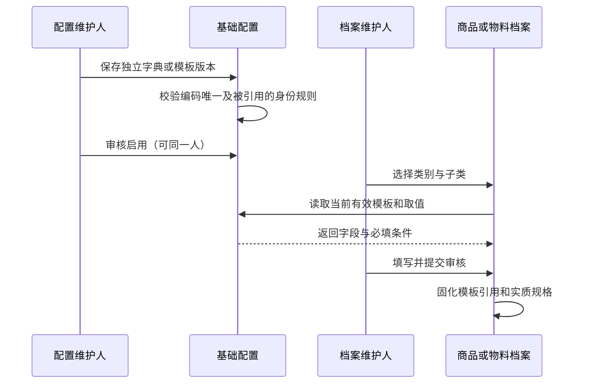
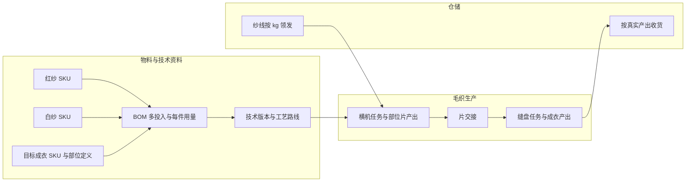
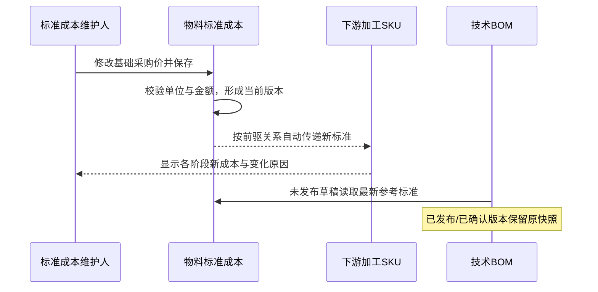
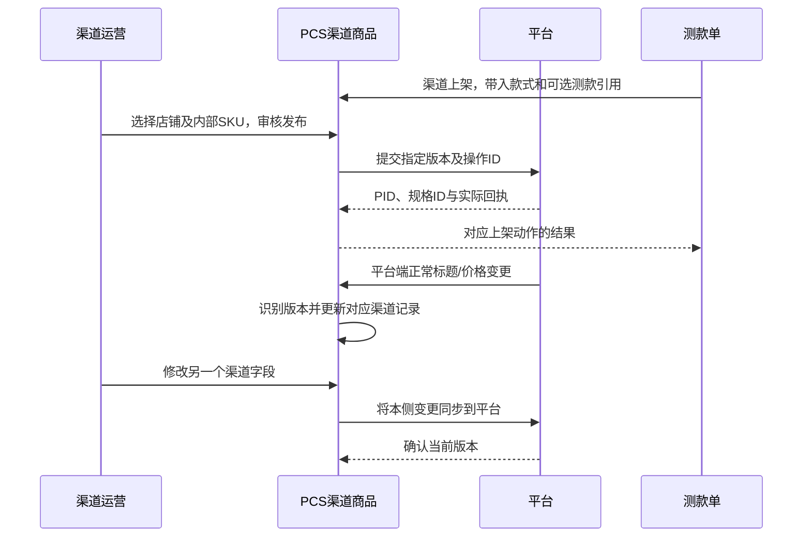

# PCS 商品、物料与渠道店铺商品原型调整方案 R1

日期：2026-10-05。**本文件定义目标原型；用户已授权按 R1 执行，当前实现与验证状态见 [实施进度](implementation-progress.md)，不以方案正文宣称完成。** 业务来源为 [已确认基线](../2026-10-04-product-material-domain-audit-v2/confirmed-rules-and-refinements.md)、[64 项登记](../2026-10-04-product-material-domain-audit-v2/decision-register-2026-10-05.md)、[字段细化稿](../2026-10-04-product-material-domain-audit-v2/field-contract-candidates.md)。设计阶段的版本与现场差距见 [现状证据](current-prototype-evidence.md)。字段级清单、原子需求及工作包均由 [阅读入口](README.md) 链接。

## 1. 目标、范围与交付边界

调整后，使用者应能回答：这是什么款式/物料；有哪些可独立识别的规格；加工前是什么、加工后是什么；每个规格按什么单位管理；当前综合标准成本由什么组成；同一款衣服在哪些店铺、哪些 PID 和平台规格售卖；哪些资料由哪个业务领域维护。

范围包括款式档案、规格档案、五类物料档案、基础配置、渠道店铺商品、店铺管理，以及测款上架、花型、BOM、工艺和生产消费这些档案的接口。新增或修改对象使用项目现有轻量存储、页面模板和公共列表组件。DDD 在这里落实为清楚的身份、聚合约束、维护责任和业务动作，不建设微服务、通用领域引擎或真实平台后端。

本期不做实际成本核算、供应商档案改造、WMS 库存重建、通用历史坏数据工作台、真实渠道 API 接入、自动上传/重试基础设施、PCS 浏览器资料维护工具。采购、生产、仓储、财务的原有职责继续存在；本方案明确相关入口与引用，不能把移出 PCS 的线上信息当成丢弃。

前期已确认的业务不再重新列为选择题。本轮新增编码参数、页面排列、字段键、精度上限和并发处理细节统一属于“本方案定案建议”，审议对象是完整方案。原型演示数据与真实线上数据分开标识。

## 2. 领域模型与唯一维护责任

### 2.1 身份与聚合

| 对象 | 唯一身份与关系 | 自身维护的内容 | 不负责的事实 |
|---|---|---|---|
| 款式 SPU | 稳定 styleId；业务款式码唯一；1:N 内部 SKU | 衣服款式、品牌、分类、独立属性、共同内容、同款关系 | 店铺 PID、供应商、库存、实际采购条件 |
| 商品 SKU | 稳定 skuId；归属一个 SPU | 颜色/尺码及必要交付差异、识别图、条码、包装/物流标准 | 平台原生规格 ID、实际成本和 WMS 数量 |
| 物料主档 | 稳定 materialId；归属五类之一 | 材质、组织、根技术规格、适用分类模板 | 每个阶段的库存和采购供方 |
| 物料 SKU | 稳定 materialSkuId；归属一个物料主档 | 基础或加工产出规格、主辅单位、有效技术要求、识别图 | 另一套独立“变种”身份、生产批次和返工事实 |
| 物料加工定义 | 一条边连接直接投入 SKU 与产出 SKU；产出只认一个直接前驱 | 工艺、作用对象、色花要求、资料版本、输入输出单位关系 | 实际加工数量、库存足否、工厂执行状态 |
| 标准成本 | SKU + 成本版本；单独维护金额，引用身份 | 基础采购/运输、本道加工费、前驱成本依赖、累计标准 | 实际采购价、损耗、后段运输、品牌差别价 |
| 店铺 | storeId；渠道内外部店铺 ID 唯一 | 市场、销售/结算币种、语言、经营状态、渠道连接描述 | 多套重复店铺主表和项目店铺身份 |
| 渠道 PID 容器 | listingId；有外部 ID 后以渠道+店铺+PID 唯一 | 唯一 styleId、共同刊登内容、平台状态 | 用上传批次充当商品身份 |
| 平台规格实例 | externalVariantId；渠道+店铺+PID+平台规格 ID 唯一 | 外部显示规格、sellerSku、internalSkuId、价格覆盖 | 以内部 SKU 去重，或将一个实例映射多个内部 SKU |
| 生产技术/执行对象 | 既有 BOM、路线、裁片、毛织部位片和工单身份 | 多投入、多产出要求、成片/缝盘/裁片加工事实 | 把生产片、返工次数变成物料永久 SKU |

外部 PID 和平台规格 ID 按不透明字符串保存，不转数字、不截断、不拼接伪造。发布前允许没有平台分配的 ID，内部款式与 SKU 映射仍完整；这是“待平台分配身份”，不是“待匹配内部商品”。同一店铺同一 SPU 可以有多个 PID。

```mermaid
erDiagram
    STYLE ||--o{ INTERNAL_SKU : contains
    STYLE ||--o{ LISTING : represented_by
    STORE ||--o{ LISTING : owns
    LISTING ||--|{ EXTERNAL_VARIANT : contains
    INTERNAL_SKU ||--o{ EXTERNAL_VARIANT : mapped_from
    MATERIAL ||--|{ MATERIAL_SKU : contains
    MATERIAL_SKU ||--o{ MATERIAL_PROCESS : input_of
    MATERIAL_PROCESS o|--|| MATERIAL_SKU : produces
    MATERIAL_SKU ||--o{ UNIT_RELATION : uses
    MATERIAL_SKU ||--o{ STANDARD_COST_VERSION : priced_by
```

图中的渠道父容器与外部规格是渠道内部的分工，不增加第四层内部商品档案。物料 SKU 与“变种”合并后，派生树只是同一批 SKU 的关系视图。

### 2.2 低耦合的具体执行方式

- 身份引用用稳定 ID；改名称、成本或供应商不换身份。界面可以跨域展示引用，但保存动作只改有权维护的对象。
- 档案建档、审核和创建加工单不请求库存作为前置条件；实际领发料走 WMS 的收发动作。
- 商品/物料页没有供应商和库存栏、Tab、只读库存卡片。采购入口只传 SKU 和业务意图；供应商在采购时选择。
- 技术 BOM 引用 SKU 与采用的单位/成本版本；发布后保存快照。未发布参考价可读取最新标准，不由列表打开动作写回 BOM。
- 渠道只维护销售表达和映射；平台改名不改内部颜色/尺码，平台价格不改物料标准成本。
- 跨域变化以明确动作传递：档案审核、标准成本保存、渠道发布、平台变更到达、WMS 可售变动。原型通过现有函数和记录关联演示，不预建消息总线。

## 3. 导航、页面和详情层级

保留当前“商品&物料档案”下的九个主要入口和“系统设置 → 基础配置”。设备配件保留菜单“配件档案”，页内解释为设备配件，防止与服装辅料混淆。

| 页面号 | 入口/目标地址 | 调整结果 |
|---|---|---|
| P01 | `/pcs/products/styles` | 款式列表，增独立属性筛选、审核与生命周期；技术包只作关联摘要 |
| P02 | `/pcs/products/styles/{styleId}` | 基本资料、销售基础内容、规格、技术引用、同款/组合关系、记录 |
| P03 | `/pcs/products/specifications` 及 `/{skuId}` 详情 | 实物 SKU 列表；真实渠道映射；物流/包装资料；移出散落价格和预期 BOM 编辑 |
| P04 | `/pcs/materials/fabric` | 面料主档列表及面料 SKU 视图 |
| P05 | `/pcs/materials/accessory` | 辅料列表及按子类变化的属性表单 |
| P06 | `/pcs/materials/yarn` | 纱线列表；补充针织用纱与纱支/股数结构 |
| P07 | `/pcs/materials/consumable` | 耗材列表；包装、胶带、油剂等模板 |
| P08 | `/pcs/materials/parts` | 设备配件列表；型号规格、设备适配关系 |
| P09 | `/pcs/materials/{kind}/{materialId}` | 主档详情：基本资料、SKU、加工关系、技术引用、资料、记录 |
| P10 | 建议 `/pcs/materials/{kind}/{materialId}/skus/{skuId}` | 具体 SKU 详情：规格、加工关系、计量单位、标准成本、包装物流、资料、记录 |
| P11 | `/pcs/settings/config-workspace` | 分组配置工作台；新增物料模板、单位、Pantone、编码和展示汇率 |
| P12 | `/pcs/products/channel-products` | 一行一个店铺 PID 容器；可展开平台规格；增加完整建档与发布入口 |
| P13 | `/pcs/products/channel-products/{listingId}` | 内容、规格映射、价格、发布同步、测款关联、记录 |
| P14 | `/pcs/channels/stores` 及店铺详情 | 统一店铺身份；当前渠道/市场、销售/结算币种；停用保留历史 |
| P15 | `/pcs/channels/stores/sync` | 按渠道商品/规格展示发布和同步结果，不是本地资料维护页 |
| P16 | `/pcs/testing/orders/{id}` 的“渠道上架” | 可选来源测款；不依赖项目，不要求测款先通过 |
| P17 | 花型库、技术包/BOM、工艺与加工单的现有入口 | 修正资料引用和对象身份；保持各自业务职责 |

新增 SKU 页面要支持独立直达、刷新恢复，不依赖先打开主档形成内存。列表与详情共享对象；“加工关系”节点进入同一 SKU 详情。既有主要地址保持，涉及“项目式渠道商品”“独立变种”退役的旧入口、事件与存储在工作包中统一收口；不顺手清理无关路由。

## 4. 公共状态、权限和页面规则

### 4.1 状态分开表达

| 维度 | 状态/动作 | 约束 |
|---|---|---|
| 档案审核 | 草稿→待审核→审核通过；驳回回草稿并记录原因 | 缺成本不阻止身份审核；必填身份、适用技术规格、识别素材不齐则不能提交 |
| 档案使用 | 未启用、启用、停用、归档 | 审核通过才可启用；停用阻止新增选用，不改在途或自动下架；归档需无活动业务引用 |
| 成本完整性 | 完整、缺采购价、缺基础运输、缺加工费、缺单位关系、上道不完整 | 可多原因并列；未维护显示“未维护”，真实 0 显示 0.0000 |
| 渠道内容审核 | 草稿、待审核、审核通过 | 只审核需要发布的内容版本；同一人可维护和审核 |
| 发布任务 | 未提交、提交中、成功、部分成功、失败 | 每个目标规格/字段有结果；不会以本地点击当作平台成功 |
| 平台实际状态 | 待平台审核、在售、已下架、平台限制、已删除等对照值 | 原始状态码保留在回执，实际状态以平台观测为准 |
| 同步 | 一致、待同步、同步中、失败、同时变更待处理 | 正常双向自动；仅真正同时编辑冲突需要定向处理 |

初始 SPU/物料主档与首批 SKU 可一起审核。后增 SKU 或加工 SKU 单独审核，不让原已通过 SKU 重新变成待审。SKU 的审核和使用状态独立于技术包是否已发布、是否存在销售链接。无渠道链接是合法状态，不显示“缺映射”错误。

### 4.2 权限和修改

维护角色：商品资料、物料资料、配置、标准成本、渠道运营、渠道发布、映射维护。原型继续使用既有当前操作人，不接入真实鉴权。角色可以同人兼任，审核按钮不做“作者不能审核”的限制。金额维护不再借用“买手/版师技术审核人名单”判断权限。

名称、翻译、备注、补充识别图片可修订并留日志。审核后编码、父归属和实质交付身份不就地改写；改变颜色/尺码、主材规格或可辨认花型结果时新增 SKU/版本。共同根技术要求变化不得悄悄改变所有既有产出的有效规格；创建新规格并保留旧引用。主单位在已使用后锁定；辅助换算可新版本调整。

### 4.3 页面与操作体验

管理端 1366×768，最低 1280×720。标准列表顺序为标题/主要动作、完整筛选卡片、统计、表格、分页；筛选卡固定查询/重置/导出。导出全筛选结果，空集有反馈。默认页 20 条，列显示/顺序/冻结可配置，页码和排序重新进入使用默认值。

编码、名称和真实识别图同一单元格；点击图看大图。加工物料同时展示投入实物图、产出识别图和花型图，图片角色不能互代。原型使用已有可访问静态真实素材，不使用 AI 图片或无关占位；本次观察到的物料图加载失败纳入修复验收。

列表批量动作用明确选中数和逐项结果；归档/停用/作废等按业务影响二次确认。表单保存失败保留输入，提示未保存及重试。查询失败只在本页说明原因并“重新读取”；没有迁移、备份、恢复、清理、空间管理按钮。

## 5. 基础配置的完整调整

### 5.1 分组与每组职责

P11 左侧按“商品属性、物料属性、单位与包装、加工与编码、渠道与价格展示”组织，右侧只展开所选面板。配置项统一有稳定 ID、业务编码、中/外文名、别名、排序、启停、使用计数、修改日志；业务编码不再由数组位置生成。停用值不能新选，历史仍显示原值。

| 组 | 配置面板 | 使用对象与选择方式 |
|---|---|---|
| 商品属性 | 正式商品类目树 | SPU 单选叶类目；平台类目在渠道映射中另选 |
| 商品属性 | 品牌 | SPU 单选；渠道品牌 ID 按平台映射 |
| 商品属性 | 品类、风格、品类编号 | 三张独立字典；品类多选、风格多选、品类编号单选作为本方案控件建议 |
| 商品属性 | 商品定位 | 单选；补齐用户图示八项：基础款、设计款、设计改款、低价改款、低价、冷启动基础款、廉价款、快时尚款 |
| 商品属性 | 流行元素、特殊工艺、人群、年龄、人群定位 | 分别多选；特殊工艺营销标签不自动建生产单 |
| 商品属性 | 营销面料描述 | 保留线上“涤纶”等销售描述取值；与结构化成分、组织字典分开 |
| 商品属性 | 服装尺码 | 仅一套；字母、数字、均码，业务排序、别名；无品类/市场体系字段 |
| 共用属性 | 颜色、Pantone | 颜色 ID/稳定编码/名称；Pantone 体系和编号；染色必须引用 Pantone |
| 物料属性 | 五类物料及子类树 | 五类固定领域枚举，子类可维护；没有第六类“加工料”主档 |
| 物料属性 | 成分、组织、纱支体系、适配设备类型/型号 | 结构化取值；成分比例、纱支值属于具体物料 |
| 物料属性 | 分类属性模板 | 字段、层级、数据类型、单位、必填条件、是否身份差异、顺序、帮助文案、模板版本 |
| 单位与包装 | 计量单位、固定换算、包装类型 | 单位量纲/精度；固定换算集中；SKU 规格/包装换算由 SKU 自己维护 |
| 加工与编码 | 工艺定义、编码规则 | 染/印/绣/烫的作用对象与编码段；物料和裁片适用范围分别定义 |
| 加工与编码 | 花型资料入口 | 链接花型库，不复制一套花型主表 |
| 渠道与价格 | 渠道/市场、平台类目属性映射 | 当前三渠道两市场；历史项只读；平台属性按渠道/类目版本 |
| 渠道与价格 | 展示币种/汇率 | RMB、IDR、USD；方向、数值、时间、来源；仅成本展示换算 |

“风格编号”改为“品类编号”须同步配置维度键、商品引用、导入导出和 Mock；真实风格仍留在风格字典。原值 `89-Printed Set-35-55印花套装` 拆为业务编号 89、中文名、外文名，不把位置 89 当成编号。前轮快照的 343 项配置采用明确映射，保留来源编号，不能一键按名称跨字典合并。本轮浏览器面板的特殊工艺为 9 项，比快照 8 项多 1 项，13 组面板合计 344；实施时还须承接当前浏览器有效新增/修改，不能用旧快照覆盖它们。差异成因本轮未作持久数据调查。

### 5.2 五类物料模板

以下覆盖当前硬编码子类，同时补齐用户确认的业务。当前“毛织布”等既有分类名保留来源，不能把毛织针织工艺与所有针织面料混为一谈；具体组织通过独立属性说明。所有数值都用数值字段和单位，不把 `150cm` 存成唯一的不可计算文本。

| 大类/适用子类 | 主档标准属性 | SKU 及阶段差异 | 包装/业务域属性 |
|---|---|---|---|
| 面料：毛织布、梭织布、经编布、里布、网布、牛仔布 | 成分列表及比例、组织、幅宽 cm、克重 g/m²；适用时密度/弹力说明 | 颜色、Pantone、花型、加工阶段；加工后的有效幅宽/克重保存在产出规格 | 卷长/净重及包装；批次实测在质检/WMS |
| 辅料：花边、刺绣辅料、装饰件 | 材质、结构/款式、适用基础宽度/形状 | 色花、销售/交付规格；裁切用途不直接变永久身份 | 整卷/包/套含量 |
| 辅料：纽扣 | 材质、款式、孔数、固定方式 | 颜色、直径 mm、厚度 mm | 粒/包含量 |
| 辅料：拉链 | 结构、齿型、开合方式、材质 | 颜色、长度 cm、规格号 | 条/包含量 |
| 辅料：松紧带、织带、绳子 | 材质、组织；织带/松紧带宽度 mm、绳子直径 mm | 颜色、花型、加工产出 | 本次使用的截断长度和端头处理归技术 BOM/工序；保留 TMF 特例 |
| 纱线：针织用纱（新增）、车缝线、包缝线、绣花线、织带线 | 纱支体系/数值、股数、成分、捻度数值/单位、用途 | 颜色、Pantone及适用加工结果 | 筒重、筒/箱含量为包装；纱线投入重量 kg 独立保存 |
| 耗材：裁剪、车缝、清洁、辅助耗材；细分包装袋、胶带、油剂 | 按子类：材质/用途/产品型号 | 包装袋长宽厚、胶带宽度/标准长度、油剂牌号/黏度等级/净含量等独立规格 | 储运说明、包装含量；不强制所有耗材填颜色 |
| 配件：裁床、缝纫机、烫包、检针、通用设备配件 | 部件类型、材质、适配设备关系 | 型号、尺寸、接口/安装规格 | 包装数量；适配设备可多条，不借用 colorName |

模板编辑采用受控字段类型：文本、十进制数、单选、多选、带比例的成分列表、资料引用。不是低代码表单平台，不允许任意公式脚本。已发布模板新增字段不自动让旧档案失效，旧档案记录使用版本；新建采用当前版本。涉及身份层级变更先生成新模板版本，显示受影响档案数量，审核后只影响新建/显式升级。

成分比例适用时合计 100%；不适用的字段不展示也不必填。子类模板没有定义的字段不能用通用“规格”文本偷偷承担必填身份。暂不强制建立每个工厂的私有属性集合。



## 6. 商品档案：款式与规格

### 6.1 款式列表与新建

P01 主列：图/款式码/名称、品牌、正式类目、品类、风格、品类编号、SKU 数、审核、使用状态、更新时间、操作。技术包当前版本、渠道数量、备注作为可选列。删除“映射健康”“映射冲突”统计和项目搜索；无渠道商品不代表档案错误。

筛选：编码/名称/旧码，品牌、正式类目、品类、风格、品类编号、商品定位、审核、使用状态；更多筛选放季节、年份、材质类型、维护人。统计为全部、待审核、启用、停用、归档，不用“有技术包”决定已启用。

新建款式分三个区域：①身份及图片；②分类和独立属性；③首批规格。保存草稿允许资料待补；提交审核要求主名称、款式码、品牌、类目、必要图、至少一条完整 SKU。可直接建档，不要求测款历史。SKU 由颜色×尺码勾选生成，先预览再确认；同款同色同尺无交付差异则不能重复。选择花型等额外身份维度时展示原因，不能把营销标题变化当新 SKU。

### 6.2 款式详情

| Tab | 内容与动作 |
|---|---|
| 基本资料 | 编码、名称、品牌、正式类目、品类/风格/品类编号、定位、人群年龄、营销描述、季节年份、买手/维护人；编辑、提交审核、审核、停用 |
| 销售基础内容 | 按语言的标题、详情、卖点、图片/视频、尺码图引用；供渠道初始化，修改后给出影响草稿/已发布链接数量 |
| 规格 | 真实内部 SKU 清单；新增、复制规格、批量提交审核；无库存和供方 |
| 技术引用 | 技术包/尺寸/BOM/核价版本及业务状态，跳转原领域；不能在档案再维护一份 BOM |
| 同款与组合 | 同款关系、不同品牌款式关联；固定套装或虚拟组合定义，见 6.4 |
| 记录 | 建改审停、来源 ID/旧码及必要来源原值；不提供坏数据治理工具 |

### 6.3 商品规格详情

P03 Tab 为“规格资料、包装物流、渠道关联、技术引用、记录”。规格资料包含 SKU、父 SPU、颜色、统一尺码、必要花型/交付差异、条码、实拍图。包装物流包含每基本单位净重、包装含量/毛重/长宽高，基准明确；衣服基本单位件，固定套装可为套。

渠道关联必须读取真实平台规格实例，以渠道/店铺/PID/平台规格 ID 一行。两个外部 ID 映射同一 SKU 就显示两行，严禁从 SKU 拼接假平台 ID。未上架可为零行。渠道内容标题和价目不在 SKU 详情另存第二份；提供跳转。`expectedMaterials` 的材料意向移到既有技术资料草稿，正式用量来自 BOM。

### 6.4 固定套装与虚拟搭售的承接方案

本方案定案建议：不另建第四层商品档案，使用现有 SPU/SKU 增加“交付方式：单件、固定实物套装、虚拟组合”。固定套装 SKU 按套收发；虚拟组合建立一个组合款式 SPU 及组合 SKU，组合 SKU 维护组件内部 SKU、数量和组成版本。平台规格只映射这个组合 SKU，仍满足 PID 内单 SPU。组件可以来自其他款式，但那是履约组成引用，不是把它们直接混挂到一个 PID。

组合必须至少两条正数量组件、禁止自引用和循环；本期组件只选普通/固定实物 SKU，避免递归组合。替换组件形成新的交付规格/组合版本，不回写旧订单。WMS/履约负责按组成占用组件和计算可售；组合 SKU 不因此在 PCS 获得一份库存。原型展示组成和来源引用，不扩大成完整促销组合或组合库存引擎。

## 7. 物料档案：五类共用骨架、分类决定字段

### 7.1 列表与主档

P04—P08 顶部在“主档视图 / SKU 视图”之间切换。主档视图一行一个根身份；SKU 视图一行一个基础或加工产出。二者共享筛选和记录，可深链定位，不能各自创建第二套档案。

主档列：图/编码/名称、子类、核心技术规格摘要、SKU 数、审核、使用状态、更新时间、操作。SKU 列：图/编码/名称、根物料、颜色/Pantone/花型、当前阶段、直接投入 SKU、主单位、综合标准成本（币种/计价单位）、成本完整性、审核/使用、操作。

筛选：编码/旧码/名称、子类、颜色、Pantone、花型、工艺（链上包含）、当前阶段、审核、使用状态、成本完整性。当前阶段筛选基础/染后/印后/绣后/烫画后，“包含工艺”解决染后再印的组合检索。统计为主档数、SKU 数、待审核数、缺标准价数，不展示库存数。

主档新建：类别由入口确定，选择子类后加载模板，填编码/名称/根技术要求/图片，再建至少一个基础 SKU。允许手工指定唯一根码但审核后锁定。根主档不维护主辅单位；新建表单可以批量给首批 SKU 相同默认单位，保存后归属各 SKU。旧 root.mainUnit 只在已核对一致时下发到存量 SKU，不保留两处可改。

P09“基本资料”展示根技术规格；“SKU”维护各基础/加工产出；“加工关系”展示完整前驱树和分支；“技术引用”反查版本/使用位置；“资料”管理角色明确的图片与文档；“记录”显示审计。删除独立“变种”Tab及基础态变种创建入口，将其有效关系映射到 SKU。

### 7.2 SKU 详情与创建

P10 页头固定物料图、完整 SKU、父主档、阶段、审核/使用状态。默认“规格”；其余 Tab 是加工关系、计量单位、标准成本、包装物流、资料、记录。单位和成本均针对当前 SKU，不按主档混显所有规格。

基础 SKU 新建填写本子类身份差异、识别图、主单位、可选辅助单位；非适用颜色不必填。加工 SKU 必须从“基于此 SKU 新增加工”进入，显式选择工艺；自动继承主档与投入身份，展示本工艺的新增要求和有效产出规格。生成前先展示投入→工艺→产出码的完整预览。只有差异字段可编辑，继承结果也能追溯出处。

复制主档复制属性与素材引用，不复制审核、平台、库存、供方、成本历史和生产记录；生成新根码。复制 SKU 需要改实质差异，否则提示已存在并链接原对象。复制加工定义保留花型引用，必须重新选/确认直接投入 SKU，不能孤立创建阶段。

识别码是编码别名/条码的关系，不构成另一套 SKU。打印前选择标签模板、SKU 和张数（正整数），预览真实图片、名称、可读码、颜色/规格和扫描标识；打印不改变业务状态和数量。

### 7.3 采购与加工的业务入口

SKU 详情保留“发起采购”“创建加工单”业务入口。前者跳转现有采购表单，只带物料 SKU、所选计量关系和来源；供应商、采购区域、实际价格、收货仓在采购页选择。后者带直接投入 SKU、目标 SKU、加工定义及资料版本，到加工领域填写数量、工厂、计划等业务信息。缺少目标加工定义时先完成定义，缺库存或库存查询失败不阻止建单。

单据创建结果由所属领域返回单据编号/状态；档案页只展示关联记录和跳转，不假设点击入口已经采购或加工完成。查询技术引用、查看加工前后和打印条码不改变生产/WMS 数量。批次检验、实际缩率、返工和领退料始终在原业务对象中记录。

## 8. 计量单位 Tab 与包装物流

### 8.1 Tab 布局与操作

上方主单位卡：单位、量纲、数量精度、采用版本。下方辅助单位表：单位、换算表达式、依据类型、依据内容/版本、用途、默认采购/计价/发料、状态、操作。底部列历史版本。

新增关系表单只用一个方向：**1 辅助单位 = X 主单位**。X 必须大于 0。主单位本身不再建系数 1 的辅助行。非包装关系按 SKU＋辅助单位保持一个当前有效版本；包装关系按 SKU＋辅助单位＋包装规格保持一个当前有效版本。多个包装含量用不同包装规格关系 ID，并在选择器显示“包（100 PCS）”“包（600 PCS）”，避免只显示两个同名“包”。

固定长度换算只读引用字典；跨量纲换算必须填规格依据，不根据“公斤”“米”自动凑系数。系统以主单位为中心计算其他辅助单位间的转换，不让用户另建可能互相矛盾的环。

| 示例（设计样例） | 保存与显示 |
|---|---|
| 主 M；辅助 Yard | `1 Yard = 0.9144 M`；采购/计价可用 |
| 主 PCS；包规格 P100/P600 | 分别 100/600 PCS；选择必须连带包装规格，不用一个包系数覆盖另一个 |
| 主 M；有效幅宽 1.5 m、180 g/m² 的理论关系 | 如经业务确认采用理论值，1 M=0.27 KG，页面显示1 KG=3.7037037 M；仅是确认的规格换算，不是自动扣减幅宽或计算缩率 |
| 主 KG；筒 | 有已确认标准净含量才可设；不同批次实称重量继续由 WMS/质检保存 |

主单位修改仅限尚未审核且未被业务引用。辅助换算调整输入原因并生成新版本，历史单据保留旧系数；若当前成本计算使用它，触发当前依赖成本重算。停用关系若仍是当前计价所必需，要求先改计价单位或换算版本，不留不可计算成本。

### 8.2 包装与物流

包装表记录包装 ID/类型、含量、含量单位/关系、毛重 KG、长宽高 cm、适用状态和版本。SKU 基本单位净重独立保存。体积 m³ 由明确包装长宽高计算或保存经确认值并注明基准，不把未知尺寸当 0。

数量显示按单位精度；本方案建议 PCS/件/套/包计数默认整数，M/Yard/KG 默认 3 位，关系系数保留至少 8 位。计数单位是否允许拆分由具体单位定义，不把价格小数位当数量小数位。条、卷、DZ、Pair、Bunch、cns 等旧值保留来源映射；含义未确认的 cns 不擅自等同箱，也不默设 1:1。

## 9. 加工关系、花型与编码规格

### 9.1 加工对象与表单

| 工艺 | 表单必填 | 身份结果 |
|---|---|---|
| 染色 | 投入 SKU、颜色、Pantone 体系/色号、产出有效规格、识别资料 | 新物料 SKU；缺 Pantone 不能审核 |
| 印花 | 投入 SKU、花型版本、A/AB、是否渗透、必要正反花型、产出资料 | 新物料 SKU；同花双面一个花型，两面不同按正反分别选 |
| 绣花 | 投入 SKU、花型版本、绣花工艺资料引用、产出资料 | 新物料 SKU；花型编号不是绣花版文件本身 |
| 物料烫画 | 投入 SKU、花型/图稿版本、工艺要求、产出资料 | 新物料 SKU |
| 裁片印花/压褶/打揽 | 裁片/部位对象、技术路线和相关资料 | 进入生产工艺对象，不在物料新建表单生成 SKU |

花型库继续维护花型编号和版本；展示图、可执行印花稿/绣花版分用途引用。只修正资料且交付结果不变，更新资料版本并保留历史引用；不同颜色/花型成品要求改变交付身份时新 SKU。不能只改图片 URL 让旧订单悄悄变花型。

同一物料对象常规链不开放重复同类型工艺；前驱有印花再新建同对象印花时，提示选择正确加工对象或去返工业务。面料印花后裁片再印花合法，因为裁片引用和技术路线属于新对象，不把两次印花串成一条物料重复链。后整理/水洗的既有资料可展示为技术工序；本期新建物料身份工艺只开已确认四种，不默认扩充任意工艺编码。

### 9.2 可评审的编码参数

下表前两列承接已确认规则；尚未指定的具体字符由本方案给出建议值。全部由结构字段生成，编码字符串不承担解析业务关系的责任。

| 情况 | 模板/建议值 | 例子 |
|---|---|---|
| 迁入根码 | 保留，不重新编号 | `CNIDML160` |
| 新根码（建议） | 物料 `MAT-{FB/AC/YN/CS/EP}-{8位序号}`；款式 `SPU-{年}-{6位序号}`；不编码供方/地区 | `MAT-FB-00000001` |
| 多基础规格（建议） | 根码追加稳定基础规格段 B01/B02；已有唯一基础码不追改 | `MAT-AC-00000001-B01` |
| 染色 | 实际投入基码-颜色码-Pantone编号PT | `CNIDML160-black-19-4003PT` |
| 染后绣花 | 完整前驱码-花型编号XH | `CNIDML160-black-19-4003PT-pl001197XH` |
| 单面普通印 | 完整前驱基码-花型编号-AYH | `CNIDML160-pl001197-AYH` |
| 同花双面普通印 | 完整前驱基码-花型编号-ABYH | `CNIDML160-pl001197-ABYH` |
| 渗透印（建议 ST） | 普通印花段增加 ST，A/AB 保留 | `CNIDML160-pl001197-A-STYH` |
| 不同花双面（建议） | F正面编号-B反面编号-ABYH；若渗透再加 ST | `CNIDML160-Fpl001197-Bpl001198-AB-STYH` |
| 烫画（建议 TH） | 完整前驱码-花型编号TH | `CNIDML160-pl001197TH` |
| 同花号实质不同产出版本（建议） | 花型段追加 R02 等交付修订段，资料小修不加 | `CNIDML160-pl001197R02XH` |

Pantone 体系在结构字段必填。为避免同号不同体系撞码，建议新编码模板默认体系 TCX 可省略体系段，其余如 TPX 显式带入 `...-TPX-19-4003PT`；模板及默认体系随编码规则版本冻结，不能后来改默认值重新解释旧码。旧记录的实际体系必须来自资料，不根据本建议替旧数据补 TCX。

根码、颜色码、花型码使用稳定字典业务码；空白裁剪、分隔符规范化；不能改显示颜色名后重生成旧码。编码建议上限 256 个字符，禁止截断；超过时阻止生成并调整本次构成，不自动采用无法追溯的短码替代。编码审核后锁定；旧 `CNIDML160-black-19-4003-pl001197-xPT` 作为旧码别名保留，新身份引用直连前驱，绣花建单不再依赖检查字符串中是否有 X。

标签默认二维码承载稳定 SKU 标识并同时打印完整可读码；既有线性条码按别名继续识别。扫码验收必须实际验证长码/旧别名均回到同一个 SKU，不能只看标签能渲染。上述字符和长度是本轮建议参数，不冒充已验证打印设备能力。

### 9.3 多色纱线到毛织产出的接入

物料档案只创建各色纱线 SKU。技术 BOM 对应成衣 SKU/部位，保存多条纱线投入、用量、单位和工艺使用位置。既有毛织产出计划继续使用 `GARMENT/WOOL_PANEL`、部位和款式规格引用；物料档案“技术引用”能反查这些用法。

横机成片、缝盘是两个生产阶段：纱线投入按 kg，部位片按片，成衣及按件计划按件；不把 1 件计划转换为 1 片实际产出。现有单据自己的部位数量规则继续适用。报告横机产出不等于缝盘完成，不额外发明半成品物料大类。确需独立追踪半成品时关联现有毛织产出身份与成衣 SKU，不任挑一种纱线的码作为产出根码。



## 10. 标准成本视图与自动生效

### 10.1 字段、计算与展示

P10“标准成本”顶部为综合标准单价、计价单位、完整性和展示币种；下面按树列基础采购、基础运输、逐道加工费，明确每笔金额归属哪一阶段。派生 SKU 的采购/基础运输只读承接，不再次录入。印花/染色只有一组价，无 Asaya 分栏。

基准计算金额建议以 CNY 保存；标准采购、基础运输、加工金额人工维护为含税单价。原始报价/旧数据的原币金额、单位和采用的固定折算依据另保留。旧 IDR 采购价不能丢币种直接当人民币。本期币种切换只展示，不因展示汇率变化重新发布成本版本。

```text
每一基础计价单位：C0 = P + T
每一阶段产出计价单位：Cn = 上道成本换算到本产出单位后的金额 + Fn
```

换算只表达同一标准实物数量的单位换算，不包含损耗或缩率。上道元/米、本阶段元/码，则上道先乘 0.9144；若实际为不同对象/多投入生产，转 BOM 核价，不擅自套一个主料加法。引用哪个 SKU、哪一单位关系和成本版本都可展开查看。

基础运输需明确“已含在采购单价/另计”，已含时单独计入为 0，并保留含运说明，避免重复。后续运输、损耗/缩率、一次性费用不出现在公式输入；辅材已含工价不再加项。没有报价和真实 0 的含义不同，不用默认 0 填满。

单价显示 4 位，可展开来源有效精度；十进制计算至少保留 6 位，本方案建议 8 位中间精度、最终统一四舍五入。展示汇率为“1 CNY = X IDR/USD”，显示更新时间/来源。无汇率时该币种按钮显示“未配置汇率”，人民币正常查看，不写回成本。

### 10.2 调整与影响

“修改标准”弹窗：当前金额、拟改金额、计价单位、含税只读说明、原因；预览受影响下游 SKU 数和新综合标准。点击保存成功后该标准版本立即生效，并自动更新所有依赖阶段/分支，无下游复核审批。预览不是第二个审批流程。成本变化不改 SKU 或编码。

保存只更新金额及必要依赖版本记录，查询不扫描并重写全部档案。任意中途失败须保留旧完整版本，不出现前驱新价而部分后继仍标旧价“已一致”。未发布 BOM 在读取时得到最新参考并显示变化；已发布 BOM、已确认核价、实际业务单据保留当时快照。



正常示例：P=5、T=1、染色=0.8、印花=1.2 元/码，阶段值为6、6.8、8；P改6后自动7、7.8、9。边界：印花费未维护时前两阶段仍可显示，印后标“缺加工费”，不能将7.8当完整印后成本。

## 11. 渠道店铺商品

### 11.1 店铺 P14

合并当前店铺维护与项目店铺映射为同一 storeId。字段：内部编码/名称、渠道、外部店铺 ID、区域市场、销售币种、结算币种、默认语言、时区、运营负责人、经营状态。当前新建渠道仅 Shopify/TikTok/独立站，市场仅 ID/MY，建议销售币种随 ID→IDR、MY→MYR；不得用结算币种替代销售币种。历史停用渠道/区域在“含历史”查询下可看，不可新刊登。

Tab：基本资料、刊登规则、渠道商品、同步记录、操作记录；已有结算资料可保留独立只读引用，不在此方案重写财务。刊登规则显示“共享 WMS 可售”，移除手工库存、账面库存直推、店铺预分份额。库存安全策略如已有，链接 WMS 规则，不能在 PCS 独立加扣一遍。

独立站是单独经营渠道，不合并为 Shopify 别名；原型静态店铺写明“独立站演示店铺”，具体线上站点身份待真实接入核对。经营停用不冒充平台下架，展示仍在售数量及进入渠道商品处理入口。

### 11.2 列表 P12

一行一个店铺 PID，列为图/内部 SPU/名称、渠道/店铺/市场、平台 PID、渠道标题、平台规格数/内部 SKU 数、售价范围/币种、内容审核、平台实际状态、同步状态、最近成功时间、操作。例：3 个平台规格映射2个内部SKU显示“3 / 2”。移除项目、项目步骤、库存/SKU混合列与开发链路状态。

筛选：SPU/内部SKU/平台PID/外部SKU/sellerSku/标题，渠道、店铺、市场、品牌、平台状态、同步状态、可选测款单、更新时间。统计：全部 PID、在售、待发布、同步失败；不统计虚构缺映射正式记录。动作：新建渠道商品、业务导入、批量提交审核、发布/更新、下架、重新同步；复制选择目标店铺后生成新内部容器并清空原外部 ID/发布结果。

新建流程：选择店铺→选择一个款式→选择该款式已审核 SKU→生成平台规格明细→填写内容/价格→保存或审核发布。可从款式页或测款“渠道上架”带入。每一行始终有内部 SKU；有意多建外部规格通过“新增同 SKU 的平台规格”产生独立行，不用规格笛卡尔积去重。预览明确“内部相同，外部独立”，避免误删。

### 11.3 详情 P13

| Tab | 具体内容与动作 |
|---|---|
| 渠道内容 | 标题、多语内容（店铺适用语言）、Handle、描述、类目、品牌/平台属性、媒体与排序、尺码图/技术来源；保存版本、预览 |
| 规格映射 | 外部规格 ID、sellerSku、平台颜色/尺码/花型展示名、图片、内部 SKU、映射版本；新增同SKU实例、更正映射、停用规格 |
| 价格 | 内部 SKU 默认价组、各平台规格有效价及覆盖标记；批量改默认、独立覆盖、恢复跟随 |
| 发布与同步 | 内容版本、动作/范围、发布回执、双向变更、失败原因、重试、实际状态；原型明确“演示回执” |
| 测款关联 | 可选测款单及渠道上架动作、发布结果、相关测款结论；进入测款原单 |
| 记录 | 内容、价格、映射、审核、发布/下架/同步操作事实，含来源与时间 |

内容继承有明确标记“来自基础资料/店铺覆盖”。修改 SPU 基础资料自动刷新未覆盖的未发布草稿；覆盖值保留。已发布链接不被档案改名直接覆盖，需明确“应用基础内容并更新”渠道动作。平台侧改动回写对应渠道内容，形成店铺覆盖，不跨店铺传播，不覆盖 SPU 主资料。

平台可写规格显示名可以叫“Hitam”“Black”，仍引用内部同一黑色 SKU；外部尺码改名也不改内部唯一尺码字典。销售尺码图引用技术尺寸版本；换图保留来源，不在渠道表单重填工厂工艺尺寸。

### 11.4 价格分层与操作

价格维度：店铺/市场、内部 SKU、价格类型、币种及有效时间。默认价组属于渠道经营，不回填到商品身份。吊牌/建议价可作共同参考；日常、直播、批发、清仓分别保存，不用一个`price`覆盖五种语义。未配置显示未设置，清仓非必填；价格负数不允许，默认销售价必须大于0。

同一个内部 SKU 的平台规格初始跟随同一默认价组。外部规格覆盖保存金额与覆盖标记；默认价变化只影响跟随项。恢复跟随后使用当前默认价。平台侧改价按该外部规格回写为覆盖价，不自动扩散到其他外部 ID。不同价格类型是否对接某平台，按支持矩阵展示；平台不支持时仍可维护内部语义，但不能显示已同步。

跨店铺可共用初始参考值，但生效价格按店铺销售币种保存；MY 店铺销售 MYR 与材料成本展示 USD/IDR 是两件事。清仓时间过期恢复日常价的展示及操作需由价格有效期明确，不能由物料标准调整触发销售调价。

### 11.5 单 PID 同款式与映射更正

明细选择器只给父 SPU 的 SKU，保存层再次校验。正式导入必须完整匹配内部 SKU；未匹配输入返回导入校验错误，不产生“待匹配正式记录”。导入预览可以显示不合格行，但不是新增历史治理工作台。

映射更正允许同 SPU 内选正确 SKU，记录原/新映射、原因和生效时间。新订单用新映射，旧订单保留接单时快照；未完成履约订单列出受影响订单并进入 OMS 明确处理。跨 SPU 不是普通更正，需建立属于正确款式的新 PID/容器流程，不能覆盖父 SPU 破坏全部规格归属。

## 12. 双向同步、共享可售与测款流程

### 12.1 字段同步责任

| 字段 | 来源/方向 | 一致性的可观察结果 |
|---|---|---|
| 渠道标题、描述、Handle、媒体、可写类目属性 | PCS↔平台；按平台能力 | 接收任一侧正常变更后，两边显示同一已确认版本 |
| 平台规格显示信息、单实例售价 | PCS↔平台 | 只更新对应外部实例，不改内部身份和其他覆盖价 |
| PID、平台规格 ID、平台审核/限制状态 | 平台→PCS | 原样保存外部身份、结果状态，不由本地推算成功 |
| 内部 SPU/SKU、映射、技术尺寸、标准成本 | 内部所属领域 | 平台改名不改内部身份，平台不能写标准成本 |
| WMS 可售 | WMS→全部销售关联；平台观测量→同步记录 | PCS 不存可编辑库存，平台数量不反向覆盖 WMS |

“双向”针对可写销售业务字段；平台原生状态和 WMS 数量有唯一权威。原型演示覆盖规则和反馈，真实平台支持必须另验，不在页面做万能“全部同步成功”按钮。

### 12.2 同步时序与边界

本方案定案建议：保存渠道内容时形成对象版本与变更 ID；正常平台变更进入后按对象/字段版本合并。不同字段同时改变可以合并；同字段从同一基线分别改为不同值时标为“同时变更”，展示双方值、各自时间/来源，并让运营选定最终业务值，再自动传播。这是并发边界处理，不是每次平台修改都走人工采纳。

回执必须关联提交版本和操作 ID；旧回执只记历史，不覆盖新版本。来自自身同步的回传用来源 ID/版本识别，不能形成无限回推。部分失败只重试失败规格或字段，保留已成功外部 ID；首次新建超时不立刻再建一个 PID，先按同一次操作查询结果。外部 ID 未确定时显示“结果待核实”，不能假定成功或失败。

原型通过固定演示回执和轻交互演示成功、部分失败、过期回执、同字段并发；不创建真实定时轮询服务或离线重试队列。失败卡展示对象、字段、原因、最近尝试和“重试失败项”。已一致仅在当前版本及对应目标范围有成功回执时显示。



### 12.3 共享可售

同内部 SKU 的所有平台规格使用同一 WMS 可售来源。WMS 可售100，两个PID三个平台规格显示的销售额度是同一个100，不加为300，不按店铺切份。订单接入和统一占用属于 OMS/WMS，再向全部关联传播最新可售。

渠道详情不设置库存输入；“查看可售来源”导航到 WMS 的该 SKU，同步记录可保留某次平台观测值/发布值及时间作为回执，明确不是第二份可维护库存。平台手工改数量不会变更WMS，下一次按权威可售校正。

共享策略无法仅靠 PCS 原型保证跨平台并发不超卖；正式能力需订单占用和平台更新时效支持。原型验收共享身份与占用后关联更新场景，不宣称已实现真实分布式库存锁。

### 12.4 测款和既有生产门槛

测款单“渠道上架”先选店铺和本款 SKU，选择新刊登或关联已有同款 PID；进入统一渠道编辑/发布流程，回传动作结果。渠道记录不要求开发项目，也不要求测款已通过。测款未通过可以仍有销售观测记录；后续暂停/下架由明确业务动作执行。

渠道发布和生产准备是两种行为：生产准备沿用既有测款结论与技术包规则，本方案不因“可先上架测款”取消这些门槛。移除项目字段时保留有效测款、生产准备、设计改款及技术资料关联。

## 13. 业务导入导出、资料与旧入口处置

业务导入模板按对象分开：款式与SKU、物料主档与SKU、单位关系、标准成本、渠道PID与平台规格、字典值。每张提供字段名/类型/单位/枚举、稳定ID或业务码引用、示例、必填和行错误。先预览校验，按一个主对象及明细原子保存；不能主档成功而规格未存。渠道预览里未匹配、跨SPU阻断对应父对象保存，不落待匹配正式档案。

业务导出随当前筛选全量导出，包含用途必要字段、价格币种和计量单位，不包含操作列。它不是整库备份/恢复，不能借业务导入出口重新加入浏览器维护面板。条码打印、素材资料导出保持业务用途。

新用户附件保存原始 Blob 与文件ID元数据；复制复用引用，删除/替换前核对有效引用。静态演示图片随应用发布；读取和首次访问不整包落盘。普通错误不提供清空或删除旧资料建议。

旧源码的退役范围：独立variant对象和重复建档入口、按root维护主辅单位的可写事实、项目式渠道商品身份及读写依赖、top-level单个SKU字段替代全部规格的模型、平台ID拼接、库存录入、品牌印染价分栏、styleCodes误命名、含糊成本/销量/生产状态在主档中的可写字段。每项见字段处置表，不是一律删除全部同名字样。

保留来源ID/旧码/必要原值与当时单据快照。技术查到的旧记录异常不作为本期修复流程，不将它们标为已修复。开发者未来转换本地旧结构须登记来源、停旧写入、分批转换、读回核对后再处理已验证来源；本轮方案不执行任何转换或数据清理。

## 14. 原型场景与验收范围

完整场景集见 [实施与验收计划](implementation-and-validation-plan.md)。原型至少能连续演示：配置品类与编号→新款多SKU→同PID多外部ID→不同售价→平台双向变更；五类物料→SKU单位→染/印/绣/烫链→成本自动传递；多色纱线BOM→既有毛织产出引用。

每个主对象至少准备启用、待审、停用等有用状态；有真实识别图片和来源引用。历史坏数据不做常态演示，但新输入的必填、正数、同SPU和编码唯一性仍验证。没有重复历史治理、待匹配正式渠道样本和开发项目演示样本。

本轮只验证方案覆盖、字段归属和推演一致性；不跑构建冒充新方案完成。实施阶段适用页面/操作均以结果完整可用为完成点测量 `<500ms`，覆盖冷进入、筛选、Tab、编辑保存、成本传播、导入、图片/打印；没有预先授权的放宽例外。

管理端为主要交付；本轮不新建PDA档案维护页。生产/WMS/PDA只消费正确SKU和单位引用，若实际桥接涉及扫码、打印、交接字段，按相应既有设备验收。具体清单由工作包约束，不扩大成全部系统重做。

## 15. 方案定案建议与真实接入待核事项

可以随本方案一起确定的参数：ST表示渗透、TH表示烫画、F/B表达双面不同花、非默认Pantone体系入码、根码模板、编码256字符上限、二维码身份载荷；品类多选/品类编号单选；数量与金额精度；虚拟组合以组合SPU/SKU承接；真正同字段并发走差异处理。这些是已确认方向下的具体设计，不再泛问业务方向。

真实接入前仍要核对三类事实：

1. 独立站实际外部站点及平台身份、三渠道真实支持的字段/回执/幂等和版本能力。原型可展示拟定行为，但不能声称实测API双向已通。
2. 在线后台新字段与旧测试库之间的真实来源，特别Vendor身份、旧原料枚举、KG克重旧值、未明确单位别名；完整原始数据与来源币种必须在正式迁移时核对。69组线上映射是观察覆盖，非全量生产库迁移证明。
3. 真实扫描/打印设备对长可读码和二维码的使用效果，以及现有毛织消费者的完整联动回归。当前已确认结构可接入，不代表所有执行路径已实测。

上述事项影响真实数据接入和正式能力验收，不改变本方案已确认领域边界。产品方案审议后，按工作包逐项实施、逐项补证据；不以本文件或矩阵存在作为已实现/已发布证明。
