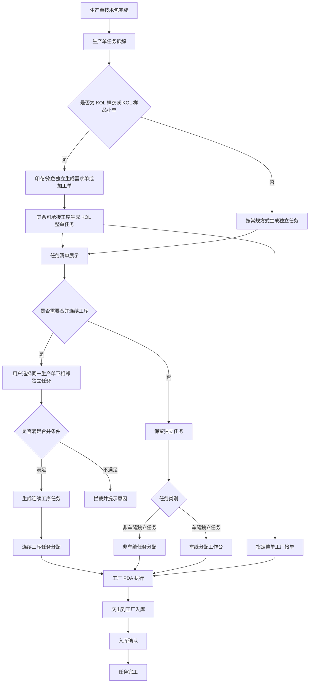
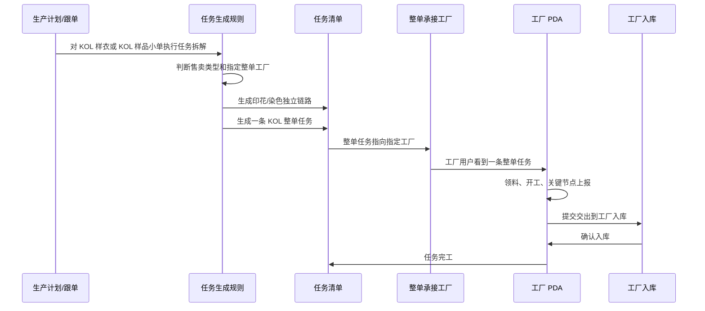
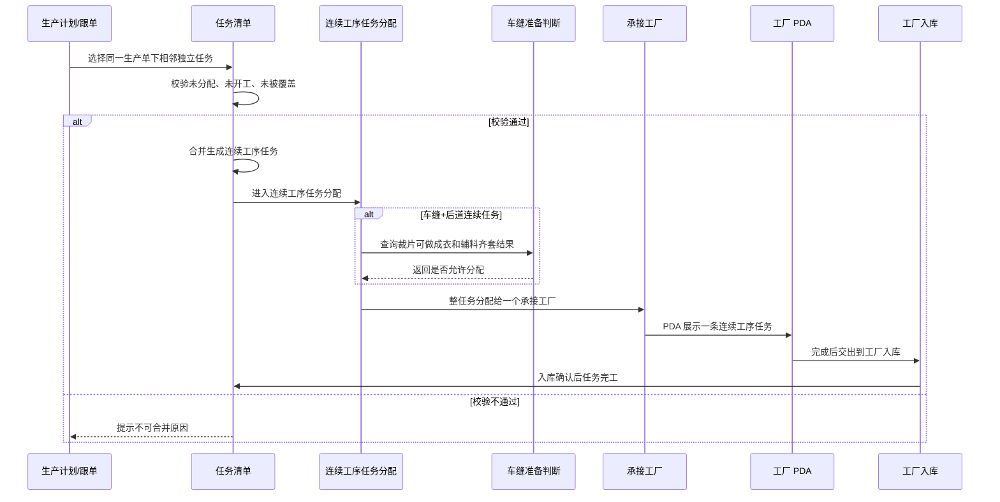
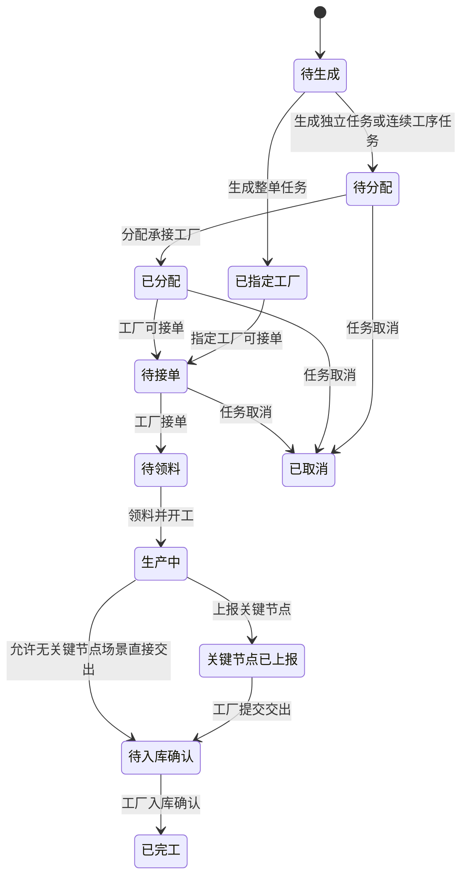

# FCS 整单任务与连续工序任务产品需求文档

文档版本：V1.0  
编写日期：2026-07-03  
适用范围：工厂生产协同系统 - 生产单拆解、任务清单、任务分配、工厂端 PDA 执行  
目标读者：产品、研发、测试、实施

## 1. 背景与目标

### 1.1 背景

当前 FCS 中，生产单会根据技术包和生产要求拆解出多个任务。传统模式下，系统更偏向按单个工序生成任务，例如裁片任务、车缝任务、后道任务、特殊工艺任务等。

但在实际业务中存在两类不能简单按单工序处理的场景：

1. KOL 样衣、KOL 样品小单通常需要由一个指定工厂整体承接，现场不希望拆成多个普通任务反复分配、接单、交接。
2. 部分生产场景下，多个前后连续的工序可以交给同一个工厂连续完成，例如车缝+后道。此时如果仍拆成多个独立任务，会增加分配、交接、领料和 PDA 操作成本。

因此，本期需要明确并落地两类任务：

- 整单任务
- 连续工序任务

### 1.2 产品目标

本期目标是建立一条清晰、可开发、可验收的闭环：

生产单拆解后形成任务 -> 任务清单展示任务 -> 任务清单可合并连续工序 -> 专用页面分配连续工序任务 -> 工厂 PDA 按一条任务执行 -> 交出到工厂入库 -> 任务完工。

### 1.3 本期必须解决的问题

| 问题 | 本期目标 |
| --- | --- |
| KOL 样衣、小单被拆成多个普通工序任务 | 生成一条整单任务，由指定整单工厂承接 |
| 连续工序是否自动生成不清晰 | 连续工序任务只允许在任务清单人工合并生成 |
| 连续工序任务是否能按明细拆分分配不清晰 | 连续工序任务创建后只允许整任务分配，不允许按明细拆分 |
| 车缝+后道连续任务缺少齐套判断 | 复用车缝分配工作台的裁片可做成衣、辅料齐套判断 |
| 任务清单展示口径混乱 | 任务清单一行代表一条可分配、可执行的任务 |
| PDA 操作复杂 | 整单任务和连续工序任务在 PDA 只展示一条任务 |

## 2. 本期范围

### 2.1 本期包含

1. 生产单任务生成规则中支持 KOL 整单任务。
2. 任务清单按任务口径展示整单任务、连续工序任务和独立任务。
3. 任务清单支持用户选择符合条件的独立任务，合并为连续工序任务。
4. 新增或完善连续工序任务分配入口。
5. 连续工序任务分配页面分为：
   - 车缝+后道连续任务
   - 其他连续工序任务
6. 车缝+后道连续任务分配前必须展示并校验：
   - 裁片是否可做成衣
   - 辅料是否满足生产
7. 连续工序任务不允许按明细拆分分配。
8. 非车缝任务分配和车缝分配工作台继续处理独立任务。
9. PDA 对整单任务、连续工序任务只展示一条任务。
10. 任务状态、拦截规则、操作日志和验收标准。

### 2.2 本期不包含

| 内容 | 说明 |
| --- | --- |
| 连续工序费用自动拆分 | 本期只要求任务生成、分配和执行闭环 |
| 复杂承接工厂推荐算法 | 本期可以手动选择承接工厂 |
| 结算分摊规则 | 不在本期 PRD 中展开 |
| 产值重算细则 | 本期只要求列表展示计划数量和任务范围 |
| 真实后端表结构设计 | 本文只描述业务需求，不写原型代码字段或数据库字段 |
| 连续工序自动生成规则 | 连续工序任务本期只允许在任务清单人工合并 |

## 3. 业务定义

### 3.1 任务类型

| 名称 | 业务定义 | 示例 |
| --- | --- | --- |
| 独立任务 | 一个任务只对应一个明确工序或加工对象，可单独分配、单独执行 | 裁片任务、车缝任务、烫画任务 |
| 整单任务 | 一个任务覆盖一张生产单中除独立管理工序外的多个工序，由指定工厂整体承接 | KOL 整单任务 |
| 连续工序任务 | 用户在任务清单中将同一生产单下前后相邻的独立任务合并后形成的一条任务 | 车缝+后道连续任务 |

### 3.2 整单任务

整单任务用于 KOL 样衣、KOL 样品小单。

本期规则：

1. 只适用于 KOL 样衣、KOL 样品小单。
2. 必须有指定整单承接工厂。
3. 印花、染色默认不并入整单任务，仍独立走需求单和加工单链路。
4. 除印花、染色外，其余可整体承接的工序合并为一条整单任务。
5. 整单任务不进入普通非车缝自动分配，也不进入车缝分配工作台重新找工厂。
6. 工厂端 PDA 只看到一条整单任务。

### 3.3 连续工序任务

连续工序任务用于多个前后连续工序由同一个工厂连续完成的场景。

本期规则：

1. 只允许在任务清单人工合并生成。
2. 不允许由生产单任务生成规则自动生成。
3. 合并后形成一条新的连续工序任务。
4. 被合并的原独立任务不再作为可分配、可执行任务展示。
5. 连续工序任务创建后，不允许按明细拆分分配。
6. 连续工序任务只能作为整任务分配给一个承接工厂。

### 3.4 独立任务

独立任务仍按现有分配逻辑处理：

| 任务类别 | 分配入口 |
| --- | --- |
| 非车缝独立任务 | 非车缝任务分配 |
| 车缝独立任务 | 车缝分配工作台 |
| 连续工序任务 | 连续工序任务分配 |
| 整单任务 | 由生产单任务生成规则指定承接工厂 |

## 4. 角色与权限边界

| 角色 | 主要操作 |
| --- | --- |
| 生产计划/跟单 | 查看生产单拆解结果、在任务清单合并连续工序 |
| 分配人员 | 在对应分配页面选择承接工厂 |
| 车缝分配人员 | 判断裁片和辅料是否满足车缝或车缝+后道连续任务生产 |
| 工厂用户 | 在 PDA 接单、领料、开工、上报、交出、完工 |
| 仓库人员 | 接收整单任务或连续工序任务交出物 |
| 系统 | 根据规则生成任务、校验合并条件、记录日志 |

## 5. 总体业务流程

## 6. 页面需求

### 6.1 生产单任务生成规则

#### 页面定位

该页面只负责配置生产单拆解时如何生成任务。

本期重点是整单任务规则，不配置连续工序自动生成规则。

#### 必须展示的信息

| 区块 | 内容 |
| --- | --- |
| 规则列表 | 规则名称、启用状态、适用售卖类型、承接方式、独立管理工序、任务名称、承接工厂 |
| 规则详情 | 触发条件、适用售卖类型、指定工厂、独立管理工序、整单任务覆盖范围、PDA 步骤 |
| 规则日志 | 创建、启用、停用、修改、模拟等操作记录 |

#### 整单规则要求

1. 规则名称表达业务含义，例如“KOL 样衣整单承接规则”。
2. 适用售卖类型为 KOL 样衣、KOL 样品小单。
3. 指定承接工厂必须是支持 KOL 整单承接的工厂。
4. 印花、染色为独立管理工序，不并入整单任务。
5. 任务名称应能让工厂明确识别，例如“KOL 整单任务”。
6. PDA 步骤使用简化流程：领料 -> 开工 -> 关键节点上报 -> 交出 -> 完工。

#### 不允许

1. 不允许在本页面配置连续工序自动生成规则。
2. 不允许把印花厂、染厂、仓库默认当作 KOL 整单承接工厂。
3. 不允许整单任务进入普通自动分配重新改工厂。

### 6.2 任务清单

#### 页面定位

任务清单是生产单拆解后的任务结果页，也是一线业务人员决定是否合并连续工序的操作入口。

#### 列表口径

一行代表一条可分配、可执行、可交出的任务。

列表必须同时支持展示：

- 独立任务
- 整单任务
- 连续工序任务

#### 必须展示的信息

| 信息 | 说明 |
| --- | --- |
| 任务号 | 用于业务追踪 |
| 生产单号 | 标识任务归属 |
| 售卖类型 | 判断是否为 KOL、小单、大货等 |
| 任务类型 | 独立任务、整单任务、连续工序任务 |
| 任务名称 | 例如 KOL 整单任务、车缝+后道连续任务 |
| 覆盖工序 | 任务覆盖哪些工序 |
| 承接方式 | 单工序承接、整单承接、连续工序承接 |
| 承接工厂 | 已分配时展示工厂，未分配时展示待分配 |
| 计划数量 | 任务计划生产数量 |
| 分配状态 | 待分配、已分配等 |
| 执行状态 | 未开工、进行中、已交出、已完工等 |
| 当前步骤 | 当前 PDA 执行节点 |
| 交出对象 | 默认工厂入库 |
| 规则来源 | 生产单规则生成、任务清单人工合并等业务来源 |
| 操作 | 查看任务、合并连续工序等 |

#### 合并连续工序入口

任务清单中提供“合并连续工序”操作。

用户选择任务后，系统校验是否允许合并。

合并成功后：

1. 新增一条连续工序任务。
2. 被合并的原独立任务不再作为可分配任务展示。
3. 原独立任务详情中保留被合并关系。
4. 新任务记录合并来源、操作人、操作时间。

#### 合并条件

只允许合并满足全部条件的任务：

1. 属于同一生产单。
2. 是前后相邻的工序任务。
3. 均为独立任务。
4. 均未分配。
5. 均未开工。
6. 均未完工。
7. 均未取消。
8. 未被其他整单任务或连续工序任务覆盖。
9. 至少选择两个任务。

#### 拦截条件

出现以下任一情况时，不允许合并：

| 场景 | 提示 |
| --- | --- |
| 跨生产单选择 | 只能合并同一生产单下的任务 |
| 工序不相邻 | 只能合并前后连续的任务 |
| 已分配 | 已分配任务不可合并，请先处理分配结果 |
| 已开工 | 已开工任务不可合并 |
| 已完工 | 已完工任务不可合并 |
| 已取消 | 已取消任务不可合并 |
| 已被覆盖 | 已被整单或连续工序任务覆盖 |
| 只选一个任务 | 至少选择两个任务 |

### 6.3 连续工序任务分配

#### 页面定位

连续工序任务分配只处理任务清单人工合并生成的连续工序任务。

该页面不处理独立任务，也不允许重新拆分连续工序任务。

#### 页面结构

页面分为两个页签：

| 页签 | 说明 |
| --- | --- |
| 车缝+后道连续任务 | 仅覆盖车缝和后道的连续工序任务 |
| 其他连续工序任务 | 覆盖范围不是车缝+后道的连续工序任务 |

#### 车缝+后道连续任务

该类任务在分配前必须像车缝分配工作台一样展示生产准备判断：

1. 裁片是否可做成衣。
2. 辅料是否满足生产。
3. 可生产数量。
4. 缺口说明。
5. 是否允许直接分配。

只有同时满足以下条件，才允许分配：

1. 裁片可做成衣。
2. 辅料满足生产。
3. 待分配数量大于 0。
4. 任务未分配、未开工、未取消。

#### 其他连续工序任务

其他连续工序任务分配时，需要展示：

1. 覆盖工序。
2. 计划数量。
3. 当前承接工厂。
4. 可选承接工厂。
5. 工厂承接能力。
6. 工厂产能提示。
7. 操作日志。

#### 分配方式

本期支持：

1. 直接分配给一个承接工厂。
2. 暂不分配。
3. 发起竞价或询价可以作为可选能力展示，但不作为本期必须闭环。

#### 不允许

1. 不允许按明细拆分连续工序任务。
2. 不允许把连续工序任务拆回多个普通任务后再分配。
3. 不允许在该页面创建新的连续工序任务。

### 6.4 车缝分配工作台

车缝分配工作台继续处理车缝独立任务。

与连续工序任务的关系：

1. 车缝独立任务在车缝分配工作台分配。
2. 车缝+后道连续任务在连续工序任务分配页面分配。
3. 两者都需要裁片可做成衣、辅料满足生产判断。
4. 连续工序任务页面复用车缝工作台的判断口径，不复制一套不同规则。

### 6.5 非车缝任务分配

非车缝任务分配继续处理非车缝独立任务。

要求：

1. 只处理独立任务。
2. 不处理整单任务。
3. 不处理连续工序任务。
4. 自动分配配置不得覆盖整单任务或连续工序任务的承接工厂。
5. 页面说明中必须明确：整单任务、连续工序任务不进入普通非车缝自动分配。

### 6.6 PDA 执行

#### 展示原则

整单任务和连续工序任务在 PDA 中只展示一条任务。

不允许把覆盖工序拆成多个 PDA 任务入口。

#### PDA 任务卡

必须展示：

| 信息 | 说明 |
| --- | --- |
| 任务名称 | KOL 整单任务、车缝+后道连续任务等 |
| 生产单号 | 任务归属 |
| 售卖类型 | KOL 样衣、KOL 样品小单等 |
| 计划数量 | 本任务需要完成的数量 |
| 覆盖工序 | 本任务覆盖的工序范围 |
| 当前步骤 | 领料、开工、关键节点上报、交出、完工 |
| 交出对象 | 工厂入库 |

#### PDA 执行步骤

整单任务和连续工序任务统一使用五步：

1. 领料
2. 开工
3. 关键节点上报
4. 交出
5. 完工

#### 交出规则

1. 默认交出对象为工厂入库。
2. 工厂提交交出后，任务进入待入库确认。
3. 仓库确认后，任务进入已完工。
4. 交出记录必须保留操作人、时间、数量、异常说明。

## 7. 整单任务业务流程

## 8. 连续工序任务业务流程

## 9. 任务状态

### 9.1 状态图

### 9.2 状态说明

| 状态 | 说明 |
| --- | --- |
| 待生成 | 生产单尚未形成任务 |
| 待分配 | 任务已形成，但未确定承接工厂 |
| 已指定工厂 | 整单任务已由规则指定承接工厂 |
| 已分配 | 分配人员已指定承接工厂 |
| 待接单 | 工厂可在 PDA 接单 |
| 待领料 | 工厂已接单，等待领料 |
| 生产中 | 工厂已开工 |
| 关键节点已上报 | 工厂已上报关键生产节点 |
| 待入库确认 | 工厂已交出，等待工厂入库确认 |
| 已完工 | 入库确认完成 |
| 已取消 | 任务终止，不再执行 |

## 10. 核心业务规则

### 10.1 KOL 整单规则

| 规则 | 要求 |
| --- | --- |
| 适用售卖类型 | KOL 样衣、KOL 样品小单 |
| 指定工厂 | 必须为支持 KOL 整单承接的工厂 |
| 独立管理工序 | 印花、染色 |
| 整单覆盖范围 | 除独立管理工序外的可整单承接工序 |
| 分配方式 | 规则直接指定工厂，不进入普通自动分配 |
| PDA 展示 | 一条 KOL 整单任务 |
| 交出对象 | 工厂入库 |

### 10.2 连续工序合并规则

| 规则 | 要求 |
| --- | --- |
| 创建入口 | 任务清单 |
| 创建方式 | 人工选择并合并 |
| 选择范围 | 同一生产单 |
| 工序关系 | 前后相邻 |
| 原任务状态 | 未分配、未开工、未完工、未取消 |
| 原任务类型 | 独立任务 |
| 合并后分配 | 整任务分配给一个工厂 |
| 是否允许明细拆分 | 不允许 |
| 是否允许自动生成 | 不允许 |

### 10.3 车缝+后道连续任务规则

| 判断项 | 规则 |
| --- | --- |
| 裁片 | 必须可做成衣 |
| 辅料 | 必须满足生产 |
| 数量 | 待分配数量必须大于 0 |
| 状态 | 未分配、未开工、未取消 |
| 分配方式 | 整任务分配 |

### 10.4 自动分配避让规则

1. 非车缝自动分配只处理非车缝独立任务。
2. 车缝分配工作台只处理车缝独立任务。
3. 整单任务不进入普通自动分配。
4. 连续工序任务不进入普通非车缝自动分配和车缝独立任务分配。
5. 连续工序任务只能进入连续工序任务分配页面。

## 11. 异常与提示

### 11.1 任务清单合并异常

| 异常 | 系统处理 |
| --- | --- |
| 任务跨生产单 | 拦截，提示只能合并同一生产单任务 |
| 工序不相邻 | 拦截，提示只能合并前后连续任务 |
| 任务已分配 | 拦截，提示已分配任务不可合并 |
| 任务已开工 | 拦截，提示已开工任务不可合并 |
| 任务已完工 | 拦截，提示已完工任务不可合并 |
| 任务已取消 | 拦截，提示已取消任务不可合并 |
| 任务已被覆盖 | 拦截，提示任务已被整单或连续工序覆盖 |

### 11.2 连续工序分配异常

| 异常 | 系统处理 |
| --- | --- |
| 裁片不可做成衣 | 不允许分配，展示裁片缺口 |
| 辅料不满足生产 | 不允许分配，展示辅料缺口 |
| 未选择承接工厂 | 不允许提交 |
| 工厂不具备承接能力 | 不允许提交或强提醒 |
| 任务已被分配 | 不允许重复分配 |
| 任务已开工 | 不允许改派 |

### 11.3 PDA 异常

| 异常 | 系统处理 |
| --- | --- |
| 未领料直接开工 | 提示先领料 |
| 未开工直接交出 | 提示先开工 |
| 交出数量异常 | 要求填写异常说明 |
| 仓库未确认 | 任务保持待入库确认 |

## 12. 操作日志

以下操作必须记录日志：

| 操作 | 日志内容 |
| --- | --- |
| 生成整单任务 | 生产单、售卖类型、命中规则、指定工厂、覆盖工序 |
| 合并连续工序任务 | 原任务、合并后任务、操作人、时间 |
| 连续工序任务分配 | 承接工厂、分配方式、操作人、时间 |
| 分配拦截 | 拦截原因、操作人、时间 |
| PDA 接单 | 工厂用户、时间 |
| PDA 开工 | 工厂用户、时间 |
| 关键节点上报 | 节点内容、图片或备注、时间 |
| 交出 | 数量、接收对象、异常说明、时间 |
| 入库确认 | 仓库人员、时间 |

## 13. 开发顺序

### 阶段 1：任务口径和数据链路

1. 明确任务类型在业务层的展示口径。
2. 任务清单一行代表一条任务。
3. 被整单或连续工序覆盖的原任务不再作为可执行任务展示。
4. 保留覆盖关系和来源记录。

验收重点：

- KOL 整单任务只显示一行。
- 连续工序任务只显示一行。
- 被覆盖工序不重复显示为独立可分配任务。

### 阶段 2：KOL 整单任务

1. 生产单任务生成规则支持 KOL 样衣、KOL 样品小单整单任务。
2. 印花、染色独立管理。
3. 其余工序生成一条 KOL 整单任务。
4. 指定整单工厂。
5. PDA 只展示一条整单任务。

验收重点：

- KOL 样衣可生成 KOL 整单任务。
- KOL 样品小单可生成 KOL 整单任务。
- KOL 整单任务不进入普通自动分配。

### 阶段 3：任务清单连续工序合并

1. 任务清单支持选择任务。
2. 系统校验是否可合并。
3. 合并成功后生成连续工序任务。
4. 原任务不再作为可分配任务展示。
5. 记录合并日志。

验收重点：

- 只能合并同一生产单的相邻独立任务。
- 已分配、已开工、已完工、已取消任务不可合并。
- 连续工序任务来源显示为任务清单人工合并。

### 阶段 4：连续工序任务分配

1. 增加连续工序任务分配页面。
2. 页面分为车缝+后道连续任务、其他连续工序任务。
3. 车缝+后道连续任务展示裁片和辅料判断。
4. 连续工序任务只能整任务分配。

验收重点：

- 页面不出现按明细拆分入口。
- 车缝+后道连续任务必须展示裁片和辅料判断。
- 分配后进入 PDA。

### 阶段 5：PDA 执行闭环

1. PDA 展示整单任务和连续工序任务。
2. 每条任务只展示一个入口。
3. 支持领料、开工、关键节点上报、交出、完工。
4. 交出到工厂入库。

验收重点：

- PDA 中 KOL 整单任务只出现一条。
- PDA 中连续工序任务只出现一条。
- 交出后需要工厂入库确认。

### 阶段 6：验收脚本与回归

1. 增加整单任务验收。
2. 增加连续工序合并验收。
3. 增加自动分配避让验收。
4. 增加 PDA 单任务展示验收。

验收重点：

- 所有本 PRD 验收项可重复验证。
- 回归后不能重新出现被覆盖工序重复展示。

## 14. 验收清单

### 14.1 整单任务验收

| 编号 | 验收项 | 标准 |
| --- | --- | --- |
| A1 | KOL 样衣生成整单任务 | 生产单拆解后出现一条 KOL 整单任务 |
| A2 | KOL 样品小单生成整单任务 | 生产单拆解后出现一条 KOL 整单任务 |
| A3 | 印花、染色独立 | 印花、染色不并入 KOL 整单任务 |
| A4 | 指定整单工厂 | KOL 整单任务承接工厂为指定整单工厂 |
| A5 | 不进入普通自动分配 | 非车缝自动分配不改变整单任务工厂 |
| A6 | PDA 单入口 | 工厂 PDA 只显示一条 KOL 整单任务 |

### 14.2 连续工序任务验收

| 编号 | 验收项 | 标准 |
| --- | --- | --- |
| B1 | 创建入口 | 只能在任务清单合并生成 |
| B2 | 不能自动生成 | 生产单任务生成规则不生成连续工序任务 |
| B3 | 合并条件 | 只允许同一生产单、前后相邻、未分配、未开工的独立任务 |
| B4 | 合并后展示 | 任务清单出现一条连续工序任务 |
| B5 | 原任务隐藏 | 被合并原任务不再作为可分配任务展示 |
| B6 | 不允许明细拆分 | 连续工序任务分配页无按明细拆分入口 |
| B7 | 整任务分配 | 只能分配给一个承接工厂 |

### 14.3 车缝+后道连续任务验收

| 编号 | 验收项 | 标准 |
| --- | --- | --- |
| C1 | 独立页签 | 连续工序任务分配页有车缝+后道连续任务页签 |
| C2 | 裁片判断 | 展示裁片是否可做成衣 |
| C3 | 辅料判断 | 展示辅料是否满足生产 |
| C4 | 缺口拦截 | 裁片或辅料不满足时不允许分配 |
| C5 | 满足后分配 | 裁片和辅料满足时允许整任务分配 |

### 14.4 分配页面验收

| 编号 | 验收项 | 标准 |
| --- | --- | --- |
| D1 | 非车缝任务分配 | 只处理非车缝独立任务 |
| D2 | 车缝分配工作台 | 只处理车缝独立任务 |
| D3 | 连续工序任务分配 | 只处理连续工序任务 |
| D4 | 整单任务 | 由规则指定工厂，不进入普通分配 |
| D5 | 页面提示 | 页面明确说明各自处理范围 |

### 14.5 PDA 验收

| 编号 | 验收项 | 标准 |
| --- | --- | --- |
| E1 | 整单任务单入口 | PDA 不拆出多个工序入口 |
| E2 | 连续工序任务单入口 | PDA 不拆出多个工序入口 |
| E3 | 五步执行 | 支持领料、开工、关键节点上报、交出、完工 |
| E4 | 交出对象 | 默认交出到工厂入库 |
| E5 | 入库确认 | 入库确认后任务完工 |

### 14.6 日志验收

| 编号 | 验收项 | 标准 |
| --- | --- | --- |
| F1 | 整单生成日志 | 记录规则、工厂、覆盖工序 |
| F2 | 连续工序合并日志 | 记录来源任务、操作人、时间 |
| F3 | 分配日志 | 记录承接工厂、操作人、时间 |
| F4 | 拦截日志 | 记录拦截原因 |
| F5 | PDA 日志 | 记录接单、开工、上报、交出、入库确认 |

## 15. 关键口径冻结

1. 整单任务本期只覆盖 KOL 样衣、KOL 样品小单。
2. 印花、染色默认独立管理，不并入整单任务。
3. 连续工序任务只允许任务清单人工合并生成。
4. 生产单任务生成规则不生成连续工序任务。
5. 连续工序任务创建后不允许按明细拆分分配。
6. 连续工序任务只能整任务分配给一个承接工厂。
7. 车缝+后道连续任务必须复用车缝分配工作台的裁片和辅料判断。
8. 非车缝任务分配和车缝分配工作台只处理独立任务。
9. 整单任务和连续工序任务在 PDA 中只展示一条任务。
10. 交出对象默认是工厂入库。

## 16. 研发交付要求

1. 每个阶段开发完成后，需要提供页面截图或录屏。
2. 每个阶段必须通过对应验收清单。
3. 不允许只做列表展示而不做状态和拦截。
4. 不允许页面文案出现内部技术字段或英文状态码。
5. 研发提测前必须完成整单任务、连续工序任务、独立任务三类场景回归。

