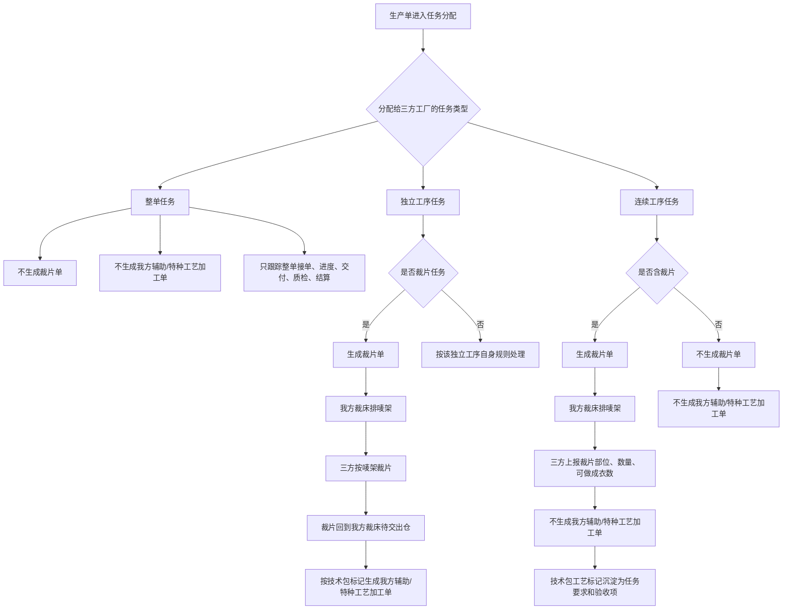
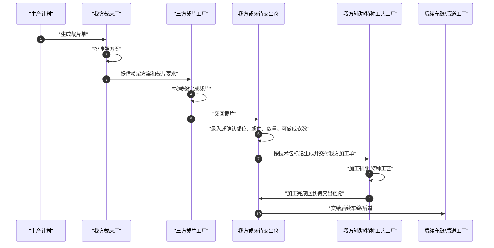
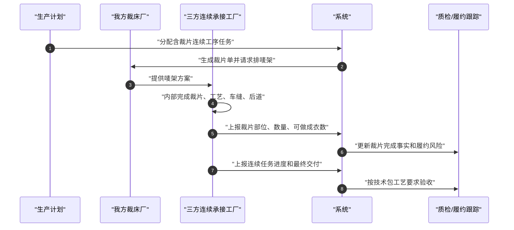
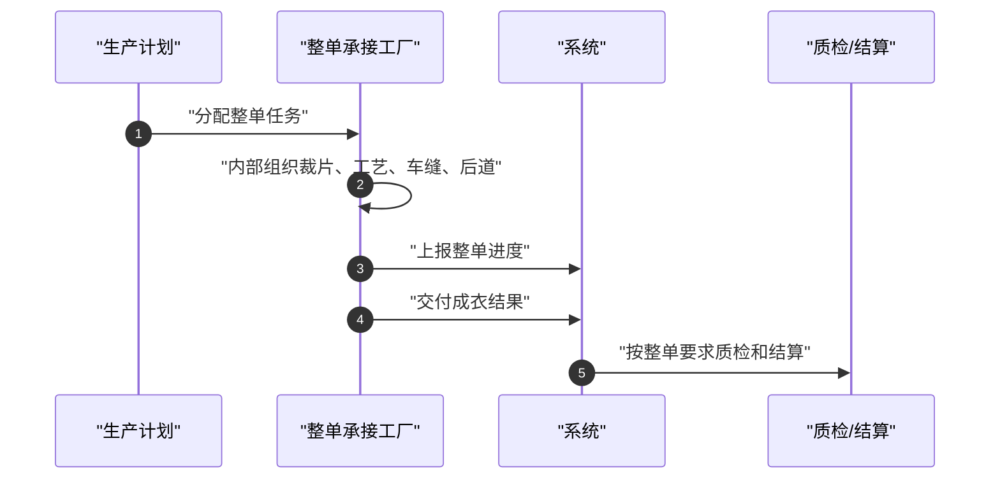

# 三方裁片、连续工序与我方加工单边界产品设计

## 1. 背景

当前围绕整单任务、独立工序任务、连续工序任务以及裁片单、辅助工艺加工单、特种工艺加工单的关系，已经明确一个关键原则：不能只看“三方工厂是否参与裁片”，而要看“分配给三方工厂的任务类型”。

本设计用于统一以下问题：

- 三方工厂只做裁片时，裁片单和我方辅助/特种工艺加工单如何生成。
- 三方工厂承接含裁片连续工序时，裁片单如何保留，我方加工单如何处理。
- 整单任务是否需要裁片单、我方辅助/特种工艺加工单。
- 技术包中的辅助/特种工艺标记，在不同任务类型下如何落地。

## 2. 核心结论

主判断口径为：**分配给三方工厂的任务类型**。

任务类型分为三类：

1. 独立工序任务
2. 连续工序任务
3. 整单任务

裁片单与我方辅助/特种工艺加工单的生成规则如下：

| 三方承接任务类型 | 是否生成裁片单 | 是否生成我方辅助/特种工艺加工单 | 业务解释 |
|---|---:|---:|---|
| 独立工序任务：裁片 | 是 | 是 | 三方只做裁片，裁片回到我方裁床待交出仓，后续进入我方内部流转 |
| 独立工序任务：非裁片 | 否 | 按该工序自身规则判断 | 不因非裁片任务额外生成裁片单 |
| 连续工序任务：含裁片 | 是 | 否 | 裁片单用于我方排唛架和感知裁片产出；三方内部后续过程不拆成我方加工单 |
| 连续工序任务：不含裁片 | 否 | 否 | 三方连续承接但不涉及裁片，不需要裁片单，也不生成我方加工单 |
| 整单任务 | 否 | 否 | 整单承接不拆内部过程 |

## 3. 关键对象边界

### 3.1 裁片单

裁片单不是“必须由我方裁床执行”的含义。

裁片单在本设计中的业务定位是：

- 支撑我方裁床厂排唛架；
- 承接生产单、技术包、面料、纸样、颜色、尺码、部位等裁片依据；
- 记录三方裁片完成后的部位、颜色、数量、可做成衣数；
- 为履约风险提供可感知的裁片完成事实。

因此：

- 三方只做裁片：生成裁片单，裁片回到我方裁床待交出仓；
- 三方做含裁片连续工序：生成裁片单，但不进入我方裁床铺布、菲票、入仓、待交出仓流程；
- 整单任务：不生成裁片单。

### 3.2 我方辅助/特种工艺加工单

我方辅助/特种工艺加工单是我方内部辅助工艺工厂、特种工艺工厂的执行单。

它不是技术包标记本身。技术包中标记的辅助/特种工艺，在不同场景下有不同落点：

- 裁片回到我方内部链路：生成我方加工单；
- 裁片不回我方，由三方连续承接：不生成我方加工单，只作为三方连续任务的工艺要求、验收关注点和质检依据；
- 整单任务：不生成我方加工单，只作为整单承接要求的一部分。

## 4. 业务流程图



## 5. 时序图

### 5.1 独立裁片工序任务



### 5.2 含裁片连续工序任务



### 5.3 整单任务



## 6. 状态图

### 6.1 裁片单状态

```mermaid
stateDiagram-v2
  [*] --> "待判定"
  "待判定" --> "不生成": "整单任务或不含裁片"
  "待判定" --> "待排唛架": "独立裁片任务或含裁片连续任务"
  "待排唛架" --> "唛架已发布": "我方裁床发布唛架"

  "唛架已发布" --> "待三方裁片": "独立裁片任务"
  "待三方裁片" --> "待回我方裁床仓": "三方完成裁片"
  "待回我方裁床仓" --> "已回仓确认": "部位/颜色/数量/可做成衣数确认"
  "已回仓确认" --> "进入我方后续流转"

  "唛架已发布" --> "连续任务裁片待上报": "含裁片连续任务"
  "连续任务裁片待上报" --> "裁片完成已感知": "三方上报裁片完成数量"
  "裁片完成已感知" --> "随连续任务关闭": "连续任务交付完成"

  "不生成" --> [*]
  "进入我方后续流转" --> [*]
  "随连续任务关闭" --> [*]
```

### 6.2 我方辅助/特种工艺加工单状态

```mermaid
stateDiagram-v2
  [*] --> "待判断"
  "待判断" --> "不生成": "整单任务、三方连续任务或不回我方链路"
  "待判断" --> "待生成": "裁片回到我方裁床待交出仓且技术包有工艺标记"
  "待生成" --> "待领料": "生成我方加工单"
  "待领料" --> "已入待加工仓": "我方工艺厂接收"
  "已入待加工仓" --> "加工中": "开始加工"
  "加工中" --> "待交出": "加工完成"
  "待交出" --> "已交出": "交回我方后续链路"
  "已交出" --> "已回写": "数量和状态回写"

  "已入待加工仓" --> "差异处理中": "数量或部位差异"
  "待交出" --> "差异处理中": "完工数量差异"
  "差异处理中" --> "加工中": "差异处理后继续"
  "差异处理中" --> "已回写": "差异关闭"

  "不生成" --> [*]
  "已回写" --> [*]
```

## 7. 页面与功能落点

### 7.1 任务清单

任务清单需要明确展示任务类型：

- 独立工序任务；
- 连续工序任务；
- 整单任务。

对含裁片任务，需要展示：

- 是否生成裁片单；
- 裁片单当前状态；
- 唛架方案状态；
- 裁片完成数量；
- 可做成衣数；
- 是否回到我方裁床待交出仓；
- 是否生成我方辅助/特种工艺加工单。

### 7.2 连续工序任务分配

连续工序任务分配需要区分：

- 含裁片连续任务；
- 不含裁片连续任务。

含裁片连续任务需要额外展示：

- 我方唛架方案状态；
- 三方裁片完成上报状态；
- 裁片完成数量；
- 可做成衣数；
- 技术包工艺要求；
- 验收关注点。

不展示、也不生成我方辅助/特种工艺加工单。

### 7.3 裁片单

裁片单需要支持两类来源：

- 独立裁片任务来源；
- 含裁片连续任务来源。

两类来源的差异：

| 来源 | 是否回我方裁床待交出仓 | 是否进入我方内部后续流转 | 是否触发我方辅助/特种工艺加工单 |
|---|---:|---:|---:|
| 独立裁片任务 | 是 | 是 | 是 |
| 含裁片连续任务 | 否 | 否 | 否 |

### 7.4 辅助/特种工艺加工单

我方辅助/特种工艺加工单只展示我方内部执行对象。

不得把三方连续任务内部的辅助/特种工艺要求生成到我方加工单列表中。

如果技术包存在辅助/特种工艺标记，但不生成我方加工单，需要在连续任务详情、整单任务详情中展示为：

- 工艺要求；
- 验收关注点；
- 质检依据；
- 异常追踪维度。

## 8. 生成规则

### 8.1 裁片单生成规则

生成裁片单的条件：

- 独立工序任务是裁片；
- 连续工序任务包含裁片；
- 生产单有可用于排唛架的正式技术包和裁片部位数据。

不生成裁片单的条件：

- 整单任务；
- 连续工序任务不含裁片；
- 独立工序任务不含裁片。

### 8.2 我方辅助/特种工艺加工单生成规则

生成我方加工单的条件：

- 技术包裁片部位标记了辅助/特种工艺；
- 该裁片会进入我方内部流转链路；
- 裁片回到我方裁床待交出仓，或由我方裁床自己裁片后进入后续流转。

不生成我方加工单的条件：

- 整单任务；
- 三方含裁片连续工序任务；
- 三方不含裁片连续工序任务；
- 裁片没有回到我方裁床待交出仓。

## 9. 验收标准

1. 独立裁片任务外发给三方时，系统能生成裁片单。
2. 独立裁片任务回到我方裁床待交出仓后，系统能根据技术包标记生成我方辅助/特种工艺加工单。
3. 含裁片连续工序任务能生成裁片单，并展示唛架方案状态、裁片完成数量、可做成衣数。
4. 含裁片连续工序任务不得生成我方辅助/特种工艺加工单。
5. 不含裁片连续工序任务不得生成裁片单，也不得生成我方辅助/特种工艺加工单。
6. 整单任务不得生成裁片单，也不得生成我方辅助/特种工艺加工单。
7. 技术包中的辅助/特种工艺标记不得丢失；在不生成我方加工单的场景下，必须展示为任务要求、验收关注点或质检依据。
8. 裁片单页面必须能区分“独立裁片任务来源”和“含裁片连续任务来源”。
9. 任务清单必须能按任务类型解释裁片单和我方加工单的生成结果。
10. 现有原型中整单任务仍生成裁片单、三方连续任务仍生成我方加工单的情况，应被识别为待修正缺口。

## 10. 非本期范围

以下内容不在本设计范围内：

- 三方工厂内部辅助/特种工艺的详细工序管理；
- 三方工厂内部工价、成本拆分和结算明细；
- 自动推荐三方连续承接工厂的算法；
- 真实后端接口、数据库表结构和权限体系设计；
- PDA 端完整重构。

本期只要求把任务类型、裁片单、我方辅助/特种工艺加工单之间的边界表达清楚，并支撑原型页面按该边界展示。
