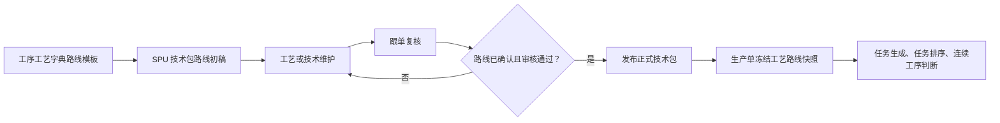
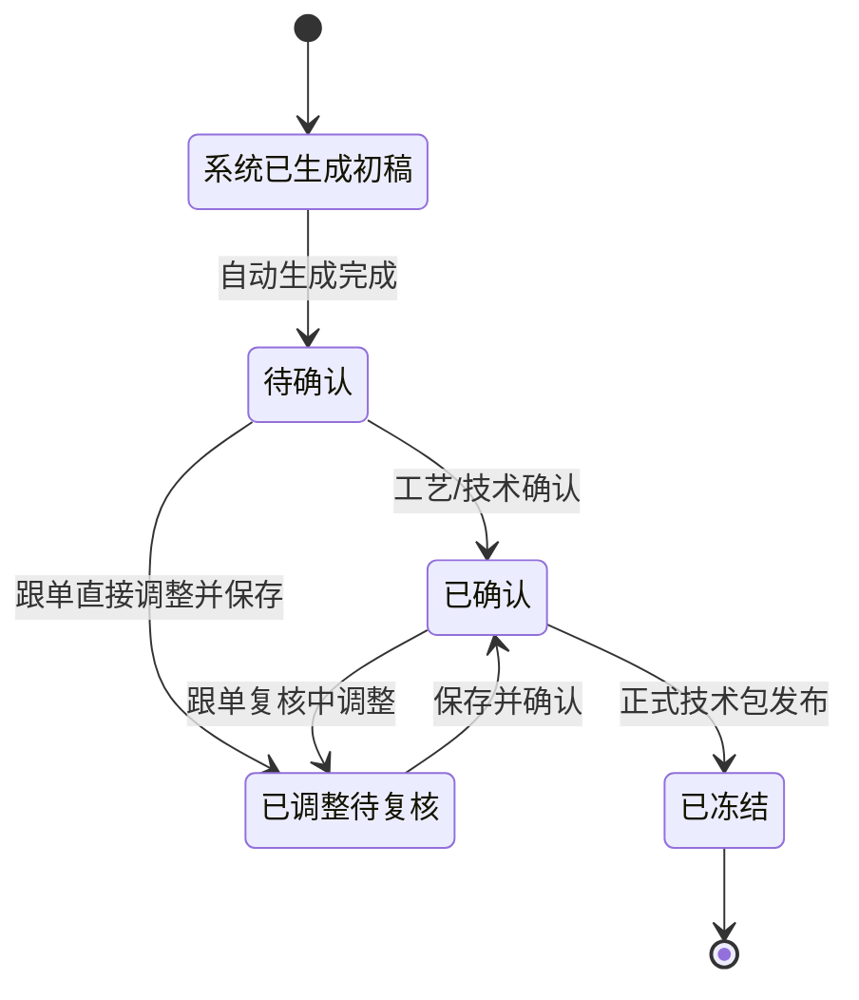
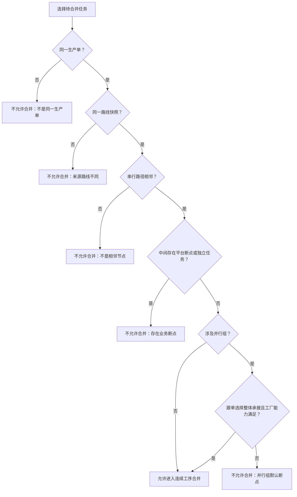
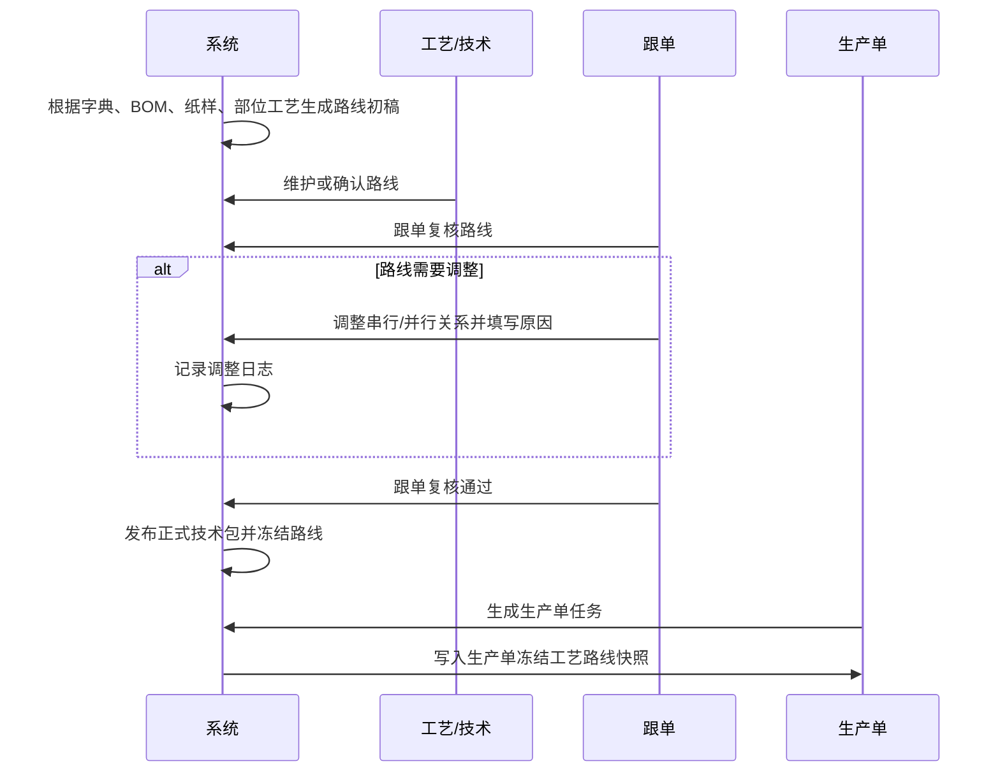

# 工序工艺路线串行并行编辑与连续工序判断设计

## 1. 背景

当前系统已经有技术包审核链路，正式技术包发布前需要经过买手、版师和跟单审核。工序工艺已经是技术包中的核心内容，但目前业务上还需要补齐一层关键能力：工序工艺不只是「有哪些工序」，还必须明确这些工序之间的串行、并行、断点和可合并关系。

这套设计用于支撑 3 个业务目标：

- 工序工艺字典能维护全局默认路线模板。
- 每个 SPU 的技术包能形成可确认、可调整、可追溯的款式工艺路线。
- 生产单任务生成和连续工序任务判断能读取冻结路线快照，而不是临时按列表顺序猜测。

## 2. 设计结论

采用轻量路线模型：**阶段 + 顺序段 + 并行组**。

- 主编辑：阶段泳道 + 顺序段。
- 批量辅助：表格编辑。
- 关系查看：只读节点关系图。
- 不做任意网状路线编辑器。

字典是默认模板，技术包是款式事实，生产单快照是执行依据。

## 3. 对象边界

### 3.1 工序工艺字典路线模板

工序工艺字典维护系统默认认知，包括：

- 默认阶段。
- 默认工序工艺顺序。
- 默认串行关系。
- 默认并行组。
- 默认平台断点。
- 默认是否必须独立生成任务。

字典模板只影响后续新生成的技术包工艺路线初稿，不直接修改已经确认或已经发布的技术包路线。

### 3.2 SPU 技术包工艺路线

技术包工序 Tab 在字典模板基础上，结合以下内容生成款式工艺路线初稿：

- 款式类型，例如毛织、梭织、毛织加梭织。
- BOM 中的面辅料印染需求。
- 纸样池中的纸样包。
- 物料关联纸样中维护的裁片部位。
- 裁片部位上的辅助工艺和特种工艺。

技术包路线允许人工调整。工艺或技术人员可以调整，跟单在复核阶段也可以直接调整并保存。

### 3.3 生产单冻结工艺路线快照

正式技术包发布后，生产单生成任务时冻结该技术包的工艺路线。后续任务排序、任务依赖、连续工序任务合并判断都读取这份快照。

正式技术包后续发生变化时，不能直接改已经生成生产单的冻结路线。已生成生产单需要变化时，走技术包新版本、版本关系变更或生产单补丁。

## 4. 串行与并行编辑规则

### 4.1 主编辑方式

主编辑采用阶段泳道 + 顺序段：

- 每个路线节点属于一个阶段。
- 每个阶段内按顺序段排列。
- 一个顺序段只有一个工序时，表示串行节点。
- 一个顺序段包含多个工序时，表示并行组。
- 顺序段之间前后相接，表示串行关系。
- 并行组内多个工序互不依赖，可以同时生成任务、同时分配执行。
- 并行组之后的后续顺序段，默认依赖并行组内应完成节点全部满足进入条件。

### 4.2 跟单调整能力

跟单在复核阶段可以直接调整并保存，不必强制打回给工艺或技术人员。

支持动作：

- 移动节点到前一段或后一段。
- 把多个节点合并为并行组。
- 把并行组拆回串行节点。
- 调整节点所属阶段。
- 删除不适用节点。
- 补充特殊节点。
- 设置并行组是否允许整体承接。

跟单调整必须填写调整原因。没有调整原因，不允许保存。

### 4.3 批量辅助表格

批量表格用于快速调整，不作为主认知入口。

表格支持：

- 批量修改阶段。
- 批量修改顺序段。
- 批量调整并行组。
- 快速标记平台断点。
- 快速标记是否必须独立生成任务。

保存后同步到阶段泳道视图。

### 4.4 只读关系图

只读关系图用于审核、解释和追溯：

- 展示节点之间的依赖关系。
- 展示并行分叉和汇合。
- 展示平台断点。
- 展示连续工序任务可合并或不可合并的原因。

只读关系图不作为主编辑入口。

## 5. 审核与发布门禁

技术包工艺路线不是「有工序就算完成」，必须有明确确认状态。

路线状态：

- 系统已生成初稿。
- 待确认。
- 已确认。
- 已调整待复核。
- 已冻结。

门禁规则：

- 工艺路线未确认，不能发布正式技术包。
- 跟单复核时，如果路线未确认，不能复核通过。
- 跟单调整路线后可以直接保存，不必打回。
- 跟单调整路线必须填写原因。
- 跟单可以保存调整，也可以保存并复核通过。
- 正式发布后路线冻结。

当前系统已有技术包审核流，本设计不新增一套审核流，只是在现有审核流中补充「工艺路线确认」这个发布条件。

## 6. 连续工序任务判断规则

连续工序任务只基于生产单冻结工艺路线快照判断。

基础规则：

- 必须属于同一生产单。
- 必须来自同一份正式技术包路线快照。
- 必须是同一条串行路径上的相邻节点。
- 中间不能跳过任何工序节点。
- 中间不能跨越平台断点。
- 中间不能跨越必须独立生成任务的节点。
- 已经明细拆分的任务不能再合并为连续工序任务。
- 连续工序任务合并后不能再按明细拆分。
- 合并范围必须由跟单明确选择。

并行组规则：

- 并行组默认是连续工序判断断点。
- 默认不允许把并行组内多个工序合并成连续工序任务。
- 只有跟单明确选择「并行组整体承接」，才允许并行组进入连续工序合并判断。
- 并行组整体承接时，必须校验同一承接工厂具备并行组内全部工序能力。
- 并行组没有整体承接时，各工序按独立任务分别分配、执行、回写。

## 7. 页面设计

### 7.1 工序工艺字典

新增工艺路线模板视图：

- 默认展示阶段泳道。
- 支持维护默认串行节点。
- 支持维护默认并行组。
- 支持维护默认平台断点。
- 支持维护默认独立任务标记。
- 支持切换批量表格辅助调整。
- 支持只读关系图查看。

字典调整只影响后续技术包路线初稿。

### 7.2 技术包工序 Tab

技术包工序 Tab 展示款式工艺路线：

- 默认展示阶段泳道。
- 支持切换批量表格。
- 支持查看只读关系图。
- 展示路线状态。
- 展示系统推导来源。
- 展示人工调整记录。
- 跟单可以直接调整并保存。
- 跟单调整必须填写原因。

保存动作：

- 保存调整：保存路线变化，审核阶段不自动通过。
- 保存并复核通过：保存路线变化，同时完成跟单复核。

### 7.3 任务清单

任务清单合并连续工序任务时：

- 只展示符合冻结路线快照的可合并范围。
- 不允许选择不连续节点。
- 不允许跨并行组，除非并行组整体承接条件满足。
- 不允许跨平台断点。
- 不允许选择已经明细拆分的任务。
- 合并失败时展示明确业务原因。

### 7.4 连续工序任务分配

连续工序任务分配页面只展示已经合并生成的连续工序任务。

分配时需要展示：

- 覆盖工序。
- 是否包含并行组整体承接。
- 承接工厂能力校验结果。
- 不允许明细拆分的提示。
- 执行与交出要求。

## 8. 数据记录与追溯

### 8.1 路线节点

路线节点至少记录：

- 所属阶段。
- 工序工艺名称。
- 顺序段。
- 是否并行组。
- 并行组名称或编号。
- 是否允许并行组整体承接。
- 是否平台断点。
- 是否必须独立生成任务。
- 来源。
- 是否生效。

来源包括：字典默认、BOM 推导、纸样推导、部位工艺推导、人工新增。

### 8.2 调整记录

每次人工调整记录：

- 调整人。
- 调整时间。
- 调整角色。
- 调整原因。
- 调整前摘要。
- 调整后摘要。
- 影响节点。
- 是否由跟单在复核阶段直接调整。
- 是否同时完成复核通过。

调整记录进入技术包版本日志和审核详情。

### 8.3 生产单冻结快照

生产单生成任务时冻结：

- 使用的正式技术包版本。
- 该版本的工艺路线。
- 每个任务对应的路线节点。
- 串行和并行关系。
- 平台断点。
- 连续工序可合并判断依据。

## 9. 异常与限制

明确不支持：

- 任意网状路线编辑。
- 循环依赖。
- 空并行组。
- 一个节点属于多个并行组。
- 直接修改已冻结路线。
- 字典模板调整回写已确认技术包。
- 技术包路线未确认时发布正式技术包。
- 跟单无原因调整路线。
- 连续工序任务合并后明细拆分。
- 已经明细拆分的独立任务再合并为连续工序任务。

错误提示使用业务语言：

- 该路线存在空并行组，请先补充或删除。
- 后续工序依赖并行组全部完成，不能跳过并行组直接合并。
- 该任务已按明细分配，不能再合并为连续工序任务。
- 技术包工艺路线未确认，不能发布正式版本。
- 跟单调整路线必须填写调整原因。

## 10. 时序说明

## 11. 验收标准

### 11.1 字典模板

- 能看到工序工艺默认路线。
- 能按阶段展示串行节点和并行组。
- 能调整默认顺序。
- 能维护默认并行组。
- 字典调整不影响已确认技术包路线。

### 11.2 技术包路线

- 系统能基于字典、款式、BOM、纸样、部位工艺生成路线初稿。
- 技术包工序 Tab 能以阶段泳道展示路线。
- 能切换批量表格辅助调整。
- 能查看只读关系图。
- 跟单能直接调整路线并保存。
- 跟单保存必须填写原因。
- 路线确认后，技术包可进入审核。
- 路线未确认，不能发布正式版本。

### 11.3 审核发布

- 买手、版师、跟单审核流保持现有逻辑。
- 工序工艺路线未确认时，跟单不能复核通过。
- 跟单调整路线后能保存调整记录。
- 跟单可保存并复核通过。
- 跟单复核通过后，才允许发布正式技术包。

### 11.4 生产单快照

- 生产单生成任务时读取正式技术包路线。
- 生成生产单时冻结路线快照。
- 任务排序与路线顺序一致。
- 并行组能生成并行任务依赖。
- 后续任务依赖并行组完成条件。
- 后续技术包变更不直接改已冻结生产单路线。

### 11.5 连续工序任务

- 只能合并同一生产单、同一路线快照下的节点。
- 只能合并串行路径上的相邻节点。
- 不能跳过节点。
- 不能跨平台断点。
- 默认不能跨并行组。
- 并行组整体承接时，必须由跟单明确选择。
- 并行组整体承接时，必须校验同一工厂能力覆盖全部工序。
- 合并后不能按明细拆分。

### 11.6 追溯与提示

- 路线调整有日志。
- 日志包含调整人、时间、原因、前后摘要。
- 审核详情能看到路线调整记录。
- 任务合并失败时展示明确业务原因。
- 页面不显示内部字段代码，全部用中文业务语言。

