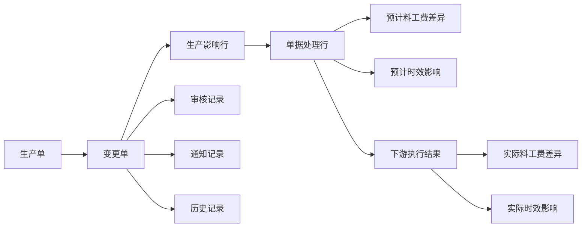
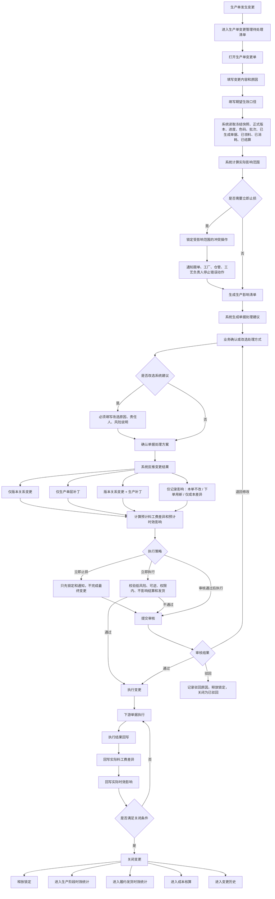

# 生产单变更管理产品设计方案

## 1. 背景与目标

生产单创建后，生产现场仍会不断发生变化：技术包发布新正式版、物料缺货、工艺异常、纸样尺码调整、印花染色返工、核价变化、交期变化、质量返工等。

如果系统只提供「切换技术包版本」或「打生产补丁」两个入口，会把系统概念提前暴露给业务人员。业务人员真正知道的是「变了什么」「从哪里开始改」「已经发生的部分怎么办」。系统应该读取生产事实，计算实际影响范围，给出下游单据处理建议，再反推这是版本关系变更、生产补丁，还是两者都有。

本方案目标：

- 让业务人员按业务语言发起生产单变更。
- 系统自动计算受影响的色码、批次、工序、数量和单据。
- 下游配料、领料、裁剪、印花、染色、车缝、后道、结算都能感知变更。
- 成本核算能区分基准成本、预计差异、实际差异。
- 生产阶段时效监管和履约发货时效监管能拿到变更原因、影响节点和责任归因。
- 印尼工厂现场端只展示当前动作，不要求一线员工理解版本关系、补丁或完整状态机。

## 2. 设计原则

1. 左侧菜单统一叫「生产单变更管理」。
2. 不拆左侧菜单为「版本关系变更」和「打生产补丁」。
3. 业务先录入变更意图，系统再判断影响和变更类型。
4. 影响范围由系统计算，不由业务人员拍脑袋选择。
5. 冻结技术包快照代表生产单创建时的事实基线，不允许被改写。
6. 正式技术包版本代表款式标准，不因为单张生产单异常被污染。
7. 生产补丁挂在生产单上，只服务本单、本范围、本生效点。
8. 审核中不默认冻结整张生产单，只锁定受影响范围的冲突操作。
9. 立即止损不是最终变更，只是先防止继续错。
10. 变更关闭条件不是审核通过，而是单据处理、成本、时效、锁定、通知全部闭环。

## 3. 适用角色与端类型

| 角色 | 端类型 | 主要任务 | 展示原则 |
| --- | --- | --- | --- |
| 中国跟单 | FCS 管理端 | 发起变更、确认处理方式、追踪闭环 | 高密度、全链路、可追溯 |
| 生产主管 | FCS 管理端 / 主管端 | 审核、退回、驳回、强制放行 | 突出异常、风险、责任 |
| 计划 / 履约 | FCS 管理端 | 判断生产交期和发货风险 | 展示原计划、新预计、实际完成 |
| 财务 / 结算 | FCS 管理端 | 核算料工费差异、暂缓或追加结算 | 展示金额来源、责任归因、确认记录 |
| 印尼工厂主管 | 主管端 | 接收变更、安排人员、兜底异常 | 中等密度，只看本厂待处理和风险 |
| 仓管 | 员工执行端 / 主管端 | 改领、补领、退旧、确认库存 | 少选、少算、扫码优先 |
| 裁剪 / 印花 / 染色 / 车缝 / 后道员工 | 员工执行端 | 按新要求执行当前任务 | 一页一个主动作，不展示系统分类 |

## 4. 核心对象模型



| 对象 | 含义 | 关键字段 |
| --- | --- | --- |
| 生产单 | 生产执行主对象 | 生产单号、SPU、款式、冻结快照、当前版本、交期、负责人 |
| 变更单 | 一次具体变更事件 | 变更来源、变更模块、原因、生效口径、执行策略、状态 |
| 生产影响行 | 系统计算出的事实影响 | 色码、批次、工序、数量、可追回数量、不可追回数量 |
| 单据处理行 | 下游单据的处理动作 | 单据类型、单据号、处理方式、责任人、处理状态 |
| 版本关系变更 | 生产单改关联正式技术包版本 | 原版本、目标版本、生效时间、审核记录 |
| 生产补丁 | 生产单层局部例外 | 补丁模块、范围、生效点、内容、状态 |
| 成本差异行 | 料工费差异 | 差异类型、预计金额、实际金额、责任归因 |
| 时效影响行 | 节点时间影响 | 原计划、新预计、实际完成、影响天数、是否影响发货 |

## 5. 核心定义

### 5.1 版本关系变更

生产单从冻结时采用的正式技术包版本 A，改为关联另一个正式技术包版本 B。A 和 B 都不被修改，生产单只是改变「当前采用哪个正式版本」。

典型场景：

- 新正式版发布，生产单尚未开工，整单可切换。
- 新正式版发布，生产单部分开工，未发生部分切新版本，已发生部分用补丁处理。
- 当前生产单不切版本，只记录下单用新。

### 5.2 生产补丁

生产补丁是挂在生产单上的局部例外处理层。它不改冻结快照，不改正式技术包版本，只对本生产单、本范围、本生效点生效。

典型场景：

- Black / M 后续领料改用替代面料。
- M / L 尺码后续唛架使用修正纸样。
- 已领旧料不追回，未领部分改新料。
- 仅本单追加工序费用，不改变款式标准。

### 5.3 实际影响范围

实际影响范围不是业务人员选择项，而是系统计算结果。系统根据变更内容、期望生效口径、当前进度、已生成单据、已领料、已消耗、已结算数据，计算受影响的颜色、尺码、批次、工序、数量和单据。

### 5.4 立即止损

立即止损是审核前风险控制动作，不是最终变更完成。它只能先锁定受影响范围、暂停继续错误执行、通知责任人。最终仍需进入审核或执行闭环。

## 6. 信息架构

左侧菜单：`生产单变更管理`

页面结构：

| 区域 | 维度 | 内容 |
| --- | --- | --- |
| 生产单变更清单 | 生产单 + 变更事件 | 待处理、审核中、已止损、待执行、有成本差异、有发货风险 |
| 变更单详情 | 一次变更 | 变更内容、原因、生效口径、当前状态、负责人 |
| 生产影响区 | 影响行 | 受影响色码、批次、工序、数量、可追回 / 不可追回 |
| 单据处理区 | 单据处理行 | 配料、领料、裁剪、印花、染色、菲票、车缝、结算怎么处理 |
| 成本区 | 成本差异行 | 预计料工费、实际料工费、责任归因 |
| 时效区 | 时效影响行 | 原计划、新预计、实际完成、是否影响发货 |
| 记录区 | 日志 | 审核、退回、驳回、改选原因、通知、执行记录 |

不建议做 7 个并列页签。推荐做「清单 + 详情处理链路」，详情内用步骤、折叠区或锚点承载完整闭环。

## 7. 主业务流程



## 8. 变更来源、变更模块与生效口径

### 8.1 变更来源

变更来源回答「为什么发生」。

| 来源 | 说明 |
| --- | --- |
| 技术包发布新正式版 | PCS 发布新正式版，可能影响生产单 |
| 物料短缺 / 替代料 | 原物料不能继续供应或需要替代 |
| 工艺现场异常 | 工厂反馈当前工艺不可做或需调整 |
| 纸样 / 尺码 / 花型调整 | 技术资料被修正 |
| 核价 / 成本异常 | 物料、工价、费用核算有误 |
| 交期 / 发货要求变化 | 平台、买手、渠道要求变化 |
| 质量问题 / 返工要求 | 已生产部分出现质量问题 |

### 8.2 变更模块

变更模块回答「变了什么」。

| 模块 | 示例 |
| --- | --- |
| 物料 | 主料、辅料、用量、门幅、克重、色号 |
| 工艺 | 车缝做法、后道、洗水、整烫、包装 |
| 纸样 | 纸样文件、唛架、裁剪规则 |
| 尺码 | 放码规则、尺码停做、尺码追加 |
| 花型 | 印花图案、位置、颜色、染色要求 |
| 核价 | 物料价、工价、费用 |
| 交期 | 生产交期、发货交期、加急要求 |

### 8.3 期望生效口径

期望生效口径是业务输入，不等于实际影响范围。

| 口径 | 说明 |
| --- | --- |
| 已发生不追，未发生改 | 已领、已裁、已印部分不追回，后续改 |
| 已发生也要追回 / 返工 | 已做部分也需要退料、重裁、重印、返工 |
| 指定颜色尺码生效 | 只影响部分色码 |
| 指定批次生效 | 只影响某批次 |
| 下一工序开始生效 | 从后续工序开始改 |
| 下一张生产单生效 | 本单不改，后续生产单用新规则 |
| 只做成本 / 结算差异，不改生产 | 生产不动，只改核算 |

## 9. 系统计算影响逻辑

系统按以下顺序计算：

1. 读取冻结技术包快照。
2. 读取当前关联正式技术包版本。
3. 读取最新正式技术包版本。
4. 读取颜色、尺码、批次、计划数量。
5. 读取配料、领料、裁剪、印花、染色、车缝、后道进度。
6. 读取已生成单据。
7. 读取已领料、已消耗、已结算、已付款数据。
8. 判断可逆性：可取消、可退、可改、可补、可重做、不可追回。
9. 生成生产影响行。
10. 生成单据处理建议。

输出结果：

| 结果 | 示例 |
| --- | --- |
| 受影响颜色尺码 | Black / M、Black / L |
| 受影响批次 | 第 2 批、第 3 批 |
| 受影响工序 | 领料、裁剪、印花 |
| 受影响数量 | 700 米、120 件、3 张唛架 |
| 受影响单据 | 配料单、领料单、裁剪单、印花单、结算单 |
| 不可追回部分 | 已消耗旧料 300 米 |
| 可改做部分 | 未领料 700 米 |

## 10. 单据处理规则

| 单据 | 可选处理方式 | 默认建议逻辑 |
| --- | --- | --- |
| 配料单 | 不动 / 改配 / 补配 / 取消重开 | 未确认优先改配，已确认看是否可撤回 |
| 领料单 | 不动 / 部分改领 / 退旧领新 / 追加领料 | 已领未用可退旧，已用旧料不追回 |
| 裁剪单 | 已裁不动 / 未裁改做 / 部分重裁 / 全部重裁 | 已裁看返工代价，未裁优先改做 |
| 印花单 | 当前单改做 / 取消重开 / 下批生效 / 不处理 | 未开印可改，已开印需审核 |
| 染色单 | 当前单改做 / 取消重开 / 下批生效 / 不处理 | 染缸已开通常不直接改 |
| 菲票 | 保留 / 作废重打 / 补打差异 | 已打印但未交出可作废重打 |
| 车缝 / 后道工单 | 当前单改做 / 部分返工 / 下道提醒 / 不处理 | 已交出优先本单按旧或补丁差异 |
| 结算单 | 不影响 / 追加差异 / 扣减差异 / 暂缓结算 | 已结算不回改，新增差异 |

业务改选系统建议时，必须填写原因、责任人和风险说明。

## 11. 执行策略与锁定规则

### 11.1 执行策略

| 执行策略 | 使用场景 | 系统动作 |
| --- | --- | --- |
| 立即止损 | 继续做会扩大损失 | 先锁定受影响范围，通知停止错误动作 |
| 立即执行 | 低风险、可逆、权限内、不影响结算或发货 | 直接执行，并进入统一回写闭环 |
| 审核通过后执行 | 影响正式版本关系、结算、发货、重大成本 | 审核通过后执行 |

### 11.2 锁定规则

| 状态 | 锁定规则 |
| --- | --- |
| 草稿 | 不锁定 |
| 已止损 | 锁定受影响范围的冲突操作 |
| 待审核 / 审核中 | 锁定受影响范围的冲突操作 |
| 高风险变更 | 可暂停整单 |
| 审核通过 | 执行并释放锁定 |
| 审核驳回 / 撤销 | 释放锁定，原方案继续 |

示例：只变更 Black / M 面料时，只锁定 Black / M 的领料、裁剪、结算确认，不影响 White / S 继续生产。

## 12. 状态设计

| 状态 | 含义 | 可执行动作 |
| --- | --- | --- |
| 待补充 | 变更内容或原因不完整 | 补充信息、撤销 |
| 待计算影响 | 等系统读取事实并计算影响 | 重新计算、取消 |
| 待确认方案 | 系统已建议，业务待确认 | 确认、改选、叫主管 |
| 已止损 | 已锁定风险范围，未完成最终变更 | 提交审核、取消止损 |
| 待审核 | 已提交审核 | 催审、撤回 |
| 审核中 | 审核人处理中，受影响范围锁定 | 审核通过、退回、驳回 |
| 退回修改 | 审核要求调整处理方式 | 修改后重提 |
| 已驳回 | 释放锁定，进入历史 | 查看原因 |
| 待执行 | 审核通过，等待下游执行 | 通知下游 |
| 执行中 | 下游单据处理中 | 跟踪单据 |
| 部分完成 | 部分单据已处理 | 继续跟踪 |
| 已关闭 | 单据、成本、时效、通知全部闭环 | 查看历史 |
| 已撤销 | 发起方撤销，释放锁定 | 查看历史 |

## 13. 成本核算设计

### 13.1 计算公式

```text
生产单最终成本 = 冻结快照基准成本 + 变更实际差异成本
```

审核前展示预计差异，执行完成后回写实际差异。

### 13.2 料工费分类

| 类别 | 内容 | 示例 |
| --- | --- | --- |
| 料差 | 新旧物料价差、补料、退料、报废、额外运费 | 未领 700 米改新料，按 700 米算价差 |
| 工差 | 新增工序、返工、重裁、重印、重染、取消工序扣减 | 增加加固线，每件增加工价 |
| 费用差 | 加急费、重开版费、重开缸费、额外物流、异常处理费 | 花型已制版后改图，产生重开版费 |
| 责任归因 | 买手、技术包、物料、工厂、平台决策、外部原因 | 买手临时改款导致返工 |

### 13.3 已发生部分处理

已发生部分不重算整张生产单，只计算差异。

示例：旧料已领 300 米且已消耗，未领 700 米改新料。成本处理为：

- 300 米旧料保留原成本。
- 700 米按新旧料差计算料差。
- 如果 300 米因质量或返工报废，再新增报废成本差异。

## 14. 时效监管设计

每次变更都生成时效影响记录，为生产阶段和履约发货时效监管准备数据。

| 字段 | 含义 |
| --- | --- |
| 影响节点 | 配料、领料、裁剪、印花、染色、车缝、后道、发货 |
| 原计划时间 | 变更前计划 |
| 新预计时间 | 变更后预计 |
| 实际完成时间 | 执行完成后回写 |
| 影响天数 | 延期或追回 |
| 是否影响生产交期 | 是否影响生产单交付 |
| 是否影响发货交期 | 是否传递到 OMS / 履约 |
| 责任归因 | 买手、技术包、物料、工厂、平台、外部 |
| 是否通知下游 | 计划、仓管、工厂、财务、客服、渠道 |

关闭变更时，必须回写实际完成时间和实际影响天数。

## 15. 下游感知设计

下游只展示与自己有关的动作，不展示完整复杂链路。

| 角色 / 页面 | 展示内容 | 文案示例 |
| --- | --- | --- |
| 生产单列表 | 变更数量、审核状态、锁定范围、风险 | 有变更 2、审核中、Black / M 领料已锁定 |
| 生产单详情 | 当前版本、补丁、影响摘要 | 当前采用正式版 v1.1，存在 1 条物料补丁 |
| 配料 | 改配、补配、取消重开 | Black / M 后续改配 FAB-B02 |
| 领料 | 改领、退旧领新、追加领料 | 未领 700 米改领 FAB-B02 |
| 裁剪 | 已裁不动、未裁改做、重裁 | 未铺布部分用新面料 |
| 印花 / 染色 | 当前单改做、取消重开、下批生效 | 第 2 批取消重开 |
| PDA 一线 | 短句动作 | Black / M 改领 FAB-B02 |
| 财务 | 差异来源、金额、责任 | 料差 +IDR 1,200,000，责任：物料异常 |
| 计划 / 履约 | 新预计时间、发货风险 | 预计延期 2 天，影响发货 |

## 16. 印尼工厂现场端规则

员工执行端遵循：

- 少读：只展示当前任务和当前动作。
- 少想：不展示版本关系、补丁、状态机。
- 少算：剩余、差异、可退、可改由系统算。
- 少选：能扫码就扫码，能系统带出就带出。
- 少填：员工最多确认数量、拍照、叫主管。
- 主管兜底：异常、强制放行、差异处理都进入主管处理。

员工端禁用或后置的信息：

- 技术包版本关系。
- 补丁类型。
- 完整审核记录。
- 成本核算明细。
- 全链路状态机。

员工端必须展示的信息：

- 当前对象。
- 当前动作。
- 关键数量和单位。
- 是否被锁定。
- 出错后找谁。

## 17. 业务场景覆盖清单

### 17.1 技术包版本类

| 编号 | 场景 | 默认处理 |
| --- | --- | --- |
| 1 | 新技术包正式版发布，生产单未开始 | 建议版本关系变更 |
| 2 | 新技术包发布，已配料未领料 | 计算配料影响，建议改配 |
| 3 | 新技术包发布，已领料未裁剪 | 建议部分改领或退旧领新 |
| 4 | 新技术包发布，已铺布未裁 | 立即止损，暂停铺布，判断是否换料 |
| 5 | 新技术包发布，已裁剪部分 | 已裁不动或部分重裁 |
| 6 | 新技术包发布，已印花 | 判断当前单改做或下批生效 |
| 7 | 新技术包发布，已染色 | 判断重染、下批生效或不处理 |
| 8 | 新技术包发布，已车缝 | 多数建议本单按旧、下单用新 |
| 9 | 新技术包发布，已结算部分 | 不回改已结算，追加差异 |
| 10 | 新技术包发布但只影响核价 | 仅生成成本差异，不改生产 |

### 17.2 物料类

| 编号 | 场景 | 默认处理 |
| --- | --- | --- |
| 11 | 主面料缺货，未领料 | 改配替代料 |
| 12 | 主面料缺货，已领部分 | 已领不追，未领改新 |
| 13 | 主面料缺货，已裁部分 | 已裁不动，未裁改料 |
| 14 | 主面料缺货，需要全部换料 | 退旧领新，重算料差 |
| 15 | 辅料缺货，如拉链、纽扣 | 补配替代辅料，影响车缝 / 后道 |
| 16 | 色号替代 | 指定颜色影响，其他颜色不动 |
| 17 | 面料门幅变化 | 重算用量、排料和裁剪影响 |
| 18 | 面料克重变化 | 影响核价、质量和工艺 |
| 19 | 面料缩水率变化 | 影响纸样、裁剪和尺码风险 |
| 20 | 面料价格变化 | 只生成料差或核价补丁 |

### 17.3 工艺类

| 编号 | 场景 | 默认处理 |
| --- | --- | --- |
| 21 | 工艺新增一道加固线 | 影响车缝工序和工价 |
| 22 | 工艺取消一道工序 | 扣减工价，通知后续不做 |
| 23 | 工艺做法改动但未开工 | 直接改后续工单 |
| 24 | 工艺做法改动且已部分开工 | 当前单改做或部分返工 |
| 25 | 工艺要求只影响某尺码 | 生成尺码维度影响行 |
| 26 | 后道包装方式变化 | 影响后道工单和费用 |
| 27 | 洗水 / 整烫要求变化 | 影响后道工艺和费用 |
| 28 | 特殊工艺外发改内做 | 改工单责任方和费用 |
| 29 | 特殊工艺内做改外发 | 增加外协费用和时效风险 |
| 30 | 工厂反馈工艺不可做 | 变更工艺或生成异常待审核 |

### 17.4 纸样、尺码、色码类

| 编号 | 场景 | 默认处理 |
| --- | --- | --- |
| 31 | 纸样尺寸改动，未裁剪 | 建议切版本或纸样补丁 |
| 32 | 纸样尺寸改动，已裁剪 | 判断重裁、返工或本单按旧 |
| 33 | 放码规则变化 | 影响尺码维度和裁剪 |
| 34 | 某尺码停做 | 影响生产数量、物料和结算 |
| 35 | 某尺码追加 | 追加物料、工序和时效 |
| 36 | 某颜色停做 | 锁定该颜色相关单据 |
| 37 | 某颜色追加 | 新增颜色相关配料和工单 |
| 38 | 色码用料对应关系变化 | 指定色码改配 / 改领 |

### 17.5 花型、印花、染色类

| 编号 | 场景 | 默认处理 |
| --- | --- | --- |
| 39 | 花型图案调整，未印花 | 修改印花工单 |
| 40 | 花型图案调整，已制版 | 产生重开版费 |
| 41 | 花型图案调整，已印部分 | 已印不动、未印改版或重印 |
| 42 | 印花位置变化 | 影响纸样定位和印花工单 |
| 43 | 印花颜色变化 | 影响印花材料和重印费用 |
| 44 | 染色颜色调整 | 影响染色工单和色差风险 |
| 45 | 染缸已开 | 通常不直接改，需审核 |
| 46 | 染色失败要求重染 | 生成返工、费用、时效影响 |

### 17.6 核价、结算、成本类

| 编号 | 场景 | 默认处理 |
| --- | --- | --- |
| 47 | 核价漏算物料 | 追加料差 |
| 48 | 核价漏算工序 | 追加工差 |
| 49 | 核价工价调整 | 改结算差异，不一定改生产 |
| 50 | 工厂报价异常 | 暂缓结算，走审核 |
| 51 | 旧料已消耗 | 不追回，记录不可追回成本 |
| 52 | 旧料可退仓 | 退料并计算差异 |
| 53 | 旧料报废 | 记录报废成本和责任 |
| 54 | 已生成配料单未确认 | 取消重开或改配 |
| 55 | 已生成领料单未领料 | 改领 |
| 56 | 已领料未消耗 | 退旧领新或部分改领 |
| 57 | 工厂已确认结算 | 暂缓或追加差异 |
| 58 | 部分已付款 | 不回改已付款，新增差异单 |

### 17.7 生产进度和现场执行类

| 编号 | 场景 | 默认处理 |
| --- | --- | --- |
| 59 | 已铺布未裁剪 | 停止铺布，判断是否重铺 |
| 60 | 已裁剪未交出 | 部分重裁或继续 |
| 61 | 已交出车缝厂 | 多数不改实物，走补丁 / 差异 |
| 62 | 菲票已打印 | 保留、作废重打或补打差异 |
| 63 | 外协工单已发出 | 通知外协暂停或改做 |
| 64 | 买手要求加急 | 产生加急费和时效重排 |
| 65 | 平台临时改交期 | 记录平台责任，影响履约 |
| 66 | 物料到货延迟 | 记录物料责任，影响配料 / 领料 |
| 67 | 工厂执行延误叠加变更 | 分开记录工厂延误和变更影响 |
| 68 | 变更后仍可追回交期 | 记录追回天数 |
| 69 | 变更导致无法按期发货 | 通知 OMS / 客服 / 渠道 |
| 70 | 变更只影响下一单 | 当前单不处理，记录下单用新 |

### 17.8 审核、执行、补丁冲突类

| 编号 | 场景 | 默认处理 |
| --- | --- | --- |
| 71 | 本单按旧，下单用新 | 不改单据，只记录版本差异 |
| 72 | 仅提醒确认 | 不锁定，要求责任人确认 |
| 73 | 生产补丁已生效后又有新正式版 | 评估补丁是否被新版本吸收 |
| 74 | 同一生产单多次补丁冲突 | 后补丁需标明覆盖或并存 |
| 75 | 版本关系变更后仍需局部例外 | 生成版本关系变更 + 生产补丁 |
| 76 | 审核中业务要求继续生产 | 只允许不受影响范围继续 |
| 77 | 审核中必须继续受影响范围 | 高权限强制放行，并留原因 |
| 78 | 审核驳回 | 释放锁定，原方案继续，关闭为已驳回 |
| 79 | 审核退回修改 | 回到单据处理确认 |
| 80 | 执行完成后发现处理错了 | 新建二次变更，不覆盖历史 |

## 18. 统计口径

| 指标 | 口径 |
| --- | --- |
| 有变更生产单数 | 有变更单的生产单 |
| 生效补丁数 | 状态为已生效的生产补丁 |
| 版本关系变更数 | 生产单切换正式版本次数 |
| 变更导致延期天数 | 新预计时间减原计划时间 |
| 变更实际延期天数 | 实际完成时间减原计划时间 |
| 变更后追回天数 | 预计延期减实际延期 |
| 影响发货单数 | 变更传递到履约发货风险 |
| 料差金额 | 物料差异总额 |
| 工差金额 | 工序、返工、重裁差异 |
| 费用差金额 | 加急、重开版、物流等费用 |
| 改选系统建议次数 | 业务改选并填写原因的次数 |

## 19. 当前原型承接建议

当前原型已有 `/fcs/production/changes` 页面和生产单技术包版本关系、变更请求、生产补丁等领域数据。后续页面演进建议：

1. 左侧菜单和页面标题使用「生产单变更管理」。
2. 清单展示生产单维度风险和待处理状态。
3. 详情展示单张变更单的完整闭环。
4. 当前已有版本关系、补丁、差异、进度限制信息可保留。
5. 新增展示重点应放在生产影响行、单据处理行、预计 / 实际成本差异、预计 / 实际时效影响。
6. 下游页面只展示与本角色有关的动作，不展示完整系统分类。
7. PDA 只展示短句动作，不展示版本关系和补丁类型。

## 20. 原型治理自查

本方案遵守 HiGood 印尼工厂现场协同设计要求：

- 管理端允许高密度展示完整链路。
- 主管端突出异常、锁定、待安排、待复核。
- 员工执行端只展示当前任务、当前对象、当前动作、当前结果。
- 不让一线员工理解版本关系、补丁、完整状态机。
- 不让一线员工手算剩余、差异、可退、可改数量。
- 异常和强制放行必须有主管兜底。
- 危险动作需要锁定、二次确认或审核。
- 操作人、时间、原因、责任、通知、执行结果必须留痕。

本文件为产品设计规格，未改动 `src/` 原型文件，因此不需要新增原型审查记录。进入原型实现阶段时，如果改动 `src/pages/`、`src/components/`、`src/data/`、`src/router/` 或 `src/main-handlers/`，必须新增或更新 `docs/prototype-review-records/` 下的审查记录，并运行 `npm run check:prototype-design-governance`。
