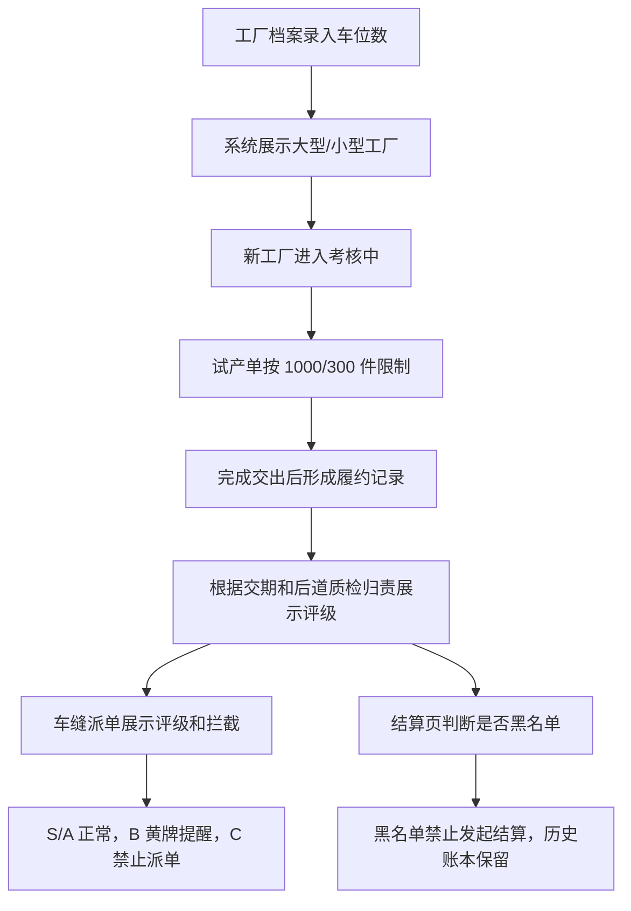

# 三方车缝工厂评级与派单结算拦截产品设计

日期：2026-07-07

## 1. 背景

当前三方工厂派单主要依赖 PPIC 和跟单人员经验判断，容易出现以下问题：

- 新合作工厂未经过试单验证就承接大货，冷启动风险高。
- 工厂交期和质量表现没有在派单动作前形成明确提示。
- 黄牌工厂是否适合继续接单，缺少页面化判断依据。
- 黑名单工厂如果仍被误派单或误发起结算，会造成管理追责和财务风险。

本设计面向 HiGood 原型仓库，不建设真实后端评分系统，而是在现有工厂档案、车缝分配工作台、对账单生成页面中补齐可演示的风控闭环。

## 2. 产品目标

本期目标是让系统在两个关键动作前给出明确约束：

1. 派单前：PPIC 选择三方车缝工厂时，能看到评级、试单状态和派单建议，并对高风险工厂进行提醒或拦截。
2. 结算前：跟单或结算人员发起对账结算时，系统禁止黑名单工厂生成新对账单或发起结算。

本期设计强调业务表达和原型可演示，不做真实数据库、真实定时任务、真实 API 校验和真实权限体系。

## 3. 设计范围

### 3.1 本期纳入

- 第三方车缝工厂评级展示。
- 新合作工厂试单限制。
- 车缝派单时的评级提示和拦截。
- 黑名单工厂禁止发起结算。
- 扣分来源和近 90 天生产时效的 Mock 展示。
- 现有工厂档案、车缝分配、结算页面的局部增强。

### 3.2 本期不纳入

- 真实 `vendor_master`、`po_record`、`score_config`、`audit_log` 数据表。
- 真实每日评分任务。
- 真实 API 层强校验。
- 真实 PPS 处罚流程。
- 全品类第三方工厂治理。
- 复杂权限体系或审批流。
- 新建大型通用组件体系。

## 4. 适用范围

会议口径中，评级和派单规则原则上可覆盖所有第三方工厂，包括只做裁片的工厂。但当前业务重点是三方车缝厂，其他类型工厂今年产量已够，不是当前外找重点。

因此本期原型按以下口径处理：

- 主场景聚焦第三方车缝工厂。
- 页面文案可说明规则可扩展到其他第三方工厂。
- Mock 数据中可保留少量裁片工厂说明，但不展开完整页面治理。

## 5. 角色与使用场景

| 角色 | 主要页面 | 任务 | 页面应回答的问题 |
| --- | --- | --- | --- |
| PPIC | 车缝分配工作台 | 选择承接工厂并派单 | 这个工厂能不能接？适合接什么单？是否需要提醒？ |
| 工厂管理/业务主管 | 工厂档案/工厂管理 | 判断转正、延长考核或拉黑 | 评级为什么是这个结果？扣分来自哪里？ |
| 跟单/结算人员 | 对账单生成/结算页 | 按账本发起结算 | 这个工厂能不能发起结算？历史账本怎么处理？ |
| 管理层 | 工厂档案、风险汇总 | 查看合作风险 | 哪些工厂正常、黄牌、黑名单？规则是否生效？ |

## 6. 核心业务对象

### 6.1 三方车缝工厂

用于表达工厂当前合作风险。

关键字段：

- 工厂名称。
- 工厂类型：第三方车缝工厂。
- 车位数。
- 工厂规模：大型工厂或小型工厂。
- 合作状态：考核中、正常合作、黑名单。
- 当前评级：S、A、B、C。
- 质量分。
- 交付分。
- 是否允许派单。
- 是否允许发起结算。

### 6.2 试产单

试产单用于新合作工厂考核。会议明确：试产单在工厂模块标记，不影响生产管理台账里的生产类型。

关键规则：

- 新合作工厂初始进入考核中。
- 先派一个试单，合格后再发第二个单。
- 试单结果用于主管判断转正、拉黑或延长考核。

### 6.3 履约记录

履约记录用于解释评分来源，不作为真实系统流水实现。

关键字段：

- 生产单号。
- 单据类型：试产单或常规单。
- 派单时间。
- 计划交期。
- 实际交期。
- 发料数量。
- 合格数量。
- 返工数量。
- 瑕疵数量。
- 归责到工厂的瑕疵数量。
- 交期扣分。
- 质量扣分。
- 人工扣分。
- 结果说明。

### 6.4 评级快照

评级快照是本期原型的核心 Mock 数据。它承载页面展示所需的结论，避免把真实后端表结构搬进原型。

关键字段：

- 工厂 ID。
- 工厂名称。
- 车位数。
- 工厂规模。
- 合作状态。
- 当前评级。
- 总分。
- 交期扣分。
- 质量扣分。
- 人工扣分。
- 首单上限。
- 派单策略。
- 结算策略。
- 最近评级原因。
- 是否禁止发起结算。

### 6.5 结算账本

结算账本继续作为历史事实存在。黑名单限制不删除账本、不清零金额、不自动撤销历史对账单，只限制新的结算发起动作。

## 7. 状态与评级规则

### 7.1 合作状态

| 状态 | 含义 | 派单影响 | 结算影响 |
| --- | --- | --- | --- |
| 考核中 | 新合作工厂，正在试单 | 只能接试产单，不能接常规车缝派单 | 不做黑名单结算拦截 |
| 正常合作 | 已通过试单或评级可合作 | 根据评级提示或正常派单 | 可按账本发起结算 |
| 黑名单 | 已判定不可合作 | 禁止派单 | 禁止发起新结算 |

### 7.2 评级规则

| 评级 | 页面标签 | 合作解释 | 派单规则 | 结算规则 |
| --- | --- | --- | --- | --- |
| S | 优先 | 表现优秀 | 正常可选 | 可发起结算 |
| A | 标准 | 表现稳定 | 正常可选 | 可发起结算 |
| B | 黄牌 | 可转正，但需控制风险 | 可选，提交前提示小单、简单单优先 | 可发起结算 |
| C | 黑名单 | 不再合作 | 禁止选择 | 禁止发起结算 |

B 级不是硬拦截。系统只做明确提示和确认，具体是否分单由人工判断。

## 8. 试单与考核规则

### 8.1 工厂规模判断

- 车位数大于等于 30：大型工厂。
- 车位数小于 30：小型工厂。
- 车位数为空：无法判定规模，需要先补全工厂档案。

### 8.2 首单数量限制

| 工厂规模 | 首单上限 |
| --- | --- |
| 大型工厂 | 1000 件 |
| 小型工厂 | 300 件 |

超过上限时，页面提示：

> 试用期首单超过上限：大型工厂最多 1000 件，小型工厂最多 300 件。

### 8.3 考核期口径

考核期不是固定 90 天，而是：

> 从工厂接第一个单开始，到完成交出为止。

考核结束后，主管根据试单交期、质量和人工扣分结果，选择：

- 转正。
- 拉黑。
- 延长考核期。

## 9. 评分口径

本期只做页面化展示，不建设真实评分引擎。

### 9.1 交期扣分

交期扣分按计划交期和实际交期对比：

- 每延期 1 天扣 5 分。
- 计划 7 月 5 日交，7 月 6 日交扣 5 分。
- 计划 7 月 5 日交，7 月 7 日交扣 10 分。

### 9.2 质量扣分

不良品 = 返工 + 瑕疵。

质量数据来源于后道工厂质检单，并且只计算归责到该工厂的瑕疵原因。

示例：

- 总件数：300 件。
- 瑕疵：30 件。
- 返工：30 件。
- 不良率：20%。
- 质量扣分：20 分。

### 9.3 人工扣分

人工扣分用于补充表达违规、配合度、异常处理等情况。本期只作为 Mock 展示字段，不做配置后台。

### 9.4 近 90 天生产时效

近 90 天只用于生产时效查看，不作为新工厂考核期。

统计口径：

- 按派单时间统计。
- 展示近 90 天派单数、平均延期天数、准时交付率、不良率和异常单据。

页面必须明确提示：

> 近 90 天仅用于生产时效查看，不代表新工厂考核期。新工厂考核期以首单接单到完成交出为准。

## 10. 页面设计

### 10.1 工厂档案/工厂管理页

#### 页面目标

解释某个三方车缝工厂为什么是当前评级，以及评级如何影响派单和结算。

#### 新增区块：评级与派单风控

区块内容：

- 当前评级：S、A、B、C。
- 当前状态：考核中、正常合作、黑名单。
- 车位数与规模，例如：36 个车位 · 大型工厂。
- 试单限制，例如：首单上限 1000 件。
- 派单策略，例如：正常派单、黄牌提醒、禁止派单。
- 结算策略，例如：可发起结算、禁止发起结算。
- 扣分构成：交期扣分、质量扣分、人工扣分、总分。
- 最近评级原因。
- 最近履约记录。

#### 黑名单展示

黑名单工厂在顶部风险区显示：

> 该工厂已拉黑，不能派单，不能发起结算。历史账款需主管处理。

#### 最近履约记录

展示 3 到 5 条代表性记录即可，字段包括：

- 生产单号。
- 单据类型。
- 计划交期。
- 实际交期。
- 延期天数。
- 发料数量。
- 返工数量。
- 瑕疵数量。
- 本单扣分。
- 结果说明。

### 10.2 车缝分配工作台

#### 页面目标

PPIC 在选择承接工厂时，直接看到工厂评级和风险，并在高风险场景被提醒或拦截。

#### 工厂候选列表展示

每个候选工厂展示：

- 工厂名称。
- 当前评级。
- 合作状态。
- 车位数与规模。
- 派单建议。

#### 派单交互规则

| 工厂状态/评级 | 可选状态 | 提交行为 | 提示 |
| --- | --- | --- | --- |
| S/A | 可选 | 正常提交 | 无额外阻断 |
| B | 可选 | 提交前确认 | 该工厂为黄牌工厂，建议只分配小单、简单单。请确认已人工判断。 |
| C/黑名单 | 不可选 | 禁止提交 | 该工厂已拉黑，不能派单。请更换工厂。 |
| 考核中 | 常规派单不可选 | 禁止提交 | 该工厂还在试用期，只能接试产单。 |
| 车位数为空 | 不可试单提交 | 禁止提交 | 请先补全工厂车位数，再判断试单上限。 |

#### 试产单超量提示

当试产单数量超过上限时：

> 试用期首单超过上限：大型工厂最多 1000 件，小型工厂最多 300 件。

#### 成功反馈

普通成功：

> 已创建车缝派单草稿，承接工厂：{工厂名称}。

B 级确认后成功：

> 已记录黄牌工厂派单确认。

### 10.3 对账单生成/结算页

#### 页面目标

防止黑名单工厂被误发起结算，同时保留历史账本事实。

#### 工厂选择规则

- 正常合作工厂：可选择，可生成对账单。
- B 级工厂：可选择，可生成对账单。
- 黑名单工厂：可查看账本，不可生成对账单，不可发起结算。

#### 黑名单拦截文案

> 该工厂已拉黑，不能发起结算。请主管处理历史账款。

#### 历史账本处理

- 继续展示账本金额和来源。
- 继续展示质检扣款。
- 不删除历史账本。
- 不清零金额。
- 不自动改为已结算。
- 已生成的历史对账单继续存在，只增加风险提示。

### 10.4 近 90 天生产时效查看

#### 页面目标

辅助主管查看工厂近期表现，避免把 90 天误解成考核期。

#### 展示内容

- 近 90 天派单数量。
- 平均延期天数。
- 准时交付率。
- 质量异常次数。
- 不良率。
- 最近异常单据。

#### 固定说明

> 近 90 天仅用于生产时效查看，不代表新工厂考核期。新工厂考核期以首单接单到完成交出为准。

## 11. Mock 数据设计

### 11.1 工厂样例

至少准备 5 个工厂样例。

| 样例 | 车位 | 状态 | 评级 | 页面用途 |
| --- | --- | --- | --- | --- |
| S 级大厂 | 60 | 正常合作 | S | 正常派单、正常结算 |
| A 级标准工厂 | 38 | 正常合作 | A | 标准合作样例 |
| B 级黄牌工厂 | 26 | 正常合作 | B | 派单黄牌提醒 |
| C 级黑名单工厂 | 45 | 黑名单 | C | 禁止派单、禁止结算 |
| 考核中小厂 | 18 | 考核中 | A 或未评级 | 试单限制样例 |

### 11.2 评级快照类型

```ts
interface FactoryRatingSnapshot {
  factoryId: string
  factoryName: string
  factoryTierLabel: '第三方工厂'
  factoryTypeLabel: '车缝工厂'
  machineCount: number
  factoryScaleLabel: '大型工厂' | '小型工厂'
  cooperationStatusLabel: '考核中' | '正常合作' | '黑名单'
  currentGrade: 'S' | 'A' | 'B' | 'C' | '未评级'
  totalScore: number
  deliveryPenaltyScore: number
  qualityPenaltyScore: number
  manualPenaltyScore: number
  firstTrialLimitQty: number
  dispatchPolicyLabel: string
  settlementPolicyLabel: string
  latestReason: string
  blacklistSettlementBlocked: boolean
}
```

### 11.3 履约明细类型

```ts
interface FactoryRatingPerformanceRecord {
  recordId: string
  factoryId: string
  productionOrderNo: string
  orderTypeLabel: '试产单' | '常规单'
  dispatchDate: string
  planDeliveryDate: string
  actualDeliveryDate: string
  delayDays: number
  dispatchQty: number
  reworkQty: number
  defectQty: number
  factoryResponsibleDefectQty: number
  deliveryPenaltyScore: number
  qualityPenaltyScore: number
  manualPenaltyScore: number
  resultLabel: string
}
```

## 12. 文案规范

页面不展示英文状态码。

| 系统口径 | 页面展示 |
| --- | --- |
| TRIAL | 考核中 |
| ACTIVE | 正常合作 |
| BLACKLISTED | 黑名单 |
| Soft Block | 黄牌提醒 |
| Hard Block | 禁止操作 |

关键提示文案：

- 该工厂还在试用期，只能接试产单。
- 试用期首单超过上限：大型工厂最多 1000 件，小型工厂最多 300 件。
- 该工厂为黄牌工厂，建议只分配小单、简单单。
- 该工厂已拉黑，不能派单。请更换工厂。
- 该工厂已拉黑，不能发起结算。请主管处理历史账款。
- 近 90 天仅用于生产时效查看，不代表新工厂考核期。

## 13. 异常与边界

| 场景 | 处理 |
| --- | --- |
| 工厂无评级 | 显示未评级，派单时提示缺少评级，请主管确认 |
| 车位数为空 | 无法判断大/小厂，禁止试单提交，提示补全车位数 |
| B 级派单 | 允许继续，但必须提示黄牌风险 |
| 黑名单派单 | 禁止选择和提交 |
| 黑名单结算 | 可查看账本，不可生成新对账单 |
| 历史已生成对账单 | 不自动撤销，只展示风险提示 |
| 90 天统计 | 只作为生产时效查看，不作为考核期 |
| 评级变化 | 本期只展示最近评级原因，不做完整审计日志 |

## 14. 现有代码落点

本期应尽量复用现有页面和数据边界。

| 领域 | 现有文件 |
| --- | --- |
| 工厂基础类型 | `src/data/fcs/factory-types.ts` |
| 工厂 Mock 数据 | `src/data/fcs/factory-mock-data.ts` |
| 工厂档案页 | `src/pages/factory-profile.ts` |
| 车缝分配工作台 | `src/pages/sewing-dispatch-workbench.ts` |
| 结算/对账页 | `src/pages/statements.ts` |
| 预结算账本类型 | `src/data/fcs/store-domain-settlement-types.ts` |

如需新增数据文件，建议只新增：

`src/data/fcs/third-party-factory-rating.ts`

不建议新建真实仓储层、接口层或评分引擎。

## 15. 信息流



## 16. 验收标准

产品验收应覆盖以下结果：

- 工厂档案能解释评级、规模、试单上限和扣分来源。
- 车缝派单能展示 S、A、B、C 的差异。
- B 级工厂可继续派单，但有黄牌提醒。
- C 级或黑名单工厂不能派单。
- 考核中工厂不能接常规车缝派单。
- 小厂试产单超过 300 件有提示。
- 大厂试产单超过 1000 件有提示。
- 黑名单工厂不能生成对账单或发起结算。
- 历史账本仍可查看。
- 近 90 天统计不被写成考核期。
- 页面文案全部中文展示，不出现英文状态码。

## 17. 验证要求

实现完成后至少运行：

- `npm run check:prototype-design-governance`
- 与本改动相关的最小页面检查脚本，如新增则使用对应 `scripts/check-*.ts`
- `npm run build`

涉及页面原型、Mock 数据、路由或交互时，必须新增或更新 `docs/prototype-review-records/` 下的原型审查记录。

## 18. 实现建议顺序

1. 新增或扩展三方车缝工厂评级 Mock 数据。
2. 工厂档案页增加评级说明区块。
3. 车缝分配工作台增加评级展示、B 级提醒和 C 级拦截。
4. 对账单生成页增加黑名单结算拦截。
5. 增加近 90 天生产时效说明或摘要卡片。
6. 补原型审查记录。
7. 运行最小验证和构建检查。
