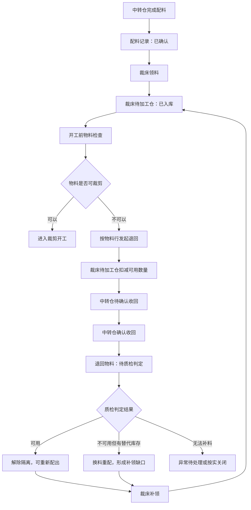
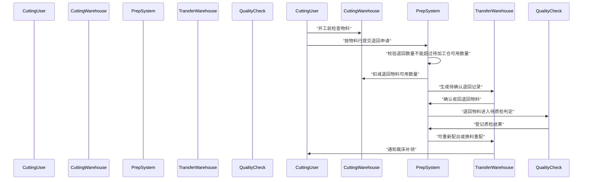

# 裁床领料后物料异常退回中转仓设计

## 背景

裁床从中转仓领料后，物料已经进入裁床待加工仓。开工前检查物料时，可能发现色差、布面瑕疵、规格不符、卷号不符、数量不符或辅料型号不符，导致物料不能继续裁剪。

这个场景发生在“配料确认”和“裁床领料入待加工仓”之后，不属于配料阶段的打回。

## 设计结论

采用“保留原配料记录，新增领料后退回事实”的模型。

- 原配料记录保持 `已确认`，不回退为 `被打回`。
- 退回记录挂在领料记录和物料行上。
- 支持按物料行部分退回；当一条领料记录下所有物料行全部退回时，自然派生为整条领料记录全部退回。
- 裁床待加工仓按退回数量扣减可用库存。
- 中转仓确认收回后，退回物料进入 `待质检判定`，暂不可再次配出。

## 业务对象

### 配料记录

配料记录表示中转仓曾经完成配料并确认可领。

退回中转仓后，原配料记录仍保持 `已确认`。这样可以保留配料端历史事实，避免把“配料阶段打回”和“领料后质量异常退回”混成同一种状态。

### 领料记录

领料记录表示裁床从中转仓领取物料，并将物料入裁床待加工仓。

领料记录需要派生退回状态：

- `未退回`：没有发生退回。
- `部分退回`：至少一个物料行发生退回，但仍有可用数量留在裁床待加工仓。
- `全部退回`：该领料记录下所有可退物料行均已全部退回。

### 退回记录

退回记录是新的业务事实，记录裁床已领物料因异常退回中转仓。

字段口径：

- 领料记录
- 配料记录
- 物料行
- 退回数量
- 单位
- 卷数或件数
- 退回原因
- 备注
- 图片凭证
- 发起人
- 发起时间
- 中转仓确认人
- 中转仓确认时间
- 质检判定状态

退回原因必填，图片凭证选填。

退回原因使用结构化选项：

- 色差 / 缸差
- 布面瑕疵
- 规格 / 克重不符
- 卷号 / 批次不符
- 数量不符
- 辅料型号不符
- 其他

## 流程图



## 状态图

```mermaid
stateDiagram-v2
    [*] --> "已确认配料"
    "已确认配料" --> "已入待加工仓": "裁床领料"
    "已入待加工仓" --> "部分退回": "按物料行退回部分数量"
    "已入待加工仓" --> "全部退回": "所有物料行全部退回"
    "部分退回" --> "待质检判定": "中转仓确认收回"
    "全部退回" --> "待质检判定": "中转仓确认收回"
    "待质检判定" --> "可重新配出": "质检可用"
    "待质检判定" --> "换料重配": "问题料不可用且有替代库存"
    "待质检判定" --> "无法补料": "无可替换库存"
    "可重新配出" --> "待补领"
    "换料重配" --> "待补领"
    "待补领" --> "已入待加工仓": "裁床补领"
```

## 时序图



## 页面影响

### 领料管理

在已领料记录中增加 `退回物料` 入口。

操作员选择物料行，填写退回数量和退回原因。退回原因必填，图片凭证选填。

页面展示：

- 已领数量
- 已退数量
- 待加工仓剩余数量
- 退回状态
- 退回原因
- 中转仓确认状态

### 配料详情

在领料记录区域展示关联退回明细。

原配料记录仍显示 `已确认`，但物料行旁边展示退回数量、补领缺口和处理状态。

### 中转仓处理

增加 `退回待质检` 状态或筛选。

中转仓确认收回后，退回物料默认进入待质检判定，不能直接进入可配库存。

### 裁床开工前物料检查

如果存在未处理的补领缺口，开工判断应提示：

`物料退回待处理，暂不可开工`

## 校验规则

- 退回数量必须大于 0。
- 退回数量不能超过该物料行在裁床待加工仓的可用数量。
- 退回原因必填。
- 图片凭证选填。
- 已发起退回但中转仓未确认前，该数量不可再次用于裁剪。
- 中转仓收回后，退回物料在质检判定前不可再次配出。

## 异常与边界

- 部分退回后，未退回数量仍可用于裁剪。
- 全部退回后，该领料记录派生为 `全部退回`。
- 质检可用时，可重新生成补领通知，不新建原始配料记录。
- 换料重配时，使用原物料行的补领缺口继续处理。
- 无法补料时，由主管在异常处理中决定按实关闭或重新排期。

## 不做范围

- 不把配料记录回退为 `被打回`。
- 不新增一套独立于领料记录的退料大单模型。
- 不要求裁床主管审批退回。
- 不强制上传图片凭证。
- 不处理真实后端、真实库存数据库和接口联调。

## 规格自检

- 占位符：无。
- 内部一致性：配料记录、领料记录、退回记录三类事实边界清晰。
- 范围：聚焦裁床领料后物料异常退回中转仓，可用一个实现计划覆盖。
- 模糊性：已明确退回原因必填、图片选填、无需裁床主管审批、退回后默认待质检判定。
