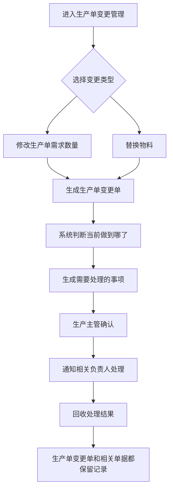
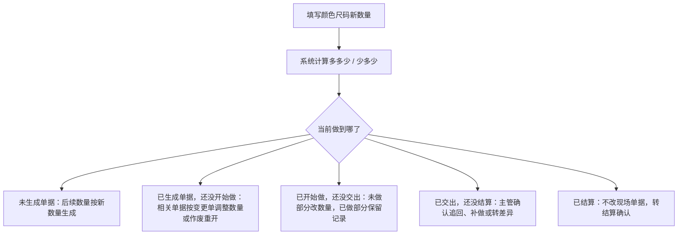
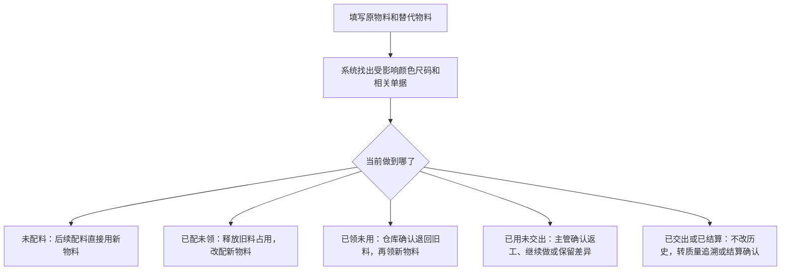

# 生产单变更两类场景收敛设计

## 1. 背景

当前生产单变更原型覆盖场景过多，页面呈现容易变成“什么都能处理”的复杂工作台。业务人员进入页面后，不容易判断自己应该点哪里、填什么、谁来确认、哪些下游单据会被影响。

本轮设计先只保留两类明确业务场景：

1. 修改生产单需求数量。
2. 替换物料。

两类场景入口分开，但提交后进入同一套生产单变更流程。同一套流程用于主管确认、相关负责人处理、结果回收和记录追溯。

## 2. 设计目标

1. 页面第一屏只突出两类入口：`修改生产单需求数量`、`替换物料`。
2. 两类入口提交后都生成同一种 `生产单变更单`。
3. 系统按当前生产进度自动判断影响范围，不让业务人员手算。
4. 生产主管确认系统生成的处理事项，可以调整处理动作和负责人，但必须填写原因。
5. 所有被调整过的下游单据必须留痕，不能静默覆盖历史。
6. 页面文案使用业务人员能理解的动作词，避免系统抽象词。

## 3. 角色与端类型

| 角色 | 端类型 | 主要任务 |
| --- | --- | --- |
| 业务发起人 / 跟单 | 管理端 | 发起数量变更或物料替换，填写业务原因和目标结果 |
| 生产主管 | 主管端 | 确认系统生成的处理事项，必要时调整处理动作和负责人 |
| 相关负责人 | 主管端 / 员工执行端 | 处理配料、领料、裁剪、工艺、仓库、质检、结算等具体事项 |
| 管理人员 | 管理端 | 查看处理进度、责任记录、单据留痕和结算影响 |

设计按角色和任务分层。管理端可以展示完整流程和相关单据；主管端突出待确认和异常；员工执行端只展示当前对象、当前动作、当前数量和当前结果。

## 4. 总体流程

## 5. 页面结构

### 5.1 首页

首页不再以大量场景列表作为第一入口。第一屏只保留两个主入口：

- `修改生产单需求数量`
- `替换物料`

列表展示已发起的生产单变更单，建议字段：

| 字段 | 说明 |
| --- | --- |
| 变更单 | 生产单变更单号 |
| 变更类型 | 修改生产单需求数量 / 替换物料 |
| 生产单 | 生产单号、款式、颜色尺码摘要 |
| 当前做到哪了 | 用业务语言表达当前生产进度 |
| 需要处理的事 | 例如配料数量要改、仓库确认退料 |
| 进度 | 待主管确认、已通知相关负责人、处理中、已处理完成、转结算确认 |

### 5.2 详情页

两类场景共用详情页结构：

1. 变更内容。
2. 当前事实。
3. 影响数量或影响物料。
4. 需要处理的事。
5. 处理记录。
6. 相关单据记录。

## 6. 场景一：修改生产单需求数量

### 6.1 表单字段

| 字段 | 说明 |
| --- | --- |
| 生产单 | 必填，选择要变更的生产单 |
| 变更原因 | 必填，说明客户改单、计划缩量、追加数量等原因 |
| 希望从什么时候开始处理 | 必填，例如从现在开始、从下一次配料开始、从下一次裁剪开始 |
| 色码数量表 | 必填，按颜色 + 尺码填写当前数量和新数量 |
| 附件 / 备注 | 可选，用于客户改单截图或沟通记录 |

数量变更必须按 `颜色 + 尺码` 填写新数量，不支持只填总数后让系统自动拆分。系统自动计算每个颜色尺码多多少、少多少。

### 6.2 判断逻辑

### 6.3 需要处理的事

| 当前做到哪了 | 页面展示 | 可能需要谁处理 |
| --- | --- | --- |
| 未生成单据 | 后续数量按新数量生成 | 生产计划 |
| 已生成单据，还没开始做 | 配料数量要改 / 裁剪数量要改 | 配料负责人、裁剪负责人 |
| 已领未用 | 已领未用要退回 | 仓库负责人 |
| 已开始做，还没交出 | 未做部分改数量，已做部分保留记录 | 工序负责人、生产主管 |
| 已交出，还没结算 | 少做的数量需要补做 / 多做的数量转差异 | 生产主管、质检、仓库 |
| 已结算 | 已结算数量转结算确认 | 财务 / 结算人员 |

## 7. 场景二：替换物料

### 7.1 表单字段

| 字段 | 说明 |
| --- | --- |
| 生产单 | 必填，选择要变更的生产单 |
| 原物料 | 必填，选择需要替换的物料 |
| 替代物料 | 必填，选择新物料 |
| 适用颜色 + 尺码 | 必填或按物料适用范围带出 |
| 希望从哪里开始用新物料 | 必填，例如从下一次配料开始、从下一次领料开始、从下一次裁剪开始 |
| 替换原因 | 必填，例如原物料不到货、客户确认换料、现场确认替代 |
| 附件 / 备注 | 可选，例如客户确认、供应商缺料证明、物料图片 |

替换物料不设置“适用批次”。物料替换按生产单、物料、颜色尺码和开始使用节点判断。

### 7.2 判断逻辑

### 7.3 需要处理的事

| 当前做到哪了 | 页面展示 | 可能需要谁处理 |
| --- | --- | --- |
| 未配料 | 后续配料改用新物料 | 配料负责人 |
| 已配未领 | 旧料还没领，先取消占用 | 配料负责人、仓库负责人 |
| 已领未用 | 旧料已领未用，需要仓库确认退料 | 仓库负责人 |
| 已领未用且需要新料 | 新物料需要补领 | 仓库负责人、领料负责人 |
| 已用未交出 | 旧料已经用掉，需要主管确认是否返工 | 生产主管、工序负责人、质检 |
| 已交出或已结算 | 已完成部分保留记录，差价转结算确认 | 质检、财务 / 结算人员 |

## 8. 主管确认规则

系统先生成需要处理的事项。生产主管确认时：

1. 可以调整处理动作。
2. 可以调整负责人或负责模块。
3. 必须填写调整原因。
4. 不允许修改系统读取到的生产事实。
5. 危险动作必须二次确认，例如作废单据、确认不追回、转结算确认。

主管确认后，页面状态不写“已分发委托”，改写为：

- `已通知相关负责人`
- `处理中`
- `需要补充确认`
- `已处理完成`
- `转结算确认`

## 9. 留痕规则

数量和物料可以调整，但历史不能被覆盖。

### 9.1 生产单变更单留痕

生产单变更单必须记录：

- 变更类型。
- 变更原因。
- 发起人和发起时间。
- 主管确认人、确认时间和确认意见。
- 数量变更前后明细，或原物料和替代物料。
- 影响的颜色尺码。
- 影响的相关单据。
- 每个相关负责人处理结果。

### 9.2 被调整单据留痕

被调整过的配料单、领料单、裁剪单、工艺单、结算单上必须能看到：

- 来自哪张生产单变更单。
- 原数量 / 原物料。
- 新数量 / 新物料。
- 改了多少。
- 谁确认。
- 什么时候确认。
- 原因。

示例文案：

- `本单已按变更单 BG-001 调整：120 件 → 90 件。`
- `本单已按变更单 BG-002 改用新物料 FAB-B02。`
- `旧料已领未用，仓库已确认退回 36 米。`

## 10. 文案规则

页面不使用系统抽象词。

| 不使用 | 改成 |
| --- | --- |
| 已分发委托 | 已通知相关负责人 |
| 执行对象 | 当前要处理的单据 / 当前要处理的物料 |
| 来源记录 | 来自哪张变更单 |
| 状态流转 | 现在做到哪了 |
| 链路 | 相关单据 |
| 写回 | 已同步到相关单据 |
| 投影 | 页面不展示该词 |

按钮文案优先使用具体动作：

- `发起数量变更`
- `发起物料替换`
- `确认处理事项`
- `通知相关负责人`
- `查看相关单据`
- `确认退料`
- `确认补做`
- `转结算确认`

## 11. 异常与兜底

必须提供主管兜底路径：

- 系统无法判断当前进度时，显示 `需要主管确认`。
- 数量超出可调整范围时，阻断提交，并显示可调整数量。
- 物料已使用但是否返工不明确时，交给主管确认。
- 已结算场景不允许静默改单据，只能转结算确认。
- 相关负责人处理失败时，记录失败原因，并回到主管处理。

## 12. 验收标准

1. 首页只突出两类入口：修改生产单需求数量、替换物料。
2. 两类入口生成同一种生产单变更单。
3. 修改数量必须按颜色 + 尺码填写新数量。
4. 替换物料不出现“适用批次”字段。
5. 系统自动展示当前做到哪了，不让用户心算或猜测。
6. 主管能确认和调整处理事项，调整必须填写原因。
7. 被改过的相关单据必须显示来自哪张生产单变更单。
8. 页面不出现“已分发委托”“执行对象”“来源记录”“状态流转”“链路”“写回”“投影”等抽象文案。
9. 数量全部带单位，差异直接显示多 / 少多少。
10. 已完成或已结算部分不能被覆盖，只能保留记录、质量追溯或转结算确认。
