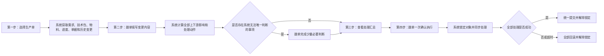
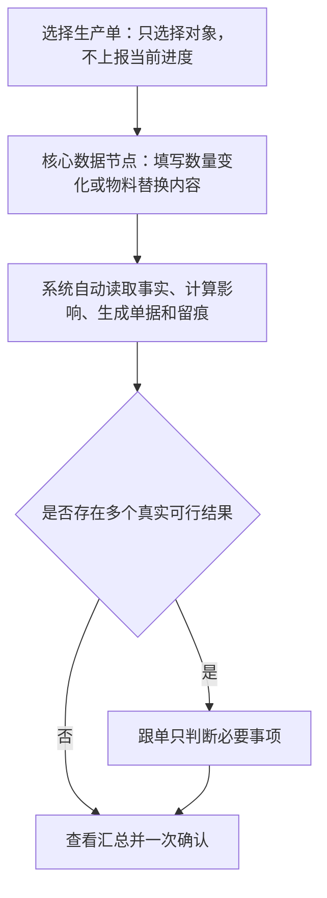
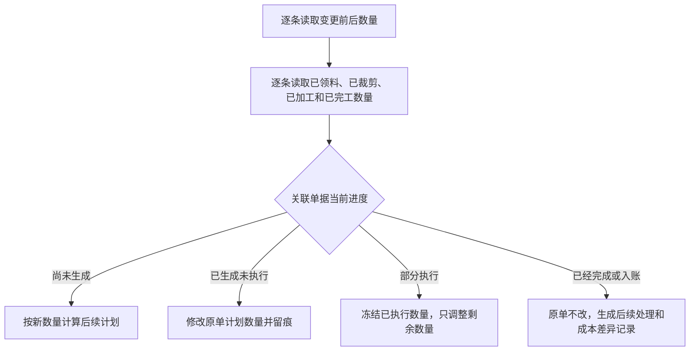
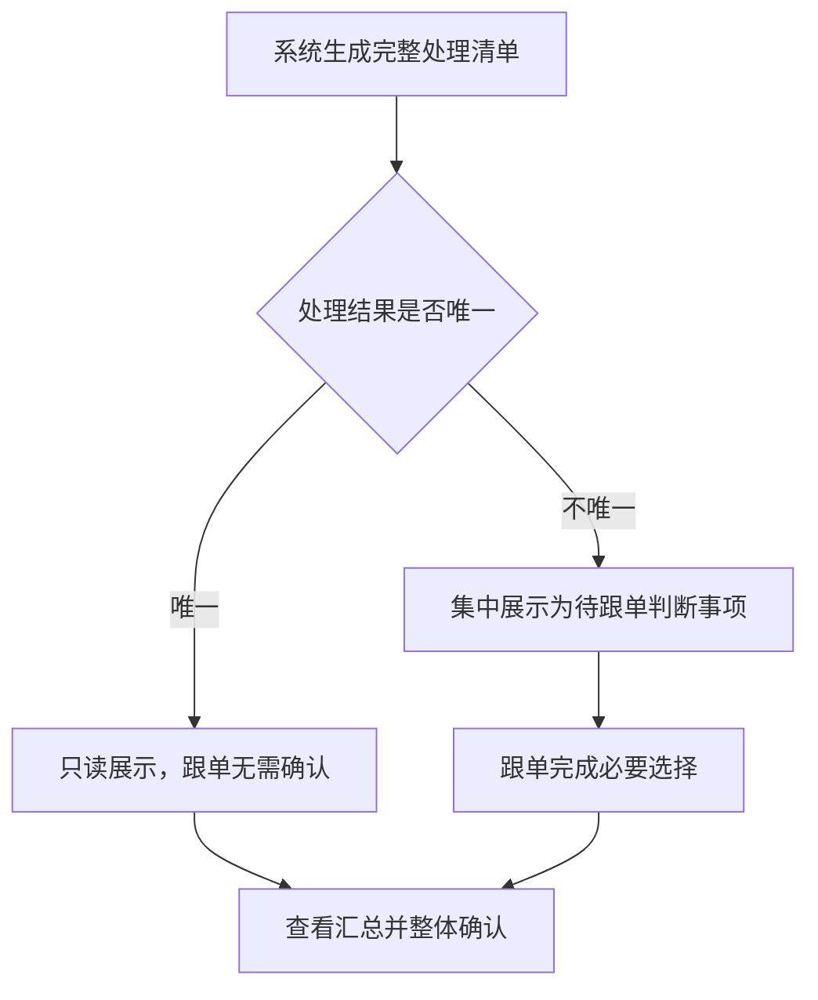
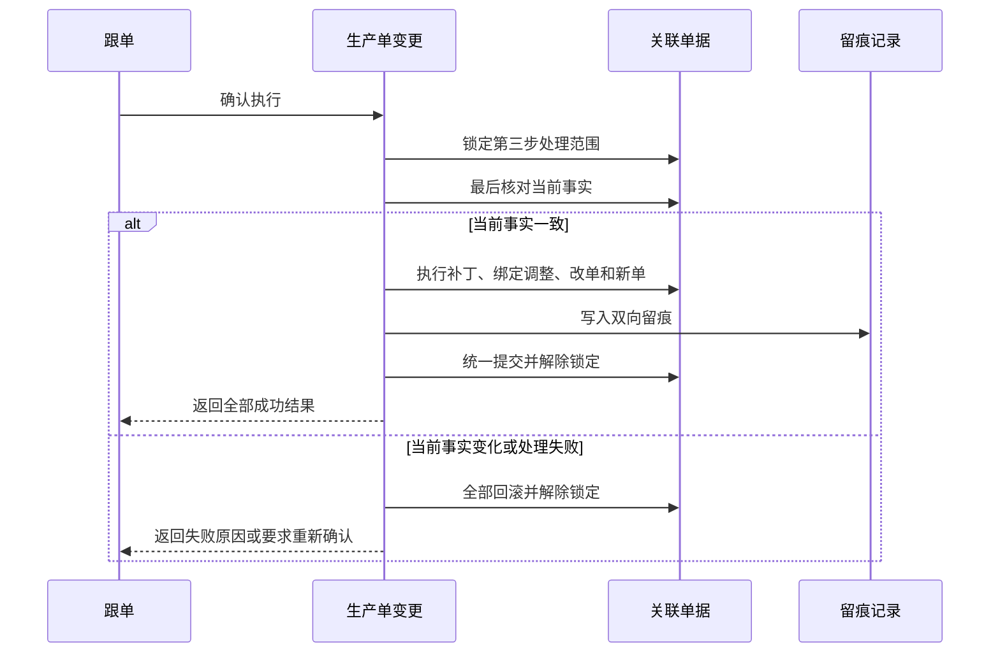
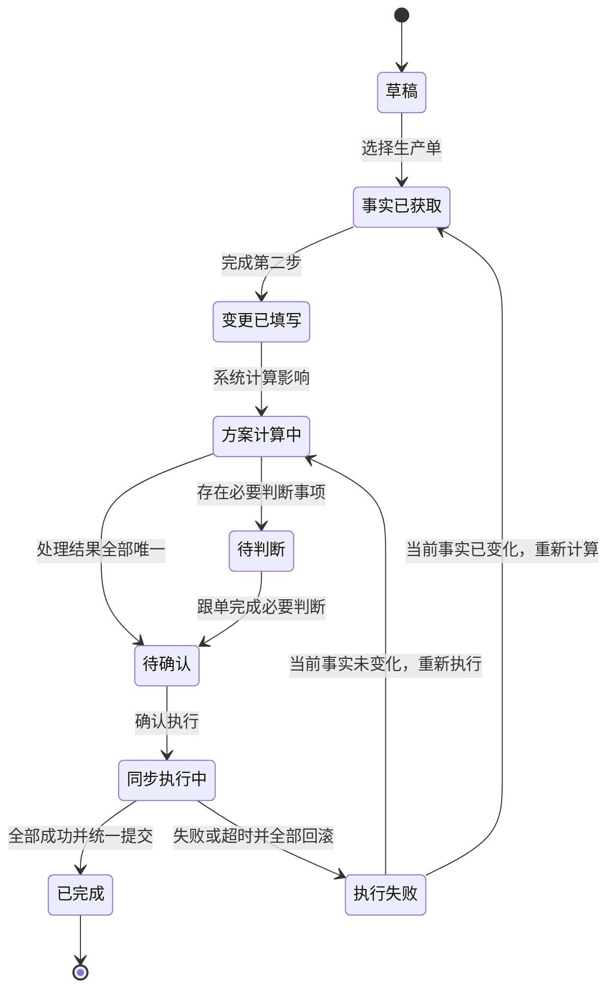

# 生产单变更最终设计

> 状态：已确认
>
> 日期：2026-07-10
>
> 本文取代 `2026-07-09-production-order-change-two-scenarios-design.md` 中关于主管确认、负责人处理、总数量修改、物料适用范围和异步执行的设计。

## 1. 设计结论

生产单变更只覆盖两类业务场景：

1. 修改生产单需求明细数量。
2. 替换物料。

两类场景使用两张独立表单，但共用同一套四步流程：

1. 选择生产单，系统获取全部当前事实。
2. 跟单填写变更内容。
3. 系统生成上下游处理方案，跟单只判断系统无法唯一决定的事项。
4. 系统同步执行，全部成功后统一提交，任一失败或超时全部回滚。

整个流程由跟单独立完成，不设置主管逐项确认、负责人接单处理或额外审批环节。

## 2. 核心设计原则

### 2.1 详细流程不等于人工数据化

系统内部流程可以细致到每张生产单、每条需求明细和每张上下游单据，但不能把每个系统处理节点都变成跟单需要填写或确认的数据节点。

- 客观事实由系统读取，跟单不重复上报。
- 能由规则唯一确定的处理由系统生成，跟单不重复确认。
- 只有存在多个真实可行结果、且选择会改变业务结果时，才要求跟单判断。
- 第四步只做一次整体确认，不逐单执行。

### 2.2 状态是事实的展示结果

页面不让跟单手工维护生产进度。系统根据需求、物料、领料、裁剪、加工、完工、库存、结算等事实计算当前状态和可处理范围。

### 2.3 历史事实不可覆盖

已领料、已裁剪、已加工、已完工、已入库和已结算事实保持原值。生产单变更只能：

- 调整未执行计划。
- 调整部分执行单据中的未执行数量。
- 对已经完成的事实生成补充、退回、转用、处置、补产或成本差异记录。

### 2.4 结果必须原子生效

生产单补丁、正式版本绑定、原单修改、新单生成和留痕必须作为一次同步操作提交。不能出现部分单据已经生效、其他单据仍在后台处理的中间状态。

## 3. 统一四步流程

### 3.1 人工数据节点

正常情况下，第二步是唯一的人工数据写入点。第三步只在必要时出现少量判断控件。

## 4. 最终变更结果

生产单变更最终结果严格限定为三种：

| 最终结果 | 业务含义 |
| --- | --- |
| 生产单打补丁 | 只改变当前生产单，保留该生产单专用例外 |
| 生产单与技术包正式版本绑定关系调整 | 当前生产单完整执行新的正式技术要求 |
| 生产单打补丁 + 正式版本绑定关系调整 | 当前生产单保留历史事实并通过补丁过渡，后续生产单使用新的正式版本 |

跟单不直接选择最终结果类型。系统根据第二步的业务选择自动判断，并在第三步展示结果和原因。

## 5. 场景一：修改需求明细数量

### 5.1 变更对象

数量变更的对象是生产需求中的具体明细，不是生产单总数量。

每条需求明细由以下信息确定：

- 商品编码。
- 颜色。
- 尺码。
- 数量。

生产单汇总需求数量由全部生效明细自动相加，页面不提供总数量编辑框。

### 5.2 第二步表单

跟单只填写：

| 字段 | 规则 |
| --- | --- |
| 需求明细 | 按商品、颜色、尺码展示 |
| 变更后数量 | 逐条填写，系统自动计算增加或减少数量 |
| 变更原因 | 必填 |

系统自动完成：

- 汇总生产单总需求数量。
- 识别已有明细增加或减少。
- 识别新增需求明细。
- 将数量改为 `0` 的明细标记为“已取消”，但不删除历史。
- 读取每条明细的已领料、已裁剪、已加工和已完工事实。

### 5.3 新增和取消明细

- 允许新增原需求中不存在的颜色、尺码明细。
- 新增明细被当前正式版本覆盖时，只生成生产单补丁。
- 新增明细必须依赖新的正式版本时，结果为“生产单打补丁 + 正式版本绑定关系调整”。
- 允许将明细数量改为 `0`。
- 数量为 `0` 表示取消该明细，原需求数量、变更原因和已发生事实继续保留。

### 5.4 逐明细影响计算

生产单总数量的净变化不能用于直接驱动下游。例如两条明细分别增加 20 件和 30 件、另一条明细减少 30 件，虽然总数只增加 20 件，下游仍必须按三条明细分别处理。

### 5.5 结果规则

数量变更必然包含生产单补丁。

| 情况 | 最终结果 |
| --- | --- |
| 已有需求明细数量变化 | 生产单打补丁 |
| 新增明细且当前正式版本已覆盖 | 生产单打补丁 |
| 新增明细且必须使用新的正式版本 | 生产单打补丁 + 正式版本绑定关系调整 |

## 6. 场景二：替换物料

### 6.1 变更对象

替换对象始终是物料，不是需求明细。

需求明细只用于系统计算各颜色、尺码中有多少生产数量使用旧物料、有多少生产数量改用新物料。需求明细原数量不因物料替换而改变。

### 6.2 新物料选择

唯一限制是新物料必须存在于系统中。

- 不按幅宽、克重、成分、缩水率、计量单位或其他规格限制选择。
- 系统可以展示新旧物料差异，但差异不能禁用选择或阻止下一步。

### 6.3 第二步表单

跟单填写：

| 字段 | 规则 |
| --- | --- |
| 原物料 | 从当前生产单关联物料中选择 |
| 新物料 | 从系统物料中选择 |
| 替换方式 | 剩余数量改用新物料 / 全部数量改用新物料 |
| 影响范围 | 只处理当前生产单 / 后续生产单也替换 |
| 替换生产数量 | 系统根据当前事实计算建议值，跟单确认，也可以修改 |
| 颜色尺码分配 | 系统自动分配，跟单需要时可以调整；合计必须等于替换生产数量 |

跟单修改的是使用新物料的生产数量，例如 240 件。需要多少米或多少码新物料由系统计算。

### 6.4 两种替换方式

#### 剩余数量改用新物料

- 已经使用旧物料形成的生产事实继续保留并计入生产单。
- 尚未使用物料的剩余生产数量改用新物料。
- 跟单可以调整系统建议的替换生产数量。
- 当前生产单明确记录新旧物料并存。

#### 全部数量改用新物料

- 当前生产单全部需求数量以新物料为目标。
- 已经使用旧物料形成的裁片、半成品和成品不再计入当前需求。
- 旧物料生产结果必须形成后续去向记录。
- 系统按全部需求计算新物料和补产数量。

### 6.5 后续生产单

选择“后续生产单也替换”时，系统自动查找：

- 同款已经创建、尚未开工的生产单。
- 同款已经创建、已经开工的生产单。
- 以后新建的同款生产单。

已经完成并结算的历史生产单不修改。

- 尚未开工的生产单直接完整切换到新正式版本。
- 已经开工的生产单逐张展示当前事实，由跟单选择剩余数量替换或全部数量替换。
- 以后新建的生产单直接使用新的正式版本。

### 6.6 结果矩阵

| 当前生产单替换方式 | 后续生产单 | 最终结果 |
| --- | --- | --- |
| 剩余数量替换 | 不替换 | 生产单打补丁 |
| 全部数量替换 | 不替换 | 生产单打补丁 |
| 剩余数量替换 | 也替换 | 生产单打补丁 + 正式版本绑定关系调整 |
| 全部数量替换 | 也替换 | 正式版本绑定关系调整 |

### 6.7 上下游处理

| 当前事实 | 系统处理 | 是否需要跟单判断 |
| --- | --- | --- |
| 物料需求尚未下发 | 减少旧物料需求，新增新物料需求 | 否 |
| 旧物料已备料未发料 | 解除旧料占用，准备新物料 | 否 |
| 旧物料已发料未使用 | 保留发料事实，生成退料处理 | 通常不需要 |
| 旧物料已铺布或裁剪 | 保留事实，根据替换方式计算旧料结果和补产 | 存在多个真实去向时需要 |
| 旧物料已加工或完工 | 保留事实；剩余替换时继续计入，全部替换时退出当前需求 | 存在多个真实去向时需要 |
| 旧物料成本已入账 | 原记录不回写，生成变更成本差异 | 存在多个有效归属时需要 |

## 7. 第三步：系统处理与跟单判断边界

第三步不是逐项确认表，也不是完全只读页面。

### 7.1 系统自动处理并只读展示

- 当前事实、数量和单据状态。
- 未执行计划的增加、减少或取消。
- 原单能否修改、只能修改剩余数量或必须另建处理单据。
- 补料、退料、补产和成本差异计算。
- 最终变更类型。
- 全部留痕关系和同步执行顺序。

### 7.2 跟单完成必要判断

仅当系统无法得到唯一处理结果时显示判断控件，例如：

- 旧物料裁片、半成品或成品的实际去向。
- 已开工后续生产单采用剩余数量替换还是全部数量替换。
- 多个真实可行处理方式并存时的选择。
- 成本确实存在多个有效归属时的归属选择。
- 偏离系统建议时的简短原因。

第三步汇总展示：

- 最终变更类型。
- 需求、物料、补料、退料、取消和补产数量。
- 将修改、取消和新建的关联单据。
- 成本差异和预计交期变化。
- 待跟单判断事项数量。

## 8. 第四步：同步原子执行

### 8.1 执行规则

第三步完成全部计算和必要判断，第四步只执行已确认方案，不重新判断业务规则，不临时新增处理对象。

### 8.2 锁定规则

锁定范围是第三步处理清单内的全部生产单和关联单据。

锁定期间：

- 允许查看列表、详情和处理进度。
- 不允许修改、删除、提交、撤回、取消、下发、接收或完成。
- 页面和操作接口统一提示：`生产单正在变更，请稍后再试`。

成功提交或全部回滚后立即解除锁定。异常中断时必须自动回滚并释放锁，不能留下永久锁定。

### 8.3 超时和重新执行

- 执行超时后中止本次操作并全部回滚，不转后台继续。
- 重复点击识别为同一次执行，不启动第二次。
- 失败后重新执行前重新核对全部当前事实。
- 当前事实已经变化时返回第三步重新计算和确认。

## 9. 留痕规则

### 9.1 生产单变更单

记录：

- 变更场景和最终结果类型。
- 跟单填写的核心变更内容和原因。
- 系统读取的事实版本。
- 系统自动处理项目。
- 跟单完成的必要判断项目。
- 执行时间、执行结果和失败原因。

### 9.2 被调整或新建的单据

所有关联单据必须能够看到：

- 来自哪张生产单变更单。
- 原数量或原物料。
- 新数量或新物料。
- 自动处理结果或必要判断结果。
- 操作时间和执行结果。

生产单变更单可以反向打开全部受影响单据。

## 10. 页面结构

### 10.1 列表页

- 只突出两个新增入口：`修改需求明细数量`、`替换物料`。
- 列表展示变更单号、生产单、变更场景、最终结果、处理状态、执行结果和发起时间。
- 列表和日志必须分页。

### 10.2 两张新建表单

- 共用四步导航和生产单事实摘要。
- 第二步表单内容完全独立。
- 输入时只局部更新差异和汇总，不整页重绘。
- 可调整项默认收起，需要时由跟单主动展开。

### 10.3 第三步处理方案

- 第一屏先展示结果汇总和待判断事项数量。
- 系统自动处理项默认按模块折叠展示。
- 待跟单判断项集中展示，不散落在每张单据中。
- 所有必要判断完成后才允许确认执行。

### 10.4 第四步执行结果

- 显示同步处理进度，但明确提示当前进度尚未正式生效。
- 成功后一次性展示三种最终结果之一及全部关联单据结果。
- 失败后显示失败对象、原因、回滚结果和重新执行入口。

## 11. 状态模型

## 12. 文案约束

- 页面角色统一为“跟单”。
- 不出现主管确认、负责人处理、外部需求方等角色语义。
- 不使用“已分发委托”“执行对象”“投影”“写回”“链路”等抽象词。
- 不设置物料批次类字段。
- 操作文案使用业务动作，例如：`修改需求明细数量`、`替换物料`、`查看处理方案`、`确认执行`、`返回修改`、`重新执行`。

## 13. 验收标准

1. 功能只包含修改需求明细数量和替换物料两类场景。
2. 两类场景使用独立表单和统一四步流程。
3. 数量变更按商品、颜色、尺码明细填写，不直接修改总数量。
4. 允许新增需求明细，也允许将明细改为 `0` 并保留取消记录。
5. 替换对象始终是物料；系统自动计算并允许跟单调整替换生产数量和颜色尺码分配。
6. 系统中的任意物料都可以被选择为新物料。
7. 支持剩余数量替换、全部数量替换、只处理当前生产单和后续生产单也替换。
8. 已创建的后续生产单纳入同一次变更；已开工生产单允许逐单选择替换方式。
9. 第三步的确定性处理只读展示，只有系统无法唯一判断的必要事项可操作。
10. 第四步同步执行，全部成功统一提交，失败或超时全部回滚。
11. 第三步处理范围内的单据在执行期间只允许查看，并统一提示 `生产单正在变更，请稍后再试`。
12. 已发生生产事实不可覆盖，所有修改和新建单据双向留痕。
13. 页面不出现已否定的角色、批次和抽象系统文案。
