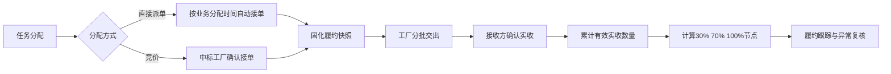

# 含车缝任务交付与回货时效设计

## 1. 文档目的

本文明确独立车缝任务以及含车缝连续工序任务的分配、接单、交付时效、阶段回货要求、实收累计、改派和生产单主工厂规则。

本设计面向当前 HiGood 产品原型，重点补齐以下业务闭环：

1. 根据任务实际覆盖工艺识别适用时效。
2. 以工厂实际接单时间启动履约时钟。
3. 以接收方确认实收数量计算阶段回货进度。
4. 按实际工厂分配结果分别考核履约。
5. 在一个生产单存在多家车缝承接工厂时，始终保留唯一主工厂。

## 2. 范围

### 2.1 本期范围

- 独立车缝任务。
- 从车缝开始、连续执行到后道包装结束的连续工序任务。
- 从裁片开始、连续执行到后道包装结束的连续工序任务。
- 直接派单和竞价分配两种分配方式。
- 分批交出、接收方确认实收、阶段履约判断和最终交付判断。
- 改派后的新旧工厂履约记录。
- 含车缝任务与生产单主工厂的关系。

### 2.2 本期不做

- 不含车缝任务的交付时效规则。
- 按任务数量设置不同时间档位。
- 通用可配置时效规则引擎。
- 因超量实收产生的仓储、结算或索赔规则改造。
- 自动裁定接收方确认延迟的最终责任。
- 真实后端、消息调度或定时任务基础设施。

## 3. 术语与业务对象

### 3.1 任务定义

任务定义用于判断任务适用哪种时效规则。

任务类型必须根据生产单冻结工艺路线和任务实际覆盖范围判断，不能根据任务名称、页面 Tab 名称或人工备注猜测。

### 3.2 工厂分配记录

每次将任务或部分任务数量交给一家工厂，都形成一条独立工厂分配记录。

分配记录至少表达：

- 生产单和任务。
- 分配数量。
- 承接工厂。
- 分配方式。
- 业务分配时间。
- 实际操作时间。
- 接单时间。
- 是否仍然有效。
- 是否为生产单主工厂。
- 改派来源或去向。

独立车缝任务可以按现有明细分配规则形成多条工厂分配记录。连续工序任务不允许按明细拆分，只能有一条有效工厂分配记录。

### 3.3 履约快照

工厂接单时，为对应分配记录生成履约快照。履约快照固化：

- 适用时效类型。
- 分配数量。
- 接单时间。
- 30%、70%和100%节点要求。
- 各节点精确截止时间。

历史履约快照不随未来规则调整而变化。

### 3.4 实收事实

实收事实是接收方对工厂交出结果的确认记录。履约累计只读取接收方已经确认、仍然有效且归属于当前分配记录的实收数量。

工厂提交交出只形成待接收记录，不立即增加履约进度。

## 4. 时效规则

| 任务范围 | 30%节点 | 70%节点 | 100%节点 |
| --- | ---: | ---: | ---: |
| 独立车缝任务 | 接单后96小时 | 接单后192小时 | 接单后216小时 |
| 车缝到包装连续任务 | 接单后120小时 | 接单后216小时 | 接单后240小时 |
| 裁片到包装连续任务 | 接单后144小时 | 接单后216小时 | 接单后288小时 |

规则不按分配数量分档。无论工厂承接多少数量，同一任务范围使用相同时间要求。

### 4.1 独立车缝任务

任务本身为独立车缝工序时，适用9天交付要求：

- 满96小时，累计有效实收比例不低于30%。
- 满192小时，累计有效实收比例不低于70%。
- 满216小时，累计有效实收比例不低于100%。

### 4.2 车缝到包装连续任务

连续任务从车缝开始，并连续覆盖到后道包装结束时，适用10天交付要求：

- 满120小时，累计有效实收比例不低于30%。
- 满216小时，累计有效实收比例不低于70%。
- 满240小时，累计有效实收比例不低于100%。

中间存在特殊工艺、装扣、熨烫或其他连续工序时，不改变该分类。不能把该类型限制为恰好只有“车缝、后道”两个节点。

### 4.3 裁片到包装连续任务

连续任务从裁片开始，并连续覆盖到后道包装结束时，适用12天交付要求：

- 满144小时，累计有效实收比例不低于30%。
- 满216小时，累计有效实收比例不低于70%。
- 满288小时，累计有效实收比例不低于100%。

中间包含车缝、特殊工艺、装扣、熨烫或其他连续工序时，仍按裁片到包装连续任务处理。

### 4.4 满24小时滚动

所有节点按接单时间满24小时滚动，不按自然日期零点或当天结束时间判断。

业务上将接单后的第一个24小时区间称为第1天；系统计算始终使用精确接单时间和累计小时数，不使用仅包含年月日的日期值。

例如工厂在7月1日15:30接单：

- 满96小时的截止时间为7月5日15:30。
- 满216小时的截止时间为7月10日15:30。
- 满240小时的截止时间为7月11日15:30。
- 满288小时的截止时间为7月13日15:30。

系统必须保存精确接单时间，不能只保存日期。

## 5. 分配与接单

### 5.1 业务分配时间

独立车缝任务和含车缝连续工序任务在分配时均允许填写业务分配时间。

规则如下：

1. 默认使用当前操作时间。
2. 允许回填过去时间。
3. 业务分配时间不得晚于确认分配动作时的系统当前时间。
4. 同时保留业务分配时间和实际操作时间，不能相互覆盖。

### 5.2 直接派单

直接派单给目标工厂后，工厂自动接单，不进入待工厂确认状态。

直接派单时：

- 自动接单时间等于回填的业务分配时间。
- 履约快照立即生成。
- 所有节点从该接单时间开始计算。

### 5.3 竞价分配

发起竞价不启动履约时钟。

中标工厂实际确认承接后：

- 接单时间取实际确认承接时间。
- 履约快照生成。
- 所有节点从实际确认承接时间开始计算。

业务分配时间仍作为分配操作事实保留，但不替代竞价场景的实际接单时间。

## 6. 数量计算与节点判断

### 6.1 履约比例

履约比例按以下口径计算：

`履约比例 = 累计有效实收数量 ÷ 当前工厂分配数量`

累计有效实收必须同时满足：

1. 接收方已经确认。
2. 归属于当前工厂分配记录。
3. 记录未作废。
4. 数量未被后续有效冲销记录抵扣。

### 6.2 目标数量

任务数量为整数件时，30%和70%的最低达标数量向上取整。

例如分配数量为101件：

- 30%节点至少实收31件。
- 70%节点至少实收71件。
- 100%节点至少实收101件。

### 6.3 超量实收

累计有效实收数量达到或超过分配数量，均视为完成100%节点。

- 超量实收不阻断履约完成。
- 履约比例不封顶，可以真实展示105%、110%等结果。
- 超量产生的仓储、结算或其他数量差异，不改变本设计中的时效达标结论。

### 6.4 节点结果

每个节点分别保留结果，不因后续追上进度而改写历史。

节点可能处于：

- 尚未到期。
- 按时达标。
- 逾期未达标。
- 逾期达标。

系统保存每个节点第一次达到目标数量的时间。

例如30%节点逾期、70%节点按时，则两项结果分别保留，不能因为70%已经按时而把30%改成按时。

## 7. 交出、实收与接收延迟

### 7.1 交出不等于实收

工厂提交交出时记录：

- 交出数量。
- 交出时间。
- 交出方。
- 对应分配记录。

此时数量不计入履约累计。

### 7.2 接收方确认

接收方确认时记录：

- 本次实收数量。
- 实收确认时间。
- 接收人。
- 与交出数量的差异。

确认完成后，实收数量才计入履约累计，并重新计算各节点结果。

如果工厂交出100件、接收方确认实收95件，本次只累计95件。

### 7.3 接收方确认延迟

如果工厂在节点截止前已经交出，但接收方在节点截止后才确认实收：

1. 履约统计仍按实收确认时间计算。
2. 节点先客观判定为逾期未达标或逾期达标。
3. 系统自动标记“接收方确认延迟”。
4. 异常记录展示受影响的交出记录、数量和延迟时长。
5. 主管可以补充责任复核结论。
6. 责任复核不得修改原始交出时间、实收确认时间和原始计算结果。

## 8. 履约状态

履约状态是接单事实、履约快照和实收事实的计算结果，不允许人员直接修改。

建议展示状态包括：

- 待接单。
- 履约中。
- 30%按时达标。
- 30%逾期达标。
- 30%逾期未达标。
- 70%按时达标。
- 70%逾期达标。
- 70%逾期未达标。
- 按时完成。
- 逾期完成。
- 逾期未完成。
- 已撤回。
- 已改派。

页面可以根据角色合并展示当前主状态，但必须能够查看三个节点的独立结果。

## 9. 改派

任务接单后撤回并重新分配给另一家工厂时：

1. 原分配记录、履约快照和历史节点结果永久保留。
2. 原工厂已经确认实收的数量继续归属于原分配记录。
3. 未完成数量按“原分配数量减去原工厂累计有效实收数量”计算，最低为0。
4. 新工厂只承接实际改派数量。
5. 新工厂形成新的分配记录和履约快照。
6. 新工厂从新的接单时间重新计算全部节点。
7. 改派原因、操作人、操作时间、原工厂和新工厂必须可追溯。
8. 原工厂在改派后才发生的迟到实收确认仍归原分配记录，不自动冲入新工厂进度。

## 10. 主工厂

### 10.1 唯一主工厂

生产单始终只有一家主工厂。

全部车缝承接工厂是分配关系，不是“多个主工厂”。系统必须将以下两类信息分开：

- 生产单唯一主工厂。
- 当前全部有效车缝承接工厂。

### 10.2 主工厂候选

以下工厂均属于主工厂候选：

- 独立车缝任务承接工厂。
- 车缝到包装连续任务承接工厂。
- 裁片到包装连续任务中实际承接车缝范围的工厂。
- 其他覆盖车缝工序的连续任务承接工厂。

“含车缝”用于判断主工厂候选，不能直接作为车缝分配工作台的页面准入条件。

### 10.3 选择规则

1. 只有一家有效车缝承接工厂时，系统自动将其设为主工厂。
2. 存在多家有效车缝承接工厂且尚未指定主工厂时，必须选择一家后才能完成当前分配。
3. 已有有效主工厂时，新增其他车缝承接工厂不得自动覆盖主工厂。
4. 有权限的人员可以主动调整主工厂。
5. 主工厂必须来自当前有效车缝承接工厂。
6. 主工厂对应的全部有效车缝分配撤回或失效后，必须重新选择主工厂。
7. 调整时记录原工厂、新工厂、调整原因、操作人和操作时间。

## 11. 页面边界

### 11.1 车缝分配工作台

只处理独立车缝任务，必须排除：

- 整单生产任务。
- 含车缝连续工序任务。
- 已被连续任务覆盖的原任务。

独立车缝按明细分给多家工厂时，在分配动作中指定主工厂。

### 11.2 连续工序任务分配

只处理任务清单已经合并形成的连续工序任务。

页面按任务覆盖范围区分：

- 车缝到包装。
- 裁片到包装。
- 其他连续工序。

连续任务本来就只能由一家工厂整体承接，页面不使用“整任务分配”作为动作名称，而是展示实际动作：

- 直接派单。
- 发起竞价。
- 暂不分配。

### 11.3 分配弹窗

独立车缝和含车缝连续任务的分配弹窗展示：

- 任务覆盖范围。
- 分配数量。
- 分配方式。
- 业务分配时间。
- 实际操作时间提示。
- 接单时间口径。
- 适用时效规则预览。
- 30%、70%和100%节点截止时间。
- 当前主工厂或主工厂选择。

以下情况阻断提交：

- 业务分配时间晚于实际操作时间。
- 分配数量无效。
- 存在多家有效车缝承接工厂但没有主工厂。
- 所选主工厂不是有效车缝承接工厂。

## 12. 页面表达

### 12.1 FCS履约跟踪

管理端按工厂分配记录展示：

- 分配数量。
- 累计已交出数量。
- 累计已确认实收数量。
- 当前实收比例。
- 当前应达节点。
- 节点目标数量。
- 距离节点剩余时间。
- 各节点第一次达标时间。
- 按时、逾期达标或逾期未达标结果。
- 接收方确认延迟异常。
- 改派和主工厂调整记录。

### 12.2 工厂执行端

PDA只展示现场执行所需内容：

- 当前任务。
- 分配数量。
- 已交出数量。
- 已确认实收数量。
- 还差多少。
- 下一个节点要求。
- 剩余时间。
- 主动作“交出”。

比例、剩余数量和剩余时间由系统计算，不让一线员工心算。

### 12.3 接收方确认

接收页面展示：

- 工厂本次交出数量。
- 接收方本次实收数量。
- 差异数量。
- 交出时间。
- 当前确认时间。
- 确认后的累计实收比例。
- 本次确认是否影响当前履约节点。

## 13. 数据流

## 14. 异常与防错

必须覆盖：

- 未来分配时间。
- 无效分配数量。
- 重复接单。
- 重复实收确认。
- 已作废或已冲销实收记录。
- 工厂交出数量与接收方实收数量不一致。
- 接收方确认延迟。
- 原工厂改派后继续发生实收确认。
- 多家车缝承接工厂但没有主工厂。
- 主工厂已不再承接有效车缝任务。

错误提示必须说明问题、原因和修正动作。员工执行端不展示“写回、投影、状态流转”等系统抽象词。

## 15. 验收场景

### 15.1 时效分类

- 独立车缝正确使用96、192、216小时节点。
- 车缝到包装正确使用120、216、240小时节点。
- 裁片到包装正确使用144、216、288小时节点。
- 中间包含其他工序时仍能根据冻结路线起止范围正确分类。

### 15.2 分配与接单

- 直接派单默认当前时间并自动接单。
- 回填过去时间后，自动接单时间同步取回填时间。
- 未来分配时间被阻断。
- 竞价在发起时不启动履约，在中标工厂确认后启动。
- 所有节点严格按满24小时计算。

### 15.3 分批交出与实收

- 工厂交出但接收方未确认时，比例不增加。
- 实收少于交出数量时只累计实收数量。
- 多次实收正确累计。
- 作废或冲销后正确重算。
- 实收达到或超过分配数量时完成。
- 超量实收正常完成并展示超过100%的比例。

### 15.4 节点结果

Mock数据至少覆盖：

- 三个节点全部按时。
- 30%逾期、70%追上、最终按时。
- 30%按时、70%逾期、最终逾期完成。
- 最终截止后仍未完成。
- 到期前交出、到期后确认，形成接收方确认延迟。
- 非整百分比数量按向上取整后的目标判断。

### 15.5 改派与主工厂

- 原工厂部分实收后改派剩余数量。
- 新工厂生成独立履约快照。
- 原工厂迟到确认不进入新工厂累计。
- 单一车缝工厂自动成为主工厂。
- 多家车缝工厂必须指定一家主工厂。
- 主工厂退出全部有效车缝承接后强制重选。
- 主工厂调整历史可追溯。

### 15.6 页面边界

- 独立车缝只进入车缝分配工作台。
- 含车缝连续任务只进入连续工序任务分配页。
- 两类任务均触发主工厂判断和履约规则。
- 连续任务始终只能由一家工厂承接。
- PDA不展示复杂规则配置，但展示还差数量、下一节点和剩余时间。
- 接收方确认后，FCS、PDA和交接页面读取同一实收事实。

## 16. 当前项目差距

当前项目已经具备任务、分配、接单时间、连续任务合并、多次交出和接收确认等基础事实，但仍存在以下差距：

1. “含车缝”判断同时被用于主工厂候选和车缝分配工作台准入，导致连续任务可能进入独立车缝工作台。
2. 连续工序任务分配页当前只提供状态动作，没有完成选择工厂、分配时间、接单和主工厂确认的完整分配闭环。
3. 当前只有接单响应时效和人工任务截止时间，没有本设计中的交付与阶段回货履约快照。
4. 当前交出完成允许较宽数量范围，不等于按接收方确认实收事实计算30%、70%和100%节点。
5. 当前生产单数据允许追加多个“主工厂”，与生产单唯一主工厂要求冲突。

后续实现应在上述直接相关边界内完成，不扩展为通用规则平台或无关领域重构。
