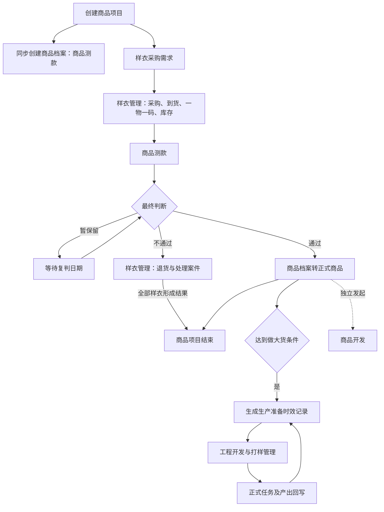
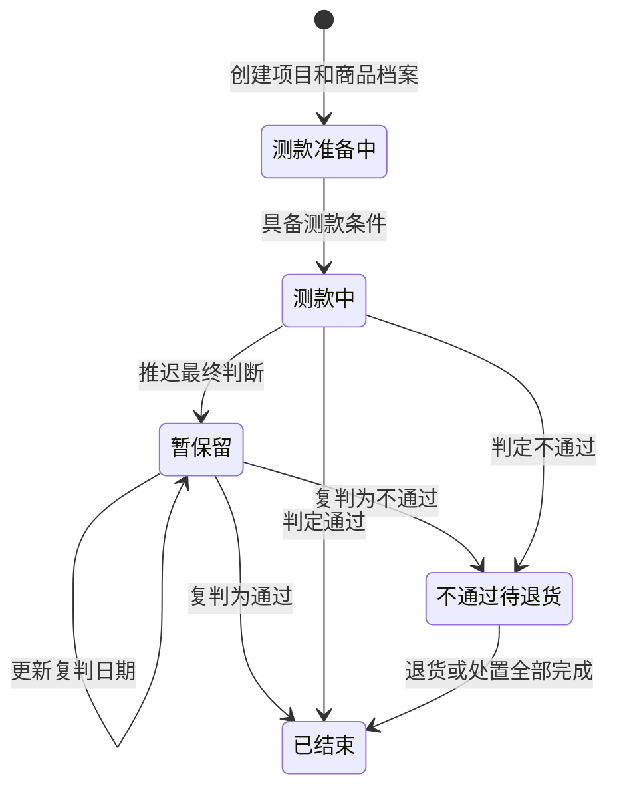
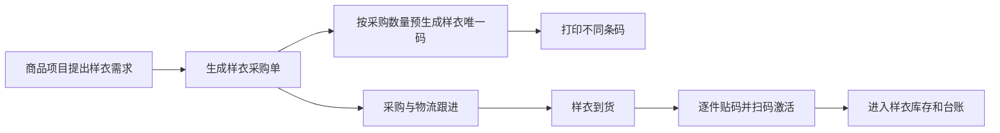
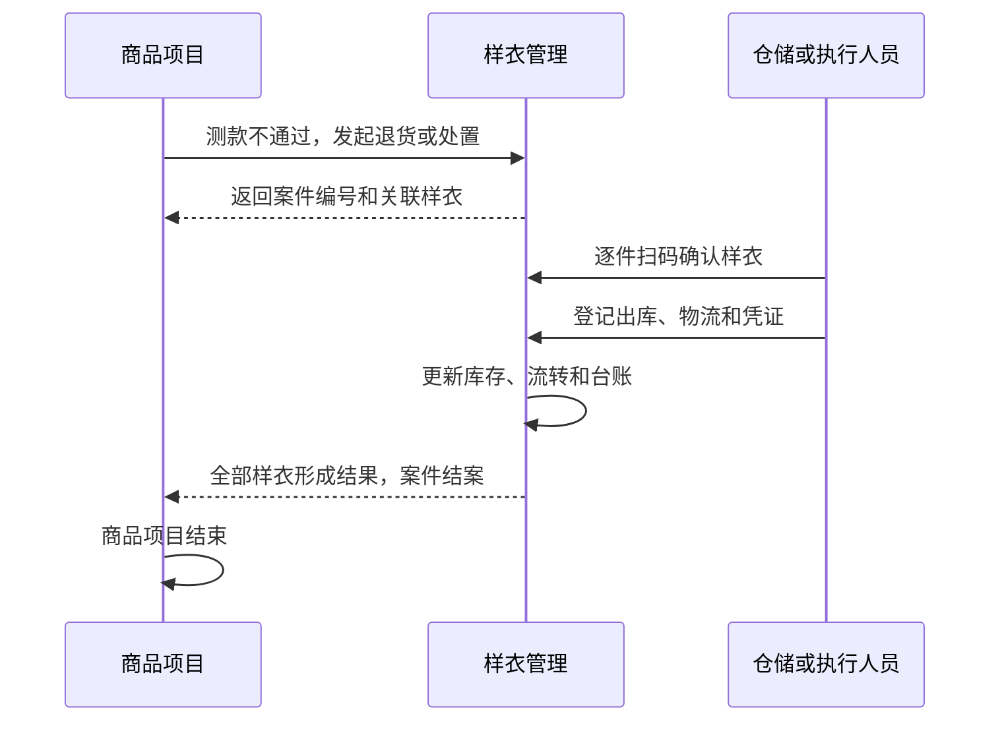

# 商品选品测款项目重构设计

## 1. 文档信息

| 项目 | 内容 |
| --- | --- |
| 设计日期 | 2026-07-13 |
| 适用系统 | PCS 商品中心系统、FCS 工厂生产协同系统、WLS 仓储物流系统 |
| 涉及模块 | 商品项目、商品档案、渠道商品、商品测款、样衣管理、工程开发与打样管理、生产准备时效 |
| 需求依据 | 2026-07-10 商品选品流程系统需求沟通会及本轮业务确认 |
| 设计目标 | 删除商品项目工作项和模板体系，将商品项目重构为轻量的选品测款业务单，并串联真实业务模块 |

## 2. 已确认的核心结论

1. 商品项目用于承载一次商品选品和测款过程，不是商品开发流程。
2. 创建商品项目时同步创建商品档案，档案初始身份为“商品测款”。
3. 创建页面采用完整商品信息表单，但不同阶段只要求填写当前动作所需信息。
4. 测款通过后，原商品档案转为“正式商品”，商品项目结束。
5. 测款不通过后进入样衣退货或处置；全部关联样衣形成结果后，商品项目结束。
6. 暂保留表示推迟最终判断，等待复判日期，不自动发起下一轮测款。
7. 商品开发独立存在，不是商品测款的阶段，也不影响商品项目是否结束。
8. 商品达到做大货条件后，才生成生产准备时效记录。
9. 生产准备时效与工程开发及打样管理串联，样衣采购和退货与样衣管理串联。
10. 一件样衣一个唯一码，必须逐件追踪使用、流转、归还、退货和处置。
11. 删除商品项目工作项库、商品项目模板管理及其对应页面、路由、配置和运行时代码。

## 3. 设计原则

### 3.1 真实业务对象是唯一事实来源

商品项目不再用通用工作项节点重复表达样衣、测款、退货、工程任务和生产准备状态。各专业模块负责维护自己的正式业务对象，商品项目只负责触发、关联、展示结果和判断是否闭环。

### 3.2 专业模块执行，上游模块协同

- 商品项目触发并关联样衣、渠道商品、测款和退货事实。
- 生产准备时效确认本次需要准备的内容、责任和时限。
- 工程开发与打样管理执行改版、制版、花型、首版样衣和首单样衣任务。
- 样衣管理执行样衣采购跟踪、到货、库存、使用、流转、退货和处置。

### 3.3 印尼工厂现场设计约束

面向仓储和现场执行人员的操作遵循：少读、少想、少算、少选、少填、系统多判断、主管可兜底。样衣收货、流转和退货优先扫码；数量差异由系统计算；扫错对象、重复扫码和状态不允许时必须阻断并给出明确动作。

## 4. 总体业务架构



## 5. 商品项目对象边界

### 5.1 商品项目负责

- 记录本次选品测款的来源、负责人、目标渠道和业务状态。
- 关联同一商品档案。
- 关联样衣采购、样衣资产、渠道商品、测款记录和退货案件。
- 记录通过、不通过或暂保留的判断历史。
- 根据真实业务事实判断项目是否结束。

### 5.2 商品项目不负责

- 配置项目模板。
- 配置或运行通用工作项。
- 生成项目阶段和节点。
- 管理制版、花型、技术包和样衣开发任务。
- 用节点完成状态替代真实业务状态。
- 在项目内重复保存样衣库存、退货或工程任务的正式结果。

### 5.3 商品项目状态

商品项目只保留以下业务状态：

- 测款准备中。
- 测款中。
- 暂保留。
- 不通过待退货。
- 已结束。



## 6. 商品档案与完整商品表单

### 6.1 同步创建

创建商品项目和创建商品档案属于同一次业务动作。任一对象创建失败时，两个对象均不能成立，避免出现孤立项目或孤立档案。

### 6.2 档案身份

- 创建时：商品测款。
- 测款通过：正式商品。
- 测款不通过：测款淘汰。

测款通过不重新生成商品档案，只更新原档案身份。测款淘汰档案继续保留图片、样衣、渠道商品、测款记录和退货结果。

### 6.3 分阶段完整度

完整商品表单覆盖商品长期需要的全部字段，但创建时只强制填写测款准备所需字段。

创建时必填：

- 商品标题。
- 主图。
- 品类。
- 颜色。
- 尺码。
- 商品来源。
- 负责人。
- 目标渠道。

后续可持续补充：

- 采购信息。
- 样衣信息。
- 价格和核价信息。
- 材质。
- BOM。
- 工艺。
- 销售文案。
- 渠道资料。
- 技术包及相关生产资料。

页面展示“已填写、待完善、待确认”，不再展示工作项完成比例。

## 7. 测款判断规则

### 7.1 通过

- 保存判断人、判断时间和说明。
- 商品档案转为正式商品。
- 保留全部测款事实。
- 商品项目结束。
- 不自动创建商品开发任务。
- 不立即生成生产准备记录。

### 7.2 不通过

- 保存判断人、判断时间和说明。
- 下架或作废相关渠道商品。
- 商品档案标记为测款淘汰。
- 在样衣管理中生成退货或处置案件。
- 全部关联样衣逐件形成结果后，商品项目结束。

### 7.3 暂保留

- 表示当前推迟最终判断，不代表发起下一轮测款。
- 记录暂保留原因、决定人、决定时间和预计复判日期。
- 到达复判日期后提醒负责人重新判断。
- 复判结果仍为通过、不通过或继续暂保留。
- 再次暂保留时更新复判日期并保留历次判断记录。
- 暂保留期间商品项目不结束，也不能进入生产准备。

## 8. 样衣采购与样衣管理串联

### 8.1 模块职责

商品项目提出样衣需求；采购团队执行采购；样衣管理从采购单形成起跟踪采购、物流、到货、库存和后续流转。



### 8.2 一件样衣一个唯一码

同一 SKU 采购多件时，每件生成不同的样衣唯一码。SKU 表示商品规格，样衣唯一码表示具体实物，采购单号表示实物来源。

每件样衣必须关联：

- 商品项目。
- 商品档案。
- SPU 和 SKU。
- 采购单和采购明细。
- 当前责任站点和库位。
- 当前持有人和用途。
- 测款使用记录。
- 借用、预占、调拨、归还记录。
- 深圳与雅加达之间的寄递记录。
- 退货案件和最终处置结果。

### 8.3 条码生成与打印

- 条码由 HiGood 系统生成，不由供应商生成。
- 采购单确认并形成采购 SKU 明细后，按计划采购数量预生成唯一码。
- 采购单提供打印入口，每件打印不同条码。
- 样衣到货后逐件贴码并扫码激活。
- 计划多于实际到货时，未激活条码标记为未到货或取消。
- 实际到货超出计划时，为多到实物补生成新的唯一码。
- 条码损坏时补打原唯一码，不能生成新的样衣身份。

### 8.4 现场防错

- 重复扫码时提示样衣已入库，并展示当前位置和操作人。
- 扫错采购单或样衣时阻断并说明应扫描对象。
- 数量差异由系统计算并交主管确认。
- 一线人员不能自行改变最终处置方式。

## 9. 样衣退货与项目结束串联

测款不通过后，商品项目在样衣管理中创建正式退货或处置案件。



退货案件必须记录：

- 每件样衣唯一码。
- 退回或处置方式。
- 退回目标。
- 出库和物流信息。
- 快递公司和单号。
- 物流凭证。
- 签收结果。
- 操作人和完成时间。
- 差异和异常处理结果。

商品项目不能由买手手工勾选退货完成，只读取样衣管理案件结案结果。

## 10. 商品开发边界

商品开发是独立业务，可以由以下场景发起：

- 改版设计。
- 既有商品二次开发。
- 制版或花型开发。
- 技术包完善。
- 工艺调整。
- 样衣开发。

商品开发可以引用商品档案、商品项目、测款图片和测款判断，但不作为商品测款阶段，不由测款通过自动创建，也不影响商品项目是否结束。

## 11. 生产准备时效与工程开发及打样管理串联

### 11.1 入口

生产准备时效的唯一入口是商品达到做大货条件。达到做大货条件可以来自销量达到阈值、基础款授权人员直接判断或其他明确的人工加入原因。

测款通过只表示商品成为正式商品，不等于立即进入生产准备。

### 11.2 职责分工

生产准备时效负责：

- 确认本次需要准备的内容。
- 确定责任团队和计划时间。
- 监控卡点和超时。
- 汇总专业模块的正式产出。
- 判断本次生产准备是否完成。

工程开发与打样管理负责：

- 改版任务。
- 制版任务。
- 花型任务。
- 首版样衣任务。
- 首单样衣任务。
- 打样过程和结果确认。
- 技术包、纸样、花型和样衣等正式产出。

### 11.3 准备项与专业任务映射

| 生产准备内容 | 专业业务对象 |
| --- | --- |
| 梭织基码纸样 | 制版任务及纸样结果 |
| 毛织基码纸样 | 毛织制版或打样任务及结果 |
| 版衣制作 | 首版样衣任务 |
| 齐码纸样 | 制版任务的放码结果 |
| 花型资料 | 花型任务及确认版本 |
| 首单确认 | 首单样衣任务及确认结果 |

生产准备时效只展示正式任务编号、责任人、计划时间、状态、实际完成时间、产出和异常。操作跳转到工程开发与打样管理执行，不能在两个模块分别上传同一结果。

生产准备只等待本次选中的具体任务和产出，不等待整个工程开发模块全部完成。

## 12. 模块关联模型

不建立新的通用流程引擎，各对象通过明确业务关联串联。

| 对象 | 必须关联 |
| --- | --- |
| 商品项目 | 商品档案编号 |
| 样衣采购需求 | 商品项目、商品档案 |
| 样衣资产 | 商品项目、商品档案、SKU、采购单 |
| 测款记录 | 商品项目、商品档案、渠道商品 |
| 退货案件 | 商品项目、商品档案、具体样衣唯一码 |
| 工程开发任务 | 商品档案、触发来源 |
| 生产准备记录 | 商品档案、做大货事实 |
| 生产准备项 | 对应工程任务或其他专业业务对象 |

原 `projectNodeId`、`workItemTypeCode`、阶段编号和模板编号不再作为模块间正式关系字段。需要说明来源时，保存来源业务类型、来源业务编号和必要快照。

专业模块是状态和产出的唯一事实来源。上游只保存关联编号和展示快照；任务取消、返工、替换或产出失效时，上游必须同步显示真实异常。

## 13. 页面信息架构

### 13.1 商品项目列表

列表展示：

- 商品。
- 商品档案身份。
- 样衣准备情况。
- 渠道上架情况。
- 测款状态。
- 复判日期。
- 退货进度。
- 项目结果。

### 13.2 商品项目详情

```text
商品与项目概览
商品资料完整度
样衣采购及一物一码
渠道商品
测款记录
判断历史
退货或处置
关联商品开发
关联生产准备
```

页面不再展示项目阶段时间轴、工作项卡片、节点状态和工作项完成比例。

### 13.3 现场样衣页面

面向仓储和一线人员的样衣页面突出：

- 当前要处理的样衣。
- 商品图片、颜色和尺码。
- 样衣唯一码。
- 当前站点和库位。
- 当前主动作。
- 扫码结果。
- 数量和差异。
- 异常上报和主管兜底入口。

## 14. 删除范围

### 14.1 删除功能

- 商品项目工作项库。
- 商品项目模板管理。
- 商品项目阶段和节点。
- 工作项实例和节点正式记录。
- 工作项字段、状态、操作和能力配置。
- 节点解锁、前置顺序、回退、进度和待决策机制。
- 商品项目工作项详情和节点操作日志。

### 14.2 删除代码入口

- `/pcs/work-items` 及动态详情路由。
- `/pcs/templates`、新建、编辑和动态详情路由。
- 对应菜单、渲染器和事件处理器。
- 工作项配置目录和定义仓储。
- 项目模板仓储、页面和编辑逻辑。
- 项目阶段、节点和实例运行时。
- 仅服务旧工作项体系的 Mock、测试和检查逻辑。

不保留隐藏入口、旧页面重定向、兼容配置或双轨运行时。

### 14.3 保留并重构的业务模块

- 商品项目。
- 商品档案。
- 样衣管理。
- 渠道商品。
- 直播测款和短视频关联。
- 商品开发。
- 工程开发与打样管理。
- 生产准备时效。

## 15. 异常与闭环规则

### 15.1 样衣异常

样衣管理承接少到、错到、破损、位置不明、退货数量不一致、物流缺失、供应商拒收、物流未签收和无法退回等异常。退货案件只有在全部样衣形成明确结果后才能结案。

### 15.2 工程任务异常

工程开发与打样管理承接任务不受理、资料不完整、任务取消、返工、首版不通过、首单需改版或补做、产出失效等异常。生产准备时效展示正式卡点和责任，不允许人工绕过专业任务将准备项勾选完成。

### 15.3 禁止状态

- 暂保留商品进入生产准备。
- 测款淘汰商品进入生产准备。
- 样衣退货未结案但商品项目显示已结束。
- 工程任务未完成但生产准备显示已完成。
- 旧版本产出失效后仍计入准备完成。
- 两个模块分别维护同一专业任务的完成结果。

## 16. 验收标准

### 16.1 商品项目和档案

- 创建商品项目时同步创建商品测款档案。
- 页面不再出现阶段、节点、模板、工作项和节点完成比例。
- 暂保留只进入等待复判，不自动创建新测款。
- 通过后档案转正式商品且项目结束。
- 不通过后等待全部样衣处置完成再结束。

### 16.2 样衣管理

- 同一 SKU 采购多件时，每件生成不同唯一码。
- 每件样衣可追溯商品、项目、采购单、位置、持有人和完整流转记录。
- 到货逐件扫码激活。
- 借用、测款、调拨、归还、退货和处置写入单件台账。
- 条码损坏只能补打原唯一码。
- 退货逐件形成结果。

### 16.3 工程开发和生产准备

- 达到做大货条件后才生成生产准备记录。
- 工程类准备项创建或关联正式工程任务。
- 生产准备不重复保存专业任务结果。
- 工程任务完成、返工、取消和产出失效能正确反映到生产准备。
- 删除商品项目工作项时不误删生产准备自身的责任协同能力。

### 16.4 页面和代码

- `/pcs/work-items` 和 `/pcs/templates` 不再存在。
- 菜单、路由、渲染器、事件和数据配置不存在残留引用。
- 构建通过，不出现失效导入和空白页。
- 商品项目、档案、样衣、工程开发、测款和生产准备路由可达。
- 列表保留分页。
- 输入不触发整页重绘，轻交互响应不高于 200ms。
- 新增原型审查记录并通过设计治理检查。
- 完成后进行本地浏览器全链路验证。

## 17. 非目标

- 不引入真实后端、审批流、权限系统或数据库。
- 不引入新的通用流程引擎、状态管理框架或复杂关系平台。
- 不把页面迁移到 React。
- 不重构与本次商品项目、样衣、工程任务和生产准备串联无关的模块。
- 不在首版支持兼容旧工作项运行时。

